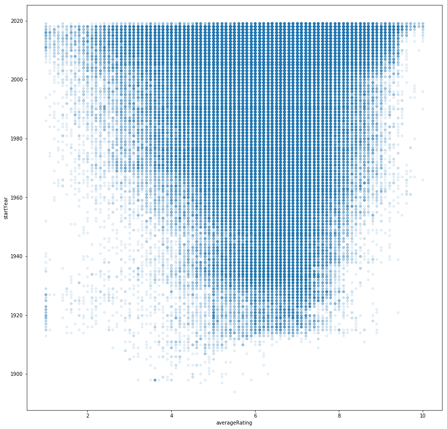

```python
file_path = !pwd  #%cd%
print(file_path)
```

    ['/home/jujubinha/opensubtitle']


```python
import pandas as pd
pd.set_option('display.max_columns', 500)

import numpy as np
import requests
import base64
import gzip
```


```python
for dataset in ['basics','ratings']: #,'akas']:
    raw_data = requests.get('https://datasets.imdbws.com/title.'+dataset+'.tsv.gz')
    with open(dataset+'.gz', 'wb+') as file:
        file.write(raw_data.content)
    df = pd.read_csv(dataset+'.gz', compression='gzip', sep=r'\t', engine='python')
    df.to_pickle(dataset+'.pickle')
```


```python
basics = pd.read_pickle('basics.pickle')
ratings = pd.read_pickle('ratings.pickle')
#akas = pd.read_pickle('akas.pickle')
```


```python
basics.head()
```


<div>
<style scoped>
    .dataframe tbody tr th:only-of-type {
        vertical-align: middle;
    }

    .dataframe tbody tr th {
        vertical-align: top;
    }

    .dataframe thead th {
        text-align: right;
    }
</style>
<table border="1" class="dataframe">
  <thead>
    <tr style="text-align: right;">
      <th></th>
      <th>tconst</th>
      <th>titleType</th>
      <th>primaryTitle</th>
      <th>originalTitle</th>
      <th>isAdult</th>
      <th>startYear</th>
      <th>endYear</th>
      <th>runtimeMinutes</th>
      <th>genres</th>
    </tr>
  </thead>
  <tbody>
    <tr>
      <th>0</th>
      <td>tt0000001</td>
      <td>short</td>
      <td>Carmencita</td>
      <td>Carmencita</td>
      <td>0</td>
      <td>1894</td>
      <td>\N</td>
      <td>1</td>
      <td>Documentary,Short</td>
    </tr>
    <tr>
      <th>1</th>
      <td>tt0000002</td>
      <td>short</td>
      <td>Le clown et ses chiens</td>
      <td>Le clown et ses chiens</td>
      <td>0</td>
      <td>1892</td>
      <td>\N</td>
      <td>5</td>
      <td>Animation,Short</td>
    </tr>
    <tr>
      <th>2</th>
      <td>tt0000003</td>
      <td>short</td>
      <td>Pauvre Pierrot</td>
      <td>Pauvre Pierrot</td>
      <td>0</td>
      <td>1892</td>
      <td>\N</td>
      <td>4</td>
      <td>Animation,Comedy,Romance</td>
    </tr>
    <tr>
      <th>3</th>
      <td>tt0000004</td>
      <td>short</td>
      <td>Un bon bock</td>
      <td>Un bon bock</td>
      <td>0</td>
      <td>1892</td>
      <td>\N</td>
      <td>\N</td>
      <td>Animation,Short</td>
    </tr>
    <tr>
      <th>4</th>
      <td>tt0000005</td>
      <td>short</td>
      <td>Blacksmith Scene</td>
      <td>Blacksmith Scene</td>
      <td>0</td>
      <td>1893</td>
      <td>\N</td>
      <td>1</td>
      <td>Comedy,Short</td>
    </tr>
  </tbody>
</table>
</div>


```python
ratings.head()
```


<div>
<style scoped>
    .dataframe tbody tr th:only-of-type {
        vertical-align: middle;
    }

    .dataframe tbody tr th {
        vertical-align: top;
    }

    .dataframe thead th {
        text-align: right;
    }
</style>
<table border="1" class="dataframe">
  <thead>
    <tr style="text-align: right;">
      <th></th>
      <th>tconst</th>
      <th>averageRating</th>
      <th>numVotes</th>
    </tr>
  </thead>
  <tbody>
    <tr>
      <th>0</th>
      <td>tt0000001</td>
      <td>5.8</td>
      <td>1486</td>
    </tr>
    <tr>
      <th>1</th>
      <td>tt0000002</td>
      <td>6.4</td>
      <td>179</td>
    </tr>
    <tr>
      <th>2</th>
      <td>tt0000003</td>
      <td>6.6</td>
      <td>1119</td>
    </tr>
    <tr>
      <th>3</th>
      <td>tt0000004</td>
      <td>6.4</td>
      <td>109</td>
    </tr>
    <tr>
      <th>4</th>
      <td>tt0000005</td>
      <td>6.2</td>
      <td>1822</td>
    </tr>
  </tbody>
</table>
</div>


```python
final = pd.merge(basics,ratings, on='tconst')
```


```python
final.plot.scatter('averageRating','numVotes',alpha=0.1, figsize=(15,15))
```


    <matplotlib.axes._subplots.AxesSubplot at 0x7f41f8829710>


```python
final.dtypes
```


    tconst             object
    titleType          object
    primaryTitle       object
    originalTitle      object
    isAdult             int64
    startYear          object
    endYear            object
    runtimeMinutes     object
    genres             object
    averageRating     float64
    numVotes            int64
    dtype: object


```python
#final['genres'] = final['genres'].str.split(',')
```


```python
final.titleType.unique()
```


    array(['short', 'movie', 'tvMovie', 'tvSeries', 'tvEpisode', 'tvShort',
           'tvMiniSeries', 'tvSpecial', 'video', 'videoGame'], dtype=object)


```python
def arruma(series):
    return pd.to_numeric(series, errors='coerse', downcast ='integer') #.fillna(0).astype(int).replace(0,'')
```


```python
final['isAdult'] = final['isAdult'].astype(bool)
final['runtimeMinutes'] = arruma(final['runtimeMinutes'])
final['startYear'] = arruma(final['startYear'])
final['endYear'] = arruma(final['endYear'])
```


```python
final.to_pickle('final.pickle')
final.dtypes
```


    tconst             object
    titleType          object
    primaryTitle       object
    originalTitle      object
    isAdult              bool
    startYear         float64
    endYear           float64
    runtimeMinutes    float64
    genres             object
    averageRating     float64
    numVotes            int64
    dtype: object


```python
final
```


<div>
<style scoped>
    .dataframe tbody tr th:only-of-type {
        vertical-align: middle;
    }

    .dataframe tbody tr th {
        vertical-align: top;
    }

    .dataframe thead th {
        text-align: right;
    }
</style>
<table border="1" class="dataframe">
  <thead>
    <tr style="text-align: right;">
      <th></th>
      <th>tconst</th>
      <th>titleType</th>
      <th>primaryTitle</th>
      <th>originalTitle</th>
      <th>isAdult</th>
      <th>startYear</th>
      <th>endYear</th>
      <th>runtimeMinutes</th>
      <th>genres</th>
      <th>averageRating</th>
      <th>numVotes</th>
    </tr>
  </thead>
  <tbody>
    <tr>
      <th>0</th>
      <td>tt0000001</td>
      <td>short</td>
      <td>Carmencita</td>
      <td>Carmencita</td>
      <td>False</td>
      <td>1894.0</td>
      <td>NaN</td>
      <td>1.0</td>
      <td>Documentary,Short</td>
      <td>5.8</td>
      <td>1486</td>
    </tr>
    <tr>
      <th>1</th>
      <td>tt0000002</td>
      <td>short</td>
      <td>Le clown et ses chiens</td>
      <td>Le clown et ses chiens</td>
      <td>False</td>
      <td>1892.0</td>
      <td>NaN</td>
      <td>5.0</td>
      <td>Animation,Short</td>
      <td>6.4</td>
      <td>179</td>
    </tr>
    <tr>
      <th>2</th>
      <td>tt0000003</td>
      <td>short</td>
      <td>Pauvre Pierrot</td>
      <td>Pauvre Pierrot</td>
      <td>False</td>
      <td>1892.0</td>
      <td>NaN</td>
      <td>4.0</td>
      <td>Animation,Comedy,Romance</td>
      <td>6.6</td>
      <td>1119</td>
    </tr>
    <tr>
      <th>3</th>
      <td>tt0000004</td>
      <td>short</td>
      <td>Un bon bock</td>
      <td>Un bon bock</td>
      <td>False</td>
      <td>1892.0</td>
      <td>NaN</td>
      <td>NaN</td>
      <td>Animation,Short</td>
      <td>6.4</td>
      <td>109</td>
    </tr>
    <tr>
      <th>4</th>
      <td>tt0000005</td>
      <td>short</td>
      <td>Blacksmith Scene</td>
      <td>Blacksmith Scene</td>
      <td>False</td>
      <td>1893.0</td>
      <td>NaN</td>
      <td>1.0</td>
      <td>Comedy,Short</td>
      <td>6.2</td>
      <td>1822</td>
    </tr>
    <tr>
      <th>5</th>
      <td>tt0000006</td>
      <td>short</td>
      <td>Chinese Opium Den</td>
      <td>Chinese Opium Den</td>
      <td>False</td>
      <td>1894.0</td>
      <td>NaN</td>
      <td>1.0</td>
      <td>Short</td>
      <td>5.6</td>
      <td>96</td>
    </tr>
    <tr>
      <th>6</th>
      <td>tt0000007</td>
      <td>short</td>
      <td>Corbett and Courtney Before the Kinetograph</td>
      <td>Corbett and Courtney Before the Kinetograph</td>
      <td>False</td>
      <td>1894.0</td>
      <td>NaN</td>
      <td>1.0</td>
      <td>Short,Sport</td>
      <td>5.5</td>
      <td>596</td>
    </tr>
    <tr>
      <th>7</th>
      <td>tt0000008</td>
      <td>short</td>
      <td>Edison Kinetoscopic Record of a Sneeze</td>
      <td>Edison Kinetoscopic Record of a Sneeze</td>
      <td>False</td>
      <td>1894.0</td>
      <td>NaN</td>
      <td>1.0</td>
      <td>Documentary,Short</td>
      <td>5.6</td>
      <td>1587</td>
    </tr>
    <tr>
      <th>8</th>
      <td>tt0000009</td>
      <td>movie</td>
      <td>Miss Jerry</td>
      <td>Miss Jerry</td>
      <td>False</td>
      <td>1894.0</td>
      <td>NaN</td>
      <td>45.0</td>
      <td>Romance</td>
      <td>5.5</td>
      <td>77</td>
    </tr>
    <tr>
      <th>9</th>
      <td>tt0000010</td>
      <td>short</td>
      <td>Exiting the Factory</td>
      <td>La sortie de l'usine Lumière à Lyon</td>
      <td>False</td>
      <td>1895.0</td>
      <td>NaN</td>
      <td>1.0</td>
      <td>Documentary,Short</td>
      <td>6.9</td>
      <td>5287</td>
    </tr>
    <tr>
      <th>10</th>
      <td>tt0000011</td>
      <td>short</td>
      <td>Akrobatisches Potpourri</td>
      <td>Akrobatisches Potpourri</td>
      <td>False</td>
      <td>1895.0</td>
      <td>NaN</td>
      <td>1.0</td>
      <td>Documentary,Short</td>
      <td>5.4</td>
      <td>220</td>
    </tr>
    <tr>
      <th>11</th>
      <td>tt0000012</td>
      <td>short</td>
      <td>The Arrival of a Train</td>
      <td>L'arrivée d'un train à La Ciotat</td>
      <td>False</td>
      <td>1896.0</td>
      <td>NaN</td>
      <td>1.0</td>
      <td>Documentary,Short</td>
      <td>7.4</td>
      <td>8961</td>
    </tr>
    <tr>
      <th>12</th>
      <td>tt0000013</td>
      <td>short</td>
      <td>The Photographical Congress Arrives in Lyon</td>
      <td>Neuville-sur-Saône: Débarquement du congrès de...</td>
      <td>False</td>
      <td>1895.0</td>
      <td>NaN</td>
      <td>1.0</td>
      <td>Documentary,Short</td>
      <td>5.8</td>
      <td>1374</td>
    </tr>
    <tr>
      <th>13</th>
      <td>tt0000014</td>
      <td>short</td>
      <td>The Sprinkler Sprinkled</td>
      <td>L'arroseur arrosé</td>
      <td>False</td>
      <td>1895.0</td>
      <td>NaN</td>
      <td>1.0</td>
      <td>Comedy,Short</td>
      <td>7.2</td>
      <td>3901</td>
    </tr>
    <tr>
      <th>14</th>
      <td>tt0000015</td>
      <td>short</td>
      <td>Autour d'une cabine</td>
      <td>Autour d'une cabine</td>
      <td>False</td>
      <td>1894.0</td>
      <td>NaN</td>
      <td>2.0</td>
      <td>Animation,Short</td>
      <td>6.2</td>
      <td>694</td>
    </tr>
    <tr>
      <th>15</th>
      <td>tt0000016</td>
      <td>short</td>
      <td>Barque sortant du port</td>
      <td>Barque sortant du port</td>
      <td>False</td>
      <td>1895.0</td>
      <td>NaN</td>
      <td>1.0</td>
      <td>Documentary,Short</td>
      <td>5.9</td>
      <td>1019</td>
    </tr>
    <tr>
      <th>16</th>
      <td>tt0000017</td>
      <td>short</td>
      <td>Italienischer Bauerntanz</td>
      <td>Italienischer Bauerntanz</td>
      <td>False</td>
      <td>1895.0</td>
      <td>NaN</td>
      <td>1.0</td>
      <td>Documentary,Short</td>
      <td>4.8</td>
      <td>202</td>
    </tr>
    <tr>
      <th>17</th>
      <td>tt0000018</td>
      <td>short</td>
      <td>Das boxende Känguruh</td>
      <td>Das boxende Känguruh</td>
      <td>False</td>
      <td>1895.0</td>
      <td>NaN</td>
      <td>1.0</td>
      <td>Short</td>
      <td>5.5</td>
      <td>424</td>
    </tr>
    <tr>
      <th>18</th>
      <td>tt0000019</td>
      <td>short</td>
      <td>The Clown Barber</td>
      <td>The Clown Barber</td>
      <td>False</td>
      <td>1898.0</td>
      <td>NaN</td>
      <td>NaN</td>
      <td>Comedy,Short</td>
      <td>6.6</td>
      <td>13</td>
    </tr>
    <tr>
      <th>19</th>
      <td>tt0000020</td>
      <td>short</td>
      <td>The Derby 1895</td>
      <td>The Derby 1895</td>
      <td>False</td>
      <td>1895.0</td>
      <td>NaN</td>
      <td>1.0</td>
      <td>Documentary,Short,Sport</td>
      <td>5.1</td>
      <td>233</td>
    </tr>
    <tr>
      <th>20</th>
      <td>tt0000022</td>
      <td>short</td>
      <td>Blacksmith Scene</td>
      <td>Les forgerons</td>
      <td>False</td>
      <td>1895.0</td>
      <td>NaN</td>
      <td>1.0</td>
      <td>Documentary,Short</td>
      <td>5.2</td>
      <td>766</td>
    </tr>
    <tr>
      <th>21</th>
      <td>tt0000023</td>
      <td>short</td>
      <td>The Sea</td>
      <td>Baignade en mer</td>
      <td>False</td>
      <td>1895.0</td>
      <td>NaN</td>
      <td>1.0</td>
      <td>Documentary,Short</td>
      <td>5.7</td>
      <td>971</td>
    </tr>
    <tr>
      <th>22</th>
      <td>tt0000024</td>
      <td>short</td>
      <td>Opening of the Kiel Canal</td>
      <td>Opening of the Kiel Canal</td>
      <td>False</td>
      <td>1895.0</td>
      <td>NaN</td>
      <td>NaN</td>
      <td>News,Short</td>
      <td>5.8</td>
      <td>21</td>
    </tr>
    <tr>
      <th>23</th>
      <td>tt0000025</td>
      <td>short</td>
      <td>The Oxford and Cambridge University Boat Race</td>
      <td>The Oxford and Cambridge University Boat Race</td>
      <td>False</td>
      <td>1895.0</td>
      <td>NaN</td>
      <td>NaN</td>
      <td>News,Short,Sport</td>
      <td>4.8</td>
      <td>19</td>
    </tr>
    <tr>
      <th>24</th>
      <td>tt0000026</td>
      <td>short</td>
      <td>The Messers. Lumière at Cards</td>
      <td>Partie d'écarté</td>
      <td>False</td>
      <td>1896.0</td>
      <td>NaN</td>
      <td>1.0</td>
      <td>Documentary,Short</td>
      <td>5.7</td>
      <td>1173</td>
    </tr>
    <tr>
      <th>25</th>
      <td>tt0000027</td>
      <td>short</td>
      <td>Cordeliers' Square in Lyon</td>
      <td>Place des Cordeliers à Lyon</td>
      <td>False</td>
      <td>1895.0</td>
      <td>NaN</td>
      <td>1.0</td>
      <td>Documentary,Short</td>
      <td>5.6</td>
      <td>801</td>
    </tr>
    <tr>
      <th>26</th>
      <td>tt0000028</td>
      <td>short</td>
      <td>Fishing for Goldfish</td>
      <td>La pêche aux poissons rouges</td>
      <td>False</td>
      <td>1895.0</td>
      <td>NaN</td>
      <td>1.0</td>
      <td>Documentary,Short</td>
      <td>5.2</td>
      <td>729</td>
    </tr>
    <tr>
      <th>27</th>
      <td>tt0000029</td>
      <td>short</td>
      <td>Baby's Dinner</td>
      <td>Repas de bébé</td>
      <td>False</td>
      <td>1895.0</td>
      <td>NaN</td>
      <td>1.0</td>
      <td>Documentary,Short</td>
      <td>5.9</td>
      <td>2531</td>
    </tr>
    <tr>
      <th>28</th>
      <td>tt0000030</td>
      <td>short</td>
      <td>Rough Sea at Dover</td>
      <td>Rough Sea at Dover</td>
      <td>False</td>
      <td>1895.0</td>
      <td>NaN</td>
      <td>1.0</td>
      <td>Documentary,Short</td>
      <td>5.3</td>
      <td>618</td>
    </tr>
    <tr>
      <th>29</th>
      <td>tt0000031</td>
      <td>short</td>
      <td>Jumping the Blanket</td>
      <td>Le saut à la couverture</td>
      <td>False</td>
      <td>1895.0</td>
      <td>NaN</td>
      <td>1.0</td>
      <td>Documentary,Short</td>
      <td>5.6</td>
      <td>710</td>
    </tr>
    <tr>
      <th>...</th>
      <td>...</td>
      <td>...</td>
      <td>...</td>
      <td>...</td>
      <td>...</td>
      <td>...</td>
      <td>...</td>
      <td>...</td>
      <td>...</td>
      <td>...</td>
      <td>...</td>
    </tr>
    <tr>
      <th>922739</th>
      <td>tt9910056</td>
      <td>tvEpisode</td>
      <td>205 (Auditions)</td>
      <td>205 (Auditions)</td>
      <td>False</td>
      <td>2019.0</td>
      <td>NaN</td>
      <td>84.0</td>
      <td>Game-Show,Music,Reality-TV</td>
      <td>6.9</td>
      <td>14</td>
    </tr>
    <tr>
      <th>922740</th>
      <td>tt9910118</td>
      <td>tvEpisode</td>
      <td>Episode #7.4</td>
      <td>Episode #7.4</td>
      <td>False</td>
      <td>2019.0</td>
      <td>NaN</td>
      <td>NaN</td>
      <td>Reality-TV</td>
      <td>7.4</td>
      <td>10</td>
    </tr>
    <tr>
      <th>922741</th>
      <td>tt9910120</td>
      <td>tvEpisode</td>
      <td>Episode #7.5</td>
      <td>Episode #7.5</td>
      <td>False</td>
      <td>2019.0</td>
      <td>NaN</td>
      <td>NaN</td>
      <td>Reality-TV</td>
      <td>7.4</td>
      <td>8</td>
    </tr>
    <tr>
      <th>922742</th>
      <td>tt9910122</td>
      <td>tvEpisode</td>
      <td>Episode #7.6</td>
      <td>Episode #7.6</td>
      <td>False</td>
      <td>2019.0</td>
      <td>NaN</td>
      <td>NaN</td>
      <td>Reality-TV</td>
      <td>6.9</td>
      <td>8</td>
    </tr>
    <tr>
      <th>922743</th>
      <td>tt9910124</td>
      <td>tvEpisode</td>
      <td>Episode #7.7</td>
      <td>Episode #7.7</td>
      <td>False</td>
      <td>2019.0</td>
      <td>NaN</td>
      <td>NaN</td>
      <td>Reality-TV</td>
      <td>7.1</td>
      <td>8</td>
    </tr>
    <tr>
      <th>922744</th>
      <td>tt9910506</td>
      <td>short</td>
      <td>Bulanti</td>
      <td>Bulanti</td>
      <td>False</td>
      <td>2017.0</td>
      <td>NaN</td>
      <td>7.0</td>
      <td>Short</td>
      <td>8.7</td>
      <td>7</td>
    </tr>
    <tr>
      <th>922745</th>
      <td>tt9910572</td>
      <td>tvEpisode</td>
      <td>Jûgo to juin</td>
      <td>Jûgo to juin</td>
      <td>False</td>
      <td>2019.0</td>
      <td>NaN</td>
      <td>NaN</td>
      <td>Action,Adventure,Animation</td>
      <td>8.3</td>
      <td>19</td>
    </tr>
    <tr>
      <th>922746</th>
      <td>tt9910728</td>
      <td>tvSeries</td>
      <td>Zalim Istanbul</td>
      <td>Zalim Istanbul</td>
      <td>False</td>
      <td>2019.0</td>
      <td>NaN</td>
      <td>120.0</td>
      <td>Drama</td>
      <td>8.9</td>
      <td>7</td>
    </tr>
    <tr>
      <th>922747</th>
      <td>tt9911774</td>
      <td>movie</td>
      <td>Padmavyuhathile Abhimanyu</td>
      <td>Padmavyuhathile Abhimanyu</td>
      <td>False</td>
      <td>2019.0</td>
      <td>NaN</td>
      <td>130.0</td>
      <td>Drama</td>
      <td>8.5</td>
      <td>363</td>
    </tr>
    <tr>
      <th>922748</th>
      <td>tt9913056</td>
      <td>movie</td>
      <td>Swarm Season</td>
      <td>Swarm Season</td>
      <td>False</td>
      <td>2019.0</td>
      <td>NaN</td>
      <td>86.0</td>
      <td>Documentary</td>
      <td>6.2</td>
      <td>5</td>
    </tr>
    <tr>
      <th>922749</th>
      <td>tt9913084</td>
      <td>movie</td>
      <td>Diabolik sono io</td>
      <td>Diabolik sono io</td>
      <td>False</td>
      <td>2019.0</td>
      <td>NaN</td>
      <td>75.0</td>
      <td>Documentary</td>
      <td>6.2</td>
      <td>6</td>
    </tr>
    <tr>
      <th>922750</th>
      <td>tt9913544</td>
      <td>tvMovie</td>
      <td>Un Américain nommé Kazan</td>
      <td>Un Américain nommé Kazan</td>
      <td>False</td>
      <td>2018.0</td>
      <td>NaN</td>
      <td>53.0</td>
      <td>Biography,Documentary</td>
      <td>6.6</td>
      <td>5</td>
    </tr>
    <tr>
      <th>922751</th>
      <td>tt9914120</td>
      <td>tvEpisode</td>
      <td>Episode #1.2</td>
      <td>Episode #1.2</td>
      <td>False</td>
      <td>2019.0</td>
      <td>NaN</td>
      <td>NaN</td>
      <td>Biography,Drama,History</td>
      <td>7.0</td>
      <td>9</td>
    </tr>
    <tr>
      <th>922752</th>
      <td>tt9914156</td>
      <td>tvEpisode</td>
      <td>Triple Frontier</td>
      <td>Triple Frontier</td>
      <td>False</td>
      <td>2019.0</td>
      <td>NaN</td>
      <td>NaN</td>
      <td>Talk-Show</td>
      <td>6.4</td>
      <td>132</td>
    </tr>
    <tr>
      <th>922753</th>
      <td>tt9914286</td>
      <td>movie</td>
      <td>Sokagin Çocuklari</td>
      <td>Sokagin Çocuklari</td>
      <td>False</td>
      <td>2019.0</td>
      <td>NaN</td>
      <td>98.0</td>
      <td>Drama,Family</td>
      <td>9.7</td>
      <td>59</td>
    </tr>
    <tr>
      <th>922754</th>
      <td>tt9914458</td>
      <td>video</td>
      <td>Alien Messiah</td>
      <td>Alien Messiah</td>
      <td>False</td>
      <td>2019.0</td>
      <td>NaN</td>
      <td>75.0</td>
      <td>Sci-Fi</td>
      <td>2.5</td>
      <td>13</td>
    </tr>
    <tr>
      <th>922755</th>
      <td>tt9914546</td>
      <td>tvSeries</td>
      <td>Moja Generacija Z</td>
      <td>Moja Generacija Z</td>
      <td>False</td>
      <td>2019.0</td>
      <td>NaN</td>
      <td>30.0</td>
      <td>Comedy</td>
      <td>3.7</td>
      <td>25</td>
    </tr>
    <tr>
      <th>922756</th>
      <td>tt9915144</td>
      <td>tvSeries</td>
      <td>Never Ever</td>
      <td>Never Ever</td>
      <td>False</td>
      <td>2018.0</td>
      <td>NaN</td>
      <td>NaN</td>
      <td>Documentary,Talk-Show</td>
      <td>10.0</td>
      <td>6</td>
    </tr>
    <tr>
      <th>922757</th>
      <td>tt9915686</td>
      <td>tvSeries</td>
      <td>Khatra Khatra Khatra</td>
      <td>Khatra Khatra Khatra</td>
      <td>False</td>
      <td>2019.0</td>
      <td>NaN</td>
      <td>NaN</td>
      <td>Reality-TV</td>
      <td>8.4</td>
      <td>14</td>
    </tr>
    <tr>
      <th>922758</th>
      <td>tt9915898</td>
      <td>tvEpisode</td>
      <td>Time for Farewell! Pudding's One Last Request!</td>
      <td>Time for Farewell! Pudding's One Last Request!</td>
      <td>False</td>
      <td>2019.0</td>
      <td>NaN</td>
      <td>NaN</td>
      <td>Action,Adventure,Animation</td>
      <td>9.1</td>
      <td>36</td>
    </tr>
    <tr>
      <th>922759</th>
      <td>tt9915906</td>
      <td>tvEpisode</td>
      <td>The World in Shock! The Fifth Emperor of the S...</td>
      <td>The World in Shock! The Fifth Emperor of the S...</td>
      <td>False</td>
      <td>2019.0</td>
      <td>NaN</td>
      <td>NaN</td>
      <td>Action,Adventure,Animation</td>
      <td>7.5</td>
      <td>23</td>
    </tr>
    <tr>
      <th>922760</th>
      <td>tt9915910</td>
      <td>tvEpisode</td>
      <td>Episode #1.34</td>
      <td>Episode #1.34</td>
      <td>False</td>
      <td>2019.0</td>
      <td>NaN</td>
      <td>NaN</td>
      <td>Comedy,Romance</td>
      <td>8.6</td>
      <td>28</td>
    </tr>
    <tr>
      <th>922761</th>
      <td>tt9916114</td>
      <td>tvEpisode</td>
      <td>Nothing But Truffle</td>
      <td>Nothing But Truffle</td>
      <td>False</td>
      <td>2019.0</td>
      <td>NaN</td>
      <td>NaN</td>
      <td>Action,Adventure,Animation</td>
      <td>6.0</td>
      <td>5</td>
    </tr>
    <tr>
      <th>922762</th>
      <td>tt9916192</td>
      <td>tvMovie</td>
      <td>Danielle Darrieux: Il est poli d'être gai!</td>
      <td>Danielle Darrieux: Il est poli d'être gai!</td>
      <td>False</td>
      <td>2019.0</td>
      <td>NaN</td>
      <td>53.0</td>
      <td>Biography</td>
      <td>7.8</td>
      <td>5</td>
    </tr>
    <tr>
      <th>922763</th>
      <td>tt9916316</td>
      <td>tvEpisode</td>
      <td>Tim Mälzer vs. Max Strohe</td>
      <td>Tim Mälzer vs. Max Strohe</td>
      <td>False</td>
      <td>2019.0</td>
      <td>NaN</td>
      <td>NaN</td>
      <td>Reality-TV</td>
      <td>8.4</td>
      <td>5</td>
    </tr>
    <tr>
      <th>922764</th>
      <td>tt9916380</td>
      <td>tvSeries</td>
      <td>Meie aasta Aafrikas</td>
      <td>Meie aasta Aafrikas</td>
      <td>False</td>
      <td>2019.0</td>
      <td>NaN</td>
      <td>43.0</td>
      <td>Adventure,Comedy,Family</td>
      <td>9.7</td>
      <td>58</td>
    </tr>
    <tr>
      <th>922765</th>
      <td>tt9916420</td>
      <td>tvEpisode</td>
      <td>Episode #21.1</td>
      <td>Episode #21.1</td>
      <td>False</td>
      <td>2019.0</td>
      <td>NaN</td>
      <td>NaN</td>
      <td>Comedy,Game-Show</td>
      <td>7.0</td>
      <td>5</td>
    </tr>
    <tr>
      <th>922766</th>
      <td>tt9916460</td>
      <td>tvMovie</td>
      <td>Pink Taxi</td>
      <td>Pink Taxi</td>
      <td>False</td>
      <td>2019.0</td>
      <td>NaN</td>
      <td>NaN</td>
      <td>Comedy</td>
      <td>9.2</td>
      <td>12</td>
    </tr>
    <tr>
      <th>922767</th>
      <td>tt9916720</td>
      <td>short</td>
      <td>The Nun 2</td>
      <td>The Nun 2</td>
      <td>False</td>
      <td>2019.0</td>
      <td>NaN</td>
      <td>10.0</td>
      <td>Horror,Short</td>
      <td>5.2</td>
      <td>11</td>
    </tr>
    <tr>
      <th>922768</th>
      <td>tt9916766</td>
      <td>tvEpisode</td>
      <td>Episode #10.15</td>
      <td>Episode #10.15</td>
      <td>False</td>
      <td>2019.0</td>
      <td>NaN</td>
      <td>43.0</td>
      <td>Family,Reality-TV</td>
      <td>7.2</td>
      <td>5</td>
    </tr>
  </tbody>
</table>
<p>922769 rows × 11 columns</p>
</div>


```python
movie = final[final.titleType == 'movie']
movie
```


<div>
<style scoped>
    .dataframe tbody tr th:only-of-type {
        vertical-align: middle;
    }

    .dataframe tbody tr th {
        vertical-align: top;
    }

    .dataframe thead th {
        text-align: right;
    }
</style>
<table border="1" class="dataframe">
  <thead>
    <tr style="text-align: right;">
      <th></th>
      <th>tconst</th>
      <th>titleType</th>
      <th>primaryTitle</th>
      <th>originalTitle</th>
      <th>isAdult</th>
      <th>startYear</th>
      <th>endYear</th>
      <th>runtimeMinutes</th>
      <th>genres</th>
      <th>averageRating</th>
      <th>numVotes</th>
    </tr>
  </thead>
  <tbody>
    <tr>
      <th>8</th>
      <td>tt0000009</td>
      <td>movie</td>
      <td>Miss Jerry</td>
      <td>Miss Jerry</td>
      <td>False</td>
      <td>1894.0</td>
      <td>NaN</td>
      <td>45.0</td>
      <td>Romance</td>
      <td>5.5</td>
      <td>77</td>
    </tr>
    <tr>
      <th>143</th>
      <td>tt0000147</td>
      <td>movie</td>
      <td>The Corbett-Fitzsimmons Fight</td>
      <td>The Corbett-Fitzsimmons Fight</td>
      <td>False</td>
      <td>1897.0</td>
      <td>NaN</td>
      <td>20.0</td>
      <td>Documentary,News,Sport</td>
      <td>5.2</td>
      <td>290</td>
    </tr>
    <tr>
      <th>237</th>
      <td>tt0000335</td>
      <td>movie</td>
      <td>Soldiers of the Cross</td>
      <td>Soldiers of the Cross</td>
      <td>False</td>
      <td>1900.0</td>
      <td>NaN</td>
      <td>NaN</td>
      <td>Biography,Drama</td>
      <td>6.3</td>
      <td>39</td>
    </tr>
    <tr>
      <th>343</th>
      <td>tt0000574</td>
      <td>movie</td>
      <td>The Story of the Kelly Gang</td>
      <td>The Story of the Kelly Gang</td>
      <td>False</td>
      <td>1906.0</td>
      <td>NaN</td>
      <td>70.0</td>
      <td>Biography,Crime,Drama</td>
      <td>6.2</td>
      <td>505</td>
    </tr>
    <tr>
      <th>361</th>
      <td>tt0000615</td>
      <td>movie</td>
      <td>Robbery Under Arms</td>
      <td>Robbery Under Arms</td>
      <td>False</td>
      <td>1907.0</td>
      <td>NaN</td>
      <td>NaN</td>
      <td>Drama</td>
      <td>4.8</td>
      <td>14</td>
    </tr>
    <tr>
      <th>367</th>
      <td>tt0000630</td>
      <td>movie</td>
      <td>Hamlet</td>
      <td>Amleto</td>
      <td>False</td>
      <td>1908.0</td>
      <td>NaN</td>
      <td>NaN</td>
      <td>Drama</td>
      <td>2.9</td>
      <td>11</td>
    </tr>
    <tr>
      <th>394</th>
      <td>tt0000675</td>
      <td>movie</td>
      <td>Don Quijote</td>
      <td>Don Quijote</td>
      <td>False</td>
      <td>1908.0</td>
      <td>NaN</td>
      <td>NaN</td>
      <td>Drama</td>
      <td>4.3</td>
      <td>10</td>
    </tr>
    <tr>
      <th>395</th>
      <td>tt0000676</td>
      <td>movie</td>
      <td>Don Álvaro o la fuerza del sino</td>
      <td>Don Álvaro o la fuerza del sino</td>
      <td>False</td>
      <td>1908.0</td>
      <td>NaN</td>
      <td>NaN</td>
      <td>Drama</td>
      <td>3.8</td>
      <td>8</td>
    </tr>
    <tr>
      <th>396</th>
      <td>tt0000679</td>
      <td>movie</td>
      <td>The Fairylogue and Radio-Plays</td>
      <td>The Fairylogue and Radio-Plays</td>
      <td>False</td>
      <td>1908.0</td>
      <td>NaN</td>
      <td>120.0</td>
      <td>Adventure,Fantasy</td>
      <td>4.8</td>
      <td>33</td>
    </tr>
    <tr>
      <th>428</th>
      <td>tt0000739</td>
      <td>movie</td>
      <td>El pastorcito de Torrente</td>
      <td>El pastorcito de Torrente</td>
      <td>False</td>
      <td>1908.0</td>
      <td>NaN</td>
      <td>NaN</td>
      <td>Drama</td>
      <td>6.1</td>
      <td>8</td>
    </tr>
    <tr>
      <th>457</th>
      <td>tt0000793</td>
      <td>movie</td>
      <td>Andreas Hofer</td>
      <td>Andreas Hofer</td>
      <td>False</td>
      <td>1909.0</td>
      <td>NaN</td>
      <td>NaN</td>
      <td>Drama</td>
      <td>4.4</td>
      <td>8</td>
    </tr>
    <tr>
      <th>497</th>
      <td>tt0000862</td>
      <td>movie</td>
      <td>Faldgruben</td>
      <td>Faldgruben</td>
      <td>False</td>
      <td>1909.0</td>
      <td>NaN</td>
      <td>NaN</td>
      <td>\N</td>
      <td>4.6</td>
      <td>9</td>
    </tr>
    <tr>
      <th>510</th>
      <td>tt0000886</td>
      <td>movie</td>
      <td>Hamlet, Prince of Denmark</td>
      <td>Hamlet</td>
      <td>False</td>
      <td>1910.0</td>
      <td>NaN</td>
      <td>NaN</td>
      <td>Drama</td>
      <td>5.1</td>
      <td>19</td>
    </tr>
    <tr>
      <th>513</th>
      <td>tt0000891</td>
      <td>movie</td>
      <td>Cycle Rider and the Witch</td>
      <td>Heksen og cyklisten</td>
      <td>False</td>
      <td>1909.0</td>
      <td>NaN</td>
      <td>NaN</td>
      <td>\N</td>
      <td>5.1</td>
      <td>17</td>
    </tr>
    <tr>
      <th>538</th>
      <td>tt0000941</td>
      <td>movie</td>
      <td>Locura de amor</td>
      <td>Locura de amor</td>
      <td>False</td>
      <td>1909.0</td>
      <td>NaN</td>
      <td>NaN</td>
      <td>Drama</td>
      <td>4.4</td>
      <td>9</td>
    </tr>
    <tr>
      <th>562</th>
      <td>tt0000992</td>
      <td>movie</td>
      <td>De onde Veje</td>
      <td>De onde Veje</td>
      <td>False</td>
      <td>1909.0</td>
      <td>NaN</td>
      <td>NaN</td>
      <td>\N</td>
      <td>4.6</td>
      <td>8</td>
    </tr>
    <tr>
      <th>575</th>
      <td>tt0001028</td>
      <td>movie</td>
      <td>Salome Mad</td>
      <td>Salome Mad</td>
      <td>False</td>
      <td>1909.0</td>
      <td>NaN</td>
      <td>NaN</td>
      <td>Comedy</td>
      <td>4.1</td>
      <td>9</td>
    </tr>
    <tr>
      <th>582</th>
      <td>tt0001038</td>
      <td>movie</td>
      <td>Sherlock Holmes VI</td>
      <td>Sherlock Holmes VI</td>
      <td>False</td>
      <td>1910.0</td>
      <td>NaN</td>
      <td>NaN</td>
      <td>\N</td>
      <td>4.1</td>
      <td>12</td>
    </tr>
    <tr>
      <th>585</th>
      <td>tt0001049</td>
      <td>movie</td>
      <td>Gøngehøvdingen</td>
      <td>Gøngehøvdingen</td>
      <td>False</td>
      <td>1909.0</td>
      <td>NaN</td>
      <td>NaN</td>
      <td>Drama,War</td>
      <td>3.8</td>
      <td>8</td>
    </tr>
    <tr>
      <th>604</th>
      <td>tt0001101</td>
      <td>movie</td>
      <td>Abraham Lincoln's Clemency</td>
      <td>Abraham Lincoln's Clemency</td>
      <td>False</td>
      <td>1910.0</td>
      <td>NaN</td>
      <td>NaN</td>
      <td>\N</td>
      <td>4.5</td>
      <td>15</td>
    </tr>
    <tr>
      <th>611</th>
      <td>tt0001112</td>
      <td>movie</td>
      <td>Amleto</td>
      <td>Amleto</td>
      <td>False</td>
      <td>1910.0</td>
      <td>NaN</td>
      <td>NaN</td>
      <td>Drama</td>
      <td>3.4</td>
      <td>15</td>
    </tr>
    <tr>
      <th>612</th>
      <td>tt0001113</td>
      <td>movie</td>
      <td>Amor gitano</td>
      <td>Amor gitano</td>
      <td>False</td>
      <td>1910.0</td>
      <td>NaN</td>
      <td>NaN</td>
      <td>\N</td>
      <td>5.5</td>
      <td>8</td>
    </tr>
    <tr>
      <th>613</th>
      <td>tt0001115</td>
      <td>movie</td>
      <td>Ansigttyven I</td>
      <td>Ansigttyven I</td>
      <td>False</td>
      <td>1910.0</td>
      <td>NaN</td>
      <td>NaN</td>
      <td>Crime</td>
      <td>4.7</td>
      <td>11</td>
    </tr>
    <tr>
      <th>614</th>
      <td>tt0001116</td>
      <td>movie</td>
      <td>Ansigttyven II</td>
      <td>Ansigttyven II</td>
      <td>False</td>
      <td>1910.0</td>
      <td>NaN</td>
      <td>NaN</td>
      <td>\N</td>
      <td>4.9</td>
      <td>10</td>
    </tr>
    <tr>
      <th>619</th>
      <td>tt0001122</td>
      <td>movie</td>
      <td>The Red Inn</td>
      <td>L'auberge rouge</td>
      <td>False</td>
      <td>1910.0</td>
      <td>NaN</td>
      <td>NaN</td>
      <td>\N</td>
      <td>5.2</td>
      <td>8</td>
    </tr>
    <tr>
      <th>630</th>
      <td>tt0001159</td>
      <td>movie</td>
      <td>The Connecticut Yankee</td>
      <td>The Connecticut Yankee</td>
      <td>False</td>
      <td>1910.0</td>
      <td>NaN</td>
      <td>NaN</td>
      <td>\N</td>
      <td>5.5</td>
      <td>8</td>
    </tr>
    <tr>
      <th>633</th>
      <td>tt0001175</td>
      <td>movie</td>
      <td>Camille</td>
      <td>La dame aux camélias</td>
      <td>False</td>
      <td>1912.0</td>
      <td>NaN</td>
      <td>NaN</td>
      <td>Drama,Romance</td>
      <td>5.6</td>
      <td>22</td>
    </tr>
    <tr>
      <th>635</th>
      <td>tt0001184</td>
      <td>movie</td>
      <td>Don Juan de Serrallonga</td>
      <td>Don Juan de Serrallonga</td>
      <td>False</td>
      <td>1910.0</td>
      <td>NaN</td>
      <td>58.0</td>
      <td>Adventure,Drama</td>
      <td>3.1</td>
      <td>10</td>
    </tr>
    <tr>
      <th>637</th>
      <td>tt0001186</td>
      <td>movie</td>
      <td>Dorothy and the Scarecrow in Oz</td>
      <td>Dorothy and the Scarecrow in Oz</td>
      <td>False</td>
      <td>1910.0</td>
      <td>NaN</td>
      <td>NaN</td>
      <td>\N</td>
      <td>5.2</td>
      <td>43</td>
    </tr>
    <tr>
      <th>651</th>
      <td>tt0001230</td>
      <td>movie</td>
      <td>Gentleman Joe</td>
      <td>Gentleman Joe</td>
      <td>False</td>
      <td>1910.0</td>
      <td>NaN</td>
      <td>NaN</td>
      <td>\N</td>
      <td>5.0</td>
      <td>8</td>
    </tr>
    <tr>
      <th>...</th>
      <td>...</td>
      <td>...</td>
      <td>...</td>
      <td>...</td>
      <td>...</td>
      <td>...</td>
      <td>...</td>
      <td>...</td>
      <td>...</td>
      <td>...</td>
      <td>...</td>
    </tr>
    <tr>
      <th>922443</th>
      <td>tt9863566</td>
      <td>movie</td>
      <td>Urbanus: De Vuilnisheld</td>
      <td>Urbanus: De Vuilnisheld</td>
      <td>False</td>
      <td>2019.0</td>
      <td>NaN</td>
      <td>72.0</td>
      <td>Animation,Comedy</td>
      <td>5.1</td>
      <td>24</td>
    </tr>
    <tr>
      <th>922463</th>
      <td>tt9866284</td>
      <td>movie</td>
      <td>The Far Green Country</td>
      <td>The Far Green Country</td>
      <td>False</td>
      <td>2018.0</td>
      <td>NaN</td>
      <td>69.0</td>
      <td>Documentary</td>
      <td>7.5</td>
      <td>16</td>
    </tr>
    <tr>
      <th>922465</th>
      <td>tt9866344</td>
      <td>movie</td>
      <td>Mon Ami Walid</td>
      <td>Mon Ami Walid</td>
      <td>False</td>
      <td>2019.0</td>
      <td>NaN</td>
      <td>72.0</td>
      <td>Comedy,Drama</td>
      <td>6.9</td>
      <td>15</td>
    </tr>
    <tr>
      <th>922467</th>
      <td>tt9866700</td>
      <td>movie</td>
      <td>Paranormal Investigation</td>
      <td>Paranormal Investigation</td>
      <td>False</td>
      <td>2018.0</td>
      <td>NaN</td>
      <td>92.0</td>
      <td>Horror,Thriller</td>
      <td>3.6</td>
      <td>244</td>
    </tr>
    <tr>
      <th>922469</th>
      <td>tt9866736</td>
      <td>movie</td>
      <td>Rise: Ini Kalilah</td>
      <td>Rise: Ini Kalilah</td>
      <td>False</td>
      <td>2018.0</td>
      <td>NaN</td>
      <td>NaN</td>
      <td>\N</td>
      <td>5.7</td>
      <td>6</td>
    </tr>
    <tr>
      <th>922519</th>
      <td>tt9870612</td>
      <td>movie</td>
      <td>Randy Writes a Novel</td>
      <td>Randy Writes a Novel</td>
      <td>False</td>
      <td>2018.0</td>
      <td>NaN</td>
      <td>70.0</td>
      <td>Comedy</td>
      <td>9.2</td>
      <td>18</td>
    </tr>
    <tr>
      <th>922521</th>
      <td>tt9870726</td>
      <td>movie</td>
      <td>Gholamreza Takhti</td>
      <td>Gholamreza Takhti</td>
      <td>False</td>
      <td>2019.0</td>
      <td>NaN</td>
      <td>NaN</td>
      <td>Biography,Drama,Sport</td>
      <td>7.1</td>
      <td>47</td>
    </tr>
    <tr>
      <th>922531</th>
      <td>tt9872556</td>
      <td>movie</td>
      <td>Momenti di trascurabile felicità</td>
      <td>Momenti di trascurabile felicità</td>
      <td>False</td>
      <td>2019.0</td>
      <td>NaN</td>
      <td>93.0</td>
      <td>Comedy</td>
      <td>6.6</td>
      <td>121</td>
    </tr>
    <tr>
      <th>922532</th>
      <td>tt9872616</td>
      <td>movie</td>
      <td>Marid</td>
      <td>Marid</td>
      <td>False</td>
      <td>2019.0</td>
      <td>NaN</td>
      <td>NaN</td>
      <td>Horror</td>
      <td>4.2</td>
      <td>10</td>
    </tr>
    <tr>
      <th>922556</th>
      <td>tt9878504</td>
      <td>movie</td>
      <td>Hollywood aan de schelde</td>
      <td>Hollywood aan de schelde</td>
      <td>False</td>
      <td>2018.0</td>
      <td>NaN</td>
      <td>119.0</td>
      <td>Documentary</td>
      <td>7.6</td>
      <td>5</td>
    </tr>
    <tr>
      <th>922573</th>
      <td>tt9880724</td>
      <td>movie</td>
      <td>Verdict 19</td>
      <td>Verdict 19</td>
      <td>False</td>
      <td>2019.0</td>
      <td>NaN</td>
      <td>NaN</td>
      <td>Biography,Documentary,Drama</td>
      <td>10.0</td>
      <td>13</td>
    </tr>
    <tr>
      <th>922579</th>
      <td>tt9881616</td>
      <td>movie</td>
      <td>La filla d'algú</td>
      <td>La filla d'algú</td>
      <td>False</td>
      <td>2019.0</td>
      <td>NaN</td>
      <td>NaN</td>
      <td>Drama</td>
      <td>8.0</td>
      <td>5</td>
    </tr>
    <tr>
      <th>922617</th>
      <td>tt9886806</td>
      <td>movie</td>
      <td>Conversazione su Tiresia</td>
      <td>Conversazione su Tiresia</td>
      <td>False</td>
      <td>2018.0</td>
      <td>NaN</td>
      <td>NaN</td>
      <td>Documentary</td>
      <td>8.4</td>
      <td>5</td>
    </tr>
    <tr>
      <th>922623</th>
      <td>tt9887568</td>
      <td>movie</td>
      <td>Turned Out</td>
      <td>Turned Out</td>
      <td>False</td>
      <td>2019.0</td>
      <td>NaN</td>
      <td>131.0</td>
      <td>Drama</td>
      <td>8.7</td>
      <td>7</td>
    </tr>
    <tr>
      <th>922626</th>
      <td>tt9888844</td>
      <td>movie</td>
      <td>Vosotros sois mi película</td>
      <td>Vosotros sois mi película</td>
      <td>False</td>
      <td>2019.0</td>
      <td>NaN</td>
      <td>98.0</td>
      <td>Documentary</td>
      <td>4.2</td>
      <td>179</td>
    </tr>
    <tr>
      <th>922648</th>
      <td>tt9894098</td>
      <td>movie</td>
      <td>Sathru</td>
      <td>Sathru</td>
      <td>False</td>
      <td>2019.0</td>
      <td>NaN</td>
      <td>129.0</td>
      <td>Thriller</td>
      <td>7.5</td>
      <td>20</td>
    </tr>
    <tr>
      <th>922649</th>
      <td>tt9894394</td>
      <td>movie</td>
      <td>Upin &amp; Ipin: The Lone Gibbon Kris</td>
      <td>Upin &amp; Ipin: Keris Siamang Tunggal</td>
      <td>False</td>
      <td>2019.0</td>
      <td>NaN</td>
      <td>100.0</td>
      <td>Animation</td>
      <td>8.6</td>
      <td>180</td>
    </tr>
    <tr>
      <th>922668</th>
      <td>tt9899290</td>
      <td>movie</td>
      <td>Band Together with Logic</td>
      <td>Band Together with Logic</td>
      <td>False</td>
      <td>2019.0</td>
      <td>NaN</td>
      <td>NaN</td>
      <td>Documentary</td>
      <td>8.8</td>
      <td>9</td>
    </tr>
    <tr>
      <th>922670</th>
      <td>tt9899850</td>
      <td>movie</td>
      <td>The Agitation</td>
      <td>Ashoftegi</td>
      <td>False</td>
      <td>2019.0</td>
      <td>NaN</td>
      <td>NaN</td>
      <td>Drama,Thriller</td>
      <td>4.6</td>
      <td>8</td>
    </tr>
    <tr>
      <th>922672</th>
      <td>tt9900180</td>
      <td>movie</td>
      <td>Aavahayami</td>
      <td>Aavahayami</td>
      <td>False</td>
      <td>2017.0</td>
      <td>NaN</td>
      <td>97.0</td>
      <td>Mystery</td>
      <td>10.0</td>
      <td>8</td>
    </tr>
    <tr>
      <th>922677</th>
      <td>tt9900552</td>
      <td>movie</td>
      <td>The Sacred Riana: Beginning</td>
      <td>The Sacred Riana: Beginning</td>
      <td>False</td>
      <td>2019.0</td>
      <td>NaN</td>
      <td>111.0</td>
      <td>Horror</td>
      <td>6.7</td>
      <td>13</td>
    </tr>
    <tr>
      <th>922698</th>
      <td>tt9903716</td>
      <td>movie</td>
      <td>Jessie</td>
      <td>Jessie</td>
      <td>False</td>
      <td>2019.0</td>
      <td>NaN</td>
      <td>106.0</td>
      <td>Horror,Thriller</td>
      <td>9.2</td>
      <td>89</td>
    </tr>
    <tr>
      <th>922709</th>
      <td>tt9905412</td>
      <td>movie</td>
      <td>Ottam</td>
      <td>Ottam</td>
      <td>False</td>
      <td>2019.0</td>
      <td>NaN</td>
      <td>120.0</td>
      <td>Drama</td>
      <td>8.2</td>
      <td>504</td>
    </tr>
    <tr>
      <th>922710</th>
      <td>tt9905462</td>
      <td>movie</td>
      <td>Pengalila</td>
      <td>Pengalila</td>
      <td>False</td>
      <td>2019.0</td>
      <td>NaN</td>
      <td>111.0</td>
      <td>Drama</td>
      <td>8.5</td>
      <td>597</td>
    </tr>
    <tr>
      <th>922711</th>
      <td>tt9905476</td>
      <td>movie</td>
      <td>Hand Rolled</td>
      <td>Hand Rolled</td>
      <td>False</td>
      <td>2019.0</td>
      <td>NaN</td>
      <td>90.0</td>
      <td>Documentary</td>
      <td>10.0</td>
      <td>12</td>
    </tr>
    <tr>
      <th>922731</th>
      <td>tt9908960</td>
      <td>movie</td>
      <td>Pliusas</td>
      <td>Pliusas</td>
      <td>False</td>
      <td>2018.0</td>
      <td>NaN</td>
      <td>90.0</td>
      <td>Comedy</td>
      <td>4.2</td>
      <td>6</td>
    </tr>
    <tr>
      <th>922747</th>
      <td>tt9911774</td>
      <td>movie</td>
      <td>Padmavyuhathile Abhimanyu</td>
      <td>Padmavyuhathile Abhimanyu</td>
      <td>False</td>
      <td>2019.0</td>
      <td>NaN</td>
      <td>130.0</td>
      <td>Drama</td>
      <td>8.5</td>
      <td>363</td>
    </tr>
    <tr>
      <th>922748</th>
      <td>tt9913056</td>
      <td>movie</td>
      <td>Swarm Season</td>
      <td>Swarm Season</td>
      <td>False</td>
      <td>2019.0</td>
      <td>NaN</td>
      <td>86.0</td>
      <td>Documentary</td>
      <td>6.2</td>
      <td>5</td>
    </tr>
    <tr>
      <th>922749</th>
      <td>tt9913084</td>
      <td>movie</td>
      <td>Diabolik sono io</td>
      <td>Diabolik sono io</td>
      <td>False</td>
      <td>2019.0</td>
      <td>NaN</td>
      <td>75.0</td>
      <td>Documentary</td>
      <td>6.2</td>
      <td>6</td>
    </tr>
    <tr>
      <th>922753</th>
      <td>tt9914286</td>
      <td>movie</td>
      <td>Sokagin Çocuklari</td>
      <td>Sokagin Çocuklari</td>
      <td>False</td>
      <td>2019.0</td>
      <td>NaN</td>
      <td>98.0</td>
      <td>Drama,Family</td>
      <td>9.7</td>
      <td>59</td>
    </tr>
  </tbody>
</table>
<p>232382 rows × 11 columns</p>
</div>


```python
movie.plot.scatter('averageRating','startYear',alpha=0.1, figsize=(15,15))
```


    <matplotlib.axes._subplots.AxesSubplot at 0x7f41ee91b3c8>





```python
def onehot(df):
    categories = []
    lista = list(df['genres'].unique())
    for cat in lista:
        for c in cat.split(','):
            if c not in categories:
                if c != '\\N':
                    categories.append(c)
    for c in categories:
        df['genre_'+c] = df['genres'].apply(lambda x: 1 if c in x else 0)
    return df
```


```python
m = onehot(movie)
m
```

    /home/jujubinha/.local/lib/python3.6/site-packages/ipykernel_launcher.py:10: SettingWithCopyWarning: 
    A value is trying to be set on a copy of a slice from a DataFrame.
    Try using .loc[row_indexer,col_indexer] = value instead
    
    See the caveats in the documentation: http://pandas.pydata.org/pandas-docs/stable/indexing.html#indexing-view-versus-copy
      # Remove the CWD from sys.path while we load stuff.


<div>
<style scoped>
    .dataframe tbody tr th:only-of-type {
        vertical-align: middle;
    }

    .dataframe tbody tr th {
        vertical-align: top;
    }

    .dataframe thead th {
        text-align: right;
    }
</style>
<table border="1" class="dataframe">
  <thead>
    <tr style="text-align: right;">
      <th></th>
      <th>tconst</th>
      <th>titleType</th>
      <th>primaryTitle</th>
      <th>originalTitle</th>
      <th>isAdult</th>
      <th>startYear</th>
      <th>endYear</th>
      <th>runtimeMinutes</th>
      <th>genres</th>
      <th>averageRating</th>
      <th>numVotes</th>
      <th>genre_Romance</th>
      <th>genre_Documentary</th>
      <th>genre_News</th>
      <th>genre_Sport</th>
      <th>genre_Biography</th>
      <th>genre_Drama</th>
      <th>genre_Crime</th>
      <th>genre_Adventure</th>
      <th>genre_Fantasy</th>
      <th>genre_Comedy</th>
      <th>genre_War</th>
      <th>genre_Family</th>
      <th>genre_History</th>
      <th>genre_Sci-Fi</th>
      <th>genre_Thriller</th>
      <th>genre_Mystery</th>
      <th>genre_Horror</th>
      <th>genre_Action</th>
      <th>genre_Western</th>
      <th>genre_Music</th>
      <th>genre_Animation</th>
      <th>genre_Musical</th>
      <th>genre_Short</th>
      <th>genre_Film-Noir</th>
      <th>genre_Talk-Show</th>
      <th>genre_Adult</th>
      <th>genre_Reality-TV</th>
      <th>genre_Game-Show</th>
    </tr>
  </thead>
  <tbody>
    <tr>
      <th>8</th>
      <td>tt0000009</td>
      <td>movie</td>
      <td>Miss Jerry</td>
      <td>Miss Jerry</td>
      <td>False</td>
      <td>1894.0</td>
      <td>NaN</td>
      <td>45.0</td>
      <td>Romance</td>
      <td>5.5</td>
      <td>77</td>
      <td>1</td>
      <td>0</td>
      <td>0</td>
      <td>0</td>
      <td>0</td>
      <td>0</td>
      <td>0</td>
      <td>0</td>
      <td>0</td>
      <td>0</td>
      <td>0</td>
      <td>0</td>
      <td>0</td>
      <td>0</td>
      <td>0</td>
      <td>0</td>
      <td>0</td>
      <td>0</td>
      <td>0</td>
      <td>0</td>
      <td>0</td>
      <td>0</td>
      <td>0</td>
      <td>0</td>
      <td>0</td>
      <td>0</td>
      <td>0</td>
      <td>0</td>
    </tr>
    <tr>
      <th>143</th>
      <td>tt0000147</td>
      <td>movie</td>
      <td>The Corbett-Fitzsimmons Fight</td>
      <td>The Corbett-Fitzsimmons Fight</td>
      <td>False</td>
      <td>1897.0</td>
      <td>NaN</td>
      <td>20.0</td>
      <td>Documentary,News,Sport</td>
      <td>5.2</td>
      <td>290</td>
      <td>0</td>
      <td>1</td>
      <td>1</td>
      <td>1</td>
      <td>0</td>
      <td>0</td>
      <td>0</td>
      <td>0</td>
      <td>0</td>
      <td>0</td>
      <td>0</td>
      <td>0</td>
      <td>0</td>
      <td>0</td>
      <td>0</td>
      <td>0</td>
      <td>0</td>
      <td>0</td>
      <td>0</td>
      <td>0</td>
      <td>0</td>
      <td>0</td>
      <td>0</td>
      <td>0</td>
      <td>0</td>
      <td>0</td>
      <td>0</td>
      <td>0</td>
    </tr>
    <tr>
      <th>237</th>
      <td>tt0000335</td>
      <td>movie</td>
      <td>Soldiers of the Cross</td>
      <td>Soldiers of the Cross</td>
      <td>False</td>
      <td>1900.0</td>
      <td>NaN</td>
      <td>NaN</td>
      <td>Biography,Drama</td>
      <td>6.3</td>
      <td>39</td>
      <td>0</td>
      <td>0</td>
      <td>0</td>
      <td>0</td>
      <td>1</td>
      <td>1</td>
      <td>0</td>
      <td>0</td>
      <td>0</td>
      <td>0</td>
      <td>0</td>
      <td>0</td>
      <td>0</td>
      <td>0</td>
      <td>0</td>
      <td>0</td>
      <td>0</td>
      <td>0</td>
      <td>0</td>
      <td>0</td>
      <td>0</td>
      <td>0</td>
      <td>0</td>
      <td>0</td>
      <td>0</td>
      <td>0</td>
      <td>0</td>
      <td>0</td>
    </tr>
    <tr>
      <th>343</th>
      <td>tt0000574</td>
      <td>movie</td>
      <td>The Story of the Kelly Gang</td>
      <td>The Story of the Kelly Gang</td>
      <td>False</td>
      <td>1906.0</td>
      <td>NaN</td>
      <td>70.0</td>
      <td>Biography,Crime,Drama</td>
      <td>6.2</td>
      <td>505</td>
      <td>0</td>
      <td>0</td>
      <td>0</td>
      <td>0</td>
      <td>1</td>
      <td>1</td>
      <td>1</td>
      <td>0</td>
      <td>0</td>
      <td>0</td>
      <td>0</td>
      <td>0</td>
      <td>0</td>
      <td>0</td>
      <td>0</td>
      <td>0</td>
      <td>0</td>
      <td>0</td>
      <td>0</td>
      <td>0</td>
      <td>0</td>
      <td>0</td>
      <td>0</td>
      <td>0</td>
      <td>0</td>
      <td>0</td>
      <td>0</td>
      <td>0</td>
    </tr>
    <tr>
      <th>361</th>
      <td>tt0000615</td>
      <td>movie</td>
      <td>Robbery Under Arms</td>
      <td>Robbery Under Arms</td>
      <td>False</td>
      <td>1907.0</td>
      <td>NaN</td>
      <td>NaN</td>
      <td>Drama</td>
      <td>4.8</td>
      <td>14</td>
      <td>0</td>
      <td>0</td>
      <td>0</td>
      <td>0</td>
      <td>0</td>
      <td>1</td>
      <td>0</td>
      <td>0</td>
      <td>0</td>
      <td>0</td>
      <td>0</td>
      <td>0</td>
      <td>0</td>
      <td>0</td>
      <td>0</td>
      <td>0</td>
      <td>0</td>
      <td>0</td>
      <td>0</td>
      <td>0</td>
      <td>0</td>
      <td>0</td>
      <td>0</td>
      <td>0</td>
      <td>0</td>
      <td>0</td>
      <td>0</td>
      <td>0</td>
    </tr>
    <tr>
      <th>367</th>
      <td>tt0000630</td>
      <td>movie</td>
      <td>Hamlet</td>
      <td>Amleto</td>
      <td>False</td>
      <td>1908.0</td>
      <td>NaN</td>
      <td>NaN</td>
      <td>Drama</td>
      <td>2.9</td>
      <td>11</td>
      <td>0</td>
      <td>0</td>
      <td>0</td>
      <td>0</td>
      <td>0</td>
      <td>1</td>
      <td>0</td>
      <td>0</td>
      <td>0</td>
      <td>0</td>
      <td>0</td>
      <td>0</td>
      <td>0</td>
      <td>0</td>
      <td>0</td>
      <td>0</td>
      <td>0</td>
      <td>0</td>
      <td>0</td>
      <td>0</td>
      <td>0</td>
      <td>0</td>
      <td>0</td>
      <td>0</td>
      <td>0</td>
      <td>0</td>
      <td>0</td>
      <td>0</td>
    </tr>
    <tr>
      <th>394</th>
      <td>tt0000675</td>
      <td>movie</td>
      <td>Don Quijote</td>
      <td>Don Quijote</td>
      <td>False</td>
      <td>1908.0</td>
      <td>NaN</td>
      <td>NaN</td>
      <td>Drama</td>
      <td>4.3</td>
      <td>10</td>
      <td>0</td>
      <td>0</td>
      <td>0</td>
      <td>0</td>
      <td>0</td>
      <td>1</td>
      <td>0</td>
      <td>0</td>
      <td>0</td>
      <td>0</td>
      <td>0</td>
      <td>0</td>
      <td>0</td>
      <td>0</td>
      <td>0</td>
      <td>0</td>
      <td>0</td>
      <td>0</td>
      <td>0</td>
      <td>0</td>
      <td>0</td>
      <td>0</td>
      <td>0</td>
      <td>0</td>
      <td>0</td>
      <td>0</td>
      <td>0</td>
      <td>0</td>
    </tr>
    <tr>
      <th>395</th>
      <td>tt0000676</td>
      <td>movie</td>
      <td>Don Álvaro o la fuerza del sino</td>
      <td>Don Álvaro o la fuerza del sino</td>
      <td>False</td>
      <td>1908.0</td>
      <td>NaN</td>
      <td>NaN</td>
      <td>Drama</td>
      <td>3.8</td>
      <td>8</td>
      <td>0</td>
      <td>0</td>
      <td>0</td>
      <td>0</td>
      <td>0</td>
      <td>1</td>
      <td>0</td>
      <td>0</td>
      <td>0</td>
      <td>0</td>
      <td>0</td>
      <td>0</td>
      <td>0</td>
      <td>0</td>
      <td>0</td>
      <td>0</td>
      <td>0</td>
      <td>0</td>
      <td>0</td>
      <td>0</td>
      <td>0</td>
      <td>0</td>
      <td>0</td>
      <td>0</td>
      <td>0</td>
      <td>0</td>
      <td>0</td>
      <td>0</td>
    </tr>
    <tr>
      <th>396</th>
      <td>tt0000679</td>
      <td>movie</td>
      <td>The Fairylogue and Radio-Plays</td>
      <td>The Fairylogue and Radio-Plays</td>
      <td>False</td>
      <td>1908.0</td>
      <td>NaN</td>
      <td>120.0</td>
      <td>Adventure,Fantasy</td>
      <td>4.8</td>
      <td>33</td>
      <td>0</td>
      <td>0</td>
      <td>0</td>
      <td>0</td>
      <td>0</td>
      <td>0</td>
      <td>0</td>
      <td>1</td>
      <td>1</td>
      <td>0</td>
      <td>0</td>
      <td>0</td>
      <td>0</td>
      <td>0</td>
      <td>0</td>
      <td>0</td>
      <td>0</td>
      <td>0</td>
      <td>0</td>
      <td>0</td>
      <td>0</td>
      <td>0</td>
      <td>0</td>
      <td>0</td>
      <td>0</td>
      <td>0</td>
      <td>0</td>
      <td>0</td>
    </tr>
    <tr>
      <th>428</th>
      <td>tt0000739</td>
      <td>movie</td>
      <td>El pastorcito de Torrente</td>
      <td>El pastorcito de Torrente</td>
      <td>False</td>
      <td>1908.0</td>
      <td>NaN</td>
      <td>NaN</td>
      <td>Drama</td>
      <td>6.1</td>
      <td>8</td>
      <td>0</td>
      <td>0</td>
      <td>0</td>
      <td>0</td>
      <td>0</td>
      <td>1</td>
      <td>0</td>
      <td>0</td>
      <td>0</td>
      <td>0</td>
      <td>0</td>
      <td>0</td>
      <td>0</td>
      <td>0</td>
      <td>0</td>
      <td>0</td>
      <td>0</td>
      <td>0</td>
      <td>0</td>
      <td>0</td>
      <td>0</td>
      <td>0</td>
      <td>0</td>
      <td>0</td>
      <td>0</td>
      <td>0</td>
      <td>0</td>
      <td>0</td>
    </tr>
    <tr>
      <th>457</th>
      <td>tt0000793</td>
      <td>movie</td>
      <td>Andreas Hofer</td>
      <td>Andreas Hofer</td>
      <td>False</td>
      <td>1909.0</td>
      <td>NaN</td>
      <td>NaN</td>
      <td>Drama</td>
      <td>4.4</td>
      <td>8</td>
      <td>0</td>
      <td>0</td>
      <td>0</td>
      <td>0</td>
      <td>0</td>
      <td>1</td>
      <td>0</td>
      <td>0</td>
      <td>0</td>
      <td>0</td>
      <td>0</td>
      <td>0</td>
      <td>0</td>
      <td>0</td>
      <td>0</td>
      <td>0</td>
      <td>0</td>
      <td>0</td>
      <td>0</td>
      <td>0</td>
      <td>0</td>
      <td>0</td>
      <td>0</td>
      <td>0</td>
      <td>0</td>
      <td>0</td>
      <td>0</td>
      <td>0</td>
    </tr>
    <tr>
      <th>497</th>
      <td>tt0000862</td>
      <td>movie</td>
      <td>Faldgruben</td>
      <td>Faldgruben</td>
      <td>False</td>
      <td>1909.0</td>
      <td>NaN</td>
      <td>NaN</td>
      <td>\N</td>
      <td>4.6</td>
      <td>9</td>
      <td>0</td>
      <td>0</td>
      <td>0</td>
      <td>0</td>
      <td>0</td>
      <td>0</td>
      <td>0</td>
      <td>0</td>
      <td>0</td>
      <td>0</td>
      <td>0</td>
      <td>0</td>
      <td>0</td>
      <td>0</td>
      <td>0</td>
      <td>0</td>
      <td>0</td>
      <td>0</td>
      <td>0</td>
      <td>0</td>
      <td>0</td>
      <td>0</td>
      <td>0</td>
      <td>0</td>
      <td>0</td>
      <td>0</td>
      <td>0</td>
      <td>0</td>
    </tr>
    <tr>
      <th>510</th>
      <td>tt0000886</td>
      <td>movie</td>
      <td>Hamlet, Prince of Denmark</td>
      <td>Hamlet</td>
      <td>False</td>
      <td>1910.0</td>
      <td>NaN</td>
      <td>NaN</td>
      <td>Drama</td>
      <td>5.1</td>
      <td>19</td>
      <td>0</td>
      <td>0</td>
      <td>0</td>
      <td>0</td>
      <td>0</td>
      <td>1</td>
      <td>0</td>
      <td>0</td>
      <td>0</td>
      <td>0</td>
      <td>0</td>
      <td>0</td>
      <td>0</td>
      <td>0</td>
      <td>0</td>
      <td>0</td>
      <td>0</td>
      <td>0</td>
      <td>0</td>
      <td>0</td>
      <td>0</td>
      <td>0</td>
      <td>0</td>
      <td>0</td>
      <td>0</td>
      <td>0</td>
      <td>0</td>
      <td>0</td>
    </tr>
    <tr>
      <th>513</th>
      <td>tt0000891</td>
      <td>movie</td>
      <td>Cycle Rider and the Witch</td>
      <td>Heksen og cyklisten</td>
      <td>False</td>
      <td>1909.0</td>
      <td>NaN</td>
      <td>NaN</td>
      <td>\N</td>
      <td>5.1</td>
      <td>17</td>
      <td>0</td>
      <td>0</td>
      <td>0</td>
      <td>0</td>
      <td>0</td>
      <td>0</td>
      <td>0</td>
      <td>0</td>
      <td>0</td>
      <td>0</td>
      <td>0</td>
      <td>0</td>
      <td>0</td>
      <td>0</td>
      <td>0</td>
      <td>0</td>
      <td>0</td>
      <td>0</td>
      <td>0</td>
      <td>0</td>
      <td>0</td>
      <td>0</td>
      <td>0</td>
      <td>0</td>
      <td>0</td>
      <td>0</td>
      <td>0</td>
      <td>0</td>
    </tr>
    <tr>
      <th>538</th>
      <td>tt0000941</td>
      <td>movie</td>
      <td>Locura de amor</td>
      <td>Locura de amor</td>
      <td>False</td>
      <td>1909.0</td>
      <td>NaN</td>
      <td>NaN</td>
      <td>Drama</td>
      <td>4.4</td>
      <td>9</td>
      <td>0</td>
      <td>0</td>
      <td>0</td>
      <td>0</td>
      <td>0</td>
      <td>1</td>
      <td>0</td>
      <td>0</td>
      <td>0</td>
      <td>0</td>
      <td>0</td>
      <td>0</td>
      <td>0</td>
      <td>0</td>
      <td>0</td>
      <td>0</td>
      <td>0</td>
      <td>0</td>
      <td>0</td>
      <td>0</td>
      <td>0</td>
      <td>0</td>
      <td>0</td>
      <td>0</td>
      <td>0</td>
      <td>0</td>
      <td>0</td>
      <td>0</td>
    </tr>
    <tr>
      <th>562</th>
      <td>tt0000992</td>
      <td>movie</td>
      <td>De onde Veje</td>
      <td>De onde Veje</td>
      <td>False</td>
      <td>1909.0</td>
      <td>NaN</td>
      <td>NaN</td>
      <td>\N</td>
      <td>4.6</td>
      <td>8</td>
      <td>0</td>
      <td>0</td>
      <td>0</td>
      <td>0</td>
      <td>0</td>
      <td>0</td>
      <td>0</td>
      <td>0</td>
      <td>0</td>
      <td>0</td>
      <td>0</td>
      <td>0</td>
      <td>0</td>
      <td>0</td>
      <td>0</td>
      <td>0</td>
      <td>0</td>
      <td>0</td>
      <td>0</td>
      <td>0</td>
      <td>0</td>
      <td>0</td>
      <td>0</td>
      <td>0</td>
      <td>0</td>
      <td>0</td>
      <td>0</td>
      <td>0</td>
    </tr>
    <tr>
      <th>575</th>
      <td>tt0001028</td>
      <td>movie</td>
      <td>Salome Mad</td>
      <td>Salome Mad</td>
      <td>False</td>
      <td>1909.0</td>
      <td>NaN</td>
      <td>NaN</td>
      <td>Comedy</td>
      <td>4.1</td>
      <td>9</td>
      <td>0</td>
      <td>0</td>
      <td>0</td>
      <td>0</td>
      <td>0</td>
      <td>0</td>
      <td>0</td>
      <td>0</td>
      <td>0</td>
      <td>1</td>
      <td>0</td>
      <td>0</td>
      <td>0</td>
      <td>0</td>
      <td>0</td>
      <td>0</td>
      <td>0</td>
      <td>0</td>
      <td>0</td>
      <td>0</td>
      <td>0</td>
      <td>0</td>
      <td>0</td>
      <td>0</td>
      <td>0</td>
      <td>0</td>
      <td>0</td>
      <td>0</td>
    </tr>
    <tr>
      <th>582</th>
      <td>tt0001038</td>
      <td>movie</td>
      <td>Sherlock Holmes VI</td>
      <td>Sherlock Holmes VI</td>
      <td>False</td>
      <td>1910.0</td>
      <td>NaN</td>
      <td>NaN</td>
      <td>\N</td>
      <td>4.1</td>
      <td>12</td>
      <td>0</td>
      <td>0</td>
      <td>0</td>
      <td>0</td>
      <td>0</td>
      <td>0</td>
      <td>0</td>
      <td>0</td>
      <td>0</td>
      <td>0</td>
      <td>0</td>
      <td>0</td>
      <td>0</td>
      <td>0</td>
      <td>0</td>
      <td>0</td>
      <td>0</td>
      <td>0</td>
      <td>0</td>
      <td>0</td>
      <td>0</td>
      <td>0</td>
      <td>0</td>
      <td>0</td>
      <td>0</td>
      <td>0</td>
      <td>0</td>
      <td>0</td>
    </tr>
    <tr>
      <th>585</th>
      <td>tt0001049</td>
      <td>movie</td>
      <td>Gøngehøvdingen</td>
      <td>Gøngehøvdingen</td>
      <td>False</td>
      <td>1909.0</td>
      <td>NaN</td>
      <td>NaN</td>
      <td>Drama,War</td>
      <td>3.8</td>
      <td>8</td>
      <td>0</td>
      <td>0</td>
      <td>0</td>
      <td>0</td>
      <td>0</td>
      <td>1</td>
      <td>0</td>
      <td>0</td>
      <td>0</td>
      <td>0</td>
      <td>1</td>
      <td>0</td>
      <td>0</td>
      <td>0</td>
      <td>0</td>
      <td>0</td>
      <td>0</td>
      <td>0</td>
      <td>0</td>
      <td>0</td>
      <td>0</td>
      <td>0</td>
      <td>0</td>
      <td>0</td>
      <td>0</td>
      <td>0</td>
      <td>0</td>
      <td>0</td>
    </tr>
    <tr>
      <th>604</th>
      <td>tt0001101</td>
      <td>movie</td>
      <td>Abraham Lincoln's Clemency</td>
      <td>Abraham Lincoln's Clemency</td>
      <td>False</td>
      <td>1910.0</td>
      <td>NaN</td>
      <td>NaN</td>
      <td>\N</td>
      <td>4.5</td>
      <td>15</td>
      <td>0</td>
      <td>0</td>
      <td>0</td>
      <td>0</td>
      <td>0</td>
      <td>0</td>
      <td>0</td>
      <td>0</td>
      <td>0</td>
      <td>0</td>
      <td>0</td>
      <td>0</td>
      <td>0</td>
      <td>0</td>
      <td>0</td>
      <td>0</td>
      <td>0</td>
      <td>0</td>
      <td>0</td>
      <td>0</td>
      <td>0</td>
      <td>0</td>
      <td>0</td>
      <td>0</td>
      <td>0</td>
      <td>0</td>
      <td>0</td>
      <td>0</td>
    </tr>
    <tr>
      <th>611</th>
      <td>tt0001112</td>
      <td>movie</td>
      <td>Amleto</td>
      <td>Amleto</td>
      <td>False</td>
      <td>1910.0</td>
      <td>NaN</td>
      <td>NaN</td>
      <td>Drama</td>
      <td>3.4</td>
      <td>15</td>
      <td>0</td>
      <td>0</td>
      <td>0</td>
      <td>0</td>
      <td>0</td>
      <td>1</td>
      <td>0</td>
      <td>0</td>
      <td>0</td>
      <td>0</td>
      <td>0</td>
      <td>0</td>
      <td>0</td>
      <td>0</td>
      <td>0</td>
      <td>0</td>
      <td>0</td>
      <td>0</td>
      <td>0</td>
      <td>0</td>
      <td>0</td>
      <td>0</td>
      <td>0</td>
      <td>0</td>
      <td>0</td>
      <td>0</td>
      <td>0</td>
      <td>0</td>
    </tr>
    <tr>
      <th>612</th>
      <td>tt0001113</td>
      <td>movie</td>
      <td>Amor gitano</td>
      <td>Amor gitano</td>
      <td>False</td>
      <td>1910.0</td>
      <td>NaN</td>
      <td>NaN</td>
      <td>\N</td>
      <td>5.5</td>
      <td>8</td>
      <td>0</td>
      <td>0</td>
      <td>0</td>
      <td>0</td>
      <td>0</td>
      <td>0</td>
      <td>0</td>
      <td>0</td>
      <td>0</td>
      <td>0</td>
      <td>0</td>
      <td>0</td>
      <td>0</td>
      <td>0</td>
      <td>0</td>
      <td>0</td>
      <td>0</td>
      <td>0</td>
      <td>0</td>
      <td>0</td>
      <td>0</td>
      <td>0</td>
      <td>0</td>
      <td>0</td>
      <td>0</td>
      <td>0</td>
      <td>0</td>
      <td>0</td>
    </tr>
    <tr>
      <th>613</th>
      <td>tt0001115</td>
      <td>movie</td>
      <td>Ansigttyven I</td>
      <td>Ansigttyven I</td>
      <td>False</td>
      <td>1910.0</td>
      <td>NaN</td>
      <td>NaN</td>
      <td>Crime</td>
      <td>4.7</td>
      <td>11</td>
      <td>0</td>
      <td>0</td>
      <td>0</td>
      <td>0</td>
      <td>0</td>
      <td>0</td>
      <td>1</td>
      <td>0</td>
      <td>0</td>
      <td>0</td>
      <td>0</td>
      <td>0</td>
      <td>0</td>
      <td>0</td>
      <td>0</td>
      <td>0</td>
      <td>0</td>
      <td>0</td>
      <td>0</td>
      <td>0</td>
      <td>0</td>
      <td>0</td>
      <td>0</td>
      <td>0</td>
      <td>0</td>
      <td>0</td>
      <td>0</td>
      <td>0</td>
    </tr>
    <tr>
      <th>614</th>
      <td>tt0001116</td>
      <td>movie</td>
      <td>Ansigttyven II</td>
      <td>Ansigttyven II</td>
      <td>False</td>
      <td>1910.0</td>
      <td>NaN</td>
      <td>NaN</td>
      <td>\N</td>
      <td>4.9</td>
      <td>10</td>
      <td>0</td>
      <td>0</td>
      <td>0</td>
      <td>0</td>
      <td>0</td>
      <td>0</td>
      <td>0</td>
      <td>0</td>
      <td>0</td>
      <td>0</td>
      <td>0</td>
      <td>0</td>
      <td>0</td>
      <td>0</td>
      <td>0</td>
      <td>0</td>
      <td>0</td>
      <td>0</td>
      <td>0</td>
      <td>0</td>
      <td>0</td>
      <td>0</td>
      <td>0</td>
      <td>0</td>
      <td>0</td>
      <td>0</td>
      <td>0</td>
      <td>0</td>
    </tr>
    <tr>
      <th>619</th>
      <td>tt0001122</td>
      <td>movie</td>
      <td>The Red Inn</td>
      <td>L'auberge rouge</td>
      <td>False</td>
      <td>1910.0</td>
      <td>NaN</td>
      <td>NaN</td>
      <td>\N</td>
      <td>5.2</td>
      <td>8</td>
      <td>0</td>
      <td>0</td>
      <td>0</td>
      <td>0</td>
      <td>0</td>
      <td>0</td>
      <td>0</td>
      <td>0</td>
      <td>0</td>
      <td>0</td>
      <td>0</td>
      <td>0</td>
      <td>0</td>
      <td>0</td>
      <td>0</td>
      <td>0</td>
      <td>0</td>
      <td>0</td>
      <td>0</td>
      <td>0</td>
      <td>0</td>
      <td>0</td>
      <td>0</td>
      <td>0</td>
      <td>0</td>
      <td>0</td>
      <td>0</td>
      <td>0</td>
    </tr>
    <tr>
      <th>630</th>
      <td>tt0001159</td>
      <td>movie</td>
      <td>The Connecticut Yankee</td>
      <td>The Connecticut Yankee</td>
      <td>False</td>
      <td>1910.0</td>
      <td>NaN</td>
      <td>NaN</td>
      <td>\N</td>
      <td>5.5</td>
      <td>8</td>
      <td>0</td>
      <td>0</td>
      <td>0</td>
      <td>0</td>
      <td>0</td>
      <td>0</td>
      <td>0</td>
      <td>0</td>
      <td>0</td>
      <td>0</td>
      <td>0</td>
      <td>0</td>
      <td>0</td>
      <td>0</td>
      <td>0</td>
      <td>0</td>
      <td>0</td>
      <td>0</td>
      <td>0</td>
      <td>0</td>
      <td>0</td>
      <td>0</td>
      <td>0</td>
      <td>0</td>
      <td>0</td>
      <td>0</td>
      <td>0</td>
      <td>0</td>
    </tr>
    <tr>
      <th>633</th>
      <td>tt0001175</td>
      <td>movie</td>
      <td>Camille</td>
      <td>La dame aux camélias</td>
      <td>False</td>
      <td>1912.0</td>
      <td>NaN</td>
      <td>NaN</td>
      <td>Drama,Romance</td>
      <td>5.6</td>
      <td>22</td>
      <td>1</td>
      <td>0</td>
      <td>0</td>
      <td>0</td>
      <td>0</td>
      <td>1</td>
      <td>0</td>
      <td>0</td>
      <td>0</td>
      <td>0</td>
      <td>0</td>
      <td>0</td>
      <td>0</td>
      <td>0</td>
      <td>0</td>
      <td>0</td>
      <td>0</td>
      <td>0</td>
      <td>0</td>
      <td>0</td>
      <td>0</td>
      <td>0</td>
      <td>0</td>
      <td>0</td>
      <td>0</td>
      <td>0</td>
      <td>0</td>
      <td>0</td>
    </tr>
    <tr>
      <th>635</th>
      <td>tt0001184</td>
      <td>movie</td>
      <td>Don Juan de Serrallonga</td>
      <td>Don Juan de Serrallonga</td>
      <td>False</td>
      <td>1910.0</td>
      <td>NaN</td>
      <td>58.0</td>
      <td>Adventure,Drama</td>
      <td>3.1</td>
      <td>10</td>
      <td>0</td>
      <td>0</td>
      <td>0</td>
      <td>0</td>
      <td>0</td>
      <td>1</td>
      <td>0</td>
      <td>1</td>
      <td>0</td>
      <td>0</td>
      <td>0</td>
      <td>0</td>
      <td>0</td>
      <td>0</td>
      <td>0</td>
      <td>0</td>
      <td>0</td>
      <td>0</td>
      <td>0</td>
      <td>0</td>
      <td>0</td>
      <td>0</td>
      <td>0</td>
      <td>0</td>
      <td>0</td>
      <td>0</td>
      <td>0</td>
      <td>0</td>
    </tr>
    <tr>
      <th>637</th>
      <td>tt0001186</td>
      <td>movie</td>
      <td>Dorothy and the Scarecrow in Oz</td>
      <td>Dorothy and the Scarecrow in Oz</td>
      <td>False</td>
      <td>1910.0</td>
      <td>NaN</td>
      <td>NaN</td>
      <td>\N</td>
      <td>5.2</td>
      <td>43</td>
      <td>0</td>
      <td>0</td>
      <td>0</td>
      <td>0</td>
      <td>0</td>
      <td>0</td>
      <td>0</td>
      <td>0</td>
      <td>0</td>
      <td>0</td>
      <td>0</td>
      <td>0</td>
      <td>0</td>
      <td>0</td>
      <td>0</td>
      <td>0</td>
      <td>0</td>
      <td>0</td>
      <td>0</td>
      <td>0</td>
      <td>0</td>
      <td>0</td>
      <td>0</td>
      <td>0</td>
      <td>0</td>
      <td>0</td>
      <td>0</td>
      <td>0</td>
    </tr>
    <tr>
      <th>651</th>
      <td>tt0001230</td>
      <td>movie</td>
      <td>Gentleman Joe</td>
      <td>Gentleman Joe</td>
      <td>False</td>
      <td>1910.0</td>
      <td>NaN</td>
      <td>NaN</td>
      <td>\N</td>
      <td>5.0</td>
      <td>8</td>
      <td>0</td>
      <td>0</td>
      <td>0</td>
      <td>0</td>
      <td>0</td>
      <td>0</td>
      <td>0</td>
      <td>0</td>
      <td>0</td>
      <td>0</td>
      <td>0</td>
      <td>0</td>
      <td>0</td>
      <td>0</td>
      <td>0</td>
      <td>0</td>
      <td>0</td>
      <td>0</td>
      <td>0</td>
      <td>0</td>
      <td>0</td>
      <td>0</td>
      <td>0</td>
      <td>0</td>
      <td>0</td>
      <td>0</td>
      <td>0</td>
      <td>0</td>
    </tr>
    <tr>
      <th>...</th>
      <td>...</td>
      <td>...</td>
      <td>...</td>
      <td>...</td>
      <td>...</td>
      <td>...</td>
      <td>...</td>
      <td>...</td>
      <td>...</td>
      <td>...</td>
      <td>...</td>
      <td>...</td>
      <td>...</td>
      <td>...</td>
      <td>...</td>
      <td>...</td>
      <td>...</td>
      <td>...</td>
      <td>...</td>
      <td>...</td>
      <td>...</td>
      <td>...</td>
      <td>...</td>
      <td>...</td>
      <td>...</td>
      <td>...</td>
      <td>...</td>
      <td>...</td>
      <td>...</td>
      <td>...</td>
      <td>...</td>
      <td>...</td>
      <td>...</td>
      <td>...</td>
      <td>...</td>
      <td>...</td>
      <td>...</td>
      <td>...</td>
      <td>...</td>
    </tr>
    <tr>
      <th>922443</th>
      <td>tt9863566</td>
      <td>movie</td>
      <td>Urbanus: De Vuilnisheld</td>
      <td>Urbanus: De Vuilnisheld</td>
      <td>False</td>
      <td>2019.0</td>
      <td>NaN</td>
      <td>72.0</td>
      <td>Animation,Comedy</td>
      <td>5.1</td>
      <td>24</td>
      <td>0</td>
      <td>0</td>
      <td>0</td>
      <td>0</td>
      <td>0</td>
      <td>0</td>
      <td>0</td>
      <td>0</td>
      <td>0</td>
      <td>1</td>
      <td>0</td>
      <td>0</td>
      <td>0</td>
      <td>0</td>
      <td>0</td>
      <td>0</td>
      <td>0</td>
      <td>0</td>
      <td>0</td>
      <td>0</td>
      <td>1</td>
      <td>0</td>
      <td>0</td>
      <td>0</td>
      <td>0</td>
      <td>0</td>
      <td>0</td>
      <td>0</td>
    </tr>
    <tr>
      <th>922463</th>
      <td>tt9866284</td>
      <td>movie</td>
      <td>The Far Green Country</td>
      <td>The Far Green Country</td>
      <td>False</td>
      <td>2018.0</td>
      <td>NaN</td>
      <td>69.0</td>
      <td>Documentary</td>
      <td>7.5</td>
      <td>16</td>
      <td>0</td>
      <td>1</td>
      <td>0</td>
      <td>0</td>
      <td>0</td>
      <td>0</td>
      <td>0</td>
      <td>0</td>
      <td>0</td>
      <td>0</td>
      <td>0</td>
      <td>0</td>
      <td>0</td>
      <td>0</td>
      <td>0</td>
      <td>0</td>
      <td>0</td>
      <td>0</td>
      <td>0</td>
      <td>0</td>
      <td>0</td>
      <td>0</td>
      <td>0</td>
      <td>0</td>
      <td>0</td>
      <td>0</td>
      <td>0</td>
      <td>0</td>
    </tr>
    <tr>
      <th>922465</th>
      <td>tt9866344</td>
      <td>movie</td>
      <td>Mon Ami Walid</td>
      <td>Mon Ami Walid</td>
      <td>False</td>
      <td>2019.0</td>
      <td>NaN</td>
      <td>72.0</td>
      <td>Comedy,Drama</td>
      <td>6.9</td>
      <td>15</td>
      <td>0</td>
      <td>0</td>
      <td>0</td>
      <td>0</td>
      <td>0</td>
      <td>1</td>
      <td>0</td>
      <td>0</td>
      <td>0</td>
      <td>1</td>
      <td>0</td>
      <td>0</td>
      <td>0</td>
      <td>0</td>
      <td>0</td>
      <td>0</td>
      <td>0</td>
      <td>0</td>
      <td>0</td>
      <td>0</td>
      <td>0</td>
      <td>0</td>
      <td>0</td>
      <td>0</td>
      <td>0</td>
      <td>0</td>
      <td>0</td>
      <td>0</td>
    </tr>
    <tr>
      <th>922467</th>
      <td>tt9866700</td>
      <td>movie</td>
      <td>Paranormal Investigation</td>
      <td>Paranormal Investigation</td>
      <td>False</td>
      <td>2018.0</td>
      <td>NaN</td>
      <td>92.0</td>
      <td>Horror,Thriller</td>
      <td>3.6</td>
      <td>244</td>
      <td>0</td>
      <td>0</td>
      <td>0</td>
      <td>0</td>
      <td>0</td>
      <td>0</td>
      <td>0</td>
      <td>0</td>
      <td>0</td>
      <td>0</td>
      <td>0</td>
      <td>0</td>
      <td>0</td>
      <td>0</td>
      <td>1</td>
      <td>0</td>
      <td>1</td>
      <td>0</td>
      <td>0</td>
      <td>0</td>
      <td>0</td>
      <td>0</td>
      <td>0</td>
      <td>0</td>
      <td>0</td>
      <td>0</td>
      <td>0</td>
      <td>0</td>
    </tr>
    <tr>
      <th>922469</th>
      <td>tt9866736</td>
      <td>movie</td>
      <td>Rise: Ini Kalilah</td>
      <td>Rise: Ini Kalilah</td>
      <td>False</td>
      <td>2018.0</td>
      <td>NaN</td>
      <td>NaN</td>
      <td>\N</td>
      <td>5.7</td>
      <td>6</td>
      <td>0</td>
      <td>0</td>
      <td>0</td>
      <td>0</td>
      <td>0</td>
      <td>0</td>
      <td>0</td>
      <td>0</td>
      <td>0</td>
      <td>0</td>
      <td>0</td>
      <td>0</td>
      <td>0</td>
      <td>0</td>
      <td>0</td>
      <td>0</td>
      <td>0</td>
      <td>0</td>
      <td>0</td>
      <td>0</td>
      <td>0</td>
      <td>0</td>
      <td>0</td>
      <td>0</td>
      <td>0</td>
      <td>0</td>
      <td>0</td>
      <td>0</td>
    </tr>
    <tr>
      <th>922519</th>
      <td>tt9870612</td>
      <td>movie</td>
      <td>Randy Writes a Novel</td>
      <td>Randy Writes a Novel</td>
      <td>False</td>
      <td>2018.0</td>
      <td>NaN</td>
      <td>70.0</td>
      <td>Comedy</td>
      <td>9.2</td>
      <td>18</td>
      <td>0</td>
      <td>0</td>
      <td>0</td>
      <td>0</td>
      <td>0</td>
      <td>0</td>
      <td>0</td>
      <td>0</td>
      <td>0</td>
      <td>1</td>
      <td>0</td>
      <td>0</td>
      <td>0</td>
      <td>0</td>
      <td>0</td>
      <td>0</td>
      <td>0</td>
      <td>0</td>
      <td>0</td>
      <td>0</td>
      <td>0</td>
      <td>0</td>
      <td>0</td>
      <td>0</td>
      <td>0</td>
      <td>0</td>
      <td>0</td>
      <td>0</td>
    </tr>
    <tr>
      <th>922521</th>
      <td>tt9870726</td>
      <td>movie</td>
      <td>Gholamreza Takhti</td>
      <td>Gholamreza Takhti</td>
      <td>False</td>
      <td>2019.0</td>
      <td>NaN</td>
      <td>NaN</td>
      <td>Biography,Drama,Sport</td>
      <td>7.1</td>
      <td>47</td>
      <td>0</td>
      <td>0</td>
      <td>0</td>
      <td>1</td>
      <td>1</td>
      <td>1</td>
      <td>0</td>
      <td>0</td>
      <td>0</td>
      <td>0</td>
      <td>0</td>
      <td>0</td>
      <td>0</td>
      <td>0</td>
      <td>0</td>
      <td>0</td>
      <td>0</td>
      <td>0</td>
      <td>0</td>
      <td>0</td>
      <td>0</td>
      <td>0</td>
      <td>0</td>
      <td>0</td>
      <td>0</td>
      <td>0</td>
      <td>0</td>
      <td>0</td>
    </tr>
    <tr>
      <th>922531</th>
      <td>tt9872556</td>
      <td>movie</td>
      <td>Momenti di trascurabile felicità</td>
      <td>Momenti di trascurabile felicità</td>
      <td>False</td>
      <td>2019.0</td>
      <td>NaN</td>
      <td>93.0</td>
      <td>Comedy</td>
      <td>6.6</td>
      <td>121</td>
      <td>0</td>
      <td>0</td>
      <td>0</td>
      <td>0</td>
      <td>0</td>
      <td>0</td>
      <td>0</td>
      <td>0</td>
      <td>0</td>
      <td>1</td>
      <td>0</td>
      <td>0</td>
      <td>0</td>
      <td>0</td>
      <td>0</td>
      <td>0</td>
      <td>0</td>
      <td>0</td>
      <td>0</td>
      <td>0</td>
      <td>0</td>
      <td>0</td>
      <td>0</td>
      <td>0</td>
      <td>0</td>
      <td>0</td>
      <td>0</td>
      <td>0</td>
    </tr>
    <tr>
      <th>922532</th>
      <td>tt9872616</td>
      <td>movie</td>
      <td>Marid</td>
      <td>Marid</td>
      <td>False</td>
      <td>2019.0</td>
      <td>NaN</td>
      <td>NaN</td>
      <td>Horror</td>
      <td>4.2</td>
      <td>10</td>
      <td>0</td>
      <td>0</td>
      <td>0</td>
      <td>0</td>
      <td>0</td>
      <td>0</td>
      <td>0</td>
      <td>0</td>
      <td>0</td>
      <td>0</td>
      <td>0</td>
      <td>0</td>
      <td>0</td>
      <td>0</td>
      <td>0</td>
      <td>0</td>
      <td>1</td>
      <td>0</td>
      <td>0</td>
      <td>0</td>
      <td>0</td>
      <td>0</td>
      <td>0</td>
      <td>0</td>
      <td>0</td>
      <td>0</td>
      <td>0</td>
      <td>0</td>
    </tr>
    <tr>
      <th>922556</th>
      <td>tt9878504</td>
      <td>movie</td>
      <td>Hollywood aan de schelde</td>
      <td>Hollywood aan de schelde</td>
      <td>False</td>
      <td>2018.0</td>
      <td>NaN</td>
      <td>119.0</td>
      <td>Documentary</td>
      <td>7.6</td>
      <td>5</td>
      <td>0</td>
      <td>1</td>
      <td>0</td>
      <td>0</td>
      <td>0</td>
      <td>0</td>
      <td>0</td>
      <td>0</td>
      <td>0</td>
      <td>0</td>
      <td>0</td>
      <td>0</td>
      <td>0</td>
      <td>0</td>
      <td>0</td>
      <td>0</td>
      <td>0</td>
      <td>0</td>
      <td>0</td>
      <td>0</td>
      <td>0</td>
      <td>0</td>
      <td>0</td>
      <td>0</td>
      <td>0</td>
      <td>0</td>
      <td>0</td>
      <td>0</td>
    </tr>
    <tr>
      <th>922573</th>
      <td>tt9880724</td>
      <td>movie</td>
      <td>Verdict 19</td>
      <td>Verdict 19</td>
      <td>False</td>
      <td>2019.0</td>
      <td>NaN</td>
      <td>NaN</td>
      <td>Biography,Documentary,Drama</td>
      <td>10.0</td>
      <td>13</td>
      <td>0</td>
      <td>1</td>
      <td>0</td>
      <td>0</td>
      <td>1</td>
      <td>1</td>
      <td>0</td>
      <td>0</td>
      <td>0</td>
      <td>0</td>
      <td>0</td>
      <td>0</td>
      <td>0</td>
      <td>0</td>
      <td>0</td>
      <td>0</td>
      <td>0</td>
      <td>0</td>
      <td>0</td>
      <td>0</td>
      <td>0</td>
      <td>0</td>
      <td>0</td>
      <td>0</td>
      <td>0</td>
      <td>0</td>
      <td>0</td>
      <td>0</td>
    </tr>
    <tr>
      <th>922579</th>
      <td>tt9881616</td>
      <td>movie</td>
      <td>La filla d'algú</td>
      <td>La filla d'algú</td>
      <td>False</td>
      <td>2019.0</td>
      <td>NaN</td>
      <td>NaN</td>
      <td>Drama</td>
      <td>8.0</td>
      <td>5</td>
      <td>0</td>
      <td>0</td>
      <td>0</td>
      <td>0</td>
      <td>0</td>
      <td>1</td>
      <td>0</td>
      <td>0</td>
      <td>0</td>
      <td>0</td>
      <td>0</td>
      <td>0</td>
      <td>0</td>
      <td>0</td>
      <td>0</td>
      <td>0</td>
      <td>0</td>
      <td>0</td>
      <td>0</td>
      <td>0</td>
      <td>0</td>
      <td>0</td>
      <td>0</td>
      <td>0</td>
      <td>0</td>
      <td>0</td>
      <td>0</td>
      <td>0</td>
    </tr>
    <tr>
      <th>922617</th>
      <td>tt9886806</td>
      <td>movie</td>
      <td>Conversazione su Tiresia</td>
      <td>Conversazione su Tiresia</td>
      <td>False</td>
      <td>2018.0</td>
      <td>NaN</td>
      <td>NaN</td>
      <td>Documentary</td>
      <td>8.4</td>
      <td>5</td>
      <td>0</td>
      <td>1</td>
      <td>0</td>
      <td>0</td>
      <td>0</td>
      <td>0</td>
      <td>0</td>
      <td>0</td>
      <td>0</td>
      <td>0</td>
      <td>0</td>
      <td>0</td>
      <td>0</td>
      <td>0</td>
      <td>0</td>
      <td>0</td>
      <td>0</td>
      <td>0</td>
      <td>0</td>
      <td>0</td>
      <td>0</td>
      <td>0</td>
      <td>0</td>
      <td>0</td>
      <td>0</td>
      <td>0</td>
      <td>0</td>
      <td>0</td>
    </tr>
    <tr>
      <th>922623</th>
      <td>tt9887568</td>
      <td>movie</td>
      <td>Turned Out</td>
      <td>Turned Out</td>
      <td>False</td>
      <td>2019.0</td>
      <td>NaN</td>
      <td>131.0</td>
      <td>Drama</td>
      <td>8.7</td>
      <td>7</td>
      <td>0</td>
      <td>0</td>
      <td>0</td>
      <td>0</td>
      <td>0</td>
      <td>1</td>
      <td>0</td>
      <td>0</td>
      <td>0</td>
      <td>0</td>
      <td>0</td>
      <td>0</td>
      <td>0</td>
      <td>0</td>
      <td>0</td>
      <td>0</td>
      <td>0</td>
      <td>0</td>
      <td>0</td>
      <td>0</td>
      <td>0</td>
      <td>0</td>
      <td>0</td>
      <td>0</td>
      <td>0</td>
      <td>0</td>
      <td>0</td>
      <td>0</td>
    </tr>
    <tr>
      <th>922626</th>
      <td>tt9888844</td>
      <td>movie</td>
      <td>Vosotros sois mi película</td>
      <td>Vosotros sois mi película</td>
      <td>False</td>
      <td>2019.0</td>
      <td>NaN</td>
      <td>98.0</td>
      <td>Documentary</td>
      <td>4.2</td>
      <td>179</td>
      <td>0</td>
      <td>1</td>
      <td>0</td>
      <td>0</td>
      <td>0</td>
      <td>0</td>
      <td>0</td>
      <td>0</td>
      <td>0</td>
      <td>0</td>
      <td>0</td>
      <td>0</td>
      <td>0</td>
      <td>0</td>
      <td>0</td>
      <td>0</td>
      <td>0</td>
      <td>0</td>
      <td>0</td>
      <td>0</td>
      <td>0</td>
      <td>0</td>
      <td>0</td>
      <td>0</td>
      <td>0</td>
      <td>0</td>
      <td>0</td>
      <td>0</td>
    </tr>
    <tr>
      <th>922648</th>
      <td>tt9894098</td>
      <td>movie</td>
      <td>Sathru</td>
      <td>Sathru</td>
      <td>False</td>
      <td>2019.0</td>
      <td>NaN</td>
      <td>129.0</td>
      <td>Thriller</td>
      <td>7.5</td>
      <td>20</td>
      <td>0</td>
      <td>0</td>
      <td>0</td>
      <td>0</td>
      <td>0</td>
      <td>0</td>
      <td>0</td>
      <td>0</td>
      <td>0</td>
      <td>0</td>
      <td>0</td>
      <td>0</td>
      <td>0</td>
      <td>0</td>
      <td>1</td>
      <td>0</td>
      <td>0</td>
      <td>0</td>
      <td>0</td>
      <td>0</td>
      <td>0</td>
      <td>0</td>
      <td>0</td>
      <td>0</td>
      <td>0</td>
      <td>0</td>
      <td>0</td>
      <td>0</td>
    </tr>
    <tr>
      <th>922649</th>
      <td>tt9894394</td>
      <td>movie</td>
      <td>Upin &amp; Ipin: The Lone Gibbon Kris</td>
      <td>Upin &amp; Ipin: Keris Siamang Tunggal</td>
      <td>False</td>
      <td>2019.0</td>
      <td>NaN</td>
      <td>100.0</td>
      <td>Animation</td>
      <td>8.6</td>
      <td>180</td>
      <td>0</td>
      <td>0</td>
      <td>0</td>
      <td>0</td>
      <td>0</td>
      <td>0</td>
      <td>0</td>
      <td>0</td>
      <td>0</td>
      <td>0</td>
      <td>0</td>
      <td>0</td>
      <td>0</td>
      <td>0</td>
      <td>0</td>
      <td>0</td>
      <td>0</td>
      <td>0</td>
      <td>0</td>
      <td>0</td>
      <td>1</td>
      <td>0</td>
      <td>0</td>
      <td>0</td>
      <td>0</td>
      <td>0</td>
      <td>0</td>
      <td>0</td>
    </tr>
    <tr>
      <th>922668</th>
      <td>tt9899290</td>
      <td>movie</td>
      <td>Band Together with Logic</td>
      <td>Band Together with Logic</td>
      <td>False</td>
      <td>2019.0</td>
      <td>NaN</td>
      <td>NaN</td>
      <td>Documentary</td>
      <td>8.8</td>
      <td>9</td>
      <td>0</td>
      <td>1</td>
      <td>0</td>
      <td>0</td>
      <td>0</td>
      <td>0</td>
      <td>0</td>
      <td>0</td>
      <td>0</td>
      <td>0</td>
      <td>0</td>
      <td>0</td>
      <td>0</td>
      <td>0</td>
      <td>0</td>
      <td>0</td>
      <td>0</td>
      <td>0</td>
      <td>0</td>
      <td>0</td>
      <td>0</td>
      <td>0</td>
      <td>0</td>
      <td>0</td>
      <td>0</td>
      <td>0</td>
      <td>0</td>
      <td>0</td>
    </tr>
    <tr>
      <th>922670</th>
      <td>tt9899850</td>
      <td>movie</td>
      <td>The Agitation</td>
      <td>Ashoftegi</td>
      <td>False</td>
      <td>2019.0</td>
      <td>NaN</td>
      <td>NaN</td>
      <td>Drama,Thriller</td>
      <td>4.6</td>
      <td>8</td>
      <td>0</td>
      <td>0</td>
      <td>0</td>
      <td>0</td>
      <td>0</td>
      <td>1</td>
      <td>0</td>
      <td>0</td>
      <td>0</td>
      <td>0</td>
      <td>0</td>
      <td>0</td>
      <td>0</td>
      <td>0</td>
      <td>1</td>
      <td>0</td>
      <td>0</td>
      <td>0</td>
      <td>0</td>
      <td>0</td>
      <td>0</td>
      <td>0</td>
      <td>0</td>
      <td>0</td>
      <td>0</td>
      <td>0</td>
      <td>0</td>
      <td>0</td>
    </tr>
    <tr>
      <th>922672</th>
      <td>tt9900180</td>
      <td>movie</td>
      <td>Aavahayami</td>
      <td>Aavahayami</td>
      <td>False</td>
      <td>2017.0</td>
      <td>NaN</td>
      <td>97.0</td>
      <td>Mystery</td>
      <td>10.0</td>
      <td>8</td>
      <td>0</td>
      <td>0</td>
      <td>0</td>
      <td>0</td>
      <td>0</td>
      <td>0</td>
      <td>0</td>
      <td>0</td>
      <td>0</td>
      <td>0</td>
      <td>0</td>
      <td>0</td>
      <td>0</td>
      <td>0</td>
      <td>0</td>
      <td>1</td>
      <td>0</td>
      <td>0</td>
      <td>0</td>
      <td>0</td>
      <td>0</td>
      <td>0</td>
      <td>0</td>
      <td>0</td>
      <td>0</td>
      <td>0</td>
      <td>0</td>
      <td>0</td>
    </tr>
    <tr>
      <th>922677</th>
      <td>tt9900552</td>
      <td>movie</td>
      <td>The Sacred Riana: Beginning</td>
      <td>The Sacred Riana: Beginning</td>
      <td>False</td>
      <td>2019.0</td>
      <td>NaN</td>
      <td>111.0</td>
      <td>Horror</td>
      <td>6.7</td>
      <td>13</td>
      <td>0</td>
      <td>0</td>
      <td>0</td>
      <td>0</td>
      <td>0</td>
      <td>0</td>
      <td>0</td>
      <td>0</td>
      <td>0</td>
      <td>0</td>
      <td>0</td>
      <td>0</td>
      <td>0</td>
      <td>0</td>
      <td>0</td>
      <td>0</td>
      <td>1</td>
      <td>0</td>
      <td>0</td>
      <td>0</td>
      <td>0</td>
      <td>0</td>
      <td>0</td>
      <td>0</td>
      <td>0</td>
      <td>0</td>
      <td>0</td>
      <td>0</td>
    </tr>
    <tr>
      <th>922698</th>
      <td>tt9903716</td>
      <td>movie</td>
      <td>Jessie</td>
      <td>Jessie</td>
      <td>False</td>
      <td>2019.0</td>
      <td>NaN</td>
      <td>106.0</td>
      <td>Horror,Thriller</td>
      <td>9.2</td>
      <td>89</td>
      <td>0</td>
      <td>0</td>
      <td>0</td>
      <td>0</td>
      <td>0</td>
      <td>0</td>
      <td>0</td>
      <td>0</td>
      <td>0</td>
      <td>0</td>
      <td>0</td>
      <td>0</td>
      <td>0</td>
      <td>0</td>
      <td>1</td>
      <td>0</td>
      <td>1</td>
      <td>0</td>
      <td>0</td>
      <td>0</td>
      <td>0</td>
      <td>0</td>
      <td>0</td>
      <td>0</td>
      <td>0</td>
      <td>0</td>
      <td>0</td>
      <td>0</td>
    </tr>
    <tr>
      <th>922709</th>
      <td>tt9905412</td>
      <td>movie</td>
      <td>Ottam</td>
      <td>Ottam</td>
      <td>False</td>
      <td>2019.0</td>
      <td>NaN</td>
      <td>120.0</td>
      <td>Drama</td>
      <td>8.2</td>
      <td>504</td>
      <td>0</td>
      <td>0</td>
      <td>0</td>
      <td>0</td>
      <td>0</td>
      <td>1</td>
      <td>0</td>
      <td>0</td>
      <td>0</td>
      <td>0</td>
      <td>0</td>
      <td>0</td>
      <td>0</td>
      <td>0</td>
      <td>0</td>
      <td>0</td>
      <td>0</td>
      <td>0</td>
      <td>0</td>
      <td>0</td>
      <td>0</td>
      <td>0</td>
      <td>0</td>
      <td>0</td>
      <td>0</td>
      <td>0</td>
      <td>0</td>
      <td>0</td>
    </tr>
    <tr>
      <th>922710</th>
      <td>tt9905462</td>
      <td>movie</td>
      <td>Pengalila</td>
      <td>Pengalila</td>
      <td>False</td>
      <td>2019.0</td>
      <td>NaN</td>
      <td>111.0</td>
      <td>Drama</td>
      <td>8.5</td>
      <td>597</td>
      <td>0</td>
      <td>0</td>
      <td>0</td>
      <td>0</td>
      <td>0</td>
      <td>1</td>
      <td>0</td>
      <td>0</td>
      <td>0</td>
      <td>0</td>
      <td>0</td>
      <td>0</td>
      <td>0</td>
      <td>0</td>
      <td>0</td>
      <td>0</td>
      <td>0</td>
      <td>0</td>
      <td>0</td>
      <td>0</td>
      <td>0</td>
      <td>0</td>
      <td>0</td>
      <td>0</td>
      <td>0</td>
      <td>0</td>
      <td>0</td>
      <td>0</td>
    </tr>
    <tr>
      <th>922711</th>
      <td>tt9905476</td>
      <td>movie</td>
      <td>Hand Rolled</td>
      <td>Hand Rolled</td>
      <td>False</td>
      <td>2019.0</td>
      <td>NaN</td>
      <td>90.0</td>
      <td>Documentary</td>
      <td>10.0</td>
      <td>12</td>
      <td>0</td>
      <td>1</td>
      <td>0</td>
      <td>0</td>
      <td>0</td>
      <td>0</td>
      <td>0</td>
      <td>0</td>
      <td>0</td>
      <td>0</td>
      <td>0</td>
      <td>0</td>
      <td>0</td>
      <td>0</td>
      <td>0</td>
      <td>0</td>
      <td>0</td>
      <td>0</td>
      <td>0</td>
      <td>0</td>
      <td>0</td>
      <td>0</td>
      <td>0</td>
      <td>0</td>
      <td>0</td>
      <td>0</td>
      <td>0</td>
      <td>0</td>
    </tr>
    <tr>
      <th>922731</th>
      <td>tt9908960</td>
      <td>movie</td>
      <td>Pliusas</td>
      <td>Pliusas</td>
      <td>False</td>
      <td>2018.0</td>
      <td>NaN</td>
      <td>90.0</td>
      <td>Comedy</td>
      <td>4.2</td>
      <td>6</td>
      <td>0</td>
      <td>0</td>
      <td>0</td>
      <td>0</td>
      <td>0</td>
      <td>0</td>
      <td>0</td>
      <td>0</td>
      <td>0</td>
      <td>1</td>
      <td>0</td>
      <td>0</td>
      <td>0</td>
      <td>0</td>
      <td>0</td>
      <td>0</td>
      <td>0</td>
      <td>0</td>
      <td>0</td>
      <td>0</td>
      <td>0</td>
      <td>0</td>
      <td>0</td>
      <td>0</td>
      <td>0</td>
      <td>0</td>
      <td>0</td>
      <td>0</td>
    </tr>
    <tr>
      <th>922747</th>
      <td>tt9911774</td>
      <td>movie</td>
      <td>Padmavyuhathile Abhimanyu</td>
      <td>Padmavyuhathile Abhimanyu</td>
      <td>False</td>
      <td>2019.0</td>
      <td>NaN</td>
      <td>130.0</td>
      <td>Drama</td>
      <td>8.5</td>
      <td>363</td>
      <td>0</td>
      <td>0</td>
      <td>0</td>
      <td>0</td>
      <td>0</td>
      <td>1</td>
      <td>0</td>
      <td>0</td>
      <td>0</td>
      <td>0</td>
      <td>0</td>
      <td>0</td>
      <td>0</td>
      <td>0</td>
      <td>0</td>
      <td>0</td>
      <td>0</td>
      <td>0</td>
      <td>0</td>
      <td>0</td>
      <td>0</td>
      <td>0</td>
      <td>0</td>
      <td>0</td>
      <td>0</td>
      <td>0</td>
      <td>0</td>
      <td>0</td>
    </tr>
    <tr>
      <th>922748</th>
      <td>tt9913056</td>
      <td>movie</td>
      <td>Swarm Season</td>
      <td>Swarm Season</td>
      <td>False</td>
      <td>2019.0</td>
      <td>NaN</td>
      <td>86.0</td>
      <td>Documentary</td>
      <td>6.2</td>
      <td>5</td>
      <td>0</td>
      <td>1</td>
      <td>0</td>
      <td>0</td>
      <td>0</td>
      <td>0</td>
      <td>0</td>
      <td>0</td>
      <td>0</td>
      <td>0</td>
      <td>0</td>
      <td>0</td>
      <td>0</td>
      <td>0</td>
      <td>0</td>
      <td>0</td>
      <td>0</td>
      <td>0</td>
      <td>0</td>
      <td>0</td>
      <td>0</td>
      <td>0</td>
      <td>0</td>
      <td>0</td>
      <td>0</td>
      <td>0</td>
      <td>0</td>
      <td>0</td>
    </tr>
    <tr>
      <th>922749</th>
      <td>tt9913084</td>
      <td>movie</td>
      <td>Diabolik sono io</td>
      <td>Diabolik sono io</td>
      <td>False</td>
      <td>2019.0</td>
      <td>NaN</td>
      <td>75.0</td>
      <td>Documentary</td>
      <td>6.2</td>
      <td>6</td>
      <td>0</td>
      <td>1</td>
      <td>0</td>
      <td>0</td>
      <td>0</td>
      <td>0</td>
      <td>0</td>
      <td>0</td>
      <td>0</td>
      <td>0</td>
      <td>0</td>
      <td>0</td>
      <td>0</td>
      <td>0</td>
      <td>0</td>
      <td>0</td>
      <td>0</td>
      <td>0</td>
      <td>0</td>
      <td>0</td>
      <td>0</td>
      <td>0</td>
      <td>0</td>
      <td>0</td>
      <td>0</td>
      <td>0</td>
      <td>0</td>
      <td>0</td>
    </tr>
    <tr>
      <th>922753</th>
      <td>tt9914286</td>
      <td>movie</td>
      <td>Sokagin Çocuklari</td>
      <td>Sokagin Çocuklari</td>
      <td>False</td>
      <td>2019.0</td>
      <td>NaN</td>
      <td>98.0</td>
      <td>Drama,Family</td>
      <td>9.7</td>
      <td>59</td>
      <td>0</td>
      <td>0</td>
      <td>0</td>
      <td>0</td>
      <td>0</td>
      <td>1</td>
      <td>0</td>
      <td>0</td>
      <td>0</td>
      <td>0</td>
      <td>0</td>
      <td>1</td>
      <td>0</td>
      <td>0</td>
      <td>0</td>
      <td>0</td>
      <td>0</td>
      <td>0</td>
      <td>0</td>
      <td>0</td>
      <td>0</td>
      <td>0</td>
      <td>0</td>
      <td>0</td>
      <td>0</td>
      <td>0</td>
      <td>0</td>
      <td>0</td>
    </tr>
  </tbody>
</table>
<p>232382 rows × 39 columns</p>
</div>


```python
m.describe(include='all')

```


<div>
<style scoped>
    .dataframe tbody tr th:only-of-type {
        vertical-align: middle;
    }

    .dataframe tbody tr th {
        vertical-align: top;
    }

    .dataframe thead th {
        text-align: right;
    }
</style>
<table border="1" class="dataframe">
  <thead>
    <tr style="text-align: right;">
      <th></th>
      <th>tconst</th>
      <th>titleType</th>
      <th>primaryTitle</th>
      <th>originalTitle</th>
      <th>isAdult</th>
      <th>startYear</th>
      <th>endYear</th>
      <th>runtimeMinutes</th>
      <th>genres</th>
      <th>averageRating</th>
      <th>numVotes</th>
      <th>genre_Romance</th>
      <th>genre_Documentary</th>
      <th>genre_News</th>
      <th>genre_Sport</th>
      <th>genre_Biography</th>
      <th>genre_Drama</th>
      <th>genre_Crime</th>
      <th>genre_Adventure</th>
      <th>genre_Fantasy</th>
      <th>genre_Comedy</th>
      <th>genre_War</th>
      <th>genre_Family</th>
      <th>genre_History</th>
      <th>genre_Sci-Fi</th>
      <th>genre_Thriller</th>
      <th>genre_Mystery</th>
      <th>genre_Horror</th>
      <th>genre_Action</th>
      <th>genre_Western</th>
      <th>genre_Music</th>
      <th>genre_Animation</th>
      <th>genre_Musical</th>
      <th>genre_Short</th>
      <th>genre_Film-Noir</th>
      <th>genre_Talk-Show</th>
      <th>genre_Adult</th>
      <th>genre_Reality-TV</th>
      <th>genre_Game-Show</th>
    </tr>
  </thead>
  <tbody>
    <tr>
      <th>count</th>
      <td>232382</td>
      <td>232382</td>
      <td>232382</td>
      <td>232382</td>
      <td>232382</td>
      <td>232369.000000</td>
      <td>0.0</td>
      <td>203722.000000</td>
      <td>232382</td>
      <td>232382.000000</td>
      <td>2.323820e+05</td>
      <td>232382.000000</td>
      <td>232382.000000</td>
      <td>232382.000000</td>
      <td>232382.000000</td>
      <td>232382.000000</td>
      <td>232382.000000</td>
      <td>232382.000000</td>
      <td>232382.000000</td>
      <td>232382.000000</td>
      <td>232382.000000</td>
      <td>232382.000000</td>
      <td>232382.000000</td>
      <td>232382.000000</td>
      <td>232382.000000</td>
      <td>232382.000000</td>
      <td>232382.00000</td>
      <td>232382.000000</td>
      <td>232382.000000</td>
      <td>232382.000000</td>
      <td>232382.000000</td>
      <td>232382.000000</td>
      <td>232382.000000</td>
      <td>232382.000000</td>
      <td>232382.000000</td>
      <td>232382.000000</td>
      <td>232382.000000</td>
      <td>232382.000000</td>
      <td>232382.000000</td>
    </tr>
    <tr>
      <th>unique</th>
      <td>232382</td>
      <td>1</td>
      <td>209088</td>
      <td>214717</td>
      <td>2</td>
      <td>NaN</td>
      <td>NaN</td>
      <td>NaN</td>
      <td>1240</td>
      <td>NaN</td>
      <td>NaN</td>
      <td>NaN</td>
      <td>NaN</td>
      <td>NaN</td>
      <td>NaN</td>
      <td>NaN</td>
      <td>NaN</td>
      <td>NaN</td>
      <td>NaN</td>
      <td>NaN</td>
      <td>NaN</td>
      <td>NaN</td>
      <td>NaN</td>
      <td>NaN</td>
      <td>NaN</td>
      <td>NaN</td>
      <td>NaN</td>
      <td>NaN</td>
      <td>NaN</td>
      <td>NaN</td>
      <td>NaN</td>
      <td>NaN</td>
      <td>NaN</td>
      <td>NaN</td>
      <td>NaN</td>
      <td>NaN</td>
      <td>NaN</td>
      <td>NaN</td>
      <td>NaN</td>
    </tr>
    <tr>
      <th>top</th>
      <td>tt0879224</td>
      <td>movie</td>
      <td>Hamlet</td>
      <td>Hamlet</td>
      <td>False</td>
      <td>NaN</td>
      <td>NaN</td>
      <td>NaN</td>
      <td>Drama</td>
      <td>NaN</td>
      <td>NaN</td>
      <td>NaN</td>
      <td>NaN</td>
      <td>NaN</td>
      <td>NaN</td>
      <td>NaN</td>
      <td>NaN</td>
      <td>NaN</td>
      <td>NaN</td>
      <td>NaN</td>
      <td>NaN</td>
      <td>NaN</td>
      <td>NaN</td>
      <td>NaN</td>
      <td>NaN</td>
      <td>NaN</td>
      <td>NaN</td>
      <td>NaN</td>
      <td>NaN</td>
      <td>NaN</td>
      <td>NaN</td>
      <td>NaN</td>
      <td>NaN</td>
      <td>NaN</td>
      <td>NaN</td>
      <td>NaN</td>
      <td>NaN</td>
      <td>NaN</td>
      <td>NaN</td>
    </tr>
    <tr>
      <th>freq</th>
      <td>1</td>
      <td>232382</td>
      <td>24</td>
      <td>22</td>
      <td>228436</td>
      <td>NaN</td>
      <td>NaN</td>
      <td>NaN</td>
      <td>39453</td>
      <td>NaN</td>
      <td>NaN</td>
      <td>NaN</td>
      <td>NaN</td>
      <td>NaN</td>
      <td>NaN</td>
      <td>NaN</td>
      <td>NaN</td>
      <td>NaN</td>
      <td>NaN</td>
      <td>NaN</td>
      <td>NaN</td>
      <td>NaN</td>
      <td>NaN</td>
      <td>NaN</td>
      <td>NaN</td>
      <td>NaN</td>
      <td>NaN</td>
      <td>NaN</td>
      <td>NaN</td>
      <td>NaN</td>
      <td>NaN</td>
      <td>NaN</td>
      <td>NaN</td>
      <td>NaN</td>
      <td>NaN</td>
      <td>NaN</td>
      <td>NaN</td>
      <td>NaN</td>
      <td>NaN</td>
    </tr>
    <tr>
      <th>mean</th>
      <td>NaN</td>
      <td>NaN</td>
      <td>NaN</td>
      <td>NaN</td>
      <td>NaN</td>
      <td>1990.587256</td>
      <td>NaN</td>
      <td>94.028181</td>
      <td>NaN</td>
      <td>6.229305</td>
      <td>3.192833e+03</td>
      <td>0.111343</td>
      <td>0.135097</td>
      <td>0.002707</td>
      <td>0.011124</td>
      <td>0.029047</td>
      <td>0.438278</td>
      <td>0.084585</td>
      <td>0.066408</td>
      <td>0.028483</td>
      <td>0.253488</td>
      <td>0.022218</td>
      <td>0.038088</td>
      <td>0.026228</td>
      <td>0.024223</td>
      <td>0.079085</td>
      <td>0.03564</td>
      <td>0.067652</td>
      <td>0.105929</td>
      <td>0.017850</td>
      <td>0.046406</td>
      <td>0.016034</td>
      <td>0.023573</td>
      <td>0.000026</td>
      <td>0.003275</td>
      <td>0.000009</td>
      <td>0.015935</td>
      <td>0.000116</td>
      <td>0.000009</td>
    </tr>
    <tr>
      <th>std</th>
      <td>NaN</td>
      <td>NaN</td>
      <td>NaN</td>
      <td>NaN</td>
      <td>NaN</td>
      <td>25.398874</td>
      <td>NaN</td>
      <td>123.160258</td>
      <td>NaN</td>
      <td>1.342428</td>
      <td>2.993927e+04</td>
      <td>0.314557</td>
      <td>0.341827</td>
      <td>0.051956</td>
      <td>0.104882</td>
      <td>0.167939</td>
      <td>0.496177</td>
      <td>0.278264</td>
      <td>0.248994</td>
      <td>0.166349</td>
      <td>0.435009</td>
      <td>0.147391</td>
      <td>0.191410</td>
      <td>0.159814</td>
      <td>0.153741</td>
      <td>0.269872</td>
      <td>0.18539</td>
      <td>0.251148</td>
      <td>0.307747</td>
      <td>0.132406</td>
      <td>0.210364</td>
      <td>0.125606</td>
      <td>0.151716</td>
      <td>0.005081</td>
      <td>0.057132</td>
      <td>0.002934</td>
      <td>0.125224</td>
      <td>0.010778</td>
      <td>0.002934</td>
    </tr>
    <tr>
      <th>min</th>
      <td>NaN</td>
      <td>NaN</td>
      <td>NaN</td>
      <td>NaN</td>
      <td>NaN</td>
      <td>1894.000000</td>
      <td>NaN</td>
      <td>1.000000</td>
      <td>NaN</td>
      <td>1.000000</td>
      <td>5.000000e+00</td>
      <td>0.000000</td>
      <td>0.000000</td>
      <td>0.000000</td>
      <td>0.000000</td>
      <td>0.000000</td>
      <td>0.000000</td>
      <td>0.000000</td>
      <td>0.000000</td>
      <td>0.000000</td>
      <td>0.000000</td>
      <td>0.000000</td>
      <td>0.000000</td>
      <td>0.000000</td>
      <td>0.000000</td>
      <td>0.000000</td>
      <td>0.00000</td>
      <td>0.000000</td>
      <td>0.000000</td>
      <td>0.000000</td>
      <td>0.000000</td>
      <td>0.000000</td>
      <td>0.000000</td>
      <td>0.000000</td>
      <td>0.000000</td>
      <td>0.000000</td>
      <td>0.000000</td>
      <td>0.000000</td>
      <td>0.000000</td>
    </tr>
    <tr>
      <th>25%</th>
      <td>NaN</td>
      <td>NaN</td>
      <td>NaN</td>
      <td>NaN</td>
      <td>NaN</td>
      <td>1974.000000</td>
      <td>NaN</td>
      <td>81.000000</td>
      <td>NaN</td>
      <td>5.400000</td>
      <td>1.400000e+01</td>
      <td>0.000000</td>
      <td>0.000000</td>
      <td>0.000000</td>
      <td>0.000000</td>
      <td>0.000000</td>
      <td>0.000000</td>
      <td>0.000000</td>
      <td>0.000000</td>
      <td>0.000000</td>
      <td>0.000000</td>
      <td>0.000000</td>
      <td>0.000000</td>
      <td>0.000000</td>
      <td>0.000000</td>
      <td>0.000000</td>
      <td>0.00000</td>
      <td>0.000000</td>
      <td>0.000000</td>
      <td>0.000000</td>
      <td>0.000000</td>
      <td>0.000000</td>
      <td>0.000000</td>
      <td>0.000000</td>
      <td>0.000000</td>
      <td>0.000000</td>
      <td>0.000000</td>
      <td>0.000000</td>
      <td>0.000000</td>
    </tr>
    <tr>
      <th>50%</th>
      <td>NaN</td>
      <td>NaN</td>
      <td>NaN</td>
      <td>NaN</td>
      <td>NaN</td>
      <td>2000.000000</td>
      <td>NaN</td>
      <td>91.000000</td>
      <td>NaN</td>
      <td>6.400000</td>
      <td>4.500000e+01</td>
      <td>0.000000</td>
      <td>0.000000</td>
      <td>0.000000</td>
      <td>0.000000</td>
      <td>0.000000</td>
      <td>0.000000</td>
      <td>0.000000</td>
      <td>0.000000</td>
      <td>0.000000</td>
      <td>0.000000</td>
      <td>0.000000</td>
      <td>0.000000</td>
      <td>0.000000</td>
      <td>0.000000</td>
      <td>0.000000</td>
      <td>0.00000</td>
      <td>0.000000</td>
      <td>0.000000</td>
      <td>0.000000</td>
      <td>0.000000</td>
      <td>0.000000</td>
      <td>0.000000</td>
      <td>0.000000</td>
      <td>0.000000</td>
      <td>0.000000</td>
      <td>0.000000</td>
      <td>0.000000</td>
      <td>0.000000</td>
    </tr>
    <tr>
      <th>75%</th>
      <td>NaN</td>
      <td>NaN</td>
      <td>NaN</td>
      <td>NaN</td>
      <td>NaN</td>
      <td>2011.000000</td>
      <td>NaN</td>
      <td>102.000000</td>
      <td>NaN</td>
      <td>7.100000</td>
      <td>2.450000e+02</td>
      <td>0.000000</td>
      <td>0.000000</td>
      <td>0.000000</td>
      <td>0.000000</td>
      <td>0.000000</td>
      <td>1.000000</td>
      <td>0.000000</td>
      <td>0.000000</td>
      <td>0.000000</td>
      <td>1.000000</td>
      <td>0.000000</td>
      <td>0.000000</td>
      <td>0.000000</td>
      <td>0.000000</td>
      <td>0.000000</td>
      <td>0.00000</td>
      <td>0.000000</td>
      <td>0.000000</td>
      <td>0.000000</td>
      <td>0.000000</td>
      <td>0.000000</td>
      <td>0.000000</td>
      <td>0.000000</td>
      <td>0.000000</td>
      <td>0.000000</td>
      <td>0.000000</td>
      <td>0.000000</td>
      <td>0.000000</td>
    </tr>
    <tr>
      <th>max</th>
      <td>NaN</td>
      <td>NaN</td>
      <td>NaN</td>
      <td>NaN</td>
      <td>NaN</td>
      <td>2019.000000</td>
      <td>NaN</td>
      <td>51420.000000</td>
      <td>NaN</td>
      <td>10.000000</td>
      <td>2.070726e+06</td>
      <td>1.000000</td>
      <td>1.000000</td>
      <td>1.000000</td>
      <td>1.000000</td>
      <td>1.000000</td>
      <td>1.000000</td>
      <td>1.000000</td>
      <td>1.000000</td>
      <td>1.000000</td>
      <td>1.000000</td>
      <td>1.000000</td>
      <td>1.000000</td>
      <td>1.000000</td>
      <td>1.000000</td>
      <td>1.000000</td>
      <td>1.00000</td>
      <td>1.000000</td>
      <td>1.000000</td>
      <td>1.000000</td>
      <td>1.000000</td>
      <td>1.000000</td>
      <td>1.000000</td>
      <td>1.000000</td>
      <td>1.000000</td>
      <td>1.000000</td>
      <td>1.000000</td>
      <td>1.000000</td>
      <td>1.000000</td>
    </tr>
  </tbody>
</table>
</div>


```python
m['output'] = pd.Series(0)
for c in list(m.columns[m.columns.str.startswith('genre_')]):
    m['output'] = m[c].astype(str) + m['output'].astype(str)
```

    /home/jujubinha/.local/lib/python3.6/site-packages/ipykernel_launcher.py:1: SettingWithCopyWarning: 
    A value is trying to be set on a copy of a slice from a DataFrame.
    Try using .loc[row_indexer,col_indexer] = value instead
    
    See the caveats in the documentation: http://pandas.pydata.org/pandas-docs/stable/indexing.html#indexing-view-versus-copy
      """Entry point for launching an IPython kernel.
    /home/jujubinha/.local/lib/python3.6/site-packages/ipykernel_launcher.py:3: SettingWithCopyWarning: 
    A value is trying to be set on a copy of a slice from a DataFrame.
    Try using .loc[row_indexer,col_indexer] = value instead
    
    See the caveats in the documentation: http://pandas.pydata.org/pandas-docs/stable/indexing.html#indexing-view-versus-copy
      This is separate from the ipykernel package so we can avoid doing imports until


```python
m
```


<div>
<style scoped>
    .dataframe tbody tr th:only-of-type {
        vertical-align: middle;
    }

    .dataframe tbody tr th {
        vertical-align: top;
    }

    .dataframe thead th {
        text-align: right;
    }
</style>
<table border="1" class="dataframe">
  <thead>
    <tr style="text-align: right;">
      <th></th>
      <th>tconst</th>
      <th>titleType</th>
      <th>primaryTitle</th>
      <th>originalTitle</th>
      <th>isAdult</th>
      <th>startYear</th>
      <th>endYear</th>
      <th>runtimeMinutes</th>
      <th>genres</th>
      <th>averageRating</th>
      <th>numVotes</th>
      <th>genre_Romance</th>
      <th>genre_Documentary</th>
      <th>genre_News</th>
      <th>genre_Sport</th>
      <th>genre_Biography</th>
      <th>genre_Drama</th>
      <th>genre_Crime</th>
      <th>genre_Adventure</th>
      <th>genre_Fantasy</th>
      <th>genre_Comedy</th>
      <th>genre_War</th>
      <th>genre_Family</th>
      <th>genre_History</th>
      <th>genre_Sci-Fi</th>
      <th>genre_Thriller</th>
      <th>genre_Mystery</th>
      <th>genre_Horror</th>
      <th>genre_Action</th>
      <th>genre_Western</th>
      <th>genre_Music</th>
      <th>genre_Animation</th>
      <th>genre_Musical</th>
      <th>genre_Short</th>
      <th>genre_Film-Noir</th>
      <th>genre_Talk-Show</th>
      <th>genre_Adult</th>
      <th>genre_Reality-TV</th>
      <th>genre_Game-Show</th>
      <th>output</th>
    </tr>
  </thead>
  <tbody>
    <tr>
      <th>8</th>
      <td>tt0000009</td>
      <td>movie</td>
      <td>Miss Jerry</td>
      <td>Miss Jerry</td>
      <td>False</td>
      <td>1894.0</td>
      <td>NaN</td>
      <td>45.0</td>
      <td>Romance</td>
      <td>5.5</td>
      <td>77</td>
      <td>1</td>
      <td>0</td>
      <td>0</td>
      <td>0</td>
      <td>0</td>
      <td>0</td>
      <td>0</td>
      <td>0</td>
      <td>0</td>
      <td>0</td>
      <td>0</td>
      <td>0</td>
      <td>0</td>
      <td>0</td>
      <td>0</td>
      <td>0</td>
      <td>0</td>
      <td>0</td>
      <td>0</td>
      <td>0</td>
      <td>0</td>
      <td>0</td>
      <td>0</td>
      <td>0</td>
      <td>0</td>
      <td>0</td>
      <td>0</td>
      <td>0</td>
      <td>0000000000000000000000000001nan</td>
    </tr>
    <tr>
      <th>143</th>
      <td>tt0000147</td>
      <td>movie</td>
      <td>The Corbett-Fitzsimmons Fight</td>
      <td>The Corbett-Fitzsimmons Fight</td>
      <td>False</td>
      <td>1897.0</td>
      <td>NaN</td>
      <td>20.0</td>
      <td>Documentary,News,Sport</td>
      <td>5.2</td>
      <td>290</td>
      <td>0</td>
      <td>1</td>
      <td>1</td>
      <td>1</td>
      <td>0</td>
      <td>0</td>
      <td>0</td>
      <td>0</td>
      <td>0</td>
      <td>0</td>
      <td>0</td>
      <td>0</td>
      <td>0</td>
      <td>0</td>
      <td>0</td>
      <td>0</td>
      <td>0</td>
      <td>0</td>
      <td>0</td>
      <td>0</td>
      <td>0</td>
      <td>0</td>
      <td>0</td>
      <td>0</td>
      <td>0</td>
      <td>0</td>
      <td>0</td>
      <td>0</td>
      <td>0000000000000000000000001110nan</td>
    </tr>
    <tr>
      <th>237</th>
      <td>tt0000335</td>
      <td>movie</td>
      <td>Soldiers of the Cross</td>
      <td>Soldiers of the Cross</td>
      <td>False</td>
      <td>1900.0</td>
      <td>NaN</td>
      <td>NaN</td>
      <td>Biography,Drama</td>
      <td>6.3</td>
      <td>39</td>
      <td>0</td>
      <td>0</td>
      <td>0</td>
      <td>0</td>
      <td>1</td>
      <td>1</td>
      <td>0</td>
      <td>0</td>
      <td>0</td>
      <td>0</td>
      <td>0</td>
      <td>0</td>
      <td>0</td>
      <td>0</td>
      <td>0</td>
      <td>0</td>
      <td>0</td>
      <td>0</td>
      <td>0</td>
      <td>0</td>
      <td>0</td>
      <td>0</td>
      <td>0</td>
      <td>0</td>
      <td>0</td>
      <td>0</td>
      <td>0</td>
      <td>0</td>
      <td>0000000000000000000000110000nan</td>
    </tr>
    <tr>
      <th>343</th>
      <td>tt0000574</td>
      <td>movie</td>
      <td>The Story of the Kelly Gang</td>
      <td>The Story of the Kelly Gang</td>
      <td>False</td>
      <td>1906.0</td>
      <td>NaN</td>
      <td>70.0</td>
      <td>Biography,Crime,Drama</td>
      <td>6.2</td>
      <td>505</td>
      <td>0</td>
      <td>0</td>
      <td>0</td>
      <td>0</td>
      <td>1</td>
      <td>1</td>
      <td>1</td>
      <td>0</td>
      <td>0</td>
      <td>0</td>
      <td>0</td>
      <td>0</td>
      <td>0</td>
      <td>0</td>
      <td>0</td>
      <td>0</td>
      <td>0</td>
      <td>0</td>
      <td>0</td>
      <td>0</td>
      <td>0</td>
      <td>0</td>
      <td>0</td>
      <td>0</td>
      <td>0</td>
      <td>0</td>
      <td>0</td>
      <td>0</td>
      <td>0000000000000000000001110000nan</td>
    </tr>
    <tr>
      <th>361</th>
      <td>tt0000615</td>
      <td>movie</td>
      <td>Robbery Under Arms</td>
      <td>Robbery Under Arms</td>
      <td>False</td>
      <td>1907.0</td>
      <td>NaN</td>
      <td>NaN</td>
      <td>Drama</td>
      <td>4.8</td>
      <td>14</td>
      <td>0</td>
      <td>0</td>
      <td>0</td>
      <td>0</td>
      <td>0</td>
      <td>1</td>
      <td>0</td>
      <td>0</td>
      <td>0</td>
      <td>0</td>
      <td>0</td>
      <td>0</td>
      <td>0</td>
      <td>0</td>
      <td>0</td>
      <td>0</td>
      <td>0</td>
      <td>0</td>
      <td>0</td>
      <td>0</td>
      <td>0</td>
      <td>0</td>
      <td>0</td>
      <td>0</td>
      <td>0</td>
      <td>0</td>
      <td>0</td>
      <td>0</td>
      <td>0000000000000000000000100000nan</td>
    </tr>
    <tr>
      <th>367</th>
      <td>tt0000630</td>
      <td>movie</td>
      <td>Hamlet</td>
      <td>Amleto</td>
      <td>False</td>
      <td>1908.0</td>
      <td>NaN</td>
      <td>NaN</td>
      <td>Drama</td>
      <td>2.9</td>
      <td>11</td>
      <td>0</td>
      <td>0</td>
      <td>0</td>
      <td>0</td>
      <td>0</td>
      <td>1</td>
      <td>0</td>
      <td>0</td>
      <td>0</td>
      <td>0</td>
      <td>0</td>
      <td>0</td>
      <td>0</td>
      <td>0</td>
      <td>0</td>
      <td>0</td>
      <td>0</td>
      <td>0</td>
      <td>0</td>
      <td>0</td>
      <td>0</td>
      <td>0</td>
      <td>0</td>
      <td>0</td>
      <td>0</td>
      <td>0</td>
      <td>0</td>
      <td>0</td>
      <td>0000000000000000000000100000nan</td>
    </tr>
    <tr>
      <th>394</th>
      <td>tt0000675</td>
      <td>movie</td>
      <td>Don Quijote</td>
      <td>Don Quijote</td>
      <td>False</td>
      <td>1908.0</td>
      <td>NaN</td>
      <td>NaN</td>
      <td>Drama</td>
      <td>4.3</td>
      <td>10</td>
      <td>0</td>
      <td>0</td>
      <td>0</td>
      <td>0</td>
      <td>0</td>
      <td>1</td>
      <td>0</td>
      <td>0</td>
      <td>0</td>
      <td>0</td>
      <td>0</td>
      <td>0</td>
      <td>0</td>
      <td>0</td>
      <td>0</td>
      <td>0</td>
      <td>0</td>
      <td>0</td>
      <td>0</td>
      <td>0</td>
      <td>0</td>
      <td>0</td>
      <td>0</td>
      <td>0</td>
      <td>0</td>
      <td>0</td>
      <td>0</td>
      <td>0</td>
      <td>0000000000000000000000100000nan</td>
    </tr>
    <tr>
      <th>395</th>
      <td>tt0000676</td>
      <td>movie</td>
      <td>Don Álvaro o la fuerza del sino</td>
      <td>Don Álvaro o la fuerza del sino</td>
      <td>False</td>
      <td>1908.0</td>
      <td>NaN</td>
      <td>NaN</td>
      <td>Drama</td>
      <td>3.8</td>
      <td>8</td>
      <td>0</td>
      <td>0</td>
      <td>0</td>
      <td>0</td>
      <td>0</td>
      <td>1</td>
      <td>0</td>
      <td>0</td>
      <td>0</td>
      <td>0</td>
      <td>0</td>
      <td>0</td>
      <td>0</td>
      <td>0</td>
      <td>0</td>
      <td>0</td>
      <td>0</td>
      <td>0</td>
      <td>0</td>
      <td>0</td>
      <td>0</td>
      <td>0</td>
      <td>0</td>
      <td>0</td>
      <td>0</td>
      <td>0</td>
      <td>0</td>
      <td>0</td>
      <td>0000000000000000000000100000nan</td>
    </tr>
    <tr>
      <th>396</th>
      <td>tt0000679</td>
      <td>movie</td>
      <td>The Fairylogue and Radio-Plays</td>
      <td>The Fairylogue and Radio-Plays</td>
      <td>False</td>
      <td>1908.0</td>
      <td>NaN</td>
      <td>120.0</td>
      <td>Adventure,Fantasy</td>
      <td>4.8</td>
      <td>33</td>
      <td>0</td>
      <td>0</td>
      <td>0</td>
      <td>0</td>
      <td>0</td>
      <td>0</td>
      <td>0</td>
      <td>1</td>
      <td>1</td>
      <td>0</td>
      <td>0</td>
      <td>0</td>
      <td>0</td>
      <td>0</td>
      <td>0</td>
      <td>0</td>
      <td>0</td>
      <td>0</td>
      <td>0</td>
      <td>0</td>
      <td>0</td>
      <td>0</td>
      <td>0</td>
      <td>0</td>
      <td>0</td>
      <td>0</td>
      <td>0</td>
      <td>0</td>
      <td>0000000000000000000110000000nan</td>
    </tr>
    <tr>
      <th>428</th>
      <td>tt0000739</td>
      <td>movie</td>
      <td>El pastorcito de Torrente</td>
      <td>El pastorcito de Torrente</td>
      <td>False</td>
      <td>1908.0</td>
      <td>NaN</td>
      <td>NaN</td>
      <td>Drama</td>
      <td>6.1</td>
      <td>8</td>
      <td>0</td>
      <td>0</td>
      <td>0</td>
      <td>0</td>
      <td>0</td>
      <td>1</td>
      <td>0</td>
      <td>0</td>
      <td>0</td>
      <td>0</td>
      <td>0</td>
      <td>0</td>
      <td>0</td>
      <td>0</td>
      <td>0</td>
      <td>0</td>
      <td>0</td>
      <td>0</td>
      <td>0</td>
      <td>0</td>
      <td>0</td>
      <td>0</td>
      <td>0</td>
      <td>0</td>
      <td>0</td>
      <td>0</td>
      <td>0</td>
      <td>0</td>
      <td>0000000000000000000000100000nan</td>
    </tr>
    <tr>
      <th>457</th>
      <td>tt0000793</td>
      <td>movie</td>
      <td>Andreas Hofer</td>
      <td>Andreas Hofer</td>
      <td>False</td>
      <td>1909.0</td>
      <td>NaN</td>
      <td>NaN</td>
      <td>Drama</td>
      <td>4.4</td>
      <td>8</td>
      <td>0</td>
      <td>0</td>
      <td>0</td>
      <td>0</td>
      <td>0</td>
      <td>1</td>
      <td>0</td>
      <td>0</td>
      <td>0</td>
      <td>0</td>
      <td>0</td>
      <td>0</td>
      <td>0</td>
      <td>0</td>
      <td>0</td>
      <td>0</td>
      <td>0</td>
      <td>0</td>
      <td>0</td>
      <td>0</td>
      <td>0</td>
      <td>0</td>
      <td>0</td>
      <td>0</td>
      <td>0</td>
      <td>0</td>
      <td>0</td>
      <td>0</td>
      <td>0000000000000000000000100000nan</td>
    </tr>
    <tr>
      <th>497</th>
      <td>tt0000862</td>
      <td>movie</td>
      <td>Faldgruben</td>
      <td>Faldgruben</td>
      <td>False</td>
      <td>1909.0</td>
      <td>NaN</td>
      <td>NaN</td>
      <td>\N</td>
      <td>4.6</td>
      <td>9</td>
      <td>0</td>
      <td>0</td>
      <td>0</td>
      <td>0</td>
      <td>0</td>
      <td>0</td>
      <td>0</td>
      <td>0</td>
      <td>0</td>
      <td>0</td>
      <td>0</td>
      <td>0</td>
      <td>0</td>
      <td>0</td>
      <td>0</td>
      <td>0</td>
      <td>0</td>
      <td>0</td>
      <td>0</td>
      <td>0</td>
      <td>0</td>
      <td>0</td>
      <td>0</td>
      <td>0</td>
      <td>0</td>
      <td>0</td>
      <td>0</td>
      <td>0</td>
      <td>0000000000000000000000000000nan</td>
    </tr>
    <tr>
      <th>510</th>
      <td>tt0000886</td>
      <td>movie</td>
      <td>Hamlet, Prince of Denmark</td>
      <td>Hamlet</td>
      <td>False</td>
      <td>1910.0</td>
      <td>NaN</td>
      <td>NaN</td>
      <td>Drama</td>
      <td>5.1</td>
      <td>19</td>
      <td>0</td>
      <td>0</td>
      <td>0</td>
      <td>0</td>
      <td>0</td>
      <td>1</td>
      <td>0</td>
      <td>0</td>
      <td>0</td>
      <td>0</td>
      <td>0</td>
      <td>0</td>
      <td>0</td>
      <td>0</td>
      <td>0</td>
      <td>0</td>
      <td>0</td>
      <td>0</td>
      <td>0</td>
      <td>0</td>
      <td>0</td>
      <td>0</td>
      <td>0</td>
      <td>0</td>
      <td>0</td>
      <td>0</td>
      <td>0</td>
      <td>0</td>
      <td>0000000000000000000000100000nan</td>
    </tr>
    <tr>
      <th>513</th>
      <td>tt0000891</td>
      <td>movie</td>
      <td>Cycle Rider and the Witch</td>
      <td>Heksen og cyklisten</td>
      <td>False</td>
      <td>1909.0</td>
      <td>NaN</td>
      <td>NaN</td>
      <td>\N</td>
      <td>5.1</td>
      <td>17</td>
      <td>0</td>
      <td>0</td>
      <td>0</td>
      <td>0</td>
      <td>0</td>
      <td>0</td>
      <td>0</td>
      <td>0</td>
      <td>0</td>
      <td>0</td>
      <td>0</td>
      <td>0</td>
      <td>0</td>
      <td>0</td>
      <td>0</td>
      <td>0</td>
      <td>0</td>
      <td>0</td>
      <td>0</td>
      <td>0</td>
      <td>0</td>
      <td>0</td>
      <td>0</td>
      <td>0</td>
      <td>0</td>
      <td>0</td>
      <td>0</td>
      <td>0</td>
      <td>0000000000000000000000000000nan</td>
    </tr>
    <tr>
      <th>538</th>
      <td>tt0000941</td>
      <td>movie</td>
      <td>Locura de amor</td>
      <td>Locura de amor</td>
      <td>False</td>
      <td>1909.0</td>
      <td>NaN</td>
      <td>NaN</td>
      <td>Drama</td>
      <td>4.4</td>
      <td>9</td>
      <td>0</td>
      <td>0</td>
      <td>0</td>
      <td>0</td>
      <td>0</td>
      <td>1</td>
      <td>0</td>
      <td>0</td>
      <td>0</td>
      <td>0</td>
      <td>0</td>
      <td>0</td>
      <td>0</td>
      <td>0</td>
      <td>0</td>
      <td>0</td>
      <td>0</td>
      <td>0</td>
      <td>0</td>
      <td>0</td>
      <td>0</td>
      <td>0</td>
      <td>0</td>
      <td>0</td>
      <td>0</td>
      <td>0</td>
      <td>0</td>
      <td>0</td>
      <td>0000000000000000000000100000nan</td>
    </tr>
    <tr>
      <th>562</th>
      <td>tt0000992</td>
      <td>movie</td>
      <td>De onde Veje</td>
      <td>De onde Veje</td>
      <td>False</td>
      <td>1909.0</td>
      <td>NaN</td>
      <td>NaN</td>
      <td>\N</td>
      <td>4.6</td>
      <td>8</td>
      <td>0</td>
      <td>0</td>
      <td>0</td>
      <td>0</td>
      <td>0</td>
      <td>0</td>
      <td>0</td>
      <td>0</td>
      <td>0</td>
      <td>0</td>
      <td>0</td>
      <td>0</td>
      <td>0</td>
      <td>0</td>
      <td>0</td>
      <td>0</td>
      <td>0</td>
      <td>0</td>
      <td>0</td>
      <td>0</td>
      <td>0</td>
      <td>0</td>
      <td>0</td>
      <td>0</td>
      <td>0</td>
      <td>0</td>
      <td>0</td>
      <td>0</td>
      <td>0000000000000000000000000000nan</td>
    </tr>
    <tr>
      <th>575</th>
      <td>tt0001028</td>
      <td>movie</td>
      <td>Salome Mad</td>
      <td>Salome Mad</td>
      <td>False</td>
      <td>1909.0</td>
      <td>NaN</td>
      <td>NaN</td>
      <td>Comedy</td>
      <td>4.1</td>
      <td>9</td>
      <td>0</td>
      <td>0</td>
      <td>0</td>
      <td>0</td>
      <td>0</td>
      <td>0</td>
      <td>0</td>
      <td>0</td>
      <td>0</td>
      <td>1</td>
      <td>0</td>
      <td>0</td>
      <td>0</td>
      <td>0</td>
      <td>0</td>
      <td>0</td>
      <td>0</td>
      <td>0</td>
      <td>0</td>
      <td>0</td>
      <td>0</td>
      <td>0</td>
      <td>0</td>
      <td>0</td>
      <td>0</td>
      <td>0</td>
      <td>0</td>
      <td>0</td>
      <td>0000000000000000001000000000nan</td>
    </tr>
    <tr>
      <th>582</th>
      <td>tt0001038</td>
      <td>movie</td>
      <td>Sherlock Holmes VI</td>
      <td>Sherlock Holmes VI</td>
      <td>False</td>
      <td>1910.0</td>
      <td>NaN</td>
      <td>NaN</td>
      <td>\N</td>
      <td>4.1</td>
      <td>12</td>
      <td>0</td>
      <td>0</td>
      <td>0</td>
      <td>0</td>
      <td>0</td>
      <td>0</td>
      <td>0</td>
      <td>0</td>
      <td>0</td>
      <td>0</td>
      <td>0</td>
      <td>0</td>
      <td>0</td>
      <td>0</td>
      <td>0</td>
      <td>0</td>
      <td>0</td>
      <td>0</td>
      <td>0</td>
      <td>0</td>
      <td>0</td>
      <td>0</td>
      <td>0</td>
      <td>0</td>
      <td>0</td>
      <td>0</td>
      <td>0</td>
      <td>0</td>
      <td>0000000000000000000000000000nan</td>
    </tr>
    <tr>
      <th>585</th>
      <td>tt0001049</td>
      <td>movie</td>
      <td>Gøngehøvdingen</td>
      <td>Gøngehøvdingen</td>
      <td>False</td>
      <td>1909.0</td>
      <td>NaN</td>
      <td>NaN</td>
      <td>Drama,War</td>
      <td>3.8</td>
      <td>8</td>
      <td>0</td>
      <td>0</td>
      <td>0</td>
      <td>0</td>
      <td>0</td>
      <td>1</td>
      <td>0</td>
      <td>0</td>
      <td>0</td>
      <td>0</td>
      <td>1</td>
      <td>0</td>
      <td>0</td>
      <td>0</td>
      <td>0</td>
      <td>0</td>
      <td>0</td>
      <td>0</td>
      <td>0</td>
      <td>0</td>
      <td>0</td>
      <td>0</td>
      <td>0</td>
      <td>0</td>
      <td>0</td>
      <td>0</td>
      <td>0</td>
      <td>0</td>
      <td>0000000000000000010000100000nan</td>
    </tr>
    <tr>
      <th>604</th>
      <td>tt0001101</td>
      <td>movie</td>
      <td>Abraham Lincoln's Clemency</td>
      <td>Abraham Lincoln's Clemency</td>
      <td>False</td>
      <td>1910.0</td>
      <td>NaN</td>
      <td>NaN</td>
      <td>\N</td>
      <td>4.5</td>
      <td>15</td>
      <td>0</td>
      <td>0</td>
      <td>0</td>
      <td>0</td>
      <td>0</td>
      <td>0</td>
      <td>0</td>
      <td>0</td>
      <td>0</td>
      <td>0</td>
      <td>0</td>
      <td>0</td>
      <td>0</td>
      <td>0</td>
      <td>0</td>
      <td>0</td>
      <td>0</td>
      <td>0</td>
      <td>0</td>
      <td>0</td>
      <td>0</td>
      <td>0</td>
      <td>0</td>
      <td>0</td>
      <td>0</td>
      <td>0</td>
      <td>0</td>
      <td>0</td>
      <td>0000000000000000000000000000nan</td>
    </tr>
    <tr>
      <th>611</th>
      <td>tt0001112</td>
      <td>movie</td>
      <td>Amleto</td>
      <td>Amleto</td>
      <td>False</td>
      <td>1910.0</td>
      <td>NaN</td>
      <td>NaN</td>
      <td>Drama</td>
      <td>3.4</td>
      <td>15</td>
      <td>0</td>
      <td>0</td>
      <td>0</td>
      <td>0</td>
      <td>0</td>
      <td>1</td>
      <td>0</td>
      <td>0</td>
      <td>0</td>
      <td>0</td>
      <td>0</td>
      <td>0</td>
      <td>0</td>
      <td>0</td>
      <td>0</td>
      <td>0</td>
      <td>0</td>
      <td>0</td>
      <td>0</td>
      <td>0</td>
      <td>0</td>
      <td>0</td>
      <td>0</td>
      <td>0</td>
      <td>0</td>
      <td>0</td>
      <td>0</td>
      <td>0</td>
      <td>0000000000000000000000100000nan</td>
    </tr>
    <tr>
      <th>612</th>
      <td>tt0001113</td>
      <td>movie</td>
      <td>Amor gitano</td>
      <td>Amor gitano</td>
      <td>False</td>
      <td>1910.0</td>
      <td>NaN</td>
      <td>NaN</td>
      <td>\N</td>
      <td>5.5</td>
      <td>8</td>
      <td>0</td>
      <td>0</td>
      <td>0</td>
      <td>0</td>
      <td>0</td>
      <td>0</td>
      <td>0</td>
      <td>0</td>
      <td>0</td>
      <td>0</td>
      <td>0</td>
      <td>0</td>
      <td>0</td>
      <td>0</td>
      <td>0</td>
      <td>0</td>
      <td>0</td>
      <td>0</td>
      <td>0</td>
      <td>0</td>
      <td>0</td>
      <td>0</td>
      <td>0</td>
      <td>0</td>
      <td>0</td>
      <td>0</td>
      <td>0</td>
      <td>0</td>
      <td>0000000000000000000000000000nan</td>
    </tr>
    <tr>
      <th>613</th>
      <td>tt0001115</td>
      <td>movie</td>
      <td>Ansigttyven I</td>
      <td>Ansigttyven I</td>
      <td>False</td>
      <td>1910.0</td>
      <td>NaN</td>
      <td>NaN</td>
      <td>Crime</td>
      <td>4.7</td>
      <td>11</td>
      <td>0</td>
      <td>0</td>
      <td>0</td>
      <td>0</td>
      <td>0</td>
      <td>0</td>
      <td>1</td>
      <td>0</td>
      <td>0</td>
      <td>0</td>
      <td>0</td>
      <td>0</td>
      <td>0</td>
      <td>0</td>
      <td>0</td>
      <td>0</td>
      <td>0</td>
      <td>0</td>
      <td>0</td>
      <td>0</td>
      <td>0</td>
      <td>0</td>
      <td>0</td>
      <td>0</td>
      <td>0</td>
      <td>0</td>
      <td>0</td>
      <td>0</td>
      <td>0000000000000000000001000000nan</td>
    </tr>
    <tr>
      <th>614</th>
      <td>tt0001116</td>
      <td>movie</td>
      <td>Ansigttyven II</td>
      <td>Ansigttyven II</td>
      <td>False</td>
      <td>1910.0</td>
      <td>NaN</td>
      <td>NaN</td>
      <td>\N</td>
      <td>4.9</td>
      <td>10</td>
      <td>0</td>
      <td>0</td>
      <td>0</td>
      <td>0</td>
      <td>0</td>
      <td>0</td>
      <td>0</td>
      <td>0</td>
      <td>0</td>
      <td>0</td>
      <td>0</td>
      <td>0</td>
      <td>0</td>
      <td>0</td>
      <td>0</td>
      <td>0</td>
      <td>0</td>
      <td>0</td>
      <td>0</td>
      <td>0</td>
      <td>0</td>
      <td>0</td>
      <td>0</td>
      <td>0</td>
      <td>0</td>
      <td>0</td>
      <td>0</td>
      <td>0</td>
      <td>0000000000000000000000000000nan</td>
    </tr>
    <tr>
      <th>619</th>
      <td>tt0001122</td>
      <td>movie</td>
      <td>The Red Inn</td>
      <td>L'auberge rouge</td>
      <td>False</td>
      <td>1910.0</td>
      <td>NaN</td>
      <td>NaN</td>
      <td>\N</td>
      <td>5.2</td>
      <td>8</td>
      <td>0</td>
      <td>0</td>
      <td>0</td>
      <td>0</td>
      <td>0</td>
      <td>0</td>
      <td>0</td>
      <td>0</td>
      <td>0</td>
      <td>0</td>
      <td>0</td>
      <td>0</td>
      <td>0</td>
      <td>0</td>
      <td>0</td>
      <td>0</td>
      <td>0</td>
      <td>0</td>
      <td>0</td>
      <td>0</td>
      <td>0</td>
      <td>0</td>
      <td>0</td>
      <td>0</td>
      <td>0</td>
      <td>0</td>
      <td>0</td>
      <td>0</td>
      <td>0000000000000000000000000000nan</td>
    </tr>
    <tr>
      <th>630</th>
      <td>tt0001159</td>
      <td>movie</td>
      <td>The Connecticut Yankee</td>
      <td>The Connecticut Yankee</td>
      <td>False</td>
      <td>1910.0</td>
      <td>NaN</td>
      <td>NaN</td>
      <td>\N</td>
      <td>5.5</td>
      <td>8</td>
      <td>0</td>
      <td>0</td>
      <td>0</td>
      <td>0</td>
      <td>0</td>
      <td>0</td>
      <td>0</td>
      <td>0</td>
      <td>0</td>
      <td>0</td>
      <td>0</td>
      <td>0</td>
      <td>0</td>
      <td>0</td>
      <td>0</td>
      <td>0</td>
      <td>0</td>
      <td>0</td>
      <td>0</td>
      <td>0</td>
      <td>0</td>
      <td>0</td>
      <td>0</td>
      <td>0</td>
      <td>0</td>
      <td>0</td>
      <td>0</td>
      <td>0</td>
      <td>0000000000000000000000000000nan</td>
    </tr>
    <tr>
      <th>633</th>
      <td>tt0001175</td>
      <td>movie</td>
      <td>Camille</td>
      <td>La dame aux camélias</td>
      <td>False</td>
      <td>1912.0</td>
      <td>NaN</td>
      <td>NaN</td>
      <td>Drama,Romance</td>
      <td>5.6</td>
      <td>22</td>
      <td>1</td>
      <td>0</td>
      <td>0</td>
      <td>0</td>
      <td>0</td>
      <td>1</td>
      <td>0</td>
      <td>0</td>
      <td>0</td>
      <td>0</td>
      <td>0</td>
      <td>0</td>
      <td>0</td>
      <td>0</td>
      <td>0</td>
      <td>0</td>
      <td>0</td>
      <td>0</td>
      <td>0</td>
      <td>0</td>
      <td>0</td>
      <td>0</td>
      <td>0</td>
      <td>0</td>
      <td>0</td>
      <td>0</td>
      <td>0</td>
      <td>0</td>
      <td>0000000000000000000000100001nan</td>
    </tr>
    <tr>
      <th>635</th>
      <td>tt0001184</td>
      <td>movie</td>
      <td>Don Juan de Serrallonga</td>
      <td>Don Juan de Serrallonga</td>
      <td>False</td>
      <td>1910.0</td>
      <td>NaN</td>
      <td>58.0</td>
      <td>Adventure,Drama</td>
      <td>3.1</td>
      <td>10</td>
      <td>0</td>
      <td>0</td>
      <td>0</td>
      <td>0</td>
      <td>0</td>
      <td>1</td>
      <td>0</td>
      <td>1</td>
      <td>0</td>
      <td>0</td>
      <td>0</td>
      <td>0</td>
      <td>0</td>
      <td>0</td>
      <td>0</td>
      <td>0</td>
      <td>0</td>
      <td>0</td>
      <td>0</td>
      <td>0</td>
      <td>0</td>
      <td>0</td>
      <td>0</td>
      <td>0</td>
      <td>0</td>
      <td>0</td>
      <td>0</td>
      <td>0</td>
      <td>0000000000000000000010100000nan</td>
    </tr>
    <tr>
      <th>637</th>
      <td>tt0001186</td>
      <td>movie</td>
      <td>Dorothy and the Scarecrow in Oz</td>
      <td>Dorothy and the Scarecrow in Oz</td>
      <td>False</td>
      <td>1910.0</td>
      <td>NaN</td>
      <td>NaN</td>
      <td>\N</td>
      <td>5.2</td>
      <td>43</td>
      <td>0</td>
      <td>0</td>
      <td>0</td>
      <td>0</td>
      <td>0</td>
      <td>0</td>
      <td>0</td>
      <td>0</td>
      <td>0</td>
      <td>0</td>
      <td>0</td>
      <td>0</td>
      <td>0</td>
      <td>0</td>
      <td>0</td>
      <td>0</td>
      <td>0</td>
      <td>0</td>
      <td>0</td>
      <td>0</td>
      <td>0</td>
      <td>0</td>
      <td>0</td>
      <td>0</td>
      <td>0</td>
      <td>0</td>
      <td>0</td>
      <td>0</td>
      <td>0000000000000000000000000000nan</td>
    </tr>
    <tr>
      <th>651</th>
      <td>tt0001230</td>
      <td>movie</td>
      <td>Gentleman Joe</td>
      <td>Gentleman Joe</td>
      <td>False</td>
      <td>1910.0</td>
      <td>NaN</td>
      <td>NaN</td>
      <td>\N</td>
      <td>5.0</td>
      <td>8</td>
      <td>0</td>
      <td>0</td>
      <td>0</td>
      <td>0</td>
      <td>0</td>
      <td>0</td>
      <td>0</td>
      <td>0</td>
      <td>0</td>
      <td>0</td>
      <td>0</td>
      <td>0</td>
      <td>0</td>
      <td>0</td>
      <td>0</td>
      <td>0</td>
      <td>0</td>
      <td>0</td>
      <td>0</td>
      <td>0</td>
      <td>0</td>
      <td>0</td>
      <td>0</td>
      <td>0</td>
      <td>0</td>
      <td>0</td>
      <td>0</td>
      <td>0</td>
      <td>0000000000000000000000000000nan</td>
    </tr>
    <tr>
      <th>...</th>
      <td>...</td>
      <td>...</td>
      <td>...</td>
      <td>...</td>
      <td>...</td>
      <td>...</td>
      <td>...</td>
      <td>...</td>
      <td>...</td>
      <td>...</td>
      <td>...</td>
      <td>...</td>
      <td>...</td>
      <td>...</td>
      <td>...</td>
      <td>...</td>
      <td>...</td>
      <td>...</td>
      <td>...</td>
      <td>...</td>
      <td>...</td>
      <td>...</td>
      <td>...</td>
      <td>...</td>
      <td>...</td>
      <td>...</td>
      <td>...</td>
      <td>...</td>
      <td>...</td>
      <td>...</td>
      <td>...</td>
      <td>...</td>
      <td>...</td>
      <td>...</td>
      <td>...</td>
      <td>...</td>
      <td>...</td>
      <td>...</td>
      <td>...</td>
      <td>...</td>
    </tr>
    <tr>
      <th>922443</th>
      <td>tt9863566</td>
      <td>movie</td>
      <td>Urbanus: De Vuilnisheld</td>
      <td>Urbanus: De Vuilnisheld</td>
      <td>False</td>
      <td>2019.0</td>
      <td>NaN</td>
      <td>72.0</td>
      <td>Animation,Comedy</td>
      <td>5.1</td>
      <td>24</td>
      <td>0</td>
      <td>0</td>
      <td>0</td>
      <td>0</td>
      <td>0</td>
      <td>0</td>
      <td>0</td>
      <td>0</td>
      <td>0</td>
      <td>1</td>
      <td>0</td>
      <td>0</td>
      <td>0</td>
      <td>0</td>
      <td>0</td>
      <td>0</td>
      <td>0</td>
      <td>0</td>
      <td>0</td>
      <td>0</td>
      <td>1</td>
      <td>0</td>
      <td>0</td>
      <td>0</td>
      <td>0</td>
      <td>0</td>
      <td>0</td>
      <td>0</td>
      <td>0000000100000000001000000000nan</td>
    </tr>
    <tr>
      <th>922463</th>
      <td>tt9866284</td>
      <td>movie</td>
      <td>The Far Green Country</td>
      <td>The Far Green Country</td>
      <td>False</td>
      <td>2018.0</td>
      <td>NaN</td>
      <td>69.0</td>
      <td>Documentary</td>
      <td>7.5</td>
      <td>16</td>
      <td>0</td>
      <td>1</td>
      <td>0</td>
      <td>0</td>
      <td>0</td>
      <td>0</td>
      <td>0</td>
      <td>0</td>
      <td>0</td>
      <td>0</td>
      <td>0</td>
      <td>0</td>
      <td>0</td>
      <td>0</td>
      <td>0</td>
      <td>0</td>
      <td>0</td>
      <td>0</td>
      <td>0</td>
      <td>0</td>
      <td>0</td>
      <td>0</td>
      <td>0</td>
      <td>0</td>
      <td>0</td>
      <td>0</td>
      <td>0</td>
      <td>0</td>
      <td>0000000000000000000000000010nan</td>
    </tr>
    <tr>
      <th>922465</th>
      <td>tt9866344</td>
      <td>movie</td>
      <td>Mon Ami Walid</td>
      <td>Mon Ami Walid</td>
      <td>False</td>
      <td>2019.0</td>
      <td>NaN</td>
      <td>72.0</td>
      <td>Comedy,Drama</td>
      <td>6.9</td>
      <td>15</td>
      <td>0</td>
      <td>0</td>
      <td>0</td>
      <td>0</td>
      <td>0</td>
      <td>1</td>
      <td>0</td>
      <td>0</td>
      <td>0</td>
      <td>1</td>
      <td>0</td>
      <td>0</td>
      <td>0</td>
      <td>0</td>
      <td>0</td>
      <td>0</td>
      <td>0</td>
      <td>0</td>
      <td>0</td>
      <td>0</td>
      <td>0</td>
      <td>0</td>
      <td>0</td>
      <td>0</td>
      <td>0</td>
      <td>0</td>
      <td>0</td>
      <td>0</td>
      <td>0000000000000000001000100000nan</td>
    </tr>
    <tr>
      <th>922467</th>
      <td>tt9866700</td>
      <td>movie</td>
      <td>Paranormal Investigation</td>
      <td>Paranormal Investigation</td>
      <td>False</td>
      <td>2018.0</td>
      <td>NaN</td>
      <td>92.0</td>
      <td>Horror,Thriller</td>
      <td>3.6</td>
      <td>244</td>
      <td>0</td>
      <td>0</td>
      <td>0</td>
      <td>0</td>
      <td>0</td>
      <td>0</td>
      <td>0</td>
      <td>0</td>
      <td>0</td>
      <td>0</td>
      <td>0</td>
      <td>0</td>
      <td>0</td>
      <td>0</td>
      <td>1</td>
      <td>0</td>
      <td>1</td>
      <td>0</td>
      <td>0</td>
      <td>0</td>
      <td>0</td>
      <td>0</td>
      <td>0</td>
      <td>0</td>
      <td>0</td>
      <td>0</td>
      <td>0</td>
      <td>0</td>
      <td>0000000000010100000000000000nan</td>
    </tr>
    <tr>
      <th>922469</th>
      <td>tt9866736</td>
      <td>movie</td>
      <td>Rise: Ini Kalilah</td>
      <td>Rise: Ini Kalilah</td>
      <td>False</td>
      <td>2018.0</td>
      <td>NaN</td>
      <td>NaN</td>
      <td>\N</td>
      <td>5.7</td>
      <td>6</td>
      <td>0</td>
      <td>0</td>
      <td>0</td>
      <td>0</td>
      <td>0</td>
      <td>0</td>
      <td>0</td>
      <td>0</td>
      <td>0</td>
      <td>0</td>
      <td>0</td>
      <td>0</td>
      <td>0</td>
      <td>0</td>
      <td>0</td>
      <td>0</td>
      <td>0</td>
      <td>0</td>
      <td>0</td>
      <td>0</td>
      <td>0</td>
      <td>0</td>
      <td>0</td>
      <td>0</td>
      <td>0</td>
      <td>0</td>
      <td>0</td>
      <td>0</td>
      <td>0000000000000000000000000000nan</td>
    </tr>
    <tr>
      <th>922519</th>
      <td>tt9870612</td>
      <td>movie</td>
      <td>Randy Writes a Novel</td>
      <td>Randy Writes a Novel</td>
      <td>False</td>
      <td>2018.0</td>
      <td>NaN</td>
      <td>70.0</td>
      <td>Comedy</td>
      <td>9.2</td>
      <td>18</td>
      <td>0</td>
      <td>0</td>
      <td>0</td>
      <td>0</td>
      <td>0</td>
      <td>0</td>
      <td>0</td>
      <td>0</td>
      <td>0</td>
      <td>1</td>
      <td>0</td>
      <td>0</td>
      <td>0</td>
      <td>0</td>
      <td>0</td>
      <td>0</td>
      <td>0</td>
      <td>0</td>
      <td>0</td>
      <td>0</td>
      <td>0</td>
      <td>0</td>
      <td>0</td>
      <td>0</td>
      <td>0</td>
      <td>0</td>
      <td>0</td>
      <td>0</td>
      <td>0000000000000000001000000000nan</td>
    </tr>
    <tr>
      <th>922521</th>
      <td>tt9870726</td>
      <td>movie</td>
      <td>Gholamreza Takhti</td>
      <td>Gholamreza Takhti</td>
      <td>False</td>
      <td>2019.0</td>
      <td>NaN</td>
      <td>NaN</td>
      <td>Biography,Drama,Sport</td>
      <td>7.1</td>
      <td>47</td>
      <td>0</td>
      <td>0</td>
      <td>0</td>
      <td>1</td>
      <td>1</td>
      <td>1</td>
      <td>0</td>
      <td>0</td>
      <td>0</td>
      <td>0</td>
      <td>0</td>
      <td>0</td>
      <td>0</td>
      <td>0</td>
      <td>0</td>
      <td>0</td>
      <td>0</td>
      <td>0</td>
      <td>0</td>
      <td>0</td>
      <td>0</td>
      <td>0</td>
      <td>0</td>
      <td>0</td>
      <td>0</td>
      <td>0</td>
      <td>0</td>
      <td>0</td>
      <td>0000000000000000000000111000nan</td>
    </tr>
    <tr>
      <th>922531</th>
      <td>tt9872556</td>
      <td>movie</td>
      <td>Momenti di trascurabile felicità</td>
      <td>Momenti di trascurabile felicità</td>
      <td>False</td>
      <td>2019.0</td>
      <td>NaN</td>
      <td>93.0</td>
      <td>Comedy</td>
      <td>6.6</td>
      <td>121</td>
      <td>0</td>
      <td>0</td>
      <td>0</td>
      <td>0</td>
      <td>0</td>
      <td>0</td>
      <td>0</td>
      <td>0</td>
      <td>0</td>
      <td>1</td>
      <td>0</td>
      <td>0</td>
      <td>0</td>
      <td>0</td>
      <td>0</td>
      <td>0</td>
      <td>0</td>
      <td>0</td>
      <td>0</td>
      <td>0</td>
      <td>0</td>
      <td>0</td>
      <td>0</td>
      <td>0</td>
      <td>0</td>
      <td>0</td>
      <td>0</td>
      <td>0</td>
      <td>0000000000000000001000000000nan</td>
    </tr>
    <tr>
      <th>922532</th>
      <td>tt9872616</td>
      <td>movie</td>
      <td>Marid</td>
      <td>Marid</td>
      <td>False</td>
      <td>2019.0</td>
      <td>NaN</td>
      <td>NaN</td>
      <td>Horror</td>
      <td>4.2</td>
      <td>10</td>
      <td>0</td>
      <td>0</td>
      <td>0</td>
      <td>0</td>
      <td>0</td>
      <td>0</td>
      <td>0</td>
      <td>0</td>
      <td>0</td>
      <td>0</td>
      <td>0</td>
      <td>0</td>
      <td>0</td>
      <td>0</td>
      <td>0</td>
      <td>0</td>
      <td>1</td>
      <td>0</td>
      <td>0</td>
      <td>0</td>
      <td>0</td>
      <td>0</td>
      <td>0</td>
      <td>0</td>
      <td>0</td>
      <td>0</td>
      <td>0</td>
      <td>0</td>
      <td>0000000000010000000000000000nan</td>
    </tr>
    <tr>
      <th>922556</th>
      <td>tt9878504</td>
      <td>movie</td>
      <td>Hollywood aan de schelde</td>
      <td>Hollywood aan de schelde</td>
      <td>False</td>
      <td>2018.0</td>
      <td>NaN</td>
      <td>119.0</td>
      <td>Documentary</td>
      <td>7.6</td>
      <td>5</td>
      <td>0</td>
      <td>1</td>
      <td>0</td>
      <td>0</td>
      <td>0</td>
      <td>0</td>
      <td>0</td>
      <td>0</td>
      <td>0</td>
      <td>0</td>
      <td>0</td>
      <td>0</td>
      <td>0</td>
      <td>0</td>
      <td>0</td>
      <td>0</td>
      <td>0</td>
      <td>0</td>
      <td>0</td>
      <td>0</td>
      <td>0</td>
      <td>0</td>
      <td>0</td>
      <td>0</td>
      <td>0</td>
      <td>0</td>
      <td>0</td>
      <td>0</td>
      <td>0000000000000000000000000010nan</td>
    </tr>
    <tr>
      <th>922573</th>
      <td>tt9880724</td>
      <td>movie</td>
      <td>Verdict 19</td>
      <td>Verdict 19</td>
      <td>False</td>
      <td>2019.0</td>
      <td>NaN</td>
      <td>NaN</td>
      <td>Biography,Documentary,Drama</td>
      <td>10.0</td>
      <td>13</td>
      <td>0</td>
      <td>1</td>
      <td>0</td>
      <td>0</td>
      <td>1</td>
      <td>1</td>
      <td>0</td>
      <td>0</td>
      <td>0</td>
      <td>0</td>
      <td>0</td>
      <td>0</td>
      <td>0</td>
      <td>0</td>
      <td>0</td>
      <td>0</td>
      <td>0</td>
      <td>0</td>
      <td>0</td>
      <td>0</td>
      <td>0</td>
      <td>0</td>
      <td>0</td>
      <td>0</td>
      <td>0</td>
      <td>0</td>
      <td>0</td>
      <td>0</td>
      <td>0000000000000000000000110010nan</td>
    </tr>
    <tr>
      <th>922579</th>
      <td>tt9881616</td>
      <td>movie</td>
      <td>La filla d'algú</td>
      <td>La filla d'algú</td>
      <td>False</td>
      <td>2019.0</td>
      <td>NaN</td>
      <td>NaN</td>
      <td>Drama</td>
      <td>8.0</td>
      <td>5</td>
      <td>0</td>
      <td>0</td>
      <td>0</td>
      <td>0</td>
      <td>0</td>
      <td>1</td>
      <td>0</td>
      <td>0</td>
      <td>0</td>
      <td>0</td>
      <td>0</td>
      <td>0</td>
      <td>0</td>
      <td>0</td>
      <td>0</td>
      <td>0</td>
      <td>0</td>
      <td>0</td>
      <td>0</td>
      <td>0</td>
      <td>0</td>
      <td>0</td>
      <td>0</td>
      <td>0</td>
      <td>0</td>
      <td>0</td>
      <td>0</td>
      <td>0</td>
      <td>0000000000000000000000100000nan</td>
    </tr>
    <tr>
      <th>922617</th>
      <td>tt9886806</td>
      <td>movie</td>
      <td>Conversazione su Tiresia</td>
      <td>Conversazione su Tiresia</td>
      <td>False</td>
      <td>2018.0</td>
      <td>NaN</td>
      <td>NaN</td>
      <td>Documentary</td>
      <td>8.4</td>
      <td>5</td>
      <td>0</td>
      <td>1</td>
      <td>0</td>
      <td>0</td>
      <td>0</td>
      <td>0</td>
      <td>0</td>
      <td>0</td>
      <td>0</td>
      <td>0</td>
      <td>0</td>
      <td>0</td>
      <td>0</td>
      <td>0</td>
      <td>0</td>
      <td>0</td>
      <td>0</td>
      <td>0</td>
      <td>0</td>
      <td>0</td>
      <td>0</td>
      <td>0</td>
      <td>0</td>
      <td>0</td>
      <td>0</td>
      <td>0</td>
      <td>0</td>
      <td>0</td>
      <td>0000000000000000000000000010nan</td>
    </tr>
    <tr>
      <th>922623</th>
      <td>tt9887568</td>
      <td>movie</td>
      <td>Turned Out</td>
      <td>Turned Out</td>
      <td>False</td>
      <td>2019.0</td>
      <td>NaN</td>
      <td>131.0</td>
      <td>Drama</td>
      <td>8.7</td>
      <td>7</td>
      <td>0</td>
      <td>0</td>
      <td>0</td>
      <td>0</td>
      <td>0</td>
      <td>1</td>
      <td>0</td>
      <td>0</td>
      <td>0</td>
      <td>0</td>
      <td>0</td>
      <td>0</td>
      <td>0</td>
      <td>0</td>
      <td>0</td>
      <td>0</td>
      <td>0</td>
      <td>0</td>
      <td>0</td>
      <td>0</td>
      <td>0</td>
      <td>0</td>
      <td>0</td>
      <td>0</td>
      <td>0</td>
      <td>0</td>
      <td>0</td>
      <td>0</td>
      <td>0000000000000000000000100000nan</td>
    </tr>
    <tr>
      <th>922626</th>
      <td>tt9888844</td>
      <td>movie</td>
      <td>Vosotros sois mi película</td>
      <td>Vosotros sois mi película</td>
      <td>False</td>
      <td>2019.0</td>
      <td>NaN</td>
      <td>98.0</td>
      <td>Documentary</td>
      <td>4.2</td>
      <td>179</td>
      <td>0</td>
      <td>1</td>
      <td>0</td>
      <td>0</td>
      <td>0</td>
      <td>0</td>
      <td>0</td>
      <td>0</td>
      <td>0</td>
      <td>0</td>
      <td>0</td>
      <td>0</td>
      <td>0</td>
      <td>0</td>
      <td>0</td>
      <td>0</td>
      <td>0</td>
      <td>0</td>
      <td>0</td>
      <td>0</td>
      <td>0</td>
      <td>0</td>
      <td>0</td>
      <td>0</td>
      <td>0</td>
      <td>0</td>
      <td>0</td>
      <td>0</td>
      <td>0000000000000000000000000010nan</td>
    </tr>
    <tr>
      <th>922648</th>
      <td>tt9894098</td>
      <td>movie</td>
      <td>Sathru</td>
      <td>Sathru</td>
      <td>False</td>
      <td>2019.0</td>
      <td>NaN</td>
      <td>129.0</td>
      <td>Thriller</td>
      <td>7.5</td>
      <td>20</td>
      <td>0</td>
      <td>0</td>
      <td>0</td>
      <td>0</td>
      <td>0</td>
      <td>0</td>
      <td>0</td>
      <td>0</td>
      <td>0</td>
      <td>0</td>
      <td>0</td>
      <td>0</td>
      <td>0</td>
      <td>0</td>
      <td>1</td>
      <td>0</td>
      <td>0</td>
      <td>0</td>
      <td>0</td>
      <td>0</td>
      <td>0</td>
      <td>0</td>
      <td>0</td>
      <td>0</td>
      <td>0</td>
      <td>0</td>
      <td>0</td>
      <td>0</td>
      <td>0000000000000100000000000000nan</td>
    </tr>
    <tr>
      <th>922649</th>
      <td>tt9894394</td>
      <td>movie</td>
      <td>Upin &amp; Ipin: The Lone Gibbon Kris</td>
      <td>Upin &amp; Ipin: Keris Siamang Tunggal</td>
      <td>False</td>
      <td>2019.0</td>
      <td>NaN</td>
      <td>100.0</td>
      <td>Animation</td>
      <td>8.6</td>
      <td>180</td>
      <td>0</td>
      <td>0</td>
      <td>0</td>
      <td>0</td>
      <td>0</td>
      <td>0</td>
      <td>0</td>
      <td>0</td>
      <td>0</td>
      <td>0</td>
      <td>0</td>
      <td>0</td>
      <td>0</td>
      <td>0</td>
      <td>0</td>
      <td>0</td>
      <td>0</td>
      <td>0</td>
      <td>0</td>
      <td>0</td>
      <td>1</td>
      <td>0</td>
      <td>0</td>
      <td>0</td>
      <td>0</td>
      <td>0</td>
      <td>0</td>
      <td>0</td>
      <td>0000000100000000000000000000nan</td>
    </tr>
    <tr>
      <th>922668</th>
      <td>tt9899290</td>
      <td>movie</td>
      <td>Band Together with Logic</td>
      <td>Band Together with Logic</td>
      <td>False</td>
      <td>2019.0</td>
      <td>NaN</td>
      <td>NaN</td>
      <td>Documentary</td>
      <td>8.8</td>
      <td>9</td>
      <td>0</td>
      <td>1</td>
      <td>0</td>
      <td>0</td>
      <td>0</td>
      <td>0</td>
      <td>0</td>
      <td>0</td>
      <td>0</td>
      <td>0</td>
      <td>0</td>
      <td>0</td>
      <td>0</td>
      <td>0</td>
      <td>0</td>
      <td>0</td>
      <td>0</td>
      <td>0</td>
      <td>0</td>
      <td>0</td>
      <td>0</td>
      <td>0</td>
      <td>0</td>
      <td>0</td>
      <td>0</td>
      <td>0</td>
      <td>0</td>
      <td>0</td>
      <td>0000000000000000000000000010nan</td>
    </tr>
    <tr>
      <th>922670</th>
      <td>tt9899850</td>
      <td>movie</td>
      <td>The Agitation</td>
      <td>Ashoftegi</td>
      <td>False</td>
      <td>2019.0</td>
      <td>NaN</td>
      <td>NaN</td>
      <td>Drama,Thriller</td>
      <td>4.6</td>
      <td>8</td>
      <td>0</td>
      <td>0</td>
      <td>0</td>
      <td>0</td>
      <td>0</td>
      <td>1</td>
      <td>0</td>
      <td>0</td>
      <td>0</td>
      <td>0</td>
      <td>0</td>
      <td>0</td>
      <td>0</td>
      <td>0</td>
      <td>1</td>
      <td>0</td>
      <td>0</td>
      <td>0</td>
      <td>0</td>
      <td>0</td>
      <td>0</td>
      <td>0</td>
      <td>0</td>
      <td>0</td>
      <td>0</td>
      <td>0</td>
      <td>0</td>
      <td>0</td>
      <td>0000000000000100000000100000nan</td>
    </tr>
    <tr>
      <th>922672</th>
      <td>tt9900180</td>
      <td>movie</td>
      <td>Aavahayami</td>
      <td>Aavahayami</td>
      <td>False</td>
      <td>2017.0</td>
      <td>NaN</td>
      <td>97.0</td>
      <td>Mystery</td>
      <td>10.0</td>
      <td>8</td>
      <td>0</td>
      <td>0</td>
      <td>0</td>
      <td>0</td>
      <td>0</td>
      <td>0</td>
      <td>0</td>
      <td>0</td>
      <td>0</td>
      <td>0</td>
      <td>0</td>
      <td>0</td>
      <td>0</td>
      <td>0</td>
      <td>0</td>
      <td>1</td>
      <td>0</td>
      <td>0</td>
      <td>0</td>
      <td>0</td>
      <td>0</td>
      <td>0</td>
      <td>0</td>
      <td>0</td>
      <td>0</td>
      <td>0</td>
      <td>0</td>
      <td>0</td>
      <td>0000000000001000000000000000nan</td>
    </tr>
    <tr>
      <th>922677</th>
      <td>tt9900552</td>
      <td>movie</td>
      <td>The Sacred Riana: Beginning</td>
      <td>The Sacred Riana: Beginning</td>
      <td>False</td>
      <td>2019.0</td>
      <td>NaN</td>
      <td>111.0</td>
      <td>Horror</td>
      <td>6.7</td>
      <td>13</td>
      <td>0</td>
      <td>0</td>
      <td>0</td>
      <td>0</td>
      <td>0</td>
      <td>0</td>
      <td>0</td>
      <td>0</td>
      <td>0</td>
      <td>0</td>
      <td>0</td>
      <td>0</td>
      <td>0</td>
      <td>0</td>
      <td>0</td>
      <td>0</td>
      <td>1</td>
      <td>0</td>
      <td>0</td>
      <td>0</td>
      <td>0</td>
      <td>0</td>
      <td>0</td>
      <td>0</td>
      <td>0</td>
      <td>0</td>
      <td>0</td>
      <td>0</td>
      <td>0000000000010000000000000000nan</td>
    </tr>
    <tr>
      <th>922698</th>
      <td>tt9903716</td>
      <td>movie</td>
      <td>Jessie</td>
      <td>Jessie</td>
      <td>False</td>
      <td>2019.0</td>
      <td>NaN</td>
      <td>106.0</td>
      <td>Horror,Thriller</td>
      <td>9.2</td>
      <td>89</td>
      <td>0</td>
      <td>0</td>
      <td>0</td>
      <td>0</td>
      <td>0</td>
      <td>0</td>
      <td>0</td>
      <td>0</td>
      <td>0</td>
      <td>0</td>
      <td>0</td>
      <td>0</td>
      <td>0</td>
      <td>0</td>
      <td>1</td>
      <td>0</td>
      <td>1</td>
      <td>0</td>
      <td>0</td>
      <td>0</td>
      <td>0</td>
      <td>0</td>
      <td>0</td>
      <td>0</td>
      <td>0</td>
      <td>0</td>
      <td>0</td>
      <td>0</td>
      <td>0000000000010100000000000000nan</td>
    </tr>
    <tr>
      <th>922709</th>
      <td>tt9905412</td>
      <td>movie</td>
      <td>Ottam</td>
      <td>Ottam</td>
      <td>False</td>
      <td>2019.0</td>
      <td>NaN</td>
      <td>120.0</td>
      <td>Drama</td>
      <td>8.2</td>
      <td>504</td>
      <td>0</td>
      <td>0</td>
      <td>0</td>
      <td>0</td>
      <td>0</td>
      <td>1</td>
      <td>0</td>
      <td>0</td>
      <td>0</td>
      <td>0</td>
      <td>0</td>
      <td>0</td>
      <td>0</td>
      <td>0</td>
      <td>0</td>
      <td>0</td>
      <td>0</td>
      <td>0</td>
      <td>0</td>
      <td>0</td>
      <td>0</td>
      <td>0</td>
      <td>0</td>
      <td>0</td>
      <td>0</td>
      <td>0</td>
      <td>0</td>
      <td>0</td>
      <td>0000000000000000000000100000nan</td>
    </tr>
    <tr>
      <th>922710</th>
      <td>tt9905462</td>
      <td>movie</td>
      <td>Pengalila</td>
      <td>Pengalila</td>
      <td>False</td>
      <td>2019.0</td>
      <td>NaN</td>
      <td>111.0</td>
      <td>Drama</td>
      <td>8.5</td>
      <td>597</td>
      <td>0</td>
      <td>0</td>
      <td>0</td>
      <td>0</td>
      <td>0</td>
      <td>1</td>
      <td>0</td>
      <td>0</td>
      <td>0</td>
      <td>0</td>
      <td>0</td>
      <td>0</td>
      <td>0</td>
      <td>0</td>
      <td>0</td>
      <td>0</td>
      <td>0</td>
      <td>0</td>
      <td>0</td>
      <td>0</td>
      <td>0</td>
      <td>0</td>
      <td>0</td>
      <td>0</td>
      <td>0</td>
      <td>0</td>
      <td>0</td>
      <td>0</td>
      <td>0000000000000000000000100000nan</td>
    </tr>
    <tr>
      <th>922711</th>
      <td>tt9905476</td>
      <td>movie</td>
      <td>Hand Rolled</td>
      <td>Hand Rolled</td>
      <td>False</td>
      <td>2019.0</td>
      <td>NaN</td>
      <td>90.0</td>
      <td>Documentary</td>
      <td>10.0</td>
      <td>12</td>
      <td>0</td>
      <td>1</td>
      <td>0</td>
      <td>0</td>
      <td>0</td>
      <td>0</td>
      <td>0</td>
      <td>0</td>
      <td>0</td>
      <td>0</td>
      <td>0</td>
      <td>0</td>
      <td>0</td>
      <td>0</td>
      <td>0</td>
      <td>0</td>
      <td>0</td>
      <td>0</td>
      <td>0</td>
      <td>0</td>
      <td>0</td>
      <td>0</td>
      <td>0</td>
      <td>0</td>
      <td>0</td>
      <td>0</td>
      <td>0</td>
      <td>0</td>
      <td>0000000000000000000000000010nan</td>
    </tr>
    <tr>
      <th>922731</th>
      <td>tt9908960</td>
      <td>movie</td>
      <td>Pliusas</td>
      <td>Pliusas</td>
      <td>False</td>
      <td>2018.0</td>
      <td>NaN</td>
      <td>90.0</td>
      <td>Comedy</td>
      <td>4.2</td>
      <td>6</td>
      <td>0</td>
      <td>0</td>
      <td>0</td>
      <td>0</td>
      <td>0</td>
      <td>0</td>
      <td>0</td>
      <td>0</td>
      <td>0</td>
      <td>1</td>
      <td>0</td>
      <td>0</td>
      <td>0</td>
      <td>0</td>
      <td>0</td>
      <td>0</td>
      <td>0</td>
      <td>0</td>
      <td>0</td>
      <td>0</td>
      <td>0</td>
      <td>0</td>
      <td>0</td>
      <td>0</td>
      <td>0</td>
      <td>0</td>
      <td>0</td>
      <td>0</td>
      <td>0000000000000000001000000000nan</td>
    </tr>
    <tr>
      <th>922747</th>
      <td>tt9911774</td>
      <td>movie</td>
      <td>Padmavyuhathile Abhimanyu</td>
      <td>Padmavyuhathile Abhimanyu</td>
      <td>False</td>
      <td>2019.0</td>
      <td>NaN</td>
      <td>130.0</td>
      <td>Drama</td>
      <td>8.5</td>
      <td>363</td>
      <td>0</td>
      <td>0</td>
      <td>0</td>
      <td>0</td>
      <td>0</td>
      <td>1</td>
      <td>0</td>
      <td>0</td>
      <td>0</td>
      <td>0</td>
      <td>0</td>
      <td>0</td>
      <td>0</td>
      <td>0</td>
      <td>0</td>
      <td>0</td>
      <td>0</td>
      <td>0</td>
      <td>0</td>
      <td>0</td>
      <td>0</td>
      <td>0</td>
      <td>0</td>
      <td>0</td>
      <td>0</td>
      <td>0</td>
      <td>0</td>
      <td>0</td>
      <td>0000000000000000000000100000nan</td>
    </tr>
    <tr>
      <th>922748</th>
      <td>tt9913056</td>
      <td>movie</td>
      <td>Swarm Season</td>
      <td>Swarm Season</td>
      <td>False</td>
      <td>2019.0</td>
      <td>NaN</td>
      <td>86.0</td>
      <td>Documentary</td>
      <td>6.2</td>
      <td>5</td>
      <td>0</td>
      <td>1</td>
      <td>0</td>
      <td>0</td>
      <td>0</td>
      <td>0</td>
      <td>0</td>
      <td>0</td>
      <td>0</td>
      <td>0</td>
      <td>0</td>
      <td>0</td>
      <td>0</td>
      <td>0</td>
      <td>0</td>
      <td>0</td>
      <td>0</td>
      <td>0</td>
      <td>0</td>
      <td>0</td>
      <td>0</td>
      <td>0</td>
      <td>0</td>
      <td>0</td>
      <td>0</td>
      <td>0</td>
      <td>0</td>
      <td>0</td>
      <td>0000000000000000000000000010nan</td>
    </tr>
    <tr>
      <th>922749</th>
      <td>tt9913084</td>
      <td>movie</td>
      <td>Diabolik sono io</td>
      <td>Diabolik sono io</td>
      <td>False</td>
      <td>2019.0</td>
      <td>NaN</td>
      <td>75.0</td>
      <td>Documentary</td>
      <td>6.2</td>
      <td>6</td>
      <td>0</td>
      <td>1</td>
      <td>0</td>
      <td>0</td>
      <td>0</td>
      <td>0</td>
      <td>0</td>
      <td>0</td>
      <td>0</td>
      <td>0</td>
      <td>0</td>
      <td>0</td>
      <td>0</td>
      <td>0</td>
      <td>0</td>
      <td>0</td>
      <td>0</td>
      <td>0</td>
      <td>0</td>
      <td>0</td>
      <td>0</td>
      <td>0</td>
      <td>0</td>
      <td>0</td>
      <td>0</td>
      <td>0</td>
      <td>0</td>
      <td>0</td>
      <td>0000000000000000000000000010nan</td>
    </tr>
    <tr>
      <th>922753</th>
      <td>tt9914286</td>
      <td>movie</td>
      <td>Sokagin Çocuklari</td>
      <td>Sokagin Çocuklari</td>
      <td>False</td>
      <td>2019.0</td>
      <td>NaN</td>
      <td>98.0</td>
      <td>Drama,Family</td>
      <td>9.7</td>
      <td>59</td>
      <td>0</td>
      <td>0</td>
      <td>0</td>
      <td>0</td>
      <td>0</td>
      <td>1</td>
      <td>0</td>
      <td>0</td>
      <td>0</td>
      <td>0</td>
      <td>0</td>
      <td>1</td>
      <td>0</td>
      <td>0</td>
      <td>0</td>
      <td>0</td>
      <td>0</td>
      <td>0</td>
      <td>0</td>
      <td>0</td>
      <td>0</td>
      <td>0</td>
      <td>0</td>
      <td>0</td>
      <td>0</td>
      <td>0</td>
      <td>0</td>
      <td>0</td>
      <td>0000000000000000100000100000nan</td>
    </tr>
  </tbody>
</table>
<p>232382 rows × 40 columns</p>
</div>


```python

```


    Index(['genre_Romance', 'genre_Documentary', 'genre_News', 'genre_Sport',
           'genre_Biography', 'genre_Drama', 'genre_Crime', 'genre_Adventure',
           'genre_Fantasy', 'genre_Comedy', 'genre_War', 'genre_Family',
           'genre_History', 'genre_Sci-Fi', 'genre_Thriller', 'genre_Mystery',
           'genre_Horror', 'genre_Action', 'genre_Western', 'genre_Music',
           'genre_Animation', 'genre_Musical', 'genre_Short', 'genre_Film-Noir',
           'genre_Talk-Show', 'genre_Adult', 'genre_Reality-TV',
           'genre_Game-Show'],
          dtype='object')


```python

```
