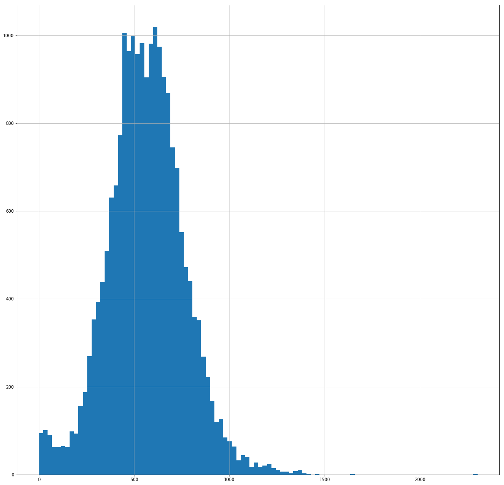
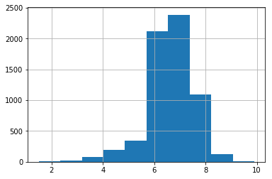
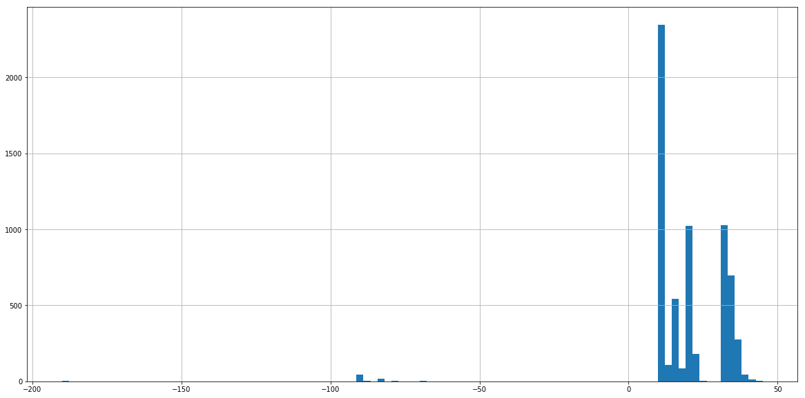

```python
import pandas as pd
from random import shuffle,random
```


```python
df  = pd.read_pickle('df3x.pickle')
df.head()
```


<div>
<style scoped>
    .dataframe tbody tr th:only-of-type {
        vertical-align: middle;
    }

    .dataframe tbody tr th {
        vertical-align: top;
    }

    .dataframe thead th {
        text-align: right;
    }
</style>
<table border="1" class="dataframe">
  <thead>
    <tr style="text-align: right;">
      <th></th>
      <th>id</th>
      <th>word_AAAA</th>
      <th>word_AAAAAAAAH</th>
      <th>word_AAAAAAAH</th>
      <th>word_AAAAAH</th>
      <th>word_AAAAH</th>
      <th>word_AAAGH</th>
      <th>word_AAAH</th>
      <th>word_AAAHH</th>
      <th>word_AAAHHH</th>
      <th>...</th>
      <th>word_ZORA</th>
      <th>word_ZORK</th>
      <th>word_ZORRO</th>
      <th>word_ZOYA</th>
      <th>word_ZUCCHINI</th>
      <th>word_ZUCKERBERG</th>
      <th>word_ZULU</th>
      <th>word_ZUMBA</th>
      <th>word_ZURICH</th>
      <th>word_ZWEI</th>
    </tr>
  </thead>
  <tbody>
    <tr>
      <th>0</th>
      <td>1952749712</td>
      <td>NaN</td>
      <td>NaN</td>
      <td>NaN</td>
      <td>NaN</td>
      <td>NaN</td>
      <td>NaN</td>
      <td>NaN</td>
      <td>NaN</td>
      <td>NaN</td>
      <td>...</td>
      <td>NaN</td>
      <td>NaN</td>
      <td>NaN</td>
      <td>NaN</td>
      <td>NaN</td>
      <td>NaN</td>
      <td>NaN</td>
      <td>NaN</td>
      <td>NaN</td>
      <td>NaN</td>
    </tr>
    <tr>
      <th>1</th>
      <td>1952766057</td>
      <td>NaN</td>
      <td>NaN</td>
      <td>NaN</td>
      <td>NaN</td>
      <td>NaN</td>
      <td>NaN</td>
      <td>NaN</td>
      <td>NaN</td>
      <td>NaN</td>
      <td>...</td>
      <td>NaN</td>
      <td>NaN</td>
      <td>NaN</td>
      <td>NaN</td>
      <td>NaN</td>
      <td>NaN</td>
      <td>NaN</td>
      <td>NaN</td>
      <td>NaN</td>
      <td>NaN</td>
    </tr>
    <tr>
      <th>2</th>
      <td>1952827068</td>
      <td>NaN</td>
      <td>NaN</td>
      <td>NaN</td>
      <td>NaN</td>
      <td>NaN</td>
      <td>NaN</td>
      <td>NaN</td>
      <td>NaN</td>
      <td>NaN</td>
      <td>...</td>
      <td>NaN</td>
      <td>NaN</td>
      <td>NaN</td>
      <td>NaN</td>
      <td>NaN</td>
      <td>NaN</td>
      <td>NaN</td>
      <td>NaN</td>
      <td>NaN</td>
      <td>NaN</td>
    </tr>
    <tr>
      <th>3</th>
      <td>1952858703</td>
      <td>NaN</td>
      <td>NaN</td>
      <td>NaN</td>
      <td>NaN</td>
      <td>NaN</td>
      <td>NaN</td>
      <td>NaN</td>
      <td>NaN</td>
      <td>NaN</td>
      <td>...</td>
      <td>NaN</td>
      <td>NaN</td>
      <td>NaN</td>
      <td>NaN</td>
      <td>NaN</td>
      <td>NaN</td>
      <td>NaN</td>
      <td>NaN</td>
      <td>NaN</td>
      <td>NaN</td>
    </tr>
    <tr>
      <th>4</th>
      <td>1952862063</td>
      <td>NaN</td>
      <td>NaN</td>
      <td>NaN</td>
      <td>NaN</td>
      <td>NaN</td>
      <td>NaN</td>
      <td>NaN</td>
      <td>NaN</td>
      <td>NaN</td>
      <td>...</td>
      <td>NaN</td>
      <td>NaN</td>
      <td>NaN</td>
      <td>NaN</td>
      <td>NaN</td>
      <td>NaN</td>
      <td>NaN</td>
      <td>NaN</td>
      <td>NaN</td>
      <td>NaN</td>
    </tr>
  </tbody>
</table>
<p>5 rows × 49058 columns</p>
</div>


```python
clean = pd.read_pickle('df_clean.pickle')
clean.head()
```


<div>
<style scoped>
    .dataframe tbody tr th:only-of-type {
        vertical-align: middle;
    }

    .dataframe tbody tr th {
        vertical-align: top;
    }

    .dataframe thead th {
        text-align: right;
    }
</style>
<table border="1" class="dataframe">
  <thead>
    <tr style="text-align: right;">
      <th></th>
      <th>id</th>
      <th>content</th>
    </tr>
  </thead>
  <tbody>
    <tr>
      <th>0</th>
      <td>1952749712</td>
      <td>ACTUALLY PIECE RUIN HARM THROWING OTHER SOMETH...</td>
    </tr>
    <tr>
      <th>1</th>
      <td>1952766057</td>
      <td>MANISH FLIRT BLAMING FEBRUARY PROFESSION OTHER...</td>
    </tr>
    <tr>
      <th>2</th>
      <td>1952827068</td>
      <td>ONLINE SWEAR MANISH NEWS CONFESSED JUDGEMENT M...</td>
    </tr>
    <tr>
      <th>3</th>
      <td>1952858703</td>
      <td>SITE ONLINE ASSIGNED UNTIL BLOCKS SWEAR UPSTAI...</td>
    </tr>
    <tr>
      <th>4</th>
      <td>1952862063</td>
      <td>UPSTAIRS AIIVE REAIIZED SOMETHING OTHER SIEEPI...</td>
    </tr>
  </tbody>
</table>
</div>


```python
falta = [x for x in list(clean.id) if x not in list(df.id)]
falta[:10]
```


    ['1953536039',
     '1953537227',
     '1953537569',
     '1953537621',
     '1953537664',
     '1953537974',
     '1953538162',
     '1953538380',
     '1953539162',
     '1953539835']


```python
all_words = list(' '.join(list(clean.content)).split())
all_words_dict = list(set(all_words))
words = pd.DataFrame(columns=['word','count_word'])
words.word = all_words
words2 = words.groupby(['word']).sum()
words2 = words2.sort_values('count_word', ascending=False)
words2 = words2.reset_index()
w2 = list(words2['word'][:50000])
shuffle(w2)
w2[:10]
```


    ['PIETS',
     'RECTIFIED',
     'REARCOW',
     'PANAFRICAN',
     'PAPALETS',
     'POBOGU',
     'POTTHUR',
     'REDACTING',
     'PREMONITION',
     'OTHERNTHERE']


```python

clean = pd.read_pickle('df_clean.pickle')
df  = pd.read_pickle('df3x.pickle')
print(df.shape)
falta = [x for x in list(clean.id) if x not in list(df.id)]
clean = clean.set_index('id')
clean = clean.loc[falta]


cleanx = clean[:50]
d = pd.DataFrame()
for row in cleanx.iterrows():
    print('.',end='', flush=True)
    e = dict()
    idc = row[0]
    content = row[1][0].split()
    e['id'] = idc

    for w in content:
        if w in w2:
            e['word_'+str(w)] = True
    d = df.append(e, ignore_index=True)
df = df.append(d, ignore_index=True)
df.to_pickle('df3x.pickle')
print(df.shape)
```


```python
df
```

    "df = pd.DataFrame()\n",
    "train=train.head(16000)\n",
    "for word in words:\n",
    "    df[word] = train.txt.apply(lambda x: (word in x)*1)\n",
    "df.to_pickle('DONORSCHOOSE\\matrix.pickle')"


```python
import pandas as pd
import numpy as np
pd.options.display.max_rows = 20
pd.options.display.max_columns = 999
```


```python
data_clean = pd.read_pickle('df_clean.pickle')
data_clean.head()
```


<div>
<style scoped>
    .dataframe tbody tr th:only-of-type {
        vertical-align: middle;
    }

    .dataframe tbody tr th {
        vertical-align: top;
    }

    .dataframe thead th {
        text-align: right;
    }
</style>
<table border="1" class="dataframe">
  <thead>
    <tr style="text-align: right;">
      <th></th>
      <th>id</th>
      <th>content</th>
    </tr>
  </thead>
  <tbody>
    <tr>
      <th>0</th>
      <td>1952749712</td>
      <td>ACTUALLY PIECE RUIN HARM THROWING OTHER SOMETH...</td>
    </tr>
    <tr>
      <th>1</th>
      <td>1952766057</td>
      <td>MANISH FLIRT BLAMING FEBRUARY PROFESSION OTHER...</td>
    </tr>
    <tr>
      <th>2</th>
      <td>1952827068</td>
      <td>ONLINE SWEAR MANISH NEWS CONFESSED JUDGEMENT M...</td>
    </tr>
    <tr>
      <th>3</th>
      <td>1952858703</td>
      <td>SITE ONLINE ASSIGNED UNTIL BLOCKS SWEAR UPSTAI...</td>
    </tr>
    <tr>
      <th>4</th>
      <td>1952862063</td>
      <td>UPSTAIRS AIIVE REAIIZED SOMETHING OTHER SIEEPI...</td>
    </tr>
  </tbody>
</table>
</div>


```python
all_words = list(' '.join(list(data_clean.content)).split())
all_words_dict = list(set(all_words))
words = pd.DataFrame(columns=['word','count_word'])
words.word = all_words
words2 = words.groupby(['word']).sum()
words2 = words2.sort_values('count_word', ascending=False)
words2 = words2.reset_index()
w2 = list(words2['word'][:50000])
```


```python
print(len(w2))
x = 0
#df_final = data_clean
df_final = pd.read_pickle('df_final.pickle')
col = list(df_final.columns)
for word in w2:
    x += 1
    if ('word_'+str(word)) not in col:
        df_final['word_'+str(word)] = df_final.content.apply(lambda x: (word in x))
    if x % int(len(w2)/100) == 0:
        print(str(x),flush=True)
        df_final.to_pickle('df_final.pickle')
df_final
```

    50000
    500
    1000
    1500
    2000
    2500
    3000
    3500
    4000
    4500
    5000
    5500
    6000
    6500
    7000
    7500
    8000
    8500
    9000
    9500
    10000
    10500
    11000
    11500
    12000
    12500
    13000
    13500
    14000
    14500
    15000
    15500
    16000
    16500
    17000
    17500
    18000
    18500
    19000
    19500
    20000
    20500
    21000
    21500
    22000
    22500
    23000
    23500
    24000
    24500
    25000
    25500
    26000
    26500
    27000
    27500
    28000
    28500
    29000
    29500
    30000
    30500
    31000
    31500
    32000
    32500
    33000
    33500
    34000
    34500
    35000
    35500
    36000
    36500
    37000
    37500
    38000
    38500
    39000
    39500
    40000
    40500
    41000
    41500
    42000
    42500
    43000
    43500
    44000
    44500
    45000
    45500
    46000
    46500
    47000
    47500
    48000
    48500
    49000
    49500
    50000


<div>
<style scoped>
    .dataframe tbody tr th:only-of-type {
        vertical-align: middle;
    }

    .dataframe tbody tr th {
        vertical-align: top;
    }

    .dataframe thead th {
        text-align: right;
    }
</style>
<table border="1" class="dataframe">
  <thead>
    <tr style="text-align: right;">
      <th></th>
      <th>id</th>
      <th>content</th>
      <th>word_AAAA</th>
      <th>word_PENOLOGY</th>
      <th>word_PENSABA</th>
      <th>word_PENSA</th>
      <th>word_PENS</th>
      <th>word_PENRY</th>
      <th>word_PENROSES</th>
      <th>word_PENROSE</th>
      <th>...</th>
      <th>word_QSOAMUE</th>
      <th>word_QSNG</th>
      <th>word_QSMRPAADIGIAISQQ</th>
      <th>word_QTCLPQZPLYJYVBKLBADKAQEQMBM</th>
      <th>word_QTCSBZODMAUDPQSCQCCMQQIA</th>
      <th>word_QTDBTQYOSAQCCDUDSAMRMBICRPLQEMTEIAEVB</th>
      <th>word_QTDVDSGSBDCVTBCJYUYQWRV</th>
      <th>word_QTOUPZQIUPQQEAIALRTSTVVNBSYLBXXAPUSQ</th>
      <th>word_QTOUPS</th>
      <th>word_QTOQTYTEX</th>
    </tr>
  </thead>
  <tbody>
    <tr>
      <th>0</th>
      <td>1952749712</td>
      <td>ACTUALLY PIECE RUIN HARM THROWING OTHER SOMETH...</td>
      <td>False</td>
      <td>False</td>
      <td>False</td>
      <td>False</td>
      <td>False</td>
      <td>False</td>
      <td>False</td>
      <td>False</td>
      <td>...</td>
      <td>False</td>
      <td>False</td>
      <td>False</td>
      <td>False</td>
      <td>False</td>
      <td>False</td>
      <td>False</td>
      <td>False</td>
      <td>False</td>
      <td>False</td>
    </tr>
    <tr>
      <th>1</th>
      <td>1952766057</td>
      <td>MANISH FLIRT BLAMING FEBRUARY PROFESSION OTHER...</td>
      <td>False</td>
      <td>False</td>
      <td>False</td>
      <td>False</td>
      <td>False</td>
      <td>False</td>
      <td>False</td>
      <td>False</td>
      <td>...</td>
      <td>False</td>
      <td>False</td>
      <td>False</td>
      <td>False</td>
      <td>False</td>
      <td>False</td>
      <td>False</td>
      <td>False</td>
      <td>False</td>
      <td>False</td>
    </tr>
    <tr>
      <th>2</th>
      <td>1952827068</td>
      <td>ONLINE SWEAR MANISH NEWS CONFESSED JUDGEMENT M...</td>
      <td>False</td>
      <td>False</td>
      <td>False</td>
      <td>False</td>
      <td>False</td>
      <td>False</td>
      <td>False</td>
      <td>False</td>
      <td>...</td>
      <td>False</td>
      <td>False</td>
      <td>False</td>
      <td>False</td>
      <td>False</td>
      <td>False</td>
      <td>False</td>
      <td>False</td>
      <td>False</td>
      <td>False</td>
    </tr>
    <tr>
      <th>3</th>
      <td>1952858703</td>
      <td>SITE ONLINE ASSIGNED UNTIL BLOCKS SWEAR UPSTAI...</td>
      <td>False</td>
      <td>False</td>
      <td>False</td>
      <td>False</td>
      <td>False</td>
      <td>False</td>
      <td>False</td>
      <td>False</td>
      <td>...</td>
      <td>False</td>
      <td>False</td>
      <td>False</td>
      <td>False</td>
      <td>False</td>
      <td>False</td>
      <td>False</td>
      <td>False</td>
      <td>False</td>
      <td>False</td>
    </tr>
    <tr>
      <th>4</th>
      <td>1952862063</td>
      <td>UPSTAIRS AIIVE REAIIZED SOMETHING OTHER SIEEPI...</td>
      <td>False</td>
      <td>False</td>
      <td>False</td>
      <td>False</td>
      <td>False</td>
      <td>False</td>
      <td>False</td>
      <td>False</td>
      <td>...</td>
      <td>False</td>
      <td>False</td>
      <td>False</td>
      <td>False</td>
      <td>False</td>
      <td>False</td>
      <td>False</td>
      <td>False</td>
      <td>False</td>
      <td>False</td>
    </tr>
    <tr>
      <th>5</th>
      <td>1952863503</td>
      <td>DISTRICT BLAMING OTHER DISAPPEAR BELIEVE INQUI...</td>
      <td>False</td>
      <td>False</td>
      <td>False</td>
      <td>False</td>
      <td>False</td>
      <td>False</td>
      <td>False</td>
      <td>False</td>
      <td>...</td>
      <td>False</td>
      <td>False</td>
      <td>False</td>
      <td>False</td>
      <td>False</td>
      <td>False</td>
      <td>False</td>
      <td>False</td>
      <td>False</td>
      <td>False</td>
    </tr>
    <tr>
      <th>6</th>
      <td>1952869763</td>
      <td>NEWS APPEAR BRESSLER CYANIDE SOMETHING OTHER B...</td>
      <td>False</td>
      <td>False</td>
      <td>False</td>
      <td>False</td>
      <td>True</td>
      <td>False</td>
      <td>False</td>
      <td>False</td>
      <td>...</td>
      <td>False</td>
      <td>False</td>
      <td>False</td>
      <td>False</td>
      <td>False</td>
      <td>False</td>
      <td>False</td>
      <td>False</td>
      <td>False</td>
      <td>False</td>
    </tr>
    <tr>
      <th>7</th>
      <td>1952869919</td>
      <td>NEWS UNTIL APPEAR UPSTAIRS ALTHOUGH SEAMLESSLY...</td>
      <td>False</td>
      <td>False</td>
      <td>False</td>
      <td>False</td>
      <td>True</td>
      <td>False</td>
      <td>False</td>
      <td>False</td>
      <td>...</td>
      <td>False</td>
      <td>False</td>
      <td>False</td>
      <td>False</td>
      <td>False</td>
      <td>False</td>
      <td>False</td>
      <td>False</td>
      <td>False</td>
      <td>False</td>
    </tr>
    <tr>
      <th>8</th>
      <td>1952870004</td>
      <td>NEWS UNTIL APPEAR UPSTAIRS SEAMLESSLY BRESSLER...</td>
      <td>False</td>
      <td>False</td>
      <td>False</td>
      <td>False</td>
      <td>True</td>
      <td>False</td>
      <td>False</td>
      <td>False</td>
      <td>...</td>
      <td>False</td>
      <td>False</td>
      <td>False</td>
      <td>False</td>
      <td>False</td>
      <td>False</td>
      <td>False</td>
      <td>False</td>
      <td>False</td>
      <td>False</td>
    </tr>
    <tr>
      <th>9</th>
      <td>1952870009</td>
      <td>NEWS UNTIL APPEAR UPSTAIRS ALTHOUGH SEAMLESSLY...</td>
      <td>False</td>
      <td>False</td>
      <td>False</td>
      <td>False</td>
      <td>True</td>
      <td>False</td>
      <td>False</td>
      <td>False</td>
      <td>...</td>
      <td>False</td>
      <td>False</td>
      <td>False</td>
      <td>False</td>
      <td>False</td>
      <td>False</td>
      <td>False</td>
      <td>False</td>
      <td>False</td>
      <td>False</td>
    </tr>
    <tr>
      <th>10</th>
      <td>1952870366</td>
      <td>SLIDE UNTIL SWEAR BUMS LEGS TRICKS PENNSYLVANI...</td>
      <td>False</td>
      <td>False</td>
      <td>False</td>
      <td>False</td>
      <td>True</td>
      <td>False</td>
      <td>False</td>
      <td>False</td>
      <td>...</td>
      <td>False</td>
      <td>False</td>
      <td>False</td>
      <td>False</td>
      <td>False</td>
      <td>False</td>
      <td>False</td>
      <td>False</td>
      <td>False</td>
      <td>False</td>
    </tr>
    <tr>
      <th>11</th>
      <td>1952874396</td>
      <td>NEWS PIECE ROGUE FAINT CATTLE DITCH SENIOR SOM...</td>
      <td>False</td>
      <td>False</td>
      <td>False</td>
      <td>True</td>
      <td>True</td>
      <td>False</td>
      <td>False</td>
      <td>False</td>
      <td>...</td>
      <td>False</td>
      <td>False</td>
      <td>False</td>
      <td>False</td>
      <td>False</td>
      <td>False</td>
      <td>False</td>
      <td>False</td>
      <td>False</td>
      <td>False</td>
    </tr>
    <tr>
      <th>12</th>
      <td>1952876884</td>
      <td>TOLLET DYLAN OTHER BELIEVE TIRE EFFECT DRESSED...</td>
      <td>False</td>
      <td>False</td>
      <td>False</td>
      <td>False</td>
      <td>True</td>
      <td>False</td>
      <td>False</td>
      <td>False</td>
      <td>...</td>
      <td>False</td>
      <td>False</td>
      <td>False</td>
      <td>False</td>
      <td>False</td>
      <td>False</td>
      <td>False</td>
      <td>False</td>
      <td>False</td>
      <td>False</td>
    </tr>
    <tr>
      <th>13</th>
      <td>1952877329</td>
      <td>DOLL PARADISE TIMER MECHANIZED CROSS BUNKERS P...</td>
      <td>False</td>
      <td>False</td>
      <td>False</td>
      <td>False</td>
      <td>True</td>
      <td>False</td>
      <td>False</td>
      <td>False</td>
      <td>...</td>
      <td>False</td>
      <td>False</td>
      <td>False</td>
      <td>False</td>
      <td>False</td>
      <td>False</td>
      <td>False</td>
      <td>False</td>
      <td>False</td>
      <td>False</td>
    </tr>
    <tr>
      <th>14</th>
      <td>1952880881</td>
      <td>WITH FLAT SEQUENCE THESE SUCK MEASURE SYPHILIS...</td>
      <td>False</td>
      <td>False</td>
      <td>False</td>
      <td>False</td>
      <td>False</td>
      <td>False</td>
      <td>False</td>
      <td>False</td>
      <td>...</td>
      <td>False</td>
      <td>False</td>
      <td>False</td>
      <td>False</td>
      <td>False</td>
      <td>False</td>
      <td>False</td>
      <td>False</td>
      <td>False</td>
      <td>False</td>
    </tr>
    <tr>
      <th>15</th>
      <td>1952882531</td>
      <td>SIMPLY NEWS CHERRY LEGS LOTS FILM ACTUALLY SAB...</td>
      <td>False</td>
      <td>False</td>
      <td>False</td>
      <td>False</td>
      <td>False</td>
      <td>False</td>
      <td>False</td>
      <td>False</td>
      <td>...</td>
      <td>False</td>
      <td>False</td>
      <td>False</td>
      <td>False</td>
      <td>False</td>
      <td>False</td>
      <td>False</td>
      <td>False</td>
      <td>False</td>
      <td>False</td>
    </tr>
    <tr>
      <th>16</th>
      <td>1952886351</td>
      <td>INDISTINCT RAPID HANK OTHER BELIEVE GENTLEMEN ...</td>
      <td>False</td>
      <td>False</td>
      <td>False</td>
      <td>False</td>
      <td>True</td>
      <td>False</td>
      <td>False</td>
      <td>False</td>
      <td>...</td>
      <td>False</td>
      <td>False</td>
      <td>False</td>
      <td>False</td>
      <td>False</td>
      <td>False</td>
      <td>False</td>
      <td>False</td>
      <td>False</td>
      <td>False</td>
    </tr>
    <tr>
      <th>17</th>
      <td>1952886417</td>
      <td>CHERRY OTHER BELIEVE POSITIONS DRESSED EVENING...</td>
      <td>False</td>
      <td>False</td>
      <td>False</td>
      <td>False</td>
      <td>False</td>
      <td>False</td>
      <td>False</td>
      <td>False</td>
      <td>...</td>
      <td>False</td>
      <td>False</td>
      <td>False</td>
      <td>False</td>
      <td>False</td>
      <td>False</td>
      <td>False</td>
      <td>False</td>
      <td>False</td>
      <td>False</td>
    </tr>
    <tr>
      <th>18</th>
      <td>1952886762</td>
      <td>RAPID HANK OTHER BELIEVE GENTLEMEN DESCRIBE BE...</td>
      <td>False</td>
      <td>False</td>
      <td>False</td>
      <td>False</td>
      <td>True</td>
      <td>False</td>
      <td>False</td>
      <td>False</td>
      <td>...</td>
      <td>False</td>
      <td>False</td>
      <td>False</td>
      <td>False</td>
      <td>False</td>
      <td>False</td>
      <td>False</td>
      <td>False</td>
      <td>False</td>
      <td>False</td>
    </tr>
    <tr>
      <th>19</th>
      <td>1952892201</td>
      <td>NEWS BECOMING PIECE AIIVE HAIR SOMETHING SIEEP...</td>
      <td>False</td>
      <td>False</td>
      <td>False</td>
      <td>True</td>
      <td>True</td>
      <td>False</td>
      <td>False</td>
      <td>False</td>
      <td>...</td>
      <td>False</td>
      <td>False</td>
      <td>False</td>
      <td>False</td>
      <td>False</td>
      <td>False</td>
      <td>False</td>
      <td>False</td>
      <td>False</td>
      <td>False</td>
    </tr>
    <tr>
      <th>20</th>
      <td>1952892771</td>
      <td>INDISTINCT WANDERED SPEEDING DYLAN OTHER FLAT ...</td>
      <td>False</td>
      <td>False</td>
      <td>False</td>
      <td>False</td>
      <td>True</td>
      <td>False</td>
      <td>False</td>
      <td>False</td>
      <td>...</td>
      <td>False</td>
      <td>False</td>
      <td>False</td>
      <td>False</td>
      <td>False</td>
      <td>False</td>
      <td>False</td>
      <td>False</td>
      <td>False</td>
      <td>False</td>
    </tr>
    <tr>
      <th>21</th>
      <td>1952893501</td>
      <td>SIMPLY SWEAR WINCH PIECE SOMETHING PILOT BELIE...</td>
      <td>False</td>
      <td>False</td>
      <td>False</td>
      <td>False</td>
      <td>False</td>
      <td>False</td>
      <td>False</td>
      <td>False</td>
      <td>...</td>
      <td>False</td>
      <td>False</td>
      <td>False</td>
      <td>False</td>
      <td>False</td>
      <td>False</td>
      <td>False</td>
      <td>False</td>
      <td>False</td>
      <td>False</td>
    </tr>
    <tr>
      <th>22</th>
      <td>1952893697</td>
      <td>SLIDE SYNDROME STARS FITS FLAT OTHER BELIEVE A...</td>
      <td>False</td>
      <td>False</td>
      <td>False</td>
      <td>False</td>
      <td>True</td>
      <td>False</td>
      <td>False</td>
      <td>False</td>
      <td>...</td>
      <td>False</td>
      <td>False</td>
      <td>False</td>
      <td>False</td>
      <td>False</td>
      <td>False</td>
      <td>False</td>
      <td>False</td>
      <td>False</td>
      <td>False</td>
    </tr>
    <tr>
      <th>23</th>
      <td>1952904698</td>
      <td>CARROWS SWEAR POTTERS SIMPLY UNTIL LOTS PIECE ...</td>
      <td>False</td>
      <td>False</td>
      <td>False</td>
      <td>False</td>
      <td>True</td>
      <td>False</td>
      <td>False</td>
      <td>False</td>
      <td>...</td>
      <td>False</td>
      <td>False</td>
      <td>False</td>
      <td>False</td>
      <td>False</td>
      <td>False</td>
      <td>False</td>
      <td>False</td>
      <td>False</td>
      <td>False</td>
    </tr>
    <tr>
      <th>24</th>
      <td>1952905372</td>
      <td>READERS DYLAN OTHER BELIEVE ANYWAYS TOUR HILLS...</td>
      <td>False</td>
      <td>False</td>
      <td>False</td>
      <td>False</td>
      <td>False</td>
      <td>False</td>
      <td>False</td>
      <td>False</td>
      <td>...</td>
      <td>False</td>
      <td>False</td>
      <td>False</td>
      <td>False</td>
      <td>False</td>
      <td>False</td>
      <td>False</td>
      <td>False</td>
      <td>False</td>
      <td>False</td>
    </tr>
    <tr>
      <th>25</th>
      <td>1952905564</td>
      <td>UNTIL ASSIGNED ALTHOUGH BOUND WINCH SHOOTS CRO...</td>
      <td>False</td>
      <td>False</td>
      <td>False</td>
      <td>False</td>
      <td>True</td>
      <td>False</td>
      <td>False</td>
      <td>False</td>
      <td>...</td>
      <td>False</td>
      <td>False</td>
      <td>False</td>
      <td>False</td>
      <td>False</td>
      <td>False</td>
      <td>False</td>
      <td>False</td>
      <td>False</td>
      <td>False</td>
    </tr>
    <tr>
      <th>26</th>
      <td>1952909669</td>
      <td>DISTRICT FITS OTHER CEREAL BELIEVE ANYWAYS QUI...</td>
      <td>False</td>
      <td>False</td>
      <td>False</td>
      <td>False</td>
      <td>True</td>
      <td>False</td>
      <td>False</td>
      <td>False</td>
      <td>...</td>
      <td>False</td>
      <td>False</td>
      <td>False</td>
      <td>False</td>
      <td>False</td>
      <td>False</td>
      <td>False</td>
      <td>False</td>
      <td>False</td>
      <td>False</td>
    </tr>
    <tr>
      <th>27</th>
      <td>1952911349</td>
      <td>INDISTINCT BUMS FLIRT STARS OTHER DISAPPEAR BE...</td>
      <td>False</td>
      <td>False</td>
      <td>False</td>
      <td>False</td>
      <td>True</td>
      <td>False</td>
      <td>False</td>
      <td>False</td>
      <td>...</td>
      <td>False</td>
      <td>False</td>
      <td>False</td>
      <td>False</td>
      <td>False</td>
      <td>False</td>
      <td>False</td>
      <td>False</td>
      <td>False</td>
      <td>False</td>
    </tr>
    <tr>
      <th>28</th>
      <td>1952913068</td>
      <td>DYLAN MCCARTNEY STARS OTHER FLAT HAMMOND BELIE...</td>
      <td>False</td>
      <td>False</td>
      <td>False</td>
      <td>False</td>
      <td>True</td>
      <td>False</td>
      <td>False</td>
      <td>False</td>
      <td>...</td>
      <td>False</td>
      <td>False</td>
      <td>False</td>
      <td>False</td>
      <td>False</td>
      <td>False</td>
      <td>False</td>
      <td>False</td>
      <td>False</td>
      <td>False</td>
    </tr>
    <tr>
      <th>29</th>
      <td>1952913240</td>
      <td>UNTIL BLOCKS MURDERED ACTUALLY SOMETHING OTHER...</td>
      <td>False</td>
      <td>False</td>
      <td>False</td>
      <td>False</td>
      <td>False</td>
      <td>False</td>
      <td>False</td>
      <td>False</td>
      <td>...</td>
      <td>False</td>
      <td>False</td>
      <td>False</td>
      <td>False</td>
      <td>False</td>
      <td>False</td>
      <td>False</td>
      <td>False</td>
      <td>False</td>
      <td>False</td>
    </tr>
    <tr>
      <th>...</th>
      <td>...</td>
      <td>...</td>
      <td>...</td>
      <td>...</td>
      <td>...</td>
      <td>...</td>
      <td>...</td>
      <td>...</td>
      <td>...</td>
      <td>...</td>
      <td>...</td>
      <td>...</td>
      <td>...</td>
      <td>...</td>
      <td>...</td>
      <td>...</td>
      <td>...</td>
      <td>...</td>
      <td>...</td>
      <td>...</td>
      <td>...</td>
    </tr>
    <tr>
      <th>20664</th>
      <td>1956250237</td>
      <td>DOLL SWEAR UNTIL SIMPLY ALTHOUGH LEGS ACTUALLY...</td>
      <td>False</td>
      <td>False</td>
      <td>False</td>
      <td>False</td>
      <td>True</td>
      <td>False</td>
      <td>False</td>
      <td>False</td>
      <td>...</td>
      <td>False</td>
      <td>False</td>
      <td>False</td>
      <td>False</td>
      <td>False</td>
      <td>False</td>
      <td>False</td>
      <td>False</td>
      <td>False</td>
      <td>False</td>
    </tr>
    <tr>
      <th>20665</th>
      <td>1956250245</td>
      <td>NEWS UNTIL APPEAR ADVERTISING ACTUALLY MENGELB...</td>
      <td>False</td>
      <td>False</td>
      <td>False</td>
      <td>False</td>
      <td>False</td>
      <td>False</td>
      <td>False</td>
      <td>False</td>
      <td>...</td>
      <td>False</td>
      <td>False</td>
      <td>False</td>
      <td>False</td>
      <td>False</td>
      <td>False</td>
      <td>False</td>
      <td>False</td>
      <td>False</td>
      <td>False</td>
    </tr>
    <tr>
      <th>20666</th>
      <td>1956250297</td>
      <td>GOTO FITS OTHER BELIEVE OVERWHELMED MARCH TREY...</td>
      <td>False</td>
      <td>False</td>
      <td>False</td>
      <td>True</td>
      <td>True</td>
      <td>False</td>
      <td>False</td>
      <td>False</td>
      <td>...</td>
      <td>False</td>
      <td>False</td>
      <td>False</td>
      <td>False</td>
      <td>False</td>
      <td>False</td>
      <td>False</td>
      <td>False</td>
      <td>False</td>
      <td>False</td>
    </tr>
    <tr>
      <th>20667</th>
      <td>1956250684</td>
      <td>SONS TOGETHER KOBA LAKE CAESARS WONDER SOLDIER...</td>
      <td>False</td>
      <td>False</td>
      <td>False</td>
      <td>False</td>
      <td>True</td>
      <td>False</td>
      <td>False</td>
      <td>False</td>
      <td>...</td>
      <td>False</td>
      <td>False</td>
      <td>False</td>
      <td>False</td>
      <td>False</td>
      <td>False</td>
      <td>False</td>
      <td>False</td>
      <td>False</td>
      <td>False</td>
    </tr>
    <tr>
      <th>20668</th>
      <td>1956250719</td>
      <td>INDISTINCT CALF BLAMING FEBRUARY PATHS OTHER D...</td>
      <td>False</td>
      <td>False</td>
      <td>False</td>
      <td>False</td>
      <td>True</td>
      <td>False</td>
      <td>False</td>
      <td>False</td>
      <td>...</td>
      <td>False</td>
      <td>False</td>
      <td>False</td>
      <td>False</td>
      <td>False</td>
      <td>False</td>
      <td>False</td>
      <td>False</td>
      <td>False</td>
      <td>False</td>
    </tr>
    <tr>
      <th>20669</th>
      <td>1956250778</td>
      <td>CALF SHREWD SITAS FORMALITIES STARS OTHER BELI...</td>
      <td>False</td>
      <td>False</td>
      <td>False</td>
      <td>True</td>
      <td>True</td>
      <td>False</td>
      <td>False</td>
      <td>False</td>
      <td>...</td>
      <td>False</td>
      <td>False</td>
      <td>False</td>
      <td>False</td>
      <td>False</td>
      <td>False</td>
      <td>False</td>
      <td>False</td>
      <td>False</td>
      <td>False</td>
    </tr>
    <tr>
      <th>20670</th>
      <td>1956250870</td>
      <td>RADIATE STARS PROFESSION MARLON OTHER WORRIEDN...</td>
      <td>False</td>
      <td>False</td>
      <td>False</td>
      <td>False</td>
      <td>True</td>
      <td>False</td>
      <td>False</td>
      <td>False</td>
      <td>...</td>
      <td>False</td>
      <td>False</td>
      <td>False</td>
      <td>False</td>
      <td>False</td>
      <td>False</td>
      <td>False</td>
      <td>False</td>
      <td>False</td>
      <td>False</td>
    </tr>
    <tr>
      <th>20671</th>
      <td>1956251046</td>
      <td>DOOMED FITS STARS OTHER DISAPPEAR BELIEVE CONF...</td>
      <td>False</td>
      <td>False</td>
      <td>False</td>
      <td>False</td>
      <td>True</td>
      <td>False</td>
      <td>False</td>
      <td>False</td>
      <td>...</td>
      <td>False</td>
      <td>False</td>
      <td>False</td>
      <td>False</td>
      <td>False</td>
      <td>False</td>
      <td>False</td>
      <td>False</td>
      <td>False</td>
      <td>False</td>
    </tr>
    <tr>
      <th>20672</th>
      <td>1956251089</td>
      <td>OTHER FLAT DISAPPEAR TIRE QUIT TOUR TROPHIES G...</td>
      <td>False</td>
      <td>False</td>
      <td>False</td>
      <td>False</td>
      <td>True</td>
      <td>False</td>
      <td>False</td>
      <td>False</td>
      <td>...</td>
      <td>False</td>
      <td>False</td>
      <td>False</td>
      <td>False</td>
      <td>False</td>
      <td>False</td>
      <td>False</td>
      <td>False</td>
      <td>False</td>
      <td>False</td>
    </tr>
    <tr>
      <th>20673</th>
      <td>1956251110</td>
      <td>WARFARE DISTRICT READERS DOOMED RAPID FORMALIT...</td>
      <td>False</td>
      <td>False</td>
      <td>False</td>
      <td>False</td>
      <td>True</td>
      <td>False</td>
      <td>False</td>
      <td>False</td>
      <td>...</td>
      <td>False</td>
      <td>False</td>
      <td>False</td>
      <td>False</td>
      <td>False</td>
      <td>False</td>
      <td>False</td>
      <td>False</td>
      <td>False</td>
      <td>False</td>
    </tr>
    <tr>
      <th>20674</th>
      <td>1956251169</td>
      <td>ONLINE NEWS SIMPLY UPSTAIRS SMARTS INABILITY B...</td>
      <td>False</td>
      <td>False</td>
      <td>False</td>
      <td>False</td>
      <td>True</td>
      <td>False</td>
      <td>False</td>
      <td>False</td>
      <td>...</td>
      <td>False</td>
      <td>False</td>
      <td>False</td>
      <td>False</td>
      <td>False</td>
      <td>False</td>
      <td>False</td>
      <td>False</td>
      <td>False</td>
      <td>False</td>
    </tr>
    <tr>
      <th>20675</th>
      <td>1956251292</td>
      <td>SEMMANGUDI PADMATIRTTHA PROFESSION OTHER TEACH...</td>
      <td>False</td>
      <td>False</td>
      <td>False</td>
      <td>False</td>
      <td>True</td>
      <td>False</td>
      <td>False</td>
      <td>False</td>
      <td>...</td>
      <td>False</td>
      <td>False</td>
      <td>False</td>
      <td>False</td>
      <td>False</td>
      <td>False</td>
      <td>False</td>
      <td>False</td>
      <td>False</td>
      <td>False</td>
    </tr>
    <tr>
      <th>20676</th>
      <td>1956251294</td>
      <td>DOLL NEWS UNTIL MEANINGLESS LIGHTGREEN LEGS SH...</td>
      <td>False</td>
      <td>False</td>
      <td>False</td>
      <td>False</td>
      <td>True</td>
      <td>False</td>
      <td>False</td>
      <td>False</td>
      <td>...</td>
      <td>False</td>
      <td>False</td>
      <td>False</td>
      <td>False</td>
      <td>False</td>
      <td>False</td>
      <td>False</td>
      <td>False</td>
      <td>False</td>
      <td>False</td>
    </tr>
    <tr>
      <th>20677</th>
      <td>1956251539</td>
      <td>INDISTINCT EXECUTION DOOMED BLAMING OTHER FLAT...</td>
      <td>False</td>
      <td>False</td>
      <td>False</td>
      <td>False</td>
      <td>True</td>
      <td>False</td>
      <td>False</td>
      <td>False</td>
      <td>...</td>
      <td>False</td>
      <td>False</td>
      <td>False</td>
      <td>False</td>
      <td>False</td>
      <td>False</td>
      <td>False</td>
      <td>False</td>
      <td>False</td>
      <td>False</td>
    </tr>
    <tr>
      <th>20678</th>
      <td>1956251629</td>
      <td>INDISTINCT BLAMING OTHER DISAPPEAR BELIEVE QUI...</td>
      <td>False</td>
      <td>False</td>
      <td>False</td>
      <td>False</td>
      <td>True</td>
      <td>False</td>
      <td>False</td>
      <td>False</td>
      <td>...</td>
      <td>False</td>
      <td>False</td>
      <td>False</td>
      <td>False</td>
      <td>False</td>
      <td>False</td>
      <td>False</td>
      <td>False</td>
      <td>False</td>
      <td>False</td>
    </tr>
    <tr>
      <th>20679</th>
      <td>1956251630</td>
      <td>NEWS UNTIL PUMPED ACTUALLY STANDIN LAWYER BLAM...</td>
      <td>False</td>
      <td>False</td>
      <td>False</td>
      <td>False</td>
      <td>True</td>
      <td>False</td>
      <td>False</td>
      <td>False</td>
      <td>...</td>
      <td>False</td>
      <td>False</td>
      <td>False</td>
      <td>False</td>
      <td>False</td>
      <td>False</td>
      <td>False</td>
      <td>False</td>
      <td>False</td>
      <td>False</td>
    </tr>
    <tr>
      <th>20680</th>
      <td>1956251638</td>
      <td>SWEAR UNTIL PARA DEPENDS ACTUALLY SHOOTS LAWYE...</td>
      <td>False</td>
      <td>False</td>
      <td>False</td>
      <td>False</td>
      <td>True</td>
      <td>False</td>
      <td>False</td>
      <td>False</td>
      <td>...</td>
      <td>False</td>
      <td>False</td>
      <td>False</td>
      <td>False</td>
      <td>False</td>
      <td>False</td>
      <td>False</td>
      <td>False</td>
      <td>False</td>
      <td>False</td>
    </tr>
    <tr>
      <th>20681</th>
      <td>1956251695</td>
      <td>INDISTINCT EXECUTION DOOMED BLAMING OTHER FLAT...</td>
      <td>False</td>
      <td>False</td>
      <td>False</td>
      <td>False</td>
      <td>True</td>
      <td>False</td>
      <td>False</td>
      <td>False</td>
      <td>...</td>
      <td>False</td>
      <td>False</td>
      <td>False</td>
      <td>False</td>
      <td>False</td>
      <td>False</td>
      <td>False</td>
      <td>False</td>
      <td>False</td>
      <td>False</td>
    </tr>
    <tr>
      <th>20682</th>
      <td>1956251855</td>
      <td>JUVENILE OTHER CARNAL BELIEVE ANYWAYS OPPOSING...</td>
      <td>False</td>
      <td>False</td>
      <td>False</td>
      <td>False</td>
      <td>True</td>
      <td>False</td>
      <td>False</td>
      <td>False</td>
      <td>...</td>
      <td>False</td>
      <td>False</td>
      <td>False</td>
      <td>False</td>
      <td>False</td>
      <td>False</td>
      <td>False</td>
      <td>False</td>
      <td>False</td>
      <td>False</td>
    </tr>
    <tr>
      <th>20683</th>
      <td>1956251856</td>
      <td>JUVENILE OTHER CARNAL BELIEVE ANYWAYS OPPOSING...</td>
      <td>False</td>
      <td>False</td>
      <td>False</td>
      <td>False</td>
      <td>True</td>
      <td>False</td>
      <td>False</td>
      <td>False</td>
      <td>...</td>
      <td>False</td>
      <td>False</td>
      <td>False</td>
      <td>False</td>
      <td>False</td>
      <td>False</td>
      <td>False</td>
      <td>False</td>
      <td>False</td>
      <td>False</td>
    </tr>
    <tr>
      <th>20684</th>
      <td>1956251958</td>
      <td>INDISTINCT BUMS FITS STARS OTHER CEREAL OVERRI...</td>
      <td>True</td>
      <td>False</td>
      <td>False</td>
      <td>False</td>
      <td>False</td>
      <td>False</td>
      <td>False</td>
      <td>False</td>
      <td>...</td>
      <td>False</td>
      <td>False</td>
      <td>False</td>
      <td>False</td>
      <td>False</td>
      <td>False</td>
      <td>False</td>
      <td>False</td>
      <td>False</td>
      <td>False</td>
    </tr>
    <tr>
      <th>20685</th>
      <td>1956251959</td>
      <td>BUMS FITS STARS OTHER CEREAL OVERRIDE DISAPPEA...</td>
      <td>True</td>
      <td>False</td>
      <td>False</td>
      <td>False</td>
      <td>False</td>
      <td>False</td>
      <td>False</td>
      <td>False</td>
      <td>...</td>
      <td>False</td>
      <td>False</td>
      <td>False</td>
      <td>False</td>
      <td>False</td>
      <td>False</td>
      <td>False</td>
      <td>False</td>
      <td>False</td>
      <td>False</td>
    </tr>
    <tr>
      <th>20686</th>
      <td>1956252517</td>
      <td>ONLINE SWEAR UNTIL NEWS SIMPLY SCANNERS LEADER...</td>
      <td>False</td>
      <td>False</td>
      <td>False</td>
      <td>False</td>
      <td>True</td>
      <td>False</td>
      <td>False</td>
      <td>False</td>
      <td>...</td>
      <td>False</td>
      <td>False</td>
      <td>False</td>
      <td>False</td>
      <td>False</td>
      <td>False</td>
      <td>False</td>
      <td>False</td>
      <td>False</td>
      <td>False</td>
    </tr>
    <tr>
      <th>20687</th>
      <td>1956252518</td>
      <td>ONLINE SWEAR UNTIL NEWS SIMPLY LEADERSHIP FILM...</td>
      <td>False</td>
      <td>False</td>
      <td>False</td>
      <td>False</td>
      <td>False</td>
      <td>False</td>
      <td>False</td>
      <td>False</td>
      <td>...</td>
      <td>False</td>
      <td>False</td>
      <td>False</td>
      <td>False</td>
      <td>False</td>
      <td>False</td>
      <td>False</td>
      <td>False</td>
      <td>False</td>
      <td>False</td>
    </tr>
    <tr>
      <th>20688</th>
      <td>1956252604</td>
      <td>INDISTINCT RUMBLES OTHER BELIEVE CLARENCE EFFE...</td>
      <td>False</td>
      <td>False</td>
      <td>False</td>
      <td>False</td>
      <td>True</td>
      <td>False</td>
      <td>False</td>
      <td>False</td>
      <td>...</td>
      <td>False</td>
      <td>False</td>
      <td>False</td>
      <td>False</td>
      <td>False</td>
      <td>False</td>
      <td>False</td>
      <td>False</td>
      <td>False</td>
      <td>False</td>
    </tr>
    <tr>
      <th>20689</th>
      <td>1956252607</td>
      <td>OTHER BELIEVE CLARENCE EFFECT GENTLEMEN AUDREY...</td>
      <td>False</td>
      <td>False</td>
      <td>False</td>
      <td>False</td>
      <td>True</td>
      <td>False</td>
      <td>False</td>
      <td>False</td>
      <td>...</td>
      <td>False</td>
      <td>False</td>
      <td>False</td>
      <td>False</td>
      <td>False</td>
      <td>False</td>
      <td>False</td>
      <td>False</td>
      <td>False</td>
      <td>False</td>
    </tr>
    <tr>
      <th>20690</th>
      <td>1956252627</td>
      <td>SIMPLY PIECE BUSY WORTHLESS SUED PUBLICS FEMAL...</td>
      <td>False</td>
      <td>False</td>
      <td>False</td>
      <td>True</td>
      <td>True</td>
      <td>False</td>
      <td>False</td>
      <td>False</td>
      <td>...</td>
      <td>False</td>
      <td>False</td>
      <td>False</td>
      <td>False</td>
      <td>False</td>
      <td>False</td>
      <td>False</td>
      <td>False</td>
      <td>False</td>
      <td>False</td>
    </tr>
    <tr>
      <th>20691</th>
      <td>1956252637</td>
      <td>DISTRICT OTHER DORMITORY BELIEVE MARCH DESCEND...</td>
      <td>False</td>
      <td>False</td>
      <td>False</td>
      <td>False</td>
      <td>True</td>
      <td>False</td>
      <td>False</td>
      <td>False</td>
      <td>...</td>
      <td>False</td>
      <td>False</td>
      <td>False</td>
      <td>False</td>
      <td>False</td>
      <td>False</td>
      <td>False</td>
      <td>False</td>
      <td>False</td>
      <td>False</td>
    </tr>
    <tr>
      <th>20692</th>
      <td>1956252885</td>
      <td>COUNTLESS UNTIL WANDERED YASSIN COUSIN ACTUALL...</td>
      <td>False</td>
      <td>False</td>
      <td>False</td>
      <td>False</td>
      <td>True</td>
      <td>False</td>
      <td>False</td>
      <td>False</td>
      <td>...</td>
      <td>False</td>
      <td>False</td>
      <td>False</td>
      <td>False</td>
      <td>False</td>
      <td>False</td>
      <td>False</td>
      <td>False</td>
      <td>False</td>
      <td>False</td>
    </tr>
    <tr>
      <th>20693</th>
      <td>1956252904</td>
      <td>SPEEDING OTHER MARLON FEVERISHLY BELIEVE ANYWA...</td>
      <td>False</td>
      <td>False</td>
      <td>False</td>
      <td>False</td>
      <td>True</td>
      <td>False</td>
      <td>False</td>
      <td>False</td>
      <td>...</td>
      <td>False</td>
      <td>False</td>
      <td>False</td>
      <td>False</td>
      <td>False</td>
      <td>False</td>
      <td>False</td>
      <td>False</td>
      <td>False</td>
      <td>False</td>
    </tr>
  </tbody>
</table>
<p>20694 rows × 50002 columns</p>
</div>


```python
df_final = pd.read_pickle('df_final.pickle')
df_final.describe()
```


<div>
<style scoped>
    .dataframe tbody tr th:only-of-type {
        vertical-align: middle;
    }

    .dataframe tbody tr th {
        vertical-align: top;
    }

    .dataframe thead th {
        text-align: right;
    }
</style>
<table border="1" class="dataframe">
  <thead>
    <tr style="text-align: right;">
      <th></th>
      <th>id</th>
      <th>content</th>
      <th>word_AAAA</th>
      <th>word_PENOLOGY</th>
      <th>word_PENSABA</th>
      <th>word_PENSA</th>
      <th>word_PENS</th>
      <th>word_PENRY</th>
      <th>word_PENROSES</th>
      <th>word_PENROSE</th>
      <th>...</th>
      <th>word_QSOAMUE</th>
      <th>word_QSNG</th>
      <th>word_QSMRPAADIGIAISQQ</th>
      <th>word_QTCLPQZPLYJYVBKLBADKAQEQMBM</th>
      <th>word_QTCSBZODMAUDPQSCQCCMQQIA</th>
      <th>word_QTDBTQYOSAQCCDUDSAMRMBICRPLQEMTEIAEVB</th>
      <th>word_QTDVDSGSBDCVTBCJYUYQWRV</th>
      <th>word_QTOUPZQIUPQQEAIALRTSTVVNBSYLBXXAPUSQ</th>
      <th>word_QTOUPS</th>
      <th>word_QTOQTYTEX</th>
    </tr>
  </thead>
  <tbody>
    <tr>
      <th>count</th>
      <td>20694</td>
      <td>20694</td>
      <td>20694</td>
      <td>20694</td>
      <td>20694</td>
      <td>20694</td>
      <td>20694</td>
      <td>20694</td>
      <td>20694</td>
      <td>20694</td>
      <td>...</td>
      <td>20694</td>
      <td>20694</td>
      <td>20694</td>
      <td>20694</td>
      <td>20694</td>
      <td>20694</td>
      <td>20694</td>
      <td>20694</td>
      <td>20694</td>
      <td>20694</td>
    </tr>
    <tr>
      <th>unique</th>
      <td>20694</td>
      <td>19083</td>
      <td>2</td>
      <td>2</td>
      <td>2</td>
      <td>2</td>
      <td>2</td>
      <td>2</td>
      <td>2</td>
      <td>2</td>
      <td>...</td>
      <td>2</td>
      <td>2</td>
      <td>2</td>
      <td>2</td>
      <td>2</td>
      <td>2</td>
      <td>2</td>
      <td>2</td>
      <td>2</td>
      <td>2</td>
    </tr>
    <tr>
      <th>top</th>
      <td>1953217280</td>
      <td>ONLINE SWEAR MASTERFUL UPSTAIRS PUMPED COUSIN ...</td>
      <td>False</td>
      <td>False</td>
      <td>False</td>
      <td>False</td>
      <td>True</td>
      <td>False</td>
      <td>False</td>
      <td>False</td>
      <td>...</td>
      <td>False</td>
      <td>False</td>
      <td>False</td>
      <td>False</td>
      <td>False</td>
      <td>False</td>
      <td>False</td>
      <td>False</td>
      <td>False</td>
      <td>False</td>
    </tr>
    <tr>
      <th>freq</th>
      <td>1</td>
      <td>9</td>
      <td>20234</td>
      <td>20693</td>
      <td>20691</td>
      <td>19140</td>
      <td>17123</td>
      <td>20691</td>
      <td>20680</td>
      <td>20677</td>
      <td>...</td>
      <td>20693</td>
      <td>20693</td>
      <td>20693</td>
      <td>20693</td>
      <td>20693</td>
      <td>20693</td>
      <td>20693</td>
      <td>20693</td>
      <td>20693</td>
      <td>20693</td>
    </tr>
  </tbody>
</table>
<p>4 rows × 50002 columns</p>
</div>


```python
df_final.shape
```


    (20694, 50002)


```python
dfg = df_final
dfg
```


<div>
<style scoped>
    .dataframe tbody tr th:only-of-type {
        vertical-align: middle;
    }

    .dataframe tbody tr th {
        vertical-align: top;
    }

    .dataframe thead th {
        text-align: right;
    }
</style>
<table border="1" class="dataframe">
  <thead>
    <tr style="text-align: right;">
      <th></th>
      <th>id</th>
      <th>content</th>
      <th>word_AAAA</th>
      <th>word_PENOLOGY</th>
      <th>word_PENSABA</th>
      <th>word_PENSA</th>
      <th>word_PENS</th>
      <th>word_PENRY</th>
      <th>word_PENROSES</th>
      <th>word_PENROSE</th>
      <th>...</th>
      <th>word_QSOAMUE</th>
      <th>word_QSNG</th>
      <th>word_QSMRPAADIGIAISQQ</th>
      <th>word_QTCLPQZPLYJYVBKLBADKAQEQMBM</th>
      <th>word_QTCSBZODMAUDPQSCQCCMQQIA</th>
      <th>word_QTDBTQYOSAQCCDUDSAMRMBICRPLQEMTEIAEVB</th>
      <th>word_QTDVDSGSBDCVTBCJYUYQWRV</th>
      <th>word_QTOUPZQIUPQQEAIALRTSTVVNBSYLBXXAPUSQ</th>
      <th>word_QTOUPS</th>
      <th>word_QTOQTYTEX</th>
    </tr>
  </thead>
  <tbody>
    <tr>
      <th>0</th>
      <td>1952749712</td>
      <td>ACTUALLY PIECE RUIN HARM THROWING OTHER SOMETH...</td>
      <td>False</td>
      <td>False</td>
      <td>False</td>
      <td>False</td>
      <td>False</td>
      <td>False</td>
      <td>False</td>
      <td>False</td>
      <td>...</td>
      <td>False</td>
      <td>False</td>
      <td>False</td>
      <td>False</td>
      <td>False</td>
      <td>False</td>
      <td>False</td>
      <td>False</td>
      <td>False</td>
      <td>False</td>
    </tr>
    <tr>
      <th>1</th>
      <td>1952766057</td>
      <td>MANISH FLIRT BLAMING FEBRUARY PROFESSION OTHER...</td>
      <td>False</td>
      <td>False</td>
      <td>False</td>
      <td>False</td>
      <td>False</td>
      <td>False</td>
      <td>False</td>
      <td>False</td>
      <td>...</td>
      <td>False</td>
      <td>False</td>
      <td>False</td>
      <td>False</td>
      <td>False</td>
      <td>False</td>
      <td>False</td>
      <td>False</td>
      <td>False</td>
      <td>False</td>
    </tr>
    <tr>
      <th>2</th>
      <td>1952827068</td>
      <td>ONLINE SWEAR MANISH NEWS CONFESSED JUDGEMENT M...</td>
      <td>False</td>
      <td>False</td>
      <td>False</td>
      <td>False</td>
      <td>False</td>
      <td>False</td>
      <td>False</td>
      <td>False</td>
      <td>...</td>
      <td>False</td>
      <td>False</td>
      <td>False</td>
      <td>False</td>
      <td>False</td>
      <td>False</td>
      <td>False</td>
      <td>False</td>
      <td>False</td>
      <td>False</td>
    </tr>
    <tr>
      <th>3</th>
      <td>1952858703</td>
      <td>SITE ONLINE ASSIGNED UNTIL BLOCKS SWEAR UPSTAI...</td>
      <td>False</td>
      <td>False</td>
      <td>False</td>
      <td>False</td>
      <td>False</td>
      <td>False</td>
      <td>False</td>
      <td>False</td>
      <td>...</td>
      <td>False</td>
      <td>False</td>
      <td>False</td>
      <td>False</td>
      <td>False</td>
      <td>False</td>
      <td>False</td>
      <td>False</td>
      <td>False</td>
      <td>False</td>
    </tr>
    <tr>
      <th>4</th>
      <td>1952862063</td>
      <td>UPSTAIRS AIIVE REAIIZED SOMETHING OTHER SIEEPI...</td>
      <td>False</td>
      <td>False</td>
      <td>False</td>
      <td>False</td>
      <td>False</td>
      <td>False</td>
      <td>False</td>
      <td>False</td>
      <td>...</td>
      <td>False</td>
      <td>False</td>
      <td>False</td>
      <td>False</td>
      <td>False</td>
      <td>False</td>
      <td>False</td>
      <td>False</td>
      <td>False</td>
      <td>False</td>
    </tr>
    <tr>
      <th>5</th>
      <td>1952863503</td>
      <td>DISTRICT BLAMING OTHER DISAPPEAR BELIEVE INQUI...</td>
      <td>False</td>
      <td>False</td>
      <td>False</td>
      <td>False</td>
      <td>False</td>
      <td>False</td>
      <td>False</td>
      <td>False</td>
      <td>...</td>
      <td>False</td>
      <td>False</td>
      <td>False</td>
      <td>False</td>
      <td>False</td>
      <td>False</td>
      <td>False</td>
      <td>False</td>
      <td>False</td>
      <td>False</td>
    </tr>
    <tr>
      <th>6</th>
      <td>1952869763</td>
      <td>NEWS APPEAR BRESSLER CYANIDE SOMETHING OTHER B...</td>
      <td>False</td>
      <td>False</td>
      <td>False</td>
      <td>False</td>
      <td>True</td>
      <td>False</td>
      <td>False</td>
      <td>False</td>
      <td>...</td>
      <td>False</td>
      <td>False</td>
      <td>False</td>
      <td>False</td>
      <td>False</td>
      <td>False</td>
      <td>False</td>
      <td>False</td>
      <td>False</td>
      <td>False</td>
    </tr>
    <tr>
      <th>7</th>
      <td>1952869919</td>
      <td>NEWS UNTIL APPEAR UPSTAIRS ALTHOUGH SEAMLESSLY...</td>
      <td>False</td>
      <td>False</td>
      <td>False</td>
      <td>False</td>
      <td>True</td>
      <td>False</td>
      <td>False</td>
      <td>False</td>
      <td>...</td>
      <td>False</td>
      <td>False</td>
      <td>False</td>
      <td>False</td>
      <td>False</td>
      <td>False</td>
      <td>False</td>
      <td>False</td>
      <td>False</td>
      <td>False</td>
    </tr>
    <tr>
      <th>8</th>
      <td>1952870004</td>
      <td>NEWS UNTIL APPEAR UPSTAIRS SEAMLESSLY BRESSLER...</td>
      <td>False</td>
      <td>False</td>
      <td>False</td>
      <td>False</td>
      <td>True</td>
      <td>False</td>
      <td>False</td>
      <td>False</td>
      <td>...</td>
      <td>False</td>
      <td>False</td>
      <td>False</td>
      <td>False</td>
      <td>False</td>
      <td>False</td>
      <td>False</td>
      <td>False</td>
      <td>False</td>
      <td>False</td>
    </tr>
    <tr>
      <th>9</th>
      <td>1952870009</td>
      <td>NEWS UNTIL APPEAR UPSTAIRS ALTHOUGH SEAMLESSLY...</td>
      <td>False</td>
      <td>False</td>
      <td>False</td>
      <td>False</td>
      <td>True</td>
      <td>False</td>
      <td>False</td>
      <td>False</td>
      <td>...</td>
      <td>False</td>
      <td>False</td>
      <td>False</td>
      <td>False</td>
      <td>False</td>
      <td>False</td>
      <td>False</td>
      <td>False</td>
      <td>False</td>
      <td>False</td>
    </tr>
    <tr>
      <th>10</th>
      <td>1952870366</td>
      <td>SLIDE UNTIL SWEAR BUMS LEGS TRICKS PENNSYLVANI...</td>
      <td>False</td>
      <td>False</td>
      <td>False</td>
      <td>False</td>
      <td>True</td>
      <td>False</td>
      <td>False</td>
      <td>False</td>
      <td>...</td>
      <td>False</td>
      <td>False</td>
      <td>False</td>
      <td>False</td>
      <td>False</td>
      <td>False</td>
      <td>False</td>
      <td>False</td>
      <td>False</td>
      <td>False</td>
    </tr>
    <tr>
      <th>11</th>
      <td>1952874396</td>
      <td>NEWS PIECE ROGUE FAINT CATTLE DITCH SENIOR SOM...</td>
      <td>False</td>
      <td>False</td>
      <td>False</td>
      <td>True</td>
      <td>True</td>
      <td>False</td>
      <td>False</td>
      <td>False</td>
      <td>...</td>
      <td>False</td>
      <td>False</td>
      <td>False</td>
      <td>False</td>
      <td>False</td>
      <td>False</td>
      <td>False</td>
      <td>False</td>
      <td>False</td>
      <td>False</td>
    </tr>
    <tr>
      <th>12</th>
      <td>1952876884</td>
      <td>TOLLET DYLAN OTHER BELIEVE TIRE EFFECT DRESSED...</td>
      <td>False</td>
      <td>False</td>
      <td>False</td>
      <td>False</td>
      <td>True</td>
      <td>False</td>
      <td>False</td>
      <td>False</td>
      <td>...</td>
      <td>False</td>
      <td>False</td>
      <td>False</td>
      <td>False</td>
      <td>False</td>
      <td>False</td>
      <td>False</td>
      <td>False</td>
      <td>False</td>
      <td>False</td>
    </tr>
    <tr>
      <th>13</th>
      <td>1952877329</td>
      <td>DOLL PARADISE TIMER MECHANIZED CROSS BUNKERS P...</td>
      <td>False</td>
      <td>False</td>
      <td>False</td>
      <td>False</td>
      <td>True</td>
      <td>False</td>
      <td>False</td>
      <td>False</td>
      <td>...</td>
      <td>False</td>
      <td>False</td>
      <td>False</td>
      <td>False</td>
      <td>False</td>
      <td>False</td>
      <td>False</td>
      <td>False</td>
      <td>False</td>
      <td>False</td>
    </tr>
    <tr>
      <th>14</th>
      <td>1952880881</td>
      <td>WITH FLAT SEQUENCE THESE SUCK MEASURE SYPHILIS...</td>
      <td>False</td>
      <td>False</td>
      <td>False</td>
      <td>False</td>
      <td>False</td>
      <td>False</td>
      <td>False</td>
      <td>False</td>
      <td>...</td>
      <td>False</td>
      <td>False</td>
      <td>False</td>
      <td>False</td>
      <td>False</td>
      <td>False</td>
      <td>False</td>
      <td>False</td>
      <td>False</td>
      <td>False</td>
    </tr>
    <tr>
      <th>15</th>
      <td>1952882531</td>
      <td>SIMPLY NEWS CHERRY LEGS LOTS FILM ACTUALLY SAB...</td>
      <td>False</td>
      <td>False</td>
      <td>False</td>
      <td>False</td>
      <td>False</td>
      <td>False</td>
      <td>False</td>
      <td>False</td>
      <td>...</td>
      <td>False</td>
      <td>False</td>
      <td>False</td>
      <td>False</td>
      <td>False</td>
      <td>False</td>
      <td>False</td>
      <td>False</td>
      <td>False</td>
      <td>False</td>
    </tr>
    <tr>
      <th>16</th>
      <td>1952886351</td>
      <td>INDISTINCT RAPID HANK OTHER BELIEVE GENTLEMEN ...</td>
      <td>False</td>
      <td>False</td>
      <td>False</td>
      <td>False</td>
      <td>True</td>
      <td>False</td>
      <td>False</td>
      <td>False</td>
      <td>...</td>
      <td>False</td>
      <td>False</td>
      <td>False</td>
      <td>False</td>
      <td>False</td>
      <td>False</td>
      <td>False</td>
      <td>False</td>
      <td>False</td>
      <td>False</td>
    </tr>
    <tr>
      <th>17</th>
      <td>1952886417</td>
      <td>CHERRY OTHER BELIEVE POSITIONS DRESSED EVENING...</td>
      <td>False</td>
      <td>False</td>
      <td>False</td>
      <td>False</td>
      <td>False</td>
      <td>False</td>
      <td>False</td>
      <td>False</td>
      <td>...</td>
      <td>False</td>
      <td>False</td>
      <td>False</td>
      <td>False</td>
      <td>False</td>
      <td>False</td>
      <td>False</td>
      <td>False</td>
      <td>False</td>
      <td>False</td>
    </tr>
    <tr>
      <th>18</th>
      <td>1952886762</td>
      <td>RAPID HANK OTHER BELIEVE GENTLEMEN DESCRIBE BE...</td>
      <td>False</td>
      <td>False</td>
      <td>False</td>
      <td>False</td>
      <td>True</td>
      <td>False</td>
      <td>False</td>
      <td>False</td>
      <td>...</td>
      <td>False</td>
      <td>False</td>
      <td>False</td>
      <td>False</td>
      <td>False</td>
      <td>False</td>
      <td>False</td>
      <td>False</td>
      <td>False</td>
      <td>False</td>
    </tr>
    <tr>
      <th>19</th>
      <td>1952892201</td>
      <td>NEWS BECOMING PIECE AIIVE HAIR SOMETHING SIEEP...</td>
      <td>False</td>
      <td>False</td>
      <td>False</td>
      <td>True</td>
      <td>True</td>
      <td>False</td>
      <td>False</td>
      <td>False</td>
      <td>...</td>
      <td>False</td>
      <td>False</td>
      <td>False</td>
      <td>False</td>
      <td>False</td>
      <td>False</td>
      <td>False</td>
      <td>False</td>
      <td>False</td>
      <td>False</td>
    </tr>
    <tr>
      <th>20</th>
      <td>1952892771</td>
      <td>INDISTINCT WANDERED SPEEDING DYLAN OTHER FLAT ...</td>
      <td>False</td>
      <td>False</td>
      <td>False</td>
      <td>False</td>
      <td>True</td>
      <td>False</td>
      <td>False</td>
      <td>False</td>
      <td>...</td>
      <td>False</td>
      <td>False</td>
      <td>False</td>
      <td>False</td>
      <td>False</td>
      <td>False</td>
      <td>False</td>
      <td>False</td>
      <td>False</td>
      <td>False</td>
    </tr>
    <tr>
      <th>21</th>
      <td>1952893501</td>
      <td>SIMPLY SWEAR WINCH PIECE SOMETHING PILOT BELIE...</td>
      <td>False</td>
      <td>False</td>
      <td>False</td>
      <td>False</td>
      <td>False</td>
      <td>False</td>
      <td>False</td>
      <td>False</td>
      <td>...</td>
      <td>False</td>
      <td>False</td>
      <td>False</td>
      <td>False</td>
      <td>False</td>
      <td>False</td>
      <td>False</td>
      <td>False</td>
      <td>False</td>
      <td>False</td>
    </tr>
    <tr>
      <th>22</th>
      <td>1952893697</td>
      <td>SLIDE SYNDROME STARS FITS FLAT OTHER BELIEVE A...</td>
      <td>False</td>
      <td>False</td>
      <td>False</td>
      <td>False</td>
      <td>True</td>
      <td>False</td>
      <td>False</td>
      <td>False</td>
      <td>...</td>
      <td>False</td>
      <td>False</td>
      <td>False</td>
      <td>False</td>
      <td>False</td>
      <td>False</td>
      <td>False</td>
      <td>False</td>
      <td>False</td>
      <td>False</td>
    </tr>
    <tr>
      <th>23</th>
      <td>1952904698</td>
      <td>CARROWS SWEAR POTTERS SIMPLY UNTIL LOTS PIECE ...</td>
      <td>False</td>
      <td>False</td>
      <td>False</td>
      <td>False</td>
      <td>True</td>
      <td>False</td>
      <td>False</td>
      <td>False</td>
      <td>...</td>
      <td>False</td>
      <td>False</td>
      <td>False</td>
      <td>False</td>
      <td>False</td>
      <td>False</td>
      <td>False</td>
      <td>False</td>
      <td>False</td>
      <td>False</td>
    </tr>
    <tr>
      <th>24</th>
      <td>1952905372</td>
      <td>READERS DYLAN OTHER BELIEVE ANYWAYS TOUR HILLS...</td>
      <td>False</td>
      <td>False</td>
      <td>False</td>
      <td>False</td>
      <td>False</td>
      <td>False</td>
      <td>False</td>
      <td>False</td>
      <td>...</td>
      <td>False</td>
      <td>False</td>
      <td>False</td>
      <td>False</td>
      <td>False</td>
      <td>False</td>
      <td>False</td>
      <td>False</td>
      <td>False</td>
      <td>False</td>
    </tr>
    <tr>
      <th>25</th>
      <td>1952905564</td>
      <td>UNTIL ASSIGNED ALTHOUGH BOUND WINCH SHOOTS CRO...</td>
      <td>False</td>
      <td>False</td>
      <td>False</td>
      <td>False</td>
      <td>True</td>
      <td>False</td>
      <td>False</td>
      <td>False</td>
      <td>...</td>
      <td>False</td>
      <td>False</td>
      <td>False</td>
      <td>False</td>
      <td>False</td>
      <td>False</td>
      <td>False</td>
      <td>False</td>
      <td>False</td>
      <td>False</td>
    </tr>
    <tr>
      <th>26</th>
      <td>1952909669</td>
      <td>DISTRICT FITS OTHER CEREAL BELIEVE ANYWAYS QUI...</td>
      <td>False</td>
      <td>False</td>
      <td>False</td>
      <td>False</td>
      <td>True</td>
      <td>False</td>
      <td>False</td>
      <td>False</td>
      <td>...</td>
      <td>False</td>
      <td>False</td>
      <td>False</td>
      <td>False</td>
      <td>False</td>
      <td>False</td>
      <td>False</td>
      <td>False</td>
      <td>False</td>
      <td>False</td>
    </tr>
    <tr>
      <th>27</th>
      <td>1952911349</td>
      <td>INDISTINCT BUMS FLIRT STARS OTHER DISAPPEAR BE...</td>
      <td>False</td>
      <td>False</td>
      <td>False</td>
      <td>False</td>
      <td>True</td>
      <td>False</td>
      <td>False</td>
      <td>False</td>
      <td>...</td>
      <td>False</td>
      <td>False</td>
      <td>False</td>
      <td>False</td>
      <td>False</td>
      <td>False</td>
      <td>False</td>
      <td>False</td>
      <td>False</td>
      <td>False</td>
    </tr>
    <tr>
      <th>28</th>
      <td>1952913068</td>
      <td>DYLAN MCCARTNEY STARS OTHER FLAT HAMMOND BELIE...</td>
      <td>False</td>
      <td>False</td>
      <td>False</td>
      <td>False</td>
      <td>True</td>
      <td>False</td>
      <td>False</td>
      <td>False</td>
      <td>...</td>
      <td>False</td>
      <td>False</td>
      <td>False</td>
      <td>False</td>
      <td>False</td>
      <td>False</td>
      <td>False</td>
      <td>False</td>
      <td>False</td>
      <td>False</td>
    </tr>
    <tr>
      <th>29</th>
      <td>1952913240</td>
      <td>UNTIL BLOCKS MURDERED ACTUALLY SOMETHING OTHER...</td>
      <td>False</td>
      <td>False</td>
      <td>False</td>
      <td>False</td>
      <td>False</td>
      <td>False</td>
      <td>False</td>
      <td>False</td>
      <td>...</td>
      <td>False</td>
      <td>False</td>
      <td>False</td>
      <td>False</td>
      <td>False</td>
      <td>False</td>
      <td>False</td>
      <td>False</td>
      <td>False</td>
      <td>False</td>
    </tr>
    <tr>
      <th>...</th>
      <td>...</td>
      <td>...</td>
      <td>...</td>
      <td>...</td>
      <td>...</td>
      <td>...</td>
      <td>...</td>
      <td>...</td>
      <td>...</td>
      <td>...</td>
      <td>...</td>
      <td>...</td>
      <td>...</td>
      <td>...</td>
      <td>...</td>
      <td>...</td>
      <td>...</td>
      <td>...</td>
      <td>...</td>
      <td>...</td>
      <td>...</td>
    </tr>
    <tr>
      <th>20664</th>
      <td>1956250237</td>
      <td>DOLL SWEAR UNTIL SIMPLY ALTHOUGH LEGS ACTUALLY...</td>
      <td>False</td>
      <td>False</td>
      <td>False</td>
      <td>False</td>
      <td>True</td>
      <td>False</td>
      <td>False</td>
      <td>False</td>
      <td>...</td>
      <td>False</td>
      <td>False</td>
      <td>False</td>
      <td>False</td>
      <td>False</td>
      <td>False</td>
      <td>False</td>
      <td>False</td>
      <td>False</td>
      <td>False</td>
    </tr>
    <tr>
      <th>20665</th>
      <td>1956250245</td>
      <td>NEWS UNTIL APPEAR ADVERTISING ACTUALLY MENGELB...</td>
      <td>False</td>
      <td>False</td>
      <td>False</td>
      <td>False</td>
      <td>False</td>
      <td>False</td>
      <td>False</td>
      <td>False</td>
      <td>...</td>
      <td>False</td>
      <td>False</td>
      <td>False</td>
      <td>False</td>
      <td>False</td>
      <td>False</td>
      <td>False</td>
      <td>False</td>
      <td>False</td>
      <td>False</td>
    </tr>
    <tr>
      <th>20666</th>
      <td>1956250297</td>
      <td>GOTO FITS OTHER BELIEVE OVERWHELMED MARCH TREY...</td>
      <td>False</td>
      <td>False</td>
      <td>False</td>
      <td>True</td>
      <td>True</td>
      <td>False</td>
      <td>False</td>
      <td>False</td>
      <td>...</td>
      <td>False</td>
      <td>False</td>
      <td>False</td>
      <td>False</td>
      <td>False</td>
      <td>False</td>
      <td>False</td>
      <td>False</td>
      <td>False</td>
      <td>False</td>
    </tr>
    <tr>
      <th>20667</th>
      <td>1956250684</td>
      <td>SONS TOGETHER KOBA LAKE CAESARS WONDER SOLDIER...</td>
      <td>False</td>
      <td>False</td>
      <td>False</td>
      <td>False</td>
      <td>True</td>
      <td>False</td>
      <td>False</td>
      <td>False</td>
      <td>...</td>
      <td>False</td>
      <td>False</td>
      <td>False</td>
      <td>False</td>
      <td>False</td>
      <td>False</td>
      <td>False</td>
      <td>False</td>
      <td>False</td>
      <td>False</td>
    </tr>
    <tr>
      <th>20668</th>
      <td>1956250719</td>
      <td>INDISTINCT CALF BLAMING FEBRUARY PATHS OTHER D...</td>
      <td>False</td>
      <td>False</td>
      <td>False</td>
      <td>False</td>
      <td>True</td>
      <td>False</td>
      <td>False</td>
      <td>False</td>
      <td>...</td>
      <td>False</td>
      <td>False</td>
      <td>False</td>
      <td>False</td>
      <td>False</td>
      <td>False</td>
      <td>False</td>
      <td>False</td>
      <td>False</td>
      <td>False</td>
    </tr>
    <tr>
      <th>20669</th>
      <td>1956250778</td>
      <td>CALF SHREWD SITAS FORMALITIES STARS OTHER BELI...</td>
      <td>False</td>
      <td>False</td>
      <td>False</td>
      <td>True</td>
      <td>True</td>
      <td>False</td>
      <td>False</td>
      <td>False</td>
      <td>...</td>
      <td>False</td>
      <td>False</td>
      <td>False</td>
      <td>False</td>
      <td>False</td>
      <td>False</td>
      <td>False</td>
      <td>False</td>
      <td>False</td>
      <td>False</td>
    </tr>
    <tr>
      <th>20670</th>
      <td>1956250870</td>
      <td>RADIATE STARS PROFESSION MARLON OTHER WORRIEDN...</td>
      <td>False</td>
      <td>False</td>
      <td>False</td>
      <td>False</td>
      <td>True</td>
      <td>False</td>
      <td>False</td>
      <td>False</td>
      <td>...</td>
      <td>False</td>
      <td>False</td>
      <td>False</td>
      <td>False</td>
      <td>False</td>
      <td>False</td>
      <td>False</td>
      <td>False</td>
      <td>False</td>
      <td>False</td>
    </tr>
    <tr>
      <th>20671</th>
      <td>1956251046</td>
      <td>DOOMED FITS STARS OTHER DISAPPEAR BELIEVE CONF...</td>
      <td>False</td>
      <td>False</td>
      <td>False</td>
      <td>False</td>
      <td>True</td>
      <td>False</td>
      <td>False</td>
      <td>False</td>
      <td>...</td>
      <td>False</td>
      <td>False</td>
      <td>False</td>
      <td>False</td>
      <td>False</td>
      <td>False</td>
      <td>False</td>
      <td>False</td>
      <td>False</td>
      <td>False</td>
    </tr>
    <tr>
      <th>20672</th>
      <td>1956251089</td>
      <td>OTHER FLAT DISAPPEAR TIRE QUIT TOUR TROPHIES G...</td>
      <td>False</td>
      <td>False</td>
      <td>False</td>
      <td>False</td>
      <td>True</td>
      <td>False</td>
      <td>False</td>
      <td>False</td>
      <td>...</td>
      <td>False</td>
      <td>False</td>
      <td>False</td>
      <td>False</td>
      <td>False</td>
      <td>False</td>
      <td>False</td>
      <td>False</td>
      <td>False</td>
      <td>False</td>
    </tr>
    <tr>
      <th>20673</th>
      <td>1956251110</td>
      <td>WARFARE DISTRICT READERS DOOMED RAPID FORMALIT...</td>
      <td>False</td>
      <td>False</td>
      <td>False</td>
      <td>False</td>
      <td>True</td>
      <td>False</td>
      <td>False</td>
      <td>False</td>
      <td>...</td>
      <td>False</td>
      <td>False</td>
      <td>False</td>
      <td>False</td>
      <td>False</td>
      <td>False</td>
      <td>False</td>
      <td>False</td>
      <td>False</td>
      <td>False</td>
    </tr>
    <tr>
      <th>20674</th>
      <td>1956251169</td>
      <td>ONLINE NEWS SIMPLY UPSTAIRS SMARTS INABILITY B...</td>
      <td>False</td>
      <td>False</td>
      <td>False</td>
      <td>False</td>
      <td>True</td>
      <td>False</td>
      <td>False</td>
      <td>False</td>
      <td>...</td>
      <td>False</td>
      <td>False</td>
      <td>False</td>
      <td>False</td>
      <td>False</td>
      <td>False</td>
      <td>False</td>
      <td>False</td>
      <td>False</td>
      <td>False</td>
    </tr>
    <tr>
      <th>20675</th>
      <td>1956251292</td>
      <td>SEMMANGUDI PADMATIRTTHA PROFESSION OTHER TEACH...</td>
      <td>False</td>
      <td>False</td>
      <td>False</td>
      <td>False</td>
      <td>True</td>
      <td>False</td>
      <td>False</td>
      <td>False</td>
      <td>...</td>
      <td>False</td>
      <td>False</td>
      <td>False</td>
      <td>False</td>
      <td>False</td>
      <td>False</td>
      <td>False</td>
      <td>False</td>
      <td>False</td>
      <td>False</td>
    </tr>
    <tr>
      <th>20676</th>
      <td>1956251294</td>
      <td>DOLL NEWS UNTIL MEANINGLESS LIGHTGREEN LEGS SH...</td>
      <td>False</td>
      <td>False</td>
      <td>False</td>
      <td>False</td>
      <td>True</td>
      <td>False</td>
      <td>False</td>
      <td>False</td>
      <td>...</td>
      <td>False</td>
      <td>False</td>
      <td>False</td>
      <td>False</td>
      <td>False</td>
      <td>False</td>
      <td>False</td>
      <td>False</td>
      <td>False</td>
      <td>False</td>
    </tr>
    <tr>
      <th>20677</th>
      <td>1956251539</td>
      <td>INDISTINCT EXECUTION DOOMED BLAMING OTHER FLAT...</td>
      <td>False</td>
      <td>False</td>
      <td>False</td>
      <td>False</td>
      <td>True</td>
      <td>False</td>
      <td>False</td>
      <td>False</td>
      <td>...</td>
      <td>False</td>
      <td>False</td>
      <td>False</td>
      <td>False</td>
      <td>False</td>
      <td>False</td>
      <td>False</td>
      <td>False</td>
      <td>False</td>
      <td>False</td>
    </tr>
    <tr>
      <th>20678</th>
      <td>1956251629</td>
      <td>INDISTINCT BLAMING OTHER DISAPPEAR BELIEVE QUI...</td>
      <td>False</td>
      <td>False</td>
      <td>False</td>
      <td>False</td>
      <td>True</td>
      <td>False</td>
      <td>False</td>
      <td>False</td>
      <td>...</td>
      <td>False</td>
      <td>False</td>
      <td>False</td>
      <td>False</td>
      <td>False</td>
      <td>False</td>
      <td>False</td>
      <td>False</td>
      <td>False</td>
      <td>False</td>
    </tr>
    <tr>
      <th>20679</th>
      <td>1956251630</td>
      <td>NEWS UNTIL PUMPED ACTUALLY STANDIN LAWYER BLAM...</td>
      <td>False</td>
      <td>False</td>
      <td>False</td>
      <td>False</td>
      <td>True</td>
      <td>False</td>
      <td>False</td>
      <td>False</td>
      <td>...</td>
      <td>False</td>
      <td>False</td>
      <td>False</td>
      <td>False</td>
      <td>False</td>
      <td>False</td>
      <td>False</td>
      <td>False</td>
      <td>False</td>
      <td>False</td>
    </tr>
    <tr>
      <th>20680</th>
      <td>1956251638</td>
      <td>SWEAR UNTIL PARA DEPENDS ACTUALLY SHOOTS LAWYE...</td>
      <td>False</td>
      <td>False</td>
      <td>False</td>
      <td>False</td>
      <td>True</td>
      <td>False</td>
      <td>False</td>
      <td>False</td>
      <td>...</td>
      <td>False</td>
      <td>False</td>
      <td>False</td>
      <td>False</td>
      <td>False</td>
      <td>False</td>
      <td>False</td>
      <td>False</td>
      <td>False</td>
      <td>False</td>
    </tr>
    <tr>
      <th>20681</th>
      <td>1956251695</td>
      <td>INDISTINCT EXECUTION DOOMED BLAMING OTHER FLAT...</td>
      <td>False</td>
      <td>False</td>
      <td>False</td>
      <td>False</td>
      <td>True</td>
      <td>False</td>
      <td>False</td>
      <td>False</td>
      <td>...</td>
      <td>False</td>
      <td>False</td>
      <td>False</td>
      <td>False</td>
      <td>False</td>
      <td>False</td>
      <td>False</td>
      <td>False</td>
      <td>False</td>
      <td>False</td>
    </tr>
    <tr>
      <th>20682</th>
      <td>1956251855</td>
      <td>JUVENILE OTHER CARNAL BELIEVE ANYWAYS OPPOSING...</td>
      <td>False</td>
      <td>False</td>
      <td>False</td>
      <td>False</td>
      <td>True</td>
      <td>False</td>
      <td>False</td>
      <td>False</td>
      <td>...</td>
      <td>False</td>
      <td>False</td>
      <td>False</td>
      <td>False</td>
      <td>False</td>
      <td>False</td>
      <td>False</td>
      <td>False</td>
      <td>False</td>
      <td>False</td>
    </tr>
    <tr>
      <th>20683</th>
      <td>1956251856</td>
      <td>JUVENILE OTHER CARNAL BELIEVE ANYWAYS OPPOSING...</td>
      <td>False</td>
      <td>False</td>
      <td>False</td>
      <td>False</td>
      <td>True</td>
      <td>False</td>
      <td>False</td>
      <td>False</td>
      <td>...</td>
      <td>False</td>
      <td>False</td>
      <td>False</td>
      <td>False</td>
      <td>False</td>
      <td>False</td>
      <td>False</td>
      <td>False</td>
      <td>False</td>
      <td>False</td>
    </tr>
    <tr>
      <th>20684</th>
      <td>1956251958</td>
      <td>INDISTINCT BUMS FITS STARS OTHER CEREAL OVERRI...</td>
      <td>True</td>
      <td>False</td>
      <td>False</td>
      <td>False</td>
      <td>False</td>
      <td>False</td>
      <td>False</td>
      <td>False</td>
      <td>...</td>
      <td>False</td>
      <td>False</td>
      <td>False</td>
      <td>False</td>
      <td>False</td>
      <td>False</td>
      <td>False</td>
      <td>False</td>
      <td>False</td>
      <td>False</td>
    </tr>
    <tr>
      <th>20685</th>
      <td>1956251959</td>
      <td>BUMS FITS STARS OTHER CEREAL OVERRIDE DISAPPEA...</td>
      <td>True</td>
      <td>False</td>
      <td>False</td>
      <td>False</td>
      <td>False</td>
      <td>False</td>
      <td>False</td>
      <td>False</td>
      <td>...</td>
      <td>False</td>
      <td>False</td>
      <td>False</td>
      <td>False</td>
      <td>False</td>
      <td>False</td>
      <td>False</td>
      <td>False</td>
      <td>False</td>
      <td>False</td>
    </tr>
    <tr>
      <th>20686</th>
      <td>1956252517</td>
      <td>ONLINE SWEAR UNTIL NEWS SIMPLY SCANNERS LEADER...</td>
      <td>False</td>
      <td>False</td>
      <td>False</td>
      <td>False</td>
      <td>True</td>
      <td>False</td>
      <td>False</td>
      <td>False</td>
      <td>...</td>
      <td>False</td>
      <td>False</td>
      <td>False</td>
      <td>False</td>
      <td>False</td>
      <td>False</td>
      <td>False</td>
      <td>False</td>
      <td>False</td>
      <td>False</td>
    </tr>
    <tr>
      <th>20687</th>
      <td>1956252518</td>
      <td>ONLINE SWEAR UNTIL NEWS SIMPLY LEADERSHIP FILM...</td>
      <td>False</td>
      <td>False</td>
      <td>False</td>
      <td>False</td>
      <td>False</td>
      <td>False</td>
      <td>False</td>
      <td>False</td>
      <td>...</td>
      <td>False</td>
      <td>False</td>
      <td>False</td>
      <td>False</td>
      <td>False</td>
      <td>False</td>
      <td>False</td>
      <td>False</td>
      <td>False</td>
      <td>False</td>
    </tr>
    <tr>
      <th>20688</th>
      <td>1956252604</td>
      <td>INDISTINCT RUMBLES OTHER BELIEVE CLARENCE EFFE...</td>
      <td>False</td>
      <td>False</td>
      <td>False</td>
      <td>False</td>
      <td>True</td>
      <td>False</td>
      <td>False</td>
      <td>False</td>
      <td>...</td>
      <td>False</td>
      <td>False</td>
      <td>False</td>
      <td>False</td>
      <td>False</td>
      <td>False</td>
      <td>False</td>
      <td>False</td>
      <td>False</td>
      <td>False</td>
    </tr>
    <tr>
      <th>20689</th>
      <td>1956252607</td>
      <td>OTHER BELIEVE CLARENCE EFFECT GENTLEMEN AUDREY...</td>
      <td>False</td>
      <td>False</td>
      <td>False</td>
      <td>False</td>
      <td>True</td>
      <td>False</td>
      <td>False</td>
      <td>False</td>
      <td>...</td>
      <td>False</td>
      <td>False</td>
      <td>False</td>
      <td>False</td>
      <td>False</td>
      <td>False</td>
      <td>False</td>
      <td>False</td>
      <td>False</td>
      <td>False</td>
    </tr>
    <tr>
      <th>20690</th>
      <td>1956252627</td>
      <td>SIMPLY PIECE BUSY WORTHLESS SUED PUBLICS FEMAL...</td>
      <td>False</td>
      <td>False</td>
      <td>False</td>
      <td>True</td>
      <td>True</td>
      <td>False</td>
      <td>False</td>
      <td>False</td>
      <td>...</td>
      <td>False</td>
      <td>False</td>
      <td>False</td>
      <td>False</td>
      <td>False</td>
      <td>False</td>
      <td>False</td>
      <td>False</td>
      <td>False</td>
      <td>False</td>
    </tr>
    <tr>
      <th>20691</th>
      <td>1956252637</td>
      <td>DISTRICT OTHER DORMITORY BELIEVE MARCH DESCEND...</td>
      <td>False</td>
      <td>False</td>
      <td>False</td>
      <td>False</td>
      <td>True</td>
      <td>False</td>
      <td>False</td>
      <td>False</td>
      <td>...</td>
      <td>False</td>
      <td>False</td>
      <td>False</td>
      <td>False</td>
      <td>False</td>
      <td>False</td>
      <td>False</td>
      <td>False</td>
      <td>False</td>
      <td>False</td>
    </tr>
    <tr>
      <th>20692</th>
      <td>1956252885</td>
      <td>COUNTLESS UNTIL WANDERED YASSIN COUSIN ACTUALL...</td>
      <td>False</td>
      <td>False</td>
      <td>False</td>
      <td>False</td>
      <td>True</td>
      <td>False</td>
      <td>False</td>
      <td>False</td>
      <td>...</td>
      <td>False</td>
      <td>False</td>
      <td>False</td>
      <td>False</td>
      <td>False</td>
      <td>False</td>
      <td>False</td>
      <td>False</td>
      <td>False</td>
      <td>False</td>
    </tr>
    <tr>
      <th>20693</th>
      <td>1956252904</td>
      <td>SPEEDING OTHER MARLON FEVERISHLY BELIEVE ANYWA...</td>
      <td>False</td>
      <td>False</td>
      <td>False</td>
      <td>False</td>
      <td>True</td>
      <td>False</td>
      <td>False</td>
      <td>False</td>
      <td>...</td>
      <td>False</td>
      <td>False</td>
      <td>False</td>
      <td>False</td>
      <td>False</td>
      <td>False</td>
      <td>False</td>
      <td>False</td>
      <td>False</td>
      <td>False</td>
    </tr>
  </tbody>
</table>
<p>20694 rows × 50002 columns</p>
</div>


```python
dfg['total'] = dfg.iloc[:,2:].sum(axis=1)
```


```python
dfg.total
```


    0         376
    1         734
    2         475
    3         505
    4         225
    5         583
    6         343
    7         561
    8         561
    9         562
    10        590
    11        356
    12        727
    13        498
    14         80
    15        384
    16        810
    17        534
    18        766
    19        349
    20        581
    21        264
    22        755
    23        491
    24        610
    25        517
    26        500
    27        674
    28        649
    29        208
             ... 
    20664     398
    20665     457
    20666     830
    20667     112
    20668     590
    20669     716
    20670    1078
    20671     804
    20672     582
    20673    1143
    20674     492
    20675     703
    20676     417
    20677     625
    20678     535
    20679     501
    20680     508
    20681     630
    20682     658
    20683     619
    20684     737
    20685     650
    20686     532
    20687     485
    20688     748
    20689     646
    20690     176
    20691     657
    20692     338
    20693     830
    Name: total, Length: 20694, dtype: int64


```python
dfg['total'].hist(figsize=(20,20), bins=100)
```


    <matplotlib.axes._subplots.AxesSubplot at 0x7f50be328240>





```python
dfg = dfg.sort_values('total', ascending = False)
dfg
```


<div>
<style scoped>
    .dataframe tbody tr th:only-of-type {
        vertical-align: middle;
    }

    .dataframe tbody tr th {
        vertical-align: top;
    }

    .dataframe thead th {
        text-align: right;
    }
</style>
<table border="1" class="dataframe">
  <thead>
    <tr style="text-align: right;">
      <th></th>
      <th>id</th>
      <th>content</th>
      <th>word_AAAA</th>
      <th>word_PENOLOGY</th>
      <th>word_PENSABA</th>
      <th>word_PENSA</th>
      <th>word_PENS</th>
      <th>word_PENRY</th>
      <th>word_PENROSES</th>
      <th>word_PENROSE</th>
      <th>...</th>
      <th>word_QSNG</th>
      <th>word_QSMRPAADIGIAISQQ</th>
      <th>word_QTCLPQZPLYJYVBKLBADKAQEQMBM</th>
      <th>word_QTCSBZODMAUDPQSCQCCMQQIA</th>
      <th>word_QTDBTQYOSAQCCDUDSAMRMBICRPLQEMTEIAEVB</th>
      <th>word_QTDVDSGSBDCVTBCJYUYQWRV</th>
      <th>word_QTOUPZQIUPQQEAIALRTSTVVNBSYLBXXAPUSQ</th>
      <th>word_QTOUPS</th>
      <th>word_QTOQTYTEX</th>
      <th>total</th>
    </tr>
  </thead>
  <tbody>
    <tr>
      <th>11204</th>
      <td>1954790655</td>
      <td>WEALT DOOMED SQURE ENSUING BLUTFAHNE REJECTS E...</td>
      <td>False</td>
      <td>False</td>
      <td>False</td>
      <td>True</td>
      <td>True</td>
      <td>False</td>
      <td>False</td>
      <td>False</td>
      <td>...</td>
      <td>False</td>
      <td>False</td>
      <td>False</td>
      <td>False</td>
      <td>False</td>
      <td>False</td>
      <td>False</td>
      <td>False</td>
      <td>False</td>
      <td>2302</td>
    </tr>
    <tr>
      <th>7880</th>
      <td>1954175152</td>
      <td>NOCHENPARA UPCOUNT READERS UPHAPPY UPWHATS HAC...</td>
      <td>False</td>
      <td>False</td>
      <td>True</td>
      <td>True</td>
      <td>True</td>
      <td>False</td>
      <td>False</td>
      <td>False</td>
      <td>...</td>
      <td>False</td>
      <td>False</td>
      <td>False</td>
      <td>False</td>
      <td>False</td>
      <td>False</td>
      <td>False</td>
      <td>False</td>
      <td>False</td>
      <td>1648</td>
    </tr>
    <tr>
      <th>3108</th>
      <td>1953050724</td>
      <td>ICHING CREATIONS CONSTIPATION OSTRACIZED STARS...</td>
      <td>False</td>
      <td>False</td>
      <td>False</td>
      <td>False</td>
      <td>True</td>
      <td>False</td>
      <td>False</td>
      <td>False</td>
      <td>...</td>
      <td>False</td>
      <td>False</td>
      <td>False</td>
      <td>False</td>
      <td>False</td>
      <td>False</td>
      <td>False</td>
      <td>False</td>
      <td>False</td>
      <td>1451</td>
    </tr>
    <tr>
      <th>19040</th>
      <td>1956025820</td>
      <td>SUICIDEYOUVE FLIRT BLAMING GORY TODAYCOME BLUR...</td>
      <td>False</td>
      <td>False</td>
      <td>False</td>
      <td>False</td>
      <td>True</td>
      <td>False</td>
      <td>False</td>
      <td>False</td>
      <td>...</td>
      <td>False</td>
      <td>False</td>
      <td>False</td>
      <td>False</td>
      <td>False</td>
      <td>False</td>
      <td>False</td>
      <td>False</td>
      <td>False</td>
      <td>1414</td>
    </tr>
    <tr>
      <th>5579</th>
      <td>1953440967</td>
      <td>REACHAROUND DOOMED STARS OTHER ARMING INTERROG...</td>
      <td>False</td>
      <td>False</td>
      <td>False</td>
      <td>False</td>
      <td>True</td>
      <td>False</td>
      <td>False</td>
      <td>False</td>
      <td>...</td>
      <td>False</td>
      <td>False</td>
      <td>False</td>
      <td>False</td>
      <td>False</td>
      <td>False</td>
      <td>False</td>
      <td>False</td>
      <td>False</td>
      <td>1405</td>
    </tr>
    <tr>
      <th>15787</th>
      <td>1955501475</td>
      <td>WARFARE INDISTINCT CREATIONS DISTRICT OSTRACIZ...</td>
      <td>False</td>
      <td>False</td>
      <td>False</td>
      <td>False</td>
      <td>True</td>
      <td>False</td>
      <td>False</td>
      <td>False</td>
      <td>...</td>
      <td>False</td>
      <td>False</td>
      <td>False</td>
      <td>False</td>
      <td>False</td>
      <td>False</td>
      <td>False</td>
      <td>False</td>
      <td>False</td>
      <td>1401</td>
    </tr>
    <tr>
      <th>7060</th>
      <td>1953819043</td>
      <td>CREATIONS BERTS SCOTTISH SYNDROME CALF ADMIRAB...</td>
      <td>False</td>
      <td>False</td>
      <td>False</td>
      <td>False</td>
      <td>True</td>
      <td>False</td>
      <td>False</td>
      <td>False</td>
      <td>...</td>
      <td>False</td>
      <td>False</td>
      <td>False</td>
      <td>False</td>
      <td>False</td>
      <td>False</td>
      <td>False</td>
      <td>False</td>
      <td>False</td>
      <td>1393</td>
    </tr>
    <tr>
      <th>15788</th>
      <td>1955501476</td>
      <td>WARFARE CREATIONS DISTRICT OSTRACIZED STARS YU...</td>
      <td>False</td>
      <td>False</td>
      <td>False</td>
      <td>False</td>
      <td>True</td>
      <td>False</td>
      <td>False</td>
      <td>False</td>
      <td>...</td>
      <td>False</td>
      <td>False</td>
      <td>False</td>
      <td>False</td>
      <td>False</td>
      <td>False</td>
      <td>False</td>
      <td>False</td>
      <td>False</td>
      <td>1389</td>
    </tr>
    <tr>
      <th>18828</th>
      <td>1955995528</td>
      <td>EVERYONENWHO DEFAULTPROBABLY CORDUROYS DEFAULT...</td>
      <td>False</td>
      <td>False</td>
      <td>False</td>
      <td>False</td>
      <td>True</td>
      <td>False</td>
      <td>False</td>
      <td>False</td>
      <td>...</td>
      <td>False</td>
      <td>False</td>
      <td>False</td>
      <td>False</td>
      <td>False</td>
      <td>False</td>
      <td>False</td>
      <td>False</td>
      <td>False</td>
      <td>1380</td>
    </tr>
    <tr>
      <th>19554</th>
      <td>1956102715</td>
      <td>INDISTINCT DISTRICT DOOMED CRYOGENIC RAPID DUL...</td>
      <td>False</td>
      <td>False</td>
      <td>False</td>
      <td>True</td>
      <td>True</td>
      <td>False</td>
      <td>False</td>
      <td>False</td>
      <td>...</td>
      <td>False</td>
      <td>False</td>
      <td>False</td>
      <td>False</td>
      <td>False</td>
      <td>False</td>
      <td>False</td>
      <td>False</td>
      <td>False</td>
      <td>1377</td>
    </tr>
    <tr>
      <th>20542</th>
      <td>1956236843</td>
      <td>INDISTINCT DISTRICT DOOMED CRYOGENIC RAPID DUL...</td>
      <td>False</td>
      <td>False</td>
      <td>False</td>
      <td>True</td>
      <td>True</td>
      <td>False</td>
      <td>False</td>
      <td>False</td>
      <td>...</td>
      <td>False</td>
      <td>False</td>
      <td>False</td>
      <td>False</td>
      <td>False</td>
      <td>False</td>
      <td>False</td>
      <td>False</td>
      <td>False</td>
      <td>1377</td>
    </tr>
    <tr>
      <th>16286</th>
      <td>1955585540</td>
      <td>JUVENILE SYNDROME STICKITS PLEABARGAINED OTHER...</td>
      <td>False</td>
      <td>False</td>
      <td>False</td>
      <td>True</td>
      <td>True</td>
      <td>False</td>
      <td>False</td>
      <td>False</td>
      <td>...</td>
      <td>False</td>
      <td>False</td>
      <td>False</td>
      <td>False</td>
      <td>False</td>
      <td>False</td>
      <td>False</td>
      <td>False</td>
      <td>False</td>
      <td>1373</td>
    </tr>
    <tr>
      <th>19555</th>
      <td>1956102716</td>
      <td>DISTRICT DOOMED CRYOGENIC RAPID DULLES FEBRUAR...</td>
      <td>False</td>
      <td>False</td>
      <td>False</td>
      <td>True</td>
      <td>True</td>
      <td>False</td>
      <td>False</td>
      <td>False</td>
      <td>...</td>
      <td>False</td>
      <td>False</td>
      <td>False</td>
      <td>False</td>
      <td>False</td>
      <td>False</td>
      <td>False</td>
      <td>False</td>
      <td>False</td>
      <td>1370</td>
    </tr>
    <tr>
      <th>20543</th>
      <td>1956236848</td>
      <td>DISTRICT DOOMED CRYOGENIC RAPID DULLES FEBRUAR...</td>
      <td>False</td>
      <td>False</td>
      <td>False</td>
      <td>True</td>
      <td>True</td>
      <td>False</td>
      <td>False</td>
      <td>False</td>
      <td>...</td>
      <td>False</td>
      <td>False</td>
      <td>False</td>
      <td>False</td>
      <td>False</td>
      <td>False</td>
      <td>False</td>
      <td>False</td>
      <td>False</td>
      <td>1367</td>
    </tr>
    <tr>
      <th>19564</th>
      <td>1956104217</td>
      <td>DISTRICT DOOMED CRYOGENIC RAPID DULLES FEBRUAR...</td>
      <td>False</td>
      <td>False</td>
      <td>False</td>
      <td>True</td>
      <td>True</td>
      <td>False</td>
      <td>False</td>
      <td>False</td>
      <td>...</td>
      <td>False</td>
      <td>False</td>
      <td>False</td>
      <td>False</td>
      <td>False</td>
      <td>False</td>
      <td>False</td>
      <td>False</td>
      <td>False</td>
      <td>1365</td>
    </tr>
    <tr>
      <th>15694</th>
      <td>1955490090</td>
      <td>INDISTINCT LOMBOK HANK CAMPAIGNED DUTIES PROFE...</td>
      <td>False</td>
      <td>False</td>
      <td>False</td>
      <td>True</td>
      <td>True</td>
      <td>False</td>
      <td>False</td>
      <td>False</td>
      <td>...</td>
      <td>False</td>
      <td>False</td>
      <td>False</td>
      <td>False</td>
      <td>False</td>
      <td>False</td>
      <td>False</td>
      <td>False</td>
      <td>False</td>
      <td>1363</td>
    </tr>
    <tr>
      <th>3130</th>
      <td>1953054115</td>
      <td>WARFARE EXECUTION DOOMED WANDERED SCOTTISH DIS...</td>
      <td>False</td>
      <td>False</td>
      <td>False</td>
      <td>False</td>
      <td>True</td>
      <td>False</td>
      <td>False</td>
      <td>False</td>
      <td>...</td>
      <td>False</td>
      <td>False</td>
      <td>False</td>
      <td>False</td>
      <td>False</td>
      <td>False</td>
      <td>False</td>
      <td>False</td>
      <td>False</td>
      <td>1361</td>
    </tr>
    <tr>
      <th>15686</th>
      <td>1955489827</td>
      <td>INDISTINCT LOMBOK TOLLET HANK CAMPAIGNED DUTIE...</td>
      <td>False</td>
      <td>False</td>
      <td>False</td>
      <td>True</td>
      <td>True</td>
      <td>False</td>
      <td>False</td>
      <td>False</td>
      <td>...</td>
      <td>False</td>
      <td>False</td>
      <td>False</td>
      <td>False</td>
      <td>False</td>
      <td>False</td>
      <td>False</td>
      <td>False</td>
      <td>False</td>
      <td>1359</td>
    </tr>
    <tr>
      <th>948</th>
      <td>1955489933</td>
      <td>INDISTINCT LOMBOK HANK CAMPAIGNED DUTIES PROFE...</td>
      <td>False</td>
      <td>False</td>
      <td>False</td>
      <td>True</td>
      <td>True</td>
      <td>False</td>
      <td>False</td>
      <td>False</td>
      <td>...</td>
      <td>False</td>
      <td>False</td>
      <td>False</td>
      <td>False</td>
      <td>False</td>
      <td>False</td>
      <td>False</td>
      <td>False</td>
      <td>False</td>
      <td>1355</td>
    </tr>
    <tr>
      <th>15693</th>
      <td>1955489934</td>
      <td>LOMBOK HANK CAMPAIGNED DUTIES PROFESSION OTHER...</td>
      <td>False</td>
      <td>False</td>
      <td>False</td>
      <td>True</td>
      <td>True</td>
      <td>False</td>
      <td>False</td>
      <td>False</td>
      <td>...</td>
      <td>False</td>
      <td>False</td>
      <td>False</td>
      <td>False</td>
      <td>False</td>
      <td>False</td>
      <td>False</td>
      <td>False</td>
      <td>False</td>
      <td>1350</td>
    </tr>
    <tr>
      <th>15738</th>
      <td>1955497328</td>
      <td>LOMBOK HANK CAMPAIGNED DUTIES PROFESSION OTHER...</td>
      <td>False</td>
      <td>False</td>
      <td>False</td>
      <td>True</td>
      <td>True</td>
      <td>False</td>
      <td>False</td>
      <td>False</td>
      <td>...</td>
      <td>False</td>
      <td>False</td>
      <td>False</td>
      <td>False</td>
      <td>False</td>
      <td>False</td>
      <td>False</td>
      <td>False</td>
      <td>False</td>
      <td>1348</td>
    </tr>
    <tr>
      <th>16653</th>
      <td>1955632369</td>
      <td>LOMBOK HANK CAMPAIGNED DUTIES PROFESSION OTHER...</td>
      <td>False</td>
      <td>False</td>
      <td>False</td>
      <td>True</td>
      <td>True</td>
      <td>False</td>
      <td>False</td>
      <td>False</td>
      <td>...</td>
      <td>False</td>
      <td>False</td>
      <td>False</td>
      <td>False</td>
      <td>False</td>
      <td>False</td>
      <td>False</td>
      <td>False</td>
      <td>False</td>
      <td>1346</td>
    </tr>
    <tr>
      <th>15687</th>
      <td>1955489828</td>
      <td>LOMBOK HANK CAMPAIGNED DUTIES PROFESSION OTHER...</td>
      <td>False</td>
      <td>False</td>
      <td>False</td>
      <td>True</td>
      <td>True</td>
      <td>False</td>
      <td>False</td>
      <td>False</td>
      <td>...</td>
      <td>False</td>
      <td>False</td>
      <td>False</td>
      <td>False</td>
      <td>False</td>
      <td>False</td>
      <td>False</td>
      <td>False</td>
      <td>False</td>
      <td>1345</td>
    </tr>
    <tr>
      <th>7014</th>
      <td>1953811358</td>
      <td>WARFARE INDISTINCT FATHERED FEBRUARY PATHS PRO...</td>
      <td>False</td>
      <td>False</td>
      <td>False</td>
      <td>False</td>
      <td>True</td>
      <td>False</td>
      <td>False</td>
      <td>False</td>
      <td>...</td>
      <td>False</td>
      <td>False</td>
      <td>False</td>
      <td>False</td>
      <td>False</td>
      <td>False</td>
      <td>False</td>
      <td>False</td>
      <td>False</td>
      <td>1345</td>
    </tr>
    <tr>
      <th>19808</th>
      <td>1956135956</td>
      <td>SLIDE INDISTINCT DISTRICT SAMS DYLAN HANK FEBR...</td>
      <td>False</td>
      <td>False</td>
      <td>False</td>
      <td>False</td>
      <td>True</td>
      <td>False</td>
      <td>False</td>
      <td>False</td>
      <td>...</td>
      <td>False</td>
      <td>False</td>
      <td>False</td>
      <td>False</td>
      <td>False</td>
      <td>False</td>
      <td>False</td>
      <td>False</td>
      <td>False</td>
      <td>1344</td>
    </tr>
    <tr>
      <th>15378</th>
      <td>1955454767</td>
      <td>LOMBOK MANYOUCHARIAN UNCLEANDY HANK CAMPAIGNED...</td>
      <td>False</td>
      <td>False</td>
      <td>False</td>
      <td>True</td>
      <td>True</td>
      <td>False</td>
      <td>False</td>
      <td>False</td>
      <td>...</td>
      <td>False</td>
      <td>False</td>
      <td>False</td>
      <td>False</td>
      <td>False</td>
      <td>False</td>
      <td>False</td>
      <td>False</td>
      <td>False</td>
      <td>1341</td>
    </tr>
    <tr>
      <th>9787</th>
      <td>1954507028</td>
      <td>DISTRICT EXECUTION VISAS OTHER DISAPPEAR BELIE...</td>
      <td>False</td>
      <td>False</td>
      <td>False</td>
      <td>True</td>
      <td>True</td>
      <td>False</td>
      <td>False</td>
      <td>False</td>
      <td>...</td>
      <td>False</td>
      <td>False</td>
      <td>False</td>
      <td>False</td>
      <td>False</td>
      <td>False</td>
      <td>False</td>
      <td>False</td>
      <td>False</td>
      <td>1326</td>
    </tr>
    <tr>
      <th>9569</th>
      <td>1954471086</td>
      <td>CALF MONTANAIN RAPID ASISAID FACTORYFARMS IPLA...</td>
      <td>False</td>
      <td>False</td>
      <td>False</td>
      <td>False</td>
      <td>True</td>
      <td>False</td>
      <td>False</td>
      <td>False</td>
      <td>...</td>
      <td>False</td>
      <td>False</td>
      <td>False</td>
      <td>False</td>
      <td>False</td>
      <td>False</td>
      <td>False</td>
      <td>False</td>
      <td>False</td>
      <td>1316</td>
    </tr>
    <tr>
      <th>6968</th>
      <td>1953802415</td>
      <td>WARFARE FATHERED FEBRUARY PATHS PROFESSION CON...</td>
      <td>False</td>
      <td>False</td>
      <td>False</td>
      <td>False</td>
      <td>True</td>
      <td>False</td>
      <td>False</td>
      <td>False</td>
      <td>...</td>
      <td>False</td>
      <td>False</td>
      <td>False</td>
      <td>False</td>
      <td>False</td>
      <td>False</td>
      <td>False</td>
      <td>False</td>
      <td>False</td>
      <td>1315</td>
    </tr>
    <tr>
      <th>19155</th>
      <td>1956045053</td>
      <td>WARFARE OTHER PERSONALITIES BELIEVE POSITIONS ...</td>
      <td>False</td>
      <td>False</td>
      <td>False</td>
      <td>True</td>
      <td>True</td>
      <td>False</td>
      <td>False</td>
      <td>False</td>
      <td>...</td>
      <td>False</td>
      <td>False</td>
      <td>False</td>
      <td>False</td>
      <td>False</td>
      <td>False</td>
      <td>False</td>
      <td>False</td>
      <td>False</td>
      <td>1306</td>
    </tr>
    <tr>
      <th>...</th>
      <td>...</td>
      <td>...</td>
      <td>...</td>
      <td>...</td>
      <td>...</td>
      <td>...</td>
      <td>...</td>
      <td>...</td>
      <td>...</td>
      <td>...</td>
      <td>...</td>
      <td>...</td>
      <td>...</td>
      <td>...</td>
      <td>...</td>
      <td>...</td>
      <td>...</td>
      <td>...</td>
      <td>...</td>
      <td>...</td>
      <td>...</td>
    </tr>
    <tr>
      <th>16216</th>
      <td>1955576183</td>
      <td>CLEARLY UNDERSTAND SOMETHING WITH OTHER NAKED ...</td>
      <td>False</td>
      <td>False</td>
      <td>False</td>
      <td>False</td>
      <td>False</td>
      <td>False</td>
      <td>False</td>
      <td>False</td>
      <td>...</td>
      <td>False</td>
      <td>False</td>
      <td>False</td>
      <td>False</td>
      <td>False</td>
      <td>False</td>
      <td>False</td>
      <td>False</td>
      <td>False</td>
      <td>11</td>
    </tr>
    <tr>
      <th>14328</th>
      <td>1955302622</td>
      <td>SIEG SOLDIERS HALT NEED FELL MASTER MORE HAVE ...</td>
      <td>False</td>
      <td>False</td>
      <td>False</td>
      <td>False</td>
      <td>False</td>
      <td>False</td>
      <td>False</td>
      <td>False</td>
      <td>...</td>
      <td>False</td>
      <td>False</td>
      <td>False</td>
      <td>False</td>
      <td>False</td>
      <td>False</td>
      <td>False</td>
      <td>False</td>
      <td>False</td>
      <td>11</td>
    </tr>
    <tr>
      <th>14899</th>
      <td>1955393035</td>
      <td>SEVERAL TOGETHER GRUDGE WITH DECADES WONT ALRE...</td>
      <td>False</td>
      <td>False</td>
      <td>False</td>
      <td>False</td>
      <td>False</td>
      <td>False</td>
      <td>False</td>
      <td>False</td>
      <td>...</td>
      <td>False</td>
      <td>False</td>
      <td>False</td>
      <td>False</td>
      <td>False</td>
      <td>False</td>
      <td>False</td>
      <td>False</td>
      <td>False</td>
      <td>10</td>
    </tr>
    <tr>
      <th>5369</th>
      <td>1953385824</td>
      <td>WILLING HASAN DAUGHTER NAME ABOUT LETS KARACHI...</td>
      <td>False</td>
      <td>False</td>
      <td>False</td>
      <td>False</td>
      <td>False</td>
      <td>False</td>
      <td>False</td>
      <td>False</td>
      <td>...</td>
      <td>False</td>
      <td>False</td>
      <td>False</td>
      <td>False</td>
      <td>False</td>
      <td>False</td>
      <td>False</td>
      <td>False</td>
      <td>False</td>
      <td>10</td>
    </tr>
    <tr>
      <th>14413</th>
      <td>1955312666</td>
      <td>NOSE NURSING STOMACH ALWAYS WOMAN BOSSY MAJOR ...</td>
      <td>False</td>
      <td>False</td>
      <td>False</td>
      <td>False</td>
      <td>False</td>
      <td>False</td>
      <td>False</td>
      <td>False</td>
      <td>...</td>
      <td>False</td>
      <td>False</td>
      <td>False</td>
      <td>False</td>
      <td>False</td>
      <td>False</td>
      <td>False</td>
      <td>False</td>
      <td>False</td>
      <td>9</td>
    </tr>
    <tr>
      <th>17456</th>
      <td>1955760881</td>
      <td>DAUGHTER WHICH BACK NATURE BROKEN GIVE THAT GA...</td>
      <td>False</td>
      <td>False</td>
      <td>False</td>
      <td>False</td>
      <td>False</td>
      <td>False</td>
      <td>False</td>
      <td>False</td>
      <td>...</td>
      <td>False</td>
      <td>False</td>
      <td>False</td>
      <td>False</td>
      <td>False</td>
      <td>False</td>
      <td>False</td>
      <td>False</td>
      <td>False</td>
      <td>9</td>
    </tr>
    <tr>
      <th>865</th>
      <td>1955309951</td>
      <td>NOSE SMAJOR NURSING STOMACH ALWAYS WOMAN BOSSY...</td>
      <td>False</td>
      <td>False</td>
      <td>False</td>
      <td>False</td>
      <td>False</td>
      <td>False</td>
      <td>False</td>
      <td>False</td>
      <td>...</td>
      <td>False</td>
      <td>False</td>
      <td>False</td>
      <td>False</td>
      <td>False</td>
      <td>False</td>
      <td>False</td>
      <td>False</td>
      <td>False</td>
      <td>9</td>
    </tr>
    <tr>
      <th>4586</th>
      <td>1953257310</td>
      <td>ENERGYTORRENTCOM TEAM RAMONA MOTLEY ENERGYTORR...</td>
      <td>False</td>
      <td>False</td>
      <td>False</td>
      <td>False</td>
      <td>False</td>
      <td>False</td>
      <td>False</td>
      <td>False</td>
      <td>...</td>
      <td>False</td>
      <td>False</td>
      <td>False</td>
      <td>False</td>
      <td>False</td>
      <td>False</td>
      <td>False</td>
      <td>False</td>
      <td>False</td>
      <td>8</td>
    </tr>
    <tr>
      <th>6542</th>
      <td>1953700744</td>
      <td>WITH HONOR THESE HERE DANGER KILLING HELP KILL...</td>
      <td>False</td>
      <td>False</td>
      <td>False</td>
      <td>False</td>
      <td>False</td>
      <td>False</td>
      <td>False</td>
      <td>False</td>
      <td>...</td>
      <td>False</td>
      <td>False</td>
      <td>False</td>
      <td>False</td>
      <td>False</td>
      <td>False</td>
      <td>False</td>
      <td>False</td>
      <td>False</td>
      <td>8</td>
    </tr>
    <tr>
      <th>15437</th>
      <td>1955459026</td>
      <td>COINCIDENCE OPPORTUNITY LISTENING STAY FIND WI...</td>
      <td>False</td>
      <td>False</td>
      <td>False</td>
      <td>False</td>
      <td>False</td>
      <td>False</td>
      <td>False</td>
      <td>False</td>
      <td>...</td>
      <td>False</td>
      <td>False</td>
      <td>False</td>
      <td>False</td>
      <td>False</td>
      <td>False</td>
      <td>False</td>
      <td>False</td>
      <td>False</td>
      <td>8</td>
    </tr>
    <tr>
      <th>14965</th>
      <td>1955398020</td>
      <td>MUST LEAVE CLEAR SHIP WRECKAGE HIDDEN MISSION ...</td>
      <td>False</td>
      <td>False</td>
      <td>False</td>
      <td>False</td>
      <td>False</td>
      <td>False</td>
      <td>False</td>
      <td>False</td>
      <td>...</td>
      <td>False</td>
      <td>False</td>
      <td>False</td>
      <td>False</td>
      <td>False</td>
      <td>False</td>
      <td>False</td>
      <td>False</td>
      <td>False</td>
      <td>8</td>
    </tr>
    <tr>
      <th>6477</th>
      <td>1953685599</td>
      <td>WITH HONOR THESE HERE DANGER KILLING HELP KILL...</td>
      <td>False</td>
      <td>False</td>
      <td>False</td>
      <td>False</td>
      <td>False</td>
      <td>False</td>
      <td>False</td>
      <td>False</td>
      <td>...</td>
      <td>False</td>
      <td>False</td>
      <td>False</td>
      <td>False</td>
      <td>False</td>
      <td>False</td>
      <td>False</td>
      <td>False</td>
      <td>False</td>
      <td>8</td>
    </tr>
    <tr>
      <th>6510</th>
      <td>1953692002</td>
      <td>WITH HONOR THESE HERE DANGER KILLING HELP KILL...</td>
      <td>False</td>
      <td>False</td>
      <td>False</td>
      <td>False</td>
      <td>False</td>
      <td>False</td>
      <td>False</td>
      <td>False</td>
      <td>...</td>
      <td>False</td>
      <td>False</td>
      <td>False</td>
      <td>False</td>
      <td>False</td>
      <td>False</td>
      <td>False</td>
      <td>False</td>
      <td>False</td>
      <td>8</td>
    </tr>
    <tr>
      <th>19778</th>
      <td>1956131839</td>
      <td>DONT MONEY CHOOSE HAVE WHERE BITCH FUCK DOING ...</td>
      <td>False</td>
      <td>False</td>
      <td>False</td>
      <td>False</td>
      <td>False</td>
      <td>False</td>
      <td>False</td>
      <td>False</td>
      <td>...</td>
      <td>False</td>
      <td>False</td>
      <td>False</td>
      <td>False</td>
      <td>False</td>
      <td>False</td>
      <td>False</td>
      <td>False</td>
      <td>False</td>
      <td>7</td>
    </tr>
    <tr>
      <th>2382</th>
      <td>1952962935</td>
      <td>TOGETHER MONKEYS STUPID LIKE SIGN CIRCUS WEAK ...</td>
      <td>False</td>
      <td>False</td>
      <td>False</td>
      <td>False</td>
      <td>False</td>
      <td>False</td>
      <td>False</td>
      <td>False</td>
      <td>...</td>
      <td>False</td>
      <td>False</td>
      <td>False</td>
      <td>False</td>
      <td>False</td>
      <td>False</td>
      <td>False</td>
      <td>False</td>
      <td>False</td>
      <td>7</td>
    </tr>
    <tr>
      <th>16224</th>
      <td>1955577312</td>
      <td>VIPWWWOPENSUBTITLESORG NETPILOT WWWOPENSUBTITL...</td>
      <td>False</td>
      <td>False</td>
      <td>False</td>
      <td>False</td>
      <td>True</td>
      <td>False</td>
      <td>False</td>
      <td>False</td>
      <td>...</td>
      <td>False</td>
      <td>False</td>
      <td>False</td>
      <td>False</td>
      <td>False</td>
      <td>False</td>
      <td>False</td>
      <td>False</td>
      <td>False</td>
      <td>7</td>
    </tr>
    <tr>
      <th>14000</th>
      <td>1955254560</td>
      <td>WHORE COCK SHAMELESS HEADSCARF DONT MUSLIM KUN...</td>
      <td>False</td>
      <td>False</td>
      <td>False</td>
      <td>False</td>
      <td>False</td>
      <td>False</td>
      <td>False</td>
      <td>False</td>
      <td>...</td>
      <td>False</td>
      <td>False</td>
      <td>False</td>
      <td>False</td>
      <td>False</td>
      <td>False</td>
      <td>False</td>
      <td>False</td>
      <td>False</td>
      <td>7</td>
    </tr>
    <tr>
      <th>2400</th>
      <td>1952964601</td>
      <td>TOGETHER MONKEYS INJURED STUPID SERIOUSLY LIKE...</td>
      <td>False</td>
      <td>False</td>
      <td>False</td>
      <td>False</td>
      <td>False</td>
      <td>False</td>
      <td>False</td>
      <td>False</td>
      <td>...</td>
      <td>False</td>
      <td>False</td>
      <td>False</td>
      <td>False</td>
      <td>False</td>
      <td>False</td>
      <td>False</td>
      <td>False</td>
      <td>False</td>
      <td>7</td>
    </tr>
    <tr>
      <th>13232</th>
      <td>1955106124</td>
      <td>THANK SPIRIT BEFORE KEEP LETTER DINNER SOMETHI...</td>
      <td>False</td>
      <td>False</td>
      <td>False</td>
      <td>False</td>
      <td>False</td>
      <td>False</td>
      <td>False</td>
      <td>False</td>
      <td>...</td>
      <td>False</td>
      <td>False</td>
      <td>False</td>
      <td>False</td>
      <td>False</td>
      <td>False</td>
      <td>False</td>
      <td>False</td>
      <td>False</td>
      <td>6</td>
    </tr>
    <tr>
      <th>19858</th>
      <td>1956141580</td>
      <td>ONCE KEEP KILL CATTLE WHEN HAVE HERE LOCKWOOD ...</td>
      <td>False</td>
      <td>False</td>
      <td>False</td>
      <td>False</td>
      <td>False</td>
      <td>False</td>
      <td>False</td>
      <td>False</td>
      <td>...</td>
      <td>False</td>
      <td>False</td>
      <td>False</td>
      <td>False</td>
      <td>False</td>
      <td>False</td>
      <td>False</td>
      <td>False</td>
      <td>False</td>
      <td>5</td>
    </tr>
    <tr>
      <th>17734</th>
      <td>1955810803</td>
      <td>SSSS WWWOPENSUBTITLESORG</td>
      <td>False</td>
      <td>False</td>
      <td>False</td>
      <td>False</td>
      <td>True</td>
      <td>False</td>
      <td>False</td>
      <td>False</td>
      <td>...</td>
      <td>False</td>
      <td>False</td>
      <td>False</td>
      <td>False</td>
      <td>False</td>
      <td>False</td>
      <td>False</td>
      <td>False</td>
      <td>False</td>
      <td>5</td>
    </tr>
    <tr>
      <th>6005</th>
      <td>1953564216</td>
      <td>LETS THANKS DADDY LIFE MARCO DOES BELIEVE HERE...</td>
      <td>False</td>
      <td>False</td>
      <td>False</td>
      <td>False</td>
      <td>False</td>
      <td>False</td>
      <td>False</td>
      <td>False</td>
      <td>...</td>
      <td>False</td>
      <td>False</td>
      <td>False</td>
      <td>False</td>
      <td>False</td>
      <td>False</td>
      <td>False</td>
      <td>False</td>
      <td>False</td>
      <td>5</td>
    </tr>
    <tr>
      <th>4330</th>
      <td>1953214760</td>
      <td>MARKED COLLISIONS SUBSSA NAME MARGINR SCRIPTTY...</td>
      <td>False</td>
      <td>False</td>
      <td>False</td>
      <td>False</td>
      <td>False</td>
      <td>False</td>
      <td>False</td>
      <td>False</td>
      <td>...</td>
      <td>False</td>
      <td>False</td>
      <td>False</td>
      <td>False</td>
      <td>False</td>
      <td>False</td>
      <td>False</td>
      <td>False</td>
      <td>False</td>
      <td>4</td>
    </tr>
    <tr>
      <th>8978</th>
      <td>1954373560</td>
      <td>UPON LADYBUG WITH STORY CRICKETS CICADAS SUMME...</td>
      <td>False</td>
      <td>False</td>
      <td>False</td>
      <td>False</td>
      <td>False</td>
      <td>False</td>
      <td>False</td>
      <td>False</td>
      <td>...</td>
      <td>False</td>
      <td>False</td>
      <td>False</td>
      <td>False</td>
      <td>False</td>
      <td>False</td>
      <td>False</td>
      <td>False</td>
      <td>False</td>
      <td>3</td>
    </tr>
    <tr>
      <th>18182</th>
      <td>1955884987</td>
      <td>YEAH TONIGHT FIGHTING LIKE BABY ANYMORE SCARED...</td>
      <td>False</td>
      <td>False</td>
      <td>False</td>
      <td>False</td>
      <td>False</td>
      <td>False</td>
      <td>False</td>
      <td>False</td>
      <td>...</td>
      <td>False</td>
      <td>False</td>
      <td>False</td>
      <td>False</td>
      <td>False</td>
      <td>False</td>
      <td>False</td>
      <td>False</td>
      <td>False</td>
      <td>3</td>
    </tr>
    <tr>
      <th>12073</th>
      <td>1954908123</td>
      <td>THARAKA NUWAN LOOPY POHA SECOND SIGN DEMO ALZH...</td>
      <td>False</td>
      <td>False</td>
      <td>False</td>
      <td>False</td>
      <td>False</td>
      <td>False</td>
      <td>False</td>
      <td>False</td>
      <td>...</td>
      <td>False</td>
      <td>False</td>
      <td>False</td>
      <td>False</td>
      <td>False</td>
      <td>False</td>
      <td>False</td>
      <td>False</td>
      <td>False</td>
      <td>2</td>
    </tr>
    <tr>
      <th>970</th>
      <td>1955542325</td>
      <td>TRANSLATE KILLERSUB BBMBCE SSSS</td>
      <td>False</td>
      <td>False</td>
      <td>False</td>
      <td>False</td>
      <td>False</td>
      <td>False</td>
      <td>False</td>
      <td>False</td>
      <td>...</td>
      <td>False</td>
      <td>False</td>
      <td>False</td>
      <td>False</td>
      <td>False</td>
      <td>False</td>
      <td>False</td>
      <td>False</td>
      <td>False</td>
      <td>1</td>
    </tr>
    <tr>
      <th>17057</th>
      <td>1955689548</td>
      <td>DAUGHTER SHES WOMAN VERY YOUR HOWS ITALIAN</td>
      <td>False</td>
      <td>False</td>
      <td>False</td>
      <td>False</td>
      <td>False</td>
      <td>False</td>
      <td>False</td>
      <td>False</td>
      <td>...</td>
      <td>False</td>
      <td>False</td>
      <td>False</td>
      <td>False</td>
      <td>False</td>
      <td>False</td>
      <td>False</td>
      <td>False</td>
      <td>False</td>
      <td>1</td>
    </tr>
    <tr>
      <th>18260</th>
      <td>1955896375</td>
      <td>ELENARYBKA MEDVEDITSA</td>
      <td>False</td>
      <td>False</td>
      <td>False</td>
      <td>False</td>
      <td>False</td>
      <td>False</td>
      <td>False</td>
      <td>False</td>
      <td>...</td>
      <td>False</td>
      <td>False</td>
      <td>False</td>
      <td>False</td>
      <td>False</td>
      <td>False</td>
      <td>False</td>
      <td>False</td>
      <td>False</td>
      <td>0</td>
    </tr>
    <tr>
      <th>18779</th>
      <td>1955984153</td>
      <td>TRINITY SUBSINHALENCOM</td>
      <td>False</td>
      <td>False</td>
      <td>False</td>
      <td>False</td>
      <td>False</td>
      <td>False</td>
      <td>False</td>
      <td>False</td>
      <td>...</td>
      <td>False</td>
      <td>False</td>
      <td>False</td>
      <td>False</td>
      <td>False</td>
      <td>False</td>
      <td>False</td>
      <td>False</td>
      <td>False</td>
      <td>0</td>
    </tr>
  </tbody>
</table>
<p>20694 rows × 50003 columns</p>
</div>


```python
data = pd.read_pickle('data.pickle')
print(data.columns)
data.head()
```

    Index(['IDMovie', 'IDMovieImdb', 'IDSubMovieFile', 'IDSubtitle',
           'IDSubtitleFile', 'ISO639', 'InfoFormat', 'InfoOther',
           'InfoReleaseGroup', 'LanguageName', 'MatchedBy', 'MovieByteSize',
           'MovieFPS', 'MovieHash', 'MovieImdbRating', 'MovieKind', 'MovieName',
           'MovieNameEng', 'MovieReleaseName', 'MovieTimeMS', 'MovieYear',
           'QueryCached', 'QueryNumber', 'QueryParameters', 'Score',
           'SeriesEpisode', 'SeriesIMDBParent', 'SeriesSeason', 'SubActualCD',
           'SubAddDate', 'SubAuthorComment', 'SubAutoTranslation', 'SubBad',
           'SubComments', 'SubDownloadLink', 'SubDownloadsCnt', 'SubEncoding',
           'SubFeatured', 'SubFileName', 'SubForeignPartsOnly', 'SubFormat',
           'SubFromTrusted', 'SubHD', 'SubHash', 'SubHearingImpaired',
           'SubLanguageID', 'SubLastTS', 'SubRating', 'SubSize', 'SubSumCD',
           'SubSumVotes', 'SubTSGroup', 'SubTSGroupHash', 'SubTranslator',
           'SubtitlesLink', 'UserID', 'UserNickName', 'UserRank',
           'ZipDownloadLink'],
          dtype='object')


<div>
<style scoped>
    .dataframe tbody tr th:only-of-type {
        vertical-align: middle;
    }

    .dataframe tbody tr th {
        vertical-align: top;
    }

    .dataframe thead th {
        text-align: right;
    }
</style>
<table border="1" class="dataframe">
  <thead>
    <tr style="text-align: right;">
      <th></th>
      <th>IDMovie</th>
      <th>IDMovieImdb</th>
      <th>IDSubMovieFile</th>
      <th>IDSubtitle</th>
      <th>IDSubtitleFile</th>
      <th>ISO639</th>
      <th>InfoFormat</th>
      <th>InfoOther</th>
      <th>InfoReleaseGroup</th>
      <th>LanguageName</th>
      <th>...</th>
      <th>SubSumCD</th>
      <th>SubSumVotes</th>
      <th>SubTSGroup</th>
      <th>SubTSGroupHash</th>
      <th>SubTranslator</th>
      <th>SubtitlesLink</th>
      <th>UserID</th>
      <th>UserNickName</th>
      <th>UserRank</th>
      <th>ZipDownloadLink</th>
    </tr>
  </thead>
  <tbody>
    <tr>
      <th>0</th>
      <td>689825</td>
      <td>69049</td>
      <td>0</td>
      <td>7528673</td>
      <td>1956105445</td>
      <td>en</td>
      <td>WEB-DL</td>
      <td>Netflix</td>
      <td>NTG</td>
      <td>English</td>
      <td>...</td>
      <td>1</td>
      <td>0</td>
      <td>1</td>
      <td>120adac1b7dba3578179fe89238db0c4</td>
      <td></td>
      <td>http://www.opensubtitles.org/en/subtitles/7528...</td>
      <td>6141753</td>
      <td>Scooby74</td>
      <td>administrator</td>
      <td>http://dl.opensubtitles.org/en/download/src-ap...</td>
    </tr>
    <tr>
      <th>1</th>
      <td>689825</td>
      <td>69049</td>
      <td>0</td>
      <td>7528674</td>
      <td>1956105446</td>
      <td>en</td>
      <td>WEB-DL</td>
      <td>Netflix</td>
      <td>NTG</td>
      <td>English</td>
      <td>...</td>
      <td>1</td>
      <td>0</td>
      <td>1</td>
      <td>120adac1b7dba3578179fe89238db0c4</td>
      <td></td>
      <td>http://www.opensubtitles.org/en/subtitles/7528...</td>
      <td>6141753</td>
      <td>Scooby74</td>
      <td>administrator</td>
      <td>http://dl.opensubtitles.org/en/download/src-ap...</td>
    </tr>
    <tr>
      <th>2</th>
      <td>689825</td>
      <td>69049</td>
      <td>0</td>
      <td>7595528</td>
      <td>1956171406</td>
      <td>en</td>
      <td></td>
      <td>Netflix</td>
      <td></td>
      <td>English</td>
      <td>...</td>
      <td>1</td>
      <td>0</td>
      <td>1</td>
      <td>120adac1b7dba3578179fe89238db0c4</td>
      <td></td>
      <td>http://www.opensubtitles.org/en/subtitles/7595...</td>
      <td>0</td>
      <td></td>
      <td></td>
      <td>http://dl.opensubtitles.org/en/download/src-ap...</td>
    </tr>
    <tr>
      <th>0</th>
      <td>699087</td>
      <td>192528</td>
      <td>0</td>
      <td>7570249</td>
      <td>1956146520</td>
      <td>en</td>
      <td>HDTV</td>
      <td></td>
      <td>EVO</td>
      <td>English</td>
      <td>...</td>
      <td>1</td>
      <td>1</td>
      <td>1</td>
      <td>cd54e7281ad51ebbf5df4bfcb0552f88</td>
      <td></td>
      <td>http://www.opensubtitles.org/en/subtitles/7570...</td>
      <td>0</td>
      <td></td>
      <td></td>
      <td>http://dl.opensubtitles.org/en/download/src-ap...</td>
    </tr>
    <tr>
      <th>1</th>
      <td>699087</td>
      <td>192528</td>
      <td>0</td>
      <td>7570248</td>
      <td>1956146519</td>
      <td>en</td>
      <td>HDTV</td>
      <td></td>
      <td>EVO</td>
      <td>English</td>
      <td>...</td>
      <td>1</td>
      <td>1</td>
      <td>1</td>
      <td>cd54e7281ad51ebbf5df4bfcb0552f88</td>
      <td></td>
      <td>http://www.opensubtitles.org/en/subtitles/7570...</td>
      <td>0</td>
      <td></td>
      <td></td>
      <td>http://dl.opensubtitles.org/en/download/src-ap...</td>
    </tr>
  </tbody>
</table>
<p>5 rows × 59 columns</p>
</div>


```python
data['IDMovieImdb'] = data['IDMovieImdb'].apply(int)
data.dtypes
```


    IDMovie                 object
    IDMovieImdb              int64
    IDSubMovieFile          object
    IDSubtitle              object
    IDSubtitleFile          object
    ISO639                  object
    InfoFormat              object
    InfoOther               object
    InfoReleaseGroup        object
    LanguageName            object
    MatchedBy               object
    MovieByteSize           object
    MovieFPS                object
    MovieHash               object
    MovieImdbRating         object
    MovieKind               object
    MovieName               object
    MovieNameEng            object
    MovieReleaseName        object
    MovieTimeMS             object
    MovieYear               object
    QueryCached            float64
    QueryNumber             object
    QueryParameters         object
    Score                  float64
    SeriesEpisode           object
    SeriesIMDBParent        object
    SeriesSeason            object
    SubActualCD             object
    SubAddDate              object
    SubAuthorComment        object
    SubAutoTranslation      object
    SubBad                  object
    SubComments             object
    SubDownloadLink         object
    SubDownloadsCnt         object
    SubEncoding             object
    SubFeatured             object
    SubFileName             object
    SubForeignPartsOnly     object
    SubFormat               object
    SubFromTrusted          object
    SubHD                   object
    SubHash                 object
    SubHearingImpaired      object
    SubLanguageID           object
    SubLastTS               object
    SubRating               object
    SubSize                 object
    SubSumCD                object
    SubSumVotes             object
    SubTSGroup              object
    SubTSGroupHash          object
    SubTranslator           object
    SubtitlesLink           object
    UserID                  object
    UserNickName            object
    UserRank                object
    ZipDownloadLink         object
    dtype: object


```python
movie = pd.read_pickle('final.pickle')
print(movie.columns)
movie.head()
```

    Index(['tconst', 'titleType', 'primaryTitle', 'originalTitle', 'isAdult',
           'startYear', 'endYear', 'runtimeMinutes', 'genres', 'averageRating',
           'numVotes'],
          dtype='object')


<div>
<style scoped>
    .dataframe tbody tr th:only-of-type {
        vertical-align: middle;
    }

    .dataframe tbody tr th {
        vertical-align: top;
    }

    .dataframe thead th {
        text-align: right;
    }
</style>
<table border="1" class="dataframe">
  <thead>
    <tr style="text-align: right;">
      <th></th>
      <th>tconst</th>
      <th>titleType</th>
      <th>primaryTitle</th>
      <th>originalTitle</th>
      <th>isAdult</th>
      <th>startYear</th>
      <th>endYear</th>
      <th>runtimeMinutes</th>
      <th>genres</th>
      <th>averageRating</th>
      <th>numVotes</th>
    </tr>
  </thead>
  <tbody>
    <tr>
      <th>0</th>
      <td>tt0000001</td>
      <td>short</td>
      <td>Carmencita</td>
      <td>Carmencita</td>
      <td>False</td>
      <td>1894.0</td>
      <td>NaN</td>
      <td>1.0</td>
      <td>Documentary,Short</td>
      <td>5.8</td>
      <td>1486</td>
    </tr>
    <tr>
      <th>1</th>
      <td>tt0000002</td>
      <td>short</td>
      <td>Le clown et ses chiens</td>
      <td>Le clown et ses chiens</td>
      <td>False</td>
      <td>1892.0</td>
      <td>NaN</td>
      <td>5.0</td>
      <td>Animation,Short</td>
      <td>6.4</td>
      <td>179</td>
    </tr>
    <tr>
      <th>2</th>
      <td>tt0000003</td>
      <td>short</td>
      <td>Pauvre Pierrot</td>
      <td>Pauvre Pierrot</td>
      <td>False</td>
      <td>1892.0</td>
      <td>NaN</td>
      <td>4.0</td>
      <td>Animation,Comedy,Romance</td>
      <td>6.6</td>
      <td>1119</td>
    </tr>
    <tr>
      <th>3</th>
      <td>tt0000004</td>
      <td>short</td>
      <td>Un bon bock</td>
      <td>Un bon bock</td>
      <td>False</td>
      <td>1892.0</td>
      <td>NaN</td>
      <td>NaN</td>
      <td>Animation,Short</td>
      <td>6.4</td>
      <td>109</td>
    </tr>
    <tr>
      <th>4</th>
      <td>tt0000005</td>
      <td>short</td>
      <td>Blacksmith Scene</td>
      <td>Blacksmith Scene</td>
      <td>False</td>
      <td>1893.0</td>
      <td>NaN</td>
      <td>1.0</td>
      <td>Comedy,Short</td>
      <td>6.2</td>
      <td>1822</td>
    </tr>
  </tbody>
</table>
</div>


```python
data[data['IDMovieImdb'] == '192528']['MovieName']

```


    0    Heaven & Hell
    1    Heaven & Hell
    Name: MovieName, dtype: object


```python
movie[movie['tconst'] == 'tt0192528']
```


<div>
<style scoped>
    .dataframe tbody tr th:only-of-type {
        vertical-align: middle;
    }

    .dataframe tbody tr th {
        vertical-align: top;
    }

    .dataframe thead th {
        text-align: right;
    }
</style>
<table border="1" class="dataframe">
  <thead>
    <tr style="text-align: right;">
      <th></th>
      <th>tconst</th>
      <th>titleType</th>
      <th>primaryTitle</th>
      <th>originalTitle</th>
      <th>isAdult</th>
      <th>startYear</th>
      <th>endYear</th>
      <th>runtimeMinutes</th>
      <th>genres</th>
      <th>averageRating</th>
      <th>numVotes</th>
    </tr>
  </thead>
  <tbody>
    <tr>
      <th>122549</th>
      <td>tt0192528</td>
      <td>movie</td>
      <td>Heaven &amp; Hell</td>
      <td>Reverse Heaven</td>
      <td>False</td>
      <td>2018.0</td>
      <td>NaN</td>
      <td>104.0</td>
      <td>Drama</td>
      <td>4.1</td>
      <td>68</td>
    </tr>
  </tbody>
</table>
</div>


```python
def tconst_to_imdb(string):
    return int(string[2:])

movie['IDMovieImdb'] = movie['tconst'].apply(tconst_to_imdb)
```


```python
movie
```


<div>
<style scoped>
    .dataframe tbody tr th:only-of-type {
        vertical-align: middle;
    }

    .dataframe tbody tr th {
        vertical-align: top;
    }

    .dataframe thead th {
        text-align: right;
    }
</style>
<table border="1" class="dataframe">
  <thead>
    <tr style="text-align: right;">
      <th></th>
      <th>tconst</th>
      <th>titleType</th>
      <th>primaryTitle</th>
      <th>originalTitle</th>
      <th>isAdult</th>
      <th>startYear</th>
      <th>endYear</th>
      <th>runtimeMinutes</th>
      <th>genres</th>
      <th>averageRating</th>
      <th>numVotes</th>
      <th>IDMovieImdb</th>
    </tr>
  </thead>
  <tbody>
    <tr>
      <th>0</th>
      <td>tt0000001</td>
      <td>short</td>
      <td>Carmencita</td>
      <td>Carmencita</td>
      <td>False</td>
      <td>1894.0</td>
      <td>NaN</td>
      <td>1.0</td>
      <td>Documentary,Short</td>
      <td>5.8</td>
      <td>1486</td>
      <td>1</td>
    </tr>
    <tr>
      <th>1</th>
      <td>tt0000002</td>
      <td>short</td>
      <td>Le clown et ses chiens</td>
      <td>Le clown et ses chiens</td>
      <td>False</td>
      <td>1892.0</td>
      <td>NaN</td>
      <td>5.0</td>
      <td>Animation,Short</td>
      <td>6.4</td>
      <td>179</td>
      <td>2</td>
    </tr>
    <tr>
      <th>2</th>
      <td>tt0000003</td>
      <td>short</td>
      <td>Pauvre Pierrot</td>
      <td>Pauvre Pierrot</td>
      <td>False</td>
      <td>1892.0</td>
      <td>NaN</td>
      <td>4.0</td>
      <td>Animation,Comedy,Romance</td>
      <td>6.6</td>
      <td>1119</td>
      <td>3</td>
    </tr>
    <tr>
      <th>3</th>
      <td>tt0000004</td>
      <td>short</td>
      <td>Un bon bock</td>
      <td>Un bon bock</td>
      <td>False</td>
      <td>1892.0</td>
      <td>NaN</td>
      <td>NaN</td>
      <td>Animation,Short</td>
      <td>6.4</td>
      <td>109</td>
      <td>4</td>
    </tr>
    <tr>
      <th>4</th>
      <td>tt0000005</td>
      <td>short</td>
      <td>Blacksmith Scene</td>
      <td>Blacksmith Scene</td>
      <td>False</td>
      <td>1893.0</td>
      <td>NaN</td>
      <td>1.0</td>
      <td>Comedy,Short</td>
      <td>6.2</td>
      <td>1822</td>
      <td>5</td>
    </tr>
    <tr>
      <th>5</th>
      <td>tt0000006</td>
      <td>short</td>
      <td>Chinese Opium Den</td>
      <td>Chinese Opium Den</td>
      <td>False</td>
      <td>1894.0</td>
      <td>NaN</td>
      <td>1.0</td>
      <td>Short</td>
      <td>5.6</td>
      <td>96</td>
      <td>6</td>
    </tr>
    <tr>
      <th>6</th>
      <td>tt0000007</td>
      <td>short</td>
      <td>Corbett and Courtney Before the Kinetograph</td>
      <td>Corbett and Courtney Before the Kinetograph</td>
      <td>False</td>
      <td>1894.0</td>
      <td>NaN</td>
      <td>1.0</td>
      <td>Short,Sport</td>
      <td>5.5</td>
      <td>596</td>
      <td>7</td>
    </tr>
    <tr>
      <th>7</th>
      <td>tt0000008</td>
      <td>short</td>
      <td>Edison Kinetoscopic Record of a Sneeze</td>
      <td>Edison Kinetoscopic Record of a Sneeze</td>
      <td>False</td>
      <td>1894.0</td>
      <td>NaN</td>
      <td>1.0</td>
      <td>Documentary,Short</td>
      <td>5.6</td>
      <td>1587</td>
      <td>8</td>
    </tr>
    <tr>
      <th>8</th>
      <td>tt0000009</td>
      <td>movie</td>
      <td>Miss Jerry</td>
      <td>Miss Jerry</td>
      <td>False</td>
      <td>1894.0</td>
      <td>NaN</td>
      <td>45.0</td>
      <td>Romance</td>
      <td>5.5</td>
      <td>77</td>
      <td>9</td>
    </tr>
    <tr>
      <th>9</th>
      <td>tt0000010</td>
      <td>short</td>
      <td>Exiting the Factory</td>
      <td>La sortie de l'usine Lumière à Lyon</td>
      <td>False</td>
      <td>1895.0</td>
      <td>NaN</td>
      <td>1.0</td>
      <td>Documentary,Short</td>
      <td>6.9</td>
      <td>5287</td>
      <td>10</td>
    </tr>
    <tr>
      <th>...</th>
      <td>...</td>
      <td>...</td>
      <td>...</td>
      <td>...</td>
      <td>...</td>
      <td>...</td>
      <td>...</td>
      <td>...</td>
      <td>...</td>
      <td>...</td>
      <td>...</td>
      <td>...</td>
    </tr>
    <tr>
      <th>922759</th>
      <td>tt9915906</td>
      <td>tvEpisode</td>
      <td>The World in Shock! The Fifth Emperor of the S...</td>
      <td>The World in Shock! The Fifth Emperor of the S...</td>
      <td>False</td>
      <td>2019.0</td>
      <td>NaN</td>
      <td>NaN</td>
      <td>Action,Adventure,Animation</td>
      <td>7.5</td>
      <td>23</td>
      <td>9915906</td>
    </tr>
    <tr>
      <th>922760</th>
      <td>tt9915910</td>
      <td>tvEpisode</td>
      <td>Episode #1.34</td>
      <td>Episode #1.34</td>
      <td>False</td>
      <td>2019.0</td>
      <td>NaN</td>
      <td>NaN</td>
      <td>Comedy,Romance</td>
      <td>8.6</td>
      <td>28</td>
      <td>9915910</td>
    </tr>
    <tr>
      <th>922761</th>
      <td>tt9916114</td>
      <td>tvEpisode</td>
      <td>Nothing But Truffle</td>
      <td>Nothing But Truffle</td>
      <td>False</td>
      <td>2019.0</td>
      <td>NaN</td>
      <td>NaN</td>
      <td>Action,Adventure,Animation</td>
      <td>6.0</td>
      <td>5</td>
      <td>9916114</td>
    </tr>
    <tr>
      <th>922762</th>
      <td>tt9916192</td>
      <td>tvMovie</td>
      <td>Danielle Darrieux: Il est poli d'être gai!</td>
      <td>Danielle Darrieux: Il est poli d'être gai!</td>
      <td>False</td>
      <td>2019.0</td>
      <td>NaN</td>
      <td>53.0</td>
      <td>Biography</td>
      <td>7.8</td>
      <td>5</td>
      <td>9916192</td>
    </tr>
    <tr>
      <th>922763</th>
      <td>tt9916316</td>
      <td>tvEpisode</td>
      <td>Tim Mälzer vs. Max Strohe</td>
      <td>Tim Mälzer vs. Max Strohe</td>
      <td>False</td>
      <td>2019.0</td>
      <td>NaN</td>
      <td>NaN</td>
      <td>Reality-TV</td>
      <td>8.4</td>
      <td>5</td>
      <td>9916316</td>
    </tr>
    <tr>
      <th>922764</th>
      <td>tt9916380</td>
      <td>tvSeries</td>
      <td>Meie aasta Aafrikas</td>
      <td>Meie aasta Aafrikas</td>
      <td>False</td>
      <td>2019.0</td>
      <td>NaN</td>
      <td>43.0</td>
      <td>Adventure,Comedy,Family</td>
      <td>9.7</td>
      <td>58</td>
      <td>9916380</td>
    </tr>
    <tr>
      <th>922765</th>
      <td>tt9916420</td>
      <td>tvEpisode</td>
      <td>Episode #21.1</td>
      <td>Episode #21.1</td>
      <td>False</td>
      <td>2019.0</td>
      <td>NaN</td>
      <td>NaN</td>
      <td>Comedy,Game-Show</td>
      <td>7.0</td>
      <td>5</td>
      <td>9916420</td>
    </tr>
    <tr>
      <th>922766</th>
      <td>tt9916460</td>
      <td>tvMovie</td>
      <td>Pink Taxi</td>
      <td>Pink Taxi</td>
      <td>False</td>
      <td>2019.0</td>
      <td>NaN</td>
      <td>NaN</td>
      <td>Comedy</td>
      <td>9.2</td>
      <td>12</td>
      <td>9916460</td>
    </tr>
    <tr>
      <th>922767</th>
      <td>tt9916720</td>
      <td>short</td>
      <td>The Nun 2</td>
      <td>The Nun 2</td>
      <td>False</td>
      <td>2019.0</td>
      <td>NaN</td>
      <td>10.0</td>
      <td>Horror,Short</td>
      <td>5.2</td>
      <td>11</td>
      <td>9916720</td>
    </tr>
    <tr>
      <th>922768</th>
      <td>tt9916766</td>
      <td>tvEpisode</td>
      <td>Episode #10.15</td>
      <td>Episode #10.15</td>
      <td>False</td>
      <td>2019.0</td>
      <td>NaN</td>
      <td>43.0</td>
      <td>Family,Reality-TV</td>
      <td>7.2</td>
      <td>5</td>
      <td>9916766</td>
    </tr>
  </tbody>
</table>
<p>922769 rows × 12 columns</p>
</div>


```python
total = pd.merge(data, movie, how='inner', on='IDMovieImdb', sort=True,
         suffixes=('_data', '_movie'))
total
```


<div>
<style scoped>
    .dataframe tbody tr th:only-of-type {
        vertical-align: middle;
    }

    .dataframe tbody tr th {
        vertical-align: top;
    }

    .dataframe thead th {
        text-align: right;
    }
</style>
<table border="1" class="dataframe">
  <thead>
    <tr style="text-align: right;">
      <th></th>
      <th>IDMovie</th>
      <th>IDMovieImdb</th>
      <th>IDSubMovieFile</th>
      <th>IDSubtitle</th>
      <th>IDSubtitleFile</th>
      <th>ISO639</th>
      <th>InfoFormat</th>
      <th>InfoOther</th>
      <th>InfoReleaseGroup</th>
      <th>LanguageName</th>
      <th>MatchedBy</th>
      <th>MovieByteSize</th>
      <th>MovieFPS</th>
      <th>MovieHash</th>
      <th>MovieImdbRating</th>
      <th>MovieKind</th>
      <th>MovieName</th>
      <th>MovieNameEng</th>
      <th>MovieReleaseName</th>
      <th>MovieTimeMS</th>
      <th>MovieYear</th>
      <th>QueryCached</th>
      <th>QueryNumber</th>
      <th>QueryParameters</th>
      <th>Score</th>
      <th>SeriesEpisode</th>
      <th>SeriesIMDBParent</th>
      <th>SeriesSeason</th>
      <th>SubActualCD</th>
      <th>SubAddDate</th>
      <th>SubAuthorComment</th>
      <th>SubAutoTranslation</th>
      <th>SubBad</th>
      <th>SubComments</th>
      <th>SubDownloadLink</th>
      <th>SubDownloadsCnt</th>
      <th>SubEncoding</th>
      <th>SubFeatured</th>
      <th>SubFileName</th>
      <th>SubForeignPartsOnly</th>
      <th>SubFormat</th>
      <th>SubFromTrusted</th>
      <th>SubHD</th>
      <th>SubHash</th>
      <th>SubHearingImpaired</th>
      <th>SubLanguageID</th>
      <th>SubLastTS</th>
      <th>SubRating</th>
      <th>SubSize</th>
      <th>SubSumCD</th>
      <th>SubSumVotes</th>
      <th>SubTSGroup</th>
      <th>SubTSGroupHash</th>
      <th>SubTranslator</th>
      <th>SubtitlesLink</th>
      <th>UserID</th>
      <th>UserNickName</th>
      <th>UserRank</th>
      <th>ZipDownloadLink</th>
      <th>tconst</th>
      <th>titleType</th>
      <th>primaryTitle</th>
      <th>originalTitle</th>
      <th>isAdult</th>
      <th>startYear</th>
      <th>endYear</th>
      <th>runtimeMinutes</th>
      <th>genres</th>
      <th>averageRating</th>
      <th>numVotes</th>
    </tr>
  </thead>
  <tbody>
    <tr>
      <th>0</th>
      <td>689825</td>
      <td>69049</td>
      <td>0</td>
      <td>7528673</td>
      <td>1956105445</td>
      <td>en</td>
      <td>WEB-DL</td>
      <td>Netflix</td>
      <td>NTG</td>
      <td>English</td>
      <td>imdbid</td>
      <td>0</td>
      <td>24.000</td>
      <td>0</td>
      <td>7.5</td>
      <td>movie</td>
      <td>The Other Side of the Wind</td>
      <td></td>
      <td>The.Other.Side.of.the.Wind.2018.720p.NF.WEB-DL...</td>
      <td>0</td>
      <td>2018</td>
      <td>1.0</td>
      <td>0</td>
      <td>{'imdbid': '0069049', 'sublanguageid': 'eng'}</td>
      <td>33.05523</td>
      <td>0</td>
      <td>0</td>
      <td>0</td>
      <td>1</td>
      <td>2018-11-02 08:31:41</td>
      <td></td>
      <td>0</td>
      <td>0</td>
      <td>0</td>
      <td>http://dl.opensubtitles.org/en/download/src-ap...</td>
      <td>5523</td>
      <td>UTF-8</td>
      <td>0</td>
      <td>The.Other.Side.of.the.Wind.2018.720p.NF.WEB-DL...</td>
      <td>0</td>
      <td>srt</td>
      <td>1</td>
      <td>1</td>
      <td>286be611e2475e214abaf2caa884e928</td>
      <td>0</td>
      <td>eng</td>
      <td>02:02:18</td>
      <td>0.0</td>
      <td>139457</td>
      <td>1</td>
      <td>0</td>
      <td>1</td>
      <td>120adac1b7dba3578179fe89238db0c4</td>
      <td></td>
      <td>http://www.opensubtitles.org/en/subtitles/7528...</td>
      <td>6141753</td>
      <td>Scooby74</td>
      <td>administrator</td>
      <td>http://dl.opensubtitles.org/en/download/src-ap...</td>
      <td>tt0069049</td>
      <td>movie</td>
      <td>The Other Side of the Wind</td>
      <td>The Other Side of the Wind</td>
      <td>False</td>
      <td>2018.0</td>
      <td>NaN</td>
      <td>122.0</td>
      <td>Drama</td>
      <td>7.0</td>
      <td>4199</td>
    </tr>
    <tr>
      <th>1</th>
      <td>689825</td>
      <td>69049</td>
      <td>0</td>
      <td>7528674</td>
      <td>1956105446</td>
      <td>en</td>
      <td>WEB-DL</td>
      <td>Netflix</td>
      <td>NTG</td>
      <td>English</td>
      <td>imdbid</td>
      <td>0</td>
      <td>24.000</td>
      <td>0</td>
      <td>7.5</td>
      <td>movie</td>
      <td>The Other Side of the Wind</td>
      <td></td>
      <td>The.Other.Side.of.the.Wind.2018.720p.NF.WEB-D...</td>
      <td>0</td>
      <td>2018</td>
      <td>1.0</td>
      <td>0</td>
      <td>{'imdbid': '0069049', 'sublanguageid': 'eng'}</td>
      <td>33.01351</td>
      <td>0</td>
      <td>0</td>
      <td>0</td>
      <td>1</td>
      <td>2018-11-02 08:32:55</td>
      <td></td>
      <td>0</td>
      <td>0</td>
      <td>0</td>
      <td>http://dl.opensubtitles.org/en/download/src-ap...</td>
      <td>1351</td>
      <td>UTF-8</td>
      <td>0</td>
      <td>The.Other.Side.of.the.Wind.2018.720p.NF.WEB-DL...</td>
      <td>0</td>
      <td>srt</td>
      <td>1</td>
      <td>1</td>
      <td>36508f5e4dc729b53ee2e01a205b3c36</td>
      <td>1</td>
      <td>eng</td>
      <td>02:02:17</td>
      <td>0.0</td>
      <td>149139</td>
      <td>1</td>
      <td>0</td>
      <td>1</td>
      <td>120adac1b7dba3578179fe89238db0c4</td>
      <td></td>
      <td>http://www.opensubtitles.org/en/subtitles/7528...</td>
      <td>6141753</td>
      <td>Scooby74</td>
      <td>administrator</td>
      <td>http://dl.opensubtitles.org/en/download/src-ap...</td>
      <td>tt0069049</td>
      <td>movie</td>
      <td>The Other Side of the Wind</td>
      <td>The Other Side of the Wind</td>
      <td>False</td>
      <td>2018.0</td>
      <td>NaN</td>
      <td>122.0</td>
      <td>Drama</td>
      <td>7.0</td>
      <td>4199</td>
    </tr>
    <tr>
      <th>2</th>
      <td>689825</td>
      <td>69049</td>
      <td>0</td>
      <td>7595528</td>
      <td>1956171406</td>
      <td>en</td>
      <td></td>
      <td>Netflix</td>
      <td></td>
      <td>English</td>
      <td>imdbid</td>
      <td>0</td>
      <td>24.000</td>
      <td>0</td>
      <td>7.5</td>
      <td>movie</td>
      <td>The Other Side of the Wind</td>
      <td></td>
      <td>The.Other.Side.of.the.Wind.2018.720p.NF.x264</td>
      <td>0</td>
      <td>2018</td>
      <td>1.0</td>
      <td>0</td>
      <td>{'imdbid': '0069049', 'sublanguageid': 'eng'}</td>
      <td>10.00266</td>
      <td>0</td>
      <td>0</td>
      <td>0</td>
      <td>1</td>
      <td>2019-01-02 07:17:55</td>
      <td></td>
      <td>0</td>
      <td>0</td>
      <td>0</td>
      <td>http://dl.opensubtitles.org/en/download/src-ap...</td>
      <td>266</td>
      <td>UTF-8</td>
      <td>0</td>
      <td>The.Other.Side.of.the.Wind.2018.720p.NF.x264.srt</td>
      <td>0</td>
      <td>srt</td>
      <td>0</td>
      <td>1</td>
      <td>989f67e280e06bdb283140096980961d</td>
      <td>0</td>
      <td>eng</td>
      <td>01:57:49</td>
      <td>0.0</td>
      <td>123156</td>
      <td>1</td>
      <td>0</td>
      <td>1</td>
      <td>120adac1b7dba3578179fe89238db0c4</td>
      <td></td>
      <td>http://www.opensubtitles.org/en/subtitles/7595...</td>
      <td>0</td>
      <td></td>
      <td></td>
      <td>http://dl.opensubtitles.org/en/download/src-ap...</td>
      <td>tt0069049</td>
      <td>movie</td>
      <td>The Other Side of the Wind</td>
      <td>The Other Side of the Wind</td>
      <td>False</td>
      <td>2018.0</td>
      <td>NaN</td>
      <td>122.0</td>
      <td>Drama</td>
      <td>7.0</td>
      <td>4199</td>
    </tr>
    <tr>
      <th>3</th>
      <td>141552</td>
      <td>146592</td>
      <td>0</td>
      <td>4733037</td>
      <td>1953279158</td>
      <td>en</td>
      <td></td>
      <td></td>
      <td></td>
      <td>English</td>
      <td>imdbid</td>
      <td>0</td>
      <td>25.000</td>
      <td>0</td>
      <td>6.8</td>
      <td>movie</td>
      <td>Pal Adrienn</td>
      <td></td>
      <td>Pal.Adrienn.2010.DVDRiP.XViD-ARTHOUSE</td>
      <td>0</td>
      <td>2010</td>
      <td>NaN</td>
      <td>0</td>
      <td>{'imdbid': '0146592', 'sublanguageid': 'eng'}</td>
      <td>10.00479</td>
      <td>0</td>
      <td>0</td>
      <td>0</td>
      <td>1</td>
      <td>2012-12-04 12:31:36</td>
      <td></td>
      <td>0</td>
      <td>0</td>
      <td>0</td>
      <td>http://dl.opensubtitles.org/en/download/src-ap...</td>
      <td>479</td>
      <td>MacRoman</td>
      <td>0</td>
      <td>Pál Adrienn (2010).srt</td>
      <td>0</td>
      <td>srt</td>
      <td>0</td>
      <td>0</td>
      <td>377a94dd1875819852a40b126a6872c7</td>
      <td>0</td>
      <td>eng</td>
      <td>02:07:12</td>
      <td>0.0</td>
      <td>74513</td>
      <td>1</td>
      <td>0</td>
      <td>2</td>
      <td>1f4eb835e2b1406857bb79051f0446c6</td>
      <td></td>
      <td>http://www.opensubtitles.org/en/subtitles/4733...</td>
      <td>0</td>
      <td></td>
      <td></td>
      <td>http://dl.opensubtitles.org/en/download/src-ap...</td>
      <td>tt0146592</td>
      <td>movie</td>
      <td>Pál Adrienn</td>
      <td>Pál Adrienn</td>
      <td>False</td>
      <td>2010.0</td>
      <td>NaN</td>
      <td>136.0</td>
      <td>Drama</td>
      <td>6.8</td>
      <td>443</td>
    </tr>
    <tr>
      <th>4</th>
      <td>141552</td>
      <td>146592</td>
      <td>0</td>
      <td>5809886</td>
      <td>1954388171</td>
      <td>en</td>
      <td></td>
      <td>PAL</td>
      <td></td>
      <td>English</td>
      <td>imdbid</td>
      <td>0</td>
      <td>25.000</td>
      <td>0</td>
      <td>6.8</td>
      <td>movie</td>
      <td>Pal Adrienn</td>
      <td></td>
      <td>Pal Adrienn</td>
      <td>0</td>
      <td>2010</td>
      <td>NaN</td>
      <td>0</td>
      <td>{'imdbid': '0146592', 'sublanguageid': 'eng'}</td>
      <td>10.00117</td>
      <td>0</td>
      <td>0</td>
      <td>0</td>
      <td>1</td>
      <td>2014-09-02 15:46:21</td>
      <td></td>
      <td>0</td>
      <td>0</td>
      <td>0</td>
      <td>http://dl.opensubtitles.org/en/download/src-ap...</td>
      <td>117</td>
      <td>CP1252</td>
      <td>0</td>
      <td>Pal Adrienn.srt</td>
      <td>0</td>
      <td>srt</td>
      <td>0</td>
      <td>0</td>
      <td>0133f6d99a0a673d5d87b299060619e1</td>
      <td>0</td>
      <td>eng</td>
      <td>02:07:05</td>
      <td>0.0</td>
      <td>74242</td>
      <td>1</td>
      <td>0</td>
      <td>1</td>
      <td>d2783f26e20819b45f68418045447e7c</td>
      <td></td>
      <td>http://www.opensubtitles.org/en/subtitles/5809...</td>
      <td>0</td>
      <td></td>
      <td></td>
      <td>http://dl.opensubtitles.org/en/download/src-ap...</td>
      <td>tt0146592</td>
      <td>movie</td>
      <td>Pál Adrienn</td>
      <td>Pál Adrienn</td>
      <td>False</td>
      <td>2010.0</td>
      <td>NaN</td>
      <td>136.0</td>
      <td>Drama</td>
      <td>6.8</td>
      <td>443</td>
    </tr>
    <tr>
      <th>5</th>
      <td>141552</td>
      <td>146592</td>
      <td>0</td>
      <td>4733459</td>
      <td>1953279599</td>
      <td>en</td>
      <td></td>
      <td></td>
      <td></td>
      <td>English</td>
      <td>imdbid</td>
      <td>0</td>
      <td>25.000</td>
      <td>0</td>
      <td>6.8</td>
      <td>movie</td>
      <td>Pal Adrienn</td>
      <td></td>
      <td>Pal.Adrienn.2010.DVDRiP.XViD-ARTHOUSE</td>
      <td>0</td>
      <td>2010</td>
      <td>NaN</td>
      <td>0</td>
      <td>{'imdbid': '0146592', 'sublanguageid': 'eng'}</td>
      <td>10.00063</td>
      <td>0</td>
      <td>0</td>
      <td>0</td>
      <td>1</td>
      <td>2012-12-04 23:51:59</td>
      <td></td>
      <td>0</td>
      <td>0</td>
      <td>0</td>
      <td>http://dl.opensubtitles.org/en/download/src-ap...</td>
      <td>63</td>
      <td>MacRoman</td>
      <td>0</td>
      <td>arthouse-paladrienna.txt</td>
      <td>0</td>
      <td>sub</td>
      <td>0</td>
      <td>0</td>
      <td>6266c8e6e64e390175a038ff260fc43f</td>
      <td>0</td>
      <td>eng</td>
      <td>112104</td>
      <td>0.0</td>
      <td>30035</td>
      <td>2</td>
      <td>0</td>
      <td>3</td>
      <td>43f0fd89e190630241fb1ed1f5fc5eba</td>
      <td></td>
      <td>http://www.opensubtitles.org/en/subtitles/4733...</td>
      <td>0</td>
      <td></td>
      <td></td>
      <td>http://dl.opensubtitles.org/en/download/src-ap...</td>
      <td>tt0146592</td>
      <td>movie</td>
      <td>Pál Adrienn</td>
      <td>Pál Adrienn</td>
      <td>False</td>
      <td>2010.0</td>
      <td>NaN</td>
      <td>136.0</td>
      <td>Drama</td>
      <td>6.8</td>
      <td>443</td>
    </tr>
    <tr>
      <th>6</th>
      <td>141552</td>
      <td>146592</td>
      <td>0</td>
      <td>4733459</td>
      <td>1953279600</td>
      <td>en</td>
      <td></td>
      <td></td>
      <td></td>
      <td>English</td>
      <td>imdbid</td>
      <td>0</td>
      <td>25.000</td>
      <td>0</td>
      <td>6.8</td>
      <td>movie</td>
      <td>Pal Adrienn</td>
      <td></td>
      <td>Pal.Adrienn.2010.DVDRiP.XViD-ARTHOUSE</td>
      <td>0</td>
      <td>2010</td>
      <td>NaN</td>
      <td>0</td>
      <td>{'imdbid': '0146592', 'sublanguageid': 'eng'}</td>
      <td>10.00063</td>
      <td>0</td>
      <td>0</td>
      <td>0</td>
      <td>2</td>
      <td>2012-12-04 23:51:59</td>
      <td></td>
      <td>0</td>
      <td>0</td>
      <td>0</td>
      <td>http://dl.opensubtitles.org/en/download/src-ap...</td>
      <td>63</td>
      <td>MacRoman</td>
      <td>0</td>
      <td>arthouse-paladriennb.txt</td>
      <td>0</td>
      <td>sub</td>
      <td>0</td>
      <td>0</td>
      <td>060e2ed87a097c9743496724a96a5c89</td>
      <td>0</td>
      <td>eng</td>
      <td>78689</td>
      <td>0.0</td>
      <td>20504</td>
      <td>2</td>
      <td>0</td>
      <td>4</td>
      <td>6a2ced1f547f53c67d6124f2a82337cb</td>
      <td></td>
      <td>http://www.opensubtitles.org/en/subtitles/4733...</td>
      <td>0</td>
      <td></td>
      <td></td>
      <td>http://dl.opensubtitles.org/en/download/src-ap...</td>
      <td>tt0146592</td>
      <td>movie</td>
      <td>Pál Adrienn</td>
      <td>Pál Adrienn</td>
      <td>False</td>
      <td>2010.0</td>
      <td>NaN</td>
      <td>136.0</td>
      <td>Drama</td>
      <td>6.8</td>
      <td>443</td>
    </tr>
    <tr>
      <th>7</th>
      <td>84373</td>
      <td>154039</td>
      <td>0</td>
      <td>4262080</td>
      <td>1952953923</td>
      <td>en</td>
      <td></td>
      <td></td>
      <td></td>
      <td>English</td>
      <td>imdbid</td>
      <td>0</td>
      <td>25.000</td>
      <td>0</td>
      <td>2.9</td>
      <td>movie</td>
      <td>Oda az igazsag</td>
      <td></td>
      <td>So Much for Justice!</td>
      <td>0</td>
      <td>2010</td>
      <td>NaN</td>
      <td>0</td>
      <td>{'imdbid': '0154039', 'sublanguageid': 'eng'}</td>
      <td>16.00106</td>
      <td>0</td>
      <td>0</td>
      <td>0</td>
      <td>1</td>
      <td>2011-10-25 22:05:36</td>
      <td></td>
      <td>0</td>
      <td>0</td>
      <td>0</td>
      <td>http://dl.opensubtitles.org/en/download/src-ap...</td>
      <td>106</td>
      <td>CP1252</td>
      <td>0</td>
      <td>Oda az igazság.srt</td>
      <td>0</td>
      <td>srt</td>
      <td>0</td>
      <td>0</td>
      <td>98bb1dacb6036ba06c871392f7ea4cbc</td>
      <td>0</td>
      <td>eng</td>
      <td>01:21:45</td>
      <td>0.0</td>
      <td>49506</td>
      <td>1</td>
      <td>0</td>
      <td>3</td>
      <td>03dbd581d1f046bf39f01babc2c18185</td>
      <td></td>
      <td>http://www.opensubtitles.org/en/subtitles/4262...</td>
      <td>1373699</td>
      <td>batttila</td>
      <td>bronze member</td>
      <td>http://dl.opensubtitles.org/en/download/src-ap...</td>
      <td>tt0154039</td>
      <td>movie</td>
      <td>So Much for Justice!</td>
      <td>Oda az igazság</td>
      <td>False</td>
      <td>2010.0</td>
      <td>NaN</td>
      <td>100.0</td>
      <td>History</td>
      <td>4.6</td>
      <td>64</td>
    </tr>
    <tr>
      <th>8</th>
      <td>139958</td>
      <td>176694</td>
      <td>0</td>
      <td>6934938</td>
      <td>1955515566</td>
      <td>en</td>
      <td></td>
      <td></td>
      <td></td>
      <td>English</td>
      <td>imdbid</td>
      <td>0</td>
      <td>0.000</td>
      <td>0</td>
      <td>7.8</td>
      <td>movie</td>
      <td>Az ember tragediaja</td>
      <td></td>
      <td>erp-az.ember.tragediaja</td>
      <td>0</td>
      <td>2011</td>
      <td>NaN</td>
      <td>0</td>
      <td>{'imdbid': '0176694', 'sublanguageid': 'eng'}</td>
      <td>21.00124</td>
      <td>0</td>
      <td>0</td>
      <td>0</td>
      <td>1</td>
      <td>2017-04-01 18:47:48</td>
      <td></td>
      <td>0</td>
      <td>0</td>
      <td>0</td>
      <td>http://dl.opensubtitles.org/en/download/src-ap...</td>
      <td>124</td>
      <td>UTF-8</td>
      <td>0</td>
      <td>erp-az.ember.tragediaja.srt</td>
      <td>0</td>
      <td>srt</td>
      <td>0</td>
      <td>0</td>
      <td>63d78596556405b49517993d6e5d8151</td>
      <td>0</td>
      <td>eng</td>
      <td>02:39:17</td>
      <td>0.0</td>
      <td>144590</td>
      <td>1</td>
      <td>0</td>
      <td>3</td>
      <td>9a106a08130857686fa1baf14fde292d</td>
      <td></td>
      <td>http://www.opensubtitles.org/en/subtitles/6934...</td>
      <td>1443385</td>
      <td>M10000</td>
      <td>gold member</td>
      <td>http://dl.opensubtitles.org/en/download/src-ap...</td>
      <td>tt0176694</td>
      <td>movie</td>
      <td>The Tragedy of Man</td>
      <td>Az ember tragédiája</td>
      <td>False</td>
      <td>2011.0</td>
      <td>NaN</td>
      <td>160.0</td>
      <td>Animation,Drama,History</td>
      <td>7.8</td>
      <td>574</td>
    </tr>
    <tr>
      <th>9</th>
      <td>139958</td>
      <td>176694</td>
      <td>0</td>
      <td>4708271</td>
      <td>1953254624</td>
      <td>en</td>
      <td></td>
      <td></td>
      <td></td>
      <td>English</td>
      <td>imdbid</td>
      <td>0</td>
      <td>25.000</td>
      <td>0</td>
      <td>7.8</td>
      <td>movie</td>
      <td>Az ember tragediaja</td>
      <td></td>
      <td>Az Ember Tragediaja</td>
      <td>0</td>
      <td>2011</td>
      <td>NaN</td>
      <td>0</td>
      <td>{'imdbid': '0176694', 'sublanguageid': 'eng'}</td>
      <td>10.00727</td>
      <td>0</td>
      <td>0</td>
      <td>0</td>
      <td>1</td>
      <td>2012-11-06 14:50:25</td>
      <td></td>
      <td>0</td>
      <td>0</td>
      <td>0</td>
      <td>http://dl.opensubtitles.org/en/download/src-ap...</td>
      <td>727</td>
      <td>UTF-8</td>
      <td>0</td>
      <td>az ember tragédiája.English.srt</td>
      <td>0</td>
      <td>srt</td>
      <td>0</td>
      <td>0</td>
      <td>5ee276a52112691d11e0eee31a304847</td>
      <td>0</td>
      <td>eng</td>
      <td>02:39:17</td>
      <td>0.0</td>
      <td>144594</td>
      <td>1</td>
      <td>0</td>
      <td>3</td>
      <td>9a106a08130857686fa1baf14fde292d</td>
      <td></td>
      <td>http://www.opensubtitles.org/en/subtitles/4708...</td>
      <td>0</td>
      <td></td>
      <td></td>
      <td>http://dl.opensubtitles.org/en/download/src-ap...</td>
      <td>tt0176694</td>
      <td>movie</td>
      <td>The Tragedy of Man</td>
      <td>Az ember tragédiája</td>
      <td>False</td>
      <td>2011.0</td>
      <td>NaN</td>
      <td>160.0</td>
      <td>Animation,Drama,History</td>
      <td>7.8</td>
      <td>574</td>
    </tr>
    <tr>
      <th>...</th>
      <td>...</td>
      <td>...</td>
      <td>...</td>
      <td>...</td>
      <td>...</td>
      <td>...</td>
      <td>...</td>
      <td>...</td>
      <td>...</td>
      <td>...</td>
      <td>...</td>
      <td>...</td>
      <td>...</td>
      <td>...</td>
      <td>...</td>
      <td>...</td>
      <td>...</td>
      <td>...</td>
      <td>...</td>
      <td>...</td>
      <td>...</td>
      <td>...</td>
      <td>...</td>
      <td>...</td>
      <td>...</td>
      <td>...</td>
      <td>...</td>
      <td>...</td>
      <td>...</td>
      <td>...</td>
      <td>...</td>
      <td>...</td>
      <td>...</td>
      <td>...</td>
      <td>...</td>
      <td>...</td>
      <td>...</td>
      <td>...</td>
      <td>...</td>
      <td>...</td>
      <td>...</td>
      <td>...</td>
      <td>...</td>
      <td>...</td>
      <td>...</td>
      <td>...</td>
      <td>...</td>
      <td>...</td>
      <td>...</td>
      <td>...</td>
      <td>...</td>
      <td>...</td>
      <td>...</td>
      <td>...</td>
      <td>...</td>
      <td>...</td>
      <td>...</td>
      <td>...</td>
      <td>...</td>
      <td>...</td>
      <td>...</td>
      <td>...</td>
      <td>...</td>
      <td>...</td>
      <td>...</td>
      <td>...</td>
      <td>...</td>
      <td>...</td>
      <td>...</td>
      <td>...</td>
    </tr>
    <tr>
      <th>68128</th>
      <td>744224</td>
      <td>9617546</td>
      <td>0</td>
      <td>7713510</td>
      <td>1956287500</td>
      <td>en</td>
      <td>WEBRip</td>
      <td></td>
      <td>SiGMA</td>
      <td>English</td>
      <td>imdbid</td>
      <td>0</td>
      <td>23.976</td>
      <td>0</td>
      <td>6.0</td>
      <td>movie</td>
      <td>I'm Just F\*cking With You</td>
      <td></td>
      <td>Im.Just.F.cking.With.You.2019.1080p.HULU.WEBRi...</td>
      <td>0</td>
      <td>2019</td>
      <td>1.0</td>
      <td>0</td>
      <td>{'imdbid': '9617546', 'sublanguageid': 'eng'}</td>
      <td>21.00002</td>
      <td>0</td>
      <td>0</td>
      <td>0</td>
      <td>1</td>
      <td>2019-04-08 13:53:43</td>
      <td></td>
      <td>0</td>
      <td>0</td>
      <td>0</td>
      <td>http://dl.opensubtitles.org/en/download/src-ap...</td>
      <td>2</td>
      <td>UTF-8</td>
      <td>0</td>
      <td>Im.Just.F.cking.With.You.2019.1080p.HULU.WEBRi...</td>
      <td>0</td>
      <td>srt</td>
      <td>0</td>
      <td>1</td>
      <td>4a2178781154502a79d6887d22bc780e</td>
      <td>0</td>
      <td>eng</td>
      <td>01:21:59</td>
      <td>0.0</td>
      <td>88676</td>
      <td>1</td>
      <td>0</td>
      <td>3</td>
      <td>0022ccba6fc7fead0b19aa9e7d9516dc</td>
      <td></td>
      <td>http://www.opensubtitles.org/en/subtitles/7713...</td>
      <td>6997096</td>
      <td>NARACHI</td>
      <td>platinum member</td>
      <td>http://dl.opensubtitles.org/en/download/src-ap...</td>
      <td>tt9617546</td>
      <td>movie</td>
      <td>I'm Just F*cking With You</td>
      <td>I'm Just F*cking With You</td>
      <td>False</td>
      <td>2019.0</td>
      <td>NaN</td>
      <td>81.0</td>
      <td>Comedy,Horror</td>
      <td>6.2</td>
      <td>154</td>
    </tr>
    <tr>
      <th>68129</th>
      <td>744224</td>
      <td>9617546</td>
      <td>0</td>
      <td>7712936</td>
      <td>1956286927</td>
      <td>en</td>
      <td>WEBRip</td>
      <td></td>
      <td>SiGMA</td>
      <td>English</td>
      <td>imdbid</td>
      <td>0</td>
      <td>23.976</td>
      <td>0</td>
      <td>6.0</td>
      <td>movie</td>
      <td>I'm Just F\*cking With You</td>
      <td></td>
      <td>Im.Just.F.cking.With.You.2019.1080p.HULU.WEBRi...</td>
      <td>0</td>
      <td>2019</td>
      <td>1.0</td>
      <td>0</td>
      <td>{'imdbid': '9617546', 'sublanguageid': 'eng'}</td>
      <td>10.00016</td>
      <td>0</td>
      <td>0</td>
      <td>0</td>
      <td>1</td>
      <td>2019-04-07 22:40:09</td>
      <td></td>
      <td>0</td>
      <td>0</td>
      <td>0</td>
      <td>http://dl.opensubtitles.org/en/download/src-ap...</td>
      <td>16</td>
      <td>UTF-8</td>
      <td>0</td>
      <td>Im.Just.F.cking.With.You.2019.1080p.HULU.WEBRi...</td>
      <td>0</td>
      <td>srt</td>
      <td>0</td>
      <td>1</td>
      <td>439a5e584ecc567d4138829f08ff425c</td>
      <td>1</td>
      <td>eng</td>
      <td>01:22:01</td>
      <td>0.0</td>
      <td>115791</td>
      <td>1</td>
      <td>0</td>
      <td>2</td>
      <td>ef6f1cf0f0b59deea7c072e7caff9f63</td>
      <td></td>
      <td>http://www.opensubtitles.org/en/subtitles/7712...</td>
      <td>0</td>
      <td></td>
      <td></td>
      <td>http://dl.opensubtitles.org/en/download/src-ap...</td>
      <td>tt9617546</td>
      <td>movie</td>
      <td>I'm Just F*cking With You</td>
      <td>I'm Just F*cking With You</td>
      <td>False</td>
      <td>2019.0</td>
      <td>NaN</td>
      <td>81.0</td>
      <td>Comedy,Horror</td>
      <td>6.2</td>
      <td>154</td>
    </tr>
    <tr>
      <th>68130</th>
      <td>734204</td>
      <td>9659470</td>
      <td>0</td>
      <td>7695320</td>
      <td>1956269919</td>
      <td>en</td>
      <td>WEB-DL</td>
      <td></td>
      <td>CMRG</td>
      <td>English</td>
      <td>imdbid</td>
      <td>0</td>
      <td>23.976</td>
      <td>0</td>
      <td>7.7</td>
      <td>movie</td>
      <td>Night</td>
      <td></td>
      <td>Night.2019.1080p.AMZN.WEB-DL.DDP2.0.H264-CMRG</td>
      <td>0</td>
      <td>2019</td>
      <td>1.0</td>
      <td>0</td>
      <td>{'imdbid': '9659470', 'sublanguageid': 'eng'}</td>
      <td>21.01738</td>
      <td>0</td>
      <td>0</td>
      <td>0</td>
      <td>1</td>
      <td>2019-03-23 14:15:28</td>
      <td></td>
      <td>0</td>
      <td>0</td>
      <td>0</td>
      <td>http://dl.opensubtitles.org/en/download/src-ap...</td>
      <td>1738</td>
      <td>UTF-8</td>
      <td>0</td>
      <td>Night.2019.1080p.AMZN.WEB-DL.DDP2.0.H264-CMRG.srt</td>
      <td>0</td>
      <td>srt</td>
      <td>0</td>
      <td>1</td>
      <td>a02679d877621c0ee3deef2b7ff381a3</td>
      <td>1</td>
      <td>eng</td>
      <td>00:59:26</td>
      <td>0.0</td>
      <td>37184</td>
      <td>1</td>
      <td>0</td>
      <td>1</td>
      <td>2cf4d3d88c78fd1865d04fc04bda963e</td>
      <td></td>
      <td>http://www.opensubtitles.org/en/subtitles/7695...</td>
      <td>6997096</td>
      <td>NARACHI</td>
      <td>platinum member</td>
      <td>http://dl.opensubtitles.org/en/download/src-ap...</td>
      <td>tt9659470</td>
      <td>movie</td>
      <td>Night</td>
      <td>Night</td>
      <td>False</td>
      <td>2019.0</td>
      <td>NaN</td>
      <td>65.0</td>
      <td>Horror</td>
      <td>4.7</td>
      <td>414</td>
    </tr>
    <tr>
      <th>68131</th>
      <td>734204</td>
      <td>9659470</td>
      <td>0</td>
      <td>7695251</td>
      <td>1956269848</td>
      <td>en</td>
      <td>WEB-DL</td>
      <td></td>
      <td>CMRG</td>
      <td>English</td>
      <td>imdbid</td>
      <td>0</td>
      <td>23.976</td>
      <td>0</td>
      <td>7.7</td>
      <td>movie</td>
      <td>Night</td>
      <td></td>
      <td>Night.2019.1080p.AMZN.WEB-DL.DDP2.0.H264-CMRG</td>
      <td>0</td>
      <td>2019</td>
      <td>1.0</td>
      <td>0</td>
      <td>{'imdbid': '9659470', 'sublanguageid': 'eng'}</td>
      <td>10.00343</td>
      <td>0</td>
      <td>0</td>
      <td>0</td>
      <td>1</td>
      <td>2019-03-23 12:41:46</td>
      <td></td>
      <td>0</td>
      <td>0</td>
      <td>0</td>
      <td>http://dl.opensubtitles.org/en/download/src-ap...</td>
      <td>343</td>
      <td>UTF-8</td>
      <td>0</td>
      <td>Night.2019.1080p.AMZN.WEB-DL.DDP2.0.H264-CMRG.srt</td>
      <td>0</td>
      <td>srt</td>
      <td>0</td>
      <td>1</td>
      <td>4fd1a6d66b8bbdab267ac4a72385042a</td>
      <td>0</td>
      <td>eng</td>
      <td>00:59:26</td>
      <td>0.0</td>
      <td>31016</td>
      <td>1</td>
      <td>0</td>
      <td>1</td>
      <td>2cf4d3d88c78fd1865d04fc04bda963e</td>
      <td></td>
      <td>http://www.opensubtitles.org/en/subtitles/7695...</td>
      <td>0</td>
      <td></td>
      <td></td>
      <td>http://dl.opensubtitles.org/en/download/src-ap...</td>
      <td>tt9659470</td>
      <td>movie</td>
      <td>Night</td>
      <td>Night</td>
      <td>False</td>
      <td>2019.0</td>
      <td>NaN</td>
      <td>65.0</td>
      <td>Horror</td>
      <td>4.7</td>
      <td>414</td>
    </tr>
    <tr>
      <th>68132</th>
      <td>732420</td>
      <td>9676614</td>
      <td>0</td>
      <td>7693234</td>
      <td>1956267990</td>
      <td>en</td>
      <td>WEB-DL</td>
      <td></td>
      <td>AJP69</td>
      <td>English</td>
      <td>imdbid</td>
      <td>0</td>
      <td>23.976</td>
      <td>0</td>
      <td>8.3</td>
      <td>movie</td>
      <td>Xolo</td>
      <td></td>
      <td>Xolo.2017.720p.AMZN.WEB-DL.DD2.0.H.264-AJP69</td>
      <td>0</td>
      <td>2017</td>
      <td>1.0</td>
      <td>0</td>
      <td>{'imdbid': '9676614', 'sublanguageid': 'eng'}</td>
      <td>21.00066</td>
      <td>0</td>
      <td>0</td>
      <td>0</td>
      <td>1</td>
      <td>2019-03-21 16:11:25</td>
      <td></td>
      <td>0</td>
      <td>0</td>
      <td>0</td>
      <td>http://dl.opensubtitles.org/en/download/src-ap...</td>
      <td>66</td>
      <td>UTF-8</td>
      <td>0</td>
      <td>Xolo.2017.720p.AMZN.WEB-DL.DD2.0.H.264-AJP69.srt</td>
      <td>0</td>
      <td>srt</td>
      <td>0</td>
      <td>1</td>
      <td>7c6d854b559be0c56f55a8ac041e7634</td>
      <td>0</td>
      <td>eng</td>
      <td>01:13:25</td>
      <td>0.0</td>
      <td>19906</td>
      <td>1</td>
      <td>0</td>
      <td>1</td>
      <td>e40cdc7f46dc2da9685950023755efd0</td>
      <td></td>
      <td>http://www.opensubtitles.org/en/subtitles/7693...</td>
      <td>67796</td>
      <td>skurakai</td>
      <td>gold member</td>
      <td>http://dl.opensubtitles.org/en/download/src-ap...</td>
      <td>tt9676614</td>
      <td>movie</td>
      <td>Xolo</td>
      <td>Xolo</td>
      <td>False</td>
      <td>2017.0</td>
      <td>NaN</td>
      <td>78.0</td>
      <td>Crime</td>
      <td>6.6</td>
      <td>19</td>
    </tr>
    <tr>
      <th>68133</th>
      <td>732420</td>
      <td>9676614</td>
      <td>0</td>
      <td>7692833</td>
      <td>1956267587</td>
      <td>en</td>
      <td>WEBRip</td>
      <td></td>
      <td>AJP69</td>
      <td>English</td>
      <td>imdbid</td>
      <td>0</td>
      <td>23.976</td>
      <td>0</td>
      <td>8.3</td>
      <td>movie</td>
      <td>Xolo</td>
      <td></td>
      <td>Xolo.2017.720p.AMZN.WEBRip.DD2.0.x264-AJP69</td>
      <td>0</td>
      <td>2017</td>
      <td>1.0</td>
      <td>0</td>
      <td>{'imdbid': '9676614', 'sublanguageid': 'eng'}</td>
      <td>21.00050</td>
      <td>0</td>
      <td>0</td>
      <td>0</td>
      <td>1</td>
      <td>2019-03-21 02:35:54</td>
      <td></td>
      <td>0</td>
      <td>0</td>
      <td>0</td>
      <td>http://dl.opensubtitles.org/en/download/src-ap...</td>
      <td>50</td>
      <td>UTF-8</td>
      <td>0</td>
      <td>Xolo.2017.720p.AMZN.WEBRip.DD2.0.x264-AJP69.srt</td>
      <td>0</td>
      <td>srt</td>
      <td>0</td>
      <td>1</td>
      <td>b398ec5db7dade72c72af851dca80d8c</td>
      <td>0</td>
      <td>eng</td>
      <td>01:13:25</td>
      <td>0.0</td>
      <td>21278</td>
      <td>1</td>
      <td>0</td>
      <td>1</td>
      <td>e40cdc7f46dc2da9685950023755efd0</td>
      <td></td>
      <td>http://www.opensubtitles.org/en/subtitles/7692...</td>
      <td>6997096</td>
      <td>NARACHI</td>
      <td>platinum member</td>
      <td>http://dl.opensubtitles.org/en/download/src-ap...</td>
      <td>tt9676614</td>
      <td>movie</td>
      <td>Xolo</td>
      <td>Xolo</td>
      <td>False</td>
      <td>2017.0</td>
      <td>NaN</td>
      <td>78.0</td>
      <td>Crime</td>
      <td>6.6</td>
      <td>19</td>
    </tr>
    <tr>
      <th>68134</th>
      <td>721916</td>
      <td>9815714</td>
      <td>0</td>
      <td>7676967</td>
      <td>1956251903</td>
      <td>en</td>
      <td>WEB-DL</td>
      <td>Netflix</td>
      <td>CMRG</td>
      <td>English</td>
      <td>imdbid</td>
      <td>0</td>
      <td>23.976</td>
      <td>0</td>
      <td></td>
      <td>movie</td>
      <td>The Hard Way</td>
      <td></td>
      <td>The.Hard.Way.2019.1080p.NF.WEB-DL.DD5.1.H264-...</td>
      <td>0</td>
      <td>2019</td>
      <td>1.0</td>
      <td>0</td>
      <td>{'imdbid': '9815714', 'sublanguageid': 'eng'}</td>
      <td>23.30870</td>
      <td>0</td>
      <td>0</td>
      <td>0</td>
      <td>1</td>
      <td>2019-03-05 15:10:57</td>
      <td></td>
      <td>0</td>
      <td>0</td>
      <td>0</td>
      <td>http://dl.opensubtitles.org/en/download/src-ap...</td>
      <td>30870</td>
      <td>UTF-8</td>
      <td>0</td>
      <td>The.Hard.Way.2019.1080p.NF.WEB-DL.DD5.1.H264-C...</td>
      <td>0</td>
      <td>srt</td>
      <td>0</td>
      <td>1</td>
      <td>bb771d1f37e66ea88a7bdfef1856e3a8</td>
      <td>0</td>
      <td>eng</td>
      <td>01:30:28</td>
      <td>10.0</td>
      <td>73729</td>
      <td>1</td>
      <td>1</td>
      <td>1</td>
      <td>31b4a2b35a711da8319e46c745edb645</td>
      <td></td>
      <td>http://www.opensubtitles.org/en/subtitles/7676...</td>
      <td>5411147</td>
      <td>ZEDSUB</td>
      <td>platinum member</td>
      <td>http://dl.opensubtitles.org/en/download/src-ap...</td>
      <td>tt9815714</td>
      <td>movie</td>
      <td>The Hard Way</td>
      <td>The Hard Way</td>
      <td>False</td>
      <td>2019.0</td>
      <td>NaN</td>
      <td>92.0</td>
      <td>Action</td>
      <td>4.6</td>
      <td>870</td>
    </tr>
    <tr>
      <th>68135</th>
      <td>721916</td>
      <td>9815714</td>
      <td>0</td>
      <td>7676966</td>
      <td>1956251902</td>
      <td>en</td>
      <td>WEB-DL</td>
      <td>Netflix</td>
      <td>CMRG</td>
      <td>English</td>
      <td>imdbid</td>
      <td>0</td>
      <td>23.976</td>
      <td>0</td>
      <td></td>
      <td>movie</td>
      <td>The Hard Way</td>
      <td></td>
      <td>The.Hard.Way.2019.1080p.NF.WEB-DL.DD5.1.H264-...</td>
      <td>0</td>
      <td>2019</td>
      <td>1.0</td>
      <td>0</td>
      <td>{'imdbid': '9815714', 'sublanguageid': 'eng'}</td>
      <td>21.02639</td>
      <td>0</td>
      <td>0</td>
      <td>0</td>
      <td>1</td>
      <td>2019-03-05 15:10:26</td>
      <td></td>
      <td>0</td>
      <td>0</td>
      <td>0</td>
      <td>http://dl.opensubtitles.org/en/download/src-ap...</td>
      <td>2639</td>
      <td>UTF-8</td>
      <td>0</td>
      <td>The.Hard.Way.2019.1080p.NF.WEB-DL.DD5.1.H264-C...</td>
      <td>0</td>
      <td>srt</td>
      <td>0</td>
      <td>1</td>
      <td>de8a5e574582818fb6a040a822cfbb4b</td>
      <td>1</td>
      <td>eng</td>
      <td>01:30:28</td>
      <td>0.0</td>
      <td>80761</td>
      <td>1</td>
      <td>0</td>
      <td>1</td>
      <td>31b4a2b35a711da8319e46c745edb645</td>
      <td></td>
      <td>http://www.opensubtitles.org/en/subtitles/7676...</td>
      <td>5411147</td>
      <td>ZEDSUB</td>
      <td>platinum member</td>
      <td>http://dl.opensubtitles.org/en/download/src-ap...</td>
      <td>tt9815714</td>
      <td>movie</td>
      <td>The Hard Way</td>
      <td>The Hard Way</td>
      <td>False</td>
      <td>2019.0</td>
      <td>NaN</td>
      <td>92.0</td>
      <td>Action</td>
      <td>4.6</td>
      <td>870</td>
    </tr>
    <tr>
      <th>68136</th>
      <td>721916</td>
      <td>9815714</td>
      <td>0</td>
      <td>7692922</td>
      <td>1956267682</td>
      <td>en</td>
      <td>WEBRip</td>
      <td></td>
      <td>YTS.AM</td>
      <td>English</td>
      <td>imdbid</td>
      <td>0</td>
      <td>0.000</td>
      <td>0</td>
      <td></td>
      <td>movie</td>
      <td>The Hard Way</td>
      <td></td>
      <td>The.Hard.Way.2019.720p.WEBRip.x264-[YTS.AM]</td>
      <td>0</td>
      <td>2019</td>
      <td>1.0</td>
      <td>0</td>
      <td>{'imdbid': '9815714', 'sublanguageid': 'eng'}</td>
      <td>10.15623</td>
      <td>0</td>
      <td>0</td>
      <td>0</td>
      <td>1</td>
      <td>2019-03-21 08:02:17</td>
      <td></td>
      <td>0</td>
      <td>0</td>
      <td>0</td>
      <td>http://dl.opensubtitles.org/en/download/src-ap...</td>
      <td>15623</td>
      <td>UTF-8</td>
      <td>0</td>
      <td>The.Hard.Way.2019.720p.WEBRip.x264-.YTS.AM.srt</td>
      <td>0</td>
      <td>srt</td>
      <td>0</td>
      <td>1</td>
      <td>a1b68098c84b485019fa559c93d1c03b</td>
      <td>0</td>
      <td>eng</td>
      <td>01:51:11</td>
      <td>0.0</td>
      <td>124710</td>
      <td>1</td>
      <td>0</td>
      <td>2</td>
      <td>0fe938303c70c84d01ff985c04d300d3</td>
      <td></td>
      <td>http://www.opensubtitles.org/en/subtitles/7692...</td>
      <td>0</td>
      <td></td>
      <td></td>
      <td>http://dl.opensubtitles.org/en/download/src-ap...</td>
      <td>tt9815714</td>
      <td>movie</td>
      <td>The Hard Way</td>
      <td>The Hard Way</td>
      <td>False</td>
      <td>2019.0</td>
      <td>NaN</td>
      <td>92.0</td>
      <td>Action</td>
      <td>4.6</td>
      <td>870</td>
    </tr>
    <tr>
      <th>68137</th>
      <td>719349</td>
      <td>9828428</td>
      <td>0</td>
      <td>7668548</td>
      <td>1956243476</td>
      <td>en</td>
      <td>HDTV</td>
      <td>Proper</td>
      <td>1.4GB - ESubs]</td>
      <td>English</td>
      <td>imdbid</td>
      <td>0</td>
      <td>23.976</td>
      <td>0</td>
      <td></td>
      <td>movie</td>
      <td>Anjali CBI</td>
      <td></td>
      <td>Anjali CBI (2019)[Proper 720p HDRip - [Telugu...</td>
      <td>0</td>
      <td>2019</td>
      <td>NaN</td>
      <td>0</td>
      <td>{'imdbid': '9828428', 'sublanguageid': 'eng'}</td>
      <td>10.00798</td>
      <td>0</td>
      <td>0</td>
      <td>0</td>
      <td>1</td>
      <td>2019-02-24 22:58:44</td>
      <td></td>
      <td>0</td>
      <td>0</td>
      <td>0</td>
      <td>http://dl.opensubtitles.org/en/download/src-ap...</td>
      <td>798</td>
      <td>UTF-8</td>
      <td>0</td>
      <td>Anjali CBI (2019).Proper 720p HDRip - .Telugu ...</td>
      <td>0</td>
      <td>srt</td>
      <td>0</td>
      <td>1</td>
      <td>509f047c094c31d1b10e48c916ad688a</td>
      <td>0</td>
      <td>eng</td>
      <td>02:45:11</td>
      <td>0.0</td>
      <td>209213</td>
      <td>1</td>
      <td>0</td>
      <td>1</td>
      <td>6bef8d8c5290e97f61932bb506b15082</td>
      <td></td>
      <td>http://www.opensubtitles.org/en/subtitles/7668...</td>
      <td>0</td>
      <td></td>
      <td></td>
      <td>http://dl.opensubtitles.org/en/download/src-ap...</td>
      <td>tt9828428</td>
      <td>movie</td>
      <td>Anjali CBI</td>
      <td>Anjali CBI</td>
      <td>False</td>
      <td>2019.0</td>
      <td>NaN</td>
      <td>NaN</td>
      <td>\N</td>
      <td>7.6</td>
      <td>20</td>
    </tr>
  </tbody>
</table>
<p>68138 rows × 70 columns</p>
</div>


```python
total2 = total[['IDMovieImdb','IDSubtitleFile', 'MovieImdbRating', 'MovieKind', 'MovieName',
       'MovieYear',  'Score', 'SubAutoTranslation', 'SubBad',
       'SubDownloadsCnt', 'SubEncoding','SubFeatured',  'SubForeignPartsOnly', 'SubFormat',
       'SubFromTrusted', 'SubHearingImpaired','titleType', 'primaryTitle',
       'originalTitle', 'isAdult', 'startYear', 'runtimeMinutes','genres', 'averageRating', 'numVotes']]
total2
```


<div>
<style scoped>
    .dataframe tbody tr th:only-of-type {
        vertical-align: middle;
    }

    .dataframe tbody tr th {
        vertical-align: top;
    }

    .dataframe thead th {
        text-align: right;
    }
</style>
<table border="1" class="dataframe">
  <thead>
    <tr style="text-align: right;">
      <th></th>
      <th>IDMovieImdb</th>
      <th>IDSubtitleFile</th>
      <th>MovieImdbRating</th>
      <th>MovieKind</th>
      <th>MovieName</th>
      <th>MovieYear</th>
      <th>Score</th>
      <th>SubAutoTranslation</th>
      <th>SubBad</th>
      <th>SubDownloadsCnt</th>
      <th>SubEncoding</th>
      <th>SubFeatured</th>
      <th>SubForeignPartsOnly</th>
      <th>SubFormat</th>
      <th>SubFromTrusted</th>
      <th>SubHearingImpaired</th>
      <th>titleType</th>
      <th>primaryTitle</th>
      <th>originalTitle</th>
      <th>isAdult</th>
      <th>startYear</th>
      <th>runtimeMinutes</th>
      <th>genres</th>
      <th>averageRating</th>
      <th>numVotes</th>
    </tr>
  </thead>
  <tbody>
    <tr>
      <th>0</th>
      <td>69049</td>
      <td>1956105445</td>
      <td>7.5</td>
      <td>movie</td>
      <td>The Other Side of the Wind</td>
      <td>2018</td>
      <td>33.05523</td>
      <td>0</td>
      <td>0</td>
      <td>5523</td>
      <td>UTF-8</td>
      <td>0</td>
      <td>0</td>
      <td>srt</td>
      <td>1</td>
      <td>0</td>
      <td>movie</td>
      <td>The Other Side of the Wind</td>
      <td>The Other Side of the Wind</td>
      <td>False</td>
      <td>2018.0</td>
      <td>122.0</td>
      <td>Drama</td>
      <td>7.0</td>
      <td>4199</td>
    </tr>
    <tr>
      <th>1</th>
      <td>69049</td>
      <td>1956105446</td>
      <td>7.5</td>
      <td>movie</td>
      <td>The Other Side of the Wind</td>
      <td>2018</td>
      <td>33.01351</td>
      <td>0</td>
      <td>0</td>
      <td>1351</td>
      <td>UTF-8</td>
      <td>0</td>
      <td>0</td>
      <td>srt</td>
      <td>1</td>
      <td>1</td>
      <td>movie</td>
      <td>The Other Side of the Wind</td>
      <td>The Other Side of the Wind</td>
      <td>False</td>
      <td>2018.0</td>
      <td>122.0</td>
      <td>Drama</td>
      <td>7.0</td>
      <td>4199</td>
    </tr>
    <tr>
      <th>2</th>
      <td>69049</td>
      <td>1956171406</td>
      <td>7.5</td>
      <td>movie</td>
      <td>The Other Side of the Wind</td>
      <td>2018</td>
      <td>10.00266</td>
      <td>0</td>
      <td>0</td>
      <td>266</td>
      <td>UTF-8</td>
      <td>0</td>
      <td>0</td>
      <td>srt</td>
      <td>0</td>
      <td>0</td>
      <td>movie</td>
      <td>The Other Side of the Wind</td>
      <td>The Other Side of the Wind</td>
      <td>False</td>
      <td>2018.0</td>
      <td>122.0</td>
      <td>Drama</td>
      <td>7.0</td>
      <td>4199</td>
    </tr>
    <tr>
      <th>3</th>
      <td>146592</td>
      <td>1953279158</td>
      <td>6.8</td>
      <td>movie</td>
      <td>Pal Adrienn</td>
      <td>2010</td>
      <td>10.00479</td>
      <td>0</td>
      <td>0</td>
      <td>479</td>
      <td>MacRoman</td>
      <td>0</td>
      <td>0</td>
      <td>srt</td>
      <td>0</td>
      <td>0</td>
      <td>movie</td>
      <td>Pál Adrienn</td>
      <td>Pál Adrienn</td>
      <td>False</td>
      <td>2010.0</td>
      <td>136.0</td>
      <td>Drama</td>
      <td>6.8</td>
      <td>443</td>
    </tr>
    <tr>
      <th>4</th>
      <td>146592</td>
      <td>1954388171</td>
      <td>6.8</td>
      <td>movie</td>
      <td>Pal Adrienn</td>
      <td>2010</td>
      <td>10.00117</td>
      <td>0</td>
      <td>0</td>
      <td>117</td>
      <td>CP1252</td>
      <td>0</td>
      <td>0</td>
      <td>srt</td>
      <td>0</td>
      <td>0</td>
      <td>movie</td>
      <td>Pál Adrienn</td>
      <td>Pál Adrienn</td>
      <td>False</td>
      <td>2010.0</td>
      <td>136.0</td>
      <td>Drama</td>
      <td>6.8</td>
      <td>443</td>
    </tr>
    <tr>
      <th>5</th>
      <td>146592</td>
      <td>1953279599</td>
      <td>6.8</td>
      <td>movie</td>
      <td>Pal Adrienn</td>
      <td>2010</td>
      <td>10.00063</td>
      <td>0</td>
      <td>0</td>
      <td>63</td>
      <td>MacRoman</td>
      <td>0</td>
      <td>0</td>
      <td>sub</td>
      <td>0</td>
      <td>0</td>
      <td>movie</td>
      <td>Pál Adrienn</td>
      <td>Pál Adrienn</td>
      <td>False</td>
      <td>2010.0</td>
      <td>136.0</td>
      <td>Drama</td>
      <td>6.8</td>
      <td>443</td>
    </tr>
    <tr>
      <th>6</th>
      <td>146592</td>
      <td>1953279600</td>
      <td>6.8</td>
      <td>movie</td>
      <td>Pal Adrienn</td>
      <td>2010</td>
      <td>10.00063</td>
      <td>0</td>
      <td>0</td>
      <td>63</td>
      <td>MacRoman</td>
      <td>0</td>
      <td>0</td>
      <td>sub</td>
      <td>0</td>
      <td>0</td>
      <td>movie</td>
      <td>Pál Adrienn</td>
      <td>Pál Adrienn</td>
      <td>False</td>
      <td>2010.0</td>
      <td>136.0</td>
      <td>Drama</td>
      <td>6.8</td>
      <td>443</td>
    </tr>
    <tr>
      <th>7</th>
      <td>154039</td>
      <td>1952953923</td>
      <td>2.9</td>
      <td>movie</td>
      <td>Oda az igazsag</td>
      <td>2010</td>
      <td>16.00106</td>
      <td>0</td>
      <td>0</td>
      <td>106</td>
      <td>CP1252</td>
      <td>0</td>
      <td>0</td>
      <td>srt</td>
      <td>0</td>
      <td>0</td>
      <td>movie</td>
      <td>So Much for Justice!</td>
      <td>Oda az igazság</td>
      <td>False</td>
      <td>2010.0</td>
      <td>100.0</td>
      <td>History</td>
      <td>4.6</td>
      <td>64</td>
    </tr>
    <tr>
      <th>8</th>
      <td>176694</td>
      <td>1955515566</td>
      <td>7.8</td>
      <td>movie</td>
      <td>Az ember tragediaja</td>
      <td>2011</td>
      <td>21.00124</td>
      <td>0</td>
      <td>0</td>
      <td>124</td>
      <td>UTF-8</td>
      <td>0</td>
      <td>0</td>
      <td>srt</td>
      <td>0</td>
      <td>0</td>
      <td>movie</td>
      <td>The Tragedy of Man</td>
      <td>Az ember tragédiája</td>
      <td>False</td>
      <td>2011.0</td>
      <td>160.0</td>
      <td>Animation,Drama,History</td>
      <td>7.8</td>
      <td>574</td>
    </tr>
    <tr>
      <th>9</th>
      <td>176694</td>
      <td>1953254624</td>
      <td>7.8</td>
      <td>movie</td>
      <td>Az ember tragediaja</td>
      <td>2011</td>
      <td>10.00727</td>
      <td>0</td>
      <td>0</td>
      <td>727</td>
      <td>UTF-8</td>
      <td>0</td>
      <td>0</td>
      <td>srt</td>
      <td>0</td>
      <td>0</td>
      <td>movie</td>
      <td>The Tragedy of Man</td>
      <td>Az ember tragédiája</td>
      <td>False</td>
      <td>2011.0</td>
      <td>160.0</td>
      <td>Animation,Drama,History</td>
      <td>7.8</td>
      <td>574</td>
    </tr>
    <tr>
      <th>...</th>
      <td>...</td>
      <td>...</td>
      <td>...</td>
      <td>...</td>
      <td>...</td>
      <td>...</td>
      <td>...</td>
      <td>...</td>
      <td>...</td>
      <td>...</td>
      <td>...</td>
      <td>...</td>
      <td>...</td>
      <td>...</td>
      <td>...</td>
      <td>...</td>
      <td>...</td>
      <td>...</td>
      <td>...</td>
      <td>...</td>
      <td>...</td>
      <td>...</td>
      <td>...</td>
      <td>...</td>
      <td>...</td>
    </tr>
    <tr>
      <th>68128</th>
      <td>9617546</td>
      <td>1956287500</td>
      <td>6.0</td>
      <td>movie</td>
      <td>I'm Just F\*cking With You</td>
      <td>2019</td>
      <td>21.00002</td>
      <td>0</td>
      <td>0</td>
      <td>2</td>
      <td>UTF-8</td>
      <td>0</td>
      <td>0</td>
      <td>srt</td>
      <td>0</td>
      <td>0</td>
      <td>movie</td>
      <td>I'm Just F*cking With You</td>
      <td>I'm Just F*cking With You</td>
      <td>False</td>
      <td>2019.0</td>
      <td>81.0</td>
      <td>Comedy,Horror</td>
      <td>6.2</td>
      <td>154</td>
    </tr>
    <tr>
      <th>68129</th>
      <td>9617546</td>
      <td>1956286927</td>
      <td>6.0</td>
      <td>movie</td>
      <td>I'm Just F\*cking With You</td>
      <td>2019</td>
      <td>10.00016</td>
      <td>0</td>
      <td>0</td>
      <td>16</td>
      <td>UTF-8</td>
      <td>0</td>
      <td>0</td>
      <td>srt</td>
      <td>0</td>
      <td>1</td>
      <td>movie</td>
      <td>I'm Just F*cking With You</td>
      <td>I'm Just F*cking With You</td>
      <td>False</td>
      <td>2019.0</td>
      <td>81.0</td>
      <td>Comedy,Horror</td>
      <td>6.2</td>
      <td>154</td>
    </tr>
    <tr>
      <th>68130</th>
      <td>9659470</td>
      <td>1956269919</td>
      <td>7.7</td>
      <td>movie</td>
      <td>Night</td>
      <td>2019</td>
      <td>21.01738</td>
      <td>0</td>
      <td>0</td>
      <td>1738</td>
      <td>UTF-8</td>
      <td>0</td>
      <td>0</td>
      <td>srt</td>
      <td>0</td>
      <td>1</td>
      <td>movie</td>
      <td>Night</td>
      <td>Night</td>
      <td>False</td>
      <td>2019.0</td>
      <td>65.0</td>
      <td>Horror</td>
      <td>4.7</td>
      <td>414</td>
    </tr>
    <tr>
      <th>68131</th>
      <td>9659470</td>
      <td>1956269848</td>
      <td>7.7</td>
      <td>movie</td>
      <td>Night</td>
      <td>2019</td>
      <td>10.00343</td>
      <td>0</td>
      <td>0</td>
      <td>343</td>
      <td>UTF-8</td>
      <td>0</td>
      <td>0</td>
      <td>srt</td>
      <td>0</td>
      <td>0</td>
      <td>movie</td>
      <td>Night</td>
      <td>Night</td>
      <td>False</td>
      <td>2019.0</td>
      <td>65.0</td>
      <td>Horror</td>
      <td>4.7</td>
      <td>414</td>
    </tr>
    <tr>
      <th>68132</th>
      <td>9676614</td>
      <td>1956267990</td>
      <td>8.3</td>
      <td>movie</td>
      <td>Xolo</td>
      <td>2017</td>
      <td>21.00066</td>
      <td>0</td>
      <td>0</td>
      <td>66</td>
      <td>UTF-8</td>
      <td>0</td>
      <td>0</td>
      <td>srt</td>
      <td>0</td>
      <td>0</td>
      <td>movie</td>
      <td>Xolo</td>
      <td>Xolo</td>
      <td>False</td>
      <td>2017.0</td>
      <td>78.0</td>
      <td>Crime</td>
      <td>6.6</td>
      <td>19</td>
    </tr>
    <tr>
      <th>68133</th>
      <td>9676614</td>
      <td>1956267587</td>
      <td>8.3</td>
      <td>movie</td>
      <td>Xolo</td>
      <td>2017</td>
      <td>21.00050</td>
      <td>0</td>
      <td>0</td>
      <td>50</td>
      <td>UTF-8</td>
      <td>0</td>
      <td>0</td>
      <td>srt</td>
      <td>0</td>
      <td>0</td>
      <td>movie</td>
      <td>Xolo</td>
      <td>Xolo</td>
      <td>False</td>
      <td>2017.0</td>
      <td>78.0</td>
      <td>Crime</td>
      <td>6.6</td>
      <td>19</td>
    </tr>
    <tr>
      <th>68134</th>
      <td>9815714</td>
      <td>1956251903</td>
      <td></td>
      <td>movie</td>
      <td>The Hard Way</td>
      <td>2019</td>
      <td>23.30870</td>
      <td>0</td>
      <td>0</td>
      <td>30870</td>
      <td>UTF-8</td>
      <td>0</td>
      <td>0</td>
      <td>srt</td>
      <td>0</td>
      <td>0</td>
      <td>movie</td>
      <td>The Hard Way</td>
      <td>The Hard Way</td>
      <td>False</td>
      <td>2019.0</td>
      <td>92.0</td>
      <td>Action</td>
      <td>4.6</td>
      <td>870</td>
    </tr>
    <tr>
      <th>68135</th>
      <td>9815714</td>
      <td>1956251902</td>
      <td></td>
      <td>movie</td>
      <td>The Hard Way</td>
      <td>2019</td>
      <td>21.02639</td>
      <td>0</td>
      <td>0</td>
      <td>2639</td>
      <td>UTF-8</td>
      <td>0</td>
      <td>0</td>
      <td>srt</td>
      <td>0</td>
      <td>1</td>
      <td>movie</td>
      <td>The Hard Way</td>
      <td>The Hard Way</td>
      <td>False</td>
      <td>2019.0</td>
      <td>92.0</td>
      <td>Action</td>
      <td>4.6</td>
      <td>870</td>
    </tr>
    <tr>
      <th>68136</th>
      <td>9815714</td>
      <td>1956267682</td>
      <td></td>
      <td>movie</td>
      <td>The Hard Way</td>
      <td>2019</td>
      <td>10.15623</td>
      <td>0</td>
      <td>0</td>
      <td>15623</td>
      <td>UTF-8</td>
      <td>0</td>
      <td>0</td>
      <td>srt</td>
      <td>0</td>
      <td>0</td>
      <td>movie</td>
      <td>The Hard Way</td>
      <td>The Hard Way</td>
      <td>False</td>
      <td>2019.0</td>
      <td>92.0</td>
      <td>Action</td>
      <td>4.6</td>
      <td>870</td>
    </tr>
    <tr>
      <th>68137</th>
      <td>9828428</td>
      <td>1956243476</td>
      <td></td>
      <td>movie</td>
      <td>Anjali CBI</td>
      <td>2019</td>
      <td>10.00798</td>
      <td>0</td>
      <td>0</td>
      <td>798</td>
      <td>UTF-8</td>
      <td>0</td>
      <td>0</td>
      <td>srt</td>
      <td>0</td>
      <td>0</td>
      <td>movie</td>
      <td>Anjali CBI</td>
      <td>Anjali CBI</td>
      <td>False</td>
      <td>2019.0</td>
      <td>NaN</td>
      <td>\N</td>
      <td>7.6</td>
      <td>20</td>
    </tr>
  </tbody>
</table>
<p>68138 rows × 25 columns</p>
</div>


```python
bag = pd.read_pickle('df_final.pickle')
bag['total'] = bag.iloc[:,2:].sum(axis=1)
```


```python
bag
```


<div>
<style scoped>
    .dataframe tbody tr th:only-of-type {
        vertical-align: middle;
    }

    .dataframe tbody tr th {
        vertical-align: top;
    }

    .dataframe thead th {
        text-align: right;
    }
</style>
<table border="1" class="dataframe">
  <thead>
    <tr style="text-align: right;">
      <th></th>
      <th>id</th>
      <th>content</th>
      <th>word_AAAA</th>
      <th>word_PENOLOGY</th>
      <th>word_PENSABA</th>
      <th>word_PENSA</th>
      <th>word_PENS</th>
      <th>word_PENRY</th>
      <th>word_PENROSES</th>
      <th>word_PENROSE</th>
      <th>word_PENPUSHERS</th>
      <th>word_PENPUSHER</th>
      <th>word_PENPAL</th>
      <th>word_PENOTTI</th>
      <th>word_PENON</th>
      <th>word_PENOLETNIA</th>
      <th>word_PENSADA</th>
      <th>word_PENO</th>
      <th>word_PENNZOIL</th>
      <th>word_PENNYWORTH</th>
      <th>word_PENNYWISES</th>
      <th>word_PENNYWISEL</th>
      <th>word_PENNYWISED</th>
      <th>word_PENNYWISE</th>
      <th>word_PENNYWINCKLE</th>
      <th>word_PENNYWEIGHT</th>
      <th>word_PENNYWAYS</th>
      <th>word_PENNYVILLE</th>
      <th>word_PENSACOLA</th>
      <th>word_PENSADO</th>
      <th>word_PENSIERO</th>
      <th>word_PENSEE</th>
      <th>word_PENSI</th>
      <th>word_PENSEZVOUS</th>
      <th>word_PENSEZ</th>
      <th>word_PENSEUR</th>
      <th>word_PENSESTU</th>
      <th>word_PENSES</th>
      <th>word_PENSERAIS</th>
      <th>word_PENSER</th>
      <th>word_PENSENT</th>
      <th>word_PENSEI</th>
      <th>word_PENSEES</th>
      <th>word_PENSEC</th>
      <th>word_PENSAIS</th>
      <th>word_PENSE</th>
      <th>word_PENSATRO</th>
      <th>word_PENSATO</th>
      <th>word_PENSATION</th>
      <th>word_PENSARLO</th>
      <th>word_PENSARA</th>
      <th>word_PENSAR</th>
      <th>word_PENSANDO</th>
      <th>word_PENSAMOS</th>
      <th>word_PENSAMENTOS</th>
      <th>word_PENSAIT</th>
      <th>word_PENNYSAVER</th>
      <th>word_PENNYS</th>
      <th>word_PENNYPINCHING</th>
      <th>word_PENNEY</th>
      <th>word_PENNING</th>
      <th>word_PENNINE</th>
      <th>word_PENNILESS</th>
      <th>word_PENNIIESS</th>
      <th>word_PENNIESNLETS</th>
      <th>word_PENNIESNIN</th>
      <th>word_PENNIES</th>
      <th>word_PENNICILIN</th>
      <th>word_PENNI</th>
      <th>word_PENNFLESS</th>
      <th>word_PENNEYS</th>
      <th>word_PENNER</th>
      <th>word_PENNYPINCHER</th>
      <th>word_PENNED</th>
      <th>word_PENNEBAKER</th>
      <th>word_PENNE</th>
      <th>word_PENNDO</th>
      <th>word_PENNAT</th>
      <th>word_PENNANTS</th>
      <th>word_PENNANT</th>
      <th>word_PENNANENTSOLUTION</th>
      <th>word_PENNANCE</th>
      <th>word_PENNAMMA</th>
      <th>word_PENNAME</th>
      <th>word_PENNINGTON</th>
      <th>word_PENNISSION</th>
      <th>word_PENNITTED</th>
      <th>word_PENNNS</th>
      <th>word_PENNYNDONT</th>
      <th>word_PENNYNARENT</th>
      <th>word_PENNYLL</th>
      <th>word_PENNYLESS</th>
      <th>word_PENNYFUCKINGWISE</th>
      <th>word_PENNYFARTHING</th>
      <th>word_PENNYCUNT</th>
      <th>word_PENNYCUICKS</th>
      <th>word_PENNYANTE</th>
      <th>word_PENNY</th>
      <th>word_PENNTUCKY</th>
      <th>word_PENNTO</th>
      <th>word_PENNSYLVANICUS</th>
      <th>word_PENNSYLVANIAS</th>
      <th>word_PENNSYLVANIANTHEY</th>
      <th>word_PENNSYLVANIANMOVES</th>
      <th>word_PENNSYLVANIAN</th>
      <th>word_PENNSYLVANIAI</th>
      <th>word_PENNSYLVANIA</th>
      <th>word_PENNSYIVANIA</th>
      <th>word_PENNS</th>
      <th>word_PENNROSE</th>
      <th>word_PENNOCK</th>
      <th>word_PENSIER</th>
      <th>word_PENSIEVE</th>
      <th>word_PENNACOOK</th>
      <th>word_PENTOBARBITAL</th>
      <th>word_PENTWIRLING</th>
      <th>word_PENTUP</th>
      <th>word_PENTUCCI</th>
      <th>word_PENTTIS</th>
      <th>word_PENTTINEN</th>
      <th>word_PENTTILA</th>
      <th>word_PENTTI</th>
      <th>word_PENTS</th>
      <th>word_PENTRIDGE</th>
      <th>word_PENTOTHAL</th>
      <th>word_PENTONVILLE</th>
      <th>word_PENTIUM</th>
      <th>word_PENULTIMATE</th>
      <th>word_PENTIS</th>
      <th>word_PENTING</th>
      <th>word_PENTINEN</th>
      <th>word_PENTIMENTI</th>
      <th>word_PENTHOUSES</th>
      <th>word_PENTHOUSE</th>
      <th>word_PENTHOOUSE</th>
      <th>word_PENTHANOL</th>
      <th>word_PENTHANKS</th>
      <th>word_PENTGONO</th>
      <th>word_PENTESTING</th>
      <th>word_PENUH</th>
      <th>word_PENULTY</th>
      <th>word_PENSIN</th>
      <th>word_PENYELIDIKAN</th>
      <th>word_PEOM</th>
      <th>word_PEOL</th>
      <th>word_PEOI</th>
      <th>word_PEOE</th>
      <th>word_PEOD</th>
      <th>word_PEOCS</th>
      <th>word_PEOC</th>
      <th>word_PENZIONIE</th>
      <th>word_PENZANCE</th>
      <th>word_PENYIKSAANMU</th>
      <th>word_PENYET</th>
      <th>word_PENYANYI</th>
      <th>word_PENUMBRA</th>
      <th>word_PENYAKIT</th>
      <th>word_PENYA</th>
      <th>word_PENY</th>
      <th>word_PENX</th>
      <th>word_PENVILLE</th>
      <th>word_PENVELL</th>
      <th>word_PENVANNAPYI</th>
      <th>word_PENVANET</th>
      <th>word_PENUTUPANKU</th>
      <th>word_PENURY</th>
      <th>word_PENURIOUS</th>
      <th>word_PENTEL</th>
      <th>word_PENTECOSTS</th>
      <th>word_PENTECOSTNHE</th>
      <th>word_PENSIONS</th>
      <th>word_PENSTICK</th>
      <th>word_PENSTAND</th>
      <th>word_PENSPLATES</th>
      <th>word_PENSOU</th>
      <th>word_PENSO</th>
      <th>word_PENSLVE</th>
      <th>word_PENSKE</th>
      <th>word_PENSKAKO</th>
      <th>word_PENSIVELY</th>
      <th>word_PENSIVE</th>
      <th>word_PENSIONTHIS</th>
      <th>word_PENSIONRSBOENDE</th>
      <th>word_PENTECOSTALS</th>
      <th>word_PENSIONNAIRES</th>
      <th>word_PENSIONIST</th>
      <th>word_PENSIONERS</th>
      <th>word_PENSIONER</th>
      <th>word_PENSIONEFS</th>
      <th>word_PENSIONED</th>
      <th>word_PENSIONE</th>
      <th>word_PENSIONATTRITION</th>
      <th>word_PENSION</th>
      <th>word_PENSIOENNOP</th>
      <th>word_PENSIOEN</th>
      <th>word_PENSULA</th>
      <th>word_PENSYLVANIA</th>
      <th>word_PENT</th>
      <th>word_PENTACLES</th>
      <th>word_PENTECOSTALISM</th>
      <th>word_PENTECOSTAL</th>
      <th>word_PENTECOST</th>
      <th>word_PENTECOASTAL</th>
      <th>word_PENTAX</th>
      <th>word_PENTATONIC</th>
      <th>word_PENTATHOL</th>
      <th>word_PENTATHLETE</th>
      <th>word_PENTATEUCH</th>
      <th>word_PENTASTIC</th>
      <th>word_PENTANGLE</th>
      <th>word_PENTAMETER</th>
      <th>word_PENTAGRAMS</th>
      <th>word_PENTAGRAM</th>
      <th>word_PENTAGONS</th>
      <th>word_PENTAGONOR</th>
      <th>word_PENTAGONHOMELAND</th>
      <th>word_PENTAGONHAS</th>
      <th>word_PENTAGONAL</th>
      <th>word_PENTAGON</th>
      <th>word_PENTAGARM</th>
      <th>word_PENTAD</th>
      <th>word_PENTACOCCUS</th>
      <th>word_PENNAM</th>
      <th>word_PENNACCHINI</th>
      <th>word_PEONES</th>
      <th>word_PENDLE</th>
      <th>word_PENECA</th>
      <th>word_PENE</th>
      <th>word_PENDULUMS</th>
      <th>word_PENDULUM</th>
      <th>word_PENDS</th>
      <th>word_PENDRIVE</th>
      <th>word_PENDRAGONS</th>
      <th>word_PENDRAGON</th>
      <th>word_PENDLETONS</th>
      <th>word_PENDLETON</th>
      <th>word_PENDLETHORPE</th>
      <th>word_PENDINGTASK</th>
      <th>word_PENED</th>
      <th>word_PENDINGJOB</th>
      <th>word_PENDING</th>
      <th>word_PENDIK</th>
      <th>word_PENDIENTE</th>
      <th>word_PENDERSON</th>
      <th>word_PENDERS</th>
      <th>word_PENDERRRRR</th>
      <th>word_PENDERITA</th>
      <th>word_PENDERGRASS</th>
      <th>word_PENDERGHAST</th>
      <th>word_PENDER</th>
      <th>word_PENECTION</th>
      <th>word_PENEIOPE</th>
      <th>word_PENFOID</th>
      <th>word_PENETRATEAIMING</th>
      <th>word_PENETRATOR</th>
      <th>word_PENETRATIVE</th>
      <th>word_PENETRATIOR</th>
      <th>word_PENETRATIONS</th>
      <th>word_PENETRATIONNHOWEVER</th>
      <th>word_PENETRATION</th>
      <th>word_PENETRATING</th>
      <th>word_PENETRATES</th>
      <th>word_PENETRATENINTO</th>
      <th>word_PENETRATED</th>
      <th>word_PENETRATEASGARDS</th>
      <th>word_PENETRATE</th>
      <th>word_PENEIRAIE</th>
      <th>word_PENETRANTE</th>
      <th>word_PENETRABLE</th>
      <th>word_PENETIES</th>
      <th>word_PENETENTIARY</th>
      <th>word_PENESCU</th>
      <th>word_PENES</th>
      <th>word_PENERTAS</th>
      <th>word_PENERBANGANNYA</th>
      <th>word_PENELOPES</th>
      <th>word_PENELOPE</th>
      <th>word_PENELITIAN</th>
      <th>word_PENDENNIS</th>
      <th>word_PENDENCY</th>
      <th>word_PENDEL</th>
      <th>word_PENAROL</th>
      <th>word_PENCIL</th>
      <th>word_PENCIIS</th>
      <th>word_PENCII</th>
      <th>word_PENCICIPAN</th>
      <th>word_PENCHANT</th>
      <th>word_PENCE</th>
      <th>word_PENCAK</th>
      <th>word_PENC</th>
      <th>word_PENAWHO</th>
      <th>word_PENATLTY</th>
      <th>word_PENAS</th>
      <th>word_PENARI</th>
      <th>word_PENDEKAR</th>
      <th>word_PENAPART</th>
      <th>word_PENANG</th>
      <th>word_PENANDINK</th>
      <th>word_PENAND</th>
      <th>word_PENANCES</th>
      <th>word_PENANCE</th>
      <th>word_PENAN</th>
      <th>word_PENALTYS</th>
      <th>word_PENALTYKICK</th>
      <th>word_PENALTYIS</th>
      <th>word_PENALTYFREE</th>
      <th>word_PENCILCASE</th>
      <th>word_PENCILDICK</th>
      <th>word_PENCILDICKS</th>
      <th>word_PENCILED</th>
      <th>word_PENDEJOS</th>
      <th>word_PENDEJO</th>
      <th>word_PENDEJAN</th>
      <th>word_PENDEJADA</th>
      <th>word_PENDEJA</th>
      <th>word_PENDED</th>
      <th>word_PENDECKER</th>
      <th>word_PENDARVIS</th>
      <th>word_PENDAPATMU</th>
      <th>word_PENDAPAT</th>
      <th>word_PENDANTS</th>
      <th>word_PENDANT</th>
      <th>word_PEND</th>
      <th>word_PENCLUB</th>
      <th>word_PENCLLS</th>
      <th>word_PENCIULESCU</th>
      <th>word_PENCILTHIN</th>
      <th>word_PENCILS</th>
      <th>word_PENCILPUSHING</th>
      <th>word_PENCILPUSHER</th>
      <th>word_PENCILMAKING</th>
      <th>word_PENCILLED</th>
      <th>word_PENCILEDIN</th>
      <th>word_PENETROSCOPE</th>
      <th>word_PENFOLD</th>
      <th>word_PENNA</th>
      <th>word_PENINSUIA</th>
      <th>word_PENISN</th>
      <th>word_PENISLESS</th>
      <th>word_PENISES</th>
      <th>word_PENISCILLIN</th>
      <th>word_PENISCENTRIC</th>
      <th>word_PENISAODGRYZY</th>
      <th>word_PENISA</th>
      <th>word_PENIS</th>
      <th>word_PENINTHEASSHOLE</th>
      <th>word_PENINSULAS</th>
      <th>word_PENINSULA</th>
      <th>word_PENING</th>
      <th>word_PENISSHAPED</th>
      <th>word_PENIM</th>
      <th>word_PENILE</th>
      <th>word_PENIJE</th>
      <th>word_PENIJA</th>
      <th>word_PENIF</th>
      <th>word_PENIEL</th>
      <th>word_PENICILLINRESISTANT</th>
      <th>word_PENICILLIN</th>
      <th>word_PENICIIIIN</th>
      <th>word_PENIBELER</th>
      <th>word_PENIAZE</th>
      <th>word_PENISS</th>
      <th>word_PENISVAGINA</th>
      <th>word_PENFRIEND</th>
      <th>word_PENKNIFE</th>
      <th>word_PENN</th>
      <th>word_PENMINDEDLY</th>
      <th>word_PENMIC</th>
      <th>word_PENMENSHIP</th>
      <th>word_PENMARCH</th>
      <th>word_PENMANSHIP</th>
      <th>word_PENLOPE</th>
      <th>word_PENLIKE</th>
      <th>word_PENKULATA</th>
      <th>word_PENKOVSKY</th>
      <th>word_PENKNIVES</th>
      <th>word_PENKA</th>
      <th>word_PENISWHISTLING</th>
      <th>word_PENJUEL</th>
      <th>word_PENJAGA</th>
      <th>word_PENITIPAN</th>
      <th>word_PENITENTS</th>
      <th>word_PENITENTIARYCOLORADO</th>
      <th>word_PENITENTIARY</th>
      <th>word_PENITENTIARIES</th>
      <th>word_PENITENTI</th>
      <th>word_PENITENT</th>
      <th>word_PENITENCIARUL</th>
      <th>word_PENITENCE</th>
      <th>word_PENI</th>
      <th>word_PENHAS</th>
      <th>word_PENHALL</th>
      <th>word_PENGBO</th>
      <th>word_PENGGOY</th>
      <th>word_PENGGEMAR</th>
      <th>word_PENGGELITIK</th>
      <th>word_PENGESAHAN</th>
      <th>word_PENGERKATU</th>
      <th>word_PENGERAN</th>
      <th>word_PENGENDALIKU</th>
      <th>word_PENGEMUDIMU</th>
      <th>word_PENGECILAN</th>
      <th>word_PENGE</th>
      <th>word_PENGDO</th>
      <th>word_PENGAWAL</th>
      <th>word_PENHALIGONS</th>
      <th>word_PENGASINAN</th>
      <th>word_PENGARNA</th>
      <th>word_PENGAR</th>
      <th>word_PENGANTIN</th>
      <th>word_PENGALIHAN</th>
      <th>word_PENGALAMAN</th>
      <th>word_PENGAKUAN</th>
      <th>word_PENGACARA</th>
      <th>word_PENGABUNGAN</th>
      <th>word_PENG</th>
      <th>word_PENFRIENDS</th>
      <th>word_PENGGUNAAN</th>
      <th>word_PENGGY</th>
      <th>word_PENGHALANGKU</th>
      <th>word_PENGHU</th>
      <th>word_PENHA</th>
      <th>word_PENH</th>
      <th>word_PENGYOURE</th>
      <th>word_PENGYOU</th>
      <th>word_PENGUSAHA</th>
      <th>word_PENGUINWRANGLING</th>
      <th>word_PENGUINSN</th>
      <th>word_PENGUINS</th>
      <th>word_PENGUINLY</th>
      <th>word_PENGUINKIND</th>
      <th>word_PENGUIN</th>
      <th>word_PENGUI</th>
      <th>word_PENGUES</th>
      <th>word_PENGUE</th>
      <th>word_PENGS</th>
      <th>word_PENGOLAHAN</th>
      <th>word_PENGOE</th>
      <th>word_PENGNUNDERSTOOD</th>
      <th>word_PENGLIHATANMU</th>
      <th>word_PENGLAI</th>
      <th>word_PENGKALPINANG</th>
      <th>word_PENGINAPANKU</th>
      <th>word_PENGI</th>
      <th>word_PEON</th>
      <th>word_PEONIES</th>
      <th>word_PERCHUKLISKI</th>
      <th>word_PEPPERKAKER</th>
      <th>word_PEPPERSPRAYED</th>
      <th>word_PEPPERS</th>
      <th>word_PEPPERPOT</th>
      <th>word_PEPPERORANGE</th>
      <th>word_PEPPERONIS</th>
      <th>word_PEPPERONI</th>
      <th>word_PEPPERONCINO</th>
      <th>word_PEPPERONCINI</th>
      <th>word_PEPPERNWAS</th>
      <th>word_PEPPERMINTS</th>
      <th>word_PEPPERMINT</th>
      <th>word_PEPPERING</th>
      <th>word_PEPPERST</th>
      <th>word_PEPPERIDGE</th>
      <th>word_PEPPERETTES</th>
      <th>word_PEPPERED</th>
      <th>word_PEPPERDINE</th>
      <th>word_PEPPERCORNS</th>
      <th>word_PEPPERCORN</th>
      <th>word_PEPPERCOCK</th>
      <th>word_PEPPERBERG</th>
      <th>word_PEPPER</th>
      <th>word_PEPPEP</th>
      <th>word_PEPPEN</th>
      <th>word_PEPPERSPRAYING</th>
      <th>word_PEPPERSTONE</th>
      <th>word_PEPYS</th>
      <th>word_PEPSICO</th>
      <th>word_PEPURAMETAL</th>
      <th>word_PEPURA</th>
      <th>word_PEPTOBISMOL</th>
      <th>word_PEPTO</th>
      <th>word_PEPTIDE</th>
      <th>word_PEPTIC</th>
      <th>word_PEPTALK</th>
      <th>word_PEPSISAURUS</th>
      <th>word_PEPSIS</th>
      <th>word_PEPSIN</th>
      <th>word_PEPSICOLA</th>
      <th>word_PEPSI</th>
      <th>word_PEPPERY</th>
      <th>word_PEPSEE</th>
      <th>word_PEPS</th>
      <th>word_PEPPY</th>
      <th>word_PEPPS</th>
      <th>word_PEPPONE</th>
      <th>word_PEPPLE</th>
      <th>word_PEPPIS</th>
      <th>word_PEPPINOS</th>
      <th>word_PEPPINO</th>
      <th>word_PEPPIN</th>
      <th>...</th>
      <th>word_PPEYE</th>
      <th>word_PPETER</th>
      <th>word_PPERRY</th>
      <th>word_PPERHAPS</th>
      <th>word_PPERFECTLY</th>
      <th>word_PPERCLASSMEN</th>
      <th>word_PPERCLASSGIRL</th>
      <th>word_PPEOPLE</th>
      <th>word_PPARTY</th>
      <th>word_PPENIS</th>
      <th>word_PPEN</th>
      <th>word_PPEDA</th>
      <th>word_PPED</th>
      <th>word_PPEARED</th>
      <th>word_PPDQIIQ</th>
      <th>word_PPDLCOM</th>
      <th>word_PPDC</th>
      <th>word_PPDAPKBN</th>
      <th>word_PPAST</th>
      <th>word_PPASSIVE</th>
      <th>word_POZOSTAWIA</th>
      <th>word_POZOSTAJEPOD</th>
      <th>word_POZOSTA</th>
      <th>word_POYCZY</th>
      <th>word_POZDRAVI</th>
      <th>word_POZDRAV</th>
      <th>word_POZD</th>
      <th>word_POZBY</th>
      <th>word_POZABIERALI</th>
      <th>word_POZA</th>
      <th>word_POYYAPPAN</th>
      <th>word_POYSEE</th>
      <th>word_POYRAZ</th>
      <th>word_POYO</th>
      <th>word_POYET</th>
      <th>word_POXY</th>
      <th>word_POZORUHODN</th>
      <th>word_POXWQBAGQNAQZA</th>
      <th>word_POXRIDDEN</th>
      <th>word_POXLYTHERA</th>
      <th>word_POXES</th>
      <th>word_POWYS</th>
      <th>word_POWYBIJA</th>
      <th>word_POWWOWS</th>
      <th>word_POWWOW</th>
      <th>word_POWW</th>
      <th>word_POWV</th>
      <th>word_POWTY</th>
      <th>word_POZDROWIENIA</th>
      <th>word_POZERME</th>
      <th>word_POZHALUYSTA</th>
      <th>word_POZHARNOV</th>
      <th>word_POZOROVATE</th>
      <th>word_POZORNOS</th>
      <th>word_POZOREMNIE</th>
      <th>word_POZOLERO</th>
      <th>word_POZO</th>
      <th>word_POZNTE</th>
      <th>word_POZNER</th>
      <th>word_POZNAUMIECIE</th>
      <th>word_POZNATO</th>
      <th>word_POZNAT</th>
      <th>word_POZNANSKA</th>
      <th>word_POZNAN</th>
      <th>word_POZNALA</th>
      <th>word_POZNAL</th>
      <th>word_POZNAJETE</th>
      <th>word_POZNAJEM</th>
      <th>word_POZNAJE</th>
      <th>word_POZNA</th>
      <th>word_POZIV</th>
      <th>word_POZISYONUMUZU</th>
      <th>word_POZIOM</th>
      <th>word_POZI</th>
      <th>word_POZHOGINA</th>
      <th>word_PPIEASE</th>
      <th>word_PPIJJUK</th>
      <th>word_PPILAFSAMA</th>
      <th>word_PPSBGQTLQXACQDWEUQTT</th>
      <th>word_PQATIAQAAAPJAPJAPLAL</th>
      <th>word_PQALAOROZTZTSTWCIGLLB</th>
      <th>word_PQAAQQDAEATQUVDQCYOAO</th>
      <th>word_PPUZ</th>
      <th>word_PPUT</th>
      <th>word_PPUOMRPQROCYOCYOSAQSDCGQDUT</th>
      <th>word_PPUNK</th>
      <th>word_PPULATIN</th>
      <th>word_PPUERH</th>
      <th>word_PPSKULL</th>
      <th>word_PPSITE</th>
      <th>word_PPSABLE</th>
      <th>word_PPRE</th>
      <th>word_PPRTUNITY</th>
      <th>word_PPRRPLSXXXPXYP</th>
      <th>word_PPROTEIN</th>
      <th>word_PPRONOUNCED</th>
      <th>word_PPRNQCUYCTERVROCAQFNSUYMYQRAP</th>
      <th>word_PPRIYANKA</th>
      <th>word_PPRISON</th>
      <th>word_PPRICE</th>
      <th>word_PPRETTY</th>
      <th>word_PPRETEND</th>
      <th>word_PPRESIDENT</th>
      <th>word_PQCYOCYOCYOAOCZUFIHTYUEPAICXPQCYOCYOCYOAOCZUFICXPTT</th>
      <th>word_PQEQEYCVFUSVXXNNTNXVPRPSN</th>
      <th>word_PQIQJQLQAMQQNROYROYRAPYRQQUSR</th>
      <th>word_PQJPNKFQUGUGU</th>
      <th>word_PRAAHTHITSUN</th>
      <th>word_PRAAHTHIT</th>
      <th>word_PRAA</th>
      <th>word_PQWXNIRXBACGUONTMEWOBQRMOVJ</th>
      <th>word_PQTRY</th>
      <th>word_PQTPGYAYAJIAGQAQ</th>
      <th>word_PQROYOSATSAXAATTDYQGQNDCPX</th>
      <th>word_PQROOLQZQRMAPQROSQTBBSGTQWHQ</th>
      <th>word_PQROMZXQPMCYODQMEMCCDUTYTBSXDUDHQ</th>
      <th>word_PQROMYOCYOCYOYOCYOCYOCYODQMDMMSXSXAADCDCV</th>
      <th>word_PQROMBSYRMRYRQLTBABDMTRDCV</th>
      <th>word_PQROMBSYRMAPQROMBSYRMRLVRQH</th>
      <th>word_PQRDEDQMCMSHCXBTXDUSPBSBRDZSSW</th>
      <th>word_PQRDEDEDEDEZQDEDEDQMDIMRYQYSGQTHAV</th>
      <th>word_PQQQQAUENAAUHQA</th>
      <th>word_PQQPQQYZVKA</th>
      <th>word_PQPPY</th>
      <th>word_PQPDV</th>
      <th>word_PQPAPQQYQMQZUQZY</th>
      <th>word_PQOUQAPHYNHDSFZIKF</th>
      <th>word_PQOAREABBMAEESBSIRQU</th>
      <th>word_PQNKIAJQERURACECYAQJIVTVQS</th>
      <th>word_PQJPNKFQUGUGUGAU</th>
      <th>word_PPREPARE</th>
      <th>word_PPRD</th>
      <th>word_PPINGPONG</th>
      <th>word_PPNA</th>
      <th>word_PPPAOLO</th>
      <th>word_PPOVSUOQRQMAQMFSTHRXQYONNDRZTORNDR</th>
      <th>word_PPOUNDER</th>
      <th>word_PPOST</th>
      <th>word_PPOS</th>
      <th>word_PPOPPY</th>
      <th>word_PPOO</th>
      <th>word_PPOLICE</th>
      <th>word_PPOISONING</th>
      <th>word_PPOC</th>
      <th>word_PPNAR</th>
      <th>word_PPMMMVIDEOH</th>
      <th>word_PPPS</th>
      <th>word_PPMMMAUDIOAAC</th>
      <th>word_PPLS</th>
      <th>word_PPLEASEKILL</th>
      <th>word_PPLEASE</th>
      <th>word_PPLE</th>
      <th>word_PPLAYING</th>
      <th>word_PPKS</th>
      <th>word_PPKPKCALHKOPWA</th>
      <th>word_PPIYOUNG</th>
      <th>word_PPIYONG</th>
      <th>word_PPISS</th>
      <th>word_PPPARTY</th>
      <th>word_PPPERSON</th>
      <th>word_PPPING</th>
      <th>word_PPPLATERESQUE</th>
      <th>word_PPPROM</th>
      <th>word_PPPRESSURE</th>
      <th>word_PPPRESENTED</th>
      <th>word_PPPREEM</th>
      <th>word_PPPPPPPPPP</th>
      <th>word_PPPPPPPPLEASE</th>
      <th>word_PPPPPPNPPIPPNPPPPQPPPPPP</th>
      <th>word_PPPPPOST</th>
      <th>word_PPPPPOLLO</th>
      <th>word_PPPPPLEASE</th>
      <th>word_PPPPPD</th>
      <th>word_PPPPOPPY</th>
      <th>word_PPPPOAOEOIOMPNQNUN</th>
      <th>word_PPPPHHHTTT</th>
      <th>word_PPPPERV</th>
      <th>word_PPPPANCRAZIO</th>
      <th>word_PPPPA</th>
      <th>word_PPPOST</th>
      <th>word_PPPOSITIVELY</th>
      <th>word_PPPOPPY</th>
      <th>word_PPPOPOAOEOIOMPNQNUN</th>
      <th>word_PPPOETRY</th>
      <th>word_PPPLEASE</th>
      <th>word_PROTESTLNG</th>
      <th>word_PROTESTORS</th>
      <th>word_RAGHUNANDAN</th>
      <th>word_QUANTIC</th>
      <th>word_QUANTIT</th>
      <th>word_QUANTIQUE</th>
      <th>word_QUANTIFYING</th>
      <th>word_QUANTIFY</th>
      <th>word_QUANTIFIERS</th>
      <th>word_QUANTIFIER</th>
      <th>word_QUANTIFIED</th>
      <th>word_QUANTIFICATIONS</th>
      <th>word_QUANTIFIABLY</th>
      <th>word_QUANTIFIABLE</th>
      <th>word_QUANTICO</th>
      <th>word_QUANTI</th>
      <th>word_QUANTITATIVELY</th>
      <th>word_QUANTEPO</th>
      <th>word_QUANTE</th>
      <th>word_QUANTAS</th>
      <th>word_QUANTANIZER</th>
      <th>word_QUANTA</th>
      <th>word_QUANT</th>
      <th>word_QUANS</th>
      <th>word_QUANRANTINE</th>
      <th>word_QUANNUM</th>
      <th>word_QUANMIE</th>
      <th>word_QUANITITIES</th>
      <th>word_QUANTITATIVE</th>
      <th>word_QUANTITIES</th>
      <th>word_QUARANTINES</th>
      <th>word_QUANZI</th>
      <th>word_QUARANTINE</th>
      <th>word_QUARANTEED</th>
      <th>word_QUARANTECINQ</th>
      <th>word_QUARANTA</th>
      <th>word_QUAR</th>
      <th>word_QUAQVYVYEUGKSW</th>
      <th>word_QUAQAQVCXQPUCYOCYOYODQFIO</th>
      <th>word_QUAQAQVCXQPUCYOCYOYO</th>
      <th>word_QUAQAM</th>
      <th>word_QUAPRS</th>
      <th>word_QUAPAW</th>
      <th>word_QUANZHOU</th>
      <th>word_QUANTITS</th>
      <th>word_QUANZAI</th>
      <th>word_QUANTUS</th>
      <th>word_QUANTUM</th>
      <th>word_QUANTS</th>
      <th>word_QUANTRILL</th>
      <th>word_QUANTO</th>
      <th>word_QUANTLABS</th>
      <th>word_QUANTIVATE</th>
      <th>word_QUANTITYNOF</th>
      <th>word_QUANTITYAND</th>
      <th>word_QUANTITY</th>
      <th>word_QUANH</th>
      <th>word_QUANGLE</th>
      <th>word_QUANGELS</th>
      <th>word_QUALIFY</th>
      <th>word_QUALITYISSUE</th>
      <th>word_QUALITYCONTROL</th>
      <th>word_QUALITY</th>
      <th>word_QUALITIESI</th>
      <th>word_QUALITIESBEYOND</th>
      <th>word_QUALITIES</th>
      <th>word_QUALITATIVELY</th>
      <th>word_QUALITATIVE</th>
      <th>word_QUALIT</th>
      <th>word_QUALIS</th>
      <th>word_QUALIFYING</th>
      <th>word_QUALIFIES</th>
      <th>word_QUANGEL</th>
      <th>word_QUALIFIERS</th>
      <th>word_QUALIFIER</th>
      <th>word_QUALIFIEDTO</th>
      <th>word_QUALIFIEDNOUR</th>
      <th>word_QUALIFIEDNMIDWIVES</th>
      <th>word_QUALIFIEDNFOR</th>
      <th>word_QUALIFIEDFOR</th>
      <th>word_QUALIFIED</th>
      <th>word_QUALIFICATIONS</th>
      <th>word_QUALIFICATIONNTO</th>
      <th>word_QUALIFICATION</th>
      <th>word_QUALITYMARK</th>
      <th>word_QUALITYNOF</th>
      <th>word_QUALITYNTIME</th>
      <th>word_QUALITYOFLIFE</th>
      <th>word_QUANG</th>
      <th>word_QUANDOSAROMILLIONARIO</th>
      <th>word_QUANDONG</th>
      <th>word_QUANDO</th>
      <th>word_QUANDARYKICK</th>
      <th>word_QUANDARY</th>
      <th>word_QUAND</th>
      <th>word_QUANARY</th>
      <th>word_QUAN</th>
      <th>word_QUAM</th>
      <th>word_QUALUTES</th>
      <th>word_QUALUDE</th>
      <th>word_QUALTY</th>
      <th>word_QUALQUER</th>
      <th>word_QUALMS</th>
      <th>word_QUALM</th>
      <th>word_QUALLS</th>
      <th>word_QUALLONSNOUS</th>
      <th>word_QUALLIES</th>
      <th>word_QUALLFLED</th>
      <th>word_QUALITYWISE</th>
      <th>word_QUALITYTHANK</th>
      <th>word_QUALITYS</th>
      <th>word_QUARANTINED</th>
      <th>word_QUARANTINING</th>
      <th>word_QUALIDADE</th>
      <th>word_QUARTEROUNCE</th>
      <th>word_QUARTERYEAR</th>
      <th>word_QUARTERWAY</th>
      <th>word_QUARTERTURN</th>
      <th>word_QUARTERTON</th>
      <th>word_QUARTERSTAFF</th>
      <th>word_QUARTERSNIMMEDIATELYI</th>
      <th>word_QUARTERSI</th>
      <th>word_QUARTERS</th>
      <th>word_QUARTERPOUNDER</th>
      <th>word_QUARTERPOUND</th>
      <th>word_QUARTERPIPE</th>
      <th>word_QUARTERNYOU</th>
      <th>word_QUARTETS</th>
      <th>word_QUARTERNOR</th>
      <th>word_QUARTERNOF</th>
      <th>word_QUARTERNGOT</th>
      <th>word_QUARTERMITE</th>
      <th>word_QUARTERMILLIONPOUND</th>
      <th>word_QUARTERMILLION</th>
      <th>word_QUARTERMILE</th>
      <th>word_QUARTERMEXICAN</th>
      <th>word_QUARTERMASTERS</th>
      <th>word_QUARTERMASTERNFOR</th>
      <th>word_QUARTERMASTERFOR</th>
      <th>word_QUARTET</th>
      <th>word_QUARTIER</th>
      <th>word_QUARANTINNNE</th>
      <th>word_QUASIGOVERNMENT</th>
      <th>word_QUASIMODO</th>
      <th>word_QUASIMILITARY</th>
      <th>word_QUASIMEDICAL</th>
      <th>word_QUASIM</th>
      <th>word_QUASILEGAL</th>
      <th>word_QUASIINVOLUNTARILY</th>
      <th>word_QUASIIGNORE</th>
      <th>word_QUASIICCMRBEQHPRATQTQPTTTQYOCYOAO</th>
      <th>word_QUASIHOTTIE</th>
      <th>word_QUASIGRAY</th>
      <th>word_QUASIGOVERNMENTAL</th>
      <th>word_QUASICHINESE</th>
      <th>word_QUARTO</th>
      <th>word_QUASI</th>
      <th>word_QUASHED</th>
      <th>word_QUASH</th>
      <th>word_QUASE</th>
      <th>word_QUASAR</th>
      <th>word_QUARZERS</th>
      <th>word_QUARTZ</th>
      <th>word_QUARTY</th>
      <th>word_QUARTSALREADY</th>
      <th>word_QUARTS</th>
      <th>word_QUARTR</th>
      <th>word_QUARTERMASTER</th>
      <th>word_QUARTERMAN</th>
      <th>word_QUARTERMAINE</th>
      <th>word_QUARRELING</th>
      <th>word_QUART</th>
      <th>word_QUARRYWHEN</th>
      <th>word_QUARRYS</th>
      <th>word_QUARRY</th>
      <th>word_QUARRIVERAITIL</th>
      <th>word_QUARRIES</th>
      <th>word_QUARRELSOME</th>
      <th>word_QUARRELS</th>
      <th>word_QUARRELN</th>
      <th>word_QUARRELLING</th>
      <th>word_QUARRELLED</th>
      <th>word_QUARRELERS</th>
      <th>word_QUARTERMAIN</th>
      <th>word_QUARRELED</th>
      <th>word_QUARREL</th>
      <th>word_QUARREIS</th>
      <th>word_QUARREIED</th>
      <th>word_QUARREI</th>
      <th>word_QUARNYX</th>
      <th>word_QUARKS</th>
      <th>word_QUARK</th>
      <th>word_QUARITA</th>
      <th>word_QUARELLING</th>
      <th>word_QUARDI</th>
      <th>word_QUARTE</th>
      <th>word_QUARTEL</th>
      <th>word_QUARTER</th>
      <th>word_QUARTERACRE</th>
      <th>word_QUARTERLY</th>
      <th>word_QUARTERLIFE</th>
      <th>word_QUARTERLIES</th>
      <th>word_QUARTERJEWS</th>
      <th>word_QUARTERIS</th>
      <th>word_QUARTERING</th>
      <th>word_QUARTERINCH</th>
      <th>word_QUARTERFINALS</th>
      <th>word_QUARTERFINALISTS</th>
      <th>word_QUARTERFINAL</th>
      <th>word_QUARTERED</th>
      <th>word_QUARTERDOSE</th>
      <th>word_QUARTERDECK</th>
      <th>word_QUARTERCENTURY</th>
      <th>word_QUARTERBILLIONDOLLAR</th>
      <th>word_QUARTERBFNCBB</th>
      <th>word_QUARTERBACKS</th>
      <th>word_QUARTERBACKN</th>
      <th>word_QUARTERBACKING</th>
      <th>word_QUARTERBACKED</th>
      <th>word_QUARTERBACK</th>
      <th>word_QUARTERANINCH</th>
      <th>word_QUARTERALL</th>
      <th>word_QUALIFED</th>
      <th>word_QUALENCAR</th>
      <th>word_QUASIOPERATIC</th>
      <th>word_QTSNKWMQHHEFQQSRFPLNHQIEQAUE</th>
      <th>word_QTVQAQKKPAAQAA</th>
      <th>word_QTVCXTQUPUUUVAOAOCYR</th>
      <th>word_QTUIGKHBHSAILFVYRTMANAQRRZ</th>
      <th>word_QTUHAAQTUAAQTU</th>
      <th>word_QTUESTAAEAFIEQAQBOUA</th>
      <th>word_QTUDMEUZTJIAEJADQVAQGEO</th>
      <th>word_QTTXSDAWDTXACCKABIREDUIRIRIASQQ</th>
      <th>word_QTTXDXBSYRBGSITYCAWVCUDCAUC</th>
      <th>word_QTTUTTITUXTERDRRDTKHUKQKMXPK</th>
      <th>word_QTTQYQDCCDUTQTDXAVHQPAMBU</th>
      <th>word_QTTQQRDUDAWMBKIBCBIATIVNQQAELACCAY</th>
      <th>word_QTSDQYDBAQEHPRADATQTQQPU</th>
      <th>word_QTWCI</th>
      <th>word_QTSAATBYAGSDDUADAYQSDAWQWOCCAA</th>
      <th>word_QTRTTPTQPSSTQSRLVVSMRTSHOUHAT</th>
      <th>word_QTRTDWHCGSVWTASGSDABRSHHS</th>
      <th>word_QTRRQUQIAZMJRBREQUDQTPREMOCYPCPCYP</th>
      <th>word_QTRRAHAVYWTTCCAVYREQISO</th>
      <th>word_QTRDFPZTOAYQMWTZVA</th>
      <th>word_QTQUXDEDEDEDEDEDECYOAOCYRDALTDM</th>
      <th>word_QTQUUVAOCYRLYQYSYXAVQDCVYT</th>
      <th>word_QTQUUDECYCYOSRVCTTTSBQDBIM</th>
      <th>word_QTQTTXGZAKQQC</th>
      <th>word_QTQTAAIQUUITQTQQTQU</th>
      <th>word_QTVWTFOXPOZHQIBP</th>
      <th>word_QTWQTXDWTTWQQRYQCCCCGSHAHSMXUAY</th>
      <th>word_QUACKMORE</th>
      <th>word_QUAALUDES</th>
      <th>word_QUACKLNG</th>
      <th>word_QUACKING</th>
      <th>word_QUACKERY</th>
      <th>word_QUACKERS</th>
      <th>word_QUACKER</th>
      <th>word_QUACKED</th>
      <th>word_QUACKA</th>
      <th>word_QUACK</th>
      <th>word_QUABRAHAMA</th>
      <th>word_QUAAQQQUBQYOSOBURRIRUTT</th>
      <th>word_QUAAQAAQYOCYOCMLIBNRYRBQGSLTBSACQAG</th>
      <th>word_QUAALUDE</th>
      <th>word_QTWRISRIRQMBIWTTQUPUUQOM</th>
      <th>word_QUAAEJAICQRTMVTVXUDSM</th>
      <th>word_QUAAEBMFQESHQQHUU</th>
      <th>word_QTYRWHTXAWTXATBABKAQD</th>
      <th>word_QTYBIQVIABSCMPTSMLUYTQRT</th>
      <th>word_QTXTRCZQFAKIQESTDBYAACMEQVEHN</th>
      <th>word_QTXSTSJQQCABAQEKQQRWDMODN</th>
      <th>word_QTXQQQRVUQJJAYCITBIDSZCEADQBLQSYQB</th>
      <th>word_QTXEQEDSEUEQEDKUAYPTXDT</th>
      <th>word_QTXBCWQPWPRETTTTRVBRWRSGGK</th>
      <th>word_QTXASUDNORMXVCAZOFDQWA</th>
      <th>word_QTXASGVAXTVGQTQQTDWTYRWP</th>
      <th>word_QTQITSQCCCVWTAIIC</th>
      <th>word_QTQBSXMRTDQXMMRRTCMXNCUAEGEZP</th>
      <th>word_QTQAYTXREAIEAKICNDKALW</th>
      <th>word_QSSFRQXRKARAMX</th>
      <th>word_QTCFBSVOBMYZFAIOJLMRLM</th>
      <th>word_QTCEBWBJNIXKBSYSCCBPDMQCC</th>
      <th>word_QTBTVDTBTWDTTSQDKPK</th>
      <th>word_QTAND</th>
      <th>word_QSYZUSWQTCLORGXKIDDMDVFAIVOAYUOUACY</th>
      <th>word_QSXRDTYRDJVCDQRYSRMCXSUCYDQFIOQXODYCDU</th>
      <th>word_QSXIQQHBIEJBDCIVGWAWQFN</th>
      <th>word_QSWQDYQHIZOAXUMQSUSBQBIPCBURIQAEVTERM</th>
      <th>word_QSTEQOQCQVPYALEPKPISYUC</th>
      <th>word_QSTEBGZPBGSTWGSSGQST</th>
      <th>word_QSSPUWQ</th>
      <th>word_QSRROEHHUQMZGTEPIMADJMIBQPUGFJVVONFK</th>
      <th>word_QTOWN</th>
      <th>word_QSRMYQRTGMTMYGUPTYEIEZQNIIFMGZOYHQC</th>
      <th>word_QSRHWEBUCUCKMACIKWRUQAFLMB</th>
      <th>word_QSQUQXQTQTQEQEQVYQTQ</th>
      <th>word_QSQQUUCYODQMAAMRHVQCCEUR</th>
      <th>word_QSQQQPQQQCPQF</th>
      <th>word_QSQEZTMVQQSDUCDBDROWFPEABAUBRQEUF</th>
      <th>word_QSPSCXAQTEECTQUAODQMAI</th>
      <th>word_QSPHL</th>
      <th>word_QSOAMUE</th>
      <th>word_QSNG</th>
      <th>word_QSMRPAADIGIAISQQ</th>
      <th>word_QTCLPQZPLYJYVBKLBADKAQEQMBM</th>
      <th>word_QTCSBZODMAUDPQSCQCCMQQIA</th>
      <th>word_QTDBTQYOSAQCCDUDSAMRMBICRPLQEMTEIAEVB</th>
      <th>word_QTDVDSGSBDCVTBCJYUYQWRV</th>
      <th>word_QTOUPZQIUPQQEAIALRTSTVVNBSYLBXXAPUSQ</th>
      <th>word_QTOUPS</th>
      <th>word_QTOQTYTEX</th>
      <th>total</th>
    </tr>
  </thead>
  <tbody>
    <tr>
      <th>0</th>
      <td>1952749712</td>
      <td>ACTUALLY PIECE RUIN HARM THROWING OTHER SOMETH...</td>
      <td>False</td>
      <td>False</td>
      <td>False</td>
      <td>False</td>
      <td>False</td>
      <td>False</td>
      <td>False</td>
      <td>False</td>
      <td>False</td>
      <td>False</td>
      <td>False</td>
      <td>False</td>
      <td>False</td>
      <td>False</td>
      <td>False</td>
      <td>False</td>
      <td>False</td>
      <td>False</td>
      <td>False</td>
      <td>False</td>
      <td>False</td>
      <td>False</td>
      <td>False</td>
      <td>False</td>
      <td>False</td>
      <td>False</td>
      <td>False</td>
      <td>False</td>
      <td>False</td>
      <td>False</td>
      <td>False</td>
      <td>False</td>
      <td>False</td>
      <td>False</td>
      <td>False</td>
      <td>False</td>
      <td>False</td>
      <td>False</td>
      <td>False</td>
      <td>False</td>
      <td>False</td>
      <td>False</td>
      <td>False</td>
      <td>False</td>
      <td>False</td>
      <td>False</td>
      <td>False</td>
      <td>False</td>
      <td>False</td>
      <td>False</td>
      <td>False</td>
      <td>False</td>
      <td>False</td>
      <td>False</td>
      <td>False</td>
      <td>False</td>
      <td>False</td>
      <td>False</td>
      <td>False</td>
      <td>False</td>
      <td>False</td>
      <td>False</td>
      <td>False</td>
      <td>False</td>
      <td>False</td>
      <td>False</td>
      <td>False</td>
      <td>False</td>
      <td>False</td>
      <td>False</td>
      <td>False</td>
      <td>False</td>
      <td>False</td>
      <td>False</td>
      <td>False</td>
      <td>False</td>
      <td>False</td>
      <td>False</td>
      <td>False</td>
      <td>False</td>
      <td>False</td>
      <td>False</td>
      <td>False</td>
      <td>False</td>
      <td>False</td>
      <td>False</td>
      <td>False</td>
      <td>False</td>
      <td>False</td>
      <td>False</td>
      <td>False</td>
      <td>False</td>
      <td>False</td>
      <td>False</td>
      <td>False</td>
      <td>True</td>
      <td>False</td>
      <td>False</td>
      <td>False</td>
      <td>False</td>
      <td>False</td>
      <td>False</td>
      <td>False</td>
      <td>False</td>
      <td>False</td>
      <td>False</td>
      <td>False</td>
      <td>False</td>
      <td>False</td>
      <td>False</td>
      <td>False</td>
      <td>False</td>
      <td>False</td>
      <td>False</td>
      <td>False</td>
      <td>False</td>
      <td>False</td>
      <td>False</td>
      <td>False</td>
      <td>False</td>
      <td>False</td>
      <td>False</td>
      <td>False</td>
      <td>False</td>
      <td>False</td>
      <td>False</td>
      <td>False</td>
      <td>False</td>
      <td>False</td>
      <td>False</td>
      <td>False</td>
      <td>False</td>
      <td>False</td>
      <td>False</td>
      <td>False</td>
      <td>False</td>
      <td>False</td>
      <td>False</td>
      <td>False</td>
      <td>False</td>
      <td>False</td>
      <td>False</td>
      <td>False</td>
      <td>False</td>
      <td>False</td>
      <td>False</td>
      <td>False</td>
      <td>False</td>
      <td>False</td>
      <td>False</td>
      <td>False</td>
      <td>False</td>
      <td>False</td>
      <td>False</td>
      <td>False</td>
      <td>False</td>
      <td>False</td>
      <td>False</td>
      <td>False</td>
      <td>False</td>
      <td>False</td>
      <td>False</td>
      <td>False</td>
      <td>False</td>
      <td>False</td>
      <td>False</td>
      <td>False</td>
      <td>False</td>
      <td>False</td>
      <td>False</td>
      <td>False</td>
      <td>False</td>
      <td>False</td>
      <td>False</td>
      <td>False</td>
      <td>False</td>
      <td>False</td>
      <td>False</td>
      <td>False</td>
      <td>False</td>
      <td>False</td>
      <td>False</td>
      <td>False</td>
      <td>False</td>
      <td>False</td>
      <td>False</td>
      <td>False</td>
      <td>False</td>
      <td>False</td>
      <td>False</td>
      <td>False</td>
      <td>False</td>
      <td>False</td>
      <td>False</td>
      <td>False</td>
      <td>False</td>
      <td>False</td>
      <td>False</td>
      <td>False</td>
      <td>False</td>
      <td>False</td>
      <td>False</td>
      <td>False</td>
      <td>False</td>
      <td>False</td>
      <td>False</td>
      <td>False</td>
      <td>False</td>
      <td>False</td>
      <td>False</td>
      <td>False</td>
      <td>False</td>
      <td>False</td>
      <td>False</td>
      <td>False</td>
      <td>False</td>
      <td>False</td>
      <td>False</td>
      <td>False</td>
      <td>False</td>
      <td>False</td>
      <td>False</td>
      <td>False</td>
      <td>False</td>
      <td>False</td>
      <td>True</td>
      <td>False</td>
      <td>False</td>
      <td>False</td>
      <td>False</td>
      <td>False</td>
      <td>False</td>
      <td>False</td>
      <td>False</td>
      <td>False</td>
      <td>False</td>
      <td>True</td>
      <td>False</td>
      <td>False</td>
      <td>False</td>
      <td>False</td>
      <td>False</td>
      <td>False</td>
      <td>False</td>
      <td>False</td>
      <td>False</td>
      <td>False</td>
      <td>False</td>
      <td>False</td>
      <td>False</td>
      <td>False</td>
      <td>False</td>
      <td>False</td>
      <td>False</td>
      <td>False</td>
      <td>False</td>
      <td>False</td>
      <td>False</td>
      <td>False</td>
      <td>False</td>
      <td>False</td>
      <td>False</td>
      <td>False</td>
      <td>False</td>
      <td>False</td>
      <td>False</td>
      <td>False</td>
      <td>False</td>
      <td>False</td>
      <td>False</td>
      <td>False</td>
      <td>False</td>
      <td>False</td>
      <td>False</td>
      <td>False</td>
      <td>False</td>
      <td>False</td>
      <td>False</td>
      <td>False</td>
      <td>False</td>
      <td>False</td>
      <td>False</td>
      <td>False</td>
      <td>False</td>
      <td>False</td>
      <td>False</td>
      <td>False</td>
      <td>False</td>
      <td>False</td>
      <td>False</td>
      <td>False</td>
      <td>False</td>
      <td>False</td>
      <td>False</td>
      <td>False</td>
      <td>False</td>
      <td>False</td>
      <td>False</td>
      <td>False</td>
      <td>False</td>
      <td>False</td>
      <td>False</td>
      <td>False</td>
      <td>False</td>
      <td>False</td>
      <td>False</td>
      <td>False</td>
      <td>False</td>
      <td>False</td>
      <td>False</td>
      <td>False</td>
      <td>False</td>
      <td>False</td>
      <td>False</td>
      <td>False</td>
      <td>False</td>
      <td>False</td>
      <td>False</td>
      <td>False</td>
      <td>False</td>
      <td>False</td>
      <td>False</td>
      <td>False</td>
      <td>False</td>
      <td>False</td>
      <td>False</td>
      <td>False</td>
      <td>False</td>
      <td>False</td>
      <td>False</td>
      <td>False</td>
      <td>False</td>
      <td>False</td>
      <td>False</td>
      <td>False</td>
      <td>False</td>
      <td>False</td>
      <td>False</td>
      <td>False</td>
      <td>False</td>
      <td>False</td>
      <td>False</td>
      <td>False</td>
      <td>False</td>
      <td>False</td>
      <td>False</td>
      <td>True</td>
      <td>False</td>
      <td>False</td>
      <td>False</td>
      <td>False</td>
      <td>False</td>
      <td>False</td>
      <td>False</td>
      <td>False</td>
      <td>False</td>
      <td>False</td>
      <td>False</td>
      <td>False</td>
      <td>False</td>
      <td>False</td>
      <td>False</td>
      <td>False</td>
      <td>True</td>
      <td>False</td>
      <td>False</td>
      <td>False</td>
      <td>False</td>
      <td>False</td>
      <td>False</td>
      <td>False</td>
      <td>False</td>
      <td>False</td>
      <td>False</td>
      <td>False</td>
      <td>False</td>
      <td>False</td>
      <td>False</td>
      <td>False</td>
      <td>False</td>
      <td>False</td>
      <td>False</td>
      <td>False</td>
      <td>False</td>
      <td>False</td>
      <td>False</td>
      <td>False</td>
      <td>True</td>
      <td>False</td>
      <td>False</td>
      <td>False</td>
      <td>False</td>
      <td>False</td>
      <td>False</td>
      <td>False</td>
      <td>False</td>
      <td>False</td>
      <td>False</td>
      <td>False</td>
      <td>False</td>
      <td>False</td>
      <td>False</td>
      <td>False</td>
      <td>False</td>
      <td>False</td>
      <td>False</td>
      <td>False</td>
      <td>False</td>
      <td>False</td>
      <td>False</td>
      <td>False</td>
      <td>False</td>
      <td>False</td>
      <td>False</td>
      <td>False</td>
      <td>False</td>
      <td>False</td>
      <td>False</td>
      <td>False</td>
      <td>False</td>
      <td>False</td>
      <td>False</td>
      <td>False</td>
      <td>False</td>
      <td>False</td>
      <td>False</td>
      <td>False</td>
      <td>False</td>
      <td>False</td>
      <td>False</td>
      <td>False</td>
      <td>False</td>
      <td>False</td>
      <td>False</td>
      <td>False</td>
      <td>False</td>
      <td>False</td>
      <td>False</td>
      <td>False</td>
      <td>False</td>
      <td>False</td>
      <td>False</td>
      <td>False</td>
      <td>False</td>
      <td>False</td>
      <td>False</td>
      <td>False</td>
      <td>False</td>
      <td>False</td>
      <td>False</td>
      <td>False</td>
      <td>False</td>
      <td>False</td>
      <td>False</td>
      <td>False</td>
      <td>False</td>
      <td>False</td>
      <td>False</td>
      <td>False</td>
      <td>False</td>
      <td>False</td>
      <td>False</td>
      <td>False</td>
      <td>False</td>
      <td>False</td>
      <td>False</td>
      <td>False</td>
      <td>False</td>
      <td>False</td>
      <td>False</td>
      <td>False</td>
      <td>False</td>
      <td>False</td>
      <td>False</td>
      <td>False</td>
      <td>False</td>
      <td>False</td>
      <td>False</td>
      <td>False</td>
      <td>False</td>
      <td>False</td>
      <td>False</td>
      <td>False</td>
      <td>False</td>
      <td>False</td>
      <td>False</td>
      <td>False</td>
      <td>False</td>
      <td>False</td>
      <td>False</td>
      <td>False</td>
      <td>False</td>
      <td>False</td>
      <td>False</td>
      <td>False</td>
      <td>False</td>
      <td>False</td>
      <td>...</td>
      <td>False</td>
      <td>False</td>
      <td>False</td>
      <td>False</td>
      <td>False</td>
      <td>False</td>
      <td>False</td>
      <td>False</td>
      <td>False</td>
      <td>False</td>
      <td>True</td>
      <td>False</td>
      <td>True</td>
      <td>False</td>
      <td>False</td>
      <td>False</td>
      <td>False</td>
      <td>False</td>
      <td>False</td>
      <td>False</td>
      <td>False</td>
      <td>False</td>
      <td>False</td>
      <td>False</td>
      <td>False</td>
      <td>False</td>
      <td>False</td>
      <td>False</td>
      <td>False</td>
      <td>False</td>
      <td>False</td>
      <td>False</td>
      <td>False</td>
      <td>False</td>
      <td>False</td>
      <td>False</td>
      <td>False</td>
      <td>False</td>
      <td>False</td>
      <td>False</td>
      <td>False</td>
      <td>False</td>
      <td>False</td>
      <td>False</td>
      <td>False</td>
      <td>False</td>
      <td>False</td>
      <td>False</td>
      <td>False</td>
      <td>False</td>
      <td>False</td>
      <td>False</td>
      <td>False</td>
      <td>False</td>
      <td>False</td>
      <td>False</td>
      <td>False</td>
      <td>False</td>
      <td>False</td>
      <td>False</td>
      <td>False</td>
      <td>False</td>
      <td>False</td>
      <td>False</td>
      <td>False</td>
      <td>False</td>
      <td>False</td>
      <td>False</td>
      <td>False</td>
      <td>False</td>
      <td>False</td>
      <td>False</td>
      <td>False</td>
      <td>False</td>
      <td>False</td>
      <td>False</td>
      <td>False</td>
      <td>False</td>
      <td>False</td>
      <td>False</td>
      <td>False</td>
      <td>False</td>
      <td>False</td>
      <td>False</td>
      <td>False</td>
      <td>False</td>
      <td>False</td>
      <td>False</td>
      <td>False</td>
      <td>False</td>
      <td>False</td>
      <td>False</td>
      <td>False</td>
      <td>False</td>
      <td>False</td>
      <td>False</td>
      <td>False</td>
      <td>False</td>
      <td>False</td>
      <td>False</td>
      <td>False</td>
      <td>False</td>
      <td>False</td>
      <td>False</td>
      <td>False</td>
      <td>False</td>
      <td>False</td>
      <td>False</td>
      <td>False</td>
      <td>False</td>
      <td>False</td>
      <td>False</td>
      <td>False</td>
      <td>False</td>
      <td>False</td>
      <td>False</td>
      <td>False</td>
      <td>False</td>
      <td>False</td>
      <td>False</td>
      <td>False</td>
      <td>False</td>
      <td>False</td>
      <td>False</td>
      <td>False</td>
      <td>False</td>
      <td>False</td>
      <td>False</td>
      <td>False</td>
      <td>False</td>
      <td>False</td>
      <td>False</td>
      <td>False</td>
      <td>False</td>
      <td>False</td>
      <td>False</td>
      <td>False</td>
      <td>False</td>
      <td>False</td>
      <td>False</td>
      <td>False</td>
      <td>False</td>
      <td>False</td>
      <td>False</td>
      <td>False</td>
      <td>False</td>
      <td>False</td>
      <td>False</td>
      <td>False</td>
      <td>False</td>
      <td>False</td>
      <td>False</td>
      <td>False</td>
      <td>False</td>
      <td>False</td>
      <td>False</td>
      <td>False</td>
      <td>False</td>
      <td>False</td>
      <td>False</td>
      <td>False</td>
      <td>False</td>
      <td>False</td>
      <td>False</td>
      <td>False</td>
      <td>False</td>
      <td>False</td>
      <td>False</td>
      <td>False</td>
      <td>False</td>
      <td>False</td>
      <td>False</td>
      <td>False</td>
      <td>False</td>
      <td>False</td>
      <td>False</td>
      <td>False</td>
      <td>False</td>
      <td>False</td>
      <td>False</td>
      <td>False</td>
      <td>False</td>
      <td>False</td>
      <td>False</td>
      <td>False</td>
      <td>False</td>
      <td>False</td>
      <td>False</td>
      <td>False</td>
      <td>False</td>
      <td>False</td>
      <td>False</td>
      <td>False</td>
      <td>False</td>
      <td>False</td>
      <td>False</td>
      <td>False</td>
      <td>False</td>
      <td>False</td>
      <td>False</td>
      <td>False</td>
      <td>False</td>
      <td>False</td>
      <td>False</td>
      <td>False</td>
      <td>False</td>
      <td>False</td>
      <td>False</td>
      <td>False</td>
      <td>False</td>
      <td>False</td>
      <td>False</td>
      <td>False</td>
      <td>False</td>
      <td>False</td>
      <td>False</td>
      <td>False</td>
      <td>False</td>
      <td>False</td>
      <td>False</td>
      <td>False</td>
      <td>False</td>
      <td>False</td>
      <td>False</td>
      <td>False</td>
      <td>False</td>
      <td>False</td>
      <td>False</td>
      <td>False</td>
      <td>False</td>
      <td>False</td>
      <td>False</td>
      <td>False</td>
      <td>False</td>
      <td>False</td>
      <td>False</td>
      <td>False</td>
      <td>False</td>
      <td>False</td>
      <td>False</td>
      <td>False</td>
      <td>False</td>
      <td>False</td>
      <td>False</td>
      <td>False</td>
      <td>False</td>
      <td>False</td>
      <td>False</td>
      <td>False</td>
      <td>False</td>
      <td>False</td>
      <td>False</td>
      <td>False</td>
      <td>False</td>
      <td>False</td>
      <td>False</td>
      <td>False</td>
      <td>False</td>
      <td>False</td>
      <td>False</td>
      <td>False</td>
      <td>False</td>
      <td>False</td>
      <td>False</td>
      <td>False</td>
      <td>False</td>
      <td>False</td>
      <td>False</td>
      <td>False</td>
      <td>False</td>
      <td>False</td>
      <td>False</td>
      <td>False</td>
      <td>False</td>
      <td>False</td>
      <td>False</td>
      <td>False</td>
      <td>False</td>
      <td>False</td>
      <td>False</td>
      <td>False</td>
      <td>False</td>
      <td>False</td>
      <td>False</td>
      <td>False</td>
      <td>False</td>
      <td>False</td>
      <td>False</td>
      <td>False</td>
      <td>False</td>
      <td>False</td>
      <td>False</td>
      <td>False</td>
      <td>False</td>
      <td>False</td>
      <td>False</td>
      <td>False</td>
      <td>False</td>
      <td>False</td>
      <td>False</td>
      <td>False</td>
      <td>False</td>
      <td>False</td>
      <td>False</td>
      <td>False</td>
      <td>False</td>
      <td>False</td>
      <td>False</td>
      <td>False</td>
      <td>False</td>
      <td>False</td>
      <td>False</td>
      <td>False</td>
      <td>False</td>
      <td>False</td>
      <td>False</td>
      <td>False</td>
      <td>False</td>
      <td>False</td>
      <td>False</td>
      <td>False</td>
      <td>False</td>
      <td>False</td>
      <td>False</td>
      <td>False</td>
      <td>False</td>
      <td>False</td>
      <td>False</td>
      <td>False</td>
      <td>False</td>
      <td>False</td>
      <td>False</td>
      <td>False</td>
      <td>False</td>
      <td>False</td>
      <td>False</td>
      <td>False</td>
      <td>False</td>
      <td>False</td>
      <td>False</td>
      <td>False</td>
      <td>False</td>
      <td>False</td>
      <td>False</td>
      <td>False</td>
      <td>False</td>
      <td>False</td>
      <td>False</td>
      <td>False</td>
      <td>False</td>
      <td>False</td>
      <td>False</td>
      <td>False</td>
      <td>False</td>
      <td>False</td>
      <td>False</td>
      <td>False</td>
      <td>False</td>
      <td>False</td>
      <td>False</td>
      <td>False</td>
      <td>False</td>
      <td>False</td>
      <td>False</td>
      <td>False</td>
      <td>False</td>
      <td>False</td>
      <td>False</td>
      <td>False</td>
      <td>False</td>
      <td>False</td>
      <td>False</td>
      <td>False</td>
      <td>False</td>
      <td>False</td>
      <td>False</td>
      <td>False</td>
      <td>False</td>
      <td>False</td>
      <td>False</td>
      <td>False</td>
      <td>False</td>
      <td>False</td>
      <td>False</td>
      <td>False</td>
      <td>False</td>
      <td>False</td>
      <td>False</td>
      <td>False</td>
      <td>False</td>
      <td>False</td>
      <td>False</td>
      <td>False</td>
      <td>False</td>
      <td>False</td>
      <td>False</td>
      <td>False</td>
      <td>False</td>
      <td>False</td>
      <td>False</td>
      <td>False</td>
      <td>False</td>
      <td>False</td>
      <td>False</td>
      <td>False</td>
      <td>False</td>
      <td>False</td>
      <td>False</td>
      <td>False</td>
      <td>False</td>
      <td>False</td>
      <td>False</td>
      <td>False</td>
      <td>False</td>
      <td>False</td>
      <td>False</td>
      <td>False</td>
      <td>False</td>
      <td>False</td>
      <td>False</td>
      <td>False</td>
      <td>False</td>
      <td>False</td>
      <td>False</td>
      <td>False</td>
      <td>False</td>
      <td>False</td>
      <td>False</td>
      <td>False</td>
      <td>False</td>
      <td>False</td>
      <td>False</td>
      <td>False</td>
      <td>False</td>
      <td>False</td>
      <td>False</td>
      <td>False</td>
      <td>False</td>
      <td>False</td>
      <td>False</td>
      <td>False</td>
      <td>False</td>
      <td>False</td>
      <td>False</td>
      <td>False</td>
      <td>False</td>
      <td>False</td>
      <td>False</td>
      <td>False</td>
      <td>False</td>
      <td>False</td>
      <td>False</td>
      <td>False</td>
      <td>False</td>
      <td>False</td>
      <td>False</td>
      <td>False</td>
      <td>False</td>
      <td>False</td>
      <td>False</td>
      <td>False</td>
      <td>False</td>
      <td>False</td>
      <td>False</td>
      <td>False</td>
      <td>False</td>
      <td>False</td>
      <td>False</td>
      <td>False</td>
      <td>False</td>
      <td>False</td>
      <td>False</td>
      <td>False</td>
      <td>False</td>
      <td>False</td>
      <td>False</td>
      <td>False</td>
      <td>False</td>
      <td>False</td>
      <td>False</td>
      <td>False</td>
      <td>False</td>
      <td>False</td>
      <td>False</td>
      <td>False</td>
      <td>False</td>
      <td>False</td>
      <td>False</td>
      <td>False</td>
      <td>False</td>
      <td>False</td>
      <td>False</td>
      <td>False</td>
      <td>False</td>
      <td>False</td>
      <td>False</td>
      <td>False</td>
      <td>False</td>
      <td>376</td>
    </tr>
    <tr>
      <th>1</th>
      <td>1952766057</td>
      <td>MANISH FLIRT BLAMING FEBRUARY PROFESSION OTHER...</td>
      <td>False</td>
      <td>False</td>
      <td>False</td>
      <td>False</td>
      <td>False</td>
      <td>False</td>
      <td>False</td>
      <td>False</td>
      <td>False</td>
      <td>False</td>
      <td>False</td>
      <td>False</td>
      <td>False</td>
      <td>False</td>
      <td>False</td>
      <td>False</td>
      <td>False</td>
      <td>False</td>
      <td>False</td>
      <td>False</td>
      <td>False</td>
      <td>False</td>
      <td>False</td>
      <td>False</td>
      <td>False</td>
      <td>False</td>
      <td>False</td>
      <td>False</td>
      <td>False</td>
      <td>False</td>
      <td>False</td>
      <td>False</td>
      <td>False</td>
      <td>False</td>
      <td>False</td>
      <td>False</td>
      <td>False</td>
      <td>False</td>
      <td>False</td>
      <td>False</td>
      <td>False</td>
      <td>False</td>
      <td>False</td>
      <td>False</td>
      <td>False</td>
      <td>False</td>
      <td>False</td>
      <td>False</td>
      <td>False</td>
      <td>False</td>
      <td>False</td>
      <td>False</td>
      <td>False</td>
      <td>False</td>
      <td>False</td>
      <td>False</td>
      <td>False</td>
      <td>False</td>
      <td>False</td>
      <td>False</td>
      <td>False</td>
      <td>False</td>
      <td>False</td>
      <td>False</td>
      <td>False</td>
      <td>False</td>
      <td>False</td>
      <td>False</td>
      <td>False</td>
      <td>False</td>
      <td>False</td>
      <td>False</td>
      <td>False</td>
      <td>False</td>
      <td>False</td>
      <td>False</td>
      <td>False</td>
      <td>False</td>
      <td>False</td>
      <td>False</td>
      <td>False</td>
      <td>False</td>
      <td>False</td>
      <td>False</td>
      <td>False</td>
      <td>False</td>
      <td>False</td>
      <td>False</td>
      <td>False</td>
      <td>False</td>
      <td>False</td>
      <td>False</td>
      <td>False</td>
      <td>False</td>
      <td>False</td>
      <td>False</td>
      <td>False</td>
      <td>False</td>
      <td>False</td>
      <td>False</td>
      <td>False</td>
      <td>False</td>
      <td>False</td>
      <td>False</td>
      <td>False</td>
      <td>False</td>
      <td>False</td>
      <td>False</td>
      <td>False</td>
      <td>False</td>
      <td>False</td>
      <td>False</td>
      <td>False</td>
      <td>False</td>
      <td>False</td>
      <td>False</td>
      <td>False</td>
      <td>False</td>
      <td>False</td>
      <td>False</td>
      <td>False</td>
      <td>False</td>
      <td>False</td>
      <td>False</td>
      <td>False</td>
      <td>False</td>
      <td>False</td>
      <td>False</td>
      <td>False</td>
      <td>False</td>
      <td>False</td>
      <td>False</td>
      <td>False</td>
      <td>False</td>
      <td>False</td>
      <td>False</td>
      <td>False</td>
      <td>False</td>
      <td>False</td>
      <td>False</td>
      <td>False</td>
      <td>False</td>
      <td>False</td>
      <td>False</td>
      <td>False</td>
      <td>False</td>
      <td>False</td>
      <td>False</td>
      <td>False</td>
      <td>False</td>
      <td>False</td>
      <td>False</td>
      <td>False</td>
      <td>False</td>
      <td>False</td>
      <td>False</td>
      <td>False</td>
      <td>False</td>
      <td>False</td>
      <td>False</td>
      <td>False</td>
      <td>False</td>
      <td>False</td>
      <td>False</td>
      <td>False</td>
      <td>False</td>
      <td>False</td>
      <td>False</td>
      <td>False</td>
      <td>False</td>
      <td>False</td>
      <td>False</td>
      <td>False</td>
      <td>False</td>
      <td>False</td>
      <td>False</td>
      <td>False</td>
      <td>False</td>
      <td>False</td>
      <td>False</td>
      <td>False</td>
      <td>False</td>
      <td>False</td>
      <td>False</td>
      <td>False</td>
      <td>False</td>
      <td>False</td>
      <td>False</td>
      <td>False</td>
      <td>False</td>
      <td>False</td>
      <td>False</td>
      <td>False</td>
      <td>False</td>
      <td>False</td>
      <td>False</td>
      <td>False</td>
      <td>False</td>
      <td>False</td>
      <td>False</td>
      <td>False</td>
      <td>False</td>
      <td>False</td>
      <td>False</td>
      <td>False</td>
      <td>False</td>
      <td>False</td>
      <td>False</td>
      <td>False</td>
      <td>False</td>
      <td>False</td>
      <td>False</td>
      <td>False</td>
      <td>False</td>
      <td>False</td>
      <td>False</td>
      <td>False</td>
      <td>False</td>
      <td>False</td>
      <td>False</td>
      <td>False</td>
      <td>False</td>
      <td>False</td>
      <td>False</td>
      <td>False</td>
      <td>True</td>
      <td>False</td>
      <td>False</td>
      <td>False</td>
      <td>False</td>
      <td>False</td>
      <td>False</td>
      <td>False</td>
      <td>False</td>
      <td>False</td>
      <td>False</td>
      <td>True</td>
      <td>False</td>
      <td>False</td>
      <td>False</td>
      <td>False</td>
      <td>False</td>
      <td>False</td>
      <td>False</td>
      <td>False</td>
      <td>False</td>
      <td>False</td>
      <td>False</td>
      <td>False</td>
      <td>False</td>
      <td>False</td>
      <td>False</td>
      <td>False</td>
      <td>False</td>
      <td>False</td>
      <td>False</td>
      <td>False</td>
      <td>False</td>
      <td>False</td>
      <td>False</td>
      <td>False</td>
      <td>False</td>
      <td>False</td>
      <td>False</td>
      <td>False</td>
      <td>False</td>
      <td>False</td>
      <td>False</td>
      <td>False</td>
      <td>False</td>
      <td>False</td>
      <td>False</td>
      <td>False</td>
      <td>False</td>
      <td>False</td>
      <td>False</td>
      <td>False</td>
      <td>False</td>
      <td>False</td>
      <td>False</td>
      <td>False</td>
      <td>False</td>
      <td>False</td>
      <td>False</td>
      <td>False</td>
      <td>False</td>
      <td>False</td>
      <td>False</td>
      <td>False</td>
      <td>False</td>
      <td>False</td>
      <td>False</td>
      <td>False</td>
      <td>False</td>
      <td>False</td>
      <td>False</td>
      <td>True</td>
      <td>False</td>
      <td>False</td>
      <td>True</td>
      <td>False</td>
      <td>False</td>
      <td>False</td>
      <td>False</td>
      <td>False</td>
      <td>False</td>
      <td>False</td>
      <td>False</td>
      <td>False</td>
      <td>False</td>
      <td>False</td>
      <td>False</td>
      <td>False</td>
      <td>False</td>
      <td>False</td>
      <td>False</td>
      <td>False</td>
      <td>False</td>
      <td>False</td>
      <td>False</td>
      <td>True</td>
      <td>False</td>
      <td>False</td>
      <td>False</td>
      <td>False</td>
      <td>False</td>
      <td>False</td>
      <td>False</td>
      <td>False</td>
      <td>False</td>
      <td>False</td>
      <td>False</td>
      <td>False</td>
      <td>False</td>
      <td>False</td>
      <td>False</td>
      <td>False</td>
      <td>False</td>
      <td>False</td>
      <td>False</td>
      <td>False</td>
      <td>False</td>
      <td>False</td>
      <td>False</td>
      <td>False</td>
      <td>False</td>
      <td>True</td>
      <td>False</td>
      <td>False</td>
      <td>False</td>
      <td>False</td>
      <td>False</td>
      <td>False</td>
      <td>False</td>
      <td>False</td>
      <td>False</td>
      <td>False</td>
      <td>False</td>
      <td>False</td>
      <td>False</td>
      <td>False</td>
      <td>False</td>
      <td>False</td>
      <td>False</td>
      <td>False</td>
      <td>False</td>
      <td>False</td>
      <td>False</td>
      <td>False</td>
      <td>False</td>
      <td>False</td>
      <td>False</td>
      <td>False</td>
      <td>False</td>
      <td>False</td>
      <td>False</td>
      <td>False</td>
      <td>False</td>
      <td>False</td>
      <td>False</td>
      <td>False</td>
      <td>False</td>
      <td>False</td>
      <td>False</td>
      <td>False</td>
      <td>False</td>
      <td>False</td>
      <td>True</td>
      <td>False</td>
      <td>False</td>
      <td>False</td>
      <td>False</td>
      <td>False</td>
      <td>False</td>
      <td>False</td>
      <td>False</td>
      <td>False</td>
      <td>False</td>
      <td>False</td>
      <td>False</td>
      <td>False</td>
      <td>False</td>
      <td>False</td>
      <td>False</td>
      <td>False</td>
      <td>False</td>
      <td>False</td>
      <td>False</td>
      <td>False</td>
      <td>False</td>
      <td>False</td>
      <td>False</td>
      <td>False</td>
      <td>False</td>
      <td>False</td>
      <td>False</td>
      <td>False</td>
      <td>False</td>
      <td>False</td>
      <td>False</td>
      <td>False</td>
      <td>False</td>
      <td>False</td>
      <td>False</td>
      <td>False</td>
      <td>False</td>
      <td>False</td>
      <td>False</td>
      <td>False</td>
      <td>False</td>
      <td>False</td>
      <td>False</td>
      <td>False</td>
      <td>False</td>
      <td>False</td>
      <td>False</td>
      <td>False</td>
      <td>False</td>
      <td>False</td>
      <td>False</td>
      <td>False</td>
      <td>False</td>
      <td>False</td>
      <td>False</td>
      <td>False</td>
      <td>False</td>
      <td>False</td>
      <td>False</td>
      <td>False</td>
      <td>False</td>
      <td>False</td>
      <td>False</td>
      <td>False</td>
      <td>False</td>
      <td>False</td>
      <td>False</td>
      <td>False</td>
      <td>False</td>
      <td>False</td>
      <td>False</td>
      <td>False</td>
      <td>False</td>
      <td>False</td>
      <td>False</td>
      <td>False</td>
      <td>False</td>
      <td>False</td>
      <td>False</td>
      <td>False</td>
      <td>False</td>
      <td>False</td>
      <td>False</td>
      <td>False</td>
      <td>False</td>
      <td>False</td>
      <td>False</td>
      <td>False</td>
      <td>False</td>
      <td>False</td>
      <td>False</td>
      <td>False</td>
      <td>False</td>
      <td>False</td>
      <td>False</td>
      <td>False</td>
      <td>False</td>
      <td>False</td>
      <td>False</td>
      <td>False</td>
      <td>False</td>
      <td>False</td>
      <td>False</td>
      <td>False</td>
      <td>False</td>
      <td>False</td>
      <td>False</td>
      <td>False</td>
      <td>...</td>
      <td>False</td>
      <td>False</td>
      <td>False</td>
      <td>False</td>
      <td>False</td>
      <td>False</td>
      <td>False</td>
      <td>False</td>
      <td>False</td>
      <td>False</td>
      <td>True</td>
      <td>False</td>
      <td>True</td>
      <td>False</td>
      <td>False</td>
      <td>False</td>
      <td>False</td>
      <td>False</td>
      <td>False</td>
      <td>False</td>
      <td>False</td>
      <td>False</td>
      <td>False</td>
      <td>False</td>
      <td>False</td>
      <td>False</td>
      <td>False</td>
      <td>False</td>
      <td>False</td>
      <td>False</td>
      <td>False</td>
      <td>False</td>
      <td>False</td>
      <td>False</td>
      <td>False</td>
      <td>False</td>
      <td>False</td>
      <td>False</td>
      <td>False</td>
      <td>False</td>
      <td>False</td>
      <td>False</td>
      <td>False</td>
      <td>False</td>
      <td>False</td>
      <td>False</td>
      <td>False</td>
      <td>False</td>
      <td>False</td>
      <td>False</td>
      <td>False</td>
      <td>False</td>
      <td>False</td>
      <td>False</td>
      <td>False</td>
      <td>False</td>
      <td>False</td>
      <td>False</td>
      <td>False</td>
      <td>False</td>
      <td>False</td>
      <td>False</td>
      <td>False</td>
      <td>False</td>
      <td>False</td>
      <td>False</td>
      <td>False</td>
      <td>False</td>
      <td>False</td>
      <td>False</td>
      <td>False</td>
      <td>False</td>
      <td>False</td>
      <td>False</td>
      <td>False</td>
      <td>False</td>
      <td>False</td>
      <td>False</td>
      <td>False</td>
      <td>False</td>
      <td>False</td>
      <td>False</td>
      <td>False</td>
      <td>False</td>
      <td>False</td>
      <td>False</td>
      <td>False</td>
      <td>False</td>
      <td>False</td>
      <td>False</td>
      <td>False</td>
      <td>False</td>
      <td>False</td>
      <td>False</td>
      <td>False</td>
      <td>False</td>
      <td>False</td>
      <td>False</td>
      <td>False</td>
      <td>False</td>
      <td>False</td>
      <td>False</td>
      <td>False</td>
      <td>False</td>
      <td>False</td>
      <td>False</td>
      <td>False</td>
      <td>False</td>
      <td>False</td>
      <td>False</td>
      <td>False</td>
      <td>False</td>
      <td>False</td>
      <td>False</td>
      <td>False</td>
      <td>False</td>
      <td>False</td>
      <td>False</td>
      <td>False</td>
      <td>False</td>
      <td>False</td>
      <td>False</td>
      <td>False</td>
      <td>False</td>
      <td>False</td>
      <td>False</td>
      <td>False</td>
      <td>False</td>
      <td>False</td>
      <td>False</td>
      <td>False</td>
      <td>False</td>
      <td>False</td>
      <td>False</td>
      <td>False</td>
      <td>False</td>
      <td>False</td>
      <td>False</td>
      <td>True</td>
      <td>False</td>
      <td>False</td>
      <td>False</td>
      <td>False</td>
      <td>False</td>
      <td>False</td>
      <td>False</td>
      <td>False</td>
      <td>False</td>
      <td>False</td>
      <td>False</td>
      <td>False</td>
      <td>True</td>
      <td>False</td>
      <td>False</td>
      <td>False</td>
      <td>False</td>
      <td>False</td>
      <td>False</td>
      <td>False</td>
      <td>False</td>
      <td>False</td>
      <td>False</td>
      <td>False</td>
      <td>False</td>
      <td>False</td>
      <td>False</td>
      <td>False</td>
      <td>False</td>
      <td>False</td>
      <td>False</td>
      <td>False</td>
      <td>False</td>
      <td>False</td>
      <td>False</td>
      <td>False</td>
      <td>False</td>
      <td>False</td>
      <td>False</td>
      <td>False</td>
      <td>False</td>
      <td>False</td>
      <td>False</td>
      <td>False</td>
      <td>False</td>
      <td>False</td>
      <td>False</td>
      <td>False</td>
      <td>False</td>
      <td>False</td>
      <td>False</td>
      <td>False</td>
      <td>False</td>
      <td>False</td>
      <td>False</td>
      <td>False</td>
      <td>False</td>
      <td>False</td>
      <td>False</td>
      <td>False</td>
      <td>False</td>
      <td>False</td>
      <td>False</td>
      <td>False</td>
      <td>False</td>
      <td>False</td>
      <td>False</td>
      <td>False</td>
      <td>False</td>
      <td>False</td>
      <td>False</td>
      <td>False</td>
      <td>False</td>
      <td>False</td>
      <td>False</td>
      <td>False</td>
      <td>False</td>
      <td>False</td>
      <td>False</td>
      <td>False</td>
      <td>False</td>
      <td>False</td>
      <td>False</td>
      <td>False</td>
      <td>False</td>
      <td>False</td>
      <td>False</td>
      <td>False</td>
      <td>False</td>
      <td>False</td>
      <td>False</td>
      <td>False</td>
      <td>False</td>
      <td>False</td>
      <td>False</td>
      <td>False</td>
      <td>False</td>
      <td>False</td>
      <td>False</td>
      <td>False</td>
      <td>False</td>
      <td>False</td>
      <td>False</td>
      <td>False</td>
      <td>False</td>
      <td>False</td>
      <td>False</td>
      <td>False</td>
      <td>False</td>
      <td>False</td>
      <td>False</td>
      <td>False</td>
      <td>False</td>
      <td>False</td>
      <td>False</td>
      <td>False</td>
      <td>False</td>
      <td>False</td>
      <td>False</td>
      <td>False</td>
      <td>False</td>
      <td>False</td>
      <td>False</td>
      <td>False</td>
      <td>False</td>
      <td>False</td>
      <td>False</td>
      <td>False</td>
      <td>False</td>
      <td>False</td>
      <td>False</td>
      <td>False</td>
      <td>False</td>
      <td>False</td>
      <td>False</td>
      <td>False</td>
      <td>False</td>
      <td>False</td>
      <td>False</td>
      <td>False</td>
      <td>False</td>
      <td>False</td>
      <td>False</td>
      <td>False</td>
      <td>False</td>
      <td>False</td>
      <td>False</td>
      <td>False</td>
      <td>False</td>
      <td>False</td>
      <td>False</td>
      <td>False</td>
      <td>False</td>
      <td>False</td>
      <td>False</td>
      <td>False</td>
      <td>False</td>
      <td>False</td>
      <td>False</td>
      <td>False</td>
      <td>False</td>
      <td>False</td>
      <td>False</td>
      <td>False</td>
      <td>False</td>
      <td>False</td>
      <td>False</td>
      <td>False</td>
      <td>False</td>
      <td>False</td>
      <td>False</td>
      <td>False</td>
      <td>False</td>
      <td>False</td>
      <td>False</td>
      <td>False</td>
      <td>False</td>
      <td>False</td>
      <td>False</td>
      <td>False</td>
      <td>False</td>
      <td>False</td>
      <td>False</td>
      <td>False</td>
      <td>False</td>
      <td>False</td>
      <td>False</td>
      <td>False</td>
      <td>False</td>
      <td>False</td>
      <td>False</td>
      <td>False</td>
      <td>False</td>
      <td>False</td>
      <td>False</td>
      <td>False</td>
      <td>False</td>
      <td>False</td>
      <td>False</td>
      <td>False</td>
      <td>False</td>
      <td>False</td>
      <td>False</td>
      <td>False</td>
      <td>False</td>
      <td>False</td>
      <td>False</td>
      <td>False</td>
      <td>False</td>
      <td>False</td>
      <td>False</td>
      <td>False</td>
      <td>False</td>
      <td>False</td>
      <td>False</td>
      <td>False</td>
      <td>False</td>
      <td>False</td>
      <td>False</td>
      <td>False</td>
      <td>False</td>
      <td>False</td>
      <td>False</td>
      <td>False</td>
      <td>False</td>
      <td>False</td>
      <td>False</td>
      <td>False</td>
      <td>False</td>
      <td>False</td>
      <td>False</td>
      <td>False</td>
      <td>False</td>
      <td>False</td>
      <td>False</td>
      <td>False</td>
      <td>False</td>
      <td>False</td>
      <td>False</td>
      <td>False</td>
      <td>False</td>
      <td>False</td>
      <td>False</td>
      <td>False</td>
      <td>False</td>
      <td>False</td>
      <td>False</td>
      <td>False</td>
      <td>False</td>
      <td>False</td>
      <td>False</td>
      <td>False</td>
      <td>False</td>
      <td>False</td>
      <td>False</td>
      <td>False</td>
      <td>False</td>
      <td>False</td>
      <td>False</td>
      <td>False</td>
      <td>False</td>
      <td>False</td>
      <td>False</td>
      <td>False</td>
      <td>False</td>
      <td>False</td>
      <td>False</td>
      <td>False</td>
      <td>False</td>
      <td>False</td>
      <td>False</td>
      <td>False</td>
      <td>False</td>
      <td>False</td>
      <td>False</td>
      <td>False</td>
      <td>False</td>
      <td>False</td>
      <td>False</td>
      <td>False</td>
      <td>False</td>
      <td>False</td>
      <td>False</td>
      <td>False</td>
      <td>False</td>
      <td>False</td>
      <td>False</td>
      <td>False</td>
      <td>False</td>
      <td>False</td>
      <td>False</td>
      <td>False</td>
      <td>False</td>
      <td>False</td>
      <td>False</td>
      <td>False</td>
      <td>False</td>
      <td>False</td>
      <td>False</td>
      <td>False</td>
      <td>False</td>
      <td>False</td>
      <td>False</td>
      <td>False</td>
      <td>False</td>
      <td>False</td>
      <td>False</td>
      <td>False</td>
      <td>False</td>
      <td>False</td>
      <td>False</td>
      <td>False</td>
      <td>False</td>
      <td>False</td>
      <td>False</td>
      <td>False</td>
      <td>False</td>
      <td>False</td>
      <td>False</td>
      <td>False</td>
      <td>False</td>
      <td>False</td>
      <td>False</td>
      <td>False</td>
      <td>False</td>
      <td>False</td>
      <td>False</td>
      <td>False</td>
      <td>False</td>
      <td>False</td>
      <td>False</td>
      <td>False</td>
      <td>False</td>
      <td>False</td>
      <td>False</td>
      <td>False</td>
      <td>False</td>
      <td>False</td>
      <td>False</td>
      <td>False</td>
      <td>False</td>
      <td>False</td>
      <td>False</td>
      <td>False</td>
      <td>False</td>
      <td>False</td>
      <td>False</td>
      <td>False</td>
      <td>False</td>
      <td>False</td>
      <td>False</td>
      <td>False</td>
      <td>False</td>
      <td>False</td>
      <td>False</td>
      <td>False</td>
      <td>False</td>
      <td>False</td>
      <td>False</td>
      <td>734</td>
    </tr>
    <tr>
      <th>2</th>
      <td>1952827068</td>
      <td>ONLINE SWEAR MANISH NEWS CONFESSED JUDGEMENT M...</td>
      <td>False</td>
      <td>False</td>
      <td>False</td>
      <td>False</td>
      <td>False</td>
      <td>False</td>
      <td>False</td>
      <td>False</td>
      <td>False</td>
      <td>False</td>
      <td>False</td>
      <td>False</td>
      <td>False</td>
      <td>False</td>
      <td>False</td>
      <td>False</td>
      <td>False</td>
      <td>False</td>
      <td>False</td>
      <td>False</td>
      <td>False</td>
      <td>False</td>
      <td>False</td>
      <td>False</td>
      <td>False</td>
      <td>False</td>
      <td>False</td>
      <td>False</td>
      <td>False</td>
      <td>False</td>
      <td>False</td>
      <td>False</td>
      <td>False</td>
      <td>False</td>
      <td>False</td>
      <td>False</td>
      <td>False</td>
      <td>False</td>
      <td>False</td>
      <td>False</td>
      <td>False</td>
      <td>False</td>
      <td>False</td>
      <td>False</td>
      <td>False</td>
      <td>False</td>
      <td>False</td>
      <td>False</td>
      <td>False</td>
      <td>False</td>
      <td>False</td>
      <td>False</td>
      <td>False</td>
      <td>False</td>
      <td>False</td>
      <td>False</td>
      <td>False</td>
      <td>False</td>
      <td>False</td>
      <td>False</td>
      <td>False</td>
      <td>False</td>
      <td>False</td>
      <td>False</td>
      <td>False</td>
      <td>False</td>
      <td>False</td>
      <td>False</td>
      <td>False</td>
      <td>False</td>
      <td>False</td>
      <td>False</td>
      <td>False</td>
      <td>False</td>
      <td>False</td>
      <td>False</td>
      <td>False</td>
      <td>False</td>
      <td>False</td>
      <td>False</td>
      <td>False</td>
      <td>False</td>
      <td>False</td>
      <td>False</td>
      <td>False</td>
      <td>False</td>
      <td>False</td>
      <td>False</td>
      <td>False</td>
      <td>False</td>
      <td>False</td>
      <td>False</td>
      <td>False</td>
      <td>False</td>
      <td>False</td>
      <td>False</td>
      <td>False</td>
      <td>False</td>
      <td>False</td>
      <td>False</td>
      <td>False</td>
      <td>False</td>
      <td>False</td>
      <td>False</td>
      <td>False</td>
      <td>False</td>
      <td>False</td>
      <td>False</td>
      <td>False</td>
      <td>False</td>
      <td>False</td>
      <td>False</td>
      <td>False</td>
      <td>False</td>
      <td>False</td>
      <td>False</td>
      <td>False</td>
      <td>False</td>
      <td>False</td>
      <td>False</td>
      <td>False</td>
      <td>False</td>
      <td>False</td>
      <td>False</td>
      <td>False</td>
      <td>False</td>
      <td>False</td>
      <td>False</td>
      <td>False</td>
      <td>False</td>
      <td>False</td>
      <td>False</td>
      <td>False</td>
      <td>False</td>
      <td>False</td>
      <td>False</td>
      <td>False</td>
      <td>False</td>
      <td>False</td>
      <td>False</td>
      <td>False</td>
      <td>False</td>
      <td>False</td>
      <td>False</td>
      <td>False</td>
      <td>False</td>
      <td>False</td>
      <td>False</td>
      <td>False</td>
      <td>False</td>
      <td>False</td>
      <td>False</td>
      <td>False</td>
      <td>False</td>
      <td>False</td>
      <td>False</td>
      <td>False</td>
      <td>False</td>
      <td>False</td>
      <td>False</td>
      <td>False</td>
      <td>False</td>
      <td>False</td>
      <td>False</td>
      <td>False</td>
      <td>False</td>
      <td>False</td>
      <td>False</td>
      <td>False</td>
      <td>False</td>
      <td>False</td>
      <td>False</td>
      <td>False</td>
      <td>False</td>
      <td>False</td>
      <td>False</td>
      <td>False</td>
      <td>False</td>
      <td>False</td>
      <td>False</td>
      <td>False</td>
      <td>False</td>
      <td>False</td>
      <td>False</td>
      <td>False</td>
      <td>False</td>
      <td>False</td>
      <td>False</td>
      <td>False</td>
      <td>False</td>
      <td>False</td>
      <td>False</td>
      <td>False</td>
      <td>False</td>
      <td>False</td>
      <td>False</td>
      <td>False</td>
      <td>False</td>
      <td>False</td>
      <td>False</td>
      <td>False</td>
      <td>False</td>
      <td>False</td>
      <td>False</td>
      <td>False</td>
      <td>False</td>
      <td>False</td>
      <td>False</td>
      <td>False</td>
      <td>False</td>
      <td>False</td>
      <td>False</td>
      <td>False</td>
      <td>False</td>
      <td>False</td>
      <td>False</td>
      <td>False</td>
      <td>False</td>
      <td>False</td>
      <td>False</td>
      <td>False</td>
      <td>False</td>
      <td>False</td>
      <td>False</td>
      <td>False</td>
      <td>True</td>
      <td>False</td>
      <td>False</td>
      <td>False</td>
      <td>False</td>
      <td>False</td>
      <td>False</td>
      <td>False</td>
      <td>False</td>
      <td>False</td>
      <td>False</td>
      <td>True</td>
      <td>False</td>
      <td>False</td>
      <td>False</td>
      <td>False</td>
      <td>False</td>
      <td>False</td>
      <td>False</td>
      <td>False</td>
      <td>False</td>
      <td>False</td>
      <td>False</td>
      <td>False</td>
      <td>False</td>
      <td>False</td>
      <td>False</td>
      <td>False</td>
      <td>False</td>
      <td>False</td>
      <td>False</td>
      <td>False</td>
      <td>False</td>
      <td>False</td>
      <td>False</td>
      <td>False</td>
      <td>False</td>
      <td>False</td>
      <td>False</td>
      <td>False</td>
      <td>False</td>
      <td>False</td>
      <td>False</td>
      <td>False</td>
      <td>False</td>
      <td>False</td>
      <td>False</td>
      <td>False</td>
      <td>False</td>
      <td>False</td>
      <td>False</td>
      <td>False</td>
      <td>False</td>
      <td>False</td>
      <td>False</td>
      <td>False</td>
      <td>False</td>
      <td>False</td>
      <td>False</td>
      <td>False</td>
      <td>False</td>
      <td>False</td>
      <td>False</td>
      <td>False</td>
      <td>False</td>
      <td>False</td>
      <td>False</td>
      <td>False</td>
      <td>False</td>
      <td>False</td>
      <td>False</td>
      <td>True</td>
      <td>False</td>
      <td>False</td>
      <td>True</td>
      <td>False</td>
      <td>False</td>
      <td>False</td>
      <td>False</td>
      <td>False</td>
      <td>False</td>
      <td>False</td>
      <td>False</td>
      <td>False</td>
      <td>False</td>
      <td>False</td>
      <td>False</td>
      <td>False</td>
      <td>False</td>
      <td>False</td>
      <td>False</td>
      <td>False</td>
      <td>False</td>
      <td>False</td>
      <td>False</td>
      <td>True</td>
      <td>False</td>
      <td>False</td>
      <td>False</td>
      <td>False</td>
      <td>False</td>
      <td>False</td>
      <td>False</td>
      <td>False</td>
      <td>False</td>
      <td>False</td>
      <td>False</td>
      <td>False</td>
      <td>False</td>
      <td>False</td>
      <td>False</td>
      <td>False</td>
      <td>False</td>
      <td>False</td>
      <td>False</td>
      <td>False</td>
      <td>False</td>
      <td>False</td>
      <td>False</td>
      <td>False</td>
      <td>False</td>
      <td>True</td>
      <td>False</td>
      <td>False</td>
      <td>False</td>
      <td>False</td>
      <td>False</td>
      <td>False</td>
      <td>False</td>
      <td>False</td>
      <td>False</td>
      <td>False</td>
      <td>False</td>
      <td>False</td>
      <td>False</td>
      <td>False</td>
      <td>False</td>
      <td>False</td>
      <td>False</td>
      <td>False</td>
      <td>False</td>
      <td>False</td>
      <td>False</td>
      <td>False</td>
      <td>False</td>
      <td>False</td>
      <td>False</td>
      <td>False</td>
      <td>False</td>
      <td>False</td>
      <td>False</td>
      <td>False</td>
      <td>False</td>
      <td>False</td>
      <td>False</td>
      <td>False</td>
      <td>False</td>
      <td>False</td>
      <td>False</td>
      <td>False</td>
      <td>False</td>
      <td>False</td>
      <td>True</td>
      <td>False</td>
      <td>False</td>
      <td>False</td>
      <td>False</td>
      <td>False</td>
      <td>False</td>
      <td>False</td>
      <td>False</td>
      <td>False</td>
      <td>False</td>
      <td>False</td>
      <td>False</td>
      <td>False</td>
      <td>False</td>
      <td>False</td>
      <td>False</td>
      <td>False</td>
      <td>False</td>
      <td>False</td>
      <td>False</td>
      <td>False</td>
      <td>False</td>
      <td>False</td>
      <td>False</td>
      <td>False</td>
      <td>False</td>
      <td>False</td>
      <td>False</td>
      <td>False</td>
      <td>False</td>
      <td>False</td>
      <td>False</td>
      <td>False</td>
      <td>False</td>
      <td>False</td>
      <td>False</td>
      <td>False</td>
      <td>False</td>
      <td>False</td>
      <td>False</td>
      <td>False</td>
      <td>False</td>
      <td>False</td>
      <td>False</td>
      <td>False</td>
      <td>False</td>
      <td>False</td>
      <td>False</td>
      <td>False</td>
      <td>False</td>
      <td>False</td>
      <td>False</td>
      <td>False</td>
      <td>False</td>
      <td>False</td>
      <td>False</td>
      <td>False</td>
      <td>False</td>
      <td>False</td>
      <td>False</td>
      <td>False</td>
      <td>False</td>
      <td>False</td>
      <td>False</td>
      <td>False</td>
      <td>False</td>
      <td>False</td>
      <td>False</td>
      <td>False</td>
      <td>False</td>
      <td>False</td>
      <td>False</td>
      <td>False</td>
      <td>False</td>
      <td>False</td>
      <td>False</td>
      <td>False</td>
      <td>False</td>
      <td>False</td>
      <td>False</td>
      <td>False</td>
      <td>False</td>
      <td>False</td>
      <td>False</td>
      <td>False</td>
      <td>False</td>
      <td>False</td>
      <td>False</td>
      <td>False</td>
      <td>False</td>
      <td>False</td>
      <td>False</td>
      <td>False</td>
      <td>False</td>
      <td>False</td>
      <td>False</td>
      <td>False</td>
      <td>False</td>
      <td>False</td>
      <td>False</td>
      <td>False</td>
      <td>False</td>
      <td>False</td>
      <td>False</td>
      <td>False</td>
      <td>False</td>
      <td>False</td>
      <td>False</td>
      <td>False</td>
      <td>...</td>
      <td>False</td>
      <td>False</td>
      <td>False</td>
      <td>False</td>
      <td>False</td>
      <td>False</td>
      <td>False</td>
      <td>False</td>
      <td>False</td>
      <td>False</td>
      <td>True</td>
      <td>False</td>
      <td>True</td>
      <td>False</td>
      <td>False</td>
      <td>False</td>
      <td>False</td>
      <td>False</td>
      <td>False</td>
      <td>False</td>
      <td>False</td>
      <td>False</td>
      <td>False</td>
      <td>False</td>
      <td>False</td>
      <td>False</td>
      <td>False</td>
      <td>False</td>
      <td>False</td>
      <td>False</td>
      <td>False</td>
      <td>False</td>
      <td>False</td>
      <td>False</td>
      <td>False</td>
      <td>False</td>
      <td>False</td>
      <td>False</td>
      <td>False</td>
      <td>False</td>
      <td>False</td>
      <td>False</td>
      <td>False</td>
      <td>False</td>
      <td>False</td>
      <td>False</td>
      <td>False</td>
      <td>False</td>
      <td>False</td>
      <td>False</td>
      <td>False</td>
      <td>False</td>
      <td>False</td>
      <td>False</td>
      <td>False</td>
      <td>False</td>
      <td>False</td>
      <td>False</td>
      <td>False</td>
      <td>False</td>
      <td>False</td>
      <td>False</td>
      <td>False</td>
      <td>False</td>
      <td>False</td>
      <td>False</td>
      <td>False</td>
      <td>False</td>
      <td>False</td>
      <td>False</td>
      <td>False</td>
      <td>False</td>
      <td>False</td>
      <td>False</td>
      <td>False</td>
      <td>False</td>
      <td>False</td>
      <td>False</td>
      <td>False</td>
      <td>False</td>
      <td>False</td>
      <td>False</td>
      <td>False</td>
      <td>False</td>
      <td>False</td>
      <td>False</td>
      <td>False</td>
      <td>False</td>
      <td>False</td>
      <td>False</td>
      <td>False</td>
      <td>False</td>
      <td>False</td>
      <td>False</td>
      <td>False</td>
      <td>False</td>
      <td>False</td>
      <td>False</td>
      <td>False</td>
      <td>False</td>
      <td>False</td>
      <td>False</td>
      <td>False</td>
      <td>False</td>
      <td>False</td>
      <td>False</td>
      <td>False</td>
      <td>False</td>
      <td>False</td>
      <td>False</td>
      <td>False</td>
      <td>False</td>
      <td>False</td>
      <td>False</td>
      <td>False</td>
      <td>False</td>
      <td>False</td>
      <td>False</td>
      <td>False</td>
      <td>False</td>
      <td>False</td>
      <td>False</td>
      <td>False</td>
      <td>False</td>
      <td>False</td>
      <td>False</td>
      <td>False</td>
      <td>False</td>
      <td>False</td>
      <td>False</td>
      <td>False</td>
      <td>False</td>
      <td>False</td>
      <td>False</td>
      <td>False</td>
      <td>False</td>
      <td>False</td>
      <td>False</td>
      <td>True</td>
      <td>False</td>
      <td>False</td>
      <td>False</td>
      <td>False</td>
      <td>False</td>
      <td>False</td>
      <td>False</td>
      <td>False</td>
      <td>False</td>
      <td>False</td>
      <td>False</td>
      <td>False</td>
      <td>True</td>
      <td>False</td>
      <td>False</td>
      <td>False</td>
      <td>False</td>
      <td>False</td>
      <td>False</td>
      <td>False</td>
      <td>False</td>
      <td>False</td>
      <td>False</td>
      <td>False</td>
      <td>False</td>
      <td>False</td>
      <td>False</td>
      <td>False</td>
      <td>False</td>
      <td>False</td>
      <td>False</td>
      <td>False</td>
      <td>False</td>
      <td>False</td>
      <td>False</td>
      <td>False</td>
      <td>False</td>
      <td>False</td>
      <td>False</td>
      <td>False</td>
      <td>False</td>
      <td>False</td>
      <td>False</td>
      <td>False</td>
      <td>False</td>
      <td>False</td>
      <td>False</td>
      <td>False</td>
      <td>False</td>
      <td>False</td>
      <td>False</td>
      <td>False</td>
      <td>False</td>
      <td>False</td>
      <td>False</td>
      <td>False</td>
      <td>False</td>
      <td>False</td>
      <td>False</td>
      <td>False</td>
      <td>False</td>
      <td>False</td>
      <td>False</td>
      <td>False</td>
      <td>False</td>
      <td>False</td>
      <td>False</td>
      <td>False</td>
      <td>False</td>
      <td>False</td>
      <td>False</td>
      <td>False</td>
      <td>False</td>
      <td>False</td>
      <td>False</td>
      <td>False</td>
      <td>False</td>
      <td>False</td>
      <td>False</td>
      <td>False</td>
      <td>False</td>
      <td>False</td>
      <td>False</td>
      <td>False</td>
      <td>False</td>
      <td>False</td>
      <td>False</td>
      <td>False</td>
      <td>False</td>
      <td>False</td>
      <td>False</td>
      <td>False</td>
      <td>False</td>
      <td>False</td>
      <td>False</td>
      <td>False</td>
      <td>False</td>
      <td>False</td>
      <td>False</td>
      <td>False</td>
      <td>False</td>
      <td>False</td>
      <td>False</td>
      <td>False</td>
      <td>False</td>
      <td>False</td>
      <td>False</td>
      <td>False</td>
      <td>False</td>
      <td>False</td>
      <td>False</td>
      <td>False</td>
      <td>False</td>
      <td>False</td>
      <td>False</td>
      <td>False</td>
      <td>False</td>
      <td>False</td>
      <td>False</td>
      <td>False</td>
      <td>False</td>
      <td>False</td>
      <td>False</td>
      <td>False</td>
      <td>False</td>
      <td>False</td>
      <td>False</td>
      <td>False</td>
      <td>False</td>
      <td>False</td>
      <td>False</td>
      <td>False</td>
      <td>False</td>
      <td>False</td>
      <td>False</td>
      <td>False</td>
      <td>False</td>
      <td>False</td>
      <td>False</td>
      <td>False</td>
      <td>False</td>
      <td>False</td>
      <td>False</td>
      <td>False</td>
      <td>False</td>
      <td>False</td>
      <td>False</td>
      <td>False</td>
      <td>False</td>
      <td>False</td>
      <td>False</td>
      <td>False</td>
      <td>False</td>
      <td>False</td>
      <td>False</td>
      <td>False</td>
      <td>False</td>
      <td>False</td>
      <td>False</td>
      <td>False</td>
      <td>False</td>
      <td>False</td>
      <td>False</td>
      <td>False</td>
      <td>False</td>
      <td>False</td>
      <td>False</td>
      <td>False</td>
      <td>False</td>
      <td>False</td>
      <td>False</td>
      <td>False</td>
      <td>False</td>
      <td>False</td>
      <td>False</td>
      <td>False</td>
      <td>False</td>
      <td>False</td>
      <td>False</td>
      <td>False</td>
      <td>False</td>
      <td>False</td>
      <td>False</td>
      <td>False</td>
      <td>False</td>
      <td>False</td>
      <td>False</td>
      <td>False</td>
      <td>False</td>
      <td>False</td>
      <td>False</td>
      <td>False</td>
      <td>False</td>
      <td>False</td>
      <td>False</td>
      <td>False</td>
      <td>False</td>
      <td>False</td>
      <td>False</td>
      <td>False</td>
      <td>False</td>
      <td>False</td>
      <td>False</td>
      <td>False</td>
      <td>False</td>
      <td>False</td>
      <td>False</td>
      <td>False</td>
      <td>False</td>
      <td>False</td>
      <td>False</td>
      <td>False</td>
      <td>False</td>
      <td>False</td>
      <td>False</td>
      <td>False</td>
      <td>False</td>
      <td>False</td>
      <td>False</td>
      <td>False</td>
      <td>False</td>
      <td>False</td>
      <td>False</td>
      <td>False</td>
      <td>False</td>
      <td>False</td>
      <td>False</td>
      <td>False</td>
      <td>False</td>
      <td>False</td>
      <td>False</td>
      <td>False</td>
      <td>False</td>
      <td>False</td>
      <td>False</td>
      <td>False</td>
      <td>False</td>
      <td>False</td>
      <td>False</td>
      <td>False</td>
      <td>False</td>
      <td>False</td>
      <td>False</td>
      <td>False</td>
      <td>False</td>
      <td>False</td>
      <td>False</td>
      <td>False</td>
      <td>False</td>
      <td>False</td>
      <td>False</td>
      <td>False</td>
      <td>False</td>
      <td>False</td>
      <td>False</td>
      <td>False</td>
      <td>False</td>
      <td>False</td>
      <td>False</td>
      <td>False</td>
      <td>False</td>
      <td>False</td>
      <td>False</td>
      <td>False</td>
      <td>False</td>
      <td>False</td>
      <td>False</td>
      <td>False</td>
      <td>False</td>
      <td>False</td>
      <td>False</td>
      <td>False</td>
      <td>False</td>
      <td>False</td>
      <td>False</td>
      <td>False</td>
      <td>False</td>
      <td>False</td>
      <td>False</td>
      <td>False</td>
      <td>False</td>
      <td>False</td>
      <td>False</td>
      <td>False</td>
      <td>False</td>
      <td>False</td>
      <td>False</td>
      <td>False</td>
      <td>False</td>
      <td>False</td>
      <td>False</td>
      <td>False</td>
      <td>False</td>
      <td>False</td>
      <td>False</td>
      <td>False</td>
      <td>False</td>
      <td>False</td>
      <td>False</td>
      <td>False</td>
      <td>False</td>
      <td>False</td>
      <td>False</td>
      <td>False</td>
      <td>False</td>
      <td>False</td>
      <td>False</td>
      <td>False</td>
      <td>False</td>
      <td>False</td>
      <td>False</td>
      <td>False</td>
      <td>False</td>
      <td>False</td>
      <td>False</td>
      <td>False</td>
      <td>False</td>
      <td>False</td>
      <td>False</td>
      <td>False</td>
      <td>False</td>
      <td>False</td>
      <td>False</td>
      <td>False</td>
      <td>False</td>
      <td>False</td>
      <td>False</td>
      <td>False</td>
      <td>False</td>
      <td>False</td>
      <td>False</td>
      <td>False</td>
      <td>False</td>
      <td>False</td>
      <td>False</td>
      <td>False</td>
      <td>False</td>
      <td>False</td>
      <td>False</td>
      <td>False</td>
      <td>False</td>
      <td>False</td>
      <td>False</td>
      <td>False</td>
      <td>False</td>
      <td>False</td>
      <td>False</td>
      <td>False</td>
      <td>False</td>
      <td>False</td>
      <td>False</td>
      <td>False</td>
      <td>False</td>
      <td>False</td>
      <td>False</td>
      <td>False</td>
      <td>False</td>
      <td>False</td>
      <td>False</td>
      <td>475</td>
    </tr>
    <tr>
      <th>3</th>
      <td>1952858703</td>
      <td>SITE ONLINE ASSIGNED UNTIL BLOCKS SWEAR UPSTAI...</td>
      <td>False</td>
      <td>False</td>
      <td>False</td>
      <td>False</td>
      <td>False</td>
      <td>False</td>
      <td>False</td>
      <td>False</td>
      <td>False</td>
      <td>False</td>
      <td>False</td>
      <td>False</td>
      <td>False</td>
      <td>False</td>
      <td>False</td>
      <td>False</td>
      <td>False</td>
      <td>False</td>
      <td>False</td>
      <td>False</td>
      <td>False</td>
      <td>False</td>
      <td>False</td>
      <td>False</td>
      <td>False</td>
      <td>False</td>
      <td>False</td>
      <td>False</td>
      <td>False</td>
      <td>False</td>
      <td>False</td>
      <td>False</td>
      <td>False</td>
      <td>False</td>
      <td>False</td>
      <td>False</td>
      <td>False</td>
      <td>False</td>
      <td>False</td>
      <td>False</td>
      <td>False</td>
      <td>False</td>
      <td>False</td>
      <td>False</td>
      <td>False</td>
      <td>False</td>
      <td>False</td>
      <td>False</td>
      <td>False</td>
      <td>False</td>
      <td>False</td>
      <td>False</td>
      <td>False</td>
      <td>False</td>
      <td>False</td>
      <td>False</td>
      <td>False</td>
      <td>False</td>
      <td>False</td>
      <td>False</td>
      <td>False</td>
      <td>False</td>
      <td>False</td>
      <td>False</td>
      <td>False</td>
      <td>False</td>
      <td>False</td>
      <td>False</td>
      <td>False</td>
      <td>False</td>
      <td>False</td>
      <td>False</td>
      <td>False</td>
      <td>False</td>
      <td>False</td>
      <td>False</td>
      <td>False</td>
      <td>False</td>
      <td>False</td>
      <td>False</td>
      <td>False</td>
      <td>False</td>
      <td>False</td>
      <td>False</td>
      <td>False</td>
      <td>False</td>
      <td>False</td>
      <td>False</td>
      <td>False</td>
      <td>False</td>
      <td>False</td>
      <td>False</td>
      <td>False</td>
      <td>False</td>
      <td>False</td>
      <td>False</td>
      <td>False</td>
      <td>False</td>
      <td>False</td>
      <td>False</td>
      <td>False</td>
      <td>False</td>
      <td>False</td>
      <td>False</td>
      <td>False</td>
      <td>False</td>
      <td>False</td>
      <td>False</td>
      <td>False</td>
      <td>False</td>
      <td>False</td>
      <td>False</td>
      <td>False</td>
      <td>False</td>
      <td>False</td>
      <td>False</td>
      <td>False</td>
      <td>False</td>
      <td>False</td>
      <td>False</td>
      <td>False</td>
      <td>False</td>
      <td>False</td>
      <td>False</td>
      <td>False</td>
      <td>False</td>
      <td>False</td>
      <td>False</td>
      <td>False</td>
      <td>False</td>
      <td>False</td>
      <td>False</td>
      <td>False</td>
      <td>False</td>
      <td>False</td>
      <td>False</td>
      <td>False</td>
      <td>False</td>
      <td>False</td>
      <td>False</td>
      <td>False</td>
      <td>False</td>
      <td>False</td>
      <td>False</td>
      <td>False</td>
      <td>False</td>
      <td>False</td>
      <td>False</td>
      <td>False</td>
      <td>False</td>
      <td>False</td>
      <td>False</td>
      <td>False</td>
      <td>False</td>
      <td>False</td>
      <td>False</td>
      <td>False</td>
      <td>False</td>
      <td>False</td>
      <td>False</td>
      <td>False</td>
      <td>False</td>
      <td>False</td>
      <td>False</td>
      <td>False</td>
      <td>False</td>
      <td>False</td>
      <td>False</td>
      <td>False</td>
      <td>False</td>
      <td>False</td>
      <td>False</td>
      <td>False</td>
      <td>False</td>
      <td>False</td>
      <td>False</td>
      <td>False</td>
      <td>False</td>
      <td>False</td>
      <td>False</td>
      <td>False</td>
      <td>False</td>
      <td>False</td>
      <td>False</td>
      <td>False</td>
      <td>False</td>
      <td>False</td>
      <td>False</td>
      <td>False</td>
      <td>False</td>
      <td>False</td>
      <td>False</td>
      <td>False</td>
      <td>False</td>
      <td>False</td>
      <td>False</td>
      <td>False</td>
      <td>False</td>
      <td>False</td>
      <td>False</td>
      <td>False</td>
      <td>False</td>
      <td>False</td>
      <td>False</td>
      <td>False</td>
      <td>False</td>
      <td>False</td>
      <td>False</td>
      <td>False</td>
      <td>False</td>
      <td>False</td>
      <td>False</td>
      <td>False</td>
      <td>False</td>
      <td>False</td>
      <td>False</td>
      <td>False</td>
      <td>False</td>
      <td>False</td>
      <td>False</td>
      <td>False</td>
      <td>False</td>
      <td>False</td>
      <td>False</td>
      <td>False</td>
      <td>True</td>
      <td>False</td>
      <td>False</td>
      <td>False</td>
      <td>False</td>
      <td>False</td>
      <td>False</td>
      <td>False</td>
      <td>False</td>
      <td>False</td>
      <td>False</td>
      <td>True</td>
      <td>False</td>
      <td>True</td>
      <td>False</td>
      <td>False</td>
      <td>False</td>
      <td>False</td>
      <td>False</td>
      <td>False</td>
      <td>False</td>
      <td>False</td>
      <td>False</td>
      <td>False</td>
      <td>False</td>
      <td>False</td>
      <td>False</td>
      <td>False</td>
      <td>False</td>
      <td>False</td>
      <td>False</td>
      <td>False</td>
      <td>False</td>
      <td>False</td>
      <td>False</td>
      <td>False</td>
      <td>False</td>
      <td>False</td>
      <td>False</td>
      <td>False</td>
      <td>False</td>
      <td>False</td>
      <td>False</td>
      <td>False</td>
      <td>False</td>
      <td>False</td>
      <td>False</td>
      <td>False</td>
      <td>False</td>
      <td>False</td>
      <td>False</td>
      <td>False</td>
      <td>False</td>
      <td>False</td>
      <td>False</td>
      <td>False</td>
      <td>False</td>
      <td>False</td>
      <td>False</td>
      <td>False</td>
      <td>False</td>
      <td>False</td>
      <td>False</td>
      <td>False</td>
      <td>False</td>
      <td>False</td>
      <td>False</td>
      <td>False</td>
      <td>False</td>
      <td>False</td>
      <td>False</td>
      <td>False</td>
      <td>False</td>
      <td>False</td>
      <td>False</td>
      <td>False</td>
      <td>False</td>
      <td>False</td>
      <td>False</td>
      <td>False</td>
      <td>False</td>
      <td>False</td>
      <td>False</td>
      <td>False</td>
      <td>False</td>
      <td>False</td>
      <td>False</td>
      <td>False</td>
      <td>False</td>
      <td>False</td>
      <td>False</td>
      <td>False</td>
      <td>False</td>
      <td>False</td>
      <td>False</td>
      <td>True</td>
      <td>False</td>
      <td>False</td>
      <td>False</td>
      <td>False</td>
      <td>False</td>
      <td>False</td>
      <td>False</td>
      <td>False</td>
      <td>False</td>
      <td>False</td>
      <td>False</td>
      <td>False</td>
      <td>False</td>
      <td>False</td>
      <td>False</td>
      <td>False</td>
      <td>False</td>
      <td>False</td>
      <td>False</td>
      <td>False</td>
      <td>False</td>
      <td>False</td>
      <td>False</td>
      <td>False</td>
      <td>False</td>
      <td>False</td>
      <td>False</td>
      <td>False</td>
      <td>False</td>
      <td>False</td>
      <td>False</td>
      <td>False</td>
      <td>False</td>
      <td>False</td>
      <td>False</td>
      <td>False</td>
      <td>False</td>
      <td>False</td>
      <td>False</td>
      <td>False</td>
      <td>False</td>
      <td>False</td>
      <td>False</td>
      <td>False</td>
      <td>False</td>
      <td>False</td>
      <td>False</td>
      <td>False</td>
      <td>False</td>
      <td>False</td>
      <td>False</td>
      <td>False</td>
      <td>False</td>
      <td>False</td>
      <td>False</td>
      <td>False</td>
      <td>False</td>
      <td>False</td>
      <td>False</td>
      <td>False</td>
      <td>False</td>
      <td>False</td>
      <td>False</td>
      <td>False</td>
      <td>False</td>
      <td>False</td>
      <td>False</td>
      <td>False</td>
      <td>False</td>
      <td>False</td>
      <td>False</td>
      <td>False</td>
      <td>False</td>
      <td>False</td>
      <td>False</td>
      <td>False</td>
      <td>False</td>
      <td>False</td>
      <td>False</td>
      <td>False</td>
      <td>False</td>
      <td>False</td>
      <td>False</td>
      <td>False</td>
      <td>False</td>
      <td>False</td>
      <td>False</td>
      <td>False</td>
      <td>False</td>
      <td>False</td>
      <td>False</td>
      <td>False</td>
      <td>False</td>
      <td>False</td>
      <td>False</td>
      <td>False</td>
      <td>False</td>
      <td>False</td>
      <td>False</td>
      <td>False</td>
      <td>False</td>
      <td>False</td>
      <td>False</td>
      <td>False</td>
      <td>False</td>
      <td>False</td>
      <td>False</td>
      <td>False</td>
      <td>False</td>
      <td>False</td>
      <td>False</td>
      <td>False</td>
      <td>False</td>
      <td>False</td>
      <td>False</td>
      <td>False</td>
      <td>False</td>
      <td>False</td>
      <td>False</td>
      <td>False</td>
      <td>False</td>
      <td>False</td>
      <td>False</td>
      <td>False</td>
      <td>False</td>
      <td>False</td>
      <td>False</td>
      <td>False</td>
      <td>False</td>
      <td>False</td>
      <td>False</td>
      <td>False</td>
      <td>False</td>
      <td>False</td>
      <td>False</td>
      <td>False</td>
      <td>False</td>
      <td>False</td>
      <td>False</td>
      <td>False</td>
      <td>False</td>
      <td>False</td>
      <td>False</td>
      <td>False</td>
      <td>False</td>
      <td>False</td>
      <td>False</td>
      <td>False</td>
      <td>False</td>
      <td>False</td>
      <td>False</td>
      <td>False</td>
      <td>False</td>
      <td>False</td>
      <td>False</td>
      <td>False</td>
      <td>False</td>
      <td>False</td>
      <td>False</td>
      <td>False</td>
      <td>False</td>
      <td>False</td>
      <td>False</td>
      <td>False</td>
      <td>False</td>
      <td>False</td>
      <td>False</td>
      <td>False</td>
      <td>False</td>
      <td>False</td>
      <td>False</td>
      <td>False</td>
      <td>False</td>
      <td>False</td>
      <td>False</td>
      <td>False</td>
      <td>...</td>
      <td>False</td>
      <td>False</td>
      <td>False</td>
      <td>False</td>
      <td>False</td>
      <td>False</td>
      <td>False</td>
      <td>False</td>
      <td>False</td>
      <td>False</td>
      <td>True</td>
      <td>False</td>
      <td>True</td>
      <td>False</td>
      <td>False</td>
      <td>False</td>
      <td>False</td>
      <td>False</td>
      <td>False</td>
      <td>False</td>
      <td>False</td>
      <td>False</td>
      <td>False</td>
      <td>False</td>
      <td>False</td>
      <td>False</td>
      <td>False</td>
      <td>False</td>
      <td>False</td>
      <td>False</td>
      <td>False</td>
      <td>False</td>
      <td>False</td>
      <td>False</td>
      <td>False</td>
      <td>False</td>
      <td>False</td>
      <td>False</td>
      <td>False</td>
      <td>False</td>
      <td>False</td>
      <td>False</td>
      <td>False</td>
      <td>False</td>
      <td>False</td>
      <td>False</td>
      <td>False</td>
      <td>False</td>
      <td>False</td>
      <td>False</td>
      <td>False</td>
      <td>False</td>
      <td>False</td>
      <td>False</td>
      <td>False</td>
      <td>False</td>
      <td>False</td>
      <td>False</td>
      <td>False</td>
      <td>False</td>
      <td>False</td>
      <td>False</td>
      <td>False</td>
      <td>False</td>
      <td>False</td>
      <td>False</td>
      <td>False</td>
      <td>False</td>
      <td>False</td>
      <td>False</td>
      <td>False</td>
      <td>False</td>
      <td>False</td>
      <td>False</td>
      <td>False</td>
      <td>False</td>
      <td>False</td>
      <td>False</td>
      <td>False</td>
      <td>False</td>
      <td>False</td>
      <td>False</td>
      <td>False</td>
      <td>False</td>
      <td>False</td>
      <td>False</td>
      <td>False</td>
      <td>False</td>
      <td>False</td>
      <td>False</td>
      <td>False</td>
      <td>True</td>
      <td>False</td>
      <td>False</td>
      <td>False</td>
      <td>False</td>
      <td>False</td>
      <td>False</td>
      <td>False</td>
      <td>False</td>
      <td>False</td>
      <td>False</td>
      <td>False</td>
      <td>False</td>
      <td>False</td>
      <td>False</td>
      <td>False</td>
      <td>False</td>
      <td>False</td>
      <td>False</td>
      <td>False</td>
      <td>False</td>
      <td>False</td>
      <td>False</td>
      <td>False</td>
      <td>False</td>
      <td>False</td>
      <td>False</td>
      <td>False</td>
      <td>False</td>
      <td>False</td>
      <td>False</td>
      <td>False</td>
      <td>False</td>
      <td>False</td>
      <td>False</td>
      <td>False</td>
      <td>False</td>
      <td>False</td>
      <td>False</td>
      <td>False</td>
      <td>False</td>
      <td>False</td>
      <td>False</td>
      <td>False</td>
      <td>False</td>
      <td>False</td>
      <td>False</td>
      <td>True</td>
      <td>False</td>
      <td>False</td>
      <td>False</td>
      <td>False</td>
      <td>False</td>
      <td>False</td>
      <td>False</td>
      <td>False</td>
      <td>False</td>
      <td>False</td>
      <td>False</td>
      <td>False</td>
      <td>False</td>
      <td>False</td>
      <td>False</td>
      <td>False</td>
      <td>False</td>
      <td>False</td>
      <td>False</td>
      <td>False</td>
      <td>False</td>
      <td>False</td>
      <td>False</td>
      <td>False</td>
      <td>False</td>
      <td>False</td>
      <td>False</td>
      <td>False</td>
      <td>False</td>
      <td>False</td>
      <td>False</td>
      <td>False</td>
      <td>False</td>
      <td>False</td>
      <td>False</td>
      <td>False</td>
      <td>False</td>
      <td>False</td>
      <td>False</td>
      <td>False</td>
      <td>False</td>
      <td>False</td>
      <td>False</td>
      <td>False</td>
      <td>False</td>
      <td>False</td>
      <td>False</td>
      <td>False</td>
      <td>False</td>
      <td>False</td>
      <td>False</td>
      <td>False</td>
      <td>False</td>
      <td>False</td>
      <td>False</td>
      <td>False</td>
      <td>False</td>
      <td>False</td>
      <td>False</td>
      <td>False</td>
      <td>False</td>
      <td>False</td>
      <td>False</td>
      <td>False</td>
      <td>False</td>
      <td>False</td>
      <td>False</td>
      <td>False</td>
      <td>False</td>
      <td>False</td>
      <td>False</td>
      <td>False</td>
      <td>False</td>
      <td>False</td>
      <td>False</td>
      <td>False</td>
      <td>False</td>
      <td>False</td>
      <td>False</td>
      <td>False</td>
      <td>False</td>
      <td>False</td>
      <td>True</td>
      <td>False</td>
      <td>False</td>
      <td>False</td>
      <td>False</td>
      <td>False</td>
      <td>False</td>
      <td>False</td>
      <td>False</td>
      <td>False</td>
      <td>False</td>
      <td>False</td>
      <td>False</td>
      <td>False</td>
      <td>False</td>
      <td>False</td>
      <td>False</td>
      <td>False</td>
      <td>False</td>
      <td>False</td>
      <td>False</td>
      <td>False</td>
      <td>False</td>
      <td>False</td>
      <td>False</td>
      <td>False</td>
      <td>False</td>
      <td>False</td>
      <td>False</td>
      <td>False</td>
      <td>False</td>
      <td>False</td>
      <td>False</td>
      <td>False</td>
      <td>False</td>
      <td>False</td>
      <td>False</td>
      <td>False</td>
      <td>False</td>
      <td>False</td>
      <td>False</td>
      <td>False</td>
      <td>False</td>
      <td>False</td>
      <td>False</td>
      <td>False</td>
      <td>False</td>
      <td>False</td>
      <td>False</td>
      <td>False</td>
      <td>False</td>
      <td>False</td>
      <td>False</td>
      <td>False</td>
      <td>False</td>
      <td>False</td>
      <td>False</td>
      <td>False</td>
      <td>False</td>
      <td>False</td>
      <td>False</td>
      <td>False</td>
      <td>False</td>
      <td>False</td>
      <td>False</td>
      <td>False</td>
      <td>False</td>
      <td>False</td>
      <td>False</td>
      <td>False</td>
      <td>False</td>
      <td>False</td>
      <td>False</td>
      <td>False</td>
      <td>False</td>
      <td>False</td>
      <td>False</td>
      <td>False</td>
      <td>False</td>
      <td>False</td>
      <td>False</td>
      <td>False</td>
      <td>False</td>
      <td>False</td>
      <td>False</td>
      <td>False</td>
      <td>False</td>
      <td>False</td>
      <td>False</td>
      <td>False</td>
      <td>False</td>
      <td>False</td>
      <td>False</td>
      <td>False</td>
      <td>False</td>
      <td>False</td>
      <td>False</td>
      <td>False</td>
      <td>False</td>
      <td>False</td>
      <td>False</td>
      <td>False</td>
      <td>False</td>
      <td>False</td>
      <td>False</td>
      <td>False</td>
      <td>False</td>
      <td>False</td>
      <td>False</td>
      <td>False</td>
      <td>False</td>
      <td>False</td>
      <td>False</td>
      <td>False</td>
      <td>False</td>
      <td>False</td>
      <td>False</td>
      <td>False</td>
      <td>False</td>
      <td>False</td>
      <td>False</td>
      <td>False</td>
      <td>False</td>
      <td>False</td>
      <td>False</td>
      <td>False</td>
      <td>False</td>
      <td>False</td>
      <td>False</td>
      <td>False</td>
      <td>False</td>
      <td>False</td>
      <td>False</td>
      <td>False</td>
      <td>False</td>
      <td>False</td>
      <td>False</td>
      <td>False</td>
      <td>False</td>
      <td>False</td>
      <td>False</td>
      <td>False</td>
      <td>False</td>
      <td>False</td>
      <td>False</td>
      <td>False</td>
      <td>False</td>
      <td>False</td>
      <td>False</td>
      <td>False</td>
      <td>False</td>
      <td>False</td>
      <td>False</td>
      <td>False</td>
      <td>False</td>
      <td>False</td>
      <td>False</td>
      <td>False</td>
      <td>False</td>
      <td>False</td>
      <td>False</td>
      <td>False</td>
      <td>False</td>
      <td>False</td>
      <td>False</td>
      <td>False</td>
      <td>False</td>
      <td>False</td>
      <td>False</td>
      <td>False</td>
      <td>False</td>
      <td>False</td>
      <td>False</td>
      <td>False</td>
      <td>False</td>
      <td>False</td>
      <td>False</td>
      <td>False</td>
      <td>False</td>
      <td>False</td>
      <td>False</td>
      <td>False</td>
      <td>False</td>
      <td>False</td>
      <td>False</td>
      <td>False</td>
      <td>False</td>
      <td>False</td>
      <td>False</td>
      <td>False</td>
      <td>False</td>
      <td>False</td>
      <td>False</td>
      <td>False</td>
      <td>False</td>
      <td>False</td>
      <td>False</td>
      <td>False</td>
      <td>False</td>
      <td>False</td>
      <td>False</td>
      <td>False</td>
      <td>False</td>
      <td>False</td>
      <td>False</td>
      <td>False</td>
      <td>False</td>
      <td>False</td>
      <td>False</td>
      <td>False</td>
      <td>False</td>
      <td>False</td>
      <td>False</td>
      <td>False</td>
      <td>False</td>
      <td>False</td>
      <td>False</td>
      <td>False</td>
      <td>False</td>
      <td>False</td>
      <td>False</td>
      <td>False</td>
      <td>False</td>
      <td>False</td>
      <td>False</td>
      <td>False</td>
      <td>False</td>
      <td>False</td>
      <td>False</td>
      <td>False</td>
      <td>False</td>
      <td>False</td>
      <td>False</td>
      <td>False</td>
      <td>False</td>
      <td>False</td>
      <td>False</td>
      <td>False</td>
      <td>False</td>
      <td>False</td>
      <td>False</td>
      <td>False</td>
      <td>False</td>
      <td>False</td>
      <td>False</td>
      <td>False</td>
      <td>False</td>
      <td>False</td>
      <td>False</td>
      <td>False</td>
      <td>False</td>
      <td>False</td>
      <td>False</td>
      <td>False</td>
      <td>False</td>
      <td>False</td>
      <td>False</td>
      <td>False</td>
      <td>False</td>
      <td>False</td>
      <td>False</td>
      <td>False</td>
      <td>False</td>
      <td>False</td>
      <td>False</td>
      <td>False</td>
      <td>False</td>
      <td>False</td>
      <td>False</td>
      <td>False</td>
      <td>False</td>
      <td>False</td>
      <td>False</td>
      <td>False</td>
      <td>False</td>
      <td>False</td>
      <td>False</td>
      <td>505</td>
    </tr>
    <tr>
      <th>4</th>
      <td>1952862063</td>
      <td>UPSTAIRS AIIVE REAIIZED SOMETHING OTHER SIEEPI...</td>
      <td>False</td>
      <td>False</td>
      <td>False</td>
      <td>False</td>
      <td>False</td>
      <td>False</td>
      <td>False</td>
      <td>False</td>
      <td>False</td>
      <td>False</td>
      <td>False</td>
      <td>False</td>
      <td>False</td>
      <td>False</td>
      <td>False</td>
      <td>False</td>
      <td>False</td>
      <td>False</td>
      <td>False</td>
      <td>False</td>
      <td>False</td>
      <td>False</td>
      <td>False</td>
      <td>False</td>
      <td>False</td>
      <td>False</td>
      <td>False</td>
      <td>False</td>
      <td>False</td>
      <td>False</td>
      <td>False</td>
      <td>False</td>
      <td>False</td>
      <td>False</td>
      <td>False</td>
      <td>False</td>
      <td>False</td>
      <td>False</td>
      <td>False</td>
      <td>False</td>
      <td>False</td>
      <td>False</td>
      <td>False</td>
      <td>False</td>
      <td>False</td>
      <td>False</td>
      <td>False</td>
      <td>False</td>
      <td>False</td>
      <td>False</td>
      <td>False</td>
      <td>False</td>
      <td>False</td>
      <td>False</td>
      <td>False</td>
      <td>False</td>
      <td>False</td>
      <td>False</td>
      <td>False</td>
      <td>False</td>
      <td>False</td>
      <td>False</td>
      <td>False</td>
      <td>False</td>
      <td>False</td>
      <td>False</td>
      <td>False</td>
      <td>False</td>
      <td>False</td>
      <td>False</td>
      <td>False</td>
      <td>False</td>
      <td>False</td>
      <td>False</td>
      <td>False</td>
      <td>False</td>
      <td>False</td>
      <td>False</td>
      <td>False</td>
      <td>False</td>
      <td>False</td>
      <td>False</td>
      <td>False</td>
      <td>False</td>
      <td>False</td>
      <td>False</td>
      <td>False</td>
      <td>False</td>
      <td>False</td>
      <td>False</td>
      <td>False</td>
      <td>False</td>
      <td>False</td>
      <td>False</td>
      <td>False</td>
      <td>False</td>
      <td>False</td>
      <td>False</td>
      <td>False</td>
      <td>False</td>
      <td>False</td>
      <td>False</td>
      <td>False</td>
      <td>False</td>
      <td>False</td>
      <td>False</td>
      <td>False</td>
      <td>False</td>
      <td>False</td>
      <td>False</td>
      <td>False</td>
      <td>False</td>
      <td>False</td>
      <td>False</td>
      <td>False</td>
      <td>False</td>
      <td>False</td>
      <td>False</td>
      <td>False</td>
      <td>False</td>
      <td>False</td>
      <td>False</td>
      <td>False</td>
      <td>False</td>
      <td>False</td>
      <td>False</td>
      <td>False</td>
      <td>False</td>
      <td>False</td>
      <td>False</td>
      <td>False</td>
      <td>False</td>
      <td>False</td>
      <td>False</td>
      <td>False</td>
      <td>False</td>
      <td>False</td>
      <td>False</td>
      <td>False</td>
      <td>False</td>
      <td>False</td>
      <td>False</td>
      <td>False</td>
      <td>False</td>
      <td>False</td>
      <td>False</td>
      <td>False</td>
      <td>False</td>
      <td>False</td>
      <td>False</td>
      <td>False</td>
      <td>False</td>
      <td>False</td>
      <td>False</td>
      <td>False</td>
      <td>False</td>
      <td>False</td>
      <td>False</td>
      <td>False</td>
      <td>False</td>
      <td>False</td>
      <td>False</td>
      <td>False</td>
      <td>False</td>
      <td>False</td>
      <td>False</td>
      <td>False</td>
      <td>False</td>
      <td>False</td>
      <td>False</td>
      <td>False</td>
      <td>False</td>
      <td>False</td>
      <td>False</td>
      <td>False</td>
      <td>False</td>
      <td>False</td>
      <td>False</td>
      <td>False</td>
      <td>False</td>
      <td>False</td>
      <td>False</td>
      <td>False</td>
      <td>False</td>
      <td>False</td>
      <td>False</td>
      <td>False</td>
      <td>False</td>
      <td>False</td>
      <td>False</td>
      <td>False</td>
      <td>False</td>
      <td>False</td>
      <td>False</td>
      <td>False</td>
      <td>False</td>
      <td>False</td>
      <td>False</td>
      <td>False</td>
      <td>False</td>
      <td>False</td>
      <td>False</td>
      <td>False</td>
      <td>False</td>
      <td>False</td>
      <td>False</td>
      <td>False</td>
      <td>False</td>
      <td>False</td>
      <td>False</td>
      <td>False</td>
      <td>False</td>
      <td>False</td>
      <td>False</td>
      <td>False</td>
      <td>False</td>
      <td>False</td>
      <td>False</td>
      <td>False</td>
      <td>False</td>
      <td>False</td>
      <td>False</td>
      <td>False</td>
      <td>False</td>
      <td>False</td>
      <td>True</td>
      <td>False</td>
      <td>False</td>
      <td>False</td>
      <td>False</td>
      <td>False</td>
      <td>False</td>
      <td>False</td>
      <td>False</td>
      <td>False</td>
      <td>False</td>
      <td>True</td>
      <td>False</td>
      <td>False</td>
      <td>False</td>
      <td>False</td>
      <td>False</td>
      <td>False</td>
      <td>False</td>
      <td>False</td>
      <td>False</td>
      <td>False</td>
      <td>False</td>
      <td>False</td>
      <td>False</td>
      <td>False</td>
      <td>False</td>
      <td>False</td>
      <td>False</td>
      <td>False</td>
      <td>False</td>
      <td>False</td>
      <td>False</td>
      <td>False</td>
      <td>False</td>
      <td>False</td>
      <td>False</td>
      <td>False</td>
      <td>False</td>
      <td>False</td>
      <td>False</td>
      <td>False</td>
      <td>False</td>
      <td>False</td>
      <td>False</td>
      <td>False</td>
      <td>False</td>
      <td>False</td>
      <td>False</td>
      <td>False</td>
      <td>False</td>
      <td>False</td>
      <td>False</td>
      <td>False</td>
      <td>False</td>
      <td>False</td>
      <td>False</td>
      <td>False</td>
      <td>False</td>
      <td>False</td>
      <td>False</td>
      <td>False</td>
      <td>False</td>
      <td>False</td>
      <td>False</td>
      <td>False</td>
      <td>False</td>
      <td>False</td>
      <td>False</td>
      <td>False</td>
      <td>False</td>
      <td>False</td>
      <td>False</td>
      <td>False</td>
      <td>False</td>
      <td>False</td>
      <td>False</td>
      <td>False</td>
      <td>False</td>
      <td>False</td>
      <td>False</td>
      <td>False</td>
      <td>False</td>
      <td>False</td>
      <td>False</td>
      <td>False</td>
      <td>False</td>
      <td>False</td>
      <td>False</td>
      <td>False</td>
      <td>False</td>
      <td>False</td>
      <td>False</td>
      <td>False</td>
      <td>False</td>
      <td>False</td>
      <td>False</td>
      <td>False</td>
      <td>False</td>
      <td>False</td>
      <td>False</td>
      <td>False</td>
      <td>False</td>
      <td>False</td>
      <td>False</td>
      <td>False</td>
      <td>False</td>
      <td>False</td>
      <td>False</td>
      <td>False</td>
      <td>False</td>
      <td>False</td>
      <td>False</td>
      <td>False</td>
      <td>False</td>
      <td>False</td>
      <td>False</td>
      <td>False</td>
      <td>False</td>
      <td>False</td>
      <td>False</td>
      <td>False</td>
      <td>False</td>
      <td>False</td>
      <td>False</td>
      <td>False</td>
      <td>False</td>
      <td>False</td>
      <td>False</td>
      <td>False</td>
      <td>False</td>
      <td>False</td>
      <td>False</td>
      <td>False</td>
      <td>False</td>
      <td>False</td>
      <td>False</td>
      <td>False</td>
      <td>False</td>
      <td>False</td>
      <td>False</td>
      <td>False</td>
      <td>False</td>
      <td>False</td>
      <td>False</td>
      <td>False</td>
      <td>False</td>
      <td>False</td>
      <td>False</td>
      <td>False</td>
      <td>False</td>
      <td>False</td>
      <td>False</td>
      <td>False</td>
      <td>False</td>
      <td>False</td>
      <td>False</td>
      <td>False</td>
      <td>False</td>
      <td>False</td>
      <td>False</td>
      <td>False</td>
      <td>False</td>
      <td>False</td>
      <td>False</td>
      <td>False</td>
      <td>False</td>
      <td>False</td>
      <td>False</td>
      <td>False</td>
      <td>False</td>
      <td>False</td>
      <td>False</td>
      <td>False</td>
      <td>False</td>
      <td>False</td>
      <td>False</td>
      <td>False</td>
      <td>False</td>
      <td>False</td>
      <td>False</td>
      <td>False</td>
      <td>False</td>
      <td>False</td>
      <td>False</td>
      <td>False</td>
      <td>False</td>
      <td>False</td>
      <td>False</td>
      <td>False</td>
      <td>False</td>
      <td>False</td>
      <td>False</td>
      <td>False</td>
      <td>False</td>
      <td>False</td>
      <td>False</td>
      <td>False</td>
      <td>False</td>
      <td>False</td>
      <td>False</td>
      <td>False</td>
      <td>False</td>
      <td>False</td>
      <td>False</td>
      <td>False</td>
      <td>False</td>
      <td>False</td>
      <td>False</td>
      <td>False</td>
      <td>False</td>
      <td>False</td>
      <td>False</td>
      <td>False</td>
      <td>False</td>
      <td>False</td>
      <td>False</td>
      <td>False</td>
      <td>False</td>
      <td>False</td>
      <td>False</td>
      <td>False</td>
      <td>False</td>
      <td>False</td>
      <td>False</td>
      <td>False</td>
      <td>False</td>
      <td>False</td>
      <td>False</td>
      <td>False</td>
      <td>False</td>
      <td>False</td>
      <td>False</td>
      <td>False</td>
      <td>False</td>
      <td>False</td>
      <td>False</td>
      <td>False</td>
      <td>False</td>
      <td>False</td>
      <td>False</td>
      <td>False</td>
      <td>False</td>
      <td>False</td>
      <td>False</td>
      <td>False</td>
      <td>False</td>
      <td>False</td>
      <td>False</td>
      <td>False</td>
      <td>False</td>
      <td>False</td>
      <td>False</td>
      <td>False</td>
      <td>False</td>
      <td>False</td>
      <td>False</td>
      <td>False</td>
      <td>False</td>
      <td>False</td>
      <td>False</td>
      <td>False</td>
      <td>False</td>
      <td>False</td>
      <td>False</td>
      <td>False</td>
      <td>False</td>
      <td>False</td>
      <td>False</td>
      <td>False</td>
      <td>False</td>
      <td>False</td>
      <td>...</td>
      <td>False</td>
      <td>False</td>
      <td>False</td>
      <td>False</td>
      <td>False</td>
      <td>False</td>
      <td>False</td>
      <td>False</td>
      <td>False</td>
      <td>False</td>
      <td>True</td>
      <td>False</td>
      <td>False</td>
      <td>False</td>
      <td>False</td>
      <td>False</td>
      <td>False</td>
      <td>False</td>
      <td>False</td>
      <td>False</td>
      <td>False</td>
      <td>False</td>
      <td>False</td>
      <td>False</td>
      <td>False</td>
      <td>False</td>
      <td>False</td>
      <td>False</td>
      <td>False</td>
      <td>False</td>
      <td>False</td>
      <td>False</td>
      <td>False</td>
      <td>False</td>
      <td>False</td>
      <td>False</td>
      <td>False</td>
      <td>False</td>
      <td>False</td>
      <td>False</td>
      <td>False</td>
      <td>False</td>
      <td>False</td>
      <td>False</td>
      <td>False</td>
      <td>False</td>
      <td>False</td>
      <td>False</td>
      <td>False</td>
      <td>False</td>
      <td>False</td>
      <td>False</td>
      <td>False</td>
      <td>False</td>
      <td>False</td>
      <td>False</td>
      <td>False</td>
      <td>False</td>
      <td>False</td>
      <td>False</td>
      <td>False</td>
      <td>False</td>
      <td>False</td>
      <td>False</td>
      <td>False</td>
      <td>False</td>
      <td>False</td>
      <td>False</td>
      <td>False</td>
      <td>False</td>
      <td>False</td>
      <td>False</td>
      <td>False</td>
      <td>False</td>
      <td>False</td>
      <td>False</td>
      <td>False</td>
      <td>False</td>
      <td>False</td>
      <td>False</td>
      <td>False</td>
      <td>False</td>
      <td>False</td>
      <td>False</td>
      <td>False</td>
      <td>False</td>
      <td>False</td>
      <td>False</td>
      <td>False</td>
      <td>False</td>
      <td>False</td>
      <td>False</td>
      <td>False</td>
      <td>False</td>
      <td>False</td>
      <td>False</td>
      <td>False</td>
      <td>False</td>
      <td>False</td>
      <td>False</td>
      <td>False</td>
      <td>False</td>
      <td>False</td>
      <td>False</td>
      <td>False</td>
      <td>False</td>
      <td>False</td>
      <td>False</td>
      <td>False</td>
      <td>False</td>
      <td>False</td>
      <td>False</td>
      <td>False</td>
      <td>False</td>
      <td>False</td>
      <td>False</td>
      <td>False</td>
      <td>False</td>
      <td>False</td>
      <td>False</td>
      <td>False</td>
      <td>False</td>
      <td>False</td>
      <td>False</td>
      <td>False</td>
      <td>False</td>
      <td>False</td>
      <td>False</td>
      <td>False</td>
      <td>False</td>
      <td>False</td>
      <td>False</td>
      <td>False</td>
      <td>False</td>
      <td>False</td>
      <td>False</td>
      <td>False</td>
      <td>False</td>
      <td>False</td>
      <td>False</td>
      <td>False</td>
      <td>False</td>
      <td>False</td>
      <td>False</td>
      <td>False</td>
      <td>False</td>
      <td>False</td>
      <td>False</td>
      <td>False</td>
      <td>False</td>
      <td>False</td>
      <td>False</td>
      <td>False</td>
      <td>False</td>
      <td>False</td>
      <td>False</td>
      <td>False</td>
      <td>False</td>
      <td>False</td>
      <td>False</td>
      <td>False</td>
      <td>False</td>
      <td>False</td>
      <td>False</td>
      <td>False</td>
      <td>False</td>
      <td>False</td>
      <td>False</td>
      <td>False</td>
      <td>False</td>
      <td>False</td>
      <td>False</td>
      <td>False</td>
      <td>False</td>
      <td>False</td>
      <td>False</td>
      <td>False</td>
      <td>False</td>
      <td>False</td>
      <td>False</td>
      <td>False</td>
      <td>False</td>
      <td>False</td>
      <td>False</td>
      <td>False</td>
      <td>False</td>
      <td>False</td>
      <td>False</td>
      <td>False</td>
      <td>False</td>
      <td>False</td>
      <td>False</td>
      <td>False</td>
      <td>False</td>
      <td>False</td>
      <td>False</td>
      <td>False</td>
      <td>False</td>
      <td>False</td>
      <td>False</td>
      <td>False</td>
      <td>False</td>
      <td>False</td>
      <td>False</td>
      <td>False</td>
      <td>False</td>
      <td>False</td>
      <td>False</td>
      <td>False</td>
      <td>False</td>
      <td>False</td>
      <td>False</td>
      <td>False</td>
      <td>False</td>
      <td>False</td>
      <td>False</td>
      <td>False</td>
      <td>False</td>
      <td>False</td>
      <td>False</td>
      <td>False</td>
      <td>False</td>
      <td>False</td>
      <td>False</td>
      <td>False</td>
      <td>False</td>
      <td>False</td>
      <td>False</td>
      <td>False</td>
      <td>False</td>
      <td>False</td>
      <td>False</td>
      <td>False</td>
      <td>False</td>
      <td>False</td>
      <td>False</td>
      <td>False</td>
      <td>False</td>
      <td>False</td>
      <td>False</td>
      <td>False</td>
      <td>False</td>
      <td>False</td>
      <td>False</td>
      <td>False</td>
      <td>False</td>
      <td>False</td>
      <td>False</td>
      <td>False</td>
      <td>False</td>
      <td>False</td>
      <td>False</td>
      <td>False</td>
      <td>False</td>
      <td>False</td>
      <td>False</td>
      <td>False</td>
      <td>False</td>
      <td>False</td>
      <td>False</td>
      <td>False</td>
      <td>False</td>
      <td>False</td>
      <td>False</td>
      <td>False</td>
      <td>False</td>
      <td>False</td>
      <td>False</td>
      <td>False</td>
      <td>False</td>
      <td>False</td>
      <td>False</td>
      <td>False</td>
      <td>False</td>
      <td>False</td>
      <td>False</td>
      <td>False</td>
      <td>False</td>
      <td>False</td>
      <td>False</td>
      <td>False</td>
      <td>False</td>
      <td>False</td>
      <td>False</td>
      <td>False</td>
      <td>False</td>
      <td>False</td>
      <td>False</td>
      <td>False</td>
      <td>False</td>
      <td>False</td>
      <td>False</td>
      <td>False</td>
      <td>False</td>
      <td>False</td>
      <td>False</td>
      <td>False</td>
      <td>False</td>
      <td>False</td>
      <td>False</td>
      <td>False</td>
      <td>False</td>
      <td>False</td>
      <td>False</td>
      <td>False</td>
      <td>False</td>
      <td>False</td>
      <td>False</td>
      <td>False</td>
      <td>False</td>
      <td>False</td>
      <td>False</td>
      <td>False</td>
      <td>False</td>
      <td>False</td>
      <td>False</td>
      <td>False</td>
      <td>False</td>
      <td>False</td>
      <td>False</td>
      <td>False</td>
      <td>False</td>
      <td>False</td>
      <td>False</td>
      <td>False</td>
      <td>False</td>
      <td>False</td>
      <td>False</td>
      <td>False</td>
      <td>False</td>
      <td>False</td>
      <td>False</td>
      <td>False</td>
      <td>False</td>
      <td>False</td>
      <td>False</td>
      <td>False</td>
      <td>False</td>
      <td>False</td>
      <td>False</td>
      <td>False</td>
      <td>False</td>
      <td>False</td>
      <td>False</td>
      <td>False</td>
      <td>False</td>
      <td>False</td>
      <td>False</td>
      <td>False</td>
      <td>False</td>
      <td>False</td>
      <td>False</td>
      <td>False</td>
      <td>False</td>
      <td>False</td>
      <td>False</td>
      <td>False</td>
      <td>False</td>
      <td>False</td>
      <td>False</td>
      <td>False</td>
      <td>False</td>
      <td>False</td>
      <td>False</td>
      <td>False</td>
      <td>False</td>
      <td>False</td>
      <td>False</td>
      <td>False</td>
      <td>False</td>
      <td>False</td>
      <td>False</td>
      <td>False</td>
      <td>False</td>
      <td>False</td>
      <td>False</td>
      <td>False</td>
      <td>False</td>
      <td>False</td>
      <td>False</td>
      <td>False</td>
      <td>False</td>
      <td>False</td>
      <td>False</td>
      <td>False</td>
      <td>False</td>
      <td>False</td>
      <td>False</td>
      <td>False</td>
      <td>False</td>
      <td>False</td>
      <td>False</td>
      <td>False</td>
      <td>False</td>
      <td>False</td>
      <td>False</td>
      <td>False</td>
      <td>False</td>
      <td>False</td>
      <td>False</td>
      <td>False</td>
      <td>False</td>
      <td>False</td>
      <td>False</td>
      <td>False</td>
      <td>False</td>
      <td>False</td>
      <td>False</td>
      <td>False</td>
      <td>False</td>
      <td>False</td>
      <td>False</td>
      <td>False</td>
      <td>False</td>
      <td>False</td>
      <td>False</td>
      <td>False</td>
      <td>False</td>
      <td>False</td>
      <td>False</td>
      <td>False</td>
      <td>False</td>
      <td>False</td>
      <td>False</td>
      <td>False</td>
      <td>False</td>
      <td>False</td>
      <td>False</td>
      <td>False</td>
      <td>False</td>
      <td>False</td>
      <td>False</td>
      <td>False</td>
      <td>False</td>
      <td>False</td>
      <td>False</td>
      <td>False</td>
      <td>False</td>
      <td>False</td>
      <td>False</td>
      <td>False</td>
      <td>False</td>
      <td>False</td>
      <td>False</td>
      <td>False</td>
      <td>False</td>
      <td>False</td>
      <td>False</td>
      <td>False</td>
      <td>False</td>
      <td>False</td>
      <td>False</td>
      <td>False</td>
      <td>False</td>
      <td>False</td>
      <td>False</td>
      <td>False</td>
      <td>False</td>
      <td>False</td>
      <td>False</td>
      <td>False</td>
      <td>False</td>
      <td>False</td>
      <td>False</td>
      <td>False</td>
      <td>False</td>
      <td>False</td>
      <td>False</td>
      <td>False</td>
      <td>False</td>
      <td>False</td>
      <td>False</td>
      <td>False</td>
      <td>False</td>
      <td>False</td>
      <td>False</td>
      <td>False</td>
      <td>False</td>
      <td>False</td>
      <td>False</td>
      <td>False</td>
      <td>False</td>
      <td>False</td>
      <td>False</td>
      <td>False</td>
      <td>False</td>
      <td>False</td>
      <td>False</td>
      <td>False</td>
      <td>False</td>
      <td>False</td>
      <td>False</td>
      <td>False</td>
      <td>False</td>
      <td>False</td>
      <td>False</td>
      <td>False</td>
      <td>False</td>
      <td>225</td>
    </tr>
    <tr>
      <th>5</th>
      <td>1952863503</td>
      <td>DISTRICT BLAMING OTHER DISAPPEAR BELIEVE INQUI...</td>
      <td>False</td>
      <td>False</td>
      <td>False</td>
      <td>False</td>
      <td>False</td>
      <td>False</td>
      <td>False</td>
      <td>False</td>
      <td>False</td>
      <td>False</td>
      <td>False</td>
      <td>False</td>
      <td>False</td>
      <td>False</td>
      <td>False</td>
      <td>False</td>
      <td>False</td>
      <td>False</td>
      <td>False</td>
      <td>False</td>
      <td>False</td>
      <td>False</td>
      <td>False</td>
      <td>False</td>
      <td>False</td>
      <td>False</td>
      <td>False</td>
      <td>False</td>
      <td>False</td>
      <td>False</td>
      <td>False</td>
      <td>False</td>
      <td>False</td>
      <td>False</td>
      <td>False</td>
      <td>False</td>
      <td>False</td>
      <td>False</td>
      <td>False</td>
      <td>False</td>
      <td>False</td>
      <td>False</td>
      <td>False</td>
      <td>False</td>
      <td>False</td>
      <td>False</td>
      <td>False</td>
      <td>False</td>
      <td>False</td>
      <td>False</td>
      <td>False</td>
      <td>False</td>
      <td>False</td>
      <td>False</td>
      <td>False</td>
      <td>False</td>
      <td>False</td>
      <td>False</td>
      <td>False</td>
      <td>False</td>
      <td>False</td>
      <td>False</td>
      <td>False</td>
      <td>False</td>
      <td>False</td>
      <td>False</td>
      <td>False</td>
      <td>False</td>
      <td>False</td>
      <td>False</td>
      <td>False</td>
      <td>False</td>
      <td>False</td>
      <td>False</td>
      <td>False</td>
      <td>False</td>
      <td>False</td>
      <td>False</td>
      <td>False</td>
      <td>False</td>
      <td>False</td>
      <td>False</td>
      <td>False</td>
      <td>False</td>
      <td>False</td>
      <td>False</td>
      <td>False</td>
      <td>False</td>
      <td>False</td>
      <td>False</td>
      <td>False</td>
      <td>False</td>
      <td>False</td>
      <td>False</td>
      <td>False</td>
      <td>False</td>
      <td>False</td>
      <td>False</td>
      <td>False</td>
      <td>False</td>
      <td>False</td>
      <td>False</td>
      <td>False</td>
      <td>False</td>
      <td>False</td>
      <td>False</td>
      <td>False</td>
      <td>False</td>
      <td>False</td>
      <td>False</td>
      <td>False</td>
      <td>False</td>
      <td>False</td>
      <td>False</td>
      <td>False</td>
      <td>False</td>
      <td>False</td>
      <td>False</td>
      <td>False</td>
      <td>False</td>
      <td>False</td>
      <td>False</td>
      <td>False</td>
      <td>False</td>
      <td>False</td>
      <td>False</td>
      <td>False</td>
      <td>False</td>
      <td>False</td>
      <td>False</td>
      <td>False</td>
      <td>False</td>
      <td>False</td>
      <td>False</td>
      <td>False</td>
      <td>False</td>
      <td>False</td>
      <td>False</td>
      <td>False</td>
      <td>False</td>
      <td>False</td>
      <td>False</td>
      <td>False</td>
      <td>False</td>
      <td>False</td>
      <td>False</td>
      <td>False</td>
      <td>False</td>
      <td>False</td>
      <td>False</td>
      <td>False</td>
      <td>False</td>
      <td>False</td>
      <td>False</td>
      <td>False</td>
      <td>False</td>
      <td>False</td>
      <td>False</td>
      <td>False</td>
      <td>False</td>
      <td>False</td>
      <td>False</td>
      <td>False</td>
      <td>False</td>
      <td>False</td>
      <td>False</td>
      <td>False</td>
      <td>False</td>
      <td>False</td>
      <td>False</td>
      <td>False</td>
      <td>False</td>
      <td>False</td>
      <td>False</td>
      <td>False</td>
      <td>False</td>
      <td>False</td>
      <td>False</td>
      <td>False</td>
      <td>False</td>
      <td>False</td>
      <td>False</td>
      <td>False</td>
      <td>False</td>
      <td>False</td>
      <td>False</td>
      <td>False</td>
      <td>False</td>
      <td>False</td>
      <td>False</td>
      <td>False</td>
      <td>False</td>
      <td>False</td>
      <td>False</td>
      <td>False</td>
      <td>True</td>
      <td>False</td>
      <td>False</td>
      <td>False</td>
      <td>False</td>
      <td>False</td>
      <td>False</td>
      <td>False</td>
      <td>False</td>
      <td>False</td>
      <td>False</td>
      <td>False</td>
      <td>False</td>
      <td>False</td>
      <td>False</td>
      <td>False</td>
      <td>False</td>
      <td>False</td>
      <td>False</td>
      <td>False</td>
      <td>False</td>
      <td>False</td>
      <td>False</td>
      <td>False</td>
      <td>False</td>
      <td>False</td>
      <td>False</td>
      <td>False</td>
      <td>False</td>
      <td>False</td>
      <td>True</td>
      <td>False</td>
      <td>False</td>
      <td>False</td>
      <td>False</td>
      <td>False</td>
      <td>False</td>
      <td>False</td>
      <td>False</td>
      <td>False</td>
      <td>False</td>
      <td>True</td>
      <td>False</td>
      <td>False</td>
      <td>False</td>
      <td>False</td>
      <td>False</td>
      <td>False</td>
      <td>False</td>
      <td>False</td>
      <td>False</td>
      <td>False</td>
      <td>False</td>
      <td>False</td>
      <td>False</td>
      <td>False</td>
      <td>False</td>
      <td>False</td>
      <td>False</td>
      <td>False</td>
      <td>False</td>
      <td>False</td>
      <td>False</td>
      <td>False</td>
      <td>False</td>
      <td>False</td>
      <td>False</td>
      <td>False</td>
      <td>False</td>
      <td>False</td>
      <td>False</td>
      <td>False</td>
      <td>False</td>
      <td>False</td>
      <td>False</td>
      <td>False</td>
      <td>False</td>
      <td>False</td>
      <td>False</td>
      <td>False</td>
      <td>False</td>
      <td>False</td>
      <td>False</td>
      <td>False</td>
      <td>False</td>
      <td>False</td>
      <td>False</td>
      <td>False</td>
      <td>False</td>
      <td>False</td>
      <td>False</td>
      <td>False</td>
      <td>False</td>
      <td>False</td>
      <td>False</td>
      <td>False</td>
      <td>False</td>
      <td>False</td>
      <td>False</td>
      <td>False</td>
      <td>False</td>
      <td>False</td>
      <td>False</td>
      <td>False</td>
      <td>False</td>
      <td>False</td>
      <td>False</td>
      <td>False</td>
      <td>False</td>
      <td>False</td>
      <td>False</td>
      <td>False</td>
      <td>False</td>
      <td>False</td>
      <td>False</td>
      <td>False</td>
      <td>False</td>
      <td>False</td>
      <td>False</td>
      <td>False</td>
      <td>False</td>
      <td>False</td>
      <td>False</td>
      <td>False</td>
      <td>False</td>
      <td>False</td>
      <td>False</td>
      <td>False</td>
      <td>False</td>
      <td>False</td>
      <td>False</td>
      <td>False</td>
      <td>False</td>
      <td>False</td>
      <td>False</td>
      <td>False</td>
      <td>False</td>
      <td>False</td>
      <td>False</td>
      <td>False</td>
      <td>False</td>
      <td>False</td>
      <td>False</td>
      <td>False</td>
      <td>False</td>
      <td>False</td>
      <td>False</td>
      <td>False</td>
      <td>False</td>
      <td>False</td>
      <td>False</td>
      <td>False</td>
      <td>False</td>
      <td>False</td>
      <td>False</td>
      <td>False</td>
      <td>False</td>
      <td>False</td>
      <td>False</td>
      <td>False</td>
      <td>False</td>
      <td>False</td>
      <td>False</td>
      <td>False</td>
      <td>False</td>
      <td>False</td>
      <td>False</td>
      <td>False</td>
      <td>False</td>
      <td>False</td>
      <td>False</td>
      <td>False</td>
      <td>False</td>
      <td>False</td>
      <td>False</td>
      <td>False</td>
      <td>False</td>
      <td>False</td>
      <td>False</td>
      <td>False</td>
      <td>False</td>
      <td>False</td>
      <td>False</td>
      <td>False</td>
      <td>False</td>
      <td>False</td>
      <td>False</td>
      <td>False</td>
      <td>False</td>
      <td>False</td>
      <td>False</td>
      <td>False</td>
      <td>False</td>
      <td>False</td>
      <td>False</td>
      <td>False</td>
      <td>False</td>
      <td>False</td>
      <td>False</td>
      <td>False</td>
      <td>False</td>
      <td>False</td>
      <td>False</td>
      <td>False</td>
      <td>False</td>
      <td>False</td>
      <td>False</td>
      <td>False</td>
      <td>False</td>
      <td>False</td>
      <td>False</td>
      <td>False</td>
      <td>False</td>
      <td>False</td>
      <td>False</td>
      <td>False</td>
      <td>False</td>
      <td>False</td>
      <td>False</td>
      <td>False</td>
      <td>False</td>
      <td>False</td>
      <td>False</td>
      <td>False</td>
      <td>False</td>
      <td>False</td>
      <td>False</td>
      <td>False</td>
      <td>False</td>
      <td>False</td>
      <td>False</td>
      <td>False</td>
      <td>False</td>
      <td>False</td>
      <td>False</td>
      <td>False</td>
      <td>False</td>
      <td>False</td>
      <td>False</td>
      <td>False</td>
      <td>False</td>
      <td>False</td>
      <td>False</td>
      <td>False</td>
      <td>False</td>
      <td>False</td>
      <td>False</td>
      <td>False</td>
      <td>False</td>
      <td>False</td>
      <td>False</td>
      <td>False</td>
      <td>False</td>
      <td>False</td>
      <td>False</td>
      <td>False</td>
      <td>False</td>
      <td>False</td>
      <td>False</td>
      <td>False</td>
      <td>False</td>
      <td>False</td>
      <td>False</td>
      <td>False</td>
      <td>False</td>
      <td>False</td>
      <td>False</td>
      <td>False</td>
      <td>False</td>
      <td>False</td>
      <td>False</td>
      <td>False</td>
      <td>False</td>
      <td>False</td>
      <td>False</td>
      <td>False</td>
      <td>False</td>
      <td>False</td>
      <td>False</td>
      <td>False</td>
      <td>False</td>
      <td>False</td>
      <td>False</td>
      <td>False</td>
      <td>False</td>
      <td>False</td>
      <td>False</td>
      <td>False</td>
      <td>False</td>
      <td>False</td>
      <td>False</td>
      <td>False</td>
      <td>False</td>
      <td>False</td>
      <td>False</td>
      <td>False</td>
      <td>False</td>
      <td>False</td>
      <td>False</td>
      <td>False</td>
      <td>False</td>
      <td>False</td>
      <td>...</td>
      <td>False</td>
      <td>False</td>
      <td>False</td>
      <td>False</td>
      <td>False</td>
      <td>False</td>
      <td>False</td>
      <td>False</td>
      <td>False</td>
      <td>False</td>
      <td>True</td>
      <td>False</td>
      <td>False</td>
      <td>False</td>
      <td>False</td>
      <td>False</td>
      <td>False</td>
      <td>False</td>
      <td>False</td>
      <td>False</td>
      <td>False</td>
      <td>False</td>
      <td>False</td>
      <td>False</td>
      <td>False</td>
      <td>False</td>
      <td>False</td>
      <td>False</td>
      <td>False</td>
      <td>False</td>
      <td>False</td>
      <td>False</td>
      <td>False</td>
      <td>False</td>
      <td>False</td>
      <td>False</td>
      <td>False</td>
      <td>False</td>
      <td>False</td>
      <td>False</td>
      <td>False</td>
      <td>False</td>
      <td>False</td>
      <td>False</td>
      <td>False</td>
      <td>False</td>
      <td>False</td>
      <td>False</td>
      <td>False</td>
      <td>False</td>
      <td>False</td>
      <td>False</td>
      <td>False</td>
      <td>False</td>
      <td>False</td>
      <td>False</td>
      <td>False</td>
      <td>False</td>
      <td>False</td>
      <td>False</td>
      <td>False</td>
      <td>False</td>
      <td>False</td>
      <td>False</td>
      <td>False</td>
      <td>False</td>
      <td>False</td>
      <td>False</td>
      <td>False</td>
      <td>False</td>
      <td>False</td>
      <td>False</td>
      <td>False</td>
      <td>False</td>
      <td>False</td>
      <td>False</td>
      <td>False</td>
      <td>False</td>
      <td>False</td>
      <td>False</td>
      <td>False</td>
      <td>False</td>
      <td>False</td>
      <td>False</td>
      <td>False</td>
      <td>False</td>
      <td>False</td>
      <td>False</td>
      <td>False</td>
      <td>False</td>
      <td>False</td>
      <td>True</td>
      <td>False</td>
      <td>False</td>
      <td>False</td>
      <td>False</td>
      <td>False</td>
      <td>False</td>
      <td>False</td>
      <td>False</td>
      <td>False</td>
      <td>False</td>
      <td>False</td>
      <td>False</td>
      <td>False</td>
      <td>False</td>
      <td>False</td>
      <td>False</td>
      <td>False</td>
      <td>False</td>
      <td>False</td>
      <td>False</td>
      <td>False</td>
      <td>False</td>
      <td>False</td>
      <td>False</td>
      <td>False</td>
      <td>False</td>
      <td>False</td>
      <td>False</td>
      <td>False</td>
      <td>False</td>
      <td>False</td>
      <td>False</td>
      <td>False</td>
      <td>False</td>
      <td>False</td>
      <td>False</td>
      <td>False</td>
      <td>False</td>
      <td>False</td>
      <td>False</td>
      <td>False</td>
      <td>False</td>
      <td>False</td>
      <td>False</td>
      <td>False</td>
      <td>False</td>
      <td>False</td>
      <td>False</td>
      <td>False</td>
      <td>False</td>
      <td>False</td>
      <td>False</td>
      <td>False</td>
      <td>False</td>
      <td>False</td>
      <td>False</td>
      <td>False</td>
      <td>False</td>
      <td>False</td>
      <td>True</td>
      <td>False</td>
      <td>False</td>
      <td>False</td>
      <td>False</td>
      <td>False</td>
      <td>False</td>
      <td>False</td>
      <td>False</td>
      <td>False</td>
      <td>False</td>
      <td>False</td>
      <td>False</td>
      <td>False</td>
      <td>False</td>
      <td>False</td>
      <td>False</td>
      <td>False</td>
      <td>False</td>
      <td>False</td>
      <td>False</td>
      <td>False</td>
      <td>False</td>
      <td>False</td>
      <td>False</td>
      <td>False</td>
      <td>False</td>
      <td>False</td>
      <td>False</td>
      <td>False</td>
      <td>False</td>
      <td>False</td>
      <td>False</td>
      <td>False</td>
      <td>False</td>
      <td>False</td>
      <td>False</td>
      <td>False</td>
      <td>False</td>
      <td>False</td>
      <td>False</td>
      <td>False</td>
      <td>False</td>
      <td>False</td>
      <td>False</td>
      <td>False</td>
      <td>False</td>
      <td>False</td>
      <td>False</td>
      <td>False</td>
      <td>False</td>
      <td>False</td>
      <td>False</td>
      <td>False</td>
      <td>False</td>
      <td>False</td>
      <td>False</td>
      <td>False</td>
      <td>False</td>
      <td>False</td>
      <td>False</td>
      <td>False</td>
      <td>False</td>
      <td>False</td>
      <td>False</td>
      <td>False</td>
      <td>False</td>
      <td>False</td>
      <td>False</td>
      <td>False</td>
      <td>False</td>
      <td>False</td>
      <td>False</td>
      <td>False</td>
      <td>False</td>
      <td>False</td>
      <td>False</td>
      <td>False</td>
      <td>False</td>
      <td>False</td>
      <td>False</td>
      <td>False</td>
      <td>False</td>
      <td>False</td>
      <td>False</td>
      <td>False</td>
      <td>False</td>
      <td>False</td>
      <td>False</td>
      <td>False</td>
      <td>False</td>
      <td>False</td>
      <td>False</td>
      <td>False</td>
      <td>False</td>
      <td>False</td>
      <td>False</td>
      <td>False</td>
      <td>False</td>
      <td>False</td>
      <td>False</td>
      <td>False</td>
      <td>False</td>
      <td>False</td>
      <td>False</td>
      <td>False</td>
      <td>False</td>
      <td>False</td>
      <td>False</td>
      <td>False</td>
      <td>False</td>
      <td>False</td>
      <td>False</td>
      <td>False</td>
      <td>False</td>
      <td>False</td>
      <td>False</td>
      <td>False</td>
      <td>False</td>
      <td>False</td>
      <td>False</td>
      <td>False</td>
      <td>False</td>
      <td>False</td>
      <td>False</td>
      <td>False</td>
      <td>False</td>
      <td>False</td>
      <td>False</td>
      <td>False</td>
      <td>False</td>
      <td>False</td>
      <td>False</td>
      <td>False</td>
      <td>False</td>
      <td>False</td>
      <td>False</td>
      <td>False</td>
      <td>False</td>
      <td>False</td>
      <td>False</td>
      <td>False</td>
      <td>False</td>
      <td>False</td>
      <td>False</td>
      <td>False</td>
      <td>False</td>
      <td>False</td>
      <td>False</td>
      <td>False</td>
      <td>False</td>
      <td>False</td>
      <td>False</td>
      <td>False</td>
      <td>False</td>
      <td>False</td>
      <td>False</td>
      <td>False</td>
      <td>False</td>
      <td>False</td>
      <td>False</td>
      <td>False</td>
      <td>False</td>
      <td>False</td>
      <td>False</td>
      <td>False</td>
      <td>False</td>
      <td>False</td>
      <td>False</td>
      <td>False</td>
      <td>False</td>
      <td>False</td>
      <td>False</td>
      <td>False</td>
      <td>False</td>
      <td>False</td>
      <td>False</td>
      <td>False</td>
      <td>False</td>
      <td>False</td>
      <td>False</td>
      <td>False</td>
      <td>False</td>
      <td>False</td>
      <td>False</td>
      <td>False</td>
      <td>False</td>
      <td>False</td>
      <td>False</td>
      <td>False</td>
      <td>False</td>
      <td>False</td>
      <td>False</td>
      <td>False</td>
      <td>False</td>
      <td>False</td>
      <td>False</td>
      <td>False</td>
      <td>False</td>
      <td>False</td>
      <td>False</td>
      <td>False</td>
      <td>False</td>
      <td>False</td>
      <td>False</td>
      <td>False</td>
      <td>False</td>
      <td>False</td>
      <td>False</td>
      <td>False</td>
      <td>False</td>
      <td>False</td>
      <td>False</td>
      <td>False</td>
      <td>False</td>
      <td>False</td>
      <td>False</td>
      <td>False</td>
      <td>False</td>
      <td>False</td>
      <td>False</td>
      <td>False</td>
      <td>False</td>
      <td>False</td>
      <td>False</td>
      <td>False</td>
      <td>False</td>
      <td>False</td>
      <td>False</td>
      <td>False</td>
      <td>False</td>
      <td>False</td>
      <td>False</td>
      <td>False</td>
      <td>False</td>
      <td>False</td>
      <td>False</td>
      <td>False</td>
      <td>False</td>
      <td>False</td>
      <td>False</td>
      <td>False</td>
      <td>False</td>
      <td>False</td>
      <td>False</td>
      <td>False</td>
      <td>False</td>
      <td>False</td>
      <td>False</td>
      <td>False</td>
      <td>False</td>
      <td>False</td>
      <td>False</td>
      <td>False</td>
      <td>False</td>
      <td>False</td>
      <td>False</td>
      <td>False</td>
      <td>False</td>
      <td>False</td>
      <td>False</td>
      <td>False</td>
      <td>False</td>
      <td>False</td>
      <td>False</td>
      <td>False</td>
      <td>False</td>
      <td>False</td>
      <td>False</td>
      <td>False</td>
      <td>False</td>
      <td>False</td>
      <td>False</td>
      <td>False</td>
      <td>False</td>
      <td>False</td>
      <td>False</td>
      <td>False</td>
      <td>False</td>
      <td>False</td>
      <td>False</td>
      <td>False</td>
      <td>False</td>
      <td>False</td>
      <td>False</td>
      <td>False</td>
      <td>False</td>
      <td>False</td>
      <td>False</td>
      <td>False</td>
      <td>False</td>
      <td>False</td>
      <td>False</td>
      <td>False</td>
      <td>False</td>
      <td>False</td>
      <td>False</td>
      <td>False</td>
      <td>False</td>
      <td>False</td>
      <td>False</td>
      <td>False</td>
      <td>False</td>
      <td>False</td>
      <td>False</td>
      <td>False</td>
      <td>False</td>
      <td>False</td>
      <td>False</td>
      <td>False</td>
      <td>False</td>
      <td>False</td>
      <td>False</td>
      <td>False</td>
      <td>False</td>
      <td>False</td>
      <td>False</td>
      <td>False</td>
      <td>False</td>
      <td>False</td>
      <td>False</td>
      <td>False</td>
      <td>False</td>
      <td>False</td>
      <td>False</td>
      <td>False</td>
      <td>False</td>
      <td>False</td>
      <td>False</td>
      <td>False</td>
      <td>False</td>
      <td>False</td>
      <td>False</td>
      <td>False</td>
      <td>False</td>
      <td>False</td>
      <td>False</td>
      <td>False</td>
      <td>False</td>
      <td>False</td>
      <td>False</td>
      <td>False</td>
      <td>False</td>
      <td>False</td>
      <td>False</td>
      <td>False</td>
      <td>False</td>
      <td>583</td>
    </tr>
    <tr>
      <th>6</th>
      <td>1952869763</td>
      <td>NEWS APPEAR BRESSLER CYANIDE SOMETHING OTHER B...</td>
      <td>False</td>
      <td>False</td>
      <td>False</td>
      <td>False</td>
      <td>True</td>
      <td>False</td>
      <td>False</td>
      <td>False</td>
      <td>False</td>
      <td>False</td>
      <td>False</td>
      <td>False</td>
      <td>False</td>
      <td>False</td>
      <td>False</td>
      <td>False</td>
      <td>False</td>
      <td>False</td>
      <td>False</td>
      <td>False</td>
      <td>False</td>
      <td>False</td>
      <td>False</td>
      <td>False</td>
      <td>False</td>
      <td>False</td>
      <td>False</td>
      <td>False</td>
      <td>False</td>
      <td>False</td>
      <td>True</td>
      <td>False</td>
      <td>False</td>
      <td>False</td>
      <td>False</td>
      <td>False</td>
      <td>False</td>
      <td>False</td>
      <td>False</td>
      <td>False</td>
      <td>False</td>
      <td>False</td>
      <td>False</td>
      <td>False</td>
      <td>False</td>
      <td>False</td>
      <td>False</td>
      <td>False</td>
      <td>False</td>
      <td>False</td>
      <td>False</td>
      <td>False</td>
      <td>False</td>
      <td>False</td>
      <td>False</td>
      <td>False</td>
      <td>False</td>
      <td>False</td>
      <td>False</td>
      <td>False</td>
      <td>False</td>
      <td>False</td>
      <td>False</td>
      <td>False</td>
      <td>False</td>
      <td>False</td>
      <td>False</td>
      <td>False</td>
      <td>False</td>
      <td>False</td>
      <td>False</td>
      <td>False</td>
      <td>False</td>
      <td>False</td>
      <td>False</td>
      <td>False</td>
      <td>False</td>
      <td>False</td>
      <td>False</td>
      <td>False</td>
      <td>False</td>
      <td>False</td>
      <td>False</td>
      <td>False</td>
      <td>False</td>
      <td>False</td>
      <td>False</td>
      <td>False</td>
      <td>False</td>
      <td>False</td>
      <td>False</td>
      <td>False</td>
      <td>False</td>
      <td>False</td>
      <td>False</td>
      <td>False</td>
      <td>False</td>
      <td>False</td>
      <td>False</td>
      <td>False</td>
      <td>False</td>
      <td>False</td>
      <td>False</td>
      <td>False</td>
      <td>False</td>
      <td>False</td>
      <td>False</td>
      <td>False</td>
      <td>False</td>
      <td>False</td>
      <td>False</td>
      <td>False</td>
      <td>False</td>
      <td>False</td>
      <td>False</td>
      <td>False</td>
      <td>False</td>
      <td>False</td>
      <td>False</td>
      <td>False</td>
      <td>False</td>
      <td>False</td>
      <td>False</td>
      <td>False</td>
      <td>False</td>
      <td>False</td>
      <td>False</td>
      <td>False</td>
      <td>False</td>
      <td>False</td>
      <td>False</td>
      <td>False</td>
      <td>False</td>
      <td>False</td>
      <td>False</td>
      <td>False</td>
      <td>False</td>
      <td>False</td>
      <td>False</td>
      <td>False</td>
      <td>False</td>
      <td>False</td>
      <td>False</td>
      <td>False</td>
      <td>False</td>
      <td>False</td>
      <td>False</td>
      <td>False</td>
      <td>False</td>
      <td>False</td>
      <td>False</td>
      <td>False</td>
      <td>False</td>
      <td>False</td>
      <td>False</td>
      <td>False</td>
      <td>False</td>
      <td>False</td>
      <td>False</td>
      <td>False</td>
      <td>False</td>
      <td>False</td>
      <td>False</td>
      <td>False</td>
      <td>False</td>
      <td>False</td>
      <td>False</td>
      <td>False</td>
      <td>False</td>
      <td>False</td>
      <td>False</td>
      <td>False</td>
      <td>False</td>
      <td>False</td>
      <td>False</td>
      <td>False</td>
      <td>False</td>
      <td>False</td>
      <td>False</td>
      <td>False</td>
      <td>False</td>
      <td>False</td>
      <td>False</td>
      <td>False</td>
      <td>False</td>
      <td>False</td>
      <td>False</td>
      <td>False</td>
      <td>False</td>
      <td>False</td>
      <td>True</td>
      <td>False</td>
      <td>False</td>
      <td>False</td>
      <td>False</td>
      <td>False</td>
      <td>False</td>
      <td>False</td>
      <td>False</td>
      <td>False</td>
      <td>False</td>
      <td>False</td>
      <td>False</td>
      <td>False</td>
      <td>False</td>
      <td>False</td>
      <td>False</td>
      <td>False</td>
      <td>False</td>
      <td>False</td>
      <td>False</td>
      <td>False</td>
      <td>False</td>
      <td>False</td>
      <td>False</td>
      <td>False</td>
      <td>False</td>
      <td>False</td>
      <td>False</td>
      <td>False</td>
      <td>False</td>
      <td>False</td>
      <td>False</td>
      <td>False</td>
      <td>False</td>
      <td>True</td>
      <td>False</td>
      <td>False</td>
      <td>False</td>
      <td>False</td>
      <td>False</td>
      <td>False</td>
      <td>False</td>
      <td>False</td>
      <td>False</td>
      <td>False</td>
      <td>True</td>
      <td>False</td>
      <td>False</td>
      <td>False</td>
      <td>False</td>
      <td>False</td>
      <td>False</td>
      <td>False</td>
      <td>False</td>
      <td>False</td>
      <td>False</td>
      <td>False</td>
      <td>False</td>
      <td>False</td>
      <td>False</td>
      <td>False</td>
      <td>False</td>
      <td>False</td>
      <td>False</td>
      <td>False</td>
      <td>False</td>
      <td>False</td>
      <td>False</td>
      <td>False</td>
      <td>False</td>
      <td>False</td>
      <td>False</td>
      <td>False</td>
      <td>False</td>
      <td>False</td>
      <td>False</td>
      <td>False</td>
      <td>False</td>
      <td>False</td>
      <td>False</td>
      <td>False</td>
      <td>False</td>
      <td>False</td>
      <td>False</td>
      <td>False</td>
      <td>False</td>
      <td>False</td>
      <td>False</td>
      <td>False</td>
      <td>False</td>
      <td>False</td>
      <td>False</td>
      <td>False</td>
      <td>False</td>
      <td>False</td>
      <td>False</td>
      <td>False</td>
      <td>False</td>
      <td>False</td>
      <td>False</td>
      <td>False</td>
      <td>False</td>
      <td>False</td>
      <td>False</td>
      <td>False</td>
      <td>False</td>
      <td>False</td>
      <td>False</td>
      <td>False</td>
      <td>False</td>
      <td>False</td>
      <td>False</td>
      <td>False</td>
      <td>False</td>
      <td>False</td>
      <td>False</td>
      <td>False</td>
      <td>False</td>
      <td>False</td>
      <td>False</td>
      <td>False</td>
      <td>False</td>
      <td>False</td>
      <td>False</td>
      <td>False</td>
      <td>False</td>
      <td>False</td>
      <td>False</td>
      <td>False</td>
      <td>False</td>
      <td>False</td>
      <td>False</td>
      <td>False</td>
      <td>False</td>
      <td>False</td>
      <td>False</td>
      <td>False</td>
      <td>False</td>
      <td>False</td>
      <td>False</td>
      <td>False</td>
      <td>False</td>
      <td>False</td>
      <td>False</td>
      <td>False</td>
      <td>False</td>
      <td>False</td>
      <td>False</td>
      <td>False</td>
      <td>False</td>
      <td>False</td>
      <td>False</td>
      <td>False</td>
      <td>False</td>
      <td>False</td>
      <td>True</td>
      <td>False</td>
      <td>False</td>
      <td>False</td>
      <td>False</td>
      <td>False</td>
      <td>False</td>
      <td>False</td>
      <td>False</td>
      <td>False</td>
      <td>False</td>
      <td>False</td>
      <td>False</td>
      <td>False</td>
      <td>False</td>
      <td>False</td>
      <td>False</td>
      <td>False</td>
      <td>False</td>
      <td>False</td>
      <td>False</td>
      <td>False</td>
      <td>False</td>
      <td>False</td>
      <td>False</td>
      <td>False</td>
      <td>False</td>
      <td>False</td>
      <td>False</td>
      <td>False</td>
      <td>False</td>
      <td>False</td>
      <td>False</td>
      <td>False</td>
      <td>False</td>
      <td>False</td>
      <td>False</td>
      <td>False</td>
      <td>False</td>
      <td>False</td>
      <td>False</td>
      <td>True</td>
      <td>False</td>
      <td>False</td>
      <td>False</td>
      <td>False</td>
      <td>False</td>
      <td>False</td>
      <td>False</td>
      <td>False</td>
      <td>False</td>
      <td>False</td>
      <td>False</td>
      <td>False</td>
      <td>False</td>
      <td>False</td>
      <td>False</td>
      <td>False</td>
      <td>False</td>
      <td>False</td>
      <td>False</td>
      <td>False</td>
      <td>False</td>
      <td>False</td>
      <td>False</td>
      <td>False</td>
      <td>False</td>
      <td>False</td>
      <td>False</td>
      <td>False</td>
      <td>False</td>
      <td>False</td>
      <td>False</td>
      <td>False</td>
      <td>False</td>
      <td>False</td>
      <td>False</td>
      <td>False</td>
      <td>False</td>
      <td>False</td>
      <td>False</td>
      <td>False</td>
      <td>False</td>
      <td>False</td>
      <td>False</td>
      <td>False</td>
      <td>False</td>
      <td>False</td>
      <td>False</td>
      <td>False</td>
      <td>False</td>
      <td>False</td>
      <td>False</td>
      <td>False</td>
      <td>False</td>
      <td>False</td>
      <td>False</td>
      <td>False</td>
      <td>False</td>
      <td>False</td>
      <td>False</td>
      <td>False</td>
      <td>False</td>
      <td>False</td>
      <td>False</td>
      <td>False</td>
      <td>False</td>
      <td>False</td>
      <td>False</td>
      <td>False</td>
      <td>False</td>
      <td>False</td>
      <td>False</td>
      <td>False</td>
      <td>False</td>
      <td>False</td>
      <td>False</td>
      <td>False</td>
      <td>False</td>
      <td>False</td>
      <td>False</td>
      <td>False</td>
      <td>False</td>
      <td>False</td>
      <td>False</td>
      <td>False</td>
      <td>False</td>
      <td>False</td>
      <td>False</td>
      <td>False</td>
      <td>False</td>
      <td>False</td>
      <td>False</td>
      <td>False</td>
      <td>False</td>
      <td>False</td>
      <td>False</td>
      <td>False</td>
      <td>False</td>
      <td>False</td>
      <td>False</td>
      <td>False</td>
      <td>False</td>
      <td>False</td>
      <td>False</td>
      <td>False</td>
      <td>False</td>
      <td>False</td>
      <td>False</td>
      <td>False</td>
      <td>False</td>
      <td>...</td>
      <td>False</td>
      <td>False</td>
      <td>False</td>
      <td>False</td>
      <td>False</td>
      <td>False</td>
      <td>False</td>
      <td>False</td>
      <td>False</td>
      <td>False</td>
      <td>True</td>
      <td>False</td>
      <td>False</td>
      <td>False</td>
      <td>False</td>
      <td>False</td>
      <td>False</td>
      <td>False</td>
      <td>False</td>
      <td>False</td>
      <td>False</td>
      <td>False</td>
      <td>False</td>
      <td>False</td>
      <td>False</td>
      <td>False</td>
      <td>False</td>
      <td>False</td>
      <td>False</td>
      <td>False</td>
      <td>False</td>
      <td>False</td>
      <td>False</td>
      <td>False</td>
      <td>False</td>
      <td>False</td>
      <td>False</td>
      <td>False</td>
      <td>False</td>
      <td>False</td>
      <td>False</td>
      <td>False</td>
      <td>False</td>
      <td>False</td>
      <td>False</td>
      <td>False</td>
      <td>False</td>
      <td>False</td>
      <td>False</td>
      <td>False</td>
      <td>False</td>
      <td>False</td>
      <td>False</td>
      <td>False</td>
      <td>False</td>
      <td>False</td>
      <td>False</td>
      <td>False</td>
      <td>False</td>
      <td>False</td>
      <td>False</td>
      <td>False</td>
      <td>False</td>
      <td>False</td>
      <td>False</td>
      <td>False</td>
      <td>False</td>
      <td>False</td>
      <td>False</td>
      <td>False</td>
      <td>False</td>
      <td>False</td>
      <td>False</td>
      <td>False</td>
      <td>False</td>
      <td>False</td>
      <td>False</td>
      <td>False</td>
      <td>False</td>
      <td>False</td>
      <td>False</td>
      <td>False</td>
      <td>False</td>
      <td>False</td>
      <td>False</td>
      <td>False</td>
      <td>False</td>
      <td>False</td>
      <td>False</td>
      <td>False</td>
      <td>False</td>
      <td>False</td>
      <td>False</td>
      <td>False</td>
      <td>False</td>
      <td>False</td>
      <td>False</td>
      <td>False</td>
      <td>False</td>
      <td>False</td>
      <td>False</td>
      <td>False</td>
      <td>False</td>
      <td>False</td>
      <td>False</td>
      <td>False</td>
      <td>False</td>
      <td>False</td>
      <td>False</td>
      <td>False</td>
      <td>False</td>
      <td>False</td>
      <td>False</td>
      <td>False</td>
      <td>False</td>
      <td>False</td>
      <td>False</td>
      <td>False</td>
      <td>False</td>
      <td>False</td>
      <td>False</td>
      <td>False</td>
      <td>False</td>
      <td>False</td>
      <td>False</td>
      <td>False</td>
      <td>False</td>
      <td>False</td>
      <td>False</td>
      <td>False</td>
      <td>False</td>
      <td>False</td>
      <td>False</td>
      <td>False</td>
      <td>False</td>
      <td>False</td>
      <td>False</td>
      <td>False</td>
      <td>True</td>
      <td>False</td>
      <td>False</td>
      <td>False</td>
      <td>False</td>
      <td>False</td>
      <td>False</td>
      <td>False</td>
      <td>False</td>
      <td>False</td>
      <td>False</td>
      <td>False</td>
      <td>False</td>
      <td>False</td>
      <td>False</td>
      <td>False</td>
      <td>False</td>
      <td>False</td>
      <td>False</td>
      <td>False</td>
      <td>False</td>
      <td>False</td>
      <td>False</td>
      <td>False</td>
      <td>False</td>
      <td>False</td>
      <td>False</td>
      <td>False</td>
      <td>False</td>
      <td>False</td>
      <td>False</td>
      <td>False</td>
      <td>False</td>
      <td>False</td>
      <td>False</td>
      <td>False</td>
      <td>False</td>
      <td>False</td>
      <td>False</td>
      <td>False</td>
      <td>False</td>
      <td>False</td>
      <td>False</td>
      <td>False</td>
      <td>False</td>
      <td>False</td>
      <td>False</td>
      <td>False</td>
      <td>False</td>
      <td>False</td>
      <td>False</td>
      <td>False</td>
      <td>False</td>
      <td>False</td>
      <td>False</td>
      <td>False</td>
      <td>False</td>
      <td>False</td>
      <td>False</td>
      <td>False</td>
      <td>False</td>
      <td>False</td>
      <td>False</td>
      <td>False</td>
      <td>False</td>
      <td>False</td>
      <td>False</td>
      <td>False</td>
      <td>False</td>
      <td>False</td>
      <td>False</td>
      <td>False</td>
      <td>False</td>
      <td>False</td>
      <td>False</td>
      <td>False</td>
      <td>False</td>
      <td>False</td>
      <td>False</td>
      <td>False</td>
      <td>False</td>
      <td>False</td>
      <td>False</td>
      <td>False</td>
      <td>False</td>
      <td>False</td>
      <td>False</td>
      <td>False</td>
      <td>False</td>
      <td>False</td>
      <td>False</td>
      <td>False</td>
      <td>False</td>
      <td>False</td>
      <td>False</td>
      <td>False</td>
      <td>False</td>
      <td>False</td>
      <td>False</td>
      <td>False</td>
      <td>False</td>
      <td>False</td>
      <td>False</td>
      <td>False</td>
      <td>False</td>
      <td>False</td>
      <td>False</td>
      <td>False</td>
      <td>False</td>
      <td>False</td>
      <td>False</td>
      <td>False</td>
      <td>False</td>
      <td>False</td>
      <td>False</td>
      <td>False</td>
      <td>False</td>
      <td>False</td>
      <td>False</td>
      <td>False</td>
      <td>False</td>
      <td>False</td>
      <td>False</td>
      <td>False</td>
      <td>False</td>
      <td>False</td>
      <td>False</td>
      <td>False</td>
      <td>False</td>
      <td>False</td>
      <td>False</td>
      <td>False</td>
      <td>False</td>
      <td>False</td>
      <td>False</td>
      <td>False</td>
      <td>False</td>
      <td>False</td>
      <td>False</td>
      <td>False</td>
      <td>False</td>
      <td>False</td>
      <td>False</td>
      <td>False</td>
      <td>False</td>
      <td>False</td>
      <td>False</td>
      <td>False</td>
      <td>False</td>
      <td>False</td>
      <td>False</td>
      <td>False</td>
      <td>False</td>
      <td>False</td>
      <td>False</td>
      <td>False</td>
      <td>False</td>
      <td>False</td>
      <td>False</td>
      <td>False</td>
      <td>False</td>
      <td>False</td>
      <td>False</td>
      <td>False</td>
      <td>False</td>
      <td>False</td>
      <td>False</td>
      <td>False</td>
      <td>False</td>
      <td>False</td>
      <td>False</td>
      <td>False</td>
      <td>False</td>
      <td>False</td>
      <td>False</td>
      <td>False</td>
      <td>False</td>
      <td>False</td>
      <td>False</td>
      <td>False</td>
      <td>False</td>
      <td>False</td>
      <td>False</td>
      <td>False</td>
      <td>False</td>
      <td>False</td>
      <td>False</td>
      <td>False</td>
      <td>False</td>
      <td>False</td>
      <td>False</td>
      <td>False</td>
      <td>False</td>
      <td>False</td>
      <td>False</td>
      <td>False</td>
      <td>False</td>
      <td>False</td>
      <td>False</td>
      <td>False</td>
      <td>False</td>
      <td>False</td>
      <td>False</td>
      <td>False</td>
      <td>False</td>
      <td>False</td>
      <td>False</td>
      <td>False</td>
      <td>False</td>
      <td>False</td>
      <td>False</td>
      <td>False</td>
      <td>False</td>
      <td>False</td>
      <td>False</td>
      <td>False</td>
      <td>False</td>
      <td>False</td>
      <td>False</td>
      <td>False</td>
      <td>False</td>
      <td>False</td>
      <td>False</td>
      <td>False</td>
      <td>False</td>
      <td>False</td>
      <td>False</td>
      <td>False</td>
      <td>False</td>
      <td>False</td>
      <td>False</td>
      <td>False</td>
      <td>False</td>
      <td>False</td>
      <td>False</td>
      <td>False</td>
      <td>False</td>
      <td>False</td>
      <td>False</td>
      <td>False</td>
      <td>False</td>
      <td>False</td>
      <td>False</td>
      <td>False</td>
      <td>False</td>
      <td>False</td>
      <td>False</td>
      <td>False</td>
      <td>False</td>
      <td>False</td>
      <td>False</td>
      <td>False</td>
      <td>False</td>
      <td>False</td>
      <td>False</td>
      <td>False</td>
      <td>False</td>
      <td>False</td>
      <td>False</td>
      <td>False</td>
      <td>False</td>
      <td>False</td>
      <td>False</td>
      <td>False</td>
      <td>False</td>
      <td>False</td>
      <td>False</td>
      <td>False</td>
      <td>False</td>
      <td>False</td>
      <td>False</td>
      <td>False</td>
      <td>False</td>
      <td>False</td>
      <td>False</td>
      <td>False</td>
      <td>False</td>
      <td>False</td>
      <td>False</td>
      <td>False</td>
      <td>False</td>
      <td>False</td>
      <td>False</td>
      <td>False</td>
      <td>False</td>
      <td>False</td>
      <td>False</td>
      <td>False</td>
      <td>False</td>
      <td>False</td>
      <td>False</td>
      <td>False</td>
      <td>False</td>
      <td>False</td>
      <td>False</td>
      <td>False</td>
      <td>False</td>
      <td>False</td>
      <td>False</td>
      <td>False</td>
      <td>False</td>
      <td>False</td>
      <td>False</td>
      <td>False</td>
      <td>False</td>
      <td>False</td>
      <td>False</td>
      <td>False</td>
      <td>False</td>
      <td>False</td>
      <td>False</td>
      <td>False</td>
      <td>False</td>
      <td>False</td>
      <td>False</td>
      <td>False</td>
      <td>False</td>
      <td>False</td>
      <td>False</td>
      <td>False</td>
      <td>False</td>
      <td>False</td>
      <td>False</td>
      <td>False</td>
      <td>False</td>
      <td>False</td>
      <td>False</td>
      <td>False</td>
      <td>False</td>
      <td>False</td>
      <td>False</td>
      <td>False</td>
      <td>False</td>
      <td>False</td>
      <td>False</td>
      <td>False</td>
      <td>False</td>
      <td>False</td>
      <td>False</td>
      <td>False</td>
      <td>False</td>
      <td>False</td>
      <td>False</td>
      <td>False</td>
      <td>False</td>
      <td>False</td>
      <td>False</td>
      <td>False</td>
      <td>False</td>
      <td>False</td>
      <td>False</td>
      <td>False</td>
      <td>False</td>
      <td>False</td>
      <td>False</td>
      <td>False</td>
      <td>False</td>
      <td>False</td>
      <td>False</td>
      <td>False</td>
      <td>343</td>
    </tr>
    <tr>
      <th>7</th>
      <td>1952869919</td>
      <td>NEWS UNTIL APPEAR UPSTAIRS ALTHOUGH SEAMLESSLY...</td>
      <td>False</td>
      <td>False</td>
      <td>False</td>
      <td>False</td>
      <td>True</td>
      <td>False</td>
      <td>False</td>
      <td>False</td>
      <td>False</td>
      <td>False</td>
      <td>False</td>
      <td>False</td>
      <td>False</td>
      <td>False</td>
      <td>False</td>
      <td>False</td>
      <td>False</td>
      <td>False</td>
      <td>False</td>
      <td>False</td>
      <td>False</td>
      <td>False</td>
      <td>False</td>
      <td>False</td>
      <td>False</td>
      <td>False</td>
      <td>False</td>
      <td>False</td>
      <td>False</td>
      <td>False</td>
      <td>True</td>
      <td>False</td>
      <td>False</td>
      <td>False</td>
      <td>False</td>
      <td>True</td>
      <td>False</td>
      <td>False</td>
      <td>False</td>
      <td>False</td>
      <td>False</td>
      <td>False</td>
      <td>False</td>
      <td>True</td>
      <td>False</td>
      <td>False</td>
      <td>False</td>
      <td>False</td>
      <td>False</td>
      <td>False</td>
      <td>False</td>
      <td>False</td>
      <td>False</td>
      <td>False</td>
      <td>False</td>
      <td>False</td>
      <td>False</td>
      <td>False</td>
      <td>False</td>
      <td>False</td>
      <td>False</td>
      <td>False</td>
      <td>False</td>
      <td>False</td>
      <td>False</td>
      <td>False</td>
      <td>False</td>
      <td>False</td>
      <td>False</td>
      <td>False</td>
      <td>False</td>
      <td>False</td>
      <td>False</td>
      <td>False</td>
      <td>False</td>
      <td>False</td>
      <td>False</td>
      <td>False</td>
      <td>False</td>
      <td>False</td>
      <td>False</td>
      <td>False</td>
      <td>False</td>
      <td>False</td>
      <td>False</td>
      <td>False</td>
      <td>False</td>
      <td>False</td>
      <td>False</td>
      <td>False</td>
      <td>False</td>
      <td>False</td>
      <td>False</td>
      <td>False</td>
      <td>False</td>
      <td>False</td>
      <td>False</td>
      <td>False</td>
      <td>False</td>
      <td>False</td>
      <td>False</td>
      <td>False</td>
      <td>False</td>
      <td>False</td>
      <td>False</td>
      <td>False</td>
      <td>False</td>
      <td>False</td>
      <td>False</td>
      <td>False</td>
      <td>False</td>
      <td>False</td>
      <td>False</td>
      <td>False</td>
      <td>False</td>
      <td>False</td>
      <td>False</td>
      <td>False</td>
      <td>False</td>
      <td>False</td>
      <td>False</td>
      <td>False</td>
      <td>False</td>
      <td>False</td>
      <td>False</td>
      <td>False</td>
      <td>False</td>
      <td>False</td>
      <td>False</td>
      <td>False</td>
      <td>False</td>
      <td>False</td>
      <td>False</td>
      <td>False</td>
      <td>False</td>
      <td>False</td>
      <td>False</td>
      <td>False</td>
      <td>False</td>
      <td>False</td>
      <td>False</td>
      <td>False</td>
      <td>False</td>
      <td>False</td>
      <td>False</td>
      <td>False</td>
      <td>False</td>
      <td>False</td>
      <td>False</td>
      <td>False</td>
      <td>False</td>
      <td>False</td>
      <td>False</td>
      <td>False</td>
      <td>False</td>
      <td>False</td>
      <td>False</td>
      <td>False</td>
      <td>False</td>
      <td>False</td>
      <td>False</td>
      <td>False</td>
      <td>False</td>
      <td>False</td>
      <td>False</td>
      <td>False</td>
      <td>False</td>
      <td>False</td>
      <td>False</td>
      <td>False</td>
      <td>False</td>
      <td>False</td>
      <td>False</td>
      <td>False</td>
      <td>False</td>
      <td>False</td>
      <td>False</td>
      <td>False</td>
      <td>False</td>
      <td>False</td>
      <td>False</td>
      <td>False</td>
      <td>False</td>
      <td>False</td>
      <td>False</td>
      <td>False</td>
      <td>False</td>
      <td>False</td>
      <td>False</td>
      <td>False</td>
      <td>True</td>
      <td>False</td>
      <td>False</td>
      <td>False</td>
      <td>False</td>
      <td>True</td>
      <td>False</td>
      <td>False</td>
      <td>False</td>
      <td>False</td>
      <td>False</td>
      <td>False</td>
      <td>False</td>
      <td>False</td>
      <td>False</td>
      <td>False</td>
      <td>False</td>
      <td>False</td>
      <td>False</td>
      <td>False</td>
      <td>False</td>
      <td>False</td>
      <td>False</td>
      <td>False</td>
      <td>False</td>
      <td>False</td>
      <td>False</td>
      <td>False</td>
      <td>False</td>
      <td>False</td>
      <td>False</td>
      <td>False</td>
      <td>False</td>
      <td>False</td>
      <td>False</td>
      <td>True</td>
      <td>False</td>
      <td>False</td>
      <td>False</td>
      <td>False</td>
      <td>False</td>
      <td>False</td>
      <td>False</td>
      <td>False</td>
      <td>False</td>
      <td>False</td>
      <td>True</td>
      <td>False</td>
      <td>False</td>
      <td>False</td>
      <td>False</td>
      <td>False</td>
      <td>False</td>
      <td>False</td>
      <td>False</td>
      <td>False</td>
      <td>False</td>
      <td>False</td>
      <td>False</td>
      <td>False</td>
      <td>False</td>
      <td>False</td>
      <td>False</td>
      <td>False</td>
      <td>False</td>
      <td>False</td>
      <td>False</td>
      <td>False</td>
      <td>False</td>
      <td>False</td>
      <td>False</td>
      <td>False</td>
      <td>False</td>
      <td>False</td>
      <td>False</td>
      <td>False</td>
      <td>False</td>
      <td>False</td>
      <td>False</td>
      <td>False</td>
      <td>False</td>
      <td>False</td>
      <td>False</td>
      <td>False</td>
      <td>False</td>
      <td>False</td>
      <td>False</td>
      <td>False</td>
      <td>False</td>
      <td>False</td>
      <td>False</td>
      <td>False</td>
      <td>False</td>
      <td>False</td>
      <td>False</td>
      <td>True</td>
      <td>False</td>
      <td>True</td>
      <td>False</td>
      <td>False</td>
      <td>False</td>
      <td>False</td>
      <td>False</td>
      <td>False</td>
      <td>False</td>
      <td>False</td>
      <td>False</td>
      <td>False</td>
      <td>False</td>
      <td>False</td>
      <td>False</td>
      <td>False</td>
      <td>False</td>
      <td>False</td>
      <td>False</td>
      <td>False</td>
      <td>False</td>
      <td>False</td>
      <td>False</td>
      <td>False</td>
      <td>False</td>
      <td>False</td>
      <td>False</td>
      <td>False</td>
      <td>False</td>
      <td>False</td>
      <td>False</td>
      <td>False</td>
      <td>False</td>
      <td>False</td>
      <td>False</td>
      <td>False</td>
      <td>False</td>
      <td>False</td>
      <td>False</td>
      <td>False</td>
      <td>False</td>
      <td>False</td>
      <td>False</td>
      <td>False</td>
      <td>False</td>
      <td>False</td>
      <td>False</td>
      <td>False</td>
      <td>False</td>
      <td>False</td>
      <td>False</td>
      <td>False</td>
      <td>False</td>
      <td>False</td>
      <td>False</td>
      <td>False</td>
      <td>False</td>
      <td>False</td>
      <td>False</td>
      <td>False</td>
      <td>True</td>
      <td>False</td>
      <td>False</td>
      <td>False</td>
      <td>False</td>
      <td>False</td>
      <td>False</td>
      <td>False</td>
      <td>False</td>
      <td>False</td>
      <td>False</td>
      <td>False</td>
      <td>False</td>
      <td>False</td>
      <td>False</td>
      <td>False</td>
      <td>False</td>
      <td>False</td>
      <td>False</td>
      <td>False</td>
      <td>False</td>
      <td>False</td>
      <td>False</td>
      <td>False</td>
      <td>False</td>
      <td>False</td>
      <td>False</td>
      <td>False</td>
      <td>False</td>
      <td>False</td>
      <td>False</td>
      <td>False</td>
      <td>False</td>
      <td>False</td>
      <td>False</td>
      <td>False</td>
      <td>False</td>
      <td>False</td>
      <td>False</td>
      <td>False</td>
      <td>False</td>
      <td>True</td>
      <td>False</td>
      <td>False</td>
      <td>False</td>
      <td>False</td>
      <td>False</td>
      <td>False</td>
      <td>False</td>
      <td>False</td>
      <td>False</td>
      <td>False</td>
      <td>False</td>
      <td>False</td>
      <td>False</td>
      <td>False</td>
      <td>False</td>
      <td>False</td>
      <td>False</td>
      <td>False</td>
      <td>False</td>
      <td>False</td>
      <td>False</td>
      <td>False</td>
      <td>False</td>
      <td>False</td>
      <td>False</td>
      <td>False</td>
      <td>False</td>
      <td>False</td>
      <td>False</td>
      <td>False</td>
      <td>False</td>
      <td>False</td>
      <td>False</td>
      <td>False</td>
      <td>False</td>
      <td>False</td>
      <td>False</td>
      <td>False</td>
      <td>False</td>
      <td>False</td>
      <td>False</td>
      <td>False</td>
      <td>False</td>
      <td>False</td>
      <td>False</td>
      <td>False</td>
      <td>False</td>
      <td>False</td>
      <td>False</td>
      <td>False</td>
      <td>False</td>
      <td>False</td>
      <td>False</td>
      <td>False</td>
      <td>False</td>
      <td>False</td>
      <td>False</td>
      <td>False</td>
      <td>False</td>
      <td>False</td>
      <td>False</td>
      <td>False</td>
      <td>False</td>
      <td>False</td>
      <td>False</td>
      <td>False</td>
      <td>False</td>
      <td>False</td>
      <td>False</td>
      <td>False</td>
      <td>False</td>
      <td>False</td>
      <td>False</td>
      <td>False</td>
      <td>False</td>
      <td>False</td>
      <td>False</td>
      <td>False</td>
      <td>False</td>
      <td>False</td>
      <td>False</td>
      <td>False</td>
      <td>False</td>
      <td>False</td>
      <td>False</td>
      <td>False</td>
      <td>False</td>
      <td>False</td>
      <td>False</td>
      <td>False</td>
      <td>False</td>
      <td>False</td>
      <td>False</td>
      <td>False</td>
      <td>False</td>
      <td>False</td>
      <td>False</td>
      <td>False</td>
      <td>False</td>
      <td>False</td>
      <td>False</td>
      <td>False</td>
      <td>False</td>
      <td>False</td>
      <td>False</td>
      <td>False</td>
      <td>False</td>
      <td>False</td>
      <td>False</td>
      <td>...</td>
      <td>False</td>
      <td>False</td>
      <td>False</td>
      <td>False</td>
      <td>False</td>
      <td>False</td>
      <td>False</td>
      <td>False</td>
      <td>False</td>
      <td>False</td>
      <td>True</td>
      <td>False</td>
      <td>True</td>
      <td>False</td>
      <td>False</td>
      <td>False</td>
      <td>False</td>
      <td>False</td>
      <td>False</td>
      <td>False</td>
      <td>False</td>
      <td>False</td>
      <td>False</td>
      <td>False</td>
      <td>False</td>
      <td>False</td>
      <td>False</td>
      <td>False</td>
      <td>False</td>
      <td>False</td>
      <td>False</td>
      <td>False</td>
      <td>False</td>
      <td>False</td>
      <td>False</td>
      <td>False</td>
      <td>False</td>
      <td>False</td>
      <td>False</td>
      <td>False</td>
      <td>False</td>
      <td>False</td>
      <td>False</td>
      <td>False</td>
      <td>False</td>
      <td>False</td>
      <td>False</td>
      <td>False</td>
      <td>False</td>
      <td>False</td>
      <td>False</td>
      <td>False</td>
      <td>False</td>
      <td>False</td>
      <td>False</td>
      <td>False</td>
      <td>False</td>
      <td>False</td>
      <td>False</td>
      <td>False</td>
      <td>False</td>
      <td>False</td>
      <td>False</td>
      <td>False</td>
      <td>False</td>
      <td>False</td>
      <td>False</td>
      <td>False</td>
      <td>False</td>
      <td>False</td>
      <td>False</td>
      <td>False</td>
      <td>False</td>
      <td>False</td>
      <td>False</td>
      <td>False</td>
      <td>False</td>
      <td>False</td>
      <td>False</td>
      <td>False</td>
      <td>False</td>
      <td>False</td>
      <td>False</td>
      <td>False</td>
      <td>False</td>
      <td>False</td>
      <td>False</td>
      <td>False</td>
      <td>False</td>
      <td>False</td>
      <td>False</td>
      <td>False</td>
      <td>False</td>
      <td>False</td>
      <td>False</td>
      <td>False</td>
      <td>False</td>
      <td>False</td>
      <td>False</td>
      <td>False</td>
      <td>False</td>
      <td>False</td>
      <td>False</td>
      <td>False</td>
      <td>False</td>
      <td>False</td>
      <td>False</td>
      <td>False</td>
      <td>False</td>
      <td>False</td>
      <td>False</td>
      <td>False</td>
      <td>False</td>
      <td>False</td>
      <td>False</td>
      <td>False</td>
      <td>False</td>
      <td>False</td>
      <td>False</td>
      <td>False</td>
      <td>False</td>
      <td>False</td>
      <td>False</td>
      <td>False</td>
      <td>False</td>
      <td>False</td>
      <td>False</td>
      <td>False</td>
      <td>False</td>
      <td>False</td>
      <td>False</td>
      <td>False</td>
      <td>False</td>
      <td>False</td>
      <td>False</td>
      <td>False</td>
      <td>False</td>
      <td>False</td>
      <td>True</td>
      <td>False</td>
      <td>False</td>
      <td>False</td>
      <td>False</td>
      <td>False</td>
      <td>False</td>
      <td>False</td>
      <td>False</td>
      <td>False</td>
      <td>False</td>
      <td>False</td>
      <td>False</td>
      <td>False</td>
      <td>False</td>
      <td>False</td>
      <td>False</td>
      <td>False</td>
      <td>False</td>
      <td>False</td>
      <td>False</td>
      <td>False</td>
      <td>False</td>
      <td>False</td>
      <td>False</td>
      <td>False</td>
      <td>False</td>
      <td>False</td>
      <td>False</td>
      <td>False</td>
      <td>False</td>
      <td>False</td>
      <td>False</td>
      <td>False</td>
      <td>False</td>
      <td>False</td>
      <td>False</td>
      <td>False</td>
      <td>False</td>
      <td>False</td>
      <td>False</td>
      <td>False</td>
      <td>False</td>
      <td>False</td>
      <td>False</td>
      <td>False</td>
      <td>False</td>
      <td>False</td>
      <td>False</td>
      <td>False</td>
      <td>False</td>
      <td>False</td>
      <td>False</td>
      <td>False</td>
      <td>False</td>
      <td>False</td>
      <td>False</td>
      <td>False</td>
      <td>False</td>
      <td>False</td>
      <td>False</td>
      <td>False</td>
      <td>False</td>
      <td>False</td>
      <td>False</td>
      <td>False</td>
      <td>False</td>
      <td>False</td>
      <td>False</td>
      <td>False</td>
      <td>False</td>
      <td>False</td>
      <td>False</td>
      <td>False</td>
      <td>False</td>
      <td>False</td>
      <td>False</td>
      <td>False</td>
      <td>False</td>
      <td>False</td>
      <td>False</td>
      <td>False</td>
      <td>False</td>
      <td>False</td>
      <td>False</td>
      <td>False</td>
      <td>False</td>
      <td>False</td>
      <td>False</td>
      <td>False</td>
      <td>False</td>
      <td>False</td>
      <td>False</td>
      <td>False</td>
      <td>False</td>
      <td>False</td>
      <td>False</td>
      <td>False</td>
      <td>False</td>
      <td>False</td>
      <td>False</td>
      <td>False</td>
      <td>False</td>
      <td>False</td>
      <td>False</td>
      <td>False</td>
      <td>False</td>
      <td>False</td>
      <td>False</td>
      <td>False</td>
      <td>False</td>
      <td>False</td>
      <td>False</td>
      <td>False</td>
      <td>False</td>
      <td>False</td>
      <td>False</td>
      <td>False</td>
      <td>False</td>
      <td>False</td>
      <td>False</td>
      <td>False</td>
      <td>False</td>
      <td>False</td>
      <td>False</td>
      <td>False</td>
      <td>False</td>
      <td>False</td>
      <td>False</td>
      <td>False</td>
      <td>False</td>
      <td>False</td>
      <td>False</td>
      <td>False</td>
      <td>False</td>
      <td>False</td>
      <td>False</td>
      <td>False</td>
      <td>False</td>
      <td>False</td>
      <td>False</td>
      <td>False</td>
      <td>False</td>
      <td>False</td>
      <td>False</td>
      <td>False</td>
      <td>False</td>
      <td>False</td>
      <td>False</td>
      <td>False</td>
      <td>False</td>
      <td>False</td>
      <td>False</td>
      <td>False</td>
      <td>False</td>
      <td>False</td>
      <td>False</td>
      <td>False</td>
      <td>False</td>
      <td>False</td>
      <td>False</td>
      <td>False</td>
      <td>False</td>
      <td>False</td>
      <td>False</td>
      <td>False</td>
      <td>False</td>
      <td>False</td>
      <td>False</td>
      <td>False</td>
      <td>False</td>
      <td>False</td>
      <td>False</td>
      <td>False</td>
      <td>False</td>
      <td>False</td>
      <td>False</td>
      <td>False</td>
      <td>False</td>
      <td>False</td>
      <td>False</td>
      <td>False</td>
      <td>False</td>
      <td>False</td>
      <td>False</td>
      <td>False</td>
      <td>False</td>
      <td>False</td>
      <td>False</td>
      <td>False</td>
      <td>False</td>
      <td>False</td>
      <td>False</td>
      <td>False</td>
      <td>False</td>
      <td>False</td>
      <td>False</td>
      <td>False</td>
      <td>False</td>
      <td>False</td>
      <td>False</td>
      <td>False</td>
      <td>False</td>
      <td>False</td>
      <td>False</td>
      <td>False</td>
      <td>False</td>
      <td>False</td>
      <td>False</td>
      <td>False</td>
      <td>False</td>
      <td>False</td>
      <td>False</td>
      <td>False</td>
      <td>False</td>
      <td>False</td>
      <td>False</td>
      <td>False</td>
      <td>False</td>
      <td>False</td>
      <td>False</td>
      <td>False</td>
      <td>False</td>
      <td>False</td>
      <td>False</td>
      <td>False</td>
      <td>False</td>
      <td>False</td>
      <td>False</td>
      <td>False</td>
      <td>False</td>
      <td>False</td>
      <td>False</td>
      <td>False</td>
      <td>False</td>
      <td>False</td>
      <td>False</td>
      <td>False</td>
      <td>False</td>
      <td>False</td>
      <td>False</td>
      <td>False</td>
      <td>False</td>
      <td>False</td>
      <td>False</td>
      <td>False</td>
      <td>False</td>
      <td>False</td>
      <td>False</td>
      <td>False</td>
      <td>False</td>
      <td>False</td>
      <td>False</td>
      <td>False</td>
      <td>False</td>
      <td>False</td>
      <td>False</td>
      <td>False</td>
      <td>False</td>
      <td>False</td>
      <td>False</td>
      <td>False</td>
      <td>False</td>
      <td>False</td>
      <td>False</td>
      <td>False</td>
      <td>False</td>
      <td>False</td>
      <td>False</td>
      <td>False</td>
      <td>False</td>
      <td>False</td>
      <td>False</td>
      <td>False</td>
      <td>False</td>
      <td>False</td>
      <td>False</td>
      <td>False</td>
      <td>False</td>
      <td>False</td>
      <td>False</td>
      <td>False</td>
      <td>False</td>
      <td>False</td>
      <td>False</td>
      <td>False</td>
      <td>False</td>
      <td>False</td>
      <td>False</td>
      <td>False</td>
      <td>False</td>
      <td>False</td>
      <td>False</td>
      <td>False</td>
      <td>False</td>
      <td>False</td>
      <td>False</td>
      <td>False</td>
      <td>False</td>
      <td>False</td>
      <td>False</td>
      <td>False</td>
      <td>False</td>
      <td>False</td>
      <td>False</td>
      <td>False</td>
      <td>False</td>
      <td>False</td>
      <td>False</td>
      <td>False</td>
      <td>False</td>
      <td>False</td>
      <td>False</td>
      <td>False</td>
      <td>False</td>
      <td>False</td>
      <td>False</td>
      <td>False</td>
      <td>False</td>
      <td>False</td>
      <td>False</td>
      <td>False</td>
      <td>False</td>
      <td>False</td>
      <td>False</td>
      <td>False</td>
      <td>False</td>
      <td>False</td>
      <td>False</td>
      <td>False</td>
      <td>False</td>
      <td>False</td>
      <td>False</td>
      <td>False</td>
      <td>False</td>
      <td>False</td>
      <td>False</td>
      <td>False</td>
      <td>False</td>
      <td>False</td>
      <td>False</td>
      <td>False</td>
      <td>False</td>
      <td>False</td>
      <td>False</td>
      <td>False</td>
      <td>False</td>
      <td>False</td>
      <td>False</td>
      <td>False</td>
      <td>False</td>
      <td>False</td>
      <td>False</td>
      <td>False</td>
      <td>False</td>
      <td>False</td>
      <td>False</td>
      <td>False</td>
      <td>False</td>
      <td>False</td>
      <td>561</td>
    </tr>
    <tr>
      <th>8</th>
      <td>1952870004</td>
      <td>NEWS UNTIL APPEAR UPSTAIRS SEAMLESSLY BRESSLER...</td>
      <td>False</td>
      <td>False</td>
      <td>False</td>
      <td>False</td>
      <td>True</td>
      <td>False</td>
      <td>False</td>
      <td>False</td>
      <td>False</td>
      <td>False</td>
      <td>False</td>
      <td>False</td>
      <td>False</td>
      <td>False</td>
      <td>False</td>
      <td>False</td>
      <td>False</td>
      <td>False</td>
      <td>False</td>
      <td>False</td>
      <td>False</td>
      <td>False</td>
      <td>False</td>
      <td>False</td>
      <td>False</td>
      <td>False</td>
      <td>False</td>
      <td>False</td>
      <td>False</td>
      <td>False</td>
      <td>True</td>
      <td>False</td>
      <td>False</td>
      <td>False</td>
      <td>False</td>
      <td>True</td>
      <td>False</td>
      <td>False</td>
      <td>False</td>
      <td>False</td>
      <td>False</td>
      <td>False</td>
      <td>False</td>
      <td>True</td>
      <td>False</td>
      <td>False</td>
      <td>False</td>
      <td>False</td>
      <td>False</td>
      <td>False</td>
      <td>False</td>
      <td>False</td>
      <td>False</td>
      <td>False</td>
      <td>False</td>
      <td>False</td>
      <td>False</td>
      <td>False</td>
      <td>False</td>
      <td>False</td>
      <td>False</td>
      <td>False</td>
      <td>False</td>
      <td>False</td>
      <td>False</td>
      <td>False</td>
      <td>False</td>
      <td>False</td>
      <td>False</td>
      <td>False</td>
      <td>False</td>
      <td>False</td>
      <td>False</td>
      <td>False</td>
      <td>False</td>
      <td>False</td>
      <td>False</td>
      <td>False</td>
      <td>False</td>
      <td>False</td>
      <td>False</td>
      <td>False</td>
      <td>False</td>
      <td>False</td>
      <td>False</td>
      <td>False</td>
      <td>False</td>
      <td>False</td>
      <td>False</td>
      <td>False</td>
      <td>False</td>
      <td>False</td>
      <td>False</td>
      <td>False</td>
      <td>False</td>
      <td>False</td>
      <td>False</td>
      <td>False</td>
      <td>False</td>
      <td>False</td>
      <td>False</td>
      <td>False</td>
      <td>False</td>
      <td>False</td>
      <td>False</td>
      <td>False</td>
      <td>False</td>
      <td>False</td>
      <td>False</td>
      <td>False</td>
      <td>False</td>
      <td>False</td>
      <td>False</td>
      <td>False</td>
      <td>False</td>
      <td>False</td>
      <td>False</td>
      <td>False</td>
      <td>False</td>
      <td>False</td>
      <td>False</td>
      <td>False</td>
      <td>False</td>
      <td>False</td>
      <td>False</td>
      <td>False</td>
      <td>False</td>
      <td>False</td>
      <td>False</td>
      <td>False</td>
      <td>False</td>
      <td>False</td>
      <td>False</td>
      <td>False</td>
      <td>False</td>
      <td>False</td>
      <td>False</td>
      <td>False</td>
      <td>False</td>
      <td>False</td>
      <td>False</td>
      <td>False</td>
      <td>False</td>
      <td>False</td>
      <td>False</td>
      <td>False</td>
      <td>False</td>
      <td>False</td>
      <td>False</td>
      <td>False</td>
      <td>False</td>
      <td>False</td>
      <td>False</td>
      <td>False</td>
      <td>False</td>
      <td>False</td>
      <td>False</td>
      <td>False</td>
      <td>False</td>
      <td>False</td>
      <td>False</td>
      <td>False</td>
      <td>False</td>
      <td>False</td>
      <td>False</td>
      <td>False</td>
      <td>False</td>
      <td>False</td>
      <td>False</td>
      <td>False</td>
      <td>False</td>
      <td>False</td>
      <td>False</td>
      <td>False</td>
      <td>False</td>
      <td>False</td>
      <td>False</td>
      <td>False</td>
      <td>False</td>
      <td>False</td>
      <td>False</td>
      <td>False</td>
      <td>False</td>
      <td>False</td>
      <td>False</td>
      <td>False</td>
      <td>False</td>
      <td>False</td>
      <td>False</td>
      <td>False</td>
      <td>True</td>
      <td>False</td>
      <td>False</td>
      <td>False</td>
      <td>False</td>
      <td>True</td>
      <td>False</td>
      <td>False</td>
      <td>False</td>
      <td>False</td>
      <td>False</td>
      <td>False</td>
      <td>False</td>
      <td>False</td>
      <td>False</td>
      <td>False</td>
      <td>False</td>
      <td>False</td>
      <td>False</td>
      <td>False</td>
      <td>False</td>
      <td>False</td>
      <td>False</td>
      <td>False</td>
      <td>False</td>
      <td>False</td>
      <td>False</td>
      <td>False</td>
      <td>False</td>
      <td>False</td>
      <td>False</td>
      <td>False</td>
      <td>False</td>
      <td>False</td>
      <td>False</td>
      <td>True</td>
      <td>False</td>
      <td>False</td>
      <td>False</td>
      <td>False</td>
      <td>False</td>
      <td>False</td>
      <td>False</td>
      <td>False</td>
      <td>False</td>
      <td>False</td>
      <td>True</td>
      <td>False</td>
      <td>False</td>
      <td>False</td>
      <td>False</td>
      <td>False</td>
      <td>False</td>
      <td>False</td>
      <td>False</td>
      <td>False</td>
      <td>False</td>
      <td>False</td>
      <td>False</td>
      <td>False</td>
      <td>False</td>
      <td>False</td>
      <td>False</td>
      <td>False</td>
      <td>False</td>
      <td>False</td>
      <td>False</td>
      <td>False</td>
      <td>False</td>
      <td>False</td>
      <td>False</td>
      <td>False</td>
      <td>False</td>
      <td>False</td>
      <td>False</td>
      <td>False</td>
      <td>False</td>
      <td>False</td>
      <td>False</td>
      <td>False</td>
      <td>False</td>
      <td>False</td>
      <td>False</td>
      <td>False</td>
      <td>False</td>
      <td>False</td>
      <td>False</td>
      <td>False</td>
      <td>False</td>
      <td>False</td>
      <td>False</td>
      <td>False</td>
      <td>False</td>
      <td>False</td>
      <td>False</td>
      <td>True</td>
      <td>False</td>
      <td>True</td>
      <td>False</td>
      <td>False</td>
      <td>False</td>
      <td>False</td>
      <td>False</td>
      <td>False</td>
      <td>False</td>
      <td>False</td>
      <td>False</td>
      <td>False</td>
      <td>False</td>
      <td>False</td>
      <td>False</td>
      <td>False</td>
      <td>False</td>
      <td>False</td>
      <td>False</td>
      <td>False</td>
      <td>False</td>
      <td>False</td>
      <td>False</td>
      <td>False</td>
      <td>False</td>
      <td>False</td>
      <td>False</td>
      <td>False</td>
      <td>False</td>
      <td>False</td>
      <td>False</td>
      <td>False</td>
      <td>False</td>
      <td>False</td>
      <td>False</td>
      <td>False</td>
      <td>False</td>
      <td>False</td>
      <td>False</td>
      <td>False</td>
      <td>False</td>
      <td>False</td>
      <td>False</td>
      <td>False</td>
      <td>False</td>
      <td>False</td>
      <td>False</td>
      <td>False</td>
      <td>False</td>
      <td>False</td>
      <td>False</td>
      <td>False</td>
      <td>False</td>
      <td>False</td>
      <td>False</td>
      <td>False</td>
      <td>False</td>
      <td>False</td>
      <td>False</td>
      <td>False</td>
      <td>True</td>
      <td>False</td>
      <td>False</td>
      <td>False</td>
      <td>False</td>
      <td>False</td>
      <td>False</td>
      <td>False</td>
      <td>False</td>
      <td>False</td>
      <td>False</td>
      <td>False</td>
      <td>False</td>
      <td>False</td>
      <td>False</td>
      <td>False</td>
      <td>False</td>
      <td>False</td>
      <td>False</td>
      <td>False</td>
      <td>False</td>
      <td>False</td>
      <td>False</td>
      <td>False</td>
      <td>False</td>
      <td>False</td>
      <td>False</td>
      <td>False</td>
      <td>False</td>
      <td>False</td>
      <td>False</td>
      <td>False</td>
      <td>False</td>
      <td>False</td>
      <td>False</td>
      <td>False</td>
      <td>False</td>
      <td>False</td>
      <td>False</td>
      <td>False</td>
      <td>False</td>
      <td>True</td>
      <td>False</td>
      <td>False</td>
      <td>False</td>
      <td>False</td>
      <td>False</td>
      <td>False</td>
      <td>False</td>
      <td>False</td>
      <td>False</td>
      <td>False</td>
      <td>False</td>
      <td>False</td>
      <td>False</td>
      <td>False</td>
      <td>False</td>
      <td>False</td>
      <td>False</td>
      <td>False</td>
      <td>False</td>
      <td>False</td>
      <td>False</td>
      <td>False</td>
      <td>False</td>
      <td>False</td>
      <td>False</td>
      <td>False</td>
      <td>False</td>
      <td>False</td>
      <td>False</td>
      <td>False</td>
      <td>False</td>
      <td>False</td>
      <td>False</td>
      <td>False</td>
      <td>False</td>
      <td>False</td>
      <td>False</td>
      <td>False</td>
      <td>False</td>
      <td>False</td>
      <td>False</td>
      <td>False</td>
      <td>False</td>
      <td>False</td>
      <td>False</td>
      <td>False</td>
      <td>False</td>
      <td>False</td>
      <td>False</td>
      <td>False</td>
      <td>False</td>
      <td>False</td>
      <td>False</td>
      <td>False</td>
      <td>False</td>
      <td>False</td>
      <td>False</td>
      <td>False</td>
      <td>False</td>
      <td>False</td>
      <td>False</td>
      <td>False</td>
      <td>False</td>
      <td>False</td>
      <td>False</td>
      <td>False</td>
      <td>False</td>
      <td>False</td>
      <td>False</td>
      <td>False</td>
      <td>False</td>
      <td>False</td>
      <td>False</td>
      <td>False</td>
      <td>False</td>
      <td>False</td>
      <td>False</td>
      <td>False</td>
      <td>False</td>
      <td>False</td>
      <td>False</td>
      <td>False</td>
      <td>False</td>
      <td>False</td>
      <td>False</td>
      <td>False</td>
      <td>False</td>
      <td>False</td>
      <td>False</td>
      <td>False</td>
      <td>False</td>
      <td>False</td>
      <td>False</td>
      <td>False</td>
      <td>False</td>
      <td>False</td>
      <td>False</td>
      <td>False</td>
      <td>False</td>
      <td>False</td>
      <td>False</td>
      <td>False</td>
      <td>False</td>
      <td>False</td>
      <td>False</td>
      <td>False</td>
      <td>False</td>
      <td>False</td>
      <td>False</td>
      <td>...</td>
      <td>False</td>
      <td>False</td>
      <td>False</td>
      <td>False</td>
      <td>False</td>
      <td>False</td>
      <td>False</td>
      <td>False</td>
      <td>False</td>
      <td>False</td>
      <td>True</td>
      <td>False</td>
      <td>True</td>
      <td>False</td>
      <td>False</td>
      <td>False</td>
      <td>False</td>
      <td>False</td>
      <td>False</td>
      <td>False</td>
      <td>False</td>
      <td>False</td>
      <td>False</td>
      <td>False</td>
      <td>False</td>
      <td>False</td>
      <td>False</td>
      <td>False</td>
      <td>False</td>
      <td>False</td>
      <td>False</td>
      <td>False</td>
      <td>False</td>
      <td>False</td>
      <td>False</td>
      <td>False</td>
      <td>False</td>
      <td>False</td>
      <td>False</td>
      <td>False</td>
      <td>False</td>
      <td>False</td>
      <td>False</td>
      <td>False</td>
      <td>False</td>
      <td>False</td>
      <td>False</td>
      <td>False</td>
      <td>False</td>
      <td>False</td>
      <td>False</td>
      <td>False</td>
      <td>False</td>
      <td>False</td>
      <td>False</td>
      <td>False</td>
      <td>False</td>
      <td>False</td>
      <td>False</td>
      <td>False</td>
      <td>False</td>
      <td>False</td>
      <td>False</td>
      <td>False</td>
      <td>False</td>
      <td>False</td>
      <td>False</td>
      <td>False</td>
      <td>False</td>
      <td>False</td>
      <td>False</td>
      <td>False</td>
      <td>False</td>
      <td>False</td>
      <td>False</td>
      <td>False</td>
      <td>False</td>
      <td>False</td>
      <td>False</td>
      <td>False</td>
      <td>False</td>
      <td>False</td>
      <td>False</td>
      <td>False</td>
      <td>False</td>
      <td>False</td>
      <td>False</td>
      <td>False</td>
      <td>False</td>
      <td>False</td>
      <td>False</td>
      <td>False</td>
      <td>False</td>
      <td>False</td>
      <td>False</td>
      <td>False</td>
      <td>False</td>
      <td>False</td>
      <td>False</td>
      <td>False</td>
      <td>False</td>
      <td>False</td>
      <td>False</td>
      <td>False</td>
      <td>False</td>
      <td>False</td>
      <td>False</td>
      <td>False</td>
      <td>False</td>
      <td>False</td>
      <td>False</td>
      <td>False</td>
      <td>False</td>
      <td>False</td>
      <td>False</td>
      <td>False</td>
      <td>False</td>
      <td>False</td>
      <td>False</td>
      <td>False</td>
      <td>False</td>
      <td>False</td>
      <td>False</td>
      <td>False</td>
      <td>False</td>
      <td>False</td>
      <td>False</td>
      <td>False</td>
      <td>False</td>
      <td>False</td>
      <td>False</td>
      <td>False</td>
      <td>False</td>
      <td>False</td>
      <td>False</td>
      <td>False</td>
      <td>False</td>
      <td>False</td>
      <td>True</td>
      <td>False</td>
      <td>False</td>
      <td>False</td>
      <td>False</td>
      <td>False</td>
      <td>False</td>
      <td>False</td>
      <td>False</td>
      <td>False</td>
      <td>False</td>
      <td>False</td>
      <td>False</td>
      <td>False</td>
      <td>False</td>
      <td>False</td>
      <td>False</td>
      <td>False</td>
      <td>False</td>
      <td>False</td>
      <td>False</td>
      <td>False</td>
      <td>False</td>
      <td>False</td>
      <td>False</td>
      <td>False</td>
      <td>False</td>
      <td>False</td>
      <td>False</td>
      <td>False</td>
      <td>False</td>
      <td>False</td>
      <td>False</td>
      <td>False</td>
      <td>False</td>
      <td>False</td>
      <td>False</td>
      <td>False</td>
      <td>False</td>
      <td>False</td>
      <td>False</td>
      <td>False</td>
      <td>False</td>
      <td>False</td>
      <td>False</td>
      <td>False</td>
      <td>False</td>
      <td>False</td>
      <td>False</td>
      <td>False</td>
      <td>False</td>
      <td>False</td>
      <td>False</td>
      <td>False</td>
      <td>False</td>
      <td>False</td>
      <td>False</td>
      <td>False</td>
      <td>False</td>
      <td>False</td>
      <td>False</td>
      <td>False</td>
      <td>False</td>
      <td>False</td>
      <td>False</td>
      <td>False</td>
      <td>False</td>
      <td>False</td>
      <td>False</td>
      <td>False</td>
      <td>False</td>
      <td>False</td>
      <td>False</td>
      <td>False</td>
      <td>False</td>
      <td>False</td>
      <td>False</td>
      <td>False</td>
      <td>False</td>
      <td>False</td>
      <td>False</td>
      <td>False</td>
      <td>False</td>
      <td>False</td>
      <td>False</td>
      <td>False</td>
      <td>False</td>
      <td>False</td>
      <td>False</td>
      <td>False</td>
      <td>False</td>
      <td>False</td>
      <td>False</td>
      <td>False</td>
      <td>False</td>
      <td>False</td>
      <td>False</td>
      <td>False</td>
      <td>False</td>
      <td>False</td>
      <td>False</td>
      <td>False</td>
      <td>False</td>
      <td>False</td>
      <td>False</td>
      <td>False</td>
      <td>False</td>
      <td>False</td>
      <td>False</td>
      <td>False</td>
      <td>False</td>
      <td>False</td>
      <td>False</td>
      <td>False</td>
      <td>False</td>
      <td>False</td>
      <td>False</td>
      <td>False</td>
      <td>False</td>
      <td>False</td>
      <td>False</td>
      <td>False</td>
      <td>False</td>
      <td>False</td>
      <td>False</td>
      <td>False</td>
      <td>False</td>
      <td>False</td>
      <td>False</td>
      <td>False</td>
      <td>False</td>
      <td>False</td>
      <td>False</td>
      <td>False</td>
      <td>False</td>
      <td>False</td>
      <td>False</td>
      <td>False</td>
      <td>False</td>
      <td>False</td>
      <td>False</td>
      <td>False</td>
      <td>False</td>
      <td>False</td>
      <td>False</td>
      <td>False</td>
      <td>False</td>
      <td>False</td>
      <td>False</td>
      <td>False</td>
      <td>False</td>
      <td>False</td>
      <td>False</td>
      <td>False</td>
      <td>False</td>
      <td>False</td>
      <td>False</td>
      <td>False</td>
      <td>False</td>
      <td>False</td>
      <td>False</td>
      <td>False</td>
      <td>False</td>
      <td>False</td>
      <td>False</td>
      <td>False</td>
      <td>False</td>
      <td>False</td>
      <td>False</td>
      <td>False</td>
      <td>False</td>
      <td>False</td>
      <td>False</td>
      <td>False</td>
      <td>False</td>
      <td>False</td>
      <td>False</td>
      <td>False</td>
      <td>False</td>
      <td>False</td>
      <td>False</td>
      <td>False</td>
      <td>False</td>
      <td>False</td>
      <td>False</td>
      <td>False</td>
      <td>False</td>
      <td>False</td>
      <td>False</td>
      <td>False</td>
      <td>False</td>
      <td>False</td>
      <td>False</td>
      <td>False</td>
      <td>False</td>
      <td>False</td>
      <td>False</td>
      <td>False</td>
      <td>False</td>
      <td>False</td>
      <td>False</td>
      <td>False</td>
      <td>False</td>
      <td>False</td>
      <td>False</td>
      <td>False</td>
      <td>False</td>
      <td>False</td>
      <td>False</td>
      <td>False</td>
      <td>False</td>
      <td>False</td>
      <td>False</td>
      <td>False</td>
      <td>False</td>
      <td>False</td>
      <td>False</td>
      <td>False</td>
      <td>False</td>
      <td>False</td>
      <td>False</td>
      <td>False</td>
      <td>False</td>
      <td>False</td>
      <td>False</td>
      <td>False</td>
      <td>False</td>
      <td>False</td>
      <td>False</td>
      <td>False</td>
      <td>False</td>
      <td>False</td>
      <td>False</td>
      <td>False</td>
      <td>False</td>
      <td>False</td>
      <td>False</td>
      <td>False</td>
      <td>False</td>
      <td>False</td>
      <td>False</td>
      <td>False</td>
      <td>False</td>
      <td>False</td>
      <td>False</td>
      <td>False</td>
      <td>False</td>
      <td>False</td>
      <td>False</td>
      <td>False</td>
      <td>False</td>
      <td>False</td>
      <td>False</td>
      <td>False</td>
      <td>False</td>
      <td>False</td>
      <td>False</td>
      <td>False</td>
      <td>False</td>
      <td>False</td>
      <td>False</td>
      <td>False</td>
      <td>False</td>
      <td>False</td>
      <td>False</td>
      <td>False</td>
      <td>False</td>
      <td>False</td>
      <td>False</td>
      <td>False</td>
      <td>False</td>
      <td>False</td>
      <td>False</td>
      <td>False</td>
      <td>False</td>
      <td>False</td>
      <td>False</td>
      <td>False</td>
      <td>False</td>
      <td>False</td>
      <td>False</td>
      <td>False</td>
      <td>False</td>
      <td>False</td>
      <td>False</td>
      <td>False</td>
      <td>False</td>
      <td>False</td>
      <td>False</td>
      <td>False</td>
      <td>False</td>
      <td>False</td>
      <td>False</td>
      <td>False</td>
      <td>False</td>
      <td>False</td>
      <td>False</td>
      <td>False</td>
      <td>False</td>
      <td>False</td>
      <td>False</td>
      <td>False</td>
      <td>False</td>
      <td>False</td>
      <td>False</td>
      <td>False</td>
      <td>False</td>
      <td>False</td>
      <td>False</td>
      <td>False</td>
      <td>False</td>
      <td>False</td>
      <td>False</td>
      <td>False</td>
      <td>False</td>
      <td>False</td>
      <td>False</td>
      <td>False</td>
      <td>False</td>
      <td>False</td>
      <td>False</td>
      <td>False</td>
      <td>False</td>
      <td>False</td>
      <td>False</td>
      <td>False</td>
      <td>False</td>
      <td>False</td>
      <td>False</td>
      <td>False</td>
      <td>False</td>
      <td>False</td>
      <td>False</td>
      <td>False</td>
      <td>False</td>
      <td>False</td>
      <td>False</td>
      <td>False</td>
      <td>False</td>
      <td>False</td>
      <td>False</td>
      <td>False</td>
      <td>False</td>
      <td>False</td>
      <td>False</td>
      <td>False</td>
      <td>False</td>
      <td>False</td>
      <td>False</td>
      <td>False</td>
      <td>False</td>
      <td>False</td>
      <td>False</td>
      <td>False</td>
      <td>False</td>
      <td>False</td>
      <td>False</td>
      <td>False</td>
      <td>False</td>
      <td>False</td>
      <td>561</td>
    </tr>
    <tr>
      <th>9</th>
      <td>1952870009</td>
      <td>NEWS UNTIL APPEAR UPSTAIRS ALTHOUGH SEAMLESSLY...</td>
      <td>False</td>
      <td>False</td>
      <td>False</td>
      <td>False</td>
      <td>True</td>
      <td>False</td>
      <td>False</td>
      <td>False</td>
      <td>False</td>
      <td>False</td>
      <td>False</td>
      <td>False</td>
      <td>False</td>
      <td>False</td>
      <td>False</td>
      <td>False</td>
      <td>False</td>
      <td>False</td>
      <td>False</td>
      <td>False</td>
      <td>False</td>
      <td>False</td>
      <td>False</td>
      <td>False</td>
      <td>False</td>
      <td>False</td>
      <td>False</td>
      <td>False</td>
      <td>False</td>
      <td>False</td>
      <td>True</td>
      <td>False</td>
      <td>False</td>
      <td>False</td>
      <td>False</td>
      <td>True</td>
      <td>False</td>
      <td>False</td>
      <td>False</td>
      <td>False</td>
      <td>False</td>
      <td>False</td>
      <td>False</td>
      <td>True</td>
      <td>False</td>
      <td>False</td>
      <td>False</td>
      <td>False</td>
      <td>False</td>
      <td>False</td>
      <td>False</td>
      <td>False</td>
      <td>False</td>
      <td>False</td>
      <td>False</td>
      <td>False</td>
      <td>False</td>
      <td>False</td>
      <td>False</td>
      <td>False</td>
      <td>False</td>
      <td>False</td>
      <td>False</td>
      <td>False</td>
      <td>False</td>
      <td>False</td>
      <td>False</td>
      <td>False</td>
      <td>False</td>
      <td>False</td>
      <td>False</td>
      <td>False</td>
      <td>False</td>
      <td>False</td>
      <td>False</td>
      <td>False</td>
      <td>False</td>
      <td>False</td>
      <td>False</td>
      <td>False</td>
      <td>False</td>
      <td>False</td>
      <td>False</td>
      <td>False</td>
      <td>False</td>
      <td>False</td>
      <td>False</td>
      <td>False</td>
      <td>False</td>
      <td>False</td>
      <td>False</td>
      <td>False</td>
      <td>False</td>
      <td>False</td>
      <td>False</td>
      <td>False</td>
      <td>False</td>
      <td>False</td>
      <td>False</td>
      <td>False</td>
      <td>False</td>
      <td>False</td>
      <td>False</td>
      <td>False</td>
      <td>False</td>
      <td>False</td>
      <td>False</td>
      <td>False</td>
      <td>False</td>
      <td>False</td>
      <td>False</td>
      <td>False</td>
      <td>False</td>
      <td>False</td>
      <td>False</td>
      <td>False</td>
      <td>False</td>
      <td>False</td>
      <td>False</td>
      <td>False</td>
      <td>False</td>
      <td>False</td>
      <td>False</td>
      <td>False</td>
      <td>False</td>
      <td>False</td>
      <td>False</td>
      <td>False</td>
      <td>False</td>
      <td>False</td>
      <td>False</td>
      <td>False</td>
      <td>False</td>
      <td>False</td>
      <td>False</td>
      <td>False</td>
      <td>False</td>
      <td>False</td>
      <td>False</td>
      <td>False</td>
      <td>False</td>
      <td>False</td>
      <td>False</td>
      <td>False</td>
      <td>False</td>
      <td>False</td>
      <td>False</td>
      <td>False</td>
      <td>False</td>
      <td>False</td>
      <td>False</td>
      <td>False</td>
      <td>False</td>
      <td>False</td>
      <td>False</td>
      <td>False</td>
      <td>False</td>
      <td>False</td>
      <td>False</td>
      <td>False</td>
      <td>False</td>
      <td>False</td>
      <td>False</td>
      <td>False</td>
      <td>False</td>
      <td>False</td>
      <td>False</td>
      <td>False</td>
      <td>False</td>
      <td>False</td>
      <td>False</td>
      <td>False</td>
      <td>False</td>
      <td>False</td>
      <td>False</td>
      <td>False</td>
      <td>False</td>
      <td>False</td>
      <td>False</td>
      <td>False</td>
      <td>False</td>
      <td>False</td>
      <td>False</td>
      <td>False</td>
      <td>False</td>
      <td>False</td>
      <td>False</td>
      <td>False</td>
      <td>False</td>
      <td>False</td>
      <td>True</td>
      <td>False</td>
      <td>False</td>
      <td>False</td>
      <td>False</td>
      <td>True</td>
      <td>False</td>
      <td>False</td>
      <td>False</td>
      <td>False</td>
      <td>False</td>
      <td>False</td>
      <td>False</td>
      <td>False</td>
      <td>False</td>
      <td>False</td>
      <td>False</td>
      <td>False</td>
      <td>False</td>
      <td>False</td>
      <td>False</td>
      <td>False</td>
      <td>False</td>
      <td>False</td>
      <td>False</td>
      <td>False</td>
      <td>False</td>
      <td>False</td>
      <td>False</td>
      <td>False</td>
      <td>False</td>
      <td>False</td>
      <td>False</td>
      <td>False</td>
      <td>False</td>
      <td>True</td>
      <td>False</td>
      <td>False</td>
      <td>False</td>
      <td>False</td>
      <td>False</td>
      <td>False</td>
      <td>False</td>
      <td>False</td>
      <td>False</td>
      <td>False</td>
      <td>True</td>
      <td>False</td>
      <td>False</td>
      <td>False</td>
      <td>False</td>
      <td>False</td>
      <td>False</td>
      <td>False</td>
      <td>False</td>
      <td>False</td>
      <td>False</td>
      <td>False</td>
      <td>False</td>
      <td>False</td>
      <td>False</td>
      <td>False</td>
      <td>False</td>
      <td>False</td>
      <td>False</td>
      <td>False</td>
      <td>False</td>
      <td>False</td>
      <td>False</td>
      <td>False</td>
      <td>False</td>
      <td>False</td>
      <td>False</td>
      <td>False</td>
      <td>False</td>
      <td>False</td>
      <td>False</td>
      <td>False</td>
      <td>False</td>
      <td>False</td>
      <td>False</td>
      <td>False</td>
      <td>False</td>
      <td>False</td>
      <td>False</td>
      <td>False</td>
      <td>False</td>
      <td>False</td>
      <td>False</td>
      <td>False</td>
      <td>False</td>
      <td>False</td>
      <td>False</td>
      <td>False</td>
      <td>False</td>
      <td>True</td>
      <td>False</td>
      <td>True</td>
      <td>False</td>
      <td>False</td>
      <td>False</td>
      <td>False</td>
      <td>False</td>
      <td>False</td>
      <td>False</td>
      <td>False</td>
      <td>False</td>
      <td>False</td>
      <td>False</td>
      <td>False</td>
      <td>False</td>
      <td>False</td>
      <td>False</td>
      <td>False</td>
      <td>False</td>
      <td>False</td>
      <td>False</td>
      <td>False</td>
      <td>False</td>
      <td>False</td>
      <td>False</td>
      <td>False</td>
      <td>False</td>
      <td>False</td>
      <td>False</td>
      <td>False</td>
      <td>False</td>
      <td>False</td>
      <td>False</td>
      <td>False</td>
      <td>False</td>
      <td>False</td>
      <td>False</td>
      <td>False</td>
      <td>False</td>
      <td>False</td>
      <td>False</td>
      <td>False</td>
      <td>False</td>
      <td>False</td>
      <td>False</td>
      <td>False</td>
      <td>False</td>
      <td>False</td>
      <td>False</td>
      <td>False</td>
      <td>False</td>
      <td>False</td>
      <td>False</td>
      <td>False</td>
      <td>False</td>
      <td>False</td>
      <td>False</td>
      <td>False</td>
      <td>False</td>
      <td>False</td>
      <td>True</td>
      <td>False</td>
      <td>False</td>
      <td>False</td>
      <td>False</td>
      <td>False</td>
      <td>False</td>
      <td>False</td>
      <td>False</td>
      <td>False</td>
      <td>False</td>
      <td>False</td>
      <td>False</td>
      <td>False</td>
      <td>False</td>
      <td>False</td>
      <td>False</td>
      <td>False</td>
      <td>False</td>
      <td>False</td>
      <td>False</td>
      <td>False</td>
      <td>False</td>
      <td>False</td>
      <td>False</td>
      <td>False</td>
      <td>False</td>
      <td>False</td>
      <td>False</td>
      <td>False</td>
      <td>False</td>
      <td>False</td>
      <td>False</td>
      <td>False</td>
      <td>False</td>
      <td>False</td>
      <td>False</td>
      <td>False</td>
      <td>False</td>
      <td>False</td>
      <td>False</td>
      <td>True</td>
      <td>False</td>
      <td>False</td>
      <td>False</td>
      <td>False</td>
      <td>False</td>
      <td>False</td>
      <td>False</td>
      <td>False</td>
      <td>False</td>
      <td>False</td>
      <td>False</td>
      <td>False</td>
      <td>False</td>
      <td>False</td>
      <td>False</td>
      <td>False</td>
      <td>False</td>
      <td>False</td>
      <td>False</td>
      <td>False</td>
      <td>False</td>
      <td>False</td>
      <td>False</td>
      <td>False</td>
      <td>False</td>
      <td>False</td>
      <td>False</td>
      <td>False</td>
      <td>False</td>
      <td>False</td>
      <td>False</td>
      <td>False</td>
      <td>False</td>
      <td>False</td>
      <td>False</td>
      <td>False</td>
      <td>False</td>
      <td>False</td>
      <td>False</td>
      <td>False</td>
      <td>False</td>
      <td>False</td>
      <td>False</td>
      <td>False</td>
      <td>False</td>
      <td>False</td>
      <td>False</td>
      <td>False</td>
      <td>False</td>
      <td>False</td>
      <td>False</td>
      <td>False</td>
      <td>False</td>
      <td>False</td>
      <td>False</td>
      <td>False</td>
      <td>False</td>
      <td>False</td>
      <td>False</td>
      <td>False</td>
      <td>False</td>
      <td>False</td>
      <td>False</td>
      <td>False</td>
      <td>False</td>
      <td>False</td>
      <td>False</td>
      <td>False</td>
      <td>False</td>
      <td>False</td>
      <td>False</td>
      <td>False</td>
      <td>False</td>
      <td>False</td>
      <td>False</td>
      <td>False</td>
      <td>False</td>
      <td>False</td>
      <td>False</td>
      <td>False</td>
      <td>False</td>
      <td>False</td>
      <td>False</td>
      <td>False</td>
      <td>False</td>
      <td>False</td>
      <td>False</td>
      <td>False</td>
      <td>False</td>
      <td>False</td>
      <td>False</td>
      <td>False</td>
      <td>False</td>
      <td>False</td>
      <td>False</td>
      <td>False</td>
      <td>False</td>
      <td>False</td>
      <td>False</td>
      <td>False</td>
      <td>False</td>
      <td>False</td>
      <td>False</td>
      <td>False</td>
      <td>False</td>
      <td>False</td>
      <td>False</td>
      <td>False</td>
      <td>False</td>
      <td>...</td>
      <td>False</td>
      <td>False</td>
      <td>False</td>
      <td>False</td>
      <td>False</td>
      <td>False</td>
      <td>False</td>
      <td>False</td>
      <td>False</td>
      <td>False</td>
      <td>True</td>
      <td>False</td>
      <td>True</td>
      <td>False</td>
      <td>False</td>
      <td>False</td>
      <td>False</td>
      <td>False</td>
      <td>False</td>
      <td>False</td>
      <td>False</td>
      <td>False</td>
      <td>False</td>
      <td>False</td>
      <td>False</td>
      <td>False</td>
      <td>False</td>
      <td>False</td>
      <td>False</td>
      <td>False</td>
      <td>False</td>
      <td>False</td>
      <td>False</td>
      <td>False</td>
      <td>False</td>
      <td>False</td>
      <td>False</td>
      <td>False</td>
      <td>False</td>
      <td>False</td>
      <td>False</td>
      <td>False</td>
      <td>False</td>
      <td>False</td>
      <td>False</td>
      <td>False</td>
      <td>False</td>
      <td>False</td>
      <td>False</td>
      <td>False</td>
      <td>False</td>
      <td>False</td>
      <td>False</td>
      <td>False</td>
      <td>False</td>
      <td>False</td>
      <td>False</td>
      <td>False</td>
      <td>False</td>
      <td>False</td>
      <td>False</td>
      <td>False</td>
      <td>False</td>
      <td>False</td>
      <td>False</td>
      <td>False</td>
      <td>False</td>
      <td>False</td>
      <td>False</td>
      <td>False</td>
      <td>False</td>
      <td>False</td>
      <td>False</td>
      <td>False</td>
      <td>False</td>
      <td>False</td>
      <td>False</td>
      <td>False</td>
      <td>False</td>
      <td>False</td>
      <td>False</td>
      <td>False</td>
      <td>False</td>
      <td>False</td>
      <td>False</td>
      <td>False</td>
      <td>False</td>
      <td>False</td>
      <td>False</td>
      <td>False</td>
      <td>False</td>
      <td>False</td>
      <td>False</td>
      <td>False</td>
      <td>False</td>
      <td>False</td>
      <td>False</td>
      <td>False</td>
      <td>False</td>
      <td>False</td>
      <td>False</td>
      <td>False</td>
      <td>False</td>
      <td>False</td>
      <td>False</td>
      <td>False</td>
      <td>False</td>
      <td>False</td>
      <td>False</td>
      <td>False</td>
      <td>False</td>
      <td>False</td>
      <td>False</td>
      <td>False</td>
      <td>False</td>
      <td>False</td>
      <td>False</td>
      <td>False</td>
      <td>False</td>
      <td>False</td>
      <td>False</td>
      <td>False</td>
      <td>False</td>
      <td>False</td>
      <td>False</td>
      <td>False</td>
      <td>False</td>
      <td>False</td>
      <td>False</td>
      <td>False</td>
      <td>False</td>
      <td>False</td>
      <td>False</td>
      <td>False</td>
      <td>False</td>
      <td>False</td>
      <td>False</td>
      <td>False</td>
      <td>True</td>
      <td>False</td>
      <td>False</td>
      <td>False</td>
      <td>False</td>
      <td>False</td>
      <td>False</td>
      <td>False</td>
      <td>False</td>
      <td>False</td>
      <td>False</td>
      <td>False</td>
      <td>False</td>
      <td>False</td>
      <td>False</td>
      <td>False</td>
      <td>False</td>
      <td>False</td>
      <td>False</td>
      <td>False</td>
      <td>False</td>
      <td>False</td>
      <td>False</td>
      <td>False</td>
      <td>False</td>
      <td>False</td>
      <td>False</td>
      <td>False</td>
      <td>False</td>
      <td>False</td>
      <td>False</td>
      <td>False</td>
      <td>False</td>
      <td>False</td>
      <td>False</td>
      <td>False</td>
      <td>False</td>
      <td>False</td>
      <td>False</td>
      <td>False</td>
      <td>False</td>
      <td>False</td>
      <td>False</td>
      <td>False</td>
      <td>False</td>
      <td>False</td>
      <td>False</td>
      <td>False</td>
      <td>False</td>
      <td>False</td>
      <td>False</td>
      <td>False</td>
      <td>False</td>
      <td>False</td>
      <td>False</td>
      <td>False</td>
      <td>False</td>
      <td>False</td>
      <td>False</td>
      <td>False</td>
      <td>False</td>
      <td>False</td>
      <td>False</td>
      <td>False</td>
      <td>False</td>
      <td>False</td>
      <td>False</td>
      <td>False</td>
      <td>False</td>
      <td>False</td>
      <td>False</td>
      <td>False</td>
      <td>False</td>
      <td>False</td>
      <td>False</td>
      <td>False</td>
      <td>False</td>
      <td>False</td>
      <td>False</td>
      <td>False</td>
      <td>False</td>
      <td>False</td>
      <td>False</td>
      <td>False</td>
      <td>False</td>
      <td>False</td>
      <td>False</td>
      <td>False</td>
      <td>False</td>
      <td>False</td>
      <td>False</td>
      <td>False</td>
      <td>False</td>
      <td>False</td>
      <td>False</td>
      <td>False</td>
      <td>False</td>
      <td>False</td>
      <td>False</td>
      <td>False</td>
      <td>False</td>
      <td>False</td>
      <td>False</td>
      <td>False</td>
      <td>False</td>
      <td>False</td>
      <td>False</td>
      <td>False</td>
      <td>False</td>
      <td>False</td>
      <td>False</td>
      <td>False</td>
      <td>False</td>
      <td>False</td>
      <td>False</td>
      <td>False</td>
      <td>False</td>
      <td>False</td>
      <td>False</td>
      <td>False</td>
      <td>False</td>
      <td>False</td>
      <td>False</td>
      <td>False</td>
      <td>False</td>
      <td>False</td>
      <td>False</td>
      <td>False</td>
      <td>False</td>
      <td>False</td>
      <td>False</td>
      <td>False</td>
      <td>False</td>
      <td>False</td>
      <td>False</td>
      <td>False</td>
      <td>False</td>
      <td>False</td>
      <td>False</td>
      <td>False</td>
      <td>False</td>
      <td>False</td>
      <td>False</td>
      <td>False</td>
      <td>False</td>
      <td>False</td>
      <td>False</td>
      <td>False</td>
      <td>False</td>
      <td>False</td>
      <td>False</td>
      <td>False</td>
      <td>False</td>
      <td>False</td>
      <td>False</td>
      <td>False</td>
      <td>False</td>
      <td>False</td>
      <td>False</td>
      <td>False</td>
      <td>False</td>
      <td>False</td>
      <td>False</td>
      <td>False</td>
      <td>False</td>
      <td>False</td>
      <td>False</td>
      <td>False</td>
      <td>False</td>
      <td>False</td>
      <td>False</td>
      <td>False</td>
      <td>False</td>
      <td>False</td>
      <td>False</td>
      <td>False</td>
      <td>False</td>
      <td>False</td>
      <td>False</td>
      <td>False</td>
      <td>False</td>
      <td>False</td>
      <td>False</td>
      <td>False</td>
      <td>False</td>
      <td>False</td>
      <td>False</td>
      <td>False</td>
      <td>False</td>
      <td>False</td>
      <td>False</td>
      <td>False</td>
      <td>False</td>
      <td>False</td>
      <td>False</td>
      <td>False</td>
      <td>False</td>
      <td>False</td>
      <td>False</td>
      <td>False</td>
      <td>False</td>
      <td>False</td>
      <td>False</td>
      <td>False</td>
      <td>False</td>
      <td>False</td>
      <td>False</td>
      <td>False</td>
      <td>False</td>
      <td>False</td>
      <td>False</td>
      <td>False</td>
      <td>False</td>
      <td>False</td>
      <td>False</td>
      <td>False</td>
      <td>False</td>
      <td>False</td>
      <td>False</td>
      <td>False</td>
      <td>False</td>
      <td>False</td>
      <td>False</td>
      <td>False</td>
      <td>False</td>
      <td>False</td>
      <td>False</td>
      <td>False</td>
      <td>False</td>
      <td>False</td>
      <td>False</td>
      <td>False</td>
      <td>False</td>
      <td>False</td>
      <td>False</td>
      <td>False</td>
      <td>False</td>
      <td>False</td>
      <td>False</td>
      <td>False</td>
      <td>False</td>
      <td>False</td>
      <td>False</td>
      <td>False</td>
      <td>False</td>
      <td>False</td>
      <td>False</td>
      <td>False</td>
      <td>False</td>
      <td>False</td>
      <td>False</td>
      <td>False</td>
      <td>False</td>
      <td>False</td>
      <td>False</td>
      <td>False</td>
      <td>False</td>
      <td>False</td>
      <td>False</td>
      <td>False</td>
      <td>False</td>
      <td>False</td>
      <td>False</td>
      <td>False</td>
      <td>False</td>
      <td>False</td>
      <td>False</td>
      <td>False</td>
      <td>False</td>
      <td>False</td>
      <td>False</td>
      <td>False</td>
      <td>False</td>
      <td>False</td>
      <td>False</td>
      <td>False</td>
      <td>False</td>
      <td>False</td>
      <td>False</td>
      <td>False</td>
      <td>False</td>
      <td>False</td>
      <td>False</td>
      <td>False</td>
      <td>False</td>
      <td>False</td>
      <td>False</td>
      <td>False</td>
      <td>False</td>
      <td>False</td>
      <td>False</td>
      <td>False</td>
      <td>False</td>
      <td>False</td>
      <td>False</td>
      <td>False</td>
      <td>False</td>
      <td>False</td>
      <td>False</td>
      <td>False</td>
      <td>False</td>
      <td>False</td>
      <td>False</td>
      <td>False</td>
      <td>False</td>
      <td>False</td>
      <td>False</td>
      <td>False</td>
      <td>False</td>
      <td>False</td>
      <td>False</td>
      <td>False</td>
      <td>False</td>
      <td>False</td>
      <td>False</td>
      <td>False</td>
      <td>False</td>
      <td>False</td>
      <td>False</td>
      <td>False</td>
      <td>False</td>
      <td>False</td>
      <td>False</td>
      <td>False</td>
      <td>False</td>
      <td>False</td>
      <td>False</td>
      <td>False</td>
      <td>False</td>
      <td>False</td>
      <td>False</td>
      <td>False</td>
      <td>False</td>
      <td>False</td>
      <td>False</td>
      <td>False</td>
      <td>False</td>
      <td>False</td>
      <td>False</td>
      <td>False</td>
      <td>False</td>
      <td>False</td>
      <td>False</td>
      <td>False</td>
      <td>False</td>
      <td>False</td>
      <td>False</td>
      <td>False</td>
      <td>False</td>
      <td>False</td>
      <td>False</td>
      <td>False</td>
      <td>False</td>
      <td>False</td>
      <td>False</td>
      <td>False</td>
      <td>False</td>
      <td>False</td>
      <td>False</td>
      <td>False</td>
      <td>562</td>
    </tr>
    <tr>
      <th>...</th>
      <td>...</td>
      <td>...</td>
      <td>...</td>
      <td>...</td>
      <td>...</td>
      <td>...</td>
      <td>...</td>
      <td>...</td>
      <td>...</td>
      <td>...</td>
      <td>...</td>
      <td>...</td>
      <td>...</td>
      <td>...</td>
      <td>...</td>
      <td>...</td>
      <td>...</td>
      <td>...</td>
      <td>...</td>
      <td>...</td>
      <td>...</td>
      <td>...</td>
      <td>...</td>
      <td>...</td>
      <td>...</td>
      <td>...</td>
      <td>...</td>
      <td>...</td>
      <td>...</td>
      <td>...</td>
      <td>...</td>
      <td>...</td>
      <td>...</td>
      <td>...</td>
      <td>...</td>
      <td>...</td>
      <td>...</td>
      <td>...</td>
      <td>...</td>
      <td>...</td>
      <td>...</td>
      <td>...</td>
      <td>...</td>
      <td>...</td>
      <td>...</td>
      <td>...</td>
      <td>...</td>
      <td>...</td>
      <td>...</td>
      <td>...</td>
      <td>...</td>
      <td>...</td>
      <td>...</td>
      <td>...</td>
      <td>...</td>
      <td>...</td>
      <td>...</td>
      <td>...</td>
      <td>...</td>
      <td>...</td>
      <td>...</td>
      <td>...</td>
      <td>...</td>
      <td>...</td>
      <td>...</td>
      <td>...</td>
      <td>...</td>
      <td>...</td>
      <td>...</td>
      <td>...</td>
      <td>...</td>
      <td>...</td>
      <td>...</td>
      <td>...</td>
      <td>...</td>
      <td>...</td>
      <td>...</td>
      <td>...</td>
      <td>...</td>
      <td>...</td>
      <td>...</td>
      <td>...</td>
      <td>...</td>
      <td>...</td>
      <td>...</td>
      <td>...</td>
      <td>...</td>
      <td>...</td>
      <td>...</td>
      <td>...</td>
      <td>...</td>
      <td>...</td>
      <td>...</td>
      <td>...</td>
      <td>...</td>
      <td>...</td>
      <td>...</td>
      <td>...</td>
      <td>...</td>
      <td>...</td>
      <td>...</td>
      <td>...</td>
      <td>...</td>
      <td>...</td>
      <td>...</td>
      <td>...</td>
      <td>...</td>
      <td>...</td>
      <td>...</td>
      <td>...</td>
      <td>...</td>
      <td>...</td>
      <td>...</td>
      <td>...</td>
      <td>...</td>
      <td>...</td>
      <td>...</td>
      <td>...</td>
      <td>...</td>
      <td>...</td>
      <td>...</td>
      <td>...</td>
      <td>...</td>
      <td>...</td>
      <td>...</td>
      <td>...</td>
      <td>...</td>
      <td>...</td>
      <td>...</td>
      <td>...</td>
      <td>...</td>
      <td>...</td>
      <td>...</td>
      <td>...</td>
      <td>...</td>
      <td>...</td>
      <td>...</td>
      <td>...</td>
      <td>...</td>
      <td>...</td>
      <td>...</td>
      <td>...</td>
      <td>...</td>
      <td>...</td>
      <td>...</td>
      <td>...</td>
      <td>...</td>
      <td>...</td>
      <td>...</td>
      <td>...</td>
      <td>...</td>
      <td>...</td>
      <td>...</td>
      <td>...</td>
      <td>...</td>
      <td>...</td>
      <td>...</td>
      <td>...</td>
      <td>...</td>
      <td>...</td>
      <td>...</td>
      <td>...</td>
      <td>...</td>
      <td>...</td>
      <td>...</td>
      <td>...</td>
      <td>...</td>
      <td>...</td>
      <td>...</td>
      <td>...</td>
      <td>...</td>
      <td>...</td>
      <td>...</td>
      <td>...</td>
      <td>...</td>
      <td>...</td>
      <td>...</td>
      <td>...</td>
      <td>...</td>
      <td>...</td>
      <td>...</td>
      <td>...</td>
      <td>...</td>
      <td>...</td>
      <td>...</td>
      <td>...</td>
      <td>...</td>
      <td>...</td>
      <td>...</td>
      <td>...</td>
      <td>...</td>
      <td>...</td>
      <td>...</td>
      <td>...</td>
      <td>...</td>
      <td>...</td>
      <td>...</td>
      <td>...</td>
      <td>...</td>
      <td>...</td>
      <td>...</td>
      <td>...</td>
      <td>...</td>
      <td>...</td>
      <td>...</td>
      <td>...</td>
      <td>...</td>
      <td>...</td>
      <td>...</td>
      <td>...</td>
      <td>...</td>
      <td>...</td>
      <td>...</td>
      <td>...</td>
      <td>...</td>
      <td>...</td>
      <td>...</td>
      <td>...</td>
      <td>...</td>
      <td>...</td>
      <td>...</td>
      <td>...</td>
      <td>...</td>
      <td>...</td>
      <td>...</td>
      <td>...</td>
      <td>...</td>
      <td>...</td>
      <td>...</td>
      <td>...</td>
      <td>...</td>
      <td>...</td>
      <td>...</td>
      <td>...</td>
      <td>...</td>
      <td>...</td>
      <td>...</td>
      <td>...</td>
      <td>...</td>
      <td>...</td>
      <td>...</td>
      <td>...</td>
      <td>...</td>
      <td>...</td>
      <td>...</td>
      <td>...</td>
      <td>...</td>
      <td>...</td>
      <td>...</td>
      <td>...</td>
      <td>...</td>
      <td>...</td>
      <td>...</td>
      <td>...</td>
      <td>...</td>
      <td>...</td>
      <td>...</td>
      <td>...</td>
      <td>...</td>
      <td>...</td>
      <td>...</td>
      <td>...</td>
      <td>...</td>
      <td>...</td>
      <td>...</td>
      <td>...</td>
      <td>...</td>
      <td>...</td>
      <td>...</td>
      <td>...</td>
      <td>...</td>
      <td>...</td>
      <td>...</td>
      <td>...</td>
      <td>...</td>
      <td>...</td>
      <td>...</td>
      <td>...</td>
      <td>...</td>
      <td>...</td>
      <td>...</td>
      <td>...</td>
      <td>...</td>
      <td>...</td>
      <td>...</td>
      <td>...</td>
      <td>...</td>
      <td>...</td>
      <td>...</td>
      <td>...</td>
      <td>...</td>
      <td>...</td>
      <td>...</td>
      <td>...</td>
      <td>...</td>
      <td>...</td>
      <td>...</td>
      <td>...</td>
      <td>...</td>
      <td>...</td>
      <td>...</td>
      <td>...</td>
      <td>...</td>
      <td>...</td>
      <td>...</td>
      <td>...</td>
      <td>...</td>
      <td>...</td>
      <td>...</td>
      <td>...</td>
      <td>...</td>
      <td>...</td>
      <td>...</td>
      <td>...</td>
      <td>...</td>
      <td>...</td>
      <td>...</td>
      <td>...</td>
      <td>...</td>
      <td>...</td>
      <td>...</td>
      <td>...</td>
      <td>...</td>
      <td>...</td>
      <td>...</td>
      <td>...</td>
      <td>...</td>
      <td>...</td>
      <td>...</td>
      <td>...</td>
      <td>...</td>
      <td>...</td>
      <td>...</td>
      <td>...</td>
      <td>...</td>
      <td>...</td>
      <td>...</td>
      <td>...</td>
      <td>...</td>
      <td>...</td>
      <td>...</td>
      <td>...</td>
      <td>...</td>
      <td>...</td>
      <td>...</td>
      <td>...</td>
      <td>...</td>
      <td>...</td>
      <td>...</td>
      <td>...</td>
      <td>...</td>
      <td>...</td>
      <td>...</td>
      <td>...</td>
      <td>...</td>
      <td>...</td>
      <td>...</td>
      <td>...</td>
      <td>...</td>
      <td>...</td>
      <td>...</td>
      <td>...</td>
      <td>...</td>
      <td>...</td>
      <td>...</td>
      <td>...</td>
      <td>...</td>
      <td>...</td>
      <td>...</td>
      <td>...</td>
      <td>...</td>
      <td>...</td>
      <td>...</td>
      <td>...</td>
      <td>...</td>
      <td>...</td>
      <td>...</td>
      <td>...</td>
      <td>...</td>
      <td>...</td>
      <td>...</td>
      <td>...</td>
      <td>...</td>
      <td>...</td>
      <td>...</td>
      <td>...</td>
      <td>...</td>
      <td>...</td>
      <td>...</td>
      <td>...</td>
      <td>...</td>
      <td>...</td>
      <td>...</td>
      <td>...</td>
      <td>...</td>
      <td>...</td>
      <td>...</td>
      <td>...</td>
      <td>...</td>
      <td>...</td>
      <td>...</td>
      <td>...</td>
      <td>...</td>
      <td>...</td>
      <td>...</td>
      <td>...</td>
      <td>...</td>
      <td>...</td>
      <td>...</td>
      <td>...</td>
      <td>...</td>
      <td>...</td>
      <td>...</td>
      <td>...</td>
      <td>...</td>
      <td>...</td>
      <td>...</td>
      <td>...</td>
      <td>...</td>
      <td>...</td>
      <td>...</td>
      <td>...</td>
      <td>...</td>
      <td>...</td>
      <td>...</td>
      <td>...</td>
      <td>...</td>
      <td>...</td>
      <td>...</td>
      <td>...</td>
      <td>...</td>
      <td>...</td>
      <td>...</td>
      <td>...</td>
      <td>...</td>
      <td>...</td>
      <td>...</td>
      <td>...</td>
      <td>...</td>
      <td>...</td>
      <td>...</td>
      <td>...</td>
      <td>...</td>
      <td>...</td>
      <td>...</td>
      <td>...</td>
      <td>...</td>
      <td>...</td>
      <td>...</td>
      <td>...</td>
      <td>...</td>
      <td>...</td>
      <td>...</td>
      <td>...</td>
      <td>...</td>
      <td>...</td>
      <td>...</td>
      <td>...</td>
      <td>...</td>
      <td>...</td>
      <td>...</td>
      <td>...</td>
      <td>...</td>
      <td>...</td>
      <td>...</td>
      <td>...</td>
      <td>...</td>
      <td>...</td>
      <td>...</td>
      <td>...</td>
      <td>...</td>
      <td>...</td>
      <td>...</td>
      <td>...</td>
      <td>...</td>
      <td>...</td>
      <td>...</td>
      <td>...</td>
      <td>...</td>
      <td>...</td>
      <td>...</td>
      <td>...</td>
      <td>...</td>
      <td>...</td>
      <td>...</td>
      <td>...</td>
      <td>...</td>
      <td>...</td>
      <td>...</td>
      <td>...</td>
      <td>...</td>
      <td>...</td>
      <td>...</td>
      <td>...</td>
      <td>...</td>
      <td>...</td>
      <td>...</td>
      <td>...</td>
      <td>...</td>
      <td>...</td>
      <td>...</td>
      <td>...</td>
      <td>...</td>
      <td>...</td>
      <td>...</td>
      <td>...</td>
      <td>...</td>
      <td>...</td>
      <td>...</td>
      <td>...</td>
      <td>...</td>
      <td>...</td>
      <td>...</td>
      <td>...</td>
      <td>...</td>
      <td>...</td>
      <td>...</td>
      <td>...</td>
      <td>...</td>
      <td>...</td>
      <td>...</td>
      <td>...</td>
      <td>...</td>
      <td>...</td>
      <td>...</td>
      <td>...</td>
      <td>...</td>
      <td>...</td>
      <td>...</td>
      <td>...</td>
      <td>...</td>
      <td>...</td>
      <td>...</td>
      <td>...</td>
      <td>...</td>
      <td>...</td>
      <td>...</td>
      <td>...</td>
      <td>...</td>
      <td>...</td>
      <td>...</td>
      <td>...</td>
      <td>...</td>
      <td>...</td>
      <td>...</td>
      <td>...</td>
      <td>...</td>
      <td>...</td>
      <td>...</td>
      <td>...</td>
      <td>...</td>
      <td>...</td>
      <td>...</td>
      <td>...</td>
      <td>...</td>
      <td>...</td>
      <td>...</td>
      <td>...</td>
      <td>...</td>
      <td>...</td>
      <td>...</td>
      <td>...</td>
      <td>...</td>
      <td>...</td>
      <td>...</td>
      <td>...</td>
      <td>...</td>
      <td>...</td>
      <td>...</td>
      <td>...</td>
      <td>...</td>
      <td>...</td>
      <td>...</td>
      <td>...</td>
      <td>...</td>
      <td>...</td>
      <td>...</td>
      <td>...</td>
      <td>...</td>
      <td>...</td>
      <td>...</td>
      <td>...</td>
      <td>...</td>
      <td>...</td>
      <td>...</td>
      <td>...</td>
      <td>...</td>
      <td>...</td>
      <td>...</td>
      <td>...</td>
      <td>...</td>
      <td>...</td>
      <td>...</td>
      <td>...</td>
      <td>...</td>
      <td>...</td>
      <td>...</td>
      <td>...</td>
      <td>...</td>
      <td>...</td>
      <td>...</td>
      <td>...</td>
      <td>...</td>
      <td>...</td>
      <td>...</td>
      <td>...</td>
      <td>...</td>
      <td>...</td>
      <td>...</td>
      <td>...</td>
      <td>...</td>
      <td>...</td>
      <td>...</td>
      <td>...</td>
      <td>...</td>
      <td>...</td>
      <td>...</td>
      <td>...</td>
      <td>...</td>
      <td>...</td>
      <td>...</td>
      <td>...</td>
      <td>...</td>
      <td>...</td>
      <td>...</td>
      <td>...</td>
      <td>...</td>
      <td>...</td>
      <td>...</td>
      <td>...</td>
      <td>...</td>
      <td>...</td>
      <td>...</td>
      <td>...</td>
      <td>...</td>
      <td>...</td>
      <td>...</td>
      <td>...</td>
      <td>...</td>
      <td>...</td>
      <td>...</td>
      <td>...</td>
      <td>...</td>
      <td>...</td>
      <td>...</td>
      <td>...</td>
      <td>...</td>
      <td>...</td>
      <td>...</td>
      <td>...</td>
      <td>...</td>
      <td>...</td>
      <td>...</td>
      <td>...</td>
      <td>...</td>
      <td>...</td>
      <td>...</td>
      <td>...</td>
      <td>...</td>
      <td>...</td>
      <td>...</td>
      <td>...</td>
      <td>...</td>
      <td>...</td>
      <td>...</td>
      <td>...</td>
      <td>...</td>
      <td>...</td>
      <td>...</td>
      <td>...</td>
      <td>...</td>
      <td>...</td>
      <td>...</td>
      <td>...</td>
      <td>...</td>
      <td>...</td>
      <td>...</td>
      <td>...</td>
      <td>...</td>
      <td>...</td>
      <td>...</td>
      <td>...</td>
      <td>...</td>
      <td>...</td>
      <td>...</td>
      <td>...</td>
      <td>...</td>
      <td>...</td>
      <td>...</td>
      <td>...</td>
      <td>...</td>
      <td>...</td>
      <td>...</td>
      <td>...</td>
      <td>...</td>
      <td>...</td>
      <td>...</td>
      <td>...</td>
      <td>...</td>
      <td>...</td>
      <td>...</td>
      <td>...</td>
      <td>...</td>
      <td>...</td>
      <td>...</td>
      <td>...</td>
      <td>...</td>
      <td>...</td>
      <td>...</td>
      <td>...</td>
      <td>...</td>
      <td>...</td>
      <td>...</td>
      <td>...</td>
      <td>...</td>
      <td>...</td>
      <td>...</td>
      <td>...</td>
      <td>...</td>
      <td>...</td>
      <td>...</td>
      <td>...</td>
      <td>...</td>
      <td>...</td>
      <td>...</td>
      <td>...</td>
      <td>...</td>
      <td>...</td>
      <td>...</td>
      <td>...</td>
      <td>...</td>
      <td>...</td>
      <td>...</td>
      <td>...</td>
      <td>...</td>
      <td>...</td>
      <td>...</td>
      <td>...</td>
      <td>...</td>
      <td>...</td>
      <td>...</td>
      <td>...</td>
      <td>...</td>
      <td>...</td>
      <td>...</td>
      <td>...</td>
      <td>...</td>
      <td>...</td>
      <td>...</td>
      <td>...</td>
      <td>...</td>
      <td>...</td>
      <td>...</td>
      <td>...</td>
      <td>...</td>
      <td>...</td>
      <td>...</td>
      <td>...</td>
      <td>...</td>
      <td>...</td>
      <td>...</td>
      <td>...</td>
      <td>...</td>
      <td>...</td>
      <td>...</td>
      <td>...</td>
      <td>...</td>
      <td>...</td>
      <td>...</td>
      <td>...</td>
      <td>...</td>
      <td>...</td>
      <td>...</td>
      <td>...</td>
      <td>...</td>
      <td>...</td>
      <td>...</td>
      <td>...</td>
      <td>...</td>
      <td>...</td>
      <td>...</td>
      <td>...</td>
      <td>...</td>
      <td>...</td>
      <td>...</td>
      <td>...</td>
      <td>...</td>
      <td>...</td>
      <td>...</td>
      <td>...</td>
      <td>...</td>
      <td>...</td>
      <td>...</td>
      <td>...</td>
      <td>...</td>
      <td>...</td>
      <td>...</td>
      <td>...</td>
      <td>...</td>
      <td>...</td>
      <td>...</td>
      <td>...</td>
      <td>...</td>
      <td>...</td>
      <td>...</td>
      <td>...</td>
      <td>...</td>
      <td>...</td>
      <td>...</td>
      <td>...</td>
      <td>...</td>
      <td>...</td>
      <td>...</td>
      <td>...</td>
      <td>...</td>
      <td>...</td>
      <td>...</td>
      <td>...</td>
      <td>...</td>
      <td>...</td>
      <td>...</td>
      <td>...</td>
      <td>...</td>
      <td>...</td>
      <td>...</td>
      <td>...</td>
      <td>...</td>
      <td>...</td>
      <td>...</td>
      <td>...</td>
      <td>...</td>
      <td>...</td>
      <td>...</td>
      <td>...</td>
      <td>...</td>
      <td>...</td>
      <td>...</td>
      <td>...</td>
      <td>...</td>
      <td>...</td>
      <td>...</td>
      <td>...</td>
      <td>...</td>
      <td>...</td>
      <td>...</td>
      <td>...</td>
      <td>...</td>
      <td>...</td>
      <td>...</td>
      <td>...</td>
      <td>...</td>
      <td>...</td>
      <td>...</td>
      <td>...</td>
      <td>...</td>
      <td>...</td>
      <td>...</td>
      <td>...</td>
      <td>...</td>
      <td>...</td>
      <td>...</td>
      <td>...</td>
      <td>...</td>
      <td>...</td>
      <td>...</td>
      <td>...</td>
      <td>...</td>
      <td>...</td>
      <td>...</td>
      <td>...</td>
      <td>...</td>
      <td>...</td>
      <td>...</td>
      <td>...</td>
      <td>...</td>
      <td>...</td>
      <td>...</td>
      <td>...</td>
      <td>...</td>
      <td>...</td>
      <td>...</td>
      <td>...</td>
      <td>...</td>
      <td>...</td>
      <td>...</td>
      <td>...</td>
      <td>...</td>
      <td>...</td>
      <td>...</td>
      <td>...</td>
      <td>...</td>
      <td>...</td>
      <td>...</td>
      <td>...</td>
      <td>...</td>
      <td>...</td>
      <td>...</td>
      <td>...</td>
      <td>...</td>
      <td>...</td>
      <td>...</td>
      <td>...</td>
      <td>...</td>
      <td>...</td>
      <td>...</td>
      <td>...</td>
      <td>...</td>
      <td>...</td>
      <td>...</td>
      <td>...</td>
      <td>...</td>
      <td>...</td>
      <td>...</td>
      <td>...</td>
      <td>...</td>
      <td>...</td>
      <td>...</td>
      <td>...</td>
      <td>...</td>
      <td>...</td>
      <td>...</td>
      <td>...</td>
      <td>...</td>
      <td>...</td>
      <td>...</td>
      <td>...</td>
      <td>...</td>
      <td>...</td>
      <td>...</td>
      <td>...</td>
      <td>...</td>
      <td>...</td>
      <td>...</td>
      <td>...</td>
      <td>...</td>
      <td>...</td>
      <td>...</td>
      <td>...</td>
      <td>...</td>
      <td>...</td>
      <td>...</td>
      <td>...</td>
      <td>...</td>
      <td>...</td>
      <td>...</td>
      <td>...</td>
      <td>...</td>
      <td>...</td>
      <td>...</td>
      <td>...</td>
      <td>...</td>
      <td>...</td>
      <td>...</td>
      <td>...</td>
      <td>...</td>
      <td>...</td>
      <td>...</td>
      <td>...</td>
      <td>...</td>
      <td>...</td>
      <td>...</td>
      <td>...</td>
      <td>...</td>
      <td>...</td>
      <td>...</td>
      <td>...</td>
      <td>...</td>
      <td>...</td>
      <td>...</td>
      <td>...</td>
      <td>...</td>
      <td>...</td>
      <td>...</td>
      <td>...</td>
      <td>...</td>
      <td>...</td>
      <td>...</td>
      <td>...</td>
      <td>...</td>
      <td>...</td>
      <td>...</td>
      <td>...</td>
      <td>...</td>
      <td>...</td>
      <td>...</td>
      <td>...</td>
      <td>...</td>
      <td>...</td>
      <td>...</td>
      <td>...</td>
      <td>...</td>
      <td>...</td>
      <td>...</td>
      <td>...</td>
      <td>...</td>
      <td>...</td>
      <td>...</td>
      <td>...</td>
      <td>...</td>
    </tr>
    <tr>
      <th>20684</th>
      <td>1956251958</td>
      <td>INDISTINCT BUMS FITS STARS OTHER CEREAL OVERRI...</td>
      <td>True</td>
      <td>False</td>
      <td>False</td>
      <td>False</td>
      <td>False</td>
      <td>False</td>
      <td>False</td>
      <td>False</td>
      <td>False</td>
      <td>False</td>
      <td>False</td>
      <td>False</td>
      <td>False</td>
      <td>False</td>
      <td>False</td>
      <td>False</td>
      <td>False</td>
      <td>False</td>
      <td>False</td>
      <td>False</td>
      <td>False</td>
      <td>False</td>
      <td>False</td>
      <td>False</td>
      <td>False</td>
      <td>False</td>
      <td>False</td>
      <td>False</td>
      <td>False</td>
      <td>False</td>
      <td>False</td>
      <td>False</td>
      <td>False</td>
      <td>False</td>
      <td>False</td>
      <td>False</td>
      <td>False</td>
      <td>False</td>
      <td>False</td>
      <td>False</td>
      <td>False</td>
      <td>False</td>
      <td>False</td>
      <td>False</td>
      <td>False</td>
      <td>False</td>
      <td>False</td>
      <td>False</td>
      <td>False</td>
      <td>False</td>
      <td>False</td>
      <td>False</td>
      <td>False</td>
      <td>False</td>
      <td>False</td>
      <td>False</td>
      <td>False</td>
      <td>False</td>
      <td>False</td>
      <td>False</td>
      <td>False</td>
      <td>False</td>
      <td>False</td>
      <td>False</td>
      <td>False</td>
      <td>False</td>
      <td>False</td>
      <td>False</td>
      <td>False</td>
      <td>False</td>
      <td>False</td>
      <td>False</td>
      <td>False</td>
      <td>False</td>
      <td>False</td>
      <td>False</td>
      <td>False</td>
      <td>False</td>
      <td>False</td>
      <td>False</td>
      <td>False</td>
      <td>False</td>
      <td>False</td>
      <td>False</td>
      <td>False</td>
      <td>False</td>
      <td>False</td>
      <td>False</td>
      <td>False</td>
      <td>False</td>
      <td>False</td>
      <td>False</td>
      <td>False</td>
      <td>False</td>
      <td>False</td>
      <td>False</td>
      <td>False</td>
      <td>False</td>
      <td>False</td>
      <td>False</td>
      <td>False</td>
      <td>False</td>
      <td>False</td>
      <td>False</td>
      <td>False</td>
      <td>False</td>
      <td>False</td>
      <td>False</td>
      <td>False</td>
      <td>False</td>
      <td>False</td>
      <td>False</td>
      <td>False</td>
      <td>False</td>
      <td>False</td>
      <td>False</td>
      <td>False</td>
      <td>False</td>
      <td>False</td>
      <td>False</td>
      <td>False</td>
      <td>False</td>
      <td>False</td>
      <td>False</td>
      <td>False</td>
      <td>False</td>
      <td>False</td>
      <td>False</td>
      <td>False</td>
      <td>False</td>
      <td>False</td>
      <td>True</td>
      <td>False</td>
      <td>False</td>
      <td>False</td>
      <td>False</td>
      <td>False</td>
      <td>False</td>
      <td>False</td>
      <td>False</td>
      <td>False</td>
      <td>False</td>
      <td>False</td>
      <td>False</td>
      <td>False</td>
      <td>False</td>
      <td>False</td>
      <td>False</td>
      <td>False</td>
      <td>False</td>
      <td>False</td>
      <td>False</td>
      <td>False</td>
      <td>False</td>
      <td>False</td>
      <td>False</td>
      <td>False</td>
      <td>False</td>
      <td>False</td>
      <td>False</td>
      <td>False</td>
      <td>False</td>
      <td>False</td>
      <td>False</td>
      <td>False</td>
      <td>False</td>
      <td>False</td>
      <td>False</td>
      <td>False</td>
      <td>False</td>
      <td>False</td>
      <td>False</td>
      <td>False</td>
      <td>False</td>
      <td>False</td>
      <td>False</td>
      <td>False</td>
      <td>False</td>
      <td>False</td>
      <td>False</td>
      <td>False</td>
      <td>False</td>
      <td>False</td>
      <td>False</td>
      <td>False</td>
      <td>False</td>
      <td>False</td>
      <td>False</td>
      <td>False</td>
      <td>False</td>
      <td>False</td>
      <td>False</td>
      <td>False</td>
      <td>False</td>
      <td>False</td>
      <td>True</td>
      <td>False</td>
      <td>False</td>
      <td>False</td>
      <td>False</td>
      <td>False</td>
      <td>False</td>
      <td>False</td>
      <td>False</td>
      <td>False</td>
      <td>False</td>
      <td>False</td>
      <td>False</td>
      <td>False</td>
      <td>False</td>
      <td>False</td>
      <td>False</td>
      <td>False</td>
      <td>False</td>
      <td>False</td>
      <td>False</td>
      <td>False</td>
      <td>False</td>
      <td>False</td>
      <td>False</td>
      <td>False</td>
      <td>False</td>
      <td>False</td>
      <td>False</td>
      <td>False</td>
      <td>True</td>
      <td>False</td>
      <td>False</td>
      <td>False</td>
      <td>False</td>
      <td>False</td>
      <td>False</td>
      <td>False</td>
      <td>False</td>
      <td>False</td>
      <td>False</td>
      <td>True</td>
      <td>False</td>
      <td>False</td>
      <td>False</td>
      <td>False</td>
      <td>False</td>
      <td>False</td>
      <td>False</td>
      <td>False</td>
      <td>False</td>
      <td>False</td>
      <td>False</td>
      <td>False</td>
      <td>False</td>
      <td>False</td>
      <td>False</td>
      <td>False</td>
      <td>False</td>
      <td>False</td>
      <td>False</td>
      <td>False</td>
      <td>False</td>
      <td>False</td>
      <td>False</td>
      <td>False</td>
      <td>False</td>
      <td>False</td>
      <td>False</td>
      <td>False</td>
      <td>False</td>
      <td>False</td>
      <td>False</td>
      <td>False</td>
      <td>False</td>
      <td>False</td>
      <td>False</td>
      <td>False</td>
      <td>False</td>
      <td>False</td>
      <td>False</td>
      <td>False</td>
      <td>False</td>
      <td>False</td>
      <td>False</td>
      <td>False</td>
      <td>False</td>
      <td>False</td>
      <td>False</td>
      <td>False</td>
      <td>False</td>
      <td>False</td>
      <td>False</td>
      <td>False</td>
      <td>False</td>
      <td>False</td>
      <td>False</td>
      <td>False</td>
      <td>False</td>
      <td>False</td>
      <td>False</td>
      <td>False</td>
      <td>False</td>
      <td>False</td>
      <td>False</td>
      <td>False</td>
      <td>False</td>
      <td>False</td>
      <td>False</td>
      <td>False</td>
      <td>False</td>
      <td>False</td>
      <td>False</td>
      <td>False</td>
      <td>False</td>
      <td>False</td>
      <td>False</td>
      <td>False</td>
      <td>False</td>
      <td>False</td>
      <td>False</td>
      <td>False</td>
      <td>False</td>
      <td>False</td>
      <td>False</td>
      <td>True</td>
      <td>False</td>
      <td>False</td>
      <td>False</td>
      <td>False</td>
      <td>False</td>
      <td>False</td>
      <td>False</td>
      <td>False</td>
      <td>False</td>
      <td>False</td>
      <td>False</td>
      <td>False</td>
      <td>False</td>
      <td>False</td>
      <td>False</td>
      <td>False</td>
      <td>False</td>
      <td>False</td>
      <td>False</td>
      <td>False</td>
      <td>False</td>
      <td>False</td>
      <td>False</td>
      <td>False</td>
      <td>False</td>
      <td>True</td>
      <td>False</td>
      <td>False</td>
      <td>False</td>
      <td>False</td>
      <td>False</td>
      <td>False</td>
      <td>False</td>
      <td>False</td>
      <td>False</td>
      <td>False</td>
      <td>False</td>
      <td>False</td>
      <td>False</td>
      <td>False</td>
      <td>False</td>
      <td>False</td>
      <td>False</td>
      <td>False</td>
      <td>False</td>
      <td>False</td>
      <td>False</td>
      <td>False</td>
      <td>False</td>
      <td>False</td>
      <td>False</td>
      <td>False</td>
      <td>False</td>
      <td>False</td>
      <td>False</td>
      <td>False</td>
      <td>False</td>
      <td>False</td>
      <td>False</td>
      <td>False</td>
      <td>False</td>
      <td>False</td>
      <td>False</td>
      <td>False</td>
      <td>False</td>
      <td>False</td>
      <td>True</td>
      <td>False</td>
      <td>False</td>
      <td>False</td>
      <td>False</td>
      <td>False</td>
      <td>False</td>
      <td>False</td>
      <td>False</td>
      <td>False</td>
      <td>False</td>
      <td>False</td>
      <td>False</td>
      <td>False</td>
      <td>False</td>
      <td>False</td>
      <td>False</td>
      <td>False</td>
      <td>False</td>
      <td>False</td>
      <td>False</td>
      <td>False</td>
      <td>False</td>
      <td>False</td>
      <td>False</td>
      <td>False</td>
      <td>False</td>
      <td>False</td>
      <td>False</td>
      <td>False</td>
      <td>False</td>
      <td>False</td>
      <td>False</td>
      <td>False</td>
      <td>False</td>
      <td>False</td>
      <td>False</td>
      <td>False</td>
      <td>False</td>
      <td>False</td>
      <td>False</td>
      <td>False</td>
      <td>False</td>
      <td>False</td>
      <td>False</td>
      <td>False</td>
      <td>False</td>
      <td>False</td>
      <td>False</td>
      <td>False</td>
      <td>False</td>
      <td>False</td>
      <td>False</td>
      <td>False</td>
      <td>False</td>
      <td>False</td>
      <td>False</td>
      <td>False</td>
      <td>False</td>
      <td>False</td>
      <td>False</td>
      <td>False</td>
      <td>False</td>
      <td>False</td>
      <td>False</td>
      <td>False</td>
      <td>False</td>
      <td>False</td>
      <td>False</td>
      <td>False</td>
      <td>False</td>
      <td>False</td>
      <td>False</td>
      <td>False</td>
      <td>False</td>
      <td>False</td>
      <td>False</td>
      <td>False</td>
      <td>False</td>
      <td>False</td>
      <td>False</td>
      <td>False</td>
      <td>False</td>
      <td>False</td>
      <td>False</td>
      <td>False</td>
      <td>False</td>
      <td>False</td>
      <td>False</td>
      <td>False</td>
      <td>False</td>
      <td>False</td>
      <td>False</td>
      <td>False</td>
      <td>False</td>
      <td>False</td>
      <td>False</td>
      <td>False</td>
      <td>False</td>
      <td>False</td>
      <td>False</td>
      <td>False</td>
      <td>False</td>
      <td>False</td>
      <td>False</td>
      <td>False</td>
      <td>False</td>
      <td>False</td>
      <td>False</td>
      <td>False</td>
      <td>...</td>
      <td>False</td>
      <td>False</td>
      <td>False</td>
      <td>False</td>
      <td>False</td>
      <td>False</td>
      <td>False</td>
      <td>False</td>
      <td>False</td>
      <td>False</td>
      <td>True</td>
      <td>False</td>
      <td>True</td>
      <td>False</td>
      <td>False</td>
      <td>False</td>
      <td>False</td>
      <td>False</td>
      <td>False</td>
      <td>False</td>
      <td>False</td>
      <td>False</td>
      <td>False</td>
      <td>False</td>
      <td>False</td>
      <td>False</td>
      <td>False</td>
      <td>False</td>
      <td>False</td>
      <td>False</td>
      <td>False</td>
      <td>False</td>
      <td>False</td>
      <td>False</td>
      <td>False</td>
      <td>False</td>
      <td>False</td>
      <td>False</td>
      <td>False</td>
      <td>False</td>
      <td>False</td>
      <td>False</td>
      <td>False</td>
      <td>False</td>
      <td>False</td>
      <td>False</td>
      <td>False</td>
      <td>False</td>
      <td>False</td>
      <td>False</td>
      <td>False</td>
      <td>False</td>
      <td>False</td>
      <td>False</td>
      <td>False</td>
      <td>False</td>
      <td>False</td>
      <td>False</td>
      <td>False</td>
      <td>False</td>
      <td>False</td>
      <td>False</td>
      <td>False</td>
      <td>False</td>
      <td>False</td>
      <td>False</td>
      <td>False</td>
      <td>False</td>
      <td>False</td>
      <td>False</td>
      <td>False</td>
      <td>False</td>
      <td>False</td>
      <td>False</td>
      <td>False</td>
      <td>False</td>
      <td>False</td>
      <td>False</td>
      <td>False</td>
      <td>False</td>
      <td>False</td>
      <td>False</td>
      <td>False</td>
      <td>False</td>
      <td>False</td>
      <td>False</td>
      <td>False</td>
      <td>False</td>
      <td>False</td>
      <td>False</td>
      <td>False</td>
      <td>False</td>
      <td>False</td>
      <td>False</td>
      <td>False</td>
      <td>False</td>
      <td>False</td>
      <td>False</td>
      <td>False</td>
      <td>False</td>
      <td>False</td>
      <td>False</td>
      <td>False</td>
      <td>False</td>
      <td>False</td>
      <td>False</td>
      <td>False</td>
      <td>False</td>
      <td>False</td>
      <td>False</td>
      <td>False</td>
      <td>False</td>
      <td>False</td>
      <td>False</td>
      <td>False</td>
      <td>False</td>
      <td>False</td>
      <td>False</td>
      <td>False</td>
      <td>False</td>
      <td>False</td>
      <td>False</td>
      <td>False</td>
      <td>False</td>
      <td>False</td>
      <td>False</td>
      <td>False</td>
      <td>False</td>
      <td>False</td>
      <td>False</td>
      <td>False</td>
      <td>False</td>
      <td>False</td>
      <td>False</td>
      <td>False</td>
      <td>False</td>
      <td>False</td>
      <td>False</td>
      <td>True</td>
      <td>False</td>
      <td>False</td>
      <td>False</td>
      <td>False</td>
      <td>False</td>
      <td>False</td>
      <td>False</td>
      <td>False</td>
      <td>False</td>
      <td>False</td>
      <td>False</td>
      <td>False</td>
      <td>True</td>
      <td>False</td>
      <td>False</td>
      <td>False</td>
      <td>False</td>
      <td>False</td>
      <td>False</td>
      <td>False</td>
      <td>False</td>
      <td>False</td>
      <td>False</td>
      <td>False</td>
      <td>False</td>
      <td>False</td>
      <td>False</td>
      <td>False</td>
      <td>False</td>
      <td>False</td>
      <td>False</td>
      <td>False</td>
      <td>False</td>
      <td>False</td>
      <td>False</td>
      <td>False</td>
      <td>False</td>
      <td>False</td>
      <td>False</td>
      <td>False</td>
      <td>False</td>
      <td>False</td>
      <td>False</td>
      <td>False</td>
      <td>False</td>
      <td>False</td>
      <td>False</td>
      <td>False</td>
      <td>False</td>
      <td>False</td>
      <td>False</td>
      <td>False</td>
      <td>False</td>
      <td>False</td>
      <td>False</td>
      <td>False</td>
      <td>False</td>
      <td>False</td>
      <td>False</td>
      <td>False</td>
      <td>False</td>
      <td>False</td>
      <td>False</td>
      <td>False</td>
      <td>False</td>
      <td>False</td>
      <td>False</td>
      <td>False</td>
      <td>True</td>
      <td>False</td>
      <td>False</td>
      <td>False</td>
      <td>False</td>
      <td>False</td>
      <td>False</td>
      <td>False</td>
      <td>False</td>
      <td>False</td>
      <td>False</td>
      <td>False</td>
      <td>False</td>
      <td>False</td>
      <td>True</td>
      <td>False</td>
      <td>False</td>
      <td>False</td>
      <td>False</td>
      <td>False</td>
      <td>False</td>
      <td>False</td>
      <td>False</td>
      <td>False</td>
      <td>False</td>
      <td>True</td>
      <td>False</td>
      <td>False</td>
      <td>False</td>
      <td>False</td>
      <td>False</td>
      <td>False</td>
      <td>False</td>
      <td>False</td>
      <td>False</td>
      <td>False</td>
      <td>False</td>
      <td>False</td>
      <td>False</td>
      <td>False</td>
      <td>False</td>
      <td>False</td>
      <td>False</td>
      <td>True</td>
      <td>False</td>
      <td>False</td>
      <td>True</td>
      <td>False</td>
      <td>False</td>
      <td>False</td>
      <td>False</td>
      <td>False</td>
      <td>False</td>
      <td>False</td>
      <td>False</td>
      <td>False</td>
      <td>False</td>
      <td>False</td>
      <td>False</td>
      <td>False</td>
      <td>False</td>
      <td>False</td>
      <td>False</td>
      <td>False</td>
      <td>False</td>
      <td>False</td>
      <td>False</td>
      <td>False</td>
      <td>False</td>
      <td>False</td>
      <td>False</td>
      <td>False</td>
      <td>False</td>
      <td>False</td>
      <td>True</td>
      <td>False</td>
      <td>False</td>
      <td>False</td>
      <td>False</td>
      <td>False</td>
      <td>False</td>
      <td>False</td>
      <td>False</td>
      <td>False</td>
      <td>False</td>
      <td>False</td>
      <td>False</td>
      <td>False</td>
      <td>False</td>
      <td>False</td>
      <td>False</td>
      <td>False</td>
      <td>False</td>
      <td>False</td>
      <td>False</td>
      <td>False</td>
      <td>False</td>
      <td>False</td>
      <td>False</td>
      <td>False</td>
      <td>False</td>
      <td>False</td>
      <td>False</td>
      <td>False</td>
      <td>False</td>
      <td>False</td>
      <td>False</td>
      <td>False</td>
      <td>False</td>
      <td>False</td>
      <td>False</td>
      <td>False</td>
      <td>False</td>
      <td>False</td>
      <td>False</td>
      <td>False</td>
      <td>False</td>
      <td>False</td>
      <td>False</td>
      <td>False</td>
      <td>False</td>
      <td>False</td>
      <td>False</td>
      <td>False</td>
      <td>False</td>
      <td>False</td>
      <td>False</td>
      <td>False</td>
      <td>False</td>
      <td>False</td>
      <td>False</td>
      <td>False</td>
      <td>False</td>
      <td>False</td>
      <td>False</td>
      <td>False</td>
      <td>False</td>
      <td>False</td>
      <td>False</td>
      <td>False</td>
      <td>False</td>
      <td>False</td>
      <td>False</td>
      <td>False</td>
      <td>False</td>
      <td>False</td>
      <td>False</td>
      <td>False</td>
      <td>False</td>
      <td>False</td>
      <td>False</td>
      <td>False</td>
      <td>False</td>
      <td>False</td>
      <td>False</td>
      <td>False</td>
      <td>False</td>
      <td>False</td>
      <td>False</td>
      <td>False</td>
      <td>False</td>
      <td>False</td>
      <td>False</td>
      <td>False</td>
      <td>False</td>
      <td>False</td>
      <td>False</td>
      <td>False</td>
      <td>False</td>
      <td>False</td>
      <td>False</td>
      <td>False</td>
      <td>False</td>
      <td>False</td>
      <td>False</td>
      <td>False</td>
      <td>False</td>
      <td>False</td>
      <td>False</td>
      <td>False</td>
      <td>False</td>
      <td>False</td>
      <td>False</td>
      <td>False</td>
      <td>False</td>
      <td>False</td>
      <td>False</td>
      <td>False</td>
      <td>False</td>
      <td>False</td>
      <td>False</td>
      <td>False</td>
      <td>False</td>
      <td>False</td>
      <td>False</td>
      <td>False</td>
      <td>False</td>
      <td>False</td>
      <td>False</td>
      <td>False</td>
      <td>False</td>
      <td>False</td>
      <td>False</td>
      <td>False</td>
      <td>False</td>
      <td>False</td>
      <td>False</td>
      <td>False</td>
      <td>False</td>
      <td>False</td>
      <td>False</td>
      <td>False</td>
      <td>False</td>
      <td>False</td>
      <td>False</td>
      <td>False</td>
      <td>False</td>
      <td>False</td>
      <td>False</td>
      <td>False</td>
      <td>False</td>
      <td>False</td>
      <td>False</td>
      <td>False</td>
      <td>False</td>
      <td>False</td>
      <td>False</td>
      <td>False</td>
      <td>False</td>
      <td>False</td>
      <td>False</td>
      <td>False</td>
      <td>False</td>
      <td>False</td>
      <td>False</td>
      <td>False</td>
      <td>False</td>
      <td>False</td>
      <td>False</td>
      <td>False</td>
      <td>False</td>
      <td>False</td>
      <td>False</td>
      <td>False</td>
      <td>False</td>
      <td>False</td>
      <td>False</td>
      <td>False</td>
      <td>False</td>
      <td>False</td>
      <td>False</td>
      <td>False</td>
      <td>False</td>
      <td>False</td>
      <td>False</td>
      <td>False</td>
      <td>False</td>
      <td>False</td>
      <td>False</td>
      <td>False</td>
      <td>False</td>
      <td>False</td>
      <td>False</td>
      <td>False</td>
      <td>False</td>
      <td>False</td>
      <td>False</td>
      <td>False</td>
      <td>False</td>
      <td>False</td>
      <td>False</td>
      <td>False</td>
      <td>False</td>
      <td>False</td>
      <td>False</td>
      <td>False</td>
      <td>False</td>
      <td>False</td>
      <td>False</td>
      <td>False</td>
      <td>False</td>
      <td>False</td>
      <td>False</td>
      <td>False</td>
      <td>False</td>
      <td>False</td>
      <td>False</td>
      <td>False</td>
      <td>False</td>
      <td>False</td>
      <td>False</td>
      <td>737</td>
    </tr>
    <tr>
      <th>20685</th>
      <td>1956251959</td>
      <td>BUMS FITS STARS OTHER CEREAL OVERRIDE DISAPPEA...</td>
      <td>True</td>
      <td>False</td>
      <td>False</td>
      <td>False</td>
      <td>False</td>
      <td>False</td>
      <td>False</td>
      <td>False</td>
      <td>False</td>
      <td>False</td>
      <td>False</td>
      <td>False</td>
      <td>False</td>
      <td>False</td>
      <td>False</td>
      <td>False</td>
      <td>False</td>
      <td>False</td>
      <td>False</td>
      <td>False</td>
      <td>False</td>
      <td>False</td>
      <td>False</td>
      <td>False</td>
      <td>False</td>
      <td>False</td>
      <td>False</td>
      <td>False</td>
      <td>False</td>
      <td>False</td>
      <td>False</td>
      <td>False</td>
      <td>False</td>
      <td>False</td>
      <td>False</td>
      <td>False</td>
      <td>False</td>
      <td>False</td>
      <td>False</td>
      <td>False</td>
      <td>False</td>
      <td>False</td>
      <td>False</td>
      <td>False</td>
      <td>False</td>
      <td>False</td>
      <td>False</td>
      <td>False</td>
      <td>False</td>
      <td>False</td>
      <td>False</td>
      <td>False</td>
      <td>False</td>
      <td>False</td>
      <td>False</td>
      <td>False</td>
      <td>False</td>
      <td>False</td>
      <td>False</td>
      <td>False</td>
      <td>False</td>
      <td>False</td>
      <td>False</td>
      <td>False</td>
      <td>False</td>
      <td>False</td>
      <td>False</td>
      <td>False</td>
      <td>False</td>
      <td>False</td>
      <td>False</td>
      <td>False</td>
      <td>False</td>
      <td>False</td>
      <td>False</td>
      <td>False</td>
      <td>False</td>
      <td>False</td>
      <td>False</td>
      <td>False</td>
      <td>False</td>
      <td>False</td>
      <td>False</td>
      <td>False</td>
      <td>False</td>
      <td>False</td>
      <td>False</td>
      <td>False</td>
      <td>False</td>
      <td>False</td>
      <td>False</td>
      <td>False</td>
      <td>False</td>
      <td>False</td>
      <td>False</td>
      <td>False</td>
      <td>False</td>
      <td>False</td>
      <td>False</td>
      <td>False</td>
      <td>False</td>
      <td>False</td>
      <td>False</td>
      <td>False</td>
      <td>False</td>
      <td>False</td>
      <td>False</td>
      <td>False</td>
      <td>False</td>
      <td>False</td>
      <td>False</td>
      <td>False</td>
      <td>False</td>
      <td>False</td>
      <td>False</td>
      <td>False</td>
      <td>False</td>
      <td>False</td>
      <td>False</td>
      <td>False</td>
      <td>False</td>
      <td>False</td>
      <td>False</td>
      <td>False</td>
      <td>False</td>
      <td>False</td>
      <td>False</td>
      <td>False</td>
      <td>False</td>
      <td>False</td>
      <td>False</td>
      <td>True</td>
      <td>False</td>
      <td>False</td>
      <td>False</td>
      <td>False</td>
      <td>False</td>
      <td>False</td>
      <td>False</td>
      <td>False</td>
      <td>False</td>
      <td>False</td>
      <td>False</td>
      <td>False</td>
      <td>False</td>
      <td>False</td>
      <td>False</td>
      <td>False</td>
      <td>False</td>
      <td>False</td>
      <td>False</td>
      <td>False</td>
      <td>False</td>
      <td>False</td>
      <td>False</td>
      <td>False</td>
      <td>False</td>
      <td>False</td>
      <td>False</td>
      <td>False</td>
      <td>False</td>
      <td>False</td>
      <td>False</td>
      <td>False</td>
      <td>False</td>
      <td>False</td>
      <td>False</td>
      <td>False</td>
      <td>False</td>
      <td>False</td>
      <td>False</td>
      <td>False</td>
      <td>False</td>
      <td>False</td>
      <td>False</td>
      <td>False</td>
      <td>False</td>
      <td>False</td>
      <td>False</td>
      <td>False</td>
      <td>False</td>
      <td>False</td>
      <td>False</td>
      <td>False</td>
      <td>False</td>
      <td>False</td>
      <td>False</td>
      <td>False</td>
      <td>False</td>
      <td>False</td>
      <td>False</td>
      <td>False</td>
      <td>False</td>
      <td>False</td>
      <td>False</td>
      <td>True</td>
      <td>False</td>
      <td>False</td>
      <td>False</td>
      <td>False</td>
      <td>False</td>
      <td>False</td>
      <td>False</td>
      <td>False</td>
      <td>False</td>
      <td>False</td>
      <td>False</td>
      <td>False</td>
      <td>False</td>
      <td>False</td>
      <td>False</td>
      <td>False</td>
      <td>False</td>
      <td>False</td>
      <td>False</td>
      <td>False</td>
      <td>False</td>
      <td>False</td>
      <td>False</td>
      <td>False</td>
      <td>False</td>
      <td>False</td>
      <td>False</td>
      <td>False</td>
      <td>False</td>
      <td>True</td>
      <td>False</td>
      <td>False</td>
      <td>False</td>
      <td>False</td>
      <td>False</td>
      <td>False</td>
      <td>False</td>
      <td>False</td>
      <td>False</td>
      <td>False</td>
      <td>True</td>
      <td>False</td>
      <td>False</td>
      <td>False</td>
      <td>False</td>
      <td>False</td>
      <td>False</td>
      <td>False</td>
      <td>False</td>
      <td>False</td>
      <td>False</td>
      <td>False</td>
      <td>False</td>
      <td>False</td>
      <td>False</td>
      <td>False</td>
      <td>False</td>
      <td>False</td>
      <td>False</td>
      <td>False</td>
      <td>False</td>
      <td>False</td>
      <td>False</td>
      <td>False</td>
      <td>False</td>
      <td>False</td>
      <td>False</td>
      <td>False</td>
      <td>False</td>
      <td>False</td>
      <td>False</td>
      <td>False</td>
      <td>False</td>
      <td>False</td>
      <td>False</td>
      <td>False</td>
      <td>False</td>
      <td>False</td>
      <td>False</td>
      <td>False</td>
      <td>False</td>
      <td>False</td>
      <td>False</td>
      <td>False</td>
      <td>False</td>
      <td>False</td>
      <td>False</td>
      <td>False</td>
      <td>False</td>
      <td>False</td>
      <td>False</td>
      <td>False</td>
      <td>False</td>
      <td>False</td>
      <td>False</td>
      <td>False</td>
      <td>False</td>
      <td>False</td>
      <td>False</td>
      <td>False</td>
      <td>False</td>
      <td>False</td>
      <td>False</td>
      <td>False</td>
      <td>False</td>
      <td>False</td>
      <td>False</td>
      <td>False</td>
      <td>False</td>
      <td>False</td>
      <td>False</td>
      <td>False</td>
      <td>False</td>
      <td>False</td>
      <td>False</td>
      <td>False</td>
      <td>False</td>
      <td>False</td>
      <td>False</td>
      <td>False</td>
      <td>False</td>
      <td>False</td>
      <td>False</td>
      <td>False</td>
      <td>True</td>
      <td>False</td>
      <td>False</td>
      <td>False</td>
      <td>False</td>
      <td>False</td>
      <td>False</td>
      <td>False</td>
      <td>False</td>
      <td>False</td>
      <td>False</td>
      <td>False</td>
      <td>False</td>
      <td>False</td>
      <td>False</td>
      <td>False</td>
      <td>False</td>
      <td>False</td>
      <td>False</td>
      <td>False</td>
      <td>False</td>
      <td>False</td>
      <td>False</td>
      <td>False</td>
      <td>False</td>
      <td>False</td>
      <td>True</td>
      <td>False</td>
      <td>False</td>
      <td>False</td>
      <td>False</td>
      <td>False</td>
      <td>False</td>
      <td>False</td>
      <td>False</td>
      <td>False</td>
      <td>False</td>
      <td>False</td>
      <td>False</td>
      <td>False</td>
      <td>False</td>
      <td>False</td>
      <td>False</td>
      <td>False</td>
      <td>False</td>
      <td>False</td>
      <td>False</td>
      <td>False</td>
      <td>False</td>
      <td>False</td>
      <td>False</td>
      <td>False</td>
      <td>False</td>
      <td>False</td>
      <td>False</td>
      <td>False</td>
      <td>False</td>
      <td>False</td>
      <td>False</td>
      <td>False</td>
      <td>False</td>
      <td>False</td>
      <td>False</td>
      <td>False</td>
      <td>False</td>
      <td>False</td>
      <td>False</td>
      <td>True</td>
      <td>False</td>
      <td>False</td>
      <td>False</td>
      <td>False</td>
      <td>False</td>
      <td>False</td>
      <td>False</td>
      <td>False</td>
      <td>False</td>
      <td>False</td>
      <td>False</td>
      <td>False</td>
      <td>False</td>
      <td>False</td>
      <td>False</td>
      <td>False</td>
      <td>False</td>
      <td>False</td>
      <td>False</td>
      <td>False</td>
      <td>False</td>
      <td>False</td>
      <td>False</td>
      <td>False</td>
      <td>False</td>
      <td>False</td>
      <td>False</td>
      <td>False</td>
      <td>False</td>
      <td>False</td>
      <td>False</td>
      <td>False</td>
      <td>False</td>
      <td>False</td>
      <td>False</td>
      <td>False</td>
      <td>False</td>
      <td>False</td>
      <td>False</td>
      <td>False</td>
      <td>False</td>
      <td>False</td>
      <td>False</td>
      <td>False</td>
      <td>False</td>
      <td>False</td>
      <td>False</td>
      <td>False</td>
      <td>False</td>
      <td>False</td>
      <td>False</td>
      <td>False</td>
      <td>False</td>
      <td>False</td>
      <td>False</td>
      <td>False</td>
      <td>False</td>
      <td>False</td>
      <td>False</td>
      <td>False</td>
      <td>False</td>
      <td>False</td>
      <td>False</td>
      <td>False</td>
      <td>False</td>
      <td>False</td>
      <td>False</td>
      <td>False</td>
      <td>False</td>
      <td>False</td>
      <td>False</td>
      <td>False</td>
      <td>False</td>
      <td>False</td>
      <td>False</td>
      <td>False</td>
      <td>False</td>
      <td>False</td>
      <td>False</td>
      <td>False</td>
      <td>False</td>
      <td>False</td>
      <td>False</td>
      <td>False</td>
      <td>False</td>
      <td>False</td>
      <td>False</td>
      <td>False</td>
      <td>False</td>
      <td>False</td>
      <td>False</td>
      <td>False</td>
      <td>False</td>
      <td>False</td>
      <td>False</td>
      <td>False</td>
      <td>False</td>
      <td>False</td>
      <td>False</td>
      <td>False</td>
      <td>False</td>
      <td>False</td>
      <td>False</td>
      <td>False</td>
      <td>False</td>
      <td>False</td>
      <td>False</td>
      <td>False</td>
      <td>False</td>
      <td>...</td>
      <td>False</td>
      <td>False</td>
      <td>False</td>
      <td>False</td>
      <td>False</td>
      <td>False</td>
      <td>False</td>
      <td>False</td>
      <td>False</td>
      <td>False</td>
      <td>True</td>
      <td>False</td>
      <td>True</td>
      <td>False</td>
      <td>False</td>
      <td>False</td>
      <td>False</td>
      <td>False</td>
      <td>False</td>
      <td>False</td>
      <td>False</td>
      <td>False</td>
      <td>False</td>
      <td>False</td>
      <td>False</td>
      <td>False</td>
      <td>False</td>
      <td>False</td>
      <td>False</td>
      <td>False</td>
      <td>False</td>
      <td>False</td>
      <td>False</td>
      <td>False</td>
      <td>False</td>
      <td>False</td>
      <td>False</td>
      <td>False</td>
      <td>False</td>
      <td>False</td>
      <td>False</td>
      <td>False</td>
      <td>False</td>
      <td>False</td>
      <td>False</td>
      <td>False</td>
      <td>False</td>
      <td>False</td>
      <td>False</td>
      <td>False</td>
      <td>False</td>
      <td>False</td>
      <td>False</td>
      <td>False</td>
      <td>False</td>
      <td>False</td>
      <td>False</td>
      <td>False</td>
      <td>False</td>
      <td>False</td>
      <td>False</td>
      <td>False</td>
      <td>False</td>
      <td>False</td>
      <td>False</td>
      <td>False</td>
      <td>False</td>
      <td>False</td>
      <td>False</td>
      <td>False</td>
      <td>False</td>
      <td>False</td>
      <td>False</td>
      <td>False</td>
      <td>False</td>
      <td>False</td>
      <td>False</td>
      <td>False</td>
      <td>False</td>
      <td>False</td>
      <td>False</td>
      <td>False</td>
      <td>False</td>
      <td>False</td>
      <td>False</td>
      <td>False</td>
      <td>False</td>
      <td>False</td>
      <td>False</td>
      <td>False</td>
      <td>False</td>
      <td>False</td>
      <td>False</td>
      <td>False</td>
      <td>False</td>
      <td>False</td>
      <td>False</td>
      <td>False</td>
      <td>False</td>
      <td>False</td>
      <td>False</td>
      <td>False</td>
      <td>False</td>
      <td>False</td>
      <td>False</td>
      <td>False</td>
      <td>False</td>
      <td>False</td>
      <td>False</td>
      <td>False</td>
      <td>False</td>
      <td>False</td>
      <td>False</td>
      <td>False</td>
      <td>False</td>
      <td>False</td>
      <td>False</td>
      <td>False</td>
      <td>False</td>
      <td>False</td>
      <td>False</td>
      <td>False</td>
      <td>False</td>
      <td>False</td>
      <td>False</td>
      <td>False</td>
      <td>False</td>
      <td>False</td>
      <td>False</td>
      <td>False</td>
      <td>False</td>
      <td>False</td>
      <td>False</td>
      <td>False</td>
      <td>False</td>
      <td>False</td>
      <td>False</td>
      <td>False</td>
      <td>True</td>
      <td>False</td>
      <td>False</td>
      <td>False</td>
      <td>False</td>
      <td>False</td>
      <td>False</td>
      <td>False</td>
      <td>False</td>
      <td>False</td>
      <td>False</td>
      <td>False</td>
      <td>False</td>
      <td>True</td>
      <td>False</td>
      <td>False</td>
      <td>False</td>
      <td>False</td>
      <td>False</td>
      <td>False</td>
      <td>False</td>
      <td>False</td>
      <td>False</td>
      <td>False</td>
      <td>False</td>
      <td>False</td>
      <td>False</td>
      <td>False</td>
      <td>False</td>
      <td>False</td>
      <td>False</td>
      <td>False</td>
      <td>False</td>
      <td>False</td>
      <td>False</td>
      <td>False</td>
      <td>False</td>
      <td>False</td>
      <td>False</td>
      <td>False</td>
      <td>False</td>
      <td>False</td>
      <td>False</td>
      <td>False</td>
      <td>False</td>
      <td>False</td>
      <td>False</td>
      <td>False</td>
      <td>False</td>
      <td>False</td>
      <td>False</td>
      <td>False</td>
      <td>False</td>
      <td>False</td>
      <td>False</td>
      <td>False</td>
      <td>False</td>
      <td>False</td>
      <td>False</td>
      <td>False</td>
      <td>False</td>
      <td>False</td>
      <td>False</td>
      <td>False</td>
      <td>False</td>
      <td>False</td>
      <td>False</td>
      <td>False</td>
      <td>False</td>
      <td>True</td>
      <td>False</td>
      <td>False</td>
      <td>False</td>
      <td>False</td>
      <td>False</td>
      <td>False</td>
      <td>False</td>
      <td>False</td>
      <td>False</td>
      <td>False</td>
      <td>False</td>
      <td>False</td>
      <td>False</td>
      <td>True</td>
      <td>False</td>
      <td>False</td>
      <td>False</td>
      <td>False</td>
      <td>False</td>
      <td>False</td>
      <td>False</td>
      <td>False</td>
      <td>False</td>
      <td>False</td>
      <td>True</td>
      <td>False</td>
      <td>False</td>
      <td>False</td>
      <td>False</td>
      <td>False</td>
      <td>False</td>
      <td>False</td>
      <td>False</td>
      <td>False</td>
      <td>False</td>
      <td>False</td>
      <td>False</td>
      <td>False</td>
      <td>False</td>
      <td>False</td>
      <td>False</td>
      <td>False</td>
      <td>True</td>
      <td>False</td>
      <td>False</td>
      <td>True</td>
      <td>False</td>
      <td>False</td>
      <td>False</td>
      <td>False</td>
      <td>False</td>
      <td>False</td>
      <td>False</td>
      <td>False</td>
      <td>False</td>
      <td>False</td>
      <td>False</td>
      <td>False</td>
      <td>False</td>
      <td>False</td>
      <td>False</td>
      <td>False</td>
      <td>False</td>
      <td>False</td>
      <td>False</td>
      <td>False</td>
      <td>False</td>
      <td>False</td>
      <td>False</td>
      <td>False</td>
      <td>False</td>
      <td>False</td>
      <td>False</td>
      <td>True</td>
      <td>False</td>
      <td>False</td>
      <td>False</td>
      <td>False</td>
      <td>False</td>
      <td>False</td>
      <td>False</td>
      <td>False</td>
      <td>False</td>
      <td>False</td>
      <td>False</td>
      <td>False</td>
      <td>False</td>
      <td>False</td>
      <td>False</td>
      <td>False</td>
      <td>False</td>
      <td>False</td>
      <td>False</td>
      <td>False</td>
      <td>False</td>
      <td>False</td>
      <td>False</td>
      <td>False</td>
      <td>False</td>
      <td>False</td>
      <td>False</td>
      <td>False</td>
      <td>False</td>
      <td>False</td>
      <td>False</td>
      <td>False</td>
      <td>False</td>
      <td>False</td>
      <td>False</td>
      <td>False</td>
      <td>False</td>
      <td>False</td>
      <td>False</td>
      <td>False</td>
      <td>False</td>
      <td>False</td>
      <td>False</td>
      <td>False</td>
      <td>False</td>
      <td>False</td>
      <td>False</td>
      <td>False</td>
      <td>False</td>
      <td>False</td>
      <td>False</td>
      <td>False</td>
      <td>False</td>
      <td>False</td>
      <td>False</td>
      <td>False</td>
      <td>False</td>
      <td>False</td>
      <td>False</td>
      <td>False</td>
      <td>False</td>
      <td>False</td>
      <td>False</td>
      <td>False</td>
      <td>False</td>
      <td>False</td>
      <td>False</td>
      <td>False</td>
      <td>False</td>
      <td>False</td>
      <td>False</td>
      <td>False</td>
      <td>False</td>
      <td>False</td>
      <td>False</td>
      <td>False</td>
      <td>False</td>
      <td>False</td>
      <td>False</td>
      <td>False</td>
      <td>False</td>
      <td>False</td>
      <td>False</td>
      <td>False</td>
      <td>False</td>
      <td>False</td>
      <td>False</td>
      <td>False</td>
      <td>False</td>
      <td>False</td>
      <td>False</td>
      <td>False</td>
      <td>False</td>
      <td>False</td>
      <td>False</td>
      <td>False</td>
      <td>False</td>
      <td>False</td>
      <td>False</td>
      <td>False</td>
      <td>False</td>
      <td>False</td>
      <td>False</td>
      <td>False</td>
      <td>False</td>
      <td>False</td>
      <td>False</td>
      <td>False</td>
      <td>False</td>
      <td>False</td>
      <td>False</td>
      <td>False</td>
      <td>False</td>
      <td>False</td>
      <td>False</td>
      <td>False</td>
      <td>False</td>
      <td>False</td>
      <td>False</td>
      <td>False</td>
      <td>False</td>
      <td>False</td>
      <td>False</td>
      <td>False</td>
      <td>False</td>
      <td>False</td>
      <td>False</td>
      <td>False</td>
      <td>False</td>
      <td>False</td>
      <td>False</td>
      <td>False</td>
      <td>False</td>
      <td>False</td>
      <td>False</td>
      <td>False</td>
      <td>False</td>
      <td>False</td>
      <td>False</td>
      <td>False</td>
      <td>False</td>
      <td>False</td>
      <td>False</td>
      <td>False</td>
      <td>False</td>
      <td>False</td>
      <td>False</td>
      <td>False</td>
      <td>False</td>
      <td>False</td>
      <td>False</td>
      <td>False</td>
      <td>False</td>
      <td>False</td>
      <td>False</td>
      <td>False</td>
      <td>False</td>
      <td>False</td>
      <td>False</td>
      <td>False</td>
      <td>False</td>
      <td>False</td>
      <td>False</td>
      <td>False</td>
      <td>False</td>
      <td>False</td>
      <td>False</td>
      <td>False</td>
      <td>False</td>
      <td>False</td>
      <td>False</td>
      <td>False</td>
      <td>False</td>
      <td>False</td>
      <td>False</td>
      <td>False</td>
      <td>False</td>
      <td>False</td>
      <td>False</td>
      <td>False</td>
      <td>False</td>
      <td>False</td>
      <td>False</td>
      <td>False</td>
      <td>False</td>
      <td>False</td>
      <td>False</td>
      <td>False</td>
      <td>False</td>
      <td>False</td>
      <td>False</td>
      <td>False</td>
      <td>False</td>
      <td>False</td>
      <td>False</td>
      <td>False</td>
      <td>False</td>
      <td>False</td>
      <td>False</td>
      <td>False</td>
      <td>False</td>
      <td>False</td>
      <td>False</td>
      <td>False</td>
      <td>False</td>
      <td>False</td>
      <td>False</td>
      <td>False</td>
      <td>False</td>
      <td>False</td>
      <td>False</td>
      <td>False</td>
      <td>False</td>
      <td>False</td>
      <td>False</td>
      <td>False</td>
      <td>650</td>
    </tr>
    <tr>
      <th>20686</th>
      <td>1956252517</td>
      <td>ONLINE SWEAR UNTIL NEWS SIMPLY SCANNERS LEADER...</td>
      <td>False</td>
      <td>False</td>
      <td>False</td>
      <td>False</td>
      <td>True</td>
      <td>False</td>
      <td>False</td>
      <td>False</td>
      <td>False</td>
      <td>False</td>
      <td>False</td>
      <td>False</td>
      <td>False</td>
      <td>False</td>
      <td>False</td>
      <td>False</td>
      <td>False</td>
      <td>False</td>
      <td>False</td>
      <td>False</td>
      <td>False</td>
      <td>False</td>
      <td>False</td>
      <td>False</td>
      <td>False</td>
      <td>False</td>
      <td>False</td>
      <td>False</td>
      <td>False</td>
      <td>False</td>
      <td>False</td>
      <td>False</td>
      <td>False</td>
      <td>False</td>
      <td>False</td>
      <td>False</td>
      <td>False</td>
      <td>False</td>
      <td>False</td>
      <td>False</td>
      <td>False</td>
      <td>False</td>
      <td>False</td>
      <td>True</td>
      <td>False</td>
      <td>False</td>
      <td>False</td>
      <td>False</td>
      <td>False</td>
      <td>False</td>
      <td>False</td>
      <td>False</td>
      <td>False</td>
      <td>False</td>
      <td>False</td>
      <td>False</td>
      <td>False</td>
      <td>False</td>
      <td>False</td>
      <td>False</td>
      <td>False</td>
      <td>False</td>
      <td>False</td>
      <td>False</td>
      <td>False</td>
      <td>False</td>
      <td>False</td>
      <td>False</td>
      <td>False</td>
      <td>False</td>
      <td>False</td>
      <td>False</td>
      <td>False</td>
      <td>False</td>
      <td>False</td>
      <td>False</td>
      <td>False</td>
      <td>False</td>
      <td>False</td>
      <td>False</td>
      <td>False</td>
      <td>False</td>
      <td>False</td>
      <td>False</td>
      <td>False</td>
      <td>False</td>
      <td>False</td>
      <td>False</td>
      <td>False</td>
      <td>False</td>
      <td>False</td>
      <td>False</td>
      <td>False</td>
      <td>False</td>
      <td>False</td>
      <td>False</td>
      <td>False</td>
      <td>False</td>
      <td>False</td>
      <td>False</td>
      <td>False</td>
      <td>False</td>
      <td>False</td>
      <td>False</td>
      <td>False</td>
      <td>False</td>
      <td>False</td>
      <td>False</td>
      <td>False</td>
      <td>False</td>
      <td>False</td>
      <td>False</td>
      <td>False</td>
      <td>False</td>
      <td>False</td>
      <td>False</td>
      <td>False</td>
      <td>False</td>
      <td>False</td>
      <td>False</td>
      <td>False</td>
      <td>False</td>
      <td>False</td>
      <td>False</td>
      <td>False</td>
      <td>False</td>
      <td>False</td>
      <td>False</td>
      <td>False</td>
      <td>False</td>
      <td>False</td>
      <td>False</td>
      <td>False</td>
      <td>False</td>
      <td>False</td>
      <td>False</td>
      <td>False</td>
      <td>False</td>
      <td>False</td>
      <td>False</td>
      <td>False</td>
      <td>False</td>
      <td>False</td>
      <td>False</td>
      <td>False</td>
      <td>False</td>
      <td>False</td>
      <td>False</td>
      <td>False</td>
      <td>False</td>
      <td>False</td>
      <td>False</td>
      <td>False</td>
      <td>False</td>
      <td>False</td>
      <td>False</td>
      <td>False</td>
      <td>False</td>
      <td>False</td>
      <td>False</td>
      <td>False</td>
      <td>False</td>
      <td>False</td>
      <td>False</td>
      <td>False</td>
      <td>False</td>
      <td>False</td>
      <td>False</td>
      <td>False</td>
      <td>False</td>
      <td>False</td>
      <td>False</td>
      <td>False</td>
      <td>False</td>
      <td>False</td>
      <td>False</td>
      <td>False</td>
      <td>False</td>
      <td>False</td>
      <td>False</td>
      <td>False</td>
      <td>False</td>
      <td>False</td>
      <td>False</td>
      <td>False</td>
      <td>False</td>
      <td>False</td>
      <td>False</td>
      <td>False</td>
      <td>False</td>
      <td>False</td>
      <td>False</td>
      <td>False</td>
      <td>False</td>
      <td>False</td>
      <td>False</td>
      <td>False</td>
      <td>False</td>
      <td>False</td>
      <td>False</td>
      <td>False</td>
      <td>False</td>
      <td>False</td>
      <td>False</td>
      <td>False</td>
      <td>False</td>
      <td>False</td>
      <td>False</td>
      <td>False</td>
      <td>False</td>
      <td>False</td>
      <td>False</td>
      <td>False</td>
      <td>False</td>
      <td>False</td>
      <td>False</td>
      <td>False</td>
      <td>False</td>
      <td>False</td>
      <td>False</td>
      <td>False</td>
      <td>False</td>
      <td>False</td>
      <td>False</td>
      <td>False</td>
      <td>True</td>
      <td>False</td>
      <td>False</td>
      <td>False</td>
      <td>False</td>
      <td>False</td>
      <td>False</td>
      <td>False</td>
      <td>False</td>
      <td>False</td>
      <td>False</td>
      <td>True</td>
      <td>False</td>
      <td>True</td>
      <td>False</td>
      <td>False</td>
      <td>False</td>
      <td>False</td>
      <td>False</td>
      <td>False</td>
      <td>False</td>
      <td>False</td>
      <td>False</td>
      <td>False</td>
      <td>False</td>
      <td>False</td>
      <td>False</td>
      <td>False</td>
      <td>False</td>
      <td>False</td>
      <td>False</td>
      <td>False</td>
      <td>False</td>
      <td>False</td>
      <td>False</td>
      <td>False</td>
      <td>False</td>
      <td>False</td>
      <td>False</td>
      <td>False</td>
      <td>False</td>
      <td>False</td>
      <td>False</td>
      <td>False</td>
      <td>False</td>
      <td>False</td>
      <td>False</td>
      <td>False</td>
      <td>False</td>
      <td>False</td>
      <td>False</td>
      <td>False</td>
      <td>False</td>
      <td>False</td>
      <td>False</td>
      <td>False</td>
      <td>False</td>
      <td>False</td>
      <td>False</td>
      <td>False</td>
      <td>False</td>
      <td>False</td>
      <td>False</td>
      <td>False</td>
      <td>False</td>
      <td>False</td>
      <td>False</td>
      <td>False</td>
      <td>False</td>
      <td>False</td>
      <td>False</td>
      <td>False</td>
      <td>False</td>
      <td>False</td>
      <td>False</td>
      <td>False</td>
      <td>False</td>
      <td>False</td>
      <td>False</td>
      <td>False</td>
      <td>False</td>
      <td>False</td>
      <td>False</td>
      <td>False</td>
      <td>False</td>
      <td>False</td>
      <td>False</td>
      <td>False</td>
      <td>False</td>
      <td>False</td>
      <td>False</td>
      <td>False</td>
      <td>False</td>
      <td>False</td>
      <td>False</td>
      <td>True</td>
      <td>False</td>
      <td>False</td>
      <td>False</td>
      <td>False</td>
      <td>False</td>
      <td>False</td>
      <td>False</td>
      <td>False</td>
      <td>False</td>
      <td>False</td>
      <td>False</td>
      <td>False</td>
      <td>False</td>
      <td>False</td>
      <td>False</td>
      <td>False</td>
      <td>False</td>
      <td>False</td>
      <td>False</td>
      <td>False</td>
      <td>False</td>
      <td>False</td>
      <td>False</td>
      <td>False</td>
      <td>False</td>
      <td>True</td>
      <td>False</td>
      <td>False</td>
      <td>False</td>
      <td>False</td>
      <td>False</td>
      <td>False</td>
      <td>False</td>
      <td>False</td>
      <td>False</td>
      <td>False</td>
      <td>False</td>
      <td>False</td>
      <td>False</td>
      <td>False</td>
      <td>False</td>
      <td>False</td>
      <td>False</td>
      <td>False</td>
      <td>False</td>
      <td>False</td>
      <td>False</td>
      <td>False</td>
      <td>False</td>
      <td>False</td>
      <td>False</td>
      <td>False</td>
      <td>False</td>
      <td>False</td>
      <td>False</td>
      <td>False</td>
      <td>False</td>
      <td>False</td>
      <td>False</td>
      <td>False</td>
      <td>False</td>
      <td>False</td>
      <td>False</td>
      <td>False</td>
      <td>False</td>
      <td>False</td>
      <td>True</td>
      <td>False</td>
      <td>False</td>
      <td>False</td>
      <td>False</td>
      <td>False</td>
      <td>False</td>
      <td>False</td>
      <td>False</td>
      <td>False</td>
      <td>False</td>
      <td>False</td>
      <td>False</td>
      <td>False</td>
      <td>False</td>
      <td>False</td>
      <td>False</td>
      <td>False</td>
      <td>False</td>
      <td>False</td>
      <td>False</td>
      <td>False</td>
      <td>False</td>
      <td>False</td>
      <td>False</td>
      <td>False</td>
      <td>False</td>
      <td>False</td>
      <td>False</td>
      <td>False</td>
      <td>False</td>
      <td>False</td>
      <td>False</td>
      <td>False</td>
      <td>False</td>
      <td>False</td>
      <td>False</td>
      <td>False</td>
      <td>False</td>
      <td>False</td>
      <td>False</td>
      <td>False</td>
      <td>False</td>
      <td>False</td>
      <td>False</td>
      <td>False</td>
      <td>False</td>
      <td>False</td>
      <td>False</td>
      <td>False</td>
      <td>False</td>
      <td>False</td>
      <td>False</td>
      <td>False</td>
      <td>False</td>
      <td>False</td>
      <td>False</td>
      <td>False</td>
      <td>False</td>
      <td>False</td>
      <td>False</td>
      <td>False</td>
      <td>False</td>
      <td>False</td>
      <td>False</td>
      <td>False</td>
      <td>False</td>
      <td>False</td>
      <td>False</td>
      <td>False</td>
      <td>False</td>
      <td>False</td>
      <td>False</td>
      <td>False</td>
      <td>False</td>
      <td>False</td>
      <td>False</td>
      <td>False</td>
      <td>False</td>
      <td>False</td>
      <td>False</td>
      <td>False</td>
      <td>False</td>
      <td>False</td>
      <td>False</td>
      <td>False</td>
      <td>False</td>
      <td>False</td>
      <td>False</td>
      <td>False</td>
      <td>False</td>
      <td>False</td>
      <td>False</td>
      <td>False</td>
      <td>False</td>
      <td>False</td>
      <td>False</td>
      <td>False</td>
      <td>False</td>
      <td>False</td>
      <td>False</td>
      <td>False</td>
      <td>False</td>
      <td>False</td>
      <td>False</td>
      <td>False</td>
      <td>False</td>
      <td>False</td>
      <td>False</td>
      <td>False</td>
      <td>...</td>
      <td>False</td>
      <td>False</td>
      <td>False</td>
      <td>False</td>
      <td>False</td>
      <td>False</td>
      <td>False</td>
      <td>False</td>
      <td>False</td>
      <td>False</td>
      <td>True</td>
      <td>False</td>
      <td>True</td>
      <td>False</td>
      <td>False</td>
      <td>False</td>
      <td>False</td>
      <td>False</td>
      <td>False</td>
      <td>False</td>
      <td>False</td>
      <td>False</td>
      <td>False</td>
      <td>False</td>
      <td>False</td>
      <td>False</td>
      <td>False</td>
      <td>False</td>
      <td>False</td>
      <td>False</td>
      <td>False</td>
      <td>False</td>
      <td>False</td>
      <td>False</td>
      <td>False</td>
      <td>False</td>
      <td>False</td>
      <td>False</td>
      <td>False</td>
      <td>False</td>
      <td>False</td>
      <td>False</td>
      <td>False</td>
      <td>False</td>
      <td>False</td>
      <td>False</td>
      <td>False</td>
      <td>False</td>
      <td>False</td>
      <td>False</td>
      <td>False</td>
      <td>False</td>
      <td>False</td>
      <td>False</td>
      <td>False</td>
      <td>False</td>
      <td>False</td>
      <td>False</td>
      <td>False</td>
      <td>False</td>
      <td>False</td>
      <td>False</td>
      <td>False</td>
      <td>False</td>
      <td>False</td>
      <td>False</td>
      <td>False</td>
      <td>False</td>
      <td>False</td>
      <td>False</td>
      <td>False</td>
      <td>False</td>
      <td>False</td>
      <td>False</td>
      <td>False</td>
      <td>False</td>
      <td>False</td>
      <td>False</td>
      <td>False</td>
      <td>False</td>
      <td>False</td>
      <td>False</td>
      <td>False</td>
      <td>False</td>
      <td>False</td>
      <td>False</td>
      <td>False</td>
      <td>False</td>
      <td>False</td>
      <td>False</td>
      <td>False</td>
      <td>False</td>
      <td>False</td>
      <td>False</td>
      <td>False</td>
      <td>False</td>
      <td>False</td>
      <td>False</td>
      <td>False</td>
      <td>False</td>
      <td>False</td>
      <td>False</td>
      <td>False</td>
      <td>False</td>
      <td>False</td>
      <td>False</td>
      <td>False</td>
      <td>False</td>
      <td>False</td>
      <td>False</td>
      <td>False</td>
      <td>False</td>
      <td>False</td>
      <td>False</td>
      <td>False</td>
      <td>False</td>
      <td>False</td>
      <td>False</td>
      <td>False</td>
      <td>False</td>
      <td>False</td>
      <td>False</td>
      <td>False</td>
      <td>False</td>
      <td>False</td>
      <td>False</td>
      <td>False</td>
      <td>False</td>
      <td>False</td>
      <td>False</td>
      <td>False</td>
      <td>False</td>
      <td>False</td>
      <td>False</td>
      <td>False</td>
      <td>False</td>
      <td>False</td>
      <td>False</td>
      <td>True</td>
      <td>False</td>
      <td>False</td>
      <td>False</td>
      <td>False</td>
      <td>False</td>
      <td>False</td>
      <td>False</td>
      <td>False</td>
      <td>False</td>
      <td>False</td>
      <td>False</td>
      <td>False</td>
      <td>False</td>
      <td>False</td>
      <td>False</td>
      <td>False</td>
      <td>False</td>
      <td>False</td>
      <td>False</td>
      <td>False</td>
      <td>False</td>
      <td>False</td>
      <td>False</td>
      <td>False</td>
      <td>False</td>
      <td>False</td>
      <td>False</td>
      <td>False</td>
      <td>False</td>
      <td>False</td>
      <td>False</td>
      <td>False</td>
      <td>False</td>
      <td>False</td>
      <td>False</td>
      <td>False</td>
      <td>False</td>
      <td>False</td>
      <td>False</td>
      <td>False</td>
      <td>False</td>
      <td>False</td>
      <td>False</td>
      <td>False</td>
      <td>False</td>
      <td>False</td>
      <td>False</td>
      <td>False</td>
      <td>False</td>
      <td>False</td>
      <td>False</td>
      <td>False</td>
      <td>False</td>
      <td>False</td>
      <td>False</td>
      <td>False</td>
      <td>False</td>
      <td>False</td>
      <td>False</td>
      <td>False</td>
      <td>False</td>
      <td>False</td>
      <td>False</td>
      <td>False</td>
      <td>False</td>
      <td>False</td>
      <td>False</td>
      <td>False</td>
      <td>False</td>
      <td>False</td>
      <td>False</td>
      <td>False</td>
      <td>False</td>
      <td>False</td>
      <td>False</td>
      <td>False</td>
      <td>False</td>
      <td>False</td>
      <td>False</td>
      <td>False</td>
      <td>False</td>
      <td>False</td>
      <td>True</td>
      <td>False</td>
      <td>False</td>
      <td>False</td>
      <td>False</td>
      <td>False</td>
      <td>False</td>
      <td>False</td>
      <td>False</td>
      <td>False</td>
      <td>False</td>
      <td>False</td>
      <td>False</td>
      <td>False</td>
      <td>False</td>
      <td>False</td>
      <td>False</td>
      <td>False</td>
      <td>False</td>
      <td>False</td>
      <td>False</td>
      <td>False</td>
      <td>False</td>
      <td>False</td>
      <td>False</td>
      <td>False</td>
      <td>False</td>
      <td>False</td>
      <td>False</td>
      <td>False</td>
      <td>False</td>
      <td>False</td>
      <td>False</td>
      <td>False</td>
      <td>False</td>
      <td>False</td>
      <td>False</td>
      <td>False</td>
      <td>False</td>
      <td>False</td>
      <td>False</td>
      <td>False</td>
      <td>False</td>
      <td>False</td>
      <td>False</td>
      <td>False</td>
      <td>False</td>
      <td>False</td>
      <td>False</td>
      <td>False</td>
      <td>False</td>
      <td>False</td>
      <td>False</td>
      <td>False</td>
      <td>False</td>
      <td>False</td>
      <td>False</td>
      <td>False</td>
      <td>False</td>
      <td>False</td>
      <td>False</td>
      <td>False</td>
      <td>False</td>
      <td>False</td>
      <td>False</td>
      <td>False</td>
      <td>False</td>
      <td>False</td>
      <td>False</td>
      <td>False</td>
      <td>False</td>
      <td>False</td>
      <td>False</td>
      <td>False</td>
      <td>False</td>
      <td>False</td>
      <td>False</td>
      <td>False</td>
      <td>False</td>
      <td>False</td>
      <td>False</td>
      <td>False</td>
      <td>False</td>
      <td>False</td>
      <td>False</td>
      <td>False</td>
      <td>False</td>
      <td>False</td>
      <td>False</td>
      <td>False</td>
      <td>False</td>
      <td>False</td>
      <td>False</td>
      <td>False</td>
      <td>False</td>
      <td>False</td>
      <td>False</td>
      <td>False</td>
      <td>False</td>
      <td>False</td>
      <td>False</td>
      <td>False</td>
      <td>False</td>
      <td>False</td>
      <td>False</td>
      <td>False</td>
      <td>False</td>
      <td>False</td>
      <td>False</td>
      <td>False</td>
      <td>False</td>
      <td>False</td>
      <td>False</td>
      <td>False</td>
      <td>False</td>
      <td>False</td>
      <td>False</td>
      <td>False</td>
      <td>False</td>
      <td>False</td>
      <td>False</td>
      <td>False</td>
      <td>False</td>
      <td>False</td>
      <td>False</td>
      <td>False</td>
      <td>False</td>
      <td>False</td>
      <td>False</td>
      <td>False</td>
      <td>False</td>
      <td>False</td>
      <td>False</td>
      <td>False</td>
      <td>False</td>
      <td>False</td>
      <td>False</td>
      <td>False</td>
      <td>False</td>
      <td>False</td>
      <td>False</td>
      <td>False</td>
      <td>False</td>
      <td>False</td>
      <td>False</td>
      <td>False</td>
      <td>False</td>
      <td>False</td>
      <td>False</td>
      <td>False</td>
      <td>False</td>
      <td>False</td>
      <td>False</td>
      <td>False</td>
      <td>False</td>
      <td>False</td>
      <td>False</td>
      <td>False</td>
      <td>False</td>
      <td>False</td>
      <td>False</td>
      <td>False</td>
      <td>False</td>
      <td>False</td>
      <td>False</td>
      <td>False</td>
      <td>False</td>
      <td>False</td>
      <td>False</td>
      <td>False</td>
      <td>False</td>
      <td>False</td>
      <td>False</td>
      <td>False</td>
      <td>False</td>
      <td>False</td>
      <td>False</td>
      <td>False</td>
      <td>False</td>
      <td>False</td>
      <td>False</td>
      <td>False</td>
      <td>False</td>
      <td>False</td>
      <td>False</td>
      <td>False</td>
      <td>False</td>
      <td>False</td>
      <td>False</td>
      <td>False</td>
      <td>False</td>
      <td>False</td>
      <td>False</td>
      <td>False</td>
      <td>False</td>
      <td>False</td>
      <td>False</td>
      <td>False</td>
      <td>False</td>
      <td>False</td>
      <td>False</td>
      <td>False</td>
      <td>False</td>
      <td>False</td>
      <td>False</td>
      <td>False</td>
      <td>False</td>
      <td>False</td>
      <td>False</td>
      <td>False</td>
      <td>False</td>
      <td>False</td>
      <td>False</td>
      <td>False</td>
      <td>False</td>
      <td>False</td>
      <td>False</td>
      <td>False</td>
      <td>False</td>
      <td>False</td>
      <td>False</td>
      <td>False</td>
      <td>False</td>
      <td>False</td>
      <td>False</td>
      <td>False</td>
      <td>False</td>
      <td>False</td>
      <td>False</td>
      <td>False</td>
      <td>False</td>
      <td>False</td>
      <td>False</td>
      <td>False</td>
      <td>False</td>
      <td>False</td>
      <td>False</td>
      <td>False</td>
      <td>False</td>
      <td>False</td>
      <td>False</td>
      <td>False</td>
      <td>False</td>
      <td>False</td>
      <td>False</td>
      <td>False</td>
      <td>False</td>
      <td>False</td>
      <td>False</td>
      <td>False</td>
      <td>False</td>
      <td>False</td>
      <td>False</td>
      <td>False</td>
      <td>False</td>
      <td>False</td>
      <td>False</td>
      <td>False</td>
      <td>False</td>
      <td>False</td>
      <td>False</td>
      <td>False</td>
      <td>False</td>
      <td>False</td>
      <td>False</td>
      <td>False</td>
      <td>False</td>
      <td>False</td>
      <td>False</td>
      <td>False</td>
      <td>False</td>
      <td>False</td>
      <td>False</td>
      <td>False</td>
      <td>False</td>
      <td>False</td>
      <td>False</td>
      <td>532</td>
    </tr>
    <tr>
      <th>20687</th>
      <td>1956252518</td>
      <td>ONLINE SWEAR UNTIL NEWS SIMPLY LEADERSHIP FILM...</td>
      <td>False</td>
      <td>False</td>
      <td>False</td>
      <td>False</td>
      <td>False</td>
      <td>False</td>
      <td>False</td>
      <td>False</td>
      <td>False</td>
      <td>False</td>
      <td>False</td>
      <td>False</td>
      <td>False</td>
      <td>False</td>
      <td>False</td>
      <td>False</td>
      <td>False</td>
      <td>False</td>
      <td>False</td>
      <td>False</td>
      <td>False</td>
      <td>False</td>
      <td>False</td>
      <td>False</td>
      <td>False</td>
      <td>False</td>
      <td>False</td>
      <td>False</td>
      <td>False</td>
      <td>False</td>
      <td>False</td>
      <td>False</td>
      <td>False</td>
      <td>False</td>
      <td>False</td>
      <td>False</td>
      <td>False</td>
      <td>False</td>
      <td>False</td>
      <td>False</td>
      <td>False</td>
      <td>False</td>
      <td>False</td>
      <td>False</td>
      <td>False</td>
      <td>False</td>
      <td>False</td>
      <td>False</td>
      <td>False</td>
      <td>False</td>
      <td>False</td>
      <td>False</td>
      <td>False</td>
      <td>False</td>
      <td>False</td>
      <td>False</td>
      <td>False</td>
      <td>False</td>
      <td>False</td>
      <td>False</td>
      <td>False</td>
      <td>False</td>
      <td>False</td>
      <td>False</td>
      <td>False</td>
      <td>False</td>
      <td>False</td>
      <td>False</td>
      <td>False</td>
      <td>False</td>
      <td>False</td>
      <td>False</td>
      <td>False</td>
      <td>False</td>
      <td>False</td>
      <td>False</td>
      <td>False</td>
      <td>False</td>
      <td>False</td>
      <td>False</td>
      <td>False</td>
      <td>False</td>
      <td>False</td>
      <td>False</td>
      <td>False</td>
      <td>False</td>
      <td>False</td>
      <td>False</td>
      <td>False</td>
      <td>False</td>
      <td>False</td>
      <td>False</td>
      <td>False</td>
      <td>False</td>
      <td>False</td>
      <td>False</td>
      <td>False</td>
      <td>False</td>
      <td>False</td>
      <td>False</td>
      <td>False</td>
      <td>False</td>
      <td>False</td>
      <td>False</td>
      <td>False</td>
      <td>False</td>
      <td>False</td>
      <td>False</td>
      <td>False</td>
      <td>False</td>
      <td>False</td>
      <td>False</td>
      <td>False</td>
      <td>False</td>
      <td>False</td>
      <td>False</td>
      <td>False</td>
      <td>False</td>
      <td>False</td>
      <td>False</td>
      <td>False</td>
      <td>False</td>
      <td>False</td>
      <td>False</td>
      <td>False</td>
      <td>False</td>
      <td>False</td>
      <td>False</td>
      <td>False</td>
      <td>False</td>
      <td>False</td>
      <td>False</td>
      <td>False</td>
      <td>False</td>
      <td>False</td>
      <td>False</td>
      <td>False</td>
      <td>False</td>
      <td>False</td>
      <td>False</td>
      <td>False</td>
      <td>False</td>
      <td>False</td>
      <td>False</td>
      <td>False</td>
      <td>False</td>
      <td>False</td>
      <td>False</td>
      <td>False</td>
      <td>False</td>
      <td>False</td>
      <td>False</td>
      <td>False</td>
      <td>False</td>
      <td>False</td>
      <td>False</td>
      <td>False</td>
      <td>False</td>
      <td>False</td>
      <td>False</td>
      <td>False</td>
      <td>False</td>
      <td>False</td>
      <td>False</td>
      <td>False</td>
      <td>False</td>
      <td>False</td>
      <td>False</td>
      <td>False</td>
      <td>False</td>
      <td>False</td>
      <td>False</td>
      <td>False</td>
      <td>False</td>
      <td>False</td>
      <td>False</td>
      <td>False</td>
      <td>False</td>
      <td>False</td>
      <td>False</td>
      <td>False</td>
      <td>False</td>
      <td>False</td>
      <td>False</td>
      <td>False</td>
      <td>False</td>
      <td>False</td>
      <td>False</td>
      <td>False</td>
      <td>False</td>
      <td>False</td>
      <td>False</td>
      <td>False</td>
      <td>False</td>
      <td>False</td>
      <td>False</td>
      <td>False</td>
      <td>False</td>
      <td>False</td>
      <td>False</td>
      <td>False</td>
      <td>False</td>
      <td>False</td>
      <td>False</td>
      <td>False</td>
      <td>False</td>
      <td>False</td>
      <td>False</td>
      <td>False</td>
      <td>False</td>
      <td>False</td>
      <td>False</td>
      <td>False</td>
      <td>False</td>
      <td>False</td>
      <td>False</td>
      <td>False</td>
      <td>False</td>
      <td>False</td>
      <td>False</td>
      <td>False</td>
      <td>False</td>
      <td>False</td>
      <td>False</td>
      <td>False</td>
      <td>True</td>
      <td>False</td>
      <td>False</td>
      <td>False</td>
      <td>False</td>
      <td>False</td>
      <td>False</td>
      <td>False</td>
      <td>False</td>
      <td>False</td>
      <td>False</td>
      <td>True</td>
      <td>False</td>
      <td>True</td>
      <td>False</td>
      <td>False</td>
      <td>False</td>
      <td>False</td>
      <td>False</td>
      <td>False</td>
      <td>False</td>
      <td>False</td>
      <td>False</td>
      <td>False</td>
      <td>False</td>
      <td>False</td>
      <td>False</td>
      <td>False</td>
      <td>False</td>
      <td>False</td>
      <td>False</td>
      <td>False</td>
      <td>False</td>
      <td>False</td>
      <td>False</td>
      <td>False</td>
      <td>False</td>
      <td>False</td>
      <td>False</td>
      <td>False</td>
      <td>False</td>
      <td>False</td>
      <td>False</td>
      <td>False</td>
      <td>False</td>
      <td>False</td>
      <td>False</td>
      <td>False</td>
      <td>False</td>
      <td>False</td>
      <td>False</td>
      <td>False</td>
      <td>False</td>
      <td>False</td>
      <td>False</td>
      <td>False</td>
      <td>False</td>
      <td>False</td>
      <td>False</td>
      <td>False</td>
      <td>False</td>
      <td>False</td>
      <td>False</td>
      <td>False</td>
      <td>False</td>
      <td>False</td>
      <td>False</td>
      <td>False</td>
      <td>False</td>
      <td>False</td>
      <td>False</td>
      <td>False</td>
      <td>False</td>
      <td>False</td>
      <td>False</td>
      <td>False</td>
      <td>False</td>
      <td>False</td>
      <td>False</td>
      <td>False</td>
      <td>False</td>
      <td>False</td>
      <td>False</td>
      <td>False</td>
      <td>False</td>
      <td>False</td>
      <td>False</td>
      <td>False</td>
      <td>False</td>
      <td>False</td>
      <td>False</td>
      <td>False</td>
      <td>False</td>
      <td>False</td>
      <td>False</td>
      <td>True</td>
      <td>False</td>
      <td>False</td>
      <td>False</td>
      <td>False</td>
      <td>False</td>
      <td>False</td>
      <td>False</td>
      <td>False</td>
      <td>False</td>
      <td>False</td>
      <td>False</td>
      <td>False</td>
      <td>False</td>
      <td>False</td>
      <td>False</td>
      <td>False</td>
      <td>False</td>
      <td>False</td>
      <td>False</td>
      <td>False</td>
      <td>False</td>
      <td>False</td>
      <td>False</td>
      <td>False</td>
      <td>False</td>
      <td>True</td>
      <td>False</td>
      <td>False</td>
      <td>False</td>
      <td>False</td>
      <td>False</td>
      <td>False</td>
      <td>False</td>
      <td>False</td>
      <td>False</td>
      <td>False</td>
      <td>False</td>
      <td>False</td>
      <td>False</td>
      <td>False</td>
      <td>False</td>
      <td>False</td>
      <td>False</td>
      <td>False</td>
      <td>False</td>
      <td>False</td>
      <td>False</td>
      <td>False</td>
      <td>False</td>
      <td>False</td>
      <td>False</td>
      <td>False</td>
      <td>False</td>
      <td>False</td>
      <td>False</td>
      <td>False</td>
      <td>False</td>
      <td>False</td>
      <td>False</td>
      <td>False</td>
      <td>False</td>
      <td>False</td>
      <td>False</td>
      <td>False</td>
      <td>False</td>
      <td>False</td>
      <td>True</td>
      <td>False</td>
      <td>False</td>
      <td>False</td>
      <td>False</td>
      <td>False</td>
      <td>False</td>
      <td>False</td>
      <td>False</td>
      <td>False</td>
      <td>False</td>
      <td>False</td>
      <td>False</td>
      <td>False</td>
      <td>False</td>
      <td>False</td>
      <td>False</td>
      <td>False</td>
      <td>False</td>
      <td>False</td>
      <td>False</td>
      <td>False</td>
      <td>False</td>
      <td>False</td>
      <td>False</td>
      <td>False</td>
      <td>False</td>
      <td>False</td>
      <td>False</td>
      <td>False</td>
      <td>False</td>
      <td>False</td>
      <td>False</td>
      <td>False</td>
      <td>False</td>
      <td>False</td>
      <td>False</td>
      <td>False</td>
      <td>False</td>
      <td>False</td>
      <td>False</td>
      <td>False</td>
      <td>False</td>
      <td>False</td>
      <td>False</td>
      <td>False</td>
      <td>False</td>
      <td>False</td>
      <td>False</td>
      <td>False</td>
      <td>False</td>
      <td>False</td>
      <td>False</td>
      <td>False</td>
      <td>False</td>
      <td>False</td>
      <td>False</td>
      <td>False</td>
      <td>False</td>
      <td>False</td>
      <td>False</td>
      <td>False</td>
      <td>False</td>
      <td>False</td>
      <td>False</td>
      <td>False</td>
      <td>False</td>
      <td>False</td>
      <td>False</td>
      <td>False</td>
      <td>False</td>
      <td>False</td>
      <td>False</td>
      <td>False</td>
      <td>False</td>
      <td>False</td>
      <td>False</td>
      <td>False</td>
      <td>False</td>
      <td>False</td>
      <td>False</td>
      <td>False</td>
      <td>False</td>
      <td>False</td>
      <td>False</td>
      <td>False</td>
      <td>False</td>
      <td>False</td>
      <td>False</td>
      <td>False</td>
      <td>False</td>
      <td>False</td>
      <td>False</td>
      <td>False</td>
      <td>False</td>
      <td>False</td>
      <td>False</td>
      <td>False</td>
      <td>False</td>
      <td>False</td>
      <td>False</td>
      <td>False</td>
      <td>False</td>
      <td>False</td>
      <td>False</td>
      <td>False</td>
      <td>False</td>
      <td>False</td>
      <td>False</td>
      <td>False</td>
      <td>...</td>
      <td>False</td>
      <td>False</td>
      <td>False</td>
      <td>False</td>
      <td>False</td>
      <td>False</td>
      <td>False</td>
      <td>False</td>
      <td>False</td>
      <td>False</td>
      <td>True</td>
      <td>False</td>
      <td>True</td>
      <td>False</td>
      <td>False</td>
      <td>False</td>
      <td>False</td>
      <td>False</td>
      <td>False</td>
      <td>False</td>
      <td>False</td>
      <td>False</td>
      <td>False</td>
      <td>False</td>
      <td>False</td>
      <td>False</td>
      <td>False</td>
      <td>False</td>
      <td>False</td>
      <td>False</td>
      <td>False</td>
      <td>False</td>
      <td>False</td>
      <td>False</td>
      <td>False</td>
      <td>False</td>
      <td>False</td>
      <td>False</td>
      <td>False</td>
      <td>False</td>
      <td>False</td>
      <td>False</td>
      <td>False</td>
      <td>False</td>
      <td>False</td>
      <td>False</td>
      <td>False</td>
      <td>False</td>
      <td>False</td>
      <td>False</td>
      <td>False</td>
      <td>False</td>
      <td>False</td>
      <td>False</td>
      <td>False</td>
      <td>False</td>
      <td>False</td>
      <td>False</td>
      <td>False</td>
      <td>False</td>
      <td>False</td>
      <td>False</td>
      <td>False</td>
      <td>False</td>
      <td>False</td>
      <td>False</td>
      <td>False</td>
      <td>False</td>
      <td>False</td>
      <td>False</td>
      <td>False</td>
      <td>False</td>
      <td>False</td>
      <td>False</td>
      <td>False</td>
      <td>False</td>
      <td>False</td>
      <td>False</td>
      <td>False</td>
      <td>False</td>
      <td>False</td>
      <td>False</td>
      <td>False</td>
      <td>False</td>
      <td>False</td>
      <td>False</td>
      <td>False</td>
      <td>False</td>
      <td>False</td>
      <td>False</td>
      <td>False</td>
      <td>False</td>
      <td>False</td>
      <td>False</td>
      <td>False</td>
      <td>False</td>
      <td>False</td>
      <td>False</td>
      <td>False</td>
      <td>False</td>
      <td>False</td>
      <td>False</td>
      <td>False</td>
      <td>False</td>
      <td>False</td>
      <td>False</td>
      <td>False</td>
      <td>False</td>
      <td>False</td>
      <td>False</td>
      <td>False</td>
      <td>False</td>
      <td>False</td>
      <td>False</td>
      <td>False</td>
      <td>False</td>
      <td>False</td>
      <td>False</td>
      <td>False</td>
      <td>False</td>
      <td>False</td>
      <td>False</td>
      <td>False</td>
      <td>False</td>
      <td>False</td>
      <td>False</td>
      <td>False</td>
      <td>False</td>
      <td>False</td>
      <td>False</td>
      <td>False</td>
      <td>False</td>
      <td>False</td>
      <td>False</td>
      <td>False</td>
      <td>False</td>
      <td>False</td>
      <td>False</td>
      <td>True</td>
      <td>False</td>
      <td>False</td>
      <td>False</td>
      <td>False</td>
      <td>False</td>
      <td>False</td>
      <td>False</td>
      <td>False</td>
      <td>False</td>
      <td>False</td>
      <td>False</td>
      <td>False</td>
      <td>False</td>
      <td>False</td>
      <td>False</td>
      <td>False</td>
      <td>False</td>
      <td>False</td>
      <td>False</td>
      <td>False</td>
      <td>False</td>
      <td>False</td>
      <td>False</td>
      <td>False</td>
      <td>False</td>
      <td>False</td>
      <td>False</td>
      <td>False</td>
      <td>False</td>
      <td>False</td>
      <td>False</td>
      <td>False</td>
      <td>False</td>
      <td>False</td>
      <td>False</td>
      <td>False</td>
      <td>False</td>
      <td>False</td>
      <td>False</td>
      <td>False</td>
      <td>False</td>
      <td>False</td>
      <td>False</td>
      <td>False</td>
      <td>False</td>
      <td>False</td>
      <td>False</td>
      <td>False</td>
      <td>False</td>
      <td>False</td>
      <td>False</td>
      <td>False</td>
      <td>False</td>
      <td>False</td>
      <td>False</td>
      <td>False</td>
      <td>False</td>
      <td>False</td>
      <td>False</td>
      <td>False</td>
      <td>False</td>
      <td>False</td>
      <td>False</td>
      <td>False</td>
      <td>False</td>
      <td>False</td>
      <td>False</td>
      <td>False</td>
      <td>False</td>
      <td>False</td>
      <td>False</td>
      <td>False</td>
      <td>False</td>
      <td>False</td>
      <td>False</td>
      <td>False</td>
      <td>False</td>
      <td>False</td>
      <td>False</td>
      <td>False</td>
      <td>False</td>
      <td>False</td>
      <td>True</td>
      <td>False</td>
      <td>False</td>
      <td>False</td>
      <td>False</td>
      <td>False</td>
      <td>False</td>
      <td>False</td>
      <td>False</td>
      <td>False</td>
      <td>False</td>
      <td>False</td>
      <td>False</td>
      <td>False</td>
      <td>False</td>
      <td>False</td>
      <td>False</td>
      <td>False</td>
      <td>False</td>
      <td>False</td>
      <td>False</td>
      <td>False</td>
      <td>False</td>
      <td>False</td>
      <td>False</td>
      <td>False</td>
      <td>False</td>
      <td>False</td>
      <td>False</td>
      <td>False</td>
      <td>False</td>
      <td>False</td>
      <td>False</td>
      <td>False</td>
      <td>False</td>
      <td>False</td>
      <td>False</td>
      <td>False</td>
      <td>False</td>
      <td>False</td>
      <td>False</td>
      <td>False</td>
      <td>False</td>
      <td>False</td>
      <td>False</td>
      <td>False</td>
      <td>False</td>
      <td>False</td>
      <td>False</td>
      <td>False</td>
      <td>False</td>
      <td>False</td>
      <td>False</td>
      <td>False</td>
      <td>False</td>
      <td>False</td>
      <td>False</td>
      <td>False</td>
      <td>False</td>
      <td>False</td>
      <td>False</td>
      <td>False</td>
      <td>False</td>
      <td>False</td>
      <td>False</td>
      <td>False</td>
      <td>False</td>
      <td>False</td>
      <td>False</td>
      <td>False</td>
      <td>False</td>
      <td>False</td>
      <td>False</td>
      <td>False</td>
      <td>False</td>
      <td>False</td>
      <td>False</td>
      <td>False</td>
      <td>False</td>
      <td>False</td>
      <td>False</td>
      <td>False</td>
      <td>False</td>
      <td>False</td>
      <td>False</td>
      <td>False</td>
      <td>False</td>
      <td>False</td>
      <td>False</td>
      <td>False</td>
      <td>False</td>
      <td>False</td>
      <td>False</td>
      <td>False</td>
      <td>False</td>
      <td>False</td>
      <td>False</td>
      <td>False</td>
      <td>False</td>
      <td>False</td>
      <td>False</td>
      <td>False</td>
      <td>False</td>
      <td>False</td>
      <td>False</td>
      <td>False</td>
      <td>False</td>
      <td>False</td>
      <td>False</td>
      <td>False</td>
      <td>False</td>
      <td>False</td>
      <td>False</td>
      <td>False</td>
      <td>False</td>
      <td>False</td>
      <td>False</td>
      <td>False</td>
      <td>False</td>
      <td>False</td>
      <td>False</td>
      <td>False</td>
      <td>False</td>
      <td>False</td>
      <td>False</td>
      <td>False</td>
      <td>False</td>
      <td>False</td>
      <td>False</td>
      <td>False</td>
      <td>False</td>
      <td>False</td>
      <td>False</td>
      <td>False</td>
      <td>False</td>
      <td>False</td>
      <td>False</td>
      <td>False</td>
      <td>False</td>
      <td>False</td>
      <td>False</td>
      <td>False</td>
      <td>False</td>
      <td>False</td>
      <td>False</td>
      <td>False</td>
      <td>False</td>
      <td>False</td>
      <td>False</td>
      <td>False</td>
      <td>False</td>
      <td>False</td>
      <td>False</td>
      <td>False</td>
      <td>False</td>
      <td>False</td>
      <td>False</td>
      <td>False</td>
      <td>False</td>
      <td>False</td>
      <td>False</td>
      <td>False</td>
      <td>False</td>
      <td>False</td>
      <td>False</td>
      <td>False</td>
      <td>False</td>
      <td>False</td>
      <td>False</td>
      <td>False</td>
      <td>False</td>
      <td>False</td>
      <td>False</td>
      <td>False</td>
      <td>False</td>
      <td>False</td>
      <td>False</td>
      <td>False</td>
      <td>False</td>
      <td>False</td>
      <td>False</td>
      <td>False</td>
      <td>False</td>
      <td>False</td>
      <td>False</td>
      <td>False</td>
      <td>False</td>
      <td>False</td>
      <td>False</td>
      <td>False</td>
      <td>False</td>
      <td>False</td>
      <td>False</td>
      <td>False</td>
      <td>False</td>
      <td>False</td>
      <td>False</td>
      <td>False</td>
      <td>False</td>
      <td>False</td>
      <td>False</td>
      <td>False</td>
      <td>False</td>
      <td>False</td>
      <td>False</td>
      <td>False</td>
      <td>False</td>
      <td>False</td>
      <td>False</td>
      <td>False</td>
      <td>False</td>
      <td>False</td>
      <td>False</td>
      <td>False</td>
      <td>False</td>
      <td>False</td>
      <td>False</td>
      <td>False</td>
      <td>False</td>
      <td>False</td>
      <td>False</td>
      <td>False</td>
      <td>False</td>
      <td>False</td>
      <td>False</td>
      <td>False</td>
      <td>False</td>
      <td>False</td>
      <td>False</td>
      <td>False</td>
      <td>False</td>
      <td>False</td>
      <td>False</td>
      <td>False</td>
      <td>False</td>
      <td>False</td>
      <td>False</td>
      <td>False</td>
      <td>False</td>
      <td>False</td>
      <td>False</td>
      <td>False</td>
      <td>False</td>
      <td>False</td>
      <td>False</td>
      <td>False</td>
      <td>False</td>
      <td>False</td>
      <td>False</td>
      <td>False</td>
      <td>False</td>
      <td>False</td>
      <td>False</td>
      <td>False</td>
      <td>False</td>
      <td>False</td>
      <td>False</td>
      <td>False</td>
      <td>False</td>
      <td>False</td>
      <td>False</td>
      <td>False</td>
      <td>False</td>
      <td>False</td>
      <td>False</td>
      <td>False</td>
      <td>False</td>
      <td>False</td>
      <td>False</td>
      <td>False</td>
      <td>False</td>
      <td>False</td>
      <td>False</td>
      <td>False</td>
      <td>False</td>
      <td>False</td>
      <td>False</td>
      <td>485</td>
    </tr>
    <tr>
      <th>20688</th>
      <td>1956252604</td>
      <td>INDISTINCT RUMBLES OTHER BELIEVE CLARENCE EFFE...</td>
      <td>False</td>
      <td>False</td>
      <td>False</td>
      <td>False</td>
      <td>True</td>
      <td>False</td>
      <td>False</td>
      <td>False</td>
      <td>False</td>
      <td>False</td>
      <td>False</td>
      <td>False</td>
      <td>False</td>
      <td>False</td>
      <td>False</td>
      <td>False</td>
      <td>False</td>
      <td>False</td>
      <td>False</td>
      <td>False</td>
      <td>False</td>
      <td>False</td>
      <td>False</td>
      <td>False</td>
      <td>False</td>
      <td>False</td>
      <td>False</td>
      <td>False</td>
      <td>False</td>
      <td>False</td>
      <td>False</td>
      <td>False</td>
      <td>False</td>
      <td>False</td>
      <td>False</td>
      <td>False</td>
      <td>False</td>
      <td>False</td>
      <td>False</td>
      <td>False</td>
      <td>False</td>
      <td>False</td>
      <td>False</td>
      <td>False</td>
      <td>False</td>
      <td>False</td>
      <td>False</td>
      <td>False</td>
      <td>False</td>
      <td>False</td>
      <td>False</td>
      <td>False</td>
      <td>False</td>
      <td>False</td>
      <td>False</td>
      <td>False</td>
      <td>False</td>
      <td>False</td>
      <td>False</td>
      <td>False</td>
      <td>False</td>
      <td>False</td>
      <td>False</td>
      <td>False</td>
      <td>False</td>
      <td>False</td>
      <td>False</td>
      <td>False</td>
      <td>False</td>
      <td>False</td>
      <td>False</td>
      <td>False</td>
      <td>False</td>
      <td>False</td>
      <td>False</td>
      <td>False</td>
      <td>False</td>
      <td>False</td>
      <td>False</td>
      <td>False</td>
      <td>False</td>
      <td>False</td>
      <td>False</td>
      <td>False</td>
      <td>False</td>
      <td>False</td>
      <td>False</td>
      <td>False</td>
      <td>False</td>
      <td>False</td>
      <td>False</td>
      <td>False</td>
      <td>False</td>
      <td>False</td>
      <td>False</td>
      <td>False</td>
      <td>False</td>
      <td>False</td>
      <td>False</td>
      <td>False</td>
      <td>False</td>
      <td>False</td>
      <td>False</td>
      <td>False</td>
      <td>False</td>
      <td>False</td>
      <td>False</td>
      <td>False</td>
      <td>False</td>
      <td>False</td>
      <td>False</td>
      <td>False</td>
      <td>False</td>
      <td>False</td>
      <td>False</td>
      <td>False</td>
      <td>False</td>
      <td>False</td>
      <td>False</td>
      <td>False</td>
      <td>False</td>
      <td>False</td>
      <td>False</td>
      <td>False</td>
      <td>False</td>
      <td>False</td>
      <td>False</td>
      <td>False</td>
      <td>False</td>
      <td>False</td>
      <td>False</td>
      <td>False</td>
      <td>False</td>
      <td>False</td>
      <td>False</td>
      <td>False</td>
      <td>False</td>
      <td>False</td>
      <td>False</td>
      <td>False</td>
      <td>False</td>
      <td>False</td>
      <td>False</td>
      <td>False</td>
      <td>False</td>
      <td>False</td>
      <td>False</td>
      <td>False</td>
      <td>False</td>
      <td>False</td>
      <td>False</td>
      <td>False</td>
      <td>False</td>
      <td>False</td>
      <td>False</td>
      <td>False</td>
      <td>False</td>
      <td>False</td>
      <td>False</td>
      <td>False</td>
      <td>False</td>
      <td>False</td>
      <td>False</td>
      <td>False</td>
      <td>False</td>
      <td>False</td>
      <td>False</td>
      <td>False</td>
      <td>False</td>
      <td>False</td>
      <td>False</td>
      <td>False</td>
      <td>False</td>
      <td>False</td>
      <td>False</td>
      <td>False</td>
      <td>False</td>
      <td>False</td>
      <td>False</td>
      <td>False</td>
      <td>False</td>
      <td>False</td>
      <td>False</td>
      <td>False</td>
      <td>False</td>
      <td>False</td>
      <td>False</td>
      <td>False</td>
      <td>False</td>
      <td>False</td>
      <td>False</td>
      <td>False</td>
      <td>False</td>
      <td>False</td>
      <td>False</td>
      <td>False</td>
      <td>False</td>
      <td>False</td>
      <td>False</td>
      <td>False</td>
      <td>False</td>
      <td>False</td>
      <td>False</td>
      <td>False</td>
      <td>False</td>
      <td>False</td>
      <td>False</td>
      <td>False</td>
      <td>False</td>
      <td>False</td>
      <td>False</td>
      <td>False</td>
      <td>False</td>
      <td>False</td>
      <td>False</td>
      <td>False</td>
      <td>False</td>
      <td>False</td>
      <td>False</td>
      <td>False</td>
      <td>False</td>
      <td>False</td>
      <td>False</td>
      <td>False</td>
      <td>False</td>
      <td>True</td>
      <td>False</td>
      <td>False</td>
      <td>False</td>
      <td>False</td>
      <td>False</td>
      <td>False</td>
      <td>False</td>
      <td>False</td>
      <td>False</td>
      <td>False</td>
      <td>True</td>
      <td>False</td>
      <td>False</td>
      <td>False</td>
      <td>False</td>
      <td>False</td>
      <td>False</td>
      <td>False</td>
      <td>False</td>
      <td>False</td>
      <td>False</td>
      <td>False</td>
      <td>False</td>
      <td>False</td>
      <td>False</td>
      <td>False</td>
      <td>False</td>
      <td>False</td>
      <td>False</td>
      <td>False</td>
      <td>False</td>
      <td>False</td>
      <td>False</td>
      <td>False</td>
      <td>False</td>
      <td>False</td>
      <td>False</td>
      <td>False</td>
      <td>False</td>
      <td>False</td>
      <td>False</td>
      <td>False</td>
      <td>False</td>
      <td>False</td>
      <td>False</td>
      <td>False</td>
      <td>False</td>
      <td>False</td>
      <td>True</td>
      <td>False</td>
      <td>False</td>
      <td>False</td>
      <td>False</td>
      <td>False</td>
      <td>False</td>
      <td>False</td>
      <td>False</td>
      <td>False</td>
      <td>False</td>
      <td>False</td>
      <td>False</td>
      <td>False</td>
      <td>False</td>
      <td>False</td>
      <td>False</td>
      <td>False</td>
      <td>False</td>
      <td>False</td>
      <td>False</td>
      <td>False</td>
      <td>False</td>
      <td>False</td>
      <td>False</td>
      <td>False</td>
      <td>False</td>
      <td>False</td>
      <td>False</td>
      <td>False</td>
      <td>False</td>
      <td>False</td>
      <td>False</td>
      <td>False</td>
      <td>False</td>
      <td>False</td>
      <td>False</td>
      <td>False</td>
      <td>False</td>
      <td>False</td>
      <td>False</td>
      <td>False</td>
      <td>False</td>
      <td>False</td>
      <td>False</td>
      <td>False</td>
      <td>False</td>
      <td>False</td>
      <td>False</td>
      <td>False</td>
      <td>False</td>
      <td>False</td>
      <td>False</td>
      <td>False</td>
      <td>False</td>
      <td>False</td>
      <td>False</td>
      <td>False</td>
      <td>False</td>
      <td>False</td>
      <td>False</td>
      <td>False</td>
      <td>False</td>
      <td>False</td>
      <td>False</td>
      <td>False</td>
      <td>False</td>
      <td>False</td>
      <td>False</td>
      <td>False</td>
      <td>False</td>
      <td>False</td>
      <td>True</td>
      <td>False</td>
      <td>False</td>
      <td>False</td>
      <td>False</td>
      <td>False</td>
      <td>False</td>
      <td>False</td>
      <td>False</td>
      <td>False</td>
      <td>False</td>
      <td>False</td>
      <td>False</td>
      <td>False</td>
      <td>False</td>
      <td>False</td>
      <td>False</td>
      <td>False</td>
      <td>False</td>
      <td>False</td>
      <td>False</td>
      <td>False</td>
      <td>False</td>
      <td>False</td>
      <td>False</td>
      <td>False</td>
      <td>False</td>
      <td>False</td>
      <td>False</td>
      <td>False</td>
      <td>False</td>
      <td>False</td>
      <td>False</td>
      <td>False</td>
      <td>False</td>
      <td>False</td>
      <td>False</td>
      <td>False</td>
      <td>False</td>
      <td>False</td>
      <td>False</td>
      <td>True</td>
      <td>False</td>
      <td>False</td>
      <td>False</td>
      <td>False</td>
      <td>False</td>
      <td>False</td>
      <td>False</td>
      <td>False</td>
      <td>False</td>
      <td>False</td>
      <td>False</td>
      <td>False</td>
      <td>False</td>
      <td>False</td>
      <td>False</td>
      <td>False</td>
      <td>False</td>
      <td>False</td>
      <td>False</td>
      <td>False</td>
      <td>False</td>
      <td>False</td>
      <td>False</td>
      <td>False</td>
      <td>False</td>
      <td>True</td>
      <td>False</td>
      <td>False</td>
      <td>False</td>
      <td>False</td>
      <td>False</td>
      <td>False</td>
      <td>False</td>
      <td>False</td>
      <td>False</td>
      <td>False</td>
      <td>False</td>
      <td>False</td>
      <td>False</td>
      <td>False</td>
      <td>False</td>
      <td>True</td>
      <td>True</td>
      <td>False</td>
      <td>False</td>
      <td>False</td>
      <td>False</td>
      <td>False</td>
      <td>False</td>
      <td>False</td>
      <td>False</td>
      <td>False</td>
      <td>False</td>
      <td>False</td>
      <td>False</td>
      <td>False</td>
      <td>False</td>
      <td>False</td>
      <td>False</td>
      <td>False</td>
      <td>False</td>
      <td>False</td>
      <td>False</td>
      <td>False</td>
      <td>False</td>
      <td>False</td>
      <td>False</td>
      <td>False</td>
      <td>False</td>
      <td>False</td>
      <td>False</td>
      <td>False</td>
      <td>False</td>
      <td>False</td>
      <td>False</td>
      <td>False</td>
      <td>False</td>
      <td>False</td>
      <td>False</td>
      <td>False</td>
      <td>False</td>
      <td>False</td>
      <td>False</td>
      <td>False</td>
      <td>False</td>
      <td>False</td>
      <td>False</td>
      <td>False</td>
      <td>False</td>
      <td>False</td>
      <td>False</td>
      <td>False</td>
      <td>False</td>
      <td>False</td>
      <td>False</td>
      <td>False</td>
      <td>False</td>
      <td>False</td>
      <td>False</td>
      <td>False</td>
      <td>False</td>
      <td>False</td>
      <td>False</td>
      <td>False</td>
      <td>False</td>
      <td>False</td>
      <td>False</td>
      <td>False</td>
      <td>False</td>
      <td>...</td>
      <td>False</td>
      <td>False</td>
      <td>False</td>
      <td>False</td>
      <td>False</td>
      <td>False</td>
      <td>False</td>
      <td>False</td>
      <td>False</td>
      <td>False</td>
      <td>True</td>
      <td>False</td>
      <td>True</td>
      <td>False</td>
      <td>False</td>
      <td>False</td>
      <td>False</td>
      <td>False</td>
      <td>False</td>
      <td>False</td>
      <td>False</td>
      <td>False</td>
      <td>False</td>
      <td>False</td>
      <td>False</td>
      <td>False</td>
      <td>False</td>
      <td>False</td>
      <td>False</td>
      <td>False</td>
      <td>False</td>
      <td>False</td>
      <td>False</td>
      <td>False</td>
      <td>False</td>
      <td>False</td>
      <td>False</td>
      <td>False</td>
      <td>False</td>
      <td>False</td>
      <td>False</td>
      <td>False</td>
      <td>False</td>
      <td>False</td>
      <td>False</td>
      <td>False</td>
      <td>False</td>
      <td>False</td>
      <td>False</td>
      <td>False</td>
      <td>False</td>
      <td>False</td>
      <td>False</td>
      <td>False</td>
      <td>False</td>
      <td>False</td>
      <td>False</td>
      <td>False</td>
      <td>False</td>
      <td>False</td>
      <td>False</td>
      <td>False</td>
      <td>False</td>
      <td>False</td>
      <td>False</td>
      <td>False</td>
      <td>False</td>
      <td>False</td>
      <td>False</td>
      <td>False</td>
      <td>False</td>
      <td>False</td>
      <td>False</td>
      <td>False</td>
      <td>False</td>
      <td>False</td>
      <td>False</td>
      <td>False</td>
      <td>False</td>
      <td>False</td>
      <td>False</td>
      <td>False</td>
      <td>False</td>
      <td>False</td>
      <td>False</td>
      <td>False</td>
      <td>False</td>
      <td>False</td>
      <td>False</td>
      <td>False</td>
      <td>False</td>
      <td>True</td>
      <td>False</td>
      <td>False</td>
      <td>False</td>
      <td>False</td>
      <td>False</td>
      <td>False</td>
      <td>False</td>
      <td>False</td>
      <td>False</td>
      <td>False</td>
      <td>False</td>
      <td>False</td>
      <td>False</td>
      <td>False</td>
      <td>False</td>
      <td>False</td>
      <td>False</td>
      <td>False</td>
      <td>False</td>
      <td>False</td>
      <td>False</td>
      <td>False</td>
      <td>False</td>
      <td>False</td>
      <td>False</td>
      <td>False</td>
      <td>False</td>
      <td>False</td>
      <td>False</td>
      <td>False</td>
      <td>False</td>
      <td>False</td>
      <td>False</td>
      <td>False</td>
      <td>False</td>
      <td>False</td>
      <td>False</td>
      <td>False</td>
      <td>False</td>
      <td>False</td>
      <td>False</td>
      <td>False</td>
      <td>False</td>
      <td>False</td>
      <td>False</td>
      <td>False</td>
      <td>True</td>
      <td>False</td>
      <td>False</td>
      <td>False</td>
      <td>False</td>
      <td>False</td>
      <td>False</td>
      <td>False</td>
      <td>False</td>
      <td>False</td>
      <td>False</td>
      <td>False</td>
      <td>False</td>
      <td>False</td>
      <td>False</td>
      <td>False</td>
      <td>False</td>
      <td>False</td>
      <td>False</td>
      <td>False</td>
      <td>False</td>
      <td>False</td>
      <td>False</td>
      <td>False</td>
      <td>False</td>
      <td>False</td>
      <td>False</td>
      <td>False</td>
      <td>False</td>
      <td>False</td>
      <td>False</td>
      <td>False</td>
      <td>False</td>
      <td>False</td>
      <td>False</td>
      <td>False</td>
      <td>False</td>
      <td>False</td>
      <td>False</td>
      <td>False</td>
      <td>False</td>
      <td>False</td>
      <td>False</td>
      <td>False</td>
      <td>False</td>
      <td>False</td>
      <td>False</td>
      <td>False</td>
      <td>False</td>
      <td>False</td>
      <td>False</td>
      <td>False</td>
      <td>False</td>
      <td>False</td>
      <td>False</td>
      <td>False</td>
      <td>False</td>
      <td>False</td>
      <td>False</td>
      <td>False</td>
      <td>False</td>
      <td>False</td>
      <td>False</td>
      <td>False</td>
      <td>False</td>
      <td>False</td>
      <td>False</td>
      <td>False</td>
      <td>False</td>
      <td>False</td>
      <td>False</td>
      <td>False</td>
      <td>False</td>
      <td>False</td>
      <td>False</td>
      <td>False</td>
      <td>False</td>
      <td>False</td>
      <td>False</td>
      <td>False</td>
      <td>False</td>
      <td>False</td>
      <td>False</td>
      <td>True</td>
      <td>False</td>
      <td>False</td>
      <td>False</td>
      <td>False</td>
      <td>False</td>
      <td>False</td>
      <td>False</td>
      <td>False</td>
      <td>False</td>
      <td>False</td>
      <td>False</td>
      <td>False</td>
      <td>False</td>
      <td>False</td>
      <td>False</td>
      <td>False</td>
      <td>False</td>
      <td>False</td>
      <td>False</td>
      <td>False</td>
      <td>False</td>
      <td>False</td>
      <td>False</td>
      <td>False</td>
      <td>False</td>
      <td>False</td>
      <td>False</td>
      <td>False</td>
      <td>False</td>
      <td>False</td>
      <td>False</td>
      <td>False</td>
      <td>False</td>
      <td>False</td>
      <td>False</td>
      <td>False</td>
      <td>False</td>
      <td>False</td>
      <td>False</td>
      <td>False</td>
      <td>False</td>
      <td>False</td>
      <td>False</td>
      <td>False</td>
      <td>False</td>
      <td>False</td>
      <td>False</td>
      <td>False</td>
      <td>False</td>
      <td>False</td>
      <td>False</td>
      <td>False</td>
      <td>False</td>
      <td>False</td>
      <td>False</td>
      <td>False</td>
      <td>False</td>
      <td>False</td>
      <td>False</td>
      <td>False</td>
      <td>False</td>
      <td>False</td>
      <td>False</td>
      <td>False</td>
      <td>False</td>
      <td>False</td>
      <td>False</td>
      <td>False</td>
      <td>False</td>
      <td>False</td>
      <td>False</td>
      <td>False</td>
      <td>False</td>
      <td>False</td>
      <td>False</td>
      <td>False</td>
      <td>False</td>
      <td>False</td>
      <td>False</td>
      <td>False</td>
      <td>False</td>
      <td>False</td>
      <td>False</td>
      <td>False</td>
      <td>False</td>
      <td>True</td>
      <td>False</td>
      <td>False</td>
      <td>False</td>
      <td>False</td>
      <td>False</td>
      <td>False</td>
      <td>False</td>
      <td>False</td>
      <td>False</td>
      <td>False</td>
      <td>False</td>
      <td>False</td>
      <td>False</td>
      <td>False</td>
      <td>False</td>
      <td>False</td>
      <td>False</td>
      <td>False</td>
      <td>False</td>
      <td>False</td>
      <td>False</td>
      <td>False</td>
      <td>False</td>
      <td>False</td>
      <td>False</td>
      <td>False</td>
      <td>False</td>
      <td>False</td>
      <td>False</td>
      <td>False</td>
      <td>False</td>
      <td>False</td>
      <td>False</td>
      <td>False</td>
      <td>False</td>
      <td>False</td>
      <td>False</td>
      <td>False</td>
      <td>False</td>
      <td>False</td>
      <td>False</td>
      <td>False</td>
      <td>False</td>
      <td>False</td>
      <td>False</td>
      <td>False</td>
      <td>False</td>
      <td>False</td>
      <td>True</td>
      <td>False</td>
      <td>False</td>
      <td>False</td>
      <td>False</td>
      <td>False</td>
      <td>False</td>
      <td>False</td>
      <td>False</td>
      <td>False</td>
      <td>False</td>
      <td>False</td>
      <td>False</td>
      <td>False</td>
      <td>False</td>
      <td>False</td>
      <td>False</td>
      <td>False</td>
      <td>False</td>
      <td>False</td>
      <td>False</td>
      <td>False</td>
      <td>False</td>
      <td>False</td>
      <td>True</td>
      <td>False</td>
      <td>True</td>
      <td>False</td>
      <td>False</td>
      <td>False</td>
      <td>False</td>
      <td>False</td>
      <td>False</td>
      <td>False</td>
      <td>False</td>
      <td>False</td>
      <td>False</td>
      <td>False</td>
      <td>False</td>
      <td>False</td>
      <td>False</td>
      <td>False</td>
      <td>False</td>
      <td>False</td>
      <td>False</td>
      <td>False</td>
      <td>False</td>
      <td>False</td>
      <td>False</td>
      <td>False</td>
      <td>False</td>
      <td>False</td>
      <td>False</td>
      <td>False</td>
      <td>False</td>
      <td>False</td>
      <td>False</td>
      <td>False</td>
      <td>False</td>
      <td>False</td>
      <td>False</td>
      <td>False</td>
      <td>False</td>
      <td>False</td>
      <td>False</td>
      <td>False</td>
      <td>False</td>
      <td>False</td>
      <td>False</td>
      <td>False</td>
      <td>False</td>
      <td>False</td>
      <td>False</td>
      <td>False</td>
      <td>False</td>
      <td>False</td>
      <td>False</td>
      <td>False</td>
      <td>False</td>
      <td>False</td>
      <td>False</td>
      <td>False</td>
      <td>False</td>
      <td>False</td>
      <td>False</td>
      <td>False</td>
      <td>False</td>
      <td>False</td>
      <td>False</td>
      <td>False</td>
      <td>False</td>
      <td>False</td>
      <td>False</td>
      <td>False</td>
      <td>False</td>
      <td>False</td>
      <td>False</td>
      <td>False</td>
      <td>False</td>
      <td>False</td>
      <td>False</td>
      <td>False</td>
      <td>False</td>
      <td>False</td>
      <td>False</td>
      <td>False</td>
      <td>False</td>
      <td>False</td>
      <td>False</td>
      <td>False</td>
      <td>False</td>
      <td>False</td>
      <td>False</td>
      <td>False</td>
      <td>False</td>
      <td>False</td>
      <td>False</td>
      <td>False</td>
      <td>False</td>
      <td>False</td>
      <td>False</td>
      <td>False</td>
      <td>False</td>
      <td>False</td>
      <td>False</td>
      <td>False</td>
      <td>False</td>
      <td>False</td>
      <td>False</td>
      <td>False</td>
      <td>False</td>
      <td>False</td>
      <td>False</td>
      <td>False</td>
      <td>False</td>
      <td>False</td>
      <td>False</td>
      <td>False</td>
      <td>False</td>
      <td>False</td>
      <td>False</td>
      <td>False</td>
      <td>748</td>
    </tr>
    <tr>
      <th>20689</th>
      <td>1956252607</td>
      <td>OTHER BELIEVE CLARENCE EFFECT GENTLEMEN AUDREY...</td>
      <td>False</td>
      <td>False</td>
      <td>False</td>
      <td>False</td>
      <td>True</td>
      <td>False</td>
      <td>False</td>
      <td>False</td>
      <td>False</td>
      <td>False</td>
      <td>False</td>
      <td>False</td>
      <td>False</td>
      <td>False</td>
      <td>False</td>
      <td>False</td>
      <td>False</td>
      <td>False</td>
      <td>False</td>
      <td>False</td>
      <td>False</td>
      <td>False</td>
      <td>False</td>
      <td>False</td>
      <td>False</td>
      <td>False</td>
      <td>False</td>
      <td>False</td>
      <td>False</td>
      <td>False</td>
      <td>False</td>
      <td>False</td>
      <td>False</td>
      <td>False</td>
      <td>False</td>
      <td>False</td>
      <td>False</td>
      <td>False</td>
      <td>False</td>
      <td>False</td>
      <td>False</td>
      <td>False</td>
      <td>False</td>
      <td>False</td>
      <td>False</td>
      <td>False</td>
      <td>False</td>
      <td>False</td>
      <td>False</td>
      <td>False</td>
      <td>False</td>
      <td>False</td>
      <td>False</td>
      <td>False</td>
      <td>False</td>
      <td>False</td>
      <td>False</td>
      <td>False</td>
      <td>False</td>
      <td>False</td>
      <td>False</td>
      <td>False</td>
      <td>False</td>
      <td>False</td>
      <td>False</td>
      <td>False</td>
      <td>False</td>
      <td>False</td>
      <td>False</td>
      <td>False</td>
      <td>False</td>
      <td>False</td>
      <td>False</td>
      <td>False</td>
      <td>False</td>
      <td>False</td>
      <td>False</td>
      <td>False</td>
      <td>False</td>
      <td>False</td>
      <td>False</td>
      <td>False</td>
      <td>False</td>
      <td>False</td>
      <td>False</td>
      <td>False</td>
      <td>False</td>
      <td>False</td>
      <td>False</td>
      <td>False</td>
      <td>False</td>
      <td>False</td>
      <td>False</td>
      <td>False</td>
      <td>False</td>
      <td>False</td>
      <td>False</td>
      <td>False</td>
      <td>False</td>
      <td>False</td>
      <td>False</td>
      <td>False</td>
      <td>False</td>
      <td>False</td>
      <td>False</td>
      <td>False</td>
      <td>False</td>
      <td>False</td>
      <td>False</td>
      <td>False</td>
      <td>False</td>
      <td>False</td>
      <td>False</td>
      <td>False</td>
      <td>False</td>
      <td>False</td>
      <td>False</td>
      <td>False</td>
      <td>False</td>
      <td>False</td>
      <td>False</td>
      <td>False</td>
      <td>False</td>
      <td>False</td>
      <td>False</td>
      <td>False</td>
      <td>False</td>
      <td>False</td>
      <td>False</td>
      <td>False</td>
      <td>False</td>
      <td>False</td>
      <td>False</td>
      <td>False</td>
      <td>False</td>
      <td>False</td>
      <td>False</td>
      <td>False</td>
      <td>False</td>
      <td>False</td>
      <td>False</td>
      <td>False</td>
      <td>False</td>
      <td>False</td>
      <td>False</td>
      <td>False</td>
      <td>False</td>
      <td>False</td>
      <td>False</td>
      <td>False</td>
      <td>False</td>
      <td>False</td>
      <td>False</td>
      <td>False</td>
      <td>False</td>
      <td>False</td>
      <td>False</td>
      <td>False</td>
      <td>False</td>
      <td>False</td>
      <td>False</td>
      <td>False</td>
      <td>False</td>
      <td>False</td>
      <td>False</td>
      <td>False</td>
      <td>False</td>
      <td>False</td>
      <td>False</td>
      <td>False</td>
      <td>False</td>
      <td>False</td>
      <td>False</td>
      <td>False</td>
      <td>False</td>
      <td>False</td>
      <td>False</td>
      <td>False</td>
      <td>False</td>
      <td>False</td>
      <td>False</td>
      <td>False</td>
      <td>False</td>
      <td>False</td>
      <td>False</td>
      <td>False</td>
      <td>False</td>
      <td>False</td>
      <td>False</td>
      <td>False</td>
      <td>False</td>
      <td>False</td>
      <td>False</td>
      <td>False</td>
      <td>False</td>
      <td>False</td>
      <td>False</td>
      <td>False</td>
      <td>False</td>
      <td>False</td>
      <td>False</td>
      <td>False</td>
      <td>False</td>
      <td>False</td>
      <td>False</td>
      <td>False</td>
      <td>False</td>
      <td>False</td>
      <td>False</td>
      <td>False</td>
      <td>False</td>
      <td>False</td>
      <td>False</td>
      <td>False</td>
      <td>False</td>
      <td>False</td>
      <td>False</td>
      <td>False</td>
      <td>False</td>
      <td>False</td>
      <td>False</td>
      <td>False</td>
      <td>False</td>
      <td>False</td>
      <td>False</td>
      <td>True</td>
      <td>False</td>
      <td>False</td>
      <td>False</td>
      <td>False</td>
      <td>False</td>
      <td>False</td>
      <td>False</td>
      <td>False</td>
      <td>False</td>
      <td>False</td>
      <td>True</td>
      <td>False</td>
      <td>False</td>
      <td>False</td>
      <td>False</td>
      <td>False</td>
      <td>False</td>
      <td>False</td>
      <td>False</td>
      <td>False</td>
      <td>False</td>
      <td>False</td>
      <td>False</td>
      <td>False</td>
      <td>False</td>
      <td>False</td>
      <td>False</td>
      <td>False</td>
      <td>False</td>
      <td>False</td>
      <td>False</td>
      <td>False</td>
      <td>False</td>
      <td>False</td>
      <td>False</td>
      <td>False</td>
      <td>False</td>
      <td>False</td>
      <td>False</td>
      <td>False</td>
      <td>False</td>
      <td>False</td>
      <td>False</td>
      <td>False</td>
      <td>False</td>
      <td>False</td>
      <td>False</td>
      <td>False</td>
      <td>False</td>
      <td>False</td>
      <td>False</td>
      <td>False</td>
      <td>False</td>
      <td>False</td>
      <td>False</td>
      <td>False</td>
      <td>False</td>
      <td>False</td>
      <td>False</td>
      <td>False</td>
      <td>False</td>
      <td>False</td>
      <td>False</td>
      <td>False</td>
      <td>False</td>
      <td>False</td>
      <td>False</td>
      <td>False</td>
      <td>False</td>
      <td>False</td>
      <td>False</td>
      <td>False</td>
      <td>False</td>
      <td>False</td>
      <td>False</td>
      <td>False</td>
      <td>False</td>
      <td>False</td>
      <td>False</td>
      <td>False</td>
      <td>False</td>
      <td>False</td>
      <td>False</td>
      <td>False</td>
      <td>False</td>
      <td>False</td>
      <td>False</td>
      <td>False</td>
      <td>False</td>
      <td>False</td>
      <td>False</td>
      <td>False</td>
      <td>False</td>
      <td>False</td>
      <td>False</td>
      <td>False</td>
      <td>False</td>
      <td>False</td>
      <td>False</td>
      <td>False</td>
      <td>False</td>
      <td>False</td>
      <td>False</td>
      <td>False</td>
      <td>False</td>
      <td>False</td>
      <td>False</td>
      <td>False</td>
      <td>False</td>
      <td>False</td>
      <td>False</td>
      <td>False</td>
      <td>False</td>
      <td>False</td>
      <td>False</td>
      <td>False</td>
      <td>False</td>
      <td>False</td>
      <td>False</td>
      <td>False</td>
      <td>True</td>
      <td>False</td>
      <td>False</td>
      <td>False</td>
      <td>False</td>
      <td>False</td>
      <td>False</td>
      <td>False</td>
      <td>False</td>
      <td>False</td>
      <td>False</td>
      <td>False</td>
      <td>False</td>
      <td>False</td>
      <td>False</td>
      <td>False</td>
      <td>False</td>
      <td>False</td>
      <td>False</td>
      <td>False</td>
      <td>False</td>
      <td>False</td>
      <td>False</td>
      <td>False</td>
      <td>False</td>
      <td>False</td>
      <td>False</td>
      <td>False</td>
      <td>False</td>
      <td>False</td>
      <td>False</td>
      <td>False</td>
      <td>False</td>
      <td>False</td>
      <td>False</td>
      <td>False</td>
      <td>False</td>
      <td>False</td>
      <td>False</td>
      <td>False</td>
      <td>False</td>
      <td>True</td>
      <td>False</td>
      <td>False</td>
      <td>False</td>
      <td>False</td>
      <td>False</td>
      <td>False</td>
      <td>False</td>
      <td>False</td>
      <td>False</td>
      <td>False</td>
      <td>False</td>
      <td>False</td>
      <td>False</td>
      <td>False</td>
      <td>False</td>
      <td>False</td>
      <td>False</td>
      <td>False</td>
      <td>False</td>
      <td>False</td>
      <td>False</td>
      <td>False</td>
      <td>False</td>
      <td>False</td>
      <td>False</td>
      <td>True</td>
      <td>False</td>
      <td>False</td>
      <td>False</td>
      <td>False</td>
      <td>False</td>
      <td>False</td>
      <td>False</td>
      <td>False</td>
      <td>False</td>
      <td>False</td>
      <td>False</td>
      <td>False</td>
      <td>False</td>
      <td>False</td>
      <td>False</td>
      <td>True</td>
      <td>True</td>
      <td>False</td>
      <td>False</td>
      <td>False</td>
      <td>False</td>
      <td>False</td>
      <td>False</td>
      <td>False</td>
      <td>False</td>
      <td>False</td>
      <td>False</td>
      <td>False</td>
      <td>False</td>
      <td>False</td>
      <td>False</td>
      <td>False</td>
      <td>False</td>
      <td>False</td>
      <td>False</td>
      <td>False</td>
      <td>False</td>
      <td>False</td>
      <td>False</td>
      <td>False</td>
      <td>False</td>
      <td>False</td>
      <td>False</td>
      <td>False</td>
      <td>False</td>
      <td>False</td>
      <td>False</td>
      <td>False</td>
      <td>False</td>
      <td>False</td>
      <td>False</td>
      <td>False</td>
      <td>False</td>
      <td>False</td>
      <td>False</td>
      <td>False</td>
      <td>False</td>
      <td>False</td>
      <td>False</td>
      <td>False</td>
      <td>False</td>
      <td>False</td>
      <td>False</td>
      <td>False</td>
      <td>False</td>
      <td>False</td>
      <td>False</td>
      <td>False</td>
      <td>False</td>
      <td>False</td>
      <td>False</td>
      <td>False</td>
      <td>False</td>
      <td>False</td>
      <td>False</td>
      <td>False</td>
      <td>False</td>
      <td>False</td>
      <td>False</td>
      <td>False</td>
      <td>False</td>
      <td>False</td>
      <td>False</td>
      <td>...</td>
      <td>False</td>
      <td>False</td>
      <td>False</td>
      <td>False</td>
      <td>False</td>
      <td>False</td>
      <td>False</td>
      <td>False</td>
      <td>False</td>
      <td>False</td>
      <td>True</td>
      <td>False</td>
      <td>True</td>
      <td>False</td>
      <td>False</td>
      <td>False</td>
      <td>False</td>
      <td>False</td>
      <td>False</td>
      <td>False</td>
      <td>False</td>
      <td>False</td>
      <td>False</td>
      <td>False</td>
      <td>False</td>
      <td>False</td>
      <td>False</td>
      <td>False</td>
      <td>False</td>
      <td>False</td>
      <td>False</td>
      <td>False</td>
      <td>False</td>
      <td>False</td>
      <td>False</td>
      <td>False</td>
      <td>False</td>
      <td>False</td>
      <td>False</td>
      <td>False</td>
      <td>False</td>
      <td>False</td>
      <td>False</td>
      <td>False</td>
      <td>False</td>
      <td>False</td>
      <td>False</td>
      <td>False</td>
      <td>False</td>
      <td>False</td>
      <td>False</td>
      <td>False</td>
      <td>False</td>
      <td>False</td>
      <td>False</td>
      <td>False</td>
      <td>False</td>
      <td>False</td>
      <td>False</td>
      <td>False</td>
      <td>False</td>
      <td>False</td>
      <td>False</td>
      <td>False</td>
      <td>False</td>
      <td>False</td>
      <td>False</td>
      <td>False</td>
      <td>False</td>
      <td>False</td>
      <td>False</td>
      <td>False</td>
      <td>False</td>
      <td>False</td>
      <td>False</td>
      <td>False</td>
      <td>False</td>
      <td>False</td>
      <td>False</td>
      <td>False</td>
      <td>False</td>
      <td>False</td>
      <td>False</td>
      <td>False</td>
      <td>False</td>
      <td>False</td>
      <td>False</td>
      <td>False</td>
      <td>False</td>
      <td>False</td>
      <td>False</td>
      <td>True</td>
      <td>False</td>
      <td>False</td>
      <td>False</td>
      <td>False</td>
      <td>False</td>
      <td>False</td>
      <td>False</td>
      <td>False</td>
      <td>False</td>
      <td>False</td>
      <td>False</td>
      <td>False</td>
      <td>False</td>
      <td>False</td>
      <td>False</td>
      <td>False</td>
      <td>False</td>
      <td>False</td>
      <td>False</td>
      <td>False</td>
      <td>False</td>
      <td>False</td>
      <td>False</td>
      <td>False</td>
      <td>False</td>
      <td>False</td>
      <td>False</td>
      <td>False</td>
      <td>False</td>
      <td>False</td>
      <td>False</td>
      <td>False</td>
      <td>False</td>
      <td>False</td>
      <td>False</td>
      <td>False</td>
      <td>False</td>
      <td>False</td>
      <td>False</td>
      <td>False</td>
      <td>False</td>
      <td>False</td>
      <td>False</td>
      <td>False</td>
      <td>False</td>
      <td>False</td>
      <td>True</td>
      <td>False</td>
      <td>False</td>
      <td>False</td>
      <td>False</td>
      <td>False</td>
      <td>False</td>
      <td>False</td>
      <td>False</td>
      <td>False</td>
      <td>False</td>
      <td>False</td>
      <td>False</td>
      <td>False</td>
      <td>False</td>
      <td>False</td>
      <td>False</td>
      <td>False</td>
      <td>False</td>
      <td>False</td>
      <td>False</td>
      <td>False</td>
      <td>False</td>
      <td>False</td>
      <td>False</td>
      <td>False</td>
      <td>False</td>
      <td>False</td>
      <td>False</td>
      <td>False</td>
      <td>False</td>
      <td>False</td>
      <td>False</td>
      <td>False</td>
      <td>False</td>
      <td>False</td>
      <td>False</td>
      <td>False</td>
      <td>False</td>
      <td>False</td>
      <td>False</td>
      <td>False</td>
      <td>False</td>
      <td>False</td>
      <td>False</td>
      <td>False</td>
      <td>False</td>
      <td>False</td>
      <td>False</td>
      <td>False</td>
      <td>False</td>
      <td>False</td>
      <td>False</td>
      <td>False</td>
      <td>False</td>
      <td>False</td>
      <td>False</td>
      <td>False</td>
      <td>False</td>
      <td>False</td>
      <td>False</td>
      <td>False</td>
      <td>False</td>
      <td>False</td>
      <td>False</td>
      <td>False</td>
      <td>False</td>
      <td>False</td>
      <td>False</td>
      <td>False</td>
      <td>False</td>
      <td>False</td>
      <td>False</td>
      <td>False</td>
      <td>False</td>
      <td>False</td>
      <td>False</td>
      <td>False</td>
      <td>False</td>
      <td>False</td>
      <td>False</td>
      <td>False</td>
      <td>False</td>
      <td>True</td>
      <td>False</td>
      <td>False</td>
      <td>False</td>
      <td>False</td>
      <td>False</td>
      <td>False</td>
      <td>False</td>
      <td>False</td>
      <td>False</td>
      <td>False</td>
      <td>False</td>
      <td>False</td>
      <td>False</td>
      <td>False</td>
      <td>False</td>
      <td>False</td>
      <td>False</td>
      <td>False</td>
      <td>False</td>
      <td>False</td>
      <td>False</td>
      <td>False</td>
      <td>False</td>
      <td>False</td>
      <td>False</td>
      <td>False</td>
      <td>False</td>
      <td>False</td>
      <td>False</td>
      <td>False</td>
      <td>False</td>
      <td>False</td>
      <td>False</td>
      <td>False</td>
      <td>False</td>
      <td>False</td>
      <td>False</td>
      <td>False</td>
      <td>False</td>
      <td>False</td>
      <td>False</td>
      <td>False</td>
      <td>False</td>
      <td>False</td>
      <td>False</td>
      <td>False</td>
      <td>False</td>
      <td>False</td>
      <td>False</td>
      <td>False</td>
      <td>False</td>
      <td>False</td>
      <td>False</td>
      <td>False</td>
      <td>False</td>
      <td>False</td>
      <td>False</td>
      <td>False</td>
      <td>False</td>
      <td>False</td>
      <td>False</td>
      <td>False</td>
      <td>False</td>
      <td>False</td>
      <td>False</td>
      <td>False</td>
      <td>False</td>
      <td>False</td>
      <td>False</td>
      <td>False</td>
      <td>False</td>
      <td>False</td>
      <td>False</td>
      <td>False</td>
      <td>False</td>
      <td>False</td>
      <td>False</td>
      <td>False</td>
      <td>False</td>
      <td>False</td>
      <td>False</td>
      <td>False</td>
      <td>False</td>
      <td>False</td>
      <td>False</td>
      <td>True</td>
      <td>False</td>
      <td>False</td>
      <td>False</td>
      <td>False</td>
      <td>False</td>
      <td>False</td>
      <td>False</td>
      <td>False</td>
      <td>False</td>
      <td>False</td>
      <td>False</td>
      <td>False</td>
      <td>False</td>
      <td>False</td>
      <td>False</td>
      <td>False</td>
      <td>False</td>
      <td>False</td>
      <td>False</td>
      <td>False</td>
      <td>False</td>
      <td>False</td>
      <td>False</td>
      <td>False</td>
      <td>False</td>
      <td>False</td>
      <td>False</td>
      <td>False</td>
      <td>False</td>
      <td>False</td>
      <td>False</td>
      <td>False</td>
      <td>False</td>
      <td>False</td>
      <td>False</td>
      <td>False</td>
      <td>False</td>
      <td>False</td>
      <td>False</td>
      <td>False</td>
      <td>False</td>
      <td>False</td>
      <td>False</td>
      <td>False</td>
      <td>False</td>
      <td>False</td>
      <td>False</td>
      <td>False</td>
      <td>True</td>
      <td>False</td>
      <td>False</td>
      <td>False</td>
      <td>False</td>
      <td>False</td>
      <td>False</td>
      <td>False</td>
      <td>False</td>
      <td>False</td>
      <td>False</td>
      <td>False</td>
      <td>False</td>
      <td>False</td>
      <td>False</td>
      <td>False</td>
      <td>False</td>
      <td>False</td>
      <td>False</td>
      <td>False</td>
      <td>False</td>
      <td>False</td>
      <td>False</td>
      <td>False</td>
      <td>True</td>
      <td>False</td>
      <td>True</td>
      <td>False</td>
      <td>False</td>
      <td>False</td>
      <td>False</td>
      <td>False</td>
      <td>False</td>
      <td>False</td>
      <td>False</td>
      <td>False</td>
      <td>False</td>
      <td>False</td>
      <td>False</td>
      <td>False</td>
      <td>False</td>
      <td>False</td>
      <td>False</td>
      <td>False</td>
      <td>False</td>
      <td>False</td>
      <td>False</td>
      <td>False</td>
      <td>False</td>
      <td>False</td>
      <td>False</td>
      <td>False</td>
      <td>False</td>
      <td>False</td>
      <td>False</td>
      <td>False</td>
      <td>False</td>
      <td>False</td>
      <td>False</td>
      <td>False</td>
      <td>False</td>
      <td>False</td>
      <td>False</td>
      <td>False</td>
      <td>False</td>
      <td>False</td>
      <td>False</td>
      <td>False</td>
      <td>False</td>
      <td>False</td>
      <td>False</td>
      <td>False</td>
      <td>False</td>
      <td>False</td>
      <td>False</td>
      <td>False</td>
      <td>False</td>
      <td>False</td>
      <td>False</td>
      <td>False</td>
      <td>False</td>
      <td>False</td>
      <td>False</td>
      <td>False</td>
      <td>False</td>
      <td>False</td>
      <td>False</td>
      <td>False</td>
      <td>False</td>
      <td>False</td>
      <td>False</td>
      <td>False</td>
      <td>False</td>
      <td>False</td>
      <td>False</td>
      <td>False</td>
      <td>False</td>
      <td>False</td>
      <td>False</td>
      <td>False</td>
      <td>False</td>
      <td>False</td>
      <td>False</td>
      <td>False</td>
      <td>False</td>
      <td>False</td>
      <td>False</td>
      <td>False</td>
      <td>False</td>
      <td>False</td>
      <td>False</td>
      <td>False</td>
      <td>False</td>
      <td>False</td>
      <td>False</td>
      <td>False</td>
      <td>False</td>
      <td>False</td>
      <td>False</td>
      <td>False</td>
      <td>False</td>
      <td>False</td>
      <td>False</td>
      <td>False</td>
      <td>False</td>
      <td>False</td>
      <td>False</td>
      <td>False</td>
      <td>False</td>
      <td>False</td>
      <td>False</td>
      <td>False</td>
      <td>False</td>
      <td>False</td>
      <td>False</td>
      <td>False</td>
      <td>False</td>
      <td>False</td>
      <td>False</td>
      <td>False</td>
      <td>False</td>
      <td>False</td>
      <td>646</td>
    </tr>
    <tr>
      <th>20690</th>
      <td>1956252627</td>
      <td>SIMPLY PIECE BUSY WORTHLESS SUED PUBLICS FEMAL...</td>
      <td>False</td>
      <td>False</td>
      <td>False</td>
      <td>True</td>
      <td>True</td>
      <td>False</td>
      <td>False</td>
      <td>False</td>
      <td>False</td>
      <td>False</td>
      <td>False</td>
      <td>False</td>
      <td>False</td>
      <td>False</td>
      <td>False</td>
      <td>False</td>
      <td>False</td>
      <td>False</td>
      <td>False</td>
      <td>False</td>
      <td>False</td>
      <td>False</td>
      <td>False</td>
      <td>False</td>
      <td>False</td>
      <td>False</td>
      <td>False</td>
      <td>False</td>
      <td>False</td>
      <td>False</td>
      <td>False</td>
      <td>False</td>
      <td>False</td>
      <td>False</td>
      <td>False</td>
      <td>False</td>
      <td>False</td>
      <td>False</td>
      <td>False</td>
      <td>False</td>
      <td>False</td>
      <td>False</td>
      <td>False</td>
      <td>False</td>
      <td>False</td>
      <td>False</td>
      <td>False</td>
      <td>False</td>
      <td>False</td>
      <td>False</td>
      <td>False</td>
      <td>False</td>
      <td>False</td>
      <td>False</td>
      <td>False</td>
      <td>False</td>
      <td>False</td>
      <td>False</td>
      <td>False</td>
      <td>False</td>
      <td>False</td>
      <td>False</td>
      <td>False</td>
      <td>False</td>
      <td>False</td>
      <td>False</td>
      <td>False</td>
      <td>False</td>
      <td>False</td>
      <td>False</td>
      <td>False</td>
      <td>False</td>
      <td>False</td>
      <td>False</td>
      <td>False</td>
      <td>False</td>
      <td>False</td>
      <td>False</td>
      <td>False</td>
      <td>False</td>
      <td>False</td>
      <td>False</td>
      <td>False</td>
      <td>False</td>
      <td>False</td>
      <td>False</td>
      <td>False</td>
      <td>False</td>
      <td>False</td>
      <td>False</td>
      <td>False</td>
      <td>False</td>
      <td>False</td>
      <td>False</td>
      <td>False</td>
      <td>False</td>
      <td>False</td>
      <td>False</td>
      <td>False</td>
      <td>False</td>
      <td>False</td>
      <td>False</td>
      <td>False</td>
      <td>False</td>
      <td>False</td>
      <td>False</td>
      <td>False</td>
      <td>False</td>
      <td>False</td>
      <td>False</td>
      <td>False</td>
      <td>False</td>
      <td>False</td>
      <td>False</td>
      <td>False</td>
      <td>False</td>
      <td>False</td>
      <td>False</td>
      <td>False</td>
      <td>False</td>
      <td>False</td>
      <td>False</td>
      <td>False</td>
      <td>False</td>
      <td>False</td>
      <td>False</td>
      <td>False</td>
      <td>False</td>
      <td>False</td>
      <td>False</td>
      <td>False</td>
      <td>False</td>
      <td>False</td>
      <td>False</td>
      <td>False</td>
      <td>False</td>
      <td>False</td>
      <td>False</td>
      <td>False</td>
      <td>False</td>
      <td>False</td>
      <td>False</td>
      <td>False</td>
      <td>False</td>
      <td>False</td>
      <td>False</td>
      <td>False</td>
      <td>False</td>
      <td>False</td>
      <td>False</td>
      <td>False</td>
      <td>False</td>
      <td>False</td>
      <td>False</td>
      <td>False</td>
      <td>False</td>
      <td>False</td>
      <td>False</td>
      <td>False</td>
      <td>False</td>
      <td>False</td>
      <td>False</td>
      <td>False</td>
      <td>False</td>
      <td>False</td>
      <td>False</td>
      <td>False</td>
      <td>False</td>
      <td>False</td>
      <td>False</td>
      <td>False</td>
      <td>False</td>
      <td>False</td>
      <td>False</td>
      <td>False</td>
      <td>False</td>
      <td>False</td>
      <td>False</td>
      <td>False</td>
      <td>False</td>
      <td>False</td>
      <td>False</td>
      <td>False</td>
      <td>False</td>
      <td>False</td>
      <td>False</td>
      <td>False</td>
      <td>False</td>
      <td>False</td>
      <td>False</td>
      <td>False</td>
      <td>False</td>
      <td>False</td>
      <td>False</td>
      <td>False</td>
      <td>True</td>
      <td>False</td>
      <td>False</td>
      <td>False</td>
      <td>False</td>
      <td>False</td>
      <td>False</td>
      <td>False</td>
      <td>False</td>
      <td>False</td>
      <td>False</td>
      <td>False</td>
      <td>False</td>
      <td>False</td>
      <td>False</td>
      <td>False</td>
      <td>False</td>
      <td>False</td>
      <td>False</td>
      <td>False</td>
      <td>False</td>
      <td>False</td>
      <td>False</td>
      <td>False</td>
      <td>False</td>
      <td>False</td>
      <td>False</td>
      <td>False</td>
      <td>False</td>
      <td>False</td>
      <td>True</td>
      <td>False</td>
      <td>False</td>
      <td>False</td>
      <td>False</td>
      <td>False</td>
      <td>False</td>
      <td>False</td>
      <td>False</td>
      <td>False</td>
      <td>False</td>
      <td>True</td>
      <td>False</td>
      <td>False</td>
      <td>False</td>
      <td>False</td>
      <td>False</td>
      <td>False</td>
      <td>False</td>
      <td>False</td>
      <td>False</td>
      <td>False</td>
      <td>False</td>
      <td>False</td>
      <td>False</td>
      <td>False</td>
      <td>False</td>
      <td>False</td>
      <td>False</td>
      <td>False</td>
      <td>False</td>
      <td>False</td>
      <td>False</td>
      <td>False</td>
      <td>False</td>
      <td>False</td>
      <td>False</td>
      <td>False</td>
      <td>False</td>
      <td>False</td>
      <td>False</td>
      <td>False</td>
      <td>False</td>
      <td>False</td>
      <td>False</td>
      <td>False</td>
      <td>False</td>
      <td>False</td>
      <td>False</td>
      <td>False</td>
      <td>False</td>
      <td>False</td>
      <td>False</td>
      <td>False</td>
      <td>False</td>
      <td>False</td>
      <td>False</td>
      <td>False</td>
      <td>False</td>
      <td>False</td>
      <td>False</td>
      <td>False</td>
      <td>False</td>
      <td>False</td>
      <td>False</td>
      <td>False</td>
      <td>False</td>
      <td>False</td>
      <td>False</td>
      <td>False</td>
      <td>False</td>
      <td>False</td>
      <td>False</td>
      <td>False</td>
      <td>False</td>
      <td>False</td>
      <td>False</td>
      <td>False</td>
      <td>False</td>
      <td>False</td>
      <td>False</td>
      <td>False</td>
      <td>False</td>
      <td>False</td>
      <td>False</td>
      <td>False</td>
      <td>False</td>
      <td>False</td>
      <td>False</td>
      <td>False</td>
      <td>False</td>
      <td>False</td>
      <td>False</td>
      <td>False</td>
      <td>False</td>
      <td>False</td>
      <td>False</td>
      <td>False</td>
      <td>False</td>
      <td>False</td>
      <td>False</td>
      <td>False</td>
      <td>False</td>
      <td>False</td>
      <td>False</td>
      <td>False</td>
      <td>False</td>
      <td>False</td>
      <td>False</td>
      <td>False</td>
      <td>False</td>
      <td>False</td>
      <td>False</td>
      <td>False</td>
      <td>False</td>
      <td>False</td>
      <td>False</td>
      <td>False</td>
      <td>False</td>
      <td>False</td>
      <td>False</td>
      <td>False</td>
      <td>False</td>
      <td>False</td>
      <td>False</td>
      <td>False</td>
      <td>False</td>
      <td>False</td>
      <td>False</td>
      <td>False</td>
      <td>False</td>
      <td>False</td>
      <td>False</td>
      <td>False</td>
      <td>False</td>
      <td>False</td>
      <td>False</td>
      <td>False</td>
      <td>False</td>
      <td>False</td>
      <td>False</td>
      <td>False</td>
      <td>False</td>
      <td>False</td>
      <td>False</td>
      <td>False</td>
      <td>False</td>
      <td>False</td>
      <td>False</td>
      <td>False</td>
      <td>False</td>
      <td>False</td>
      <td>False</td>
      <td>False</td>
      <td>False</td>
      <td>False</td>
      <td>False</td>
      <td>False</td>
      <td>False</td>
      <td>False</td>
      <td>False</td>
      <td>False</td>
      <td>False</td>
      <td>False</td>
      <td>False</td>
      <td>False</td>
      <td>False</td>
      <td>False</td>
      <td>False</td>
      <td>False</td>
      <td>False</td>
      <td>False</td>
      <td>False</td>
      <td>False</td>
      <td>False</td>
      <td>False</td>
      <td>False</td>
      <td>False</td>
      <td>False</td>
      <td>False</td>
      <td>False</td>
      <td>False</td>
      <td>False</td>
      <td>False</td>
      <td>False</td>
      <td>False</td>
      <td>False</td>
      <td>False</td>
      <td>False</td>
      <td>False</td>
      <td>False</td>
      <td>False</td>
      <td>False</td>
      <td>False</td>
      <td>False</td>
      <td>False</td>
      <td>False</td>
      <td>False</td>
      <td>False</td>
      <td>False</td>
      <td>False</td>
      <td>False</td>
      <td>False</td>
      <td>False</td>
      <td>False</td>
      <td>False</td>
      <td>False</td>
      <td>False</td>
      <td>False</td>
      <td>False</td>
      <td>False</td>
      <td>False</td>
      <td>False</td>
      <td>False</td>
      <td>False</td>
      <td>False</td>
      <td>False</td>
      <td>False</td>
      <td>False</td>
      <td>False</td>
      <td>False</td>
      <td>False</td>
      <td>False</td>
      <td>False</td>
      <td>False</td>
      <td>False</td>
      <td>False</td>
      <td>False</td>
      <td>False</td>
      <td>False</td>
      <td>False</td>
      <td>False</td>
      <td>False</td>
      <td>False</td>
      <td>False</td>
      <td>False</td>
      <td>False</td>
      <td>False</td>
      <td>False</td>
      <td>False</td>
      <td>False</td>
      <td>False</td>
      <td>False</td>
      <td>False</td>
      <td>False</td>
      <td>False</td>
      <td>False</td>
      <td>False</td>
      <td>False</td>
      <td>False</td>
      <td>False</td>
      <td>False</td>
      <td>False</td>
      <td>False</td>
      <td>False</td>
      <td>False</td>
      <td>False</td>
      <td>False</td>
      <td>False</td>
      <td>False</td>
      <td>False</td>
      <td>False</td>
      <td>False</td>
      <td>False</td>
      <td>False</td>
      <td>False</td>
      <td>False</td>
      <td>False</td>
      <td>False</td>
      <td>False</td>
      <td>False</td>
      <td>False</td>
      <td>...</td>
      <td>False</td>
      <td>False</td>
      <td>False</td>
      <td>False</td>
      <td>False</td>
      <td>False</td>
      <td>False</td>
      <td>False</td>
      <td>False</td>
      <td>False</td>
      <td>True</td>
      <td>False</td>
      <td>True</td>
      <td>True</td>
      <td>False</td>
      <td>False</td>
      <td>False</td>
      <td>False</td>
      <td>False</td>
      <td>False</td>
      <td>False</td>
      <td>False</td>
      <td>False</td>
      <td>False</td>
      <td>False</td>
      <td>False</td>
      <td>False</td>
      <td>False</td>
      <td>False</td>
      <td>False</td>
      <td>False</td>
      <td>False</td>
      <td>False</td>
      <td>False</td>
      <td>False</td>
      <td>False</td>
      <td>False</td>
      <td>False</td>
      <td>False</td>
      <td>False</td>
      <td>False</td>
      <td>False</td>
      <td>False</td>
      <td>False</td>
      <td>False</td>
      <td>False</td>
      <td>False</td>
      <td>False</td>
      <td>False</td>
      <td>False</td>
      <td>False</td>
      <td>False</td>
      <td>False</td>
      <td>False</td>
      <td>False</td>
      <td>False</td>
      <td>False</td>
      <td>False</td>
      <td>False</td>
      <td>False</td>
      <td>False</td>
      <td>False</td>
      <td>False</td>
      <td>False</td>
      <td>False</td>
      <td>False</td>
      <td>False</td>
      <td>False</td>
      <td>False</td>
      <td>False</td>
      <td>False</td>
      <td>False</td>
      <td>False</td>
      <td>False</td>
      <td>False</td>
      <td>False</td>
      <td>False</td>
      <td>False</td>
      <td>False</td>
      <td>False</td>
      <td>False</td>
      <td>False</td>
      <td>False</td>
      <td>False</td>
      <td>False</td>
      <td>False</td>
      <td>False</td>
      <td>False</td>
      <td>False</td>
      <td>False</td>
      <td>False</td>
      <td>False</td>
      <td>False</td>
      <td>False</td>
      <td>False</td>
      <td>False</td>
      <td>False</td>
      <td>False</td>
      <td>False</td>
      <td>False</td>
      <td>False</td>
      <td>False</td>
      <td>False</td>
      <td>False</td>
      <td>False</td>
      <td>False</td>
      <td>False</td>
      <td>False</td>
      <td>False</td>
      <td>False</td>
      <td>False</td>
      <td>False</td>
      <td>False</td>
      <td>False</td>
      <td>False</td>
      <td>False</td>
      <td>False</td>
      <td>False</td>
      <td>False</td>
      <td>False</td>
      <td>False</td>
      <td>False</td>
      <td>False</td>
      <td>False</td>
      <td>False</td>
      <td>False</td>
      <td>False</td>
      <td>False</td>
      <td>False</td>
      <td>False</td>
      <td>False</td>
      <td>False</td>
      <td>False</td>
      <td>False</td>
      <td>False</td>
      <td>False</td>
      <td>False</td>
      <td>False</td>
      <td>False</td>
      <td>False</td>
      <td>False</td>
      <td>False</td>
      <td>False</td>
      <td>False</td>
      <td>False</td>
      <td>False</td>
      <td>False</td>
      <td>False</td>
      <td>False</td>
      <td>False</td>
      <td>False</td>
      <td>False</td>
      <td>False</td>
      <td>False</td>
      <td>False</td>
      <td>False</td>
      <td>False</td>
      <td>False</td>
      <td>False</td>
      <td>False</td>
      <td>False</td>
      <td>False</td>
      <td>False</td>
      <td>False</td>
      <td>False</td>
      <td>False</td>
      <td>False</td>
      <td>False</td>
      <td>False</td>
      <td>False</td>
      <td>False</td>
      <td>False</td>
      <td>False</td>
      <td>False</td>
      <td>False</td>
      <td>False</td>
      <td>False</td>
      <td>False</td>
      <td>False</td>
      <td>False</td>
      <td>False</td>
      <td>False</td>
      <td>False</td>
      <td>False</td>
      <td>False</td>
      <td>False</td>
      <td>False</td>
      <td>False</td>
      <td>False</td>
      <td>False</td>
      <td>False</td>
      <td>False</td>
      <td>False</td>
      <td>False</td>
      <td>False</td>
      <td>False</td>
      <td>False</td>
      <td>False</td>
      <td>False</td>
      <td>False</td>
      <td>False</td>
      <td>False</td>
      <td>False</td>
      <td>False</td>
      <td>False</td>
      <td>False</td>
      <td>False</td>
      <td>False</td>
      <td>False</td>
      <td>False</td>
      <td>False</td>
      <td>False</td>
      <td>False</td>
      <td>False</td>
      <td>False</td>
      <td>False</td>
      <td>False</td>
      <td>False</td>
      <td>False</td>
      <td>False</td>
      <td>False</td>
      <td>False</td>
      <td>False</td>
      <td>False</td>
      <td>False</td>
      <td>False</td>
      <td>False</td>
      <td>False</td>
      <td>False</td>
      <td>False</td>
      <td>False</td>
      <td>False</td>
      <td>False</td>
      <td>False</td>
      <td>False</td>
      <td>False</td>
      <td>False</td>
      <td>False</td>
      <td>False</td>
      <td>False</td>
      <td>False</td>
      <td>False</td>
      <td>False</td>
      <td>False</td>
      <td>False</td>
      <td>False</td>
      <td>False</td>
      <td>False</td>
      <td>False</td>
      <td>False</td>
      <td>False</td>
      <td>False</td>
      <td>False</td>
      <td>False</td>
      <td>False</td>
      <td>False</td>
      <td>False</td>
      <td>False</td>
      <td>False</td>
      <td>False</td>
      <td>False</td>
      <td>False</td>
      <td>False</td>
      <td>False</td>
      <td>False</td>
      <td>False</td>
      <td>False</td>
      <td>False</td>
      <td>False</td>
      <td>False</td>
      <td>False</td>
      <td>False</td>
      <td>False</td>
      <td>False</td>
      <td>False</td>
      <td>False</td>
      <td>False</td>
      <td>False</td>
      <td>False</td>
      <td>False</td>
      <td>False</td>
      <td>False</td>
      <td>False</td>
      <td>False</td>
      <td>False</td>
      <td>False</td>
      <td>False</td>
      <td>False</td>
      <td>False</td>
      <td>False</td>
      <td>False</td>
      <td>False</td>
      <td>False</td>
      <td>False</td>
      <td>False</td>
      <td>False</td>
      <td>False</td>
      <td>False</td>
      <td>False</td>
      <td>False</td>
      <td>False</td>
      <td>False</td>
      <td>False</td>
      <td>False</td>
      <td>False</td>
      <td>False</td>
      <td>False</td>
      <td>False</td>
      <td>False</td>
      <td>False</td>
      <td>False</td>
      <td>False</td>
      <td>False</td>
      <td>False</td>
      <td>False</td>
      <td>False</td>
      <td>False</td>
      <td>False</td>
      <td>False</td>
      <td>False</td>
      <td>False</td>
      <td>False</td>
      <td>False</td>
      <td>False</td>
      <td>False</td>
      <td>False</td>
      <td>False</td>
      <td>False</td>
      <td>False</td>
      <td>False</td>
      <td>False</td>
      <td>False</td>
      <td>False</td>
      <td>False</td>
      <td>False</td>
      <td>False</td>
      <td>False</td>
      <td>False</td>
      <td>False</td>
      <td>False</td>
      <td>False</td>
      <td>False</td>
      <td>False</td>
      <td>False</td>
      <td>False</td>
      <td>False</td>
      <td>False</td>
      <td>False</td>
      <td>False</td>
      <td>False</td>
      <td>False</td>
      <td>False</td>
      <td>False</td>
      <td>False</td>
      <td>False</td>
      <td>False</td>
      <td>False</td>
      <td>False</td>
      <td>False</td>
      <td>False</td>
      <td>False</td>
      <td>False</td>
      <td>False</td>
      <td>False</td>
      <td>False</td>
      <td>False</td>
      <td>False</td>
      <td>False</td>
      <td>False</td>
      <td>False</td>
      <td>False</td>
      <td>False</td>
      <td>False</td>
      <td>False</td>
      <td>False</td>
      <td>False</td>
      <td>False</td>
      <td>False</td>
      <td>False</td>
      <td>False</td>
      <td>False</td>
      <td>False</td>
      <td>False</td>
      <td>False</td>
      <td>False</td>
      <td>False</td>
      <td>False</td>
      <td>False</td>
      <td>False</td>
      <td>False</td>
      <td>False</td>
      <td>False</td>
      <td>False</td>
      <td>False</td>
      <td>False</td>
      <td>False</td>
      <td>False</td>
      <td>False</td>
      <td>False</td>
      <td>False</td>
      <td>False</td>
      <td>False</td>
      <td>False</td>
      <td>False</td>
      <td>False</td>
      <td>False</td>
      <td>False</td>
      <td>False</td>
      <td>False</td>
      <td>False</td>
      <td>False</td>
      <td>False</td>
      <td>False</td>
      <td>False</td>
      <td>False</td>
      <td>False</td>
      <td>False</td>
      <td>False</td>
      <td>False</td>
      <td>False</td>
      <td>False</td>
      <td>False</td>
      <td>False</td>
      <td>False</td>
      <td>False</td>
      <td>False</td>
      <td>False</td>
      <td>False</td>
      <td>False</td>
      <td>False</td>
      <td>False</td>
      <td>False</td>
      <td>False</td>
      <td>False</td>
      <td>False</td>
      <td>False</td>
      <td>False</td>
      <td>False</td>
      <td>False</td>
      <td>False</td>
      <td>False</td>
      <td>False</td>
      <td>False</td>
      <td>False</td>
      <td>False</td>
      <td>False</td>
      <td>False</td>
      <td>False</td>
      <td>False</td>
      <td>False</td>
      <td>False</td>
      <td>False</td>
      <td>False</td>
      <td>False</td>
      <td>False</td>
      <td>False</td>
      <td>False</td>
      <td>False</td>
      <td>False</td>
      <td>False</td>
      <td>False</td>
      <td>False</td>
      <td>False</td>
      <td>False</td>
      <td>False</td>
      <td>False</td>
      <td>False</td>
      <td>False</td>
      <td>False</td>
      <td>False</td>
      <td>False</td>
      <td>False</td>
      <td>False</td>
      <td>False</td>
      <td>False</td>
      <td>False</td>
      <td>False</td>
      <td>False</td>
      <td>False</td>
      <td>False</td>
      <td>False</td>
      <td>False</td>
      <td>False</td>
      <td>False</td>
      <td>False</td>
      <td>False</td>
      <td>False</td>
      <td>False</td>
      <td>False</td>
      <td>False</td>
      <td>False</td>
      <td>False</td>
      <td>False</td>
      <td>False</td>
      <td>False</td>
      <td>False</td>
      <td>False</td>
      <td>False</td>
      <td>176</td>
    </tr>
    <tr>
      <th>20691</th>
      <td>1956252637</td>
      <td>DISTRICT OTHER DORMITORY BELIEVE MARCH DESCEND...</td>
      <td>False</td>
      <td>False</td>
      <td>False</td>
      <td>False</td>
      <td>True</td>
      <td>False</td>
      <td>False</td>
      <td>False</td>
      <td>False</td>
      <td>False</td>
      <td>False</td>
      <td>False</td>
      <td>False</td>
      <td>False</td>
      <td>False</td>
      <td>False</td>
      <td>False</td>
      <td>False</td>
      <td>False</td>
      <td>False</td>
      <td>False</td>
      <td>False</td>
      <td>False</td>
      <td>False</td>
      <td>False</td>
      <td>False</td>
      <td>False</td>
      <td>False</td>
      <td>False</td>
      <td>False</td>
      <td>False</td>
      <td>False</td>
      <td>False</td>
      <td>False</td>
      <td>False</td>
      <td>True</td>
      <td>False</td>
      <td>False</td>
      <td>False</td>
      <td>False</td>
      <td>False</td>
      <td>False</td>
      <td>False</td>
      <td>True</td>
      <td>False</td>
      <td>False</td>
      <td>False</td>
      <td>False</td>
      <td>False</td>
      <td>False</td>
      <td>False</td>
      <td>False</td>
      <td>False</td>
      <td>False</td>
      <td>False</td>
      <td>False</td>
      <td>False</td>
      <td>False</td>
      <td>False</td>
      <td>False</td>
      <td>False</td>
      <td>False</td>
      <td>False</td>
      <td>False</td>
      <td>False</td>
      <td>False</td>
      <td>False</td>
      <td>False</td>
      <td>False</td>
      <td>False</td>
      <td>False</td>
      <td>False</td>
      <td>False</td>
      <td>False</td>
      <td>False</td>
      <td>False</td>
      <td>False</td>
      <td>False</td>
      <td>False</td>
      <td>False</td>
      <td>False</td>
      <td>False</td>
      <td>False</td>
      <td>False</td>
      <td>False</td>
      <td>False</td>
      <td>False</td>
      <td>False</td>
      <td>False</td>
      <td>False</td>
      <td>False</td>
      <td>False</td>
      <td>False</td>
      <td>False</td>
      <td>False</td>
      <td>False</td>
      <td>False</td>
      <td>False</td>
      <td>False</td>
      <td>False</td>
      <td>False</td>
      <td>False</td>
      <td>False</td>
      <td>False</td>
      <td>False</td>
      <td>False</td>
      <td>False</td>
      <td>False</td>
      <td>False</td>
      <td>False</td>
      <td>False</td>
      <td>False</td>
      <td>False</td>
      <td>False</td>
      <td>False</td>
      <td>False</td>
      <td>False</td>
      <td>False</td>
      <td>False</td>
      <td>False</td>
      <td>False</td>
      <td>False</td>
      <td>False</td>
      <td>False</td>
      <td>False</td>
      <td>False</td>
      <td>False</td>
      <td>False</td>
      <td>False</td>
      <td>False</td>
      <td>False</td>
      <td>False</td>
      <td>False</td>
      <td>False</td>
      <td>False</td>
      <td>False</td>
      <td>False</td>
      <td>False</td>
      <td>False</td>
      <td>False</td>
      <td>False</td>
      <td>False</td>
      <td>False</td>
      <td>False</td>
      <td>False</td>
      <td>False</td>
      <td>False</td>
      <td>False</td>
      <td>False</td>
      <td>False</td>
      <td>False</td>
      <td>False</td>
      <td>False</td>
      <td>False</td>
      <td>False</td>
      <td>False</td>
      <td>False</td>
      <td>False</td>
      <td>False</td>
      <td>False</td>
      <td>False</td>
      <td>False</td>
      <td>False</td>
      <td>False</td>
      <td>False</td>
      <td>False</td>
      <td>False</td>
      <td>False</td>
      <td>False</td>
      <td>False</td>
      <td>False</td>
      <td>False</td>
      <td>False</td>
      <td>False</td>
      <td>False</td>
      <td>False</td>
      <td>False</td>
      <td>False</td>
      <td>False</td>
      <td>False</td>
      <td>False</td>
      <td>False</td>
      <td>False</td>
      <td>False</td>
      <td>False</td>
      <td>False</td>
      <td>False</td>
      <td>False</td>
      <td>False</td>
      <td>False</td>
      <td>False</td>
      <td>False</td>
      <td>False</td>
      <td>False</td>
      <td>False</td>
      <td>False</td>
      <td>False</td>
      <td>False</td>
      <td>False</td>
      <td>False</td>
      <td>False</td>
      <td>False</td>
      <td>False</td>
      <td>False</td>
      <td>False</td>
      <td>False</td>
      <td>False</td>
      <td>False</td>
      <td>False</td>
      <td>False</td>
      <td>False</td>
      <td>False</td>
      <td>False</td>
      <td>False</td>
      <td>False</td>
      <td>False</td>
      <td>False</td>
      <td>False</td>
      <td>False</td>
      <td>False</td>
      <td>False</td>
      <td>False</td>
      <td>False</td>
      <td>False</td>
      <td>False</td>
      <td>True</td>
      <td>False</td>
      <td>False</td>
      <td>False</td>
      <td>False</td>
      <td>False</td>
      <td>False</td>
      <td>False</td>
      <td>False</td>
      <td>False</td>
      <td>False</td>
      <td>True</td>
      <td>False</td>
      <td>True</td>
      <td>False</td>
      <td>False</td>
      <td>False</td>
      <td>False</td>
      <td>False</td>
      <td>False</td>
      <td>False</td>
      <td>False</td>
      <td>False</td>
      <td>False</td>
      <td>False</td>
      <td>False</td>
      <td>False</td>
      <td>False</td>
      <td>False</td>
      <td>False</td>
      <td>False</td>
      <td>False</td>
      <td>False</td>
      <td>False</td>
      <td>False</td>
      <td>False</td>
      <td>False</td>
      <td>False</td>
      <td>False</td>
      <td>False</td>
      <td>False</td>
      <td>False</td>
      <td>False</td>
      <td>False</td>
      <td>False</td>
      <td>False</td>
      <td>False</td>
      <td>False</td>
      <td>False</td>
      <td>False</td>
      <td>False</td>
      <td>False</td>
      <td>False</td>
      <td>False</td>
      <td>False</td>
      <td>False</td>
      <td>False</td>
      <td>False</td>
      <td>False</td>
      <td>False</td>
      <td>False</td>
      <td>False</td>
      <td>False</td>
      <td>False</td>
      <td>False</td>
      <td>False</td>
      <td>False</td>
      <td>False</td>
      <td>False</td>
      <td>False</td>
      <td>False</td>
      <td>False</td>
      <td>False</td>
      <td>False</td>
      <td>False</td>
      <td>False</td>
      <td>False</td>
      <td>False</td>
      <td>False</td>
      <td>False</td>
      <td>False</td>
      <td>False</td>
      <td>False</td>
      <td>False</td>
      <td>False</td>
      <td>False</td>
      <td>False</td>
      <td>False</td>
      <td>False</td>
      <td>False</td>
      <td>False</td>
      <td>False</td>
      <td>False</td>
      <td>False</td>
      <td>False</td>
      <td>True</td>
      <td>False</td>
      <td>False</td>
      <td>False</td>
      <td>False</td>
      <td>False</td>
      <td>False</td>
      <td>False</td>
      <td>False</td>
      <td>False</td>
      <td>False</td>
      <td>False</td>
      <td>False</td>
      <td>False</td>
      <td>False</td>
      <td>False</td>
      <td>False</td>
      <td>False</td>
      <td>False</td>
      <td>False</td>
      <td>False</td>
      <td>False</td>
      <td>False</td>
      <td>False</td>
      <td>False</td>
      <td>False</td>
      <td>False</td>
      <td>False</td>
      <td>False</td>
      <td>False</td>
      <td>False</td>
      <td>False</td>
      <td>False</td>
      <td>False</td>
      <td>False</td>
      <td>False</td>
      <td>False</td>
      <td>False</td>
      <td>False</td>
      <td>False</td>
      <td>False</td>
      <td>False</td>
      <td>False</td>
      <td>False</td>
      <td>False</td>
      <td>False</td>
      <td>False</td>
      <td>False</td>
      <td>False</td>
      <td>False</td>
      <td>False</td>
      <td>False</td>
      <td>False</td>
      <td>False</td>
      <td>False</td>
      <td>False</td>
      <td>False</td>
      <td>False</td>
      <td>False</td>
      <td>False</td>
      <td>False</td>
      <td>False</td>
      <td>False</td>
      <td>False</td>
      <td>False</td>
      <td>False</td>
      <td>False</td>
      <td>False</td>
      <td>False</td>
      <td>False</td>
      <td>False</td>
      <td>False</td>
      <td>False</td>
      <td>False</td>
      <td>False</td>
      <td>False</td>
      <td>False</td>
      <td>False</td>
      <td>False</td>
      <td>False</td>
      <td>False</td>
      <td>False</td>
      <td>False</td>
      <td>False</td>
      <td>False</td>
      <td>False</td>
      <td>False</td>
      <td>False</td>
      <td>False</td>
      <td>False</td>
      <td>False</td>
      <td>False</td>
      <td>False</td>
      <td>False</td>
      <td>False</td>
      <td>False</td>
      <td>False</td>
      <td>False</td>
      <td>False</td>
      <td>False</td>
      <td>False</td>
      <td>False</td>
      <td>False</td>
      <td>False</td>
      <td>False</td>
      <td>False</td>
      <td>False</td>
      <td>False</td>
      <td>False</td>
      <td>False</td>
      <td>False</td>
      <td>False</td>
      <td>False</td>
      <td>False</td>
      <td>False</td>
      <td>False</td>
      <td>False</td>
      <td>False</td>
      <td>False</td>
      <td>False</td>
      <td>False</td>
      <td>False</td>
      <td>False</td>
      <td>False</td>
      <td>False</td>
      <td>False</td>
      <td>False</td>
      <td>False</td>
      <td>False</td>
      <td>False</td>
      <td>False</td>
      <td>False</td>
      <td>False</td>
      <td>False</td>
      <td>False</td>
      <td>False</td>
      <td>False</td>
      <td>False</td>
      <td>False</td>
      <td>False</td>
      <td>False</td>
      <td>False</td>
      <td>False</td>
      <td>False</td>
      <td>False</td>
      <td>False</td>
      <td>False</td>
      <td>False</td>
      <td>False</td>
      <td>False</td>
      <td>False</td>
      <td>False</td>
      <td>False</td>
      <td>False</td>
      <td>False</td>
      <td>False</td>
      <td>False</td>
      <td>False</td>
      <td>False</td>
      <td>False</td>
      <td>False</td>
      <td>False</td>
      <td>False</td>
      <td>False</td>
      <td>False</td>
      <td>False</td>
      <td>False</td>
      <td>False</td>
      <td>False</td>
      <td>False</td>
      <td>False</td>
      <td>False</td>
      <td>False</td>
      <td>False</td>
      <td>False</td>
      <td>False</td>
      <td>False</td>
      <td>...</td>
      <td>False</td>
      <td>False</td>
      <td>False</td>
      <td>False</td>
      <td>False</td>
      <td>False</td>
      <td>False</td>
      <td>False</td>
      <td>False</td>
      <td>False</td>
      <td>True</td>
      <td>False</td>
      <td>True</td>
      <td>True</td>
      <td>False</td>
      <td>False</td>
      <td>False</td>
      <td>False</td>
      <td>False</td>
      <td>False</td>
      <td>False</td>
      <td>False</td>
      <td>False</td>
      <td>False</td>
      <td>False</td>
      <td>False</td>
      <td>False</td>
      <td>False</td>
      <td>False</td>
      <td>False</td>
      <td>False</td>
      <td>False</td>
      <td>False</td>
      <td>False</td>
      <td>False</td>
      <td>False</td>
      <td>False</td>
      <td>False</td>
      <td>False</td>
      <td>False</td>
      <td>False</td>
      <td>False</td>
      <td>False</td>
      <td>False</td>
      <td>False</td>
      <td>False</td>
      <td>False</td>
      <td>False</td>
      <td>False</td>
      <td>False</td>
      <td>False</td>
      <td>False</td>
      <td>False</td>
      <td>False</td>
      <td>False</td>
      <td>False</td>
      <td>False</td>
      <td>False</td>
      <td>False</td>
      <td>False</td>
      <td>False</td>
      <td>False</td>
      <td>False</td>
      <td>False</td>
      <td>False</td>
      <td>False</td>
      <td>False</td>
      <td>False</td>
      <td>False</td>
      <td>False</td>
      <td>False</td>
      <td>False</td>
      <td>False</td>
      <td>False</td>
      <td>False</td>
      <td>False</td>
      <td>False</td>
      <td>False</td>
      <td>False</td>
      <td>False</td>
      <td>False</td>
      <td>False</td>
      <td>False</td>
      <td>False</td>
      <td>False</td>
      <td>False</td>
      <td>False</td>
      <td>False</td>
      <td>False</td>
      <td>False</td>
      <td>False</td>
      <td>False</td>
      <td>False</td>
      <td>False</td>
      <td>False</td>
      <td>False</td>
      <td>False</td>
      <td>False</td>
      <td>False</td>
      <td>False</td>
      <td>False</td>
      <td>False</td>
      <td>False</td>
      <td>False</td>
      <td>False</td>
      <td>False</td>
      <td>False</td>
      <td>False</td>
      <td>False</td>
      <td>False</td>
      <td>False</td>
      <td>False</td>
      <td>False</td>
      <td>False</td>
      <td>False</td>
      <td>False</td>
      <td>False</td>
      <td>False</td>
      <td>False</td>
      <td>False</td>
      <td>False</td>
      <td>False</td>
      <td>False</td>
      <td>False</td>
      <td>False</td>
      <td>False</td>
      <td>False</td>
      <td>False</td>
      <td>False</td>
      <td>False</td>
      <td>False</td>
      <td>False</td>
      <td>False</td>
      <td>False</td>
      <td>False</td>
      <td>False</td>
      <td>False</td>
      <td>False</td>
      <td>True</td>
      <td>False</td>
      <td>False</td>
      <td>False</td>
      <td>False</td>
      <td>False</td>
      <td>False</td>
      <td>False</td>
      <td>False</td>
      <td>False</td>
      <td>False</td>
      <td>False</td>
      <td>False</td>
      <td>False</td>
      <td>False</td>
      <td>False</td>
      <td>False</td>
      <td>False</td>
      <td>False</td>
      <td>False</td>
      <td>False</td>
      <td>False</td>
      <td>False</td>
      <td>False</td>
      <td>False</td>
      <td>False</td>
      <td>False</td>
      <td>False</td>
      <td>False</td>
      <td>False</td>
      <td>False</td>
      <td>False</td>
      <td>False</td>
      <td>False</td>
      <td>False</td>
      <td>False</td>
      <td>False</td>
      <td>False</td>
      <td>False</td>
      <td>False</td>
      <td>False</td>
      <td>False</td>
      <td>False</td>
      <td>False</td>
      <td>False</td>
      <td>False</td>
      <td>False</td>
      <td>False</td>
      <td>False</td>
      <td>False</td>
      <td>False</td>
      <td>False</td>
      <td>False</td>
      <td>False</td>
      <td>False</td>
      <td>False</td>
      <td>False</td>
      <td>False</td>
      <td>False</td>
      <td>False</td>
      <td>False</td>
      <td>False</td>
      <td>False</td>
      <td>False</td>
      <td>False</td>
      <td>False</td>
      <td>False</td>
      <td>False</td>
      <td>False</td>
      <td>False</td>
      <td>False</td>
      <td>False</td>
      <td>False</td>
      <td>False</td>
      <td>False</td>
      <td>False</td>
      <td>False</td>
      <td>False</td>
      <td>False</td>
      <td>False</td>
      <td>False</td>
      <td>False</td>
      <td>False</td>
      <td>True</td>
      <td>False</td>
      <td>False</td>
      <td>False</td>
      <td>False</td>
      <td>False</td>
      <td>False</td>
      <td>False</td>
      <td>False</td>
      <td>False</td>
      <td>False</td>
      <td>False</td>
      <td>False</td>
      <td>False</td>
      <td>False</td>
      <td>False</td>
      <td>False</td>
      <td>False</td>
      <td>False</td>
      <td>False</td>
      <td>False</td>
      <td>False</td>
      <td>False</td>
      <td>False</td>
      <td>False</td>
      <td>False</td>
      <td>False</td>
      <td>False</td>
      <td>False</td>
      <td>False</td>
      <td>False</td>
      <td>False</td>
      <td>False</td>
      <td>False</td>
      <td>False</td>
      <td>False</td>
      <td>False</td>
      <td>False</td>
      <td>False</td>
      <td>False</td>
      <td>False</td>
      <td>False</td>
      <td>False</td>
      <td>False</td>
      <td>False</td>
      <td>False</td>
      <td>False</td>
      <td>False</td>
      <td>False</td>
      <td>False</td>
      <td>False</td>
      <td>False</td>
      <td>False</td>
      <td>False</td>
      <td>False</td>
      <td>False</td>
      <td>False</td>
      <td>False</td>
      <td>False</td>
      <td>False</td>
      <td>False</td>
      <td>False</td>
      <td>False</td>
      <td>False</td>
      <td>False</td>
      <td>False</td>
      <td>False</td>
      <td>False</td>
      <td>False</td>
      <td>False</td>
      <td>False</td>
      <td>False</td>
      <td>False</td>
      <td>False</td>
      <td>False</td>
      <td>False</td>
      <td>False</td>
      <td>False</td>
      <td>False</td>
      <td>False</td>
      <td>False</td>
      <td>False</td>
      <td>False</td>
      <td>False</td>
      <td>False</td>
      <td>False</td>
      <td>False</td>
      <td>False</td>
      <td>False</td>
      <td>False</td>
      <td>False</td>
      <td>False</td>
      <td>False</td>
      <td>False</td>
      <td>False</td>
      <td>False</td>
      <td>False</td>
      <td>False</td>
      <td>False</td>
      <td>False</td>
      <td>False</td>
      <td>False</td>
      <td>False</td>
      <td>False</td>
      <td>False</td>
      <td>False</td>
      <td>False</td>
      <td>False</td>
      <td>False</td>
      <td>False</td>
      <td>False</td>
      <td>False</td>
      <td>False</td>
      <td>False</td>
      <td>False</td>
      <td>False</td>
      <td>False</td>
      <td>False</td>
      <td>False</td>
      <td>False</td>
      <td>False</td>
      <td>False</td>
      <td>False</td>
      <td>False</td>
      <td>False</td>
      <td>False</td>
      <td>False</td>
      <td>False</td>
      <td>False</td>
      <td>False</td>
      <td>False</td>
      <td>False</td>
      <td>False</td>
      <td>False</td>
      <td>False</td>
      <td>False</td>
      <td>False</td>
      <td>False</td>
      <td>False</td>
      <td>False</td>
      <td>False</td>
      <td>False</td>
      <td>False</td>
      <td>False</td>
      <td>False</td>
      <td>False</td>
      <td>False</td>
      <td>False</td>
      <td>False</td>
      <td>True</td>
      <td>False</td>
      <td>False</td>
      <td>False</td>
      <td>False</td>
      <td>False</td>
      <td>False</td>
      <td>False</td>
      <td>False</td>
      <td>False</td>
      <td>False</td>
      <td>False</td>
      <td>False</td>
      <td>False</td>
      <td>False</td>
      <td>False</td>
      <td>False</td>
      <td>False</td>
      <td>False</td>
      <td>False</td>
      <td>False</td>
      <td>False</td>
      <td>False</td>
      <td>False</td>
      <td>False</td>
      <td>False</td>
      <td>False</td>
      <td>False</td>
      <td>False</td>
      <td>False</td>
      <td>False</td>
      <td>False</td>
      <td>False</td>
      <td>False</td>
      <td>False</td>
      <td>False</td>
      <td>False</td>
      <td>False</td>
      <td>False</td>
      <td>False</td>
      <td>False</td>
      <td>False</td>
      <td>False</td>
      <td>False</td>
      <td>False</td>
      <td>False</td>
      <td>False</td>
      <td>False</td>
      <td>False</td>
      <td>False</td>
      <td>False</td>
      <td>False</td>
      <td>False</td>
      <td>False</td>
      <td>False</td>
      <td>False</td>
      <td>False</td>
      <td>False</td>
      <td>False</td>
      <td>False</td>
      <td>False</td>
      <td>False</td>
      <td>False</td>
      <td>False</td>
      <td>False</td>
      <td>False</td>
      <td>False</td>
      <td>False</td>
      <td>False</td>
      <td>False</td>
      <td>False</td>
      <td>False</td>
      <td>False</td>
      <td>False</td>
      <td>False</td>
      <td>False</td>
      <td>False</td>
      <td>False</td>
      <td>False</td>
      <td>False</td>
      <td>False</td>
      <td>False</td>
      <td>False</td>
      <td>False</td>
      <td>False</td>
      <td>False</td>
      <td>False</td>
      <td>False</td>
      <td>False</td>
      <td>False</td>
      <td>False</td>
      <td>False</td>
      <td>False</td>
      <td>False</td>
      <td>False</td>
      <td>False</td>
      <td>False</td>
      <td>False</td>
      <td>False</td>
      <td>False</td>
      <td>False</td>
      <td>False</td>
      <td>False</td>
      <td>False</td>
      <td>False</td>
      <td>False</td>
      <td>False</td>
      <td>False</td>
      <td>False</td>
      <td>False</td>
      <td>False</td>
      <td>False</td>
      <td>False</td>
      <td>False</td>
      <td>False</td>
      <td>False</td>
      <td>False</td>
      <td>False</td>
      <td>False</td>
      <td>False</td>
      <td>False</td>
      <td>False</td>
      <td>False</td>
      <td>False</td>
      <td>False</td>
      <td>False</td>
      <td>False</td>
      <td>False</td>
      <td>657</td>
    </tr>
    <tr>
      <th>20692</th>
      <td>1956252885</td>
      <td>COUNTLESS UNTIL WANDERED YASSIN COUSIN ACTUALL...</td>
      <td>False</td>
      <td>False</td>
      <td>False</td>
      <td>False</td>
      <td>True</td>
      <td>False</td>
      <td>False</td>
      <td>False</td>
      <td>False</td>
      <td>False</td>
      <td>False</td>
      <td>False</td>
      <td>False</td>
      <td>False</td>
      <td>False</td>
      <td>False</td>
      <td>False</td>
      <td>False</td>
      <td>False</td>
      <td>False</td>
      <td>False</td>
      <td>False</td>
      <td>False</td>
      <td>False</td>
      <td>False</td>
      <td>False</td>
      <td>False</td>
      <td>False</td>
      <td>False</td>
      <td>False</td>
      <td>False</td>
      <td>False</td>
      <td>False</td>
      <td>False</td>
      <td>False</td>
      <td>False</td>
      <td>False</td>
      <td>False</td>
      <td>False</td>
      <td>False</td>
      <td>False</td>
      <td>False</td>
      <td>False</td>
      <td>False</td>
      <td>False</td>
      <td>False</td>
      <td>False</td>
      <td>False</td>
      <td>False</td>
      <td>False</td>
      <td>False</td>
      <td>False</td>
      <td>False</td>
      <td>False</td>
      <td>False</td>
      <td>False</td>
      <td>False</td>
      <td>False</td>
      <td>False</td>
      <td>False</td>
      <td>False</td>
      <td>False</td>
      <td>False</td>
      <td>False</td>
      <td>False</td>
      <td>False</td>
      <td>False</td>
      <td>False</td>
      <td>False</td>
      <td>False</td>
      <td>False</td>
      <td>False</td>
      <td>False</td>
      <td>False</td>
      <td>False</td>
      <td>False</td>
      <td>False</td>
      <td>False</td>
      <td>False</td>
      <td>False</td>
      <td>False</td>
      <td>False</td>
      <td>False</td>
      <td>False</td>
      <td>False</td>
      <td>False</td>
      <td>False</td>
      <td>False</td>
      <td>False</td>
      <td>False</td>
      <td>False</td>
      <td>False</td>
      <td>False</td>
      <td>False</td>
      <td>False</td>
      <td>False</td>
      <td>False</td>
      <td>False</td>
      <td>False</td>
      <td>False</td>
      <td>False</td>
      <td>False</td>
      <td>False</td>
      <td>False</td>
      <td>False</td>
      <td>False</td>
      <td>False</td>
      <td>False</td>
      <td>False</td>
      <td>False</td>
      <td>False</td>
      <td>False</td>
      <td>False</td>
      <td>False</td>
      <td>False</td>
      <td>False</td>
      <td>False</td>
      <td>False</td>
      <td>False</td>
      <td>False</td>
      <td>False</td>
      <td>False</td>
      <td>False</td>
      <td>False</td>
      <td>False</td>
      <td>False</td>
      <td>False</td>
      <td>False</td>
      <td>False</td>
      <td>False</td>
      <td>False</td>
      <td>False</td>
      <td>False</td>
      <td>False</td>
      <td>False</td>
      <td>False</td>
      <td>False</td>
      <td>False</td>
      <td>False</td>
      <td>False</td>
      <td>False</td>
      <td>False</td>
      <td>False</td>
      <td>False</td>
      <td>False</td>
      <td>False</td>
      <td>False</td>
      <td>False</td>
      <td>False</td>
      <td>False</td>
      <td>False</td>
      <td>False</td>
      <td>False</td>
      <td>False</td>
      <td>False</td>
      <td>False</td>
      <td>False</td>
      <td>False</td>
      <td>False</td>
      <td>False</td>
      <td>False</td>
      <td>False</td>
      <td>False</td>
      <td>False</td>
      <td>False</td>
      <td>False</td>
      <td>False</td>
      <td>False</td>
      <td>False</td>
      <td>False</td>
      <td>False</td>
      <td>False</td>
      <td>False</td>
      <td>False</td>
      <td>False</td>
      <td>False</td>
      <td>False</td>
      <td>False</td>
      <td>False</td>
      <td>False</td>
      <td>False</td>
      <td>False</td>
      <td>False</td>
      <td>False</td>
      <td>False</td>
      <td>False</td>
      <td>False</td>
      <td>False</td>
      <td>False</td>
      <td>False</td>
      <td>False</td>
      <td>False</td>
      <td>False</td>
      <td>False</td>
      <td>False</td>
      <td>True</td>
      <td>False</td>
      <td>False</td>
      <td>False</td>
      <td>False</td>
      <td>False</td>
      <td>False</td>
      <td>False</td>
      <td>False</td>
      <td>False</td>
      <td>False</td>
      <td>False</td>
      <td>False</td>
      <td>False</td>
      <td>False</td>
      <td>False</td>
      <td>False</td>
      <td>False</td>
      <td>False</td>
      <td>False</td>
      <td>False</td>
      <td>False</td>
      <td>False</td>
      <td>False</td>
      <td>False</td>
      <td>False</td>
      <td>False</td>
      <td>False</td>
      <td>False</td>
      <td>False</td>
      <td>True</td>
      <td>False</td>
      <td>False</td>
      <td>False</td>
      <td>False</td>
      <td>False</td>
      <td>False</td>
      <td>False</td>
      <td>False</td>
      <td>False</td>
      <td>False</td>
      <td>True</td>
      <td>False</td>
      <td>False</td>
      <td>False</td>
      <td>False</td>
      <td>False</td>
      <td>False</td>
      <td>False</td>
      <td>False</td>
      <td>False</td>
      <td>False</td>
      <td>False</td>
      <td>False</td>
      <td>False</td>
      <td>False</td>
      <td>False</td>
      <td>False</td>
      <td>False</td>
      <td>False</td>
      <td>False</td>
      <td>False</td>
      <td>False</td>
      <td>False</td>
      <td>False</td>
      <td>False</td>
      <td>False</td>
      <td>False</td>
      <td>False</td>
      <td>False</td>
      <td>False</td>
      <td>False</td>
      <td>False</td>
      <td>False</td>
      <td>False</td>
      <td>False</td>
      <td>False</td>
      <td>False</td>
      <td>False</td>
      <td>False</td>
      <td>False</td>
      <td>False</td>
      <td>False</td>
      <td>False</td>
      <td>False</td>
      <td>False</td>
      <td>False</td>
      <td>False</td>
      <td>False</td>
      <td>False</td>
      <td>False</td>
      <td>False</td>
      <td>False</td>
      <td>False</td>
      <td>False</td>
      <td>False</td>
      <td>False</td>
      <td>False</td>
      <td>False</td>
      <td>False</td>
      <td>False</td>
      <td>False</td>
      <td>False</td>
      <td>False</td>
      <td>False</td>
      <td>False</td>
      <td>False</td>
      <td>False</td>
      <td>False</td>
      <td>False</td>
      <td>False</td>
      <td>False</td>
      <td>False</td>
      <td>False</td>
      <td>False</td>
      <td>False</td>
      <td>False</td>
      <td>False</td>
      <td>False</td>
      <td>False</td>
      <td>False</td>
      <td>False</td>
      <td>False</td>
      <td>False</td>
      <td>False</td>
      <td>False</td>
      <td>False</td>
      <td>False</td>
      <td>False</td>
      <td>False</td>
      <td>False</td>
      <td>False</td>
      <td>False</td>
      <td>False</td>
      <td>False</td>
      <td>False</td>
      <td>False</td>
      <td>False</td>
      <td>False</td>
      <td>False</td>
      <td>False</td>
      <td>False</td>
      <td>False</td>
      <td>False</td>
      <td>False</td>
      <td>False</td>
      <td>False</td>
      <td>False</td>
      <td>False</td>
      <td>False</td>
      <td>False</td>
      <td>False</td>
      <td>False</td>
      <td>False</td>
      <td>False</td>
      <td>False</td>
      <td>False</td>
      <td>False</td>
      <td>False</td>
      <td>False</td>
      <td>False</td>
      <td>False</td>
      <td>False</td>
      <td>False</td>
      <td>False</td>
      <td>False</td>
      <td>False</td>
      <td>False</td>
      <td>False</td>
      <td>False</td>
      <td>False</td>
      <td>False</td>
      <td>False</td>
      <td>False</td>
      <td>False</td>
      <td>False</td>
      <td>False</td>
      <td>False</td>
      <td>False</td>
      <td>False</td>
      <td>False</td>
      <td>False</td>
      <td>False</td>
      <td>False</td>
      <td>False</td>
      <td>False</td>
      <td>False</td>
      <td>False</td>
      <td>False</td>
      <td>False</td>
      <td>False</td>
      <td>False</td>
      <td>False</td>
      <td>False</td>
      <td>False</td>
      <td>False</td>
      <td>False</td>
      <td>False</td>
      <td>False</td>
      <td>False</td>
      <td>False</td>
      <td>False</td>
      <td>False</td>
      <td>False</td>
      <td>False</td>
      <td>False</td>
      <td>False</td>
      <td>False</td>
      <td>False</td>
      <td>False</td>
      <td>False</td>
      <td>False</td>
      <td>False</td>
      <td>False</td>
      <td>False</td>
      <td>False</td>
      <td>False</td>
      <td>False</td>
      <td>False</td>
      <td>False</td>
      <td>False</td>
      <td>False</td>
      <td>False</td>
      <td>False</td>
      <td>False</td>
      <td>False</td>
      <td>False</td>
      <td>False</td>
      <td>False</td>
      <td>False</td>
      <td>False</td>
      <td>False</td>
      <td>False</td>
      <td>False</td>
      <td>False</td>
      <td>False</td>
      <td>False</td>
      <td>False</td>
      <td>False</td>
      <td>False</td>
      <td>False</td>
      <td>False</td>
      <td>False</td>
      <td>False</td>
      <td>False</td>
      <td>False</td>
      <td>False</td>
      <td>False</td>
      <td>False</td>
      <td>False</td>
      <td>False</td>
      <td>False</td>
      <td>False</td>
      <td>False</td>
      <td>False</td>
      <td>False</td>
      <td>False</td>
      <td>False</td>
      <td>False</td>
      <td>False</td>
      <td>False</td>
      <td>False</td>
      <td>False</td>
      <td>False</td>
      <td>False</td>
      <td>False</td>
      <td>False</td>
      <td>False</td>
      <td>False</td>
      <td>False</td>
      <td>False</td>
      <td>False</td>
      <td>False</td>
      <td>False</td>
      <td>False</td>
      <td>False</td>
      <td>False</td>
      <td>False</td>
      <td>False</td>
      <td>False</td>
      <td>False</td>
      <td>False</td>
      <td>False</td>
      <td>False</td>
      <td>False</td>
      <td>False</td>
      <td>False</td>
      <td>False</td>
      <td>False</td>
      <td>False</td>
      <td>False</td>
      <td>False</td>
      <td>False</td>
      <td>False</td>
      <td>False</td>
      <td>False</td>
      <td>False</td>
      <td>False</td>
      <td>False</td>
      <td>False</td>
      <td>False</td>
      <td>False</td>
      <td>...</td>
      <td>False</td>
      <td>False</td>
      <td>False</td>
      <td>False</td>
      <td>False</td>
      <td>False</td>
      <td>False</td>
      <td>False</td>
      <td>False</td>
      <td>False</td>
      <td>True</td>
      <td>False</td>
      <td>True</td>
      <td>False</td>
      <td>False</td>
      <td>False</td>
      <td>False</td>
      <td>False</td>
      <td>False</td>
      <td>False</td>
      <td>False</td>
      <td>False</td>
      <td>False</td>
      <td>False</td>
      <td>False</td>
      <td>False</td>
      <td>False</td>
      <td>False</td>
      <td>False</td>
      <td>False</td>
      <td>False</td>
      <td>False</td>
      <td>False</td>
      <td>False</td>
      <td>False</td>
      <td>False</td>
      <td>False</td>
      <td>False</td>
      <td>False</td>
      <td>False</td>
      <td>False</td>
      <td>False</td>
      <td>False</td>
      <td>False</td>
      <td>False</td>
      <td>False</td>
      <td>False</td>
      <td>False</td>
      <td>False</td>
      <td>False</td>
      <td>False</td>
      <td>False</td>
      <td>False</td>
      <td>False</td>
      <td>False</td>
      <td>False</td>
      <td>False</td>
      <td>False</td>
      <td>False</td>
      <td>False</td>
      <td>False</td>
      <td>False</td>
      <td>False</td>
      <td>False</td>
      <td>False</td>
      <td>False</td>
      <td>False</td>
      <td>False</td>
      <td>False</td>
      <td>False</td>
      <td>False</td>
      <td>False</td>
      <td>False</td>
      <td>False</td>
      <td>False</td>
      <td>False</td>
      <td>False</td>
      <td>False</td>
      <td>False</td>
      <td>False</td>
      <td>False</td>
      <td>False</td>
      <td>False</td>
      <td>False</td>
      <td>False</td>
      <td>False</td>
      <td>False</td>
      <td>False</td>
      <td>False</td>
      <td>False</td>
      <td>False</td>
      <td>True</td>
      <td>False</td>
      <td>False</td>
      <td>False</td>
      <td>False</td>
      <td>False</td>
      <td>False</td>
      <td>False</td>
      <td>False</td>
      <td>False</td>
      <td>False</td>
      <td>False</td>
      <td>False</td>
      <td>False</td>
      <td>False</td>
      <td>False</td>
      <td>False</td>
      <td>False</td>
      <td>False</td>
      <td>False</td>
      <td>False</td>
      <td>False</td>
      <td>False</td>
      <td>False</td>
      <td>False</td>
      <td>False</td>
      <td>False</td>
      <td>False</td>
      <td>False</td>
      <td>False</td>
      <td>False</td>
      <td>False</td>
      <td>False</td>
      <td>False</td>
      <td>False</td>
      <td>False</td>
      <td>False</td>
      <td>False</td>
      <td>False</td>
      <td>False</td>
      <td>False</td>
      <td>False</td>
      <td>False</td>
      <td>False</td>
      <td>False</td>
      <td>False</td>
      <td>False</td>
      <td>True</td>
      <td>False</td>
      <td>False</td>
      <td>False</td>
      <td>False</td>
      <td>False</td>
      <td>False</td>
      <td>False</td>
      <td>False</td>
      <td>False</td>
      <td>False</td>
      <td>False</td>
      <td>False</td>
      <td>False</td>
      <td>False</td>
      <td>False</td>
      <td>False</td>
      <td>False</td>
      <td>False</td>
      <td>False</td>
      <td>False</td>
      <td>False</td>
      <td>False</td>
      <td>False</td>
      <td>False</td>
      <td>False</td>
      <td>False</td>
      <td>False</td>
      <td>False</td>
      <td>False</td>
      <td>False</td>
      <td>False</td>
      <td>False</td>
      <td>False</td>
      <td>False</td>
      <td>False</td>
      <td>False</td>
      <td>False</td>
      <td>False</td>
      <td>False</td>
      <td>False</td>
      <td>False</td>
      <td>False</td>
      <td>False</td>
      <td>False</td>
      <td>False</td>
      <td>False</td>
      <td>False</td>
      <td>False</td>
      <td>False</td>
      <td>False</td>
      <td>False</td>
      <td>False</td>
      <td>False</td>
      <td>False</td>
      <td>False</td>
      <td>False</td>
      <td>False</td>
      <td>False</td>
      <td>False</td>
      <td>False</td>
      <td>False</td>
      <td>False</td>
      <td>False</td>
      <td>False</td>
      <td>False</td>
      <td>False</td>
      <td>False</td>
      <td>False</td>
      <td>False</td>
      <td>False</td>
      <td>False</td>
      <td>False</td>
      <td>False</td>
      <td>False</td>
      <td>False</td>
      <td>False</td>
      <td>False</td>
      <td>False</td>
      <td>False</td>
      <td>False</td>
      <td>False</td>
      <td>False</td>
      <td>False</td>
      <td>False</td>
      <td>False</td>
      <td>False</td>
      <td>False</td>
      <td>False</td>
      <td>False</td>
      <td>False</td>
      <td>False</td>
      <td>False</td>
      <td>False</td>
      <td>False</td>
      <td>False</td>
      <td>False</td>
      <td>False</td>
      <td>False</td>
      <td>False</td>
      <td>False</td>
      <td>False</td>
      <td>False</td>
      <td>False</td>
      <td>False</td>
      <td>False</td>
      <td>False</td>
      <td>False</td>
      <td>False</td>
      <td>True</td>
      <td>False</td>
      <td>False</td>
      <td>False</td>
      <td>False</td>
      <td>False</td>
      <td>True</td>
      <td>False</td>
      <td>False</td>
      <td>False</td>
      <td>False</td>
      <td>False</td>
      <td>False</td>
      <td>False</td>
      <td>False</td>
      <td>False</td>
      <td>False</td>
      <td>False</td>
      <td>False</td>
      <td>False</td>
      <td>False</td>
      <td>False</td>
      <td>False</td>
      <td>False</td>
      <td>False</td>
      <td>False</td>
      <td>False</td>
      <td>False</td>
      <td>False</td>
      <td>False</td>
      <td>False</td>
      <td>False</td>
      <td>False</td>
      <td>False</td>
      <td>False</td>
      <td>False</td>
      <td>False</td>
      <td>False</td>
      <td>False</td>
      <td>False</td>
      <td>False</td>
      <td>False</td>
      <td>False</td>
      <td>False</td>
      <td>False</td>
      <td>False</td>
      <td>False</td>
      <td>False</td>
      <td>False</td>
      <td>False</td>
      <td>False</td>
      <td>False</td>
      <td>False</td>
      <td>False</td>
      <td>False</td>
      <td>False</td>
      <td>False</td>
      <td>False</td>
      <td>False</td>
      <td>False</td>
      <td>False</td>
      <td>False</td>
      <td>False</td>
      <td>False</td>
      <td>False</td>
      <td>False</td>
      <td>False</td>
      <td>False</td>
      <td>False</td>
      <td>False</td>
      <td>False</td>
      <td>False</td>
      <td>False</td>
      <td>False</td>
      <td>False</td>
      <td>False</td>
      <td>False</td>
      <td>False</td>
      <td>False</td>
      <td>False</td>
      <td>False</td>
      <td>False</td>
      <td>False</td>
      <td>False</td>
      <td>False</td>
      <td>False</td>
      <td>False</td>
      <td>False</td>
      <td>False</td>
      <td>False</td>
      <td>False</td>
      <td>False</td>
      <td>False</td>
      <td>False</td>
      <td>False</td>
      <td>False</td>
      <td>False</td>
      <td>False</td>
      <td>False</td>
      <td>False</td>
      <td>False</td>
      <td>False</td>
      <td>False</td>
      <td>False</td>
      <td>False</td>
      <td>False</td>
      <td>False</td>
      <td>False</td>
      <td>False</td>
      <td>False</td>
      <td>False</td>
      <td>False</td>
      <td>False</td>
      <td>False</td>
      <td>False</td>
      <td>False</td>
      <td>False</td>
      <td>False</td>
      <td>False</td>
      <td>False</td>
      <td>False</td>
      <td>False</td>
      <td>False</td>
      <td>False</td>
      <td>False</td>
      <td>False</td>
      <td>False</td>
      <td>False</td>
      <td>False</td>
      <td>False</td>
      <td>False</td>
      <td>False</td>
      <td>False</td>
      <td>False</td>
      <td>False</td>
      <td>False</td>
      <td>False</td>
      <td>False</td>
      <td>False</td>
      <td>False</td>
      <td>False</td>
      <td>False</td>
      <td>False</td>
      <td>False</td>
      <td>False</td>
      <td>False</td>
      <td>False</td>
      <td>False</td>
      <td>False</td>
      <td>False</td>
      <td>False</td>
      <td>False</td>
      <td>False</td>
      <td>False</td>
      <td>False</td>
      <td>False</td>
      <td>False</td>
      <td>False</td>
      <td>False</td>
      <td>False</td>
      <td>False</td>
      <td>False</td>
      <td>False</td>
      <td>False</td>
      <td>False</td>
      <td>False</td>
      <td>False</td>
      <td>False</td>
      <td>False</td>
      <td>False</td>
      <td>False</td>
      <td>False</td>
      <td>False</td>
      <td>False</td>
      <td>False</td>
      <td>False</td>
      <td>False</td>
      <td>False</td>
      <td>False</td>
      <td>False</td>
      <td>False</td>
      <td>False</td>
      <td>False</td>
      <td>False</td>
      <td>False</td>
      <td>False</td>
      <td>False</td>
      <td>False</td>
      <td>False</td>
      <td>False</td>
      <td>False</td>
      <td>False</td>
      <td>False</td>
      <td>False</td>
      <td>False</td>
      <td>False</td>
      <td>False</td>
      <td>False</td>
      <td>False</td>
      <td>False</td>
      <td>False</td>
      <td>False</td>
      <td>False</td>
      <td>False</td>
      <td>False</td>
      <td>False</td>
      <td>False</td>
      <td>False</td>
      <td>False</td>
      <td>False</td>
      <td>False</td>
      <td>False</td>
      <td>False</td>
      <td>False</td>
      <td>False</td>
      <td>False</td>
      <td>False</td>
      <td>False</td>
      <td>False</td>
      <td>False</td>
      <td>False</td>
      <td>False</td>
      <td>False</td>
      <td>False</td>
      <td>False</td>
      <td>False</td>
      <td>False</td>
      <td>False</td>
      <td>False</td>
      <td>False</td>
      <td>False</td>
      <td>False</td>
      <td>False</td>
      <td>False</td>
      <td>False</td>
      <td>False</td>
      <td>False</td>
      <td>False</td>
      <td>False</td>
      <td>False</td>
      <td>False</td>
      <td>False</td>
      <td>False</td>
      <td>False</td>
      <td>False</td>
      <td>False</td>
      <td>False</td>
      <td>False</td>
      <td>False</td>
      <td>False</td>
      <td>False</td>
      <td>338</td>
    </tr>
    <tr>
      <th>20693</th>
      <td>1956252904</td>
      <td>SPEEDING OTHER MARLON FEVERISHLY BELIEVE ANYWA...</td>
      <td>False</td>
      <td>False</td>
      <td>False</td>
      <td>False</td>
      <td>True</td>
      <td>False</td>
      <td>False</td>
      <td>False</td>
      <td>False</td>
      <td>False</td>
      <td>False</td>
      <td>False</td>
      <td>False</td>
      <td>False</td>
      <td>False</td>
      <td>False</td>
      <td>False</td>
      <td>False</td>
      <td>False</td>
      <td>False</td>
      <td>False</td>
      <td>False</td>
      <td>False</td>
      <td>False</td>
      <td>False</td>
      <td>False</td>
      <td>False</td>
      <td>False</td>
      <td>False</td>
      <td>False</td>
      <td>False</td>
      <td>False</td>
      <td>False</td>
      <td>False</td>
      <td>False</td>
      <td>False</td>
      <td>False</td>
      <td>False</td>
      <td>False</td>
      <td>False</td>
      <td>False</td>
      <td>False</td>
      <td>False</td>
      <td>True</td>
      <td>False</td>
      <td>False</td>
      <td>False</td>
      <td>False</td>
      <td>False</td>
      <td>False</td>
      <td>False</td>
      <td>False</td>
      <td>False</td>
      <td>False</td>
      <td>False</td>
      <td>False</td>
      <td>False</td>
      <td>False</td>
      <td>False</td>
      <td>False</td>
      <td>False</td>
      <td>False</td>
      <td>False</td>
      <td>False</td>
      <td>False</td>
      <td>False</td>
      <td>False</td>
      <td>False</td>
      <td>False</td>
      <td>False</td>
      <td>False</td>
      <td>False</td>
      <td>False</td>
      <td>False</td>
      <td>False</td>
      <td>False</td>
      <td>False</td>
      <td>False</td>
      <td>False</td>
      <td>False</td>
      <td>False</td>
      <td>False</td>
      <td>False</td>
      <td>False</td>
      <td>False</td>
      <td>False</td>
      <td>False</td>
      <td>False</td>
      <td>False</td>
      <td>False</td>
      <td>False</td>
      <td>False</td>
      <td>False</td>
      <td>False</td>
      <td>False</td>
      <td>False</td>
      <td>False</td>
      <td>False</td>
      <td>False</td>
      <td>False</td>
      <td>False</td>
      <td>False</td>
      <td>False</td>
      <td>False</td>
      <td>False</td>
      <td>False</td>
      <td>False</td>
      <td>False</td>
      <td>False</td>
      <td>False</td>
      <td>False</td>
      <td>False</td>
      <td>False</td>
      <td>False</td>
      <td>False</td>
      <td>False</td>
      <td>False</td>
      <td>False</td>
      <td>False</td>
      <td>False</td>
      <td>False</td>
      <td>False</td>
      <td>False</td>
      <td>False</td>
      <td>False</td>
      <td>False</td>
      <td>False</td>
      <td>False</td>
      <td>False</td>
      <td>False</td>
      <td>False</td>
      <td>False</td>
      <td>False</td>
      <td>False</td>
      <td>False</td>
      <td>False</td>
      <td>True</td>
      <td>False</td>
      <td>False</td>
      <td>False</td>
      <td>False</td>
      <td>False</td>
      <td>False</td>
      <td>False</td>
      <td>False</td>
      <td>False</td>
      <td>False</td>
      <td>False</td>
      <td>False</td>
      <td>False</td>
      <td>False</td>
      <td>False</td>
      <td>False</td>
      <td>False</td>
      <td>False</td>
      <td>False</td>
      <td>False</td>
      <td>False</td>
      <td>False</td>
      <td>False</td>
      <td>False</td>
      <td>False</td>
      <td>False</td>
      <td>False</td>
      <td>False</td>
      <td>False</td>
      <td>False</td>
      <td>False</td>
      <td>False</td>
      <td>False</td>
      <td>False</td>
      <td>False</td>
      <td>False</td>
      <td>False</td>
      <td>False</td>
      <td>False</td>
      <td>False</td>
      <td>False</td>
      <td>False</td>
      <td>False</td>
      <td>False</td>
      <td>False</td>
      <td>False</td>
      <td>False</td>
      <td>False</td>
      <td>False</td>
      <td>False</td>
      <td>False</td>
      <td>False</td>
      <td>False</td>
      <td>False</td>
      <td>False</td>
      <td>False</td>
      <td>False</td>
      <td>False</td>
      <td>True</td>
      <td>False</td>
      <td>False</td>
      <td>False</td>
      <td>False</td>
      <td>False</td>
      <td>False</td>
      <td>False</td>
      <td>False</td>
      <td>False</td>
      <td>False</td>
      <td>False</td>
      <td>False</td>
      <td>False</td>
      <td>False</td>
      <td>False</td>
      <td>False</td>
      <td>False</td>
      <td>False</td>
      <td>False</td>
      <td>False</td>
      <td>False</td>
      <td>False</td>
      <td>False</td>
      <td>False</td>
      <td>False</td>
      <td>False</td>
      <td>False</td>
      <td>False</td>
      <td>False</td>
      <td>True</td>
      <td>False</td>
      <td>False</td>
      <td>True</td>
      <td>False</td>
      <td>False</td>
      <td>False</td>
      <td>False</td>
      <td>False</td>
      <td>False</td>
      <td>False</td>
      <td>True</td>
      <td>False</td>
      <td>False</td>
      <td>False</td>
      <td>False</td>
      <td>False</td>
      <td>False</td>
      <td>False</td>
      <td>False</td>
      <td>False</td>
      <td>False</td>
      <td>False</td>
      <td>False</td>
      <td>False</td>
      <td>False</td>
      <td>False</td>
      <td>False</td>
      <td>False</td>
      <td>False</td>
      <td>False</td>
      <td>False</td>
      <td>False</td>
      <td>False</td>
      <td>False</td>
      <td>False</td>
      <td>False</td>
      <td>False</td>
      <td>False</td>
      <td>False</td>
      <td>False</td>
      <td>False</td>
      <td>False</td>
      <td>False</td>
      <td>False</td>
      <td>False</td>
      <td>False</td>
      <td>False</td>
      <td>False</td>
      <td>False</td>
      <td>False</td>
      <td>False</td>
      <td>False</td>
      <td>False</td>
      <td>False</td>
      <td>False</td>
      <td>False</td>
      <td>False</td>
      <td>False</td>
      <td>False</td>
      <td>False</td>
      <td>False</td>
      <td>False</td>
      <td>False</td>
      <td>False</td>
      <td>False</td>
      <td>False</td>
      <td>False</td>
      <td>False</td>
      <td>False</td>
      <td>False</td>
      <td>False</td>
      <td>False</td>
      <td>False</td>
      <td>False</td>
      <td>False</td>
      <td>False</td>
      <td>False</td>
      <td>False</td>
      <td>False</td>
      <td>False</td>
      <td>False</td>
      <td>False</td>
      <td>False</td>
      <td>False</td>
      <td>False</td>
      <td>False</td>
      <td>False</td>
      <td>False</td>
      <td>False</td>
      <td>False</td>
      <td>False</td>
      <td>False</td>
      <td>False</td>
      <td>False</td>
      <td>True</td>
      <td>False</td>
      <td>False</td>
      <td>False</td>
      <td>False</td>
      <td>False</td>
      <td>False</td>
      <td>False</td>
      <td>False</td>
      <td>False</td>
      <td>False</td>
      <td>False</td>
      <td>False</td>
      <td>False</td>
      <td>False</td>
      <td>False</td>
      <td>False</td>
      <td>False</td>
      <td>False</td>
      <td>False</td>
      <td>False</td>
      <td>False</td>
      <td>False</td>
      <td>False</td>
      <td>False</td>
      <td>False</td>
      <td>True</td>
      <td>False</td>
      <td>False</td>
      <td>False</td>
      <td>False</td>
      <td>False</td>
      <td>False</td>
      <td>False</td>
      <td>False</td>
      <td>False</td>
      <td>False</td>
      <td>False</td>
      <td>False</td>
      <td>False</td>
      <td>False</td>
      <td>False</td>
      <td>False</td>
      <td>False</td>
      <td>False</td>
      <td>False</td>
      <td>False</td>
      <td>False</td>
      <td>False</td>
      <td>False</td>
      <td>False</td>
      <td>False</td>
      <td>False</td>
      <td>False</td>
      <td>False</td>
      <td>False</td>
      <td>False</td>
      <td>False</td>
      <td>False</td>
      <td>False</td>
      <td>False</td>
      <td>False</td>
      <td>False</td>
      <td>False</td>
      <td>False</td>
      <td>False</td>
      <td>False</td>
      <td>True</td>
      <td>False</td>
      <td>False</td>
      <td>False</td>
      <td>False</td>
      <td>False</td>
      <td>False</td>
      <td>False</td>
      <td>False</td>
      <td>False</td>
      <td>False</td>
      <td>False</td>
      <td>False</td>
      <td>False</td>
      <td>False</td>
      <td>False</td>
      <td>False</td>
      <td>False</td>
      <td>False</td>
      <td>False</td>
      <td>False</td>
      <td>False</td>
      <td>False</td>
      <td>False</td>
      <td>False</td>
      <td>False</td>
      <td>False</td>
      <td>False</td>
      <td>False</td>
      <td>False</td>
      <td>False</td>
      <td>False</td>
      <td>False</td>
      <td>False</td>
      <td>False</td>
      <td>False</td>
      <td>False</td>
      <td>False</td>
      <td>False</td>
      <td>False</td>
      <td>False</td>
      <td>False</td>
      <td>False</td>
      <td>False</td>
      <td>False</td>
      <td>False</td>
      <td>False</td>
      <td>False</td>
      <td>False</td>
      <td>False</td>
      <td>False</td>
      <td>False</td>
      <td>False</td>
      <td>False</td>
      <td>False</td>
      <td>False</td>
      <td>False</td>
      <td>False</td>
      <td>False</td>
      <td>False</td>
      <td>False</td>
      <td>False</td>
      <td>False</td>
      <td>False</td>
      <td>False</td>
      <td>False</td>
      <td>False</td>
      <td>False</td>
      <td>False</td>
      <td>False</td>
      <td>False</td>
      <td>False</td>
      <td>False</td>
      <td>False</td>
      <td>False</td>
      <td>False</td>
      <td>False</td>
      <td>False</td>
      <td>False</td>
      <td>False</td>
      <td>False</td>
      <td>False</td>
      <td>False</td>
      <td>False</td>
      <td>False</td>
      <td>False</td>
      <td>False</td>
      <td>False</td>
      <td>False</td>
      <td>False</td>
      <td>False</td>
      <td>False</td>
      <td>False</td>
      <td>False</td>
      <td>False</td>
      <td>False</td>
      <td>False</td>
      <td>False</td>
      <td>False</td>
      <td>False</td>
      <td>False</td>
      <td>False</td>
      <td>False</td>
      <td>False</td>
      <td>False</td>
      <td>False</td>
      <td>False</td>
      <td>False</td>
      <td>False</td>
      <td>False</td>
      <td>...</td>
      <td>False</td>
      <td>False</td>
      <td>False</td>
      <td>False</td>
      <td>False</td>
      <td>False</td>
      <td>False</td>
      <td>False</td>
      <td>False</td>
      <td>False</td>
      <td>True</td>
      <td>False</td>
      <td>True</td>
      <td>False</td>
      <td>False</td>
      <td>False</td>
      <td>False</td>
      <td>False</td>
      <td>False</td>
      <td>False</td>
      <td>False</td>
      <td>False</td>
      <td>False</td>
      <td>False</td>
      <td>False</td>
      <td>False</td>
      <td>False</td>
      <td>False</td>
      <td>False</td>
      <td>False</td>
      <td>False</td>
      <td>False</td>
      <td>False</td>
      <td>False</td>
      <td>False</td>
      <td>False</td>
      <td>False</td>
      <td>False</td>
      <td>False</td>
      <td>False</td>
      <td>False</td>
      <td>False</td>
      <td>False</td>
      <td>False</td>
      <td>False</td>
      <td>False</td>
      <td>False</td>
      <td>False</td>
      <td>False</td>
      <td>False</td>
      <td>False</td>
      <td>False</td>
      <td>False</td>
      <td>False</td>
      <td>False</td>
      <td>False</td>
      <td>False</td>
      <td>False</td>
      <td>False</td>
      <td>False</td>
      <td>False</td>
      <td>False</td>
      <td>False</td>
      <td>False</td>
      <td>False</td>
      <td>False</td>
      <td>False</td>
      <td>False</td>
      <td>False</td>
      <td>False</td>
      <td>False</td>
      <td>False</td>
      <td>False</td>
      <td>False</td>
      <td>False</td>
      <td>False</td>
      <td>False</td>
      <td>False</td>
      <td>False</td>
      <td>False</td>
      <td>False</td>
      <td>False</td>
      <td>False</td>
      <td>False</td>
      <td>False</td>
      <td>False</td>
      <td>False</td>
      <td>False</td>
      <td>False</td>
      <td>False</td>
      <td>False</td>
      <td>False</td>
      <td>False</td>
      <td>False</td>
      <td>False</td>
      <td>False</td>
      <td>False</td>
      <td>False</td>
      <td>False</td>
      <td>False</td>
      <td>False</td>
      <td>False</td>
      <td>False</td>
      <td>False</td>
      <td>False</td>
      <td>False</td>
      <td>False</td>
      <td>False</td>
      <td>False</td>
      <td>False</td>
      <td>False</td>
      <td>False</td>
      <td>False</td>
      <td>False</td>
      <td>False</td>
      <td>False</td>
      <td>False</td>
      <td>False</td>
      <td>False</td>
      <td>False</td>
      <td>False</td>
      <td>False</td>
      <td>False</td>
      <td>False</td>
      <td>False</td>
      <td>False</td>
      <td>False</td>
      <td>False</td>
      <td>False</td>
      <td>False</td>
      <td>False</td>
      <td>False</td>
      <td>False</td>
      <td>False</td>
      <td>False</td>
      <td>False</td>
      <td>False</td>
      <td>False</td>
      <td>True</td>
      <td>False</td>
      <td>False</td>
      <td>False</td>
      <td>False</td>
      <td>False</td>
      <td>False</td>
      <td>False</td>
      <td>False</td>
      <td>False</td>
      <td>False</td>
      <td>False</td>
      <td>False</td>
      <td>False</td>
      <td>False</td>
      <td>False</td>
      <td>False</td>
      <td>False</td>
      <td>False</td>
      <td>False</td>
      <td>False</td>
      <td>False</td>
      <td>False</td>
      <td>False</td>
      <td>False</td>
      <td>False</td>
      <td>False</td>
      <td>False</td>
      <td>False</td>
      <td>False</td>
      <td>False</td>
      <td>False</td>
      <td>False</td>
      <td>False</td>
      <td>False</td>
      <td>False</td>
      <td>False</td>
      <td>False</td>
      <td>False</td>
      <td>False</td>
      <td>False</td>
      <td>False</td>
      <td>False</td>
      <td>False</td>
      <td>False</td>
      <td>False</td>
      <td>False</td>
      <td>False</td>
      <td>False</td>
      <td>False</td>
      <td>False</td>
      <td>False</td>
      <td>False</td>
      <td>False</td>
      <td>False</td>
      <td>False</td>
      <td>False</td>
      <td>False</td>
      <td>False</td>
      <td>False</td>
      <td>False</td>
      <td>False</td>
      <td>False</td>
      <td>False</td>
      <td>False</td>
      <td>False</td>
      <td>False</td>
      <td>False</td>
      <td>False</td>
      <td>False</td>
      <td>False</td>
      <td>False</td>
      <td>False</td>
      <td>False</td>
      <td>False</td>
      <td>False</td>
      <td>False</td>
      <td>False</td>
      <td>False</td>
      <td>False</td>
      <td>False</td>
      <td>False</td>
      <td>False</td>
      <td>True</td>
      <td>False</td>
      <td>False</td>
      <td>False</td>
      <td>False</td>
      <td>False</td>
      <td>False</td>
      <td>False</td>
      <td>False</td>
      <td>False</td>
      <td>False</td>
      <td>False</td>
      <td>False</td>
      <td>False</td>
      <td>False</td>
      <td>False</td>
      <td>False</td>
      <td>False</td>
      <td>False</td>
      <td>False</td>
      <td>False</td>
      <td>False</td>
      <td>False</td>
      <td>False</td>
      <td>False</td>
      <td>False</td>
      <td>True</td>
      <td>False</td>
      <td>False</td>
      <td>False</td>
      <td>False</td>
      <td>False</td>
      <td>True</td>
      <td>False</td>
      <td>False</td>
      <td>False</td>
      <td>False</td>
      <td>False</td>
      <td>False</td>
      <td>False</td>
      <td>False</td>
      <td>False</td>
      <td>False</td>
      <td>False</td>
      <td>False</td>
      <td>False</td>
      <td>False</td>
      <td>False</td>
      <td>False</td>
      <td>False</td>
      <td>False</td>
      <td>False</td>
      <td>False</td>
      <td>False</td>
      <td>False</td>
      <td>False</td>
      <td>False</td>
      <td>False</td>
      <td>False</td>
      <td>False</td>
      <td>False</td>
      <td>False</td>
      <td>False</td>
      <td>False</td>
      <td>False</td>
      <td>False</td>
      <td>False</td>
      <td>False</td>
      <td>False</td>
      <td>False</td>
      <td>False</td>
      <td>False</td>
      <td>False</td>
      <td>False</td>
      <td>False</td>
      <td>False</td>
      <td>False</td>
      <td>False</td>
      <td>False</td>
      <td>False</td>
      <td>False</td>
      <td>False</td>
      <td>False</td>
      <td>False</td>
      <td>False</td>
      <td>False</td>
      <td>False</td>
      <td>False</td>
      <td>False</td>
      <td>False</td>
      <td>False</td>
      <td>False</td>
      <td>False</td>
      <td>False</td>
      <td>False</td>
      <td>False</td>
      <td>False</td>
      <td>False</td>
      <td>False</td>
      <td>False</td>
      <td>False</td>
      <td>False</td>
      <td>False</td>
      <td>False</td>
      <td>False</td>
      <td>False</td>
      <td>False</td>
      <td>False</td>
      <td>False</td>
      <td>False</td>
      <td>False</td>
      <td>False</td>
      <td>False</td>
      <td>False</td>
      <td>False</td>
      <td>False</td>
      <td>False</td>
      <td>False</td>
      <td>False</td>
      <td>False</td>
      <td>False</td>
      <td>False</td>
      <td>False</td>
      <td>False</td>
      <td>False</td>
      <td>False</td>
      <td>False</td>
      <td>False</td>
      <td>False</td>
      <td>False</td>
      <td>False</td>
      <td>False</td>
      <td>False</td>
      <td>False</td>
      <td>False</td>
      <td>False</td>
      <td>False</td>
      <td>False</td>
      <td>True</td>
      <td>False</td>
      <td>False</td>
      <td>False</td>
      <td>False</td>
      <td>False</td>
      <td>False</td>
      <td>False</td>
      <td>False</td>
      <td>False</td>
      <td>False</td>
      <td>False</td>
      <td>False</td>
      <td>False</td>
      <td>False</td>
      <td>False</td>
      <td>False</td>
      <td>False</td>
      <td>False</td>
      <td>False</td>
      <td>False</td>
      <td>False</td>
      <td>False</td>
      <td>False</td>
      <td>False</td>
      <td>False</td>
      <td>False</td>
      <td>False</td>
      <td>False</td>
      <td>False</td>
      <td>False</td>
      <td>False</td>
      <td>False</td>
      <td>False</td>
      <td>False</td>
      <td>False</td>
      <td>False</td>
      <td>False</td>
      <td>False</td>
      <td>False</td>
      <td>False</td>
      <td>False</td>
      <td>False</td>
      <td>False</td>
      <td>False</td>
      <td>False</td>
      <td>False</td>
      <td>False</td>
      <td>False</td>
      <td>False</td>
      <td>False</td>
      <td>False</td>
      <td>False</td>
      <td>False</td>
      <td>False</td>
      <td>False</td>
      <td>False</td>
      <td>False</td>
      <td>False</td>
      <td>False</td>
      <td>False</td>
      <td>False</td>
      <td>False</td>
      <td>False</td>
      <td>False</td>
      <td>False</td>
      <td>False</td>
      <td>False</td>
      <td>False</td>
      <td>False</td>
      <td>False</td>
      <td>False</td>
      <td>False</td>
      <td>False</td>
      <td>False</td>
      <td>False</td>
      <td>False</td>
      <td>False</td>
      <td>False</td>
      <td>False</td>
      <td>False</td>
      <td>False</td>
      <td>False</td>
      <td>False</td>
      <td>False</td>
      <td>False</td>
      <td>False</td>
      <td>False</td>
      <td>False</td>
      <td>False</td>
      <td>False</td>
      <td>False</td>
      <td>False</td>
      <td>False</td>
      <td>False</td>
      <td>False</td>
      <td>False</td>
      <td>False</td>
      <td>False</td>
      <td>False</td>
      <td>False</td>
      <td>False</td>
      <td>False</td>
      <td>False</td>
      <td>False</td>
      <td>False</td>
      <td>False</td>
      <td>False</td>
      <td>False</td>
      <td>False</td>
      <td>False</td>
      <td>False</td>
      <td>False</td>
      <td>False</td>
      <td>False</td>
      <td>False</td>
      <td>False</td>
      <td>False</td>
      <td>False</td>
      <td>False</td>
      <td>False</td>
      <td>False</td>
      <td>False</td>
      <td>False</td>
      <td>False</td>
      <td>False</td>
      <td>False</td>
      <td>False</td>
      <td>False</td>
      <td>False</td>
      <td>False</td>
      <td>False</td>
      <td>False</td>
      <td>False</td>
      <td>False</td>
      <td>False</td>
      <td>False</td>
      <td>False</td>
      <td>False</td>
      <td>830</td>
    </tr>
  </tbody>
</table>
<p>20694 rows × 50003 columns</p>
</div>


```python
totalx = pd.merge(total2, bag, how='inner', left_on='IDSubtitleFile' , right_on='id',suffixes=('_total2', '_bag'))
totalx
```


<div>
<style scoped>
    .dataframe tbody tr th:only-of-type {
        vertical-align: middle;
    }

    .dataframe tbody tr th {
        vertical-align: top;
    }

    .dataframe thead th {
        text-align: right;
    }
</style>
<table border="1" class="dataframe">
  <thead>
    <tr style="text-align: right;">
      <th></th>
      <th>IDMovieImdb</th>
      <th>IDSubtitleFile</th>
      <th>MovieImdbRating</th>
      <th>MovieKind</th>
      <th>MovieName</th>
      <th>MovieYear</th>
      <th>Score</th>
      <th>SubAutoTranslation</th>
      <th>SubBad</th>
      <th>SubDownloadsCnt</th>
      <th>SubEncoding</th>
      <th>SubFeatured</th>
      <th>SubForeignPartsOnly</th>
      <th>SubFormat</th>
      <th>SubFromTrusted</th>
      <th>SubHearingImpaired</th>
      <th>titleType</th>
      <th>primaryTitle</th>
      <th>originalTitle</th>
      <th>isAdult</th>
      <th>startYear</th>
      <th>runtimeMinutes</th>
      <th>genres</th>
      <th>averageRating</th>
      <th>numVotes</th>
      <th>id</th>
      <th>content</th>
      <th>word_AAAA</th>
      <th>word_PENOLOGY</th>
      <th>word_PENSABA</th>
      <th>word_PENSA</th>
      <th>word_PENS</th>
      <th>word_PENRY</th>
      <th>word_PENROSES</th>
      <th>word_PENROSE</th>
      <th>word_PENPUSHERS</th>
      <th>word_PENPUSHER</th>
      <th>word_PENPAL</th>
      <th>word_PENOTTI</th>
      <th>word_PENON</th>
      <th>word_PENOLETNIA</th>
      <th>word_PENSADA</th>
      <th>word_PENO</th>
      <th>word_PENNZOIL</th>
      <th>word_PENNYWORTH</th>
      <th>word_PENNYWISES</th>
      <th>word_PENNYWISEL</th>
      <th>word_PENNYWISED</th>
      <th>word_PENNYWISE</th>
      <th>word_PENNYWINCKLE</th>
      <th>word_PENNYWEIGHT</th>
      <th>word_PENNYWAYS</th>
      <th>word_PENNYVILLE</th>
      <th>word_PENSACOLA</th>
      <th>word_PENSADO</th>
      <th>word_PENSIERO</th>
      <th>word_PENSEE</th>
      <th>word_PENSI</th>
      <th>word_PENSEZVOUS</th>
      <th>word_PENSEZ</th>
      <th>word_PENSEUR</th>
      <th>word_PENSESTU</th>
      <th>word_PENSES</th>
      <th>word_PENSERAIS</th>
      <th>word_PENSER</th>
      <th>word_PENSENT</th>
      <th>word_PENSEI</th>
      <th>word_PENSEES</th>
      <th>word_PENSEC</th>
      <th>word_PENSAIS</th>
      <th>word_PENSE</th>
      <th>word_PENSATRO</th>
      <th>word_PENSATO</th>
      <th>word_PENSATION</th>
      <th>word_PENSARLO</th>
      <th>word_PENSARA</th>
      <th>word_PENSAR</th>
      <th>word_PENSANDO</th>
      <th>word_PENSAMOS</th>
      <th>word_PENSAMENTOS</th>
      <th>word_PENSAIT</th>
      <th>word_PENNYSAVER</th>
      <th>word_PENNYS</th>
      <th>word_PENNYPINCHING</th>
      <th>word_PENNEY</th>
      <th>word_PENNING</th>
      <th>word_PENNINE</th>
      <th>word_PENNILESS</th>
      <th>word_PENNIIESS</th>
      <th>word_PENNIESNLETS</th>
      <th>word_PENNIESNIN</th>
      <th>word_PENNIES</th>
      <th>word_PENNICILIN</th>
      <th>word_PENNI</th>
      <th>word_PENNFLESS</th>
      <th>word_PENNEYS</th>
      <th>word_PENNER</th>
      <th>word_PENNYPINCHER</th>
      <th>word_PENNED</th>
      <th>word_PENNEBAKER</th>
      <th>word_PENNE</th>
      <th>word_PENNDO</th>
      <th>word_PENNAT</th>
      <th>word_PENNANTS</th>
      <th>word_PENNANT</th>
      <th>word_PENNANENTSOLUTION</th>
      <th>word_PENNANCE</th>
      <th>word_PENNAMMA</th>
      <th>word_PENNAME</th>
      <th>word_PENNINGTON</th>
      <th>word_PENNISSION</th>
      <th>word_PENNITTED</th>
      <th>word_PENNNS</th>
      <th>word_PENNYNDONT</th>
      <th>word_PENNYNARENT</th>
      <th>word_PENNYLL</th>
      <th>word_PENNYLESS</th>
      <th>word_PENNYFUCKINGWISE</th>
      <th>word_PENNYFARTHING</th>
      <th>word_PENNYCUNT</th>
      <th>word_PENNYCUICKS</th>
      <th>word_PENNYANTE</th>
      <th>word_PENNY</th>
      <th>word_PENNTUCKY</th>
      <th>word_PENNTO</th>
      <th>word_PENNSYLVANICUS</th>
      <th>word_PENNSYLVANIAS</th>
      <th>word_PENNSYLVANIANTHEY</th>
      <th>word_PENNSYLVANIANMOVES</th>
      <th>word_PENNSYLVANIAN</th>
      <th>word_PENNSYLVANIAI</th>
      <th>word_PENNSYLVANIA</th>
      <th>word_PENNSYIVANIA</th>
      <th>word_PENNS</th>
      <th>word_PENNROSE</th>
      <th>word_PENNOCK</th>
      <th>word_PENSIER</th>
      <th>word_PENSIEVE</th>
      <th>word_PENNACOOK</th>
      <th>word_PENTOBARBITAL</th>
      <th>word_PENTWIRLING</th>
      <th>word_PENTUP</th>
      <th>word_PENTUCCI</th>
      <th>word_PENTTIS</th>
      <th>word_PENTTINEN</th>
      <th>word_PENTTILA</th>
      <th>word_PENTTI</th>
      <th>word_PENTS</th>
      <th>word_PENTRIDGE</th>
      <th>word_PENTOTHAL</th>
      <th>word_PENTONVILLE</th>
      <th>word_PENTIUM</th>
      <th>word_PENULTIMATE</th>
      <th>word_PENTIS</th>
      <th>word_PENTING</th>
      <th>word_PENTINEN</th>
      <th>word_PENTIMENTI</th>
      <th>word_PENTHOUSES</th>
      <th>word_PENTHOUSE</th>
      <th>word_PENTHOOUSE</th>
      <th>word_PENTHANOL</th>
      <th>word_PENTHANKS</th>
      <th>word_PENTGONO</th>
      <th>word_PENTESTING</th>
      <th>word_PENUH</th>
      <th>word_PENULTY</th>
      <th>word_PENSIN</th>
      <th>word_PENYELIDIKAN</th>
      <th>word_PEOM</th>
      <th>word_PEOL</th>
      <th>word_PEOI</th>
      <th>word_PEOE</th>
      <th>word_PEOD</th>
      <th>word_PEOCS</th>
      <th>word_PEOC</th>
      <th>word_PENZIONIE</th>
      <th>word_PENZANCE</th>
      <th>word_PENYIKSAANMU</th>
      <th>word_PENYET</th>
      <th>word_PENYANYI</th>
      <th>word_PENUMBRA</th>
      <th>word_PENYAKIT</th>
      <th>word_PENYA</th>
      <th>word_PENY</th>
      <th>word_PENX</th>
      <th>word_PENVILLE</th>
      <th>word_PENVELL</th>
      <th>word_PENVANNAPYI</th>
      <th>word_PENVANET</th>
      <th>word_PENUTUPANKU</th>
      <th>word_PENURY</th>
      <th>word_PENURIOUS</th>
      <th>word_PENTEL</th>
      <th>word_PENTECOSTS</th>
      <th>word_PENTECOSTNHE</th>
      <th>word_PENSIONS</th>
      <th>word_PENSTICK</th>
      <th>word_PENSTAND</th>
      <th>word_PENSPLATES</th>
      <th>word_PENSOU</th>
      <th>word_PENSO</th>
      <th>word_PENSLVE</th>
      <th>word_PENSKE</th>
      <th>word_PENSKAKO</th>
      <th>word_PENSIVELY</th>
      <th>word_PENSIVE</th>
      <th>word_PENSIONTHIS</th>
      <th>word_PENSIONRSBOENDE</th>
      <th>word_PENTECOSTALS</th>
      <th>word_PENSIONNAIRES</th>
      <th>word_PENSIONIST</th>
      <th>word_PENSIONERS</th>
      <th>word_PENSIONER</th>
      <th>word_PENSIONEFS</th>
      <th>word_PENSIONED</th>
      <th>word_PENSIONE</th>
      <th>word_PENSIONATTRITION</th>
      <th>word_PENSION</th>
      <th>word_PENSIOENNOP</th>
      <th>word_PENSIOEN</th>
      <th>word_PENSULA</th>
      <th>word_PENSYLVANIA</th>
      <th>word_PENT</th>
      <th>word_PENTACLES</th>
      <th>word_PENTECOSTALISM</th>
      <th>word_PENTECOSTAL</th>
      <th>word_PENTECOST</th>
      <th>word_PENTECOASTAL</th>
      <th>word_PENTAX</th>
      <th>word_PENTATONIC</th>
      <th>word_PENTATHOL</th>
      <th>word_PENTATHLETE</th>
      <th>word_PENTATEUCH</th>
      <th>word_PENTASTIC</th>
      <th>word_PENTANGLE</th>
      <th>word_PENTAMETER</th>
      <th>word_PENTAGRAMS</th>
      <th>word_PENTAGRAM</th>
      <th>word_PENTAGONS</th>
      <th>word_PENTAGONOR</th>
      <th>word_PENTAGONHOMELAND</th>
      <th>word_PENTAGONHAS</th>
      <th>word_PENTAGONAL</th>
      <th>word_PENTAGON</th>
      <th>word_PENTAGARM</th>
      <th>word_PENTAD</th>
      <th>word_PENTACOCCUS</th>
      <th>word_PENNAM</th>
      <th>word_PENNACCHINI</th>
      <th>word_PEONES</th>
      <th>word_PENDLE</th>
      <th>word_PENECA</th>
      <th>word_PENE</th>
      <th>word_PENDULUMS</th>
      <th>word_PENDULUM</th>
      <th>word_PENDS</th>
      <th>word_PENDRIVE</th>
      <th>word_PENDRAGONS</th>
      <th>word_PENDRAGON</th>
      <th>word_PENDLETONS</th>
      <th>word_PENDLETON</th>
      <th>word_PENDLETHORPE</th>
      <th>word_PENDINGTASK</th>
      <th>word_PENED</th>
      <th>word_PENDINGJOB</th>
      <th>word_PENDING</th>
      <th>word_PENDIK</th>
      <th>word_PENDIENTE</th>
      <th>word_PENDERSON</th>
      <th>word_PENDERS</th>
      <th>word_PENDERRRRR</th>
      <th>word_PENDERITA</th>
      <th>word_PENDERGRASS</th>
      <th>word_PENDERGHAST</th>
      <th>word_PENDER</th>
      <th>word_PENECTION</th>
      <th>word_PENEIOPE</th>
      <th>word_PENFOID</th>
      <th>word_PENETRATEAIMING</th>
      <th>word_PENETRATOR</th>
      <th>word_PENETRATIVE</th>
      <th>word_PENETRATIOR</th>
      <th>word_PENETRATIONS</th>
      <th>word_PENETRATIONNHOWEVER</th>
      <th>word_PENETRATION</th>
      <th>word_PENETRATING</th>
      <th>word_PENETRATES</th>
      <th>word_PENETRATENINTO</th>
      <th>word_PENETRATED</th>
      <th>word_PENETRATEASGARDS</th>
      <th>word_PENETRATE</th>
      <th>word_PENEIRAIE</th>
      <th>word_PENETRANTE</th>
      <th>word_PENETRABLE</th>
      <th>word_PENETIES</th>
      <th>word_PENETENTIARY</th>
      <th>word_PENESCU</th>
      <th>word_PENES</th>
      <th>word_PENERTAS</th>
      <th>word_PENERBANGANNYA</th>
      <th>word_PENELOPES</th>
      <th>word_PENELOPE</th>
      <th>word_PENELITIAN</th>
      <th>word_PENDENNIS</th>
      <th>word_PENDENCY</th>
      <th>word_PENDEL</th>
      <th>word_PENAROL</th>
      <th>word_PENCIL</th>
      <th>word_PENCIIS</th>
      <th>word_PENCII</th>
      <th>word_PENCICIPAN</th>
      <th>word_PENCHANT</th>
      <th>word_PENCE</th>
      <th>word_PENCAK</th>
      <th>word_PENC</th>
      <th>word_PENAWHO</th>
      <th>word_PENATLTY</th>
      <th>word_PENAS</th>
      <th>word_PENARI</th>
      <th>word_PENDEKAR</th>
      <th>word_PENAPART</th>
      <th>word_PENANG</th>
      <th>word_PENANDINK</th>
      <th>word_PENAND</th>
      <th>word_PENANCES</th>
      <th>word_PENANCE</th>
      <th>word_PENAN</th>
      <th>word_PENALTYS</th>
      <th>word_PENALTYKICK</th>
      <th>word_PENALTYIS</th>
      <th>word_PENALTYFREE</th>
      <th>word_PENCILCASE</th>
      <th>word_PENCILDICK</th>
      <th>word_PENCILDICKS</th>
      <th>word_PENCILED</th>
      <th>word_PENDEJOS</th>
      <th>word_PENDEJO</th>
      <th>word_PENDEJAN</th>
      <th>word_PENDEJADA</th>
      <th>word_PENDEJA</th>
      <th>word_PENDED</th>
      <th>word_PENDECKER</th>
      <th>word_PENDARVIS</th>
      <th>word_PENDAPATMU</th>
      <th>word_PENDAPAT</th>
      <th>word_PENDANTS</th>
      <th>word_PENDANT</th>
      <th>word_PEND</th>
      <th>word_PENCLUB</th>
      <th>word_PENCLLS</th>
      <th>word_PENCIULESCU</th>
      <th>word_PENCILTHIN</th>
      <th>word_PENCILS</th>
      <th>word_PENCILPUSHING</th>
      <th>word_PENCILPUSHER</th>
      <th>word_PENCILMAKING</th>
      <th>word_PENCILLED</th>
      <th>word_PENCILEDIN</th>
      <th>word_PENETROSCOPE</th>
      <th>word_PENFOLD</th>
      <th>word_PENNA</th>
      <th>word_PENINSUIA</th>
      <th>word_PENISN</th>
      <th>word_PENISLESS</th>
      <th>word_PENISES</th>
      <th>word_PENISCILLIN</th>
      <th>word_PENISCENTRIC</th>
      <th>word_PENISAODGRYZY</th>
      <th>word_PENISA</th>
      <th>word_PENIS</th>
      <th>word_PENINTHEASSHOLE</th>
      <th>word_PENINSULAS</th>
      <th>word_PENINSULA</th>
      <th>word_PENING</th>
      <th>word_PENISSHAPED</th>
      <th>word_PENIM</th>
      <th>word_PENILE</th>
      <th>word_PENIJE</th>
      <th>word_PENIJA</th>
      <th>word_PENIF</th>
      <th>word_PENIEL</th>
      <th>word_PENICILLINRESISTANT</th>
      <th>word_PENICILLIN</th>
      <th>word_PENICIIIIN</th>
      <th>word_PENIBELER</th>
      <th>word_PENIAZE</th>
      <th>word_PENISS</th>
      <th>word_PENISVAGINA</th>
      <th>word_PENFRIEND</th>
      <th>word_PENKNIFE</th>
      <th>word_PENN</th>
      <th>word_PENMINDEDLY</th>
      <th>word_PENMIC</th>
      <th>word_PENMENSHIP</th>
      <th>word_PENMARCH</th>
      <th>word_PENMANSHIP</th>
      <th>word_PENLOPE</th>
      <th>word_PENLIKE</th>
      <th>word_PENKULATA</th>
      <th>word_PENKOVSKY</th>
      <th>word_PENKNIVES</th>
      <th>word_PENKA</th>
      <th>word_PENISWHISTLING</th>
      <th>word_PENJUEL</th>
      <th>word_PENJAGA</th>
      <th>word_PENITIPAN</th>
      <th>word_PENITENTS</th>
      <th>word_PENITENTIARYCOLORADO</th>
      <th>word_PENITENTIARY</th>
      <th>word_PENITENTIARIES</th>
      <th>word_PENITENTI</th>
      <th>word_PENITENT</th>
      <th>word_PENITENCIARUL</th>
      <th>word_PENITENCE</th>
      <th>word_PENI</th>
      <th>word_PENHAS</th>
      <th>word_PENHALL</th>
      <th>word_PENGBO</th>
      <th>word_PENGGOY</th>
      <th>word_PENGGEMAR</th>
      <th>word_PENGGELITIK</th>
      <th>word_PENGESAHAN</th>
      <th>word_PENGERKATU</th>
      <th>word_PENGERAN</th>
      <th>word_PENGENDALIKU</th>
      <th>word_PENGEMUDIMU</th>
      <th>word_PENGECILAN</th>
      <th>word_PENGE</th>
      <th>word_PENGDO</th>
      <th>word_PENGAWAL</th>
      <th>word_PENHALIGONS</th>
      <th>word_PENGASINAN</th>
      <th>word_PENGARNA</th>
      <th>word_PENGAR</th>
      <th>word_PENGANTIN</th>
      <th>word_PENGALIHAN</th>
      <th>word_PENGALAMAN</th>
      <th>word_PENGAKUAN</th>
      <th>word_PENGACARA</th>
      <th>word_PENGABUNGAN</th>
      <th>word_PENG</th>
      <th>word_PENFRIENDS</th>
      <th>word_PENGGUNAAN</th>
      <th>word_PENGGY</th>
      <th>word_PENGHALANGKU</th>
      <th>word_PENGHU</th>
      <th>word_PENHA</th>
      <th>word_PENH</th>
      <th>word_PENGYOURE</th>
      <th>word_PENGYOU</th>
      <th>word_PENGUSAHA</th>
      <th>word_PENGUINWRANGLING</th>
      <th>word_PENGUINSN</th>
      <th>word_PENGUINS</th>
      <th>word_PENGUINLY</th>
      <th>word_PENGUINKIND</th>
      <th>word_PENGUIN</th>
      <th>word_PENGUI</th>
      <th>word_PENGUES</th>
      <th>word_PENGUE</th>
      <th>word_PENGS</th>
      <th>word_PENGOLAHAN</th>
      <th>word_PENGOE</th>
      <th>word_PENGNUNDERSTOOD</th>
      <th>word_PENGLIHATANMU</th>
      <th>word_PENGLAI</th>
      <th>word_PENGKALPINANG</th>
      <th>word_PENGINAPANKU</th>
      <th>word_PENGI</th>
      <th>word_PEON</th>
      <th>word_PEONIES</th>
      <th>word_PERCHUKLISKI</th>
      <th>word_PEPPERKAKER</th>
      <th>word_PEPPERSPRAYED</th>
      <th>word_PEPPERS</th>
      <th>word_PEPPERPOT</th>
      <th>word_PEPPERORANGE</th>
      <th>word_PEPPERONIS</th>
      <th>word_PEPPERONI</th>
      <th>word_PEPPERONCINO</th>
      <th>word_PEPPERONCINI</th>
      <th>word_PEPPERNWAS</th>
      <th>word_PEPPERMINTS</th>
      <th>word_PEPPERMINT</th>
      <th>word_PEPPERING</th>
      <th>word_PEPPERST</th>
      <th>word_PEPPERIDGE</th>
      <th>word_PEPPERETTES</th>
      <th>word_PEPPERED</th>
      <th>word_PEPPERDINE</th>
      <th>word_PEPPERCORNS</th>
      <th>word_PEPPERCORN</th>
      <th>word_PEPPERCOCK</th>
      <th>word_PEPPERBERG</th>
      <th>word_PEPPER</th>
      <th>word_PEPPEP</th>
      <th>word_PEPPEN</th>
      <th>word_PEPPERSPRAYING</th>
      <th>word_PEPPERSTONE</th>
      <th>...</th>
      <th>word_PPEYE</th>
      <th>word_PPETER</th>
      <th>word_PPERRY</th>
      <th>word_PPERHAPS</th>
      <th>word_PPERFECTLY</th>
      <th>word_PPERCLASSMEN</th>
      <th>word_PPERCLASSGIRL</th>
      <th>word_PPEOPLE</th>
      <th>word_PPARTY</th>
      <th>word_PPENIS</th>
      <th>word_PPEN</th>
      <th>word_PPEDA</th>
      <th>word_PPED</th>
      <th>word_PPEARED</th>
      <th>word_PPDQIIQ</th>
      <th>word_PPDLCOM</th>
      <th>word_PPDC</th>
      <th>word_PPDAPKBN</th>
      <th>word_PPAST</th>
      <th>word_PPASSIVE</th>
      <th>word_POZOSTAWIA</th>
      <th>word_POZOSTAJEPOD</th>
      <th>word_POZOSTA</th>
      <th>word_POYCZY</th>
      <th>word_POZDRAVI</th>
      <th>word_POZDRAV</th>
      <th>word_POZD</th>
      <th>word_POZBY</th>
      <th>word_POZABIERALI</th>
      <th>word_POZA</th>
      <th>word_POYYAPPAN</th>
      <th>word_POYSEE</th>
      <th>word_POYRAZ</th>
      <th>word_POYO</th>
      <th>word_POYET</th>
      <th>word_POXY</th>
      <th>word_POZORUHODN</th>
      <th>word_POXWQBAGQNAQZA</th>
      <th>word_POXRIDDEN</th>
      <th>word_POXLYTHERA</th>
      <th>word_POXES</th>
      <th>word_POWYS</th>
      <th>word_POWYBIJA</th>
      <th>word_POWWOWS</th>
      <th>word_POWWOW</th>
      <th>word_POWW</th>
      <th>word_POWV</th>
      <th>word_POWTY</th>
      <th>word_POZDROWIENIA</th>
      <th>word_POZERME</th>
      <th>word_POZHALUYSTA</th>
      <th>word_POZHARNOV</th>
      <th>word_POZOROVATE</th>
      <th>word_POZORNOS</th>
      <th>word_POZOREMNIE</th>
      <th>word_POZOLERO</th>
      <th>word_POZO</th>
      <th>word_POZNTE</th>
      <th>word_POZNER</th>
      <th>word_POZNAUMIECIE</th>
      <th>word_POZNATO</th>
      <th>word_POZNAT</th>
      <th>word_POZNANSKA</th>
      <th>word_POZNAN</th>
      <th>word_POZNALA</th>
      <th>word_POZNAL</th>
      <th>word_POZNAJETE</th>
      <th>word_POZNAJEM</th>
      <th>word_POZNAJE</th>
      <th>word_POZNA</th>
      <th>word_POZIV</th>
      <th>word_POZISYONUMUZU</th>
      <th>word_POZIOM</th>
      <th>word_POZI</th>
      <th>word_POZHOGINA</th>
      <th>word_PPIEASE</th>
      <th>word_PPIJJUK</th>
      <th>word_PPILAFSAMA</th>
      <th>word_PPSBGQTLQXACQDWEUQTT</th>
      <th>word_PQATIAQAAAPJAPJAPLAL</th>
      <th>word_PQALAOROZTZTSTWCIGLLB</th>
      <th>word_PQAAQQDAEATQUVDQCYOAO</th>
      <th>word_PPUZ</th>
      <th>word_PPUT</th>
      <th>word_PPUOMRPQROCYOCYOSAQSDCGQDUT</th>
      <th>word_PPUNK</th>
      <th>word_PPULATIN</th>
      <th>word_PPUERH</th>
      <th>word_PPSKULL</th>
      <th>word_PPSITE</th>
      <th>word_PPSABLE</th>
      <th>word_PPRE</th>
      <th>word_PPRTUNITY</th>
      <th>word_PPRRPLSXXXPXYP</th>
      <th>word_PPROTEIN</th>
      <th>word_PPRONOUNCED</th>
      <th>word_PPRNQCUYCTERVROCAQFNSUYMYQRAP</th>
      <th>word_PPRIYANKA</th>
      <th>word_PPRISON</th>
      <th>word_PPRICE</th>
      <th>word_PPRETTY</th>
      <th>word_PPRETEND</th>
      <th>word_PPRESIDENT</th>
      <th>word_PQCYOCYOCYOAOCZUFIHTYUEPAICXPQCYOCYOCYOAOCZUFICXPTT</th>
      <th>word_PQEQEYCVFUSVXXNNTNXVPRPSN</th>
      <th>word_PQIQJQLQAMQQNROYROYRAPYRQQUSR</th>
      <th>word_PQJPNKFQUGUGU</th>
      <th>word_PRAAHTHITSUN</th>
      <th>word_PRAAHTHIT</th>
      <th>word_PRAA</th>
      <th>word_PQWXNIRXBACGUONTMEWOBQRMOVJ</th>
      <th>word_PQTRY</th>
      <th>word_PQTPGYAYAJIAGQAQ</th>
      <th>word_PQROYOSATSAXAATTDYQGQNDCPX</th>
      <th>word_PQROOLQZQRMAPQROSQTBBSGTQWHQ</th>
      <th>word_PQROMZXQPMCYODQMEMCCDUTYTBSXDUDHQ</th>
      <th>word_PQROMYOCYOCYOYOCYOCYOCYODQMDMMSXSXAADCDCV</th>
      <th>word_PQROMBSYRMRYRQLTBABDMTRDCV</th>
      <th>word_PQROMBSYRMAPQROMBSYRMRLVRQH</th>
      <th>word_PQRDEDQMCMSHCXBTXDUSPBSBRDZSSW</th>
      <th>word_PQRDEDEDEDEZQDEDEDQMDIMRYQYSGQTHAV</th>
      <th>word_PQQQQAUENAAUHQA</th>
      <th>word_PQQPQQYZVKA</th>
      <th>word_PQPPY</th>
      <th>word_PQPDV</th>
      <th>word_PQPAPQQYQMQZUQZY</th>
      <th>word_PQOUQAPHYNHDSFZIKF</th>
      <th>word_PQOAREABBMAEESBSIRQU</th>
      <th>word_PQNKIAJQERURACECYAQJIVTVQS</th>
      <th>word_PQJPNKFQUGUGUGAU</th>
      <th>word_PPREPARE</th>
      <th>word_PPRD</th>
      <th>word_PPINGPONG</th>
      <th>word_PPNA</th>
      <th>word_PPPAOLO</th>
      <th>word_PPOVSUOQRQMAQMFSTHRXQYONNDRZTORNDR</th>
      <th>word_PPOUNDER</th>
      <th>word_PPOST</th>
      <th>word_PPOS</th>
      <th>word_PPOPPY</th>
      <th>word_PPOO</th>
      <th>word_PPOLICE</th>
      <th>word_PPOISONING</th>
      <th>word_PPOC</th>
      <th>word_PPNAR</th>
      <th>word_PPMMMVIDEOH</th>
      <th>word_PPPS</th>
      <th>word_PPMMMAUDIOAAC</th>
      <th>word_PPLS</th>
      <th>word_PPLEASEKILL</th>
      <th>word_PPLEASE</th>
      <th>word_PPLE</th>
      <th>word_PPLAYING</th>
      <th>word_PPKS</th>
      <th>word_PPKPKCALHKOPWA</th>
      <th>word_PPIYOUNG</th>
      <th>word_PPIYONG</th>
      <th>word_PPISS</th>
      <th>word_PPPARTY</th>
      <th>word_PPPERSON</th>
      <th>word_PPPING</th>
      <th>word_PPPLATERESQUE</th>
      <th>word_PPPROM</th>
      <th>word_PPPRESSURE</th>
      <th>word_PPPRESENTED</th>
      <th>word_PPPREEM</th>
      <th>word_PPPPPPPPPP</th>
      <th>word_PPPPPPPPLEASE</th>
      <th>word_PPPPPPNPPIPPNPPPPQPPPPPP</th>
      <th>word_PPPPPOST</th>
      <th>word_PPPPPOLLO</th>
      <th>word_PPPPPLEASE</th>
      <th>word_PPPPPD</th>
      <th>word_PPPPOPPY</th>
      <th>word_PPPPOAOEOIOMPNQNUN</th>
      <th>word_PPPPHHHTTT</th>
      <th>word_PPPPERV</th>
      <th>word_PPPPANCRAZIO</th>
      <th>word_PPPPA</th>
      <th>word_PPPOST</th>
      <th>word_PPPOSITIVELY</th>
      <th>word_PPPOPPY</th>
      <th>word_PPPOPOAOEOIOMPNQNUN</th>
      <th>word_PPPOETRY</th>
      <th>word_PPPLEASE</th>
      <th>word_PROTESTLNG</th>
      <th>word_PROTESTORS</th>
      <th>word_RAGHUNANDAN</th>
      <th>word_QUANTIC</th>
      <th>word_QUANTIT</th>
      <th>word_QUANTIQUE</th>
      <th>word_QUANTIFYING</th>
      <th>word_QUANTIFY</th>
      <th>word_QUANTIFIERS</th>
      <th>word_QUANTIFIER</th>
      <th>word_QUANTIFIED</th>
      <th>word_QUANTIFICATIONS</th>
      <th>word_QUANTIFIABLY</th>
      <th>word_QUANTIFIABLE</th>
      <th>word_QUANTICO</th>
      <th>word_QUANTI</th>
      <th>word_QUANTITATIVELY</th>
      <th>word_QUANTEPO</th>
      <th>word_QUANTE</th>
      <th>word_QUANTAS</th>
      <th>word_QUANTANIZER</th>
      <th>word_QUANTA</th>
      <th>word_QUANT</th>
      <th>word_QUANS</th>
      <th>word_QUANRANTINE</th>
      <th>word_QUANNUM</th>
      <th>word_QUANMIE</th>
      <th>word_QUANITITIES</th>
      <th>word_QUANTITATIVE</th>
      <th>word_QUANTITIES</th>
      <th>word_QUARANTINES</th>
      <th>word_QUANZI</th>
      <th>word_QUARANTINE</th>
      <th>word_QUARANTEED</th>
      <th>word_QUARANTECINQ</th>
      <th>word_QUARANTA</th>
      <th>word_QUAR</th>
      <th>word_QUAQVYVYEUGKSW</th>
      <th>word_QUAQAQVCXQPUCYOCYOYODQFIO</th>
      <th>word_QUAQAQVCXQPUCYOCYOYO</th>
      <th>word_QUAQAM</th>
      <th>word_QUAPRS</th>
      <th>word_QUAPAW</th>
      <th>word_QUANZHOU</th>
      <th>word_QUANTITS</th>
      <th>word_QUANZAI</th>
      <th>word_QUANTUS</th>
      <th>word_QUANTUM</th>
      <th>word_QUANTS</th>
      <th>word_QUANTRILL</th>
      <th>word_QUANTO</th>
      <th>word_QUANTLABS</th>
      <th>word_QUANTIVATE</th>
      <th>word_QUANTITYNOF</th>
      <th>word_QUANTITYAND</th>
      <th>word_QUANTITY</th>
      <th>word_QUANH</th>
      <th>word_QUANGLE</th>
      <th>word_QUANGELS</th>
      <th>word_QUALIFY</th>
      <th>word_QUALITYISSUE</th>
      <th>word_QUALITYCONTROL</th>
      <th>word_QUALITY</th>
      <th>word_QUALITIESI</th>
      <th>word_QUALITIESBEYOND</th>
      <th>word_QUALITIES</th>
      <th>word_QUALITATIVELY</th>
      <th>word_QUALITATIVE</th>
      <th>word_QUALIT</th>
      <th>word_QUALIS</th>
      <th>word_QUALIFYING</th>
      <th>word_QUALIFIES</th>
      <th>word_QUANGEL</th>
      <th>word_QUALIFIERS</th>
      <th>word_QUALIFIER</th>
      <th>word_QUALIFIEDTO</th>
      <th>word_QUALIFIEDNOUR</th>
      <th>word_QUALIFIEDNMIDWIVES</th>
      <th>word_QUALIFIEDNFOR</th>
      <th>word_QUALIFIEDFOR</th>
      <th>word_QUALIFIED</th>
      <th>word_QUALIFICATIONS</th>
      <th>word_QUALIFICATIONNTO</th>
      <th>word_QUALIFICATION</th>
      <th>word_QUALITYMARK</th>
      <th>word_QUALITYNOF</th>
      <th>word_QUALITYNTIME</th>
      <th>word_QUALITYOFLIFE</th>
      <th>word_QUANG</th>
      <th>word_QUANDOSAROMILLIONARIO</th>
      <th>word_QUANDONG</th>
      <th>word_QUANDO</th>
      <th>word_QUANDARYKICK</th>
      <th>word_QUANDARY</th>
      <th>word_QUAND</th>
      <th>word_QUANARY</th>
      <th>word_QUAN</th>
      <th>word_QUAM</th>
      <th>word_QUALUTES</th>
      <th>word_QUALUDE</th>
      <th>word_QUALTY</th>
      <th>word_QUALQUER</th>
      <th>word_QUALMS</th>
      <th>word_QUALM</th>
      <th>word_QUALLS</th>
      <th>word_QUALLONSNOUS</th>
      <th>word_QUALLIES</th>
      <th>word_QUALLFLED</th>
      <th>word_QUALITYWISE</th>
      <th>word_QUALITYTHANK</th>
      <th>word_QUALITYS</th>
      <th>word_QUARANTINED</th>
      <th>word_QUARANTINING</th>
      <th>word_QUALIDADE</th>
      <th>word_QUARTEROUNCE</th>
      <th>word_QUARTERYEAR</th>
      <th>word_QUARTERWAY</th>
      <th>word_QUARTERTURN</th>
      <th>word_QUARTERTON</th>
      <th>word_QUARTERSTAFF</th>
      <th>word_QUARTERSNIMMEDIATELYI</th>
      <th>word_QUARTERSI</th>
      <th>word_QUARTERS</th>
      <th>word_QUARTERPOUNDER</th>
      <th>word_QUARTERPOUND</th>
      <th>word_QUARTERPIPE</th>
      <th>word_QUARTERNYOU</th>
      <th>word_QUARTETS</th>
      <th>word_QUARTERNOR</th>
      <th>word_QUARTERNOF</th>
      <th>word_QUARTERNGOT</th>
      <th>word_QUARTERMITE</th>
      <th>word_QUARTERMILLIONPOUND</th>
      <th>word_QUARTERMILLION</th>
      <th>word_QUARTERMILE</th>
      <th>word_QUARTERMEXICAN</th>
      <th>word_QUARTERMASTERS</th>
      <th>word_QUARTERMASTERNFOR</th>
      <th>word_QUARTERMASTERFOR</th>
      <th>word_QUARTET</th>
      <th>word_QUARTIER</th>
      <th>word_QUARANTINNNE</th>
      <th>word_QUASIGOVERNMENT</th>
      <th>word_QUASIMODO</th>
      <th>word_QUASIMILITARY</th>
      <th>word_QUASIMEDICAL</th>
      <th>word_QUASIM</th>
      <th>word_QUASILEGAL</th>
      <th>word_QUASIINVOLUNTARILY</th>
      <th>word_QUASIIGNORE</th>
      <th>word_QUASIICCMRBEQHPRATQTQPTTTQYOCYOAO</th>
      <th>word_QUASIHOTTIE</th>
      <th>word_QUASIGRAY</th>
      <th>word_QUASIGOVERNMENTAL</th>
      <th>word_QUASICHINESE</th>
      <th>word_QUARTO</th>
      <th>word_QUASI</th>
      <th>word_QUASHED</th>
      <th>word_QUASH</th>
      <th>word_QUASE</th>
      <th>word_QUASAR</th>
      <th>word_QUARZERS</th>
      <th>word_QUARTZ</th>
      <th>word_QUARTY</th>
      <th>word_QUARTSALREADY</th>
      <th>word_QUARTS</th>
      <th>word_QUARTR</th>
      <th>word_QUARTERMASTER</th>
      <th>word_QUARTERMAN</th>
      <th>word_QUARTERMAINE</th>
      <th>word_QUARRELING</th>
      <th>word_QUART</th>
      <th>word_QUARRYWHEN</th>
      <th>word_QUARRYS</th>
      <th>word_QUARRY</th>
      <th>word_QUARRIVERAITIL</th>
      <th>word_QUARRIES</th>
      <th>word_QUARRELSOME</th>
      <th>word_QUARRELS</th>
      <th>word_QUARRELN</th>
      <th>word_QUARRELLING</th>
      <th>word_QUARRELLED</th>
      <th>word_QUARRELERS</th>
      <th>word_QUARTERMAIN</th>
      <th>word_QUARRELED</th>
      <th>word_QUARREL</th>
      <th>word_QUARREIS</th>
      <th>word_QUARREIED</th>
      <th>word_QUARREI</th>
      <th>word_QUARNYX</th>
      <th>word_QUARKS</th>
      <th>word_QUARK</th>
      <th>word_QUARITA</th>
      <th>word_QUARELLING</th>
      <th>word_QUARDI</th>
      <th>word_QUARTE</th>
      <th>word_QUARTEL</th>
      <th>word_QUARTER</th>
      <th>word_QUARTERACRE</th>
      <th>word_QUARTERLY</th>
      <th>word_QUARTERLIFE</th>
      <th>word_QUARTERLIES</th>
      <th>word_QUARTERJEWS</th>
      <th>word_QUARTERIS</th>
      <th>word_QUARTERING</th>
      <th>word_QUARTERINCH</th>
      <th>word_QUARTERFINALS</th>
      <th>word_QUARTERFINALISTS</th>
      <th>word_QUARTERFINAL</th>
      <th>word_QUARTERED</th>
      <th>word_QUARTERDOSE</th>
      <th>word_QUARTERDECK</th>
      <th>word_QUARTERCENTURY</th>
      <th>word_QUARTERBILLIONDOLLAR</th>
      <th>word_QUARTERBFNCBB</th>
      <th>word_QUARTERBACKS</th>
      <th>word_QUARTERBACKN</th>
      <th>word_QUARTERBACKING</th>
      <th>word_QUARTERBACKED</th>
      <th>word_QUARTERBACK</th>
      <th>word_QUARTERANINCH</th>
      <th>word_QUARTERALL</th>
      <th>word_QUALIFED</th>
      <th>word_QUALENCAR</th>
      <th>word_QUASIOPERATIC</th>
      <th>word_QTSNKWMQHHEFQQSRFPLNHQIEQAUE</th>
      <th>word_QTVQAQKKPAAQAA</th>
      <th>word_QTVCXTQUPUUUVAOAOCYR</th>
      <th>word_QTUIGKHBHSAILFVYRTMANAQRRZ</th>
      <th>word_QTUHAAQTUAAQTU</th>
      <th>word_QTUESTAAEAFIEQAQBOUA</th>
      <th>word_QTUDMEUZTJIAEJADQVAQGEO</th>
      <th>word_QTTXSDAWDTXACCKABIREDUIRIRIASQQ</th>
      <th>word_QTTXDXBSYRBGSITYCAWVCUDCAUC</th>
      <th>word_QTTUTTITUXTERDRRDTKHUKQKMXPK</th>
      <th>word_QTTQYQDCCDUTQTDXAVHQPAMBU</th>
      <th>word_QTTQQRDUDAWMBKIBCBIATIVNQQAELACCAY</th>
      <th>word_QTSDQYDBAQEHPRADATQTQQPU</th>
      <th>word_QTWCI</th>
      <th>word_QTSAATBYAGSDDUADAYQSDAWQWOCCAA</th>
      <th>word_QTRTTPTQPSSTQSRLVVSMRTSHOUHAT</th>
      <th>word_QTRTDWHCGSVWTASGSDABRSHHS</th>
      <th>word_QTRRQUQIAZMJRBREQUDQTPREMOCYPCPCYP</th>
      <th>word_QTRRAHAVYWTTCCAVYREQISO</th>
      <th>word_QTRDFPZTOAYQMWTZVA</th>
      <th>word_QTQUXDEDEDEDEDEDECYOAOCYRDALTDM</th>
      <th>word_QTQUUVAOCYRLYQYSYXAVQDCVYT</th>
      <th>word_QTQUUDECYCYOSRVCTTTSBQDBIM</th>
      <th>word_QTQTTXGZAKQQC</th>
      <th>word_QTQTAAIQUUITQTQQTQU</th>
      <th>word_QTVWTFOXPOZHQIBP</th>
      <th>word_QTWQTXDWTTWQQRYQCCCCGSHAHSMXUAY</th>
      <th>word_QUACKMORE</th>
      <th>word_QUAALUDES</th>
      <th>word_QUACKLNG</th>
      <th>word_QUACKING</th>
      <th>word_QUACKERY</th>
      <th>word_QUACKERS</th>
      <th>word_QUACKER</th>
      <th>word_QUACKED</th>
      <th>word_QUACKA</th>
      <th>word_QUACK</th>
      <th>word_QUABRAHAMA</th>
      <th>word_QUAAQQQUBQYOSOBURRIRUTT</th>
      <th>word_QUAAQAAQYOCYOCMLIBNRYRBQGSLTBSACQAG</th>
      <th>word_QUAALUDE</th>
      <th>word_QTWRISRIRQMBIWTTQUPUUQOM</th>
      <th>word_QUAAEJAICQRTMVTVXUDSM</th>
      <th>word_QUAAEBMFQESHQQHUU</th>
      <th>word_QTYRWHTXAWTXATBABKAQD</th>
      <th>word_QTYBIQVIABSCMPTSMLUYTQRT</th>
      <th>word_QTXTRCZQFAKIQESTDBYAACMEQVEHN</th>
      <th>word_QTXSTSJQQCABAQEKQQRWDMODN</th>
      <th>word_QTXQQQRVUQJJAYCITBIDSZCEADQBLQSYQB</th>
      <th>word_QTXEQEDSEUEQEDKUAYPTXDT</th>
      <th>word_QTXBCWQPWPRETTTTRVBRWRSGGK</th>
      <th>word_QTXASUDNORMXVCAZOFDQWA</th>
      <th>word_QTXASGVAXTVGQTQQTDWTYRWP</th>
      <th>word_QTQITSQCCCVWTAIIC</th>
      <th>word_QTQBSXMRTDQXMMRRTCMXNCUAEGEZP</th>
      <th>word_QTQAYTXREAIEAKICNDKALW</th>
      <th>word_QSSFRQXRKARAMX</th>
      <th>word_QTCFBSVOBMYZFAIOJLMRLM</th>
      <th>word_QTCEBWBJNIXKBSYSCCBPDMQCC</th>
      <th>word_QTBTVDTBTWDTTSQDKPK</th>
      <th>word_QTAND</th>
      <th>word_QSYZUSWQTCLORGXKIDDMDVFAIVOAYUOUACY</th>
      <th>word_QSXRDTYRDJVCDQRYSRMCXSUCYDQFIOQXODYCDU</th>
      <th>word_QSXIQQHBIEJBDCIVGWAWQFN</th>
      <th>word_QSWQDYQHIZOAXUMQSUSBQBIPCBURIQAEVTERM</th>
      <th>word_QSTEQOQCQVPYALEPKPISYUC</th>
      <th>word_QSTEBGZPBGSTWGSSGQST</th>
      <th>word_QSSPUWQ</th>
      <th>word_QSRROEHHUQMZGTEPIMADJMIBQPUGFJVVONFK</th>
      <th>word_QTOWN</th>
      <th>word_QSRMYQRTGMTMYGUPTYEIEZQNIIFMGZOYHQC</th>
      <th>word_QSRHWEBUCUCKMACIKWRUQAFLMB</th>
      <th>word_QSQUQXQTQTQEQEQVYQTQ</th>
      <th>word_QSQQUUCYODQMAAMRHVQCCEUR</th>
      <th>word_QSQQQPQQQCPQF</th>
      <th>word_QSQEZTMVQQSDUCDBDROWFPEABAUBRQEUF</th>
      <th>word_QSPSCXAQTEECTQUAODQMAI</th>
      <th>word_QSPHL</th>
      <th>word_QSOAMUE</th>
      <th>word_QSNG</th>
      <th>word_QSMRPAADIGIAISQQ</th>
      <th>word_QTCLPQZPLYJYVBKLBADKAQEQMBM</th>
      <th>word_QTCSBZODMAUDPQSCQCCMQQIA</th>
      <th>word_QTDBTQYOSAQCCDUDSAMRMBICRPLQEMTEIAEVB</th>
      <th>word_QTDVDSGSBDCVTBCJYUYQWRV</th>
      <th>word_QTOUPZQIUPQQEAIALRTSTVVNBSYLBXXAPUSQ</th>
      <th>word_QTOUPS</th>
      <th>word_QTOQTYTEX</th>
      <th>total</th>
    </tr>
  </thead>
  <tbody>
    <tr>
      <th>0</th>
      <td>69049</td>
      <td>1956105445</td>
      <td>7.5</td>
      <td>movie</td>
      <td>The Other Side of the Wind</td>
      <td>2018</td>
      <td>33.05523</td>
      <td>0</td>
      <td>0</td>
      <td>5523</td>
      <td>UTF-8</td>
      <td>0</td>
      <td>0</td>
      <td>srt</td>
      <td>1</td>
      <td>0</td>
      <td>movie</td>
      <td>The Other Side of the Wind</td>
      <td>The Other Side of the Wind</td>
      <td>False</td>
      <td>2018.0</td>
      <td>122.0</td>
      <td>Drama</td>
      <td>7.0</td>
      <td>4199</td>
      <td>1956105445</td>
      <td>BUMS RICHIVISKI STARS OTHER MARLON TEACHES BEL...</td>
      <td>False</td>
      <td>False</td>
      <td>False</td>
      <td>True</td>
      <td>True</td>
      <td>False</td>
      <td>False</td>
      <td>False</td>
      <td>False</td>
      <td>False</td>
      <td>False</td>
      <td>False</td>
      <td>False</td>
      <td>False</td>
      <td>False</td>
      <td>False</td>
      <td>False</td>
      <td>False</td>
      <td>False</td>
      <td>False</td>
      <td>False</td>
      <td>False</td>
      <td>False</td>
      <td>False</td>
      <td>False</td>
      <td>False</td>
      <td>False</td>
      <td>False</td>
      <td>False</td>
      <td>False</td>
      <td>True</td>
      <td>False</td>
      <td>False</td>
      <td>False</td>
      <td>False</td>
      <td>False</td>
      <td>False</td>
      <td>False</td>
      <td>False</td>
      <td>False</td>
      <td>False</td>
      <td>False</td>
      <td>False</td>
      <td>True</td>
      <td>False</td>
      <td>False</td>
      <td>True</td>
      <td>False</td>
      <td>False</td>
      <td>False</td>
      <td>False</td>
      <td>False</td>
      <td>False</td>
      <td>False</td>
      <td>False</td>
      <td>False</td>
      <td>False</td>
      <td>False</td>
      <td>False</td>
      <td>False</td>
      <td>False</td>
      <td>False</td>
      <td>False</td>
      <td>False</td>
      <td>False</td>
      <td>False</td>
      <td>False</td>
      <td>False</td>
      <td>False</td>
      <td>False</td>
      <td>False</td>
      <td>False</td>
      <td>False</td>
      <td>False</td>
      <td>False</td>
      <td>False</td>
      <td>False</td>
      <td>False</td>
      <td>False</td>
      <td>False</td>
      <td>False</td>
      <td>False</td>
      <td>False</td>
      <td>False</td>
      <td>False</td>
      <td>False</td>
      <td>False</td>
      <td>False</td>
      <td>False</td>
      <td>False</td>
      <td>False</td>
      <td>False</td>
      <td>False</td>
      <td>False</td>
      <td>False</td>
      <td>False</td>
      <td>False</td>
      <td>False</td>
      <td>False</td>
      <td>False</td>
      <td>False</td>
      <td>False</td>
      <td>False</td>
      <td>False</td>
      <td>False</td>
      <td>False</td>
      <td>False</td>
      <td>False</td>
      <td>False</td>
      <td>False</td>
      <td>False</td>
      <td>False</td>
      <td>False</td>
      <td>False</td>
      <td>False</td>
      <td>False</td>
      <td>False</td>
      <td>False</td>
      <td>False</td>
      <td>False</td>
      <td>True</td>
      <td>False</td>
      <td>False</td>
      <td>False</td>
      <td>False</td>
      <td>False</td>
      <td>False</td>
      <td>False</td>
      <td>False</td>
      <td>False</td>
      <td>False</td>
      <td>False</td>
      <td>False</td>
      <td>False</td>
      <td>False</td>
      <td>False</td>
      <td>False</td>
      <td>False</td>
      <td>False</td>
      <td>False</td>
      <td>False</td>
      <td>False</td>
      <td>False</td>
      <td>False</td>
      <td>False</td>
      <td>False</td>
      <td>False</td>
      <td>False</td>
      <td>False</td>
      <td>False</td>
      <td>False</td>
      <td>False</td>
      <td>False</td>
      <td>False</td>
      <td>False</td>
      <td>False</td>
      <td>False</td>
      <td>False</td>
      <td>False</td>
      <td>False</td>
      <td>False</td>
      <td>False</td>
      <td>False</td>
      <td>False</td>
      <td>False</td>
      <td>False</td>
      <td>False</td>
      <td>False</td>
      <td>False</td>
      <td>False</td>
      <td>False</td>
      <td>False</td>
      <td>False</td>
      <td>False</td>
      <td>False</td>
      <td>False</td>
      <td>False</td>
      <td>False</td>
      <td>True</td>
      <td>False</td>
      <td>False</td>
      <td>False</td>
      <td>False</td>
      <td>False</td>
      <td>False</td>
      <td>False</td>
      <td>False</td>
      <td>False</td>
      <td>False</td>
      <td>False</td>
      <td>False</td>
      <td>False</td>
      <td>False</td>
      <td>False</td>
      <td>False</td>
      <td>True</td>
      <td>False</td>
      <td>False</td>
      <td>False</td>
      <td>False</td>
      <td>False</td>
      <td>False</td>
      <td>False</td>
      <td>False</td>
      <td>False</td>
      <td>False</td>
      <td>False</td>
      <td>False</td>
      <td>False</td>
      <td>False</td>
      <td>False</td>
      <td>False</td>
      <td>False</td>
      <td>False</td>
      <td>False</td>
      <td>False</td>
      <td>False</td>
      <td>False</td>
      <td>False</td>
      <td>False</td>
      <td>False</td>
      <td>False</td>
      <td>False</td>
      <td>False</td>
      <td>False</td>
      <td>True</td>
      <td>False</td>
      <td>False</td>
      <td>False</td>
      <td>False</td>
      <td>False</td>
      <td>False</td>
      <td>False</td>
      <td>False</td>
      <td>False</td>
      <td>False</td>
      <td>True</td>
      <td>False</td>
      <td>False</td>
      <td>False</td>
      <td>False</td>
      <td>False</td>
      <td>False</td>
      <td>False</td>
      <td>False</td>
      <td>False</td>
      <td>False</td>
      <td>False</td>
      <td>False</td>
      <td>False</td>
      <td>False</td>
      <td>False</td>
      <td>False</td>
      <td>False</td>
      <td>False</td>
      <td>False</td>
      <td>False</td>
      <td>False</td>
      <td>False</td>
      <td>False</td>
      <td>False</td>
      <td>False</td>
      <td>False</td>
      <td>False</td>
      <td>False</td>
      <td>False</td>
      <td>False</td>
      <td>False</td>
      <td>False</td>
      <td>False</td>
      <td>False</td>
      <td>False</td>
      <td>False</td>
      <td>False</td>
      <td>False</td>
      <td>False</td>
      <td>False</td>
      <td>False</td>
      <td>False</td>
      <td>False</td>
      <td>False</td>
      <td>False</td>
      <td>False</td>
      <td>False</td>
      <td>False</td>
      <td>False</td>
      <td>False</td>
      <td>False</td>
      <td>False</td>
      <td>False</td>
      <td>False</td>
      <td>False</td>
      <td>False</td>
      <td>False</td>
      <td>False</td>
      <td>False</td>
      <td>False</td>
      <td>False</td>
      <td>False</td>
      <td>False</td>
      <td>False</td>
      <td>False</td>
      <td>False</td>
      <td>False</td>
      <td>False</td>
      <td>False</td>
      <td>False</td>
      <td>False</td>
      <td>False</td>
      <td>False</td>
      <td>False</td>
      <td>False</td>
      <td>False</td>
      <td>True</td>
      <td>False</td>
      <td>False</td>
      <td>False</td>
      <td>False</td>
      <td>False</td>
      <td>False</td>
      <td>True</td>
      <td>False</td>
      <td>False</td>
      <td>False</td>
      <td>False</td>
      <td>False</td>
      <td>False</td>
      <td>False</td>
      <td>False</td>
      <td>False</td>
      <td>False</td>
      <td>False</td>
      <td>False</td>
      <td>False</td>
      <td>False</td>
      <td>False</td>
      <td>False</td>
      <td>False</td>
      <td>False</td>
      <td>False</td>
      <td>False</td>
      <td>False</td>
      <td>False</td>
      <td>False</td>
      <td>False</td>
      <td>False</td>
      <td>False</td>
      <td>False</td>
      <td>False</td>
      <td>False</td>
      <td>False</td>
      <td>False</td>
      <td>False</td>
      <td>False</td>
      <td>False</td>
      <td>False</td>
      <td>False</td>
      <td>False</td>
      <td>False</td>
      <td>False</td>
      <td>False</td>
      <td>False</td>
      <td>False</td>
      <td>False</td>
      <td>False</td>
      <td>False</td>
      <td>False</td>
      <td>False</td>
      <td>False</td>
      <td>False</td>
      <td>False</td>
      <td>False</td>
      <td>False</td>
      <td>False</td>
      <td>False</td>
      <td>False</td>
      <td>False</td>
      <td>False</td>
      <td>False</td>
      <td>False</td>
      <td>False</td>
      <td>False</td>
      <td>False</td>
      <td>False</td>
      <td>False</td>
      <td>False</td>
      <td>False</td>
      <td>False</td>
      <td>False</td>
      <td>False</td>
      <td>False</td>
      <td>False</td>
      <td>False</td>
      <td>False</td>
      <td>False</td>
      <td>False</td>
      <td>False</td>
      <td>False</td>
      <td>False</td>
      <td>False</td>
      <td>False</td>
      <td>False</td>
      <td>False</td>
      <td>False</td>
      <td>False</td>
      <td>False</td>
      <td>False</td>
      <td>False</td>
      <td>False</td>
      <td>False</td>
      <td>False</td>
      <td>False</td>
      <td>False</td>
      <td>False</td>
      <td>False</td>
      <td>False</td>
      <td>False</td>
      <td>False</td>
      <td>False</td>
      <td>False</td>
      <td>False</td>
      <td>False</td>
      <td>False</td>
      <td>False</td>
      <td>False</td>
      <td>False</td>
      <td>False</td>
      <td>False</td>
      <td>False</td>
      <td>False</td>
      <td>False</td>
      <td>False</td>
      <td>False</td>
      <td>False</td>
      <td>False</td>
      <td>False</td>
      <td>False</td>
      <td>False</td>
      <td>False</td>
      <td>False</td>
      <td>False</td>
      <td>False</td>
      <td>False</td>
      <td>False</td>
      <td>False</td>
      <td>False</td>
      <td>False</td>
      <td>False</td>
      <td>False</td>
      <td>False</td>
      <td>False</td>
      <td>False</td>
      <td>False</td>
      <td>False</td>
      <td>False</td>
      <td>False</td>
      <td>False</td>
      <td>False</td>
      <td>False</td>
      <td>False</td>
      <td>False</td>
      <td>False</td>
      <td>False</td>
      <td>False</td>
      <td>False</td>
      <td>False</td>
      <td>False</td>
      <td>False</td>
      <td>False</td>
      <td>False</td>
      <td>False</td>
      <td>False</td>
      <td>...</td>
      <td>False</td>
      <td>False</td>
      <td>False</td>
      <td>False</td>
      <td>False</td>
      <td>False</td>
      <td>False</td>
      <td>False</td>
      <td>False</td>
      <td>False</td>
      <td>True</td>
      <td>False</td>
      <td>True</td>
      <td>True</td>
      <td>False</td>
      <td>False</td>
      <td>False</td>
      <td>False</td>
      <td>False</td>
      <td>False</td>
      <td>False</td>
      <td>False</td>
      <td>False</td>
      <td>False</td>
      <td>False</td>
      <td>False</td>
      <td>False</td>
      <td>False</td>
      <td>False</td>
      <td>False</td>
      <td>False</td>
      <td>False</td>
      <td>False</td>
      <td>False</td>
      <td>False</td>
      <td>False</td>
      <td>False</td>
      <td>False</td>
      <td>False</td>
      <td>False</td>
      <td>False</td>
      <td>False</td>
      <td>False</td>
      <td>False</td>
      <td>False</td>
      <td>False</td>
      <td>False</td>
      <td>False</td>
      <td>False</td>
      <td>False</td>
      <td>False</td>
      <td>False</td>
      <td>False</td>
      <td>False</td>
      <td>False</td>
      <td>False</td>
      <td>False</td>
      <td>False</td>
      <td>False</td>
      <td>False</td>
      <td>False</td>
      <td>False</td>
      <td>False</td>
      <td>False</td>
      <td>False</td>
      <td>False</td>
      <td>False</td>
      <td>False</td>
      <td>False</td>
      <td>False</td>
      <td>False</td>
      <td>False</td>
      <td>False</td>
      <td>False</td>
      <td>False</td>
      <td>False</td>
      <td>False</td>
      <td>False</td>
      <td>False</td>
      <td>False</td>
      <td>False</td>
      <td>False</td>
      <td>False</td>
      <td>False</td>
      <td>False</td>
      <td>False</td>
      <td>False</td>
      <td>False</td>
      <td>False</td>
      <td>False</td>
      <td>False</td>
      <td>False</td>
      <td>False</td>
      <td>False</td>
      <td>False</td>
      <td>False</td>
      <td>False</td>
      <td>False</td>
      <td>False</td>
      <td>False</td>
      <td>False</td>
      <td>False</td>
      <td>False</td>
      <td>False</td>
      <td>False</td>
      <td>False</td>
      <td>False</td>
      <td>False</td>
      <td>False</td>
      <td>False</td>
      <td>False</td>
      <td>False</td>
      <td>False</td>
      <td>False</td>
      <td>False</td>
      <td>False</td>
      <td>False</td>
      <td>False</td>
      <td>False</td>
      <td>False</td>
      <td>False</td>
      <td>False</td>
      <td>False</td>
      <td>False</td>
      <td>False</td>
      <td>False</td>
      <td>False</td>
      <td>False</td>
      <td>False</td>
      <td>False</td>
      <td>False</td>
      <td>False</td>
      <td>False</td>
      <td>False</td>
      <td>False</td>
      <td>False</td>
      <td>False</td>
      <td>False</td>
      <td>True</td>
      <td>False</td>
      <td>False</td>
      <td>False</td>
      <td>False</td>
      <td>False</td>
      <td>False</td>
      <td>False</td>
      <td>False</td>
      <td>False</td>
      <td>False</td>
      <td>False</td>
      <td>False</td>
      <td>True</td>
      <td>False</td>
      <td>False</td>
      <td>False</td>
      <td>False</td>
      <td>False</td>
      <td>False</td>
      <td>False</td>
      <td>False</td>
      <td>False</td>
      <td>False</td>
      <td>False</td>
      <td>False</td>
      <td>False</td>
      <td>False</td>
      <td>False</td>
      <td>False</td>
      <td>False</td>
      <td>False</td>
      <td>False</td>
      <td>False</td>
      <td>False</td>
      <td>False</td>
      <td>False</td>
      <td>False</td>
      <td>False</td>
      <td>False</td>
      <td>False</td>
      <td>False</td>
      <td>False</td>
      <td>False</td>
      <td>False</td>
      <td>False</td>
      <td>False</td>
      <td>False</td>
      <td>False</td>
      <td>False</td>
      <td>False</td>
      <td>False</td>
      <td>False</td>
      <td>False</td>
      <td>False</td>
      <td>False</td>
      <td>False</td>
      <td>False</td>
      <td>False</td>
      <td>False</td>
      <td>False</td>
      <td>False</td>
      <td>False</td>
      <td>False</td>
      <td>False</td>
      <td>False</td>
      <td>False</td>
      <td>False</td>
      <td>False</td>
      <td>False</td>
      <td>False</td>
      <td>False</td>
      <td>False</td>
      <td>False</td>
      <td>False</td>
      <td>False</td>
      <td>False</td>
      <td>False</td>
      <td>False</td>
      <td>False</td>
      <td>False</td>
      <td>False</td>
      <td>False</td>
      <td>False</td>
      <td>False</td>
      <td>False</td>
      <td>False</td>
      <td>False</td>
      <td>False</td>
      <td>False</td>
      <td>False</td>
      <td>False</td>
      <td>False</td>
      <td>False</td>
      <td>False</td>
      <td>False</td>
      <td>False</td>
      <td>False</td>
      <td>False</td>
      <td>False</td>
      <td>False</td>
      <td>False</td>
      <td>False</td>
      <td>False</td>
      <td>False</td>
      <td>False</td>
      <td>False</td>
      <td>False</td>
      <td>False</td>
      <td>False</td>
      <td>False</td>
      <td>False</td>
      <td>False</td>
      <td>False</td>
      <td>False</td>
      <td>False</td>
      <td>False</td>
      <td>False</td>
      <td>False</td>
      <td>False</td>
      <td>False</td>
      <td>False</td>
      <td>False</td>
      <td>False</td>
      <td>False</td>
      <td>False</td>
      <td>False</td>
      <td>False</td>
      <td>False</td>
      <td>False</td>
      <td>False</td>
      <td>False</td>
      <td>False</td>
      <td>False</td>
      <td>False</td>
      <td>False</td>
      <td>False</td>
      <td>False</td>
      <td>False</td>
      <td>False</td>
      <td>False</td>
      <td>False</td>
      <td>False</td>
      <td>False</td>
      <td>False</td>
      <td>False</td>
      <td>False</td>
      <td>False</td>
      <td>False</td>
      <td>False</td>
      <td>False</td>
      <td>False</td>
      <td>False</td>
      <td>False</td>
      <td>False</td>
      <td>False</td>
      <td>False</td>
      <td>False</td>
      <td>False</td>
      <td>False</td>
      <td>False</td>
      <td>False</td>
      <td>False</td>
      <td>False</td>
      <td>False</td>
      <td>False</td>
      <td>False</td>
      <td>False</td>
      <td>False</td>
      <td>False</td>
      <td>False</td>
      <td>False</td>
      <td>False</td>
      <td>False</td>
      <td>False</td>
      <td>False</td>
      <td>False</td>
      <td>False</td>
      <td>False</td>
      <td>False</td>
      <td>False</td>
      <td>False</td>
      <td>False</td>
      <td>False</td>
      <td>False</td>
      <td>False</td>
      <td>False</td>
      <td>False</td>
      <td>False</td>
      <td>False</td>
      <td>False</td>
      <td>False</td>
      <td>False</td>
      <td>False</td>
      <td>False</td>
      <td>False</td>
      <td>False</td>
      <td>False</td>
      <td>False</td>
      <td>False</td>
      <td>False</td>
      <td>False</td>
      <td>False</td>
      <td>False</td>
      <td>False</td>
      <td>False</td>
      <td>False</td>
      <td>False</td>
      <td>False</td>
      <td>False</td>
      <td>False</td>
      <td>False</td>
      <td>False</td>
      <td>False</td>
      <td>False</td>
      <td>False</td>
      <td>False</td>
      <td>False</td>
      <td>False</td>
      <td>False</td>
      <td>False</td>
      <td>False</td>
      <td>False</td>
      <td>False</td>
      <td>False</td>
      <td>False</td>
      <td>False</td>
      <td>False</td>
      <td>False</td>
      <td>False</td>
      <td>False</td>
      <td>False</td>
      <td>False</td>
      <td>False</td>
      <td>False</td>
      <td>False</td>
      <td>False</td>
      <td>False</td>
      <td>False</td>
      <td>False</td>
      <td>False</td>
      <td>False</td>
      <td>False</td>
      <td>False</td>
      <td>False</td>
      <td>False</td>
      <td>False</td>
      <td>False</td>
      <td>False</td>
      <td>False</td>
      <td>False</td>
      <td>False</td>
      <td>False</td>
      <td>False</td>
      <td>False</td>
      <td>False</td>
      <td>False</td>
      <td>False</td>
      <td>False</td>
      <td>False</td>
      <td>False</td>
      <td>False</td>
      <td>False</td>
      <td>False</td>
      <td>False</td>
      <td>False</td>
      <td>False</td>
      <td>False</td>
      <td>False</td>
      <td>False</td>
      <td>False</td>
      <td>False</td>
      <td>False</td>
      <td>False</td>
      <td>False</td>
      <td>False</td>
      <td>False</td>
      <td>False</td>
      <td>False</td>
      <td>False</td>
      <td>False</td>
      <td>False</td>
      <td>False</td>
      <td>False</td>
      <td>False</td>
      <td>False</td>
      <td>False</td>
      <td>False</td>
      <td>False</td>
      <td>False</td>
      <td>False</td>
      <td>False</td>
      <td>False</td>
      <td>False</td>
      <td>False</td>
      <td>False</td>
      <td>False</td>
      <td>False</td>
      <td>False</td>
      <td>False</td>
      <td>False</td>
      <td>False</td>
      <td>False</td>
      <td>False</td>
      <td>False</td>
      <td>False</td>
      <td>False</td>
      <td>False</td>
      <td>False</td>
      <td>False</td>
      <td>False</td>
      <td>False</td>
      <td>False</td>
      <td>False</td>
      <td>False</td>
      <td>False</td>
      <td>False</td>
      <td>False</td>
      <td>False</td>
      <td>False</td>
      <td>False</td>
      <td>False</td>
      <td>False</td>
      <td>False</td>
      <td>False</td>
      <td>False</td>
      <td>False</td>
      <td>False</td>
      <td>False</td>
      <td>False</td>
      <td>False</td>
      <td>False</td>
      <td>False</td>
      <td>False</td>
      <td>False</td>
      <td>False</td>
      <td>False</td>
      <td>False</td>
      <td>False</td>
      <td>False</td>
      <td>False</td>
      <td>False</td>
      <td>False</td>
      <td>False</td>
      <td>False</td>
      <td>False</td>
      <td>False</td>
      <td>False</td>
      <td>False</td>
      <td>False</td>
      <td>False</td>
      <td>False</td>
      <td>False</td>
      <td>False</td>
      <td>False</td>
      <td>False</td>
      <td>False</td>
      <td>False</td>
      <td>False</td>
      <td>False</td>
      <td>880</td>
    </tr>
    <tr>
      <th>1</th>
      <td>69049</td>
      <td>1956105446</td>
      <td>7.5</td>
      <td>movie</td>
      <td>The Other Side of the Wind</td>
      <td>2018</td>
      <td>33.01351</td>
      <td>0</td>
      <td>0</td>
      <td>1351</td>
      <td>UTF-8</td>
      <td>0</td>
      <td>0</td>
      <td>srt</td>
      <td>1</td>
      <td>1</td>
      <td>movie</td>
      <td>The Other Side of the Wind</td>
      <td>The Other Side of the Wind</td>
      <td>False</td>
      <td>2018.0</td>
      <td>122.0</td>
      <td>Drama</td>
      <td>7.0</td>
      <td>4199</td>
      <td>1956105446</td>
      <td>INDISTINCT BUMS STARS OTHER MARLON TEACHES BEL...</td>
      <td>False</td>
      <td>False</td>
      <td>False</td>
      <td>True</td>
      <td>True</td>
      <td>False</td>
      <td>False</td>
      <td>False</td>
      <td>False</td>
      <td>False</td>
      <td>False</td>
      <td>False</td>
      <td>False</td>
      <td>False</td>
      <td>False</td>
      <td>False</td>
      <td>False</td>
      <td>False</td>
      <td>False</td>
      <td>False</td>
      <td>False</td>
      <td>False</td>
      <td>False</td>
      <td>False</td>
      <td>False</td>
      <td>False</td>
      <td>False</td>
      <td>False</td>
      <td>False</td>
      <td>False</td>
      <td>True</td>
      <td>False</td>
      <td>False</td>
      <td>False</td>
      <td>False</td>
      <td>False</td>
      <td>False</td>
      <td>False</td>
      <td>False</td>
      <td>False</td>
      <td>False</td>
      <td>False</td>
      <td>False</td>
      <td>True</td>
      <td>False</td>
      <td>False</td>
      <td>True</td>
      <td>False</td>
      <td>False</td>
      <td>False</td>
      <td>False</td>
      <td>False</td>
      <td>False</td>
      <td>False</td>
      <td>False</td>
      <td>False</td>
      <td>False</td>
      <td>False</td>
      <td>False</td>
      <td>False</td>
      <td>False</td>
      <td>False</td>
      <td>False</td>
      <td>False</td>
      <td>False</td>
      <td>False</td>
      <td>False</td>
      <td>False</td>
      <td>False</td>
      <td>False</td>
      <td>False</td>
      <td>False</td>
      <td>False</td>
      <td>False</td>
      <td>False</td>
      <td>False</td>
      <td>False</td>
      <td>False</td>
      <td>False</td>
      <td>False</td>
      <td>False</td>
      <td>False</td>
      <td>False</td>
      <td>False</td>
      <td>False</td>
      <td>False</td>
      <td>False</td>
      <td>False</td>
      <td>False</td>
      <td>False</td>
      <td>False</td>
      <td>False</td>
      <td>False</td>
      <td>False</td>
      <td>False</td>
      <td>False</td>
      <td>False</td>
      <td>False</td>
      <td>False</td>
      <td>False</td>
      <td>False</td>
      <td>False</td>
      <td>False</td>
      <td>False</td>
      <td>False</td>
      <td>False</td>
      <td>False</td>
      <td>False</td>
      <td>False</td>
      <td>False</td>
      <td>False</td>
      <td>False</td>
      <td>False</td>
      <td>False</td>
      <td>False</td>
      <td>False</td>
      <td>False</td>
      <td>False</td>
      <td>False</td>
      <td>False</td>
      <td>True</td>
      <td>False</td>
      <td>False</td>
      <td>False</td>
      <td>False</td>
      <td>False</td>
      <td>False</td>
      <td>False</td>
      <td>False</td>
      <td>False</td>
      <td>False</td>
      <td>False</td>
      <td>False</td>
      <td>False</td>
      <td>False</td>
      <td>False</td>
      <td>False</td>
      <td>False</td>
      <td>False</td>
      <td>False</td>
      <td>False</td>
      <td>False</td>
      <td>False</td>
      <td>False</td>
      <td>False</td>
      <td>False</td>
      <td>False</td>
      <td>False</td>
      <td>False</td>
      <td>False</td>
      <td>False</td>
      <td>False</td>
      <td>False</td>
      <td>False</td>
      <td>False</td>
      <td>False</td>
      <td>False</td>
      <td>False</td>
      <td>False</td>
      <td>False</td>
      <td>False</td>
      <td>False</td>
      <td>False</td>
      <td>False</td>
      <td>False</td>
      <td>False</td>
      <td>False</td>
      <td>False</td>
      <td>False</td>
      <td>False</td>
      <td>False</td>
      <td>False</td>
      <td>False</td>
      <td>False</td>
      <td>False</td>
      <td>False</td>
      <td>False</td>
      <td>False</td>
      <td>True</td>
      <td>False</td>
      <td>False</td>
      <td>False</td>
      <td>False</td>
      <td>False</td>
      <td>False</td>
      <td>False</td>
      <td>False</td>
      <td>False</td>
      <td>False</td>
      <td>False</td>
      <td>False</td>
      <td>False</td>
      <td>False</td>
      <td>False</td>
      <td>False</td>
      <td>True</td>
      <td>False</td>
      <td>False</td>
      <td>False</td>
      <td>False</td>
      <td>False</td>
      <td>False</td>
      <td>False</td>
      <td>False</td>
      <td>False</td>
      <td>False</td>
      <td>False</td>
      <td>False</td>
      <td>False</td>
      <td>False</td>
      <td>False</td>
      <td>False</td>
      <td>False</td>
      <td>False</td>
      <td>False</td>
      <td>False</td>
      <td>False</td>
      <td>False</td>
      <td>False</td>
      <td>False</td>
      <td>False</td>
      <td>False</td>
      <td>False</td>
      <td>False</td>
      <td>False</td>
      <td>True</td>
      <td>False</td>
      <td>False</td>
      <td>False</td>
      <td>False</td>
      <td>False</td>
      <td>False</td>
      <td>False</td>
      <td>False</td>
      <td>False</td>
      <td>False</td>
      <td>True</td>
      <td>False</td>
      <td>False</td>
      <td>False</td>
      <td>False</td>
      <td>False</td>
      <td>False</td>
      <td>False</td>
      <td>False</td>
      <td>False</td>
      <td>False</td>
      <td>False</td>
      <td>False</td>
      <td>False</td>
      <td>False</td>
      <td>False</td>
      <td>False</td>
      <td>False</td>
      <td>False</td>
      <td>False</td>
      <td>False</td>
      <td>False</td>
      <td>False</td>
      <td>False</td>
      <td>False</td>
      <td>False</td>
      <td>False</td>
      <td>False</td>
      <td>False</td>
      <td>False</td>
      <td>False</td>
      <td>False</td>
      <td>False</td>
      <td>False</td>
      <td>False</td>
      <td>False</td>
      <td>False</td>
      <td>False</td>
      <td>False</td>
      <td>False</td>
      <td>False</td>
      <td>False</td>
      <td>False</td>
      <td>False</td>
      <td>False</td>
      <td>False</td>
      <td>False</td>
      <td>False</td>
      <td>False</td>
      <td>False</td>
      <td>False</td>
      <td>False</td>
      <td>False</td>
      <td>False</td>
      <td>False</td>
      <td>False</td>
      <td>False</td>
      <td>False</td>
      <td>False</td>
      <td>False</td>
      <td>False</td>
      <td>False</td>
      <td>False</td>
      <td>False</td>
      <td>False</td>
      <td>False</td>
      <td>False</td>
      <td>False</td>
      <td>False</td>
      <td>False</td>
      <td>False</td>
      <td>False</td>
      <td>False</td>
      <td>False</td>
      <td>False</td>
      <td>False</td>
      <td>False</td>
      <td>True</td>
      <td>False</td>
      <td>False</td>
      <td>False</td>
      <td>False</td>
      <td>False</td>
      <td>False</td>
      <td>True</td>
      <td>False</td>
      <td>False</td>
      <td>False</td>
      <td>False</td>
      <td>False</td>
      <td>False</td>
      <td>False</td>
      <td>False</td>
      <td>False</td>
      <td>False</td>
      <td>False</td>
      <td>False</td>
      <td>False</td>
      <td>False</td>
      <td>False</td>
      <td>False</td>
      <td>False</td>
      <td>False</td>
      <td>False</td>
      <td>False</td>
      <td>False</td>
      <td>False</td>
      <td>False</td>
      <td>False</td>
      <td>False</td>
      <td>False</td>
      <td>False</td>
      <td>False</td>
      <td>False</td>
      <td>False</td>
      <td>False</td>
      <td>False</td>
      <td>False</td>
      <td>False</td>
      <td>False</td>
      <td>False</td>
      <td>False</td>
      <td>False</td>
      <td>False</td>
      <td>False</td>
      <td>False</td>
      <td>False</td>
      <td>False</td>
      <td>False</td>
      <td>False</td>
      <td>False</td>
      <td>False</td>
      <td>False</td>
      <td>False</td>
      <td>False</td>
      <td>False</td>
      <td>False</td>
      <td>False</td>
      <td>False</td>
      <td>False</td>
      <td>False</td>
      <td>False</td>
      <td>False</td>
      <td>False</td>
      <td>False</td>
      <td>False</td>
      <td>False</td>
      <td>False</td>
      <td>False</td>
      <td>False</td>
      <td>False</td>
      <td>False</td>
      <td>False</td>
      <td>False</td>
      <td>False</td>
      <td>False</td>
      <td>False</td>
      <td>False</td>
      <td>False</td>
      <td>False</td>
      <td>False</td>
      <td>False</td>
      <td>False</td>
      <td>False</td>
      <td>False</td>
      <td>False</td>
      <td>False</td>
      <td>False</td>
      <td>False</td>
      <td>False</td>
      <td>False</td>
      <td>False</td>
      <td>False</td>
      <td>False</td>
      <td>False</td>
      <td>False</td>
      <td>False</td>
      <td>False</td>
      <td>False</td>
      <td>False</td>
      <td>False</td>
      <td>False</td>
      <td>False</td>
      <td>False</td>
      <td>False</td>
      <td>False</td>
      <td>False</td>
      <td>False</td>
      <td>False</td>
      <td>False</td>
      <td>False</td>
      <td>False</td>
      <td>False</td>
      <td>False</td>
      <td>False</td>
      <td>False</td>
      <td>False</td>
      <td>False</td>
      <td>False</td>
      <td>False</td>
      <td>False</td>
      <td>False</td>
      <td>False</td>
      <td>False</td>
      <td>False</td>
      <td>False</td>
      <td>False</td>
      <td>False</td>
      <td>False</td>
      <td>False</td>
      <td>False</td>
      <td>False</td>
      <td>False</td>
      <td>False</td>
      <td>False</td>
      <td>False</td>
      <td>False</td>
      <td>False</td>
      <td>False</td>
      <td>False</td>
      <td>False</td>
      <td>False</td>
      <td>False</td>
      <td>False</td>
      <td>False</td>
      <td>False</td>
      <td>False</td>
      <td>False</td>
      <td>False</td>
      <td>False</td>
      <td>False</td>
      <td>False</td>
      <td>False</td>
      <td>False</td>
      <td>False</td>
      <td>False</td>
      <td>...</td>
      <td>False</td>
      <td>False</td>
      <td>False</td>
      <td>False</td>
      <td>False</td>
      <td>False</td>
      <td>False</td>
      <td>False</td>
      <td>False</td>
      <td>False</td>
      <td>True</td>
      <td>False</td>
      <td>True</td>
      <td>True</td>
      <td>False</td>
      <td>False</td>
      <td>False</td>
      <td>False</td>
      <td>False</td>
      <td>False</td>
      <td>False</td>
      <td>False</td>
      <td>False</td>
      <td>False</td>
      <td>False</td>
      <td>False</td>
      <td>False</td>
      <td>False</td>
      <td>False</td>
      <td>False</td>
      <td>False</td>
      <td>False</td>
      <td>False</td>
      <td>False</td>
      <td>False</td>
      <td>False</td>
      <td>False</td>
      <td>False</td>
      <td>False</td>
      <td>False</td>
      <td>False</td>
      <td>False</td>
      <td>False</td>
      <td>False</td>
      <td>False</td>
      <td>False</td>
      <td>False</td>
      <td>False</td>
      <td>False</td>
      <td>False</td>
      <td>False</td>
      <td>False</td>
      <td>False</td>
      <td>False</td>
      <td>False</td>
      <td>False</td>
      <td>False</td>
      <td>False</td>
      <td>False</td>
      <td>False</td>
      <td>False</td>
      <td>False</td>
      <td>False</td>
      <td>False</td>
      <td>False</td>
      <td>False</td>
      <td>False</td>
      <td>False</td>
      <td>False</td>
      <td>False</td>
      <td>False</td>
      <td>False</td>
      <td>False</td>
      <td>False</td>
      <td>False</td>
      <td>False</td>
      <td>False</td>
      <td>False</td>
      <td>False</td>
      <td>False</td>
      <td>False</td>
      <td>False</td>
      <td>False</td>
      <td>False</td>
      <td>False</td>
      <td>False</td>
      <td>False</td>
      <td>False</td>
      <td>False</td>
      <td>False</td>
      <td>False</td>
      <td>False</td>
      <td>False</td>
      <td>False</td>
      <td>False</td>
      <td>False</td>
      <td>False</td>
      <td>False</td>
      <td>False</td>
      <td>False</td>
      <td>False</td>
      <td>False</td>
      <td>False</td>
      <td>False</td>
      <td>False</td>
      <td>False</td>
      <td>False</td>
      <td>False</td>
      <td>False</td>
      <td>False</td>
      <td>False</td>
      <td>False</td>
      <td>False</td>
      <td>False</td>
      <td>False</td>
      <td>False</td>
      <td>False</td>
      <td>False</td>
      <td>False</td>
      <td>False</td>
      <td>False</td>
      <td>False</td>
      <td>False</td>
      <td>False</td>
      <td>False</td>
      <td>False</td>
      <td>False</td>
      <td>False</td>
      <td>False</td>
      <td>False</td>
      <td>False</td>
      <td>False</td>
      <td>False</td>
      <td>False</td>
      <td>False</td>
      <td>False</td>
      <td>False</td>
      <td>False</td>
      <td>True</td>
      <td>False</td>
      <td>False</td>
      <td>False</td>
      <td>False</td>
      <td>False</td>
      <td>False</td>
      <td>False</td>
      <td>False</td>
      <td>False</td>
      <td>False</td>
      <td>False</td>
      <td>False</td>
      <td>True</td>
      <td>False</td>
      <td>False</td>
      <td>False</td>
      <td>False</td>
      <td>False</td>
      <td>False</td>
      <td>False</td>
      <td>False</td>
      <td>False</td>
      <td>False</td>
      <td>False</td>
      <td>False</td>
      <td>False</td>
      <td>False</td>
      <td>False</td>
      <td>False</td>
      <td>False</td>
      <td>False</td>
      <td>False</td>
      <td>False</td>
      <td>False</td>
      <td>False</td>
      <td>False</td>
      <td>False</td>
      <td>False</td>
      <td>False</td>
      <td>False</td>
      <td>False</td>
      <td>False</td>
      <td>False</td>
      <td>False</td>
      <td>False</td>
      <td>False</td>
      <td>False</td>
      <td>False</td>
      <td>False</td>
      <td>False</td>
      <td>False</td>
      <td>False</td>
      <td>False</td>
      <td>False</td>
      <td>False</td>
      <td>False</td>
      <td>False</td>
      <td>False</td>
      <td>False</td>
      <td>False</td>
      <td>False</td>
      <td>False</td>
      <td>False</td>
      <td>False</td>
      <td>False</td>
      <td>False</td>
      <td>False</td>
      <td>False</td>
      <td>False</td>
      <td>False</td>
      <td>False</td>
      <td>False</td>
      <td>False</td>
      <td>False</td>
      <td>False</td>
      <td>False</td>
      <td>False</td>
      <td>False</td>
      <td>False</td>
      <td>False</td>
      <td>False</td>
      <td>False</td>
      <td>False</td>
      <td>False</td>
      <td>False</td>
      <td>False</td>
      <td>False</td>
      <td>False</td>
      <td>False</td>
      <td>False</td>
      <td>False</td>
      <td>False</td>
      <td>False</td>
      <td>False</td>
      <td>False</td>
      <td>False</td>
      <td>False</td>
      <td>False</td>
      <td>False</td>
      <td>False</td>
      <td>False</td>
      <td>False</td>
      <td>False</td>
      <td>False</td>
      <td>False</td>
      <td>False</td>
      <td>False</td>
      <td>False</td>
      <td>False</td>
      <td>False</td>
      <td>False</td>
      <td>False</td>
      <td>False</td>
      <td>False</td>
      <td>False</td>
      <td>False</td>
      <td>False</td>
      <td>False</td>
      <td>False</td>
      <td>False</td>
      <td>False</td>
      <td>False</td>
      <td>False</td>
      <td>False</td>
      <td>False</td>
      <td>False</td>
      <td>False</td>
      <td>False</td>
      <td>False</td>
      <td>False</td>
      <td>False</td>
      <td>False</td>
      <td>False</td>
      <td>False</td>
      <td>False</td>
      <td>False</td>
      <td>False</td>
      <td>False</td>
      <td>False</td>
      <td>False</td>
      <td>False</td>
      <td>False</td>
      <td>False</td>
      <td>False</td>
      <td>False</td>
      <td>False</td>
      <td>False</td>
      <td>False</td>
      <td>False</td>
      <td>False</td>
      <td>False</td>
      <td>False</td>
      <td>False</td>
      <td>False</td>
      <td>False</td>
      <td>False</td>
      <td>False</td>
      <td>False</td>
      <td>False</td>
      <td>False</td>
      <td>False</td>
      <td>False</td>
      <td>False</td>
      <td>False</td>
      <td>False</td>
      <td>False</td>
      <td>False</td>
      <td>False</td>
      <td>False</td>
      <td>False</td>
      <td>False</td>
      <td>False</td>
      <td>False</td>
      <td>False</td>
      <td>False</td>
      <td>False</td>
      <td>False</td>
      <td>False</td>
      <td>False</td>
      <td>False</td>
      <td>False</td>
      <td>False</td>
      <td>False</td>
      <td>False</td>
      <td>False</td>
      <td>False</td>
      <td>False</td>
      <td>False</td>
      <td>False</td>
      <td>False</td>
      <td>False</td>
      <td>False</td>
      <td>False</td>
      <td>False</td>
      <td>False</td>
      <td>False</td>
      <td>False</td>
      <td>False</td>
      <td>False</td>
      <td>False</td>
      <td>False</td>
      <td>False</td>
      <td>False</td>
      <td>False</td>
      <td>False</td>
      <td>False</td>
      <td>False</td>
      <td>False</td>
      <td>False</td>
      <td>False</td>
      <td>False</td>
      <td>False</td>
      <td>False</td>
      <td>False</td>
      <td>False</td>
      <td>False</td>
      <td>False</td>
      <td>False</td>
      <td>False</td>
      <td>False</td>
      <td>False</td>
      <td>False</td>
      <td>False</td>
      <td>False</td>
      <td>False</td>
      <td>False</td>
      <td>False</td>
      <td>False</td>
      <td>False</td>
      <td>False</td>
      <td>False</td>
      <td>False</td>
      <td>False</td>
      <td>False</td>
      <td>False</td>
      <td>False</td>
      <td>False</td>
      <td>False</td>
      <td>False</td>
      <td>False</td>
      <td>False</td>
      <td>False</td>
      <td>False</td>
      <td>False</td>
      <td>False</td>
      <td>False</td>
      <td>False</td>
      <td>False</td>
      <td>False</td>
      <td>False</td>
      <td>False</td>
      <td>False</td>
      <td>False</td>
      <td>False</td>
      <td>False</td>
      <td>False</td>
      <td>False</td>
      <td>False</td>
      <td>False</td>
      <td>False</td>
      <td>False</td>
      <td>False</td>
      <td>False</td>
      <td>False</td>
      <td>False</td>
      <td>False</td>
      <td>False</td>
      <td>False</td>
      <td>False</td>
      <td>False</td>
      <td>False</td>
      <td>False</td>
      <td>False</td>
      <td>False</td>
      <td>False</td>
      <td>False</td>
      <td>False</td>
      <td>False</td>
      <td>False</td>
      <td>False</td>
      <td>False</td>
      <td>False</td>
      <td>False</td>
      <td>False</td>
      <td>False</td>
      <td>False</td>
      <td>False</td>
      <td>False</td>
      <td>False</td>
      <td>False</td>
      <td>False</td>
      <td>False</td>
      <td>False</td>
      <td>False</td>
      <td>False</td>
      <td>False</td>
      <td>False</td>
      <td>False</td>
      <td>False</td>
      <td>False</td>
      <td>False</td>
      <td>False</td>
      <td>False</td>
      <td>False</td>
      <td>False</td>
      <td>False</td>
      <td>False</td>
      <td>False</td>
      <td>False</td>
      <td>False</td>
      <td>False</td>
      <td>False</td>
      <td>False</td>
      <td>False</td>
      <td>False</td>
      <td>False</td>
      <td>False</td>
      <td>False</td>
      <td>False</td>
      <td>False</td>
      <td>False</td>
      <td>False</td>
      <td>False</td>
      <td>False</td>
      <td>False</td>
      <td>False</td>
      <td>False</td>
      <td>False</td>
      <td>False</td>
      <td>False</td>
      <td>False</td>
      <td>False</td>
      <td>False</td>
      <td>False</td>
      <td>False</td>
      <td>False</td>
      <td>False</td>
      <td>False</td>
      <td>False</td>
      <td>False</td>
      <td>False</td>
      <td>False</td>
      <td>False</td>
      <td>False</td>
      <td>False</td>
      <td>False</td>
      <td>False</td>
      <td>False</td>
      <td>False</td>
      <td>False</td>
      <td>False</td>
      <td>False</td>
      <td>False</td>
      <td>False</td>
      <td>False</td>
      <td>False</td>
      <td>False</td>
      <td>False</td>
      <td>False</td>
      <td>933</td>
    </tr>
    <tr>
      <th>2</th>
      <td>69049</td>
      <td>1956171406</td>
      <td>7.5</td>
      <td>movie</td>
      <td>The Other Side of the Wind</td>
      <td>2018</td>
      <td>10.00266</td>
      <td>0</td>
      <td>0</td>
      <td>266</td>
      <td>UTF-8</td>
      <td>0</td>
      <td>0</td>
      <td>srt</td>
      <td>0</td>
      <td>0</td>
      <td>movie</td>
      <td>The Other Side of the Wind</td>
      <td>The Other Side of the Wind</td>
      <td>False</td>
      <td>2018.0</td>
      <td>122.0</td>
      <td>Drama</td>
      <td>7.0</td>
      <td>4199</td>
      <td>1956171406</td>
      <td>BUMS RICHIVISKI STARS OTHER MARLON TEACHES BEL...</td>
      <td>False</td>
      <td>False</td>
      <td>False</td>
      <td>True</td>
      <td>True</td>
      <td>False</td>
      <td>False</td>
      <td>False</td>
      <td>False</td>
      <td>False</td>
      <td>False</td>
      <td>False</td>
      <td>False</td>
      <td>False</td>
      <td>False</td>
      <td>False</td>
      <td>False</td>
      <td>False</td>
      <td>False</td>
      <td>False</td>
      <td>False</td>
      <td>False</td>
      <td>False</td>
      <td>False</td>
      <td>False</td>
      <td>False</td>
      <td>False</td>
      <td>False</td>
      <td>False</td>
      <td>False</td>
      <td>True</td>
      <td>False</td>
      <td>False</td>
      <td>False</td>
      <td>False</td>
      <td>False</td>
      <td>False</td>
      <td>False</td>
      <td>False</td>
      <td>False</td>
      <td>False</td>
      <td>False</td>
      <td>False</td>
      <td>True</td>
      <td>False</td>
      <td>False</td>
      <td>True</td>
      <td>False</td>
      <td>False</td>
      <td>False</td>
      <td>False</td>
      <td>False</td>
      <td>False</td>
      <td>False</td>
      <td>False</td>
      <td>False</td>
      <td>False</td>
      <td>False</td>
      <td>False</td>
      <td>False</td>
      <td>False</td>
      <td>False</td>
      <td>False</td>
      <td>False</td>
      <td>False</td>
      <td>False</td>
      <td>False</td>
      <td>False</td>
      <td>False</td>
      <td>False</td>
      <td>False</td>
      <td>False</td>
      <td>False</td>
      <td>False</td>
      <td>False</td>
      <td>False</td>
      <td>False</td>
      <td>False</td>
      <td>False</td>
      <td>False</td>
      <td>False</td>
      <td>False</td>
      <td>False</td>
      <td>False</td>
      <td>False</td>
      <td>False</td>
      <td>False</td>
      <td>False</td>
      <td>False</td>
      <td>False</td>
      <td>False</td>
      <td>False</td>
      <td>False</td>
      <td>False</td>
      <td>False</td>
      <td>False</td>
      <td>False</td>
      <td>False</td>
      <td>False</td>
      <td>False</td>
      <td>False</td>
      <td>False</td>
      <td>False</td>
      <td>False</td>
      <td>False</td>
      <td>False</td>
      <td>False</td>
      <td>False</td>
      <td>False</td>
      <td>False</td>
      <td>False</td>
      <td>False</td>
      <td>False</td>
      <td>False</td>
      <td>False</td>
      <td>False</td>
      <td>False</td>
      <td>False</td>
      <td>False</td>
      <td>False</td>
      <td>True</td>
      <td>False</td>
      <td>False</td>
      <td>False</td>
      <td>False</td>
      <td>False</td>
      <td>False</td>
      <td>False</td>
      <td>False</td>
      <td>False</td>
      <td>False</td>
      <td>False</td>
      <td>False</td>
      <td>False</td>
      <td>False</td>
      <td>False</td>
      <td>False</td>
      <td>False</td>
      <td>False</td>
      <td>False</td>
      <td>False</td>
      <td>False</td>
      <td>False</td>
      <td>False</td>
      <td>False</td>
      <td>False</td>
      <td>False</td>
      <td>False</td>
      <td>False</td>
      <td>False</td>
      <td>False</td>
      <td>False</td>
      <td>False</td>
      <td>False</td>
      <td>False</td>
      <td>False</td>
      <td>False</td>
      <td>False</td>
      <td>False</td>
      <td>False</td>
      <td>False</td>
      <td>False</td>
      <td>False</td>
      <td>False</td>
      <td>False</td>
      <td>False</td>
      <td>False</td>
      <td>False</td>
      <td>False</td>
      <td>False</td>
      <td>False</td>
      <td>False</td>
      <td>False</td>
      <td>False</td>
      <td>False</td>
      <td>False</td>
      <td>False</td>
      <td>False</td>
      <td>True</td>
      <td>False</td>
      <td>False</td>
      <td>False</td>
      <td>False</td>
      <td>False</td>
      <td>False</td>
      <td>False</td>
      <td>False</td>
      <td>False</td>
      <td>False</td>
      <td>False</td>
      <td>False</td>
      <td>False</td>
      <td>False</td>
      <td>False</td>
      <td>False</td>
      <td>True</td>
      <td>False</td>
      <td>False</td>
      <td>False</td>
      <td>False</td>
      <td>False</td>
      <td>False</td>
      <td>False</td>
      <td>False</td>
      <td>False</td>
      <td>False</td>
      <td>False</td>
      <td>False</td>
      <td>False</td>
      <td>False</td>
      <td>False</td>
      <td>False</td>
      <td>False</td>
      <td>False</td>
      <td>False</td>
      <td>False</td>
      <td>False</td>
      <td>False</td>
      <td>False</td>
      <td>False</td>
      <td>False</td>
      <td>False</td>
      <td>False</td>
      <td>False</td>
      <td>False</td>
      <td>True</td>
      <td>False</td>
      <td>False</td>
      <td>False</td>
      <td>False</td>
      <td>False</td>
      <td>False</td>
      <td>False</td>
      <td>False</td>
      <td>False</td>
      <td>False</td>
      <td>True</td>
      <td>False</td>
      <td>False</td>
      <td>False</td>
      <td>False</td>
      <td>False</td>
      <td>False</td>
      <td>False</td>
      <td>False</td>
      <td>False</td>
      <td>False</td>
      <td>False</td>
      <td>False</td>
      <td>False</td>
      <td>False</td>
      <td>False</td>
      <td>False</td>
      <td>False</td>
      <td>False</td>
      <td>False</td>
      <td>False</td>
      <td>False</td>
      <td>False</td>
      <td>False</td>
      <td>False</td>
      <td>False</td>
      <td>False</td>
      <td>False</td>
      <td>False</td>
      <td>False</td>
      <td>False</td>
      <td>False</td>
      <td>False</td>
      <td>False</td>
      <td>False</td>
      <td>False</td>
      <td>False</td>
      <td>False</td>
      <td>False</td>
      <td>False</td>
      <td>False</td>
      <td>False</td>
      <td>False</td>
      <td>False</td>
      <td>False</td>
      <td>False</td>
      <td>False</td>
      <td>False</td>
      <td>False</td>
      <td>False</td>
      <td>False</td>
      <td>False</td>
      <td>False</td>
      <td>False</td>
      <td>False</td>
      <td>False</td>
      <td>False</td>
      <td>False</td>
      <td>False</td>
      <td>False</td>
      <td>False</td>
      <td>False</td>
      <td>False</td>
      <td>False</td>
      <td>False</td>
      <td>False</td>
      <td>False</td>
      <td>False</td>
      <td>False</td>
      <td>False</td>
      <td>False</td>
      <td>False</td>
      <td>False</td>
      <td>False</td>
      <td>False</td>
      <td>False</td>
      <td>False</td>
      <td>True</td>
      <td>False</td>
      <td>False</td>
      <td>False</td>
      <td>False</td>
      <td>False</td>
      <td>False</td>
      <td>True</td>
      <td>False</td>
      <td>False</td>
      <td>False</td>
      <td>False</td>
      <td>False</td>
      <td>False</td>
      <td>False</td>
      <td>False</td>
      <td>False</td>
      <td>False</td>
      <td>False</td>
      <td>False</td>
      <td>False</td>
      <td>False</td>
      <td>False</td>
      <td>False</td>
      <td>False</td>
      <td>False</td>
      <td>False</td>
      <td>False</td>
      <td>False</td>
      <td>False</td>
      <td>False</td>
      <td>False</td>
      <td>False</td>
      <td>False</td>
      <td>False</td>
      <td>False</td>
      <td>False</td>
      <td>False</td>
      <td>False</td>
      <td>False</td>
      <td>False</td>
      <td>False</td>
      <td>False</td>
      <td>False</td>
      <td>False</td>
      <td>False</td>
      <td>False</td>
      <td>False</td>
      <td>False</td>
      <td>False</td>
      <td>False</td>
      <td>False</td>
      <td>False</td>
      <td>False</td>
      <td>False</td>
      <td>False</td>
      <td>False</td>
      <td>False</td>
      <td>False</td>
      <td>False</td>
      <td>False</td>
      <td>False</td>
      <td>False</td>
      <td>False</td>
      <td>False</td>
      <td>False</td>
      <td>False</td>
      <td>False</td>
      <td>False</td>
      <td>False</td>
      <td>False</td>
      <td>False</td>
      <td>False</td>
      <td>False</td>
      <td>False</td>
      <td>False</td>
      <td>False</td>
      <td>False</td>
      <td>False</td>
      <td>False</td>
      <td>False</td>
      <td>False</td>
      <td>False</td>
      <td>False</td>
      <td>False</td>
      <td>False</td>
      <td>False</td>
      <td>False</td>
      <td>False</td>
      <td>False</td>
      <td>False</td>
      <td>False</td>
      <td>False</td>
      <td>False</td>
      <td>False</td>
      <td>False</td>
      <td>False</td>
      <td>False</td>
      <td>False</td>
      <td>False</td>
      <td>False</td>
      <td>False</td>
      <td>False</td>
      <td>False</td>
      <td>False</td>
      <td>False</td>
      <td>False</td>
      <td>False</td>
      <td>False</td>
      <td>False</td>
      <td>False</td>
      <td>False</td>
      <td>False</td>
      <td>False</td>
      <td>False</td>
      <td>False</td>
      <td>False</td>
      <td>False</td>
      <td>False</td>
      <td>False</td>
      <td>False</td>
      <td>False</td>
      <td>False</td>
      <td>False</td>
      <td>False</td>
      <td>False</td>
      <td>False</td>
      <td>False</td>
      <td>False</td>
      <td>False</td>
      <td>False</td>
      <td>False</td>
      <td>False</td>
      <td>False</td>
      <td>False</td>
      <td>False</td>
      <td>False</td>
      <td>False</td>
      <td>False</td>
      <td>False</td>
      <td>False</td>
      <td>False</td>
      <td>False</td>
      <td>False</td>
      <td>False</td>
      <td>False</td>
      <td>False</td>
      <td>False</td>
      <td>False</td>
      <td>False</td>
      <td>False</td>
      <td>False</td>
      <td>False</td>
      <td>False</td>
      <td>False</td>
      <td>False</td>
      <td>False</td>
      <td>False</td>
      <td>False</td>
      <td>...</td>
      <td>False</td>
      <td>False</td>
      <td>False</td>
      <td>False</td>
      <td>False</td>
      <td>False</td>
      <td>False</td>
      <td>False</td>
      <td>False</td>
      <td>False</td>
      <td>True</td>
      <td>False</td>
      <td>True</td>
      <td>True</td>
      <td>False</td>
      <td>False</td>
      <td>False</td>
      <td>False</td>
      <td>False</td>
      <td>False</td>
      <td>False</td>
      <td>False</td>
      <td>False</td>
      <td>False</td>
      <td>False</td>
      <td>False</td>
      <td>False</td>
      <td>False</td>
      <td>False</td>
      <td>False</td>
      <td>False</td>
      <td>False</td>
      <td>False</td>
      <td>False</td>
      <td>False</td>
      <td>False</td>
      <td>False</td>
      <td>False</td>
      <td>False</td>
      <td>False</td>
      <td>False</td>
      <td>False</td>
      <td>False</td>
      <td>False</td>
      <td>False</td>
      <td>False</td>
      <td>False</td>
      <td>False</td>
      <td>False</td>
      <td>False</td>
      <td>False</td>
      <td>False</td>
      <td>False</td>
      <td>False</td>
      <td>False</td>
      <td>False</td>
      <td>False</td>
      <td>False</td>
      <td>False</td>
      <td>False</td>
      <td>False</td>
      <td>False</td>
      <td>False</td>
      <td>False</td>
      <td>False</td>
      <td>False</td>
      <td>False</td>
      <td>False</td>
      <td>False</td>
      <td>False</td>
      <td>False</td>
      <td>False</td>
      <td>False</td>
      <td>False</td>
      <td>False</td>
      <td>False</td>
      <td>False</td>
      <td>False</td>
      <td>False</td>
      <td>False</td>
      <td>False</td>
      <td>False</td>
      <td>False</td>
      <td>False</td>
      <td>False</td>
      <td>False</td>
      <td>False</td>
      <td>False</td>
      <td>False</td>
      <td>False</td>
      <td>False</td>
      <td>False</td>
      <td>False</td>
      <td>False</td>
      <td>False</td>
      <td>False</td>
      <td>False</td>
      <td>False</td>
      <td>False</td>
      <td>False</td>
      <td>False</td>
      <td>False</td>
      <td>False</td>
      <td>False</td>
      <td>False</td>
      <td>False</td>
      <td>False</td>
      <td>False</td>
      <td>False</td>
      <td>False</td>
      <td>False</td>
      <td>False</td>
      <td>False</td>
      <td>False</td>
      <td>False</td>
      <td>False</td>
      <td>False</td>
      <td>False</td>
      <td>False</td>
      <td>False</td>
      <td>False</td>
      <td>False</td>
      <td>False</td>
      <td>False</td>
      <td>False</td>
      <td>False</td>
      <td>False</td>
      <td>False</td>
      <td>False</td>
      <td>False</td>
      <td>False</td>
      <td>False</td>
      <td>False</td>
      <td>False</td>
      <td>False</td>
      <td>False</td>
      <td>False</td>
      <td>False</td>
      <td>True</td>
      <td>False</td>
      <td>False</td>
      <td>False</td>
      <td>False</td>
      <td>False</td>
      <td>False</td>
      <td>False</td>
      <td>False</td>
      <td>False</td>
      <td>False</td>
      <td>False</td>
      <td>False</td>
      <td>True</td>
      <td>False</td>
      <td>False</td>
      <td>False</td>
      <td>False</td>
      <td>False</td>
      <td>False</td>
      <td>False</td>
      <td>False</td>
      <td>False</td>
      <td>False</td>
      <td>False</td>
      <td>False</td>
      <td>False</td>
      <td>False</td>
      <td>False</td>
      <td>False</td>
      <td>False</td>
      <td>False</td>
      <td>False</td>
      <td>False</td>
      <td>False</td>
      <td>False</td>
      <td>False</td>
      <td>False</td>
      <td>False</td>
      <td>False</td>
      <td>False</td>
      <td>False</td>
      <td>False</td>
      <td>False</td>
      <td>False</td>
      <td>False</td>
      <td>False</td>
      <td>False</td>
      <td>False</td>
      <td>False</td>
      <td>False</td>
      <td>False</td>
      <td>False</td>
      <td>False</td>
      <td>False</td>
      <td>False</td>
      <td>False</td>
      <td>False</td>
      <td>False</td>
      <td>False</td>
      <td>False</td>
      <td>False</td>
      <td>False</td>
      <td>False</td>
      <td>False</td>
      <td>False</td>
      <td>False</td>
      <td>False</td>
      <td>False</td>
      <td>False</td>
      <td>False</td>
      <td>False</td>
      <td>False</td>
      <td>False</td>
      <td>False</td>
      <td>False</td>
      <td>False</td>
      <td>False</td>
      <td>False</td>
      <td>False</td>
      <td>False</td>
      <td>False</td>
      <td>False</td>
      <td>False</td>
      <td>False</td>
      <td>False</td>
      <td>False</td>
      <td>False</td>
      <td>False</td>
      <td>False</td>
      <td>False</td>
      <td>False</td>
      <td>False</td>
      <td>False</td>
      <td>False</td>
      <td>False</td>
      <td>False</td>
      <td>False</td>
      <td>False</td>
      <td>False</td>
      <td>False</td>
      <td>False</td>
      <td>False</td>
      <td>False</td>
      <td>False</td>
      <td>False</td>
      <td>False</td>
      <td>False</td>
      <td>False</td>
      <td>False</td>
      <td>False</td>
      <td>False</td>
      <td>False</td>
      <td>False</td>
      <td>False</td>
      <td>False</td>
      <td>False</td>
      <td>False</td>
      <td>False</td>
      <td>False</td>
      <td>False</td>
      <td>False</td>
      <td>False</td>
      <td>False</td>
      <td>False</td>
      <td>False</td>
      <td>False</td>
      <td>False</td>
      <td>False</td>
      <td>False</td>
      <td>False</td>
      <td>False</td>
      <td>False</td>
      <td>False</td>
      <td>False</td>
      <td>False</td>
      <td>False</td>
      <td>False</td>
      <td>False</td>
      <td>False</td>
      <td>False</td>
      <td>False</td>
      <td>False</td>
      <td>False</td>
      <td>False</td>
      <td>False</td>
      <td>False</td>
      <td>False</td>
      <td>False</td>
      <td>False</td>
      <td>False</td>
      <td>False</td>
      <td>False</td>
      <td>False</td>
      <td>False</td>
      <td>False</td>
      <td>False</td>
      <td>False</td>
      <td>False</td>
      <td>False</td>
      <td>False</td>
      <td>False</td>
      <td>False</td>
      <td>False</td>
      <td>False</td>
      <td>False</td>
      <td>False</td>
      <td>False</td>
      <td>False</td>
      <td>False</td>
      <td>False</td>
      <td>False</td>
      <td>False</td>
      <td>False</td>
      <td>False</td>
      <td>False</td>
      <td>False</td>
      <td>False</td>
      <td>False</td>
      <td>False</td>
      <td>False</td>
      <td>False</td>
      <td>False</td>
      <td>False</td>
      <td>False</td>
      <td>False</td>
      <td>False</td>
      <td>False</td>
      <td>False</td>
      <td>False</td>
      <td>False</td>
      <td>False</td>
      <td>False</td>
      <td>False</td>
      <td>False</td>
      <td>False</td>
      <td>False</td>
      <td>False</td>
      <td>False</td>
      <td>False</td>
      <td>False</td>
      <td>False</td>
      <td>False</td>
      <td>False</td>
      <td>False</td>
      <td>False</td>
      <td>False</td>
      <td>False</td>
      <td>False</td>
      <td>False</td>
      <td>False</td>
      <td>False</td>
      <td>False</td>
      <td>False</td>
      <td>False</td>
      <td>False</td>
      <td>False</td>
      <td>False</td>
      <td>False</td>
      <td>False</td>
      <td>False</td>
      <td>False</td>
      <td>False</td>
      <td>False</td>
      <td>False</td>
      <td>False</td>
      <td>False</td>
      <td>False</td>
      <td>False</td>
      <td>False</td>
      <td>False</td>
      <td>False</td>
      <td>False</td>
      <td>False</td>
      <td>False</td>
      <td>False</td>
      <td>False</td>
      <td>False</td>
      <td>False</td>
      <td>False</td>
      <td>False</td>
      <td>False</td>
      <td>False</td>
      <td>False</td>
      <td>False</td>
      <td>False</td>
      <td>False</td>
      <td>False</td>
      <td>False</td>
      <td>False</td>
      <td>False</td>
      <td>False</td>
      <td>False</td>
      <td>False</td>
      <td>False</td>
      <td>False</td>
      <td>False</td>
      <td>False</td>
      <td>False</td>
      <td>False</td>
      <td>False</td>
      <td>False</td>
      <td>False</td>
      <td>False</td>
      <td>False</td>
      <td>False</td>
      <td>False</td>
      <td>False</td>
      <td>False</td>
      <td>False</td>
      <td>False</td>
      <td>False</td>
      <td>False</td>
      <td>False</td>
      <td>False</td>
      <td>False</td>
      <td>False</td>
      <td>False</td>
      <td>False</td>
      <td>False</td>
      <td>False</td>
      <td>False</td>
      <td>False</td>
      <td>False</td>
      <td>False</td>
      <td>False</td>
      <td>False</td>
      <td>False</td>
      <td>False</td>
      <td>False</td>
      <td>False</td>
      <td>False</td>
      <td>False</td>
      <td>False</td>
      <td>False</td>
      <td>False</td>
      <td>False</td>
      <td>False</td>
      <td>False</td>
      <td>False</td>
      <td>False</td>
      <td>False</td>
      <td>False</td>
      <td>False</td>
      <td>False</td>
      <td>False</td>
      <td>False</td>
      <td>False</td>
      <td>False</td>
      <td>False</td>
      <td>False</td>
      <td>False</td>
      <td>False</td>
      <td>False</td>
      <td>False</td>
      <td>False</td>
      <td>False</td>
      <td>False</td>
      <td>False</td>
      <td>False</td>
      <td>False</td>
      <td>False</td>
      <td>False</td>
      <td>False</td>
      <td>False</td>
      <td>False</td>
      <td>False</td>
      <td>False</td>
      <td>False</td>
      <td>False</td>
      <td>False</td>
      <td>False</td>
      <td>False</td>
      <td>False</td>
      <td>False</td>
      <td>False</td>
      <td>False</td>
      <td>False</td>
      <td>False</td>
      <td>False</td>
      <td>False</td>
      <td>False</td>
      <td>False</td>
      <td>False</td>
      <td>False</td>
      <td>False</td>
      <td>False</td>
      <td>False</td>
      <td>False</td>
      <td>False</td>
      <td>False</td>
      <td>False</td>
      <td>False</td>
      <td>False</td>
      <td>False</td>
      <td>False</td>
      <td>False</td>
      <td>False</td>
      <td>False</td>
      <td>False</td>
      <td>864</td>
    </tr>
    <tr>
      <th>3</th>
      <td>176694</td>
      <td>1955515566</td>
      <td>7.8</td>
      <td>movie</td>
      <td>Az ember tragediaja</td>
      <td>2011</td>
      <td>21.00124</td>
      <td>0</td>
      <td>0</td>
      <td>124</td>
      <td>UTF-8</td>
      <td>0</td>
      <td>0</td>
      <td>srt</td>
      <td>0</td>
      <td>0</td>
      <td>movie</td>
      <td>The Tragedy of Man</td>
      <td>Az ember tragédiája</td>
      <td>False</td>
      <td>2011.0</td>
      <td>160.0</td>
      <td>Animation,Drama,History</td>
      <td>7.8</td>
      <td>574</td>
      <td>1955515566</td>
      <td>FRIGHTFUL CAJOLE DUTIES STARS OTHER TEACHES BE...</td>
      <td>False</td>
      <td>False</td>
      <td>False</td>
      <td>False</td>
      <td>True</td>
      <td>False</td>
      <td>False</td>
      <td>False</td>
      <td>False</td>
      <td>False</td>
      <td>False</td>
      <td>False</td>
      <td>False</td>
      <td>False</td>
      <td>False</td>
      <td>False</td>
      <td>False</td>
      <td>False</td>
      <td>False</td>
      <td>False</td>
      <td>False</td>
      <td>False</td>
      <td>False</td>
      <td>False</td>
      <td>False</td>
      <td>False</td>
      <td>False</td>
      <td>False</td>
      <td>False</td>
      <td>False</td>
      <td>True</td>
      <td>False</td>
      <td>False</td>
      <td>False</td>
      <td>False</td>
      <td>False</td>
      <td>False</td>
      <td>False</td>
      <td>False</td>
      <td>False</td>
      <td>False</td>
      <td>False</td>
      <td>False</td>
      <td>False</td>
      <td>False</td>
      <td>False</td>
      <td>False</td>
      <td>False</td>
      <td>False</td>
      <td>False</td>
      <td>False</td>
      <td>False</td>
      <td>False</td>
      <td>False</td>
      <td>False</td>
      <td>False</td>
      <td>False</td>
      <td>False</td>
      <td>False</td>
      <td>False</td>
      <td>False</td>
      <td>False</td>
      <td>False</td>
      <td>False</td>
      <td>False</td>
      <td>False</td>
      <td>False</td>
      <td>False</td>
      <td>False</td>
      <td>False</td>
      <td>False</td>
      <td>False</td>
      <td>False</td>
      <td>False</td>
      <td>False</td>
      <td>False</td>
      <td>False</td>
      <td>False</td>
      <td>False</td>
      <td>False</td>
      <td>False</td>
      <td>False</td>
      <td>False</td>
      <td>False</td>
      <td>False</td>
      <td>False</td>
      <td>False</td>
      <td>False</td>
      <td>False</td>
      <td>False</td>
      <td>False</td>
      <td>False</td>
      <td>False</td>
      <td>False</td>
      <td>False</td>
      <td>False</td>
      <td>False</td>
      <td>False</td>
      <td>False</td>
      <td>False</td>
      <td>False</td>
      <td>False</td>
      <td>False</td>
      <td>False</td>
      <td>False</td>
      <td>False</td>
      <td>False</td>
      <td>False</td>
      <td>False</td>
      <td>False</td>
      <td>False</td>
      <td>False</td>
      <td>False</td>
      <td>False</td>
      <td>False</td>
      <td>False</td>
      <td>False</td>
      <td>False</td>
      <td>False</td>
      <td>False</td>
      <td>False</td>
      <td>False</td>
      <td>False</td>
      <td>False</td>
      <td>False</td>
      <td>False</td>
      <td>False</td>
      <td>False</td>
      <td>False</td>
      <td>False</td>
      <td>False</td>
      <td>False</td>
      <td>False</td>
      <td>False</td>
      <td>False</td>
      <td>False</td>
      <td>False</td>
      <td>False</td>
      <td>False</td>
      <td>False</td>
      <td>False</td>
      <td>False</td>
      <td>False</td>
      <td>False</td>
      <td>False</td>
      <td>False</td>
      <td>False</td>
      <td>False</td>
      <td>False</td>
      <td>False</td>
      <td>False</td>
      <td>False</td>
      <td>False</td>
      <td>False</td>
      <td>False</td>
      <td>False</td>
      <td>False</td>
      <td>False</td>
      <td>False</td>
      <td>False</td>
      <td>False</td>
      <td>False</td>
      <td>False</td>
      <td>False</td>
      <td>False</td>
      <td>False</td>
      <td>False</td>
      <td>False</td>
      <td>False</td>
      <td>False</td>
      <td>False</td>
      <td>False</td>
      <td>False</td>
      <td>False</td>
      <td>False</td>
      <td>False</td>
      <td>False</td>
      <td>False</td>
      <td>True</td>
      <td>False</td>
      <td>False</td>
      <td>False</td>
      <td>False</td>
      <td>False</td>
      <td>False</td>
      <td>False</td>
      <td>False</td>
      <td>False</td>
      <td>False</td>
      <td>False</td>
      <td>False</td>
      <td>False</td>
      <td>False</td>
      <td>False</td>
      <td>False</td>
      <td>True</td>
      <td>False</td>
      <td>False</td>
      <td>False</td>
      <td>False</td>
      <td>False</td>
      <td>False</td>
      <td>False</td>
      <td>False</td>
      <td>False</td>
      <td>False</td>
      <td>False</td>
      <td>False</td>
      <td>False</td>
      <td>False</td>
      <td>False</td>
      <td>False</td>
      <td>False</td>
      <td>False</td>
      <td>False</td>
      <td>False</td>
      <td>False</td>
      <td>False</td>
      <td>False</td>
      <td>False</td>
      <td>False</td>
      <td>False</td>
      <td>False</td>
      <td>False</td>
      <td>False</td>
      <td>False</td>
      <td>False</td>
      <td>False</td>
      <td>False</td>
      <td>False</td>
      <td>False</td>
      <td>False</td>
      <td>False</td>
      <td>False</td>
      <td>False</td>
      <td>False</td>
      <td>False</td>
      <td>False</td>
      <td>False</td>
      <td>False</td>
      <td>False</td>
      <td>False</td>
      <td>False</td>
      <td>False</td>
      <td>False</td>
      <td>False</td>
      <td>False</td>
      <td>False</td>
      <td>False</td>
      <td>False</td>
      <td>False</td>
      <td>False</td>
      <td>False</td>
      <td>False</td>
      <td>False</td>
      <td>False</td>
      <td>False</td>
      <td>False</td>
      <td>False</td>
      <td>False</td>
      <td>False</td>
      <td>False</td>
      <td>False</td>
      <td>False</td>
      <td>False</td>
      <td>False</td>
      <td>False</td>
      <td>False</td>
      <td>False</td>
      <td>False</td>
      <td>False</td>
      <td>False</td>
      <td>False</td>
      <td>False</td>
      <td>False</td>
      <td>False</td>
      <td>False</td>
      <td>False</td>
      <td>False</td>
      <td>False</td>
      <td>False</td>
      <td>False</td>
      <td>False</td>
      <td>False</td>
      <td>False</td>
      <td>False</td>
      <td>False</td>
      <td>False</td>
      <td>False</td>
      <td>False</td>
      <td>False</td>
      <td>False</td>
      <td>False</td>
      <td>False</td>
      <td>False</td>
      <td>False</td>
      <td>False</td>
      <td>False</td>
      <td>True</td>
      <td>True</td>
      <td>False</td>
      <td>False</td>
      <td>False</td>
      <td>False</td>
      <td>False</td>
      <td>False</td>
      <td>False</td>
      <td>False</td>
      <td>False</td>
      <td>False</td>
      <td>False</td>
      <td>False</td>
      <td>False</td>
      <td>False</td>
      <td>False</td>
      <td>False</td>
      <td>False</td>
      <td>False</td>
      <td>False</td>
      <td>False</td>
      <td>True</td>
      <td>False</td>
      <td>False</td>
      <td>False</td>
      <td>False</td>
      <td>False</td>
      <td>False</td>
      <td>False</td>
      <td>False</td>
      <td>False</td>
      <td>False</td>
      <td>False</td>
      <td>False</td>
      <td>False</td>
      <td>False</td>
      <td>False</td>
      <td>False</td>
      <td>False</td>
      <td>False</td>
      <td>False</td>
      <td>False</td>
      <td>False</td>
      <td>False</td>
      <td>False</td>
      <td>False</td>
      <td>False</td>
      <td>False</td>
      <td>False</td>
      <td>False</td>
      <td>False</td>
      <td>False</td>
      <td>False</td>
      <td>False</td>
      <td>False</td>
      <td>False</td>
      <td>False</td>
      <td>False</td>
      <td>False</td>
      <td>False</td>
      <td>False</td>
      <td>False</td>
      <td>False</td>
      <td>False</td>
      <td>False</td>
      <td>False</td>
      <td>False</td>
      <td>False</td>
      <td>False</td>
      <td>False</td>
      <td>False</td>
      <td>False</td>
      <td>False</td>
      <td>False</td>
      <td>False</td>
      <td>False</td>
      <td>False</td>
      <td>False</td>
      <td>False</td>
      <td>False</td>
      <td>False</td>
      <td>False</td>
      <td>False</td>
      <td>False</td>
      <td>False</td>
      <td>False</td>
      <td>False</td>
      <td>False</td>
      <td>False</td>
      <td>False</td>
      <td>False</td>
      <td>False</td>
      <td>False</td>
      <td>False</td>
      <td>False</td>
      <td>False</td>
      <td>False</td>
      <td>False</td>
      <td>False</td>
      <td>False</td>
      <td>False</td>
      <td>False</td>
      <td>False</td>
      <td>False</td>
      <td>False</td>
      <td>False</td>
      <td>False</td>
      <td>False</td>
      <td>False</td>
      <td>False</td>
      <td>False</td>
      <td>False</td>
      <td>False</td>
      <td>False</td>
      <td>False</td>
      <td>False</td>
      <td>False</td>
      <td>False</td>
      <td>False</td>
      <td>False</td>
      <td>False</td>
      <td>False</td>
      <td>False</td>
      <td>False</td>
      <td>False</td>
      <td>False</td>
      <td>False</td>
      <td>False</td>
      <td>False</td>
      <td>False</td>
      <td>False</td>
      <td>False</td>
      <td>False</td>
      <td>False</td>
      <td>False</td>
      <td>False</td>
      <td>False</td>
      <td>False</td>
      <td>False</td>
      <td>False</td>
      <td>False</td>
      <td>False</td>
      <td>False</td>
      <td>False</td>
      <td>False</td>
      <td>False</td>
      <td>False</td>
      <td>False</td>
      <td>False</td>
      <td>False</td>
      <td>False</td>
      <td>False</td>
      <td>False</td>
      <td>False</td>
      <td>False</td>
      <td>False</td>
      <td>False</td>
      <td>False</td>
      <td>False</td>
      <td>False</td>
      <td>False</td>
      <td>False</td>
      <td>False</td>
      <td>False</td>
      <td>False</td>
      <td>False</td>
      <td>False</td>
      <td>False</td>
      <td>False</td>
      <td>False</td>
      <td>False</td>
      <td>False</td>
      <td>False</td>
      <td>...</td>
      <td>False</td>
      <td>False</td>
      <td>False</td>
      <td>False</td>
      <td>False</td>
      <td>False</td>
      <td>False</td>
      <td>False</td>
      <td>False</td>
      <td>False</td>
      <td>False</td>
      <td>False</td>
      <td>True</td>
      <td>True</td>
      <td>False</td>
      <td>False</td>
      <td>False</td>
      <td>False</td>
      <td>False</td>
      <td>False</td>
      <td>False</td>
      <td>False</td>
      <td>False</td>
      <td>False</td>
      <td>False</td>
      <td>False</td>
      <td>False</td>
      <td>False</td>
      <td>False</td>
      <td>False</td>
      <td>False</td>
      <td>False</td>
      <td>False</td>
      <td>False</td>
      <td>False</td>
      <td>False</td>
      <td>False</td>
      <td>False</td>
      <td>False</td>
      <td>False</td>
      <td>False</td>
      <td>False</td>
      <td>False</td>
      <td>False</td>
      <td>False</td>
      <td>False</td>
      <td>False</td>
      <td>False</td>
      <td>False</td>
      <td>False</td>
      <td>False</td>
      <td>False</td>
      <td>False</td>
      <td>False</td>
      <td>False</td>
      <td>False</td>
      <td>False</td>
      <td>False</td>
      <td>False</td>
      <td>False</td>
      <td>False</td>
      <td>False</td>
      <td>False</td>
      <td>False</td>
      <td>False</td>
      <td>False</td>
      <td>False</td>
      <td>False</td>
      <td>False</td>
      <td>False</td>
      <td>False</td>
      <td>False</td>
      <td>False</td>
      <td>False</td>
      <td>False</td>
      <td>False</td>
      <td>False</td>
      <td>False</td>
      <td>False</td>
      <td>False</td>
      <td>False</td>
      <td>False</td>
      <td>False</td>
      <td>False</td>
      <td>False</td>
      <td>False</td>
      <td>False</td>
      <td>False</td>
      <td>False</td>
      <td>False</td>
      <td>False</td>
      <td>False</td>
      <td>False</td>
      <td>False</td>
      <td>False</td>
      <td>False</td>
      <td>False</td>
      <td>False</td>
      <td>False</td>
      <td>False</td>
      <td>False</td>
      <td>False</td>
      <td>False</td>
      <td>False</td>
      <td>False</td>
      <td>False</td>
      <td>False</td>
      <td>False</td>
      <td>False</td>
      <td>False</td>
      <td>False</td>
      <td>False</td>
      <td>False</td>
      <td>False</td>
      <td>False</td>
      <td>False</td>
      <td>False</td>
      <td>False</td>
      <td>False</td>
      <td>False</td>
      <td>False</td>
      <td>False</td>
      <td>False</td>
      <td>False</td>
      <td>False</td>
      <td>False</td>
      <td>False</td>
      <td>False</td>
      <td>False</td>
      <td>False</td>
      <td>False</td>
      <td>False</td>
      <td>False</td>
      <td>False</td>
      <td>False</td>
      <td>False</td>
      <td>False</td>
      <td>False</td>
      <td>True</td>
      <td>False</td>
      <td>False</td>
      <td>False</td>
      <td>False</td>
      <td>False</td>
      <td>False</td>
      <td>False</td>
      <td>False</td>
      <td>False</td>
      <td>False</td>
      <td>False</td>
      <td>False</td>
      <td>True</td>
      <td>False</td>
      <td>False</td>
      <td>False</td>
      <td>False</td>
      <td>False</td>
      <td>False</td>
      <td>False</td>
      <td>False</td>
      <td>False</td>
      <td>False</td>
      <td>False</td>
      <td>False</td>
      <td>False</td>
      <td>False</td>
      <td>False</td>
      <td>False</td>
      <td>False</td>
      <td>False</td>
      <td>False</td>
      <td>False</td>
      <td>False</td>
      <td>False</td>
      <td>False</td>
      <td>False</td>
      <td>False</td>
      <td>False</td>
      <td>False</td>
      <td>False</td>
      <td>False</td>
      <td>False</td>
      <td>False</td>
      <td>False</td>
      <td>False</td>
      <td>False</td>
      <td>False</td>
      <td>False</td>
      <td>False</td>
      <td>False</td>
      <td>False</td>
      <td>False</td>
      <td>False</td>
      <td>False</td>
      <td>False</td>
      <td>False</td>
      <td>False</td>
      <td>False</td>
      <td>False</td>
      <td>False</td>
      <td>False</td>
      <td>False</td>
      <td>False</td>
      <td>False</td>
      <td>False</td>
      <td>False</td>
      <td>False</td>
      <td>False</td>
      <td>False</td>
      <td>False</td>
      <td>False</td>
      <td>False</td>
      <td>False</td>
      <td>False</td>
      <td>False</td>
      <td>False</td>
      <td>False</td>
      <td>False</td>
      <td>False</td>
      <td>False</td>
      <td>False</td>
      <td>True</td>
      <td>False</td>
      <td>False</td>
      <td>False</td>
      <td>False</td>
      <td>False</td>
      <td>False</td>
      <td>False</td>
      <td>False</td>
      <td>False</td>
      <td>False</td>
      <td>False</td>
      <td>False</td>
      <td>False</td>
      <td>False</td>
      <td>False</td>
      <td>False</td>
      <td>False</td>
      <td>False</td>
      <td>False</td>
      <td>False</td>
      <td>False</td>
      <td>False</td>
      <td>False</td>
      <td>False</td>
      <td>False</td>
      <td>True</td>
      <td>False</td>
      <td>False</td>
      <td>False</td>
      <td>False</td>
      <td>False</td>
      <td>True</td>
      <td>False</td>
      <td>False</td>
      <td>False</td>
      <td>False</td>
      <td>False</td>
      <td>False</td>
      <td>False</td>
      <td>False</td>
      <td>False</td>
      <td>False</td>
      <td>False</td>
      <td>False</td>
      <td>False</td>
      <td>False</td>
      <td>False</td>
      <td>False</td>
      <td>False</td>
      <td>False</td>
      <td>False</td>
      <td>False</td>
      <td>False</td>
      <td>False</td>
      <td>False</td>
      <td>False</td>
      <td>False</td>
      <td>False</td>
      <td>False</td>
      <td>False</td>
      <td>False</td>
      <td>False</td>
      <td>False</td>
      <td>False</td>
      <td>False</td>
      <td>False</td>
      <td>False</td>
      <td>False</td>
      <td>False</td>
      <td>False</td>
      <td>False</td>
      <td>False</td>
      <td>False</td>
      <td>False</td>
      <td>False</td>
      <td>False</td>
      <td>False</td>
      <td>False</td>
      <td>False</td>
      <td>False</td>
      <td>False</td>
      <td>False</td>
      <td>False</td>
      <td>False</td>
      <td>False</td>
      <td>True</td>
      <td>False</td>
      <td>False</td>
      <td>False</td>
      <td>False</td>
      <td>False</td>
      <td>False</td>
      <td>False</td>
      <td>False</td>
      <td>False</td>
      <td>False</td>
      <td>False</td>
      <td>False</td>
      <td>False</td>
      <td>False</td>
      <td>False</td>
      <td>False</td>
      <td>False</td>
      <td>False</td>
      <td>False</td>
      <td>False</td>
      <td>False</td>
      <td>False</td>
      <td>False</td>
      <td>False</td>
      <td>False</td>
      <td>False</td>
      <td>False</td>
      <td>False</td>
      <td>False</td>
      <td>False</td>
      <td>False</td>
      <td>False</td>
      <td>False</td>
      <td>False</td>
      <td>False</td>
      <td>False</td>
      <td>False</td>
      <td>False</td>
      <td>False</td>
      <td>False</td>
      <td>False</td>
      <td>False</td>
      <td>False</td>
      <td>False</td>
      <td>False</td>
      <td>False</td>
      <td>False</td>
      <td>False</td>
      <td>True</td>
      <td>False</td>
      <td>False</td>
      <td>False</td>
      <td>False</td>
      <td>False</td>
      <td>False</td>
      <td>False</td>
      <td>False</td>
      <td>False</td>
      <td>False</td>
      <td>False</td>
      <td>False</td>
      <td>False</td>
      <td>True</td>
      <td>False</td>
      <td>False</td>
      <td>False</td>
      <td>False</td>
      <td>False</td>
      <td>False</td>
      <td>False</td>
      <td>False</td>
      <td>False</td>
      <td>True</td>
      <td>False</td>
      <td>True</td>
      <td>False</td>
      <td>False</td>
      <td>False</td>
      <td>False</td>
      <td>False</td>
      <td>False</td>
      <td>False</td>
      <td>False</td>
      <td>False</td>
      <td>False</td>
      <td>False</td>
      <td>False</td>
      <td>False</td>
      <td>False</td>
      <td>False</td>
      <td>False</td>
      <td>False</td>
      <td>False</td>
      <td>False</td>
      <td>False</td>
      <td>False</td>
      <td>False</td>
      <td>False</td>
      <td>False</td>
      <td>False</td>
      <td>False</td>
      <td>False</td>
      <td>False</td>
      <td>False</td>
      <td>False</td>
      <td>False</td>
      <td>False</td>
      <td>False</td>
      <td>False</td>
      <td>False</td>
      <td>False</td>
      <td>False</td>
      <td>False</td>
      <td>False</td>
      <td>False</td>
      <td>False</td>
      <td>False</td>
      <td>False</td>
      <td>False</td>
      <td>False</td>
      <td>False</td>
      <td>False</td>
      <td>False</td>
      <td>False</td>
      <td>False</td>
      <td>False</td>
      <td>False</td>
      <td>False</td>
      <td>False</td>
      <td>False</td>
      <td>False</td>
      <td>False</td>
      <td>False</td>
      <td>False</td>
      <td>False</td>
      <td>False</td>
      <td>False</td>
      <td>False</td>
      <td>False</td>
      <td>False</td>
      <td>False</td>
      <td>False</td>
      <td>False</td>
      <td>False</td>
      <td>False</td>
      <td>False</td>
      <td>False</td>
      <td>False</td>
      <td>False</td>
      <td>False</td>
      <td>False</td>
      <td>False</td>
      <td>False</td>
      <td>False</td>
      <td>False</td>
      <td>False</td>
      <td>False</td>
      <td>False</td>
      <td>False</td>
      <td>False</td>
      <td>False</td>
      <td>False</td>
      <td>False</td>
      <td>False</td>
      <td>False</td>
      <td>False</td>
      <td>False</td>
      <td>False</td>
      <td>False</td>
      <td>False</td>
      <td>False</td>
      <td>False</td>
      <td>False</td>
      <td>False</td>
      <td>False</td>
      <td>False</td>
      <td>False</td>
      <td>False</td>
      <td>False</td>
      <td>False</td>
      <td>False</td>
      <td>False</td>
      <td>False</td>
      <td>False</td>
      <td>False</td>
      <td>False</td>
      <td>False</td>
      <td>False</td>
      <td>False</td>
      <td>False</td>
      <td>1016</td>
    </tr>
    <tr>
      <th>4</th>
      <td>176694</td>
      <td>1953254624</td>
      <td>7.8</td>
      <td>movie</td>
      <td>Az ember tragediaja</td>
      <td>2011</td>
      <td>10.00727</td>
      <td>0</td>
      <td>0</td>
      <td>727</td>
      <td>UTF-8</td>
      <td>0</td>
      <td>0</td>
      <td>srt</td>
      <td>0</td>
      <td>0</td>
      <td>movie</td>
      <td>The Tragedy of Man</td>
      <td>Az ember tragédiája</td>
      <td>False</td>
      <td>2011.0</td>
      <td>160.0</td>
      <td>Animation,Drama,History</td>
      <td>7.8</td>
      <td>574</td>
      <td>1953254624</td>
      <td>FRIGHTFUL CAJOLE DUTIES STARS OTHER TEACHES BE...</td>
      <td>False</td>
      <td>False</td>
      <td>False</td>
      <td>False</td>
      <td>True</td>
      <td>False</td>
      <td>False</td>
      <td>False</td>
      <td>False</td>
      <td>False</td>
      <td>False</td>
      <td>False</td>
      <td>False</td>
      <td>False</td>
      <td>False</td>
      <td>False</td>
      <td>False</td>
      <td>False</td>
      <td>False</td>
      <td>False</td>
      <td>False</td>
      <td>False</td>
      <td>False</td>
      <td>False</td>
      <td>False</td>
      <td>False</td>
      <td>False</td>
      <td>False</td>
      <td>False</td>
      <td>False</td>
      <td>True</td>
      <td>False</td>
      <td>False</td>
      <td>False</td>
      <td>False</td>
      <td>False</td>
      <td>False</td>
      <td>False</td>
      <td>False</td>
      <td>False</td>
      <td>False</td>
      <td>False</td>
      <td>False</td>
      <td>False</td>
      <td>False</td>
      <td>False</td>
      <td>False</td>
      <td>False</td>
      <td>False</td>
      <td>False</td>
      <td>False</td>
      <td>False</td>
      <td>False</td>
      <td>False</td>
      <td>False</td>
      <td>False</td>
      <td>False</td>
      <td>False</td>
      <td>False</td>
      <td>False</td>
      <td>False</td>
      <td>False</td>
      <td>False</td>
      <td>False</td>
      <td>False</td>
      <td>False</td>
      <td>False</td>
      <td>False</td>
      <td>False</td>
      <td>False</td>
      <td>False</td>
      <td>False</td>
      <td>False</td>
      <td>False</td>
      <td>False</td>
      <td>False</td>
      <td>False</td>
      <td>False</td>
      <td>False</td>
      <td>False</td>
      <td>False</td>
      <td>False</td>
      <td>False</td>
      <td>False</td>
      <td>False</td>
      <td>False</td>
      <td>False</td>
      <td>False</td>
      <td>False</td>
      <td>False</td>
      <td>False</td>
      <td>False</td>
      <td>False</td>
      <td>False</td>
      <td>False</td>
      <td>False</td>
      <td>False</td>
      <td>False</td>
      <td>False</td>
      <td>False</td>
      <td>False</td>
      <td>False</td>
      <td>False</td>
      <td>False</td>
      <td>False</td>
      <td>False</td>
      <td>False</td>
      <td>False</td>
      <td>False</td>
      <td>False</td>
      <td>False</td>
      <td>False</td>
      <td>False</td>
      <td>False</td>
      <td>False</td>
      <td>False</td>
      <td>False</td>
      <td>False</td>
      <td>False</td>
      <td>False</td>
      <td>False</td>
      <td>False</td>
      <td>False</td>
      <td>False</td>
      <td>False</td>
      <td>False</td>
      <td>False</td>
      <td>False</td>
      <td>False</td>
      <td>False</td>
      <td>False</td>
      <td>False</td>
      <td>False</td>
      <td>False</td>
      <td>False</td>
      <td>False</td>
      <td>False</td>
      <td>False</td>
      <td>False</td>
      <td>False</td>
      <td>False</td>
      <td>False</td>
      <td>False</td>
      <td>False</td>
      <td>False</td>
      <td>False</td>
      <td>False</td>
      <td>False</td>
      <td>False</td>
      <td>False</td>
      <td>False</td>
      <td>False</td>
      <td>False</td>
      <td>False</td>
      <td>False</td>
      <td>False</td>
      <td>False</td>
      <td>False</td>
      <td>False</td>
      <td>False</td>
      <td>False</td>
      <td>False</td>
      <td>False</td>
      <td>False</td>
      <td>False</td>
      <td>False</td>
      <td>False</td>
      <td>False</td>
      <td>False</td>
      <td>False</td>
      <td>False</td>
      <td>False</td>
      <td>False</td>
      <td>False</td>
      <td>False</td>
      <td>False</td>
      <td>False</td>
      <td>False</td>
      <td>True</td>
      <td>False</td>
      <td>False</td>
      <td>False</td>
      <td>False</td>
      <td>False</td>
      <td>False</td>
      <td>False</td>
      <td>False</td>
      <td>False</td>
      <td>False</td>
      <td>False</td>
      <td>False</td>
      <td>False</td>
      <td>False</td>
      <td>False</td>
      <td>False</td>
      <td>True</td>
      <td>False</td>
      <td>False</td>
      <td>False</td>
      <td>False</td>
      <td>False</td>
      <td>False</td>
      <td>False</td>
      <td>False</td>
      <td>False</td>
      <td>False</td>
      <td>False</td>
      <td>False</td>
      <td>False</td>
      <td>False</td>
      <td>False</td>
      <td>False</td>
      <td>False</td>
      <td>False</td>
      <td>False</td>
      <td>False</td>
      <td>False</td>
      <td>False</td>
      <td>False</td>
      <td>False</td>
      <td>False</td>
      <td>False</td>
      <td>False</td>
      <td>False</td>
      <td>False</td>
      <td>False</td>
      <td>False</td>
      <td>False</td>
      <td>False</td>
      <td>False</td>
      <td>False</td>
      <td>False</td>
      <td>False</td>
      <td>False</td>
      <td>False</td>
      <td>False</td>
      <td>False</td>
      <td>False</td>
      <td>False</td>
      <td>False</td>
      <td>False</td>
      <td>False</td>
      <td>False</td>
      <td>False</td>
      <td>False</td>
      <td>False</td>
      <td>False</td>
      <td>False</td>
      <td>False</td>
      <td>False</td>
      <td>False</td>
      <td>False</td>
      <td>False</td>
      <td>False</td>
      <td>False</td>
      <td>False</td>
      <td>False</td>
      <td>False</td>
      <td>False</td>
      <td>False</td>
      <td>False</td>
      <td>False</td>
      <td>False</td>
      <td>False</td>
      <td>False</td>
      <td>False</td>
      <td>False</td>
      <td>False</td>
      <td>False</td>
      <td>False</td>
      <td>False</td>
      <td>False</td>
      <td>False</td>
      <td>False</td>
      <td>False</td>
      <td>False</td>
      <td>False</td>
      <td>False</td>
      <td>False</td>
      <td>False</td>
      <td>False</td>
      <td>False</td>
      <td>False</td>
      <td>False</td>
      <td>False</td>
      <td>False</td>
      <td>False</td>
      <td>False</td>
      <td>False</td>
      <td>False</td>
      <td>False</td>
      <td>False</td>
      <td>False</td>
      <td>False</td>
      <td>False</td>
      <td>False</td>
      <td>False</td>
      <td>False</td>
      <td>True</td>
      <td>True</td>
      <td>False</td>
      <td>False</td>
      <td>False</td>
      <td>False</td>
      <td>False</td>
      <td>False</td>
      <td>False</td>
      <td>False</td>
      <td>False</td>
      <td>False</td>
      <td>False</td>
      <td>False</td>
      <td>False</td>
      <td>False</td>
      <td>False</td>
      <td>False</td>
      <td>False</td>
      <td>False</td>
      <td>False</td>
      <td>False</td>
      <td>True</td>
      <td>False</td>
      <td>False</td>
      <td>False</td>
      <td>False</td>
      <td>False</td>
      <td>False</td>
      <td>False</td>
      <td>False</td>
      <td>False</td>
      <td>False</td>
      <td>False</td>
      <td>False</td>
      <td>False</td>
      <td>False</td>
      <td>False</td>
      <td>False</td>
      <td>False</td>
      <td>False</td>
      <td>False</td>
      <td>False</td>
      <td>False</td>
      <td>False</td>
      <td>False</td>
      <td>False</td>
      <td>False</td>
      <td>False</td>
      <td>False</td>
      <td>False</td>
      <td>False</td>
      <td>False</td>
      <td>False</td>
      <td>False</td>
      <td>False</td>
      <td>False</td>
      <td>False</td>
      <td>False</td>
      <td>False</td>
      <td>False</td>
      <td>False</td>
      <td>False</td>
      <td>False</td>
      <td>False</td>
      <td>False</td>
      <td>False</td>
      <td>False</td>
      <td>False</td>
      <td>False</td>
      <td>False</td>
      <td>False</td>
      <td>False</td>
      <td>False</td>
      <td>False</td>
      <td>False</td>
      <td>False</td>
      <td>False</td>
      <td>False</td>
      <td>False</td>
      <td>False</td>
      <td>False</td>
      <td>False</td>
      <td>False</td>
      <td>False</td>
      <td>False</td>
      <td>False</td>
      <td>False</td>
      <td>False</td>
      <td>False</td>
      <td>False</td>
      <td>False</td>
      <td>False</td>
      <td>False</td>
      <td>False</td>
      <td>False</td>
      <td>False</td>
      <td>False</td>
      <td>False</td>
      <td>False</td>
      <td>False</td>
      <td>False</td>
      <td>False</td>
      <td>False</td>
      <td>False</td>
      <td>False</td>
      <td>False</td>
      <td>False</td>
      <td>False</td>
      <td>False</td>
      <td>False</td>
      <td>False</td>
      <td>False</td>
      <td>False</td>
      <td>False</td>
      <td>False</td>
      <td>False</td>
      <td>False</td>
      <td>False</td>
      <td>False</td>
      <td>False</td>
      <td>False</td>
      <td>False</td>
      <td>False</td>
      <td>False</td>
      <td>False</td>
      <td>False</td>
      <td>False</td>
      <td>False</td>
      <td>False</td>
      <td>False</td>
      <td>False</td>
      <td>False</td>
      <td>False</td>
      <td>False</td>
      <td>False</td>
      <td>False</td>
      <td>False</td>
      <td>False</td>
      <td>False</td>
      <td>False</td>
      <td>False</td>
      <td>False</td>
      <td>False</td>
      <td>False</td>
      <td>False</td>
      <td>False</td>
      <td>False</td>
      <td>False</td>
      <td>False</td>
      <td>False</td>
      <td>False</td>
      <td>False</td>
      <td>False</td>
      <td>False</td>
      <td>False</td>
      <td>False</td>
      <td>False</td>
      <td>False</td>
      <td>False</td>
      <td>False</td>
      <td>False</td>
      <td>False</td>
      <td>False</td>
      <td>False</td>
      <td>False</td>
      <td>False</td>
      <td>False</td>
      <td>False</td>
      <td>False</td>
      <td>False</td>
      <td>False</td>
      <td>False</td>
      <td>False</td>
      <td>...</td>
      <td>False</td>
      <td>False</td>
      <td>False</td>
      <td>False</td>
      <td>False</td>
      <td>False</td>
      <td>False</td>
      <td>False</td>
      <td>False</td>
      <td>False</td>
      <td>False</td>
      <td>False</td>
      <td>True</td>
      <td>True</td>
      <td>False</td>
      <td>False</td>
      <td>False</td>
      <td>False</td>
      <td>False</td>
      <td>False</td>
      <td>False</td>
      <td>False</td>
      <td>False</td>
      <td>False</td>
      <td>False</td>
      <td>False</td>
      <td>False</td>
      <td>False</td>
      <td>False</td>
      <td>False</td>
      <td>False</td>
      <td>False</td>
      <td>False</td>
      <td>False</td>
      <td>False</td>
      <td>False</td>
      <td>False</td>
      <td>False</td>
      <td>False</td>
      <td>False</td>
      <td>False</td>
      <td>False</td>
      <td>False</td>
      <td>False</td>
      <td>False</td>
      <td>False</td>
      <td>False</td>
      <td>False</td>
      <td>False</td>
      <td>False</td>
      <td>False</td>
      <td>False</td>
      <td>False</td>
      <td>False</td>
      <td>False</td>
      <td>False</td>
      <td>False</td>
      <td>False</td>
      <td>False</td>
      <td>False</td>
      <td>False</td>
      <td>False</td>
      <td>False</td>
      <td>False</td>
      <td>False</td>
      <td>False</td>
      <td>False</td>
      <td>False</td>
      <td>False</td>
      <td>False</td>
      <td>False</td>
      <td>False</td>
      <td>False</td>
      <td>False</td>
      <td>False</td>
      <td>False</td>
      <td>False</td>
      <td>False</td>
      <td>False</td>
      <td>False</td>
      <td>False</td>
      <td>False</td>
      <td>False</td>
      <td>False</td>
      <td>False</td>
      <td>False</td>
      <td>False</td>
      <td>False</td>
      <td>False</td>
      <td>False</td>
      <td>False</td>
      <td>False</td>
      <td>False</td>
      <td>False</td>
      <td>False</td>
      <td>False</td>
      <td>False</td>
      <td>False</td>
      <td>False</td>
      <td>False</td>
      <td>False</td>
      <td>False</td>
      <td>False</td>
      <td>False</td>
      <td>False</td>
      <td>False</td>
      <td>False</td>
      <td>False</td>
      <td>False</td>
      <td>False</td>
      <td>False</td>
      <td>False</td>
      <td>False</td>
      <td>False</td>
      <td>False</td>
      <td>False</td>
      <td>False</td>
      <td>False</td>
      <td>False</td>
      <td>False</td>
      <td>False</td>
      <td>False</td>
      <td>False</td>
      <td>False</td>
      <td>False</td>
      <td>False</td>
      <td>False</td>
      <td>False</td>
      <td>False</td>
      <td>False</td>
      <td>False</td>
      <td>False</td>
      <td>False</td>
      <td>False</td>
      <td>False</td>
      <td>False</td>
      <td>False</td>
      <td>False</td>
      <td>True</td>
      <td>False</td>
      <td>False</td>
      <td>False</td>
      <td>False</td>
      <td>False</td>
      <td>False</td>
      <td>False</td>
      <td>False</td>
      <td>False</td>
      <td>False</td>
      <td>False</td>
      <td>False</td>
      <td>True</td>
      <td>False</td>
      <td>False</td>
      <td>False</td>
      <td>False</td>
      <td>False</td>
      <td>False</td>
      <td>False</td>
      <td>False</td>
      <td>False</td>
      <td>False</td>
      <td>False</td>
      <td>False</td>
      <td>False</td>
      <td>False</td>
      <td>False</td>
      <td>False</td>
      <td>False</td>
      <td>False</td>
      <td>False</td>
      <td>False</td>
      <td>False</td>
      <td>False</td>
      <td>False</td>
      <td>False</td>
      <td>False</td>
      <td>False</td>
      <td>False</td>
      <td>False</td>
      <td>False</td>
      <td>False</td>
      <td>False</td>
      <td>False</td>
      <td>False</td>
      <td>False</td>
      <td>False</td>
      <td>False</td>
      <td>False</td>
      <td>False</td>
      <td>False</td>
      <td>False</td>
      <td>False</td>
      <td>False</td>
      <td>False</td>
      <td>False</td>
      <td>False</td>
      <td>False</td>
      <td>False</td>
      <td>False</td>
      <td>False</td>
      <td>False</td>
      <td>False</td>
      <td>False</td>
      <td>False</td>
      <td>False</td>
      <td>False</td>
      <td>False</td>
      <td>False</td>
      <td>False</td>
      <td>False</td>
      <td>False</td>
      <td>False</td>
      <td>False</td>
      <td>False</td>
      <td>False</td>
      <td>False</td>
      <td>False</td>
      <td>False</td>
      <td>False</td>
      <td>False</td>
      <td>True</td>
      <td>False</td>
      <td>False</td>
      <td>False</td>
      <td>False</td>
      <td>False</td>
      <td>False</td>
      <td>False</td>
      <td>False</td>
      <td>False</td>
      <td>False</td>
      <td>False</td>
      <td>False</td>
      <td>False</td>
      <td>False</td>
      <td>False</td>
      <td>False</td>
      <td>False</td>
      <td>False</td>
      <td>False</td>
      <td>False</td>
      <td>False</td>
      <td>False</td>
      <td>False</td>
      <td>False</td>
      <td>False</td>
      <td>True</td>
      <td>False</td>
      <td>False</td>
      <td>False</td>
      <td>False</td>
      <td>False</td>
      <td>True</td>
      <td>False</td>
      <td>False</td>
      <td>False</td>
      <td>False</td>
      <td>False</td>
      <td>False</td>
      <td>False</td>
      <td>False</td>
      <td>False</td>
      <td>False</td>
      <td>False</td>
      <td>False</td>
      <td>False</td>
      <td>False</td>
      <td>False</td>
      <td>False</td>
      <td>False</td>
      <td>False</td>
      <td>False</td>
      <td>False</td>
      <td>False</td>
      <td>False</td>
      <td>False</td>
      <td>False</td>
      <td>False</td>
      <td>False</td>
      <td>False</td>
      <td>False</td>
      <td>False</td>
      <td>False</td>
      <td>False</td>
      <td>False</td>
      <td>False</td>
      <td>False</td>
      <td>False</td>
      <td>False</td>
      <td>False</td>
      <td>False</td>
      <td>False</td>
      <td>False</td>
      <td>False</td>
      <td>False</td>
      <td>False</td>
      <td>False</td>
      <td>False</td>
      <td>False</td>
      <td>False</td>
      <td>False</td>
      <td>False</td>
      <td>False</td>
      <td>False</td>
      <td>False</td>
      <td>False</td>
      <td>True</td>
      <td>False</td>
      <td>False</td>
      <td>False</td>
      <td>False</td>
      <td>False</td>
      <td>False</td>
      <td>False</td>
      <td>False</td>
      <td>False</td>
      <td>False</td>
      <td>False</td>
      <td>False</td>
      <td>False</td>
      <td>False</td>
      <td>False</td>
      <td>False</td>
      <td>False</td>
      <td>False</td>
      <td>False</td>
      <td>False</td>
      <td>False</td>
      <td>False</td>
      <td>False</td>
      <td>False</td>
      <td>False</td>
      <td>False</td>
      <td>False</td>
      <td>False</td>
      <td>False</td>
      <td>False</td>
      <td>False</td>
      <td>False</td>
      <td>False</td>
      <td>False</td>
      <td>False</td>
      <td>False</td>
      <td>False</td>
      <td>False</td>
      <td>False</td>
      <td>False</td>
      <td>False</td>
      <td>False</td>
      <td>False</td>
      <td>False</td>
      <td>False</td>
      <td>False</td>
      <td>False</td>
      <td>False</td>
      <td>True</td>
      <td>False</td>
      <td>False</td>
      <td>False</td>
      <td>False</td>
      <td>False</td>
      <td>False</td>
      <td>False</td>
      <td>False</td>
      <td>False</td>
      <td>False</td>
      <td>False</td>
      <td>False</td>
      <td>False</td>
      <td>True</td>
      <td>False</td>
      <td>False</td>
      <td>False</td>
      <td>False</td>
      <td>False</td>
      <td>False</td>
      <td>False</td>
      <td>False</td>
      <td>False</td>
      <td>True</td>
      <td>False</td>
      <td>True</td>
      <td>False</td>
      <td>False</td>
      <td>False</td>
      <td>False</td>
      <td>False</td>
      <td>False</td>
      <td>False</td>
      <td>False</td>
      <td>False</td>
      <td>False</td>
      <td>False</td>
      <td>False</td>
      <td>False</td>
      <td>False</td>
      <td>False</td>
      <td>False</td>
      <td>False</td>
      <td>False</td>
      <td>False</td>
      <td>False</td>
      <td>False</td>
      <td>False</td>
      <td>False</td>
      <td>False</td>
      <td>False</td>
      <td>False</td>
      <td>False</td>
      <td>False</td>
      <td>False</td>
      <td>False</td>
      <td>False</td>
      <td>False</td>
      <td>False</td>
      <td>False</td>
      <td>False</td>
      <td>False</td>
      <td>False</td>
      <td>False</td>
      <td>False</td>
      <td>False</td>
      <td>False</td>
      <td>False</td>
      <td>False</td>
      <td>False</td>
      <td>False</td>
      <td>False</td>
      <td>False</td>
      <td>False</td>
      <td>False</td>
      <td>False</td>
      <td>False</td>
      <td>False</td>
      <td>False</td>
      <td>False</td>
      <td>False</td>
      <td>False</td>
      <td>False</td>
      <td>False</td>
      <td>False</td>
      <td>False</td>
      <td>False</td>
      <td>False</td>
      <td>False</td>
      <td>False</td>
      <td>False</td>
      <td>False</td>
      <td>False</td>
      <td>False</td>
      <td>False</td>
      <td>False</td>
      <td>False</td>
      <td>False</td>
      <td>False</td>
      <td>False</td>
      <td>False</td>
      <td>False</td>
      <td>False</td>
      <td>False</td>
      <td>False</td>
      <td>False</td>
      <td>False</td>
      <td>False</td>
      <td>False</td>
      <td>False</td>
      <td>False</td>
      <td>False</td>
      <td>False</td>
      <td>False</td>
      <td>False</td>
      <td>False</td>
      <td>False</td>
      <td>False</td>
      <td>False</td>
      <td>False</td>
      <td>False</td>
      <td>False</td>
      <td>False</td>
      <td>False</td>
      <td>False</td>
      <td>False</td>
      <td>False</td>
      <td>False</td>
      <td>False</td>
      <td>False</td>
      <td>False</td>
      <td>False</td>
      <td>False</td>
      <td>False</td>
      <td>False</td>
      <td>False</td>
      <td>False</td>
      <td>False</td>
      <td>False</td>
      <td>False</td>
      <td>False</td>
      <td>1016</td>
    </tr>
    <tr>
      <th>5</th>
      <td>192528</td>
      <td>1956146520</td>
      <td>5.4</td>
      <td>movie</td>
      <td>Heaven &amp; Hell</td>
      <td>2018</td>
      <td>12.01831</td>
      <td>0</td>
      <td>0</td>
      <td>1831</td>
      <td>UTF-8</td>
      <td>0</td>
      <td>0</td>
      <td>srt</td>
      <td>0</td>
      <td>0</td>
      <td>movie</td>
      <td>Heaven &amp; Hell</td>
      <td>Reverse Heaven</td>
      <td>False</td>
      <td>2018.0</td>
      <td>104.0</td>
      <td>Drama</td>
      <td>4.1</td>
      <td>68</td>
      <td>1956146520</td>
      <td>FITS OTHER BELIEVE TIRE GENTLEMEN DESCRIBE FEM...</td>
      <td>False</td>
      <td>False</td>
      <td>False</td>
      <td>False</td>
      <td>True</td>
      <td>False</td>
      <td>False</td>
      <td>False</td>
      <td>False</td>
      <td>False</td>
      <td>False</td>
      <td>False</td>
      <td>False</td>
      <td>False</td>
      <td>False</td>
      <td>False</td>
      <td>False</td>
      <td>False</td>
      <td>False</td>
      <td>False</td>
      <td>False</td>
      <td>False</td>
      <td>False</td>
      <td>False</td>
      <td>False</td>
      <td>False</td>
      <td>False</td>
      <td>False</td>
      <td>False</td>
      <td>False</td>
      <td>True</td>
      <td>False</td>
      <td>False</td>
      <td>False</td>
      <td>False</td>
      <td>False</td>
      <td>False</td>
      <td>False</td>
      <td>False</td>
      <td>False</td>
      <td>False</td>
      <td>False</td>
      <td>False</td>
      <td>False</td>
      <td>False</td>
      <td>False</td>
      <td>False</td>
      <td>False</td>
      <td>False</td>
      <td>False</td>
      <td>False</td>
      <td>False</td>
      <td>False</td>
      <td>False</td>
      <td>False</td>
      <td>False</td>
      <td>False</td>
      <td>False</td>
      <td>False</td>
      <td>False</td>
      <td>False</td>
      <td>False</td>
      <td>False</td>
      <td>False</td>
      <td>False</td>
      <td>False</td>
      <td>False</td>
      <td>False</td>
      <td>False</td>
      <td>False</td>
      <td>False</td>
      <td>False</td>
      <td>False</td>
      <td>False</td>
      <td>False</td>
      <td>False</td>
      <td>False</td>
      <td>False</td>
      <td>False</td>
      <td>False</td>
      <td>False</td>
      <td>False</td>
      <td>False</td>
      <td>False</td>
      <td>False</td>
      <td>False</td>
      <td>False</td>
      <td>False</td>
      <td>False</td>
      <td>False</td>
      <td>False</td>
      <td>False</td>
      <td>False</td>
      <td>False</td>
      <td>False</td>
      <td>False</td>
      <td>False</td>
      <td>False</td>
      <td>False</td>
      <td>False</td>
      <td>False</td>
      <td>False</td>
      <td>False</td>
      <td>False</td>
      <td>False</td>
      <td>False</td>
      <td>False</td>
      <td>False</td>
      <td>False</td>
      <td>False</td>
      <td>False</td>
      <td>False</td>
      <td>False</td>
      <td>False</td>
      <td>False</td>
      <td>False</td>
      <td>False</td>
      <td>False</td>
      <td>False</td>
      <td>False</td>
      <td>False</td>
      <td>False</td>
      <td>False</td>
      <td>False</td>
      <td>False</td>
      <td>False</td>
      <td>False</td>
      <td>False</td>
      <td>False</td>
      <td>False</td>
      <td>False</td>
      <td>False</td>
      <td>False</td>
      <td>False</td>
      <td>False</td>
      <td>False</td>
      <td>False</td>
      <td>False</td>
      <td>False</td>
      <td>False</td>
      <td>False</td>
      <td>False</td>
      <td>False</td>
      <td>False</td>
      <td>False</td>
      <td>False</td>
      <td>False</td>
      <td>False</td>
      <td>False</td>
      <td>False</td>
      <td>False</td>
      <td>False</td>
      <td>False</td>
      <td>False</td>
      <td>False</td>
      <td>False</td>
      <td>False</td>
      <td>False</td>
      <td>False</td>
      <td>False</td>
      <td>False</td>
      <td>False</td>
      <td>False</td>
      <td>False</td>
      <td>False</td>
      <td>False</td>
      <td>False</td>
      <td>False</td>
      <td>False</td>
      <td>False</td>
      <td>False</td>
      <td>False</td>
      <td>False</td>
      <td>False</td>
      <td>False</td>
      <td>False</td>
      <td>False</td>
      <td>False</td>
      <td>False</td>
      <td>False</td>
      <td>False</td>
      <td>False</td>
      <td>False</td>
      <td>False</td>
      <td>False</td>
      <td>False</td>
      <td>False</td>
      <td>False</td>
      <td>False</td>
      <td>False</td>
      <td>True</td>
      <td>False</td>
      <td>False</td>
      <td>False</td>
      <td>False</td>
      <td>True</td>
      <td>False</td>
      <td>False</td>
      <td>False</td>
      <td>False</td>
      <td>False</td>
      <td>False</td>
      <td>False</td>
      <td>True</td>
      <td>False</td>
      <td>False</td>
      <td>False</td>
      <td>False</td>
      <td>False</td>
      <td>False</td>
      <td>False</td>
      <td>False</td>
      <td>False</td>
      <td>False</td>
      <td>False</td>
      <td>False</td>
      <td>False</td>
      <td>False</td>
      <td>False</td>
      <td>False</td>
      <td>False</td>
      <td>False</td>
      <td>False</td>
      <td>False</td>
      <td>False</td>
      <td>True</td>
      <td>False</td>
      <td>False</td>
      <td>False</td>
      <td>False</td>
      <td>False</td>
      <td>False</td>
      <td>False</td>
      <td>False</td>
      <td>False</td>
      <td>False</td>
      <td>True</td>
      <td>False</td>
      <td>False</td>
      <td>False</td>
      <td>False</td>
      <td>False</td>
      <td>False</td>
      <td>False</td>
      <td>False</td>
      <td>False</td>
      <td>False</td>
      <td>False</td>
      <td>False</td>
      <td>False</td>
      <td>False</td>
      <td>False</td>
      <td>False</td>
      <td>False</td>
      <td>False</td>
      <td>False</td>
      <td>False</td>
      <td>False</td>
      <td>False</td>
      <td>False</td>
      <td>False</td>
      <td>True</td>
      <td>False</td>
      <td>True</td>
      <td>False</td>
      <td>False</td>
      <td>True</td>
      <td>False</td>
      <td>False</td>
      <td>False</td>
      <td>False</td>
      <td>False</td>
      <td>False</td>
      <td>False</td>
      <td>False</td>
      <td>False</td>
      <td>False</td>
      <td>False</td>
      <td>False</td>
      <td>False</td>
      <td>False</td>
      <td>False</td>
      <td>False</td>
      <td>False</td>
      <td>False</td>
      <td>False</td>
      <td>False</td>
      <td>False</td>
      <td>False</td>
      <td>False</td>
      <td>False</td>
      <td>False</td>
      <td>False</td>
      <td>False</td>
      <td>False</td>
      <td>False</td>
      <td>False</td>
      <td>False</td>
      <td>False</td>
      <td>False</td>
      <td>False</td>
      <td>False</td>
      <td>False</td>
      <td>False</td>
      <td>False</td>
      <td>False</td>
      <td>False</td>
      <td>False</td>
      <td>False</td>
      <td>False</td>
      <td>False</td>
      <td>False</td>
      <td>False</td>
      <td>True</td>
      <td>False</td>
      <td>False</td>
      <td>False</td>
      <td>False</td>
      <td>False</td>
      <td>False</td>
      <td>True</td>
      <td>False</td>
      <td>False</td>
      <td>False</td>
      <td>False</td>
      <td>False</td>
      <td>False</td>
      <td>False</td>
      <td>False</td>
      <td>False</td>
      <td>False</td>
      <td>False</td>
      <td>False</td>
      <td>False</td>
      <td>False</td>
      <td>False</td>
      <td>False</td>
      <td>False</td>
      <td>False</td>
      <td>False</td>
      <td>False</td>
      <td>False</td>
      <td>False</td>
      <td>False</td>
      <td>False</td>
      <td>False</td>
      <td>True</td>
      <td>False</td>
      <td>False</td>
      <td>False</td>
      <td>False</td>
      <td>False</td>
      <td>False</td>
      <td>False</td>
      <td>False</td>
      <td>False</td>
      <td>False</td>
      <td>False</td>
      <td>False</td>
      <td>False</td>
      <td>False</td>
      <td>False</td>
      <td>False</td>
      <td>False</td>
      <td>False</td>
      <td>False</td>
      <td>False</td>
      <td>False</td>
      <td>False</td>
      <td>False</td>
      <td>False</td>
      <td>False</td>
      <td>False</td>
      <td>False</td>
      <td>False</td>
      <td>False</td>
      <td>False</td>
      <td>False</td>
      <td>False</td>
      <td>False</td>
      <td>False</td>
      <td>False</td>
      <td>False</td>
      <td>False</td>
      <td>False</td>
      <td>False</td>
      <td>False</td>
      <td>True</td>
      <td>False</td>
      <td>False</td>
      <td>False</td>
      <td>False</td>
      <td>False</td>
      <td>False</td>
      <td>False</td>
      <td>False</td>
      <td>False</td>
      <td>False</td>
      <td>False</td>
      <td>False</td>
      <td>False</td>
      <td>False</td>
      <td>False</td>
      <td>False</td>
      <td>False</td>
      <td>False</td>
      <td>False</td>
      <td>False</td>
      <td>False</td>
      <td>False</td>
      <td>False</td>
      <td>False</td>
      <td>False</td>
      <td>False</td>
      <td>False</td>
      <td>False</td>
      <td>False</td>
      <td>False</td>
      <td>False</td>
      <td>False</td>
      <td>False</td>
      <td>False</td>
      <td>False</td>
      <td>False</td>
      <td>False</td>
      <td>False</td>
      <td>False</td>
      <td>False</td>
      <td>False</td>
      <td>False</td>
      <td>False</td>
      <td>False</td>
      <td>False</td>
      <td>False</td>
      <td>False</td>
      <td>False</td>
      <td>False</td>
      <td>False</td>
      <td>False</td>
      <td>False</td>
      <td>False</td>
      <td>False</td>
      <td>False</td>
      <td>False</td>
      <td>False</td>
      <td>False</td>
      <td>False</td>
      <td>True</td>
      <td>False</td>
      <td>False</td>
      <td>False</td>
      <td>False</td>
      <td>False</td>
      <td>False</td>
      <td>False</td>
      <td>False</td>
      <td>False</td>
      <td>False</td>
      <td>False</td>
      <td>False</td>
      <td>False</td>
      <td>False</td>
      <td>False</td>
      <td>False</td>
      <td>False</td>
      <td>False</td>
      <td>False</td>
      <td>True</td>
      <td>False</td>
      <td>False</td>
      <td>False</td>
      <td>False</td>
      <td>...</td>
      <td>False</td>
      <td>False</td>
      <td>False</td>
      <td>False</td>
      <td>False</td>
      <td>False</td>
      <td>False</td>
      <td>False</td>
      <td>False</td>
      <td>False</td>
      <td>True</td>
      <td>False</td>
      <td>True</td>
      <td>True</td>
      <td>False</td>
      <td>False</td>
      <td>False</td>
      <td>False</td>
      <td>False</td>
      <td>False</td>
      <td>False</td>
      <td>False</td>
      <td>False</td>
      <td>False</td>
      <td>False</td>
      <td>False</td>
      <td>False</td>
      <td>False</td>
      <td>False</td>
      <td>False</td>
      <td>False</td>
      <td>False</td>
      <td>False</td>
      <td>False</td>
      <td>False</td>
      <td>False</td>
      <td>False</td>
      <td>False</td>
      <td>False</td>
      <td>False</td>
      <td>False</td>
      <td>False</td>
      <td>False</td>
      <td>False</td>
      <td>False</td>
      <td>False</td>
      <td>False</td>
      <td>False</td>
      <td>False</td>
      <td>False</td>
      <td>False</td>
      <td>False</td>
      <td>False</td>
      <td>False</td>
      <td>False</td>
      <td>False</td>
      <td>False</td>
      <td>False</td>
      <td>False</td>
      <td>False</td>
      <td>False</td>
      <td>False</td>
      <td>False</td>
      <td>False</td>
      <td>False</td>
      <td>False</td>
      <td>False</td>
      <td>False</td>
      <td>False</td>
      <td>False</td>
      <td>False</td>
      <td>False</td>
      <td>False</td>
      <td>False</td>
      <td>False</td>
      <td>False</td>
      <td>False</td>
      <td>False</td>
      <td>False</td>
      <td>False</td>
      <td>False</td>
      <td>False</td>
      <td>False</td>
      <td>False</td>
      <td>False</td>
      <td>False</td>
      <td>False</td>
      <td>False</td>
      <td>False</td>
      <td>False</td>
      <td>False</td>
      <td>True</td>
      <td>False</td>
      <td>False</td>
      <td>False</td>
      <td>False</td>
      <td>False</td>
      <td>False</td>
      <td>False</td>
      <td>False</td>
      <td>False</td>
      <td>False</td>
      <td>False</td>
      <td>False</td>
      <td>False</td>
      <td>False</td>
      <td>False</td>
      <td>False</td>
      <td>False</td>
      <td>False</td>
      <td>False</td>
      <td>False</td>
      <td>False</td>
      <td>False</td>
      <td>False</td>
      <td>False</td>
      <td>False</td>
      <td>False</td>
      <td>False</td>
      <td>False</td>
      <td>False</td>
      <td>False</td>
      <td>False</td>
      <td>False</td>
      <td>False</td>
      <td>False</td>
      <td>False</td>
      <td>False</td>
      <td>False</td>
      <td>False</td>
      <td>False</td>
      <td>False</td>
      <td>False</td>
      <td>False</td>
      <td>False</td>
      <td>False</td>
      <td>False</td>
      <td>False</td>
      <td>False</td>
      <td>False</td>
      <td>False</td>
      <td>False</td>
      <td>False</td>
      <td>False</td>
      <td>False</td>
      <td>False</td>
      <td>False</td>
      <td>False</td>
      <td>False</td>
      <td>False</td>
      <td>False</td>
      <td>False</td>
      <td>False</td>
      <td>False</td>
      <td>False</td>
      <td>False</td>
      <td>False</td>
      <td>False</td>
      <td>False</td>
      <td>False</td>
      <td>False</td>
      <td>False</td>
      <td>False</td>
      <td>False</td>
      <td>False</td>
      <td>False</td>
      <td>False</td>
      <td>False</td>
      <td>False</td>
      <td>False</td>
      <td>False</td>
      <td>False</td>
      <td>False</td>
      <td>False</td>
      <td>False</td>
      <td>False</td>
      <td>False</td>
      <td>False</td>
      <td>False</td>
      <td>False</td>
      <td>False</td>
      <td>False</td>
      <td>False</td>
      <td>False</td>
      <td>False</td>
      <td>False</td>
      <td>False</td>
      <td>False</td>
      <td>False</td>
      <td>False</td>
      <td>False</td>
      <td>False</td>
      <td>False</td>
      <td>False</td>
      <td>False</td>
      <td>False</td>
      <td>False</td>
      <td>False</td>
      <td>False</td>
      <td>False</td>
      <td>False</td>
      <td>False</td>
      <td>False</td>
      <td>False</td>
      <td>False</td>
      <td>False</td>
      <td>False</td>
      <td>False</td>
      <td>False</td>
      <td>False</td>
      <td>False</td>
      <td>False</td>
      <td>False</td>
      <td>False</td>
      <td>False</td>
      <td>False</td>
      <td>False</td>
      <td>True</td>
      <td>False</td>
      <td>False</td>
      <td>False</td>
      <td>True</td>
      <td>False</td>
      <td>False</td>
      <td>False</td>
      <td>False</td>
      <td>False</td>
      <td>False</td>
      <td>False</td>
      <td>False</td>
      <td>False</td>
      <td>False</td>
      <td>False</td>
      <td>False</td>
      <td>False</td>
      <td>False</td>
      <td>False</td>
      <td>False</td>
      <td>False</td>
      <td>False</td>
      <td>False</td>
      <td>False</td>
      <td>False</td>
      <td>False</td>
      <td>False</td>
      <td>False</td>
      <td>False</td>
      <td>False</td>
      <td>False</td>
      <td>False</td>
      <td>False</td>
      <td>False</td>
      <td>False</td>
      <td>False</td>
      <td>False</td>
      <td>False</td>
      <td>False</td>
      <td>False</td>
      <td>False</td>
      <td>False</td>
      <td>False</td>
      <td>False</td>
      <td>False</td>
      <td>False</td>
      <td>False</td>
      <td>False</td>
      <td>False</td>
      <td>False</td>
      <td>False</td>
      <td>False</td>
      <td>False</td>
      <td>False</td>
      <td>False</td>
      <td>False</td>
      <td>False</td>
      <td>False</td>
      <td>False</td>
      <td>False</td>
      <td>False</td>
      <td>False</td>
      <td>False</td>
      <td>False</td>
      <td>False</td>
      <td>False</td>
      <td>False</td>
      <td>False</td>
      <td>False</td>
      <td>False</td>
      <td>False</td>
      <td>False</td>
      <td>False</td>
      <td>False</td>
      <td>False</td>
      <td>False</td>
      <td>False</td>
      <td>False</td>
      <td>False</td>
      <td>False</td>
      <td>False</td>
      <td>False</td>
      <td>False</td>
      <td>False</td>
      <td>False</td>
      <td>False</td>
      <td>False</td>
      <td>False</td>
      <td>False</td>
      <td>False</td>
      <td>False</td>
      <td>False</td>
      <td>False</td>
      <td>False</td>
      <td>False</td>
      <td>False</td>
      <td>False</td>
      <td>False</td>
      <td>False</td>
      <td>False</td>
      <td>False</td>
      <td>False</td>
      <td>False</td>
      <td>False</td>
      <td>False</td>
      <td>False</td>
      <td>False</td>
      <td>False</td>
      <td>False</td>
      <td>False</td>
      <td>False</td>
      <td>False</td>
      <td>False</td>
      <td>False</td>
      <td>False</td>
      <td>False</td>
      <td>False</td>
      <td>False</td>
      <td>False</td>
      <td>False</td>
      <td>False</td>
      <td>False</td>
      <td>False</td>
      <td>False</td>
      <td>False</td>
      <td>False</td>
      <td>False</td>
      <td>False</td>
      <td>False</td>
      <td>False</td>
      <td>False</td>
      <td>False</td>
      <td>False</td>
      <td>False</td>
      <td>False</td>
      <td>False</td>
      <td>False</td>
      <td>False</td>
      <td>False</td>
      <td>False</td>
      <td>False</td>
      <td>False</td>
      <td>False</td>
      <td>False</td>
      <td>False</td>
      <td>False</td>
      <td>False</td>
      <td>False</td>
      <td>False</td>
      <td>False</td>
      <td>False</td>
      <td>False</td>
      <td>False</td>
      <td>False</td>
      <td>False</td>
      <td>False</td>
      <td>False</td>
      <td>False</td>
      <td>False</td>
      <td>False</td>
      <td>False</td>
      <td>False</td>
      <td>False</td>
      <td>False</td>
      <td>False</td>
      <td>False</td>
      <td>False</td>
      <td>False</td>
      <td>False</td>
      <td>False</td>
      <td>False</td>
      <td>False</td>
      <td>False</td>
      <td>False</td>
      <td>False</td>
      <td>False</td>
      <td>False</td>
      <td>False</td>
      <td>False</td>
      <td>False</td>
      <td>False</td>
      <td>False</td>
      <td>False</td>
      <td>False</td>
      <td>False</td>
      <td>False</td>
      <td>False</td>
      <td>False</td>
      <td>False</td>
      <td>False</td>
      <td>False</td>
      <td>False</td>
      <td>False</td>
      <td>False</td>
      <td>False</td>
      <td>False</td>
      <td>False</td>
      <td>False</td>
      <td>False</td>
      <td>False</td>
      <td>False</td>
      <td>False</td>
      <td>False</td>
      <td>False</td>
      <td>False</td>
      <td>False</td>
      <td>False</td>
      <td>False</td>
      <td>False</td>
      <td>False</td>
      <td>False</td>
      <td>False</td>
      <td>False</td>
      <td>False</td>
      <td>False</td>
      <td>False</td>
      <td>False</td>
      <td>False</td>
      <td>False</td>
      <td>False</td>
      <td>False</td>
      <td>False</td>
      <td>False</td>
      <td>False</td>
      <td>False</td>
      <td>False</td>
      <td>False</td>
      <td>False</td>
      <td>False</td>
      <td>False</td>
      <td>False</td>
      <td>False</td>
      <td>False</td>
      <td>False</td>
      <td>False</td>
      <td>False</td>
      <td>False</td>
      <td>False</td>
      <td>False</td>
      <td>False</td>
      <td>False</td>
      <td>False</td>
      <td>False</td>
      <td>False</td>
      <td>False</td>
      <td>False</td>
      <td>False</td>
      <td>False</td>
      <td>False</td>
      <td>False</td>
      <td>False</td>
      <td>False</td>
      <td>False</td>
      <td>False</td>
      <td>False</td>
      <td>False</td>
      <td>False</td>
      <td>False</td>
      <td>False</td>
      <td>False</td>
      <td>False</td>
      <td>False</td>
      <td>False</td>
      <td>False</td>
      <td>False</td>
      <td>False</td>
      <td>False</td>
      <td>False</td>
      <td>False</td>
      <td>False</td>
      <td>False</td>
      <td>False</td>
      <td>False</td>
      <td>False</td>
      <td>False</td>
      <td>False</td>
      <td>False</td>
      <td>False</td>
      <td>False</td>
      <td>False</td>
      <td>754</td>
    </tr>
    <tr>
      <th>6</th>
      <td>192528</td>
      <td>1956146519</td>
      <td>5.4</td>
      <td>movie</td>
      <td>Heaven &amp; Hell</td>
      <td>2018</td>
      <td>12.01303</td>
      <td>0</td>
      <td>0</td>
      <td>1303</td>
      <td>UTF-8</td>
      <td>0</td>
      <td>0</td>
      <td>srt</td>
      <td>0</td>
      <td>1</td>
      <td>movie</td>
      <td>Heaven &amp; Hell</td>
      <td>Reverse Heaven</td>
      <td>False</td>
      <td>2018.0</td>
      <td>104.0</td>
      <td>Drama</td>
      <td>4.1</td>
      <td>68</td>
      <td>1956146519</td>
      <td>FITS OTHER BELIEVE TIRE GENTLEMEN DESCRIBE FEM...</td>
      <td>False</td>
      <td>False</td>
      <td>False</td>
      <td>False</td>
      <td>True</td>
      <td>False</td>
      <td>False</td>
      <td>False</td>
      <td>False</td>
      <td>False</td>
      <td>False</td>
      <td>False</td>
      <td>False</td>
      <td>False</td>
      <td>False</td>
      <td>False</td>
      <td>False</td>
      <td>False</td>
      <td>False</td>
      <td>False</td>
      <td>False</td>
      <td>False</td>
      <td>False</td>
      <td>False</td>
      <td>False</td>
      <td>False</td>
      <td>False</td>
      <td>False</td>
      <td>False</td>
      <td>False</td>
      <td>True</td>
      <td>False</td>
      <td>False</td>
      <td>False</td>
      <td>False</td>
      <td>False</td>
      <td>False</td>
      <td>False</td>
      <td>False</td>
      <td>False</td>
      <td>False</td>
      <td>False</td>
      <td>False</td>
      <td>False</td>
      <td>False</td>
      <td>False</td>
      <td>False</td>
      <td>False</td>
      <td>False</td>
      <td>False</td>
      <td>False</td>
      <td>False</td>
      <td>False</td>
      <td>False</td>
      <td>False</td>
      <td>False</td>
      <td>False</td>
      <td>False</td>
      <td>False</td>
      <td>False</td>
      <td>False</td>
      <td>False</td>
      <td>False</td>
      <td>False</td>
      <td>False</td>
      <td>False</td>
      <td>False</td>
      <td>False</td>
      <td>False</td>
      <td>False</td>
      <td>False</td>
      <td>False</td>
      <td>False</td>
      <td>False</td>
      <td>False</td>
      <td>False</td>
      <td>False</td>
      <td>False</td>
      <td>False</td>
      <td>False</td>
      <td>False</td>
      <td>False</td>
      <td>False</td>
      <td>False</td>
      <td>False</td>
      <td>False</td>
      <td>False</td>
      <td>False</td>
      <td>False</td>
      <td>False</td>
      <td>False</td>
      <td>False</td>
      <td>False</td>
      <td>False</td>
      <td>False</td>
      <td>False</td>
      <td>False</td>
      <td>False</td>
      <td>False</td>
      <td>False</td>
      <td>False</td>
      <td>False</td>
      <td>False</td>
      <td>False</td>
      <td>False</td>
      <td>False</td>
      <td>False</td>
      <td>False</td>
      <td>False</td>
      <td>False</td>
      <td>False</td>
      <td>False</td>
      <td>False</td>
      <td>False</td>
      <td>False</td>
      <td>False</td>
      <td>False</td>
      <td>False</td>
      <td>False</td>
      <td>False</td>
      <td>False</td>
      <td>False</td>
      <td>False</td>
      <td>False</td>
      <td>False</td>
      <td>False</td>
      <td>False</td>
      <td>False</td>
      <td>False</td>
      <td>False</td>
      <td>False</td>
      <td>False</td>
      <td>False</td>
      <td>False</td>
      <td>False</td>
      <td>False</td>
      <td>False</td>
      <td>False</td>
      <td>False</td>
      <td>False</td>
      <td>False</td>
      <td>False</td>
      <td>False</td>
      <td>False</td>
      <td>False</td>
      <td>False</td>
      <td>False</td>
      <td>False</td>
      <td>False</td>
      <td>False</td>
      <td>False</td>
      <td>False</td>
      <td>False</td>
      <td>False</td>
      <td>False</td>
      <td>False</td>
      <td>False</td>
      <td>False</td>
      <td>False</td>
      <td>False</td>
      <td>False</td>
      <td>False</td>
      <td>False</td>
      <td>False</td>
      <td>False</td>
      <td>False</td>
      <td>False</td>
      <td>False</td>
      <td>False</td>
      <td>False</td>
      <td>False</td>
      <td>False</td>
      <td>False</td>
      <td>False</td>
      <td>False</td>
      <td>False</td>
      <td>False</td>
      <td>False</td>
      <td>False</td>
      <td>False</td>
      <td>False</td>
      <td>False</td>
      <td>False</td>
      <td>False</td>
      <td>False</td>
      <td>False</td>
      <td>False</td>
      <td>False</td>
      <td>False</td>
      <td>False</td>
      <td>True</td>
      <td>False</td>
      <td>False</td>
      <td>False</td>
      <td>False</td>
      <td>True</td>
      <td>False</td>
      <td>False</td>
      <td>False</td>
      <td>False</td>
      <td>False</td>
      <td>False</td>
      <td>False</td>
      <td>True</td>
      <td>False</td>
      <td>False</td>
      <td>False</td>
      <td>False</td>
      <td>False</td>
      <td>False</td>
      <td>False</td>
      <td>False</td>
      <td>False</td>
      <td>False</td>
      <td>False</td>
      <td>False</td>
      <td>False</td>
      <td>False</td>
      <td>False</td>
      <td>False</td>
      <td>False</td>
      <td>False</td>
      <td>False</td>
      <td>False</td>
      <td>False</td>
      <td>True</td>
      <td>False</td>
      <td>False</td>
      <td>False</td>
      <td>False</td>
      <td>False</td>
      <td>False</td>
      <td>False</td>
      <td>False</td>
      <td>False</td>
      <td>False</td>
      <td>True</td>
      <td>False</td>
      <td>False</td>
      <td>False</td>
      <td>False</td>
      <td>False</td>
      <td>False</td>
      <td>False</td>
      <td>False</td>
      <td>False</td>
      <td>False</td>
      <td>False</td>
      <td>False</td>
      <td>False</td>
      <td>False</td>
      <td>False</td>
      <td>False</td>
      <td>False</td>
      <td>False</td>
      <td>False</td>
      <td>False</td>
      <td>False</td>
      <td>False</td>
      <td>False</td>
      <td>False</td>
      <td>True</td>
      <td>False</td>
      <td>True</td>
      <td>False</td>
      <td>False</td>
      <td>True</td>
      <td>False</td>
      <td>False</td>
      <td>False</td>
      <td>False</td>
      <td>False</td>
      <td>False</td>
      <td>False</td>
      <td>False</td>
      <td>False</td>
      <td>False</td>
      <td>False</td>
      <td>False</td>
      <td>False</td>
      <td>False</td>
      <td>False</td>
      <td>False</td>
      <td>False</td>
      <td>False</td>
      <td>False</td>
      <td>False</td>
      <td>False</td>
      <td>False</td>
      <td>False</td>
      <td>False</td>
      <td>False</td>
      <td>False</td>
      <td>False</td>
      <td>False</td>
      <td>False</td>
      <td>False</td>
      <td>False</td>
      <td>False</td>
      <td>False</td>
      <td>False</td>
      <td>False</td>
      <td>False</td>
      <td>False</td>
      <td>False</td>
      <td>False</td>
      <td>False</td>
      <td>False</td>
      <td>False</td>
      <td>False</td>
      <td>False</td>
      <td>False</td>
      <td>False</td>
      <td>True</td>
      <td>False</td>
      <td>False</td>
      <td>False</td>
      <td>False</td>
      <td>False</td>
      <td>False</td>
      <td>True</td>
      <td>False</td>
      <td>False</td>
      <td>False</td>
      <td>False</td>
      <td>False</td>
      <td>False</td>
      <td>False</td>
      <td>False</td>
      <td>False</td>
      <td>False</td>
      <td>False</td>
      <td>False</td>
      <td>False</td>
      <td>False</td>
      <td>False</td>
      <td>False</td>
      <td>False</td>
      <td>False</td>
      <td>False</td>
      <td>False</td>
      <td>False</td>
      <td>False</td>
      <td>False</td>
      <td>False</td>
      <td>False</td>
      <td>True</td>
      <td>False</td>
      <td>False</td>
      <td>False</td>
      <td>False</td>
      <td>False</td>
      <td>False</td>
      <td>False</td>
      <td>False</td>
      <td>False</td>
      <td>False</td>
      <td>False</td>
      <td>False</td>
      <td>False</td>
      <td>False</td>
      <td>False</td>
      <td>False</td>
      <td>False</td>
      <td>False</td>
      <td>False</td>
      <td>False</td>
      <td>False</td>
      <td>False</td>
      <td>False</td>
      <td>False</td>
      <td>False</td>
      <td>False</td>
      <td>False</td>
      <td>False</td>
      <td>False</td>
      <td>False</td>
      <td>False</td>
      <td>False</td>
      <td>False</td>
      <td>False</td>
      <td>False</td>
      <td>False</td>
      <td>False</td>
      <td>False</td>
      <td>False</td>
      <td>False</td>
      <td>True</td>
      <td>False</td>
      <td>False</td>
      <td>False</td>
      <td>False</td>
      <td>False</td>
      <td>False</td>
      <td>False</td>
      <td>False</td>
      <td>False</td>
      <td>False</td>
      <td>False</td>
      <td>False</td>
      <td>False</td>
      <td>False</td>
      <td>False</td>
      <td>False</td>
      <td>False</td>
      <td>False</td>
      <td>False</td>
      <td>False</td>
      <td>False</td>
      <td>False</td>
      <td>False</td>
      <td>False</td>
      <td>False</td>
      <td>False</td>
      <td>False</td>
      <td>False</td>
      <td>False</td>
      <td>False</td>
      <td>False</td>
      <td>False</td>
      <td>False</td>
      <td>False</td>
      <td>False</td>
      <td>False</td>
      <td>False</td>
      <td>False</td>
      <td>False</td>
      <td>False</td>
      <td>False</td>
      <td>False</td>
      <td>False</td>
      <td>False</td>
      <td>False</td>
      <td>False</td>
      <td>False</td>
      <td>False</td>
      <td>False</td>
      <td>False</td>
      <td>False</td>
      <td>False</td>
      <td>False</td>
      <td>False</td>
      <td>False</td>
      <td>False</td>
      <td>False</td>
      <td>False</td>
      <td>False</td>
      <td>True</td>
      <td>False</td>
      <td>False</td>
      <td>False</td>
      <td>False</td>
      <td>False</td>
      <td>False</td>
      <td>False</td>
      <td>False</td>
      <td>False</td>
      <td>False</td>
      <td>False</td>
      <td>False</td>
      <td>False</td>
      <td>False</td>
      <td>False</td>
      <td>False</td>
      <td>False</td>
      <td>False</td>
      <td>False</td>
      <td>True</td>
      <td>False</td>
      <td>False</td>
      <td>False</td>
      <td>False</td>
      <td>...</td>
      <td>False</td>
      <td>False</td>
      <td>False</td>
      <td>False</td>
      <td>False</td>
      <td>False</td>
      <td>False</td>
      <td>False</td>
      <td>False</td>
      <td>False</td>
      <td>True</td>
      <td>False</td>
      <td>True</td>
      <td>True</td>
      <td>False</td>
      <td>False</td>
      <td>False</td>
      <td>False</td>
      <td>False</td>
      <td>False</td>
      <td>False</td>
      <td>False</td>
      <td>False</td>
      <td>False</td>
      <td>False</td>
      <td>False</td>
      <td>False</td>
      <td>False</td>
      <td>False</td>
      <td>False</td>
      <td>False</td>
      <td>False</td>
      <td>False</td>
      <td>False</td>
      <td>False</td>
      <td>False</td>
      <td>False</td>
      <td>False</td>
      <td>False</td>
      <td>False</td>
      <td>False</td>
      <td>False</td>
      <td>False</td>
      <td>False</td>
      <td>False</td>
      <td>False</td>
      <td>False</td>
      <td>False</td>
      <td>False</td>
      <td>False</td>
      <td>False</td>
      <td>False</td>
      <td>False</td>
      <td>False</td>
      <td>False</td>
      <td>False</td>
      <td>False</td>
      <td>False</td>
      <td>False</td>
      <td>False</td>
      <td>False</td>
      <td>False</td>
      <td>False</td>
      <td>False</td>
      <td>False</td>
      <td>False</td>
      <td>False</td>
      <td>False</td>
      <td>False</td>
      <td>False</td>
      <td>False</td>
      <td>False</td>
      <td>False</td>
      <td>False</td>
      <td>False</td>
      <td>False</td>
      <td>False</td>
      <td>False</td>
      <td>False</td>
      <td>False</td>
      <td>False</td>
      <td>False</td>
      <td>False</td>
      <td>False</td>
      <td>False</td>
      <td>False</td>
      <td>False</td>
      <td>False</td>
      <td>False</td>
      <td>False</td>
      <td>False</td>
      <td>True</td>
      <td>False</td>
      <td>False</td>
      <td>False</td>
      <td>False</td>
      <td>False</td>
      <td>False</td>
      <td>False</td>
      <td>False</td>
      <td>False</td>
      <td>False</td>
      <td>False</td>
      <td>False</td>
      <td>False</td>
      <td>False</td>
      <td>False</td>
      <td>False</td>
      <td>False</td>
      <td>False</td>
      <td>False</td>
      <td>False</td>
      <td>False</td>
      <td>False</td>
      <td>False</td>
      <td>False</td>
      <td>False</td>
      <td>False</td>
      <td>False</td>
      <td>False</td>
      <td>False</td>
      <td>False</td>
      <td>False</td>
      <td>False</td>
      <td>False</td>
      <td>False</td>
      <td>False</td>
      <td>False</td>
      <td>False</td>
      <td>False</td>
      <td>False</td>
      <td>False</td>
      <td>False</td>
      <td>False</td>
      <td>False</td>
      <td>False</td>
      <td>False</td>
      <td>False</td>
      <td>False</td>
      <td>False</td>
      <td>False</td>
      <td>False</td>
      <td>False</td>
      <td>False</td>
      <td>False</td>
      <td>False</td>
      <td>False</td>
      <td>False</td>
      <td>False</td>
      <td>False</td>
      <td>False</td>
      <td>False</td>
      <td>False</td>
      <td>False</td>
      <td>False</td>
      <td>False</td>
      <td>False</td>
      <td>False</td>
      <td>False</td>
      <td>False</td>
      <td>False</td>
      <td>False</td>
      <td>False</td>
      <td>False</td>
      <td>False</td>
      <td>False</td>
      <td>False</td>
      <td>False</td>
      <td>False</td>
      <td>False</td>
      <td>False</td>
      <td>False</td>
      <td>False</td>
      <td>False</td>
      <td>False</td>
      <td>False</td>
      <td>False</td>
      <td>False</td>
      <td>False</td>
      <td>False</td>
      <td>False</td>
      <td>False</td>
      <td>False</td>
      <td>False</td>
      <td>False</td>
      <td>False</td>
      <td>False</td>
      <td>False</td>
      <td>False</td>
      <td>False</td>
      <td>False</td>
      <td>False</td>
      <td>False</td>
      <td>False</td>
      <td>False</td>
      <td>False</td>
      <td>False</td>
      <td>False</td>
      <td>False</td>
      <td>False</td>
      <td>False</td>
      <td>False</td>
      <td>False</td>
      <td>False</td>
      <td>False</td>
      <td>False</td>
      <td>False</td>
      <td>False</td>
      <td>False</td>
      <td>False</td>
      <td>False</td>
      <td>False</td>
      <td>False</td>
      <td>False</td>
      <td>False</td>
      <td>False</td>
      <td>False</td>
      <td>True</td>
      <td>False</td>
      <td>False</td>
      <td>False</td>
      <td>True</td>
      <td>False</td>
      <td>False</td>
      <td>False</td>
      <td>False</td>
      <td>False</td>
      <td>False</td>
      <td>False</td>
      <td>False</td>
      <td>False</td>
      <td>False</td>
      <td>False</td>
      <td>False</td>
      <td>False</td>
      <td>False</td>
      <td>False</td>
      <td>False</td>
      <td>False</td>
      <td>False</td>
      <td>False</td>
      <td>False</td>
      <td>False</td>
      <td>False</td>
      <td>False</td>
      <td>False</td>
      <td>False</td>
      <td>False</td>
      <td>False</td>
      <td>False</td>
      <td>False</td>
      <td>False</td>
      <td>False</td>
      <td>False</td>
      <td>False</td>
      <td>False</td>
      <td>False</td>
      <td>False</td>
      <td>False</td>
      <td>False</td>
      <td>False</td>
      <td>False</td>
      <td>False</td>
      <td>False</td>
      <td>False</td>
      <td>False</td>
      <td>False</td>
      <td>False</td>
      <td>False</td>
      <td>False</td>
      <td>False</td>
      <td>False</td>
      <td>False</td>
      <td>False</td>
      <td>False</td>
      <td>False</td>
      <td>False</td>
      <td>False</td>
      <td>False</td>
      <td>False</td>
      <td>False</td>
      <td>False</td>
      <td>False</td>
      <td>False</td>
      <td>False</td>
      <td>False</td>
      <td>False</td>
      <td>False</td>
      <td>False</td>
      <td>False</td>
      <td>False</td>
      <td>False</td>
      <td>False</td>
      <td>False</td>
      <td>False</td>
      <td>False</td>
      <td>False</td>
      <td>False</td>
      <td>False</td>
      <td>False</td>
      <td>False</td>
      <td>False</td>
      <td>False</td>
      <td>False</td>
      <td>False</td>
      <td>False</td>
      <td>False</td>
      <td>False</td>
      <td>False</td>
      <td>False</td>
      <td>False</td>
      <td>False</td>
      <td>False</td>
      <td>False</td>
      <td>False</td>
      <td>False</td>
      <td>False</td>
      <td>False</td>
      <td>False</td>
      <td>False</td>
      <td>False</td>
      <td>False</td>
      <td>False</td>
      <td>False</td>
      <td>False</td>
      <td>False</td>
      <td>False</td>
      <td>False</td>
      <td>False</td>
      <td>False</td>
      <td>False</td>
      <td>False</td>
      <td>False</td>
      <td>False</td>
      <td>False</td>
      <td>False</td>
      <td>False</td>
      <td>False</td>
      <td>False</td>
      <td>False</td>
      <td>False</td>
      <td>False</td>
      <td>False</td>
      <td>False</td>
      <td>False</td>
      <td>False</td>
      <td>False</td>
      <td>False</td>
      <td>False</td>
      <td>False</td>
      <td>False</td>
      <td>False</td>
      <td>False</td>
      <td>False</td>
      <td>False</td>
      <td>False</td>
      <td>False</td>
      <td>False</td>
      <td>False</td>
      <td>False</td>
      <td>False</td>
      <td>False</td>
      <td>False</td>
      <td>False</td>
      <td>False</td>
      <td>False</td>
      <td>False</td>
      <td>False</td>
      <td>False</td>
      <td>False</td>
      <td>False</td>
      <td>False</td>
      <td>False</td>
      <td>False</td>
      <td>False</td>
      <td>False</td>
      <td>False</td>
      <td>False</td>
      <td>False</td>
      <td>False</td>
      <td>False</td>
      <td>False</td>
      <td>False</td>
      <td>False</td>
      <td>False</td>
      <td>False</td>
      <td>False</td>
      <td>False</td>
      <td>False</td>
      <td>False</td>
      <td>False</td>
      <td>False</td>
      <td>False</td>
      <td>False</td>
      <td>False</td>
      <td>False</td>
      <td>False</td>
      <td>False</td>
      <td>False</td>
      <td>False</td>
      <td>False</td>
      <td>False</td>
      <td>False</td>
      <td>False</td>
      <td>False</td>
      <td>False</td>
      <td>False</td>
      <td>False</td>
      <td>False</td>
      <td>False</td>
      <td>False</td>
      <td>False</td>
      <td>False</td>
      <td>False</td>
      <td>False</td>
      <td>False</td>
      <td>False</td>
      <td>False</td>
      <td>False</td>
      <td>False</td>
      <td>False</td>
      <td>False</td>
      <td>False</td>
      <td>False</td>
      <td>False</td>
      <td>False</td>
      <td>False</td>
      <td>False</td>
      <td>False</td>
      <td>False</td>
      <td>False</td>
      <td>False</td>
      <td>False</td>
      <td>False</td>
      <td>False</td>
      <td>False</td>
      <td>False</td>
      <td>False</td>
      <td>False</td>
      <td>False</td>
      <td>False</td>
      <td>False</td>
      <td>False</td>
      <td>False</td>
      <td>False</td>
      <td>False</td>
      <td>False</td>
      <td>False</td>
      <td>False</td>
      <td>False</td>
      <td>False</td>
      <td>False</td>
      <td>False</td>
      <td>False</td>
      <td>False</td>
      <td>False</td>
      <td>False</td>
      <td>False</td>
      <td>False</td>
      <td>False</td>
      <td>False</td>
      <td>False</td>
      <td>False</td>
      <td>False</td>
      <td>False</td>
      <td>False</td>
      <td>False</td>
      <td>False</td>
      <td>False</td>
      <td>False</td>
      <td>False</td>
      <td>False</td>
      <td>False</td>
      <td>False</td>
      <td>False</td>
      <td>False</td>
      <td>False</td>
      <td>False</td>
      <td>False</td>
      <td>False</td>
      <td>False</td>
      <td>False</td>
      <td>False</td>
      <td>False</td>
      <td>False</td>
      <td>False</td>
      <td>False</td>
      <td>False</td>
      <td>False</td>
      <td>False</td>
      <td>False</td>
      <td>False</td>
      <td>False</td>
      <td>False</td>
      <td>False</td>
      <td>False</td>
      <td>False</td>
      <td>False</td>
      <td>796</td>
    </tr>
    <tr>
      <th>7</th>
      <td>205270</td>
      <td>1952148151</td>
      <td>6.3</td>
      <td>movie</td>
      <td>Os Monstros de Babaloo</td>
      <td>1971</td>
      <td>21.00123</td>
      <td>0</td>
      <td>0</td>
      <td>123</td>
      <td>CP1252</td>
      <td>0</td>
      <td>0</td>
      <td>srt</td>
      <td>0</td>
      <td>0</td>
      <td>movie</td>
      <td>Os Monstros de Babaloo</td>
      <td>Os Monstros de Babaloo</td>
      <td>False</td>
      <td>2016.0</td>
      <td>100.0</td>
      <td>Comedy</td>
      <td>6.4</td>
      <td>45</td>
      <td>1952148151</td>
      <td>DOLL NEWS SWEAR UPSTAIRS APPARITION CONSTIPATI...</td>
      <td>False</td>
      <td>False</td>
      <td>False</td>
      <td>False</td>
      <td>True</td>
      <td>False</td>
      <td>False</td>
      <td>False</td>
      <td>False</td>
      <td>False</td>
      <td>False</td>
      <td>False</td>
      <td>False</td>
      <td>False</td>
      <td>False</td>
      <td>False</td>
      <td>False</td>
      <td>False</td>
      <td>False</td>
      <td>False</td>
      <td>False</td>
      <td>False</td>
      <td>False</td>
      <td>False</td>
      <td>False</td>
      <td>False</td>
      <td>False</td>
      <td>False</td>
      <td>False</td>
      <td>False</td>
      <td>True</td>
      <td>False</td>
      <td>False</td>
      <td>False</td>
      <td>False</td>
      <td>False</td>
      <td>False</td>
      <td>False</td>
      <td>False</td>
      <td>False</td>
      <td>False</td>
      <td>False</td>
      <td>False</td>
      <td>False</td>
      <td>False</td>
      <td>False</td>
      <td>False</td>
      <td>False</td>
      <td>False</td>
      <td>False</td>
      <td>False</td>
      <td>False</td>
      <td>False</td>
      <td>False</td>
      <td>False</td>
      <td>False</td>
      <td>False</td>
      <td>False</td>
      <td>False</td>
      <td>False</td>
      <td>False</td>
      <td>False</td>
      <td>False</td>
      <td>False</td>
      <td>False</td>
      <td>False</td>
      <td>False</td>
      <td>False</td>
      <td>False</td>
      <td>False</td>
      <td>False</td>
      <td>False</td>
      <td>False</td>
      <td>False</td>
      <td>False</td>
      <td>False</td>
      <td>False</td>
      <td>False</td>
      <td>False</td>
      <td>False</td>
      <td>False</td>
      <td>False</td>
      <td>False</td>
      <td>False</td>
      <td>False</td>
      <td>False</td>
      <td>False</td>
      <td>False</td>
      <td>False</td>
      <td>False</td>
      <td>False</td>
      <td>False</td>
      <td>False</td>
      <td>False</td>
      <td>False</td>
      <td>False</td>
      <td>False</td>
      <td>False</td>
      <td>False</td>
      <td>False</td>
      <td>False</td>
      <td>False</td>
      <td>False</td>
      <td>False</td>
      <td>False</td>
      <td>False</td>
      <td>False</td>
      <td>False</td>
      <td>False</td>
      <td>False</td>
      <td>False</td>
      <td>False</td>
      <td>False</td>
      <td>False</td>
      <td>False</td>
      <td>False</td>
      <td>False</td>
      <td>False</td>
      <td>False</td>
      <td>False</td>
      <td>False</td>
      <td>False</td>
      <td>False</td>
      <td>False</td>
      <td>False</td>
      <td>False</td>
      <td>False</td>
      <td>False</td>
      <td>False</td>
      <td>False</td>
      <td>False</td>
      <td>False</td>
      <td>False</td>
      <td>False</td>
      <td>False</td>
      <td>False</td>
      <td>False</td>
      <td>False</td>
      <td>False</td>
      <td>False</td>
      <td>False</td>
      <td>False</td>
      <td>False</td>
      <td>False</td>
      <td>False</td>
      <td>False</td>
      <td>False</td>
      <td>False</td>
      <td>False</td>
      <td>False</td>
      <td>False</td>
      <td>False</td>
      <td>False</td>
      <td>False</td>
      <td>False</td>
      <td>False</td>
      <td>False</td>
      <td>False</td>
      <td>False</td>
      <td>False</td>
      <td>False</td>
      <td>False</td>
      <td>False</td>
      <td>False</td>
      <td>False</td>
      <td>False</td>
      <td>False</td>
      <td>False</td>
      <td>False</td>
      <td>False</td>
      <td>False</td>
      <td>False</td>
      <td>False</td>
      <td>False</td>
      <td>False</td>
      <td>False</td>
      <td>False</td>
      <td>False</td>
      <td>True</td>
      <td>False</td>
      <td>False</td>
      <td>False</td>
      <td>False</td>
      <td>False</td>
      <td>False</td>
      <td>False</td>
      <td>False</td>
      <td>False</td>
      <td>False</td>
      <td>False</td>
      <td>False</td>
      <td>False</td>
      <td>False</td>
      <td>False</td>
      <td>False</td>
      <td>True</td>
      <td>False</td>
      <td>False</td>
      <td>False</td>
      <td>False</td>
      <td>False</td>
      <td>False</td>
      <td>False</td>
      <td>False</td>
      <td>False</td>
      <td>False</td>
      <td>False</td>
      <td>False</td>
      <td>False</td>
      <td>False</td>
      <td>False</td>
      <td>False</td>
      <td>False</td>
      <td>False</td>
      <td>False</td>
      <td>False</td>
      <td>False</td>
      <td>False</td>
      <td>False</td>
      <td>False</td>
      <td>False</td>
      <td>False</td>
      <td>False</td>
      <td>False</td>
      <td>False</td>
      <td>True</td>
      <td>False</td>
      <td>False</td>
      <td>False</td>
      <td>False</td>
      <td>False</td>
      <td>False</td>
      <td>False</td>
      <td>False</td>
      <td>False</td>
      <td>False</td>
      <td>True</td>
      <td>False</td>
      <td>False</td>
      <td>False</td>
      <td>False</td>
      <td>False</td>
      <td>False</td>
      <td>False</td>
      <td>False</td>
      <td>False</td>
      <td>False</td>
      <td>False</td>
      <td>False</td>
      <td>False</td>
      <td>False</td>
      <td>False</td>
      <td>False</td>
      <td>False</td>
      <td>False</td>
      <td>False</td>
      <td>False</td>
      <td>False</td>
      <td>False</td>
      <td>False</td>
      <td>False</td>
      <td>False</td>
      <td>False</td>
      <td>False</td>
      <td>False</td>
      <td>False</td>
      <td>False</td>
      <td>False</td>
      <td>False</td>
      <td>False</td>
      <td>False</td>
      <td>False</td>
      <td>False</td>
      <td>False</td>
      <td>False</td>
      <td>False</td>
      <td>False</td>
      <td>False</td>
      <td>False</td>
      <td>False</td>
      <td>False</td>
      <td>False</td>
      <td>False</td>
      <td>False</td>
      <td>False</td>
      <td>False</td>
      <td>False</td>
      <td>False</td>
      <td>False</td>
      <td>False</td>
      <td>False</td>
      <td>False</td>
      <td>False</td>
      <td>False</td>
      <td>False</td>
      <td>False</td>
      <td>False</td>
      <td>False</td>
      <td>False</td>
      <td>False</td>
      <td>False</td>
      <td>False</td>
      <td>False</td>
      <td>False</td>
      <td>False</td>
      <td>False</td>
      <td>False</td>
      <td>False</td>
      <td>False</td>
      <td>False</td>
      <td>False</td>
      <td>False</td>
      <td>False</td>
      <td>False</td>
      <td>False</td>
      <td>False</td>
      <td>False</td>
      <td>False</td>
      <td>False</td>
      <td>False</td>
      <td>False</td>
      <td>False</td>
      <td>False</td>
      <td>False</td>
      <td>False</td>
      <td>False</td>
      <td>False</td>
      <td>False</td>
      <td>False</td>
      <td>False</td>
      <td>False</td>
      <td>False</td>
      <td>False</td>
      <td>False</td>
      <td>False</td>
      <td>False</td>
      <td>False</td>
      <td>False</td>
      <td>False</td>
      <td>False</td>
      <td>False</td>
      <td>False</td>
      <td>False</td>
      <td>False</td>
      <td>False</td>
      <td>False</td>
      <td>False</td>
      <td>False</td>
      <td>False</td>
      <td>False</td>
      <td>False</td>
      <td>False</td>
      <td>False</td>
      <td>False</td>
      <td>False</td>
      <td>False</td>
      <td>False</td>
      <td>False</td>
      <td>False</td>
      <td>False</td>
      <td>False</td>
      <td>False</td>
      <td>False</td>
      <td>False</td>
      <td>False</td>
      <td>False</td>
      <td>False</td>
      <td>False</td>
      <td>False</td>
      <td>False</td>
      <td>False</td>
      <td>False</td>
      <td>False</td>
      <td>False</td>
      <td>False</td>
      <td>False</td>
      <td>False</td>
      <td>False</td>
      <td>False</td>
      <td>False</td>
      <td>False</td>
      <td>False</td>
      <td>False</td>
      <td>False</td>
      <td>False</td>
      <td>False</td>
      <td>False</td>
      <td>False</td>
      <td>False</td>
      <td>False</td>
      <td>False</td>
      <td>False</td>
      <td>False</td>
      <td>False</td>
      <td>False</td>
      <td>False</td>
      <td>False</td>
      <td>False</td>
      <td>False</td>
      <td>False</td>
      <td>False</td>
      <td>False</td>
      <td>False</td>
      <td>False</td>
      <td>False</td>
      <td>False</td>
      <td>False</td>
      <td>False</td>
      <td>False</td>
      <td>False</td>
      <td>False</td>
      <td>False</td>
      <td>False</td>
      <td>False</td>
      <td>False</td>
      <td>False</td>
      <td>False</td>
      <td>False</td>
      <td>False</td>
      <td>False</td>
      <td>False</td>
      <td>False</td>
      <td>False</td>
      <td>False</td>
      <td>False</td>
      <td>False</td>
      <td>False</td>
      <td>False</td>
      <td>False</td>
      <td>False</td>
      <td>False</td>
      <td>False</td>
      <td>False</td>
      <td>False</td>
      <td>False</td>
      <td>False</td>
      <td>False</td>
      <td>False</td>
      <td>False</td>
      <td>False</td>
      <td>False</td>
      <td>False</td>
      <td>False</td>
      <td>False</td>
      <td>False</td>
      <td>False</td>
      <td>False</td>
      <td>False</td>
      <td>False</td>
      <td>False</td>
      <td>False</td>
      <td>False</td>
      <td>False</td>
      <td>False</td>
      <td>False</td>
      <td>False</td>
      <td>False</td>
      <td>False</td>
      <td>False</td>
      <td>False</td>
      <td>False</td>
      <td>False</td>
      <td>False</td>
      <td>False</td>
      <td>False</td>
      <td>False</td>
      <td>False</td>
      <td>False</td>
      <td>False</td>
      <td>False</td>
      <td>False</td>
      <td>False</td>
      <td>...</td>
      <td>False</td>
      <td>False</td>
      <td>False</td>
      <td>False</td>
      <td>False</td>
      <td>False</td>
      <td>False</td>
      <td>False</td>
      <td>False</td>
      <td>False</td>
      <td>True</td>
      <td>False</td>
      <td>False</td>
      <td>True</td>
      <td>False</td>
      <td>False</td>
      <td>False</td>
      <td>False</td>
      <td>False</td>
      <td>False</td>
      <td>False</td>
      <td>False</td>
      <td>False</td>
      <td>False</td>
      <td>False</td>
      <td>False</td>
      <td>False</td>
      <td>False</td>
      <td>False</td>
      <td>False</td>
      <td>False</td>
      <td>False</td>
      <td>False</td>
      <td>False</td>
      <td>False</td>
      <td>False</td>
      <td>False</td>
      <td>False</td>
      <td>False</td>
      <td>False</td>
      <td>False</td>
      <td>False</td>
      <td>False</td>
      <td>False</td>
      <td>False</td>
      <td>False</td>
      <td>False</td>
      <td>False</td>
      <td>False</td>
      <td>False</td>
      <td>False</td>
      <td>False</td>
      <td>False</td>
      <td>False</td>
      <td>False</td>
      <td>False</td>
      <td>False</td>
      <td>False</td>
      <td>False</td>
      <td>False</td>
      <td>False</td>
      <td>False</td>
      <td>False</td>
      <td>False</td>
      <td>False</td>
      <td>False</td>
      <td>False</td>
      <td>False</td>
      <td>False</td>
      <td>False</td>
      <td>False</td>
      <td>False</td>
      <td>False</td>
      <td>False</td>
      <td>False</td>
      <td>False</td>
      <td>False</td>
      <td>False</td>
      <td>False</td>
      <td>False</td>
      <td>False</td>
      <td>False</td>
      <td>False</td>
      <td>False</td>
      <td>False</td>
      <td>False</td>
      <td>False</td>
      <td>False</td>
      <td>False</td>
      <td>False</td>
      <td>False</td>
      <td>False</td>
      <td>False</td>
      <td>False</td>
      <td>False</td>
      <td>False</td>
      <td>False</td>
      <td>False</td>
      <td>False</td>
      <td>False</td>
      <td>False</td>
      <td>False</td>
      <td>False</td>
      <td>False</td>
      <td>False</td>
      <td>False</td>
      <td>False</td>
      <td>False</td>
      <td>False</td>
      <td>False</td>
      <td>False</td>
      <td>False</td>
      <td>False</td>
      <td>False</td>
      <td>False</td>
      <td>False</td>
      <td>False</td>
      <td>False</td>
      <td>False</td>
      <td>False</td>
      <td>False</td>
      <td>False</td>
      <td>False</td>
      <td>False</td>
      <td>False</td>
      <td>False</td>
      <td>False</td>
      <td>False</td>
      <td>False</td>
      <td>False</td>
      <td>False</td>
      <td>False</td>
      <td>False</td>
      <td>False</td>
      <td>False</td>
      <td>False</td>
      <td>False</td>
      <td>False</td>
      <td>False</td>
      <td>False</td>
      <td>False</td>
      <td>False</td>
      <td>False</td>
      <td>False</td>
      <td>False</td>
      <td>False</td>
      <td>False</td>
      <td>False</td>
      <td>False</td>
      <td>False</td>
      <td>False</td>
      <td>False</td>
      <td>False</td>
      <td>False</td>
      <td>False</td>
      <td>False</td>
      <td>False</td>
      <td>False</td>
      <td>False</td>
      <td>False</td>
      <td>False</td>
      <td>False</td>
      <td>False</td>
      <td>False</td>
      <td>False</td>
      <td>False</td>
      <td>False</td>
      <td>False</td>
      <td>False</td>
      <td>False</td>
      <td>False</td>
      <td>False</td>
      <td>False</td>
      <td>False</td>
      <td>False</td>
      <td>False</td>
      <td>False</td>
      <td>False</td>
      <td>False</td>
      <td>False</td>
      <td>False</td>
      <td>False</td>
      <td>False</td>
      <td>False</td>
      <td>False</td>
      <td>False</td>
      <td>False</td>
      <td>False</td>
      <td>False</td>
      <td>False</td>
      <td>False</td>
      <td>False</td>
      <td>False</td>
      <td>False</td>
      <td>False</td>
      <td>False</td>
      <td>False</td>
      <td>False</td>
      <td>False</td>
      <td>False</td>
      <td>False</td>
      <td>False</td>
      <td>False</td>
      <td>False</td>
      <td>False</td>
      <td>False</td>
      <td>False</td>
      <td>False</td>
      <td>False</td>
      <td>False</td>
      <td>False</td>
      <td>False</td>
      <td>False</td>
      <td>False</td>
      <td>False</td>
      <td>False</td>
      <td>False</td>
      <td>False</td>
      <td>False</td>
      <td>False</td>
      <td>False</td>
      <td>True</td>
      <td>False</td>
      <td>False</td>
      <td>False</td>
      <td>False</td>
      <td>False</td>
      <td>False</td>
      <td>False</td>
      <td>False</td>
      <td>False</td>
      <td>False</td>
      <td>False</td>
      <td>False</td>
      <td>False</td>
      <td>False</td>
      <td>False</td>
      <td>False</td>
      <td>False</td>
      <td>False</td>
      <td>False</td>
      <td>False</td>
      <td>False</td>
      <td>False</td>
      <td>False</td>
      <td>False</td>
      <td>False</td>
      <td>True</td>
      <td>False</td>
      <td>False</td>
      <td>False</td>
      <td>False</td>
      <td>False</td>
      <td>True</td>
      <td>False</td>
      <td>False</td>
      <td>False</td>
      <td>False</td>
      <td>False</td>
      <td>False</td>
      <td>False</td>
      <td>False</td>
      <td>False</td>
      <td>False</td>
      <td>False</td>
      <td>False</td>
      <td>False</td>
      <td>False</td>
      <td>False</td>
      <td>False</td>
      <td>False</td>
      <td>False</td>
      <td>False</td>
      <td>False</td>
      <td>False</td>
      <td>False</td>
      <td>False</td>
      <td>False</td>
      <td>False</td>
      <td>False</td>
      <td>False</td>
      <td>False</td>
      <td>False</td>
      <td>False</td>
      <td>False</td>
      <td>False</td>
      <td>False</td>
      <td>False</td>
      <td>False</td>
      <td>False</td>
      <td>False</td>
      <td>False</td>
      <td>False</td>
      <td>False</td>
      <td>False</td>
      <td>False</td>
      <td>False</td>
      <td>False</td>
      <td>False</td>
      <td>False</td>
      <td>False</td>
      <td>False</td>
      <td>False</td>
      <td>False</td>
      <td>False</td>
      <td>False</td>
      <td>False</td>
      <td>False</td>
      <td>False</td>
      <td>False</td>
      <td>False</td>
      <td>False</td>
      <td>False</td>
      <td>False</td>
      <td>False</td>
      <td>False</td>
      <td>False</td>
      <td>False</td>
      <td>False</td>
      <td>False</td>
      <td>False</td>
      <td>False</td>
      <td>False</td>
      <td>False</td>
      <td>False</td>
      <td>False</td>
      <td>False</td>
      <td>False</td>
      <td>False</td>
      <td>False</td>
      <td>False</td>
      <td>False</td>
      <td>False</td>
      <td>False</td>
      <td>False</td>
      <td>False</td>
      <td>False</td>
      <td>False</td>
      <td>False</td>
      <td>False</td>
      <td>False</td>
      <td>False</td>
      <td>False</td>
      <td>False</td>
      <td>False</td>
      <td>False</td>
      <td>False</td>
      <td>False</td>
      <td>False</td>
      <td>False</td>
      <td>False</td>
      <td>False</td>
      <td>False</td>
      <td>False</td>
      <td>False</td>
      <td>False</td>
      <td>False</td>
      <td>False</td>
      <td>False</td>
      <td>False</td>
      <td>False</td>
      <td>False</td>
      <td>False</td>
      <td>False</td>
      <td>False</td>
      <td>False</td>
      <td>False</td>
      <td>False</td>
      <td>False</td>
      <td>False</td>
      <td>False</td>
      <td>False</td>
      <td>False</td>
      <td>False</td>
      <td>False</td>
      <td>False</td>
      <td>False</td>
      <td>False</td>
      <td>False</td>
      <td>False</td>
      <td>False</td>
      <td>False</td>
      <td>False</td>
      <td>False</td>
      <td>False</td>
      <td>False</td>
      <td>False</td>
      <td>False</td>
      <td>False</td>
      <td>False</td>
      <td>False</td>
      <td>False</td>
      <td>False</td>
      <td>False</td>
      <td>False</td>
      <td>False</td>
      <td>False</td>
      <td>False</td>
      <td>False</td>
      <td>False</td>
      <td>False</td>
      <td>False</td>
      <td>False</td>
      <td>False</td>
      <td>False</td>
      <td>False</td>
      <td>False</td>
      <td>False</td>
      <td>False</td>
      <td>False</td>
      <td>False</td>
      <td>False</td>
      <td>False</td>
      <td>False</td>
      <td>False</td>
      <td>False</td>
      <td>False</td>
      <td>False</td>
      <td>False</td>
      <td>False</td>
      <td>False</td>
      <td>False</td>
      <td>False</td>
      <td>False</td>
      <td>False</td>
      <td>False</td>
      <td>False</td>
      <td>False</td>
      <td>False</td>
      <td>False</td>
      <td>False</td>
      <td>False</td>
      <td>False</td>
      <td>False</td>
      <td>False</td>
      <td>False</td>
      <td>False</td>
      <td>False</td>
      <td>False</td>
      <td>False</td>
      <td>False</td>
      <td>False</td>
      <td>False</td>
      <td>False</td>
      <td>False</td>
      <td>False</td>
      <td>False</td>
      <td>False</td>
      <td>False</td>
      <td>False</td>
      <td>False</td>
      <td>False</td>
      <td>False</td>
      <td>False</td>
      <td>False</td>
      <td>False</td>
      <td>False</td>
      <td>False</td>
      <td>False</td>
      <td>False</td>
      <td>False</td>
      <td>False</td>
      <td>False</td>
      <td>False</td>
      <td>False</td>
      <td>False</td>
      <td>False</td>
      <td>False</td>
      <td>False</td>
      <td>False</td>
      <td>False</td>
      <td>False</td>
      <td>False</td>
      <td>False</td>
      <td>False</td>
      <td>False</td>
      <td>False</td>
      <td>False</td>
      <td>False</td>
      <td>False</td>
      <td>False</td>
      <td>False</td>
      <td>False</td>
      <td>False</td>
      <td>False</td>
      <td>False</td>
      <td>False</td>
      <td>False</td>
      <td>False</td>
      <td>False</td>
      <td>False</td>
      <td>False</td>
      <td>False</td>
      <td>False</td>
      <td>False</td>
      <td>False</td>
      <td>False</td>
      <td>False</td>
      <td>397</td>
    </tr>
    <tr>
      <th>8</th>
      <td>248289</td>
      <td>1951858262</td>
      <td>7.2</td>
      <td>movie</td>
      <td>Party</td>
      <td>1984</td>
      <td>33.00131</td>
      <td>0</td>
      <td>0</td>
      <td>131</td>
      <td>MacRoman</td>
      <td>0</td>
      <td>0</td>
      <td>srt</td>
      <td>1</td>
      <td>0</td>
      <td>movie</td>
      <td>Party</td>
      <td>Party</td>
      <td>False</td>
      <td>2019.0</td>
      <td>110.0</td>
      <td>Drama</td>
      <td>7.2</td>
      <td>190</td>
      <td>1951858262</td>
      <td>ATROCITY PRABHA ROOST STARS OTHER PERSONALITIE...</td>
      <td>False</td>
      <td>False</td>
      <td>False</td>
      <td>True</td>
      <td>True</td>
      <td>False</td>
      <td>False</td>
      <td>False</td>
      <td>False</td>
      <td>False</td>
      <td>False</td>
      <td>False</td>
      <td>False</td>
      <td>False</td>
      <td>False</td>
      <td>False</td>
      <td>False</td>
      <td>False</td>
      <td>False</td>
      <td>False</td>
      <td>False</td>
      <td>False</td>
      <td>False</td>
      <td>False</td>
      <td>False</td>
      <td>False</td>
      <td>False</td>
      <td>False</td>
      <td>False</td>
      <td>False</td>
      <td>False</td>
      <td>False</td>
      <td>False</td>
      <td>False</td>
      <td>False</td>
      <td>False</td>
      <td>False</td>
      <td>False</td>
      <td>False</td>
      <td>False</td>
      <td>False</td>
      <td>False</td>
      <td>False</td>
      <td>False</td>
      <td>False</td>
      <td>False</td>
      <td>False</td>
      <td>False</td>
      <td>False</td>
      <td>False</td>
      <td>False</td>
      <td>False</td>
      <td>False</td>
      <td>False</td>
      <td>False</td>
      <td>False</td>
      <td>False</td>
      <td>False</td>
      <td>False</td>
      <td>False</td>
      <td>False</td>
      <td>False</td>
      <td>False</td>
      <td>False</td>
      <td>False</td>
      <td>False</td>
      <td>False</td>
      <td>False</td>
      <td>False</td>
      <td>False</td>
      <td>False</td>
      <td>False</td>
      <td>False</td>
      <td>False</td>
      <td>False</td>
      <td>False</td>
      <td>False</td>
      <td>False</td>
      <td>False</td>
      <td>False</td>
      <td>False</td>
      <td>False</td>
      <td>False</td>
      <td>False</td>
      <td>False</td>
      <td>False</td>
      <td>False</td>
      <td>False</td>
      <td>False</td>
      <td>False</td>
      <td>False</td>
      <td>False</td>
      <td>False</td>
      <td>False</td>
      <td>False</td>
      <td>False</td>
      <td>False</td>
      <td>False</td>
      <td>False</td>
      <td>False</td>
      <td>False</td>
      <td>False</td>
      <td>False</td>
      <td>False</td>
      <td>False</td>
      <td>False</td>
      <td>False</td>
      <td>False</td>
      <td>False</td>
      <td>False</td>
      <td>False</td>
      <td>False</td>
      <td>False</td>
      <td>False</td>
      <td>False</td>
      <td>False</td>
      <td>False</td>
      <td>False</td>
      <td>False</td>
      <td>False</td>
      <td>False</td>
      <td>False</td>
      <td>False</td>
      <td>False</td>
      <td>False</td>
      <td>False</td>
      <td>False</td>
      <td>False</td>
      <td>False</td>
      <td>False</td>
      <td>False</td>
      <td>False</td>
      <td>False</td>
      <td>False</td>
      <td>False</td>
      <td>False</td>
      <td>False</td>
      <td>False</td>
      <td>False</td>
      <td>False</td>
      <td>False</td>
      <td>False</td>
      <td>False</td>
      <td>False</td>
      <td>False</td>
      <td>False</td>
      <td>False</td>
      <td>False</td>
      <td>False</td>
      <td>False</td>
      <td>False</td>
      <td>False</td>
      <td>False</td>
      <td>False</td>
      <td>False</td>
      <td>False</td>
      <td>False</td>
      <td>False</td>
      <td>False</td>
      <td>False</td>
      <td>False</td>
      <td>False</td>
      <td>False</td>
      <td>False</td>
      <td>False</td>
      <td>False</td>
      <td>False</td>
      <td>False</td>
      <td>False</td>
      <td>False</td>
      <td>False</td>
      <td>False</td>
      <td>False</td>
      <td>False</td>
      <td>False</td>
      <td>False</td>
      <td>False</td>
      <td>False</td>
      <td>False</td>
      <td>False</td>
      <td>False</td>
      <td>False</td>
      <td>False</td>
      <td>False</td>
      <td>False</td>
      <td>False</td>
      <td>False</td>
      <td>False</td>
      <td>False</td>
      <td>False</td>
      <td>False</td>
      <td>False</td>
      <td>False</td>
      <td>False</td>
      <td>False</td>
      <td>True</td>
      <td>False</td>
      <td>False</td>
      <td>False</td>
      <td>False</td>
      <td>False</td>
      <td>False</td>
      <td>False</td>
      <td>False</td>
      <td>False</td>
      <td>False</td>
      <td>False</td>
      <td>False</td>
      <td>False</td>
      <td>False</td>
      <td>False</td>
      <td>False</td>
      <td>False</td>
      <td>False</td>
      <td>False</td>
      <td>False</td>
      <td>False</td>
      <td>False</td>
      <td>False</td>
      <td>False</td>
      <td>False</td>
      <td>False</td>
      <td>False</td>
      <td>False</td>
      <td>False</td>
      <td>True</td>
      <td>False</td>
      <td>False</td>
      <td>False</td>
      <td>False</td>
      <td>False</td>
      <td>False</td>
      <td>False</td>
      <td>False</td>
      <td>False</td>
      <td>False</td>
      <td>True</td>
      <td>False</td>
      <td>False</td>
      <td>False</td>
      <td>False</td>
      <td>False</td>
      <td>False</td>
      <td>False</td>
      <td>False</td>
      <td>False</td>
      <td>False</td>
      <td>False</td>
      <td>False</td>
      <td>False</td>
      <td>False</td>
      <td>False</td>
      <td>False</td>
      <td>False</td>
      <td>False</td>
      <td>False</td>
      <td>False</td>
      <td>False</td>
      <td>False</td>
      <td>False</td>
      <td>False</td>
      <td>False</td>
      <td>False</td>
      <td>False</td>
      <td>False</td>
      <td>False</td>
      <td>False</td>
      <td>False</td>
      <td>False</td>
      <td>False</td>
      <td>False</td>
      <td>False</td>
      <td>False</td>
      <td>False</td>
      <td>False</td>
      <td>False</td>
      <td>False</td>
      <td>False</td>
      <td>False</td>
      <td>False</td>
      <td>False</td>
      <td>False</td>
      <td>False</td>
      <td>False</td>
      <td>False</td>
      <td>False</td>
      <td>False</td>
      <td>False</td>
      <td>False</td>
      <td>False</td>
      <td>False</td>
      <td>False</td>
      <td>False</td>
      <td>False</td>
      <td>False</td>
      <td>False</td>
      <td>False</td>
      <td>False</td>
      <td>False</td>
      <td>False</td>
      <td>False</td>
      <td>False</td>
      <td>False</td>
      <td>False</td>
      <td>False</td>
      <td>False</td>
      <td>False</td>
      <td>False</td>
      <td>False</td>
      <td>False</td>
      <td>False</td>
      <td>False</td>
      <td>False</td>
      <td>False</td>
      <td>False</td>
      <td>False</td>
      <td>False</td>
      <td>False</td>
      <td>False</td>
      <td>False</td>
      <td>True</td>
      <td>False</td>
      <td>False</td>
      <td>False</td>
      <td>False</td>
      <td>False</td>
      <td>False</td>
      <td>False</td>
      <td>False</td>
      <td>False</td>
      <td>False</td>
      <td>False</td>
      <td>False</td>
      <td>False</td>
      <td>False</td>
      <td>False</td>
      <td>False</td>
      <td>False</td>
      <td>False</td>
      <td>False</td>
      <td>False</td>
      <td>False</td>
      <td>False</td>
      <td>False</td>
      <td>False</td>
      <td>False</td>
      <td>True</td>
      <td>False</td>
      <td>False</td>
      <td>False</td>
      <td>False</td>
      <td>False</td>
      <td>False</td>
      <td>False</td>
      <td>False</td>
      <td>False</td>
      <td>False</td>
      <td>False</td>
      <td>False</td>
      <td>False</td>
      <td>False</td>
      <td>False</td>
      <td>False</td>
      <td>False</td>
      <td>False</td>
      <td>False</td>
      <td>False</td>
      <td>False</td>
      <td>False</td>
      <td>False</td>
      <td>False</td>
      <td>False</td>
      <td>False</td>
      <td>False</td>
      <td>False</td>
      <td>False</td>
      <td>False</td>
      <td>False</td>
      <td>False</td>
      <td>False</td>
      <td>False</td>
      <td>False</td>
      <td>False</td>
      <td>False</td>
      <td>False</td>
      <td>False</td>
      <td>False</td>
      <td>True</td>
      <td>False</td>
      <td>False</td>
      <td>False</td>
      <td>False</td>
      <td>False</td>
      <td>False</td>
      <td>False</td>
      <td>False</td>
      <td>False</td>
      <td>False</td>
      <td>False</td>
      <td>False</td>
      <td>False</td>
      <td>False</td>
      <td>False</td>
      <td>False</td>
      <td>False</td>
      <td>False</td>
      <td>False</td>
      <td>False</td>
      <td>False</td>
      <td>False</td>
      <td>False</td>
      <td>False</td>
      <td>False</td>
      <td>False</td>
      <td>False</td>
      <td>False</td>
      <td>False</td>
      <td>False</td>
      <td>False</td>
      <td>False</td>
      <td>False</td>
      <td>False</td>
      <td>False</td>
      <td>False</td>
      <td>False</td>
      <td>False</td>
      <td>False</td>
      <td>False</td>
      <td>False</td>
      <td>False</td>
      <td>False</td>
      <td>False</td>
      <td>False</td>
      <td>False</td>
      <td>False</td>
      <td>False</td>
      <td>False</td>
      <td>False</td>
      <td>False</td>
      <td>False</td>
      <td>False</td>
      <td>False</td>
      <td>False</td>
      <td>False</td>
      <td>False</td>
      <td>False</td>
      <td>False</td>
      <td>False</td>
      <td>False</td>
      <td>False</td>
      <td>False</td>
      <td>False</td>
      <td>False</td>
      <td>False</td>
      <td>False</td>
      <td>False</td>
      <td>False</td>
      <td>False</td>
      <td>False</td>
      <td>False</td>
      <td>False</td>
      <td>False</td>
      <td>False</td>
      <td>False</td>
      <td>False</td>
      <td>False</td>
      <td>False</td>
      <td>False</td>
      <td>False</td>
      <td>False</td>
      <td>False</td>
      <td>False</td>
      <td>...</td>
      <td>False</td>
      <td>False</td>
      <td>False</td>
      <td>False</td>
      <td>False</td>
      <td>False</td>
      <td>False</td>
      <td>False</td>
      <td>False</td>
      <td>False</td>
      <td>True</td>
      <td>False</td>
      <td>True</td>
      <td>True</td>
      <td>False</td>
      <td>False</td>
      <td>False</td>
      <td>False</td>
      <td>False</td>
      <td>False</td>
      <td>False</td>
      <td>False</td>
      <td>False</td>
      <td>False</td>
      <td>False</td>
      <td>False</td>
      <td>False</td>
      <td>False</td>
      <td>False</td>
      <td>False</td>
      <td>False</td>
      <td>False</td>
      <td>False</td>
      <td>False</td>
      <td>False</td>
      <td>False</td>
      <td>False</td>
      <td>False</td>
      <td>False</td>
      <td>False</td>
      <td>False</td>
      <td>False</td>
      <td>False</td>
      <td>False</td>
      <td>False</td>
      <td>False</td>
      <td>False</td>
      <td>False</td>
      <td>False</td>
      <td>False</td>
      <td>False</td>
      <td>False</td>
      <td>False</td>
      <td>False</td>
      <td>False</td>
      <td>False</td>
      <td>False</td>
      <td>False</td>
      <td>False</td>
      <td>False</td>
      <td>False</td>
      <td>False</td>
      <td>False</td>
      <td>False</td>
      <td>False</td>
      <td>False</td>
      <td>False</td>
      <td>False</td>
      <td>False</td>
      <td>False</td>
      <td>False</td>
      <td>False</td>
      <td>False</td>
      <td>False</td>
      <td>False</td>
      <td>False</td>
      <td>False</td>
      <td>False</td>
      <td>False</td>
      <td>False</td>
      <td>False</td>
      <td>False</td>
      <td>False</td>
      <td>False</td>
      <td>False</td>
      <td>False</td>
      <td>False</td>
      <td>False</td>
      <td>False</td>
      <td>False</td>
      <td>False</td>
      <td>True</td>
      <td>False</td>
      <td>False</td>
      <td>False</td>
      <td>False</td>
      <td>False</td>
      <td>False</td>
      <td>False</td>
      <td>False</td>
      <td>False</td>
      <td>False</td>
      <td>False</td>
      <td>False</td>
      <td>False</td>
      <td>False</td>
      <td>False</td>
      <td>False</td>
      <td>False</td>
      <td>False</td>
      <td>False</td>
      <td>False</td>
      <td>False</td>
      <td>False</td>
      <td>False</td>
      <td>False</td>
      <td>False</td>
      <td>False</td>
      <td>False</td>
      <td>False</td>
      <td>False</td>
      <td>False</td>
      <td>False</td>
      <td>False</td>
      <td>False</td>
      <td>False</td>
      <td>False</td>
      <td>False</td>
      <td>False</td>
      <td>False</td>
      <td>False</td>
      <td>False</td>
      <td>False</td>
      <td>False</td>
      <td>False</td>
      <td>False</td>
      <td>False</td>
      <td>False</td>
      <td>True</td>
      <td>False</td>
      <td>False</td>
      <td>False</td>
      <td>False</td>
      <td>False</td>
      <td>False</td>
      <td>False</td>
      <td>False</td>
      <td>False</td>
      <td>False</td>
      <td>False</td>
      <td>False</td>
      <td>False</td>
      <td>False</td>
      <td>False</td>
      <td>False</td>
      <td>False</td>
      <td>False</td>
      <td>False</td>
      <td>False</td>
      <td>False</td>
      <td>False</td>
      <td>False</td>
      <td>False</td>
      <td>False</td>
      <td>False</td>
      <td>False</td>
      <td>False</td>
      <td>False</td>
      <td>False</td>
      <td>False</td>
      <td>False</td>
      <td>False</td>
      <td>False</td>
      <td>False</td>
      <td>False</td>
      <td>False</td>
      <td>False</td>
      <td>False</td>
      <td>False</td>
      <td>False</td>
      <td>False</td>
      <td>False</td>
      <td>False</td>
      <td>False</td>
      <td>False</td>
      <td>False</td>
      <td>False</td>
      <td>False</td>
      <td>False</td>
      <td>False</td>
      <td>False</td>
      <td>False</td>
      <td>False</td>
      <td>False</td>
      <td>False</td>
      <td>False</td>
      <td>False</td>
      <td>False</td>
      <td>False</td>
      <td>False</td>
      <td>False</td>
      <td>False</td>
      <td>False</td>
      <td>False</td>
      <td>False</td>
      <td>False</td>
      <td>False</td>
      <td>False</td>
      <td>False</td>
      <td>False</td>
      <td>False</td>
      <td>False</td>
      <td>False</td>
      <td>False</td>
      <td>False</td>
      <td>False</td>
      <td>False</td>
      <td>False</td>
      <td>False</td>
      <td>False</td>
      <td>False</td>
      <td>False</td>
      <td>False</td>
      <td>False</td>
      <td>False</td>
      <td>False</td>
      <td>False</td>
      <td>False</td>
      <td>False</td>
      <td>False</td>
      <td>False</td>
      <td>False</td>
      <td>False</td>
      <td>False</td>
      <td>False</td>
      <td>False</td>
      <td>False</td>
      <td>False</td>
      <td>False</td>
      <td>False</td>
      <td>False</td>
      <td>False</td>
      <td>False</td>
      <td>False</td>
      <td>False</td>
      <td>False</td>
      <td>False</td>
      <td>False</td>
      <td>False</td>
      <td>False</td>
      <td>False</td>
      <td>False</td>
      <td>False</td>
      <td>False</td>
      <td>False</td>
      <td>False</td>
      <td>False</td>
      <td>False</td>
      <td>False</td>
      <td>False</td>
      <td>False</td>
      <td>False</td>
      <td>False</td>
      <td>False</td>
      <td>False</td>
      <td>False</td>
      <td>False</td>
      <td>False</td>
      <td>False</td>
      <td>False</td>
      <td>False</td>
      <td>False</td>
      <td>False</td>
      <td>False</td>
      <td>False</td>
      <td>False</td>
      <td>False</td>
      <td>False</td>
      <td>False</td>
      <td>False</td>
      <td>False</td>
      <td>False</td>
      <td>False</td>
      <td>False</td>
      <td>False</td>
      <td>False</td>
      <td>False</td>
      <td>False</td>
      <td>False</td>
      <td>False</td>
      <td>False</td>
      <td>False</td>
      <td>False</td>
      <td>False</td>
      <td>False</td>
      <td>False</td>
      <td>False</td>
      <td>False</td>
      <td>False</td>
      <td>False</td>
      <td>False</td>
      <td>False</td>
      <td>False</td>
      <td>False</td>
      <td>False</td>
      <td>False</td>
      <td>False</td>
      <td>False</td>
      <td>False</td>
      <td>False</td>
      <td>False</td>
      <td>False</td>
      <td>False</td>
      <td>False</td>
      <td>False</td>
      <td>False</td>
      <td>False</td>
      <td>False</td>
      <td>False</td>
      <td>False</td>
      <td>False</td>
      <td>False</td>
      <td>False</td>
      <td>False</td>
      <td>False</td>
      <td>False</td>
      <td>False</td>
      <td>False</td>
      <td>False</td>
      <td>False</td>
      <td>False</td>
      <td>False</td>
      <td>False</td>
      <td>False</td>
      <td>False</td>
      <td>False</td>
      <td>False</td>
      <td>False</td>
      <td>False</td>
      <td>False</td>
      <td>False</td>
      <td>False</td>
      <td>False</td>
      <td>True</td>
      <td>False</td>
      <td>False</td>
      <td>False</td>
      <td>False</td>
      <td>False</td>
      <td>False</td>
      <td>False</td>
      <td>False</td>
      <td>False</td>
      <td>False</td>
      <td>False</td>
      <td>False</td>
      <td>False</td>
      <td>False</td>
      <td>False</td>
      <td>False</td>
      <td>False</td>
      <td>False</td>
      <td>False</td>
      <td>False</td>
      <td>False</td>
      <td>False</td>
      <td>False</td>
      <td>False</td>
      <td>False</td>
      <td>False</td>
      <td>False</td>
      <td>False</td>
      <td>False</td>
      <td>False</td>
      <td>False</td>
      <td>False</td>
      <td>False</td>
      <td>False</td>
      <td>False</td>
      <td>False</td>
      <td>False</td>
      <td>False</td>
      <td>False</td>
      <td>False</td>
      <td>False</td>
      <td>False</td>
      <td>False</td>
      <td>False</td>
      <td>False</td>
      <td>False</td>
      <td>False</td>
      <td>False</td>
      <td>False</td>
      <td>False</td>
      <td>False</td>
      <td>False</td>
      <td>False</td>
      <td>False</td>
      <td>False</td>
      <td>False</td>
      <td>False</td>
      <td>False</td>
      <td>False</td>
      <td>False</td>
      <td>False</td>
      <td>False</td>
      <td>False</td>
      <td>False</td>
      <td>False</td>
      <td>False</td>
      <td>False</td>
      <td>False</td>
      <td>False</td>
      <td>False</td>
      <td>False</td>
      <td>False</td>
      <td>False</td>
      <td>False</td>
      <td>False</td>
      <td>False</td>
      <td>False</td>
      <td>False</td>
      <td>False</td>
      <td>False</td>
      <td>False</td>
      <td>False</td>
      <td>False</td>
      <td>False</td>
      <td>False</td>
      <td>False</td>
      <td>False</td>
      <td>False</td>
      <td>False</td>
      <td>False</td>
      <td>False</td>
      <td>False</td>
      <td>False</td>
      <td>False</td>
      <td>False</td>
      <td>False</td>
      <td>False</td>
      <td>False</td>
      <td>False</td>
      <td>False</td>
      <td>False</td>
      <td>False</td>
      <td>False</td>
      <td>False</td>
      <td>False</td>
      <td>False</td>
      <td>False</td>
      <td>False</td>
      <td>False</td>
      <td>False</td>
      <td>False</td>
      <td>False</td>
      <td>False</td>
      <td>False</td>
      <td>False</td>
      <td>False</td>
      <td>False</td>
      <td>False</td>
      <td>False</td>
      <td>False</td>
      <td>False</td>
      <td>False</td>
      <td>False</td>
      <td>False</td>
      <td>False</td>
      <td>False</td>
      <td>False</td>
      <td>False</td>
      <td>False</td>
      <td>False</td>
      <td>False</td>
      <td>False</td>
      <td>False</td>
      <td>False</td>
      <td>False</td>
      <td>False</td>
      <td>False</td>
      <td>False</td>
      <td>False</td>
      <td>False</td>
      <td>False</td>
      <td>False</td>
      <td>False</td>
      <td>False</td>
      <td>False</td>
      <td>False</td>
      <td>False</td>
      <td>False</td>
      <td>False</td>
      <td>False</td>
      <td>False</td>
      <td>False</td>
      <td>False</td>
      <td>False</td>
      <td>811</td>
    </tr>
    <tr>
      <th>9</th>
      <td>248289</td>
      <td>1951858261</td>
      <td>7.2</td>
      <td>movie</td>
      <td>Party</td>
      <td>1984</td>
      <td>33.00131</td>
      <td>0</td>
      <td>0</td>
      <td>131</td>
      <td>MacRoman</td>
      <td>0</td>
      <td>0</td>
      <td>srt</td>
      <td>1</td>
      <td>0</td>
      <td>movie</td>
      <td>Party</td>
      <td>Party</td>
      <td>False</td>
      <td>2019.0</td>
      <td>110.0</td>
      <td>Drama</td>
      <td>7.2</td>
      <td>190</td>
      <td>1951858261</td>
      <td>APPEAR MOHINI NEWS ATROCITY WHAS BECOMING FILM...</td>
      <td>False</td>
      <td>False</td>
      <td>False</td>
      <td>True</td>
      <td>True</td>
      <td>False</td>
      <td>False</td>
      <td>False</td>
      <td>False</td>
      <td>False</td>
      <td>False</td>
      <td>False</td>
      <td>False</td>
      <td>False</td>
      <td>False</td>
      <td>False</td>
      <td>False</td>
      <td>False</td>
      <td>False</td>
      <td>False</td>
      <td>False</td>
      <td>False</td>
      <td>False</td>
      <td>False</td>
      <td>False</td>
      <td>False</td>
      <td>False</td>
      <td>False</td>
      <td>False</td>
      <td>False</td>
      <td>False</td>
      <td>False</td>
      <td>False</td>
      <td>False</td>
      <td>False</td>
      <td>False</td>
      <td>False</td>
      <td>False</td>
      <td>False</td>
      <td>False</td>
      <td>False</td>
      <td>False</td>
      <td>False</td>
      <td>False</td>
      <td>False</td>
      <td>False</td>
      <td>False</td>
      <td>False</td>
      <td>False</td>
      <td>False</td>
      <td>False</td>
      <td>False</td>
      <td>False</td>
      <td>False</td>
      <td>False</td>
      <td>False</td>
      <td>False</td>
      <td>False</td>
      <td>False</td>
      <td>False</td>
      <td>False</td>
      <td>False</td>
      <td>False</td>
      <td>False</td>
      <td>False</td>
      <td>False</td>
      <td>False</td>
      <td>False</td>
      <td>False</td>
      <td>False</td>
      <td>False</td>
      <td>False</td>
      <td>False</td>
      <td>False</td>
      <td>False</td>
      <td>False</td>
      <td>False</td>
      <td>False</td>
      <td>False</td>
      <td>False</td>
      <td>False</td>
      <td>False</td>
      <td>False</td>
      <td>False</td>
      <td>False</td>
      <td>False</td>
      <td>False</td>
      <td>False</td>
      <td>False</td>
      <td>False</td>
      <td>False</td>
      <td>False</td>
      <td>False</td>
      <td>False</td>
      <td>False</td>
      <td>False</td>
      <td>False</td>
      <td>False</td>
      <td>False</td>
      <td>False</td>
      <td>False</td>
      <td>False</td>
      <td>False</td>
      <td>False</td>
      <td>False</td>
      <td>False</td>
      <td>False</td>
      <td>False</td>
      <td>False</td>
      <td>False</td>
      <td>False</td>
      <td>False</td>
      <td>False</td>
      <td>False</td>
      <td>False</td>
      <td>False</td>
      <td>False</td>
      <td>False</td>
      <td>False</td>
      <td>False</td>
      <td>False</td>
      <td>False</td>
      <td>False</td>
      <td>False</td>
      <td>False</td>
      <td>False</td>
      <td>False</td>
      <td>False</td>
      <td>False</td>
      <td>False</td>
      <td>False</td>
      <td>False</td>
      <td>False</td>
      <td>False</td>
      <td>False</td>
      <td>False</td>
      <td>False</td>
      <td>False</td>
      <td>False</td>
      <td>False</td>
      <td>False</td>
      <td>False</td>
      <td>False</td>
      <td>False</td>
      <td>False</td>
      <td>False</td>
      <td>False</td>
      <td>False</td>
      <td>False</td>
      <td>False</td>
      <td>False</td>
      <td>False</td>
      <td>False</td>
      <td>False</td>
      <td>False</td>
      <td>False</td>
      <td>False</td>
      <td>False</td>
      <td>False</td>
      <td>False</td>
      <td>False</td>
      <td>False</td>
      <td>False</td>
      <td>False</td>
      <td>False</td>
      <td>False</td>
      <td>False</td>
      <td>False</td>
      <td>False</td>
      <td>False</td>
      <td>False</td>
      <td>False</td>
      <td>False</td>
      <td>False</td>
      <td>False</td>
      <td>False</td>
      <td>False</td>
      <td>False</td>
      <td>False</td>
      <td>False</td>
      <td>False</td>
      <td>False</td>
      <td>False</td>
      <td>False</td>
      <td>False</td>
      <td>False</td>
      <td>False</td>
      <td>False</td>
      <td>False</td>
      <td>False</td>
      <td>False</td>
      <td>False</td>
      <td>False</td>
      <td>False</td>
      <td>False</td>
      <td>True</td>
      <td>False</td>
      <td>False</td>
      <td>False</td>
      <td>False</td>
      <td>False</td>
      <td>False</td>
      <td>False</td>
      <td>False</td>
      <td>False</td>
      <td>False</td>
      <td>False</td>
      <td>False</td>
      <td>False</td>
      <td>False</td>
      <td>False</td>
      <td>False</td>
      <td>False</td>
      <td>False</td>
      <td>False</td>
      <td>False</td>
      <td>False</td>
      <td>False</td>
      <td>False</td>
      <td>False</td>
      <td>False</td>
      <td>False</td>
      <td>False</td>
      <td>False</td>
      <td>False</td>
      <td>True</td>
      <td>False</td>
      <td>False</td>
      <td>False</td>
      <td>False</td>
      <td>False</td>
      <td>False</td>
      <td>False</td>
      <td>False</td>
      <td>False</td>
      <td>False</td>
      <td>True</td>
      <td>False</td>
      <td>False</td>
      <td>False</td>
      <td>False</td>
      <td>False</td>
      <td>False</td>
      <td>False</td>
      <td>False</td>
      <td>False</td>
      <td>False</td>
      <td>False</td>
      <td>False</td>
      <td>False</td>
      <td>False</td>
      <td>False</td>
      <td>False</td>
      <td>False</td>
      <td>False</td>
      <td>False</td>
      <td>False</td>
      <td>False</td>
      <td>False</td>
      <td>False</td>
      <td>False</td>
      <td>False</td>
      <td>False</td>
      <td>False</td>
      <td>False</td>
      <td>False</td>
      <td>False</td>
      <td>False</td>
      <td>False</td>
      <td>False</td>
      <td>False</td>
      <td>False</td>
      <td>False</td>
      <td>False</td>
      <td>False</td>
      <td>False</td>
      <td>False</td>
      <td>False</td>
      <td>False</td>
      <td>False</td>
      <td>False</td>
      <td>False</td>
      <td>False</td>
      <td>False</td>
      <td>False</td>
      <td>False</td>
      <td>False</td>
      <td>False</td>
      <td>False</td>
      <td>False</td>
      <td>False</td>
      <td>False</td>
      <td>False</td>
      <td>False</td>
      <td>False</td>
      <td>False</td>
      <td>False</td>
      <td>False</td>
      <td>False</td>
      <td>False</td>
      <td>False</td>
      <td>False</td>
      <td>False</td>
      <td>False</td>
      <td>False</td>
      <td>False</td>
      <td>False</td>
      <td>False</td>
      <td>False</td>
      <td>False</td>
      <td>False</td>
      <td>False</td>
      <td>False</td>
      <td>False</td>
      <td>False</td>
      <td>False</td>
      <td>False</td>
      <td>False</td>
      <td>False</td>
      <td>False</td>
      <td>True</td>
      <td>False</td>
      <td>False</td>
      <td>False</td>
      <td>False</td>
      <td>False</td>
      <td>False</td>
      <td>False</td>
      <td>False</td>
      <td>False</td>
      <td>False</td>
      <td>False</td>
      <td>False</td>
      <td>False</td>
      <td>False</td>
      <td>False</td>
      <td>False</td>
      <td>False</td>
      <td>False</td>
      <td>False</td>
      <td>False</td>
      <td>False</td>
      <td>False</td>
      <td>False</td>
      <td>False</td>
      <td>False</td>
      <td>True</td>
      <td>False</td>
      <td>False</td>
      <td>False</td>
      <td>False</td>
      <td>False</td>
      <td>False</td>
      <td>False</td>
      <td>False</td>
      <td>False</td>
      <td>False</td>
      <td>False</td>
      <td>False</td>
      <td>False</td>
      <td>False</td>
      <td>False</td>
      <td>False</td>
      <td>False</td>
      <td>False</td>
      <td>False</td>
      <td>False</td>
      <td>False</td>
      <td>False</td>
      <td>False</td>
      <td>False</td>
      <td>False</td>
      <td>False</td>
      <td>False</td>
      <td>False</td>
      <td>False</td>
      <td>False</td>
      <td>False</td>
      <td>False</td>
      <td>False</td>
      <td>False</td>
      <td>False</td>
      <td>False</td>
      <td>False</td>
      <td>False</td>
      <td>False</td>
      <td>False</td>
      <td>True</td>
      <td>False</td>
      <td>False</td>
      <td>False</td>
      <td>False</td>
      <td>False</td>
      <td>False</td>
      <td>False</td>
      <td>False</td>
      <td>False</td>
      <td>False</td>
      <td>False</td>
      <td>False</td>
      <td>False</td>
      <td>False</td>
      <td>False</td>
      <td>False</td>
      <td>False</td>
      <td>False</td>
      <td>False</td>
      <td>False</td>
      <td>False</td>
      <td>False</td>
      <td>False</td>
      <td>False</td>
      <td>False</td>
      <td>False</td>
      <td>False</td>
      <td>False</td>
      <td>False</td>
      <td>False</td>
      <td>False</td>
      <td>False</td>
      <td>False</td>
      <td>False</td>
      <td>False</td>
      <td>False</td>
      <td>False</td>
      <td>False</td>
      <td>False</td>
      <td>False</td>
      <td>False</td>
      <td>False</td>
      <td>False</td>
      <td>False</td>
      <td>False</td>
      <td>False</td>
      <td>False</td>
      <td>False</td>
      <td>False</td>
      <td>False</td>
      <td>False</td>
      <td>False</td>
      <td>False</td>
      <td>False</td>
      <td>False</td>
      <td>False</td>
      <td>False</td>
      <td>False</td>
      <td>False</td>
      <td>False</td>
      <td>False</td>
      <td>False</td>
      <td>False</td>
      <td>False</td>
      <td>False</td>
      <td>False</td>
      <td>False</td>
      <td>False</td>
      <td>False</td>
      <td>False</td>
      <td>False</td>
      <td>False</td>
      <td>False</td>
      <td>False</td>
      <td>False</td>
      <td>False</td>
      <td>False</td>
      <td>False</td>
      <td>False</td>
      <td>False</td>
      <td>False</td>
      <td>False</td>
      <td>False</td>
      <td>False</td>
      <td>...</td>
      <td>False</td>
      <td>False</td>
      <td>False</td>
      <td>False</td>
      <td>False</td>
      <td>False</td>
      <td>False</td>
      <td>False</td>
      <td>False</td>
      <td>False</td>
      <td>True</td>
      <td>False</td>
      <td>True</td>
      <td>True</td>
      <td>False</td>
      <td>False</td>
      <td>False</td>
      <td>False</td>
      <td>False</td>
      <td>False</td>
      <td>False</td>
      <td>False</td>
      <td>False</td>
      <td>False</td>
      <td>False</td>
      <td>False</td>
      <td>False</td>
      <td>False</td>
      <td>False</td>
      <td>False</td>
      <td>False</td>
      <td>False</td>
      <td>False</td>
      <td>False</td>
      <td>False</td>
      <td>False</td>
      <td>False</td>
      <td>False</td>
      <td>False</td>
      <td>False</td>
      <td>False</td>
      <td>False</td>
      <td>False</td>
      <td>False</td>
      <td>False</td>
      <td>False</td>
      <td>False</td>
      <td>False</td>
      <td>False</td>
      <td>False</td>
      <td>False</td>
      <td>False</td>
      <td>False</td>
      <td>False</td>
      <td>False</td>
      <td>False</td>
      <td>False</td>
      <td>False</td>
      <td>False</td>
      <td>False</td>
      <td>False</td>
      <td>False</td>
      <td>False</td>
      <td>False</td>
      <td>False</td>
      <td>False</td>
      <td>False</td>
      <td>False</td>
      <td>False</td>
      <td>False</td>
      <td>False</td>
      <td>False</td>
      <td>False</td>
      <td>False</td>
      <td>False</td>
      <td>False</td>
      <td>False</td>
      <td>False</td>
      <td>False</td>
      <td>False</td>
      <td>False</td>
      <td>False</td>
      <td>False</td>
      <td>False</td>
      <td>False</td>
      <td>False</td>
      <td>False</td>
      <td>False</td>
      <td>False</td>
      <td>False</td>
      <td>False</td>
      <td>True</td>
      <td>False</td>
      <td>False</td>
      <td>False</td>
      <td>False</td>
      <td>False</td>
      <td>False</td>
      <td>False</td>
      <td>False</td>
      <td>False</td>
      <td>False</td>
      <td>False</td>
      <td>False</td>
      <td>False</td>
      <td>False</td>
      <td>False</td>
      <td>False</td>
      <td>False</td>
      <td>False</td>
      <td>False</td>
      <td>False</td>
      <td>False</td>
      <td>False</td>
      <td>False</td>
      <td>False</td>
      <td>False</td>
      <td>False</td>
      <td>False</td>
      <td>False</td>
      <td>False</td>
      <td>False</td>
      <td>False</td>
      <td>False</td>
      <td>False</td>
      <td>False</td>
      <td>False</td>
      <td>False</td>
      <td>False</td>
      <td>False</td>
      <td>False</td>
      <td>False</td>
      <td>False</td>
      <td>False</td>
      <td>False</td>
      <td>False</td>
      <td>False</td>
      <td>False</td>
      <td>True</td>
      <td>False</td>
      <td>False</td>
      <td>False</td>
      <td>False</td>
      <td>False</td>
      <td>False</td>
      <td>False</td>
      <td>False</td>
      <td>False</td>
      <td>False</td>
      <td>False</td>
      <td>False</td>
      <td>False</td>
      <td>False</td>
      <td>False</td>
      <td>False</td>
      <td>False</td>
      <td>False</td>
      <td>False</td>
      <td>False</td>
      <td>False</td>
      <td>False</td>
      <td>False</td>
      <td>False</td>
      <td>False</td>
      <td>False</td>
      <td>False</td>
      <td>False</td>
      <td>False</td>
      <td>False</td>
      <td>False</td>
      <td>False</td>
      <td>False</td>
      <td>False</td>
      <td>False</td>
      <td>False</td>
      <td>False</td>
      <td>False</td>
      <td>False</td>
      <td>False</td>
      <td>False</td>
      <td>False</td>
      <td>False</td>
      <td>False</td>
      <td>False</td>
      <td>False</td>
      <td>False</td>
      <td>False</td>
      <td>False</td>
      <td>False</td>
      <td>False</td>
      <td>False</td>
      <td>False</td>
      <td>False</td>
      <td>False</td>
      <td>False</td>
      <td>False</td>
      <td>False</td>
      <td>False</td>
      <td>False</td>
      <td>False</td>
      <td>False</td>
      <td>False</td>
      <td>False</td>
      <td>False</td>
      <td>False</td>
      <td>False</td>
      <td>False</td>
      <td>False</td>
      <td>False</td>
      <td>False</td>
      <td>False</td>
      <td>False</td>
      <td>False</td>
      <td>False</td>
      <td>False</td>
      <td>False</td>
      <td>False</td>
      <td>False</td>
      <td>False</td>
      <td>False</td>
      <td>False</td>
      <td>False</td>
      <td>False</td>
      <td>False</td>
      <td>False</td>
      <td>False</td>
      <td>False</td>
      <td>False</td>
      <td>False</td>
      <td>False</td>
      <td>False</td>
      <td>False</td>
      <td>False</td>
      <td>False</td>
      <td>False</td>
      <td>False</td>
      <td>False</td>
      <td>False</td>
      <td>False</td>
      <td>False</td>
      <td>False</td>
      <td>False</td>
      <td>False</td>
      <td>False</td>
      <td>False</td>
      <td>False</td>
      <td>False</td>
      <td>False</td>
      <td>False</td>
      <td>False</td>
      <td>False</td>
      <td>False</td>
      <td>False</td>
      <td>False</td>
      <td>False</td>
      <td>False</td>
      <td>False</td>
      <td>False</td>
      <td>False</td>
      <td>False</td>
      <td>False</td>
      <td>False</td>
      <td>False</td>
      <td>False</td>
      <td>False</td>
      <td>False</td>
      <td>False</td>
      <td>False</td>
      <td>False</td>
      <td>False</td>
      <td>False</td>
      <td>False</td>
      <td>False</td>
      <td>False</td>
      <td>False</td>
      <td>False</td>
      <td>False</td>
      <td>False</td>
      <td>False</td>
      <td>False</td>
      <td>False</td>
      <td>False</td>
      <td>False</td>
      <td>False</td>
      <td>False</td>
      <td>False</td>
      <td>False</td>
      <td>False</td>
      <td>False</td>
      <td>False</td>
      <td>False</td>
      <td>False</td>
      <td>False</td>
      <td>False</td>
      <td>False</td>
      <td>False</td>
      <td>False</td>
      <td>False</td>
      <td>False</td>
      <td>False</td>
      <td>False</td>
      <td>False</td>
      <td>False</td>
      <td>False</td>
      <td>False</td>
      <td>False</td>
      <td>False</td>
      <td>False</td>
      <td>False</td>
      <td>False</td>
      <td>False</td>
      <td>False</td>
      <td>False</td>
      <td>False</td>
      <td>False</td>
      <td>False</td>
      <td>False</td>
      <td>False</td>
      <td>False</td>
      <td>False</td>
      <td>False</td>
      <td>False</td>
      <td>False</td>
      <td>False</td>
      <td>False</td>
      <td>False</td>
      <td>False</td>
      <td>False</td>
      <td>False</td>
      <td>False</td>
      <td>False</td>
      <td>False</td>
      <td>False</td>
      <td>False</td>
      <td>False</td>
      <td>False</td>
      <td>False</td>
      <td>False</td>
      <td>False</td>
      <td>False</td>
      <td>False</td>
      <td>False</td>
      <td>False</td>
      <td>False</td>
      <td>False</td>
      <td>False</td>
      <td>False</td>
      <td>False</td>
      <td>False</td>
      <td>False</td>
      <td>False</td>
      <td>False</td>
      <td>False</td>
      <td>False</td>
      <td>False</td>
      <td>False</td>
      <td>False</td>
      <td>False</td>
      <td>False</td>
      <td>False</td>
      <td>False</td>
      <td>False</td>
      <td>False</td>
      <td>False</td>
      <td>False</td>
      <td>False</td>
      <td>False</td>
      <td>False</td>
      <td>False</td>
      <td>False</td>
      <td>False</td>
      <td>False</td>
      <td>False</td>
      <td>False</td>
      <td>False</td>
      <td>False</td>
      <td>False</td>
      <td>False</td>
      <td>False</td>
      <td>False</td>
      <td>False</td>
      <td>False</td>
      <td>False</td>
      <td>False</td>
      <td>False</td>
      <td>False</td>
      <td>False</td>
      <td>False</td>
      <td>False</td>
      <td>False</td>
      <td>False</td>
      <td>False</td>
      <td>False</td>
      <td>False</td>
      <td>False</td>
      <td>False</td>
      <td>False</td>
      <td>False</td>
      <td>False</td>
      <td>False</td>
      <td>False</td>
      <td>False</td>
      <td>False</td>
      <td>False</td>
      <td>False</td>
      <td>False</td>
      <td>False</td>
      <td>False</td>
      <td>False</td>
      <td>False</td>
      <td>False</td>
      <td>False</td>
      <td>False</td>
      <td>False</td>
      <td>False</td>
      <td>False</td>
      <td>False</td>
      <td>False</td>
      <td>False</td>
      <td>False</td>
      <td>False</td>
      <td>False</td>
      <td>False</td>
      <td>False</td>
      <td>False</td>
      <td>False</td>
      <td>False</td>
      <td>False</td>
      <td>False</td>
      <td>False</td>
      <td>False</td>
      <td>False</td>
      <td>False</td>
      <td>False</td>
      <td>False</td>
      <td>False</td>
      <td>False</td>
      <td>False</td>
      <td>False</td>
      <td>False</td>
      <td>False</td>
      <td>False</td>
      <td>False</td>
      <td>False</td>
      <td>False</td>
      <td>False</td>
      <td>False</td>
      <td>False</td>
      <td>False</td>
      <td>False</td>
      <td>False</td>
      <td>False</td>
      <td>False</td>
      <td>False</td>
      <td>False</td>
      <td>False</td>
      <td>False</td>
      <td>False</td>
      <td>False</td>
      <td>False</td>
      <td>False</td>
      <td>False</td>
      <td>False</td>
      <td>False</td>
      <td>False</td>
      <td>False</td>
      <td>False</td>
      <td>False</td>
      <td>False</td>
      <td>False</td>
      <td>False</td>
      <td>False</td>
      <td>False</td>
      <td>False</td>
      <td>False</td>
      <td>False</td>
      <td>False</td>
      <td>False</td>
      <td>False</td>
      <td>False</td>
      <td>False</td>
      <td>False</td>
      <td>False</td>
      <td>False</td>
      <td>False</td>
      <td>False</td>
      <td>False</td>
      <td>False</td>
      <td>False</td>
      <td>False</td>
      <td>False</td>
      <td>False</td>
      <td>False</td>
      <td>False</td>
      <td>False</td>
      <td>False</td>
      <td>False</td>
      <td>False</td>
      <td>610</td>
    </tr>
    <tr>
      <th>...</th>
      <td>...</td>
      <td>...</td>
      <td>...</td>
      <td>...</td>
      <td>...</td>
      <td>...</td>
      <td>...</td>
      <td>...</td>
      <td>...</td>
      <td>...</td>
      <td>...</td>
      <td>...</td>
      <td>...</td>
      <td>...</td>
      <td>...</td>
      <td>...</td>
      <td>...</td>
      <td>...</td>
      <td>...</td>
      <td>...</td>
      <td>...</td>
      <td>...</td>
      <td>...</td>
      <td>...</td>
      <td>...</td>
      <td>...</td>
      <td>...</td>
      <td>...</td>
      <td>...</td>
      <td>...</td>
      <td>...</td>
      <td>...</td>
      <td>...</td>
      <td>...</td>
      <td>...</td>
      <td>...</td>
      <td>...</td>
      <td>...</td>
      <td>...</td>
      <td>...</td>
      <td>...</td>
      <td>...</td>
      <td>...</td>
      <td>...</td>
      <td>...</td>
      <td>...</td>
      <td>...</td>
      <td>...</td>
      <td>...</td>
      <td>...</td>
      <td>...</td>
      <td>...</td>
      <td>...</td>
      <td>...</td>
      <td>...</td>
      <td>...</td>
      <td>...</td>
      <td>...</td>
      <td>...</td>
      <td>...</td>
      <td>...</td>
      <td>...</td>
      <td>...</td>
      <td>...</td>
      <td>...</td>
      <td>...</td>
      <td>...</td>
      <td>...</td>
      <td>...</td>
      <td>...</td>
      <td>...</td>
      <td>...</td>
      <td>...</td>
      <td>...</td>
      <td>...</td>
      <td>...</td>
      <td>...</td>
      <td>...</td>
      <td>...</td>
      <td>...</td>
      <td>...</td>
      <td>...</td>
      <td>...</td>
      <td>...</td>
      <td>...</td>
      <td>...</td>
      <td>...</td>
      <td>...</td>
      <td>...</td>
      <td>...</td>
      <td>...</td>
      <td>...</td>
      <td>...</td>
      <td>...</td>
      <td>...</td>
      <td>...</td>
      <td>...</td>
      <td>...</td>
      <td>...</td>
      <td>...</td>
      <td>...</td>
      <td>...</td>
      <td>...</td>
      <td>...</td>
      <td>...</td>
      <td>...</td>
      <td>...</td>
      <td>...</td>
      <td>...</td>
      <td>...</td>
      <td>...</td>
      <td>...</td>
      <td>...</td>
      <td>...</td>
      <td>...</td>
      <td>...</td>
      <td>...</td>
      <td>...</td>
      <td>...</td>
      <td>...</td>
      <td>...</td>
      <td>...</td>
      <td>...</td>
      <td>...</td>
      <td>...</td>
      <td>...</td>
      <td>...</td>
      <td>...</td>
      <td>...</td>
      <td>...</td>
      <td>...</td>
      <td>...</td>
      <td>...</td>
      <td>...</td>
      <td>...</td>
      <td>...</td>
      <td>...</td>
      <td>...</td>
      <td>...</td>
      <td>...</td>
      <td>...</td>
      <td>...</td>
      <td>...</td>
      <td>...</td>
      <td>...</td>
      <td>...</td>
      <td>...</td>
      <td>...</td>
      <td>...</td>
      <td>...</td>
      <td>...</td>
      <td>...</td>
      <td>...</td>
      <td>...</td>
      <td>...</td>
      <td>...</td>
      <td>...</td>
      <td>...</td>
      <td>...</td>
      <td>...</td>
      <td>...</td>
      <td>...</td>
      <td>...</td>
      <td>...</td>
      <td>...</td>
      <td>...</td>
      <td>...</td>
      <td>...</td>
      <td>...</td>
      <td>...</td>
      <td>...</td>
      <td>...</td>
      <td>...</td>
      <td>...</td>
      <td>...</td>
      <td>...</td>
      <td>...</td>
      <td>...</td>
      <td>...</td>
      <td>...</td>
      <td>...</td>
      <td>...</td>
      <td>...</td>
      <td>...</td>
      <td>...</td>
      <td>...</td>
      <td>...</td>
      <td>...</td>
      <td>...</td>
      <td>...</td>
      <td>...</td>
      <td>...</td>
      <td>...</td>
      <td>...</td>
      <td>...</td>
      <td>...</td>
      <td>...</td>
      <td>...</td>
      <td>...</td>
      <td>...</td>
      <td>...</td>
      <td>...</td>
      <td>...</td>
      <td>...</td>
      <td>...</td>
      <td>...</td>
      <td>...</td>
      <td>...</td>
      <td>...</td>
      <td>...</td>
      <td>...</td>
      <td>...</td>
      <td>...</td>
      <td>...</td>
      <td>...</td>
      <td>...</td>
      <td>...</td>
      <td>...</td>
      <td>...</td>
      <td>...</td>
      <td>...</td>
      <td>...</td>
      <td>...</td>
      <td>...</td>
      <td>...</td>
      <td>...</td>
      <td>...</td>
      <td>...</td>
      <td>...</td>
      <td>...</td>
      <td>...</td>
      <td>...</td>
      <td>...</td>
      <td>...</td>
      <td>...</td>
      <td>...</td>
      <td>...</td>
      <td>...</td>
      <td>...</td>
      <td>...</td>
      <td>...</td>
      <td>...</td>
      <td>...</td>
      <td>...</td>
      <td>...</td>
      <td>...</td>
      <td>...</td>
      <td>...</td>
      <td>...</td>
      <td>...</td>
      <td>...</td>
      <td>...</td>
      <td>...</td>
      <td>...</td>
      <td>...</td>
      <td>...</td>
      <td>...</td>
      <td>...</td>
      <td>...</td>
      <td>...</td>
      <td>...</td>
      <td>...</td>
      <td>...</td>
      <td>...</td>
      <td>...</td>
      <td>...</td>
      <td>...</td>
      <td>...</td>
      <td>...</td>
      <td>...</td>
      <td>...</td>
      <td>...</td>
      <td>...</td>
      <td>...</td>
      <td>...</td>
      <td>...</td>
      <td>...</td>
      <td>...</td>
      <td>...</td>
      <td>...</td>
      <td>...</td>
      <td>...</td>
      <td>...</td>
      <td>...</td>
      <td>...</td>
      <td>...</td>
      <td>...</td>
      <td>...</td>
      <td>...</td>
      <td>...</td>
      <td>...</td>
      <td>...</td>
      <td>...</td>
      <td>...</td>
      <td>...</td>
      <td>...</td>
      <td>...</td>
      <td>...</td>
      <td>...</td>
      <td>...</td>
      <td>...</td>
      <td>...</td>
      <td>...</td>
      <td>...</td>
      <td>...</td>
      <td>...</td>
      <td>...</td>
      <td>...</td>
      <td>...</td>
      <td>...</td>
      <td>...</td>
      <td>...</td>
      <td>...</td>
      <td>...</td>
      <td>...</td>
      <td>...</td>
      <td>...</td>
      <td>...</td>
      <td>...</td>
      <td>...</td>
      <td>...</td>
      <td>...</td>
      <td>...</td>
      <td>...</td>
      <td>...</td>
      <td>...</td>
      <td>...</td>
      <td>...</td>
      <td>...</td>
      <td>...</td>
      <td>...</td>
      <td>...</td>
      <td>...</td>
      <td>...</td>
      <td>...</td>
      <td>...</td>
      <td>...</td>
      <td>...</td>
      <td>...</td>
      <td>...</td>
      <td>...</td>
      <td>...</td>
      <td>...</td>
      <td>...</td>
      <td>...</td>
      <td>...</td>
      <td>...</td>
      <td>...</td>
      <td>...</td>
      <td>...</td>
      <td>...</td>
      <td>...</td>
      <td>...</td>
      <td>...</td>
      <td>...</td>
      <td>...</td>
      <td>...</td>
      <td>...</td>
      <td>...</td>
      <td>...</td>
      <td>...</td>
      <td>...</td>
      <td>...</td>
      <td>...</td>
      <td>...</td>
      <td>...</td>
      <td>...</td>
      <td>...</td>
      <td>...</td>
      <td>...</td>
      <td>...</td>
      <td>...</td>
      <td>...</td>
      <td>...</td>
      <td>...</td>
      <td>...</td>
      <td>...</td>
      <td>...</td>
      <td>...</td>
      <td>...</td>
      <td>...</td>
      <td>...</td>
      <td>...</td>
      <td>...</td>
      <td>...</td>
      <td>...</td>
      <td>...</td>
      <td>...</td>
      <td>...</td>
      <td>...</td>
      <td>...</td>
      <td>...</td>
      <td>...</td>
      <td>...</td>
      <td>...</td>
      <td>...</td>
      <td>...</td>
      <td>...</td>
      <td>...</td>
      <td>...</td>
      <td>...</td>
      <td>...</td>
      <td>...</td>
      <td>...</td>
      <td>...</td>
      <td>...</td>
      <td>...</td>
      <td>...</td>
      <td>...</td>
      <td>...</td>
      <td>...</td>
      <td>...</td>
      <td>...</td>
      <td>...</td>
      <td>...</td>
      <td>...</td>
      <td>...</td>
      <td>...</td>
      <td>...</td>
      <td>...</td>
      <td>...</td>
      <td>...</td>
      <td>...</td>
      <td>...</td>
      <td>...</td>
      <td>...</td>
      <td>...</td>
      <td>...</td>
      <td>...</td>
      <td>...</td>
      <td>...</td>
      <td>...</td>
      <td>...</td>
      <td>...</td>
      <td>...</td>
      <td>...</td>
      <td>...</td>
      <td>...</td>
      <td>...</td>
      <td>...</td>
      <td>...</td>
      <td>...</td>
      <td>...</td>
      <td>...</td>
      <td>...</td>
      <td>...</td>
      <td>...</td>
      <td>...</td>
      <td>...</td>
      <td>...</td>
      <td>...</td>
      <td>...</td>
      <td>...</td>
      <td>...</td>
      <td>...</td>
      <td>...</td>
      <td>...</td>
      <td>...</td>
      <td>...</td>
      <td>...</td>
      <td>...</td>
      <td>...</td>
      <td>...</td>
      <td>...</td>
      <td>...</td>
      <td>...</td>
      <td>...</td>
      <td>...</td>
      <td>...</td>
      <td>...</td>
      <td>...</td>
      <td>...</td>
      <td>...</td>
      <td>...</td>
      <td>...</td>
      <td>...</td>
      <td>...</td>
      <td>...</td>
      <td>...</td>
      <td>...</td>
      <td>...</td>
      <td>...</td>
      <td>...</td>
      <td>...</td>
      <td>...</td>
      <td>...</td>
      <td>...</td>
      <td>...</td>
      <td>...</td>
      <td>...</td>
      <td>...</td>
      <td>...</td>
      <td>...</td>
      <td>...</td>
      <td>...</td>
      <td>...</td>
      <td>...</td>
      <td>...</td>
      <td>...</td>
      <td>...</td>
      <td>...</td>
      <td>...</td>
      <td>...</td>
      <td>...</td>
      <td>...</td>
      <td>...</td>
      <td>...</td>
      <td>...</td>
      <td>...</td>
      <td>...</td>
      <td>...</td>
      <td>...</td>
      <td>...</td>
      <td>...</td>
      <td>...</td>
      <td>...</td>
      <td>...</td>
      <td>...</td>
      <td>...</td>
      <td>...</td>
      <td>...</td>
      <td>...</td>
      <td>...</td>
      <td>...</td>
      <td>...</td>
      <td>...</td>
      <td>...</td>
      <td>...</td>
      <td>...</td>
      <td>...</td>
      <td>...</td>
      <td>...</td>
      <td>...</td>
      <td>...</td>
      <td>...</td>
      <td>...</td>
      <td>...</td>
      <td>...</td>
      <td>...</td>
      <td>...</td>
      <td>...</td>
      <td>...</td>
      <td>...</td>
      <td>...</td>
      <td>...</td>
      <td>...</td>
      <td>...</td>
      <td>...</td>
      <td>...</td>
      <td>...</td>
      <td>...</td>
      <td>...</td>
      <td>...</td>
      <td>...</td>
      <td>...</td>
      <td>...</td>
      <td>...</td>
      <td>...</td>
      <td>...</td>
      <td>...</td>
      <td>...</td>
      <td>...</td>
      <td>...</td>
      <td>...</td>
      <td>...</td>
      <td>...</td>
      <td>...</td>
      <td>...</td>
      <td>...</td>
      <td>...</td>
      <td>...</td>
      <td>...</td>
      <td>...</td>
      <td>...</td>
      <td>...</td>
      <td>...</td>
      <td>...</td>
      <td>...</td>
      <td>...</td>
      <td>...</td>
      <td>...</td>
      <td>...</td>
      <td>...</td>
      <td>...</td>
      <td>...</td>
      <td>...</td>
      <td>...</td>
      <td>...</td>
      <td>...</td>
      <td>...</td>
      <td>...</td>
      <td>...</td>
      <td>...</td>
      <td>...</td>
      <td>...</td>
      <td>...</td>
      <td>...</td>
      <td>...</td>
      <td>...</td>
      <td>...</td>
      <td>...</td>
      <td>...</td>
      <td>...</td>
      <td>...</td>
      <td>...</td>
      <td>...</td>
      <td>...</td>
      <td>...</td>
      <td>...</td>
      <td>...</td>
      <td>...</td>
      <td>...</td>
      <td>...</td>
      <td>...</td>
      <td>...</td>
      <td>...</td>
      <td>...</td>
      <td>...</td>
      <td>...</td>
      <td>...</td>
      <td>...</td>
      <td>...</td>
      <td>...</td>
      <td>...</td>
      <td>...</td>
      <td>...</td>
      <td>...</td>
      <td>...</td>
      <td>...</td>
      <td>...</td>
      <td>...</td>
      <td>...</td>
      <td>...</td>
      <td>...</td>
      <td>...</td>
      <td>...</td>
      <td>...</td>
      <td>...</td>
      <td>...</td>
      <td>...</td>
      <td>...</td>
      <td>...</td>
      <td>...</td>
      <td>...</td>
      <td>...</td>
      <td>...</td>
      <td>...</td>
      <td>...</td>
      <td>...</td>
      <td>...</td>
      <td>...</td>
      <td>...</td>
      <td>...</td>
      <td>...</td>
      <td>...</td>
      <td>...</td>
      <td>...</td>
      <td>...</td>
      <td>...</td>
      <td>...</td>
      <td>...</td>
      <td>...</td>
      <td>...</td>
      <td>...</td>
      <td>...</td>
      <td>...</td>
      <td>...</td>
      <td>...</td>
      <td>...</td>
      <td>...</td>
      <td>...</td>
      <td>...</td>
      <td>...</td>
      <td>...</td>
      <td>...</td>
      <td>...</td>
      <td>...</td>
      <td>...</td>
      <td>...</td>
      <td>...</td>
      <td>...</td>
      <td>...</td>
      <td>...</td>
      <td>...</td>
      <td>...</td>
      <td>...</td>
      <td>...</td>
      <td>...</td>
      <td>...</td>
      <td>...</td>
      <td>...</td>
      <td>...</td>
      <td>...</td>
      <td>...</td>
      <td>...</td>
      <td>...</td>
      <td>...</td>
      <td>...</td>
      <td>...</td>
      <td>...</td>
      <td>...</td>
      <td>...</td>
      <td>...</td>
      <td>...</td>
      <td>...</td>
      <td>...</td>
      <td>...</td>
      <td>...</td>
      <td>...</td>
      <td>...</td>
      <td>...</td>
      <td>...</td>
      <td>...</td>
      <td>...</td>
      <td>...</td>
      <td>...</td>
      <td>...</td>
      <td>...</td>
      <td>...</td>
      <td>...</td>
      <td>...</td>
      <td>...</td>
      <td>...</td>
      <td>...</td>
      <td>...</td>
      <td>...</td>
      <td>...</td>
      <td>...</td>
      <td>...</td>
      <td>...</td>
      <td>...</td>
      <td>...</td>
      <td>...</td>
      <td>...</td>
      <td>...</td>
      <td>...</td>
      <td>...</td>
      <td>...</td>
      <td>...</td>
      <td>...</td>
      <td>...</td>
      <td>...</td>
      <td>...</td>
      <td>...</td>
      <td>...</td>
      <td>...</td>
      <td>...</td>
      <td>...</td>
      <td>...</td>
      <td>...</td>
      <td>...</td>
      <td>...</td>
      <td>...</td>
      <td>...</td>
      <td>...</td>
      <td>...</td>
      <td>...</td>
      <td>...</td>
      <td>...</td>
      <td>...</td>
      <td>...</td>
      <td>...</td>
      <td>...</td>
      <td>...</td>
      <td>...</td>
      <td>...</td>
      <td>...</td>
      <td>...</td>
      <td>...</td>
      <td>...</td>
      <td>...</td>
      <td>...</td>
      <td>...</td>
      <td>...</td>
      <td>...</td>
      <td>...</td>
      <td>...</td>
      <td>...</td>
      <td>...</td>
      <td>...</td>
      <td>...</td>
      <td>...</td>
      <td>...</td>
      <td>...</td>
      <td>...</td>
      <td>...</td>
      <td>...</td>
      <td>...</td>
      <td>...</td>
      <td>...</td>
      <td>...</td>
      <td>...</td>
      <td>...</td>
      <td>...</td>
      <td>...</td>
      <td>...</td>
      <td>...</td>
      <td>...</td>
      <td>...</td>
      <td>...</td>
      <td>...</td>
      <td>...</td>
      <td>...</td>
      <td>...</td>
      <td>...</td>
      <td>...</td>
      <td>...</td>
      <td>...</td>
      <td>...</td>
      <td>...</td>
      <td>...</td>
      <td>...</td>
      <td>...</td>
      <td>...</td>
      <td>...</td>
      <td>...</td>
      <td>...</td>
      <td>...</td>
      <td>...</td>
      <td>...</td>
      <td>...</td>
      <td>...</td>
      <td>...</td>
      <td>...</td>
      <td>...</td>
      <td>...</td>
      <td>...</td>
      <td>...</td>
      <td>...</td>
      <td>...</td>
      <td>...</td>
      <td>...</td>
      <td>...</td>
      <td>...</td>
      <td>...</td>
      <td>...</td>
      <td>...</td>
      <td>...</td>
      <td>...</td>
      <td>...</td>
      <td>...</td>
      <td>...</td>
      <td>...</td>
      <td>...</td>
      <td>...</td>
      <td>...</td>
      <td>...</td>
      <td>...</td>
      <td>...</td>
      <td>...</td>
      <td>...</td>
      <td>...</td>
      <td>...</td>
      <td>...</td>
      <td>...</td>
      <td>...</td>
      <td>...</td>
      <td>...</td>
      <td>...</td>
      <td>...</td>
      <td>...</td>
      <td>...</td>
      <td>...</td>
      <td>...</td>
      <td>...</td>
      <td>...</td>
      <td>...</td>
      <td>...</td>
      <td>...</td>
      <td>...</td>
      <td>...</td>
      <td>...</td>
      <td>...</td>
      <td>...</td>
      <td>...</td>
      <td>...</td>
      <td>...</td>
      <td>...</td>
      <td>...</td>
      <td>...</td>
      <td>...</td>
      <td>...</td>
      <td>...</td>
      <td>...</td>
      <td>...</td>
      <td>...</td>
      <td>...</td>
      <td>...</td>
      <td>...</td>
      <td>...</td>
      <td>...</td>
      <td>...</td>
      <td>...</td>
      <td>...</td>
      <td>...</td>
      <td>...</td>
      <td>...</td>
      <td>...</td>
      <td>...</td>
      <td>...</td>
      <td>...</td>
      <td>...</td>
      <td>...</td>
      <td>...</td>
      <td>...</td>
      <td>...</td>
      <td>...</td>
      <td>...</td>
      <td>...</td>
      <td>...</td>
      <td>...</td>
      <td>...</td>
      <td>...</td>
      <td>...</td>
      <td>...</td>
      <td>...</td>
      <td>...</td>
      <td>...</td>
      <td>...</td>
      <td>...</td>
      <td>...</td>
      <td>...</td>
      <td>...</td>
      <td>...</td>
      <td>...</td>
      <td>...</td>
      <td>...</td>
      <td>...</td>
      <td>...</td>
      <td>...</td>
      <td>...</td>
      <td>...</td>
      <td>...</td>
      <td>...</td>
      <td>...</td>
      <td>...</td>
      <td>...</td>
      <td>...</td>
      <td>...</td>
      <td>...</td>
      <td>...</td>
      <td>...</td>
      <td>...</td>
      <td>...</td>
      <td>...</td>
      <td>...</td>
      <td>...</td>
      <td>...</td>
      <td>...</td>
      <td>...</td>
      <td>...</td>
      <td>...</td>
      <td>...</td>
      <td>...</td>
      <td>...</td>
      <td>...</td>
      <td>...</td>
      <td>...</td>
      <td>...</td>
      <td>...</td>
      <td>...</td>
      <td>...</td>
      <td>...</td>
      <td>...</td>
      <td>...</td>
      <td>...</td>
      <td>...</td>
      <td>...</td>
      <td>...</td>
      <td>...</td>
      <td>...</td>
      <td>...</td>
      <td>...</td>
      <td>...</td>
      <td>...</td>
      <td>...</td>
      <td>...</td>
      <td>...</td>
      <td>...</td>
      <td>...</td>
      <td>...</td>
      <td>...</td>
      <td>...</td>
      <td>...</td>
      <td>...</td>
      <td>...</td>
      <td>...</td>
      <td>...</td>
      <td>...</td>
      <td>...</td>
      <td>...</td>
      <td>...</td>
      <td>...</td>
      <td>...</td>
      <td>...</td>
      <td>...</td>
      <td>...</td>
      <td>...</td>
      <td>...</td>
    </tr>
    <tr>
      <th>20684</th>
      <td>9143304</td>
      <td>1956102715</td>
      <td>7.1</td>
      <td>movie</td>
      <td>Above Majestic</td>
      <td>2018</td>
      <td>33.01161</td>
      <td>0</td>
      <td>0</td>
      <td>1161</td>
      <td>UTF-8</td>
      <td>0</td>
      <td>0</td>
      <td>srt</td>
      <td>1</td>
      <td>1</td>
      <td>movie</td>
      <td>Above Majestic</td>
      <td>Above Majestic</td>
      <td>False</td>
      <td>2018.0</td>
      <td>133.0</td>
      <td>Documentary</td>
      <td>6.6</td>
      <td>555</td>
      <td>1956102715</td>
      <td>INDISTINCT DISTRICT DOOMED CRYOGENIC RAPID DUL...</td>
      <td>False</td>
      <td>False</td>
      <td>False</td>
      <td>True</td>
      <td>True</td>
      <td>False</td>
      <td>False</td>
      <td>False</td>
      <td>False</td>
      <td>False</td>
      <td>False</td>
      <td>False</td>
      <td>False</td>
      <td>False</td>
      <td>False</td>
      <td>False</td>
      <td>False</td>
      <td>False</td>
      <td>False</td>
      <td>False</td>
      <td>False</td>
      <td>False</td>
      <td>False</td>
      <td>False</td>
      <td>False</td>
      <td>False</td>
      <td>False</td>
      <td>False</td>
      <td>False</td>
      <td>False</td>
      <td>False</td>
      <td>False</td>
      <td>False</td>
      <td>False</td>
      <td>False</td>
      <td>False</td>
      <td>False</td>
      <td>False</td>
      <td>False</td>
      <td>False</td>
      <td>False</td>
      <td>False</td>
      <td>False</td>
      <td>False</td>
      <td>False</td>
      <td>False</td>
      <td>False</td>
      <td>False</td>
      <td>False</td>
      <td>True</td>
      <td>False</td>
      <td>False</td>
      <td>False</td>
      <td>False</td>
      <td>False</td>
      <td>False</td>
      <td>False</td>
      <td>False</td>
      <td>False</td>
      <td>False</td>
      <td>False</td>
      <td>False</td>
      <td>False</td>
      <td>False</td>
      <td>False</td>
      <td>False</td>
      <td>False</td>
      <td>False</td>
      <td>False</td>
      <td>False</td>
      <td>False</td>
      <td>False</td>
      <td>False</td>
      <td>False</td>
      <td>False</td>
      <td>False</td>
      <td>False</td>
      <td>False</td>
      <td>False</td>
      <td>False</td>
      <td>False</td>
      <td>False</td>
      <td>False</td>
      <td>False</td>
      <td>False</td>
      <td>False</td>
      <td>False</td>
      <td>False</td>
      <td>False</td>
      <td>False</td>
      <td>False</td>
      <td>False</td>
      <td>False</td>
      <td>False</td>
      <td>False</td>
      <td>False</td>
      <td>False</td>
      <td>False</td>
      <td>False</td>
      <td>False</td>
      <td>False</td>
      <td>False</td>
      <td>False</td>
      <td>False</td>
      <td>False</td>
      <td>False</td>
      <td>False</td>
      <td>False</td>
      <td>False</td>
      <td>False</td>
      <td>False</td>
      <td>False</td>
      <td>False</td>
      <td>False</td>
      <td>False</td>
      <td>False</td>
      <td>False</td>
      <td>False</td>
      <td>False</td>
      <td>False</td>
      <td>False</td>
      <td>False</td>
      <td>False</td>
      <td>False</td>
      <td>False</td>
      <td>False</td>
      <td>False</td>
      <td>False</td>
      <td>False</td>
      <td>False</td>
      <td>False</td>
      <td>False</td>
      <td>False</td>
      <td>False</td>
      <td>False</td>
      <td>False</td>
      <td>False</td>
      <td>False</td>
      <td>False</td>
      <td>False</td>
      <td>False</td>
      <td>False</td>
      <td>False</td>
      <td>False</td>
      <td>False</td>
      <td>False</td>
      <td>False</td>
      <td>False</td>
      <td>False</td>
      <td>False</td>
      <td>False</td>
      <td>False</td>
      <td>False</td>
      <td>False</td>
      <td>False</td>
      <td>False</td>
      <td>False</td>
      <td>False</td>
      <td>False</td>
      <td>False</td>
      <td>False</td>
      <td>False</td>
      <td>False</td>
      <td>False</td>
      <td>False</td>
      <td>False</td>
      <td>False</td>
      <td>False</td>
      <td>False</td>
      <td>False</td>
      <td>False</td>
      <td>False</td>
      <td>False</td>
      <td>False</td>
      <td>False</td>
      <td>False</td>
      <td>False</td>
      <td>False</td>
      <td>False</td>
      <td>False</td>
      <td>False</td>
      <td>False</td>
      <td>False</td>
      <td>False</td>
      <td>False</td>
      <td>False</td>
      <td>False</td>
      <td>False</td>
      <td>False</td>
      <td>False</td>
      <td>False</td>
      <td>False</td>
      <td>False</td>
      <td>False</td>
      <td>False</td>
      <td>True</td>
      <td>False</td>
      <td>False</td>
      <td>False</td>
      <td>False</td>
      <td>False</td>
      <td>False</td>
      <td>False</td>
      <td>False</td>
      <td>False</td>
      <td>False</td>
      <td>False</td>
      <td>False</td>
      <td>False</td>
      <td>False</td>
      <td>False</td>
      <td>False</td>
      <td>False</td>
      <td>False</td>
      <td>False</td>
      <td>False</td>
      <td>True</td>
      <td>False</td>
      <td>False</td>
      <td>False</td>
      <td>False</td>
      <td>False</td>
      <td>False</td>
      <td>False</td>
      <td>False</td>
      <td>True</td>
      <td>False</td>
      <td>False</td>
      <td>False</td>
      <td>False</td>
      <td>False</td>
      <td>False</td>
      <td>False</td>
      <td>False</td>
      <td>False</td>
      <td>False</td>
      <td>True</td>
      <td>False</td>
      <td>True</td>
      <td>False</td>
      <td>False</td>
      <td>False</td>
      <td>False</td>
      <td>False</td>
      <td>False</td>
      <td>False</td>
      <td>False</td>
      <td>False</td>
      <td>False</td>
      <td>False</td>
      <td>False</td>
      <td>False</td>
      <td>False</td>
      <td>False</td>
      <td>False</td>
      <td>False</td>
      <td>False</td>
      <td>False</td>
      <td>False</td>
      <td>False</td>
      <td>False</td>
      <td>False</td>
      <td>False</td>
      <td>False</td>
      <td>False</td>
      <td>False</td>
      <td>False</td>
      <td>False</td>
      <td>False</td>
      <td>False</td>
      <td>False</td>
      <td>False</td>
      <td>False</td>
      <td>False</td>
      <td>False</td>
      <td>False</td>
      <td>False</td>
      <td>False</td>
      <td>False</td>
      <td>False</td>
      <td>False</td>
      <td>False</td>
      <td>False</td>
      <td>False</td>
      <td>False</td>
      <td>False</td>
      <td>False</td>
      <td>False</td>
      <td>False</td>
      <td>False</td>
      <td>False</td>
      <td>False</td>
      <td>False</td>
      <td>False</td>
      <td>False</td>
      <td>False</td>
      <td>False</td>
      <td>False</td>
      <td>False</td>
      <td>False</td>
      <td>False</td>
      <td>False</td>
      <td>False</td>
      <td>False</td>
      <td>False</td>
      <td>False</td>
      <td>False</td>
      <td>False</td>
      <td>False</td>
      <td>False</td>
      <td>False</td>
      <td>False</td>
      <td>False</td>
      <td>False</td>
      <td>False</td>
      <td>False</td>
      <td>False</td>
      <td>False</td>
      <td>False</td>
      <td>False</td>
      <td>True</td>
      <td>False</td>
      <td>False</td>
      <td>False</td>
      <td>False</td>
      <td>False</td>
      <td>False</td>
      <td>False</td>
      <td>False</td>
      <td>False</td>
      <td>False</td>
      <td>False</td>
      <td>False</td>
      <td>True</td>
      <td>False</td>
      <td>False</td>
      <td>False</td>
      <td>False</td>
      <td>False</td>
      <td>False</td>
      <td>False</td>
      <td>False</td>
      <td>False</td>
      <td>False</td>
      <td>False</td>
      <td>False</td>
      <td>True</td>
      <td>False</td>
      <td>False</td>
      <td>False</td>
      <td>False</td>
      <td>False</td>
      <td>False</td>
      <td>False</td>
      <td>False</td>
      <td>False</td>
      <td>False</td>
      <td>False</td>
      <td>False</td>
      <td>False</td>
      <td>False</td>
      <td>False</td>
      <td>False</td>
      <td>True</td>
      <td>False</td>
      <td>False</td>
      <td>False</td>
      <td>False</td>
      <td>False</td>
      <td>False</td>
      <td>False</td>
      <td>False</td>
      <td>False</td>
      <td>False</td>
      <td>False</td>
      <td>False</td>
      <td>False</td>
      <td>False</td>
      <td>False</td>
      <td>False</td>
      <td>False</td>
      <td>False</td>
      <td>False</td>
      <td>False</td>
      <td>False</td>
      <td>False</td>
      <td>False</td>
      <td>True</td>
      <td>False</td>
      <td>False</td>
      <td>False</td>
      <td>False</td>
      <td>False</td>
      <td>False</td>
      <td>False</td>
      <td>False</td>
      <td>False</td>
      <td>False</td>
      <td>False</td>
      <td>False</td>
      <td>False</td>
      <td>False</td>
      <td>False</td>
      <td>False</td>
      <td>False</td>
      <td>False</td>
      <td>False</td>
      <td>False</td>
      <td>False</td>
      <td>False</td>
      <td>False</td>
      <td>False</td>
      <td>False</td>
      <td>False</td>
      <td>False</td>
      <td>False</td>
      <td>False</td>
      <td>False</td>
      <td>False</td>
      <td>False</td>
      <td>True</td>
      <td>False</td>
      <td>False</td>
      <td>False</td>
      <td>False</td>
      <td>False</td>
      <td>False</td>
      <td>False</td>
      <td>False</td>
      <td>False</td>
      <td>False</td>
      <td>False</td>
      <td>False</td>
      <td>False</td>
      <td>False</td>
      <td>False</td>
      <td>False</td>
      <td>False</td>
      <td>False</td>
      <td>False</td>
      <td>False</td>
      <td>False</td>
      <td>False</td>
      <td>False</td>
      <td>False</td>
      <td>False</td>
      <td>False</td>
      <td>False</td>
      <td>False</td>
      <td>False</td>
      <td>False</td>
      <td>False</td>
      <td>False</td>
      <td>False</td>
      <td>False</td>
      <td>False</td>
      <td>False</td>
      <td>False</td>
      <td>False</td>
      <td>False</td>
      <td>False</td>
      <td>False</td>
      <td>False</td>
      <td>False</td>
      <td>False</td>
      <td>False</td>
      <td>False</td>
      <td>False</td>
      <td>False</td>
      <td>False</td>
      <td>False</td>
      <td>False</td>
      <td>...</td>
      <td>False</td>
      <td>False</td>
      <td>False</td>
      <td>False</td>
      <td>False</td>
      <td>False</td>
      <td>False</td>
      <td>False</td>
      <td>False</td>
      <td>False</td>
      <td>True</td>
      <td>False</td>
      <td>True</td>
      <td>True</td>
      <td>False</td>
      <td>False</td>
      <td>False</td>
      <td>False</td>
      <td>False</td>
      <td>False</td>
      <td>False</td>
      <td>False</td>
      <td>False</td>
      <td>False</td>
      <td>False</td>
      <td>False</td>
      <td>False</td>
      <td>False</td>
      <td>False</td>
      <td>False</td>
      <td>False</td>
      <td>False</td>
      <td>False</td>
      <td>False</td>
      <td>False</td>
      <td>False</td>
      <td>False</td>
      <td>False</td>
      <td>False</td>
      <td>False</td>
      <td>False</td>
      <td>False</td>
      <td>False</td>
      <td>False</td>
      <td>False</td>
      <td>False</td>
      <td>False</td>
      <td>False</td>
      <td>False</td>
      <td>False</td>
      <td>False</td>
      <td>False</td>
      <td>False</td>
      <td>False</td>
      <td>False</td>
      <td>False</td>
      <td>False</td>
      <td>False</td>
      <td>False</td>
      <td>False</td>
      <td>False</td>
      <td>False</td>
      <td>False</td>
      <td>False</td>
      <td>False</td>
      <td>False</td>
      <td>False</td>
      <td>False</td>
      <td>False</td>
      <td>False</td>
      <td>False</td>
      <td>False</td>
      <td>False</td>
      <td>False</td>
      <td>False</td>
      <td>False</td>
      <td>False</td>
      <td>False</td>
      <td>False</td>
      <td>False</td>
      <td>False</td>
      <td>False</td>
      <td>False</td>
      <td>False</td>
      <td>False</td>
      <td>False</td>
      <td>False</td>
      <td>False</td>
      <td>False</td>
      <td>False</td>
      <td>False</td>
      <td>True</td>
      <td>False</td>
      <td>False</td>
      <td>False</td>
      <td>False</td>
      <td>False</td>
      <td>False</td>
      <td>False</td>
      <td>False</td>
      <td>False</td>
      <td>False</td>
      <td>False</td>
      <td>False</td>
      <td>False</td>
      <td>False</td>
      <td>False</td>
      <td>False</td>
      <td>False</td>
      <td>False</td>
      <td>False</td>
      <td>False</td>
      <td>False</td>
      <td>False</td>
      <td>False</td>
      <td>False</td>
      <td>False</td>
      <td>False</td>
      <td>False</td>
      <td>False</td>
      <td>False</td>
      <td>False</td>
      <td>False</td>
      <td>False</td>
      <td>False</td>
      <td>False</td>
      <td>False</td>
      <td>False</td>
      <td>False</td>
      <td>False</td>
      <td>False</td>
      <td>False</td>
      <td>False</td>
      <td>False</td>
      <td>False</td>
      <td>False</td>
      <td>False</td>
      <td>False</td>
      <td>True</td>
      <td>False</td>
      <td>False</td>
      <td>False</td>
      <td>False</td>
      <td>False</td>
      <td>False</td>
      <td>False</td>
      <td>False</td>
      <td>False</td>
      <td>False</td>
      <td>False</td>
      <td>False</td>
      <td>False</td>
      <td>False</td>
      <td>False</td>
      <td>False</td>
      <td>False</td>
      <td>False</td>
      <td>False</td>
      <td>False</td>
      <td>False</td>
      <td>False</td>
      <td>False</td>
      <td>False</td>
      <td>False</td>
      <td>False</td>
      <td>False</td>
      <td>False</td>
      <td>False</td>
      <td>False</td>
      <td>False</td>
      <td>False</td>
      <td>False</td>
      <td>False</td>
      <td>False</td>
      <td>False</td>
      <td>False</td>
      <td>False</td>
      <td>False</td>
      <td>False</td>
      <td>False</td>
      <td>False</td>
      <td>False</td>
      <td>False</td>
      <td>False</td>
      <td>False</td>
      <td>False</td>
      <td>False</td>
      <td>False</td>
      <td>False</td>
      <td>True</td>
      <td>False</td>
      <td>False</td>
      <td>False</td>
      <td>False</td>
      <td>False</td>
      <td>False</td>
      <td>False</td>
      <td>False</td>
      <td>False</td>
      <td>False</td>
      <td>True</td>
      <td>False</td>
      <td>False</td>
      <td>False</td>
      <td>False</td>
      <td>False</td>
      <td>False</td>
      <td>True</td>
      <td>False</td>
      <td>False</td>
      <td>False</td>
      <td>False</td>
      <td>False</td>
      <td>True</td>
      <td>False</td>
      <td>False</td>
      <td>False</td>
      <td>False</td>
      <td>False</td>
      <td>False</td>
      <td>False</td>
      <td>True</td>
      <td>False</td>
      <td>False</td>
      <td>False</td>
      <td>False</td>
      <td>False</td>
      <td>False</td>
      <td>False</td>
      <td>False</td>
      <td>False</td>
      <td>False</td>
      <td>False</td>
      <td>False</td>
      <td>False</td>
      <td>False</td>
      <td>False</td>
      <td>False</td>
      <td>False</td>
      <td>False</td>
      <td>False</td>
      <td>False</td>
      <td>False</td>
      <td>False</td>
      <td>False</td>
      <td>False</td>
      <td>False</td>
      <td>True</td>
      <td>False</td>
      <td>False</td>
      <td>False</td>
      <td>False</td>
      <td>True</td>
      <td>True</td>
      <td>False</td>
      <td>False</td>
      <td>False</td>
      <td>False</td>
      <td>False</td>
      <td>False</td>
      <td>False</td>
      <td>False</td>
      <td>False</td>
      <td>False</td>
      <td>False</td>
      <td>False</td>
      <td>False</td>
      <td>False</td>
      <td>False</td>
      <td>False</td>
      <td>False</td>
      <td>False</td>
      <td>False</td>
      <td>False</td>
      <td>False</td>
      <td>False</td>
      <td>False</td>
      <td>False</td>
      <td>False</td>
      <td>False</td>
      <td>False</td>
      <td>True</td>
      <td>False</td>
      <td>False</td>
      <td>False</td>
      <td>False</td>
      <td>False</td>
      <td>False</td>
      <td>False</td>
      <td>False</td>
      <td>False</td>
      <td>False</td>
      <td>False</td>
      <td>False</td>
      <td>False</td>
      <td>False</td>
      <td>False</td>
      <td>False</td>
      <td>False</td>
      <td>False</td>
      <td>False</td>
      <td>False</td>
      <td>False</td>
      <td>False</td>
      <td>False</td>
      <td>False</td>
      <td>False</td>
      <td>True</td>
      <td>False</td>
      <td>False</td>
      <td>False</td>
      <td>False</td>
      <td>False</td>
      <td>False</td>
      <td>False</td>
      <td>False</td>
      <td>False</td>
      <td>False</td>
      <td>False</td>
      <td>False</td>
      <td>False</td>
      <td>False</td>
      <td>False</td>
      <td>False</td>
      <td>False</td>
      <td>False</td>
      <td>False</td>
      <td>False</td>
      <td>False</td>
      <td>False</td>
      <td>False</td>
      <td>False</td>
      <td>False</td>
      <td>False</td>
      <td>False</td>
      <td>False</td>
      <td>False</td>
      <td>False</td>
      <td>False</td>
      <td>False</td>
      <td>False</td>
      <td>False</td>
      <td>False</td>
      <td>False</td>
      <td>False</td>
      <td>False</td>
      <td>False</td>
      <td>False</td>
      <td>False</td>
      <td>False</td>
      <td>False</td>
      <td>False</td>
      <td>False</td>
      <td>False</td>
      <td>False</td>
      <td>False</td>
      <td>True</td>
      <td>False</td>
      <td>False</td>
      <td>False</td>
      <td>False</td>
      <td>False</td>
      <td>False</td>
      <td>False</td>
      <td>False</td>
      <td>False</td>
      <td>False</td>
      <td>False</td>
      <td>False</td>
      <td>False</td>
      <td>False</td>
      <td>False</td>
      <td>False</td>
      <td>False</td>
      <td>False</td>
      <td>False</td>
      <td>False</td>
      <td>False</td>
      <td>False</td>
      <td>False</td>
      <td>True</td>
      <td>False</td>
      <td>True</td>
      <td>False</td>
      <td>False</td>
      <td>False</td>
      <td>False</td>
      <td>False</td>
      <td>False</td>
      <td>False</td>
      <td>False</td>
      <td>False</td>
      <td>False</td>
      <td>False</td>
      <td>False</td>
      <td>False</td>
      <td>False</td>
      <td>False</td>
      <td>False</td>
      <td>False</td>
      <td>False</td>
      <td>False</td>
      <td>False</td>
      <td>False</td>
      <td>False</td>
      <td>False</td>
      <td>False</td>
      <td>False</td>
      <td>False</td>
      <td>False</td>
      <td>False</td>
      <td>False</td>
      <td>False</td>
      <td>False</td>
      <td>False</td>
      <td>False</td>
      <td>False</td>
      <td>False</td>
      <td>False</td>
      <td>False</td>
      <td>False</td>
      <td>False</td>
      <td>False</td>
      <td>False</td>
      <td>False</td>
      <td>False</td>
      <td>False</td>
      <td>False</td>
      <td>False</td>
      <td>False</td>
      <td>False</td>
      <td>False</td>
      <td>False</td>
      <td>False</td>
      <td>False</td>
      <td>False</td>
      <td>False</td>
      <td>False</td>
      <td>False</td>
      <td>False</td>
      <td>False</td>
      <td>False</td>
      <td>False</td>
      <td>False</td>
      <td>False</td>
      <td>False</td>
      <td>False</td>
      <td>False</td>
      <td>False</td>
      <td>False</td>
      <td>False</td>
      <td>False</td>
      <td>False</td>
      <td>False</td>
      <td>False</td>
      <td>False</td>
      <td>False</td>
      <td>False</td>
      <td>False</td>
      <td>False</td>
      <td>False</td>
      <td>False</td>
      <td>False</td>
      <td>False</td>
      <td>False</td>
      <td>False</td>
      <td>False</td>
      <td>False</td>
      <td>False</td>
      <td>False</td>
      <td>False</td>
      <td>False</td>
      <td>False</td>
      <td>False</td>
      <td>False</td>
      <td>False</td>
      <td>False</td>
      <td>False</td>
      <td>False</td>
      <td>False</td>
      <td>False</td>
      <td>False</td>
      <td>False</td>
      <td>False</td>
      <td>False</td>
      <td>False</td>
      <td>False</td>
      <td>False</td>
      <td>False</td>
      <td>False</td>
      <td>False</td>
      <td>False</td>
      <td>False</td>
      <td>False</td>
      <td>False</td>
      <td>False</td>
      <td>False</td>
      <td>False</td>
      <td>1377</td>
    </tr>
    <tr>
      <th>20685</th>
      <td>9143304</td>
      <td>1956236848</td>
      <td>7.1</td>
      <td>movie</td>
      <td>Above Majestic</td>
      <td>2018</td>
      <td>21.00155</td>
      <td>0</td>
      <td>0</td>
      <td>155</td>
      <td>UTF-8</td>
      <td>0</td>
      <td>0</td>
      <td>srt</td>
      <td>0</td>
      <td>0</td>
      <td>movie</td>
      <td>Above Majestic</td>
      <td>Above Majestic</td>
      <td>False</td>
      <td>2018.0</td>
      <td>133.0</td>
      <td>Documentary</td>
      <td>6.6</td>
      <td>555</td>
      <td>1956236848</td>
      <td>DISTRICT DOOMED CRYOGENIC RAPID DULLES FEBRUAR...</td>
      <td>False</td>
      <td>False</td>
      <td>False</td>
      <td>True</td>
      <td>True</td>
      <td>False</td>
      <td>False</td>
      <td>False</td>
      <td>False</td>
      <td>False</td>
      <td>False</td>
      <td>False</td>
      <td>False</td>
      <td>False</td>
      <td>False</td>
      <td>False</td>
      <td>False</td>
      <td>False</td>
      <td>False</td>
      <td>False</td>
      <td>False</td>
      <td>False</td>
      <td>False</td>
      <td>False</td>
      <td>False</td>
      <td>False</td>
      <td>False</td>
      <td>False</td>
      <td>False</td>
      <td>False</td>
      <td>False</td>
      <td>False</td>
      <td>False</td>
      <td>False</td>
      <td>False</td>
      <td>False</td>
      <td>False</td>
      <td>False</td>
      <td>False</td>
      <td>False</td>
      <td>False</td>
      <td>False</td>
      <td>False</td>
      <td>False</td>
      <td>False</td>
      <td>False</td>
      <td>False</td>
      <td>False</td>
      <td>False</td>
      <td>True</td>
      <td>False</td>
      <td>False</td>
      <td>False</td>
      <td>False</td>
      <td>False</td>
      <td>False</td>
      <td>False</td>
      <td>False</td>
      <td>False</td>
      <td>False</td>
      <td>False</td>
      <td>False</td>
      <td>False</td>
      <td>False</td>
      <td>False</td>
      <td>False</td>
      <td>False</td>
      <td>False</td>
      <td>False</td>
      <td>False</td>
      <td>False</td>
      <td>False</td>
      <td>False</td>
      <td>False</td>
      <td>False</td>
      <td>False</td>
      <td>False</td>
      <td>False</td>
      <td>False</td>
      <td>False</td>
      <td>False</td>
      <td>False</td>
      <td>False</td>
      <td>False</td>
      <td>False</td>
      <td>False</td>
      <td>False</td>
      <td>False</td>
      <td>False</td>
      <td>False</td>
      <td>False</td>
      <td>False</td>
      <td>False</td>
      <td>False</td>
      <td>False</td>
      <td>False</td>
      <td>False</td>
      <td>False</td>
      <td>False</td>
      <td>False</td>
      <td>False</td>
      <td>False</td>
      <td>False</td>
      <td>False</td>
      <td>False</td>
      <td>False</td>
      <td>False</td>
      <td>False</td>
      <td>False</td>
      <td>False</td>
      <td>False</td>
      <td>False</td>
      <td>False</td>
      <td>False</td>
      <td>False</td>
      <td>False</td>
      <td>False</td>
      <td>False</td>
      <td>False</td>
      <td>False</td>
      <td>False</td>
      <td>False</td>
      <td>False</td>
      <td>False</td>
      <td>False</td>
      <td>False</td>
      <td>False</td>
      <td>False</td>
      <td>False</td>
      <td>False</td>
      <td>False</td>
      <td>False</td>
      <td>False</td>
      <td>False</td>
      <td>False</td>
      <td>False</td>
      <td>False</td>
      <td>False</td>
      <td>False</td>
      <td>False</td>
      <td>False</td>
      <td>False</td>
      <td>False</td>
      <td>False</td>
      <td>False</td>
      <td>False</td>
      <td>False</td>
      <td>False</td>
      <td>False</td>
      <td>False</td>
      <td>False</td>
      <td>False</td>
      <td>False</td>
      <td>False</td>
      <td>False</td>
      <td>False</td>
      <td>False</td>
      <td>False</td>
      <td>False</td>
      <td>False</td>
      <td>False</td>
      <td>False</td>
      <td>False</td>
      <td>False</td>
      <td>False</td>
      <td>False</td>
      <td>False</td>
      <td>False</td>
      <td>False</td>
      <td>False</td>
      <td>False</td>
      <td>False</td>
      <td>False</td>
      <td>False</td>
      <td>False</td>
      <td>False</td>
      <td>False</td>
      <td>False</td>
      <td>False</td>
      <td>False</td>
      <td>False</td>
      <td>False</td>
      <td>False</td>
      <td>False</td>
      <td>False</td>
      <td>False</td>
      <td>False</td>
      <td>False</td>
      <td>False</td>
      <td>False</td>
      <td>False</td>
      <td>False</td>
      <td>False</td>
      <td>False</td>
      <td>False</td>
      <td>True</td>
      <td>False</td>
      <td>False</td>
      <td>False</td>
      <td>False</td>
      <td>False</td>
      <td>False</td>
      <td>False</td>
      <td>False</td>
      <td>False</td>
      <td>False</td>
      <td>False</td>
      <td>False</td>
      <td>False</td>
      <td>False</td>
      <td>False</td>
      <td>False</td>
      <td>False</td>
      <td>False</td>
      <td>False</td>
      <td>False</td>
      <td>True</td>
      <td>False</td>
      <td>False</td>
      <td>False</td>
      <td>False</td>
      <td>False</td>
      <td>False</td>
      <td>False</td>
      <td>False</td>
      <td>True</td>
      <td>False</td>
      <td>False</td>
      <td>False</td>
      <td>False</td>
      <td>False</td>
      <td>False</td>
      <td>False</td>
      <td>False</td>
      <td>False</td>
      <td>False</td>
      <td>True</td>
      <td>False</td>
      <td>True</td>
      <td>False</td>
      <td>False</td>
      <td>False</td>
      <td>False</td>
      <td>False</td>
      <td>False</td>
      <td>False</td>
      <td>False</td>
      <td>False</td>
      <td>False</td>
      <td>False</td>
      <td>False</td>
      <td>False</td>
      <td>False</td>
      <td>False</td>
      <td>False</td>
      <td>False</td>
      <td>False</td>
      <td>False</td>
      <td>False</td>
      <td>False</td>
      <td>False</td>
      <td>False</td>
      <td>False</td>
      <td>False</td>
      <td>False</td>
      <td>False</td>
      <td>False</td>
      <td>False</td>
      <td>False</td>
      <td>False</td>
      <td>False</td>
      <td>False</td>
      <td>False</td>
      <td>False</td>
      <td>False</td>
      <td>False</td>
      <td>False</td>
      <td>False</td>
      <td>False</td>
      <td>False</td>
      <td>False</td>
      <td>False</td>
      <td>False</td>
      <td>False</td>
      <td>False</td>
      <td>False</td>
      <td>False</td>
      <td>False</td>
      <td>False</td>
      <td>False</td>
      <td>False</td>
      <td>False</td>
      <td>False</td>
      <td>False</td>
      <td>False</td>
      <td>False</td>
      <td>False</td>
      <td>False</td>
      <td>False</td>
      <td>False</td>
      <td>False</td>
      <td>False</td>
      <td>False</td>
      <td>False</td>
      <td>False</td>
      <td>False</td>
      <td>False</td>
      <td>False</td>
      <td>False</td>
      <td>False</td>
      <td>False</td>
      <td>False</td>
      <td>False</td>
      <td>False</td>
      <td>False</td>
      <td>False</td>
      <td>False</td>
      <td>False</td>
      <td>False</td>
      <td>False</td>
      <td>True</td>
      <td>False</td>
      <td>False</td>
      <td>False</td>
      <td>False</td>
      <td>False</td>
      <td>False</td>
      <td>False</td>
      <td>False</td>
      <td>False</td>
      <td>False</td>
      <td>False</td>
      <td>False</td>
      <td>True</td>
      <td>False</td>
      <td>False</td>
      <td>False</td>
      <td>False</td>
      <td>False</td>
      <td>False</td>
      <td>False</td>
      <td>False</td>
      <td>False</td>
      <td>False</td>
      <td>False</td>
      <td>False</td>
      <td>True</td>
      <td>False</td>
      <td>False</td>
      <td>False</td>
      <td>False</td>
      <td>False</td>
      <td>False</td>
      <td>False</td>
      <td>False</td>
      <td>False</td>
      <td>False</td>
      <td>False</td>
      <td>False</td>
      <td>False</td>
      <td>False</td>
      <td>False</td>
      <td>False</td>
      <td>True</td>
      <td>False</td>
      <td>False</td>
      <td>False</td>
      <td>False</td>
      <td>False</td>
      <td>False</td>
      <td>False</td>
      <td>False</td>
      <td>False</td>
      <td>False</td>
      <td>False</td>
      <td>False</td>
      <td>False</td>
      <td>False</td>
      <td>False</td>
      <td>False</td>
      <td>False</td>
      <td>False</td>
      <td>False</td>
      <td>False</td>
      <td>False</td>
      <td>False</td>
      <td>False</td>
      <td>True</td>
      <td>False</td>
      <td>False</td>
      <td>False</td>
      <td>False</td>
      <td>False</td>
      <td>False</td>
      <td>False</td>
      <td>False</td>
      <td>False</td>
      <td>False</td>
      <td>False</td>
      <td>False</td>
      <td>False</td>
      <td>False</td>
      <td>False</td>
      <td>False</td>
      <td>False</td>
      <td>False</td>
      <td>False</td>
      <td>False</td>
      <td>False</td>
      <td>False</td>
      <td>False</td>
      <td>False</td>
      <td>False</td>
      <td>False</td>
      <td>False</td>
      <td>False</td>
      <td>False</td>
      <td>False</td>
      <td>False</td>
      <td>False</td>
      <td>True</td>
      <td>False</td>
      <td>False</td>
      <td>False</td>
      <td>False</td>
      <td>False</td>
      <td>False</td>
      <td>False</td>
      <td>False</td>
      <td>False</td>
      <td>False</td>
      <td>False</td>
      <td>False</td>
      <td>False</td>
      <td>False</td>
      <td>False</td>
      <td>False</td>
      <td>False</td>
      <td>False</td>
      <td>False</td>
      <td>False</td>
      <td>False</td>
      <td>False</td>
      <td>False</td>
      <td>False</td>
      <td>False</td>
      <td>False</td>
      <td>False</td>
      <td>False</td>
      <td>False</td>
      <td>False</td>
      <td>False</td>
      <td>False</td>
      <td>False</td>
      <td>False</td>
      <td>False</td>
      <td>False</td>
      <td>False</td>
      <td>False</td>
      <td>False</td>
      <td>False</td>
      <td>False</td>
      <td>False</td>
      <td>False</td>
      <td>False</td>
      <td>False</td>
      <td>False</td>
      <td>False</td>
      <td>False</td>
      <td>False</td>
      <td>False</td>
      <td>False</td>
      <td>...</td>
      <td>False</td>
      <td>False</td>
      <td>False</td>
      <td>False</td>
      <td>False</td>
      <td>False</td>
      <td>False</td>
      <td>False</td>
      <td>False</td>
      <td>False</td>
      <td>True</td>
      <td>False</td>
      <td>True</td>
      <td>True</td>
      <td>False</td>
      <td>False</td>
      <td>False</td>
      <td>False</td>
      <td>False</td>
      <td>False</td>
      <td>False</td>
      <td>False</td>
      <td>False</td>
      <td>False</td>
      <td>False</td>
      <td>False</td>
      <td>False</td>
      <td>False</td>
      <td>False</td>
      <td>False</td>
      <td>False</td>
      <td>False</td>
      <td>False</td>
      <td>False</td>
      <td>False</td>
      <td>False</td>
      <td>False</td>
      <td>False</td>
      <td>False</td>
      <td>False</td>
      <td>False</td>
      <td>False</td>
      <td>False</td>
      <td>False</td>
      <td>False</td>
      <td>False</td>
      <td>False</td>
      <td>False</td>
      <td>False</td>
      <td>False</td>
      <td>False</td>
      <td>False</td>
      <td>False</td>
      <td>False</td>
      <td>False</td>
      <td>False</td>
      <td>False</td>
      <td>False</td>
      <td>False</td>
      <td>False</td>
      <td>False</td>
      <td>False</td>
      <td>False</td>
      <td>False</td>
      <td>False</td>
      <td>False</td>
      <td>False</td>
      <td>False</td>
      <td>False</td>
      <td>False</td>
      <td>False</td>
      <td>False</td>
      <td>False</td>
      <td>False</td>
      <td>False</td>
      <td>False</td>
      <td>False</td>
      <td>False</td>
      <td>False</td>
      <td>False</td>
      <td>False</td>
      <td>False</td>
      <td>False</td>
      <td>False</td>
      <td>False</td>
      <td>False</td>
      <td>False</td>
      <td>False</td>
      <td>False</td>
      <td>False</td>
      <td>False</td>
      <td>True</td>
      <td>False</td>
      <td>False</td>
      <td>False</td>
      <td>False</td>
      <td>False</td>
      <td>False</td>
      <td>False</td>
      <td>False</td>
      <td>False</td>
      <td>False</td>
      <td>False</td>
      <td>False</td>
      <td>False</td>
      <td>False</td>
      <td>False</td>
      <td>False</td>
      <td>False</td>
      <td>False</td>
      <td>False</td>
      <td>False</td>
      <td>False</td>
      <td>False</td>
      <td>False</td>
      <td>False</td>
      <td>False</td>
      <td>False</td>
      <td>False</td>
      <td>False</td>
      <td>False</td>
      <td>False</td>
      <td>False</td>
      <td>False</td>
      <td>False</td>
      <td>False</td>
      <td>False</td>
      <td>False</td>
      <td>False</td>
      <td>False</td>
      <td>False</td>
      <td>False</td>
      <td>False</td>
      <td>False</td>
      <td>False</td>
      <td>False</td>
      <td>False</td>
      <td>False</td>
      <td>True</td>
      <td>False</td>
      <td>False</td>
      <td>False</td>
      <td>False</td>
      <td>False</td>
      <td>False</td>
      <td>False</td>
      <td>False</td>
      <td>False</td>
      <td>False</td>
      <td>False</td>
      <td>False</td>
      <td>False</td>
      <td>False</td>
      <td>False</td>
      <td>False</td>
      <td>False</td>
      <td>False</td>
      <td>False</td>
      <td>False</td>
      <td>False</td>
      <td>False</td>
      <td>False</td>
      <td>False</td>
      <td>False</td>
      <td>False</td>
      <td>False</td>
      <td>False</td>
      <td>False</td>
      <td>False</td>
      <td>False</td>
      <td>False</td>
      <td>False</td>
      <td>False</td>
      <td>False</td>
      <td>False</td>
      <td>False</td>
      <td>False</td>
      <td>False</td>
      <td>False</td>
      <td>False</td>
      <td>False</td>
      <td>False</td>
      <td>False</td>
      <td>False</td>
      <td>False</td>
      <td>False</td>
      <td>False</td>
      <td>False</td>
      <td>False</td>
      <td>True</td>
      <td>False</td>
      <td>False</td>
      <td>False</td>
      <td>False</td>
      <td>False</td>
      <td>False</td>
      <td>False</td>
      <td>False</td>
      <td>False</td>
      <td>False</td>
      <td>True</td>
      <td>False</td>
      <td>False</td>
      <td>False</td>
      <td>False</td>
      <td>False</td>
      <td>False</td>
      <td>True</td>
      <td>False</td>
      <td>False</td>
      <td>False</td>
      <td>False</td>
      <td>False</td>
      <td>True</td>
      <td>False</td>
      <td>False</td>
      <td>False</td>
      <td>False</td>
      <td>False</td>
      <td>False</td>
      <td>False</td>
      <td>True</td>
      <td>False</td>
      <td>False</td>
      <td>False</td>
      <td>False</td>
      <td>False</td>
      <td>False</td>
      <td>False</td>
      <td>False</td>
      <td>False</td>
      <td>False</td>
      <td>False</td>
      <td>False</td>
      <td>False</td>
      <td>False</td>
      <td>False</td>
      <td>False</td>
      <td>False</td>
      <td>False</td>
      <td>False</td>
      <td>False</td>
      <td>False</td>
      <td>False</td>
      <td>False</td>
      <td>False</td>
      <td>False</td>
      <td>True</td>
      <td>False</td>
      <td>False</td>
      <td>False</td>
      <td>False</td>
      <td>True</td>
      <td>True</td>
      <td>False</td>
      <td>False</td>
      <td>False</td>
      <td>False</td>
      <td>False</td>
      <td>False</td>
      <td>False</td>
      <td>False</td>
      <td>False</td>
      <td>False</td>
      <td>False</td>
      <td>False</td>
      <td>False</td>
      <td>False</td>
      <td>False</td>
      <td>False</td>
      <td>False</td>
      <td>False</td>
      <td>False</td>
      <td>False</td>
      <td>False</td>
      <td>False</td>
      <td>False</td>
      <td>False</td>
      <td>False</td>
      <td>False</td>
      <td>False</td>
      <td>True</td>
      <td>False</td>
      <td>False</td>
      <td>False</td>
      <td>False</td>
      <td>False</td>
      <td>False</td>
      <td>False</td>
      <td>False</td>
      <td>False</td>
      <td>False</td>
      <td>False</td>
      <td>False</td>
      <td>False</td>
      <td>False</td>
      <td>False</td>
      <td>False</td>
      <td>False</td>
      <td>False</td>
      <td>False</td>
      <td>False</td>
      <td>False</td>
      <td>False</td>
      <td>False</td>
      <td>False</td>
      <td>False</td>
      <td>True</td>
      <td>False</td>
      <td>False</td>
      <td>False</td>
      <td>False</td>
      <td>False</td>
      <td>False</td>
      <td>False</td>
      <td>False</td>
      <td>False</td>
      <td>False</td>
      <td>False</td>
      <td>False</td>
      <td>False</td>
      <td>False</td>
      <td>False</td>
      <td>False</td>
      <td>False</td>
      <td>False</td>
      <td>False</td>
      <td>False</td>
      <td>False</td>
      <td>False</td>
      <td>False</td>
      <td>False</td>
      <td>False</td>
      <td>False</td>
      <td>False</td>
      <td>False</td>
      <td>False</td>
      <td>False</td>
      <td>False</td>
      <td>False</td>
      <td>False</td>
      <td>False</td>
      <td>False</td>
      <td>False</td>
      <td>False</td>
      <td>False</td>
      <td>False</td>
      <td>False</td>
      <td>False</td>
      <td>False</td>
      <td>False</td>
      <td>False</td>
      <td>False</td>
      <td>False</td>
      <td>False</td>
      <td>False</td>
      <td>True</td>
      <td>False</td>
      <td>False</td>
      <td>False</td>
      <td>False</td>
      <td>False</td>
      <td>False</td>
      <td>False</td>
      <td>False</td>
      <td>False</td>
      <td>False</td>
      <td>False</td>
      <td>False</td>
      <td>False</td>
      <td>False</td>
      <td>False</td>
      <td>False</td>
      <td>False</td>
      <td>False</td>
      <td>False</td>
      <td>False</td>
      <td>False</td>
      <td>False</td>
      <td>False</td>
      <td>True</td>
      <td>False</td>
      <td>True</td>
      <td>False</td>
      <td>False</td>
      <td>False</td>
      <td>False</td>
      <td>False</td>
      <td>False</td>
      <td>False</td>
      <td>False</td>
      <td>False</td>
      <td>False</td>
      <td>False</td>
      <td>False</td>
      <td>False</td>
      <td>False</td>
      <td>False</td>
      <td>False</td>
      <td>False</td>
      <td>False</td>
      <td>False</td>
      <td>False</td>
      <td>False</td>
      <td>False</td>
      <td>False</td>
      <td>False</td>
      <td>False</td>
      <td>False</td>
      <td>False</td>
      <td>False</td>
      <td>False</td>
      <td>False</td>
      <td>False</td>
      <td>False</td>
      <td>False</td>
      <td>False</td>
      <td>False</td>
      <td>False</td>
      <td>False</td>
      <td>False</td>
      <td>False</td>
      <td>False</td>
      <td>False</td>
      <td>False</td>
      <td>False</td>
      <td>False</td>
      <td>False</td>
      <td>False</td>
      <td>False</td>
      <td>False</td>
      <td>False</td>
      <td>False</td>
      <td>False</td>
      <td>False</td>
      <td>False</td>
      <td>False</td>
      <td>False</td>
      <td>False</td>
      <td>False</td>
      <td>False</td>
      <td>False</td>
      <td>False</td>
      <td>False</td>
      <td>False</td>
      <td>False</td>
      <td>False</td>
      <td>False</td>
      <td>False</td>
      <td>False</td>
      <td>False</td>
      <td>False</td>
      <td>False</td>
      <td>False</td>
      <td>False</td>
      <td>False</td>
      <td>False</td>
      <td>False</td>
      <td>False</td>
      <td>False</td>
      <td>False</td>
      <td>False</td>
      <td>False</td>
      <td>False</td>
      <td>False</td>
      <td>False</td>
      <td>False</td>
      <td>False</td>
      <td>False</td>
      <td>False</td>
      <td>False</td>
      <td>False</td>
      <td>False</td>
      <td>False</td>
      <td>False</td>
      <td>False</td>
      <td>False</td>
      <td>False</td>
      <td>False</td>
      <td>False</td>
      <td>False</td>
      <td>False</td>
      <td>False</td>
      <td>False</td>
      <td>False</td>
      <td>False</td>
      <td>False</td>
      <td>False</td>
      <td>False</td>
      <td>False</td>
      <td>False</td>
      <td>False</td>
      <td>False</td>
      <td>False</td>
      <td>False</td>
      <td>False</td>
      <td>False</td>
      <td>False</td>
      <td>1367</td>
    </tr>
    <tr>
      <th>20686</th>
      <td>9143304</td>
      <td>1956236843</td>
      <td>7.1</td>
      <td>movie</td>
      <td>Above Majestic</td>
      <td>2018</td>
      <td>21.00045</td>
      <td>0</td>
      <td>0</td>
      <td>45</td>
      <td>UTF-8</td>
      <td>0</td>
      <td>0</td>
      <td>srt</td>
      <td>0</td>
      <td>1</td>
      <td>movie</td>
      <td>Above Majestic</td>
      <td>Above Majestic</td>
      <td>False</td>
      <td>2018.0</td>
      <td>133.0</td>
      <td>Documentary</td>
      <td>6.6</td>
      <td>555</td>
      <td>1956236843</td>
      <td>INDISTINCT DISTRICT DOOMED CRYOGENIC RAPID DUL...</td>
      <td>False</td>
      <td>False</td>
      <td>False</td>
      <td>True</td>
      <td>True</td>
      <td>False</td>
      <td>False</td>
      <td>False</td>
      <td>False</td>
      <td>False</td>
      <td>False</td>
      <td>False</td>
      <td>False</td>
      <td>False</td>
      <td>False</td>
      <td>False</td>
      <td>False</td>
      <td>False</td>
      <td>False</td>
      <td>False</td>
      <td>False</td>
      <td>False</td>
      <td>False</td>
      <td>False</td>
      <td>False</td>
      <td>False</td>
      <td>False</td>
      <td>False</td>
      <td>False</td>
      <td>False</td>
      <td>False</td>
      <td>False</td>
      <td>False</td>
      <td>False</td>
      <td>False</td>
      <td>False</td>
      <td>False</td>
      <td>False</td>
      <td>False</td>
      <td>False</td>
      <td>False</td>
      <td>False</td>
      <td>False</td>
      <td>False</td>
      <td>False</td>
      <td>False</td>
      <td>False</td>
      <td>False</td>
      <td>False</td>
      <td>True</td>
      <td>False</td>
      <td>False</td>
      <td>False</td>
      <td>False</td>
      <td>False</td>
      <td>False</td>
      <td>False</td>
      <td>False</td>
      <td>False</td>
      <td>False</td>
      <td>False</td>
      <td>False</td>
      <td>False</td>
      <td>False</td>
      <td>False</td>
      <td>False</td>
      <td>False</td>
      <td>False</td>
      <td>False</td>
      <td>False</td>
      <td>False</td>
      <td>False</td>
      <td>False</td>
      <td>False</td>
      <td>False</td>
      <td>False</td>
      <td>False</td>
      <td>False</td>
      <td>False</td>
      <td>False</td>
      <td>False</td>
      <td>False</td>
      <td>False</td>
      <td>False</td>
      <td>False</td>
      <td>False</td>
      <td>False</td>
      <td>False</td>
      <td>False</td>
      <td>False</td>
      <td>False</td>
      <td>False</td>
      <td>False</td>
      <td>False</td>
      <td>False</td>
      <td>False</td>
      <td>False</td>
      <td>False</td>
      <td>False</td>
      <td>False</td>
      <td>False</td>
      <td>False</td>
      <td>False</td>
      <td>False</td>
      <td>False</td>
      <td>False</td>
      <td>False</td>
      <td>False</td>
      <td>False</td>
      <td>False</td>
      <td>False</td>
      <td>False</td>
      <td>False</td>
      <td>False</td>
      <td>False</td>
      <td>False</td>
      <td>False</td>
      <td>False</td>
      <td>False</td>
      <td>False</td>
      <td>False</td>
      <td>False</td>
      <td>False</td>
      <td>False</td>
      <td>False</td>
      <td>False</td>
      <td>False</td>
      <td>False</td>
      <td>False</td>
      <td>False</td>
      <td>False</td>
      <td>False</td>
      <td>False</td>
      <td>False</td>
      <td>False</td>
      <td>False</td>
      <td>False</td>
      <td>False</td>
      <td>False</td>
      <td>False</td>
      <td>False</td>
      <td>False</td>
      <td>False</td>
      <td>False</td>
      <td>False</td>
      <td>False</td>
      <td>False</td>
      <td>False</td>
      <td>False</td>
      <td>False</td>
      <td>False</td>
      <td>False</td>
      <td>False</td>
      <td>False</td>
      <td>False</td>
      <td>False</td>
      <td>False</td>
      <td>False</td>
      <td>False</td>
      <td>False</td>
      <td>False</td>
      <td>False</td>
      <td>False</td>
      <td>False</td>
      <td>False</td>
      <td>False</td>
      <td>False</td>
      <td>False</td>
      <td>False</td>
      <td>False</td>
      <td>False</td>
      <td>False</td>
      <td>False</td>
      <td>False</td>
      <td>False</td>
      <td>False</td>
      <td>False</td>
      <td>False</td>
      <td>False</td>
      <td>False</td>
      <td>False</td>
      <td>False</td>
      <td>False</td>
      <td>False</td>
      <td>False</td>
      <td>False</td>
      <td>False</td>
      <td>False</td>
      <td>False</td>
      <td>False</td>
      <td>False</td>
      <td>False</td>
      <td>False</td>
      <td>False</td>
      <td>False</td>
      <td>True</td>
      <td>False</td>
      <td>False</td>
      <td>False</td>
      <td>False</td>
      <td>False</td>
      <td>False</td>
      <td>False</td>
      <td>False</td>
      <td>False</td>
      <td>False</td>
      <td>False</td>
      <td>False</td>
      <td>False</td>
      <td>False</td>
      <td>False</td>
      <td>False</td>
      <td>False</td>
      <td>False</td>
      <td>False</td>
      <td>False</td>
      <td>True</td>
      <td>False</td>
      <td>False</td>
      <td>False</td>
      <td>False</td>
      <td>False</td>
      <td>False</td>
      <td>False</td>
      <td>False</td>
      <td>True</td>
      <td>False</td>
      <td>False</td>
      <td>False</td>
      <td>False</td>
      <td>False</td>
      <td>False</td>
      <td>False</td>
      <td>False</td>
      <td>False</td>
      <td>False</td>
      <td>True</td>
      <td>False</td>
      <td>True</td>
      <td>False</td>
      <td>False</td>
      <td>False</td>
      <td>False</td>
      <td>False</td>
      <td>False</td>
      <td>False</td>
      <td>False</td>
      <td>False</td>
      <td>False</td>
      <td>False</td>
      <td>False</td>
      <td>False</td>
      <td>False</td>
      <td>False</td>
      <td>False</td>
      <td>False</td>
      <td>False</td>
      <td>False</td>
      <td>False</td>
      <td>False</td>
      <td>False</td>
      <td>False</td>
      <td>False</td>
      <td>False</td>
      <td>False</td>
      <td>False</td>
      <td>False</td>
      <td>False</td>
      <td>False</td>
      <td>False</td>
      <td>False</td>
      <td>False</td>
      <td>False</td>
      <td>False</td>
      <td>False</td>
      <td>False</td>
      <td>False</td>
      <td>False</td>
      <td>False</td>
      <td>False</td>
      <td>False</td>
      <td>False</td>
      <td>False</td>
      <td>False</td>
      <td>False</td>
      <td>False</td>
      <td>False</td>
      <td>False</td>
      <td>False</td>
      <td>False</td>
      <td>False</td>
      <td>False</td>
      <td>False</td>
      <td>False</td>
      <td>False</td>
      <td>False</td>
      <td>False</td>
      <td>False</td>
      <td>False</td>
      <td>False</td>
      <td>False</td>
      <td>False</td>
      <td>False</td>
      <td>False</td>
      <td>False</td>
      <td>False</td>
      <td>False</td>
      <td>False</td>
      <td>False</td>
      <td>False</td>
      <td>False</td>
      <td>False</td>
      <td>False</td>
      <td>False</td>
      <td>False</td>
      <td>False</td>
      <td>False</td>
      <td>False</td>
      <td>False</td>
      <td>False</td>
      <td>True</td>
      <td>False</td>
      <td>False</td>
      <td>False</td>
      <td>False</td>
      <td>False</td>
      <td>False</td>
      <td>False</td>
      <td>False</td>
      <td>False</td>
      <td>False</td>
      <td>False</td>
      <td>False</td>
      <td>True</td>
      <td>False</td>
      <td>False</td>
      <td>False</td>
      <td>False</td>
      <td>False</td>
      <td>False</td>
      <td>False</td>
      <td>False</td>
      <td>False</td>
      <td>False</td>
      <td>False</td>
      <td>False</td>
      <td>True</td>
      <td>False</td>
      <td>False</td>
      <td>False</td>
      <td>False</td>
      <td>False</td>
      <td>False</td>
      <td>False</td>
      <td>False</td>
      <td>False</td>
      <td>False</td>
      <td>False</td>
      <td>False</td>
      <td>False</td>
      <td>False</td>
      <td>False</td>
      <td>False</td>
      <td>True</td>
      <td>False</td>
      <td>False</td>
      <td>False</td>
      <td>False</td>
      <td>False</td>
      <td>False</td>
      <td>False</td>
      <td>False</td>
      <td>False</td>
      <td>False</td>
      <td>False</td>
      <td>False</td>
      <td>False</td>
      <td>False</td>
      <td>False</td>
      <td>False</td>
      <td>False</td>
      <td>False</td>
      <td>False</td>
      <td>False</td>
      <td>False</td>
      <td>False</td>
      <td>False</td>
      <td>True</td>
      <td>False</td>
      <td>False</td>
      <td>False</td>
      <td>False</td>
      <td>False</td>
      <td>False</td>
      <td>False</td>
      <td>False</td>
      <td>False</td>
      <td>False</td>
      <td>False</td>
      <td>False</td>
      <td>False</td>
      <td>False</td>
      <td>False</td>
      <td>False</td>
      <td>False</td>
      <td>False</td>
      <td>False</td>
      <td>False</td>
      <td>False</td>
      <td>False</td>
      <td>False</td>
      <td>False</td>
      <td>False</td>
      <td>False</td>
      <td>False</td>
      <td>False</td>
      <td>False</td>
      <td>False</td>
      <td>False</td>
      <td>False</td>
      <td>True</td>
      <td>False</td>
      <td>False</td>
      <td>False</td>
      <td>False</td>
      <td>False</td>
      <td>False</td>
      <td>False</td>
      <td>False</td>
      <td>False</td>
      <td>False</td>
      <td>False</td>
      <td>False</td>
      <td>False</td>
      <td>False</td>
      <td>False</td>
      <td>False</td>
      <td>False</td>
      <td>False</td>
      <td>False</td>
      <td>False</td>
      <td>False</td>
      <td>False</td>
      <td>False</td>
      <td>False</td>
      <td>False</td>
      <td>False</td>
      <td>False</td>
      <td>False</td>
      <td>False</td>
      <td>False</td>
      <td>False</td>
      <td>False</td>
      <td>False</td>
      <td>False</td>
      <td>False</td>
      <td>False</td>
      <td>False</td>
      <td>False</td>
      <td>False</td>
      <td>False</td>
      <td>False</td>
      <td>False</td>
      <td>False</td>
      <td>False</td>
      <td>False</td>
      <td>False</td>
      <td>False</td>
      <td>False</td>
      <td>False</td>
      <td>False</td>
      <td>False</td>
      <td>...</td>
      <td>False</td>
      <td>False</td>
      <td>False</td>
      <td>False</td>
      <td>False</td>
      <td>False</td>
      <td>False</td>
      <td>False</td>
      <td>False</td>
      <td>False</td>
      <td>True</td>
      <td>False</td>
      <td>True</td>
      <td>True</td>
      <td>False</td>
      <td>False</td>
      <td>False</td>
      <td>False</td>
      <td>False</td>
      <td>False</td>
      <td>False</td>
      <td>False</td>
      <td>False</td>
      <td>False</td>
      <td>False</td>
      <td>False</td>
      <td>False</td>
      <td>False</td>
      <td>False</td>
      <td>False</td>
      <td>False</td>
      <td>False</td>
      <td>False</td>
      <td>False</td>
      <td>False</td>
      <td>False</td>
      <td>False</td>
      <td>False</td>
      <td>False</td>
      <td>False</td>
      <td>False</td>
      <td>False</td>
      <td>False</td>
      <td>False</td>
      <td>False</td>
      <td>False</td>
      <td>False</td>
      <td>False</td>
      <td>False</td>
      <td>False</td>
      <td>False</td>
      <td>False</td>
      <td>False</td>
      <td>False</td>
      <td>False</td>
      <td>False</td>
      <td>False</td>
      <td>False</td>
      <td>False</td>
      <td>False</td>
      <td>False</td>
      <td>False</td>
      <td>False</td>
      <td>False</td>
      <td>False</td>
      <td>False</td>
      <td>False</td>
      <td>False</td>
      <td>False</td>
      <td>False</td>
      <td>False</td>
      <td>False</td>
      <td>False</td>
      <td>False</td>
      <td>False</td>
      <td>False</td>
      <td>False</td>
      <td>False</td>
      <td>False</td>
      <td>False</td>
      <td>False</td>
      <td>False</td>
      <td>False</td>
      <td>False</td>
      <td>False</td>
      <td>False</td>
      <td>False</td>
      <td>False</td>
      <td>False</td>
      <td>False</td>
      <td>False</td>
      <td>True</td>
      <td>False</td>
      <td>False</td>
      <td>False</td>
      <td>False</td>
      <td>False</td>
      <td>False</td>
      <td>False</td>
      <td>False</td>
      <td>False</td>
      <td>False</td>
      <td>False</td>
      <td>False</td>
      <td>False</td>
      <td>False</td>
      <td>False</td>
      <td>False</td>
      <td>False</td>
      <td>False</td>
      <td>False</td>
      <td>False</td>
      <td>False</td>
      <td>False</td>
      <td>False</td>
      <td>False</td>
      <td>False</td>
      <td>False</td>
      <td>False</td>
      <td>False</td>
      <td>False</td>
      <td>False</td>
      <td>False</td>
      <td>False</td>
      <td>False</td>
      <td>False</td>
      <td>False</td>
      <td>False</td>
      <td>False</td>
      <td>False</td>
      <td>False</td>
      <td>False</td>
      <td>False</td>
      <td>False</td>
      <td>False</td>
      <td>False</td>
      <td>False</td>
      <td>False</td>
      <td>True</td>
      <td>False</td>
      <td>False</td>
      <td>False</td>
      <td>False</td>
      <td>False</td>
      <td>False</td>
      <td>False</td>
      <td>False</td>
      <td>False</td>
      <td>False</td>
      <td>False</td>
      <td>False</td>
      <td>False</td>
      <td>False</td>
      <td>False</td>
      <td>False</td>
      <td>False</td>
      <td>False</td>
      <td>False</td>
      <td>False</td>
      <td>False</td>
      <td>False</td>
      <td>False</td>
      <td>False</td>
      <td>False</td>
      <td>False</td>
      <td>False</td>
      <td>False</td>
      <td>False</td>
      <td>False</td>
      <td>False</td>
      <td>False</td>
      <td>False</td>
      <td>False</td>
      <td>False</td>
      <td>False</td>
      <td>False</td>
      <td>False</td>
      <td>False</td>
      <td>False</td>
      <td>False</td>
      <td>False</td>
      <td>False</td>
      <td>False</td>
      <td>False</td>
      <td>False</td>
      <td>False</td>
      <td>False</td>
      <td>False</td>
      <td>False</td>
      <td>True</td>
      <td>False</td>
      <td>False</td>
      <td>False</td>
      <td>False</td>
      <td>False</td>
      <td>False</td>
      <td>False</td>
      <td>False</td>
      <td>False</td>
      <td>False</td>
      <td>True</td>
      <td>False</td>
      <td>False</td>
      <td>False</td>
      <td>False</td>
      <td>False</td>
      <td>False</td>
      <td>True</td>
      <td>False</td>
      <td>False</td>
      <td>False</td>
      <td>False</td>
      <td>False</td>
      <td>True</td>
      <td>False</td>
      <td>False</td>
      <td>False</td>
      <td>False</td>
      <td>False</td>
      <td>False</td>
      <td>False</td>
      <td>True</td>
      <td>False</td>
      <td>False</td>
      <td>False</td>
      <td>False</td>
      <td>False</td>
      <td>False</td>
      <td>False</td>
      <td>False</td>
      <td>False</td>
      <td>False</td>
      <td>False</td>
      <td>False</td>
      <td>False</td>
      <td>False</td>
      <td>False</td>
      <td>False</td>
      <td>False</td>
      <td>False</td>
      <td>False</td>
      <td>False</td>
      <td>False</td>
      <td>False</td>
      <td>False</td>
      <td>False</td>
      <td>False</td>
      <td>True</td>
      <td>False</td>
      <td>False</td>
      <td>False</td>
      <td>False</td>
      <td>True</td>
      <td>True</td>
      <td>False</td>
      <td>False</td>
      <td>False</td>
      <td>False</td>
      <td>False</td>
      <td>False</td>
      <td>False</td>
      <td>False</td>
      <td>False</td>
      <td>False</td>
      <td>False</td>
      <td>False</td>
      <td>False</td>
      <td>False</td>
      <td>False</td>
      <td>False</td>
      <td>False</td>
      <td>False</td>
      <td>False</td>
      <td>False</td>
      <td>False</td>
      <td>False</td>
      <td>False</td>
      <td>False</td>
      <td>False</td>
      <td>False</td>
      <td>False</td>
      <td>True</td>
      <td>False</td>
      <td>False</td>
      <td>False</td>
      <td>False</td>
      <td>False</td>
      <td>False</td>
      <td>False</td>
      <td>False</td>
      <td>False</td>
      <td>False</td>
      <td>False</td>
      <td>False</td>
      <td>False</td>
      <td>False</td>
      <td>False</td>
      <td>False</td>
      <td>False</td>
      <td>False</td>
      <td>False</td>
      <td>False</td>
      <td>False</td>
      <td>False</td>
      <td>False</td>
      <td>False</td>
      <td>False</td>
      <td>True</td>
      <td>False</td>
      <td>False</td>
      <td>False</td>
      <td>False</td>
      <td>False</td>
      <td>False</td>
      <td>False</td>
      <td>False</td>
      <td>False</td>
      <td>False</td>
      <td>False</td>
      <td>False</td>
      <td>False</td>
      <td>False</td>
      <td>False</td>
      <td>False</td>
      <td>False</td>
      <td>False</td>
      <td>False</td>
      <td>False</td>
      <td>False</td>
      <td>False</td>
      <td>False</td>
      <td>False</td>
      <td>False</td>
      <td>False</td>
      <td>False</td>
      <td>False</td>
      <td>False</td>
      <td>False</td>
      <td>False</td>
      <td>False</td>
      <td>False</td>
      <td>False</td>
      <td>False</td>
      <td>False</td>
      <td>False</td>
      <td>False</td>
      <td>False</td>
      <td>False</td>
      <td>False</td>
      <td>False</td>
      <td>False</td>
      <td>False</td>
      <td>False</td>
      <td>False</td>
      <td>False</td>
      <td>False</td>
      <td>True</td>
      <td>False</td>
      <td>False</td>
      <td>False</td>
      <td>False</td>
      <td>False</td>
      <td>False</td>
      <td>False</td>
      <td>False</td>
      <td>False</td>
      <td>False</td>
      <td>False</td>
      <td>False</td>
      <td>False</td>
      <td>False</td>
      <td>False</td>
      <td>False</td>
      <td>False</td>
      <td>False</td>
      <td>False</td>
      <td>False</td>
      <td>False</td>
      <td>False</td>
      <td>False</td>
      <td>True</td>
      <td>False</td>
      <td>True</td>
      <td>False</td>
      <td>False</td>
      <td>False</td>
      <td>False</td>
      <td>False</td>
      <td>False</td>
      <td>False</td>
      <td>False</td>
      <td>False</td>
      <td>False</td>
      <td>False</td>
      <td>False</td>
      <td>False</td>
      <td>False</td>
      <td>False</td>
      <td>False</td>
      <td>False</td>
      <td>False</td>
      <td>False</td>
      <td>False</td>
      <td>False</td>
      <td>False</td>
      <td>False</td>
      <td>False</td>
      <td>False</td>
      <td>False</td>
      <td>False</td>
      <td>False</td>
      <td>False</td>
      <td>False</td>
      <td>False</td>
      <td>False</td>
      <td>False</td>
      <td>False</td>
      <td>False</td>
      <td>False</td>
      <td>False</td>
      <td>False</td>
      <td>False</td>
      <td>False</td>
      <td>False</td>
      <td>False</td>
      <td>False</td>
      <td>False</td>
      <td>False</td>
      <td>False</td>
      <td>False</td>
      <td>False</td>
      <td>False</td>
      <td>False</td>
      <td>False</td>
      <td>False</td>
      <td>False</td>
      <td>False</td>
      <td>False</td>
      <td>False</td>
      <td>False</td>
      <td>False</td>
      <td>False</td>
      <td>False</td>
      <td>False</td>
      <td>False</td>
      <td>False</td>
      <td>False</td>
      <td>False</td>
      <td>False</td>
      <td>False</td>
      <td>False</td>
      <td>False</td>
      <td>False</td>
      <td>False</td>
      <td>False</td>
      <td>False</td>
      <td>False</td>
      <td>False</td>
      <td>False</td>
      <td>False</td>
      <td>False</td>
      <td>False</td>
      <td>False</td>
      <td>False</td>
      <td>False</td>
      <td>False</td>
      <td>False</td>
      <td>False</td>
      <td>False</td>
      <td>False</td>
      <td>False</td>
      <td>False</td>
      <td>False</td>
      <td>False</td>
      <td>False</td>
      <td>False</td>
      <td>False</td>
      <td>False</td>
      <td>False</td>
      <td>False</td>
      <td>False</td>
      <td>False</td>
      <td>False</td>
      <td>False</td>
      <td>False</td>
      <td>False</td>
      <td>False</td>
      <td>False</td>
      <td>False</td>
      <td>False</td>
      <td>False</td>
      <td>False</td>
      <td>False</td>
      <td>False</td>
      <td>False</td>
      <td>False</td>
      <td>False</td>
      <td>False</td>
      <td>1377</td>
    </tr>
    <tr>
      <th>20687</th>
      <td>9143304</td>
      <td>1956104217</td>
      <td>7.1</td>
      <td>movie</td>
      <td>Above Majestic</td>
      <td>2018</td>
      <td>-83.97798</td>
      <td>1</td>
      <td>0</td>
      <td>2202</td>
      <td>ASCII</td>
      <td>0</td>
      <td>0</td>
      <td>srt</td>
      <td>0</td>
      <td>0</td>
      <td>movie</td>
      <td>Above Majestic</td>
      <td>Above Majestic</td>
      <td>False</td>
      <td>2018.0</td>
      <td>133.0</td>
      <td>Documentary</td>
      <td>6.6</td>
      <td>555</td>
      <td>1956104217</td>
      <td>DISTRICT DOOMED CRYOGENIC RAPID DULLES FEBRUAR...</td>
      <td>False</td>
      <td>False</td>
      <td>False</td>
      <td>True</td>
      <td>True</td>
      <td>False</td>
      <td>False</td>
      <td>False</td>
      <td>False</td>
      <td>False</td>
      <td>False</td>
      <td>False</td>
      <td>False</td>
      <td>False</td>
      <td>False</td>
      <td>False</td>
      <td>False</td>
      <td>False</td>
      <td>False</td>
      <td>False</td>
      <td>False</td>
      <td>False</td>
      <td>False</td>
      <td>False</td>
      <td>False</td>
      <td>False</td>
      <td>False</td>
      <td>False</td>
      <td>False</td>
      <td>False</td>
      <td>False</td>
      <td>False</td>
      <td>False</td>
      <td>False</td>
      <td>False</td>
      <td>False</td>
      <td>False</td>
      <td>False</td>
      <td>False</td>
      <td>False</td>
      <td>False</td>
      <td>False</td>
      <td>False</td>
      <td>False</td>
      <td>False</td>
      <td>False</td>
      <td>False</td>
      <td>False</td>
      <td>False</td>
      <td>True</td>
      <td>False</td>
      <td>False</td>
      <td>False</td>
      <td>False</td>
      <td>False</td>
      <td>False</td>
      <td>False</td>
      <td>False</td>
      <td>False</td>
      <td>False</td>
      <td>False</td>
      <td>False</td>
      <td>False</td>
      <td>False</td>
      <td>False</td>
      <td>False</td>
      <td>False</td>
      <td>False</td>
      <td>False</td>
      <td>False</td>
      <td>False</td>
      <td>False</td>
      <td>False</td>
      <td>False</td>
      <td>False</td>
      <td>False</td>
      <td>False</td>
      <td>False</td>
      <td>False</td>
      <td>False</td>
      <td>False</td>
      <td>False</td>
      <td>False</td>
      <td>False</td>
      <td>False</td>
      <td>False</td>
      <td>False</td>
      <td>False</td>
      <td>False</td>
      <td>False</td>
      <td>False</td>
      <td>False</td>
      <td>False</td>
      <td>False</td>
      <td>False</td>
      <td>False</td>
      <td>False</td>
      <td>False</td>
      <td>False</td>
      <td>False</td>
      <td>False</td>
      <td>False</td>
      <td>False</td>
      <td>False</td>
      <td>False</td>
      <td>False</td>
      <td>False</td>
      <td>False</td>
      <td>False</td>
      <td>False</td>
      <td>False</td>
      <td>False</td>
      <td>False</td>
      <td>False</td>
      <td>False</td>
      <td>False</td>
      <td>False</td>
      <td>False</td>
      <td>False</td>
      <td>False</td>
      <td>True</td>
      <td>False</td>
      <td>False</td>
      <td>False</td>
      <td>False</td>
      <td>False</td>
      <td>False</td>
      <td>False</td>
      <td>False</td>
      <td>False</td>
      <td>False</td>
      <td>False</td>
      <td>False</td>
      <td>False</td>
      <td>False</td>
      <td>False</td>
      <td>False</td>
      <td>False</td>
      <td>False</td>
      <td>False</td>
      <td>False</td>
      <td>False</td>
      <td>False</td>
      <td>False</td>
      <td>False</td>
      <td>False</td>
      <td>False</td>
      <td>False</td>
      <td>False</td>
      <td>False</td>
      <td>False</td>
      <td>False</td>
      <td>False</td>
      <td>False</td>
      <td>False</td>
      <td>False</td>
      <td>False</td>
      <td>False</td>
      <td>False</td>
      <td>False</td>
      <td>False</td>
      <td>False</td>
      <td>False</td>
      <td>False</td>
      <td>False</td>
      <td>False</td>
      <td>False</td>
      <td>False</td>
      <td>False</td>
      <td>False</td>
      <td>False</td>
      <td>False</td>
      <td>False</td>
      <td>False</td>
      <td>False</td>
      <td>False</td>
      <td>False</td>
      <td>False</td>
      <td>False</td>
      <td>False</td>
      <td>False</td>
      <td>False</td>
      <td>False</td>
      <td>False</td>
      <td>False</td>
      <td>False</td>
      <td>False</td>
      <td>False</td>
      <td>False</td>
      <td>False</td>
      <td>False</td>
      <td>False</td>
      <td>False</td>
      <td>False</td>
      <td>False</td>
      <td>True</td>
      <td>False</td>
      <td>False</td>
      <td>False</td>
      <td>False</td>
      <td>False</td>
      <td>False</td>
      <td>False</td>
      <td>False</td>
      <td>False</td>
      <td>False</td>
      <td>False</td>
      <td>False</td>
      <td>False</td>
      <td>False</td>
      <td>False</td>
      <td>False</td>
      <td>False</td>
      <td>False</td>
      <td>False</td>
      <td>False</td>
      <td>True</td>
      <td>False</td>
      <td>False</td>
      <td>False</td>
      <td>False</td>
      <td>False</td>
      <td>False</td>
      <td>False</td>
      <td>False</td>
      <td>True</td>
      <td>False</td>
      <td>False</td>
      <td>False</td>
      <td>False</td>
      <td>False</td>
      <td>False</td>
      <td>False</td>
      <td>False</td>
      <td>False</td>
      <td>False</td>
      <td>True</td>
      <td>False</td>
      <td>True</td>
      <td>False</td>
      <td>False</td>
      <td>False</td>
      <td>False</td>
      <td>False</td>
      <td>False</td>
      <td>False</td>
      <td>False</td>
      <td>False</td>
      <td>False</td>
      <td>False</td>
      <td>False</td>
      <td>False</td>
      <td>False</td>
      <td>False</td>
      <td>False</td>
      <td>False</td>
      <td>False</td>
      <td>False</td>
      <td>False</td>
      <td>False</td>
      <td>False</td>
      <td>False</td>
      <td>False</td>
      <td>False</td>
      <td>False</td>
      <td>False</td>
      <td>False</td>
      <td>False</td>
      <td>False</td>
      <td>False</td>
      <td>False</td>
      <td>False</td>
      <td>False</td>
      <td>False</td>
      <td>False</td>
      <td>False</td>
      <td>False</td>
      <td>False</td>
      <td>False</td>
      <td>False</td>
      <td>False</td>
      <td>False</td>
      <td>False</td>
      <td>False</td>
      <td>False</td>
      <td>False</td>
      <td>False</td>
      <td>False</td>
      <td>False</td>
      <td>False</td>
      <td>False</td>
      <td>False</td>
      <td>False</td>
      <td>False</td>
      <td>False</td>
      <td>False</td>
      <td>False</td>
      <td>False</td>
      <td>False</td>
      <td>False</td>
      <td>False</td>
      <td>False</td>
      <td>False</td>
      <td>False</td>
      <td>False</td>
      <td>False</td>
      <td>False</td>
      <td>False</td>
      <td>False</td>
      <td>False</td>
      <td>False</td>
      <td>False</td>
      <td>False</td>
      <td>False</td>
      <td>False</td>
      <td>False</td>
      <td>False</td>
      <td>False</td>
      <td>False</td>
      <td>False</td>
      <td>True</td>
      <td>False</td>
      <td>False</td>
      <td>False</td>
      <td>False</td>
      <td>False</td>
      <td>False</td>
      <td>False</td>
      <td>False</td>
      <td>False</td>
      <td>False</td>
      <td>False</td>
      <td>False</td>
      <td>False</td>
      <td>False</td>
      <td>False</td>
      <td>False</td>
      <td>False</td>
      <td>False</td>
      <td>False</td>
      <td>False</td>
      <td>False</td>
      <td>False</td>
      <td>False</td>
      <td>False</td>
      <td>False</td>
      <td>True</td>
      <td>False</td>
      <td>False</td>
      <td>False</td>
      <td>False</td>
      <td>False</td>
      <td>False</td>
      <td>False</td>
      <td>False</td>
      <td>False</td>
      <td>False</td>
      <td>False</td>
      <td>False</td>
      <td>False</td>
      <td>False</td>
      <td>False</td>
      <td>False</td>
      <td>False</td>
      <td>False</td>
      <td>False</td>
      <td>False</td>
      <td>False</td>
      <td>False</td>
      <td>False</td>
      <td>False</td>
      <td>False</td>
      <td>False</td>
      <td>False</td>
      <td>False</td>
      <td>False</td>
      <td>False</td>
      <td>False</td>
      <td>False</td>
      <td>False</td>
      <td>False</td>
      <td>False</td>
      <td>False</td>
      <td>False</td>
      <td>False</td>
      <td>False</td>
      <td>False</td>
      <td>True</td>
      <td>False</td>
      <td>False</td>
      <td>False</td>
      <td>False</td>
      <td>False</td>
      <td>False</td>
      <td>False</td>
      <td>False</td>
      <td>False</td>
      <td>False</td>
      <td>False</td>
      <td>False</td>
      <td>False</td>
      <td>False</td>
      <td>False</td>
      <td>False</td>
      <td>False</td>
      <td>False</td>
      <td>False</td>
      <td>False</td>
      <td>False</td>
      <td>False</td>
      <td>False</td>
      <td>False</td>
      <td>False</td>
      <td>False</td>
      <td>False</td>
      <td>False</td>
      <td>False</td>
      <td>False</td>
      <td>False</td>
      <td>False</td>
      <td>True</td>
      <td>False</td>
      <td>False</td>
      <td>False</td>
      <td>False</td>
      <td>False</td>
      <td>False</td>
      <td>False</td>
      <td>False</td>
      <td>False</td>
      <td>False</td>
      <td>False</td>
      <td>False</td>
      <td>False</td>
      <td>False</td>
      <td>False</td>
      <td>False</td>
      <td>False</td>
      <td>False</td>
      <td>False</td>
      <td>False</td>
      <td>False</td>
      <td>False</td>
      <td>False</td>
      <td>False</td>
      <td>False</td>
      <td>False</td>
      <td>False</td>
      <td>False</td>
      <td>False</td>
      <td>False</td>
      <td>False</td>
      <td>False</td>
      <td>False</td>
      <td>False</td>
      <td>False</td>
      <td>False</td>
      <td>False</td>
      <td>False</td>
      <td>False</td>
      <td>False</td>
      <td>False</td>
      <td>False</td>
      <td>False</td>
      <td>False</td>
      <td>False</td>
      <td>False</td>
      <td>False</td>
      <td>False</td>
      <td>False</td>
      <td>False</td>
      <td>False</td>
      <td>...</td>
      <td>False</td>
      <td>False</td>
      <td>False</td>
      <td>False</td>
      <td>False</td>
      <td>False</td>
      <td>False</td>
      <td>False</td>
      <td>False</td>
      <td>False</td>
      <td>True</td>
      <td>False</td>
      <td>True</td>
      <td>True</td>
      <td>False</td>
      <td>False</td>
      <td>False</td>
      <td>False</td>
      <td>False</td>
      <td>False</td>
      <td>False</td>
      <td>False</td>
      <td>False</td>
      <td>False</td>
      <td>False</td>
      <td>False</td>
      <td>False</td>
      <td>False</td>
      <td>False</td>
      <td>False</td>
      <td>False</td>
      <td>False</td>
      <td>False</td>
      <td>False</td>
      <td>False</td>
      <td>False</td>
      <td>False</td>
      <td>False</td>
      <td>False</td>
      <td>False</td>
      <td>False</td>
      <td>False</td>
      <td>False</td>
      <td>False</td>
      <td>False</td>
      <td>False</td>
      <td>False</td>
      <td>False</td>
      <td>False</td>
      <td>False</td>
      <td>False</td>
      <td>False</td>
      <td>False</td>
      <td>False</td>
      <td>False</td>
      <td>False</td>
      <td>False</td>
      <td>False</td>
      <td>False</td>
      <td>False</td>
      <td>False</td>
      <td>False</td>
      <td>False</td>
      <td>False</td>
      <td>False</td>
      <td>False</td>
      <td>False</td>
      <td>False</td>
      <td>False</td>
      <td>False</td>
      <td>False</td>
      <td>False</td>
      <td>False</td>
      <td>False</td>
      <td>False</td>
      <td>False</td>
      <td>False</td>
      <td>False</td>
      <td>False</td>
      <td>False</td>
      <td>False</td>
      <td>False</td>
      <td>False</td>
      <td>False</td>
      <td>False</td>
      <td>False</td>
      <td>False</td>
      <td>False</td>
      <td>False</td>
      <td>False</td>
      <td>False</td>
      <td>True</td>
      <td>False</td>
      <td>False</td>
      <td>False</td>
      <td>False</td>
      <td>False</td>
      <td>False</td>
      <td>False</td>
      <td>False</td>
      <td>False</td>
      <td>False</td>
      <td>False</td>
      <td>False</td>
      <td>False</td>
      <td>False</td>
      <td>False</td>
      <td>False</td>
      <td>False</td>
      <td>False</td>
      <td>False</td>
      <td>False</td>
      <td>False</td>
      <td>False</td>
      <td>False</td>
      <td>False</td>
      <td>False</td>
      <td>False</td>
      <td>False</td>
      <td>False</td>
      <td>False</td>
      <td>False</td>
      <td>False</td>
      <td>False</td>
      <td>False</td>
      <td>False</td>
      <td>False</td>
      <td>False</td>
      <td>False</td>
      <td>False</td>
      <td>False</td>
      <td>False</td>
      <td>False</td>
      <td>False</td>
      <td>False</td>
      <td>False</td>
      <td>False</td>
      <td>False</td>
      <td>True</td>
      <td>False</td>
      <td>False</td>
      <td>False</td>
      <td>False</td>
      <td>False</td>
      <td>False</td>
      <td>False</td>
      <td>False</td>
      <td>False</td>
      <td>False</td>
      <td>False</td>
      <td>False</td>
      <td>True</td>
      <td>False</td>
      <td>False</td>
      <td>False</td>
      <td>False</td>
      <td>False</td>
      <td>False</td>
      <td>False</td>
      <td>False</td>
      <td>False</td>
      <td>False</td>
      <td>False</td>
      <td>False</td>
      <td>False</td>
      <td>False</td>
      <td>False</td>
      <td>False</td>
      <td>False</td>
      <td>False</td>
      <td>False</td>
      <td>False</td>
      <td>False</td>
      <td>False</td>
      <td>False</td>
      <td>False</td>
      <td>False</td>
      <td>False</td>
      <td>False</td>
      <td>False</td>
      <td>False</td>
      <td>False</td>
      <td>False</td>
      <td>False</td>
      <td>False</td>
      <td>False</td>
      <td>False</td>
      <td>False</td>
      <td>False</td>
      <td>True</td>
      <td>False</td>
      <td>False</td>
      <td>False</td>
      <td>False</td>
      <td>False</td>
      <td>False</td>
      <td>False</td>
      <td>False</td>
      <td>False</td>
      <td>False</td>
      <td>True</td>
      <td>False</td>
      <td>False</td>
      <td>False</td>
      <td>False</td>
      <td>False</td>
      <td>False</td>
      <td>True</td>
      <td>False</td>
      <td>False</td>
      <td>False</td>
      <td>False</td>
      <td>False</td>
      <td>True</td>
      <td>False</td>
      <td>False</td>
      <td>False</td>
      <td>False</td>
      <td>False</td>
      <td>False</td>
      <td>False</td>
      <td>True</td>
      <td>False</td>
      <td>False</td>
      <td>False</td>
      <td>False</td>
      <td>False</td>
      <td>False</td>
      <td>False</td>
      <td>False</td>
      <td>False</td>
      <td>False</td>
      <td>False</td>
      <td>False</td>
      <td>False</td>
      <td>False</td>
      <td>False</td>
      <td>False</td>
      <td>False</td>
      <td>False</td>
      <td>False</td>
      <td>False</td>
      <td>False</td>
      <td>False</td>
      <td>False</td>
      <td>False</td>
      <td>False</td>
      <td>True</td>
      <td>False</td>
      <td>False</td>
      <td>False</td>
      <td>False</td>
      <td>True</td>
      <td>True</td>
      <td>False</td>
      <td>False</td>
      <td>False</td>
      <td>False</td>
      <td>False</td>
      <td>False</td>
      <td>False</td>
      <td>False</td>
      <td>False</td>
      <td>False</td>
      <td>False</td>
      <td>False</td>
      <td>False</td>
      <td>False</td>
      <td>False</td>
      <td>False</td>
      <td>False</td>
      <td>False</td>
      <td>False</td>
      <td>False</td>
      <td>False</td>
      <td>False</td>
      <td>False</td>
      <td>False</td>
      <td>False</td>
      <td>False</td>
      <td>False</td>
      <td>True</td>
      <td>False</td>
      <td>False</td>
      <td>False</td>
      <td>False</td>
      <td>False</td>
      <td>False</td>
      <td>True</td>
      <td>False</td>
      <td>False</td>
      <td>False</td>
      <td>False</td>
      <td>False</td>
      <td>False</td>
      <td>False</td>
      <td>False</td>
      <td>False</td>
      <td>False</td>
      <td>False</td>
      <td>False</td>
      <td>False</td>
      <td>False</td>
      <td>False</td>
      <td>False</td>
      <td>False</td>
      <td>False</td>
      <td>True</td>
      <td>False</td>
      <td>False</td>
      <td>False</td>
      <td>False</td>
      <td>False</td>
      <td>False</td>
      <td>False</td>
      <td>False</td>
      <td>False</td>
      <td>False</td>
      <td>False</td>
      <td>False</td>
      <td>False</td>
      <td>False</td>
      <td>False</td>
      <td>False</td>
      <td>False</td>
      <td>False</td>
      <td>False</td>
      <td>False</td>
      <td>False</td>
      <td>False</td>
      <td>False</td>
      <td>False</td>
      <td>False</td>
      <td>False</td>
      <td>False</td>
      <td>False</td>
      <td>False</td>
      <td>False</td>
      <td>False</td>
      <td>False</td>
      <td>False</td>
      <td>False</td>
      <td>False</td>
      <td>False</td>
      <td>False</td>
      <td>False</td>
      <td>False</td>
      <td>False</td>
      <td>False</td>
      <td>False</td>
      <td>False</td>
      <td>False</td>
      <td>False</td>
      <td>False</td>
      <td>False</td>
      <td>False</td>
      <td>True</td>
      <td>False</td>
      <td>False</td>
      <td>False</td>
      <td>False</td>
      <td>False</td>
      <td>False</td>
      <td>False</td>
      <td>False</td>
      <td>False</td>
      <td>False</td>
      <td>False</td>
      <td>False</td>
      <td>False</td>
      <td>False</td>
      <td>False</td>
      <td>False</td>
      <td>False</td>
      <td>False</td>
      <td>False</td>
      <td>False</td>
      <td>False</td>
      <td>False</td>
      <td>False</td>
      <td>True</td>
      <td>False</td>
      <td>True</td>
      <td>False</td>
      <td>False</td>
      <td>False</td>
      <td>False</td>
      <td>False</td>
      <td>False</td>
      <td>False</td>
      <td>False</td>
      <td>False</td>
      <td>False</td>
      <td>False</td>
      <td>False</td>
      <td>False</td>
      <td>False</td>
      <td>False</td>
      <td>False</td>
      <td>False</td>
      <td>False</td>
      <td>False</td>
      <td>False</td>
      <td>False</td>
      <td>False</td>
      <td>False</td>
      <td>False</td>
      <td>False</td>
      <td>False</td>
      <td>False</td>
      <td>False</td>
      <td>False</td>
      <td>False</td>
      <td>False</td>
      <td>False</td>
      <td>False</td>
      <td>False</td>
      <td>False</td>
      <td>False</td>
      <td>False</td>
      <td>False</td>
      <td>False</td>
      <td>False</td>
      <td>False</td>
      <td>False</td>
      <td>False</td>
      <td>False</td>
      <td>False</td>
      <td>False</td>
      <td>False</td>
      <td>False</td>
      <td>False</td>
      <td>False</td>
      <td>False</td>
      <td>False</td>
      <td>False</td>
      <td>False</td>
      <td>False</td>
      <td>False</td>
      <td>False</td>
      <td>False</td>
      <td>False</td>
      <td>False</td>
      <td>False</td>
      <td>False</td>
      <td>False</td>
      <td>False</td>
      <td>False</td>
      <td>False</td>
      <td>False</td>
      <td>False</td>
      <td>False</td>
      <td>False</td>
      <td>False</td>
      <td>False</td>
      <td>False</td>
      <td>False</td>
      <td>False</td>
      <td>False</td>
      <td>False</td>
      <td>False</td>
      <td>False</td>
      <td>False</td>
      <td>False</td>
      <td>False</td>
      <td>False</td>
      <td>False</td>
      <td>False</td>
      <td>False</td>
      <td>False</td>
      <td>False</td>
      <td>False</td>
      <td>False</td>
      <td>False</td>
      <td>False</td>
      <td>False</td>
      <td>False</td>
      <td>False</td>
      <td>False</td>
      <td>False</td>
      <td>False</td>
      <td>False</td>
      <td>False</td>
      <td>False</td>
      <td>False</td>
      <td>False</td>
      <td>False</td>
      <td>False</td>
      <td>False</td>
      <td>False</td>
      <td>False</td>
      <td>False</td>
      <td>False</td>
      <td>False</td>
      <td>False</td>
      <td>False</td>
      <td>False</td>
      <td>False</td>
      <td>1365</td>
    </tr>
    <tr>
      <th>20688</th>
      <td>9206562</td>
      <td>1956148163</td>
      <td>8.3</td>
      <td>movie</td>
      <td>Make Us Dream</td>
      <td>2018</td>
      <td>10.04454</td>
      <td>0</td>
      <td>0</td>
      <td>4454</td>
      <td>UTF-8</td>
      <td>0</td>
      <td>0</td>
      <td>srt</td>
      <td>0</td>
      <td>1</td>
      <td>movie</td>
      <td>Make Us Dream</td>
      <td>Make Us Dream</td>
      <td>False</td>
      <td>2018.0</td>
      <td>104.0</td>
      <td>Biography,Documentary,Sport</td>
      <td>8.2</td>
      <td>1118</td>
      <td>1956148163</td>
      <td>SHANKLY DENPABA FEBRUARY OTHER BELIEVE BRYAN P...</td>
      <td>False</td>
      <td>False</td>
      <td>False</td>
      <td>False</td>
      <td>True</td>
      <td>False</td>
      <td>False</td>
      <td>False</td>
      <td>False</td>
      <td>False</td>
      <td>False</td>
      <td>False</td>
      <td>False</td>
      <td>False</td>
      <td>False</td>
      <td>False</td>
      <td>False</td>
      <td>False</td>
      <td>False</td>
      <td>False</td>
      <td>False</td>
      <td>False</td>
      <td>False</td>
      <td>False</td>
      <td>False</td>
      <td>False</td>
      <td>False</td>
      <td>False</td>
      <td>False</td>
      <td>False</td>
      <td>True</td>
      <td>False</td>
      <td>False</td>
      <td>False</td>
      <td>False</td>
      <td>False</td>
      <td>False</td>
      <td>False</td>
      <td>False</td>
      <td>False</td>
      <td>False</td>
      <td>False</td>
      <td>False</td>
      <td>True</td>
      <td>False</td>
      <td>False</td>
      <td>False</td>
      <td>False</td>
      <td>False</td>
      <td>False</td>
      <td>False</td>
      <td>False</td>
      <td>False</td>
      <td>False</td>
      <td>False</td>
      <td>False</td>
      <td>False</td>
      <td>False</td>
      <td>False</td>
      <td>False</td>
      <td>False</td>
      <td>False</td>
      <td>False</td>
      <td>False</td>
      <td>False</td>
      <td>False</td>
      <td>False</td>
      <td>False</td>
      <td>False</td>
      <td>False</td>
      <td>False</td>
      <td>False</td>
      <td>False</td>
      <td>False</td>
      <td>False</td>
      <td>False</td>
      <td>False</td>
      <td>False</td>
      <td>False</td>
      <td>False</td>
      <td>False</td>
      <td>False</td>
      <td>False</td>
      <td>False</td>
      <td>False</td>
      <td>False</td>
      <td>False</td>
      <td>False</td>
      <td>False</td>
      <td>False</td>
      <td>False</td>
      <td>False</td>
      <td>False</td>
      <td>False</td>
      <td>False</td>
      <td>False</td>
      <td>False</td>
      <td>False</td>
      <td>False</td>
      <td>False</td>
      <td>False</td>
      <td>False</td>
      <td>False</td>
      <td>False</td>
      <td>False</td>
      <td>False</td>
      <td>False</td>
      <td>False</td>
      <td>False</td>
      <td>False</td>
      <td>False</td>
      <td>False</td>
      <td>False</td>
      <td>False</td>
      <td>False</td>
      <td>False</td>
      <td>False</td>
      <td>False</td>
      <td>False</td>
      <td>False</td>
      <td>False</td>
      <td>False</td>
      <td>False</td>
      <td>False</td>
      <td>False</td>
      <td>False</td>
      <td>False</td>
      <td>False</td>
      <td>False</td>
      <td>False</td>
      <td>False</td>
      <td>False</td>
      <td>False</td>
      <td>False</td>
      <td>False</td>
      <td>False</td>
      <td>False</td>
      <td>False</td>
      <td>False</td>
      <td>False</td>
      <td>False</td>
      <td>False</td>
      <td>False</td>
      <td>False</td>
      <td>False</td>
      <td>False</td>
      <td>False</td>
      <td>False</td>
      <td>False</td>
      <td>False</td>
      <td>False</td>
      <td>False</td>
      <td>False</td>
      <td>False</td>
      <td>False</td>
      <td>False</td>
      <td>False</td>
      <td>False</td>
      <td>False</td>
      <td>False</td>
      <td>False</td>
      <td>False</td>
      <td>False</td>
      <td>False</td>
      <td>False</td>
      <td>False</td>
      <td>False</td>
      <td>False</td>
      <td>False</td>
      <td>False</td>
      <td>False</td>
      <td>False</td>
      <td>False</td>
      <td>False</td>
      <td>False</td>
      <td>False</td>
      <td>False</td>
      <td>False</td>
      <td>True</td>
      <td>False</td>
      <td>False</td>
      <td>False</td>
      <td>False</td>
      <td>False</td>
      <td>False</td>
      <td>False</td>
      <td>False</td>
      <td>False</td>
      <td>False</td>
      <td>False</td>
      <td>False</td>
      <td>False</td>
      <td>False</td>
      <td>False</td>
      <td>False</td>
      <td>True</td>
      <td>False</td>
      <td>False</td>
      <td>False</td>
      <td>False</td>
      <td>False</td>
      <td>False</td>
      <td>False</td>
      <td>False</td>
      <td>False</td>
      <td>False</td>
      <td>False</td>
      <td>False</td>
      <td>False</td>
      <td>False</td>
      <td>False</td>
      <td>False</td>
      <td>False</td>
      <td>False</td>
      <td>False</td>
      <td>False</td>
      <td>False</td>
      <td>False</td>
      <td>False</td>
      <td>False</td>
      <td>False</td>
      <td>False</td>
      <td>False</td>
      <td>False</td>
      <td>False</td>
      <td>True</td>
      <td>False</td>
      <td>False</td>
      <td>False</td>
      <td>False</td>
      <td>False</td>
      <td>False</td>
      <td>False</td>
      <td>False</td>
      <td>False</td>
      <td>False</td>
      <td>True</td>
      <td>False</td>
      <td>True</td>
      <td>False</td>
      <td>False</td>
      <td>False</td>
      <td>False</td>
      <td>False</td>
      <td>False</td>
      <td>False</td>
      <td>False</td>
      <td>False</td>
      <td>False</td>
      <td>False</td>
      <td>False</td>
      <td>False</td>
      <td>False</td>
      <td>False</td>
      <td>False</td>
      <td>False</td>
      <td>False</td>
      <td>False</td>
      <td>False</td>
      <td>False</td>
      <td>False</td>
      <td>False</td>
      <td>False</td>
      <td>False</td>
      <td>False</td>
      <td>False</td>
      <td>False</td>
      <td>False</td>
      <td>False</td>
      <td>False</td>
      <td>False</td>
      <td>False</td>
      <td>False</td>
      <td>False</td>
      <td>False</td>
      <td>False</td>
      <td>False</td>
      <td>False</td>
      <td>False</td>
      <td>False</td>
      <td>False</td>
      <td>False</td>
      <td>False</td>
      <td>False</td>
      <td>False</td>
      <td>False</td>
      <td>False</td>
      <td>False</td>
      <td>False</td>
      <td>False</td>
      <td>False</td>
      <td>False</td>
      <td>False</td>
      <td>False</td>
      <td>False</td>
      <td>False</td>
      <td>False</td>
      <td>False</td>
      <td>False</td>
      <td>False</td>
      <td>False</td>
      <td>False</td>
      <td>False</td>
      <td>False</td>
      <td>False</td>
      <td>False</td>
      <td>False</td>
      <td>False</td>
      <td>False</td>
      <td>False</td>
      <td>False</td>
      <td>False</td>
      <td>False</td>
      <td>False</td>
      <td>False</td>
      <td>False</td>
      <td>False</td>
      <td>False</td>
      <td>False</td>
      <td>False</td>
      <td>True</td>
      <td>False</td>
      <td>False</td>
      <td>False</td>
      <td>False</td>
      <td>False</td>
      <td>False</td>
      <td>False</td>
      <td>False</td>
      <td>False</td>
      <td>False</td>
      <td>False</td>
      <td>False</td>
      <td>False</td>
      <td>False</td>
      <td>False</td>
      <td>False</td>
      <td>False</td>
      <td>False</td>
      <td>False</td>
      <td>False</td>
      <td>False</td>
      <td>False</td>
      <td>False</td>
      <td>False</td>
      <td>False</td>
      <td>True</td>
      <td>False</td>
      <td>False</td>
      <td>False</td>
      <td>False</td>
      <td>False</td>
      <td>False</td>
      <td>False</td>
      <td>False</td>
      <td>False</td>
      <td>False</td>
      <td>False</td>
      <td>False</td>
      <td>False</td>
      <td>False</td>
      <td>False</td>
      <td>False</td>
      <td>False</td>
      <td>False</td>
      <td>False</td>
      <td>False</td>
      <td>False</td>
      <td>False</td>
      <td>False</td>
      <td>False</td>
      <td>False</td>
      <td>False</td>
      <td>False</td>
      <td>False</td>
      <td>False</td>
      <td>False</td>
      <td>False</td>
      <td>False</td>
      <td>False</td>
      <td>False</td>
      <td>False</td>
      <td>False</td>
      <td>False</td>
      <td>False</td>
      <td>False</td>
      <td>False</td>
      <td>True</td>
      <td>False</td>
      <td>False</td>
      <td>False</td>
      <td>False</td>
      <td>False</td>
      <td>False</td>
      <td>False</td>
      <td>False</td>
      <td>False</td>
      <td>False</td>
      <td>False</td>
      <td>False</td>
      <td>False</td>
      <td>False</td>
      <td>False</td>
      <td>False</td>
      <td>False</td>
      <td>False</td>
      <td>False</td>
      <td>False</td>
      <td>False</td>
      <td>False</td>
      <td>False</td>
      <td>False</td>
      <td>False</td>
      <td>False</td>
      <td>False</td>
      <td>False</td>
      <td>False</td>
      <td>False</td>
      <td>False</td>
      <td>False</td>
      <td>False</td>
      <td>False</td>
      <td>False</td>
      <td>False</td>
      <td>False</td>
      <td>False</td>
      <td>False</td>
      <td>False</td>
      <td>False</td>
      <td>False</td>
      <td>False</td>
      <td>False</td>
      <td>False</td>
      <td>False</td>
      <td>False</td>
      <td>False</td>
      <td>False</td>
      <td>False</td>
      <td>False</td>
      <td>False</td>
      <td>False</td>
      <td>False</td>
      <td>False</td>
      <td>False</td>
      <td>False</td>
      <td>False</td>
      <td>False</td>
      <td>False</td>
      <td>False</td>
      <td>False</td>
      <td>False</td>
      <td>False</td>
      <td>False</td>
      <td>False</td>
      <td>False</td>
      <td>False</td>
      <td>False</td>
      <td>False</td>
      <td>False</td>
      <td>False</td>
      <td>False</td>
      <td>False</td>
      <td>False</td>
      <td>False</td>
      <td>False</td>
      <td>False</td>
      <td>False</td>
      <td>False</td>
      <td>False</td>
      <td>False</td>
      <td>False</td>
      <td>False</td>
      <td>...</td>
      <td>False</td>
      <td>False</td>
      <td>False</td>
      <td>False</td>
      <td>False</td>
      <td>False</td>
      <td>False</td>
      <td>False</td>
      <td>False</td>
      <td>False</td>
      <td>True</td>
      <td>False</td>
      <td>True</td>
      <td>True</td>
      <td>False</td>
      <td>False</td>
      <td>False</td>
      <td>False</td>
      <td>False</td>
      <td>False</td>
      <td>False</td>
      <td>False</td>
      <td>False</td>
      <td>False</td>
      <td>False</td>
      <td>False</td>
      <td>False</td>
      <td>False</td>
      <td>False</td>
      <td>False</td>
      <td>False</td>
      <td>False</td>
      <td>False</td>
      <td>False</td>
      <td>False</td>
      <td>False</td>
      <td>False</td>
      <td>False</td>
      <td>False</td>
      <td>False</td>
      <td>False</td>
      <td>False</td>
      <td>False</td>
      <td>False</td>
      <td>False</td>
      <td>False</td>
      <td>False</td>
      <td>False</td>
      <td>False</td>
      <td>False</td>
      <td>False</td>
      <td>False</td>
      <td>False</td>
      <td>False</td>
      <td>False</td>
      <td>False</td>
      <td>False</td>
      <td>False</td>
      <td>False</td>
      <td>False</td>
      <td>False</td>
      <td>False</td>
      <td>False</td>
      <td>False</td>
      <td>False</td>
      <td>False</td>
      <td>False</td>
      <td>False</td>
      <td>False</td>
      <td>False</td>
      <td>False</td>
      <td>False</td>
      <td>False</td>
      <td>False</td>
      <td>False</td>
      <td>False</td>
      <td>False</td>
      <td>False</td>
      <td>False</td>
      <td>False</td>
      <td>False</td>
      <td>False</td>
      <td>False</td>
      <td>False</td>
      <td>False</td>
      <td>False</td>
      <td>False</td>
      <td>False</td>
      <td>False</td>
      <td>False</td>
      <td>False</td>
      <td>False</td>
      <td>False</td>
      <td>False</td>
      <td>False</td>
      <td>False</td>
      <td>False</td>
      <td>False</td>
      <td>False</td>
      <td>False</td>
      <td>False</td>
      <td>False</td>
      <td>False</td>
      <td>False</td>
      <td>False</td>
      <td>False</td>
      <td>False</td>
      <td>False</td>
      <td>False</td>
      <td>False</td>
      <td>False</td>
      <td>False</td>
      <td>False</td>
      <td>False</td>
      <td>False</td>
      <td>False</td>
      <td>False</td>
      <td>False</td>
      <td>False</td>
      <td>False</td>
      <td>False</td>
      <td>False</td>
      <td>False</td>
      <td>False</td>
      <td>False</td>
      <td>False</td>
      <td>False</td>
      <td>False</td>
      <td>False</td>
      <td>False</td>
      <td>False</td>
      <td>False</td>
      <td>False</td>
      <td>False</td>
      <td>False</td>
      <td>False</td>
      <td>False</td>
      <td>False</td>
      <td>True</td>
      <td>False</td>
      <td>False</td>
      <td>False</td>
      <td>False</td>
      <td>False</td>
      <td>False</td>
      <td>False</td>
      <td>False</td>
      <td>False</td>
      <td>False</td>
      <td>False</td>
      <td>False</td>
      <td>False</td>
      <td>False</td>
      <td>False</td>
      <td>False</td>
      <td>False</td>
      <td>False</td>
      <td>False</td>
      <td>False</td>
      <td>False</td>
      <td>False</td>
      <td>False</td>
      <td>False</td>
      <td>False</td>
      <td>False</td>
      <td>False</td>
      <td>False</td>
      <td>False</td>
      <td>False</td>
      <td>False</td>
      <td>False</td>
      <td>False</td>
      <td>False</td>
      <td>False</td>
      <td>False</td>
      <td>False</td>
      <td>False</td>
      <td>False</td>
      <td>False</td>
      <td>False</td>
      <td>False</td>
      <td>False</td>
      <td>False</td>
      <td>False</td>
      <td>False</td>
      <td>False</td>
      <td>False</td>
      <td>False</td>
      <td>False</td>
      <td>False</td>
      <td>False</td>
      <td>False</td>
      <td>False</td>
      <td>False</td>
      <td>False</td>
      <td>False</td>
      <td>False</td>
      <td>False</td>
      <td>False</td>
      <td>False</td>
      <td>False</td>
      <td>False</td>
      <td>False</td>
      <td>False</td>
      <td>False</td>
      <td>False</td>
      <td>False</td>
      <td>False</td>
      <td>False</td>
      <td>False</td>
      <td>False</td>
      <td>False</td>
      <td>False</td>
      <td>False</td>
      <td>False</td>
      <td>False</td>
      <td>False</td>
      <td>False</td>
      <td>False</td>
      <td>False</td>
      <td>False</td>
      <td>True</td>
      <td>False</td>
      <td>False</td>
      <td>False</td>
      <td>False</td>
      <td>False</td>
      <td>False</td>
      <td>False</td>
      <td>False</td>
      <td>False</td>
      <td>False</td>
      <td>False</td>
      <td>False</td>
      <td>False</td>
      <td>False</td>
      <td>False</td>
      <td>False</td>
      <td>False</td>
      <td>False</td>
      <td>False</td>
      <td>False</td>
      <td>False</td>
      <td>False</td>
      <td>False</td>
      <td>False</td>
      <td>False</td>
      <td>False</td>
      <td>False</td>
      <td>False</td>
      <td>False</td>
      <td>False</td>
      <td>False</td>
      <td>False</td>
      <td>False</td>
      <td>False</td>
      <td>False</td>
      <td>False</td>
      <td>False</td>
      <td>False</td>
      <td>False</td>
      <td>False</td>
      <td>False</td>
      <td>False</td>
      <td>False</td>
      <td>False</td>
      <td>False</td>
      <td>False</td>
      <td>False</td>
      <td>False</td>
      <td>False</td>
      <td>False</td>
      <td>False</td>
      <td>False</td>
      <td>False</td>
      <td>False</td>
      <td>False</td>
      <td>False</td>
      <td>False</td>
      <td>False</td>
      <td>False</td>
      <td>False</td>
      <td>False</td>
      <td>False</td>
      <td>False</td>
      <td>False</td>
      <td>False</td>
      <td>False</td>
      <td>False</td>
      <td>False</td>
      <td>False</td>
      <td>False</td>
      <td>False</td>
      <td>False</td>
      <td>False</td>
      <td>False</td>
      <td>False</td>
      <td>False</td>
      <td>False</td>
      <td>False</td>
      <td>False</td>
      <td>False</td>
      <td>False</td>
      <td>False</td>
      <td>False</td>
      <td>False</td>
      <td>False</td>
      <td>False</td>
      <td>False</td>
      <td>False</td>
      <td>False</td>
      <td>False</td>
      <td>False</td>
      <td>False</td>
      <td>False</td>
      <td>False</td>
      <td>False</td>
      <td>False</td>
      <td>False</td>
      <td>False</td>
      <td>False</td>
      <td>False</td>
      <td>False</td>
      <td>False</td>
      <td>False</td>
      <td>False</td>
      <td>False</td>
      <td>False</td>
      <td>False</td>
      <td>False</td>
      <td>False</td>
      <td>False</td>
      <td>False</td>
      <td>False</td>
      <td>False</td>
      <td>False</td>
      <td>False</td>
      <td>False</td>
      <td>False</td>
      <td>False</td>
      <td>False</td>
      <td>False</td>
      <td>False</td>
      <td>False</td>
      <td>False</td>
      <td>False</td>
      <td>False</td>
      <td>False</td>
      <td>False</td>
      <td>False</td>
      <td>False</td>
      <td>False</td>
      <td>False</td>
      <td>False</td>
      <td>False</td>
      <td>False</td>
      <td>False</td>
      <td>False</td>
      <td>False</td>
      <td>False</td>
      <td>False</td>
      <td>False</td>
      <td>False</td>
      <td>False</td>
      <td>False</td>
      <td>False</td>
      <td>False</td>
      <td>False</td>
      <td>False</td>
      <td>False</td>
      <td>False</td>
      <td>False</td>
      <td>False</td>
      <td>False</td>
      <td>False</td>
      <td>False</td>
      <td>False</td>
      <td>False</td>
      <td>False</td>
      <td>False</td>
      <td>False</td>
      <td>False</td>
      <td>False</td>
      <td>False</td>
      <td>False</td>
      <td>False</td>
      <td>False</td>
      <td>False</td>
      <td>False</td>
      <td>False</td>
      <td>False</td>
      <td>False</td>
      <td>False</td>
      <td>False</td>
      <td>False</td>
      <td>False</td>
      <td>False</td>
      <td>False</td>
      <td>False</td>
      <td>False</td>
      <td>False</td>
      <td>False</td>
      <td>False</td>
      <td>False</td>
      <td>False</td>
      <td>False</td>
      <td>False</td>
      <td>False</td>
      <td>False</td>
      <td>False</td>
      <td>False</td>
      <td>False</td>
      <td>False</td>
      <td>False</td>
      <td>False</td>
      <td>False</td>
      <td>False</td>
      <td>False</td>
      <td>False</td>
      <td>False</td>
      <td>False</td>
      <td>False</td>
      <td>False</td>
      <td>False</td>
      <td>False</td>
      <td>False</td>
      <td>False</td>
      <td>False</td>
      <td>False</td>
      <td>False</td>
      <td>False</td>
      <td>False</td>
      <td>False</td>
      <td>False</td>
      <td>False</td>
      <td>False</td>
      <td>False</td>
      <td>False</td>
      <td>False</td>
      <td>False</td>
      <td>False</td>
      <td>False</td>
      <td>False</td>
      <td>False</td>
      <td>False</td>
      <td>False</td>
      <td>False</td>
      <td>False</td>
      <td>False</td>
      <td>False</td>
      <td>False</td>
      <td>False</td>
      <td>False</td>
      <td>False</td>
      <td>False</td>
      <td>False</td>
      <td>False</td>
      <td>False</td>
      <td>False</td>
      <td>False</td>
      <td>False</td>
      <td>False</td>
      <td>False</td>
      <td>False</td>
      <td>False</td>
      <td>False</td>
      <td>False</td>
      <td>False</td>
      <td>False</td>
      <td>False</td>
      <td>False</td>
      <td>False</td>
      <td>False</td>
      <td>False</td>
      <td>False</td>
      <td>False</td>
      <td>False</td>
      <td>False</td>
      <td>False</td>
      <td>False</td>
      <td>False</td>
      <td>False</td>
      <td>False</td>
      <td>False</td>
      <td>False</td>
      <td>False</td>
      <td>False</td>
      <td>False</td>
      <td>False</td>
      <td>False</td>
      <td>False</td>
      <td>False</td>
      <td>False</td>
      <td>False</td>
      <td>False</td>
      <td>False</td>
      <td>False</td>
      <td>False</td>
      <td>886</td>
    </tr>
    <tr>
      <th>20689</th>
      <td>9225192</td>
      <td>1956176564</td>
      <td>6.4</td>
      <td>movie</td>
      <td>Seongnan hwangso</td>
      <td>2018</td>
      <td>10.03988</td>
      <td>0</td>
      <td>0</td>
      <td>3988</td>
      <td>UTF-8</td>
      <td>0</td>
      <td>0</td>
      <td>srt</td>
      <td>0</td>
      <td>0</td>
      <td>movie</td>
      <td>Unstoppable</td>
      <td>Seongnan hwangso</td>
      <td>False</td>
      <td>2018.0</td>
      <td>116.0</td>
      <td>Action,Crime</td>
      <td>6.4</td>
      <td>436</td>
      <td>1956176564</td>
      <td>SITE NEWS SIMPLY DISTRICT ALTHOUGH LOBBY LEGS ...</td>
      <td>False</td>
      <td>False</td>
      <td>False</td>
      <td>False</td>
      <td>True</td>
      <td>False</td>
      <td>False</td>
      <td>False</td>
      <td>False</td>
      <td>False</td>
      <td>False</td>
      <td>False</td>
      <td>False</td>
      <td>False</td>
      <td>False</td>
      <td>False</td>
      <td>False</td>
      <td>False</td>
      <td>False</td>
      <td>False</td>
      <td>False</td>
      <td>False</td>
      <td>False</td>
      <td>False</td>
      <td>False</td>
      <td>False</td>
      <td>False</td>
      <td>False</td>
      <td>False</td>
      <td>False</td>
      <td>True</td>
      <td>False</td>
      <td>False</td>
      <td>False</td>
      <td>False</td>
      <td>True</td>
      <td>False</td>
      <td>False</td>
      <td>False</td>
      <td>False</td>
      <td>False</td>
      <td>False</td>
      <td>False</td>
      <td>True</td>
      <td>False</td>
      <td>False</td>
      <td>False</td>
      <td>False</td>
      <td>False</td>
      <td>False</td>
      <td>False</td>
      <td>False</td>
      <td>False</td>
      <td>False</td>
      <td>False</td>
      <td>False</td>
      <td>False</td>
      <td>False</td>
      <td>False</td>
      <td>False</td>
      <td>False</td>
      <td>False</td>
      <td>False</td>
      <td>False</td>
      <td>False</td>
      <td>False</td>
      <td>False</td>
      <td>False</td>
      <td>False</td>
      <td>False</td>
      <td>False</td>
      <td>False</td>
      <td>False</td>
      <td>False</td>
      <td>False</td>
      <td>False</td>
      <td>False</td>
      <td>False</td>
      <td>False</td>
      <td>False</td>
      <td>False</td>
      <td>False</td>
      <td>False</td>
      <td>False</td>
      <td>False</td>
      <td>False</td>
      <td>False</td>
      <td>False</td>
      <td>False</td>
      <td>False</td>
      <td>False</td>
      <td>False</td>
      <td>False</td>
      <td>False</td>
      <td>False</td>
      <td>False</td>
      <td>False</td>
      <td>False</td>
      <td>False</td>
      <td>False</td>
      <td>False</td>
      <td>False</td>
      <td>False</td>
      <td>False</td>
      <td>False</td>
      <td>False</td>
      <td>False</td>
      <td>False</td>
      <td>False</td>
      <td>False</td>
      <td>False</td>
      <td>False</td>
      <td>False</td>
      <td>False</td>
      <td>False</td>
      <td>False</td>
      <td>False</td>
      <td>False</td>
      <td>False</td>
      <td>False</td>
      <td>False</td>
      <td>False</td>
      <td>False</td>
      <td>False</td>
      <td>False</td>
      <td>False</td>
      <td>False</td>
      <td>False</td>
      <td>False</td>
      <td>False</td>
      <td>False</td>
      <td>False</td>
      <td>False</td>
      <td>False</td>
      <td>False</td>
      <td>False</td>
      <td>False</td>
      <td>False</td>
      <td>False</td>
      <td>False</td>
      <td>False</td>
      <td>False</td>
      <td>False</td>
      <td>False</td>
      <td>False</td>
      <td>False</td>
      <td>False</td>
      <td>False</td>
      <td>False</td>
      <td>False</td>
      <td>False</td>
      <td>False</td>
      <td>False</td>
      <td>False</td>
      <td>False</td>
      <td>False</td>
      <td>False</td>
      <td>False</td>
      <td>False</td>
      <td>False</td>
      <td>False</td>
      <td>False</td>
      <td>False</td>
      <td>False</td>
      <td>False</td>
      <td>False</td>
      <td>False</td>
      <td>False</td>
      <td>False</td>
      <td>False</td>
      <td>False</td>
      <td>False</td>
      <td>False</td>
      <td>False</td>
      <td>False</td>
      <td>False</td>
      <td>False</td>
      <td>False</td>
      <td>True</td>
      <td>False</td>
      <td>False</td>
      <td>False</td>
      <td>False</td>
      <td>False</td>
      <td>False</td>
      <td>False</td>
      <td>False</td>
      <td>False</td>
      <td>False</td>
      <td>False</td>
      <td>False</td>
      <td>False</td>
      <td>False</td>
      <td>False</td>
      <td>False</td>
      <td>True</td>
      <td>False</td>
      <td>False</td>
      <td>False</td>
      <td>False</td>
      <td>False</td>
      <td>False</td>
      <td>False</td>
      <td>False</td>
      <td>False</td>
      <td>False</td>
      <td>False</td>
      <td>False</td>
      <td>False</td>
      <td>False</td>
      <td>False</td>
      <td>False</td>
      <td>False</td>
      <td>False</td>
      <td>False</td>
      <td>False</td>
      <td>False</td>
      <td>False</td>
      <td>False</td>
      <td>False</td>
      <td>False</td>
      <td>False</td>
      <td>False</td>
      <td>False</td>
      <td>False</td>
      <td>True</td>
      <td>False</td>
      <td>False</td>
      <td>False</td>
      <td>False</td>
      <td>False</td>
      <td>False</td>
      <td>False</td>
      <td>False</td>
      <td>False</td>
      <td>False</td>
      <td>True</td>
      <td>False</td>
      <td>False</td>
      <td>False</td>
      <td>False</td>
      <td>False</td>
      <td>False</td>
      <td>False</td>
      <td>False</td>
      <td>False</td>
      <td>False</td>
      <td>False</td>
      <td>False</td>
      <td>False</td>
      <td>False</td>
      <td>False</td>
      <td>False</td>
      <td>False</td>
      <td>False</td>
      <td>False</td>
      <td>False</td>
      <td>False</td>
      <td>False</td>
      <td>False</td>
      <td>False</td>
      <td>False</td>
      <td>False</td>
      <td>False</td>
      <td>False</td>
      <td>False</td>
      <td>False</td>
      <td>False</td>
      <td>False</td>
      <td>False</td>
      <td>False</td>
      <td>False</td>
      <td>False</td>
      <td>False</td>
      <td>False</td>
      <td>False</td>
      <td>False</td>
      <td>False</td>
      <td>False</td>
      <td>False</td>
      <td>False</td>
      <td>False</td>
      <td>False</td>
      <td>False</td>
      <td>False</td>
      <td>False</td>
      <td>False</td>
      <td>False</td>
      <td>False</td>
      <td>False</td>
      <td>False</td>
      <td>False</td>
      <td>False</td>
      <td>False</td>
      <td>False</td>
      <td>False</td>
      <td>False</td>
      <td>False</td>
      <td>False</td>
      <td>False</td>
      <td>False</td>
      <td>False</td>
      <td>False</td>
      <td>False</td>
      <td>False</td>
      <td>False</td>
      <td>False</td>
      <td>False</td>
      <td>False</td>
      <td>False</td>
      <td>False</td>
      <td>False</td>
      <td>False</td>
      <td>False</td>
      <td>False</td>
      <td>False</td>
      <td>False</td>
      <td>False</td>
      <td>False</td>
      <td>False</td>
      <td>True</td>
      <td>False</td>
      <td>False</td>
      <td>False</td>
      <td>False</td>
      <td>False</td>
      <td>False</td>
      <td>False</td>
      <td>False</td>
      <td>False</td>
      <td>False</td>
      <td>False</td>
      <td>False</td>
      <td>False</td>
      <td>False</td>
      <td>False</td>
      <td>False</td>
      <td>False</td>
      <td>False</td>
      <td>False</td>
      <td>False</td>
      <td>False</td>
      <td>False</td>
      <td>False</td>
      <td>False</td>
      <td>False</td>
      <td>False</td>
      <td>False</td>
      <td>False</td>
      <td>False</td>
      <td>False</td>
      <td>False</td>
      <td>False</td>
      <td>False</td>
      <td>False</td>
      <td>False</td>
      <td>False</td>
      <td>False</td>
      <td>False</td>
      <td>False</td>
      <td>False</td>
      <td>False</td>
      <td>False</td>
      <td>False</td>
      <td>False</td>
      <td>False</td>
      <td>False</td>
      <td>False</td>
      <td>False</td>
      <td>False</td>
      <td>False</td>
      <td>False</td>
      <td>False</td>
      <td>False</td>
      <td>False</td>
      <td>False</td>
      <td>False</td>
      <td>False</td>
      <td>False</td>
      <td>False</td>
      <td>False</td>
      <td>False</td>
      <td>False</td>
      <td>False</td>
      <td>False</td>
      <td>False</td>
      <td>False</td>
      <td>False</td>
      <td>False</td>
      <td>False</td>
      <td>False</td>
      <td>False</td>
      <td>False</td>
      <td>False</td>
      <td>False</td>
      <td>False</td>
      <td>False</td>
      <td>False</td>
      <td>False</td>
      <td>False</td>
      <td>False</td>
      <td>False</td>
      <td>False</td>
      <td>False</td>
      <td>False</td>
      <td>False</td>
      <td>False</td>
      <td>False</td>
      <td>False</td>
      <td>False</td>
      <td>False</td>
      <td>False</td>
      <td>False</td>
      <td>True</td>
      <td>False</td>
      <td>False</td>
      <td>False</td>
      <td>False</td>
      <td>False</td>
      <td>False</td>
      <td>False</td>
      <td>False</td>
      <td>False</td>
      <td>False</td>
      <td>False</td>
      <td>False</td>
      <td>False</td>
      <td>False</td>
      <td>False</td>
      <td>False</td>
      <td>False</td>
      <td>False</td>
      <td>False</td>
      <td>False</td>
      <td>False</td>
      <td>False</td>
      <td>False</td>
      <td>False</td>
      <td>False</td>
      <td>False</td>
      <td>False</td>
      <td>False</td>
      <td>False</td>
      <td>False</td>
      <td>False</td>
      <td>False</td>
      <td>False</td>
      <td>False</td>
      <td>False</td>
      <td>False</td>
      <td>False</td>
      <td>False</td>
      <td>False</td>
      <td>False</td>
      <td>False</td>
      <td>False</td>
      <td>False</td>
      <td>False</td>
      <td>False</td>
      <td>False</td>
      <td>False</td>
      <td>False</td>
      <td>False</td>
      <td>False</td>
      <td>False</td>
      <td>False</td>
      <td>False</td>
      <td>False</td>
      <td>False</td>
      <td>False</td>
      <td>False</td>
      <td>False</td>
      <td>...</td>
      <td>False</td>
      <td>False</td>
      <td>False</td>
      <td>False</td>
      <td>False</td>
      <td>False</td>
      <td>False</td>
      <td>False</td>
      <td>False</td>
      <td>False</td>
      <td>True</td>
      <td>False</td>
      <td>True</td>
      <td>True</td>
      <td>False</td>
      <td>False</td>
      <td>False</td>
      <td>False</td>
      <td>False</td>
      <td>False</td>
      <td>False</td>
      <td>False</td>
      <td>False</td>
      <td>False</td>
      <td>False</td>
      <td>False</td>
      <td>False</td>
      <td>False</td>
      <td>False</td>
      <td>False</td>
      <td>False</td>
      <td>False</td>
      <td>False</td>
      <td>False</td>
      <td>False</td>
      <td>False</td>
      <td>False</td>
      <td>False</td>
      <td>False</td>
      <td>False</td>
      <td>False</td>
      <td>False</td>
      <td>False</td>
      <td>False</td>
      <td>False</td>
      <td>False</td>
      <td>False</td>
      <td>False</td>
      <td>False</td>
      <td>False</td>
      <td>False</td>
      <td>False</td>
      <td>False</td>
      <td>False</td>
      <td>False</td>
      <td>False</td>
      <td>False</td>
      <td>False</td>
      <td>False</td>
      <td>False</td>
      <td>False</td>
      <td>False</td>
      <td>False</td>
      <td>False</td>
      <td>False</td>
      <td>False</td>
      <td>False</td>
      <td>False</td>
      <td>False</td>
      <td>False</td>
      <td>False</td>
      <td>False</td>
      <td>False</td>
      <td>False</td>
      <td>False</td>
      <td>False</td>
      <td>False</td>
      <td>False</td>
      <td>False</td>
      <td>False</td>
      <td>False</td>
      <td>False</td>
      <td>False</td>
      <td>False</td>
      <td>False</td>
      <td>False</td>
      <td>False</td>
      <td>False</td>
      <td>False</td>
      <td>False</td>
      <td>False</td>
      <td>True</td>
      <td>False</td>
      <td>False</td>
      <td>False</td>
      <td>False</td>
      <td>False</td>
      <td>False</td>
      <td>False</td>
      <td>False</td>
      <td>False</td>
      <td>False</td>
      <td>False</td>
      <td>False</td>
      <td>False</td>
      <td>False</td>
      <td>False</td>
      <td>False</td>
      <td>False</td>
      <td>False</td>
      <td>False</td>
      <td>False</td>
      <td>False</td>
      <td>False</td>
      <td>False</td>
      <td>False</td>
      <td>False</td>
      <td>False</td>
      <td>False</td>
      <td>False</td>
      <td>False</td>
      <td>False</td>
      <td>False</td>
      <td>False</td>
      <td>False</td>
      <td>False</td>
      <td>False</td>
      <td>False</td>
      <td>False</td>
      <td>False</td>
      <td>False</td>
      <td>False</td>
      <td>False</td>
      <td>False</td>
      <td>False</td>
      <td>False</td>
      <td>False</td>
      <td>False</td>
      <td>True</td>
      <td>False</td>
      <td>False</td>
      <td>False</td>
      <td>False</td>
      <td>False</td>
      <td>False</td>
      <td>False</td>
      <td>False</td>
      <td>False</td>
      <td>False</td>
      <td>False</td>
      <td>False</td>
      <td>False</td>
      <td>False</td>
      <td>False</td>
      <td>False</td>
      <td>False</td>
      <td>False</td>
      <td>False</td>
      <td>False</td>
      <td>False</td>
      <td>False</td>
      <td>False</td>
      <td>False</td>
      <td>False</td>
      <td>False</td>
      <td>False</td>
      <td>False</td>
      <td>False</td>
      <td>False</td>
      <td>False</td>
      <td>False</td>
      <td>False</td>
      <td>False</td>
      <td>False</td>
      <td>False</td>
      <td>False</td>
      <td>False</td>
      <td>False</td>
      <td>False</td>
      <td>False</td>
      <td>False</td>
      <td>False</td>
      <td>False</td>
      <td>False</td>
      <td>False</td>
      <td>False</td>
      <td>False</td>
      <td>False</td>
      <td>False</td>
      <td>False</td>
      <td>False</td>
      <td>False</td>
      <td>False</td>
      <td>False</td>
      <td>False</td>
      <td>False</td>
      <td>False</td>
      <td>False</td>
      <td>False</td>
      <td>False</td>
      <td>False</td>
      <td>False</td>
      <td>False</td>
      <td>False</td>
      <td>False</td>
      <td>False</td>
      <td>False</td>
      <td>False</td>
      <td>False</td>
      <td>False</td>
      <td>False</td>
      <td>False</td>
      <td>False</td>
      <td>False</td>
      <td>False</td>
      <td>False</td>
      <td>False</td>
      <td>False</td>
      <td>False</td>
      <td>False</td>
      <td>False</td>
      <td>False</td>
      <td>False</td>
      <td>False</td>
      <td>False</td>
      <td>False</td>
      <td>False</td>
      <td>False</td>
      <td>False</td>
      <td>False</td>
      <td>False</td>
      <td>False</td>
      <td>False</td>
      <td>False</td>
      <td>False</td>
      <td>False</td>
      <td>False</td>
      <td>False</td>
      <td>False</td>
      <td>False</td>
      <td>False</td>
      <td>False</td>
      <td>False</td>
      <td>False</td>
      <td>False</td>
      <td>False</td>
      <td>False</td>
      <td>False</td>
      <td>False</td>
      <td>False</td>
      <td>False</td>
      <td>False</td>
      <td>False</td>
      <td>False</td>
      <td>False</td>
      <td>False</td>
      <td>False</td>
      <td>False</td>
      <td>False</td>
      <td>False</td>
      <td>False</td>
      <td>False</td>
      <td>False</td>
      <td>False</td>
      <td>False</td>
      <td>False</td>
      <td>False</td>
      <td>False</td>
      <td>False</td>
      <td>False</td>
      <td>False</td>
      <td>False</td>
      <td>False</td>
      <td>False</td>
      <td>False</td>
      <td>False</td>
      <td>False</td>
      <td>False</td>
      <td>False</td>
      <td>False</td>
      <td>False</td>
      <td>False</td>
      <td>False</td>
      <td>False</td>
      <td>False</td>
      <td>False</td>
      <td>False</td>
      <td>False</td>
      <td>False</td>
      <td>False</td>
      <td>False</td>
      <td>False</td>
      <td>False</td>
      <td>False</td>
      <td>False</td>
      <td>False</td>
      <td>False</td>
      <td>False</td>
      <td>False</td>
      <td>False</td>
      <td>False</td>
      <td>False</td>
      <td>False</td>
      <td>False</td>
      <td>False</td>
      <td>False</td>
      <td>False</td>
      <td>False</td>
      <td>False</td>
      <td>False</td>
      <td>False</td>
      <td>False</td>
      <td>False</td>
      <td>False</td>
      <td>False</td>
      <td>False</td>
      <td>False</td>
      <td>False</td>
      <td>False</td>
      <td>False</td>
      <td>False</td>
      <td>False</td>
      <td>False</td>
      <td>False</td>
      <td>False</td>
      <td>False</td>
      <td>False</td>
      <td>False</td>
      <td>False</td>
      <td>False</td>
      <td>False</td>
      <td>False</td>
      <td>False</td>
      <td>False</td>
      <td>False</td>
      <td>False</td>
      <td>False</td>
      <td>False</td>
      <td>False</td>
      <td>False</td>
      <td>False</td>
      <td>False</td>
      <td>False</td>
      <td>False</td>
      <td>False</td>
      <td>False</td>
      <td>False</td>
      <td>False</td>
      <td>False</td>
      <td>False</td>
      <td>False</td>
      <td>False</td>
      <td>False</td>
      <td>False</td>
      <td>False</td>
      <td>False</td>
      <td>False</td>
      <td>False</td>
      <td>False</td>
      <td>False</td>
      <td>False</td>
      <td>False</td>
      <td>False</td>
      <td>False</td>
      <td>False</td>
      <td>False</td>
      <td>False</td>
      <td>False</td>
      <td>False</td>
      <td>False</td>
      <td>False</td>
      <td>False</td>
      <td>False</td>
      <td>False</td>
      <td>False</td>
      <td>False</td>
      <td>False</td>
      <td>False</td>
      <td>False</td>
      <td>False</td>
      <td>False</td>
      <td>False</td>
      <td>False</td>
      <td>False</td>
      <td>False</td>
      <td>False</td>
      <td>False</td>
      <td>False</td>
      <td>False</td>
      <td>False</td>
      <td>False</td>
      <td>False</td>
      <td>False</td>
      <td>False</td>
      <td>False</td>
      <td>False</td>
      <td>False</td>
      <td>False</td>
      <td>False</td>
      <td>False</td>
      <td>False</td>
      <td>False</td>
      <td>False</td>
      <td>False</td>
      <td>False</td>
      <td>False</td>
      <td>False</td>
      <td>False</td>
      <td>False</td>
      <td>False</td>
      <td>False</td>
      <td>False</td>
      <td>False</td>
      <td>False</td>
      <td>False</td>
      <td>False</td>
      <td>False</td>
      <td>False</td>
      <td>False</td>
      <td>False</td>
      <td>False</td>
      <td>False</td>
      <td>False</td>
      <td>False</td>
      <td>False</td>
      <td>False</td>
      <td>False</td>
      <td>False</td>
      <td>False</td>
      <td>False</td>
      <td>False</td>
      <td>False</td>
      <td>False</td>
      <td>False</td>
      <td>False</td>
      <td>False</td>
      <td>False</td>
      <td>False</td>
      <td>False</td>
      <td>False</td>
      <td>False</td>
      <td>False</td>
      <td>False</td>
      <td>False</td>
      <td>False</td>
      <td>False</td>
      <td>False</td>
      <td>False</td>
      <td>False</td>
      <td>False</td>
      <td>False</td>
      <td>False</td>
      <td>False</td>
      <td>False</td>
      <td>False</td>
      <td>False</td>
      <td>False</td>
      <td>False</td>
      <td>False</td>
      <td>False</td>
      <td>False</td>
      <td>False</td>
      <td>False</td>
      <td>False</td>
      <td>False</td>
      <td>False</td>
      <td>False</td>
      <td>False</td>
      <td>False</td>
      <td>False</td>
      <td>False</td>
      <td>False</td>
      <td>False</td>
      <td>False</td>
      <td>False</td>
      <td>False</td>
      <td>False</td>
      <td>False</td>
      <td>False</td>
      <td>False</td>
      <td>False</td>
      <td>False</td>
      <td>False</td>
      <td>False</td>
      <td>False</td>
      <td>False</td>
      <td>False</td>
      <td>False</td>
      <td>False</td>
      <td>False</td>
      <td>False</td>
      <td>False</td>
      <td>False</td>
      <td>False</td>
      <td>False</td>
      <td>False</td>
      <td>False</td>
      <td>False</td>
      <td>554</td>
    </tr>
    <tr>
      <th>20690</th>
      <td>9225192</td>
      <td>1956186616</td>
      <td>6.4</td>
      <td>movie</td>
      <td>Seongnan hwangso</td>
      <td>2018</td>
      <td>10.00848</td>
      <td>0</td>
      <td>0</td>
      <td>848</td>
      <td>UTF-8</td>
      <td>0</td>
      <td>0</td>
      <td>srt</td>
      <td>0</td>
      <td>0</td>
      <td>movie</td>
      <td>Unstoppable</td>
      <td>Seongnan hwangso</td>
      <td>False</td>
      <td>2018.0</td>
      <td>116.0</td>
      <td>Action,Crime</td>
      <td>6.4</td>
      <td>436</td>
      <td>1956186616</td>
      <td>SIMPLY NEWS UNTIL REQUESTED SWEAR LEGS LOTS ST...</td>
      <td>False</td>
      <td>False</td>
      <td>False</td>
      <td>False</td>
      <td>True</td>
      <td>False</td>
      <td>False</td>
      <td>False</td>
      <td>False</td>
      <td>False</td>
      <td>False</td>
      <td>False</td>
      <td>False</td>
      <td>False</td>
      <td>False</td>
      <td>False</td>
      <td>False</td>
      <td>False</td>
      <td>False</td>
      <td>False</td>
      <td>False</td>
      <td>False</td>
      <td>False</td>
      <td>False</td>
      <td>False</td>
      <td>False</td>
      <td>False</td>
      <td>False</td>
      <td>False</td>
      <td>False</td>
      <td>True</td>
      <td>False</td>
      <td>False</td>
      <td>False</td>
      <td>False</td>
      <td>True</td>
      <td>False</td>
      <td>False</td>
      <td>False</td>
      <td>False</td>
      <td>False</td>
      <td>False</td>
      <td>False</td>
      <td>True</td>
      <td>False</td>
      <td>False</td>
      <td>False</td>
      <td>False</td>
      <td>False</td>
      <td>False</td>
      <td>False</td>
      <td>False</td>
      <td>False</td>
      <td>False</td>
      <td>False</td>
      <td>False</td>
      <td>False</td>
      <td>False</td>
      <td>False</td>
      <td>False</td>
      <td>False</td>
      <td>False</td>
      <td>False</td>
      <td>False</td>
      <td>False</td>
      <td>False</td>
      <td>False</td>
      <td>False</td>
      <td>False</td>
      <td>False</td>
      <td>False</td>
      <td>False</td>
      <td>False</td>
      <td>False</td>
      <td>False</td>
      <td>False</td>
      <td>False</td>
      <td>False</td>
      <td>False</td>
      <td>False</td>
      <td>False</td>
      <td>False</td>
      <td>False</td>
      <td>False</td>
      <td>False</td>
      <td>False</td>
      <td>False</td>
      <td>False</td>
      <td>False</td>
      <td>False</td>
      <td>False</td>
      <td>False</td>
      <td>False</td>
      <td>False</td>
      <td>False</td>
      <td>False</td>
      <td>False</td>
      <td>False</td>
      <td>False</td>
      <td>False</td>
      <td>False</td>
      <td>False</td>
      <td>False</td>
      <td>False</td>
      <td>False</td>
      <td>False</td>
      <td>False</td>
      <td>False</td>
      <td>False</td>
      <td>False</td>
      <td>False</td>
      <td>False</td>
      <td>False</td>
      <td>False</td>
      <td>False</td>
      <td>False</td>
      <td>False</td>
      <td>False</td>
      <td>False</td>
      <td>False</td>
      <td>False</td>
      <td>False</td>
      <td>False</td>
      <td>False</td>
      <td>False</td>
      <td>False</td>
      <td>False</td>
      <td>False</td>
      <td>False</td>
      <td>False</td>
      <td>False</td>
      <td>False</td>
      <td>False</td>
      <td>False</td>
      <td>False</td>
      <td>False</td>
      <td>False</td>
      <td>False</td>
      <td>False</td>
      <td>False</td>
      <td>False</td>
      <td>False</td>
      <td>False</td>
      <td>False</td>
      <td>False</td>
      <td>False</td>
      <td>False</td>
      <td>False</td>
      <td>False</td>
      <td>False</td>
      <td>False</td>
      <td>False</td>
      <td>False</td>
      <td>False</td>
      <td>False</td>
      <td>False</td>
      <td>False</td>
      <td>False</td>
      <td>False</td>
      <td>False</td>
      <td>False</td>
      <td>False</td>
      <td>False</td>
      <td>False</td>
      <td>False</td>
      <td>False</td>
      <td>False</td>
      <td>False</td>
      <td>False</td>
      <td>False</td>
      <td>False</td>
      <td>False</td>
      <td>False</td>
      <td>False</td>
      <td>False</td>
      <td>False</td>
      <td>False</td>
      <td>False</td>
      <td>True</td>
      <td>False</td>
      <td>False</td>
      <td>False</td>
      <td>False</td>
      <td>False</td>
      <td>False</td>
      <td>False</td>
      <td>False</td>
      <td>False</td>
      <td>False</td>
      <td>False</td>
      <td>False</td>
      <td>False</td>
      <td>False</td>
      <td>False</td>
      <td>False</td>
      <td>False</td>
      <td>False</td>
      <td>False</td>
      <td>False</td>
      <td>False</td>
      <td>False</td>
      <td>False</td>
      <td>False</td>
      <td>False</td>
      <td>False</td>
      <td>False</td>
      <td>False</td>
      <td>False</td>
      <td>False</td>
      <td>False</td>
      <td>False</td>
      <td>False</td>
      <td>False</td>
      <td>False</td>
      <td>False</td>
      <td>False</td>
      <td>False</td>
      <td>False</td>
      <td>False</td>
      <td>False</td>
      <td>False</td>
      <td>False</td>
      <td>False</td>
      <td>False</td>
      <td>False</td>
      <td>True</td>
      <td>False</td>
      <td>False</td>
      <td>False</td>
      <td>False</td>
      <td>False</td>
      <td>False</td>
      <td>False</td>
      <td>False</td>
      <td>False</td>
      <td>False</td>
      <td>True</td>
      <td>False</td>
      <td>False</td>
      <td>False</td>
      <td>False</td>
      <td>False</td>
      <td>False</td>
      <td>False</td>
      <td>False</td>
      <td>False</td>
      <td>False</td>
      <td>False</td>
      <td>False</td>
      <td>False</td>
      <td>False</td>
      <td>False</td>
      <td>False</td>
      <td>False</td>
      <td>False</td>
      <td>False</td>
      <td>False</td>
      <td>False</td>
      <td>False</td>
      <td>False</td>
      <td>False</td>
      <td>False</td>
      <td>False</td>
      <td>False</td>
      <td>False</td>
      <td>False</td>
      <td>False</td>
      <td>False</td>
      <td>False</td>
      <td>False</td>
      <td>False</td>
      <td>False</td>
      <td>False</td>
      <td>False</td>
      <td>False</td>
      <td>False</td>
      <td>False</td>
      <td>False</td>
      <td>False</td>
      <td>False</td>
      <td>False</td>
      <td>False</td>
      <td>False</td>
      <td>False</td>
      <td>False</td>
      <td>False</td>
      <td>False</td>
      <td>False</td>
      <td>False</td>
      <td>False</td>
      <td>False</td>
      <td>False</td>
      <td>False</td>
      <td>False</td>
      <td>False</td>
      <td>False</td>
      <td>False</td>
      <td>False</td>
      <td>False</td>
      <td>False</td>
      <td>False</td>
      <td>False</td>
      <td>False</td>
      <td>False</td>
      <td>False</td>
      <td>False</td>
      <td>False</td>
      <td>False</td>
      <td>False</td>
      <td>False</td>
      <td>False</td>
      <td>False</td>
      <td>False</td>
      <td>False</td>
      <td>False</td>
      <td>False</td>
      <td>False</td>
      <td>False</td>
      <td>False</td>
      <td>False</td>
      <td>False</td>
      <td>False</td>
      <td>False</td>
      <td>False</td>
      <td>False</td>
      <td>False</td>
      <td>False</td>
      <td>False</td>
      <td>False</td>
      <td>False</td>
      <td>False</td>
      <td>False</td>
      <td>False</td>
      <td>False</td>
      <td>False</td>
      <td>False</td>
      <td>False</td>
      <td>False</td>
      <td>False</td>
      <td>False</td>
      <td>False</td>
      <td>False</td>
      <td>False</td>
      <td>False</td>
      <td>False</td>
      <td>False</td>
      <td>False</td>
      <td>False</td>
      <td>False</td>
      <td>False</td>
      <td>False</td>
      <td>False</td>
      <td>False</td>
      <td>False</td>
      <td>False</td>
      <td>False</td>
      <td>False</td>
      <td>False</td>
      <td>False</td>
      <td>False</td>
      <td>False</td>
      <td>False</td>
      <td>False</td>
      <td>False</td>
      <td>False</td>
      <td>True</td>
      <td>False</td>
      <td>False</td>
      <td>False</td>
      <td>False</td>
      <td>False</td>
      <td>False</td>
      <td>False</td>
      <td>False</td>
      <td>False</td>
      <td>False</td>
      <td>False</td>
      <td>False</td>
      <td>False</td>
      <td>False</td>
      <td>False</td>
      <td>False</td>
      <td>False</td>
      <td>False</td>
      <td>False</td>
      <td>False</td>
      <td>False</td>
      <td>False</td>
      <td>False</td>
      <td>False</td>
      <td>False</td>
      <td>False</td>
      <td>False</td>
      <td>False</td>
      <td>False</td>
      <td>False</td>
      <td>False</td>
      <td>False</td>
      <td>False</td>
      <td>False</td>
      <td>False</td>
      <td>False</td>
      <td>False</td>
      <td>False</td>
      <td>False</td>
      <td>False</td>
      <td>False</td>
      <td>False</td>
      <td>False</td>
      <td>False</td>
      <td>False</td>
      <td>False</td>
      <td>False</td>
      <td>False</td>
      <td>False</td>
      <td>False</td>
      <td>False</td>
      <td>False</td>
      <td>False</td>
      <td>False</td>
      <td>False</td>
      <td>False</td>
      <td>False</td>
      <td>False</td>
      <td>False</td>
      <td>False</td>
      <td>False</td>
      <td>False</td>
      <td>False</td>
      <td>False</td>
      <td>False</td>
      <td>False</td>
      <td>False</td>
      <td>False</td>
      <td>False</td>
      <td>False</td>
      <td>False</td>
      <td>False</td>
      <td>False</td>
      <td>False</td>
      <td>False</td>
      <td>False</td>
      <td>False</td>
      <td>False</td>
      <td>False</td>
      <td>False</td>
      <td>False</td>
      <td>False</td>
      <td>False</td>
      <td>False</td>
      <td>False</td>
      <td>False</td>
      <td>False</td>
      <td>False</td>
      <td>False</td>
      <td>False</td>
      <td>False</td>
      <td>False</td>
      <td>False</td>
      <td>False</td>
      <td>False</td>
      <td>False</td>
      <td>False</td>
      <td>False</td>
      <td>False</td>
      <td>False</td>
      <td>False</td>
      <td>False</td>
      <td>False</td>
      <td>False</td>
      <td>False</td>
      <td>False</td>
      <td>...</td>
      <td>False</td>
      <td>False</td>
      <td>False</td>
      <td>False</td>
      <td>False</td>
      <td>False</td>
      <td>False</td>
      <td>False</td>
      <td>False</td>
      <td>False</td>
      <td>True</td>
      <td>False</td>
      <td>True</td>
      <td>True</td>
      <td>False</td>
      <td>False</td>
      <td>False</td>
      <td>False</td>
      <td>False</td>
      <td>False</td>
      <td>False</td>
      <td>False</td>
      <td>False</td>
      <td>False</td>
      <td>False</td>
      <td>False</td>
      <td>False</td>
      <td>False</td>
      <td>False</td>
      <td>False</td>
      <td>False</td>
      <td>False</td>
      <td>False</td>
      <td>False</td>
      <td>False</td>
      <td>False</td>
      <td>False</td>
      <td>False</td>
      <td>False</td>
      <td>False</td>
      <td>False</td>
      <td>False</td>
      <td>False</td>
      <td>False</td>
      <td>False</td>
      <td>False</td>
      <td>False</td>
      <td>False</td>
      <td>False</td>
      <td>False</td>
      <td>False</td>
      <td>False</td>
      <td>False</td>
      <td>False</td>
      <td>False</td>
      <td>False</td>
      <td>False</td>
      <td>False</td>
      <td>False</td>
      <td>False</td>
      <td>False</td>
      <td>False</td>
      <td>False</td>
      <td>False</td>
      <td>False</td>
      <td>False</td>
      <td>False</td>
      <td>False</td>
      <td>False</td>
      <td>False</td>
      <td>False</td>
      <td>False</td>
      <td>False</td>
      <td>False</td>
      <td>False</td>
      <td>False</td>
      <td>False</td>
      <td>False</td>
      <td>False</td>
      <td>False</td>
      <td>False</td>
      <td>False</td>
      <td>False</td>
      <td>False</td>
      <td>False</td>
      <td>False</td>
      <td>False</td>
      <td>False</td>
      <td>False</td>
      <td>False</td>
      <td>False</td>
      <td>True</td>
      <td>False</td>
      <td>False</td>
      <td>False</td>
      <td>False</td>
      <td>False</td>
      <td>False</td>
      <td>False</td>
      <td>False</td>
      <td>False</td>
      <td>False</td>
      <td>False</td>
      <td>False</td>
      <td>False</td>
      <td>False</td>
      <td>False</td>
      <td>False</td>
      <td>False</td>
      <td>False</td>
      <td>False</td>
      <td>False</td>
      <td>False</td>
      <td>False</td>
      <td>False</td>
      <td>False</td>
      <td>False</td>
      <td>False</td>
      <td>False</td>
      <td>False</td>
      <td>False</td>
      <td>False</td>
      <td>False</td>
      <td>False</td>
      <td>False</td>
      <td>False</td>
      <td>False</td>
      <td>False</td>
      <td>False</td>
      <td>False</td>
      <td>False</td>
      <td>False</td>
      <td>False</td>
      <td>False</td>
      <td>False</td>
      <td>False</td>
      <td>False</td>
      <td>False</td>
      <td>False</td>
      <td>False</td>
      <td>False</td>
      <td>False</td>
      <td>False</td>
      <td>False</td>
      <td>False</td>
      <td>False</td>
      <td>False</td>
      <td>False</td>
      <td>False</td>
      <td>False</td>
      <td>False</td>
      <td>False</td>
      <td>False</td>
      <td>False</td>
      <td>False</td>
      <td>False</td>
      <td>False</td>
      <td>False</td>
      <td>False</td>
      <td>False</td>
      <td>False</td>
      <td>False</td>
      <td>False</td>
      <td>False</td>
      <td>False</td>
      <td>False</td>
      <td>False</td>
      <td>False</td>
      <td>False</td>
      <td>False</td>
      <td>False</td>
      <td>False</td>
      <td>False</td>
      <td>False</td>
      <td>False</td>
      <td>False</td>
      <td>False</td>
      <td>False</td>
      <td>False</td>
      <td>False</td>
      <td>False</td>
      <td>False</td>
      <td>False</td>
      <td>False</td>
      <td>False</td>
      <td>False</td>
      <td>False</td>
      <td>False</td>
      <td>False</td>
      <td>False</td>
      <td>False</td>
      <td>False</td>
      <td>False</td>
      <td>False</td>
      <td>False</td>
      <td>False</td>
      <td>False</td>
      <td>False</td>
      <td>False</td>
      <td>False</td>
      <td>False</td>
      <td>False</td>
      <td>False</td>
      <td>False</td>
      <td>False</td>
      <td>False</td>
      <td>False</td>
      <td>False</td>
      <td>False</td>
      <td>False</td>
      <td>False</td>
      <td>False</td>
      <td>False</td>
      <td>False</td>
      <td>False</td>
      <td>False</td>
      <td>False</td>
      <td>False</td>
      <td>False</td>
      <td>False</td>
      <td>False</td>
      <td>False</td>
      <td>False</td>
      <td>False</td>
      <td>False</td>
      <td>False</td>
      <td>False</td>
      <td>False</td>
      <td>False</td>
      <td>False</td>
      <td>False</td>
      <td>False</td>
      <td>False</td>
      <td>False</td>
      <td>False</td>
      <td>False</td>
      <td>False</td>
      <td>False</td>
      <td>False</td>
      <td>False</td>
      <td>False</td>
      <td>False</td>
      <td>False</td>
      <td>False</td>
      <td>False</td>
      <td>False</td>
      <td>False</td>
      <td>False</td>
      <td>False</td>
      <td>False</td>
      <td>False</td>
      <td>False</td>
      <td>False</td>
      <td>False</td>
      <td>False</td>
      <td>False</td>
      <td>False</td>
      <td>False</td>
      <td>False</td>
      <td>False</td>
      <td>False</td>
      <td>False</td>
      <td>False</td>
      <td>False</td>
      <td>False</td>
      <td>False</td>
      <td>False</td>
      <td>False</td>
      <td>False</td>
      <td>False</td>
      <td>False</td>
      <td>False</td>
      <td>False</td>
      <td>False</td>
      <td>False</td>
      <td>False</td>
      <td>False</td>
      <td>False</td>
      <td>False</td>
      <td>False</td>
      <td>False</td>
      <td>False</td>
      <td>False</td>
      <td>False</td>
      <td>False</td>
      <td>False</td>
      <td>False</td>
      <td>False</td>
      <td>False</td>
      <td>False</td>
      <td>False</td>
      <td>False</td>
      <td>False</td>
      <td>False</td>
      <td>False</td>
      <td>False</td>
      <td>False</td>
      <td>False</td>
      <td>False</td>
      <td>False</td>
      <td>False</td>
      <td>False</td>
      <td>False</td>
      <td>False</td>
      <td>False</td>
      <td>False</td>
      <td>False</td>
      <td>False</td>
      <td>False</td>
      <td>False</td>
      <td>False</td>
      <td>False</td>
      <td>False</td>
      <td>False</td>
      <td>False</td>
      <td>False</td>
      <td>False</td>
      <td>False</td>
      <td>False</td>
      <td>False</td>
      <td>False</td>
      <td>False</td>
      <td>False</td>
      <td>False</td>
      <td>False</td>
      <td>False</td>
      <td>False</td>
      <td>False</td>
      <td>False</td>
      <td>False</td>
      <td>False</td>
      <td>False</td>
      <td>False</td>
      <td>False</td>
      <td>False</td>
      <td>False</td>
      <td>False</td>
      <td>False</td>
      <td>False</td>
      <td>False</td>
      <td>False</td>
      <td>False</td>
      <td>False</td>
      <td>False</td>
      <td>False</td>
      <td>False</td>
      <td>False</td>
      <td>False</td>
      <td>False</td>
      <td>False</td>
      <td>False</td>
      <td>False</td>
      <td>False</td>
      <td>False</td>
      <td>False</td>
      <td>False</td>
      <td>False</td>
      <td>False</td>
      <td>False</td>
      <td>False</td>
      <td>False</td>
      <td>False</td>
      <td>False</td>
      <td>False</td>
      <td>False</td>
      <td>False</td>
      <td>False</td>
      <td>False</td>
      <td>False</td>
      <td>False</td>
      <td>False</td>
      <td>False</td>
      <td>False</td>
      <td>False</td>
      <td>False</td>
      <td>False</td>
      <td>False</td>
      <td>False</td>
      <td>False</td>
      <td>False</td>
      <td>False</td>
      <td>False</td>
      <td>False</td>
      <td>False</td>
      <td>False</td>
      <td>False</td>
      <td>False</td>
      <td>False</td>
      <td>False</td>
      <td>False</td>
      <td>False</td>
      <td>False</td>
      <td>False</td>
      <td>False</td>
      <td>False</td>
      <td>False</td>
      <td>False</td>
      <td>False</td>
      <td>False</td>
      <td>False</td>
      <td>False</td>
      <td>False</td>
      <td>False</td>
      <td>False</td>
      <td>False</td>
      <td>False</td>
      <td>False</td>
      <td>False</td>
      <td>False</td>
      <td>False</td>
      <td>False</td>
      <td>False</td>
      <td>False</td>
      <td>False</td>
      <td>False</td>
      <td>False</td>
      <td>False</td>
      <td>False</td>
      <td>False</td>
      <td>False</td>
      <td>False</td>
      <td>False</td>
      <td>False</td>
      <td>False</td>
      <td>False</td>
      <td>False</td>
      <td>False</td>
      <td>False</td>
      <td>False</td>
      <td>False</td>
      <td>False</td>
      <td>False</td>
      <td>False</td>
      <td>False</td>
      <td>False</td>
      <td>False</td>
      <td>False</td>
      <td>False</td>
      <td>False</td>
      <td>False</td>
      <td>False</td>
      <td>False</td>
      <td>False</td>
      <td>False</td>
      <td>False</td>
      <td>False</td>
      <td>False</td>
      <td>False</td>
      <td>False</td>
      <td>False</td>
      <td>False</td>
      <td>False</td>
      <td>False</td>
      <td>False</td>
      <td>False</td>
      <td>False</td>
      <td>False</td>
      <td>False</td>
      <td>False</td>
      <td>False</td>
      <td>False</td>
      <td>False</td>
      <td>False</td>
      <td>False</td>
      <td>False</td>
      <td>False</td>
      <td>False</td>
      <td>False</td>
      <td>False</td>
      <td>False</td>
      <td>False</td>
      <td>False</td>
      <td>False</td>
      <td>False</td>
      <td>False</td>
      <td>False</td>
      <td>False</td>
      <td>False</td>
      <td>False</td>
      <td>False</td>
      <td>False</td>
      <td>False</td>
      <td>False</td>
      <td>False</td>
      <td>False</td>
      <td>False</td>
      <td>False</td>
      <td>False</td>
      <td>False</td>
      <td>False</td>
      <td>False</td>
      <td>False</td>
      <td>False</td>
      <td>False</td>
      <td>False</td>
      <td>False</td>
      <td>False</td>
      <td>False</td>
      <td>520</td>
    </tr>
    <tr>
      <th>20691</th>
      <td>9316022</td>
      <td>1956161332</td>
      <td>8.6</td>
      <td>movie</td>
      <td>Struggle: The Life and Lost Art of Szukalski</td>
      <td>2018</td>
      <td>10.00355</td>
      <td>0</td>
      <td>0</td>
      <td>355</td>
      <td>UTF-8</td>
      <td>0</td>
      <td>0</td>
      <td>srt</td>
      <td>0</td>
      <td>1</td>
      <td>movie</td>
      <td>Struggle: The Life and Lost Art of Szukalski</td>
      <td>Struggle: The Life and Lost Art of Szukalski</td>
      <td>False</td>
      <td>2018.0</td>
      <td>115.0</td>
      <td>Documentary</td>
      <td>8.1</td>
      <td>1871</td>
      <td>1956161332</td>
      <td>CREATIONS ANTISEMITIC READBEAUTIFULLY PROFESSI...</td>
      <td>False</td>
      <td>False</td>
      <td>False</td>
      <td>False</td>
      <td>True</td>
      <td>False</td>
      <td>False</td>
      <td>False</td>
      <td>False</td>
      <td>False</td>
      <td>False</td>
      <td>False</td>
      <td>False</td>
      <td>False</td>
      <td>False</td>
      <td>False</td>
      <td>False</td>
      <td>False</td>
      <td>False</td>
      <td>False</td>
      <td>False</td>
      <td>False</td>
      <td>False</td>
      <td>False</td>
      <td>False</td>
      <td>False</td>
      <td>False</td>
      <td>False</td>
      <td>False</td>
      <td>False</td>
      <td>True</td>
      <td>False</td>
      <td>False</td>
      <td>False</td>
      <td>False</td>
      <td>False</td>
      <td>False</td>
      <td>False</td>
      <td>False</td>
      <td>False</td>
      <td>False</td>
      <td>False</td>
      <td>False</td>
      <td>False</td>
      <td>False</td>
      <td>False</td>
      <td>False</td>
      <td>False</td>
      <td>False</td>
      <td>False</td>
      <td>False</td>
      <td>False</td>
      <td>False</td>
      <td>False</td>
      <td>False</td>
      <td>False</td>
      <td>False</td>
      <td>False</td>
      <td>False</td>
      <td>False</td>
      <td>False</td>
      <td>False</td>
      <td>False</td>
      <td>False</td>
      <td>False</td>
      <td>False</td>
      <td>False</td>
      <td>False</td>
      <td>False</td>
      <td>False</td>
      <td>False</td>
      <td>False</td>
      <td>False</td>
      <td>False</td>
      <td>False</td>
      <td>False</td>
      <td>False</td>
      <td>False</td>
      <td>False</td>
      <td>False</td>
      <td>False</td>
      <td>False</td>
      <td>False</td>
      <td>False</td>
      <td>False</td>
      <td>False</td>
      <td>False</td>
      <td>False</td>
      <td>False</td>
      <td>False</td>
      <td>False</td>
      <td>False</td>
      <td>False</td>
      <td>False</td>
      <td>False</td>
      <td>False</td>
      <td>False</td>
      <td>False</td>
      <td>False</td>
      <td>False</td>
      <td>False</td>
      <td>False</td>
      <td>False</td>
      <td>False</td>
      <td>False</td>
      <td>False</td>
      <td>False</td>
      <td>False</td>
      <td>False</td>
      <td>False</td>
      <td>False</td>
      <td>False</td>
      <td>False</td>
      <td>False</td>
      <td>False</td>
      <td>False</td>
      <td>False</td>
      <td>False</td>
      <td>False</td>
      <td>False</td>
      <td>True</td>
      <td>False</td>
      <td>False</td>
      <td>False</td>
      <td>False</td>
      <td>False</td>
      <td>False</td>
      <td>False</td>
      <td>False</td>
      <td>False</td>
      <td>False</td>
      <td>False</td>
      <td>False</td>
      <td>False</td>
      <td>False</td>
      <td>False</td>
      <td>False</td>
      <td>False</td>
      <td>False</td>
      <td>False</td>
      <td>False</td>
      <td>False</td>
      <td>False</td>
      <td>False</td>
      <td>False</td>
      <td>False</td>
      <td>False</td>
      <td>False</td>
      <td>False</td>
      <td>False</td>
      <td>False</td>
      <td>False</td>
      <td>False</td>
      <td>False</td>
      <td>False</td>
      <td>False</td>
      <td>False</td>
      <td>False</td>
      <td>False</td>
      <td>False</td>
      <td>False</td>
      <td>False</td>
      <td>False</td>
      <td>False</td>
      <td>False</td>
      <td>False</td>
      <td>False</td>
      <td>False</td>
      <td>False</td>
      <td>False</td>
      <td>False</td>
      <td>False</td>
      <td>False</td>
      <td>False</td>
      <td>False</td>
      <td>False</td>
      <td>False</td>
      <td>False</td>
      <td>True</td>
      <td>False</td>
      <td>False</td>
      <td>False</td>
      <td>False</td>
      <td>False</td>
      <td>False</td>
      <td>False</td>
      <td>False</td>
      <td>False</td>
      <td>False</td>
      <td>False</td>
      <td>False</td>
      <td>False</td>
      <td>False</td>
      <td>False</td>
      <td>False</td>
      <td>True</td>
      <td>False</td>
      <td>False</td>
      <td>False</td>
      <td>False</td>
      <td>False</td>
      <td>False</td>
      <td>False</td>
      <td>False</td>
      <td>False</td>
      <td>False</td>
      <td>False</td>
      <td>False</td>
      <td>False</td>
      <td>False</td>
      <td>False</td>
      <td>False</td>
      <td>False</td>
      <td>False</td>
      <td>False</td>
      <td>False</td>
      <td>False</td>
      <td>False</td>
      <td>False</td>
      <td>False</td>
      <td>False</td>
      <td>False</td>
      <td>False</td>
      <td>False</td>
      <td>False</td>
      <td>True</td>
      <td>False</td>
      <td>False</td>
      <td>False</td>
      <td>False</td>
      <td>False</td>
      <td>False</td>
      <td>False</td>
      <td>False</td>
      <td>False</td>
      <td>False</td>
      <td>True</td>
      <td>False</td>
      <td>False</td>
      <td>False</td>
      <td>False</td>
      <td>False</td>
      <td>False</td>
      <td>False</td>
      <td>False</td>
      <td>False</td>
      <td>False</td>
      <td>False</td>
      <td>False</td>
      <td>False</td>
      <td>False</td>
      <td>False</td>
      <td>False</td>
      <td>False</td>
      <td>False</td>
      <td>False</td>
      <td>False</td>
      <td>False</td>
      <td>False</td>
      <td>False</td>
      <td>False</td>
      <td>False</td>
      <td>False</td>
      <td>False</td>
      <td>False</td>
      <td>False</td>
      <td>True</td>
      <td>False</td>
      <td>False</td>
      <td>False</td>
      <td>False</td>
      <td>False</td>
      <td>False</td>
      <td>False</td>
      <td>False</td>
      <td>False</td>
      <td>False</td>
      <td>False</td>
      <td>False</td>
      <td>False</td>
      <td>True</td>
      <td>False</td>
      <td>False</td>
      <td>False</td>
      <td>False</td>
      <td>False</td>
      <td>False</td>
      <td>True</td>
      <td>False</td>
      <td>False</td>
      <td>False</td>
      <td>False</td>
      <td>False</td>
      <td>False</td>
      <td>False</td>
      <td>False</td>
      <td>False</td>
      <td>False</td>
      <td>False</td>
      <td>False</td>
      <td>False</td>
      <td>False</td>
      <td>False</td>
      <td>False</td>
      <td>False</td>
      <td>False</td>
      <td>False</td>
      <td>False</td>
      <td>False</td>
      <td>False</td>
      <td>False</td>
      <td>False</td>
      <td>False</td>
      <td>False</td>
      <td>False</td>
      <td>False</td>
      <td>False</td>
      <td>False</td>
      <td>False</td>
      <td>False</td>
      <td>True</td>
      <td>False</td>
      <td>False</td>
      <td>False</td>
      <td>False</td>
      <td>False</td>
      <td>False</td>
      <td>False</td>
      <td>False</td>
      <td>False</td>
      <td>False</td>
      <td>False</td>
      <td>False</td>
      <td>False</td>
      <td>False</td>
      <td>False</td>
      <td>False</td>
      <td>False</td>
      <td>False</td>
      <td>False</td>
      <td>False</td>
      <td>False</td>
      <td>False</td>
      <td>False</td>
      <td>False</td>
      <td>False</td>
      <td>False</td>
      <td>False</td>
      <td>False</td>
      <td>False</td>
      <td>False</td>
      <td>False</td>
      <td>False</td>
      <td>False</td>
      <td>False</td>
      <td>False</td>
      <td>False</td>
      <td>False</td>
      <td>False</td>
      <td>False</td>
      <td>False</td>
      <td>False</td>
      <td>False</td>
      <td>False</td>
      <td>False</td>
      <td>False</td>
      <td>False</td>
      <td>False</td>
      <td>False</td>
      <td>False</td>
      <td>False</td>
      <td>False</td>
      <td>False</td>
      <td>False</td>
      <td>False</td>
      <td>False</td>
      <td>False</td>
      <td>False</td>
      <td>False</td>
      <td>False</td>
      <td>False</td>
      <td>False</td>
      <td>False</td>
      <td>False</td>
      <td>False</td>
      <td>False</td>
      <td>False</td>
      <td>False</td>
      <td>False</td>
      <td>False</td>
      <td>False</td>
      <td>False</td>
      <td>False</td>
      <td>False</td>
      <td>False</td>
      <td>False</td>
      <td>False</td>
      <td>False</td>
      <td>False</td>
      <td>False</td>
      <td>False</td>
      <td>False</td>
      <td>False</td>
      <td>False</td>
      <td>False</td>
      <td>False</td>
      <td>False</td>
      <td>False</td>
      <td>False</td>
      <td>False</td>
      <td>False</td>
      <td>False</td>
      <td>False</td>
      <td>False</td>
      <td>False</td>
      <td>False</td>
      <td>False</td>
      <td>False</td>
      <td>False</td>
      <td>False</td>
      <td>False</td>
      <td>False</td>
      <td>False</td>
      <td>False</td>
      <td>False</td>
      <td>False</td>
      <td>False</td>
      <td>False</td>
      <td>False</td>
      <td>False</td>
      <td>False</td>
      <td>False</td>
      <td>False</td>
      <td>False</td>
      <td>False</td>
      <td>False</td>
      <td>False</td>
      <td>False</td>
      <td>False</td>
      <td>False</td>
      <td>False</td>
      <td>False</td>
      <td>False</td>
      <td>False</td>
      <td>False</td>
      <td>False</td>
      <td>False</td>
      <td>False</td>
      <td>False</td>
      <td>False</td>
      <td>False</td>
      <td>False</td>
      <td>False</td>
      <td>False</td>
      <td>False</td>
      <td>False</td>
      <td>False</td>
      <td>False</td>
      <td>False</td>
      <td>False</td>
      <td>False</td>
      <td>False</td>
      <td>False</td>
      <td>False</td>
      <td>False</td>
      <td>False</td>
      <td>False</td>
      <td>False</td>
      <td>False</td>
      <td>False</td>
      <td>False</td>
      <td>False</td>
      <td>...</td>
      <td>False</td>
      <td>False</td>
      <td>False</td>
      <td>False</td>
      <td>False</td>
      <td>False</td>
      <td>False</td>
      <td>False</td>
      <td>False</td>
      <td>False</td>
      <td>True</td>
      <td>False</td>
      <td>True</td>
      <td>True</td>
      <td>False</td>
      <td>False</td>
      <td>False</td>
      <td>False</td>
      <td>False</td>
      <td>False</td>
      <td>False</td>
      <td>False</td>
      <td>False</td>
      <td>False</td>
      <td>False</td>
      <td>False</td>
      <td>False</td>
      <td>False</td>
      <td>False</td>
      <td>False</td>
      <td>False</td>
      <td>False</td>
      <td>False</td>
      <td>False</td>
      <td>False</td>
      <td>False</td>
      <td>False</td>
      <td>False</td>
      <td>False</td>
      <td>False</td>
      <td>False</td>
      <td>False</td>
      <td>False</td>
      <td>False</td>
      <td>False</td>
      <td>False</td>
      <td>False</td>
      <td>False</td>
      <td>False</td>
      <td>False</td>
      <td>False</td>
      <td>False</td>
      <td>False</td>
      <td>False</td>
      <td>False</td>
      <td>False</td>
      <td>False</td>
      <td>False</td>
      <td>False</td>
      <td>False</td>
      <td>False</td>
      <td>False</td>
      <td>False</td>
      <td>False</td>
      <td>False</td>
      <td>False</td>
      <td>False</td>
      <td>False</td>
      <td>False</td>
      <td>False</td>
      <td>False</td>
      <td>False</td>
      <td>False</td>
      <td>False</td>
      <td>False</td>
      <td>False</td>
      <td>False</td>
      <td>False</td>
      <td>False</td>
      <td>False</td>
      <td>False</td>
      <td>False</td>
      <td>False</td>
      <td>False</td>
      <td>False</td>
      <td>False</td>
      <td>False</td>
      <td>False</td>
      <td>False</td>
      <td>False</td>
      <td>False</td>
      <td>False</td>
      <td>False</td>
      <td>False</td>
      <td>False</td>
      <td>False</td>
      <td>False</td>
      <td>False</td>
      <td>False</td>
      <td>False</td>
      <td>False</td>
      <td>False</td>
      <td>False</td>
      <td>False</td>
      <td>False</td>
      <td>False</td>
      <td>False</td>
      <td>False</td>
      <td>False</td>
      <td>False</td>
      <td>False</td>
      <td>False</td>
      <td>False</td>
      <td>False</td>
      <td>False</td>
      <td>False</td>
      <td>False</td>
      <td>False</td>
      <td>False</td>
      <td>False</td>
      <td>False</td>
      <td>False</td>
      <td>False</td>
      <td>False</td>
      <td>False</td>
      <td>False</td>
      <td>False</td>
      <td>False</td>
      <td>False</td>
      <td>False</td>
      <td>False</td>
      <td>False</td>
      <td>False</td>
      <td>False</td>
      <td>False</td>
      <td>False</td>
      <td>False</td>
      <td>False</td>
      <td>True</td>
      <td>False</td>
      <td>False</td>
      <td>False</td>
      <td>False</td>
      <td>False</td>
      <td>False</td>
      <td>False</td>
      <td>False</td>
      <td>False</td>
      <td>False</td>
      <td>False</td>
      <td>False</td>
      <td>True</td>
      <td>False</td>
      <td>False</td>
      <td>False</td>
      <td>False</td>
      <td>False</td>
      <td>False</td>
      <td>False</td>
      <td>False</td>
      <td>False</td>
      <td>False</td>
      <td>False</td>
      <td>False</td>
      <td>False</td>
      <td>False</td>
      <td>False</td>
      <td>False</td>
      <td>False</td>
      <td>False</td>
      <td>False</td>
      <td>False</td>
      <td>False</td>
      <td>False</td>
      <td>False</td>
      <td>False</td>
      <td>False</td>
      <td>False</td>
      <td>False</td>
      <td>False</td>
      <td>False</td>
      <td>False</td>
      <td>False</td>
      <td>False</td>
      <td>False</td>
      <td>False</td>
      <td>False</td>
      <td>False</td>
      <td>False</td>
      <td>True</td>
      <td>False</td>
      <td>False</td>
      <td>False</td>
      <td>False</td>
      <td>False</td>
      <td>False</td>
      <td>False</td>
      <td>False</td>
      <td>False</td>
      <td>False</td>
      <td>True</td>
      <td>False</td>
      <td>False</td>
      <td>False</td>
      <td>False</td>
      <td>False</td>
      <td>False</td>
      <td>True</td>
      <td>False</td>
      <td>False</td>
      <td>False</td>
      <td>False</td>
      <td>False</td>
      <td>False</td>
      <td>False</td>
      <td>False</td>
      <td>False</td>
      <td>False</td>
      <td>False</td>
      <td>False</td>
      <td>False</td>
      <td>True</td>
      <td>False</td>
      <td>False</td>
      <td>False</td>
      <td>False</td>
      <td>False</td>
      <td>False</td>
      <td>False</td>
      <td>False</td>
      <td>False</td>
      <td>False</td>
      <td>False</td>
      <td>False</td>
      <td>False</td>
      <td>False</td>
      <td>False</td>
      <td>False</td>
      <td>False</td>
      <td>False</td>
      <td>True</td>
      <td>False</td>
      <td>False</td>
      <td>False</td>
      <td>False</td>
      <td>False</td>
      <td>False</td>
      <td>True</td>
      <td>False</td>
      <td>False</td>
      <td>False</td>
      <td>False</td>
      <td>False</td>
      <td>True</td>
      <td>False</td>
      <td>False</td>
      <td>False</td>
      <td>False</td>
      <td>False</td>
      <td>False</td>
      <td>False</td>
      <td>False</td>
      <td>False</td>
      <td>False</td>
      <td>False</td>
      <td>False</td>
      <td>False</td>
      <td>False</td>
      <td>False</td>
      <td>False</td>
      <td>False</td>
      <td>False</td>
      <td>False</td>
      <td>False</td>
      <td>False</td>
      <td>False</td>
      <td>False</td>
      <td>False</td>
      <td>False</td>
      <td>False</td>
      <td>False</td>
      <td>True</td>
      <td>False</td>
      <td>False</td>
      <td>False</td>
      <td>False</td>
      <td>False</td>
      <td>False</td>
      <td>False</td>
      <td>False</td>
      <td>False</td>
      <td>False</td>
      <td>False</td>
      <td>False</td>
      <td>False</td>
      <td>False</td>
      <td>False</td>
      <td>False</td>
      <td>False</td>
      <td>False</td>
      <td>False</td>
      <td>False</td>
      <td>False</td>
      <td>False</td>
      <td>False</td>
      <td>False</td>
      <td>False</td>
      <td>False</td>
      <td>False</td>
      <td>False</td>
      <td>False</td>
      <td>False</td>
      <td>False</td>
      <td>False</td>
      <td>False</td>
      <td>False</td>
      <td>False</td>
      <td>False</td>
      <td>False</td>
      <td>False</td>
      <td>False</td>
      <td>False</td>
      <td>False</td>
      <td>False</td>
      <td>False</td>
      <td>False</td>
      <td>False</td>
      <td>False</td>
      <td>False</td>
      <td>False</td>
      <td>False</td>
      <td>False</td>
      <td>False</td>
      <td>False</td>
      <td>False</td>
      <td>False</td>
      <td>False</td>
      <td>False</td>
      <td>False</td>
      <td>False</td>
      <td>False</td>
      <td>False</td>
      <td>False</td>
      <td>False</td>
      <td>False</td>
      <td>False</td>
      <td>False</td>
      <td>False</td>
      <td>False</td>
      <td>False</td>
      <td>False</td>
      <td>False</td>
      <td>False</td>
      <td>False</td>
      <td>False</td>
      <td>False</td>
      <td>False</td>
      <td>False</td>
      <td>False</td>
      <td>False</td>
      <td>False</td>
      <td>False</td>
      <td>False</td>
      <td>True</td>
      <td>False</td>
      <td>False</td>
      <td>False</td>
      <td>False</td>
      <td>False</td>
      <td>False</td>
      <td>True</td>
      <td>False</td>
      <td>False</td>
      <td>False</td>
      <td>False</td>
      <td>False</td>
      <td>False</td>
      <td>False</td>
      <td>False</td>
      <td>False</td>
      <td>False</td>
      <td>False</td>
      <td>False</td>
      <td>False</td>
      <td>False</td>
      <td>False</td>
      <td>False</td>
      <td>False</td>
      <td>False</td>
      <td>False</td>
      <td>False</td>
      <td>False</td>
      <td>False</td>
      <td>False</td>
      <td>False</td>
      <td>False</td>
      <td>False</td>
      <td>False</td>
      <td>False</td>
      <td>False</td>
      <td>False</td>
      <td>False</td>
      <td>False</td>
      <td>False</td>
      <td>False</td>
      <td>False</td>
      <td>False</td>
      <td>False</td>
      <td>False</td>
      <td>False</td>
      <td>False</td>
      <td>False</td>
      <td>False</td>
      <td>False</td>
      <td>False</td>
      <td>False</td>
      <td>False</td>
      <td>False</td>
      <td>False</td>
      <td>False</td>
      <td>False</td>
      <td>False</td>
      <td>False</td>
      <td>False</td>
      <td>False</td>
      <td>False</td>
      <td>False</td>
      <td>False</td>
      <td>False</td>
      <td>False</td>
      <td>False</td>
      <td>False</td>
      <td>False</td>
      <td>False</td>
      <td>False</td>
      <td>False</td>
      <td>False</td>
      <td>False</td>
      <td>False</td>
      <td>False</td>
      <td>False</td>
      <td>False</td>
      <td>False</td>
      <td>False</td>
      <td>False</td>
      <td>False</td>
      <td>False</td>
      <td>False</td>
      <td>False</td>
      <td>False</td>
      <td>False</td>
      <td>False</td>
      <td>False</td>
      <td>False</td>
      <td>False</td>
      <td>False</td>
      <td>False</td>
      <td>False</td>
      <td>False</td>
      <td>False</td>
      <td>False</td>
      <td>False</td>
      <td>False</td>
      <td>False</td>
      <td>False</td>
      <td>False</td>
      <td>False</td>
      <td>False</td>
      <td>False</td>
      <td>False</td>
      <td>False</td>
      <td>False</td>
      <td>False</td>
      <td>False</td>
      <td>False</td>
      <td>False</td>
      <td>False</td>
      <td>False</td>
      <td>False</td>
      <td>False</td>
      <td>False</td>
      <td>False</td>
      <td>False</td>
      <td>False</td>
      <td>False</td>
      <td>False</td>
      <td>False</td>
      <td>False</td>
      <td>False</td>
      <td>False</td>
      <td>False</td>
      <td>False</td>
      <td>False</td>
      <td>False</td>
      <td>False</td>
      <td>False</td>
      <td>False</td>
      <td>False</td>
      <td>1033</td>
    </tr>
    <tr>
      <th>20692</th>
      <td>9316022</td>
      <td>1956161333</td>
      <td>8.6</td>
      <td>movie</td>
      <td>Struggle: The Life and Lost Art of Szukalski</td>
      <td>2018</td>
      <td>-89.99948</td>
      <td>0</td>
      <td>0</td>
      <td>52</td>
      <td>UTF-8</td>
      <td>0</td>
      <td>1</td>
      <td>srt</td>
      <td>0</td>
      <td>0</td>
      <td>movie</td>
      <td>Struggle: The Life and Lost Art of Szukalski</td>
      <td>Struggle: The Life and Lost Art of Szukalski</td>
      <td>False</td>
      <td>2018.0</td>
      <td>115.0</td>
      <td>Documentary</td>
      <td>8.1</td>
      <td>1871</td>
      <td>1956161333</td>
      <td>ADVISED SIMPLY UNTIL ANTISEMITIC LEGS PIECE PR...</td>
      <td>False</td>
      <td>False</td>
      <td>False</td>
      <td>False</td>
      <td>True</td>
      <td>False</td>
      <td>False</td>
      <td>False</td>
      <td>False</td>
      <td>False</td>
      <td>False</td>
      <td>False</td>
      <td>False</td>
      <td>False</td>
      <td>False</td>
      <td>False</td>
      <td>False</td>
      <td>False</td>
      <td>False</td>
      <td>False</td>
      <td>False</td>
      <td>False</td>
      <td>False</td>
      <td>False</td>
      <td>False</td>
      <td>False</td>
      <td>False</td>
      <td>False</td>
      <td>False</td>
      <td>False</td>
      <td>False</td>
      <td>False</td>
      <td>False</td>
      <td>False</td>
      <td>False</td>
      <td>False</td>
      <td>False</td>
      <td>False</td>
      <td>False</td>
      <td>False</td>
      <td>False</td>
      <td>False</td>
      <td>False</td>
      <td>False</td>
      <td>False</td>
      <td>False</td>
      <td>False</td>
      <td>False</td>
      <td>False</td>
      <td>False</td>
      <td>False</td>
      <td>False</td>
      <td>False</td>
      <td>False</td>
      <td>False</td>
      <td>False</td>
      <td>False</td>
      <td>False</td>
      <td>False</td>
      <td>False</td>
      <td>False</td>
      <td>False</td>
      <td>False</td>
      <td>False</td>
      <td>False</td>
      <td>False</td>
      <td>False</td>
      <td>False</td>
      <td>False</td>
      <td>False</td>
      <td>False</td>
      <td>False</td>
      <td>False</td>
      <td>False</td>
      <td>False</td>
      <td>False</td>
      <td>False</td>
      <td>False</td>
      <td>False</td>
      <td>False</td>
      <td>False</td>
      <td>False</td>
      <td>False</td>
      <td>False</td>
      <td>False</td>
      <td>False</td>
      <td>False</td>
      <td>False</td>
      <td>False</td>
      <td>False</td>
      <td>False</td>
      <td>False</td>
      <td>False</td>
      <td>False</td>
      <td>False</td>
      <td>False</td>
      <td>False</td>
      <td>False</td>
      <td>False</td>
      <td>False</td>
      <td>False</td>
      <td>False</td>
      <td>False</td>
      <td>False</td>
      <td>False</td>
      <td>False</td>
      <td>False</td>
      <td>False</td>
      <td>False</td>
      <td>False</td>
      <td>False</td>
      <td>False</td>
      <td>False</td>
      <td>False</td>
      <td>False</td>
      <td>False</td>
      <td>False</td>
      <td>False</td>
      <td>False</td>
      <td>False</td>
      <td>True</td>
      <td>False</td>
      <td>False</td>
      <td>False</td>
      <td>False</td>
      <td>False</td>
      <td>False</td>
      <td>False</td>
      <td>False</td>
      <td>False</td>
      <td>False</td>
      <td>False</td>
      <td>False</td>
      <td>False</td>
      <td>False</td>
      <td>False</td>
      <td>False</td>
      <td>False</td>
      <td>False</td>
      <td>False</td>
      <td>False</td>
      <td>False</td>
      <td>False</td>
      <td>False</td>
      <td>False</td>
      <td>False</td>
      <td>False</td>
      <td>False</td>
      <td>False</td>
      <td>False</td>
      <td>False</td>
      <td>False</td>
      <td>False</td>
      <td>False</td>
      <td>False</td>
      <td>False</td>
      <td>False</td>
      <td>False</td>
      <td>False</td>
      <td>False</td>
      <td>False</td>
      <td>False</td>
      <td>False</td>
      <td>False</td>
      <td>False</td>
      <td>False</td>
      <td>False</td>
      <td>False</td>
      <td>False</td>
      <td>False</td>
      <td>False</td>
      <td>False</td>
      <td>False</td>
      <td>False</td>
      <td>False</td>
      <td>False</td>
      <td>False</td>
      <td>False</td>
      <td>False</td>
      <td>False</td>
      <td>False</td>
      <td>False</td>
      <td>False</td>
      <td>False</td>
      <td>False</td>
      <td>False</td>
      <td>False</td>
      <td>False</td>
      <td>False</td>
      <td>False</td>
      <td>False</td>
      <td>False</td>
      <td>False</td>
      <td>False</td>
      <td>False</td>
      <td>True</td>
      <td>False</td>
      <td>False</td>
      <td>False</td>
      <td>False</td>
      <td>False</td>
      <td>False</td>
      <td>False</td>
      <td>False</td>
      <td>False</td>
      <td>False</td>
      <td>False</td>
      <td>False</td>
      <td>False</td>
      <td>False</td>
      <td>False</td>
      <td>False</td>
      <td>False</td>
      <td>False</td>
      <td>False</td>
      <td>False</td>
      <td>False</td>
      <td>False</td>
      <td>False</td>
      <td>False</td>
      <td>False</td>
      <td>False</td>
      <td>False</td>
      <td>False</td>
      <td>False</td>
      <td>False</td>
      <td>False</td>
      <td>False</td>
      <td>False</td>
      <td>False</td>
      <td>False</td>
      <td>False</td>
      <td>False</td>
      <td>False</td>
      <td>False</td>
      <td>False</td>
      <td>False</td>
      <td>False</td>
      <td>False</td>
      <td>False</td>
      <td>False</td>
      <td>False</td>
      <td>False</td>
      <td>False</td>
      <td>False</td>
      <td>False</td>
      <td>False</td>
      <td>False</td>
      <td>False</td>
      <td>False</td>
      <td>False</td>
      <td>False</td>
      <td>False</td>
      <td>False</td>
      <td>False</td>
      <td>False</td>
      <td>False</td>
      <td>False</td>
      <td>False</td>
      <td>False</td>
      <td>False</td>
      <td>False</td>
      <td>False</td>
      <td>False</td>
      <td>False</td>
      <td>False</td>
      <td>False</td>
      <td>False</td>
      <td>False</td>
      <td>False</td>
      <td>False</td>
      <td>False</td>
      <td>False</td>
      <td>False</td>
      <td>False</td>
      <td>False</td>
      <td>False</td>
      <td>False</td>
      <td>False</td>
      <td>False</td>
      <td>True</td>
      <td>False</td>
      <td>False</td>
      <td>False</td>
      <td>False</td>
      <td>False</td>
      <td>False</td>
      <td>True</td>
      <td>False</td>
      <td>False</td>
      <td>False</td>
      <td>False</td>
      <td>False</td>
      <td>False</td>
      <td>False</td>
      <td>False</td>
      <td>False</td>
      <td>False</td>
      <td>False</td>
      <td>False</td>
      <td>False</td>
      <td>False</td>
      <td>False</td>
      <td>False</td>
      <td>False</td>
      <td>False</td>
      <td>False</td>
      <td>False</td>
      <td>False</td>
      <td>False</td>
      <td>False</td>
      <td>False</td>
      <td>False</td>
      <td>False</td>
      <td>False</td>
      <td>False</td>
      <td>False</td>
      <td>False</td>
      <td>False</td>
      <td>False</td>
      <td>False</td>
      <td>False</td>
      <td>False</td>
      <td>False</td>
      <td>False</td>
      <td>False</td>
      <td>False</td>
      <td>False</td>
      <td>False</td>
      <td>False</td>
      <td>False</td>
      <td>False</td>
      <td>False</td>
      <td>False</td>
      <td>False</td>
      <td>False</td>
      <td>False</td>
      <td>False</td>
      <td>False</td>
      <td>False</td>
      <td>False</td>
      <td>False</td>
      <td>False</td>
      <td>False</td>
      <td>False</td>
      <td>False</td>
      <td>False</td>
      <td>False</td>
      <td>False</td>
      <td>False</td>
      <td>False</td>
      <td>False</td>
      <td>False</td>
      <td>False</td>
      <td>False</td>
      <td>False</td>
      <td>False</td>
      <td>False</td>
      <td>False</td>
      <td>False</td>
      <td>False</td>
      <td>False</td>
      <td>False</td>
      <td>False</td>
      <td>False</td>
      <td>False</td>
      <td>False</td>
      <td>False</td>
      <td>False</td>
      <td>False</td>
      <td>False</td>
      <td>False</td>
      <td>False</td>
      <td>False</td>
      <td>False</td>
      <td>False</td>
      <td>False</td>
      <td>False</td>
      <td>False</td>
      <td>False</td>
      <td>False</td>
      <td>False</td>
      <td>False</td>
      <td>False</td>
      <td>False</td>
      <td>False</td>
      <td>False</td>
      <td>False</td>
      <td>False</td>
      <td>False</td>
      <td>False</td>
      <td>False</td>
      <td>False</td>
      <td>False</td>
      <td>False</td>
      <td>False</td>
      <td>False</td>
      <td>False</td>
      <td>False</td>
      <td>False</td>
      <td>False</td>
      <td>False</td>
      <td>False</td>
      <td>False</td>
      <td>False</td>
      <td>False</td>
      <td>False</td>
      <td>False</td>
      <td>False</td>
      <td>False</td>
      <td>False</td>
      <td>False</td>
      <td>False</td>
      <td>False</td>
      <td>False</td>
      <td>False</td>
      <td>False</td>
      <td>False</td>
      <td>False</td>
      <td>False</td>
      <td>False</td>
      <td>False</td>
      <td>False</td>
      <td>False</td>
      <td>False</td>
      <td>False</td>
      <td>False</td>
      <td>False</td>
      <td>False</td>
      <td>False</td>
      <td>False</td>
      <td>False</td>
      <td>False</td>
      <td>False</td>
      <td>False</td>
      <td>False</td>
      <td>False</td>
      <td>False</td>
      <td>False</td>
      <td>False</td>
      <td>False</td>
      <td>False</td>
      <td>False</td>
      <td>False</td>
      <td>False</td>
      <td>False</td>
      <td>False</td>
      <td>False</td>
      <td>False</td>
      <td>False</td>
      <td>False</td>
      <td>False</td>
      <td>False</td>
      <td>False</td>
      <td>False</td>
      <td>False</td>
      <td>False</td>
      <td>False</td>
      <td>False</td>
      <td>False</td>
      <td>False</td>
      <td>False</td>
      <td>False</td>
      <td>False</td>
      <td>False</td>
      <td>False</td>
      <td>False</td>
      <td>False</td>
      <td>False</td>
      <td>False</td>
      <td>False</td>
      <td>False</td>
      <td>...</td>
      <td>False</td>
      <td>False</td>
      <td>False</td>
      <td>False</td>
      <td>False</td>
      <td>False</td>
      <td>False</td>
      <td>False</td>
      <td>False</td>
      <td>False</td>
      <td>False</td>
      <td>False</td>
      <td>False</td>
      <td>True</td>
      <td>False</td>
      <td>False</td>
      <td>False</td>
      <td>False</td>
      <td>False</td>
      <td>False</td>
      <td>False</td>
      <td>False</td>
      <td>False</td>
      <td>False</td>
      <td>False</td>
      <td>False</td>
      <td>False</td>
      <td>False</td>
      <td>False</td>
      <td>False</td>
      <td>False</td>
      <td>False</td>
      <td>False</td>
      <td>False</td>
      <td>False</td>
      <td>False</td>
      <td>False</td>
      <td>False</td>
      <td>False</td>
      <td>False</td>
      <td>False</td>
      <td>False</td>
      <td>False</td>
      <td>False</td>
      <td>False</td>
      <td>False</td>
      <td>False</td>
      <td>False</td>
      <td>False</td>
      <td>False</td>
      <td>False</td>
      <td>False</td>
      <td>False</td>
      <td>False</td>
      <td>False</td>
      <td>False</td>
      <td>False</td>
      <td>False</td>
      <td>False</td>
      <td>False</td>
      <td>False</td>
      <td>False</td>
      <td>False</td>
      <td>False</td>
      <td>False</td>
      <td>False</td>
      <td>False</td>
      <td>False</td>
      <td>False</td>
      <td>False</td>
      <td>False</td>
      <td>False</td>
      <td>False</td>
      <td>False</td>
      <td>False</td>
      <td>False</td>
      <td>False</td>
      <td>False</td>
      <td>False</td>
      <td>False</td>
      <td>False</td>
      <td>False</td>
      <td>False</td>
      <td>False</td>
      <td>False</td>
      <td>False</td>
      <td>False</td>
      <td>False</td>
      <td>False</td>
      <td>False</td>
      <td>False</td>
      <td>False</td>
      <td>False</td>
      <td>False</td>
      <td>False</td>
      <td>False</td>
      <td>False</td>
      <td>False</td>
      <td>False</td>
      <td>False</td>
      <td>False</td>
      <td>False</td>
      <td>False</td>
      <td>False</td>
      <td>False</td>
      <td>False</td>
      <td>False</td>
      <td>False</td>
      <td>False</td>
      <td>False</td>
      <td>False</td>
      <td>False</td>
      <td>False</td>
      <td>False</td>
      <td>False</td>
      <td>False</td>
      <td>False</td>
      <td>False</td>
      <td>False</td>
      <td>False</td>
      <td>False</td>
      <td>False</td>
      <td>False</td>
      <td>False</td>
      <td>False</td>
      <td>False</td>
      <td>False</td>
      <td>False</td>
      <td>False</td>
      <td>False</td>
      <td>False</td>
      <td>False</td>
      <td>False</td>
      <td>False</td>
      <td>False</td>
      <td>False</td>
      <td>False</td>
      <td>False</td>
      <td>True</td>
      <td>False</td>
      <td>False</td>
      <td>False</td>
      <td>False</td>
      <td>False</td>
      <td>False</td>
      <td>False</td>
      <td>False</td>
      <td>False</td>
      <td>False</td>
      <td>False</td>
      <td>False</td>
      <td>False</td>
      <td>False</td>
      <td>False</td>
      <td>False</td>
      <td>False</td>
      <td>False</td>
      <td>False</td>
      <td>False</td>
      <td>False</td>
      <td>False</td>
      <td>False</td>
      <td>False</td>
      <td>False</td>
      <td>False</td>
      <td>False</td>
      <td>False</td>
      <td>False</td>
      <td>False</td>
      <td>False</td>
      <td>False</td>
      <td>False</td>
      <td>False</td>
      <td>False</td>
      <td>False</td>
      <td>False</td>
      <td>False</td>
      <td>False</td>
      <td>False</td>
      <td>False</td>
      <td>False</td>
      <td>False</td>
      <td>False</td>
      <td>False</td>
      <td>False</td>
      <td>False</td>
      <td>False</td>
      <td>False</td>
      <td>False</td>
      <td>True</td>
      <td>False</td>
      <td>False</td>
      <td>False</td>
      <td>False</td>
      <td>False</td>
      <td>False</td>
      <td>False</td>
      <td>False</td>
      <td>False</td>
      <td>False</td>
      <td>True</td>
      <td>False</td>
      <td>False</td>
      <td>False</td>
      <td>False</td>
      <td>False</td>
      <td>False</td>
      <td>True</td>
      <td>False</td>
      <td>False</td>
      <td>False</td>
      <td>False</td>
      <td>False</td>
      <td>False</td>
      <td>False</td>
      <td>False</td>
      <td>False</td>
      <td>False</td>
      <td>False</td>
      <td>False</td>
      <td>False</td>
      <td>True</td>
      <td>False</td>
      <td>False</td>
      <td>False</td>
      <td>False</td>
      <td>False</td>
      <td>False</td>
      <td>False</td>
      <td>False</td>
      <td>False</td>
      <td>False</td>
      <td>False</td>
      <td>False</td>
      <td>False</td>
      <td>False</td>
      <td>False</td>
      <td>False</td>
      <td>False</td>
      <td>False</td>
      <td>True</td>
      <td>False</td>
      <td>False</td>
      <td>False</td>
      <td>False</td>
      <td>False</td>
      <td>False</td>
      <td>True</td>
      <td>False</td>
      <td>False</td>
      <td>False</td>
      <td>False</td>
      <td>False</td>
      <td>True</td>
      <td>False</td>
      <td>False</td>
      <td>False</td>
      <td>False</td>
      <td>False</td>
      <td>False</td>
      <td>False</td>
      <td>False</td>
      <td>False</td>
      <td>False</td>
      <td>False</td>
      <td>False</td>
      <td>False</td>
      <td>False</td>
      <td>False</td>
      <td>False</td>
      <td>False</td>
      <td>False</td>
      <td>False</td>
      <td>False</td>
      <td>False</td>
      <td>False</td>
      <td>False</td>
      <td>False</td>
      <td>False</td>
      <td>False</td>
      <td>False</td>
      <td>True</td>
      <td>False</td>
      <td>False</td>
      <td>False</td>
      <td>False</td>
      <td>False</td>
      <td>False</td>
      <td>False</td>
      <td>False</td>
      <td>False</td>
      <td>False</td>
      <td>False</td>
      <td>False</td>
      <td>False</td>
      <td>False</td>
      <td>False</td>
      <td>False</td>
      <td>False</td>
      <td>False</td>
      <td>False</td>
      <td>False</td>
      <td>False</td>
      <td>False</td>
      <td>False</td>
      <td>False</td>
      <td>False</td>
      <td>False</td>
      <td>False</td>
      <td>False</td>
      <td>False</td>
      <td>False</td>
      <td>False</td>
      <td>False</td>
      <td>False</td>
      <td>False</td>
      <td>False</td>
      <td>False</td>
      <td>False</td>
      <td>False</td>
      <td>False</td>
      <td>False</td>
      <td>False</td>
      <td>False</td>
      <td>False</td>
      <td>False</td>
      <td>False</td>
      <td>False</td>
      <td>False</td>
      <td>False</td>
      <td>False</td>
      <td>False</td>
      <td>False</td>
      <td>False</td>
      <td>False</td>
      <td>False</td>
      <td>False</td>
      <td>False</td>
      <td>False</td>
      <td>False</td>
      <td>False</td>
      <td>False</td>
      <td>False</td>
      <td>False</td>
      <td>False</td>
      <td>False</td>
      <td>False</td>
      <td>False</td>
      <td>False</td>
      <td>False</td>
      <td>False</td>
      <td>False</td>
      <td>False</td>
      <td>False</td>
      <td>False</td>
      <td>False</td>
      <td>False</td>
      <td>False</td>
      <td>False</td>
      <td>False</td>
      <td>False</td>
      <td>False</td>
      <td>False</td>
      <td>True</td>
      <td>False</td>
      <td>False</td>
      <td>False</td>
      <td>False</td>
      <td>False</td>
      <td>False</td>
      <td>True</td>
      <td>False</td>
      <td>False</td>
      <td>False</td>
      <td>False</td>
      <td>False</td>
      <td>False</td>
      <td>False</td>
      <td>False</td>
      <td>False</td>
      <td>False</td>
      <td>False</td>
      <td>False</td>
      <td>False</td>
      <td>False</td>
      <td>False</td>
      <td>False</td>
      <td>False</td>
      <td>False</td>
      <td>False</td>
      <td>False</td>
      <td>False</td>
      <td>False</td>
      <td>False</td>
      <td>False</td>
      <td>False</td>
      <td>False</td>
      <td>False</td>
      <td>False</td>
      <td>False</td>
      <td>False</td>
      <td>False</td>
      <td>False</td>
      <td>False</td>
      <td>False</td>
      <td>False</td>
      <td>False</td>
      <td>False</td>
      <td>False</td>
      <td>False</td>
      <td>False</td>
      <td>False</td>
      <td>False</td>
      <td>False</td>
      <td>False</td>
      <td>False</td>
      <td>False</td>
      <td>False</td>
      <td>False</td>
      <td>False</td>
      <td>False</td>
      <td>False</td>
      <td>False</td>
      <td>False</td>
      <td>False</td>
      <td>False</td>
      <td>False</td>
      <td>False</td>
      <td>False</td>
      <td>False</td>
      <td>False</td>
      <td>False</td>
      <td>False</td>
      <td>False</td>
      <td>False</td>
      <td>False</td>
      <td>False</td>
      <td>False</td>
      <td>False</td>
      <td>False</td>
      <td>False</td>
      <td>False</td>
      <td>False</td>
      <td>False</td>
      <td>False</td>
      <td>False</td>
      <td>False</td>
      <td>False</td>
      <td>False</td>
      <td>False</td>
      <td>False</td>
      <td>False</td>
      <td>False</td>
      <td>False</td>
      <td>False</td>
      <td>False</td>
      <td>False</td>
      <td>False</td>
      <td>False</td>
      <td>False</td>
      <td>False</td>
      <td>False</td>
      <td>False</td>
      <td>False</td>
      <td>False</td>
      <td>False</td>
      <td>False</td>
      <td>False</td>
      <td>False</td>
      <td>False</td>
      <td>False</td>
      <td>False</td>
      <td>False</td>
      <td>False</td>
      <td>False</td>
      <td>False</td>
      <td>False</td>
      <td>False</td>
      <td>False</td>
      <td>False</td>
      <td>False</td>
      <td>False</td>
      <td>False</td>
      <td>False</td>
      <td>False</td>
      <td>False</td>
      <td>False</td>
      <td>False</td>
      <td>False</td>
      <td>False</td>
      <td>False</td>
      <td>False</td>
      <td>False</td>
      <td>False</td>
      <td>False</td>
      <td>False</td>
      <td>False</td>
      <td>False</td>
      <td>384</td>
    </tr>
    <tr>
      <th>20693</th>
      <td>9402676</td>
      <td>1956175130</td>
      <td>5.3</td>
      <td>movie</td>
      <td>Do-eo-lak</td>
      <td>2018</td>
      <td>11.01118</td>
      <td>0</td>
      <td>0</td>
      <td>1118</td>
      <td>CP1252|UTF-8</td>
      <td>0</td>
      <td>0</td>
      <td>srt</td>
      <td>0</td>
      <td>0</td>
      <td>movie</td>
      <td>Door Lock</td>
      <td>Do-eo-lak</td>
      <td>False</td>
      <td>2018.0</td>
      <td>102.0</td>
      <td>Thriller</td>
      <td>6.1</td>
      <td>238</td>
      <td>1956175130</td>
      <td>ADVISED APPEAR UNTIL NEWS UPSTAIRS CONSTIPATIO...</td>
      <td>False</td>
      <td>False</td>
      <td>False</td>
      <td>False</td>
      <td>True</td>
      <td>False</td>
      <td>False</td>
      <td>False</td>
      <td>False</td>
      <td>False</td>
      <td>False</td>
      <td>False</td>
      <td>False</td>
      <td>False</td>
      <td>False</td>
      <td>False</td>
      <td>False</td>
      <td>False</td>
      <td>False</td>
      <td>False</td>
      <td>False</td>
      <td>False</td>
      <td>False</td>
      <td>False</td>
      <td>False</td>
      <td>False</td>
      <td>False</td>
      <td>False</td>
      <td>False</td>
      <td>False</td>
      <td>True</td>
      <td>False</td>
      <td>False</td>
      <td>False</td>
      <td>False</td>
      <td>False</td>
      <td>False</td>
      <td>False</td>
      <td>False</td>
      <td>False</td>
      <td>False</td>
      <td>False</td>
      <td>False</td>
      <td>False</td>
      <td>False</td>
      <td>False</td>
      <td>False</td>
      <td>False</td>
      <td>False</td>
      <td>False</td>
      <td>False</td>
      <td>False</td>
      <td>False</td>
      <td>False</td>
      <td>False</td>
      <td>False</td>
      <td>False</td>
      <td>False</td>
      <td>False</td>
      <td>False</td>
      <td>False</td>
      <td>False</td>
      <td>False</td>
      <td>False</td>
      <td>False</td>
      <td>False</td>
      <td>False</td>
      <td>False</td>
      <td>False</td>
      <td>False</td>
      <td>False</td>
      <td>False</td>
      <td>False</td>
      <td>False</td>
      <td>False</td>
      <td>False</td>
      <td>False</td>
      <td>False</td>
      <td>False</td>
      <td>False</td>
      <td>False</td>
      <td>False</td>
      <td>False</td>
      <td>False</td>
      <td>False</td>
      <td>False</td>
      <td>False</td>
      <td>False</td>
      <td>False</td>
      <td>False</td>
      <td>False</td>
      <td>False</td>
      <td>False</td>
      <td>False</td>
      <td>False</td>
      <td>False</td>
      <td>False</td>
      <td>False</td>
      <td>False</td>
      <td>False</td>
      <td>False</td>
      <td>False</td>
      <td>False</td>
      <td>False</td>
      <td>False</td>
      <td>False</td>
      <td>False</td>
      <td>False</td>
      <td>False</td>
      <td>False</td>
      <td>False</td>
      <td>False</td>
      <td>False</td>
      <td>False</td>
      <td>False</td>
      <td>False</td>
      <td>False</td>
      <td>False</td>
      <td>False</td>
      <td>False</td>
      <td>False</td>
      <td>False</td>
      <td>False</td>
      <td>False</td>
      <td>False</td>
      <td>False</td>
      <td>False</td>
      <td>False</td>
      <td>False</td>
      <td>False</td>
      <td>False</td>
      <td>False</td>
      <td>False</td>
      <td>False</td>
      <td>False</td>
      <td>False</td>
      <td>False</td>
      <td>False</td>
      <td>False</td>
      <td>False</td>
      <td>False</td>
      <td>False</td>
      <td>False</td>
      <td>False</td>
      <td>False</td>
      <td>False</td>
      <td>False</td>
      <td>False</td>
      <td>False</td>
      <td>False</td>
      <td>False</td>
      <td>False</td>
      <td>False</td>
      <td>False</td>
      <td>False</td>
      <td>False</td>
      <td>False</td>
      <td>False</td>
      <td>False</td>
      <td>False</td>
      <td>False</td>
      <td>False</td>
      <td>False</td>
      <td>False</td>
      <td>False</td>
      <td>False</td>
      <td>False</td>
      <td>False</td>
      <td>False</td>
      <td>False</td>
      <td>False</td>
      <td>False</td>
      <td>False</td>
      <td>False</td>
      <td>False</td>
      <td>False</td>
      <td>False</td>
      <td>False</td>
      <td>True</td>
      <td>False</td>
      <td>False</td>
      <td>False</td>
      <td>False</td>
      <td>False</td>
      <td>False</td>
      <td>False</td>
      <td>False</td>
      <td>False</td>
      <td>False</td>
      <td>False</td>
      <td>True</td>
      <td>False</td>
      <td>False</td>
      <td>False</td>
      <td>False</td>
      <td>True</td>
      <td>False</td>
      <td>False</td>
      <td>False</td>
      <td>False</td>
      <td>False</td>
      <td>False</td>
      <td>False</td>
      <td>False</td>
      <td>False</td>
      <td>False</td>
      <td>False</td>
      <td>False</td>
      <td>False</td>
      <td>False</td>
      <td>False</td>
      <td>False</td>
      <td>False</td>
      <td>False</td>
      <td>False</td>
      <td>False</td>
      <td>False</td>
      <td>False</td>
      <td>False</td>
      <td>False</td>
      <td>False</td>
      <td>False</td>
      <td>False</td>
      <td>False</td>
      <td>False</td>
      <td>True</td>
      <td>False</td>
      <td>False</td>
      <td>True</td>
      <td>False</td>
      <td>False</td>
      <td>False</td>
      <td>False</td>
      <td>False</td>
      <td>False</td>
      <td>False</td>
      <td>True</td>
      <td>False</td>
      <td>False</td>
      <td>False</td>
      <td>False</td>
      <td>False</td>
      <td>False</td>
      <td>False</td>
      <td>False</td>
      <td>False</td>
      <td>False</td>
      <td>False</td>
      <td>False</td>
      <td>False</td>
      <td>False</td>
      <td>False</td>
      <td>False</td>
      <td>False</td>
      <td>False</td>
      <td>False</td>
      <td>False</td>
      <td>False</td>
      <td>False</td>
      <td>False</td>
      <td>False</td>
      <td>False</td>
      <td>False</td>
      <td>False</td>
      <td>False</td>
      <td>False</td>
      <td>False</td>
      <td>False</td>
      <td>False</td>
      <td>False</td>
      <td>False</td>
      <td>False</td>
      <td>False</td>
      <td>False</td>
      <td>False</td>
      <td>False</td>
      <td>False</td>
      <td>False</td>
      <td>False</td>
      <td>False</td>
      <td>False</td>
      <td>False</td>
      <td>False</td>
      <td>False</td>
      <td>False</td>
      <td>False</td>
      <td>False</td>
      <td>False</td>
      <td>False</td>
      <td>False</td>
      <td>False</td>
      <td>False</td>
      <td>False</td>
      <td>False</td>
      <td>False</td>
      <td>False</td>
      <td>False</td>
      <td>False</td>
      <td>False</td>
      <td>False</td>
      <td>False</td>
      <td>False</td>
      <td>False</td>
      <td>False</td>
      <td>False</td>
      <td>False</td>
      <td>False</td>
      <td>False</td>
      <td>False</td>
      <td>False</td>
      <td>False</td>
      <td>False</td>
      <td>False</td>
      <td>False</td>
      <td>False</td>
      <td>False</td>
      <td>False</td>
      <td>False</td>
      <td>False</td>
      <td>False</td>
      <td>True</td>
      <td>False</td>
      <td>False</td>
      <td>False</td>
      <td>False</td>
      <td>False</td>
      <td>False</td>
      <td>False</td>
      <td>False</td>
      <td>False</td>
      <td>False</td>
      <td>False</td>
      <td>False</td>
      <td>False</td>
      <td>False</td>
      <td>False</td>
      <td>False</td>
      <td>False</td>
      <td>False</td>
      <td>False</td>
      <td>False</td>
      <td>False</td>
      <td>False</td>
      <td>False</td>
      <td>False</td>
      <td>False</td>
      <td>True</td>
      <td>False</td>
      <td>False</td>
      <td>False</td>
      <td>False</td>
      <td>False</td>
      <td>False</td>
      <td>False</td>
      <td>False</td>
      <td>False</td>
      <td>False</td>
      <td>False</td>
      <td>False</td>
      <td>False</td>
      <td>False</td>
      <td>False</td>
      <td>False</td>
      <td>False</td>
      <td>False</td>
      <td>False</td>
      <td>False</td>
      <td>False</td>
      <td>False</td>
      <td>False</td>
      <td>False</td>
      <td>False</td>
      <td>False</td>
      <td>False</td>
      <td>False</td>
      <td>False</td>
      <td>False</td>
      <td>False</td>
      <td>False</td>
      <td>False</td>
      <td>False</td>
      <td>False</td>
      <td>False</td>
      <td>False</td>
      <td>False</td>
      <td>False</td>
      <td>False</td>
      <td>True</td>
      <td>False</td>
      <td>False</td>
      <td>False</td>
      <td>False</td>
      <td>False</td>
      <td>False</td>
      <td>False</td>
      <td>False</td>
      <td>False</td>
      <td>False</td>
      <td>False</td>
      <td>False</td>
      <td>False</td>
      <td>False</td>
      <td>False</td>
      <td>False</td>
      <td>False</td>
      <td>False</td>
      <td>False</td>
      <td>False</td>
      <td>False</td>
      <td>False</td>
      <td>False</td>
      <td>False</td>
      <td>False</td>
      <td>True</td>
      <td>False</td>
      <td>False</td>
      <td>False</td>
      <td>False</td>
      <td>False</td>
      <td>False</td>
      <td>False</td>
      <td>False</td>
      <td>False</td>
      <td>False</td>
      <td>False</td>
      <td>False</td>
      <td>True</td>
      <td>False</td>
      <td>False</td>
      <td>True</td>
      <td>True</td>
      <td>False</td>
      <td>False</td>
      <td>False</td>
      <td>False</td>
      <td>False</td>
      <td>False</td>
      <td>False</td>
      <td>False</td>
      <td>False</td>
      <td>False</td>
      <td>False</td>
      <td>False</td>
      <td>False</td>
      <td>False</td>
      <td>False</td>
      <td>False</td>
      <td>False</td>
      <td>False</td>
      <td>False</td>
      <td>False</td>
      <td>False</td>
      <td>False</td>
      <td>False</td>
      <td>False</td>
      <td>False</td>
      <td>False</td>
      <td>False</td>
      <td>False</td>
      <td>False</td>
      <td>False</td>
      <td>False</td>
      <td>False</td>
      <td>False</td>
      <td>False</td>
      <td>False</td>
      <td>False</td>
      <td>False</td>
      <td>False</td>
      <td>False</td>
      <td>False</td>
      <td>False</td>
      <td>...</td>
      <td>False</td>
      <td>False</td>
      <td>False</td>
      <td>False</td>
      <td>False</td>
      <td>False</td>
      <td>False</td>
      <td>False</td>
      <td>False</td>
      <td>False</td>
      <td>True</td>
      <td>False</td>
      <td>False</td>
      <td>True</td>
      <td>False</td>
      <td>False</td>
      <td>False</td>
      <td>False</td>
      <td>False</td>
      <td>False</td>
      <td>False</td>
      <td>False</td>
      <td>False</td>
      <td>False</td>
      <td>False</td>
      <td>False</td>
      <td>False</td>
      <td>False</td>
      <td>False</td>
      <td>False</td>
      <td>False</td>
      <td>False</td>
      <td>False</td>
      <td>False</td>
      <td>False</td>
      <td>False</td>
      <td>False</td>
      <td>False</td>
      <td>False</td>
      <td>False</td>
      <td>False</td>
      <td>False</td>
      <td>False</td>
      <td>False</td>
      <td>False</td>
      <td>False</td>
      <td>False</td>
      <td>False</td>
      <td>False</td>
      <td>False</td>
      <td>False</td>
      <td>False</td>
      <td>False</td>
      <td>False</td>
      <td>False</td>
      <td>False</td>
      <td>False</td>
      <td>False</td>
      <td>False</td>
      <td>False</td>
      <td>False</td>
      <td>False</td>
      <td>False</td>
      <td>False</td>
      <td>False</td>
      <td>False</td>
      <td>False</td>
      <td>False</td>
      <td>False</td>
      <td>False</td>
      <td>False</td>
      <td>False</td>
      <td>False</td>
      <td>False</td>
      <td>False</td>
      <td>False</td>
      <td>False</td>
      <td>False</td>
      <td>False</td>
      <td>False</td>
      <td>False</td>
      <td>False</td>
      <td>False</td>
      <td>False</td>
      <td>False</td>
      <td>False</td>
      <td>False</td>
      <td>False</td>
      <td>False</td>
      <td>False</td>
      <td>False</td>
      <td>False</td>
      <td>False</td>
      <td>False</td>
      <td>False</td>
      <td>False</td>
      <td>False</td>
      <td>False</td>
      <td>False</td>
      <td>False</td>
      <td>False</td>
      <td>False</td>
      <td>False</td>
      <td>False</td>
      <td>False</td>
      <td>False</td>
      <td>False</td>
      <td>False</td>
      <td>False</td>
      <td>False</td>
      <td>False</td>
      <td>False</td>
      <td>False</td>
      <td>False</td>
      <td>False</td>
      <td>False</td>
      <td>False</td>
      <td>False</td>
      <td>False</td>
      <td>False</td>
      <td>False</td>
      <td>False</td>
      <td>False</td>
      <td>False</td>
      <td>False</td>
      <td>False</td>
      <td>False</td>
      <td>False</td>
      <td>False</td>
      <td>False</td>
      <td>False</td>
      <td>False</td>
      <td>False</td>
      <td>False</td>
      <td>False</td>
      <td>False</td>
      <td>False</td>
      <td>False</td>
      <td>True</td>
      <td>False</td>
      <td>False</td>
      <td>False</td>
      <td>False</td>
      <td>False</td>
      <td>False</td>
      <td>False</td>
      <td>False</td>
      <td>False</td>
      <td>False</td>
      <td>False</td>
      <td>False</td>
      <td>False</td>
      <td>False</td>
      <td>False</td>
      <td>False</td>
      <td>False</td>
      <td>False</td>
      <td>False</td>
      <td>False</td>
      <td>False</td>
      <td>False</td>
      <td>False</td>
      <td>False</td>
      <td>False</td>
      <td>False</td>
      <td>False</td>
      <td>False</td>
      <td>False</td>
      <td>False</td>
      <td>False</td>
      <td>False</td>
      <td>False</td>
      <td>False</td>
      <td>False</td>
      <td>False</td>
      <td>False</td>
      <td>False</td>
      <td>False</td>
      <td>False</td>
      <td>False</td>
      <td>False</td>
      <td>False</td>
      <td>False</td>
      <td>False</td>
      <td>False</td>
      <td>False</td>
      <td>False</td>
      <td>False</td>
      <td>False</td>
      <td>False</td>
      <td>False</td>
      <td>False</td>
      <td>False</td>
      <td>False</td>
      <td>False</td>
      <td>False</td>
      <td>False</td>
      <td>False</td>
      <td>False</td>
      <td>False</td>
      <td>False</td>
      <td>False</td>
      <td>False</td>
      <td>False</td>
      <td>False</td>
      <td>False</td>
      <td>False</td>
      <td>False</td>
      <td>False</td>
      <td>False</td>
      <td>False</td>
      <td>False</td>
      <td>False</td>
      <td>False</td>
      <td>False</td>
      <td>False</td>
      <td>False</td>
      <td>False</td>
      <td>False</td>
      <td>False</td>
      <td>False</td>
      <td>False</td>
      <td>False</td>
      <td>False</td>
      <td>False</td>
      <td>False</td>
      <td>False</td>
      <td>False</td>
      <td>False</td>
      <td>False</td>
      <td>False</td>
      <td>False</td>
      <td>False</td>
      <td>False</td>
      <td>False</td>
      <td>False</td>
      <td>False</td>
      <td>False</td>
      <td>False</td>
      <td>False</td>
      <td>False</td>
      <td>False</td>
      <td>False</td>
      <td>False</td>
      <td>False</td>
      <td>False</td>
      <td>False</td>
      <td>False</td>
      <td>False</td>
      <td>False</td>
      <td>False</td>
      <td>False</td>
      <td>False</td>
      <td>False</td>
      <td>False</td>
      <td>False</td>
      <td>False</td>
      <td>False</td>
      <td>False</td>
      <td>False</td>
      <td>False</td>
      <td>False</td>
      <td>False</td>
      <td>False</td>
      <td>False</td>
      <td>False</td>
      <td>False</td>
      <td>False</td>
      <td>False</td>
      <td>False</td>
      <td>False</td>
      <td>False</td>
      <td>False</td>
      <td>False</td>
      <td>False</td>
      <td>False</td>
      <td>False</td>
      <td>False</td>
      <td>False</td>
      <td>False</td>
      <td>False</td>
      <td>False</td>
      <td>False</td>
      <td>False</td>
      <td>False</td>
      <td>False</td>
      <td>False</td>
      <td>False</td>
      <td>False</td>
      <td>False</td>
      <td>False</td>
      <td>False</td>
      <td>False</td>
      <td>False</td>
      <td>False</td>
      <td>False</td>
      <td>False</td>
      <td>False</td>
      <td>False</td>
      <td>False</td>
      <td>False</td>
      <td>False</td>
      <td>False</td>
      <td>False</td>
      <td>False</td>
      <td>False</td>
      <td>False</td>
      <td>False</td>
      <td>False</td>
      <td>False</td>
      <td>False</td>
      <td>False</td>
      <td>False</td>
      <td>False</td>
      <td>False</td>
      <td>False</td>
      <td>False</td>
      <td>False</td>
      <td>False</td>
      <td>False</td>
      <td>False</td>
      <td>False</td>
      <td>False</td>
      <td>False</td>
      <td>False</td>
      <td>False</td>
      <td>False</td>
      <td>False</td>
      <td>False</td>
      <td>False</td>
      <td>False</td>
      <td>False</td>
      <td>False</td>
      <td>False</td>
      <td>False</td>
      <td>False</td>
      <td>False</td>
      <td>False</td>
      <td>False</td>
      <td>False</td>
      <td>False</td>
      <td>False</td>
      <td>False</td>
      <td>False</td>
      <td>False</td>
      <td>False</td>
      <td>False</td>
      <td>False</td>
      <td>False</td>
      <td>False</td>
      <td>False</td>
      <td>False</td>
      <td>False</td>
      <td>False</td>
      <td>False</td>
      <td>False</td>
      <td>False</td>
      <td>False</td>
      <td>False</td>
      <td>False</td>
      <td>False</td>
      <td>False</td>
      <td>False</td>
      <td>False</td>
      <td>False</td>
      <td>False</td>
      <td>False</td>
      <td>False</td>
      <td>False</td>
      <td>False</td>
      <td>False</td>
      <td>False</td>
      <td>False</td>
      <td>False</td>
      <td>False</td>
      <td>False</td>
      <td>False</td>
      <td>False</td>
      <td>False</td>
      <td>False</td>
      <td>False</td>
      <td>False</td>
      <td>False</td>
      <td>False</td>
      <td>False</td>
      <td>False</td>
      <td>False</td>
      <td>False</td>
      <td>False</td>
      <td>False</td>
      <td>False</td>
      <td>False</td>
      <td>False</td>
      <td>False</td>
      <td>False</td>
      <td>False</td>
      <td>False</td>
      <td>False</td>
      <td>False</td>
      <td>False</td>
      <td>False</td>
      <td>False</td>
      <td>False</td>
      <td>False</td>
      <td>False</td>
      <td>False</td>
      <td>False</td>
      <td>False</td>
      <td>False</td>
      <td>False</td>
      <td>False</td>
      <td>False</td>
      <td>False</td>
      <td>False</td>
      <td>False</td>
      <td>False</td>
      <td>False</td>
      <td>False</td>
      <td>False</td>
      <td>False</td>
      <td>False</td>
      <td>False</td>
      <td>False</td>
      <td>False</td>
      <td>False</td>
      <td>False</td>
      <td>False</td>
      <td>False</td>
      <td>False</td>
      <td>False</td>
      <td>False</td>
      <td>False</td>
      <td>False</td>
      <td>False</td>
      <td>False</td>
      <td>False</td>
      <td>False</td>
      <td>False</td>
      <td>False</td>
      <td>False</td>
      <td>False</td>
      <td>False</td>
      <td>False</td>
      <td>False</td>
      <td>False</td>
      <td>False</td>
      <td>False</td>
      <td>False</td>
      <td>False</td>
      <td>False</td>
      <td>False</td>
      <td>False</td>
      <td>False</td>
      <td>False</td>
      <td>False</td>
      <td>False</td>
      <td>False</td>
      <td>False</td>
      <td>False</td>
      <td>False</td>
      <td>False</td>
      <td>False</td>
      <td>False</td>
      <td>False</td>
      <td>False</td>
      <td>False</td>
      <td>False</td>
      <td>False</td>
      <td>False</td>
      <td>False</td>
      <td>False</td>
      <td>False</td>
      <td>False</td>
      <td>False</td>
      <td>False</td>
      <td>False</td>
      <td>False</td>
      <td>False</td>
      <td>False</td>
      <td>False</td>
      <td>False</td>
      <td>False</td>
      <td>False</td>
      <td>False</td>
      <td>False</td>
      <td>False</td>
      <td>False</td>
      <td>False</td>
      <td>False</td>
      <td>False</td>
      <td>False</td>
      <td>False</td>
      <td>False</td>
      <td>False</td>
      <td>False</td>
      <td>False</td>
      <td>False</td>
      <td>False</td>
      <td>569</td>
    </tr>
  </tbody>
</table>
<p>20694 rows × 50028 columns</p>
</div>


```python
totalx = totalx.sort_values('Score', ascending = False)
totalx
```


<div>
<style scoped>
    .dataframe tbody tr th:only-of-type {
        vertical-align: middle;
    }

    .dataframe tbody tr th {
        vertical-align: top;
    }

    .dataframe thead th {
        text-align: right;
    }
</style>
<table border="1" class="dataframe">
  <thead>
    <tr style="text-align: right;">
      <th></th>
      <th>IDMovieImdb</th>
      <th>IDSubtitleFile</th>
      <th>MovieImdbRating</th>
      <th>MovieKind</th>
      <th>MovieName</th>
      <th>MovieYear</th>
      <th>Score</th>
      <th>SubAutoTranslation</th>
      <th>SubBad</th>
      <th>SubDownloadsCnt</th>
      <th>SubEncoding</th>
      <th>SubFeatured</th>
      <th>SubForeignPartsOnly</th>
      <th>SubFormat</th>
      <th>SubFromTrusted</th>
      <th>SubHearingImpaired</th>
      <th>titleType</th>
      <th>primaryTitle</th>
      <th>originalTitle</th>
      <th>isAdult</th>
      <th>startYear</th>
      <th>runtimeMinutes</th>
      <th>genres</th>
      <th>averageRating</th>
      <th>numVotes</th>
      <th>id</th>
      <th>content</th>
      <th>word_AAAA</th>
      <th>word_PENOLOGY</th>
      <th>word_PENSABA</th>
      <th>word_PENSA</th>
      <th>word_PENS</th>
      <th>word_PENRY</th>
      <th>word_PENROSES</th>
      <th>word_PENROSE</th>
      <th>word_PENPUSHERS</th>
      <th>word_PENPUSHER</th>
      <th>word_PENPAL</th>
      <th>word_PENOTTI</th>
      <th>word_PENON</th>
      <th>word_PENOLETNIA</th>
      <th>word_PENSADA</th>
      <th>word_PENO</th>
      <th>word_PENNZOIL</th>
      <th>word_PENNYWORTH</th>
      <th>word_PENNYWISES</th>
      <th>word_PENNYWISEL</th>
      <th>word_PENNYWISED</th>
      <th>word_PENNYWISE</th>
      <th>word_PENNYWINCKLE</th>
      <th>word_PENNYWEIGHT</th>
      <th>word_PENNYWAYS</th>
      <th>word_PENNYVILLE</th>
      <th>word_PENSACOLA</th>
      <th>word_PENSADO</th>
      <th>word_PENSIERO</th>
      <th>word_PENSEE</th>
      <th>word_PENSI</th>
      <th>word_PENSEZVOUS</th>
      <th>word_PENSEZ</th>
      <th>word_PENSEUR</th>
      <th>word_PENSESTU</th>
      <th>word_PENSES</th>
      <th>word_PENSERAIS</th>
      <th>word_PENSER</th>
      <th>word_PENSENT</th>
      <th>word_PENSEI</th>
      <th>word_PENSEES</th>
      <th>word_PENSEC</th>
      <th>word_PENSAIS</th>
      <th>word_PENSE</th>
      <th>word_PENSATRO</th>
      <th>word_PENSATO</th>
      <th>word_PENSATION</th>
      <th>word_PENSARLO</th>
      <th>word_PENSARA</th>
      <th>word_PENSAR</th>
      <th>word_PENSANDO</th>
      <th>word_PENSAMOS</th>
      <th>word_PENSAMENTOS</th>
      <th>word_PENSAIT</th>
      <th>word_PENNYSAVER</th>
      <th>word_PENNYS</th>
      <th>word_PENNYPINCHING</th>
      <th>word_PENNEY</th>
      <th>word_PENNING</th>
      <th>word_PENNINE</th>
      <th>word_PENNILESS</th>
      <th>word_PENNIIESS</th>
      <th>word_PENNIESNLETS</th>
      <th>word_PENNIESNIN</th>
      <th>word_PENNIES</th>
      <th>word_PENNICILIN</th>
      <th>word_PENNI</th>
      <th>word_PENNFLESS</th>
      <th>word_PENNEYS</th>
      <th>word_PENNER</th>
      <th>word_PENNYPINCHER</th>
      <th>word_PENNED</th>
      <th>word_PENNEBAKER</th>
      <th>word_PENNE</th>
      <th>word_PENNDO</th>
      <th>word_PENNAT</th>
      <th>word_PENNANTS</th>
      <th>word_PENNANT</th>
      <th>word_PENNANENTSOLUTION</th>
      <th>word_PENNANCE</th>
      <th>word_PENNAMMA</th>
      <th>word_PENNAME</th>
      <th>word_PENNINGTON</th>
      <th>word_PENNISSION</th>
      <th>word_PENNITTED</th>
      <th>word_PENNNS</th>
      <th>word_PENNYNDONT</th>
      <th>word_PENNYNARENT</th>
      <th>word_PENNYLL</th>
      <th>word_PENNYLESS</th>
      <th>word_PENNYFUCKINGWISE</th>
      <th>word_PENNYFARTHING</th>
      <th>word_PENNYCUNT</th>
      <th>word_PENNYCUICKS</th>
      <th>word_PENNYANTE</th>
      <th>word_PENNY</th>
      <th>word_PENNTUCKY</th>
      <th>word_PENNTO</th>
      <th>word_PENNSYLVANICUS</th>
      <th>word_PENNSYLVANIAS</th>
      <th>word_PENNSYLVANIANTHEY</th>
      <th>word_PENNSYLVANIANMOVES</th>
      <th>word_PENNSYLVANIAN</th>
      <th>word_PENNSYLVANIAI</th>
      <th>word_PENNSYLVANIA</th>
      <th>word_PENNSYIVANIA</th>
      <th>word_PENNS</th>
      <th>word_PENNROSE</th>
      <th>word_PENNOCK</th>
      <th>word_PENSIER</th>
      <th>word_PENSIEVE</th>
      <th>word_PENNACOOK</th>
      <th>word_PENTOBARBITAL</th>
      <th>word_PENTWIRLING</th>
      <th>word_PENTUP</th>
      <th>word_PENTUCCI</th>
      <th>word_PENTTIS</th>
      <th>word_PENTTINEN</th>
      <th>word_PENTTILA</th>
      <th>word_PENTTI</th>
      <th>word_PENTS</th>
      <th>word_PENTRIDGE</th>
      <th>word_PENTOTHAL</th>
      <th>word_PENTONVILLE</th>
      <th>word_PENTIUM</th>
      <th>word_PENULTIMATE</th>
      <th>word_PENTIS</th>
      <th>word_PENTING</th>
      <th>word_PENTINEN</th>
      <th>word_PENTIMENTI</th>
      <th>word_PENTHOUSES</th>
      <th>word_PENTHOUSE</th>
      <th>word_PENTHOOUSE</th>
      <th>word_PENTHANOL</th>
      <th>word_PENTHANKS</th>
      <th>word_PENTGONO</th>
      <th>word_PENTESTING</th>
      <th>word_PENUH</th>
      <th>word_PENULTY</th>
      <th>word_PENSIN</th>
      <th>word_PENYELIDIKAN</th>
      <th>word_PEOM</th>
      <th>word_PEOL</th>
      <th>word_PEOI</th>
      <th>word_PEOE</th>
      <th>word_PEOD</th>
      <th>word_PEOCS</th>
      <th>word_PEOC</th>
      <th>word_PENZIONIE</th>
      <th>word_PENZANCE</th>
      <th>word_PENYIKSAANMU</th>
      <th>word_PENYET</th>
      <th>word_PENYANYI</th>
      <th>word_PENUMBRA</th>
      <th>word_PENYAKIT</th>
      <th>word_PENYA</th>
      <th>word_PENY</th>
      <th>word_PENX</th>
      <th>word_PENVILLE</th>
      <th>word_PENVELL</th>
      <th>word_PENVANNAPYI</th>
      <th>word_PENVANET</th>
      <th>word_PENUTUPANKU</th>
      <th>word_PENURY</th>
      <th>word_PENURIOUS</th>
      <th>word_PENTEL</th>
      <th>word_PENTECOSTS</th>
      <th>word_PENTECOSTNHE</th>
      <th>word_PENSIONS</th>
      <th>word_PENSTICK</th>
      <th>word_PENSTAND</th>
      <th>word_PENSPLATES</th>
      <th>word_PENSOU</th>
      <th>word_PENSO</th>
      <th>word_PENSLVE</th>
      <th>word_PENSKE</th>
      <th>word_PENSKAKO</th>
      <th>word_PENSIVELY</th>
      <th>word_PENSIVE</th>
      <th>word_PENSIONTHIS</th>
      <th>word_PENSIONRSBOENDE</th>
      <th>word_PENTECOSTALS</th>
      <th>word_PENSIONNAIRES</th>
      <th>word_PENSIONIST</th>
      <th>word_PENSIONERS</th>
      <th>word_PENSIONER</th>
      <th>word_PENSIONEFS</th>
      <th>word_PENSIONED</th>
      <th>word_PENSIONE</th>
      <th>word_PENSIONATTRITION</th>
      <th>word_PENSION</th>
      <th>word_PENSIOENNOP</th>
      <th>word_PENSIOEN</th>
      <th>word_PENSULA</th>
      <th>word_PENSYLVANIA</th>
      <th>word_PENT</th>
      <th>word_PENTACLES</th>
      <th>word_PENTECOSTALISM</th>
      <th>word_PENTECOSTAL</th>
      <th>word_PENTECOST</th>
      <th>word_PENTECOASTAL</th>
      <th>word_PENTAX</th>
      <th>word_PENTATONIC</th>
      <th>word_PENTATHOL</th>
      <th>word_PENTATHLETE</th>
      <th>word_PENTATEUCH</th>
      <th>word_PENTASTIC</th>
      <th>word_PENTANGLE</th>
      <th>word_PENTAMETER</th>
      <th>word_PENTAGRAMS</th>
      <th>word_PENTAGRAM</th>
      <th>word_PENTAGONS</th>
      <th>word_PENTAGONOR</th>
      <th>word_PENTAGONHOMELAND</th>
      <th>word_PENTAGONHAS</th>
      <th>word_PENTAGONAL</th>
      <th>word_PENTAGON</th>
      <th>word_PENTAGARM</th>
      <th>word_PENTAD</th>
      <th>word_PENTACOCCUS</th>
      <th>word_PENNAM</th>
      <th>word_PENNACCHINI</th>
      <th>word_PEONES</th>
      <th>word_PENDLE</th>
      <th>word_PENECA</th>
      <th>word_PENE</th>
      <th>word_PENDULUMS</th>
      <th>word_PENDULUM</th>
      <th>word_PENDS</th>
      <th>word_PENDRIVE</th>
      <th>word_PENDRAGONS</th>
      <th>word_PENDRAGON</th>
      <th>word_PENDLETONS</th>
      <th>word_PENDLETON</th>
      <th>word_PENDLETHORPE</th>
      <th>word_PENDINGTASK</th>
      <th>word_PENED</th>
      <th>word_PENDINGJOB</th>
      <th>word_PENDING</th>
      <th>word_PENDIK</th>
      <th>word_PENDIENTE</th>
      <th>word_PENDERSON</th>
      <th>word_PENDERS</th>
      <th>word_PENDERRRRR</th>
      <th>word_PENDERITA</th>
      <th>word_PENDERGRASS</th>
      <th>word_PENDERGHAST</th>
      <th>word_PENDER</th>
      <th>word_PENECTION</th>
      <th>word_PENEIOPE</th>
      <th>word_PENFOID</th>
      <th>word_PENETRATEAIMING</th>
      <th>word_PENETRATOR</th>
      <th>word_PENETRATIVE</th>
      <th>word_PENETRATIOR</th>
      <th>word_PENETRATIONS</th>
      <th>word_PENETRATIONNHOWEVER</th>
      <th>word_PENETRATION</th>
      <th>word_PENETRATING</th>
      <th>word_PENETRATES</th>
      <th>word_PENETRATENINTO</th>
      <th>word_PENETRATED</th>
      <th>word_PENETRATEASGARDS</th>
      <th>word_PENETRATE</th>
      <th>word_PENEIRAIE</th>
      <th>word_PENETRANTE</th>
      <th>word_PENETRABLE</th>
      <th>word_PENETIES</th>
      <th>word_PENETENTIARY</th>
      <th>word_PENESCU</th>
      <th>word_PENES</th>
      <th>word_PENERTAS</th>
      <th>word_PENERBANGANNYA</th>
      <th>word_PENELOPES</th>
      <th>word_PENELOPE</th>
      <th>word_PENELITIAN</th>
      <th>word_PENDENNIS</th>
      <th>word_PENDENCY</th>
      <th>word_PENDEL</th>
      <th>word_PENAROL</th>
      <th>word_PENCIL</th>
      <th>word_PENCIIS</th>
      <th>word_PENCII</th>
      <th>word_PENCICIPAN</th>
      <th>word_PENCHANT</th>
      <th>word_PENCE</th>
      <th>word_PENCAK</th>
      <th>word_PENC</th>
      <th>word_PENAWHO</th>
      <th>word_PENATLTY</th>
      <th>word_PENAS</th>
      <th>word_PENARI</th>
      <th>word_PENDEKAR</th>
      <th>word_PENAPART</th>
      <th>word_PENANG</th>
      <th>word_PENANDINK</th>
      <th>word_PENAND</th>
      <th>word_PENANCES</th>
      <th>word_PENANCE</th>
      <th>word_PENAN</th>
      <th>word_PENALTYS</th>
      <th>word_PENALTYKICK</th>
      <th>word_PENALTYIS</th>
      <th>word_PENALTYFREE</th>
      <th>word_PENCILCASE</th>
      <th>word_PENCILDICK</th>
      <th>word_PENCILDICKS</th>
      <th>word_PENCILED</th>
      <th>word_PENDEJOS</th>
      <th>word_PENDEJO</th>
      <th>word_PENDEJAN</th>
      <th>word_PENDEJADA</th>
      <th>word_PENDEJA</th>
      <th>word_PENDED</th>
      <th>word_PENDECKER</th>
      <th>word_PENDARVIS</th>
      <th>word_PENDAPATMU</th>
      <th>word_PENDAPAT</th>
      <th>word_PENDANTS</th>
      <th>word_PENDANT</th>
      <th>word_PEND</th>
      <th>word_PENCLUB</th>
      <th>word_PENCLLS</th>
      <th>word_PENCIULESCU</th>
      <th>word_PENCILTHIN</th>
      <th>word_PENCILS</th>
      <th>word_PENCILPUSHING</th>
      <th>word_PENCILPUSHER</th>
      <th>word_PENCILMAKING</th>
      <th>word_PENCILLED</th>
      <th>word_PENCILEDIN</th>
      <th>word_PENETROSCOPE</th>
      <th>word_PENFOLD</th>
      <th>word_PENNA</th>
      <th>word_PENINSUIA</th>
      <th>word_PENISN</th>
      <th>word_PENISLESS</th>
      <th>word_PENISES</th>
      <th>word_PENISCILLIN</th>
      <th>word_PENISCENTRIC</th>
      <th>word_PENISAODGRYZY</th>
      <th>word_PENISA</th>
      <th>word_PENIS</th>
      <th>word_PENINTHEASSHOLE</th>
      <th>word_PENINSULAS</th>
      <th>word_PENINSULA</th>
      <th>word_PENING</th>
      <th>word_PENISSHAPED</th>
      <th>word_PENIM</th>
      <th>word_PENILE</th>
      <th>word_PENIJE</th>
      <th>word_PENIJA</th>
      <th>word_PENIF</th>
      <th>word_PENIEL</th>
      <th>word_PENICILLINRESISTANT</th>
      <th>word_PENICILLIN</th>
      <th>word_PENICIIIIN</th>
      <th>word_PENIBELER</th>
      <th>word_PENIAZE</th>
      <th>word_PENISS</th>
      <th>word_PENISVAGINA</th>
      <th>word_PENFRIEND</th>
      <th>word_PENKNIFE</th>
      <th>word_PENN</th>
      <th>word_PENMINDEDLY</th>
      <th>word_PENMIC</th>
      <th>word_PENMENSHIP</th>
      <th>word_PENMARCH</th>
      <th>word_PENMANSHIP</th>
      <th>word_PENLOPE</th>
      <th>word_PENLIKE</th>
      <th>word_PENKULATA</th>
      <th>word_PENKOVSKY</th>
      <th>word_PENKNIVES</th>
      <th>word_PENKA</th>
      <th>word_PENISWHISTLING</th>
      <th>word_PENJUEL</th>
      <th>word_PENJAGA</th>
      <th>word_PENITIPAN</th>
      <th>word_PENITENTS</th>
      <th>word_PENITENTIARYCOLORADO</th>
      <th>word_PENITENTIARY</th>
      <th>word_PENITENTIARIES</th>
      <th>word_PENITENTI</th>
      <th>word_PENITENT</th>
      <th>word_PENITENCIARUL</th>
      <th>word_PENITENCE</th>
      <th>word_PENI</th>
      <th>word_PENHAS</th>
      <th>word_PENHALL</th>
      <th>word_PENGBO</th>
      <th>word_PENGGOY</th>
      <th>word_PENGGEMAR</th>
      <th>word_PENGGELITIK</th>
      <th>word_PENGESAHAN</th>
      <th>word_PENGERKATU</th>
      <th>word_PENGERAN</th>
      <th>word_PENGENDALIKU</th>
      <th>word_PENGEMUDIMU</th>
      <th>word_PENGECILAN</th>
      <th>word_PENGE</th>
      <th>word_PENGDO</th>
      <th>word_PENGAWAL</th>
      <th>word_PENHALIGONS</th>
      <th>word_PENGASINAN</th>
      <th>word_PENGARNA</th>
      <th>word_PENGAR</th>
      <th>word_PENGANTIN</th>
      <th>word_PENGALIHAN</th>
      <th>word_PENGALAMAN</th>
      <th>word_PENGAKUAN</th>
      <th>word_PENGACARA</th>
      <th>word_PENGABUNGAN</th>
      <th>word_PENG</th>
      <th>word_PENFRIENDS</th>
      <th>word_PENGGUNAAN</th>
      <th>word_PENGGY</th>
      <th>word_PENGHALANGKU</th>
      <th>word_PENGHU</th>
      <th>word_PENHA</th>
      <th>word_PENH</th>
      <th>word_PENGYOURE</th>
      <th>word_PENGYOU</th>
      <th>word_PENGUSAHA</th>
      <th>word_PENGUINWRANGLING</th>
      <th>word_PENGUINSN</th>
      <th>word_PENGUINS</th>
      <th>word_PENGUINLY</th>
      <th>word_PENGUINKIND</th>
      <th>word_PENGUIN</th>
      <th>word_PENGUI</th>
      <th>word_PENGUES</th>
      <th>word_PENGUE</th>
      <th>word_PENGS</th>
      <th>word_PENGOLAHAN</th>
      <th>word_PENGOE</th>
      <th>word_PENGNUNDERSTOOD</th>
      <th>word_PENGLIHATANMU</th>
      <th>word_PENGLAI</th>
      <th>word_PENGKALPINANG</th>
      <th>word_PENGINAPANKU</th>
      <th>word_PENGI</th>
      <th>word_PEON</th>
      <th>word_PEONIES</th>
      <th>word_PERCHUKLISKI</th>
      <th>word_PEPPERKAKER</th>
      <th>word_PEPPERSPRAYED</th>
      <th>word_PEPPERS</th>
      <th>word_PEPPERPOT</th>
      <th>word_PEPPERORANGE</th>
      <th>word_PEPPERONIS</th>
      <th>word_PEPPERONI</th>
      <th>word_PEPPERONCINO</th>
      <th>word_PEPPERONCINI</th>
      <th>word_PEPPERNWAS</th>
      <th>word_PEPPERMINTS</th>
      <th>word_PEPPERMINT</th>
      <th>word_PEPPERING</th>
      <th>word_PEPPERST</th>
      <th>word_PEPPERIDGE</th>
      <th>word_PEPPERETTES</th>
      <th>word_PEPPERED</th>
      <th>word_PEPPERDINE</th>
      <th>word_PEPPERCORNS</th>
      <th>word_PEPPERCORN</th>
      <th>word_PEPPERCOCK</th>
      <th>word_PEPPERBERG</th>
      <th>word_PEPPER</th>
      <th>word_PEPPEP</th>
      <th>word_PEPPEN</th>
      <th>word_PEPPERSPRAYING</th>
      <th>word_PEPPERSTONE</th>
      <th>...</th>
      <th>word_PPEYE</th>
      <th>word_PPETER</th>
      <th>word_PPERRY</th>
      <th>word_PPERHAPS</th>
      <th>word_PPERFECTLY</th>
      <th>word_PPERCLASSMEN</th>
      <th>word_PPERCLASSGIRL</th>
      <th>word_PPEOPLE</th>
      <th>word_PPARTY</th>
      <th>word_PPENIS</th>
      <th>word_PPEN</th>
      <th>word_PPEDA</th>
      <th>word_PPED</th>
      <th>word_PPEARED</th>
      <th>word_PPDQIIQ</th>
      <th>word_PPDLCOM</th>
      <th>word_PPDC</th>
      <th>word_PPDAPKBN</th>
      <th>word_PPAST</th>
      <th>word_PPASSIVE</th>
      <th>word_POZOSTAWIA</th>
      <th>word_POZOSTAJEPOD</th>
      <th>word_POZOSTA</th>
      <th>word_POYCZY</th>
      <th>word_POZDRAVI</th>
      <th>word_POZDRAV</th>
      <th>word_POZD</th>
      <th>word_POZBY</th>
      <th>word_POZABIERALI</th>
      <th>word_POZA</th>
      <th>word_POYYAPPAN</th>
      <th>word_POYSEE</th>
      <th>word_POYRAZ</th>
      <th>word_POYO</th>
      <th>word_POYET</th>
      <th>word_POXY</th>
      <th>word_POZORUHODN</th>
      <th>word_POXWQBAGQNAQZA</th>
      <th>word_POXRIDDEN</th>
      <th>word_POXLYTHERA</th>
      <th>word_POXES</th>
      <th>word_POWYS</th>
      <th>word_POWYBIJA</th>
      <th>word_POWWOWS</th>
      <th>word_POWWOW</th>
      <th>word_POWW</th>
      <th>word_POWV</th>
      <th>word_POWTY</th>
      <th>word_POZDROWIENIA</th>
      <th>word_POZERME</th>
      <th>word_POZHALUYSTA</th>
      <th>word_POZHARNOV</th>
      <th>word_POZOROVATE</th>
      <th>word_POZORNOS</th>
      <th>word_POZOREMNIE</th>
      <th>word_POZOLERO</th>
      <th>word_POZO</th>
      <th>word_POZNTE</th>
      <th>word_POZNER</th>
      <th>word_POZNAUMIECIE</th>
      <th>word_POZNATO</th>
      <th>word_POZNAT</th>
      <th>word_POZNANSKA</th>
      <th>word_POZNAN</th>
      <th>word_POZNALA</th>
      <th>word_POZNAL</th>
      <th>word_POZNAJETE</th>
      <th>word_POZNAJEM</th>
      <th>word_POZNAJE</th>
      <th>word_POZNA</th>
      <th>word_POZIV</th>
      <th>word_POZISYONUMUZU</th>
      <th>word_POZIOM</th>
      <th>word_POZI</th>
      <th>word_POZHOGINA</th>
      <th>word_PPIEASE</th>
      <th>word_PPIJJUK</th>
      <th>word_PPILAFSAMA</th>
      <th>word_PPSBGQTLQXACQDWEUQTT</th>
      <th>word_PQATIAQAAAPJAPJAPLAL</th>
      <th>word_PQALAOROZTZTSTWCIGLLB</th>
      <th>word_PQAAQQDAEATQUVDQCYOAO</th>
      <th>word_PPUZ</th>
      <th>word_PPUT</th>
      <th>word_PPUOMRPQROCYOCYOSAQSDCGQDUT</th>
      <th>word_PPUNK</th>
      <th>word_PPULATIN</th>
      <th>word_PPUERH</th>
      <th>word_PPSKULL</th>
      <th>word_PPSITE</th>
      <th>word_PPSABLE</th>
      <th>word_PPRE</th>
      <th>word_PPRTUNITY</th>
      <th>word_PPRRPLSXXXPXYP</th>
      <th>word_PPROTEIN</th>
      <th>word_PPRONOUNCED</th>
      <th>word_PPRNQCUYCTERVROCAQFNSUYMYQRAP</th>
      <th>word_PPRIYANKA</th>
      <th>word_PPRISON</th>
      <th>word_PPRICE</th>
      <th>word_PPRETTY</th>
      <th>word_PPRETEND</th>
      <th>word_PPRESIDENT</th>
      <th>word_PQCYOCYOCYOAOCZUFIHTYUEPAICXPQCYOCYOCYOAOCZUFICXPTT</th>
      <th>word_PQEQEYCVFUSVXXNNTNXVPRPSN</th>
      <th>word_PQIQJQLQAMQQNROYROYRAPYRQQUSR</th>
      <th>word_PQJPNKFQUGUGU</th>
      <th>word_PRAAHTHITSUN</th>
      <th>word_PRAAHTHIT</th>
      <th>word_PRAA</th>
      <th>word_PQWXNIRXBACGUONTMEWOBQRMOVJ</th>
      <th>word_PQTRY</th>
      <th>word_PQTPGYAYAJIAGQAQ</th>
      <th>word_PQROYOSATSAXAATTDYQGQNDCPX</th>
      <th>word_PQROOLQZQRMAPQROSQTBBSGTQWHQ</th>
      <th>word_PQROMZXQPMCYODQMEMCCDUTYTBSXDUDHQ</th>
      <th>word_PQROMYOCYOCYOYOCYOCYOCYODQMDMMSXSXAADCDCV</th>
      <th>word_PQROMBSYRMRYRQLTBABDMTRDCV</th>
      <th>word_PQROMBSYRMAPQROMBSYRMRLVRQH</th>
      <th>word_PQRDEDQMCMSHCXBTXDUSPBSBRDZSSW</th>
      <th>word_PQRDEDEDEDEZQDEDEDQMDIMRYQYSGQTHAV</th>
      <th>word_PQQQQAUENAAUHQA</th>
      <th>word_PQQPQQYZVKA</th>
      <th>word_PQPPY</th>
      <th>word_PQPDV</th>
      <th>word_PQPAPQQYQMQZUQZY</th>
      <th>word_PQOUQAPHYNHDSFZIKF</th>
      <th>word_PQOAREABBMAEESBSIRQU</th>
      <th>word_PQNKIAJQERURACECYAQJIVTVQS</th>
      <th>word_PQJPNKFQUGUGUGAU</th>
      <th>word_PPREPARE</th>
      <th>word_PPRD</th>
      <th>word_PPINGPONG</th>
      <th>word_PPNA</th>
      <th>word_PPPAOLO</th>
      <th>word_PPOVSUOQRQMAQMFSTHRXQYONNDRZTORNDR</th>
      <th>word_PPOUNDER</th>
      <th>word_PPOST</th>
      <th>word_PPOS</th>
      <th>word_PPOPPY</th>
      <th>word_PPOO</th>
      <th>word_PPOLICE</th>
      <th>word_PPOISONING</th>
      <th>word_PPOC</th>
      <th>word_PPNAR</th>
      <th>word_PPMMMVIDEOH</th>
      <th>word_PPPS</th>
      <th>word_PPMMMAUDIOAAC</th>
      <th>word_PPLS</th>
      <th>word_PPLEASEKILL</th>
      <th>word_PPLEASE</th>
      <th>word_PPLE</th>
      <th>word_PPLAYING</th>
      <th>word_PPKS</th>
      <th>word_PPKPKCALHKOPWA</th>
      <th>word_PPIYOUNG</th>
      <th>word_PPIYONG</th>
      <th>word_PPISS</th>
      <th>word_PPPARTY</th>
      <th>word_PPPERSON</th>
      <th>word_PPPING</th>
      <th>word_PPPLATERESQUE</th>
      <th>word_PPPROM</th>
      <th>word_PPPRESSURE</th>
      <th>word_PPPRESENTED</th>
      <th>word_PPPREEM</th>
      <th>word_PPPPPPPPPP</th>
      <th>word_PPPPPPPPLEASE</th>
      <th>word_PPPPPPNPPIPPNPPPPQPPPPPP</th>
      <th>word_PPPPPOST</th>
      <th>word_PPPPPOLLO</th>
      <th>word_PPPPPLEASE</th>
      <th>word_PPPPPD</th>
      <th>word_PPPPOPPY</th>
      <th>word_PPPPOAOEOIOMPNQNUN</th>
      <th>word_PPPPHHHTTT</th>
      <th>word_PPPPERV</th>
      <th>word_PPPPANCRAZIO</th>
      <th>word_PPPPA</th>
      <th>word_PPPOST</th>
      <th>word_PPPOSITIVELY</th>
      <th>word_PPPOPPY</th>
      <th>word_PPPOPOAOEOIOMPNQNUN</th>
      <th>word_PPPOETRY</th>
      <th>word_PPPLEASE</th>
      <th>word_PROTESTLNG</th>
      <th>word_PROTESTORS</th>
      <th>word_RAGHUNANDAN</th>
      <th>word_QUANTIC</th>
      <th>word_QUANTIT</th>
      <th>word_QUANTIQUE</th>
      <th>word_QUANTIFYING</th>
      <th>word_QUANTIFY</th>
      <th>word_QUANTIFIERS</th>
      <th>word_QUANTIFIER</th>
      <th>word_QUANTIFIED</th>
      <th>word_QUANTIFICATIONS</th>
      <th>word_QUANTIFIABLY</th>
      <th>word_QUANTIFIABLE</th>
      <th>word_QUANTICO</th>
      <th>word_QUANTI</th>
      <th>word_QUANTITATIVELY</th>
      <th>word_QUANTEPO</th>
      <th>word_QUANTE</th>
      <th>word_QUANTAS</th>
      <th>word_QUANTANIZER</th>
      <th>word_QUANTA</th>
      <th>word_QUANT</th>
      <th>word_QUANS</th>
      <th>word_QUANRANTINE</th>
      <th>word_QUANNUM</th>
      <th>word_QUANMIE</th>
      <th>word_QUANITITIES</th>
      <th>word_QUANTITATIVE</th>
      <th>word_QUANTITIES</th>
      <th>word_QUARANTINES</th>
      <th>word_QUANZI</th>
      <th>word_QUARANTINE</th>
      <th>word_QUARANTEED</th>
      <th>word_QUARANTECINQ</th>
      <th>word_QUARANTA</th>
      <th>word_QUAR</th>
      <th>word_QUAQVYVYEUGKSW</th>
      <th>word_QUAQAQVCXQPUCYOCYOYODQFIO</th>
      <th>word_QUAQAQVCXQPUCYOCYOYO</th>
      <th>word_QUAQAM</th>
      <th>word_QUAPRS</th>
      <th>word_QUAPAW</th>
      <th>word_QUANZHOU</th>
      <th>word_QUANTITS</th>
      <th>word_QUANZAI</th>
      <th>word_QUANTUS</th>
      <th>word_QUANTUM</th>
      <th>word_QUANTS</th>
      <th>word_QUANTRILL</th>
      <th>word_QUANTO</th>
      <th>word_QUANTLABS</th>
      <th>word_QUANTIVATE</th>
      <th>word_QUANTITYNOF</th>
      <th>word_QUANTITYAND</th>
      <th>word_QUANTITY</th>
      <th>word_QUANH</th>
      <th>word_QUANGLE</th>
      <th>word_QUANGELS</th>
      <th>word_QUALIFY</th>
      <th>word_QUALITYISSUE</th>
      <th>word_QUALITYCONTROL</th>
      <th>word_QUALITY</th>
      <th>word_QUALITIESI</th>
      <th>word_QUALITIESBEYOND</th>
      <th>word_QUALITIES</th>
      <th>word_QUALITATIVELY</th>
      <th>word_QUALITATIVE</th>
      <th>word_QUALIT</th>
      <th>word_QUALIS</th>
      <th>word_QUALIFYING</th>
      <th>word_QUALIFIES</th>
      <th>word_QUANGEL</th>
      <th>word_QUALIFIERS</th>
      <th>word_QUALIFIER</th>
      <th>word_QUALIFIEDTO</th>
      <th>word_QUALIFIEDNOUR</th>
      <th>word_QUALIFIEDNMIDWIVES</th>
      <th>word_QUALIFIEDNFOR</th>
      <th>word_QUALIFIEDFOR</th>
      <th>word_QUALIFIED</th>
      <th>word_QUALIFICATIONS</th>
      <th>word_QUALIFICATIONNTO</th>
      <th>word_QUALIFICATION</th>
      <th>word_QUALITYMARK</th>
      <th>word_QUALITYNOF</th>
      <th>word_QUALITYNTIME</th>
      <th>word_QUALITYOFLIFE</th>
      <th>word_QUANG</th>
      <th>word_QUANDOSAROMILLIONARIO</th>
      <th>word_QUANDONG</th>
      <th>word_QUANDO</th>
      <th>word_QUANDARYKICK</th>
      <th>word_QUANDARY</th>
      <th>word_QUAND</th>
      <th>word_QUANARY</th>
      <th>word_QUAN</th>
      <th>word_QUAM</th>
      <th>word_QUALUTES</th>
      <th>word_QUALUDE</th>
      <th>word_QUALTY</th>
      <th>word_QUALQUER</th>
      <th>word_QUALMS</th>
      <th>word_QUALM</th>
      <th>word_QUALLS</th>
      <th>word_QUALLONSNOUS</th>
      <th>word_QUALLIES</th>
      <th>word_QUALLFLED</th>
      <th>word_QUALITYWISE</th>
      <th>word_QUALITYTHANK</th>
      <th>word_QUALITYS</th>
      <th>word_QUARANTINED</th>
      <th>word_QUARANTINING</th>
      <th>word_QUALIDADE</th>
      <th>word_QUARTEROUNCE</th>
      <th>word_QUARTERYEAR</th>
      <th>word_QUARTERWAY</th>
      <th>word_QUARTERTURN</th>
      <th>word_QUARTERTON</th>
      <th>word_QUARTERSTAFF</th>
      <th>word_QUARTERSNIMMEDIATELYI</th>
      <th>word_QUARTERSI</th>
      <th>word_QUARTERS</th>
      <th>word_QUARTERPOUNDER</th>
      <th>word_QUARTERPOUND</th>
      <th>word_QUARTERPIPE</th>
      <th>word_QUARTERNYOU</th>
      <th>word_QUARTETS</th>
      <th>word_QUARTERNOR</th>
      <th>word_QUARTERNOF</th>
      <th>word_QUARTERNGOT</th>
      <th>word_QUARTERMITE</th>
      <th>word_QUARTERMILLIONPOUND</th>
      <th>word_QUARTERMILLION</th>
      <th>word_QUARTERMILE</th>
      <th>word_QUARTERMEXICAN</th>
      <th>word_QUARTERMASTERS</th>
      <th>word_QUARTERMASTERNFOR</th>
      <th>word_QUARTERMASTERFOR</th>
      <th>word_QUARTET</th>
      <th>word_QUARTIER</th>
      <th>word_QUARANTINNNE</th>
      <th>word_QUASIGOVERNMENT</th>
      <th>word_QUASIMODO</th>
      <th>word_QUASIMILITARY</th>
      <th>word_QUASIMEDICAL</th>
      <th>word_QUASIM</th>
      <th>word_QUASILEGAL</th>
      <th>word_QUASIINVOLUNTARILY</th>
      <th>word_QUASIIGNORE</th>
      <th>word_QUASIICCMRBEQHPRATQTQPTTTQYOCYOAO</th>
      <th>word_QUASIHOTTIE</th>
      <th>word_QUASIGRAY</th>
      <th>word_QUASIGOVERNMENTAL</th>
      <th>word_QUASICHINESE</th>
      <th>word_QUARTO</th>
      <th>word_QUASI</th>
      <th>word_QUASHED</th>
      <th>word_QUASH</th>
      <th>word_QUASE</th>
      <th>word_QUASAR</th>
      <th>word_QUARZERS</th>
      <th>word_QUARTZ</th>
      <th>word_QUARTY</th>
      <th>word_QUARTSALREADY</th>
      <th>word_QUARTS</th>
      <th>word_QUARTR</th>
      <th>word_QUARTERMASTER</th>
      <th>word_QUARTERMAN</th>
      <th>word_QUARTERMAINE</th>
      <th>word_QUARRELING</th>
      <th>word_QUART</th>
      <th>word_QUARRYWHEN</th>
      <th>word_QUARRYS</th>
      <th>word_QUARRY</th>
      <th>word_QUARRIVERAITIL</th>
      <th>word_QUARRIES</th>
      <th>word_QUARRELSOME</th>
      <th>word_QUARRELS</th>
      <th>word_QUARRELN</th>
      <th>word_QUARRELLING</th>
      <th>word_QUARRELLED</th>
      <th>word_QUARRELERS</th>
      <th>word_QUARTERMAIN</th>
      <th>word_QUARRELED</th>
      <th>word_QUARREL</th>
      <th>word_QUARREIS</th>
      <th>word_QUARREIED</th>
      <th>word_QUARREI</th>
      <th>word_QUARNYX</th>
      <th>word_QUARKS</th>
      <th>word_QUARK</th>
      <th>word_QUARITA</th>
      <th>word_QUARELLING</th>
      <th>word_QUARDI</th>
      <th>word_QUARTE</th>
      <th>word_QUARTEL</th>
      <th>word_QUARTER</th>
      <th>word_QUARTERACRE</th>
      <th>word_QUARTERLY</th>
      <th>word_QUARTERLIFE</th>
      <th>word_QUARTERLIES</th>
      <th>word_QUARTERJEWS</th>
      <th>word_QUARTERIS</th>
      <th>word_QUARTERING</th>
      <th>word_QUARTERINCH</th>
      <th>word_QUARTERFINALS</th>
      <th>word_QUARTERFINALISTS</th>
      <th>word_QUARTERFINAL</th>
      <th>word_QUARTERED</th>
      <th>word_QUARTERDOSE</th>
      <th>word_QUARTERDECK</th>
      <th>word_QUARTERCENTURY</th>
      <th>word_QUARTERBILLIONDOLLAR</th>
      <th>word_QUARTERBFNCBB</th>
      <th>word_QUARTERBACKS</th>
      <th>word_QUARTERBACKN</th>
      <th>word_QUARTERBACKING</th>
      <th>word_QUARTERBACKED</th>
      <th>word_QUARTERBACK</th>
      <th>word_QUARTERANINCH</th>
      <th>word_QUARTERALL</th>
      <th>word_QUALIFED</th>
      <th>word_QUALENCAR</th>
      <th>word_QUASIOPERATIC</th>
      <th>word_QTSNKWMQHHEFQQSRFPLNHQIEQAUE</th>
      <th>word_QTVQAQKKPAAQAA</th>
      <th>word_QTVCXTQUPUUUVAOAOCYR</th>
      <th>word_QTUIGKHBHSAILFVYRTMANAQRRZ</th>
      <th>word_QTUHAAQTUAAQTU</th>
      <th>word_QTUESTAAEAFIEQAQBOUA</th>
      <th>word_QTUDMEUZTJIAEJADQVAQGEO</th>
      <th>word_QTTXSDAWDTXACCKABIREDUIRIRIASQQ</th>
      <th>word_QTTXDXBSYRBGSITYCAWVCUDCAUC</th>
      <th>word_QTTUTTITUXTERDRRDTKHUKQKMXPK</th>
      <th>word_QTTQYQDCCDUTQTDXAVHQPAMBU</th>
      <th>word_QTTQQRDUDAWMBKIBCBIATIVNQQAELACCAY</th>
      <th>word_QTSDQYDBAQEHPRADATQTQQPU</th>
      <th>word_QTWCI</th>
      <th>word_QTSAATBYAGSDDUADAYQSDAWQWOCCAA</th>
      <th>word_QTRTTPTQPSSTQSRLVVSMRTSHOUHAT</th>
      <th>word_QTRTDWHCGSVWTASGSDABRSHHS</th>
      <th>word_QTRRQUQIAZMJRBREQUDQTPREMOCYPCPCYP</th>
      <th>word_QTRRAHAVYWTTCCAVYREQISO</th>
      <th>word_QTRDFPZTOAYQMWTZVA</th>
      <th>word_QTQUXDEDEDEDEDEDECYOAOCYRDALTDM</th>
      <th>word_QTQUUVAOCYRLYQYSYXAVQDCVYT</th>
      <th>word_QTQUUDECYCYOSRVCTTTSBQDBIM</th>
      <th>word_QTQTTXGZAKQQC</th>
      <th>word_QTQTAAIQUUITQTQQTQU</th>
      <th>word_QTVWTFOXPOZHQIBP</th>
      <th>word_QTWQTXDWTTWQQRYQCCCCGSHAHSMXUAY</th>
      <th>word_QUACKMORE</th>
      <th>word_QUAALUDES</th>
      <th>word_QUACKLNG</th>
      <th>word_QUACKING</th>
      <th>word_QUACKERY</th>
      <th>word_QUACKERS</th>
      <th>word_QUACKER</th>
      <th>word_QUACKED</th>
      <th>word_QUACKA</th>
      <th>word_QUACK</th>
      <th>word_QUABRAHAMA</th>
      <th>word_QUAAQQQUBQYOSOBURRIRUTT</th>
      <th>word_QUAAQAAQYOCYOCMLIBNRYRBQGSLTBSACQAG</th>
      <th>word_QUAALUDE</th>
      <th>word_QTWRISRIRQMBIWTTQUPUUQOM</th>
      <th>word_QUAAEJAICQRTMVTVXUDSM</th>
      <th>word_QUAAEBMFQESHQQHUU</th>
      <th>word_QTYRWHTXAWTXATBABKAQD</th>
      <th>word_QTYBIQVIABSCMPTSMLUYTQRT</th>
      <th>word_QTXTRCZQFAKIQESTDBYAACMEQVEHN</th>
      <th>word_QTXSTSJQQCABAQEKQQRWDMODN</th>
      <th>word_QTXQQQRVUQJJAYCITBIDSZCEADQBLQSYQB</th>
      <th>word_QTXEQEDSEUEQEDKUAYPTXDT</th>
      <th>word_QTXBCWQPWPRETTTTRVBRWRSGGK</th>
      <th>word_QTXASUDNORMXVCAZOFDQWA</th>
      <th>word_QTXASGVAXTVGQTQQTDWTYRWP</th>
      <th>word_QTQITSQCCCVWTAIIC</th>
      <th>word_QTQBSXMRTDQXMMRRTCMXNCUAEGEZP</th>
      <th>word_QTQAYTXREAIEAKICNDKALW</th>
      <th>word_QSSFRQXRKARAMX</th>
      <th>word_QTCFBSVOBMYZFAIOJLMRLM</th>
      <th>word_QTCEBWBJNIXKBSYSCCBPDMQCC</th>
      <th>word_QTBTVDTBTWDTTSQDKPK</th>
      <th>word_QTAND</th>
      <th>word_QSYZUSWQTCLORGXKIDDMDVFAIVOAYUOUACY</th>
      <th>word_QSXRDTYRDJVCDQRYSRMCXSUCYDQFIOQXODYCDU</th>
      <th>word_QSXIQQHBIEJBDCIVGWAWQFN</th>
      <th>word_QSWQDYQHIZOAXUMQSUSBQBIPCBURIQAEVTERM</th>
      <th>word_QSTEQOQCQVPYALEPKPISYUC</th>
      <th>word_QSTEBGZPBGSTWGSSGQST</th>
      <th>word_QSSPUWQ</th>
      <th>word_QSRROEHHUQMZGTEPIMADJMIBQPUGFJVVONFK</th>
      <th>word_QTOWN</th>
      <th>word_QSRMYQRTGMTMYGUPTYEIEZQNIIFMGZOYHQC</th>
      <th>word_QSRHWEBUCUCKMACIKWRUQAFLMB</th>
      <th>word_QSQUQXQTQTQEQEQVYQTQ</th>
      <th>word_QSQQUUCYODQMAAMRHVQCCEUR</th>
      <th>word_QSQQQPQQQCPQF</th>
      <th>word_QSQEZTMVQQSDUCDBDROWFPEABAUBRQEUF</th>
      <th>word_QSPSCXAQTEECTQUAODQMAI</th>
      <th>word_QSPHL</th>
      <th>word_QSOAMUE</th>
      <th>word_QSNG</th>
      <th>word_QSMRPAADIGIAISQQ</th>
      <th>word_QTCLPQZPLYJYVBKLBADKAQEQMBM</th>
      <th>word_QTCSBZODMAUDPQSCQCCMQQIA</th>
      <th>word_QTDBTQYOSAQCCDUDSAMRMBICRPLQEMTEIAEVB</th>
      <th>word_QTDVDSGSBDCVTBCJYUYQWRV</th>
      <th>word_QTOUPZQIUPQQEAIALRTSTVVNBSYLBXXAPUSQ</th>
      <th>word_QTOUPS</th>
      <th>word_QTOQTYTEX</th>
      <th>total</th>
    </tr>
  </thead>
  <tbody>
    <tr>
      <th>7744</th>
      <td>1825683</td>
      <td>1955925593</td>
      <td>7.4</td>
      <td>movie</td>
      <td>Black Panther</td>
      <td>2018</td>
      <td>45.00000</td>
      <td>0</td>
      <td>0</td>
      <td>1179428</td>
      <td>UTF-8</td>
      <td>0</td>
      <td>0</td>
      <td>srt</td>
      <td>1</td>
      <td>0</td>
      <td>movie</td>
      <td>Black Panther</td>
      <td>Black Panther</td>
      <td>False</td>
      <td>2018.0</td>
      <td>134.0</td>
      <td>Action,Adventure,Sci-Fi</td>
      <td>7.3</td>
      <td>488778</td>
      <td>1955925593</td>
      <td>DUTIES OTHER DESTABILIZE ASHANTI POSITIONS BEL...</td>
      <td>False</td>
      <td>False</td>
      <td>False</td>
      <td>False</td>
      <td>True</td>
      <td>False</td>
      <td>False</td>
      <td>False</td>
      <td>False</td>
      <td>False</td>
      <td>False</td>
      <td>False</td>
      <td>False</td>
      <td>False</td>
      <td>False</td>
      <td>False</td>
      <td>False</td>
      <td>False</td>
      <td>False</td>
      <td>False</td>
      <td>False</td>
      <td>False</td>
      <td>False</td>
      <td>False</td>
      <td>False</td>
      <td>False</td>
      <td>False</td>
      <td>False</td>
      <td>False</td>
      <td>False</td>
      <td>False</td>
      <td>False</td>
      <td>False</td>
      <td>False</td>
      <td>False</td>
      <td>False</td>
      <td>False</td>
      <td>False</td>
      <td>False</td>
      <td>False</td>
      <td>False</td>
      <td>False</td>
      <td>False</td>
      <td>False</td>
      <td>False</td>
      <td>False</td>
      <td>False</td>
      <td>False</td>
      <td>False</td>
      <td>False</td>
      <td>False</td>
      <td>False</td>
      <td>False</td>
      <td>False</td>
      <td>False</td>
      <td>False</td>
      <td>False</td>
      <td>False</td>
      <td>False</td>
      <td>False</td>
      <td>False</td>
      <td>False</td>
      <td>False</td>
      <td>False</td>
      <td>False</td>
      <td>False</td>
      <td>False</td>
      <td>False</td>
      <td>False</td>
      <td>False</td>
      <td>False</td>
      <td>False</td>
      <td>False</td>
      <td>False</td>
      <td>False</td>
      <td>False</td>
      <td>False</td>
      <td>False</td>
      <td>False</td>
      <td>False</td>
      <td>False</td>
      <td>False</td>
      <td>False</td>
      <td>False</td>
      <td>False</td>
      <td>False</td>
      <td>False</td>
      <td>False</td>
      <td>False</td>
      <td>False</td>
      <td>False</td>
      <td>False</td>
      <td>False</td>
      <td>False</td>
      <td>False</td>
      <td>False</td>
      <td>False</td>
      <td>False</td>
      <td>False</td>
      <td>False</td>
      <td>False</td>
      <td>False</td>
      <td>False</td>
      <td>False</td>
      <td>False</td>
      <td>False</td>
      <td>False</td>
      <td>False</td>
      <td>False</td>
      <td>False</td>
      <td>False</td>
      <td>False</td>
      <td>False</td>
      <td>False</td>
      <td>False</td>
      <td>False</td>
      <td>False</td>
      <td>False</td>
      <td>False</td>
      <td>False</td>
      <td>False</td>
      <td>False</td>
      <td>False</td>
      <td>False</td>
      <td>False</td>
      <td>False</td>
      <td>False</td>
      <td>False</td>
      <td>False</td>
      <td>False</td>
      <td>False</td>
      <td>False</td>
      <td>False</td>
      <td>False</td>
      <td>False</td>
      <td>False</td>
      <td>False</td>
      <td>False</td>
      <td>False</td>
      <td>False</td>
      <td>False</td>
      <td>False</td>
      <td>False</td>
      <td>False</td>
      <td>False</td>
      <td>False</td>
      <td>False</td>
      <td>False</td>
      <td>False</td>
      <td>False</td>
      <td>False</td>
      <td>False</td>
      <td>False</td>
      <td>False</td>
      <td>False</td>
      <td>False</td>
      <td>False</td>
      <td>False</td>
      <td>False</td>
      <td>False</td>
      <td>False</td>
      <td>False</td>
      <td>False</td>
      <td>False</td>
      <td>False</td>
      <td>False</td>
      <td>False</td>
      <td>False</td>
      <td>False</td>
      <td>False</td>
      <td>False</td>
      <td>False</td>
      <td>False</td>
      <td>False</td>
      <td>False</td>
      <td>False</td>
      <td>False</td>
      <td>False</td>
      <td>False</td>
      <td>False</td>
      <td>False</td>
      <td>False</td>
      <td>False</td>
      <td>False</td>
      <td>False</td>
      <td>False</td>
      <td>False</td>
      <td>False</td>
      <td>False</td>
      <td>False</td>
      <td>False</td>
      <td>False</td>
      <td>False</td>
      <td>False</td>
      <td>False</td>
      <td>False</td>
      <td>False</td>
      <td>False</td>
      <td>False</td>
      <td>False</td>
      <td>False</td>
      <td>False</td>
      <td>False</td>
      <td>False</td>
      <td>False</td>
      <td>False</td>
      <td>False</td>
      <td>False</td>
      <td>False</td>
      <td>False</td>
      <td>False</td>
      <td>False</td>
      <td>False</td>
      <td>False</td>
      <td>False</td>
      <td>False</td>
      <td>False</td>
      <td>False</td>
      <td>False</td>
      <td>False</td>
      <td>False</td>
      <td>False</td>
      <td>False</td>
      <td>False</td>
      <td>False</td>
      <td>True</td>
      <td>False</td>
      <td>False</td>
      <td>True</td>
      <td>False</td>
      <td>False</td>
      <td>False</td>
      <td>False</td>
      <td>False</td>
      <td>False</td>
      <td>False</td>
      <td>True</td>
      <td>False</td>
      <td>False</td>
      <td>False</td>
      <td>False</td>
      <td>False</td>
      <td>False</td>
      <td>False</td>
      <td>False</td>
      <td>False</td>
      <td>False</td>
      <td>False</td>
      <td>False</td>
      <td>False</td>
      <td>False</td>
      <td>False</td>
      <td>False</td>
      <td>False</td>
      <td>False</td>
      <td>False</td>
      <td>False</td>
      <td>False</td>
      <td>False</td>
      <td>False</td>
      <td>False</td>
      <td>False</td>
      <td>False</td>
      <td>True</td>
      <td>False</td>
      <td>False</td>
      <td>True</td>
      <td>False</td>
      <td>False</td>
      <td>False</td>
      <td>False</td>
      <td>False</td>
      <td>False</td>
      <td>False</td>
      <td>False</td>
      <td>False</td>
      <td>False</td>
      <td>False</td>
      <td>False</td>
      <td>False</td>
      <td>False</td>
      <td>False</td>
      <td>False</td>
      <td>False</td>
      <td>False</td>
      <td>False</td>
      <td>False</td>
      <td>False</td>
      <td>False</td>
      <td>False</td>
      <td>False</td>
      <td>False</td>
      <td>False</td>
      <td>False</td>
      <td>False</td>
      <td>False</td>
      <td>False</td>
      <td>False</td>
      <td>False</td>
      <td>False</td>
      <td>False</td>
      <td>False</td>
      <td>False</td>
      <td>False</td>
      <td>False</td>
      <td>False</td>
      <td>False</td>
      <td>False</td>
      <td>False</td>
      <td>False</td>
      <td>False</td>
      <td>False</td>
      <td>False</td>
      <td>True</td>
      <td>False</td>
      <td>False</td>
      <td>False</td>
      <td>False</td>
      <td>False</td>
      <td>False</td>
      <td>True</td>
      <td>False</td>
      <td>False</td>
      <td>False</td>
      <td>False</td>
      <td>False</td>
      <td>False</td>
      <td>False</td>
      <td>False</td>
      <td>False</td>
      <td>False</td>
      <td>False</td>
      <td>False</td>
      <td>False</td>
      <td>False</td>
      <td>False</td>
      <td>False</td>
      <td>False</td>
      <td>False</td>
      <td>False</td>
      <td>False</td>
      <td>False</td>
      <td>False</td>
      <td>False</td>
      <td>False</td>
      <td>False</td>
      <td>True</td>
      <td>False</td>
      <td>False</td>
      <td>False</td>
      <td>False</td>
      <td>False</td>
      <td>False</td>
      <td>False</td>
      <td>False</td>
      <td>False</td>
      <td>False</td>
      <td>False</td>
      <td>False</td>
      <td>False</td>
      <td>False</td>
      <td>False</td>
      <td>False</td>
      <td>False</td>
      <td>False</td>
      <td>False</td>
      <td>False</td>
      <td>False</td>
      <td>False</td>
      <td>False</td>
      <td>False</td>
      <td>False</td>
      <td>False</td>
      <td>False</td>
      <td>False</td>
      <td>False</td>
      <td>False</td>
      <td>False</td>
      <td>False</td>
      <td>False</td>
      <td>False</td>
      <td>False</td>
      <td>False</td>
      <td>False</td>
      <td>False</td>
      <td>False</td>
      <td>False</td>
      <td>True</td>
      <td>False</td>
      <td>False</td>
      <td>False</td>
      <td>False</td>
      <td>False</td>
      <td>False</td>
      <td>False</td>
      <td>False</td>
      <td>False</td>
      <td>False</td>
      <td>False</td>
      <td>False</td>
      <td>False</td>
      <td>False</td>
      <td>False</td>
      <td>False</td>
      <td>False</td>
      <td>False</td>
      <td>False</td>
      <td>False</td>
      <td>False</td>
      <td>False</td>
      <td>False</td>
      <td>False</td>
      <td>False</td>
      <td>False</td>
      <td>False</td>
      <td>False</td>
      <td>False</td>
      <td>False</td>
      <td>False</td>
      <td>False</td>
      <td>False</td>
      <td>False</td>
      <td>False</td>
      <td>False</td>
      <td>False</td>
      <td>False</td>
      <td>False</td>
      <td>False</td>
      <td>False</td>
      <td>False</td>
      <td>False</td>
      <td>False</td>
      <td>False</td>
      <td>False</td>
      <td>False</td>
      <td>False</td>
      <td>False</td>
      <td>False</td>
      <td>False</td>
      <td>False</td>
      <td>False</td>
      <td>False</td>
      <td>False</td>
      <td>False</td>
      <td>False</td>
      <td>False</td>
      <td>False</td>
      <td>False</td>
      <td>False</td>
      <td>False</td>
      <td>False</td>
      <td>False</td>
      <td>False</td>
      <td>False</td>
      <td>False</td>
      <td>False</td>
      <td>False</td>
      <td>False</td>
      <td>False</td>
      <td>False</td>
      <td>False</td>
      <td>False</td>
      <td>False</td>
      <td>False</td>
      <td>False</td>
      <td>False</td>
      <td>False</td>
      <td>False</td>
      <td>False</td>
      <td>False</td>
      <td>False</td>
      <td>False</td>
      <td>...</td>
      <td>False</td>
      <td>False</td>
      <td>False</td>
      <td>False</td>
      <td>False</td>
      <td>False</td>
      <td>False</td>
      <td>False</td>
      <td>False</td>
      <td>False</td>
      <td>True</td>
      <td>False</td>
      <td>True</td>
      <td>True</td>
      <td>False</td>
      <td>False</td>
      <td>False</td>
      <td>False</td>
      <td>False</td>
      <td>False</td>
      <td>False</td>
      <td>False</td>
      <td>False</td>
      <td>False</td>
      <td>False</td>
      <td>False</td>
      <td>False</td>
      <td>False</td>
      <td>False</td>
      <td>False</td>
      <td>False</td>
      <td>False</td>
      <td>False</td>
      <td>False</td>
      <td>False</td>
      <td>False</td>
      <td>False</td>
      <td>False</td>
      <td>False</td>
      <td>False</td>
      <td>False</td>
      <td>False</td>
      <td>False</td>
      <td>False</td>
      <td>False</td>
      <td>False</td>
      <td>False</td>
      <td>False</td>
      <td>False</td>
      <td>False</td>
      <td>False</td>
      <td>False</td>
      <td>False</td>
      <td>False</td>
      <td>False</td>
      <td>False</td>
      <td>False</td>
      <td>False</td>
      <td>False</td>
      <td>False</td>
      <td>False</td>
      <td>False</td>
      <td>False</td>
      <td>False</td>
      <td>False</td>
      <td>False</td>
      <td>False</td>
      <td>False</td>
      <td>False</td>
      <td>False</td>
      <td>False</td>
      <td>False</td>
      <td>False</td>
      <td>False</td>
      <td>False</td>
      <td>False</td>
      <td>False</td>
      <td>False</td>
      <td>False</td>
      <td>False</td>
      <td>False</td>
      <td>False</td>
      <td>False</td>
      <td>False</td>
      <td>False</td>
      <td>False</td>
      <td>False</td>
      <td>False</td>
      <td>False</td>
      <td>False</td>
      <td>False</td>
      <td>True</td>
      <td>False</td>
      <td>False</td>
      <td>False</td>
      <td>False</td>
      <td>False</td>
      <td>False</td>
      <td>False</td>
      <td>False</td>
      <td>False</td>
      <td>False</td>
      <td>False</td>
      <td>False</td>
      <td>False</td>
      <td>False</td>
      <td>False</td>
      <td>False</td>
      <td>False</td>
      <td>False</td>
      <td>False</td>
      <td>False</td>
      <td>False</td>
      <td>False</td>
      <td>False</td>
      <td>False</td>
      <td>False</td>
      <td>False</td>
      <td>False</td>
      <td>False</td>
      <td>False</td>
      <td>False</td>
      <td>False</td>
      <td>False</td>
      <td>False</td>
      <td>False</td>
      <td>False</td>
      <td>False</td>
      <td>False</td>
      <td>False</td>
      <td>False</td>
      <td>False</td>
      <td>False</td>
      <td>False</td>
      <td>False</td>
      <td>False</td>
      <td>False</td>
      <td>False</td>
      <td>True</td>
      <td>False</td>
      <td>False</td>
      <td>False</td>
      <td>False</td>
      <td>False</td>
      <td>False</td>
      <td>False</td>
      <td>False</td>
      <td>False</td>
      <td>False</td>
      <td>False</td>
      <td>False</td>
      <td>False</td>
      <td>False</td>
      <td>False</td>
      <td>False</td>
      <td>False</td>
      <td>False</td>
      <td>False</td>
      <td>False</td>
      <td>False</td>
      <td>False</td>
      <td>False</td>
      <td>False</td>
      <td>False</td>
      <td>False</td>
      <td>False</td>
      <td>False</td>
      <td>False</td>
      <td>False</td>
      <td>False</td>
      <td>False</td>
      <td>False</td>
      <td>False</td>
      <td>False</td>
      <td>False</td>
      <td>False</td>
      <td>False</td>
      <td>False</td>
      <td>False</td>
      <td>False</td>
      <td>False</td>
      <td>False</td>
      <td>False</td>
      <td>False</td>
      <td>False</td>
      <td>False</td>
      <td>False</td>
      <td>False</td>
      <td>False</td>
      <td>False</td>
      <td>False</td>
      <td>False</td>
      <td>False</td>
      <td>False</td>
      <td>False</td>
      <td>False</td>
      <td>False</td>
      <td>False</td>
      <td>False</td>
      <td>False</td>
      <td>False</td>
      <td>False</td>
      <td>False</td>
      <td>False</td>
      <td>False</td>
      <td>False</td>
      <td>False</td>
      <td>False</td>
      <td>False</td>
      <td>False</td>
      <td>False</td>
      <td>False</td>
      <td>False</td>
      <td>False</td>
      <td>False</td>
      <td>False</td>
      <td>False</td>
      <td>False</td>
      <td>False</td>
      <td>False</td>
      <td>False</td>
      <td>True</td>
      <td>False</td>
      <td>False</td>
      <td>False</td>
      <td>False</td>
      <td>False</td>
      <td>False</td>
      <td>False</td>
      <td>False</td>
      <td>False</td>
      <td>False</td>
      <td>False</td>
      <td>False</td>
      <td>False</td>
      <td>False</td>
      <td>False</td>
      <td>False</td>
      <td>False</td>
      <td>False</td>
      <td>False</td>
      <td>False</td>
      <td>False</td>
      <td>False</td>
      <td>False</td>
      <td>False</td>
      <td>False</td>
      <td>False</td>
      <td>False</td>
      <td>False</td>
      <td>False</td>
      <td>False</td>
      <td>False</td>
      <td>False</td>
      <td>False</td>
      <td>False</td>
      <td>False</td>
      <td>False</td>
      <td>False</td>
      <td>False</td>
      <td>False</td>
      <td>False</td>
      <td>False</td>
      <td>False</td>
      <td>False</td>
      <td>False</td>
      <td>False</td>
      <td>False</td>
      <td>False</td>
      <td>False</td>
      <td>False</td>
      <td>False</td>
      <td>False</td>
      <td>False</td>
      <td>False</td>
      <td>False</td>
      <td>False</td>
      <td>False</td>
      <td>False</td>
      <td>False</td>
      <td>False</td>
      <td>False</td>
      <td>False</td>
      <td>False</td>
      <td>False</td>
      <td>False</td>
      <td>False</td>
      <td>False</td>
      <td>False</td>
      <td>False</td>
      <td>False</td>
      <td>False</td>
      <td>False</td>
      <td>False</td>
      <td>False</td>
      <td>False</td>
      <td>False</td>
      <td>False</td>
      <td>False</td>
      <td>False</td>
      <td>False</td>
      <td>False</td>
      <td>False</td>
      <td>False</td>
      <td>False</td>
      <td>False</td>
      <td>False</td>
      <td>False</td>
      <td>False</td>
      <td>False</td>
      <td>False</td>
      <td>False</td>
      <td>False</td>
      <td>False</td>
      <td>False</td>
      <td>False</td>
      <td>False</td>
      <td>False</td>
      <td>False</td>
      <td>False</td>
      <td>False</td>
      <td>False</td>
      <td>False</td>
      <td>False</td>
      <td>False</td>
      <td>False</td>
      <td>False</td>
      <td>False</td>
      <td>False</td>
      <td>False</td>
      <td>False</td>
      <td>False</td>
      <td>False</td>
      <td>False</td>
      <td>False</td>
      <td>False</td>
      <td>False</td>
      <td>False</td>
      <td>False</td>
      <td>False</td>
      <td>False</td>
      <td>False</td>
      <td>False</td>
      <td>False</td>
      <td>False</td>
      <td>False</td>
      <td>False</td>
      <td>False</td>
      <td>False</td>
      <td>False</td>
      <td>False</td>
      <td>False</td>
      <td>False</td>
      <td>False</td>
      <td>False</td>
      <td>False</td>
      <td>True</td>
      <td>False</td>
      <td>False</td>
      <td>False</td>
      <td>False</td>
      <td>False</td>
      <td>False</td>
      <td>False</td>
      <td>False</td>
      <td>False</td>
      <td>False</td>
      <td>False</td>
      <td>False</td>
      <td>False</td>
      <td>False</td>
      <td>False</td>
      <td>False</td>
      <td>False</td>
      <td>False</td>
      <td>False</td>
      <td>False</td>
      <td>False</td>
      <td>False</td>
      <td>False</td>
      <td>True</td>
      <td>False</td>
      <td>True</td>
      <td>False</td>
      <td>False</td>
      <td>False</td>
      <td>False</td>
      <td>False</td>
      <td>False</td>
      <td>False</td>
      <td>False</td>
      <td>False</td>
      <td>False</td>
      <td>False</td>
      <td>False</td>
      <td>False</td>
      <td>False</td>
      <td>False</td>
      <td>False</td>
      <td>False</td>
      <td>False</td>
      <td>False</td>
      <td>False</td>
      <td>False</td>
      <td>False</td>
      <td>False</td>
      <td>False</td>
      <td>False</td>
      <td>False</td>
      <td>False</td>
      <td>False</td>
      <td>False</td>
      <td>False</td>
      <td>False</td>
      <td>False</td>
      <td>False</td>
      <td>False</td>
      <td>False</td>
      <td>False</td>
      <td>False</td>
      <td>False</td>
      <td>False</td>
      <td>False</td>
      <td>False</td>
      <td>False</td>
      <td>False</td>
      <td>False</td>
      <td>False</td>
      <td>False</td>
      <td>False</td>
      <td>False</td>
      <td>False</td>
      <td>False</td>
      <td>False</td>
      <td>False</td>
      <td>False</td>
      <td>False</td>
      <td>False</td>
      <td>False</td>
      <td>False</td>
      <td>False</td>
      <td>False</td>
      <td>False</td>
      <td>False</td>
      <td>False</td>
      <td>False</td>
      <td>False</td>
      <td>False</td>
      <td>False</td>
      <td>False</td>
      <td>False</td>
      <td>False</td>
      <td>False</td>
      <td>False</td>
      <td>False</td>
      <td>False</td>
      <td>False</td>
      <td>False</td>
      <td>False</td>
      <td>False</td>
      <td>False</td>
      <td>False</td>
      <td>False</td>
      <td>False</td>
      <td>False</td>
      <td>False</td>
      <td>False</td>
      <td>False</td>
      <td>False</td>
      <td>False</td>
      <td>False</td>
      <td>False</td>
      <td>False</td>
      <td>False</td>
      <td>False</td>
      <td>False</td>
      <td>False</td>
      <td>False</td>
      <td>False</td>
      <td>False</td>
      <td>False</td>
      <td>False</td>
      <td>False</td>
      <td>False</td>
      <td>False</td>
      <td>False</td>
      <td>False</td>
      <td>False</td>
      <td>False</td>
      <td>False</td>
      <td>False</td>
      <td>False</td>
      <td>False</td>
      <td>False</td>
      <td>False</td>
      <td>False</td>
      <td>False</td>
      <td>False</td>
      <td>624</td>
    </tr>
    <tr>
      <th>3998</th>
      <td>1477834</td>
      <td>1956161159</td>
      <td>7.3</td>
      <td>movie</td>
      <td>Aquaman</td>
      <td>2018</td>
      <td>45.00000</td>
      <td>0</td>
      <td>0</td>
      <td>1095697</td>
      <td>UTF-8</td>
      <td>0</td>
      <td>0</td>
      <td>srt</td>
      <td>1</td>
      <td>0</td>
      <td>movie</td>
      <td>Aquaman</td>
      <td>Aquaman</td>
      <td>False</td>
      <td>2018.0</td>
      <td>143.0</td>
      <td>Action,Adventure,Fantasy</td>
      <td>7.2</td>
      <td>221396</td>
      <td>1956161159</td>
      <td>SITE UNTIL EXECUTION DOOMED MURDERED LEADERSHI...</td>
      <td>False</td>
      <td>False</td>
      <td>False</td>
      <td>False</td>
      <td>True</td>
      <td>False</td>
      <td>False</td>
      <td>False</td>
      <td>False</td>
      <td>False</td>
      <td>False</td>
      <td>False</td>
      <td>False</td>
      <td>False</td>
      <td>False</td>
      <td>False</td>
      <td>False</td>
      <td>False</td>
      <td>False</td>
      <td>False</td>
      <td>False</td>
      <td>False</td>
      <td>False</td>
      <td>False</td>
      <td>False</td>
      <td>False</td>
      <td>False</td>
      <td>False</td>
      <td>False</td>
      <td>False</td>
      <td>False</td>
      <td>False</td>
      <td>False</td>
      <td>False</td>
      <td>False</td>
      <td>False</td>
      <td>False</td>
      <td>False</td>
      <td>False</td>
      <td>False</td>
      <td>False</td>
      <td>False</td>
      <td>False</td>
      <td>False</td>
      <td>False</td>
      <td>False</td>
      <td>False</td>
      <td>False</td>
      <td>False</td>
      <td>False</td>
      <td>False</td>
      <td>False</td>
      <td>False</td>
      <td>False</td>
      <td>False</td>
      <td>False</td>
      <td>False</td>
      <td>False</td>
      <td>False</td>
      <td>False</td>
      <td>False</td>
      <td>False</td>
      <td>False</td>
      <td>False</td>
      <td>False</td>
      <td>False</td>
      <td>False</td>
      <td>False</td>
      <td>False</td>
      <td>False</td>
      <td>False</td>
      <td>False</td>
      <td>False</td>
      <td>False</td>
      <td>False</td>
      <td>False</td>
      <td>False</td>
      <td>False</td>
      <td>False</td>
      <td>False</td>
      <td>False</td>
      <td>False</td>
      <td>False</td>
      <td>False</td>
      <td>False</td>
      <td>False</td>
      <td>False</td>
      <td>False</td>
      <td>False</td>
      <td>False</td>
      <td>False</td>
      <td>False</td>
      <td>False</td>
      <td>False</td>
      <td>False</td>
      <td>False</td>
      <td>False</td>
      <td>False</td>
      <td>False</td>
      <td>False</td>
      <td>False</td>
      <td>False</td>
      <td>False</td>
      <td>False</td>
      <td>False</td>
      <td>False</td>
      <td>False</td>
      <td>False</td>
      <td>False</td>
      <td>False</td>
      <td>False</td>
      <td>False</td>
      <td>False</td>
      <td>False</td>
      <td>False</td>
      <td>False</td>
      <td>False</td>
      <td>False</td>
      <td>False</td>
      <td>False</td>
      <td>False</td>
      <td>False</td>
      <td>False</td>
      <td>False</td>
      <td>False</td>
      <td>False</td>
      <td>False</td>
      <td>False</td>
      <td>False</td>
      <td>False</td>
      <td>False</td>
      <td>False</td>
      <td>False</td>
      <td>False</td>
      <td>False</td>
      <td>False</td>
      <td>False</td>
      <td>False</td>
      <td>False</td>
      <td>False</td>
      <td>False</td>
      <td>False</td>
      <td>False</td>
      <td>False</td>
      <td>False</td>
      <td>False</td>
      <td>False</td>
      <td>False</td>
      <td>False</td>
      <td>False</td>
      <td>False</td>
      <td>False</td>
      <td>False</td>
      <td>False</td>
      <td>False</td>
      <td>False</td>
      <td>False</td>
      <td>False</td>
      <td>False</td>
      <td>False</td>
      <td>False</td>
      <td>False</td>
      <td>False</td>
      <td>False</td>
      <td>False</td>
      <td>False</td>
      <td>False</td>
      <td>False</td>
      <td>False</td>
      <td>False</td>
      <td>False</td>
      <td>False</td>
      <td>False</td>
      <td>False</td>
      <td>False</td>
      <td>False</td>
      <td>False</td>
      <td>False</td>
      <td>False</td>
      <td>False</td>
      <td>False</td>
      <td>False</td>
      <td>False</td>
      <td>False</td>
      <td>False</td>
      <td>False</td>
      <td>False</td>
      <td>False</td>
      <td>False</td>
      <td>False</td>
      <td>False</td>
      <td>False</td>
      <td>False</td>
      <td>False</td>
      <td>False</td>
      <td>True</td>
      <td>False</td>
      <td>False</td>
      <td>False</td>
      <td>False</td>
      <td>False</td>
      <td>False</td>
      <td>False</td>
      <td>False</td>
      <td>False</td>
      <td>False</td>
      <td>False</td>
      <td>False</td>
      <td>False</td>
      <td>False</td>
      <td>False</td>
      <td>False</td>
      <td>False</td>
      <td>False</td>
      <td>False</td>
      <td>False</td>
      <td>False</td>
      <td>False</td>
      <td>False</td>
      <td>False</td>
      <td>False</td>
      <td>False</td>
      <td>False</td>
      <td>False</td>
      <td>False</td>
      <td>True</td>
      <td>False</td>
      <td>False</td>
      <td>False</td>
      <td>False</td>
      <td>False</td>
      <td>False</td>
      <td>False</td>
      <td>False</td>
      <td>False</td>
      <td>False</td>
      <td>True</td>
      <td>False</td>
      <td>False</td>
      <td>False</td>
      <td>False</td>
      <td>False</td>
      <td>False</td>
      <td>False</td>
      <td>False</td>
      <td>False</td>
      <td>False</td>
      <td>False</td>
      <td>False</td>
      <td>False</td>
      <td>False</td>
      <td>False</td>
      <td>False</td>
      <td>False</td>
      <td>False</td>
      <td>False</td>
      <td>False</td>
      <td>False</td>
      <td>False</td>
      <td>False</td>
      <td>False</td>
      <td>False</td>
      <td>False</td>
      <td>False</td>
      <td>False</td>
      <td>False</td>
      <td>False</td>
      <td>False</td>
      <td>False</td>
      <td>False</td>
      <td>False</td>
      <td>False</td>
      <td>False</td>
      <td>False</td>
      <td>False</td>
      <td>False</td>
      <td>False</td>
      <td>False</td>
      <td>False</td>
      <td>False</td>
      <td>False</td>
      <td>False</td>
      <td>False</td>
      <td>False</td>
      <td>False</td>
      <td>False</td>
      <td>False</td>
      <td>False</td>
      <td>False</td>
      <td>False</td>
      <td>False</td>
      <td>False</td>
      <td>False</td>
      <td>False</td>
      <td>False</td>
      <td>False</td>
      <td>False</td>
      <td>False</td>
      <td>False</td>
      <td>False</td>
      <td>False</td>
      <td>False</td>
      <td>False</td>
      <td>False</td>
      <td>False</td>
      <td>False</td>
      <td>False</td>
      <td>False</td>
      <td>False</td>
      <td>False</td>
      <td>False</td>
      <td>False</td>
      <td>False</td>
      <td>False</td>
      <td>False</td>
      <td>False</td>
      <td>False</td>
      <td>False</td>
      <td>False</td>
      <td>False</td>
      <td>False</td>
      <td>False</td>
      <td>False</td>
      <td>False</td>
      <td>False</td>
      <td>False</td>
      <td>False</td>
      <td>False</td>
      <td>False</td>
      <td>False</td>
      <td>False</td>
      <td>False</td>
      <td>False</td>
      <td>False</td>
      <td>False</td>
      <td>False</td>
      <td>False</td>
      <td>False</td>
      <td>False</td>
      <td>False</td>
      <td>False</td>
      <td>False</td>
      <td>False</td>
      <td>False</td>
      <td>False</td>
      <td>False</td>
      <td>False</td>
      <td>False</td>
      <td>False</td>
      <td>False</td>
      <td>False</td>
      <td>False</td>
      <td>False</td>
      <td>False</td>
      <td>False</td>
      <td>False</td>
      <td>False</td>
      <td>False</td>
      <td>False</td>
      <td>False</td>
      <td>False</td>
      <td>False</td>
      <td>False</td>
      <td>False</td>
      <td>False</td>
      <td>False</td>
      <td>False</td>
      <td>False</td>
      <td>False</td>
      <td>False</td>
      <td>False</td>
      <td>False</td>
      <td>False</td>
      <td>False</td>
      <td>False</td>
      <td>False</td>
      <td>False</td>
      <td>False</td>
      <td>False</td>
      <td>False</td>
      <td>False</td>
      <td>False</td>
      <td>False</td>
      <td>False</td>
      <td>False</td>
      <td>False</td>
      <td>False</td>
      <td>False</td>
      <td>False</td>
      <td>False</td>
      <td>False</td>
      <td>False</td>
      <td>False</td>
      <td>False</td>
      <td>False</td>
      <td>False</td>
      <td>False</td>
      <td>False</td>
      <td>False</td>
      <td>False</td>
      <td>False</td>
      <td>False</td>
      <td>False</td>
      <td>False</td>
      <td>False</td>
      <td>False</td>
      <td>False</td>
      <td>False</td>
      <td>False</td>
      <td>False</td>
      <td>False</td>
      <td>False</td>
      <td>False</td>
      <td>False</td>
      <td>False</td>
      <td>False</td>
      <td>False</td>
      <td>False</td>
      <td>False</td>
      <td>False</td>
      <td>False</td>
      <td>False</td>
      <td>False</td>
      <td>False</td>
      <td>False</td>
      <td>False</td>
      <td>False</td>
      <td>False</td>
      <td>False</td>
      <td>False</td>
      <td>False</td>
      <td>False</td>
      <td>False</td>
      <td>False</td>
      <td>False</td>
      <td>False</td>
      <td>False</td>
      <td>False</td>
      <td>False</td>
      <td>False</td>
      <td>False</td>
      <td>False</td>
      <td>False</td>
      <td>False</td>
      <td>False</td>
      <td>False</td>
      <td>False</td>
      <td>False</td>
      <td>False</td>
      <td>False</td>
      <td>False</td>
      <td>False</td>
      <td>False</td>
      <td>False</td>
      <td>False</td>
      <td>False</td>
      <td>False</td>
      <td>False</td>
      <td>False</td>
      <td>False</td>
      <td>False</td>
      <td>False</td>
      <td>False</td>
      <td>False</td>
      <td>False</td>
      <td>False</td>
      <td>False</td>
      <td>False</td>
      <td>False</td>
      <td>False</td>
      <td>False</td>
      <td>False</td>
      <td>...</td>
      <td>False</td>
      <td>False</td>
      <td>False</td>
      <td>False</td>
      <td>False</td>
      <td>False</td>
      <td>False</td>
      <td>False</td>
      <td>False</td>
      <td>False</td>
      <td>True</td>
      <td>False</td>
      <td>True</td>
      <td>False</td>
      <td>False</td>
      <td>False</td>
      <td>False</td>
      <td>False</td>
      <td>False</td>
      <td>False</td>
      <td>False</td>
      <td>False</td>
      <td>False</td>
      <td>False</td>
      <td>False</td>
      <td>False</td>
      <td>False</td>
      <td>False</td>
      <td>False</td>
      <td>False</td>
      <td>False</td>
      <td>False</td>
      <td>False</td>
      <td>False</td>
      <td>False</td>
      <td>False</td>
      <td>False</td>
      <td>False</td>
      <td>False</td>
      <td>False</td>
      <td>False</td>
      <td>False</td>
      <td>False</td>
      <td>False</td>
      <td>False</td>
      <td>False</td>
      <td>False</td>
      <td>False</td>
      <td>False</td>
      <td>False</td>
      <td>False</td>
      <td>False</td>
      <td>False</td>
      <td>False</td>
      <td>False</td>
      <td>False</td>
      <td>False</td>
      <td>False</td>
      <td>False</td>
      <td>False</td>
      <td>False</td>
      <td>False</td>
      <td>False</td>
      <td>False</td>
      <td>False</td>
      <td>False</td>
      <td>False</td>
      <td>False</td>
      <td>False</td>
      <td>False</td>
      <td>False</td>
      <td>False</td>
      <td>False</td>
      <td>False</td>
      <td>False</td>
      <td>False</td>
      <td>False</td>
      <td>False</td>
      <td>False</td>
      <td>False</td>
      <td>False</td>
      <td>False</td>
      <td>False</td>
      <td>False</td>
      <td>False</td>
      <td>False</td>
      <td>False</td>
      <td>False</td>
      <td>False</td>
      <td>False</td>
      <td>False</td>
      <td>False</td>
      <td>False</td>
      <td>False</td>
      <td>False</td>
      <td>False</td>
      <td>False</td>
      <td>False</td>
      <td>False</td>
      <td>False</td>
      <td>False</td>
      <td>False</td>
      <td>False</td>
      <td>False</td>
      <td>False</td>
      <td>False</td>
      <td>False</td>
      <td>False</td>
      <td>False</td>
      <td>False</td>
      <td>False</td>
      <td>False</td>
      <td>False</td>
      <td>False</td>
      <td>False</td>
      <td>False</td>
      <td>False</td>
      <td>False</td>
      <td>False</td>
      <td>False</td>
      <td>False</td>
      <td>False</td>
      <td>False</td>
      <td>False</td>
      <td>False</td>
      <td>False</td>
      <td>False</td>
      <td>False</td>
      <td>False</td>
      <td>False</td>
      <td>False</td>
      <td>False</td>
      <td>False</td>
      <td>False</td>
      <td>False</td>
      <td>False</td>
      <td>False</td>
      <td>False</td>
      <td>True</td>
      <td>False</td>
      <td>False</td>
      <td>False</td>
      <td>False</td>
      <td>False</td>
      <td>False</td>
      <td>False</td>
      <td>False</td>
      <td>False</td>
      <td>False</td>
      <td>False</td>
      <td>False</td>
      <td>False</td>
      <td>False</td>
      <td>False</td>
      <td>False</td>
      <td>False</td>
      <td>False</td>
      <td>False</td>
      <td>False</td>
      <td>False</td>
      <td>False</td>
      <td>False</td>
      <td>False</td>
      <td>False</td>
      <td>False</td>
      <td>False</td>
      <td>False</td>
      <td>False</td>
      <td>False</td>
      <td>False</td>
      <td>False</td>
      <td>False</td>
      <td>False</td>
      <td>False</td>
      <td>False</td>
      <td>False</td>
      <td>False</td>
      <td>False</td>
      <td>False</td>
      <td>False</td>
      <td>False</td>
      <td>False</td>
      <td>False</td>
      <td>False</td>
      <td>False</td>
      <td>False</td>
      <td>False</td>
      <td>False</td>
      <td>False</td>
      <td>False</td>
      <td>False</td>
      <td>False</td>
      <td>False</td>
      <td>False</td>
      <td>False</td>
      <td>False</td>
      <td>False</td>
      <td>False</td>
      <td>False</td>
      <td>False</td>
      <td>False</td>
      <td>False</td>
      <td>False</td>
      <td>False</td>
      <td>False</td>
      <td>False</td>
      <td>False</td>
      <td>False</td>
      <td>False</td>
      <td>False</td>
      <td>False</td>
      <td>False</td>
      <td>False</td>
      <td>False</td>
      <td>False</td>
      <td>False</td>
      <td>False</td>
      <td>False</td>
      <td>False</td>
      <td>False</td>
      <td>False</td>
      <td>False</td>
      <td>False</td>
      <td>False</td>
      <td>False</td>
      <td>False</td>
      <td>False</td>
      <td>False</td>
      <td>False</td>
      <td>False</td>
      <td>False</td>
      <td>False</td>
      <td>False</td>
      <td>False</td>
      <td>False</td>
      <td>False</td>
      <td>False</td>
      <td>False</td>
      <td>False</td>
      <td>False</td>
      <td>False</td>
      <td>False</td>
      <td>False</td>
      <td>False</td>
      <td>False</td>
      <td>False</td>
      <td>False</td>
      <td>False</td>
      <td>False</td>
      <td>False</td>
      <td>False</td>
      <td>False</td>
      <td>False</td>
      <td>False</td>
      <td>False</td>
      <td>False</td>
      <td>False</td>
      <td>False</td>
      <td>False</td>
      <td>False</td>
      <td>False</td>
      <td>False</td>
      <td>False</td>
      <td>False</td>
      <td>False</td>
      <td>False</td>
      <td>False</td>
      <td>False</td>
      <td>False</td>
      <td>False</td>
      <td>False</td>
      <td>False</td>
      <td>False</td>
      <td>False</td>
      <td>False</td>
      <td>False</td>
      <td>False</td>
      <td>False</td>
      <td>False</td>
      <td>False</td>
      <td>False</td>
      <td>False</td>
      <td>True</td>
      <td>False</td>
      <td>False</td>
      <td>False</td>
      <td>False</td>
      <td>False</td>
      <td>False</td>
      <td>False</td>
      <td>False</td>
      <td>False</td>
      <td>False</td>
      <td>False</td>
      <td>False</td>
      <td>False</td>
      <td>False</td>
      <td>False</td>
      <td>False</td>
      <td>False</td>
      <td>False</td>
      <td>False</td>
      <td>False</td>
      <td>False</td>
      <td>False</td>
      <td>False</td>
      <td>False</td>
      <td>False</td>
      <td>False</td>
      <td>False</td>
      <td>False</td>
      <td>False</td>
      <td>False</td>
      <td>False</td>
      <td>False</td>
      <td>False</td>
      <td>False</td>
      <td>False</td>
      <td>False</td>
      <td>False</td>
      <td>False</td>
      <td>False</td>
      <td>False</td>
      <td>False</td>
      <td>False</td>
      <td>False</td>
      <td>False</td>
      <td>False</td>
      <td>False</td>
      <td>False</td>
      <td>False</td>
      <td>False</td>
      <td>False</td>
      <td>False</td>
      <td>False</td>
      <td>False</td>
      <td>False</td>
      <td>False</td>
      <td>False</td>
      <td>False</td>
      <td>False</td>
      <td>False</td>
      <td>False</td>
      <td>False</td>
      <td>False</td>
      <td>False</td>
      <td>False</td>
      <td>False</td>
      <td>False</td>
      <td>False</td>
      <td>False</td>
      <td>False</td>
      <td>False</td>
      <td>False</td>
      <td>False</td>
      <td>False</td>
      <td>False</td>
      <td>False</td>
      <td>False</td>
      <td>False</td>
      <td>False</td>
      <td>False</td>
      <td>False</td>
      <td>False</td>
      <td>False</td>
      <td>False</td>
      <td>False</td>
      <td>False</td>
      <td>False</td>
      <td>False</td>
      <td>False</td>
      <td>False</td>
      <td>False</td>
      <td>False</td>
      <td>False</td>
      <td>False</td>
      <td>False</td>
      <td>False</td>
      <td>False</td>
      <td>False</td>
      <td>False</td>
      <td>False</td>
      <td>False</td>
      <td>False</td>
      <td>False</td>
      <td>False</td>
      <td>False</td>
      <td>False</td>
      <td>False</td>
      <td>False</td>
      <td>False</td>
      <td>False</td>
      <td>False</td>
      <td>False</td>
      <td>False</td>
      <td>False</td>
      <td>False</td>
      <td>False</td>
      <td>False</td>
      <td>False</td>
      <td>False</td>
      <td>False</td>
      <td>False</td>
      <td>False</td>
      <td>False</td>
      <td>False</td>
      <td>False</td>
      <td>False</td>
      <td>False</td>
      <td>False</td>
      <td>False</td>
      <td>False</td>
      <td>False</td>
      <td>False</td>
      <td>False</td>
      <td>False</td>
      <td>False</td>
      <td>False</td>
      <td>False</td>
      <td>False</td>
      <td>False</td>
      <td>False</td>
      <td>False</td>
      <td>False</td>
      <td>False</td>
      <td>False</td>
      <td>False</td>
      <td>False</td>
      <td>False</td>
      <td>False</td>
      <td>False</td>
      <td>False</td>
      <td>False</td>
      <td>False</td>
      <td>False</td>
      <td>False</td>
      <td>False</td>
      <td>False</td>
      <td>False</td>
      <td>False</td>
      <td>False</td>
      <td>False</td>
      <td>False</td>
      <td>False</td>
      <td>False</td>
      <td>False</td>
      <td>False</td>
      <td>False</td>
      <td>False</td>
      <td>False</td>
      <td>False</td>
      <td>False</td>
      <td>False</td>
      <td>False</td>
      <td>False</td>
      <td>False</td>
      <td>False</td>
      <td>False</td>
      <td>False</td>
      <td>False</td>
      <td>False</td>
      <td>False</td>
      <td>False</td>
      <td>False</td>
      <td>False</td>
      <td>False</td>
      <td>False</td>
      <td>False</td>
      <td>False</td>
      <td>False</td>
      <td>False</td>
      <td>False</td>
      <td>False</td>
      <td>False</td>
      <td>False</td>
      <td>False</td>
      <td>False</td>
      <td>False</td>
      <td>False</td>
      <td>False</td>
      <td>False</td>
      <td>False</td>
      <td>False</td>
      <td>False</td>
      <td>False</td>
      <td>False</td>
      <td>False</td>
      <td>False</td>
      <td>False</td>
      <td>False</td>
      <td>False</td>
      <td>False</td>
      <td>False</td>
      <td>False</td>
      <td>False</td>
      <td>False</td>
      <td>False</td>
      <td>False</td>
      <td>530</td>
    </tr>
    <tr>
      <th>16395</th>
      <td>3521164</td>
      <td>1955468734</td>
      <td>7.6</td>
      <td>movie</td>
      <td>Moana</td>
      <td>2016</td>
      <td>44.68000</td>
      <td>0</td>
      <td>0</td>
      <td>1261676</td>
      <td>UTF-8</td>
      <td>0</td>
      <td>0</td>
      <td>srt</td>
      <td>1</td>
      <td>0</td>
      <td>movie</td>
      <td>Moana</td>
      <td>Moana</td>
      <td>False</td>
      <td>2016.0</td>
      <td>107.0</td>
      <td>Adventure,Animation,Comedy</td>
      <td>7.6</td>
      <td>219721</td>
      <td>1955468734</td>
      <td>UNTIL PARADISE LEGS WEAVE ACTUALLY CROSS HAIR ...</td>
      <td>False</td>
      <td>False</td>
      <td>False</td>
      <td>False</td>
      <td>False</td>
      <td>False</td>
      <td>False</td>
      <td>False</td>
      <td>False</td>
      <td>False</td>
      <td>False</td>
      <td>False</td>
      <td>False</td>
      <td>False</td>
      <td>False</td>
      <td>False</td>
      <td>False</td>
      <td>False</td>
      <td>False</td>
      <td>False</td>
      <td>False</td>
      <td>False</td>
      <td>False</td>
      <td>False</td>
      <td>False</td>
      <td>False</td>
      <td>False</td>
      <td>False</td>
      <td>False</td>
      <td>False</td>
      <td>False</td>
      <td>False</td>
      <td>False</td>
      <td>False</td>
      <td>False</td>
      <td>False</td>
      <td>False</td>
      <td>False</td>
      <td>False</td>
      <td>False</td>
      <td>False</td>
      <td>False</td>
      <td>False</td>
      <td>False</td>
      <td>False</td>
      <td>False</td>
      <td>False</td>
      <td>False</td>
      <td>False</td>
      <td>False</td>
      <td>False</td>
      <td>False</td>
      <td>False</td>
      <td>False</td>
      <td>False</td>
      <td>False</td>
      <td>False</td>
      <td>False</td>
      <td>False</td>
      <td>False</td>
      <td>False</td>
      <td>False</td>
      <td>False</td>
      <td>False</td>
      <td>False</td>
      <td>False</td>
      <td>False</td>
      <td>False</td>
      <td>False</td>
      <td>False</td>
      <td>False</td>
      <td>False</td>
      <td>False</td>
      <td>False</td>
      <td>False</td>
      <td>False</td>
      <td>False</td>
      <td>False</td>
      <td>False</td>
      <td>False</td>
      <td>False</td>
      <td>False</td>
      <td>False</td>
      <td>False</td>
      <td>False</td>
      <td>False</td>
      <td>False</td>
      <td>False</td>
      <td>False</td>
      <td>False</td>
      <td>False</td>
      <td>False</td>
      <td>False</td>
      <td>False</td>
      <td>False</td>
      <td>False</td>
      <td>False</td>
      <td>False</td>
      <td>False</td>
      <td>False</td>
      <td>False</td>
      <td>False</td>
      <td>False</td>
      <td>False</td>
      <td>False</td>
      <td>False</td>
      <td>False</td>
      <td>False</td>
      <td>False</td>
      <td>False</td>
      <td>False</td>
      <td>False</td>
      <td>False</td>
      <td>False</td>
      <td>False</td>
      <td>False</td>
      <td>False</td>
      <td>False</td>
      <td>False</td>
      <td>False</td>
      <td>False</td>
      <td>False</td>
      <td>False</td>
      <td>False</td>
      <td>False</td>
      <td>False</td>
      <td>False</td>
      <td>False</td>
      <td>False</td>
      <td>False</td>
      <td>False</td>
      <td>False</td>
      <td>False</td>
      <td>False</td>
      <td>False</td>
      <td>False</td>
      <td>False</td>
      <td>False</td>
      <td>False</td>
      <td>False</td>
      <td>False</td>
      <td>False</td>
      <td>False</td>
      <td>False</td>
      <td>False</td>
      <td>False</td>
      <td>False</td>
      <td>False</td>
      <td>False</td>
      <td>False</td>
      <td>False</td>
      <td>False</td>
      <td>False</td>
      <td>False</td>
      <td>False</td>
      <td>False</td>
      <td>False</td>
      <td>False</td>
      <td>False</td>
      <td>False</td>
      <td>False</td>
      <td>False</td>
      <td>False</td>
      <td>False</td>
      <td>False</td>
      <td>False</td>
      <td>False</td>
      <td>False</td>
      <td>False</td>
      <td>False</td>
      <td>False</td>
      <td>False</td>
      <td>False</td>
      <td>False</td>
      <td>False</td>
      <td>False</td>
      <td>False</td>
      <td>False</td>
      <td>False</td>
      <td>False</td>
      <td>False</td>
      <td>False</td>
      <td>False</td>
      <td>False</td>
      <td>False</td>
      <td>False</td>
      <td>False</td>
      <td>False</td>
      <td>False</td>
      <td>False</td>
      <td>False</td>
      <td>False</td>
      <td>False</td>
      <td>False</td>
      <td>False</td>
      <td>False</td>
      <td>False</td>
      <td>False</td>
      <td>False</td>
      <td>False</td>
      <td>False</td>
      <td>False</td>
      <td>False</td>
      <td>False</td>
      <td>False</td>
      <td>False</td>
      <td>False</td>
      <td>False</td>
      <td>False</td>
      <td>False</td>
      <td>False</td>
      <td>False</td>
      <td>False</td>
      <td>False</td>
      <td>False</td>
      <td>False</td>
      <td>False</td>
      <td>False</td>
      <td>False</td>
      <td>False</td>
      <td>False</td>
      <td>False</td>
      <td>False</td>
      <td>False</td>
      <td>False</td>
      <td>True</td>
      <td>False</td>
      <td>False</td>
      <td>False</td>
      <td>False</td>
      <td>False</td>
      <td>False</td>
      <td>False</td>
      <td>False</td>
      <td>False</td>
      <td>False</td>
      <td>True</td>
      <td>False</td>
      <td>False</td>
      <td>False</td>
      <td>False</td>
      <td>False</td>
      <td>False</td>
      <td>False</td>
      <td>False</td>
      <td>False</td>
      <td>False</td>
      <td>False</td>
      <td>False</td>
      <td>False</td>
      <td>False</td>
      <td>False</td>
      <td>False</td>
      <td>False</td>
      <td>False</td>
      <td>False</td>
      <td>False</td>
      <td>False</td>
      <td>False</td>
      <td>False</td>
      <td>False</td>
      <td>False</td>
      <td>False</td>
      <td>False</td>
      <td>False</td>
      <td>False</td>
      <td>False</td>
      <td>False</td>
      <td>False</td>
      <td>False</td>
      <td>False</td>
      <td>False</td>
      <td>False</td>
      <td>False</td>
      <td>False</td>
      <td>False</td>
      <td>False</td>
      <td>False</td>
      <td>False</td>
      <td>False</td>
      <td>False</td>
      <td>False</td>
      <td>False</td>
      <td>False</td>
      <td>False</td>
      <td>False</td>
      <td>False</td>
      <td>False</td>
      <td>False</td>
      <td>False</td>
      <td>False</td>
      <td>False</td>
      <td>False</td>
      <td>False</td>
      <td>False</td>
      <td>False</td>
      <td>False</td>
      <td>False</td>
      <td>False</td>
      <td>False</td>
      <td>False</td>
      <td>False</td>
      <td>False</td>
      <td>False</td>
      <td>False</td>
      <td>False</td>
      <td>False</td>
      <td>False</td>
      <td>False</td>
      <td>False</td>
      <td>False</td>
      <td>False</td>
      <td>False</td>
      <td>False</td>
      <td>False</td>
      <td>False</td>
      <td>False</td>
      <td>False</td>
      <td>False</td>
      <td>False</td>
      <td>False</td>
      <td>False</td>
      <td>False</td>
      <td>False</td>
      <td>False</td>
      <td>False</td>
      <td>False</td>
      <td>False</td>
      <td>False</td>
      <td>False</td>
      <td>False</td>
      <td>False</td>
      <td>False</td>
      <td>False</td>
      <td>False</td>
      <td>False</td>
      <td>False</td>
      <td>False</td>
      <td>False</td>
      <td>False</td>
      <td>False</td>
      <td>False</td>
      <td>False</td>
      <td>False</td>
      <td>False</td>
      <td>False</td>
      <td>True</td>
      <td>False</td>
      <td>False</td>
      <td>False</td>
      <td>False</td>
      <td>False</td>
      <td>False</td>
      <td>False</td>
      <td>False</td>
      <td>False</td>
      <td>False</td>
      <td>False</td>
      <td>False</td>
      <td>False</td>
      <td>False</td>
      <td>False</td>
      <td>False</td>
      <td>False</td>
      <td>False</td>
      <td>False</td>
      <td>False</td>
      <td>False</td>
      <td>False</td>
      <td>False</td>
      <td>False</td>
      <td>False</td>
      <td>False</td>
      <td>False</td>
      <td>False</td>
      <td>False</td>
      <td>False</td>
      <td>False</td>
      <td>False</td>
      <td>False</td>
      <td>False</td>
      <td>False</td>
      <td>False</td>
      <td>False</td>
      <td>False</td>
      <td>False</td>
      <td>False</td>
      <td>True</td>
      <td>False</td>
      <td>False</td>
      <td>False</td>
      <td>False</td>
      <td>False</td>
      <td>False</td>
      <td>False</td>
      <td>False</td>
      <td>False</td>
      <td>False</td>
      <td>False</td>
      <td>False</td>
      <td>False</td>
      <td>False</td>
      <td>False</td>
      <td>False</td>
      <td>False</td>
      <td>False</td>
      <td>False</td>
      <td>False</td>
      <td>False</td>
      <td>False</td>
      <td>False</td>
      <td>False</td>
      <td>False</td>
      <td>False</td>
      <td>False</td>
      <td>False</td>
      <td>False</td>
      <td>False</td>
      <td>False</td>
      <td>False</td>
      <td>False</td>
      <td>False</td>
      <td>False</td>
      <td>False</td>
      <td>False</td>
      <td>False</td>
      <td>False</td>
      <td>False</td>
      <td>False</td>
      <td>False</td>
      <td>False</td>
      <td>False</td>
      <td>False</td>
      <td>False</td>
      <td>False</td>
      <td>False</td>
      <td>False</td>
      <td>False</td>
      <td>False</td>
      <td>False</td>
      <td>False</td>
      <td>False</td>
      <td>False</td>
      <td>False</td>
      <td>False</td>
      <td>False</td>
      <td>False</td>
      <td>False</td>
      <td>False</td>
      <td>False</td>
      <td>False</td>
      <td>False</td>
      <td>False</td>
      <td>False</td>
      <td>False</td>
      <td>False</td>
      <td>False</td>
      <td>False</td>
      <td>False</td>
      <td>False</td>
      <td>False</td>
      <td>False</td>
      <td>False</td>
      <td>False</td>
      <td>False</td>
      <td>False</td>
      <td>False</td>
      <td>False</td>
      <td>False</td>
      <td>False</td>
      <td>False</td>
      <td>False</td>
      <td>...</td>
      <td>False</td>
      <td>False</td>
      <td>False</td>
      <td>False</td>
      <td>False</td>
      <td>False</td>
      <td>False</td>
      <td>False</td>
      <td>False</td>
      <td>False</td>
      <td>True</td>
      <td>False</td>
      <td>True</td>
      <td>False</td>
      <td>False</td>
      <td>False</td>
      <td>False</td>
      <td>False</td>
      <td>False</td>
      <td>False</td>
      <td>False</td>
      <td>False</td>
      <td>False</td>
      <td>False</td>
      <td>False</td>
      <td>False</td>
      <td>False</td>
      <td>False</td>
      <td>False</td>
      <td>False</td>
      <td>False</td>
      <td>False</td>
      <td>False</td>
      <td>False</td>
      <td>False</td>
      <td>False</td>
      <td>False</td>
      <td>False</td>
      <td>False</td>
      <td>False</td>
      <td>False</td>
      <td>False</td>
      <td>False</td>
      <td>False</td>
      <td>False</td>
      <td>False</td>
      <td>False</td>
      <td>False</td>
      <td>False</td>
      <td>False</td>
      <td>False</td>
      <td>False</td>
      <td>False</td>
      <td>False</td>
      <td>False</td>
      <td>False</td>
      <td>False</td>
      <td>False</td>
      <td>False</td>
      <td>False</td>
      <td>False</td>
      <td>False</td>
      <td>False</td>
      <td>False</td>
      <td>False</td>
      <td>False</td>
      <td>False</td>
      <td>False</td>
      <td>False</td>
      <td>False</td>
      <td>False</td>
      <td>False</td>
      <td>False</td>
      <td>False</td>
      <td>False</td>
      <td>False</td>
      <td>False</td>
      <td>False</td>
      <td>False</td>
      <td>False</td>
      <td>False</td>
      <td>False</td>
      <td>False</td>
      <td>False</td>
      <td>False</td>
      <td>False</td>
      <td>False</td>
      <td>False</td>
      <td>False</td>
      <td>False</td>
      <td>False</td>
      <td>True</td>
      <td>False</td>
      <td>False</td>
      <td>False</td>
      <td>False</td>
      <td>False</td>
      <td>False</td>
      <td>False</td>
      <td>False</td>
      <td>False</td>
      <td>False</td>
      <td>False</td>
      <td>False</td>
      <td>False</td>
      <td>False</td>
      <td>False</td>
      <td>False</td>
      <td>False</td>
      <td>False</td>
      <td>False</td>
      <td>False</td>
      <td>False</td>
      <td>False</td>
      <td>False</td>
      <td>False</td>
      <td>False</td>
      <td>False</td>
      <td>False</td>
      <td>False</td>
      <td>False</td>
      <td>False</td>
      <td>False</td>
      <td>False</td>
      <td>False</td>
      <td>False</td>
      <td>False</td>
      <td>False</td>
      <td>False</td>
      <td>False</td>
      <td>False</td>
      <td>False</td>
      <td>False</td>
      <td>False</td>
      <td>False</td>
      <td>False</td>
      <td>False</td>
      <td>False</td>
      <td>False</td>
      <td>False</td>
      <td>False</td>
      <td>False</td>
      <td>False</td>
      <td>False</td>
      <td>False</td>
      <td>False</td>
      <td>False</td>
      <td>False</td>
      <td>False</td>
      <td>False</td>
      <td>False</td>
      <td>False</td>
      <td>False</td>
      <td>False</td>
      <td>False</td>
      <td>False</td>
      <td>False</td>
      <td>False</td>
      <td>False</td>
      <td>False</td>
      <td>False</td>
      <td>False</td>
      <td>False</td>
      <td>False</td>
      <td>False</td>
      <td>False</td>
      <td>False</td>
      <td>False</td>
      <td>False</td>
      <td>False</td>
      <td>False</td>
      <td>False</td>
      <td>False</td>
      <td>False</td>
      <td>False</td>
      <td>False</td>
      <td>False</td>
      <td>False</td>
      <td>False</td>
      <td>False</td>
      <td>False</td>
      <td>False</td>
      <td>False</td>
      <td>False</td>
      <td>False</td>
      <td>False</td>
      <td>False</td>
      <td>False</td>
      <td>False</td>
      <td>False</td>
      <td>False</td>
      <td>False</td>
      <td>False</td>
      <td>False</td>
      <td>False</td>
      <td>False</td>
      <td>False</td>
      <td>False</td>
      <td>False</td>
      <td>False</td>
      <td>False</td>
      <td>False</td>
      <td>False</td>
      <td>False</td>
      <td>False</td>
      <td>False</td>
      <td>False</td>
      <td>False</td>
      <td>False</td>
      <td>False</td>
      <td>False</td>
      <td>False</td>
      <td>False</td>
      <td>False</td>
      <td>False</td>
      <td>False</td>
      <td>False</td>
      <td>False</td>
      <td>False</td>
      <td>False</td>
      <td>False</td>
      <td>False</td>
      <td>False</td>
      <td>False</td>
      <td>False</td>
      <td>False</td>
      <td>False</td>
      <td>False</td>
      <td>False</td>
      <td>False</td>
      <td>False</td>
      <td>False</td>
      <td>False</td>
      <td>False</td>
      <td>False</td>
      <td>False</td>
      <td>False</td>
      <td>False</td>
      <td>False</td>
      <td>False</td>
      <td>False</td>
      <td>False</td>
      <td>False</td>
      <td>False</td>
      <td>False</td>
      <td>False</td>
      <td>False</td>
      <td>False</td>
      <td>False</td>
      <td>False</td>
      <td>False</td>
      <td>False</td>
      <td>False</td>
      <td>False</td>
      <td>False</td>
      <td>False</td>
      <td>False</td>
      <td>False</td>
      <td>False</td>
      <td>False</td>
      <td>False</td>
      <td>False</td>
      <td>False</td>
      <td>False</td>
      <td>False</td>
      <td>False</td>
      <td>False</td>
      <td>False</td>
      <td>False</td>
      <td>False</td>
      <td>False</td>
      <td>False</td>
      <td>False</td>
      <td>False</td>
      <td>False</td>
      <td>False</td>
      <td>False</td>
      <td>False</td>
      <td>False</td>
      <td>False</td>
      <td>False</td>
      <td>False</td>
      <td>False</td>
      <td>False</td>
      <td>False</td>
      <td>False</td>
      <td>False</td>
      <td>False</td>
      <td>False</td>
      <td>False</td>
      <td>False</td>
      <td>False</td>
      <td>False</td>
      <td>False</td>
      <td>False</td>
      <td>False</td>
      <td>False</td>
      <td>False</td>
      <td>False</td>
      <td>False</td>
      <td>False</td>
      <td>False</td>
      <td>False</td>
      <td>False</td>
      <td>False</td>
      <td>False</td>
      <td>False</td>
      <td>False</td>
      <td>False</td>
      <td>False</td>
      <td>False</td>
      <td>False</td>
      <td>False</td>
      <td>False</td>
      <td>False</td>
      <td>False</td>
      <td>False</td>
      <td>False</td>
      <td>False</td>
      <td>False</td>
      <td>False</td>
      <td>False</td>
      <td>False</td>
      <td>False</td>
      <td>False</td>
      <td>False</td>
      <td>False</td>
      <td>False</td>
      <td>False</td>
      <td>False</td>
      <td>False</td>
      <td>False</td>
      <td>False</td>
      <td>False</td>
      <td>False</td>
      <td>False</td>
      <td>False</td>
      <td>False</td>
      <td>False</td>
      <td>False</td>
      <td>False</td>
      <td>False</td>
      <td>False</td>
      <td>False</td>
      <td>False</td>
      <td>False</td>
      <td>False</td>
      <td>False</td>
      <td>False</td>
      <td>False</td>
      <td>False</td>
      <td>False</td>
      <td>False</td>
      <td>False</td>
      <td>False</td>
      <td>False</td>
      <td>False</td>
      <td>False</td>
      <td>False</td>
      <td>False</td>
      <td>False</td>
      <td>False</td>
      <td>False</td>
      <td>False</td>
      <td>False</td>
      <td>False</td>
      <td>False</td>
      <td>False</td>
      <td>False</td>
      <td>False</td>
      <td>False</td>
      <td>False</td>
      <td>False</td>
      <td>False</td>
      <td>False</td>
      <td>False</td>
      <td>False</td>
      <td>False</td>
      <td>False</td>
      <td>False</td>
      <td>False</td>
      <td>False</td>
      <td>False</td>
      <td>False</td>
      <td>False</td>
      <td>False</td>
      <td>False</td>
      <td>False</td>
      <td>False</td>
      <td>False</td>
      <td>False</td>
      <td>False</td>
      <td>False</td>
      <td>False</td>
      <td>False</td>
      <td>False</td>
      <td>False</td>
      <td>False</td>
      <td>False</td>
      <td>False</td>
      <td>False</td>
      <td>False</td>
      <td>False</td>
      <td>False</td>
      <td>False</td>
      <td>False</td>
      <td>False</td>
      <td>False</td>
      <td>False</td>
      <td>False</td>
      <td>False</td>
      <td>False</td>
      <td>False</td>
      <td>False</td>
      <td>False</td>
      <td>False</td>
      <td>False</td>
      <td>False</td>
      <td>False</td>
      <td>False</td>
      <td>False</td>
      <td>False</td>
      <td>False</td>
      <td>False</td>
      <td>False</td>
      <td>False</td>
      <td>False</td>
      <td>False</td>
      <td>False</td>
      <td>False</td>
      <td>False</td>
      <td>False</td>
      <td>False</td>
      <td>False</td>
      <td>False</td>
      <td>False</td>
      <td>False</td>
      <td>False</td>
      <td>False</td>
      <td>False</td>
      <td>False</td>
      <td>False</td>
      <td>False</td>
      <td>False</td>
      <td>False</td>
      <td>False</td>
      <td>False</td>
      <td>False</td>
      <td>False</td>
      <td>False</td>
      <td>False</td>
      <td>False</td>
      <td>False</td>
      <td>False</td>
      <td>False</td>
      <td>False</td>
      <td>False</td>
      <td>False</td>
      <td>False</td>
      <td>False</td>
      <td>False</td>
      <td>False</td>
      <td>False</td>
      <td>False</td>
      <td>False</td>
      <td>False</td>
      <td>False</td>
      <td>False</td>
      <td>False</td>
      <td>False</td>
      <td>False</td>
      <td>False</td>
      <td>False</td>
      <td>False</td>
      <td>False</td>
      <td>False</td>
      <td>False</td>
      <td>False</td>
      <td>False</td>
      <td>False</td>
      <td>False</td>
      <td>False</td>
      <td>False</td>
      <td>False</td>
      <td>False</td>
      <td>False</td>
      <td>False</td>
      <td>False</td>
      <td>False</td>
      <td>False</td>
      <td>False</td>
      <td>False</td>
      <td>False</td>
      <td>False</td>
      <td>False</td>
      <td>False</td>
      <td>False</td>
      <td>False</td>
      <td>346</td>
    </tr>
    <tr>
      <th>18250</th>
      <td>4154756</td>
      <td>1955922357</td>
      <td>8.5</td>
      <td>movie</td>
      <td>Avengers: Infinity War</td>
      <td>2018</td>
      <td>44.46000</td>
      <td>0</td>
      <td>0</td>
      <td>1147472</td>
      <td>UTF-8</td>
      <td>0</td>
      <td>0</td>
      <td>srt</td>
      <td>1</td>
      <td>0</td>
      <td>movie</td>
      <td>Avengers: Infinity War</td>
      <td>Avengers: Infinity War</td>
      <td>False</td>
      <td>2018.0</td>
      <td>149.0</td>
      <td>Action,Adventure,Sci-Fi</td>
      <td>8.5</td>
      <td>614390</td>
      <td>1955922357</td>
      <td>STARS OTHER BELT BENCH ATTITUDE BBBBINGO TECHN...</td>
      <td>False</td>
      <td>False</td>
      <td>False</td>
      <td>False</td>
      <td>False</td>
      <td>False</td>
      <td>False</td>
      <td>False</td>
      <td>False</td>
      <td>False</td>
      <td>False</td>
      <td>False</td>
      <td>False</td>
      <td>False</td>
      <td>False</td>
      <td>False</td>
      <td>False</td>
      <td>False</td>
      <td>False</td>
      <td>False</td>
      <td>False</td>
      <td>False</td>
      <td>False</td>
      <td>False</td>
      <td>False</td>
      <td>False</td>
      <td>False</td>
      <td>False</td>
      <td>False</td>
      <td>False</td>
      <td>False</td>
      <td>False</td>
      <td>False</td>
      <td>False</td>
      <td>False</td>
      <td>False</td>
      <td>False</td>
      <td>False</td>
      <td>False</td>
      <td>False</td>
      <td>False</td>
      <td>False</td>
      <td>False</td>
      <td>False</td>
      <td>False</td>
      <td>False</td>
      <td>False</td>
      <td>False</td>
      <td>False</td>
      <td>False</td>
      <td>False</td>
      <td>False</td>
      <td>False</td>
      <td>False</td>
      <td>False</td>
      <td>False</td>
      <td>False</td>
      <td>False</td>
      <td>False</td>
      <td>False</td>
      <td>False</td>
      <td>False</td>
      <td>False</td>
      <td>False</td>
      <td>False</td>
      <td>False</td>
      <td>False</td>
      <td>False</td>
      <td>False</td>
      <td>False</td>
      <td>False</td>
      <td>False</td>
      <td>False</td>
      <td>False</td>
      <td>False</td>
      <td>False</td>
      <td>False</td>
      <td>False</td>
      <td>False</td>
      <td>False</td>
      <td>False</td>
      <td>False</td>
      <td>False</td>
      <td>False</td>
      <td>False</td>
      <td>False</td>
      <td>False</td>
      <td>False</td>
      <td>False</td>
      <td>False</td>
      <td>False</td>
      <td>False</td>
      <td>False</td>
      <td>False</td>
      <td>False</td>
      <td>False</td>
      <td>False</td>
      <td>False</td>
      <td>False</td>
      <td>False</td>
      <td>False</td>
      <td>False</td>
      <td>False</td>
      <td>False</td>
      <td>False</td>
      <td>False</td>
      <td>False</td>
      <td>False</td>
      <td>False</td>
      <td>False</td>
      <td>False</td>
      <td>False</td>
      <td>False</td>
      <td>False</td>
      <td>False</td>
      <td>False</td>
      <td>False</td>
      <td>False</td>
      <td>False</td>
      <td>False</td>
      <td>False</td>
      <td>False</td>
      <td>False</td>
      <td>False</td>
      <td>False</td>
      <td>False</td>
      <td>False</td>
      <td>False</td>
      <td>False</td>
      <td>False</td>
      <td>False</td>
      <td>False</td>
      <td>False</td>
      <td>False</td>
      <td>False</td>
      <td>False</td>
      <td>False</td>
      <td>False</td>
      <td>False</td>
      <td>False</td>
      <td>False</td>
      <td>False</td>
      <td>False</td>
      <td>False</td>
      <td>False</td>
      <td>False</td>
      <td>False</td>
      <td>False</td>
      <td>False</td>
      <td>False</td>
      <td>False</td>
      <td>False</td>
      <td>False</td>
      <td>False</td>
      <td>False</td>
      <td>False</td>
      <td>False</td>
      <td>False</td>
      <td>False</td>
      <td>False</td>
      <td>False</td>
      <td>False</td>
      <td>False</td>
      <td>False</td>
      <td>False</td>
      <td>False</td>
      <td>False</td>
      <td>False</td>
      <td>False</td>
      <td>False</td>
      <td>False</td>
      <td>False</td>
      <td>False</td>
      <td>False</td>
      <td>False</td>
      <td>False</td>
      <td>False</td>
      <td>False</td>
      <td>False</td>
      <td>False</td>
      <td>False</td>
      <td>False</td>
      <td>False</td>
      <td>False</td>
      <td>False</td>
      <td>False</td>
      <td>False</td>
      <td>False</td>
      <td>False</td>
      <td>False</td>
      <td>False</td>
      <td>False</td>
      <td>False</td>
      <td>False</td>
      <td>False</td>
      <td>False</td>
      <td>False</td>
      <td>False</td>
      <td>False</td>
      <td>False</td>
      <td>False</td>
      <td>False</td>
      <td>False</td>
      <td>False</td>
      <td>False</td>
      <td>False</td>
      <td>False</td>
      <td>False</td>
      <td>False</td>
      <td>False</td>
      <td>False</td>
      <td>False</td>
      <td>False</td>
      <td>False</td>
      <td>False</td>
      <td>False</td>
      <td>False</td>
      <td>False</td>
      <td>False</td>
      <td>False</td>
      <td>False</td>
      <td>False</td>
      <td>False</td>
      <td>False</td>
      <td>False</td>
      <td>True</td>
      <td>False</td>
      <td>False</td>
      <td>True</td>
      <td>False</td>
      <td>False</td>
      <td>False</td>
      <td>False</td>
      <td>False</td>
      <td>False</td>
      <td>False</td>
      <td>True</td>
      <td>False</td>
      <td>False</td>
      <td>False</td>
      <td>False</td>
      <td>False</td>
      <td>False</td>
      <td>False</td>
      <td>False</td>
      <td>False</td>
      <td>False</td>
      <td>False</td>
      <td>False</td>
      <td>False</td>
      <td>False</td>
      <td>False</td>
      <td>False</td>
      <td>False</td>
      <td>False</td>
      <td>False</td>
      <td>False</td>
      <td>False</td>
      <td>False</td>
      <td>False</td>
      <td>False</td>
      <td>False</td>
      <td>False</td>
      <td>False</td>
      <td>False</td>
      <td>False</td>
      <td>False</td>
      <td>False</td>
      <td>False</td>
      <td>False</td>
      <td>False</td>
      <td>False</td>
      <td>False</td>
      <td>False</td>
      <td>False</td>
      <td>False</td>
      <td>False</td>
      <td>False</td>
      <td>False</td>
      <td>False</td>
      <td>False</td>
      <td>False</td>
      <td>False</td>
      <td>False</td>
      <td>False</td>
      <td>False</td>
      <td>False</td>
      <td>False</td>
      <td>False</td>
      <td>False</td>
      <td>False</td>
      <td>False</td>
      <td>False</td>
      <td>False</td>
      <td>False</td>
      <td>False</td>
      <td>False</td>
      <td>False</td>
      <td>False</td>
      <td>False</td>
      <td>False</td>
      <td>False</td>
      <td>False</td>
      <td>False</td>
      <td>False</td>
      <td>False</td>
      <td>False</td>
      <td>False</td>
      <td>False</td>
      <td>False</td>
      <td>False</td>
      <td>False</td>
      <td>False</td>
      <td>False</td>
      <td>False</td>
      <td>False</td>
      <td>False</td>
      <td>False</td>
      <td>False</td>
      <td>False</td>
      <td>True</td>
      <td>False</td>
      <td>False</td>
      <td>False</td>
      <td>False</td>
      <td>False</td>
      <td>False</td>
      <td>False</td>
      <td>False</td>
      <td>False</td>
      <td>False</td>
      <td>False</td>
      <td>False</td>
      <td>False</td>
      <td>False</td>
      <td>False</td>
      <td>False</td>
      <td>False</td>
      <td>False</td>
      <td>False</td>
      <td>False</td>
      <td>False</td>
      <td>False</td>
      <td>False</td>
      <td>False</td>
      <td>False</td>
      <td>True</td>
      <td>False</td>
      <td>False</td>
      <td>False</td>
      <td>False</td>
      <td>False</td>
      <td>False</td>
      <td>False</td>
      <td>False</td>
      <td>False</td>
      <td>False</td>
      <td>False</td>
      <td>False</td>
      <td>False</td>
      <td>False</td>
      <td>False</td>
      <td>False</td>
      <td>False</td>
      <td>False</td>
      <td>False</td>
      <td>False</td>
      <td>False</td>
      <td>False</td>
      <td>False</td>
      <td>False</td>
      <td>False</td>
      <td>False</td>
      <td>False</td>
      <td>False</td>
      <td>False</td>
      <td>False</td>
      <td>False</td>
      <td>False</td>
      <td>False</td>
      <td>False</td>
      <td>False</td>
      <td>False</td>
      <td>False</td>
      <td>False</td>
      <td>False</td>
      <td>False</td>
      <td>True</td>
      <td>False</td>
      <td>False</td>
      <td>False</td>
      <td>False</td>
      <td>False</td>
      <td>False</td>
      <td>False</td>
      <td>False</td>
      <td>False</td>
      <td>False</td>
      <td>False</td>
      <td>False</td>
      <td>False</td>
      <td>False</td>
      <td>False</td>
      <td>False</td>
      <td>False</td>
      <td>False</td>
      <td>False</td>
      <td>False</td>
      <td>False</td>
      <td>False</td>
      <td>False</td>
      <td>False</td>
      <td>False</td>
      <td>False</td>
      <td>False</td>
      <td>False</td>
      <td>False</td>
      <td>False</td>
      <td>False</td>
      <td>False</td>
      <td>False</td>
      <td>False</td>
      <td>False</td>
      <td>False</td>
      <td>False</td>
      <td>False</td>
      <td>False</td>
      <td>False</td>
      <td>False</td>
      <td>False</td>
      <td>False</td>
      <td>False</td>
      <td>False</td>
      <td>False</td>
      <td>False</td>
      <td>False</td>
      <td>False</td>
      <td>False</td>
      <td>False</td>
      <td>False</td>
      <td>False</td>
      <td>False</td>
      <td>False</td>
      <td>False</td>
      <td>False</td>
      <td>False</td>
      <td>False</td>
      <td>False</td>
      <td>False</td>
      <td>False</td>
      <td>False</td>
      <td>False</td>
      <td>False</td>
      <td>False</td>
      <td>False</td>
      <td>False</td>
      <td>False</td>
      <td>False</td>
      <td>False</td>
      <td>False</td>
      <td>False</td>
      <td>False</td>
      <td>False</td>
      <td>False</td>
      <td>False</td>
      <td>False</td>
      <td>False</td>
      <td>False</td>
      <td>False</td>
      <td>False</td>
      <td>False</td>
      <td>False</td>
      <td>...</td>
      <td>False</td>
      <td>False</td>
      <td>False</td>
      <td>False</td>
      <td>False</td>
      <td>False</td>
      <td>False</td>
      <td>False</td>
      <td>False</td>
      <td>False</td>
      <td>True</td>
      <td>False</td>
      <td>True</td>
      <td>False</td>
      <td>False</td>
      <td>False</td>
      <td>False</td>
      <td>False</td>
      <td>False</td>
      <td>False</td>
      <td>False</td>
      <td>False</td>
      <td>False</td>
      <td>False</td>
      <td>False</td>
      <td>False</td>
      <td>False</td>
      <td>False</td>
      <td>False</td>
      <td>False</td>
      <td>False</td>
      <td>False</td>
      <td>False</td>
      <td>False</td>
      <td>False</td>
      <td>False</td>
      <td>False</td>
      <td>False</td>
      <td>False</td>
      <td>False</td>
      <td>False</td>
      <td>False</td>
      <td>False</td>
      <td>False</td>
      <td>False</td>
      <td>False</td>
      <td>False</td>
      <td>False</td>
      <td>False</td>
      <td>False</td>
      <td>False</td>
      <td>False</td>
      <td>False</td>
      <td>False</td>
      <td>False</td>
      <td>False</td>
      <td>False</td>
      <td>False</td>
      <td>False</td>
      <td>False</td>
      <td>False</td>
      <td>False</td>
      <td>False</td>
      <td>False</td>
      <td>False</td>
      <td>False</td>
      <td>False</td>
      <td>False</td>
      <td>False</td>
      <td>False</td>
      <td>False</td>
      <td>False</td>
      <td>False</td>
      <td>False</td>
      <td>False</td>
      <td>False</td>
      <td>False</td>
      <td>False</td>
      <td>False</td>
      <td>False</td>
      <td>False</td>
      <td>False</td>
      <td>False</td>
      <td>False</td>
      <td>False</td>
      <td>False</td>
      <td>False</td>
      <td>False</td>
      <td>False</td>
      <td>False</td>
      <td>False</td>
      <td>False</td>
      <td>False</td>
      <td>False</td>
      <td>False</td>
      <td>False</td>
      <td>False</td>
      <td>False</td>
      <td>False</td>
      <td>False</td>
      <td>False</td>
      <td>False</td>
      <td>False</td>
      <td>False</td>
      <td>False</td>
      <td>False</td>
      <td>False</td>
      <td>False</td>
      <td>False</td>
      <td>False</td>
      <td>False</td>
      <td>False</td>
      <td>False</td>
      <td>False</td>
      <td>False</td>
      <td>False</td>
      <td>False</td>
      <td>False</td>
      <td>False</td>
      <td>False</td>
      <td>False</td>
      <td>False</td>
      <td>False</td>
      <td>False</td>
      <td>False</td>
      <td>False</td>
      <td>False</td>
      <td>False</td>
      <td>False</td>
      <td>False</td>
      <td>False</td>
      <td>False</td>
      <td>False</td>
      <td>False</td>
      <td>False</td>
      <td>False</td>
      <td>False</td>
      <td>False</td>
      <td>True</td>
      <td>False</td>
      <td>False</td>
      <td>False</td>
      <td>False</td>
      <td>False</td>
      <td>False</td>
      <td>False</td>
      <td>False</td>
      <td>False</td>
      <td>False</td>
      <td>False</td>
      <td>False</td>
      <td>True</td>
      <td>False</td>
      <td>False</td>
      <td>False</td>
      <td>False</td>
      <td>False</td>
      <td>False</td>
      <td>False</td>
      <td>False</td>
      <td>False</td>
      <td>False</td>
      <td>False</td>
      <td>False</td>
      <td>False</td>
      <td>False</td>
      <td>False</td>
      <td>False</td>
      <td>False</td>
      <td>False</td>
      <td>False</td>
      <td>False</td>
      <td>False</td>
      <td>False</td>
      <td>False</td>
      <td>False</td>
      <td>False</td>
      <td>False</td>
      <td>False</td>
      <td>False</td>
      <td>False</td>
      <td>False</td>
      <td>False</td>
      <td>False</td>
      <td>False</td>
      <td>False</td>
      <td>False</td>
      <td>False</td>
      <td>False</td>
      <td>False</td>
      <td>False</td>
      <td>False</td>
      <td>False</td>
      <td>False</td>
      <td>False</td>
      <td>False</td>
      <td>False</td>
      <td>False</td>
      <td>False</td>
      <td>False</td>
      <td>False</td>
      <td>False</td>
      <td>False</td>
      <td>False</td>
      <td>False</td>
      <td>False</td>
      <td>False</td>
      <td>False</td>
      <td>False</td>
      <td>False</td>
      <td>False</td>
      <td>False</td>
      <td>False</td>
      <td>False</td>
      <td>False</td>
      <td>False</td>
      <td>False</td>
      <td>False</td>
      <td>False</td>
      <td>False</td>
      <td>False</td>
      <td>False</td>
      <td>False</td>
      <td>False</td>
      <td>False</td>
      <td>False</td>
      <td>False</td>
      <td>False</td>
      <td>False</td>
      <td>False</td>
      <td>False</td>
      <td>False</td>
      <td>False</td>
      <td>False</td>
      <td>False</td>
      <td>False</td>
      <td>False</td>
      <td>False</td>
      <td>False</td>
      <td>False</td>
      <td>False</td>
      <td>False</td>
      <td>False</td>
      <td>False</td>
      <td>False</td>
      <td>False</td>
      <td>False</td>
      <td>False</td>
      <td>False</td>
      <td>False</td>
      <td>False</td>
      <td>False</td>
      <td>False</td>
      <td>False</td>
      <td>False</td>
      <td>False</td>
      <td>False</td>
      <td>False</td>
      <td>False</td>
      <td>False</td>
      <td>False</td>
      <td>False</td>
      <td>False</td>
      <td>False</td>
      <td>False</td>
      <td>False</td>
      <td>False</td>
      <td>False</td>
      <td>False</td>
      <td>False</td>
      <td>False</td>
      <td>False</td>
      <td>False</td>
      <td>False</td>
      <td>False</td>
      <td>False</td>
      <td>False</td>
      <td>False</td>
      <td>False</td>
      <td>False</td>
      <td>False</td>
      <td>False</td>
      <td>False</td>
      <td>False</td>
      <td>False</td>
      <td>False</td>
      <td>False</td>
      <td>False</td>
      <td>False</td>
      <td>False</td>
      <td>False</td>
      <td>False</td>
      <td>False</td>
      <td>False</td>
      <td>False</td>
      <td>False</td>
      <td>False</td>
      <td>False</td>
      <td>False</td>
      <td>False</td>
      <td>False</td>
      <td>False</td>
      <td>False</td>
      <td>False</td>
      <td>False</td>
      <td>False</td>
      <td>False</td>
      <td>False</td>
      <td>False</td>
      <td>False</td>
      <td>False</td>
      <td>False</td>
      <td>False</td>
      <td>False</td>
      <td>False</td>
      <td>False</td>
      <td>False</td>
      <td>False</td>
      <td>False</td>
      <td>False</td>
      <td>False</td>
      <td>False</td>
      <td>False</td>
      <td>False</td>
      <td>False</td>
      <td>False</td>
      <td>False</td>
      <td>False</td>
      <td>False</td>
      <td>False</td>
      <td>False</td>
      <td>False</td>
      <td>False</td>
      <td>False</td>
      <td>False</td>
      <td>False</td>
      <td>False</td>
      <td>False</td>
      <td>False</td>
      <td>False</td>
      <td>False</td>
      <td>False</td>
      <td>False</td>
      <td>False</td>
      <td>False</td>
      <td>False</td>
      <td>False</td>
      <td>False</td>
      <td>False</td>
      <td>False</td>
      <td>False</td>
      <td>False</td>
      <td>False</td>
      <td>False</td>
      <td>False</td>
      <td>False</td>
      <td>False</td>
      <td>False</td>
      <td>False</td>
      <td>False</td>
      <td>False</td>
      <td>False</td>
      <td>False</td>
      <td>False</td>
      <td>False</td>
      <td>False</td>
      <td>False</td>
      <td>False</td>
      <td>False</td>
      <td>False</td>
      <td>False</td>
      <td>False</td>
      <td>False</td>
      <td>False</td>
      <td>False</td>
      <td>False</td>
      <td>False</td>
      <td>False</td>
      <td>False</td>
      <td>False</td>
      <td>False</td>
      <td>False</td>
      <td>False</td>
      <td>False</td>
      <td>False</td>
      <td>False</td>
      <td>False</td>
      <td>False</td>
      <td>False</td>
      <td>False</td>
      <td>False</td>
      <td>False</td>
      <td>False</td>
      <td>False</td>
      <td>False</td>
      <td>False</td>
      <td>False</td>
      <td>False</td>
      <td>False</td>
      <td>False</td>
      <td>False</td>
      <td>False</td>
      <td>False</td>
      <td>False</td>
      <td>False</td>
      <td>False</td>
      <td>False</td>
      <td>False</td>
      <td>False</td>
      <td>False</td>
      <td>False</td>
      <td>False</td>
      <td>False</td>
      <td>False</td>
      <td>False</td>
      <td>False</td>
      <td>False</td>
      <td>False</td>
      <td>False</td>
      <td>False</td>
      <td>False</td>
      <td>False</td>
      <td>False</td>
      <td>False</td>
      <td>False</td>
      <td>False</td>
      <td>False</td>
      <td>False</td>
      <td>False</td>
      <td>False</td>
      <td>False</td>
      <td>False</td>
      <td>False</td>
      <td>False</td>
      <td>False</td>
      <td>False</td>
      <td>False</td>
      <td>False</td>
      <td>False</td>
      <td>False</td>
      <td>False</td>
      <td>False</td>
      <td>False</td>
      <td>False</td>
      <td>False</td>
      <td>False</td>
      <td>False</td>
      <td>False</td>
      <td>False</td>
      <td>False</td>
      <td>False</td>
      <td>False</td>
      <td>False</td>
      <td>False</td>
      <td>False</td>
      <td>False</td>
      <td>False</td>
      <td>False</td>
      <td>False</td>
      <td>False</td>
      <td>False</td>
      <td>False</td>
      <td>False</td>
      <td>False</td>
      <td>False</td>
      <td>False</td>
      <td>False</td>
      <td>False</td>
      <td>False</td>
      <td>False</td>
      <td>False</td>
      <td>False</td>
      <td>False</td>
      <td>False</td>
      <td>False</td>
      <td>False</td>
      <td>False</td>
      <td>False</td>
      <td>False</td>
      <td>False</td>
      <td>False</td>
      <td>False</td>
      <td>False</td>
      <td>False</td>
      <td>False</td>
      <td>False</td>
      <td>False</td>
      <td>False</td>
      <td>False</td>
      <td>False</td>
      <td>False</td>
      <td>False</td>
      <td>False</td>
      <td>False</td>
      <td>False</td>
      <td>False</td>
      <td>False</td>
      <td>False</td>
      <td>647</td>
    </tr>
    <tr>
      <th>16644</th>
      <td>3606756</td>
      <td>1956004027</td>
      <td>7.9</td>
      <td>movie</td>
      <td>Incredibles 2</td>
      <td>2018</td>
      <td>42.41853</td>
      <td>0</td>
      <td>0</td>
      <td>941853</td>
      <td>UTF-8</td>
      <td>0</td>
      <td>0</td>
      <td>srt</td>
      <td>1</td>
      <td>0</td>
      <td>movie</td>
      <td>Incredibles 2</td>
      <td>Incredibles 2</td>
      <td>False</td>
      <td>2018.0</td>
      <td>118.0</td>
      <td>Action,Adventure,Animation</td>
      <td>7.7</td>
      <td>191543</td>
      <td>1956004027</td>
      <td>JACKHAMMER FACILTIES STARS INTERROGATING OTHER...</td>
      <td>False</td>
      <td>False</td>
      <td>False</td>
      <td>False</td>
      <td>True</td>
      <td>False</td>
      <td>False</td>
      <td>False</td>
      <td>False</td>
      <td>False</td>
      <td>False</td>
      <td>False</td>
      <td>False</td>
      <td>False</td>
      <td>False</td>
      <td>False</td>
      <td>False</td>
      <td>False</td>
      <td>False</td>
      <td>False</td>
      <td>False</td>
      <td>False</td>
      <td>False</td>
      <td>False</td>
      <td>False</td>
      <td>False</td>
      <td>False</td>
      <td>False</td>
      <td>False</td>
      <td>False</td>
      <td>False</td>
      <td>False</td>
      <td>False</td>
      <td>False</td>
      <td>False</td>
      <td>False</td>
      <td>False</td>
      <td>False</td>
      <td>False</td>
      <td>False</td>
      <td>False</td>
      <td>False</td>
      <td>False</td>
      <td>False</td>
      <td>False</td>
      <td>False</td>
      <td>False</td>
      <td>False</td>
      <td>False</td>
      <td>False</td>
      <td>False</td>
      <td>False</td>
      <td>False</td>
      <td>False</td>
      <td>False</td>
      <td>False</td>
      <td>False</td>
      <td>False</td>
      <td>False</td>
      <td>False</td>
      <td>False</td>
      <td>False</td>
      <td>False</td>
      <td>False</td>
      <td>False</td>
      <td>False</td>
      <td>False</td>
      <td>False</td>
      <td>False</td>
      <td>False</td>
      <td>False</td>
      <td>False</td>
      <td>False</td>
      <td>False</td>
      <td>False</td>
      <td>False</td>
      <td>False</td>
      <td>False</td>
      <td>False</td>
      <td>False</td>
      <td>False</td>
      <td>False</td>
      <td>False</td>
      <td>False</td>
      <td>False</td>
      <td>False</td>
      <td>False</td>
      <td>False</td>
      <td>False</td>
      <td>False</td>
      <td>False</td>
      <td>False</td>
      <td>False</td>
      <td>False</td>
      <td>False</td>
      <td>False</td>
      <td>False</td>
      <td>False</td>
      <td>False</td>
      <td>False</td>
      <td>False</td>
      <td>False</td>
      <td>False</td>
      <td>False</td>
      <td>False</td>
      <td>False</td>
      <td>False</td>
      <td>False</td>
      <td>False</td>
      <td>False</td>
      <td>False</td>
      <td>False</td>
      <td>False</td>
      <td>False</td>
      <td>False</td>
      <td>False</td>
      <td>False</td>
      <td>False</td>
      <td>False</td>
      <td>False</td>
      <td>False</td>
      <td>False</td>
      <td>False</td>
      <td>False</td>
      <td>False</td>
      <td>False</td>
      <td>False</td>
      <td>False</td>
      <td>False</td>
      <td>False</td>
      <td>False</td>
      <td>False</td>
      <td>False</td>
      <td>False</td>
      <td>False</td>
      <td>False</td>
      <td>False</td>
      <td>False</td>
      <td>False</td>
      <td>False</td>
      <td>False</td>
      <td>False</td>
      <td>False</td>
      <td>False</td>
      <td>False</td>
      <td>False</td>
      <td>False</td>
      <td>False</td>
      <td>False</td>
      <td>False</td>
      <td>False</td>
      <td>False</td>
      <td>False</td>
      <td>False</td>
      <td>False</td>
      <td>False</td>
      <td>False</td>
      <td>False</td>
      <td>False</td>
      <td>False</td>
      <td>False</td>
      <td>False</td>
      <td>False</td>
      <td>False</td>
      <td>False</td>
      <td>False</td>
      <td>False</td>
      <td>False</td>
      <td>False</td>
      <td>False</td>
      <td>False</td>
      <td>False</td>
      <td>False</td>
      <td>False</td>
      <td>False</td>
      <td>False</td>
      <td>False</td>
      <td>False</td>
      <td>False</td>
      <td>False</td>
      <td>False</td>
      <td>False</td>
      <td>False</td>
      <td>False</td>
      <td>False</td>
      <td>False</td>
      <td>False</td>
      <td>False</td>
      <td>False</td>
      <td>False</td>
      <td>False</td>
      <td>False</td>
      <td>False</td>
      <td>False</td>
      <td>False</td>
      <td>False</td>
      <td>False</td>
      <td>False</td>
      <td>False</td>
      <td>False</td>
      <td>False</td>
      <td>False</td>
      <td>False</td>
      <td>False</td>
      <td>False</td>
      <td>False</td>
      <td>False</td>
      <td>False</td>
      <td>False</td>
      <td>False</td>
      <td>False</td>
      <td>False</td>
      <td>False</td>
      <td>False</td>
      <td>False</td>
      <td>False</td>
      <td>False</td>
      <td>False</td>
      <td>False</td>
      <td>False</td>
      <td>False</td>
      <td>False</td>
      <td>False</td>
      <td>False</td>
      <td>False</td>
      <td>True</td>
      <td>False</td>
      <td>False</td>
      <td>False</td>
      <td>False</td>
      <td>False</td>
      <td>False</td>
      <td>False</td>
      <td>False</td>
      <td>False</td>
      <td>False</td>
      <td>True</td>
      <td>False</td>
      <td>False</td>
      <td>False</td>
      <td>False</td>
      <td>False</td>
      <td>False</td>
      <td>False</td>
      <td>False</td>
      <td>False</td>
      <td>False</td>
      <td>False</td>
      <td>False</td>
      <td>False</td>
      <td>False</td>
      <td>False</td>
      <td>False</td>
      <td>False</td>
      <td>False</td>
      <td>False</td>
      <td>False</td>
      <td>False</td>
      <td>False</td>
      <td>False</td>
      <td>False</td>
      <td>False</td>
      <td>False</td>
      <td>False</td>
      <td>False</td>
      <td>False</td>
      <td>False</td>
      <td>False</td>
      <td>False</td>
      <td>False</td>
      <td>False</td>
      <td>False</td>
      <td>False</td>
      <td>False</td>
      <td>False</td>
      <td>False</td>
      <td>False</td>
      <td>False</td>
      <td>False</td>
      <td>False</td>
      <td>False</td>
      <td>False</td>
      <td>False</td>
      <td>False</td>
      <td>False</td>
      <td>False</td>
      <td>False</td>
      <td>False</td>
      <td>False</td>
      <td>False</td>
      <td>False</td>
      <td>False</td>
      <td>False</td>
      <td>False</td>
      <td>False</td>
      <td>False</td>
      <td>False</td>
      <td>False</td>
      <td>False</td>
      <td>False</td>
      <td>False</td>
      <td>False</td>
      <td>False</td>
      <td>False</td>
      <td>False</td>
      <td>False</td>
      <td>False</td>
      <td>False</td>
      <td>False</td>
      <td>False</td>
      <td>False</td>
      <td>False</td>
      <td>False</td>
      <td>False</td>
      <td>False</td>
      <td>False</td>
      <td>False</td>
      <td>False</td>
      <td>False</td>
      <td>False</td>
      <td>True</td>
      <td>False</td>
      <td>False</td>
      <td>False</td>
      <td>False</td>
      <td>False</td>
      <td>False</td>
      <td>False</td>
      <td>False</td>
      <td>False</td>
      <td>False</td>
      <td>False</td>
      <td>False</td>
      <td>False</td>
      <td>False</td>
      <td>False</td>
      <td>False</td>
      <td>False</td>
      <td>False</td>
      <td>False</td>
      <td>False</td>
      <td>False</td>
      <td>False</td>
      <td>False</td>
      <td>False</td>
      <td>False</td>
      <td>True</td>
      <td>False</td>
      <td>False</td>
      <td>False</td>
      <td>False</td>
      <td>False</td>
      <td>False</td>
      <td>False</td>
      <td>False</td>
      <td>False</td>
      <td>False</td>
      <td>False</td>
      <td>False</td>
      <td>False</td>
      <td>False</td>
      <td>False</td>
      <td>False</td>
      <td>False</td>
      <td>False</td>
      <td>False</td>
      <td>False</td>
      <td>False</td>
      <td>False</td>
      <td>False</td>
      <td>False</td>
      <td>False</td>
      <td>False</td>
      <td>False</td>
      <td>False</td>
      <td>False</td>
      <td>False</td>
      <td>False</td>
      <td>False</td>
      <td>False</td>
      <td>False</td>
      <td>False</td>
      <td>False</td>
      <td>False</td>
      <td>False</td>
      <td>False</td>
      <td>False</td>
      <td>True</td>
      <td>False</td>
      <td>False</td>
      <td>False</td>
      <td>False</td>
      <td>False</td>
      <td>False</td>
      <td>False</td>
      <td>False</td>
      <td>False</td>
      <td>False</td>
      <td>False</td>
      <td>False</td>
      <td>False</td>
      <td>False</td>
      <td>False</td>
      <td>False</td>
      <td>False</td>
      <td>False</td>
      <td>False</td>
      <td>False</td>
      <td>False</td>
      <td>False</td>
      <td>False</td>
      <td>False</td>
      <td>False</td>
      <td>False</td>
      <td>False</td>
      <td>False</td>
      <td>False</td>
      <td>False</td>
      <td>False</td>
      <td>False</td>
      <td>False</td>
      <td>False</td>
      <td>False</td>
      <td>False</td>
      <td>False</td>
      <td>False</td>
      <td>False</td>
      <td>False</td>
      <td>False</td>
      <td>False</td>
      <td>False</td>
      <td>False</td>
      <td>False</td>
      <td>False</td>
      <td>False</td>
      <td>False</td>
      <td>False</td>
      <td>False</td>
      <td>False</td>
      <td>False</td>
      <td>False</td>
      <td>False</td>
      <td>False</td>
      <td>False</td>
      <td>False</td>
      <td>False</td>
      <td>False</td>
      <td>False</td>
      <td>False</td>
      <td>False</td>
      <td>False</td>
      <td>False</td>
      <td>False</td>
      <td>False</td>
      <td>False</td>
      <td>False</td>
      <td>False</td>
      <td>False</td>
      <td>False</td>
      <td>False</td>
      <td>False</td>
      <td>False</td>
      <td>False</td>
      <td>False</td>
      <td>False</td>
      <td>False</td>
      <td>False</td>
      <td>False</td>
      <td>False</td>
      <td>False</td>
      <td>False</td>
      <td>False</td>
      <td>...</td>
      <td>False</td>
      <td>False</td>
      <td>False</td>
      <td>False</td>
      <td>False</td>
      <td>False</td>
      <td>False</td>
      <td>False</td>
      <td>False</td>
      <td>False</td>
      <td>True</td>
      <td>False</td>
      <td>True</td>
      <td>False</td>
      <td>False</td>
      <td>False</td>
      <td>False</td>
      <td>False</td>
      <td>False</td>
      <td>False</td>
      <td>False</td>
      <td>False</td>
      <td>False</td>
      <td>False</td>
      <td>False</td>
      <td>False</td>
      <td>False</td>
      <td>False</td>
      <td>False</td>
      <td>False</td>
      <td>False</td>
      <td>False</td>
      <td>False</td>
      <td>False</td>
      <td>False</td>
      <td>False</td>
      <td>False</td>
      <td>False</td>
      <td>False</td>
      <td>False</td>
      <td>False</td>
      <td>False</td>
      <td>False</td>
      <td>False</td>
      <td>False</td>
      <td>False</td>
      <td>False</td>
      <td>False</td>
      <td>False</td>
      <td>False</td>
      <td>False</td>
      <td>False</td>
      <td>False</td>
      <td>False</td>
      <td>False</td>
      <td>False</td>
      <td>False</td>
      <td>False</td>
      <td>False</td>
      <td>False</td>
      <td>False</td>
      <td>False</td>
      <td>False</td>
      <td>False</td>
      <td>False</td>
      <td>False</td>
      <td>False</td>
      <td>False</td>
      <td>False</td>
      <td>False</td>
      <td>False</td>
      <td>False</td>
      <td>False</td>
      <td>False</td>
      <td>False</td>
      <td>False</td>
      <td>False</td>
      <td>False</td>
      <td>False</td>
      <td>False</td>
      <td>False</td>
      <td>False</td>
      <td>False</td>
      <td>False</td>
      <td>False</td>
      <td>False</td>
      <td>False</td>
      <td>False</td>
      <td>False</td>
      <td>False</td>
      <td>False</td>
      <td>True</td>
      <td>False</td>
      <td>False</td>
      <td>False</td>
      <td>False</td>
      <td>False</td>
      <td>False</td>
      <td>False</td>
      <td>False</td>
      <td>False</td>
      <td>False</td>
      <td>False</td>
      <td>False</td>
      <td>False</td>
      <td>False</td>
      <td>False</td>
      <td>False</td>
      <td>False</td>
      <td>False</td>
      <td>False</td>
      <td>False</td>
      <td>False</td>
      <td>False</td>
      <td>False</td>
      <td>False</td>
      <td>False</td>
      <td>False</td>
      <td>False</td>
      <td>False</td>
      <td>False</td>
      <td>False</td>
      <td>False</td>
      <td>False</td>
      <td>False</td>
      <td>False</td>
      <td>False</td>
      <td>False</td>
      <td>False</td>
      <td>False</td>
      <td>False</td>
      <td>False</td>
      <td>False</td>
      <td>False</td>
      <td>False</td>
      <td>False</td>
      <td>False</td>
      <td>False</td>
      <td>True</td>
      <td>False</td>
      <td>False</td>
      <td>False</td>
      <td>False</td>
      <td>False</td>
      <td>False</td>
      <td>False</td>
      <td>False</td>
      <td>False</td>
      <td>False</td>
      <td>False</td>
      <td>False</td>
      <td>False</td>
      <td>False</td>
      <td>False</td>
      <td>False</td>
      <td>False</td>
      <td>False</td>
      <td>False</td>
      <td>False</td>
      <td>False</td>
      <td>False</td>
      <td>False</td>
      <td>False</td>
      <td>False</td>
      <td>False</td>
      <td>False</td>
      <td>False</td>
      <td>False</td>
      <td>False</td>
      <td>False</td>
      <td>False</td>
      <td>False</td>
      <td>False</td>
      <td>False</td>
      <td>False</td>
      <td>False</td>
      <td>False</td>
      <td>False</td>
      <td>False</td>
      <td>False</td>
      <td>False</td>
      <td>False</td>
      <td>False</td>
      <td>False</td>
      <td>False</td>
      <td>False</td>
      <td>False</td>
      <td>False</td>
      <td>False</td>
      <td>False</td>
      <td>False</td>
      <td>False</td>
      <td>False</td>
      <td>False</td>
      <td>False</td>
      <td>False</td>
      <td>False</td>
      <td>False</td>
      <td>False</td>
      <td>False</td>
      <td>False</td>
      <td>False</td>
      <td>False</td>
      <td>False</td>
      <td>False</td>
      <td>False</td>
      <td>False</td>
      <td>False</td>
      <td>False</td>
      <td>False</td>
      <td>False</td>
      <td>False</td>
      <td>False</td>
      <td>False</td>
      <td>False</td>
      <td>False</td>
      <td>False</td>
      <td>False</td>
      <td>False</td>
      <td>False</td>
      <td>False</td>
      <td>False</td>
      <td>False</td>
      <td>False</td>
      <td>False</td>
      <td>False</td>
      <td>False</td>
      <td>False</td>
      <td>False</td>
      <td>False</td>
      <td>False</td>
      <td>False</td>
      <td>False</td>
      <td>False</td>
      <td>False</td>
      <td>False</td>
      <td>False</td>
      <td>False</td>
      <td>False</td>
      <td>False</td>
      <td>False</td>
      <td>False</td>
      <td>False</td>
      <td>False</td>
      <td>False</td>
      <td>False</td>
      <td>False</td>
      <td>True</td>
      <td>False</td>
      <td>False</td>
      <td>False</td>
      <td>False</td>
      <td>False</td>
      <td>True</td>
      <td>False</td>
      <td>False</td>
      <td>False</td>
      <td>False</td>
      <td>False</td>
      <td>False</td>
      <td>False</td>
      <td>False</td>
      <td>False</td>
      <td>False</td>
      <td>False</td>
      <td>False</td>
      <td>False</td>
      <td>False</td>
      <td>False</td>
      <td>False</td>
      <td>False</td>
      <td>False</td>
      <td>False</td>
      <td>False</td>
      <td>False</td>
      <td>False</td>
      <td>False</td>
      <td>False</td>
      <td>False</td>
      <td>False</td>
      <td>False</td>
      <td>False</td>
      <td>False</td>
      <td>False</td>
      <td>False</td>
      <td>False</td>
      <td>False</td>
      <td>False</td>
      <td>False</td>
      <td>False</td>
      <td>False</td>
      <td>False</td>
      <td>False</td>
      <td>False</td>
      <td>False</td>
      <td>False</td>
      <td>False</td>
      <td>False</td>
      <td>False</td>
      <td>False</td>
      <td>False</td>
      <td>False</td>
      <td>False</td>
      <td>False</td>
      <td>False</td>
      <td>False</td>
      <td>False</td>
      <td>False</td>
      <td>False</td>
      <td>False</td>
      <td>False</td>
      <td>False</td>
      <td>False</td>
      <td>False</td>
      <td>False</td>
      <td>False</td>
      <td>False</td>
      <td>False</td>
      <td>False</td>
      <td>False</td>
      <td>False</td>
      <td>False</td>
      <td>False</td>
      <td>False</td>
      <td>False</td>
      <td>False</td>
      <td>False</td>
      <td>False</td>
      <td>False</td>
      <td>False</td>
      <td>False</td>
      <td>False</td>
      <td>False</td>
      <td>False</td>
      <td>False</td>
      <td>False</td>
      <td>False</td>
      <td>False</td>
      <td>False</td>
      <td>False</td>
      <td>False</td>
      <td>False</td>
      <td>False</td>
      <td>False</td>
      <td>False</td>
      <td>False</td>
      <td>False</td>
      <td>False</td>
      <td>False</td>
      <td>False</td>
      <td>False</td>
      <td>False</td>
      <td>False</td>
      <td>False</td>
      <td>False</td>
      <td>False</td>
      <td>False</td>
      <td>False</td>
      <td>False</td>
      <td>False</td>
      <td>False</td>
      <td>False</td>
      <td>False</td>
      <td>False</td>
      <td>False</td>
      <td>False</td>
      <td>False</td>
      <td>False</td>
      <td>False</td>
      <td>False</td>
      <td>False</td>
      <td>False</td>
      <td>False</td>
      <td>False</td>
      <td>False</td>
      <td>False</td>
      <td>False</td>
      <td>False</td>
      <td>False</td>
      <td>False</td>
      <td>False</td>
      <td>False</td>
      <td>False</td>
      <td>False</td>
      <td>False</td>
      <td>False</td>
      <td>False</td>
      <td>False</td>
      <td>False</td>
      <td>False</td>
      <td>False</td>
      <td>False</td>
      <td>False</td>
      <td>False</td>
      <td>False</td>
      <td>False</td>
      <td>False</td>
      <td>False</td>
      <td>False</td>
      <td>False</td>
      <td>False</td>
      <td>False</td>
      <td>False</td>
      <td>False</td>
      <td>False</td>
      <td>False</td>
      <td>False</td>
      <td>False</td>
      <td>False</td>
      <td>False</td>
      <td>False</td>
      <td>False</td>
      <td>False</td>
      <td>False</td>
      <td>False</td>
      <td>False</td>
      <td>False</td>
      <td>False</td>
      <td>False</td>
      <td>False</td>
      <td>False</td>
      <td>False</td>
      <td>False</td>
      <td>False</td>
      <td>False</td>
      <td>False</td>
      <td>False</td>
      <td>False</td>
      <td>False</td>
      <td>False</td>
      <td>False</td>
      <td>False</td>
      <td>False</td>
      <td>False</td>
      <td>False</td>
      <td>False</td>
      <td>False</td>
      <td>False</td>
      <td>False</td>
      <td>False</td>
      <td>False</td>
      <td>False</td>
      <td>False</td>
      <td>False</td>
      <td>False</td>
      <td>False</td>
      <td>False</td>
      <td>False</td>
      <td>False</td>
      <td>False</td>
      <td>False</td>
      <td>False</td>
      <td>False</td>
      <td>False</td>
      <td>False</td>
      <td>False</td>
      <td>False</td>
      <td>False</td>
      <td>False</td>
      <td>False</td>
      <td>False</td>
      <td>False</td>
      <td>False</td>
      <td>False</td>
      <td>False</td>
      <td>False</td>
      <td>False</td>
      <td>False</td>
      <td>False</td>
      <td>False</td>
      <td>False</td>
      <td>False</td>
      <td>False</td>
      <td>False</td>
      <td>False</td>
      <td>False</td>
      <td>False</td>
      <td>False</td>
      <td>False</td>
      <td>False</td>
      <td>False</td>
      <td>False</td>
      <td>False</td>
      <td>False</td>
      <td>False</td>
      <td>False</td>
      <td>False</td>
      <td>False</td>
      <td>False</td>
      <td>False</td>
      <td>False</td>
      <td>False</td>
      <td>False</td>
      <td>False</td>
      <td>False</td>
      <td>False</td>
      <td>False</td>
      <td>False</td>
      <td>839</td>
    </tr>
    <tr>
      <th>19730</th>
      <td>5095030</td>
      <td>1955990341</td>
      <td>7.1</td>
      <td>movie</td>
      <td>Ant-Man and the Wasp</td>
      <td>2018</td>
      <td>41.87897</td>
      <td>0</td>
      <td>0</td>
      <td>767897</td>
      <td>UTF-8</td>
      <td>0</td>
      <td>0</td>
      <td>srt</td>
      <td>1</td>
      <td>0</td>
      <td>movie</td>
      <td>Ant-Man and the Wasp</td>
      <td>Ant-Man and the Wasp</td>
      <td>False</td>
      <td>2018.0</td>
      <td>118.0</td>
      <td>Action,Adventure,Comedy</td>
      <td>7.1</td>
      <td>216024</td>
      <td>1955990341</td>
      <td>HANK OTHER BELIEVE TIRE DRESSED RELATE REPAIR ...</td>
      <td>False</td>
      <td>False</td>
      <td>False</td>
      <td>True</td>
      <td>True</td>
      <td>False</td>
      <td>False</td>
      <td>False</td>
      <td>False</td>
      <td>False</td>
      <td>False</td>
      <td>False</td>
      <td>False</td>
      <td>False</td>
      <td>False</td>
      <td>False</td>
      <td>False</td>
      <td>False</td>
      <td>False</td>
      <td>False</td>
      <td>False</td>
      <td>False</td>
      <td>False</td>
      <td>False</td>
      <td>False</td>
      <td>False</td>
      <td>False</td>
      <td>False</td>
      <td>False</td>
      <td>False</td>
      <td>True</td>
      <td>False</td>
      <td>False</td>
      <td>False</td>
      <td>False</td>
      <td>False</td>
      <td>False</td>
      <td>False</td>
      <td>False</td>
      <td>False</td>
      <td>False</td>
      <td>False</td>
      <td>False</td>
      <td>False</td>
      <td>False</td>
      <td>False</td>
      <td>True</td>
      <td>False</td>
      <td>False</td>
      <td>False</td>
      <td>False</td>
      <td>False</td>
      <td>False</td>
      <td>False</td>
      <td>False</td>
      <td>False</td>
      <td>False</td>
      <td>False</td>
      <td>False</td>
      <td>False</td>
      <td>False</td>
      <td>False</td>
      <td>False</td>
      <td>False</td>
      <td>False</td>
      <td>False</td>
      <td>False</td>
      <td>False</td>
      <td>False</td>
      <td>False</td>
      <td>False</td>
      <td>False</td>
      <td>False</td>
      <td>False</td>
      <td>False</td>
      <td>False</td>
      <td>False</td>
      <td>False</td>
      <td>False</td>
      <td>False</td>
      <td>False</td>
      <td>False</td>
      <td>False</td>
      <td>False</td>
      <td>False</td>
      <td>False</td>
      <td>False</td>
      <td>False</td>
      <td>False</td>
      <td>False</td>
      <td>False</td>
      <td>False</td>
      <td>False</td>
      <td>False</td>
      <td>False</td>
      <td>False</td>
      <td>False</td>
      <td>False</td>
      <td>False</td>
      <td>False</td>
      <td>False</td>
      <td>False</td>
      <td>False</td>
      <td>False</td>
      <td>False</td>
      <td>False</td>
      <td>False</td>
      <td>False</td>
      <td>False</td>
      <td>False</td>
      <td>False</td>
      <td>False</td>
      <td>False</td>
      <td>False</td>
      <td>False</td>
      <td>False</td>
      <td>False</td>
      <td>False</td>
      <td>False</td>
      <td>False</td>
      <td>False</td>
      <td>False</td>
      <td>False</td>
      <td>False</td>
      <td>False</td>
      <td>False</td>
      <td>False</td>
      <td>False</td>
      <td>False</td>
      <td>False</td>
      <td>False</td>
      <td>False</td>
      <td>False</td>
      <td>False</td>
      <td>False</td>
      <td>False</td>
      <td>False</td>
      <td>False</td>
      <td>False</td>
      <td>False</td>
      <td>False</td>
      <td>False</td>
      <td>False</td>
      <td>False</td>
      <td>False</td>
      <td>False</td>
      <td>False</td>
      <td>False</td>
      <td>False</td>
      <td>False</td>
      <td>False</td>
      <td>False</td>
      <td>False</td>
      <td>False</td>
      <td>False</td>
      <td>False</td>
      <td>False</td>
      <td>False</td>
      <td>False</td>
      <td>False</td>
      <td>False</td>
      <td>False</td>
      <td>False</td>
      <td>False</td>
      <td>False</td>
      <td>False</td>
      <td>False</td>
      <td>False</td>
      <td>False</td>
      <td>False</td>
      <td>False</td>
      <td>False</td>
      <td>False</td>
      <td>False</td>
      <td>False</td>
      <td>False</td>
      <td>False</td>
      <td>False</td>
      <td>True</td>
      <td>False</td>
      <td>False</td>
      <td>False</td>
      <td>False</td>
      <td>False</td>
      <td>False</td>
      <td>False</td>
      <td>False</td>
      <td>False</td>
      <td>False</td>
      <td>False</td>
      <td>False</td>
      <td>False</td>
      <td>False</td>
      <td>False</td>
      <td>False</td>
      <td>False</td>
      <td>False</td>
      <td>False</td>
      <td>False</td>
      <td>False</td>
      <td>False</td>
      <td>False</td>
      <td>False</td>
      <td>False</td>
      <td>False</td>
      <td>False</td>
      <td>False</td>
      <td>False</td>
      <td>False</td>
      <td>False</td>
      <td>False</td>
      <td>False</td>
      <td>False</td>
      <td>False</td>
      <td>False</td>
      <td>False</td>
      <td>False</td>
      <td>False</td>
      <td>False</td>
      <td>False</td>
      <td>False</td>
      <td>False</td>
      <td>False</td>
      <td>False</td>
      <td>False</td>
      <td>True</td>
      <td>False</td>
      <td>False</td>
      <td>False</td>
      <td>False</td>
      <td>False</td>
      <td>False</td>
      <td>False</td>
      <td>False</td>
      <td>False</td>
      <td>False</td>
      <td>True</td>
      <td>False</td>
      <td>False</td>
      <td>False</td>
      <td>False</td>
      <td>False</td>
      <td>False</td>
      <td>False</td>
      <td>False</td>
      <td>False</td>
      <td>False</td>
      <td>False</td>
      <td>False</td>
      <td>False</td>
      <td>False</td>
      <td>False</td>
      <td>False</td>
      <td>False</td>
      <td>False</td>
      <td>False</td>
      <td>False</td>
      <td>False</td>
      <td>False</td>
      <td>False</td>
      <td>False</td>
      <td>False</td>
      <td>False</td>
      <td>False</td>
      <td>False</td>
      <td>False</td>
      <td>False</td>
      <td>False</td>
      <td>False</td>
      <td>False</td>
      <td>False</td>
      <td>False</td>
      <td>False</td>
      <td>False</td>
      <td>False</td>
      <td>False</td>
      <td>False</td>
      <td>False</td>
      <td>False</td>
      <td>False</td>
      <td>False</td>
      <td>False</td>
      <td>False</td>
      <td>False</td>
      <td>False</td>
      <td>False</td>
      <td>False</td>
      <td>False</td>
      <td>False</td>
      <td>False</td>
      <td>False</td>
      <td>False</td>
      <td>False</td>
      <td>False</td>
      <td>False</td>
      <td>False</td>
      <td>False</td>
      <td>False</td>
      <td>False</td>
      <td>False</td>
      <td>False</td>
      <td>False</td>
      <td>False</td>
      <td>False</td>
      <td>False</td>
      <td>False</td>
      <td>False</td>
      <td>False</td>
      <td>False</td>
      <td>False</td>
      <td>False</td>
      <td>False</td>
      <td>False</td>
      <td>False</td>
      <td>False</td>
      <td>False</td>
      <td>False</td>
      <td>False</td>
      <td>False</td>
      <td>False</td>
      <td>False</td>
      <td>False</td>
      <td>False</td>
      <td>False</td>
      <td>False</td>
      <td>False</td>
      <td>False</td>
      <td>False</td>
      <td>False</td>
      <td>False</td>
      <td>False</td>
      <td>False</td>
      <td>False</td>
      <td>False</td>
      <td>False</td>
      <td>False</td>
      <td>False</td>
      <td>False</td>
      <td>False</td>
      <td>False</td>
      <td>False</td>
      <td>False</td>
      <td>False</td>
      <td>False</td>
      <td>False</td>
      <td>False</td>
      <td>True</td>
      <td>False</td>
      <td>False</td>
      <td>False</td>
      <td>False</td>
      <td>False</td>
      <td>False</td>
      <td>False</td>
      <td>False</td>
      <td>False</td>
      <td>False</td>
      <td>False</td>
      <td>False</td>
      <td>False</td>
      <td>False</td>
      <td>False</td>
      <td>False</td>
      <td>False</td>
      <td>False</td>
      <td>False</td>
      <td>False</td>
      <td>False</td>
      <td>False</td>
      <td>False</td>
      <td>False</td>
      <td>False</td>
      <td>False</td>
      <td>False</td>
      <td>False</td>
      <td>False</td>
      <td>False</td>
      <td>False</td>
      <td>False</td>
      <td>False</td>
      <td>False</td>
      <td>False</td>
      <td>False</td>
      <td>False</td>
      <td>False</td>
      <td>False</td>
      <td>False</td>
      <td>True</td>
      <td>False</td>
      <td>False</td>
      <td>False</td>
      <td>False</td>
      <td>False</td>
      <td>False</td>
      <td>False</td>
      <td>False</td>
      <td>False</td>
      <td>False</td>
      <td>False</td>
      <td>False</td>
      <td>False</td>
      <td>False</td>
      <td>False</td>
      <td>False</td>
      <td>False</td>
      <td>False</td>
      <td>False</td>
      <td>False</td>
      <td>False</td>
      <td>False</td>
      <td>False</td>
      <td>False</td>
      <td>False</td>
      <td>False</td>
      <td>False</td>
      <td>False</td>
      <td>False</td>
      <td>False</td>
      <td>False</td>
      <td>False</td>
      <td>False</td>
      <td>False</td>
      <td>False</td>
      <td>False</td>
      <td>False</td>
      <td>False</td>
      <td>False</td>
      <td>False</td>
      <td>False</td>
      <td>False</td>
      <td>False</td>
      <td>False</td>
      <td>False</td>
      <td>False</td>
      <td>False</td>
      <td>False</td>
      <td>False</td>
      <td>False</td>
      <td>False</td>
      <td>False</td>
      <td>False</td>
      <td>False</td>
      <td>False</td>
      <td>False</td>
      <td>False</td>
      <td>False</td>
      <td>False</td>
      <td>False</td>
      <td>False</td>
      <td>False</td>
      <td>False</td>
      <td>False</td>
      <td>False</td>
      <td>False</td>
      <td>False</td>
      <td>False</td>
      <td>False</td>
      <td>False</td>
      <td>False</td>
      <td>False</td>
      <td>False</td>
      <td>False</td>
      <td>False</td>
      <td>False</td>
      <td>False</td>
      <td>False</td>
      <td>False</td>
      <td>False</td>
      <td>False</td>
      <td>False</td>
      <td>False</td>
      <td>False</td>
      <td>...</td>
      <td>False</td>
      <td>False</td>
      <td>False</td>
      <td>False</td>
      <td>False</td>
      <td>False</td>
      <td>False</td>
      <td>False</td>
      <td>False</td>
      <td>False</td>
      <td>True</td>
      <td>False</td>
      <td>False</td>
      <td>False</td>
      <td>False</td>
      <td>False</td>
      <td>False</td>
      <td>False</td>
      <td>False</td>
      <td>False</td>
      <td>False</td>
      <td>False</td>
      <td>False</td>
      <td>False</td>
      <td>False</td>
      <td>False</td>
      <td>False</td>
      <td>False</td>
      <td>False</td>
      <td>False</td>
      <td>False</td>
      <td>False</td>
      <td>False</td>
      <td>False</td>
      <td>False</td>
      <td>False</td>
      <td>False</td>
      <td>False</td>
      <td>False</td>
      <td>False</td>
      <td>False</td>
      <td>False</td>
      <td>False</td>
      <td>False</td>
      <td>False</td>
      <td>False</td>
      <td>False</td>
      <td>False</td>
      <td>False</td>
      <td>False</td>
      <td>False</td>
      <td>False</td>
      <td>False</td>
      <td>False</td>
      <td>False</td>
      <td>False</td>
      <td>False</td>
      <td>False</td>
      <td>False</td>
      <td>False</td>
      <td>False</td>
      <td>False</td>
      <td>False</td>
      <td>False</td>
      <td>False</td>
      <td>False</td>
      <td>False</td>
      <td>False</td>
      <td>False</td>
      <td>False</td>
      <td>False</td>
      <td>False</td>
      <td>False</td>
      <td>False</td>
      <td>False</td>
      <td>False</td>
      <td>False</td>
      <td>False</td>
      <td>False</td>
      <td>False</td>
      <td>False</td>
      <td>False</td>
      <td>False</td>
      <td>False</td>
      <td>False</td>
      <td>False</td>
      <td>False</td>
      <td>False</td>
      <td>False</td>
      <td>False</td>
      <td>False</td>
      <td>True</td>
      <td>False</td>
      <td>False</td>
      <td>False</td>
      <td>False</td>
      <td>False</td>
      <td>False</td>
      <td>False</td>
      <td>False</td>
      <td>False</td>
      <td>False</td>
      <td>False</td>
      <td>False</td>
      <td>False</td>
      <td>False</td>
      <td>False</td>
      <td>False</td>
      <td>False</td>
      <td>False</td>
      <td>False</td>
      <td>False</td>
      <td>False</td>
      <td>False</td>
      <td>False</td>
      <td>False</td>
      <td>False</td>
      <td>False</td>
      <td>False</td>
      <td>False</td>
      <td>False</td>
      <td>False</td>
      <td>False</td>
      <td>False</td>
      <td>False</td>
      <td>False</td>
      <td>False</td>
      <td>False</td>
      <td>False</td>
      <td>False</td>
      <td>False</td>
      <td>False</td>
      <td>False</td>
      <td>False</td>
      <td>False</td>
      <td>False</td>
      <td>False</td>
      <td>False</td>
      <td>True</td>
      <td>False</td>
      <td>False</td>
      <td>False</td>
      <td>False</td>
      <td>False</td>
      <td>False</td>
      <td>False</td>
      <td>False</td>
      <td>False</td>
      <td>False</td>
      <td>False</td>
      <td>False</td>
      <td>False</td>
      <td>False</td>
      <td>False</td>
      <td>False</td>
      <td>False</td>
      <td>False</td>
      <td>False</td>
      <td>False</td>
      <td>False</td>
      <td>False</td>
      <td>False</td>
      <td>False</td>
      <td>False</td>
      <td>False</td>
      <td>False</td>
      <td>False</td>
      <td>False</td>
      <td>False</td>
      <td>False</td>
      <td>False</td>
      <td>False</td>
      <td>False</td>
      <td>False</td>
      <td>False</td>
      <td>False</td>
      <td>False</td>
      <td>False</td>
      <td>False</td>
      <td>False</td>
      <td>False</td>
      <td>False</td>
      <td>False</td>
      <td>False</td>
      <td>False</td>
      <td>False</td>
      <td>False</td>
      <td>False</td>
      <td>False</td>
      <td>False</td>
      <td>False</td>
      <td>False</td>
      <td>False</td>
      <td>False</td>
      <td>False</td>
      <td>False</td>
      <td>False</td>
      <td>False</td>
      <td>False</td>
      <td>False</td>
      <td>False</td>
      <td>False</td>
      <td>False</td>
      <td>False</td>
      <td>False</td>
      <td>False</td>
      <td>False</td>
      <td>True</td>
      <td>False</td>
      <td>False</td>
      <td>False</td>
      <td>False</td>
      <td>False</td>
      <td>False</td>
      <td>False</td>
      <td>False</td>
      <td>False</td>
      <td>False</td>
      <td>False</td>
      <td>False</td>
      <td>False</td>
      <td>False</td>
      <td>False</td>
      <td>False</td>
      <td>False</td>
      <td>False</td>
      <td>False</td>
      <td>False</td>
      <td>False</td>
      <td>False</td>
      <td>False</td>
      <td>False</td>
      <td>True</td>
      <td>False</td>
      <td>False</td>
      <td>False</td>
      <td>False</td>
      <td>False</td>
      <td>False</td>
      <td>False</td>
      <td>False</td>
      <td>False</td>
      <td>False</td>
      <td>False</td>
      <td>False</td>
      <td>False</td>
      <td>False</td>
      <td>False</td>
      <td>False</td>
      <td>False</td>
      <td>False</td>
      <td>False</td>
      <td>False</td>
      <td>False</td>
      <td>False</td>
      <td>False</td>
      <td>False</td>
      <td>False</td>
      <td>False</td>
      <td>False</td>
      <td>False</td>
      <td>False</td>
      <td>False</td>
      <td>False</td>
      <td>False</td>
      <td>False</td>
      <td>False</td>
      <td>False</td>
      <td>False</td>
      <td>False</td>
      <td>False</td>
      <td>False</td>
      <td>False</td>
      <td>False</td>
      <td>False</td>
      <td>False</td>
      <td>False</td>
      <td>False</td>
      <td>False</td>
      <td>False</td>
      <td>False</td>
      <td>True</td>
      <td>False</td>
      <td>False</td>
      <td>False</td>
      <td>False</td>
      <td>False</td>
      <td>False</td>
      <td>False</td>
      <td>False</td>
      <td>False</td>
      <td>False</td>
      <td>False</td>
      <td>False</td>
      <td>False</td>
      <td>False</td>
      <td>False</td>
      <td>False</td>
      <td>False</td>
      <td>False</td>
      <td>False</td>
      <td>False</td>
      <td>False</td>
      <td>False</td>
      <td>False</td>
      <td>False</td>
      <td>False</td>
      <td>False</td>
      <td>False</td>
      <td>False</td>
      <td>False</td>
      <td>False</td>
      <td>False</td>
      <td>False</td>
      <td>False</td>
      <td>False</td>
      <td>False</td>
      <td>False</td>
      <td>False</td>
      <td>False</td>
      <td>False</td>
      <td>False</td>
      <td>False</td>
      <td>False</td>
      <td>False</td>
      <td>False</td>
      <td>False</td>
      <td>False</td>
      <td>False</td>
      <td>False</td>
      <td>False</td>
      <td>False</td>
      <td>False</td>
      <td>False</td>
      <td>False</td>
      <td>False</td>
      <td>False</td>
      <td>False</td>
      <td>False</td>
      <td>False</td>
      <td>False</td>
      <td>False</td>
      <td>False</td>
      <td>False</td>
      <td>False</td>
      <td>False</td>
      <td>False</td>
      <td>False</td>
      <td>False</td>
      <td>False</td>
      <td>False</td>
      <td>False</td>
      <td>False</td>
      <td>False</td>
      <td>False</td>
      <td>False</td>
      <td>False</td>
      <td>False</td>
      <td>False</td>
      <td>False</td>
      <td>False</td>
      <td>False</td>
      <td>False</td>
      <td>False</td>
      <td>False</td>
      <td>False</td>
      <td>False</td>
      <td>False</td>
      <td>False</td>
      <td>False</td>
      <td>False</td>
      <td>False</td>
      <td>False</td>
      <td>False</td>
      <td>False</td>
      <td>False</td>
      <td>False</td>
      <td>False</td>
      <td>False</td>
      <td>False</td>
      <td>False</td>
      <td>False</td>
      <td>False</td>
      <td>False</td>
      <td>False</td>
      <td>False</td>
      <td>False</td>
      <td>False</td>
      <td>False</td>
      <td>False</td>
      <td>False</td>
      <td>False</td>
      <td>False</td>
      <td>False</td>
      <td>False</td>
      <td>False</td>
      <td>False</td>
      <td>False</td>
      <td>False</td>
      <td>False</td>
      <td>False</td>
      <td>False</td>
      <td>False</td>
      <td>False</td>
      <td>False</td>
      <td>False</td>
      <td>False</td>
      <td>False</td>
      <td>False</td>
      <td>False</td>
      <td>False</td>
      <td>False</td>
      <td>False</td>
      <td>False</td>
      <td>False</td>
      <td>False</td>
      <td>False</td>
      <td>False</td>
      <td>False</td>
      <td>False</td>
      <td>False</td>
      <td>False</td>
      <td>False</td>
      <td>False</td>
      <td>False</td>
      <td>False</td>
      <td>False</td>
      <td>False</td>
      <td>False</td>
      <td>False</td>
      <td>False</td>
      <td>False</td>
      <td>False</td>
      <td>False</td>
      <td>False</td>
      <td>False</td>
      <td>False</td>
      <td>False</td>
      <td>False</td>
      <td>False</td>
      <td>False</td>
      <td>False</td>
      <td>False</td>
      <td>False</td>
      <td>False</td>
      <td>False</td>
      <td>False</td>
      <td>False</td>
      <td>False</td>
      <td>False</td>
      <td>False</td>
      <td>False</td>
      <td>False</td>
      <td>False</td>
      <td>False</td>
      <td>False</td>
      <td>False</td>
      <td>False</td>
      <td>False</td>
      <td>False</td>
      <td>False</td>
      <td>False</td>
      <td>False</td>
      <td>False</td>
      <td>False</td>
      <td>False</td>
      <td>False</td>
      <td>False</td>
      <td>False</td>
      <td>False</td>
      <td>False</td>
      <td>False</td>
      <td>False</td>
      <td>False</td>
      <td>False</td>
      <td>False</td>
      <td>False</td>
      <td>False</td>
      <td>False</td>
      <td>False</td>
      <td>False</td>
      <td>False</td>
      <td>False</td>
      <td>False</td>
      <td>False</td>
      <td>False</td>
      <td>False</td>
      <td>False</td>
      <td>False</td>
      <td>False</td>
      <td>False</td>
      <td>False</td>
      <td>False</td>
      <td>False</td>
      <td>False</td>
      <td>False</td>
      <td>False</td>
      <td>False</td>
      <td>703</td>
    </tr>
    <tr>
      <th>7745</th>
      <td>1825683</td>
      <td>1955851147</td>
      <td>7.4</td>
      <td>movie</td>
      <td>Black Panther</td>
      <td>2018</td>
      <td>41.74304</td>
      <td>0</td>
      <td>0</td>
      <td>874304</td>
      <td>UTF-8</td>
      <td>0</td>
      <td>0</td>
      <td>srt</td>
      <td>0</td>
      <td>0</td>
      <td>movie</td>
      <td>Black Panther</td>
      <td>Black Panther</td>
      <td>False</td>
      <td>2018.0</td>
      <td>134.0</td>
      <td>Action,Adventure,Sci-Fi</td>
      <td>7.3</td>
      <td>488778</td>
      <td>1955851147</td>
      <td>DUTIES STARS OTHER DESTABILIZE ASHANTI POSITIO...</td>
      <td>False</td>
      <td>False</td>
      <td>False</td>
      <td>False</td>
      <td>True</td>
      <td>False</td>
      <td>False</td>
      <td>False</td>
      <td>False</td>
      <td>False</td>
      <td>False</td>
      <td>False</td>
      <td>False</td>
      <td>False</td>
      <td>False</td>
      <td>False</td>
      <td>False</td>
      <td>False</td>
      <td>False</td>
      <td>False</td>
      <td>False</td>
      <td>False</td>
      <td>False</td>
      <td>False</td>
      <td>False</td>
      <td>False</td>
      <td>False</td>
      <td>False</td>
      <td>False</td>
      <td>False</td>
      <td>False</td>
      <td>False</td>
      <td>False</td>
      <td>False</td>
      <td>False</td>
      <td>False</td>
      <td>False</td>
      <td>False</td>
      <td>False</td>
      <td>False</td>
      <td>False</td>
      <td>False</td>
      <td>False</td>
      <td>False</td>
      <td>False</td>
      <td>False</td>
      <td>False</td>
      <td>False</td>
      <td>False</td>
      <td>False</td>
      <td>False</td>
      <td>False</td>
      <td>False</td>
      <td>False</td>
      <td>False</td>
      <td>False</td>
      <td>False</td>
      <td>False</td>
      <td>False</td>
      <td>False</td>
      <td>False</td>
      <td>False</td>
      <td>False</td>
      <td>False</td>
      <td>False</td>
      <td>False</td>
      <td>False</td>
      <td>False</td>
      <td>False</td>
      <td>False</td>
      <td>False</td>
      <td>False</td>
      <td>False</td>
      <td>False</td>
      <td>False</td>
      <td>False</td>
      <td>False</td>
      <td>False</td>
      <td>False</td>
      <td>False</td>
      <td>False</td>
      <td>False</td>
      <td>False</td>
      <td>False</td>
      <td>False</td>
      <td>False</td>
      <td>False</td>
      <td>False</td>
      <td>False</td>
      <td>False</td>
      <td>False</td>
      <td>False</td>
      <td>False</td>
      <td>False</td>
      <td>False</td>
      <td>False</td>
      <td>False</td>
      <td>False</td>
      <td>False</td>
      <td>False</td>
      <td>False</td>
      <td>False</td>
      <td>False</td>
      <td>False</td>
      <td>False</td>
      <td>False</td>
      <td>False</td>
      <td>False</td>
      <td>False</td>
      <td>False</td>
      <td>False</td>
      <td>False</td>
      <td>False</td>
      <td>False</td>
      <td>False</td>
      <td>False</td>
      <td>False</td>
      <td>False</td>
      <td>False</td>
      <td>False</td>
      <td>False</td>
      <td>False</td>
      <td>False</td>
      <td>False</td>
      <td>False</td>
      <td>False</td>
      <td>False</td>
      <td>False</td>
      <td>False</td>
      <td>False</td>
      <td>False</td>
      <td>False</td>
      <td>False</td>
      <td>False</td>
      <td>False</td>
      <td>False</td>
      <td>False</td>
      <td>False</td>
      <td>False</td>
      <td>False</td>
      <td>False</td>
      <td>False</td>
      <td>False</td>
      <td>False</td>
      <td>False</td>
      <td>False</td>
      <td>False</td>
      <td>False</td>
      <td>False</td>
      <td>False</td>
      <td>False</td>
      <td>False</td>
      <td>False</td>
      <td>False</td>
      <td>False</td>
      <td>False</td>
      <td>False</td>
      <td>False</td>
      <td>False</td>
      <td>False</td>
      <td>False</td>
      <td>False</td>
      <td>False</td>
      <td>False</td>
      <td>False</td>
      <td>False</td>
      <td>False</td>
      <td>False</td>
      <td>False</td>
      <td>False</td>
      <td>False</td>
      <td>False</td>
      <td>False</td>
      <td>False</td>
      <td>False</td>
      <td>False</td>
      <td>False</td>
      <td>False</td>
      <td>False</td>
      <td>False</td>
      <td>False</td>
      <td>False</td>
      <td>False</td>
      <td>False</td>
      <td>False</td>
      <td>False</td>
      <td>False</td>
      <td>False</td>
      <td>False</td>
      <td>False</td>
      <td>False</td>
      <td>False</td>
      <td>False</td>
      <td>False</td>
      <td>False</td>
      <td>False</td>
      <td>False</td>
      <td>False</td>
      <td>False</td>
      <td>False</td>
      <td>False</td>
      <td>False</td>
      <td>False</td>
      <td>False</td>
      <td>False</td>
      <td>False</td>
      <td>False</td>
      <td>False</td>
      <td>False</td>
      <td>False</td>
      <td>False</td>
      <td>False</td>
      <td>False</td>
      <td>False</td>
      <td>False</td>
      <td>False</td>
      <td>False</td>
      <td>False</td>
      <td>False</td>
      <td>False</td>
      <td>False</td>
      <td>False</td>
      <td>False</td>
      <td>False</td>
      <td>False</td>
      <td>True</td>
      <td>False</td>
      <td>False</td>
      <td>True</td>
      <td>False</td>
      <td>False</td>
      <td>False</td>
      <td>False</td>
      <td>False</td>
      <td>False</td>
      <td>False</td>
      <td>True</td>
      <td>False</td>
      <td>False</td>
      <td>False</td>
      <td>False</td>
      <td>False</td>
      <td>False</td>
      <td>False</td>
      <td>False</td>
      <td>False</td>
      <td>False</td>
      <td>False</td>
      <td>False</td>
      <td>False</td>
      <td>False</td>
      <td>False</td>
      <td>False</td>
      <td>False</td>
      <td>False</td>
      <td>False</td>
      <td>False</td>
      <td>False</td>
      <td>False</td>
      <td>False</td>
      <td>False</td>
      <td>False</td>
      <td>False</td>
      <td>True</td>
      <td>False</td>
      <td>False</td>
      <td>True</td>
      <td>False</td>
      <td>False</td>
      <td>False</td>
      <td>False</td>
      <td>False</td>
      <td>False</td>
      <td>False</td>
      <td>False</td>
      <td>False</td>
      <td>False</td>
      <td>False</td>
      <td>False</td>
      <td>False</td>
      <td>False</td>
      <td>False</td>
      <td>False</td>
      <td>False</td>
      <td>False</td>
      <td>False</td>
      <td>False</td>
      <td>False</td>
      <td>False</td>
      <td>False</td>
      <td>False</td>
      <td>False</td>
      <td>False</td>
      <td>False</td>
      <td>False</td>
      <td>False</td>
      <td>False</td>
      <td>False</td>
      <td>False</td>
      <td>False</td>
      <td>False</td>
      <td>False</td>
      <td>False</td>
      <td>False</td>
      <td>False</td>
      <td>False</td>
      <td>False</td>
      <td>False</td>
      <td>False</td>
      <td>False</td>
      <td>False</td>
      <td>False</td>
      <td>False</td>
      <td>True</td>
      <td>False</td>
      <td>False</td>
      <td>False</td>
      <td>False</td>
      <td>False</td>
      <td>False</td>
      <td>True</td>
      <td>False</td>
      <td>False</td>
      <td>False</td>
      <td>False</td>
      <td>False</td>
      <td>False</td>
      <td>False</td>
      <td>False</td>
      <td>False</td>
      <td>False</td>
      <td>False</td>
      <td>False</td>
      <td>False</td>
      <td>False</td>
      <td>False</td>
      <td>False</td>
      <td>False</td>
      <td>False</td>
      <td>False</td>
      <td>False</td>
      <td>False</td>
      <td>False</td>
      <td>False</td>
      <td>False</td>
      <td>False</td>
      <td>True</td>
      <td>False</td>
      <td>False</td>
      <td>False</td>
      <td>False</td>
      <td>False</td>
      <td>False</td>
      <td>False</td>
      <td>False</td>
      <td>False</td>
      <td>False</td>
      <td>False</td>
      <td>False</td>
      <td>False</td>
      <td>False</td>
      <td>False</td>
      <td>False</td>
      <td>False</td>
      <td>False</td>
      <td>False</td>
      <td>False</td>
      <td>False</td>
      <td>False</td>
      <td>False</td>
      <td>False</td>
      <td>False</td>
      <td>False</td>
      <td>False</td>
      <td>False</td>
      <td>False</td>
      <td>False</td>
      <td>False</td>
      <td>False</td>
      <td>False</td>
      <td>False</td>
      <td>False</td>
      <td>False</td>
      <td>False</td>
      <td>False</td>
      <td>False</td>
      <td>False</td>
      <td>True</td>
      <td>False</td>
      <td>False</td>
      <td>False</td>
      <td>False</td>
      <td>False</td>
      <td>False</td>
      <td>False</td>
      <td>False</td>
      <td>False</td>
      <td>False</td>
      <td>False</td>
      <td>False</td>
      <td>False</td>
      <td>False</td>
      <td>False</td>
      <td>False</td>
      <td>False</td>
      <td>False</td>
      <td>False</td>
      <td>False</td>
      <td>False</td>
      <td>False</td>
      <td>False</td>
      <td>False</td>
      <td>False</td>
      <td>False</td>
      <td>False</td>
      <td>False</td>
      <td>False</td>
      <td>False</td>
      <td>False</td>
      <td>False</td>
      <td>False</td>
      <td>False</td>
      <td>False</td>
      <td>False</td>
      <td>False</td>
      <td>False</td>
      <td>False</td>
      <td>False</td>
      <td>False</td>
      <td>False</td>
      <td>False</td>
      <td>False</td>
      <td>False</td>
      <td>False</td>
      <td>False</td>
      <td>False</td>
      <td>False</td>
      <td>False</td>
      <td>False</td>
      <td>False</td>
      <td>False</td>
      <td>False</td>
      <td>False</td>
      <td>False</td>
      <td>False</td>
      <td>False</td>
      <td>False</td>
      <td>False</td>
      <td>False</td>
      <td>False</td>
      <td>False</td>
      <td>False</td>
      <td>False</td>
      <td>False</td>
      <td>False</td>
      <td>False</td>
      <td>False</td>
      <td>False</td>
      <td>False</td>
      <td>False</td>
      <td>False</td>
      <td>False</td>
      <td>False</td>
      <td>False</td>
      <td>False</td>
      <td>False</td>
      <td>False</td>
      <td>False</td>
      <td>False</td>
      <td>False</td>
      <td>False</td>
      <td>False</td>
      <td>...</td>
      <td>False</td>
      <td>False</td>
      <td>False</td>
      <td>False</td>
      <td>False</td>
      <td>False</td>
      <td>False</td>
      <td>False</td>
      <td>False</td>
      <td>False</td>
      <td>True</td>
      <td>False</td>
      <td>True</td>
      <td>True</td>
      <td>False</td>
      <td>False</td>
      <td>False</td>
      <td>False</td>
      <td>False</td>
      <td>False</td>
      <td>False</td>
      <td>False</td>
      <td>False</td>
      <td>False</td>
      <td>False</td>
      <td>False</td>
      <td>False</td>
      <td>False</td>
      <td>False</td>
      <td>False</td>
      <td>False</td>
      <td>False</td>
      <td>False</td>
      <td>False</td>
      <td>False</td>
      <td>False</td>
      <td>False</td>
      <td>False</td>
      <td>False</td>
      <td>False</td>
      <td>False</td>
      <td>False</td>
      <td>False</td>
      <td>False</td>
      <td>False</td>
      <td>False</td>
      <td>False</td>
      <td>False</td>
      <td>False</td>
      <td>False</td>
      <td>False</td>
      <td>False</td>
      <td>False</td>
      <td>False</td>
      <td>False</td>
      <td>False</td>
      <td>False</td>
      <td>False</td>
      <td>False</td>
      <td>False</td>
      <td>False</td>
      <td>False</td>
      <td>False</td>
      <td>False</td>
      <td>False</td>
      <td>False</td>
      <td>False</td>
      <td>False</td>
      <td>False</td>
      <td>False</td>
      <td>False</td>
      <td>False</td>
      <td>False</td>
      <td>False</td>
      <td>False</td>
      <td>False</td>
      <td>False</td>
      <td>False</td>
      <td>False</td>
      <td>False</td>
      <td>False</td>
      <td>False</td>
      <td>False</td>
      <td>False</td>
      <td>False</td>
      <td>False</td>
      <td>False</td>
      <td>False</td>
      <td>False</td>
      <td>False</td>
      <td>False</td>
      <td>True</td>
      <td>False</td>
      <td>False</td>
      <td>False</td>
      <td>False</td>
      <td>False</td>
      <td>False</td>
      <td>False</td>
      <td>False</td>
      <td>False</td>
      <td>False</td>
      <td>False</td>
      <td>False</td>
      <td>False</td>
      <td>False</td>
      <td>False</td>
      <td>False</td>
      <td>False</td>
      <td>False</td>
      <td>False</td>
      <td>False</td>
      <td>False</td>
      <td>False</td>
      <td>False</td>
      <td>False</td>
      <td>False</td>
      <td>False</td>
      <td>False</td>
      <td>False</td>
      <td>False</td>
      <td>False</td>
      <td>False</td>
      <td>False</td>
      <td>False</td>
      <td>False</td>
      <td>False</td>
      <td>False</td>
      <td>False</td>
      <td>False</td>
      <td>False</td>
      <td>False</td>
      <td>False</td>
      <td>False</td>
      <td>False</td>
      <td>False</td>
      <td>False</td>
      <td>False</td>
      <td>True</td>
      <td>False</td>
      <td>False</td>
      <td>False</td>
      <td>False</td>
      <td>False</td>
      <td>False</td>
      <td>False</td>
      <td>False</td>
      <td>False</td>
      <td>False</td>
      <td>False</td>
      <td>False</td>
      <td>False</td>
      <td>False</td>
      <td>False</td>
      <td>False</td>
      <td>False</td>
      <td>False</td>
      <td>False</td>
      <td>False</td>
      <td>False</td>
      <td>False</td>
      <td>False</td>
      <td>False</td>
      <td>False</td>
      <td>False</td>
      <td>False</td>
      <td>False</td>
      <td>False</td>
      <td>False</td>
      <td>False</td>
      <td>False</td>
      <td>False</td>
      <td>False</td>
      <td>False</td>
      <td>False</td>
      <td>False</td>
      <td>False</td>
      <td>False</td>
      <td>False</td>
      <td>False</td>
      <td>False</td>
      <td>False</td>
      <td>False</td>
      <td>False</td>
      <td>False</td>
      <td>False</td>
      <td>False</td>
      <td>False</td>
      <td>False</td>
      <td>False</td>
      <td>False</td>
      <td>False</td>
      <td>False</td>
      <td>False</td>
      <td>False</td>
      <td>False</td>
      <td>False</td>
      <td>False</td>
      <td>False</td>
      <td>False</td>
      <td>False</td>
      <td>False</td>
      <td>False</td>
      <td>False</td>
      <td>False</td>
      <td>False</td>
      <td>False</td>
      <td>False</td>
      <td>False</td>
      <td>False</td>
      <td>False</td>
      <td>False</td>
      <td>False</td>
      <td>False</td>
      <td>False</td>
      <td>False</td>
      <td>False</td>
      <td>False</td>
      <td>False</td>
      <td>False</td>
      <td>False</td>
      <td>True</td>
      <td>False</td>
      <td>False</td>
      <td>False</td>
      <td>False</td>
      <td>False</td>
      <td>False</td>
      <td>False</td>
      <td>False</td>
      <td>False</td>
      <td>False</td>
      <td>False</td>
      <td>False</td>
      <td>False</td>
      <td>False</td>
      <td>False</td>
      <td>False</td>
      <td>False</td>
      <td>False</td>
      <td>False</td>
      <td>False</td>
      <td>False</td>
      <td>False</td>
      <td>False</td>
      <td>False</td>
      <td>False</td>
      <td>False</td>
      <td>False</td>
      <td>False</td>
      <td>False</td>
      <td>False</td>
      <td>False</td>
      <td>False</td>
      <td>False</td>
      <td>False</td>
      <td>False</td>
      <td>False</td>
      <td>False</td>
      <td>False</td>
      <td>False</td>
      <td>False</td>
      <td>False</td>
      <td>False</td>
      <td>False</td>
      <td>False</td>
      <td>False</td>
      <td>False</td>
      <td>False</td>
      <td>False</td>
      <td>False</td>
      <td>False</td>
      <td>False</td>
      <td>False</td>
      <td>False</td>
      <td>False</td>
      <td>False</td>
      <td>False</td>
      <td>False</td>
      <td>False</td>
      <td>False</td>
      <td>False</td>
      <td>False</td>
      <td>False</td>
      <td>False</td>
      <td>False</td>
      <td>False</td>
      <td>False</td>
      <td>False</td>
      <td>False</td>
      <td>False</td>
      <td>False</td>
      <td>False</td>
      <td>False</td>
      <td>False</td>
      <td>False</td>
      <td>False</td>
      <td>False</td>
      <td>False</td>
      <td>False</td>
      <td>False</td>
      <td>False</td>
      <td>False</td>
      <td>False</td>
      <td>False</td>
      <td>False</td>
      <td>False</td>
      <td>False</td>
      <td>False</td>
      <td>False</td>
      <td>False</td>
      <td>False</td>
      <td>False</td>
      <td>False</td>
      <td>False</td>
      <td>False</td>
      <td>False</td>
      <td>False</td>
      <td>False</td>
      <td>False</td>
      <td>False</td>
      <td>False</td>
      <td>False</td>
      <td>False</td>
      <td>False</td>
      <td>False</td>
      <td>False</td>
      <td>False</td>
      <td>False</td>
      <td>False</td>
      <td>False</td>
      <td>False</td>
      <td>False</td>
      <td>False</td>
      <td>False</td>
      <td>False</td>
      <td>False</td>
      <td>False</td>
      <td>False</td>
      <td>False</td>
      <td>False</td>
      <td>False</td>
      <td>False</td>
      <td>False</td>
      <td>False</td>
      <td>False</td>
      <td>False</td>
      <td>False</td>
      <td>False</td>
      <td>False</td>
      <td>False</td>
      <td>False</td>
      <td>False</td>
      <td>False</td>
      <td>False</td>
      <td>False</td>
      <td>True</td>
      <td>False</td>
      <td>False</td>
      <td>False</td>
      <td>False</td>
      <td>False</td>
      <td>False</td>
      <td>False</td>
      <td>False</td>
      <td>False</td>
      <td>False</td>
      <td>False</td>
      <td>False</td>
      <td>False</td>
      <td>False</td>
      <td>False</td>
      <td>False</td>
      <td>False</td>
      <td>False</td>
      <td>False</td>
      <td>False</td>
      <td>False</td>
      <td>False</td>
      <td>False</td>
      <td>True</td>
      <td>False</td>
      <td>True</td>
      <td>False</td>
      <td>False</td>
      <td>False</td>
      <td>False</td>
      <td>False</td>
      <td>False</td>
      <td>False</td>
      <td>False</td>
      <td>False</td>
      <td>False</td>
      <td>False</td>
      <td>False</td>
      <td>False</td>
      <td>False</td>
      <td>False</td>
      <td>False</td>
      <td>False</td>
      <td>False</td>
      <td>False</td>
      <td>False</td>
      <td>False</td>
      <td>False</td>
      <td>False</td>
      <td>False</td>
      <td>False</td>
      <td>False</td>
      <td>False</td>
      <td>False</td>
      <td>False</td>
      <td>False</td>
      <td>False</td>
      <td>False</td>
      <td>False</td>
      <td>False</td>
      <td>False</td>
      <td>False</td>
      <td>False</td>
      <td>False</td>
      <td>False</td>
      <td>False</td>
      <td>False</td>
      <td>False</td>
      <td>False</td>
      <td>False</td>
      <td>False</td>
      <td>False</td>
      <td>False</td>
      <td>False</td>
      <td>False</td>
      <td>False</td>
      <td>False</td>
      <td>False</td>
      <td>False</td>
      <td>False</td>
      <td>False</td>
      <td>False</td>
      <td>False</td>
      <td>False</td>
      <td>False</td>
      <td>False</td>
      <td>False</td>
      <td>False</td>
      <td>False</td>
      <td>False</td>
      <td>False</td>
      <td>False</td>
      <td>False</td>
      <td>False</td>
      <td>False</td>
      <td>False</td>
      <td>False</td>
      <td>False</td>
      <td>False</td>
      <td>False</td>
      <td>False</td>
      <td>False</td>
      <td>False</td>
      <td>False</td>
      <td>False</td>
      <td>False</td>
      <td>False</td>
      <td>False</td>
      <td>False</td>
      <td>False</td>
      <td>False</td>
      <td>False</td>
      <td>False</td>
      <td>False</td>
      <td>False</td>
      <td>False</td>
      <td>False</td>
      <td>False</td>
      <td>False</td>
      <td>False</td>
      <td>False</td>
      <td>False</td>
      <td>False</td>
      <td>False</td>
      <td>False</td>
      <td>False</td>
      <td>False</td>
      <td>False</td>
      <td>False</td>
      <td>False</td>
      <td>False</td>
      <td>False</td>
      <td>False</td>
      <td>False</td>
      <td>False</td>
      <td>False</td>
      <td>False</td>
      <td>False</td>
      <td>False</td>
      <td>False</td>
      <td>False</td>
      <td>610</td>
    </tr>
    <tr>
      <th>19853</th>
      <td>5463162</td>
      <td>1956020213</td>
      <td>7.8</td>
      <td>movie</td>
      <td>Deadpool 2</td>
      <td>2018</td>
      <td>41.54754</td>
      <td>0</td>
      <td>0</td>
      <td>694754</td>
      <td>UTF-8</td>
      <td>0</td>
      <td>0</td>
      <td>srt</td>
      <td>1</td>
      <td>0</td>
      <td>movie</td>
      <td>Deadpool 2</td>
      <td>Deadpool 2</td>
      <td>False</td>
      <td>2018.0</td>
      <td>119.0</td>
      <td>Action,Adventure,Comedy</td>
      <td>7.8</td>
      <td>369599</td>
      <td>1956020213</td>
      <td>SLIDE PEARCE OTHER TEACHES BELIEVE SEXISM XPEO...</td>
      <td>False</td>
      <td>False</td>
      <td>False</td>
      <td>False</td>
      <td>True</td>
      <td>False</td>
      <td>False</td>
      <td>False</td>
      <td>False</td>
      <td>False</td>
      <td>False</td>
      <td>False</td>
      <td>False</td>
      <td>False</td>
      <td>False</td>
      <td>False</td>
      <td>False</td>
      <td>False</td>
      <td>False</td>
      <td>False</td>
      <td>False</td>
      <td>False</td>
      <td>False</td>
      <td>False</td>
      <td>False</td>
      <td>False</td>
      <td>False</td>
      <td>False</td>
      <td>False</td>
      <td>False</td>
      <td>False</td>
      <td>False</td>
      <td>False</td>
      <td>False</td>
      <td>False</td>
      <td>False</td>
      <td>False</td>
      <td>True</td>
      <td>False</td>
      <td>False</td>
      <td>False</td>
      <td>False</td>
      <td>False</td>
      <td>True</td>
      <td>False</td>
      <td>False</td>
      <td>False</td>
      <td>False</td>
      <td>False</td>
      <td>False</td>
      <td>False</td>
      <td>False</td>
      <td>False</td>
      <td>False</td>
      <td>False</td>
      <td>False</td>
      <td>False</td>
      <td>False</td>
      <td>False</td>
      <td>False</td>
      <td>False</td>
      <td>False</td>
      <td>False</td>
      <td>False</td>
      <td>False</td>
      <td>False</td>
      <td>False</td>
      <td>False</td>
      <td>False</td>
      <td>False</td>
      <td>False</td>
      <td>False</td>
      <td>False</td>
      <td>False</td>
      <td>False</td>
      <td>False</td>
      <td>False</td>
      <td>False</td>
      <td>False</td>
      <td>False</td>
      <td>False</td>
      <td>False</td>
      <td>False</td>
      <td>False</td>
      <td>False</td>
      <td>False</td>
      <td>False</td>
      <td>False</td>
      <td>False</td>
      <td>False</td>
      <td>False</td>
      <td>False</td>
      <td>False</td>
      <td>False</td>
      <td>False</td>
      <td>False</td>
      <td>False</td>
      <td>False</td>
      <td>False</td>
      <td>False</td>
      <td>False</td>
      <td>False</td>
      <td>False</td>
      <td>False</td>
      <td>False</td>
      <td>False</td>
      <td>False</td>
      <td>False</td>
      <td>False</td>
      <td>False</td>
      <td>False</td>
      <td>False</td>
      <td>False</td>
      <td>False</td>
      <td>False</td>
      <td>False</td>
      <td>False</td>
      <td>False</td>
      <td>False</td>
      <td>False</td>
      <td>False</td>
      <td>False</td>
      <td>False</td>
      <td>False</td>
      <td>False</td>
      <td>False</td>
      <td>False</td>
      <td>False</td>
      <td>False</td>
      <td>False</td>
      <td>False</td>
      <td>False</td>
      <td>False</td>
      <td>False</td>
      <td>False</td>
      <td>False</td>
      <td>False</td>
      <td>False</td>
      <td>False</td>
      <td>False</td>
      <td>False</td>
      <td>False</td>
      <td>False</td>
      <td>False</td>
      <td>False</td>
      <td>False</td>
      <td>False</td>
      <td>False</td>
      <td>False</td>
      <td>False</td>
      <td>False</td>
      <td>False</td>
      <td>False</td>
      <td>False</td>
      <td>False</td>
      <td>False</td>
      <td>False</td>
      <td>False</td>
      <td>False</td>
      <td>False</td>
      <td>False</td>
      <td>False</td>
      <td>False</td>
      <td>False</td>
      <td>False</td>
      <td>False</td>
      <td>False</td>
      <td>False</td>
      <td>False</td>
      <td>False</td>
      <td>False</td>
      <td>False</td>
      <td>False</td>
      <td>False</td>
      <td>False</td>
      <td>False</td>
      <td>False</td>
      <td>False</td>
      <td>False</td>
      <td>False</td>
      <td>False</td>
      <td>False</td>
      <td>False</td>
      <td>False</td>
      <td>False</td>
      <td>False</td>
      <td>False</td>
      <td>False</td>
      <td>False</td>
      <td>False</td>
      <td>False</td>
      <td>False</td>
      <td>False</td>
      <td>False</td>
      <td>False</td>
      <td>True</td>
      <td>False</td>
      <td>False</td>
      <td>False</td>
      <td>False</td>
      <td>False</td>
      <td>False</td>
      <td>False</td>
      <td>False</td>
      <td>False</td>
      <td>False</td>
      <td>False</td>
      <td>False</td>
      <td>False</td>
      <td>False</td>
      <td>False</td>
      <td>False</td>
      <td>False</td>
      <td>False</td>
      <td>False</td>
      <td>False</td>
      <td>False</td>
      <td>False</td>
      <td>False</td>
      <td>False</td>
      <td>False</td>
      <td>False</td>
      <td>False</td>
      <td>False</td>
      <td>False</td>
      <td>True</td>
      <td>False</td>
      <td>False</td>
      <td>False</td>
      <td>False</td>
      <td>False</td>
      <td>False</td>
      <td>False</td>
      <td>False</td>
      <td>False</td>
      <td>False</td>
      <td>True</td>
      <td>False</td>
      <td>False</td>
      <td>False</td>
      <td>False</td>
      <td>False</td>
      <td>False</td>
      <td>False</td>
      <td>False</td>
      <td>False</td>
      <td>False</td>
      <td>False</td>
      <td>False</td>
      <td>False</td>
      <td>False</td>
      <td>False</td>
      <td>False</td>
      <td>False</td>
      <td>False</td>
      <td>False</td>
      <td>False</td>
      <td>False</td>
      <td>False</td>
      <td>False</td>
      <td>False</td>
      <td>False</td>
      <td>False</td>
      <td>False</td>
      <td>False</td>
      <td>False</td>
      <td>False</td>
      <td>False</td>
      <td>False</td>
      <td>False</td>
      <td>False</td>
      <td>False</td>
      <td>False</td>
      <td>False</td>
      <td>False</td>
      <td>False</td>
      <td>False</td>
      <td>False</td>
      <td>False</td>
      <td>False</td>
      <td>False</td>
      <td>False</td>
      <td>False</td>
      <td>False</td>
      <td>False</td>
      <td>False</td>
      <td>False</td>
      <td>False</td>
      <td>False</td>
      <td>False</td>
      <td>False</td>
      <td>False</td>
      <td>False</td>
      <td>False</td>
      <td>False</td>
      <td>False</td>
      <td>False</td>
      <td>False</td>
      <td>False</td>
      <td>False</td>
      <td>False</td>
      <td>False</td>
      <td>False</td>
      <td>False</td>
      <td>False</td>
      <td>False</td>
      <td>False</td>
      <td>False</td>
      <td>False</td>
      <td>False</td>
      <td>False</td>
      <td>False</td>
      <td>False</td>
      <td>False</td>
      <td>False</td>
      <td>False</td>
      <td>False</td>
      <td>False</td>
      <td>False</td>
      <td>False</td>
      <td>False</td>
      <td>False</td>
      <td>False</td>
      <td>False</td>
      <td>False</td>
      <td>False</td>
      <td>False</td>
      <td>False</td>
      <td>False</td>
      <td>False</td>
      <td>False</td>
      <td>False</td>
      <td>False</td>
      <td>False</td>
      <td>False</td>
      <td>False</td>
      <td>False</td>
      <td>False</td>
      <td>False</td>
      <td>False</td>
      <td>False</td>
      <td>False</td>
      <td>False</td>
      <td>False</td>
      <td>False</td>
      <td>False</td>
      <td>True</td>
      <td>False</td>
      <td>False</td>
      <td>False</td>
      <td>False</td>
      <td>False</td>
      <td>False</td>
      <td>False</td>
      <td>False</td>
      <td>False</td>
      <td>False</td>
      <td>False</td>
      <td>False</td>
      <td>False</td>
      <td>False</td>
      <td>False</td>
      <td>False</td>
      <td>False</td>
      <td>False</td>
      <td>False</td>
      <td>False</td>
      <td>False</td>
      <td>False</td>
      <td>False</td>
      <td>False</td>
      <td>False</td>
      <td>False</td>
      <td>False</td>
      <td>False</td>
      <td>False</td>
      <td>False</td>
      <td>False</td>
      <td>False</td>
      <td>False</td>
      <td>False</td>
      <td>False</td>
      <td>False</td>
      <td>False</td>
      <td>False</td>
      <td>False</td>
      <td>False</td>
      <td>True</td>
      <td>False</td>
      <td>False</td>
      <td>False</td>
      <td>False</td>
      <td>False</td>
      <td>False</td>
      <td>False</td>
      <td>False</td>
      <td>False</td>
      <td>False</td>
      <td>False</td>
      <td>False</td>
      <td>False</td>
      <td>False</td>
      <td>False</td>
      <td>False</td>
      <td>False</td>
      <td>False</td>
      <td>False</td>
      <td>False</td>
      <td>False</td>
      <td>False</td>
      <td>False</td>
      <td>False</td>
      <td>False</td>
      <td>False</td>
      <td>False</td>
      <td>False</td>
      <td>False</td>
      <td>False</td>
      <td>False</td>
      <td>False</td>
      <td>False</td>
      <td>False</td>
      <td>False</td>
      <td>False</td>
      <td>False</td>
      <td>False</td>
      <td>False</td>
      <td>False</td>
      <td>False</td>
      <td>False</td>
      <td>False</td>
      <td>False</td>
      <td>False</td>
      <td>False</td>
      <td>False</td>
      <td>False</td>
      <td>False</td>
      <td>False</td>
      <td>False</td>
      <td>False</td>
      <td>False</td>
      <td>False</td>
      <td>False</td>
      <td>False</td>
      <td>False</td>
      <td>False</td>
      <td>False</td>
      <td>False</td>
      <td>False</td>
      <td>False</td>
      <td>False</td>
      <td>False</td>
      <td>False</td>
      <td>False</td>
      <td>False</td>
      <td>False</td>
      <td>False</td>
      <td>False</td>
      <td>False</td>
      <td>False</td>
      <td>False</td>
      <td>False</td>
      <td>False</td>
      <td>False</td>
      <td>False</td>
      <td>False</td>
      <td>False</td>
      <td>False</td>
      <td>False</td>
      <td>False</td>
      <td>False</td>
      <td>False</td>
      <td>...</td>
      <td>False</td>
      <td>False</td>
      <td>False</td>
      <td>False</td>
      <td>False</td>
      <td>False</td>
      <td>False</td>
      <td>False</td>
      <td>False</td>
      <td>False</td>
      <td>True</td>
      <td>False</td>
      <td>True</td>
      <td>False</td>
      <td>False</td>
      <td>False</td>
      <td>False</td>
      <td>False</td>
      <td>False</td>
      <td>False</td>
      <td>False</td>
      <td>False</td>
      <td>False</td>
      <td>False</td>
      <td>False</td>
      <td>False</td>
      <td>False</td>
      <td>False</td>
      <td>False</td>
      <td>False</td>
      <td>False</td>
      <td>False</td>
      <td>False</td>
      <td>False</td>
      <td>False</td>
      <td>False</td>
      <td>False</td>
      <td>False</td>
      <td>False</td>
      <td>False</td>
      <td>False</td>
      <td>False</td>
      <td>False</td>
      <td>False</td>
      <td>False</td>
      <td>False</td>
      <td>False</td>
      <td>False</td>
      <td>False</td>
      <td>False</td>
      <td>False</td>
      <td>False</td>
      <td>False</td>
      <td>False</td>
      <td>False</td>
      <td>False</td>
      <td>False</td>
      <td>False</td>
      <td>False</td>
      <td>False</td>
      <td>False</td>
      <td>False</td>
      <td>False</td>
      <td>False</td>
      <td>False</td>
      <td>False</td>
      <td>False</td>
      <td>False</td>
      <td>False</td>
      <td>False</td>
      <td>False</td>
      <td>False</td>
      <td>False</td>
      <td>False</td>
      <td>False</td>
      <td>False</td>
      <td>False</td>
      <td>False</td>
      <td>False</td>
      <td>False</td>
      <td>False</td>
      <td>False</td>
      <td>False</td>
      <td>False</td>
      <td>False</td>
      <td>False</td>
      <td>False</td>
      <td>False</td>
      <td>False</td>
      <td>False</td>
      <td>False</td>
      <td>False</td>
      <td>False</td>
      <td>False</td>
      <td>False</td>
      <td>False</td>
      <td>False</td>
      <td>False</td>
      <td>False</td>
      <td>False</td>
      <td>False</td>
      <td>False</td>
      <td>False</td>
      <td>False</td>
      <td>False</td>
      <td>False</td>
      <td>False</td>
      <td>False</td>
      <td>False</td>
      <td>False</td>
      <td>False</td>
      <td>False</td>
      <td>False</td>
      <td>False</td>
      <td>False</td>
      <td>False</td>
      <td>False</td>
      <td>False</td>
      <td>False</td>
      <td>False</td>
      <td>False</td>
      <td>False</td>
      <td>False</td>
      <td>False</td>
      <td>False</td>
      <td>False</td>
      <td>False</td>
      <td>False</td>
      <td>False</td>
      <td>False</td>
      <td>False</td>
      <td>False</td>
      <td>False</td>
      <td>False</td>
      <td>False</td>
      <td>False</td>
      <td>False</td>
      <td>False</td>
      <td>True</td>
      <td>False</td>
      <td>False</td>
      <td>False</td>
      <td>False</td>
      <td>False</td>
      <td>False</td>
      <td>False</td>
      <td>False</td>
      <td>False</td>
      <td>False</td>
      <td>False</td>
      <td>False</td>
      <td>False</td>
      <td>False</td>
      <td>False</td>
      <td>False</td>
      <td>False</td>
      <td>False</td>
      <td>False</td>
      <td>False</td>
      <td>False</td>
      <td>False</td>
      <td>False</td>
      <td>False</td>
      <td>False</td>
      <td>False</td>
      <td>False</td>
      <td>False</td>
      <td>False</td>
      <td>False</td>
      <td>False</td>
      <td>False</td>
      <td>False</td>
      <td>False</td>
      <td>False</td>
      <td>False</td>
      <td>False</td>
      <td>False</td>
      <td>False</td>
      <td>False</td>
      <td>False</td>
      <td>False</td>
      <td>False</td>
      <td>False</td>
      <td>False</td>
      <td>False</td>
      <td>False</td>
      <td>False</td>
      <td>False</td>
      <td>False</td>
      <td>False</td>
      <td>False</td>
      <td>False</td>
      <td>False</td>
      <td>False</td>
      <td>False</td>
      <td>False</td>
      <td>False</td>
      <td>False</td>
      <td>False</td>
      <td>False</td>
      <td>False</td>
      <td>False</td>
      <td>False</td>
      <td>False</td>
      <td>False</td>
      <td>False</td>
      <td>False</td>
      <td>False</td>
      <td>False</td>
      <td>False</td>
      <td>False</td>
      <td>False</td>
      <td>False</td>
      <td>False</td>
      <td>False</td>
      <td>False</td>
      <td>False</td>
      <td>False</td>
      <td>False</td>
      <td>False</td>
      <td>False</td>
      <td>False</td>
      <td>False</td>
      <td>False</td>
      <td>False</td>
      <td>False</td>
      <td>False</td>
      <td>False</td>
      <td>False</td>
      <td>False</td>
      <td>False</td>
      <td>False</td>
      <td>False</td>
      <td>False</td>
      <td>False</td>
      <td>False</td>
      <td>False</td>
      <td>False</td>
      <td>False</td>
      <td>False</td>
      <td>False</td>
      <td>False</td>
      <td>False</td>
      <td>False</td>
      <td>False</td>
      <td>False</td>
      <td>False</td>
      <td>False</td>
      <td>False</td>
      <td>False</td>
      <td>False</td>
      <td>False</td>
      <td>False</td>
      <td>False</td>
      <td>False</td>
      <td>False</td>
      <td>False</td>
      <td>False</td>
      <td>False</td>
      <td>False</td>
      <td>False</td>
      <td>False</td>
      <td>False</td>
      <td>False</td>
      <td>False</td>
      <td>False</td>
      <td>False</td>
      <td>False</td>
      <td>False</td>
      <td>False</td>
      <td>False</td>
      <td>False</td>
      <td>False</td>
      <td>False</td>
      <td>False</td>
      <td>False</td>
      <td>False</td>
      <td>False</td>
      <td>False</td>
      <td>False</td>
      <td>False</td>
      <td>False</td>
      <td>False</td>
      <td>False</td>
      <td>False</td>
      <td>False</td>
      <td>False</td>
      <td>False</td>
      <td>False</td>
      <td>False</td>
      <td>False</td>
      <td>False</td>
      <td>False</td>
      <td>False</td>
      <td>False</td>
      <td>False</td>
      <td>False</td>
      <td>False</td>
      <td>False</td>
      <td>False</td>
      <td>False</td>
      <td>False</td>
      <td>False</td>
      <td>False</td>
      <td>False</td>
      <td>False</td>
      <td>False</td>
      <td>False</td>
      <td>False</td>
      <td>False</td>
      <td>False</td>
      <td>False</td>
      <td>False</td>
      <td>False</td>
      <td>False</td>
      <td>False</td>
      <td>False</td>
      <td>False</td>
      <td>False</td>
      <td>False</td>
      <td>False</td>
      <td>False</td>
      <td>False</td>
      <td>False</td>
      <td>False</td>
      <td>False</td>
      <td>False</td>
      <td>False</td>
      <td>False</td>
      <td>False</td>
      <td>False</td>
      <td>False</td>
      <td>False</td>
      <td>False</td>
      <td>False</td>
      <td>False</td>
      <td>False</td>
      <td>False</td>
      <td>False</td>
      <td>False</td>
      <td>False</td>
      <td>False</td>
      <td>False</td>
      <td>False</td>
      <td>False</td>
      <td>False</td>
      <td>False</td>
      <td>False</td>
      <td>False</td>
      <td>False</td>
      <td>False</td>
      <td>False</td>
      <td>False</td>
      <td>False</td>
      <td>False</td>
      <td>False</td>
      <td>False</td>
      <td>False</td>
      <td>False</td>
      <td>False</td>
      <td>False</td>
      <td>False</td>
      <td>False</td>
      <td>False</td>
      <td>False</td>
      <td>False</td>
      <td>False</td>
      <td>False</td>
      <td>False</td>
      <td>False</td>
      <td>False</td>
      <td>False</td>
      <td>False</td>
      <td>False</td>
      <td>False</td>
      <td>False</td>
      <td>False</td>
      <td>False</td>
      <td>False</td>
      <td>False</td>
      <td>False</td>
      <td>False</td>
      <td>False</td>
      <td>False</td>
      <td>False</td>
      <td>False</td>
      <td>False</td>
      <td>False</td>
      <td>False</td>
      <td>False</td>
      <td>False</td>
      <td>False</td>
      <td>False</td>
      <td>False</td>
      <td>False</td>
      <td>False</td>
      <td>False</td>
      <td>False</td>
      <td>False</td>
      <td>False</td>
      <td>False</td>
      <td>False</td>
      <td>False</td>
      <td>False</td>
      <td>False</td>
      <td>False</td>
      <td>False</td>
      <td>False</td>
      <td>False</td>
      <td>False</td>
      <td>False</td>
      <td>False</td>
      <td>False</td>
      <td>False</td>
      <td>False</td>
      <td>False</td>
      <td>False</td>
      <td>False</td>
      <td>False</td>
      <td>False</td>
      <td>False</td>
      <td>False</td>
      <td>False</td>
      <td>False</td>
      <td>False</td>
      <td>False</td>
      <td>False</td>
      <td>False</td>
      <td>False</td>
      <td>False</td>
      <td>False</td>
      <td>False</td>
      <td>False</td>
      <td>False</td>
      <td>False</td>
      <td>False</td>
      <td>False</td>
      <td>False</td>
      <td>False</td>
      <td>False</td>
      <td>False</td>
      <td>False</td>
      <td>False</td>
      <td>False</td>
      <td>False</td>
      <td>False</td>
      <td>False</td>
      <td>False</td>
      <td>False</td>
      <td>False</td>
      <td>False</td>
      <td>False</td>
      <td>False</td>
      <td>False</td>
      <td>False</td>
      <td>False</td>
      <td>False</td>
      <td>False</td>
      <td>False</td>
      <td>False</td>
      <td>False</td>
      <td>False</td>
      <td>False</td>
      <td>False</td>
      <td>False</td>
      <td>False</td>
      <td>False</td>
      <td>False</td>
      <td>False</td>
      <td>False</td>
      <td>False</td>
      <td>False</td>
      <td>False</td>
      <td>False</td>
      <td>False</td>
      <td>False</td>
      <td>False</td>
      <td>False</td>
      <td>False</td>
      <td>False</td>
      <td>False</td>
      <td>False</td>
      <td>False</td>
      <td>False</td>
      <td>False</td>
      <td>False</td>
      <td>False</td>
      <td>False</td>
      <td>False</td>
      <td>False</td>
      <td>False</td>
      <td>False</td>
      <td>False</td>
      <td>False</td>
      <td>False</td>
      <td>False</td>
      <td>False</td>
      <td>False</td>
      <td>665</td>
    </tr>
    <tr>
      <th>10882</th>
      <td>2231461</td>
      <td>1955970210</td>
      <td>6.1</td>
      <td>movie</td>
      <td>Rampage</td>
      <td>2018</td>
      <td>41.53007</td>
      <td>0</td>
      <td>0</td>
      <td>699007</td>
      <td>UTF-8</td>
      <td>0</td>
      <td>0</td>
      <td>srt</td>
      <td>1</td>
      <td>0</td>
      <td>movie</td>
      <td>Rampage</td>
      <td>Rampage</td>
      <td>False</td>
      <td>2018.0</td>
      <td>107.0</td>
      <td>Action,Adventure,Sci-Fi</td>
      <td>6.1</td>
      <td>111137</td>
      <td>1955970210</td>
      <td>EXECUTION BLAMING OTHER BELIEVE RESEARCHER GEN...</td>
      <td>False</td>
      <td>False</td>
      <td>False</td>
      <td>False</td>
      <td>True</td>
      <td>False</td>
      <td>False</td>
      <td>False</td>
      <td>False</td>
      <td>False</td>
      <td>False</td>
      <td>False</td>
      <td>False</td>
      <td>False</td>
      <td>False</td>
      <td>False</td>
      <td>False</td>
      <td>False</td>
      <td>False</td>
      <td>False</td>
      <td>False</td>
      <td>False</td>
      <td>False</td>
      <td>False</td>
      <td>False</td>
      <td>False</td>
      <td>False</td>
      <td>False</td>
      <td>False</td>
      <td>False</td>
      <td>False</td>
      <td>False</td>
      <td>False</td>
      <td>False</td>
      <td>False</td>
      <td>False</td>
      <td>False</td>
      <td>False</td>
      <td>False</td>
      <td>False</td>
      <td>False</td>
      <td>False</td>
      <td>False</td>
      <td>False</td>
      <td>False</td>
      <td>False</td>
      <td>False</td>
      <td>False</td>
      <td>False</td>
      <td>False</td>
      <td>False</td>
      <td>False</td>
      <td>False</td>
      <td>False</td>
      <td>False</td>
      <td>False</td>
      <td>False</td>
      <td>False</td>
      <td>False</td>
      <td>False</td>
      <td>False</td>
      <td>False</td>
      <td>False</td>
      <td>False</td>
      <td>False</td>
      <td>False</td>
      <td>False</td>
      <td>False</td>
      <td>False</td>
      <td>False</td>
      <td>False</td>
      <td>False</td>
      <td>False</td>
      <td>False</td>
      <td>False</td>
      <td>False</td>
      <td>False</td>
      <td>False</td>
      <td>False</td>
      <td>False</td>
      <td>False</td>
      <td>False</td>
      <td>False</td>
      <td>False</td>
      <td>False</td>
      <td>False</td>
      <td>False</td>
      <td>False</td>
      <td>False</td>
      <td>False</td>
      <td>False</td>
      <td>False</td>
      <td>False</td>
      <td>False</td>
      <td>False</td>
      <td>False</td>
      <td>False</td>
      <td>False</td>
      <td>False</td>
      <td>False</td>
      <td>False</td>
      <td>False</td>
      <td>False</td>
      <td>False</td>
      <td>False</td>
      <td>False</td>
      <td>False</td>
      <td>False</td>
      <td>False</td>
      <td>False</td>
      <td>False</td>
      <td>False</td>
      <td>False</td>
      <td>False</td>
      <td>False</td>
      <td>False</td>
      <td>False</td>
      <td>False</td>
      <td>False</td>
      <td>False</td>
      <td>True</td>
      <td>False</td>
      <td>False</td>
      <td>False</td>
      <td>False</td>
      <td>False</td>
      <td>False</td>
      <td>False</td>
      <td>False</td>
      <td>False</td>
      <td>False</td>
      <td>False</td>
      <td>False</td>
      <td>False</td>
      <td>False</td>
      <td>False</td>
      <td>False</td>
      <td>False</td>
      <td>False</td>
      <td>False</td>
      <td>False</td>
      <td>False</td>
      <td>False</td>
      <td>False</td>
      <td>False</td>
      <td>False</td>
      <td>False</td>
      <td>False</td>
      <td>False</td>
      <td>False</td>
      <td>False</td>
      <td>False</td>
      <td>False</td>
      <td>False</td>
      <td>False</td>
      <td>False</td>
      <td>False</td>
      <td>False</td>
      <td>False</td>
      <td>False</td>
      <td>False</td>
      <td>False</td>
      <td>False</td>
      <td>False</td>
      <td>False</td>
      <td>False</td>
      <td>False</td>
      <td>False</td>
      <td>False</td>
      <td>False</td>
      <td>False</td>
      <td>False</td>
      <td>False</td>
      <td>False</td>
      <td>False</td>
      <td>False</td>
      <td>False</td>
      <td>False</td>
      <td>False</td>
      <td>False</td>
      <td>False</td>
      <td>False</td>
      <td>False</td>
      <td>False</td>
      <td>False</td>
      <td>False</td>
      <td>False</td>
      <td>False</td>
      <td>False</td>
      <td>False</td>
      <td>False</td>
      <td>False</td>
      <td>False</td>
      <td>False</td>
      <td>False</td>
      <td>True</td>
      <td>False</td>
      <td>False</td>
      <td>False</td>
      <td>False</td>
      <td>False</td>
      <td>False</td>
      <td>False</td>
      <td>False</td>
      <td>False</td>
      <td>False</td>
      <td>False</td>
      <td>False</td>
      <td>False</td>
      <td>False</td>
      <td>False</td>
      <td>False</td>
      <td>False</td>
      <td>False</td>
      <td>False</td>
      <td>False</td>
      <td>False</td>
      <td>False</td>
      <td>False</td>
      <td>False</td>
      <td>False</td>
      <td>False</td>
      <td>False</td>
      <td>False</td>
      <td>False</td>
      <td>True</td>
      <td>False</td>
      <td>False</td>
      <td>False</td>
      <td>False</td>
      <td>False</td>
      <td>False</td>
      <td>False</td>
      <td>False</td>
      <td>False</td>
      <td>False</td>
      <td>True</td>
      <td>False</td>
      <td>False</td>
      <td>False</td>
      <td>False</td>
      <td>False</td>
      <td>False</td>
      <td>False</td>
      <td>False</td>
      <td>False</td>
      <td>False</td>
      <td>False</td>
      <td>False</td>
      <td>False</td>
      <td>False</td>
      <td>False</td>
      <td>False</td>
      <td>False</td>
      <td>False</td>
      <td>False</td>
      <td>False</td>
      <td>False</td>
      <td>False</td>
      <td>False</td>
      <td>False</td>
      <td>False</td>
      <td>False</td>
      <td>False</td>
      <td>False</td>
      <td>False</td>
      <td>False</td>
      <td>False</td>
      <td>False</td>
      <td>False</td>
      <td>False</td>
      <td>False</td>
      <td>False</td>
      <td>False</td>
      <td>False</td>
      <td>False</td>
      <td>False</td>
      <td>False</td>
      <td>False</td>
      <td>False</td>
      <td>False</td>
      <td>False</td>
      <td>False</td>
      <td>False</td>
      <td>False</td>
      <td>False</td>
      <td>False</td>
      <td>False</td>
      <td>False</td>
      <td>False</td>
      <td>False</td>
      <td>False</td>
      <td>False</td>
      <td>False</td>
      <td>False</td>
      <td>False</td>
      <td>False</td>
      <td>False</td>
      <td>False</td>
      <td>False</td>
      <td>False</td>
      <td>False</td>
      <td>False</td>
      <td>False</td>
      <td>False</td>
      <td>False</td>
      <td>False</td>
      <td>False</td>
      <td>False</td>
      <td>False</td>
      <td>False</td>
      <td>False</td>
      <td>False</td>
      <td>False</td>
      <td>False</td>
      <td>False</td>
      <td>False</td>
      <td>False</td>
      <td>False</td>
      <td>False</td>
      <td>False</td>
      <td>False</td>
      <td>False</td>
      <td>False</td>
      <td>False</td>
      <td>False</td>
      <td>False</td>
      <td>False</td>
      <td>False</td>
      <td>False</td>
      <td>False</td>
      <td>False</td>
      <td>False</td>
      <td>False</td>
      <td>False</td>
      <td>False</td>
      <td>False</td>
      <td>False</td>
      <td>False</td>
      <td>False</td>
      <td>False</td>
      <td>False</td>
      <td>False</td>
      <td>False</td>
      <td>False</td>
      <td>False</td>
      <td>True</td>
      <td>False</td>
      <td>False</td>
      <td>False</td>
      <td>False</td>
      <td>False</td>
      <td>False</td>
      <td>False</td>
      <td>False</td>
      <td>False</td>
      <td>False</td>
      <td>False</td>
      <td>False</td>
      <td>False</td>
      <td>False</td>
      <td>False</td>
      <td>False</td>
      <td>False</td>
      <td>False</td>
      <td>False</td>
      <td>False</td>
      <td>False</td>
      <td>False</td>
      <td>False</td>
      <td>False</td>
      <td>False</td>
      <td>False</td>
      <td>False</td>
      <td>False</td>
      <td>False</td>
      <td>False</td>
      <td>False</td>
      <td>False</td>
      <td>False</td>
      <td>False</td>
      <td>False</td>
      <td>False</td>
      <td>False</td>
      <td>False</td>
      <td>False</td>
      <td>False</td>
      <td>True</td>
      <td>False</td>
      <td>False</td>
      <td>False</td>
      <td>False</td>
      <td>False</td>
      <td>False</td>
      <td>False</td>
      <td>False</td>
      <td>False</td>
      <td>False</td>
      <td>False</td>
      <td>False</td>
      <td>False</td>
      <td>False</td>
      <td>False</td>
      <td>False</td>
      <td>False</td>
      <td>False</td>
      <td>False</td>
      <td>False</td>
      <td>False</td>
      <td>False</td>
      <td>False</td>
      <td>False</td>
      <td>False</td>
      <td>False</td>
      <td>False</td>
      <td>False</td>
      <td>False</td>
      <td>False</td>
      <td>False</td>
      <td>False</td>
      <td>False</td>
      <td>False</td>
      <td>False</td>
      <td>False</td>
      <td>False</td>
      <td>False</td>
      <td>False</td>
      <td>False</td>
      <td>False</td>
      <td>False</td>
      <td>False</td>
      <td>False</td>
      <td>False</td>
      <td>False</td>
      <td>False</td>
      <td>False</td>
      <td>False</td>
      <td>False</td>
      <td>False</td>
      <td>False</td>
      <td>False</td>
      <td>False</td>
      <td>False</td>
      <td>False</td>
      <td>False</td>
      <td>False</td>
      <td>False</td>
      <td>False</td>
      <td>False</td>
      <td>False</td>
      <td>False</td>
      <td>False</td>
      <td>False</td>
      <td>False</td>
      <td>False</td>
      <td>False</td>
      <td>False</td>
      <td>False</td>
      <td>False</td>
      <td>False</td>
      <td>False</td>
      <td>False</td>
      <td>False</td>
      <td>False</td>
      <td>False</td>
      <td>False</td>
      <td>False</td>
      <td>False</td>
      <td>False</td>
      <td>False</td>
      <td>False</td>
      <td>False</td>
      <td>...</td>
      <td>False</td>
      <td>False</td>
      <td>False</td>
      <td>False</td>
      <td>False</td>
      <td>False</td>
      <td>False</td>
      <td>False</td>
      <td>False</td>
      <td>False</td>
      <td>True</td>
      <td>False</td>
      <td>True</td>
      <td>False</td>
      <td>False</td>
      <td>False</td>
      <td>False</td>
      <td>False</td>
      <td>False</td>
      <td>False</td>
      <td>False</td>
      <td>False</td>
      <td>False</td>
      <td>False</td>
      <td>False</td>
      <td>False</td>
      <td>False</td>
      <td>False</td>
      <td>False</td>
      <td>False</td>
      <td>False</td>
      <td>False</td>
      <td>False</td>
      <td>False</td>
      <td>False</td>
      <td>False</td>
      <td>False</td>
      <td>False</td>
      <td>False</td>
      <td>False</td>
      <td>False</td>
      <td>False</td>
      <td>False</td>
      <td>False</td>
      <td>False</td>
      <td>False</td>
      <td>False</td>
      <td>False</td>
      <td>False</td>
      <td>False</td>
      <td>False</td>
      <td>False</td>
      <td>False</td>
      <td>False</td>
      <td>False</td>
      <td>False</td>
      <td>False</td>
      <td>False</td>
      <td>False</td>
      <td>False</td>
      <td>False</td>
      <td>False</td>
      <td>False</td>
      <td>False</td>
      <td>False</td>
      <td>False</td>
      <td>False</td>
      <td>False</td>
      <td>False</td>
      <td>False</td>
      <td>False</td>
      <td>False</td>
      <td>False</td>
      <td>False</td>
      <td>False</td>
      <td>False</td>
      <td>False</td>
      <td>False</td>
      <td>False</td>
      <td>False</td>
      <td>False</td>
      <td>False</td>
      <td>False</td>
      <td>False</td>
      <td>False</td>
      <td>False</td>
      <td>False</td>
      <td>False</td>
      <td>False</td>
      <td>False</td>
      <td>False</td>
      <td>True</td>
      <td>False</td>
      <td>False</td>
      <td>False</td>
      <td>False</td>
      <td>False</td>
      <td>False</td>
      <td>False</td>
      <td>False</td>
      <td>False</td>
      <td>False</td>
      <td>False</td>
      <td>False</td>
      <td>False</td>
      <td>False</td>
      <td>False</td>
      <td>False</td>
      <td>False</td>
      <td>False</td>
      <td>False</td>
      <td>False</td>
      <td>False</td>
      <td>False</td>
      <td>False</td>
      <td>False</td>
      <td>False</td>
      <td>False</td>
      <td>False</td>
      <td>False</td>
      <td>False</td>
      <td>False</td>
      <td>False</td>
      <td>False</td>
      <td>False</td>
      <td>False</td>
      <td>False</td>
      <td>False</td>
      <td>False</td>
      <td>False</td>
      <td>False</td>
      <td>False</td>
      <td>False</td>
      <td>False</td>
      <td>False</td>
      <td>False</td>
      <td>False</td>
      <td>False</td>
      <td>True</td>
      <td>False</td>
      <td>False</td>
      <td>False</td>
      <td>False</td>
      <td>False</td>
      <td>False</td>
      <td>False</td>
      <td>False</td>
      <td>False</td>
      <td>False</td>
      <td>False</td>
      <td>False</td>
      <td>False</td>
      <td>False</td>
      <td>False</td>
      <td>False</td>
      <td>False</td>
      <td>False</td>
      <td>False</td>
      <td>False</td>
      <td>False</td>
      <td>False</td>
      <td>False</td>
      <td>False</td>
      <td>False</td>
      <td>False</td>
      <td>False</td>
      <td>False</td>
      <td>False</td>
      <td>False</td>
      <td>False</td>
      <td>False</td>
      <td>False</td>
      <td>False</td>
      <td>False</td>
      <td>False</td>
      <td>False</td>
      <td>False</td>
      <td>False</td>
      <td>False</td>
      <td>False</td>
      <td>False</td>
      <td>False</td>
      <td>False</td>
      <td>False</td>
      <td>False</td>
      <td>False</td>
      <td>False</td>
      <td>False</td>
      <td>False</td>
      <td>False</td>
      <td>False</td>
      <td>False</td>
      <td>False</td>
      <td>False</td>
      <td>False</td>
      <td>False</td>
      <td>False</td>
      <td>False</td>
      <td>False</td>
      <td>False</td>
      <td>False</td>
      <td>False</td>
      <td>False</td>
      <td>False</td>
      <td>False</td>
      <td>False</td>
      <td>False</td>
      <td>False</td>
      <td>False</td>
      <td>False</td>
      <td>False</td>
      <td>False</td>
      <td>False</td>
      <td>False</td>
      <td>False</td>
      <td>False</td>
      <td>False</td>
      <td>False</td>
      <td>False</td>
      <td>False</td>
      <td>False</td>
      <td>True</td>
      <td>False</td>
      <td>False</td>
      <td>False</td>
      <td>False</td>
      <td>False</td>
      <td>False</td>
      <td>False</td>
      <td>False</td>
      <td>False</td>
      <td>False</td>
      <td>False</td>
      <td>False</td>
      <td>False</td>
      <td>False</td>
      <td>False</td>
      <td>False</td>
      <td>False</td>
      <td>False</td>
      <td>False</td>
      <td>False</td>
      <td>False</td>
      <td>False</td>
      <td>False</td>
      <td>False</td>
      <td>False</td>
      <td>False</td>
      <td>False</td>
      <td>False</td>
      <td>False</td>
      <td>False</td>
      <td>False</td>
      <td>False</td>
      <td>False</td>
      <td>False</td>
      <td>False</td>
      <td>False</td>
      <td>False</td>
      <td>False</td>
      <td>False</td>
      <td>False</td>
      <td>False</td>
      <td>False</td>
      <td>False</td>
      <td>False</td>
      <td>False</td>
      <td>False</td>
      <td>False</td>
      <td>False</td>
      <td>False</td>
      <td>False</td>
      <td>False</td>
      <td>False</td>
      <td>False</td>
      <td>False</td>
      <td>False</td>
      <td>False</td>
      <td>False</td>
      <td>False</td>
      <td>False</td>
      <td>False</td>
      <td>False</td>
      <td>False</td>
      <td>False</td>
      <td>False</td>
      <td>False</td>
      <td>False</td>
      <td>False</td>
      <td>False</td>
      <td>False</td>
      <td>False</td>
      <td>False</td>
      <td>False</td>
      <td>False</td>
      <td>False</td>
      <td>False</td>
      <td>False</td>
      <td>False</td>
      <td>False</td>
      <td>False</td>
      <td>False</td>
      <td>False</td>
      <td>False</td>
      <td>False</td>
      <td>False</td>
      <td>False</td>
      <td>False</td>
      <td>False</td>
      <td>False</td>
      <td>False</td>
      <td>False</td>
      <td>False</td>
      <td>False</td>
      <td>False</td>
      <td>False</td>
      <td>False</td>
      <td>False</td>
      <td>False</td>
      <td>False</td>
      <td>False</td>
      <td>False</td>
      <td>False</td>
      <td>False</td>
      <td>False</td>
      <td>False</td>
      <td>False</td>
      <td>False</td>
      <td>False</td>
      <td>False</td>
      <td>False</td>
      <td>False</td>
      <td>False</td>
      <td>False</td>
      <td>False</td>
      <td>False</td>
      <td>False</td>
      <td>False</td>
      <td>False</td>
      <td>False</td>
      <td>False</td>
      <td>False</td>
      <td>False</td>
      <td>False</td>
      <td>False</td>
      <td>False</td>
      <td>False</td>
      <td>False</td>
      <td>False</td>
      <td>False</td>
      <td>False</td>
      <td>False</td>
      <td>False</td>
      <td>False</td>
      <td>False</td>
      <td>False</td>
      <td>True</td>
      <td>False</td>
      <td>False</td>
      <td>True</td>
      <td>False</td>
      <td>False</td>
      <td>False</td>
      <td>False</td>
      <td>False</td>
      <td>False</td>
      <td>False</td>
      <td>False</td>
      <td>False</td>
      <td>False</td>
      <td>False</td>
      <td>False</td>
      <td>False</td>
      <td>False</td>
      <td>False</td>
      <td>False</td>
      <td>False</td>
      <td>False</td>
      <td>False</td>
      <td>False</td>
      <td>True</td>
      <td>False</td>
      <td>True</td>
      <td>False</td>
      <td>False</td>
      <td>False</td>
      <td>False</td>
      <td>False</td>
      <td>False</td>
      <td>False</td>
      <td>False</td>
      <td>False</td>
      <td>False</td>
      <td>False</td>
      <td>False</td>
      <td>False</td>
      <td>False</td>
      <td>False</td>
      <td>False</td>
      <td>False</td>
      <td>False</td>
      <td>False</td>
      <td>False</td>
      <td>False</td>
      <td>False</td>
      <td>False</td>
      <td>False</td>
      <td>False</td>
      <td>False</td>
      <td>False</td>
      <td>False</td>
      <td>False</td>
      <td>False</td>
      <td>False</td>
      <td>False</td>
      <td>False</td>
      <td>False</td>
      <td>False</td>
      <td>False</td>
      <td>False</td>
      <td>False</td>
      <td>False</td>
      <td>False</td>
      <td>False</td>
      <td>False</td>
      <td>False</td>
      <td>False</td>
      <td>False</td>
      <td>False</td>
      <td>False</td>
      <td>False</td>
      <td>False</td>
      <td>False</td>
      <td>False</td>
      <td>False</td>
      <td>False</td>
      <td>False</td>
      <td>False</td>
      <td>False</td>
      <td>False</td>
      <td>False</td>
      <td>False</td>
      <td>False</td>
      <td>False</td>
      <td>False</td>
      <td>False</td>
      <td>False</td>
      <td>False</td>
      <td>False</td>
      <td>False</td>
      <td>False</td>
      <td>False</td>
      <td>False</td>
      <td>False</td>
      <td>False</td>
      <td>False</td>
      <td>False</td>
      <td>False</td>
      <td>False</td>
      <td>False</td>
      <td>False</td>
      <td>False</td>
      <td>False</td>
      <td>False</td>
      <td>False</td>
      <td>False</td>
      <td>False</td>
      <td>False</td>
      <td>False</td>
      <td>False</td>
      <td>False</td>
      <td>False</td>
      <td>False</td>
      <td>False</td>
      <td>False</td>
      <td>False</td>
      <td>False</td>
      <td>False</td>
      <td>False</td>
      <td>False</td>
      <td>False</td>
      <td>False</td>
      <td>False</td>
      <td>False</td>
      <td>False</td>
      <td>False</td>
      <td>False</td>
      <td>False</td>
      <td>False</td>
      <td>False</td>
      <td>False</td>
      <td>False</td>
      <td>False</td>
      <td>False</td>
      <td>False</td>
      <td>False</td>
      <td>False</td>
      <td>False</td>
      <td>635</td>
    </tr>
    <tr>
      <th>12529</th>
      <td>2404435</td>
      <td>1955396985</td>
      <td>6.9</td>
      <td>movie</td>
      <td>The Magnificent Seven</td>
      <td>2016</td>
      <td>41.16750</td>
      <td>0</td>
      <td>0</td>
      <td>638750</td>
      <td>UTF-8</td>
      <td>0</td>
      <td>0</td>
      <td>srt</td>
      <td>1</td>
      <td>0</td>
      <td>movie</td>
      <td>The Magnificent Seven</td>
      <td>The Magnificent Seven</td>
      <td>False</td>
      <td>2016.0</td>
      <td>132.0</td>
      <td>Action,Adventure,Western</td>
      <td>6.9</td>
      <td>166618</td>
      <td>1955396985</td>
      <td>EXECUTION PATHS OTHER FLAT BELIEVE POSITIONS Q...</td>
      <td>False</td>
      <td>False</td>
      <td>False</td>
      <td>False</td>
      <td>True</td>
      <td>False</td>
      <td>False</td>
      <td>False</td>
      <td>False</td>
      <td>False</td>
      <td>False</td>
      <td>False</td>
      <td>False</td>
      <td>False</td>
      <td>False</td>
      <td>False</td>
      <td>False</td>
      <td>False</td>
      <td>False</td>
      <td>False</td>
      <td>False</td>
      <td>False</td>
      <td>False</td>
      <td>False</td>
      <td>False</td>
      <td>False</td>
      <td>False</td>
      <td>False</td>
      <td>False</td>
      <td>False</td>
      <td>False</td>
      <td>False</td>
      <td>False</td>
      <td>False</td>
      <td>False</td>
      <td>False</td>
      <td>False</td>
      <td>False</td>
      <td>False</td>
      <td>False</td>
      <td>False</td>
      <td>False</td>
      <td>False</td>
      <td>False</td>
      <td>False</td>
      <td>False</td>
      <td>False</td>
      <td>False</td>
      <td>False</td>
      <td>False</td>
      <td>False</td>
      <td>False</td>
      <td>False</td>
      <td>False</td>
      <td>False</td>
      <td>False</td>
      <td>False</td>
      <td>False</td>
      <td>False</td>
      <td>False</td>
      <td>False</td>
      <td>False</td>
      <td>False</td>
      <td>False</td>
      <td>False</td>
      <td>False</td>
      <td>False</td>
      <td>False</td>
      <td>False</td>
      <td>False</td>
      <td>False</td>
      <td>False</td>
      <td>False</td>
      <td>False</td>
      <td>False</td>
      <td>False</td>
      <td>False</td>
      <td>False</td>
      <td>False</td>
      <td>False</td>
      <td>False</td>
      <td>False</td>
      <td>False</td>
      <td>False</td>
      <td>False</td>
      <td>False</td>
      <td>False</td>
      <td>False</td>
      <td>False</td>
      <td>False</td>
      <td>False</td>
      <td>False</td>
      <td>False</td>
      <td>False</td>
      <td>False</td>
      <td>False</td>
      <td>False</td>
      <td>False</td>
      <td>False</td>
      <td>False</td>
      <td>False</td>
      <td>False</td>
      <td>False</td>
      <td>False</td>
      <td>False</td>
      <td>False</td>
      <td>False</td>
      <td>False</td>
      <td>False</td>
      <td>False</td>
      <td>False</td>
      <td>False</td>
      <td>False</td>
      <td>False</td>
      <td>False</td>
      <td>False</td>
      <td>False</td>
      <td>False</td>
      <td>False</td>
      <td>False</td>
      <td>False</td>
      <td>False</td>
      <td>False</td>
      <td>False</td>
      <td>False</td>
      <td>False</td>
      <td>False</td>
      <td>False</td>
      <td>False</td>
      <td>False</td>
      <td>False</td>
      <td>False</td>
      <td>False</td>
      <td>False</td>
      <td>False</td>
      <td>False</td>
      <td>False</td>
      <td>False</td>
      <td>False</td>
      <td>False</td>
      <td>False</td>
      <td>False</td>
      <td>False</td>
      <td>False</td>
      <td>False</td>
      <td>False</td>
      <td>False</td>
      <td>False</td>
      <td>False</td>
      <td>False</td>
      <td>False</td>
      <td>False</td>
      <td>False</td>
      <td>False</td>
      <td>False</td>
      <td>False</td>
      <td>False</td>
      <td>False</td>
      <td>False</td>
      <td>False</td>
      <td>False</td>
      <td>False</td>
      <td>False</td>
      <td>False</td>
      <td>False</td>
      <td>False</td>
      <td>False</td>
      <td>False</td>
      <td>False</td>
      <td>False</td>
      <td>False</td>
      <td>False</td>
      <td>False</td>
      <td>False</td>
      <td>False</td>
      <td>False</td>
      <td>False</td>
      <td>False</td>
      <td>False</td>
      <td>False</td>
      <td>False</td>
      <td>False</td>
      <td>False</td>
      <td>False</td>
      <td>False</td>
      <td>False</td>
      <td>False</td>
      <td>False</td>
      <td>False</td>
      <td>False</td>
      <td>False</td>
      <td>False</td>
      <td>False</td>
      <td>False</td>
      <td>False</td>
      <td>False</td>
      <td>False</td>
      <td>False</td>
      <td>False</td>
      <td>False</td>
      <td>False</td>
      <td>False</td>
      <td>False</td>
      <td>False</td>
      <td>False</td>
      <td>False</td>
      <td>False</td>
      <td>False</td>
      <td>False</td>
      <td>False</td>
      <td>False</td>
      <td>False</td>
      <td>False</td>
      <td>False</td>
      <td>False</td>
      <td>False</td>
      <td>False</td>
      <td>False</td>
      <td>False</td>
      <td>False</td>
      <td>False</td>
      <td>False</td>
      <td>False</td>
      <td>False</td>
      <td>False</td>
      <td>True</td>
      <td>False</td>
      <td>False</td>
      <td>True</td>
      <td>False</td>
      <td>False</td>
      <td>False</td>
      <td>False</td>
      <td>False</td>
      <td>False</td>
      <td>False</td>
      <td>True</td>
      <td>False</td>
      <td>False</td>
      <td>False</td>
      <td>False</td>
      <td>False</td>
      <td>False</td>
      <td>False</td>
      <td>False</td>
      <td>False</td>
      <td>False</td>
      <td>False</td>
      <td>False</td>
      <td>False</td>
      <td>False</td>
      <td>False</td>
      <td>False</td>
      <td>False</td>
      <td>False</td>
      <td>False</td>
      <td>False</td>
      <td>False</td>
      <td>False</td>
      <td>False</td>
      <td>False</td>
      <td>False</td>
      <td>False</td>
      <td>False</td>
      <td>False</td>
      <td>False</td>
      <td>False</td>
      <td>False</td>
      <td>False</td>
      <td>False</td>
      <td>False</td>
      <td>False</td>
      <td>False</td>
      <td>False</td>
      <td>False</td>
      <td>False</td>
      <td>False</td>
      <td>False</td>
      <td>False</td>
      <td>False</td>
      <td>False</td>
      <td>False</td>
      <td>False</td>
      <td>False</td>
      <td>False</td>
      <td>False</td>
      <td>False</td>
      <td>False</td>
      <td>False</td>
      <td>False</td>
      <td>False</td>
      <td>False</td>
      <td>False</td>
      <td>False</td>
      <td>False</td>
      <td>False</td>
      <td>False</td>
      <td>False</td>
      <td>False</td>
      <td>False</td>
      <td>False</td>
      <td>False</td>
      <td>False</td>
      <td>False</td>
      <td>False</td>
      <td>False</td>
      <td>False</td>
      <td>False</td>
      <td>False</td>
      <td>False</td>
      <td>False</td>
      <td>False</td>
      <td>False</td>
      <td>False</td>
      <td>False</td>
      <td>False</td>
      <td>False</td>
      <td>False</td>
      <td>False</td>
      <td>False</td>
      <td>True</td>
      <td>False</td>
      <td>False</td>
      <td>False</td>
      <td>False</td>
      <td>False</td>
      <td>False</td>
      <td>False</td>
      <td>False</td>
      <td>False</td>
      <td>False</td>
      <td>False</td>
      <td>False</td>
      <td>False</td>
      <td>False</td>
      <td>False</td>
      <td>False</td>
      <td>False</td>
      <td>False</td>
      <td>False</td>
      <td>False</td>
      <td>False</td>
      <td>False</td>
      <td>False</td>
      <td>False</td>
      <td>False</td>
      <td>True</td>
      <td>False</td>
      <td>False</td>
      <td>False</td>
      <td>False</td>
      <td>False</td>
      <td>False</td>
      <td>False</td>
      <td>False</td>
      <td>False</td>
      <td>False</td>
      <td>False</td>
      <td>False</td>
      <td>False</td>
      <td>False</td>
      <td>False</td>
      <td>False</td>
      <td>False</td>
      <td>False</td>
      <td>False</td>
      <td>False</td>
      <td>False</td>
      <td>False</td>
      <td>False</td>
      <td>False</td>
      <td>False</td>
      <td>False</td>
      <td>False</td>
      <td>False</td>
      <td>False</td>
      <td>False</td>
      <td>False</td>
      <td>False</td>
      <td>False</td>
      <td>False</td>
      <td>False</td>
      <td>False</td>
      <td>False</td>
      <td>False</td>
      <td>False</td>
      <td>False</td>
      <td>True</td>
      <td>False</td>
      <td>False</td>
      <td>False</td>
      <td>False</td>
      <td>False</td>
      <td>False</td>
      <td>False</td>
      <td>False</td>
      <td>False</td>
      <td>False</td>
      <td>False</td>
      <td>False</td>
      <td>False</td>
      <td>False</td>
      <td>False</td>
      <td>False</td>
      <td>False</td>
      <td>False</td>
      <td>False</td>
      <td>False</td>
      <td>False</td>
      <td>False</td>
      <td>False</td>
      <td>False</td>
      <td>False</td>
      <td>False</td>
      <td>False</td>
      <td>False</td>
      <td>False</td>
      <td>False</td>
      <td>False</td>
      <td>False</td>
      <td>False</td>
      <td>False</td>
      <td>False</td>
      <td>False</td>
      <td>False</td>
      <td>False</td>
      <td>False</td>
      <td>False</td>
      <td>False</td>
      <td>False</td>
      <td>False</td>
      <td>False</td>
      <td>False</td>
      <td>False</td>
      <td>False</td>
      <td>False</td>
      <td>False</td>
      <td>False</td>
      <td>False</td>
      <td>False</td>
      <td>False</td>
      <td>False</td>
      <td>False</td>
      <td>False</td>
      <td>False</td>
      <td>False</td>
      <td>False</td>
      <td>False</td>
      <td>False</td>
      <td>False</td>
      <td>False</td>
      <td>False</td>
      <td>False</td>
      <td>False</td>
      <td>False</td>
      <td>False</td>
      <td>False</td>
      <td>False</td>
      <td>False</td>
      <td>False</td>
      <td>False</td>
      <td>False</td>
      <td>False</td>
      <td>False</td>
      <td>False</td>
      <td>False</td>
      <td>False</td>
      <td>False</td>
      <td>False</td>
      <td>False</td>
      <td>False</td>
      <td>False</td>
      <td>...</td>
      <td>False</td>
      <td>False</td>
      <td>False</td>
      <td>False</td>
      <td>False</td>
      <td>False</td>
      <td>False</td>
      <td>False</td>
      <td>False</td>
      <td>False</td>
      <td>True</td>
      <td>False</td>
      <td>True</td>
      <td>False</td>
      <td>False</td>
      <td>False</td>
      <td>False</td>
      <td>False</td>
      <td>False</td>
      <td>False</td>
      <td>False</td>
      <td>False</td>
      <td>False</td>
      <td>False</td>
      <td>False</td>
      <td>False</td>
      <td>False</td>
      <td>False</td>
      <td>False</td>
      <td>False</td>
      <td>False</td>
      <td>False</td>
      <td>False</td>
      <td>False</td>
      <td>False</td>
      <td>False</td>
      <td>False</td>
      <td>False</td>
      <td>False</td>
      <td>False</td>
      <td>False</td>
      <td>False</td>
      <td>False</td>
      <td>False</td>
      <td>False</td>
      <td>False</td>
      <td>False</td>
      <td>False</td>
      <td>False</td>
      <td>False</td>
      <td>False</td>
      <td>False</td>
      <td>False</td>
      <td>False</td>
      <td>False</td>
      <td>False</td>
      <td>False</td>
      <td>False</td>
      <td>False</td>
      <td>False</td>
      <td>False</td>
      <td>False</td>
      <td>False</td>
      <td>False</td>
      <td>False</td>
      <td>False</td>
      <td>False</td>
      <td>False</td>
      <td>False</td>
      <td>False</td>
      <td>False</td>
      <td>False</td>
      <td>False</td>
      <td>False</td>
      <td>False</td>
      <td>False</td>
      <td>False</td>
      <td>False</td>
      <td>False</td>
      <td>False</td>
      <td>False</td>
      <td>False</td>
      <td>False</td>
      <td>False</td>
      <td>False</td>
      <td>False</td>
      <td>False</td>
      <td>False</td>
      <td>False</td>
      <td>False</td>
      <td>False</td>
      <td>False</td>
      <td>False</td>
      <td>False</td>
      <td>False</td>
      <td>False</td>
      <td>False</td>
      <td>False</td>
      <td>False</td>
      <td>False</td>
      <td>False</td>
      <td>False</td>
      <td>False</td>
      <td>False</td>
      <td>False</td>
      <td>False</td>
      <td>False</td>
      <td>False</td>
      <td>False</td>
      <td>False</td>
      <td>False</td>
      <td>False</td>
      <td>False</td>
      <td>False</td>
      <td>False</td>
      <td>False</td>
      <td>False</td>
      <td>False</td>
      <td>False</td>
      <td>False</td>
      <td>False</td>
      <td>False</td>
      <td>False</td>
      <td>False</td>
      <td>False</td>
      <td>False</td>
      <td>False</td>
      <td>False</td>
      <td>False</td>
      <td>False</td>
      <td>False</td>
      <td>False</td>
      <td>False</td>
      <td>False</td>
      <td>False</td>
      <td>False</td>
      <td>False</td>
      <td>False</td>
      <td>True</td>
      <td>False</td>
      <td>False</td>
      <td>False</td>
      <td>False</td>
      <td>False</td>
      <td>False</td>
      <td>False</td>
      <td>False</td>
      <td>False</td>
      <td>False</td>
      <td>False</td>
      <td>False</td>
      <td>False</td>
      <td>False</td>
      <td>False</td>
      <td>False</td>
      <td>False</td>
      <td>False</td>
      <td>False</td>
      <td>False</td>
      <td>False</td>
      <td>False</td>
      <td>False</td>
      <td>False</td>
      <td>False</td>
      <td>False</td>
      <td>False</td>
      <td>False</td>
      <td>False</td>
      <td>False</td>
      <td>False</td>
      <td>False</td>
      <td>False</td>
      <td>False</td>
      <td>False</td>
      <td>False</td>
      <td>False</td>
      <td>False</td>
      <td>False</td>
      <td>False</td>
      <td>False</td>
      <td>False</td>
      <td>False</td>
      <td>False</td>
      <td>False</td>
      <td>False</td>
      <td>False</td>
      <td>False</td>
      <td>False</td>
      <td>False</td>
      <td>False</td>
      <td>False</td>
      <td>False</td>
      <td>False</td>
      <td>False</td>
      <td>False</td>
      <td>False</td>
      <td>False</td>
      <td>False</td>
      <td>False</td>
      <td>False</td>
      <td>False</td>
      <td>False</td>
      <td>False</td>
      <td>False</td>
      <td>False</td>
      <td>False</td>
      <td>False</td>
      <td>False</td>
      <td>False</td>
      <td>False</td>
      <td>False</td>
      <td>False</td>
      <td>False</td>
      <td>False</td>
      <td>False</td>
      <td>False</td>
      <td>False</td>
      <td>False</td>
      <td>False</td>
      <td>False</td>
      <td>False</td>
      <td>False</td>
      <td>False</td>
      <td>False</td>
      <td>False</td>
      <td>False</td>
      <td>False</td>
      <td>False</td>
      <td>False</td>
      <td>False</td>
      <td>False</td>
      <td>False</td>
      <td>False</td>
      <td>False</td>
      <td>False</td>
      <td>False</td>
      <td>False</td>
      <td>False</td>
      <td>False</td>
      <td>False</td>
      <td>False</td>
      <td>False</td>
      <td>False</td>
      <td>False</td>
      <td>False</td>
      <td>False</td>
      <td>False</td>
      <td>False</td>
      <td>False</td>
      <td>False</td>
      <td>False</td>
      <td>False</td>
      <td>False</td>
      <td>False</td>
      <td>False</td>
      <td>False</td>
      <td>False</td>
      <td>False</td>
      <td>False</td>
      <td>False</td>
      <td>False</td>
      <td>False</td>
      <td>False</td>
      <td>False</td>
      <td>False</td>
      <td>False</td>
      <td>True</td>
      <td>False</td>
      <td>True</td>
      <td>False</td>
      <td>False</td>
      <td>False</td>
      <td>False</td>
      <td>False</td>
      <td>False</td>
      <td>False</td>
      <td>False</td>
      <td>False</td>
      <td>False</td>
      <td>False</td>
      <td>False</td>
      <td>False</td>
      <td>False</td>
      <td>False</td>
      <td>False</td>
      <td>False</td>
      <td>False</td>
      <td>False</td>
      <td>False</td>
      <td>False</td>
      <td>False</td>
      <td>False</td>
      <td>False</td>
      <td>False</td>
      <td>False</td>
      <td>False</td>
      <td>False</td>
      <td>False</td>
      <td>False</td>
      <td>False</td>
      <td>False</td>
      <td>False</td>
      <td>False</td>
      <td>False</td>
      <td>False</td>
      <td>False</td>
      <td>False</td>
      <td>False</td>
      <td>False</td>
      <td>False</td>
      <td>False</td>
      <td>False</td>
      <td>False</td>
      <td>False</td>
      <td>False</td>
      <td>False</td>
      <td>False</td>
      <td>False</td>
      <td>False</td>
      <td>False</td>
      <td>False</td>
      <td>False</td>
      <td>False</td>
      <td>False</td>
      <td>False</td>
      <td>False</td>
      <td>False</td>
      <td>False</td>
      <td>False</td>
      <td>False</td>
      <td>False</td>
      <td>False</td>
      <td>False</td>
      <td>False</td>
      <td>False</td>
      <td>False</td>
      <td>False</td>
      <td>False</td>
      <td>False</td>
      <td>False</td>
      <td>False</td>
      <td>False</td>
      <td>False</td>
      <td>True</td>
      <td>False</td>
      <td>False</td>
      <td>False</td>
      <td>False</td>
      <td>False</td>
      <td>False</td>
      <td>False</td>
      <td>False</td>
      <td>False</td>
      <td>False</td>
      <td>False</td>
      <td>False</td>
      <td>False</td>
      <td>False</td>
      <td>False</td>
      <td>False</td>
      <td>False</td>
      <td>False</td>
      <td>False</td>
      <td>False</td>
      <td>False</td>
      <td>False</td>
      <td>False</td>
      <td>False</td>
      <td>False</td>
      <td>False</td>
      <td>False</td>
      <td>False</td>
      <td>False</td>
      <td>False</td>
      <td>False</td>
      <td>False</td>
      <td>False</td>
      <td>False</td>
      <td>False</td>
      <td>False</td>
      <td>False</td>
      <td>False</td>
      <td>False</td>
      <td>False</td>
      <td>False</td>
      <td>False</td>
      <td>False</td>
      <td>False</td>
      <td>False</td>
      <td>False</td>
      <td>False</td>
      <td>False</td>
      <td>False</td>
      <td>False</td>
      <td>False</td>
      <td>False</td>
      <td>False</td>
      <td>False</td>
      <td>False</td>
      <td>False</td>
      <td>False</td>
      <td>False</td>
      <td>False</td>
      <td>False</td>
      <td>False</td>
      <td>False</td>
      <td>False</td>
      <td>False</td>
      <td>False</td>
      <td>False</td>
      <td>False</td>
      <td>False</td>
      <td>False</td>
      <td>False</td>
      <td>False</td>
      <td>False</td>
      <td>False</td>
      <td>False</td>
      <td>False</td>
      <td>False</td>
      <td>False</td>
      <td>False</td>
      <td>False</td>
      <td>False</td>
      <td>False</td>
      <td>False</td>
      <td>False</td>
      <td>False</td>
      <td>False</td>
      <td>False</td>
      <td>False</td>
      <td>False</td>
      <td>False</td>
      <td>False</td>
      <td>False</td>
      <td>False</td>
      <td>False</td>
      <td>False</td>
      <td>False</td>
      <td>False</td>
      <td>False</td>
      <td>False</td>
      <td>False</td>
      <td>False</td>
      <td>False</td>
      <td>False</td>
      <td>False</td>
      <td>False</td>
      <td>False</td>
      <td>False</td>
      <td>False</td>
      <td>False</td>
      <td>False</td>
      <td>False</td>
      <td>False</td>
      <td>False</td>
      <td>False</td>
      <td>False</td>
      <td>False</td>
      <td>False</td>
      <td>False</td>
      <td>False</td>
      <td>False</td>
      <td>False</td>
      <td>False</td>
      <td>False</td>
      <td>False</td>
      <td>False</td>
      <td>False</td>
      <td>False</td>
      <td>False</td>
      <td>False</td>
      <td>False</td>
      <td>False</td>
      <td>False</td>
      <td>False</td>
      <td>False</td>
      <td>False</td>
      <td>False</td>
      <td>False</td>
      <td>False</td>
      <td>False</td>
      <td>False</td>
      <td>False</td>
      <td>False</td>
      <td>False</td>
      <td>False</td>
      <td>False</td>
      <td>False</td>
      <td>False</td>
      <td>False</td>
      <td>False</td>
      <td>False</td>
      <td>False</td>
      <td>False</td>
      <td>False</td>
      <td>False</td>
      <td>False</td>
      <td>578</td>
    </tr>
    <tr>
      <th>...</th>
      <td>...</td>
      <td>...</td>
      <td>...</td>
      <td>...</td>
      <td>...</td>
      <td>...</td>
      <td>...</td>
      <td>...</td>
      <td>...</td>
      <td>...</td>
      <td>...</td>
      <td>...</td>
      <td>...</td>
      <td>...</td>
      <td>...</td>
      <td>...</td>
      <td>...</td>
      <td>...</td>
      <td>...</td>
      <td>...</td>
      <td>...</td>
      <td>...</td>
      <td>...</td>
      <td>...</td>
      <td>...</td>
      <td>...</td>
      <td>...</td>
      <td>...</td>
      <td>...</td>
      <td>...</td>
      <td>...</td>
      <td>...</td>
      <td>...</td>
      <td>...</td>
      <td>...</td>
      <td>...</td>
      <td>...</td>
      <td>...</td>
      <td>...</td>
      <td>...</td>
      <td>...</td>
      <td>...</td>
      <td>...</td>
      <td>...</td>
      <td>...</td>
      <td>...</td>
      <td>...</td>
      <td>...</td>
      <td>...</td>
      <td>...</td>
      <td>...</td>
      <td>...</td>
      <td>...</td>
      <td>...</td>
      <td>...</td>
      <td>...</td>
      <td>...</td>
      <td>...</td>
      <td>...</td>
      <td>...</td>
      <td>...</td>
      <td>...</td>
      <td>...</td>
      <td>...</td>
      <td>...</td>
      <td>...</td>
      <td>...</td>
      <td>...</td>
      <td>...</td>
      <td>...</td>
      <td>...</td>
      <td>...</td>
      <td>...</td>
      <td>...</td>
      <td>...</td>
      <td>...</td>
      <td>...</td>
      <td>...</td>
      <td>...</td>
      <td>...</td>
      <td>...</td>
      <td>...</td>
      <td>...</td>
      <td>...</td>
      <td>...</td>
      <td>...</td>
      <td>...</td>
      <td>...</td>
      <td>...</td>
      <td>...</td>
      <td>...</td>
      <td>...</td>
      <td>...</td>
      <td>...</td>
      <td>...</td>
      <td>...</td>
      <td>...</td>
      <td>...</td>
      <td>...</td>
      <td>...</td>
      <td>...</td>
      <td>...</td>
      <td>...</td>
      <td>...</td>
      <td>...</td>
      <td>...</td>
      <td>...</td>
      <td>...</td>
      <td>...</td>
      <td>...</td>
      <td>...</td>
      <td>...</td>
      <td>...</td>
      <td>...</td>
      <td>...</td>
      <td>...</td>
      <td>...</td>
      <td>...</td>
      <td>...</td>
      <td>...</td>
      <td>...</td>
      <td>...</td>
      <td>...</td>
      <td>...</td>
      <td>...</td>
      <td>...</td>
      <td>...</td>
      <td>...</td>
      <td>...</td>
      <td>...</td>
      <td>...</td>
      <td>...</td>
      <td>...</td>
      <td>...</td>
      <td>...</td>
      <td>...</td>
      <td>...</td>
      <td>...</td>
      <td>...</td>
      <td>...</td>
      <td>...</td>
      <td>...</td>
      <td>...</td>
      <td>...</td>
      <td>...</td>
      <td>...</td>
      <td>...</td>
      <td>...</td>
      <td>...</td>
      <td>...</td>
      <td>...</td>
      <td>...</td>
      <td>...</td>
      <td>...</td>
      <td>...</td>
      <td>...</td>
      <td>...</td>
      <td>...</td>
      <td>...</td>
      <td>...</td>
      <td>...</td>
      <td>...</td>
      <td>...</td>
      <td>...</td>
      <td>...</td>
      <td>...</td>
      <td>...</td>
      <td>...</td>
      <td>...</td>
      <td>...</td>
      <td>...</td>
      <td>...</td>
      <td>...</td>
      <td>...</td>
      <td>...</td>
      <td>...</td>
      <td>...</td>
      <td>...</td>
      <td>...</td>
      <td>...</td>
      <td>...</td>
      <td>...</td>
      <td>...</td>
      <td>...</td>
      <td>...</td>
      <td>...</td>
      <td>...</td>
      <td>...</td>
      <td>...</td>
      <td>...</td>
      <td>...</td>
      <td>...</td>
      <td>...</td>
      <td>...</td>
      <td>...</td>
      <td>...</td>
      <td>...</td>
      <td>...</td>
      <td>...</td>
      <td>...</td>
      <td>...</td>
      <td>...</td>
      <td>...</td>
      <td>...</td>
      <td>...</td>
      <td>...</td>
      <td>...</td>
      <td>...</td>
      <td>...</td>
      <td>...</td>
      <td>...</td>
      <td>...</td>
      <td>...</td>
      <td>...</td>
      <td>...</td>
      <td>...</td>
      <td>...</td>
      <td>...</td>
      <td>...</td>
      <td>...</td>
      <td>...</td>
      <td>...</td>
      <td>...</td>
      <td>...</td>
      <td>...</td>
      <td>...</td>
      <td>...</td>
      <td>...</td>
      <td>...</td>
      <td>...</td>
      <td>...</td>
      <td>...</td>
      <td>...</td>
      <td>...</td>
      <td>...</td>
      <td>...</td>
      <td>...</td>
      <td>...</td>
      <td>...</td>
      <td>...</td>
      <td>...</td>
      <td>...</td>
      <td>...</td>
      <td>...</td>
      <td>...</td>
      <td>...</td>
      <td>...</td>
      <td>...</td>
      <td>...</td>
      <td>...</td>
      <td>...</td>
      <td>...</td>
      <td>...</td>
      <td>...</td>
      <td>...</td>
      <td>...</td>
      <td>...</td>
      <td>...</td>
      <td>...</td>
      <td>...</td>
      <td>...</td>
      <td>...</td>
      <td>...</td>
      <td>...</td>
      <td>...</td>
      <td>...</td>
      <td>...</td>
      <td>...</td>
      <td>...</td>
      <td>...</td>
      <td>...</td>
      <td>...</td>
      <td>...</td>
      <td>...</td>
      <td>...</td>
      <td>...</td>
      <td>...</td>
      <td>...</td>
      <td>...</td>
      <td>...</td>
      <td>...</td>
      <td>...</td>
      <td>...</td>
      <td>...</td>
      <td>...</td>
      <td>...</td>
      <td>...</td>
      <td>...</td>
      <td>...</td>
      <td>...</td>
      <td>...</td>
      <td>...</td>
      <td>...</td>
      <td>...</td>
      <td>...</td>
      <td>...</td>
      <td>...</td>
      <td>...</td>
      <td>...</td>
      <td>...</td>
      <td>...</td>
      <td>...</td>
      <td>...</td>
      <td>...</td>
      <td>...</td>
      <td>...</td>
      <td>...</td>
      <td>...</td>
      <td>...</td>
      <td>...</td>
      <td>...</td>
      <td>...</td>
      <td>...</td>
      <td>...</td>
      <td>...</td>
      <td>...</td>
      <td>...</td>
      <td>...</td>
      <td>...</td>
      <td>...</td>
      <td>...</td>
      <td>...</td>
      <td>...</td>
      <td>...</td>
      <td>...</td>
      <td>...</td>
      <td>...</td>
      <td>...</td>
      <td>...</td>
      <td>...</td>
      <td>...</td>
      <td>...</td>
      <td>...</td>
      <td>...</td>
      <td>...</td>
      <td>...</td>
      <td>...</td>
      <td>...</td>
      <td>...</td>
      <td>...</td>
      <td>...</td>
      <td>...</td>
      <td>...</td>
      <td>...</td>
      <td>...</td>
      <td>...</td>
      <td>...</td>
      <td>...</td>
      <td>...</td>
      <td>...</td>
      <td>...</td>
      <td>...</td>
      <td>...</td>
      <td>...</td>
      <td>...</td>
      <td>...</td>
      <td>...</td>
      <td>...</td>
      <td>...</td>
      <td>...</td>
      <td>...</td>
      <td>...</td>
      <td>...</td>
      <td>...</td>
      <td>...</td>
      <td>...</td>
      <td>...</td>
      <td>...</td>
      <td>...</td>
      <td>...</td>
      <td>...</td>
      <td>...</td>
      <td>...</td>
      <td>...</td>
      <td>...</td>
      <td>...</td>
      <td>...</td>
      <td>...</td>
      <td>...</td>
      <td>...</td>
      <td>...</td>
      <td>...</td>
      <td>...</td>
      <td>...</td>
      <td>...</td>
      <td>...</td>
      <td>...</td>
      <td>...</td>
      <td>...</td>
      <td>...</td>
      <td>...</td>
      <td>...</td>
      <td>...</td>
      <td>...</td>
      <td>...</td>
      <td>...</td>
      <td>...</td>
      <td>...</td>
      <td>...</td>
      <td>...</td>
      <td>...</td>
      <td>...</td>
      <td>...</td>
      <td>...</td>
      <td>...</td>
      <td>...</td>
      <td>...</td>
      <td>...</td>
      <td>...</td>
      <td>...</td>
      <td>...</td>
      <td>...</td>
      <td>...</td>
      <td>...</td>
      <td>...</td>
      <td>...</td>
      <td>...</td>
      <td>...</td>
      <td>...</td>
      <td>...</td>
      <td>...</td>
      <td>...</td>
      <td>...</td>
      <td>...</td>
      <td>...</td>
      <td>...</td>
      <td>...</td>
      <td>...</td>
      <td>...</td>
      <td>...</td>
      <td>...</td>
      <td>...</td>
      <td>...</td>
      <td>...</td>
      <td>...</td>
      <td>...</td>
      <td>...</td>
      <td>...</td>
      <td>...</td>
      <td>...</td>
      <td>...</td>
      <td>...</td>
      <td>...</td>
      <td>...</td>
      <td>...</td>
      <td>...</td>
      <td>...</td>
      <td>...</td>
      <td>...</td>
      <td>...</td>
      <td>...</td>
      <td>...</td>
      <td>...</td>
      <td>...</td>
      <td>...</td>
      <td>...</td>
      <td>...</td>
      <td>...</td>
      <td>...</td>
      <td>...</td>
      <td>...</td>
      <td>...</td>
      <td>...</td>
      <td>...</td>
      <td>...</td>
      <td>...</td>
      <td>...</td>
      <td>...</td>
      <td>...</td>
      <td>...</td>
      <td>...</td>
      <td>...</td>
      <td>...</td>
      <td>...</td>
      <td>...</td>
      <td>...</td>
      <td>...</td>
      <td>...</td>
      <td>...</td>
      <td>...</td>
      <td>...</td>
      <td>...</td>
      <td>...</td>
      <td>...</td>
      <td>...</td>
      <td>...</td>
      <td>...</td>
      <td>...</td>
      <td>...</td>
      <td>...</td>
      <td>...</td>
      <td>...</td>
      <td>...</td>
      <td>...</td>
      <td>...</td>
      <td>...</td>
      <td>...</td>
      <td>...</td>
      <td>...</td>
      <td>...</td>
      <td>...</td>
      <td>...</td>
      <td>...</td>
      <td>...</td>
      <td>...</td>
      <td>...</td>
      <td>...</td>
      <td>...</td>
      <td>...</td>
      <td>...</td>
      <td>...</td>
      <td>...</td>
      <td>...</td>
      <td>...</td>
      <td>...</td>
      <td>...</td>
      <td>...</td>
      <td>...</td>
      <td>...</td>
      <td>...</td>
      <td>...</td>
      <td>...</td>
      <td>...</td>
      <td>...</td>
      <td>...</td>
      <td>...</td>
      <td>...</td>
      <td>...</td>
      <td>...</td>
      <td>...</td>
      <td>...</td>
      <td>...</td>
      <td>...</td>
      <td>...</td>
      <td>...</td>
      <td>...</td>
      <td>...</td>
      <td>...</td>
      <td>...</td>
      <td>...</td>
      <td>...</td>
      <td>...</td>
      <td>...</td>
      <td>...</td>
      <td>...</td>
      <td>...</td>
      <td>...</td>
      <td>...</td>
      <td>...</td>
      <td>...</td>
      <td>...</td>
      <td>...</td>
      <td>...</td>
      <td>...</td>
      <td>...</td>
      <td>...</td>
      <td>...</td>
      <td>...</td>
      <td>...</td>
      <td>...</td>
      <td>...</td>
      <td>...</td>
      <td>...</td>
      <td>...</td>
      <td>...</td>
      <td>...</td>
      <td>...</td>
      <td>...</td>
      <td>...</td>
      <td>...</td>
      <td>...</td>
      <td>...</td>
      <td>...</td>
      <td>...</td>
      <td>...</td>
      <td>...</td>
      <td>...</td>
      <td>...</td>
      <td>...</td>
      <td>...</td>
      <td>...</td>
      <td>...</td>
      <td>...</td>
      <td>...</td>
      <td>...</td>
      <td>...</td>
      <td>...</td>
      <td>...</td>
      <td>...</td>
      <td>...</td>
      <td>...</td>
      <td>...</td>
      <td>...</td>
      <td>...</td>
      <td>...</td>
      <td>...</td>
      <td>...</td>
      <td>...</td>
      <td>...</td>
      <td>...</td>
      <td>...</td>
      <td>...</td>
      <td>...</td>
      <td>...</td>
      <td>...</td>
      <td>...</td>
      <td>...</td>
      <td>...</td>
      <td>...</td>
      <td>...</td>
      <td>...</td>
      <td>...</td>
      <td>...</td>
      <td>...</td>
      <td>...</td>
      <td>...</td>
      <td>...</td>
      <td>...</td>
      <td>...</td>
      <td>...</td>
      <td>...</td>
      <td>...</td>
      <td>...</td>
      <td>...</td>
      <td>...</td>
      <td>...</td>
      <td>...</td>
      <td>...</td>
      <td>...</td>
      <td>...</td>
      <td>...</td>
      <td>...</td>
      <td>...</td>
      <td>...</td>
      <td>...</td>
      <td>...</td>
      <td>...</td>
      <td>...</td>
      <td>...</td>
      <td>...</td>
      <td>...</td>
      <td>...</td>
      <td>...</td>
      <td>...</td>
      <td>...</td>
      <td>...</td>
      <td>...</td>
      <td>...</td>
      <td>...</td>
      <td>...</td>
      <td>...</td>
      <td>...</td>
      <td>...</td>
      <td>...</td>
      <td>...</td>
      <td>...</td>
      <td>...</td>
      <td>...</td>
      <td>...</td>
      <td>...</td>
      <td>...</td>
      <td>...</td>
      <td>...</td>
      <td>...</td>
      <td>...</td>
      <td>...</td>
      <td>...</td>
      <td>...</td>
      <td>...</td>
      <td>...</td>
      <td>...</td>
      <td>...</td>
      <td>...</td>
      <td>...</td>
      <td>...</td>
      <td>...</td>
      <td>...</td>
      <td>...</td>
      <td>...</td>
      <td>...</td>
      <td>...</td>
      <td>...</td>
      <td>...</td>
      <td>...</td>
      <td>...</td>
      <td>...</td>
      <td>...</td>
      <td>...</td>
      <td>...</td>
      <td>...</td>
      <td>...</td>
      <td>...</td>
      <td>...</td>
      <td>...</td>
      <td>...</td>
      <td>...</td>
      <td>...</td>
      <td>...</td>
      <td>...</td>
      <td>...</td>
      <td>...</td>
      <td>...</td>
      <td>...</td>
      <td>...</td>
      <td>...</td>
      <td>...</td>
      <td>...</td>
      <td>...</td>
      <td>...</td>
      <td>...</td>
      <td>...</td>
      <td>...</td>
      <td>...</td>
      <td>...</td>
      <td>...</td>
      <td>...</td>
      <td>...</td>
      <td>...</td>
      <td>...</td>
      <td>...</td>
      <td>...</td>
      <td>...</td>
      <td>...</td>
      <td>...</td>
      <td>...</td>
      <td>...</td>
      <td>...</td>
      <td>...</td>
      <td>...</td>
      <td>...</td>
      <td>...</td>
      <td>...</td>
      <td>...</td>
      <td>...</td>
      <td>...</td>
      <td>...</td>
      <td>...</td>
      <td>...</td>
      <td>...</td>
      <td>...</td>
      <td>...</td>
      <td>...</td>
      <td>...</td>
      <td>...</td>
      <td>...</td>
      <td>...</td>
      <td>...</td>
      <td>...</td>
      <td>...</td>
      <td>...</td>
      <td>...</td>
      <td>...</td>
      <td>...</td>
      <td>...</td>
      <td>...</td>
      <td>...</td>
      <td>...</td>
      <td>...</td>
      <td>...</td>
      <td>...</td>
      <td>...</td>
      <td>...</td>
      <td>...</td>
      <td>...</td>
      <td>...</td>
      <td>...</td>
      <td>...</td>
      <td>...</td>
      <td>...</td>
      <td>...</td>
      <td>...</td>
      <td>...</td>
      <td>...</td>
      <td>...</td>
      <td>...</td>
      <td>...</td>
      <td>...</td>
      <td>...</td>
      <td>...</td>
      <td>...</td>
      <td>...</td>
      <td>...</td>
      <td>...</td>
      <td>...</td>
      <td>...</td>
      <td>...</td>
      <td>...</td>
      <td>...</td>
      <td>...</td>
      <td>...</td>
      <td>...</td>
      <td>...</td>
      <td>...</td>
      <td>...</td>
      <td>...</td>
      <td>...</td>
      <td>...</td>
      <td>...</td>
      <td>...</td>
      <td>...</td>
      <td>...</td>
      <td>...</td>
      <td>...</td>
      <td>...</td>
      <td>...</td>
      <td>...</td>
      <td>...</td>
      <td>...</td>
      <td>...</td>
      <td>...</td>
      <td>...</td>
      <td>...</td>
      <td>...</td>
      <td>...</td>
      <td>...</td>
      <td>...</td>
      <td>...</td>
      <td>...</td>
      <td>...</td>
      <td>...</td>
      <td>...</td>
      <td>...</td>
      <td>...</td>
      <td>...</td>
      <td>...</td>
      <td>...</td>
      <td>...</td>
      <td>...</td>
      <td>...</td>
      <td>...</td>
      <td>...</td>
      <td>...</td>
      <td>...</td>
      <td>...</td>
      <td>...</td>
      <td>...</td>
      <td>...</td>
      <td>...</td>
      <td>...</td>
      <td>...</td>
      <td>...</td>
      <td>...</td>
      <td>...</td>
      <td>...</td>
      <td>...</td>
      <td>...</td>
      <td>...</td>
      <td>...</td>
      <td>...</td>
      <td>...</td>
      <td>...</td>
      <td>...</td>
      <td>...</td>
      <td>...</td>
      <td>...</td>
      <td>...</td>
      <td>...</td>
      <td>...</td>
      <td>...</td>
      <td>...</td>
      <td>...</td>
      <td>...</td>
      <td>...</td>
      <td>...</td>
      <td>...</td>
      <td>...</td>
      <td>...</td>
      <td>...</td>
      <td>...</td>
      <td>...</td>
      <td>...</td>
      <td>...</td>
      <td>...</td>
      <td>...</td>
      <td>...</td>
      <td>...</td>
      <td>...</td>
      <td>...</td>
      <td>...</td>
      <td>...</td>
      <td>...</td>
      <td>...</td>
      <td>...</td>
      <td>...</td>
      <td>...</td>
      <td>...</td>
      <td>...</td>
      <td>...</td>
      <td>...</td>
      <td>...</td>
      <td>...</td>
      <td>...</td>
      <td>...</td>
      <td>...</td>
      <td>...</td>
      <td>...</td>
      <td>...</td>
      <td>...</td>
      <td>...</td>
      <td>...</td>
      <td>...</td>
      <td>...</td>
      <td>...</td>
      <td>...</td>
      <td>...</td>
      <td>...</td>
      <td>...</td>
      <td>...</td>
      <td>...</td>
      <td>...</td>
      <td>...</td>
      <td>...</td>
      <td>...</td>
      <td>...</td>
      <td>...</td>
      <td>...</td>
      <td>...</td>
      <td>...</td>
      <td>...</td>
      <td>...</td>
      <td>...</td>
      <td>...</td>
      <td>...</td>
      <td>...</td>
      <td>...</td>
      <td>...</td>
      <td>...</td>
      <td>...</td>
      <td>...</td>
      <td>...</td>
      <td>...</td>
      <td>...</td>
      <td>...</td>
      <td>...</td>
      <td>...</td>
      <td>...</td>
      <td>...</td>
      <td>...</td>
      <td>...</td>
      <td>...</td>
      <td>...</td>
      <td>...</td>
      <td>...</td>
      <td>...</td>
      <td>...</td>
      <td>...</td>
      <td>...</td>
      <td>...</td>
      <td>...</td>
      <td>...</td>
      <td>...</td>
      <td>...</td>
      <td>...</td>
      <td>...</td>
      <td>...</td>
      <td>...</td>
      <td>...</td>
      <td>...</td>
      <td>...</td>
      <td>...</td>
      <td>...</td>
      <td>...</td>
      <td>...</td>
      <td>...</td>
      <td>...</td>
      <td>...</td>
      <td>...</td>
      <td>...</td>
      <td>...</td>
      <td>...</td>
      <td>...</td>
      <td>...</td>
      <td>...</td>
      <td>...</td>
      <td>...</td>
      <td>...</td>
      <td>...</td>
      <td>...</td>
      <td>...</td>
      <td>...</td>
      <td>...</td>
      <td>...</td>
      <td>...</td>
      <td>...</td>
      <td>...</td>
      <td>...</td>
      <td>...</td>
      <td>...</td>
      <td>...</td>
      <td>...</td>
      <td>...</td>
      <td>...</td>
      <td>...</td>
      <td>...</td>
      <td>...</td>
      <td>...</td>
      <td>...</td>
      <td>...</td>
      <td>...</td>
    </tr>
    <tr>
      <th>8010</th>
      <td>1845846</td>
      <td>1956191952</td>
      <td>6.5</td>
      <td>movie</td>
      <td>Operacion E</td>
      <td>2012</td>
      <td>-89.99983</td>
      <td>1</td>
      <td>0</td>
      <td>17</td>
      <td>UTF-8</td>
      <td>0</td>
      <td>0</td>
      <td>srt</td>
      <td>0</td>
      <td>0</td>
      <td>movie</td>
      <td>Operación E</td>
      <td>Operación E</td>
      <td>False</td>
      <td>2012.0</td>
      <td>109.0</td>
      <td>Drama,Thriller</td>
      <td>6.5</td>
      <td>519</td>
      <td>1956191952</td>
      <td>DOLL NEWS UNTIL SWEAR ALTHOUGH MEANINGLESS HEA...</td>
      <td>False</td>
      <td>False</td>
      <td>False</td>
      <td>False</td>
      <td>True</td>
      <td>False</td>
      <td>False</td>
      <td>False</td>
      <td>False</td>
      <td>False</td>
      <td>False</td>
      <td>False</td>
      <td>False</td>
      <td>False</td>
      <td>False</td>
      <td>False</td>
      <td>False</td>
      <td>False</td>
      <td>False</td>
      <td>False</td>
      <td>False</td>
      <td>False</td>
      <td>False</td>
      <td>False</td>
      <td>False</td>
      <td>False</td>
      <td>False</td>
      <td>False</td>
      <td>False</td>
      <td>False</td>
      <td>False</td>
      <td>False</td>
      <td>False</td>
      <td>False</td>
      <td>False</td>
      <td>False</td>
      <td>False</td>
      <td>False</td>
      <td>False</td>
      <td>False</td>
      <td>False</td>
      <td>False</td>
      <td>False</td>
      <td>False</td>
      <td>False</td>
      <td>False</td>
      <td>False</td>
      <td>False</td>
      <td>False</td>
      <td>False</td>
      <td>False</td>
      <td>False</td>
      <td>False</td>
      <td>False</td>
      <td>False</td>
      <td>False</td>
      <td>False</td>
      <td>False</td>
      <td>False</td>
      <td>False</td>
      <td>False</td>
      <td>False</td>
      <td>False</td>
      <td>False</td>
      <td>False</td>
      <td>False</td>
      <td>False</td>
      <td>False</td>
      <td>False</td>
      <td>False</td>
      <td>False</td>
      <td>False</td>
      <td>False</td>
      <td>False</td>
      <td>False</td>
      <td>False</td>
      <td>False</td>
      <td>False</td>
      <td>False</td>
      <td>False</td>
      <td>False</td>
      <td>False</td>
      <td>False</td>
      <td>False</td>
      <td>False</td>
      <td>False</td>
      <td>False</td>
      <td>False</td>
      <td>False</td>
      <td>False</td>
      <td>False</td>
      <td>False</td>
      <td>False</td>
      <td>False</td>
      <td>False</td>
      <td>False</td>
      <td>False</td>
      <td>False</td>
      <td>False</td>
      <td>False</td>
      <td>False</td>
      <td>False</td>
      <td>False</td>
      <td>False</td>
      <td>False</td>
      <td>False</td>
      <td>False</td>
      <td>False</td>
      <td>False</td>
      <td>False</td>
      <td>False</td>
      <td>False</td>
      <td>False</td>
      <td>False</td>
      <td>False</td>
      <td>False</td>
      <td>False</td>
      <td>False</td>
      <td>False</td>
      <td>False</td>
      <td>False</td>
      <td>False</td>
      <td>False</td>
      <td>False</td>
      <td>False</td>
      <td>False</td>
      <td>False</td>
      <td>False</td>
      <td>False</td>
      <td>False</td>
      <td>False</td>
      <td>False</td>
      <td>False</td>
      <td>False</td>
      <td>False</td>
      <td>False</td>
      <td>False</td>
      <td>False</td>
      <td>False</td>
      <td>False</td>
      <td>False</td>
      <td>False</td>
      <td>False</td>
      <td>False</td>
      <td>False</td>
      <td>False</td>
      <td>False</td>
      <td>False</td>
      <td>False</td>
      <td>False</td>
      <td>False</td>
      <td>False</td>
      <td>False</td>
      <td>False</td>
      <td>False</td>
      <td>False</td>
      <td>False</td>
      <td>False</td>
      <td>False</td>
      <td>False</td>
      <td>False</td>
      <td>False</td>
      <td>False</td>
      <td>False</td>
      <td>False</td>
      <td>False</td>
      <td>False</td>
      <td>False</td>
      <td>False</td>
      <td>False</td>
      <td>False</td>
      <td>False</td>
      <td>False</td>
      <td>False</td>
      <td>False</td>
      <td>False</td>
      <td>False</td>
      <td>False</td>
      <td>False</td>
      <td>False</td>
      <td>False</td>
      <td>False</td>
      <td>False</td>
      <td>False</td>
      <td>False</td>
      <td>False</td>
      <td>False</td>
      <td>False</td>
      <td>False</td>
      <td>False</td>
      <td>False</td>
      <td>False</td>
      <td>False</td>
      <td>False</td>
      <td>False</td>
      <td>True</td>
      <td>False</td>
      <td>False</td>
      <td>False</td>
      <td>False</td>
      <td>False</td>
      <td>False</td>
      <td>False</td>
      <td>False</td>
      <td>False</td>
      <td>False</td>
      <td>False</td>
      <td>False</td>
      <td>False</td>
      <td>False</td>
      <td>False</td>
      <td>False</td>
      <td>False</td>
      <td>False</td>
      <td>False</td>
      <td>False</td>
      <td>False</td>
      <td>False</td>
      <td>False</td>
      <td>False</td>
      <td>False</td>
      <td>False</td>
      <td>False</td>
      <td>False</td>
      <td>False</td>
      <td>True</td>
      <td>False</td>
      <td>False</td>
      <td>False</td>
      <td>False</td>
      <td>False</td>
      <td>False</td>
      <td>False</td>
      <td>False</td>
      <td>False</td>
      <td>False</td>
      <td>True</td>
      <td>False</td>
      <td>False</td>
      <td>False</td>
      <td>False</td>
      <td>False</td>
      <td>False</td>
      <td>False</td>
      <td>False</td>
      <td>False</td>
      <td>False</td>
      <td>False</td>
      <td>False</td>
      <td>False</td>
      <td>False</td>
      <td>False</td>
      <td>False</td>
      <td>False</td>
      <td>False</td>
      <td>False</td>
      <td>False</td>
      <td>False</td>
      <td>False</td>
      <td>False</td>
      <td>False</td>
      <td>False</td>
      <td>False</td>
      <td>False</td>
      <td>False</td>
      <td>False</td>
      <td>False</td>
      <td>False</td>
      <td>False</td>
      <td>False</td>
      <td>False</td>
      <td>False</td>
      <td>False</td>
      <td>False</td>
      <td>False</td>
      <td>False</td>
      <td>False</td>
      <td>False</td>
      <td>False</td>
      <td>False</td>
      <td>False</td>
      <td>False</td>
      <td>False</td>
      <td>False</td>
      <td>False</td>
      <td>False</td>
      <td>False</td>
      <td>False</td>
      <td>False</td>
      <td>False</td>
      <td>False</td>
      <td>False</td>
      <td>False</td>
      <td>False</td>
      <td>False</td>
      <td>False</td>
      <td>False</td>
      <td>False</td>
      <td>False</td>
      <td>False</td>
      <td>False</td>
      <td>False</td>
      <td>False</td>
      <td>False</td>
      <td>False</td>
      <td>False</td>
      <td>False</td>
      <td>False</td>
      <td>False</td>
      <td>False</td>
      <td>False</td>
      <td>False</td>
      <td>False</td>
      <td>False</td>
      <td>False</td>
      <td>False</td>
      <td>False</td>
      <td>False</td>
      <td>False</td>
      <td>False</td>
      <td>True</td>
      <td>False</td>
      <td>False</td>
      <td>False</td>
      <td>False</td>
      <td>False</td>
      <td>False</td>
      <td>False</td>
      <td>False</td>
      <td>False</td>
      <td>False</td>
      <td>False</td>
      <td>False</td>
      <td>False</td>
      <td>False</td>
      <td>False</td>
      <td>False</td>
      <td>False</td>
      <td>False</td>
      <td>False</td>
      <td>False</td>
      <td>False</td>
      <td>False</td>
      <td>False</td>
      <td>False</td>
      <td>False</td>
      <td>True</td>
      <td>False</td>
      <td>False</td>
      <td>False</td>
      <td>False</td>
      <td>False</td>
      <td>False</td>
      <td>False</td>
      <td>False</td>
      <td>False</td>
      <td>False</td>
      <td>False</td>
      <td>False</td>
      <td>False</td>
      <td>False</td>
      <td>False</td>
      <td>False</td>
      <td>False</td>
      <td>False</td>
      <td>False</td>
      <td>False</td>
      <td>False</td>
      <td>False</td>
      <td>False</td>
      <td>False</td>
      <td>False</td>
      <td>False</td>
      <td>False</td>
      <td>False</td>
      <td>False</td>
      <td>False</td>
      <td>False</td>
      <td>False</td>
      <td>False</td>
      <td>False</td>
      <td>False</td>
      <td>False</td>
      <td>False</td>
      <td>False</td>
      <td>False</td>
      <td>False</td>
      <td>True</td>
      <td>False</td>
      <td>False</td>
      <td>False</td>
      <td>False</td>
      <td>False</td>
      <td>False</td>
      <td>False</td>
      <td>False</td>
      <td>False</td>
      <td>False</td>
      <td>False</td>
      <td>False</td>
      <td>False</td>
      <td>False</td>
      <td>False</td>
      <td>False</td>
      <td>False</td>
      <td>False</td>
      <td>False</td>
      <td>False</td>
      <td>False</td>
      <td>False</td>
      <td>False</td>
      <td>False</td>
      <td>False</td>
      <td>False</td>
      <td>False</td>
      <td>False</td>
      <td>False</td>
      <td>False</td>
      <td>False</td>
      <td>False</td>
      <td>False</td>
      <td>False</td>
      <td>False</td>
      <td>False</td>
      <td>False</td>
      <td>False</td>
      <td>False</td>
      <td>False</td>
      <td>False</td>
      <td>False</td>
      <td>False</td>
      <td>False</td>
      <td>False</td>
      <td>False</td>
      <td>False</td>
      <td>False</td>
      <td>False</td>
      <td>False</td>
      <td>False</td>
      <td>False</td>
      <td>False</td>
      <td>False</td>
      <td>False</td>
      <td>False</td>
      <td>False</td>
      <td>False</td>
      <td>False</td>
      <td>False</td>
      <td>False</td>
      <td>False</td>
      <td>False</td>
      <td>False</td>
      <td>False</td>
      <td>False</td>
      <td>False</td>
      <td>False</td>
      <td>False</td>
      <td>False</td>
      <td>False</td>
      <td>False</td>
      <td>False</td>
      <td>False</td>
      <td>False</td>
      <td>False</td>
      <td>False</td>
      <td>False</td>
      <td>False</td>
      <td>False</td>
      <td>False</td>
      <td>False</td>
      <td>False</td>
      <td>False</td>
      <td>...</td>
      <td>False</td>
      <td>False</td>
      <td>False</td>
      <td>False</td>
      <td>False</td>
      <td>False</td>
      <td>False</td>
      <td>False</td>
      <td>False</td>
      <td>False</td>
      <td>True</td>
      <td>False</td>
      <td>True</td>
      <td>False</td>
      <td>False</td>
      <td>False</td>
      <td>False</td>
      <td>False</td>
      <td>False</td>
      <td>False</td>
      <td>False</td>
      <td>False</td>
      <td>False</td>
      <td>False</td>
      <td>False</td>
      <td>False</td>
      <td>False</td>
      <td>False</td>
      <td>False</td>
      <td>False</td>
      <td>False</td>
      <td>False</td>
      <td>False</td>
      <td>False</td>
      <td>False</td>
      <td>False</td>
      <td>False</td>
      <td>False</td>
      <td>False</td>
      <td>False</td>
      <td>False</td>
      <td>False</td>
      <td>False</td>
      <td>False</td>
      <td>False</td>
      <td>False</td>
      <td>False</td>
      <td>False</td>
      <td>False</td>
      <td>False</td>
      <td>False</td>
      <td>False</td>
      <td>False</td>
      <td>False</td>
      <td>False</td>
      <td>False</td>
      <td>False</td>
      <td>False</td>
      <td>False</td>
      <td>False</td>
      <td>False</td>
      <td>False</td>
      <td>False</td>
      <td>False</td>
      <td>False</td>
      <td>False</td>
      <td>False</td>
      <td>False</td>
      <td>False</td>
      <td>False</td>
      <td>False</td>
      <td>False</td>
      <td>False</td>
      <td>False</td>
      <td>False</td>
      <td>False</td>
      <td>False</td>
      <td>False</td>
      <td>False</td>
      <td>False</td>
      <td>False</td>
      <td>False</td>
      <td>False</td>
      <td>False</td>
      <td>False</td>
      <td>False</td>
      <td>False</td>
      <td>False</td>
      <td>False</td>
      <td>False</td>
      <td>False</td>
      <td>False</td>
      <td>False</td>
      <td>False</td>
      <td>False</td>
      <td>False</td>
      <td>False</td>
      <td>False</td>
      <td>False</td>
      <td>False</td>
      <td>False</td>
      <td>False</td>
      <td>False</td>
      <td>False</td>
      <td>False</td>
      <td>False</td>
      <td>False</td>
      <td>False</td>
      <td>False</td>
      <td>False</td>
      <td>False</td>
      <td>False</td>
      <td>False</td>
      <td>False</td>
      <td>False</td>
      <td>False</td>
      <td>False</td>
      <td>False</td>
      <td>False</td>
      <td>False</td>
      <td>False</td>
      <td>False</td>
      <td>False</td>
      <td>False</td>
      <td>False</td>
      <td>False</td>
      <td>False</td>
      <td>False</td>
      <td>False</td>
      <td>False</td>
      <td>False</td>
      <td>False</td>
      <td>False</td>
      <td>False</td>
      <td>False</td>
      <td>False</td>
      <td>False</td>
      <td>False</td>
      <td>False</td>
      <td>False</td>
      <td>False</td>
      <td>False</td>
      <td>False</td>
      <td>False</td>
      <td>False</td>
      <td>False</td>
      <td>False</td>
      <td>False</td>
      <td>False</td>
      <td>False</td>
      <td>False</td>
      <td>True</td>
      <td>False</td>
      <td>False</td>
      <td>False</td>
      <td>False</td>
      <td>False</td>
      <td>False</td>
      <td>False</td>
      <td>False</td>
      <td>False</td>
      <td>False</td>
      <td>False</td>
      <td>False</td>
      <td>False</td>
      <td>False</td>
      <td>False</td>
      <td>False</td>
      <td>False</td>
      <td>False</td>
      <td>False</td>
      <td>False</td>
      <td>False</td>
      <td>False</td>
      <td>False</td>
      <td>False</td>
      <td>False</td>
      <td>False</td>
      <td>False</td>
      <td>False</td>
      <td>False</td>
      <td>False</td>
      <td>False</td>
      <td>False</td>
      <td>False</td>
      <td>False</td>
      <td>False</td>
      <td>False</td>
      <td>False</td>
      <td>False</td>
      <td>False</td>
      <td>False</td>
      <td>False</td>
      <td>False</td>
      <td>False</td>
      <td>False</td>
      <td>False</td>
      <td>False</td>
      <td>False</td>
      <td>False</td>
      <td>False</td>
      <td>False</td>
      <td>False</td>
      <td>False</td>
      <td>False</td>
      <td>False</td>
      <td>False</td>
      <td>False</td>
      <td>False</td>
      <td>False</td>
      <td>False</td>
      <td>False</td>
      <td>False</td>
      <td>False</td>
      <td>False</td>
      <td>False</td>
      <td>False</td>
      <td>False</td>
      <td>False</td>
      <td>False</td>
      <td>False</td>
      <td>False</td>
      <td>False</td>
      <td>False</td>
      <td>False</td>
      <td>False</td>
      <td>False</td>
      <td>False</td>
      <td>False</td>
      <td>False</td>
      <td>False</td>
      <td>False</td>
      <td>False</td>
      <td>False</td>
      <td>False</td>
      <td>False</td>
      <td>False</td>
      <td>False</td>
      <td>False</td>
      <td>False</td>
      <td>False</td>
      <td>False</td>
      <td>False</td>
      <td>False</td>
      <td>False</td>
      <td>False</td>
      <td>False</td>
      <td>True</td>
      <td>False</td>
      <td>False</td>
      <td>False</td>
      <td>False</td>
      <td>False</td>
      <td>True</td>
      <td>False</td>
      <td>False</td>
      <td>False</td>
      <td>False</td>
      <td>False</td>
      <td>False</td>
      <td>False</td>
      <td>False</td>
      <td>False</td>
      <td>False</td>
      <td>False</td>
      <td>False</td>
      <td>False</td>
      <td>False</td>
      <td>False</td>
      <td>False</td>
      <td>False</td>
      <td>False</td>
      <td>False</td>
      <td>False</td>
      <td>False</td>
      <td>False</td>
      <td>False</td>
      <td>False</td>
      <td>False</td>
      <td>False</td>
      <td>False</td>
      <td>False</td>
      <td>False</td>
      <td>False</td>
      <td>False</td>
      <td>False</td>
      <td>False</td>
      <td>False</td>
      <td>False</td>
      <td>False</td>
      <td>False</td>
      <td>False</td>
      <td>False</td>
      <td>False</td>
      <td>False</td>
      <td>False</td>
      <td>False</td>
      <td>False</td>
      <td>False</td>
      <td>False</td>
      <td>False</td>
      <td>False</td>
      <td>False</td>
      <td>False</td>
      <td>False</td>
      <td>False</td>
      <td>False</td>
      <td>False</td>
      <td>False</td>
      <td>False</td>
      <td>False</td>
      <td>False</td>
      <td>False</td>
      <td>False</td>
      <td>False</td>
      <td>False</td>
      <td>False</td>
      <td>False</td>
      <td>False</td>
      <td>False</td>
      <td>False</td>
      <td>False</td>
      <td>False</td>
      <td>False</td>
      <td>False</td>
      <td>False</td>
      <td>False</td>
      <td>False</td>
      <td>False</td>
      <td>False</td>
      <td>False</td>
      <td>False</td>
      <td>False</td>
      <td>False</td>
      <td>False</td>
      <td>False</td>
      <td>False</td>
      <td>False</td>
      <td>False</td>
      <td>False</td>
      <td>False</td>
      <td>False</td>
      <td>False</td>
      <td>False</td>
      <td>False</td>
      <td>False</td>
      <td>False</td>
      <td>False</td>
      <td>False</td>
      <td>False</td>
      <td>False</td>
      <td>False</td>
      <td>False</td>
      <td>False</td>
      <td>False</td>
      <td>False</td>
      <td>False</td>
      <td>False</td>
      <td>False</td>
      <td>False</td>
      <td>False</td>
      <td>False</td>
      <td>False</td>
      <td>False</td>
      <td>False</td>
      <td>False</td>
      <td>False</td>
      <td>False</td>
      <td>False</td>
      <td>False</td>
      <td>False</td>
      <td>False</td>
      <td>False</td>
      <td>False</td>
      <td>False</td>
      <td>False</td>
      <td>False</td>
      <td>False</td>
      <td>False</td>
      <td>False</td>
      <td>False</td>
      <td>False</td>
      <td>False</td>
      <td>False</td>
      <td>False</td>
      <td>False</td>
      <td>False</td>
      <td>False</td>
      <td>False</td>
      <td>False</td>
      <td>False</td>
      <td>False</td>
      <td>False</td>
      <td>False</td>
      <td>False</td>
      <td>False</td>
      <td>False</td>
      <td>False</td>
      <td>False</td>
      <td>False</td>
      <td>False</td>
      <td>False</td>
      <td>False</td>
      <td>False</td>
      <td>False</td>
      <td>False</td>
      <td>False</td>
      <td>False</td>
      <td>False</td>
      <td>False</td>
      <td>False</td>
      <td>False</td>
      <td>False</td>
      <td>False</td>
      <td>False</td>
      <td>False</td>
      <td>False</td>
      <td>False</td>
      <td>False</td>
      <td>False</td>
      <td>False</td>
      <td>False</td>
      <td>False</td>
      <td>False</td>
      <td>False</td>
      <td>False</td>
      <td>False</td>
      <td>False</td>
      <td>False</td>
      <td>False</td>
      <td>False</td>
      <td>False</td>
      <td>False</td>
      <td>False</td>
      <td>False</td>
      <td>False</td>
      <td>False</td>
      <td>False</td>
      <td>False</td>
      <td>False</td>
      <td>False</td>
      <td>False</td>
      <td>False</td>
      <td>False</td>
      <td>False</td>
      <td>False</td>
      <td>False</td>
      <td>False</td>
      <td>False</td>
      <td>False</td>
      <td>False</td>
      <td>False</td>
      <td>False</td>
      <td>False</td>
      <td>False</td>
      <td>False</td>
      <td>False</td>
      <td>False</td>
      <td>False</td>
      <td>False</td>
      <td>False</td>
      <td>False</td>
      <td>False</td>
      <td>False</td>
      <td>False</td>
      <td>False</td>
      <td>False</td>
      <td>False</td>
      <td>False</td>
      <td>False</td>
      <td>False</td>
      <td>False</td>
      <td>False</td>
      <td>False</td>
      <td>False</td>
      <td>False</td>
      <td>False</td>
      <td>False</td>
      <td>False</td>
      <td>False</td>
      <td>False</td>
      <td>False</td>
      <td>False</td>
      <td>False</td>
      <td>False</td>
      <td>False</td>
      <td>False</td>
      <td>False</td>
      <td>False</td>
      <td>False</td>
      <td>False</td>
      <td>False</td>
      <td>False</td>
      <td>False</td>
      <td>False</td>
      <td>False</td>
      <td>False</td>
      <td>False</td>
      <td>578</td>
    </tr>
    <tr>
      <th>20658</th>
      <td>8666494</td>
      <td>1956156503</td>
      <td>7.2</td>
      <td>movie</td>
      <td>Egal was kommt</td>
      <td>2018</td>
      <td>-89.99989</td>
      <td>0</td>
      <td>0</td>
      <td>11</td>
      <td>UTF-8</td>
      <td>0</td>
      <td>1</td>
      <td>srt</td>
      <td>0</td>
      <td>0</td>
      <td>movie</td>
      <td>Whatever May Come</td>
      <td>Egal was kommt</td>
      <td>False</td>
      <td>2018.0</td>
      <td>121.0</td>
      <td>Documentary</td>
      <td>7.5</td>
      <td>23</td>
      <td>1956156503</td>
      <td>SIMPLY NEWS UNTIL DEALERSHIP DEPENDS ACTUALLY ...</td>
      <td>False</td>
      <td>False</td>
      <td>False</td>
      <td>False</td>
      <td>True</td>
      <td>False</td>
      <td>False</td>
      <td>False</td>
      <td>False</td>
      <td>False</td>
      <td>False</td>
      <td>False</td>
      <td>False</td>
      <td>False</td>
      <td>False</td>
      <td>False</td>
      <td>False</td>
      <td>False</td>
      <td>False</td>
      <td>False</td>
      <td>False</td>
      <td>False</td>
      <td>False</td>
      <td>False</td>
      <td>False</td>
      <td>False</td>
      <td>False</td>
      <td>False</td>
      <td>False</td>
      <td>False</td>
      <td>True</td>
      <td>False</td>
      <td>False</td>
      <td>False</td>
      <td>False</td>
      <td>False</td>
      <td>False</td>
      <td>False</td>
      <td>False</td>
      <td>False</td>
      <td>False</td>
      <td>False</td>
      <td>False</td>
      <td>False</td>
      <td>False</td>
      <td>False</td>
      <td>False</td>
      <td>False</td>
      <td>False</td>
      <td>False</td>
      <td>False</td>
      <td>False</td>
      <td>False</td>
      <td>False</td>
      <td>False</td>
      <td>False</td>
      <td>False</td>
      <td>False</td>
      <td>False</td>
      <td>False</td>
      <td>False</td>
      <td>False</td>
      <td>False</td>
      <td>False</td>
      <td>False</td>
      <td>False</td>
      <td>False</td>
      <td>False</td>
      <td>False</td>
      <td>False</td>
      <td>False</td>
      <td>False</td>
      <td>False</td>
      <td>False</td>
      <td>False</td>
      <td>False</td>
      <td>False</td>
      <td>False</td>
      <td>False</td>
      <td>False</td>
      <td>False</td>
      <td>False</td>
      <td>False</td>
      <td>False</td>
      <td>False</td>
      <td>False</td>
      <td>False</td>
      <td>False</td>
      <td>False</td>
      <td>False</td>
      <td>False</td>
      <td>False</td>
      <td>False</td>
      <td>False</td>
      <td>False</td>
      <td>False</td>
      <td>False</td>
      <td>False</td>
      <td>False</td>
      <td>False</td>
      <td>False</td>
      <td>False</td>
      <td>False</td>
      <td>False</td>
      <td>False</td>
      <td>False</td>
      <td>False</td>
      <td>False</td>
      <td>False</td>
      <td>False</td>
      <td>False</td>
      <td>False</td>
      <td>False</td>
      <td>False</td>
      <td>False</td>
      <td>False</td>
      <td>False</td>
      <td>False</td>
      <td>False</td>
      <td>False</td>
      <td>False</td>
      <td>False</td>
      <td>False</td>
      <td>False</td>
      <td>False</td>
      <td>False</td>
      <td>False</td>
      <td>False</td>
      <td>False</td>
      <td>False</td>
      <td>False</td>
      <td>False</td>
      <td>False</td>
      <td>False</td>
      <td>False</td>
      <td>False</td>
      <td>False</td>
      <td>False</td>
      <td>False</td>
      <td>False</td>
      <td>False</td>
      <td>False</td>
      <td>False</td>
      <td>False</td>
      <td>False</td>
      <td>False</td>
      <td>False</td>
      <td>False</td>
      <td>False</td>
      <td>False</td>
      <td>False</td>
      <td>False</td>
      <td>False</td>
      <td>False</td>
      <td>False</td>
      <td>False</td>
      <td>False</td>
      <td>False</td>
      <td>False</td>
      <td>False</td>
      <td>False</td>
      <td>False</td>
      <td>False</td>
      <td>False</td>
      <td>False</td>
      <td>False</td>
      <td>False</td>
      <td>False</td>
      <td>False</td>
      <td>False</td>
      <td>False</td>
      <td>False</td>
      <td>False</td>
      <td>False</td>
      <td>False</td>
      <td>False</td>
      <td>False</td>
      <td>False</td>
      <td>True</td>
      <td>False</td>
      <td>False</td>
      <td>False</td>
      <td>False</td>
      <td>False</td>
      <td>False</td>
      <td>False</td>
      <td>False</td>
      <td>False</td>
      <td>False</td>
      <td>False</td>
      <td>False</td>
      <td>False</td>
      <td>False</td>
      <td>False</td>
      <td>False</td>
      <td>False</td>
      <td>False</td>
      <td>False</td>
      <td>False</td>
      <td>False</td>
      <td>False</td>
      <td>False</td>
      <td>False</td>
      <td>False</td>
      <td>False</td>
      <td>False</td>
      <td>False</td>
      <td>False</td>
      <td>False</td>
      <td>False</td>
      <td>False</td>
      <td>False</td>
      <td>False</td>
      <td>False</td>
      <td>False</td>
      <td>False</td>
      <td>False</td>
      <td>False</td>
      <td>False</td>
      <td>False</td>
      <td>False</td>
      <td>False</td>
      <td>False</td>
      <td>False</td>
      <td>False</td>
      <td>False</td>
      <td>False</td>
      <td>False</td>
      <td>True</td>
      <td>False</td>
      <td>False</td>
      <td>False</td>
      <td>False</td>
      <td>False</td>
      <td>False</td>
      <td>False</td>
      <td>False</td>
      <td>False</td>
      <td>False</td>
      <td>False</td>
      <td>False</td>
      <td>False</td>
      <td>False</td>
      <td>False</td>
      <td>False</td>
      <td>False</td>
      <td>False</td>
      <td>False</td>
      <td>False</td>
      <td>False</td>
      <td>False</td>
      <td>False</td>
      <td>False</td>
      <td>False</td>
      <td>False</td>
      <td>False</td>
      <td>False</td>
      <td>False</td>
      <td>False</td>
      <td>False</td>
      <td>False</td>
      <td>False</td>
      <td>False</td>
      <td>False</td>
      <td>False</td>
      <td>False</td>
      <td>False</td>
      <td>False</td>
      <td>False</td>
      <td>False</td>
      <td>False</td>
      <td>False</td>
      <td>False</td>
      <td>False</td>
      <td>False</td>
      <td>False</td>
      <td>False</td>
      <td>False</td>
      <td>False</td>
      <td>False</td>
      <td>False</td>
      <td>False</td>
      <td>False</td>
      <td>False</td>
      <td>False</td>
      <td>False</td>
      <td>False</td>
      <td>False</td>
      <td>False</td>
      <td>False</td>
      <td>False</td>
      <td>False</td>
      <td>False</td>
      <td>False</td>
      <td>False</td>
      <td>False</td>
      <td>False</td>
      <td>False</td>
      <td>False</td>
      <td>False</td>
      <td>False</td>
      <td>False</td>
      <td>False</td>
      <td>False</td>
      <td>False</td>
      <td>False</td>
      <td>False</td>
      <td>False</td>
      <td>False</td>
      <td>False</td>
      <td>False</td>
      <td>False</td>
      <td>False</td>
      <td>False</td>
      <td>False</td>
      <td>False</td>
      <td>False</td>
      <td>False</td>
      <td>False</td>
      <td>False</td>
      <td>True</td>
      <td>False</td>
      <td>False</td>
      <td>False</td>
      <td>False</td>
      <td>False</td>
      <td>False</td>
      <td>False</td>
      <td>False</td>
      <td>False</td>
      <td>False</td>
      <td>False</td>
      <td>False</td>
      <td>False</td>
      <td>False</td>
      <td>False</td>
      <td>False</td>
      <td>False</td>
      <td>False</td>
      <td>False</td>
      <td>False</td>
      <td>False</td>
      <td>False</td>
      <td>False</td>
      <td>False</td>
      <td>False</td>
      <td>True</td>
      <td>False</td>
      <td>False</td>
      <td>False</td>
      <td>False</td>
      <td>False</td>
      <td>False</td>
      <td>False</td>
      <td>False</td>
      <td>False</td>
      <td>False</td>
      <td>False</td>
      <td>False</td>
      <td>False</td>
      <td>False</td>
      <td>False</td>
      <td>False</td>
      <td>False</td>
      <td>False</td>
      <td>False</td>
      <td>False</td>
      <td>False</td>
      <td>False</td>
      <td>False</td>
      <td>False</td>
      <td>False</td>
      <td>False</td>
      <td>False</td>
      <td>False</td>
      <td>False</td>
      <td>False</td>
      <td>False</td>
      <td>False</td>
      <td>False</td>
      <td>False</td>
      <td>False</td>
      <td>False</td>
      <td>False</td>
      <td>False</td>
      <td>False</td>
      <td>False</td>
      <td>True</td>
      <td>False</td>
      <td>False</td>
      <td>False</td>
      <td>False</td>
      <td>False</td>
      <td>False</td>
      <td>False</td>
      <td>False</td>
      <td>False</td>
      <td>False</td>
      <td>False</td>
      <td>False</td>
      <td>False</td>
      <td>False</td>
      <td>False</td>
      <td>False</td>
      <td>False</td>
      <td>False</td>
      <td>False</td>
      <td>False</td>
      <td>False</td>
      <td>False</td>
      <td>False</td>
      <td>False</td>
      <td>False</td>
      <td>False</td>
      <td>False</td>
      <td>False</td>
      <td>False</td>
      <td>False</td>
      <td>False</td>
      <td>False</td>
      <td>False</td>
      <td>False</td>
      <td>False</td>
      <td>False</td>
      <td>False</td>
      <td>False</td>
      <td>False</td>
      <td>False</td>
      <td>False</td>
      <td>False</td>
      <td>False</td>
      <td>False</td>
      <td>False</td>
      <td>False</td>
      <td>False</td>
      <td>False</td>
      <td>False</td>
      <td>False</td>
      <td>False</td>
      <td>False</td>
      <td>False</td>
      <td>False</td>
      <td>False</td>
      <td>False</td>
      <td>False</td>
      <td>False</td>
      <td>False</td>
      <td>False</td>
      <td>False</td>
      <td>False</td>
      <td>False</td>
      <td>False</td>
      <td>False</td>
      <td>False</td>
      <td>False</td>
      <td>False</td>
      <td>False</td>
      <td>False</td>
      <td>False</td>
      <td>False</td>
      <td>False</td>
      <td>False</td>
      <td>False</td>
      <td>False</td>
      <td>False</td>
      <td>False</td>
      <td>False</td>
      <td>False</td>
      <td>False</td>
      <td>False</td>
      <td>False</td>
      <td>False</td>
      <td>...</td>
      <td>False</td>
      <td>False</td>
      <td>False</td>
      <td>False</td>
      <td>False</td>
      <td>False</td>
      <td>False</td>
      <td>False</td>
      <td>False</td>
      <td>False</td>
      <td>True</td>
      <td>False</td>
      <td>True</td>
      <td>False</td>
      <td>False</td>
      <td>False</td>
      <td>False</td>
      <td>False</td>
      <td>False</td>
      <td>False</td>
      <td>False</td>
      <td>False</td>
      <td>False</td>
      <td>False</td>
      <td>False</td>
      <td>False</td>
      <td>False</td>
      <td>False</td>
      <td>False</td>
      <td>False</td>
      <td>False</td>
      <td>False</td>
      <td>False</td>
      <td>False</td>
      <td>False</td>
      <td>False</td>
      <td>False</td>
      <td>False</td>
      <td>False</td>
      <td>False</td>
      <td>False</td>
      <td>False</td>
      <td>False</td>
      <td>False</td>
      <td>False</td>
      <td>False</td>
      <td>False</td>
      <td>False</td>
      <td>False</td>
      <td>False</td>
      <td>False</td>
      <td>False</td>
      <td>False</td>
      <td>False</td>
      <td>False</td>
      <td>False</td>
      <td>False</td>
      <td>False</td>
      <td>False</td>
      <td>False</td>
      <td>False</td>
      <td>False</td>
      <td>False</td>
      <td>False</td>
      <td>False</td>
      <td>False</td>
      <td>False</td>
      <td>False</td>
      <td>False</td>
      <td>False</td>
      <td>False</td>
      <td>False</td>
      <td>False</td>
      <td>False</td>
      <td>False</td>
      <td>False</td>
      <td>False</td>
      <td>False</td>
      <td>False</td>
      <td>False</td>
      <td>False</td>
      <td>False</td>
      <td>False</td>
      <td>False</td>
      <td>False</td>
      <td>False</td>
      <td>False</td>
      <td>False</td>
      <td>False</td>
      <td>False</td>
      <td>False</td>
      <td>False</td>
      <td>False</td>
      <td>False</td>
      <td>False</td>
      <td>False</td>
      <td>False</td>
      <td>False</td>
      <td>False</td>
      <td>False</td>
      <td>False</td>
      <td>False</td>
      <td>False</td>
      <td>False</td>
      <td>False</td>
      <td>False</td>
      <td>False</td>
      <td>False</td>
      <td>False</td>
      <td>False</td>
      <td>False</td>
      <td>False</td>
      <td>False</td>
      <td>False</td>
      <td>False</td>
      <td>False</td>
      <td>False</td>
      <td>False</td>
      <td>False</td>
      <td>False</td>
      <td>False</td>
      <td>False</td>
      <td>False</td>
      <td>False</td>
      <td>False</td>
      <td>False</td>
      <td>False</td>
      <td>False</td>
      <td>False</td>
      <td>False</td>
      <td>False</td>
      <td>False</td>
      <td>False</td>
      <td>False</td>
      <td>False</td>
      <td>False</td>
      <td>False</td>
      <td>False</td>
      <td>True</td>
      <td>False</td>
      <td>False</td>
      <td>False</td>
      <td>False</td>
      <td>False</td>
      <td>False</td>
      <td>False</td>
      <td>False</td>
      <td>False</td>
      <td>False</td>
      <td>False</td>
      <td>False</td>
      <td>False</td>
      <td>False</td>
      <td>False</td>
      <td>False</td>
      <td>False</td>
      <td>False</td>
      <td>False</td>
      <td>False</td>
      <td>False</td>
      <td>False</td>
      <td>False</td>
      <td>False</td>
      <td>False</td>
      <td>False</td>
      <td>False</td>
      <td>False</td>
      <td>False</td>
      <td>False</td>
      <td>False</td>
      <td>False</td>
      <td>False</td>
      <td>False</td>
      <td>False</td>
      <td>False</td>
      <td>False</td>
      <td>False</td>
      <td>False</td>
      <td>False</td>
      <td>False</td>
      <td>False</td>
      <td>False</td>
      <td>False</td>
      <td>False</td>
      <td>False</td>
      <td>False</td>
      <td>False</td>
      <td>False</td>
      <td>False</td>
      <td>False</td>
      <td>False</td>
      <td>False</td>
      <td>False</td>
      <td>False</td>
      <td>False</td>
      <td>False</td>
      <td>False</td>
      <td>False</td>
      <td>False</td>
      <td>False</td>
      <td>False</td>
      <td>False</td>
      <td>False</td>
      <td>False</td>
      <td>False</td>
      <td>False</td>
      <td>False</td>
      <td>False</td>
      <td>False</td>
      <td>False</td>
      <td>False</td>
      <td>False</td>
      <td>False</td>
      <td>False</td>
      <td>False</td>
      <td>False</td>
      <td>False</td>
      <td>False</td>
      <td>False</td>
      <td>False</td>
      <td>False</td>
      <td>False</td>
      <td>False</td>
      <td>False</td>
      <td>False</td>
      <td>False</td>
      <td>False</td>
      <td>False</td>
      <td>False</td>
      <td>False</td>
      <td>False</td>
      <td>False</td>
      <td>False</td>
      <td>False</td>
      <td>False</td>
      <td>False</td>
      <td>False</td>
      <td>False</td>
      <td>False</td>
      <td>False</td>
      <td>False</td>
      <td>False</td>
      <td>False</td>
      <td>False</td>
      <td>False</td>
      <td>False</td>
      <td>False</td>
      <td>False</td>
      <td>False</td>
      <td>False</td>
      <td>False</td>
      <td>False</td>
      <td>False</td>
      <td>False</td>
      <td>False</td>
      <td>False</td>
      <td>False</td>
      <td>False</td>
      <td>False</td>
      <td>False</td>
      <td>False</td>
      <td>False</td>
      <td>False</td>
      <td>False</td>
      <td>False</td>
      <td>False</td>
      <td>False</td>
      <td>False</td>
      <td>False</td>
      <td>False</td>
      <td>False</td>
      <td>False</td>
      <td>False</td>
      <td>False</td>
      <td>False</td>
      <td>False</td>
      <td>False</td>
      <td>False</td>
      <td>False</td>
      <td>False</td>
      <td>False</td>
      <td>False</td>
      <td>False</td>
      <td>False</td>
      <td>False</td>
      <td>False</td>
      <td>False</td>
      <td>False</td>
      <td>False</td>
      <td>False</td>
      <td>False</td>
      <td>False</td>
      <td>False</td>
      <td>False</td>
      <td>False</td>
      <td>False</td>
      <td>False</td>
      <td>False</td>
      <td>False</td>
      <td>False</td>
      <td>False</td>
      <td>False</td>
      <td>False</td>
      <td>False</td>
      <td>False</td>
      <td>False</td>
      <td>False</td>
      <td>False</td>
      <td>False</td>
      <td>False</td>
      <td>False</td>
      <td>False</td>
      <td>False</td>
      <td>False</td>
      <td>False</td>
      <td>False</td>
      <td>False</td>
      <td>False</td>
      <td>False</td>
      <td>False</td>
      <td>False</td>
      <td>False</td>
      <td>False</td>
      <td>False</td>
      <td>False</td>
      <td>False</td>
      <td>False</td>
      <td>False</td>
      <td>False</td>
      <td>False</td>
      <td>False</td>
      <td>False</td>
      <td>False</td>
      <td>False</td>
      <td>False</td>
      <td>False</td>
      <td>False</td>
      <td>False</td>
      <td>False</td>
      <td>False</td>
      <td>False</td>
      <td>False</td>
      <td>False</td>
      <td>False</td>
      <td>False</td>
      <td>False</td>
      <td>False</td>
      <td>False</td>
      <td>False</td>
      <td>False</td>
      <td>False</td>
      <td>False</td>
      <td>False</td>
      <td>False</td>
      <td>False</td>
      <td>False</td>
      <td>False</td>
      <td>False</td>
      <td>False</td>
      <td>False</td>
      <td>False</td>
      <td>False</td>
      <td>False</td>
      <td>False</td>
      <td>False</td>
      <td>False</td>
      <td>False</td>
      <td>False</td>
      <td>False</td>
      <td>False</td>
      <td>False</td>
      <td>False</td>
      <td>False</td>
      <td>False</td>
      <td>False</td>
      <td>False</td>
      <td>False</td>
      <td>False</td>
      <td>False</td>
      <td>False</td>
      <td>False</td>
      <td>False</td>
      <td>False</td>
      <td>False</td>
      <td>False</td>
      <td>False</td>
      <td>False</td>
      <td>False</td>
      <td>False</td>
      <td>False</td>
      <td>False</td>
      <td>False</td>
      <td>False</td>
      <td>False</td>
      <td>False</td>
      <td>False</td>
      <td>False</td>
      <td>False</td>
      <td>False</td>
      <td>False</td>
      <td>False</td>
      <td>False</td>
      <td>False</td>
      <td>False</td>
      <td>False</td>
      <td>False</td>
      <td>False</td>
      <td>False</td>
      <td>False</td>
      <td>False</td>
      <td>False</td>
      <td>False</td>
      <td>False</td>
      <td>False</td>
      <td>False</td>
      <td>False</td>
      <td>False</td>
      <td>False</td>
      <td>False</td>
      <td>False</td>
      <td>False</td>
      <td>False</td>
      <td>False</td>
      <td>False</td>
      <td>False</td>
      <td>False</td>
      <td>False</td>
      <td>False</td>
      <td>False</td>
      <td>False</td>
      <td>False</td>
      <td>False</td>
      <td>False</td>
      <td>False</td>
      <td>False</td>
      <td>False</td>
      <td>False</td>
      <td>False</td>
      <td>False</td>
      <td>False</td>
      <td>False</td>
      <td>False</td>
      <td>False</td>
      <td>False</td>
      <td>False</td>
      <td>False</td>
      <td>False</td>
      <td>False</td>
      <td>False</td>
      <td>False</td>
      <td>False</td>
      <td>False</td>
      <td>False</td>
      <td>False</td>
      <td>False</td>
      <td>False</td>
      <td>False</td>
      <td>False</td>
      <td>False</td>
      <td>False</td>
      <td>False</td>
      <td>False</td>
      <td>False</td>
      <td>False</td>
      <td>False</td>
      <td>False</td>
      <td>False</td>
      <td>False</td>
      <td>False</td>
      <td>False</td>
      <td>False</td>
      <td>False</td>
      <td>False</td>
      <td>False</td>
      <td>False</td>
      <td>False</td>
      <td>False</td>
      <td>False</td>
      <td>False</td>
      <td>False</td>
      <td>False</td>
      <td>False</td>
      <td>False</td>
      <td>False</td>
      <td>False</td>
      <td>False</td>
      <td>False</td>
      <td>False</td>
      <td>False</td>
      <td>False</td>
      <td>False</td>
      <td>False</td>
      <td>False</td>
      <td>False</td>
      <td>False</td>
      <td>False</td>
      <td>False</td>
      <td>False</td>
      <td>410</td>
    </tr>
    <tr>
      <th>19361</th>
      <td>4632440</td>
      <td>1955481579</td>
      <td>6.6</td>
      <td>movie</td>
      <td>La danseuse</td>
      <td>2016</td>
      <td>-178.75390</td>
      <td>1</td>
      <td>1</td>
      <td>4610</td>
      <td>UTF-8</td>
      <td>0</td>
      <td>0</td>
      <td>srt</td>
      <td>0</td>
      <td>0</td>
      <td>movie</td>
      <td>The Dancer</td>
      <td>La danseuse</td>
      <td>False</td>
      <td>2016.0</td>
      <td>108.0</td>
      <td>Biography,Drama,History</td>
      <td>6.5</td>
      <td>1808</td>
      <td>1955481579</td>
      <td>READERS LEGS PIECE WIFES HAIR BUSY HYPNOSIS HA...</td>
      <td>False</td>
      <td>False</td>
      <td>False</td>
      <td>False</td>
      <td>True</td>
      <td>False</td>
      <td>False</td>
      <td>False</td>
      <td>False</td>
      <td>False</td>
      <td>False</td>
      <td>False</td>
      <td>False</td>
      <td>False</td>
      <td>False</td>
      <td>False</td>
      <td>False</td>
      <td>False</td>
      <td>False</td>
      <td>False</td>
      <td>False</td>
      <td>False</td>
      <td>False</td>
      <td>False</td>
      <td>False</td>
      <td>False</td>
      <td>False</td>
      <td>False</td>
      <td>False</td>
      <td>False</td>
      <td>False</td>
      <td>False</td>
      <td>False</td>
      <td>False</td>
      <td>False</td>
      <td>False</td>
      <td>False</td>
      <td>False</td>
      <td>False</td>
      <td>False</td>
      <td>False</td>
      <td>False</td>
      <td>False</td>
      <td>False</td>
      <td>False</td>
      <td>False</td>
      <td>False</td>
      <td>False</td>
      <td>False</td>
      <td>False</td>
      <td>False</td>
      <td>False</td>
      <td>False</td>
      <td>False</td>
      <td>False</td>
      <td>False</td>
      <td>False</td>
      <td>False</td>
      <td>False</td>
      <td>False</td>
      <td>False</td>
      <td>False</td>
      <td>False</td>
      <td>False</td>
      <td>False</td>
      <td>False</td>
      <td>False</td>
      <td>False</td>
      <td>False</td>
      <td>False</td>
      <td>False</td>
      <td>False</td>
      <td>False</td>
      <td>False</td>
      <td>False</td>
      <td>False</td>
      <td>False</td>
      <td>False</td>
      <td>False</td>
      <td>False</td>
      <td>False</td>
      <td>False</td>
      <td>False</td>
      <td>False</td>
      <td>False</td>
      <td>False</td>
      <td>False</td>
      <td>False</td>
      <td>False</td>
      <td>False</td>
      <td>False</td>
      <td>False</td>
      <td>False</td>
      <td>False</td>
      <td>False</td>
      <td>True</td>
      <td>False</td>
      <td>False</td>
      <td>False</td>
      <td>False</td>
      <td>False</td>
      <td>False</td>
      <td>False</td>
      <td>False</td>
      <td>False</td>
      <td>False</td>
      <td>False</td>
      <td>False</td>
      <td>False</td>
      <td>False</td>
      <td>False</td>
      <td>False</td>
      <td>False</td>
      <td>False</td>
      <td>False</td>
      <td>False</td>
      <td>False</td>
      <td>False</td>
      <td>False</td>
      <td>False</td>
      <td>False</td>
      <td>False</td>
      <td>False</td>
      <td>False</td>
      <td>False</td>
      <td>False</td>
      <td>False</td>
      <td>False</td>
      <td>False</td>
      <td>False</td>
      <td>False</td>
      <td>False</td>
      <td>False</td>
      <td>False</td>
      <td>False</td>
      <td>False</td>
      <td>False</td>
      <td>False</td>
      <td>False</td>
      <td>False</td>
      <td>False</td>
      <td>False</td>
      <td>False</td>
      <td>False</td>
      <td>False</td>
      <td>False</td>
      <td>False</td>
      <td>False</td>
      <td>False</td>
      <td>False</td>
      <td>False</td>
      <td>False</td>
      <td>False</td>
      <td>False</td>
      <td>False</td>
      <td>False</td>
      <td>False</td>
      <td>False</td>
      <td>False</td>
      <td>False</td>
      <td>False</td>
      <td>False</td>
      <td>False</td>
      <td>False</td>
      <td>False</td>
      <td>False</td>
      <td>False</td>
      <td>False</td>
      <td>False</td>
      <td>False</td>
      <td>False</td>
      <td>False</td>
      <td>False</td>
      <td>False</td>
      <td>False</td>
      <td>False</td>
      <td>False</td>
      <td>False</td>
      <td>False</td>
      <td>False</td>
      <td>False</td>
      <td>False</td>
      <td>False</td>
      <td>False</td>
      <td>False</td>
      <td>False</td>
      <td>False</td>
      <td>False</td>
      <td>False</td>
      <td>False</td>
      <td>False</td>
      <td>False</td>
      <td>False</td>
      <td>False</td>
      <td>False</td>
      <td>False</td>
      <td>False</td>
      <td>False</td>
      <td>False</td>
      <td>False</td>
      <td>False</td>
      <td>False</td>
      <td>False</td>
      <td>False</td>
      <td>False</td>
      <td>False</td>
      <td>False</td>
      <td>False</td>
      <td>False</td>
      <td>False</td>
      <td>False</td>
      <td>False</td>
      <td>False</td>
      <td>False</td>
      <td>False</td>
      <td>False</td>
      <td>False</td>
      <td>False</td>
      <td>False</td>
      <td>False</td>
      <td>False</td>
      <td>False</td>
      <td>False</td>
      <td>False</td>
      <td>False</td>
      <td>True</td>
      <td>False</td>
      <td>False</td>
      <td>False</td>
      <td>False</td>
      <td>False</td>
      <td>False</td>
      <td>False</td>
      <td>False</td>
      <td>False</td>
      <td>False</td>
      <td>True</td>
      <td>False</td>
      <td>False</td>
      <td>False</td>
      <td>False</td>
      <td>False</td>
      <td>False</td>
      <td>False</td>
      <td>False</td>
      <td>False</td>
      <td>False</td>
      <td>False</td>
      <td>False</td>
      <td>False</td>
      <td>False</td>
      <td>False</td>
      <td>False</td>
      <td>False</td>
      <td>False</td>
      <td>False</td>
      <td>False</td>
      <td>False</td>
      <td>False</td>
      <td>False</td>
      <td>False</td>
      <td>False</td>
      <td>False</td>
      <td>False</td>
      <td>False</td>
      <td>False</td>
      <td>False</td>
      <td>False</td>
      <td>False</td>
      <td>False</td>
      <td>False</td>
      <td>False</td>
      <td>False</td>
      <td>False</td>
      <td>False</td>
      <td>False</td>
      <td>False</td>
      <td>False</td>
      <td>False</td>
      <td>False</td>
      <td>False</td>
      <td>False</td>
      <td>False</td>
      <td>False</td>
      <td>False</td>
      <td>False</td>
      <td>False</td>
      <td>False</td>
      <td>False</td>
      <td>False</td>
      <td>False</td>
      <td>False</td>
      <td>False</td>
      <td>False</td>
      <td>False</td>
      <td>False</td>
      <td>False</td>
      <td>False</td>
      <td>False</td>
      <td>False</td>
      <td>False</td>
      <td>False</td>
      <td>False</td>
      <td>False</td>
      <td>False</td>
      <td>False</td>
      <td>False</td>
      <td>False</td>
      <td>False</td>
      <td>False</td>
      <td>False</td>
      <td>False</td>
      <td>False</td>
      <td>False</td>
      <td>False</td>
      <td>False</td>
      <td>False</td>
      <td>False</td>
      <td>False</td>
      <td>False</td>
      <td>False</td>
      <td>False</td>
      <td>False</td>
      <td>False</td>
      <td>False</td>
      <td>False</td>
      <td>False</td>
      <td>False</td>
      <td>False</td>
      <td>False</td>
      <td>False</td>
      <td>False</td>
      <td>False</td>
      <td>False</td>
      <td>False</td>
      <td>False</td>
      <td>False</td>
      <td>False</td>
      <td>False</td>
      <td>False</td>
      <td>False</td>
      <td>False</td>
      <td>False</td>
      <td>False</td>
      <td>False</td>
      <td>False</td>
      <td>False</td>
      <td>False</td>
      <td>False</td>
      <td>False</td>
      <td>False</td>
      <td>False</td>
      <td>False</td>
      <td>False</td>
      <td>False</td>
      <td>False</td>
      <td>False</td>
      <td>False</td>
      <td>False</td>
      <td>False</td>
      <td>False</td>
      <td>False</td>
      <td>False</td>
      <td>True</td>
      <td>False</td>
      <td>False</td>
      <td>False</td>
      <td>False</td>
      <td>False</td>
      <td>False</td>
      <td>False</td>
      <td>False</td>
      <td>False</td>
      <td>False</td>
      <td>False</td>
      <td>False</td>
      <td>False</td>
      <td>False</td>
      <td>False</td>
      <td>False</td>
      <td>False</td>
      <td>False</td>
      <td>False</td>
      <td>False</td>
      <td>False</td>
      <td>False</td>
      <td>False</td>
      <td>False</td>
      <td>False</td>
      <td>False</td>
      <td>False</td>
      <td>False</td>
      <td>False</td>
      <td>False</td>
      <td>False</td>
      <td>False</td>
      <td>False</td>
      <td>False</td>
      <td>False</td>
      <td>False</td>
      <td>False</td>
      <td>False</td>
      <td>False</td>
      <td>False</td>
      <td>False</td>
      <td>False</td>
      <td>False</td>
      <td>False</td>
      <td>False</td>
      <td>False</td>
      <td>False</td>
      <td>False</td>
      <td>False</td>
      <td>False</td>
      <td>False</td>
      <td>False</td>
      <td>False</td>
      <td>False</td>
      <td>False</td>
      <td>False</td>
      <td>False</td>
      <td>False</td>
      <td>False</td>
      <td>False</td>
      <td>False</td>
      <td>False</td>
      <td>False</td>
      <td>False</td>
      <td>False</td>
      <td>False</td>
      <td>False</td>
      <td>False</td>
      <td>False</td>
      <td>False</td>
      <td>False</td>
      <td>False</td>
      <td>False</td>
      <td>False</td>
      <td>False</td>
      <td>False</td>
      <td>False</td>
      <td>False</td>
      <td>False</td>
      <td>False</td>
      <td>False</td>
      <td>False</td>
      <td>False</td>
      <td>False</td>
      <td>False</td>
      <td>False</td>
      <td>False</td>
      <td>False</td>
      <td>False</td>
      <td>False</td>
      <td>False</td>
      <td>False</td>
      <td>False</td>
      <td>False</td>
      <td>False</td>
      <td>False</td>
      <td>False</td>
      <td>False</td>
      <td>False</td>
      <td>False</td>
      <td>False</td>
      <td>False</td>
      <td>False</td>
      <td>False</td>
      <td>False</td>
      <td>False</td>
      <td>False</td>
      <td>False</td>
      <td>...</td>
      <td>False</td>
      <td>False</td>
      <td>False</td>
      <td>False</td>
      <td>False</td>
      <td>False</td>
      <td>False</td>
      <td>False</td>
      <td>False</td>
      <td>False</td>
      <td>True</td>
      <td>False</td>
      <td>False</td>
      <td>False</td>
      <td>False</td>
      <td>False</td>
      <td>False</td>
      <td>False</td>
      <td>False</td>
      <td>False</td>
      <td>False</td>
      <td>False</td>
      <td>False</td>
      <td>False</td>
      <td>False</td>
      <td>False</td>
      <td>False</td>
      <td>False</td>
      <td>False</td>
      <td>False</td>
      <td>False</td>
      <td>False</td>
      <td>False</td>
      <td>False</td>
      <td>False</td>
      <td>False</td>
      <td>False</td>
      <td>False</td>
      <td>False</td>
      <td>False</td>
      <td>False</td>
      <td>False</td>
      <td>False</td>
      <td>False</td>
      <td>False</td>
      <td>False</td>
      <td>False</td>
      <td>False</td>
      <td>False</td>
      <td>False</td>
      <td>False</td>
      <td>False</td>
      <td>False</td>
      <td>False</td>
      <td>False</td>
      <td>False</td>
      <td>False</td>
      <td>False</td>
      <td>False</td>
      <td>False</td>
      <td>False</td>
      <td>False</td>
      <td>False</td>
      <td>False</td>
      <td>False</td>
      <td>False</td>
      <td>False</td>
      <td>False</td>
      <td>False</td>
      <td>False</td>
      <td>False</td>
      <td>False</td>
      <td>False</td>
      <td>False</td>
      <td>False</td>
      <td>False</td>
      <td>False</td>
      <td>False</td>
      <td>False</td>
      <td>False</td>
      <td>False</td>
      <td>False</td>
      <td>False</td>
      <td>False</td>
      <td>False</td>
      <td>False</td>
      <td>False</td>
      <td>False</td>
      <td>False</td>
      <td>False</td>
      <td>False</td>
      <td>False</td>
      <td>False</td>
      <td>False</td>
      <td>False</td>
      <td>False</td>
      <td>False</td>
      <td>False</td>
      <td>False</td>
      <td>False</td>
      <td>False</td>
      <td>False</td>
      <td>False</td>
      <td>False</td>
      <td>False</td>
      <td>False</td>
      <td>False</td>
      <td>False</td>
      <td>False</td>
      <td>False</td>
      <td>False</td>
      <td>False</td>
      <td>False</td>
      <td>False</td>
      <td>False</td>
      <td>False</td>
      <td>False</td>
      <td>False</td>
      <td>False</td>
      <td>False</td>
      <td>False</td>
      <td>False</td>
      <td>False</td>
      <td>False</td>
      <td>False</td>
      <td>False</td>
      <td>False</td>
      <td>False</td>
      <td>False</td>
      <td>False</td>
      <td>False</td>
      <td>False</td>
      <td>False</td>
      <td>False</td>
      <td>False</td>
      <td>False</td>
      <td>False</td>
      <td>False</td>
      <td>True</td>
      <td>False</td>
      <td>False</td>
      <td>False</td>
      <td>False</td>
      <td>False</td>
      <td>False</td>
      <td>False</td>
      <td>False</td>
      <td>False</td>
      <td>False</td>
      <td>False</td>
      <td>False</td>
      <td>False</td>
      <td>False</td>
      <td>False</td>
      <td>False</td>
      <td>False</td>
      <td>False</td>
      <td>False</td>
      <td>False</td>
      <td>False</td>
      <td>False</td>
      <td>False</td>
      <td>False</td>
      <td>False</td>
      <td>False</td>
      <td>False</td>
      <td>False</td>
      <td>False</td>
      <td>False</td>
      <td>False</td>
      <td>False</td>
      <td>False</td>
      <td>False</td>
      <td>False</td>
      <td>False</td>
      <td>False</td>
      <td>False</td>
      <td>False</td>
      <td>False</td>
      <td>False</td>
      <td>False</td>
      <td>False</td>
      <td>False</td>
      <td>False</td>
      <td>False</td>
      <td>False</td>
      <td>False</td>
      <td>False</td>
      <td>False</td>
      <td>False</td>
      <td>False</td>
      <td>False</td>
      <td>False</td>
      <td>False</td>
      <td>False</td>
      <td>False</td>
      <td>False</td>
      <td>False</td>
      <td>False</td>
      <td>False</td>
      <td>False</td>
      <td>False</td>
      <td>False</td>
      <td>False</td>
      <td>False</td>
      <td>False</td>
      <td>False</td>
      <td>False</td>
      <td>False</td>
      <td>False</td>
      <td>False</td>
      <td>False</td>
      <td>False</td>
      <td>False</td>
      <td>False</td>
      <td>False</td>
      <td>False</td>
      <td>False</td>
      <td>False</td>
      <td>False</td>
      <td>False</td>
      <td>False</td>
      <td>False</td>
      <td>False</td>
      <td>False</td>
      <td>False</td>
      <td>False</td>
      <td>False</td>
      <td>False</td>
      <td>False</td>
      <td>False</td>
      <td>False</td>
      <td>False</td>
      <td>False</td>
      <td>False</td>
      <td>False</td>
      <td>False</td>
      <td>False</td>
      <td>False</td>
      <td>False</td>
      <td>False</td>
      <td>False</td>
      <td>False</td>
      <td>False</td>
      <td>False</td>
      <td>False</td>
      <td>False</td>
      <td>False</td>
      <td>False</td>
      <td>False</td>
      <td>False</td>
      <td>False</td>
      <td>False</td>
      <td>False</td>
      <td>False</td>
      <td>False</td>
      <td>False</td>
      <td>False</td>
      <td>False</td>
      <td>False</td>
      <td>False</td>
      <td>False</td>
      <td>False</td>
      <td>False</td>
      <td>False</td>
      <td>False</td>
      <td>False</td>
      <td>False</td>
      <td>False</td>
      <td>False</td>
      <td>False</td>
      <td>False</td>
      <td>False</td>
      <td>False</td>
      <td>False</td>
      <td>False</td>
      <td>False</td>
      <td>False</td>
      <td>False</td>
      <td>False</td>
      <td>False</td>
      <td>False</td>
      <td>False</td>
      <td>False</td>
      <td>False</td>
      <td>False</td>
      <td>False</td>
      <td>False</td>
      <td>False</td>
      <td>False</td>
      <td>False</td>
      <td>False</td>
      <td>False</td>
      <td>False</td>
      <td>False</td>
      <td>False</td>
      <td>False</td>
      <td>False</td>
      <td>False</td>
      <td>False</td>
      <td>False</td>
      <td>False</td>
      <td>False</td>
      <td>False</td>
      <td>False</td>
      <td>False</td>
      <td>False</td>
      <td>False</td>
      <td>False</td>
      <td>False</td>
      <td>False</td>
      <td>False</td>
      <td>False</td>
      <td>False</td>
      <td>False</td>
      <td>False</td>
      <td>False</td>
      <td>False</td>
      <td>False</td>
      <td>False</td>
      <td>False</td>
      <td>False</td>
      <td>False</td>
      <td>False</td>
      <td>False</td>
      <td>False</td>
      <td>False</td>
      <td>False</td>
      <td>False</td>
      <td>False</td>
      <td>False</td>
      <td>False</td>
      <td>False</td>
      <td>False</td>
      <td>False</td>
      <td>False</td>
      <td>False</td>
      <td>False</td>
      <td>False</td>
      <td>False</td>
      <td>False</td>
      <td>False</td>
      <td>False</td>
      <td>False</td>
      <td>False</td>
      <td>False</td>
      <td>False</td>
      <td>False</td>
      <td>False</td>
      <td>False</td>
      <td>False</td>
      <td>False</td>
      <td>False</td>
      <td>False</td>
      <td>False</td>
      <td>False</td>
      <td>False</td>
      <td>False</td>
      <td>False</td>
      <td>False</td>
      <td>False</td>
      <td>False</td>
      <td>False</td>
      <td>False</td>
      <td>False</td>
      <td>False</td>
      <td>False</td>
      <td>False</td>
      <td>False</td>
      <td>False</td>
      <td>False</td>
      <td>False</td>
      <td>False</td>
      <td>False</td>
      <td>False</td>
      <td>False</td>
      <td>False</td>
      <td>False</td>
      <td>False</td>
      <td>False</td>
      <td>False</td>
      <td>False</td>
      <td>False</td>
      <td>False</td>
      <td>False</td>
      <td>False</td>
      <td>False</td>
      <td>False</td>
      <td>False</td>
      <td>False</td>
      <td>False</td>
      <td>False</td>
      <td>False</td>
      <td>False</td>
      <td>False</td>
      <td>False</td>
      <td>False</td>
      <td>False</td>
      <td>False</td>
      <td>False</td>
      <td>False</td>
      <td>False</td>
      <td>False</td>
      <td>False</td>
      <td>False</td>
      <td>False</td>
      <td>False</td>
      <td>False</td>
      <td>False</td>
      <td>False</td>
      <td>False</td>
      <td>False</td>
      <td>False</td>
      <td>False</td>
      <td>False</td>
      <td>False</td>
      <td>False</td>
      <td>False</td>
      <td>False</td>
      <td>False</td>
      <td>False</td>
      <td>False</td>
      <td>False</td>
      <td>False</td>
      <td>False</td>
      <td>False</td>
      <td>False</td>
      <td>False</td>
      <td>False</td>
      <td>False</td>
      <td>False</td>
      <td>False</td>
      <td>False</td>
      <td>False</td>
      <td>False</td>
      <td>False</td>
      <td>False</td>
      <td>False</td>
      <td>False</td>
      <td>False</td>
      <td>False</td>
      <td>False</td>
      <td>False</td>
      <td>False</td>
      <td>False</td>
      <td>False</td>
      <td>False</td>
      <td>False</td>
      <td>False</td>
      <td>False</td>
      <td>False</td>
      <td>False</td>
      <td>False</td>
      <td>False</td>
      <td>False</td>
      <td>False</td>
      <td>False</td>
      <td>False</td>
      <td>False</td>
      <td>False</td>
      <td>False</td>
      <td>False</td>
      <td>False</td>
      <td>False</td>
      <td>False</td>
      <td>False</td>
      <td>False</td>
      <td>False</td>
      <td>False</td>
      <td>False</td>
      <td>False</td>
      <td>False</td>
      <td>False</td>
      <td>False</td>
      <td>False</td>
      <td>False</td>
      <td>False</td>
      <td>False</td>
      <td>False</td>
      <td>False</td>
      <td>False</td>
      <td>False</td>
      <td>False</td>
      <td>False</td>
      <td>False</td>
      <td>False</td>
      <td>False</td>
      <td>False</td>
      <td>False</td>
      <td>False</td>
      <td>False</td>
      <td>False</td>
      <td>False</td>
      <td>False</td>
      <td>False</td>
      <td>False</td>
      <td>False</td>
      <td>False</td>
      <td>350</td>
    </tr>
    <tr>
      <th>10056</th>
      <td>2101473</td>
      <td>1955569475</td>
      <td>7.2</td>
      <td>movie</td>
      <td>The Physician</td>
      <td>2013</td>
      <td>-178.76263</td>
      <td>0</td>
      <td>1</td>
      <td>3737</td>
      <td>UTF-8</td>
      <td>0</td>
      <td>1</td>
      <td>srt</td>
      <td>0</td>
      <td>0</td>
      <td>movie</td>
      <td>The Physician</td>
      <td>The Physician</td>
      <td>False</td>
      <td>2013.0</td>
      <td>150.0</td>
      <td>Adventure,Drama,History</td>
      <td>7.2</td>
      <td>32517</td>
      <td>1955569475</td>
      <td>HOSPITALS FORGOTTEN DOCTORS ONLY WITH OTHER DE...</td>
      <td>False</td>
      <td>False</td>
      <td>False</td>
      <td>False</td>
      <td>False</td>
      <td>False</td>
      <td>False</td>
      <td>False</td>
      <td>False</td>
      <td>False</td>
      <td>False</td>
      <td>False</td>
      <td>False</td>
      <td>False</td>
      <td>False</td>
      <td>False</td>
      <td>False</td>
      <td>False</td>
      <td>False</td>
      <td>False</td>
      <td>False</td>
      <td>False</td>
      <td>False</td>
      <td>False</td>
      <td>False</td>
      <td>False</td>
      <td>False</td>
      <td>False</td>
      <td>False</td>
      <td>False</td>
      <td>False</td>
      <td>False</td>
      <td>False</td>
      <td>False</td>
      <td>False</td>
      <td>False</td>
      <td>False</td>
      <td>False</td>
      <td>False</td>
      <td>False</td>
      <td>False</td>
      <td>False</td>
      <td>False</td>
      <td>False</td>
      <td>False</td>
      <td>False</td>
      <td>False</td>
      <td>False</td>
      <td>False</td>
      <td>False</td>
      <td>False</td>
      <td>False</td>
      <td>False</td>
      <td>False</td>
      <td>False</td>
      <td>False</td>
      <td>False</td>
      <td>False</td>
      <td>False</td>
      <td>False</td>
      <td>False</td>
      <td>False</td>
      <td>False</td>
      <td>False</td>
      <td>False</td>
      <td>False</td>
      <td>False</td>
      <td>False</td>
      <td>False</td>
      <td>False</td>
      <td>False</td>
      <td>False</td>
      <td>False</td>
      <td>False</td>
      <td>False</td>
      <td>False</td>
      <td>False</td>
      <td>False</td>
      <td>False</td>
      <td>False</td>
      <td>False</td>
      <td>False</td>
      <td>False</td>
      <td>False</td>
      <td>False</td>
      <td>False</td>
      <td>False</td>
      <td>False</td>
      <td>False</td>
      <td>False</td>
      <td>False</td>
      <td>False</td>
      <td>False</td>
      <td>False</td>
      <td>False</td>
      <td>False</td>
      <td>False</td>
      <td>False</td>
      <td>False</td>
      <td>False</td>
      <td>False</td>
      <td>False</td>
      <td>False</td>
      <td>False</td>
      <td>False</td>
      <td>False</td>
      <td>False</td>
      <td>False</td>
      <td>False</td>
      <td>False</td>
      <td>False</td>
      <td>False</td>
      <td>False</td>
      <td>False</td>
      <td>False</td>
      <td>False</td>
      <td>False</td>
      <td>False</td>
      <td>False</td>
      <td>False</td>
      <td>False</td>
      <td>False</td>
      <td>False</td>
      <td>False</td>
      <td>False</td>
      <td>False</td>
      <td>False</td>
      <td>False</td>
      <td>False</td>
      <td>False</td>
      <td>False</td>
      <td>False</td>
      <td>False</td>
      <td>False</td>
      <td>False</td>
      <td>False</td>
      <td>False</td>
      <td>False</td>
      <td>False</td>
      <td>False</td>
      <td>False</td>
      <td>False</td>
      <td>False</td>
      <td>False</td>
      <td>False</td>
      <td>False</td>
      <td>False</td>
      <td>False</td>
      <td>False</td>
      <td>False</td>
      <td>False</td>
      <td>False</td>
      <td>False</td>
      <td>False</td>
      <td>False</td>
      <td>False</td>
      <td>False</td>
      <td>False</td>
      <td>False</td>
      <td>False</td>
      <td>False</td>
      <td>False</td>
      <td>False</td>
      <td>False</td>
      <td>False</td>
      <td>False</td>
      <td>False</td>
      <td>False</td>
      <td>False</td>
      <td>False</td>
      <td>False</td>
      <td>False</td>
      <td>False</td>
      <td>False</td>
      <td>False</td>
      <td>False</td>
      <td>False</td>
      <td>False</td>
      <td>False</td>
      <td>False</td>
      <td>False</td>
      <td>False</td>
      <td>False</td>
      <td>False</td>
      <td>False</td>
      <td>False</td>
      <td>False</td>
      <td>False</td>
      <td>False</td>
      <td>False</td>
      <td>False</td>
      <td>False</td>
      <td>False</td>
      <td>False</td>
      <td>False</td>
      <td>False</td>
      <td>False</td>
      <td>False</td>
      <td>False</td>
      <td>False</td>
      <td>False</td>
      <td>False</td>
      <td>False</td>
      <td>False</td>
      <td>False</td>
      <td>False</td>
      <td>False</td>
      <td>False</td>
      <td>False</td>
      <td>False</td>
      <td>False</td>
      <td>False</td>
      <td>False</td>
      <td>False</td>
      <td>False</td>
      <td>False</td>
      <td>False</td>
      <td>False</td>
      <td>False</td>
      <td>False</td>
      <td>False</td>
      <td>False</td>
      <td>False</td>
      <td>False</td>
      <td>False</td>
      <td>False</td>
      <td>False</td>
      <td>False</td>
      <td>False</td>
      <td>False</td>
      <td>False</td>
      <td>False</td>
      <td>False</td>
      <td>False</td>
      <td>False</td>
      <td>False</td>
      <td>False</td>
      <td>False</td>
      <td>False</td>
      <td>False</td>
      <td>False</td>
      <td>False</td>
      <td>False</td>
      <td>False</td>
      <td>False</td>
      <td>False</td>
      <td>False</td>
      <td>False</td>
      <td>False</td>
      <td>False</td>
      <td>False</td>
      <td>False</td>
      <td>False</td>
      <td>False</td>
      <td>False</td>
      <td>False</td>
      <td>False</td>
      <td>False</td>
      <td>False</td>
      <td>False</td>
      <td>False</td>
      <td>False</td>
      <td>False</td>
      <td>False</td>
      <td>False</td>
      <td>False</td>
      <td>False</td>
      <td>False</td>
      <td>False</td>
      <td>False</td>
      <td>False</td>
      <td>False</td>
      <td>False</td>
      <td>False</td>
      <td>False</td>
      <td>False</td>
      <td>False</td>
      <td>False</td>
      <td>False</td>
      <td>False</td>
      <td>False</td>
      <td>False</td>
      <td>False</td>
      <td>False</td>
      <td>False</td>
      <td>False</td>
      <td>False</td>
      <td>False</td>
      <td>False</td>
      <td>False</td>
      <td>False</td>
      <td>False</td>
      <td>False</td>
      <td>False</td>
      <td>False</td>
      <td>False</td>
      <td>False</td>
      <td>False</td>
      <td>False</td>
      <td>False</td>
      <td>False</td>
      <td>False</td>
      <td>False</td>
      <td>False</td>
      <td>False</td>
      <td>False</td>
      <td>False</td>
      <td>False</td>
      <td>False</td>
      <td>False</td>
      <td>False</td>
      <td>False</td>
      <td>False</td>
      <td>False</td>
      <td>False</td>
      <td>False</td>
      <td>False</td>
      <td>False</td>
      <td>False</td>
      <td>False</td>
      <td>False</td>
      <td>False</td>
      <td>False</td>
      <td>False</td>
      <td>False</td>
      <td>False</td>
      <td>False</td>
      <td>False</td>
      <td>False</td>
      <td>False</td>
      <td>False</td>
      <td>False</td>
      <td>False</td>
      <td>False</td>
      <td>False</td>
      <td>False</td>
      <td>False</td>
      <td>False</td>
      <td>False</td>
      <td>False</td>
      <td>False</td>
      <td>False</td>
      <td>False</td>
      <td>False</td>
      <td>False</td>
      <td>False</td>
      <td>False</td>
      <td>False</td>
      <td>False</td>
      <td>False</td>
      <td>False</td>
      <td>False</td>
      <td>False</td>
      <td>False</td>
      <td>False</td>
      <td>False</td>
      <td>False</td>
      <td>False</td>
      <td>False</td>
      <td>False</td>
      <td>False</td>
      <td>False</td>
      <td>False</td>
      <td>False</td>
      <td>False</td>
      <td>False</td>
      <td>False</td>
      <td>False</td>
      <td>False</td>
      <td>False</td>
      <td>False</td>
      <td>False</td>
      <td>False</td>
      <td>False</td>
      <td>False</td>
      <td>False</td>
      <td>False</td>
      <td>False</td>
      <td>False</td>
      <td>False</td>
      <td>False</td>
      <td>False</td>
      <td>False</td>
      <td>False</td>
      <td>False</td>
      <td>False</td>
      <td>False</td>
      <td>False</td>
      <td>False</td>
      <td>False</td>
      <td>False</td>
      <td>False</td>
      <td>False</td>
      <td>False</td>
      <td>False</td>
      <td>False</td>
      <td>False</td>
      <td>False</td>
      <td>False</td>
      <td>False</td>
      <td>False</td>
      <td>False</td>
      <td>False</td>
      <td>False</td>
      <td>False</td>
      <td>False</td>
      <td>False</td>
      <td>False</td>
      <td>False</td>
      <td>False</td>
      <td>False</td>
      <td>False</td>
      <td>False</td>
      <td>False</td>
      <td>False</td>
      <td>False</td>
      <td>False</td>
      <td>False</td>
      <td>False</td>
      <td>False</td>
      <td>False</td>
      <td>False</td>
      <td>False</td>
      <td>False</td>
      <td>False</td>
      <td>False</td>
      <td>False</td>
      <td>False</td>
      <td>False</td>
      <td>False</td>
      <td>False</td>
      <td>False</td>
      <td>False</td>
      <td>False</td>
      <td>False</td>
      <td>False</td>
      <td>False</td>
      <td>False</td>
      <td>False</td>
      <td>False</td>
      <td>False</td>
      <td>False</td>
      <td>False</td>
      <td>False</td>
      <td>False</td>
      <td>False</td>
      <td>False</td>
      <td>False</td>
      <td>False</td>
      <td>False</td>
      <td>False</td>
      <td>False</td>
      <td>False</td>
      <td>False</td>
      <td>False</td>
      <td>False</td>
      <td>False</td>
      <td>False</td>
      <td>False</td>
      <td>False</td>
      <td>False</td>
      <td>False</td>
      <td>False</td>
      <td>False</td>
      <td>False</td>
      <td>False</td>
      <td>False</td>
      <td>False</td>
      <td>False</td>
      <td>False</td>
      <td>False</td>
      <td>False</td>
      <td>...</td>
      <td>False</td>
      <td>False</td>
      <td>False</td>
      <td>False</td>
      <td>False</td>
      <td>False</td>
      <td>False</td>
      <td>False</td>
      <td>False</td>
      <td>False</td>
      <td>False</td>
      <td>False</td>
      <td>False</td>
      <td>False</td>
      <td>False</td>
      <td>False</td>
      <td>False</td>
      <td>False</td>
      <td>False</td>
      <td>False</td>
      <td>False</td>
      <td>False</td>
      <td>False</td>
      <td>False</td>
      <td>False</td>
      <td>False</td>
      <td>False</td>
      <td>False</td>
      <td>False</td>
      <td>False</td>
      <td>False</td>
      <td>False</td>
      <td>False</td>
      <td>False</td>
      <td>False</td>
      <td>False</td>
      <td>False</td>
      <td>False</td>
      <td>False</td>
      <td>False</td>
      <td>False</td>
      <td>False</td>
      <td>False</td>
      <td>False</td>
      <td>False</td>
      <td>False</td>
      <td>False</td>
      <td>False</td>
      <td>False</td>
      <td>False</td>
      <td>False</td>
      <td>False</td>
      <td>False</td>
      <td>False</td>
      <td>False</td>
      <td>False</td>
      <td>False</td>
      <td>False</td>
      <td>False</td>
      <td>False</td>
      <td>False</td>
      <td>False</td>
      <td>False</td>
      <td>False</td>
      <td>False</td>
      <td>False</td>
      <td>False</td>
      <td>False</td>
      <td>False</td>
      <td>False</td>
      <td>False</td>
      <td>False</td>
      <td>False</td>
      <td>False</td>
      <td>False</td>
      <td>False</td>
      <td>False</td>
      <td>False</td>
      <td>False</td>
      <td>False</td>
      <td>False</td>
      <td>False</td>
      <td>False</td>
      <td>False</td>
      <td>False</td>
      <td>False</td>
      <td>False</td>
      <td>False</td>
      <td>False</td>
      <td>False</td>
      <td>False</td>
      <td>False</td>
      <td>False</td>
      <td>False</td>
      <td>False</td>
      <td>False</td>
      <td>False</td>
      <td>False</td>
      <td>False</td>
      <td>False</td>
      <td>False</td>
      <td>False</td>
      <td>False</td>
      <td>False</td>
      <td>False</td>
      <td>False</td>
      <td>False</td>
      <td>False</td>
      <td>False</td>
      <td>False</td>
      <td>False</td>
      <td>False</td>
      <td>False</td>
      <td>False</td>
      <td>False</td>
      <td>False</td>
      <td>False</td>
      <td>False</td>
      <td>False</td>
      <td>False</td>
      <td>False</td>
      <td>False</td>
      <td>False</td>
      <td>False</td>
      <td>False</td>
      <td>False</td>
      <td>False</td>
      <td>False</td>
      <td>False</td>
      <td>False</td>
      <td>False</td>
      <td>False</td>
      <td>False</td>
      <td>False</td>
      <td>False</td>
      <td>False</td>
      <td>False</td>
      <td>False</td>
      <td>False</td>
      <td>False</td>
      <td>False</td>
      <td>False</td>
      <td>False</td>
      <td>False</td>
      <td>False</td>
      <td>False</td>
      <td>False</td>
      <td>False</td>
      <td>False</td>
      <td>False</td>
      <td>False</td>
      <td>False</td>
      <td>False</td>
      <td>False</td>
      <td>False</td>
      <td>False</td>
      <td>False</td>
      <td>False</td>
      <td>False</td>
      <td>False</td>
      <td>False</td>
      <td>False</td>
      <td>False</td>
      <td>False</td>
      <td>False</td>
      <td>False</td>
      <td>False</td>
      <td>False</td>
      <td>False</td>
      <td>False</td>
      <td>False</td>
      <td>False</td>
      <td>False</td>
      <td>False</td>
      <td>False</td>
      <td>False</td>
      <td>False</td>
      <td>False</td>
      <td>False</td>
      <td>False</td>
      <td>False</td>
      <td>False</td>
      <td>False</td>
      <td>False</td>
      <td>False</td>
      <td>False</td>
      <td>False</td>
      <td>False</td>
      <td>False</td>
      <td>False</td>
      <td>False</td>
      <td>False</td>
      <td>False</td>
      <td>False</td>
      <td>False</td>
      <td>False</td>
      <td>False</td>
      <td>False</td>
      <td>False</td>
      <td>False</td>
      <td>False</td>
      <td>False</td>
      <td>False</td>
      <td>False</td>
      <td>False</td>
      <td>False</td>
      <td>False</td>
      <td>False</td>
      <td>False</td>
      <td>False</td>
      <td>False</td>
      <td>False</td>
      <td>False</td>
      <td>False</td>
      <td>False</td>
      <td>False</td>
      <td>False</td>
      <td>False</td>
      <td>False</td>
      <td>False</td>
      <td>False</td>
      <td>False</td>
      <td>False</td>
      <td>False</td>
      <td>False</td>
      <td>False</td>
      <td>False</td>
      <td>False</td>
      <td>False</td>
      <td>False</td>
      <td>False</td>
      <td>False</td>
      <td>False</td>
      <td>False</td>
      <td>False</td>
      <td>False</td>
      <td>False</td>
      <td>False</td>
      <td>False</td>
      <td>False</td>
      <td>False</td>
      <td>False</td>
      <td>False</td>
      <td>False</td>
      <td>False</td>
      <td>False</td>
      <td>False</td>
      <td>False</td>
      <td>False</td>
      <td>False</td>
      <td>False</td>
      <td>False</td>
      <td>False</td>
      <td>False</td>
      <td>False</td>
      <td>False</td>
      <td>False</td>
      <td>False</td>
      <td>False</td>
      <td>False</td>
      <td>False</td>
      <td>False</td>
      <td>False</td>
      <td>False</td>
      <td>False</td>
      <td>False</td>
      <td>False</td>
      <td>False</td>
      <td>False</td>
      <td>False</td>
      <td>False</td>
      <td>False</td>
      <td>False</td>
      <td>False</td>
      <td>False</td>
      <td>False</td>
      <td>False</td>
      <td>False</td>
      <td>False</td>
      <td>False</td>
      <td>False</td>
      <td>False</td>
      <td>False</td>
      <td>False</td>
      <td>False</td>
      <td>False</td>
      <td>False</td>
      <td>False</td>
      <td>False</td>
      <td>False</td>
      <td>False</td>
      <td>False</td>
      <td>False</td>
      <td>False</td>
      <td>False</td>
      <td>False</td>
      <td>False</td>
      <td>False</td>
      <td>False</td>
      <td>False</td>
      <td>False</td>
      <td>False</td>
      <td>False</td>
      <td>False</td>
      <td>False</td>
      <td>False</td>
      <td>False</td>
      <td>False</td>
      <td>False</td>
      <td>False</td>
      <td>False</td>
      <td>False</td>
      <td>False</td>
      <td>False</td>
      <td>False</td>
      <td>False</td>
      <td>False</td>
      <td>False</td>
      <td>False</td>
      <td>False</td>
      <td>False</td>
      <td>False</td>
      <td>False</td>
      <td>False</td>
      <td>False</td>
      <td>False</td>
      <td>False</td>
      <td>False</td>
      <td>False</td>
      <td>False</td>
      <td>False</td>
      <td>False</td>
      <td>False</td>
      <td>False</td>
      <td>False</td>
      <td>False</td>
      <td>False</td>
      <td>False</td>
      <td>False</td>
      <td>False</td>
      <td>False</td>
      <td>False</td>
      <td>False</td>
      <td>False</td>
      <td>False</td>
      <td>False</td>
      <td>False</td>
      <td>False</td>
      <td>False</td>
      <td>False</td>
      <td>False</td>
      <td>False</td>
      <td>False</td>
      <td>False</td>
      <td>False</td>
      <td>False</td>
      <td>False</td>
      <td>False</td>
      <td>False</td>
      <td>False</td>
      <td>False</td>
      <td>False</td>
      <td>False</td>
      <td>False</td>
      <td>False</td>
      <td>False</td>
      <td>False</td>
      <td>False</td>
      <td>False</td>
      <td>False</td>
      <td>False</td>
      <td>False</td>
      <td>False</td>
      <td>False</td>
      <td>False</td>
      <td>False</td>
      <td>False</td>
      <td>False</td>
      <td>False</td>
      <td>False</td>
      <td>False</td>
      <td>False</td>
      <td>False</td>
      <td>False</td>
      <td>False</td>
      <td>False</td>
      <td>False</td>
      <td>False</td>
      <td>False</td>
      <td>False</td>
      <td>False</td>
      <td>False</td>
      <td>False</td>
      <td>False</td>
      <td>False</td>
      <td>False</td>
      <td>False</td>
      <td>False</td>
      <td>False</td>
      <td>False</td>
      <td>False</td>
      <td>False</td>
      <td>False</td>
      <td>False</td>
      <td>False</td>
      <td>False</td>
      <td>False</td>
      <td>False</td>
      <td>False</td>
      <td>False</td>
      <td>False</td>
      <td>False</td>
      <td>False</td>
      <td>False</td>
      <td>False</td>
      <td>False</td>
      <td>False</td>
      <td>False</td>
      <td>False</td>
      <td>False</td>
      <td>False</td>
      <td>False</td>
      <td>False</td>
      <td>False</td>
      <td>False</td>
      <td>False</td>
      <td>False</td>
      <td>False</td>
      <td>False</td>
      <td>False</td>
      <td>False</td>
      <td>False</td>
      <td>False</td>
      <td>False</td>
      <td>False</td>
      <td>False</td>
      <td>False</td>
      <td>False</td>
      <td>False</td>
      <td>False</td>
      <td>False</td>
      <td>False</td>
      <td>False</td>
      <td>False</td>
      <td>False</td>
      <td>False</td>
      <td>False</td>
      <td>False</td>
      <td>False</td>
      <td>False</td>
      <td>False</td>
      <td>False</td>
      <td>False</td>
      <td>False</td>
      <td>False</td>
      <td>False</td>
      <td>False</td>
      <td>False</td>
      <td>False</td>
      <td>False</td>
      <td>False</td>
      <td>False</td>
      <td>False</td>
      <td>False</td>
      <td>False</td>
      <td>False</td>
      <td>False</td>
      <td>False</td>
      <td>False</td>
      <td>False</td>
      <td>False</td>
      <td>False</td>
      <td>False</td>
      <td>False</td>
      <td>False</td>
      <td>False</td>
      <td>False</td>
      <td>False</td>
      <td>False</td>
      <td>False</td>
      <td>False</td>
      <td>False</td>
      <td>False</td>
      <td>False</td>
      <td>False</td>
      <td>False</td>
      <td>False</td>
      <td>False</td>
      <td>False</td>
      <td>False</td>
      <td>False</td>
      <td>False</td>
      <td>False</td>
      <td>False</td>
      <td>False</td>
      <td>False</td>
      <td>False</td>
      <td>False</td>
      <td>28</td>
    </tr>
    <tr>
      <th>19556</th>
      <td>4699388</td>
      <td>1955444024</td>
      <td>6.3</td>
      <td>movie</td>
      <td>Un homme a la hauteur</td>
      <td>2016</td>
      <td>-181.87216</td>
      <td>1</td>
      <td>1</td>
      <td>12784</td>
      <td>UTF-8</td>
      <td>0</td>
      <td>0</td>
      <td>srt</td>
      <td>0</td>
      <td>0</td>
      <td>movie</td>
      <td>Up for Love</td>
      <td>Un homme à la hauteur</td>
      <td>False</td>
      <td>2016.0</td>
      <td>98.0</td>
      <td>Comedy,Romance</td>
      <td>6.3</td>
      <td>5777</td>
      <td>1955444024</td>
      <td>UNTIL NEWS DEPENDS LEMON PIECE LAWYER CALMED R...</td>
      <td>False</td>
      <td>False</td>
      <td>False</td>
      <td>False</td>
      <td>True</td>
      <td>False</td>
      <td>False</td>
      <td>False</td>
      <td>False</td>
      <td>False</td>
      <td>False</td>
      <td>False</td>
      <td>False</td>
      <td>False</td>
      <td>False</td>
      <td>False</td>
      <td>False</td>
      <td>False</td>
      <td>False</td>
      <td>False</td>
      <td>False</td>
      <td>False</td>
      <td>False</td>
      <td>False</td>
      <td>False</td>
      <td>False</td>
      <td>False</td>
      <td>False</td>
      <td>False</td>
      <td>False</td>
      <td>False</td>
      <td>False</td>
      <td>False</td>
      <td>False</td>
      <td>False</td>
      <td>False</td>
      <td>False</td>
      <td>False</td>
      <td>False</td>
      <td>False</td>
      <td>False</td>
      <td>False</td>
      <td>False</td>
      <td>True</td>
      <td>False</td>
      <td>False</td>
      <td>False</td>
      <td>False</td>
      <td>False</td>
      <td>False</td>
      <td>False</td>
      <td>False</td>
      <td>False</td>
      <td>False</td>
      <td>False</td>
      <td>False</td>
      <td>False</td>
      <td>False</td>
      <td>False</td>
      <td>False</td>
      <td>False</td>
      <td>False</td>
      <td>False</td>
      <td>False</td>
      <td>False</td>
      <td>False</td>
      <td>False</td>
      <td>False</td>
      <td>False</td>
      <td>False</td>
      <td>False</td>
      <td>False</td>
      <td>False</td>
      <td>False</td>
      <td>False</td>
      <td>False</td>
      <td>False</td>
      <td>False</td>
      <td>False</td>
      <td>False</td>
      <td>False</td>
      <td>False</td>
      <td>False</td>
      <td>False</td>
      <td>False</td>
      <td>False</td>
      <td>False</td>
      <td>False</td>
      <td>False</td>
      <td>False</td>
      <td>False</td>
      <td>False</td>
      <td>False</td>
      <td>False</td>
      <td>False</td>
      <td>False</td>
      <td>False</td>
      <td>False</td>
      <td>False</td>
      <td>False</td>
      <td>False</td>
      <td>False</td>
      <td>False</td>
      <td>False</td>
      <td>False</td>
      <td>False</td>
      <td>False</td>
      <td>False</td>
      <td>False</td>
      <td>False</td>
      <td>False</td>
      <td>False</td>
      <td>False</td>
      <td>False</td>
      <td>False</td>
      <td>False</td>
      <td>False</td>
      <td>False</td>
      <td>False</td>
      <td>False</td>
      <td>False</td>
      <td>False</td>
      <td>False</td>
      <td>False</td>
      <td>False</td>
      <td>False</td>
      <td>False</td>
      <td>False</td>
      <td>False</td>
      <td>False</td>
      <td>False</td>
      <td>False</td>
      <td>False</td>
      <td>False</td>
      <td>False</td>
      <td>False</td>
      <td>False</td>
      <td>False</td>
      <td>False</td>
      <td>False</td>
      <td>False</td>
      <td>False</td>
      <td>False</td>
      <td>False</td>
      <td>False</td>
      <td>False</td>
      <td>False</td>
      <td>False</td>
      <td>False</td>
      <td>False</td>
      <td>False</td>
      <td>False</td>
      <td>False</td>
      <td>False</td>
      <td>False</td>
      <td>False</td>
      <td>False</td>
      <td>False</td>
      <td>False</td>
      <td>False</td>
      <td>False</td>
      <td>False</td>
      <td>False</td>
      <td>False</td>
      <td>False</td>
      <td>False</td>
      <td>False</td>
      <td>False</td>
      <td>False</td>
      <td>False</td>
      <td>False</td>
      <td>False</td>
      <td>False</td>
      <td>False</td>
      <td>False</td>
      <td>False</td>
      <td>False</td>
      <td>False</td>
      <td>False</td>
      <td>False</td>
      <td>False</td>
      <td>False</td>
      <td>False</td>
      <td>False</td>
      <td>False</td>
      <td>False</td>
      <td>False</td>
      <td>False</td>
      <td>False</td>
      <td>False</td>
      <td>False</td>
      <td>False</td>
      <td>False</td>
      <td>False</td>
      <td>False</td>
      <td>False</td>
      <td>False</td>
      <td>False</td>
      <td>False</td>
      <td>False</td>
      <td>False</td>
      <td>False</td>
      <td>False</td>
      <td>False</td>
      <td>False</td>
      <td>False</td>
      <td>False</td>
      <td>False</td>
      <td>False</td>
      <td>False</td>
      <td>False</td>
      <td>False</td>
      <td>False</td>
      <td>False</td>
      <td>False</td>
      <td>False</td>
      <td>False</td>
      <td>False</td>
      <td>False</td>
      <td>False</td>
      <td>False</td>
      <td>False</td>
      <td>False</td>
      <td>False</td>
      <td>False</td>
      <td>True</td>
      <td>False</td>
      <td>False</td>
      <td>True</td>
      <td>False</td>
      <td>False</td>
      <td>False</td>
      <td>False</td>
      <td>False</td>
      <td>False</td>
      <td>False</td>
      <td>True</td>
      <td>False</td>
      <td>False</td>
      <td>False</td>
      <td>False</td>
      <td>False</td>
      <td>False</td>
      <td>False</td>
      <td>False</td>
      <td>False</td>
      <td>False</td>
      <td>False</td>
      <td>False</td>
      <td>False</td>
      <td>False</td>
      <td>False</td>
      <td>False</td>
      <td>False</td>
      <td>False</td>
      <td>False</td>
      <td>False</td>
      <td>False</td>
      <td>False</td>
      <td>False</td>
      <td>False</td>
      <td>False</td>
      <td>False</td>
      <td>False</td>
      <td>False</td>
      <td>False</td>
      <td>False</td>
      <td>False</td>
      <td>False</td>
      <td>False</td>
      <td>False</td>
      <td>False</td>
      <td>False</td>
      <td>False</td>
      <td>False</td>
      <td>False</td>
      <td>False</td>
      <td>False</td>
      <td>False</td>
      <td>False</td>
      <td>False</td>
      <td>False</td>
      <td>False</td>
      <td>False</td>
      <td>False</td>
      <td>False</td>
      <td>False</td>
      <td>False</td>
      <td>False</td>
      <td>False</td>
      <td>False</td>
      <td>False</td>
      <td>False</td>
      <td>False</td>
      <td>False</td>
      <td>False</td>
      <td>False</td>
      <td>False</td>
      <td>False</td>
      <td>False</td>
      <td>False</td>
      <td>False</td>
      <td>False</td>
      <td>False</td>
      <td>False</td>
      <td>False</td>
      <td>False</td>
      <td>False</td>
      <td>False</td>
      <td>False</td>
      <td>False</td>
      <td>False</td>
      <td>False</td>
      <td>False</td>
      <td>False</td>
      <td>False</td>
      <td>False</td>
      <td>False</td>
      <td>False</td>
      <td>False</td>
      <td>True</td>
      <td>False</td>
      <td>False</td>
      <td>False</td>
      <td>False</td>
      <td>False</td>
      <td>False</td>
      <td>False</td>
      <td>False</td>
      <td>False</td>
      <td>False</td>
      <td>False</td>
      <td>False</td>
      <td>False</td>
      <td>False</td>
      <td>False</td>
      <td>False</td>
      <td>False</td>
      <td>False</td>
      <td>False</td>
      <td>False</td>
      <td>False</td>
      <td>False</td>
      <td>False</td>
      <td>False</td>
      <td>False</td>
      <td>False</td>
      <td>False</td>
      <td>False</td>
      <td>False</td>
      <td>False</td>
      <td>False</td>
      <td>False</td>
      <td>False</td>
      <td>False</td>
      <td>False</td>
      <td>False</td>
      <td>False</td>
      <td>False</td>
      <td>False</td>
      <td>False</td>
      <td>False</td>
      <td>False</td>
      <td>False</td>
      <td>False</td>
      <td>False</td>
      <td>False</td>
      <td>False</td>
      <td>False</td>
      <td>False</td>
      <td>False</td>
      <td>False</td>
      <td>False</td>
      <td>False</td>
      <td>False</td>
      <td>False</td>
      <td>False</td>
      <td>False</td>
      <td>False</td>
      <td>False</td>
      <td>False</td>
      <td>False</td>
      <td>False</td>
      <td>False</td>
      <td>False</td>
      <td>False</td>
      <td>False</td>
      <td>False</td>
      <td>False</td>
      <td>False</td>
      <td>False</td>
      <td>False</td>
      <td>False</td>
      <td>False</td>
      <td>False</td>
      <td>False</td>
      <td>False</td>
      <td>False</td>
      <td>False</td>
      <td>False</td>
      <td>False</td>
      <td>False</td>
      <td>False</td>
      <td>False</td>
      <td>False</td>
      <td>False</td>
      <td>False</td>
      <td>False</td>
      <td>False</td>
      <td>False</td>
      <td>False</td>
      <td>False</td>
      <td>False</td>
      <td>False</td>
      <td>False</td>
      <td>False</td>
      <td>False</td>
      <td>False</td>
      <td>False</td>
      <td>False</td>
      <td>False</td>
      <td>False</td>
      <td>False</td>
      <td>False</td>
      <td>False</td>
      <td>False</td>
      <td>False</td>
      <td>False</td>
      <td>False</td>
      <td>False</td>
      <td>False</td>
      <td>False</td>
      <td>False</td>
      <td>False</td>
      <td>False</td>
      <td>False</td>
      <td>False</td>
      <td>False</td>
      <td>False</td>
      <td>False</td>
      <td>False</td>
      <td>False</td>
      <td>False</td>
      <td>False</td>
      <td>False</td>
      <td>False</td>
      <td>False</td>
      <td>False</td>
      <td>False</td>
      <td>False</td>
      <td>False</td>
      <td>False</td>
      <td>False</td>
      <td>False</td>
      <td>False</td>
      <td>False</td>
      <td>False</td>
      <td>False</td>
      <td>False</td>
      <td>False</td>
      <td>False</td>
      <td>False</td>
      <td>False</td>
      <td>False</td>
      <td>False</td>
      <td>False</td>
      <td>False</td>
      <td>False</td>
      <td>False</td>
      <td>False</td>
      <td>False</td>
      <td>False</td>
      <td>...</td>
      <td>False</td>
      <td>False</td>
      <td>False</td>
      <td>False</td>
      <td>False</td>
      <td>False</td>
      <td>False</td>
      <td>False</td>
      <td>False</td>
      <td>False</td>
      <td>True</td>
      <td>False</td>
      <td>True</td>
      <td>False</td>
      <td>False</td>
      <td>False</td>
      <td>False</td>
      <td>False</td>
      <td>False</td>
      <td>False</td>
      <td>False</td>
      <td>False</td>
      <td>False</td>
      <td>False</td>
      <td>False</td>
      <td>False</td>
      <td>False</td>
      <td>False</td>
      <td>False</td>
      <td>False</td>
      <td>False</td>
      <td>False</td>
      <td>False</td>
      <td>False</td>
      <td>False</td>
      <td>False</td>
      <td>False</td>
      <td>False</td>
      <td>False</td>
      <td>False</td>
      <td>False</td>
      <td>False</td>
      <td>False</td>
      <td>False</td>
      <td>False</td>
      <td>False</td>
      <td>False</td>
      <td>False</td>
      <td>False</td>
      <td>False</td>
      <td>False</td>
      <td>False</td>
      <td>False</td>
      <td>False</td>
      <td>False</td>
      <td>False</td>
      <td>False</td>
      <td>False</td>
      <td>False</td>
      <td>False</td>
      <td>False</td>
      <td>False</td>
      <td>False</td>
      <td>False</td>
      <td>False</td>
      <td>False</td>
      <td>False</td>
      <td>False</td>
      <td>False</td>
      <td>False</td>
      <td>False</td>
      <td>False</td>
      <td>False</td>
      <td>False</td>
      <td>False</td>
      <td>False</td>
      <td>False</td>
      <td>False</td>
      <td>False</td>
      <td>False</td>
      <td>False</td>
      <td>False</td>
      <td>False</td>
      <td>False</td>
      <td>False</td>
      <td>False</td>
      <td>False</td>
      <td>False</td>
      <td>False</td>
      <td>False</td>
      <td>False</td>
      <td>False</td>
      <td>False</td>
      <td>False</td>
      <td>False</td>
      <td>False</td>
      <td>False</td>
      <td>False</td>
      <td>False</td>
      <td>False</td>
      <td>False</td>
      <td>False</td>
      <td>False</td>
      <td>False</td>
      <td>False</td>
      <td>False</td>
      <td>False</td>
      <td>False</td>
      <td>False</td>
      <td>False</td>
      <td>False</td>
      <td>False</td>
      <td>False</td>
      <td>False</td>
      <td>False</td>
      <td>False</td>
      <td>False</td>
      <td>False</td>
      <td>False</td>
      <td>False</td>
      <td>False</td>
      <td>False</td>
      <td>False</td>
      <td>False</td>
      <td>False</td>
      <td>False</td>
      <td>False</td>
      <td>False</td>
      <td>False</td>
      <td>False</td>
      <td>False</td>
      <td>False</td>
      <td>False</td>
      <td>False</td>
      <td>False</td>
      <td>False</td>
      <td>False</td>
      <td>False</td>
      <td>False</td>
      <td>False</td>
      <td>False</td>
      <td>False</td>
      <td>False</td>
      <td>False</td>
      <td>False</td>
      <td>False</td>
      <td>False</td>
      <td>False</td>
      <td>False</td>
      <td>False</td>
      <td>False</td>
      <td>False</td>
      <td>False</td>
      <td>False</td>
      <td>False</td>
      <td>False</td>
      <td>False</td>
      <td>False</td>
      <td>False</td>
      <td>False</td>
      <td>False</td>
      <td>False</td>
      <td>False</td>
      <td>False</td>
      <td>False</td>
      <td>False</td>
      <td>False</td>
      <td>False</td>
      <td>False</td>
      <td>False</td>
      <td>False</td>
      <td>False</td>
      <td>False</td>
      <td>False</td>
      <td>False</td>
      <td>False</td>
      <td>False</td>
      <td>False</td>
      <td>False</td>
      <td>False</td>
      <td>False</td>
      <td>False</td>
      <td>False</td>
      <td>False</td>
      <td>False</td>
      <td>False</td>
      <td>False</td>
      <td>False</td>
      <td>False</td>
      <td>False</td>
      <td>False</td>
      <td>False</td>
      <td>False</td>
      <td>False</td>
      <td>False</td>
      <td>False</td>
      <td>False</td>
      <td>False</td>
      <td>False</td>
      <td>False</td>
      <td>False</td>
      <td>False</td>
      <td>False</td>
      <td>False</td>
      <td>False</td>
      <td>False</td>
      <td>False</td>
      <td>False</td>
      <td>False</td>
      <td>False</td>
      <td>False</td>
      <td>False</td>
      <td>False</td>
      <td>False</td>
      <td>False</td>
      <td>False</td>
      <td>False</td>
      <td>False</td>
      <td>False</td>
      <td>False</td>
      <td>False</td>
      <td>True</td>
      <td>False</td>
      <td>False</td>
      <td>False</td>
      <td>False</td>
      <td>False</td>
      <td>False</td>
      <td>False</td>
      <td>False</td>
      <td>False</td>
      <td>False</td>
      <td>False</td>
      <td>False</td>
      <td>False</td>
      <td>False</td>
      <td>False</td>
      <td>False</td>
      <td>False</td>
      <td>False</td>
      <td>False</td>
      <td>False</td>
      <td>False</td>
      <td>False</td>
      <td>False</td>
      <td>False</td>
      <td>False</td>
      <td>False</td>
      <td>False</td>
      <td>False</td>
      <td>True</td>
      <td>False</td>
      <td>False</td>
      <td>True</td>
      <td>False</td>
      <td>False</td>
      <td>False</td>
      <td>False</td>
      <td>False</td>
      <td>False</td>
      <td>False</td>
      <td>False</td>
      <td>False</td>
      <td>False</td>
      <td>False</td>
      <td>False</td>
      <td>False</td>
      <td>False</td>
      <td>False</td>
      <td>False</td>
      <td>False</td>
      <td>False</td>
      <td>False</td>
      <td>False</td>
      <td>False</td>
      <td>False</td>
      <td>False</td>
      <td>False</td>
      <td>False</td>
      <td>False</td>
      <td>False</td>
      <td>False</td>
      <td>False</td>
      <td>False</td>
      <td>False</td>
      <td>False</td>
      <td>False</td>
      <td>False</td>
      <td>False</td>
      <td>False</td>
      <td>False</td>
      <td>False</td>
      <td>False</td>
      <td>False</td>
      <td>False</td>
      <td>False</td>
      <td>False</td>
      <td>False</td>
      <td>False</td>
      <td>False</td>
      <td>False</td>
      <td>False</td>
      <td>False</td>
      <td>False</td>
      <td>False</td>
      <td>False</td>
      <td>False</td>
      <td>False</td>
      <td>False</td>
      <td>False</td>
      <td>False</td>
      <td>False</td>
      <td>False</td>
      <td>False</td>
      <td>False</td>
      <td>False</td>
      <td>False</td>
      <td>False</td>
      <td>False</td>
      <td>False</td>
      <td>False</td>
      <td>False</td>
      <td>False</td>
      <td>False</td>
      <td>False</td>
      <td>False</td>
      <td>False</td>
      <td>False</td>
      <td>False</td>
      <td>False</td>
      <td>False</td>
      <td>False</td>
      <td>False</td>
      <td>False</td>
      <td>False</td>
      <td>False</td>
      <td>False</td>
      <td>False</td>
      <td>False</td>
      <td>False</td>
      <td>False</td>
      <td>False</td>
      <td>False</td>
      <td>False</td>
      <td>False</td>
      <td>False</td>
      <td>False</td>
      <td>False</td>
      <td>False</td>
      <td>False</td>
      <td>False</td>
      <td>False</td>
      <td>False</td>
      <td>False</td>
      <td>False</td>
      <td>True</td>
      <td>False</td>
      <td>False</td>
      <td>False</td>
      <td>False</td>
      <td>False</td>
      <td>False</td>
      <td>False</td>
      <td>False</td>
      <td>False</td>
      <td>False</td>
      <td>False</td>
      <td>False</td>
      <td>False</td>
      <td>False</td>
      <td>True</td>
      <td>False</td>
      <td>False</td>
      <td>False</td>
      <td>False</td>
      <td>False</td>
      <td>False</td>
      <td>False</td>
      <td>False</td>
      <td>False</td>
      <td>False</td>
      <td>False</td>
      <td>False</td>
      <td>False</td>
      <td>False</td>
      <td>False</td>
      <td>False</td>
      <td>False</td>
      <td>False</td>
      <td>False</td>
      <td>False</td>
      <td>False</td>
      <td>False</td>
      <td>False</td>
      <td>False</td>
      <td>False</td>
      <td>False</td>
      <td>False</td>
      <td>False</td>
      <td>False</td>
      <td>False</td>
      <td>False</td>
      <td>False</td>
      <td>False</td>
      <td>False</td>
      <td>False</td>
      <td>False</td>
      <td>False</td>
      <td>False</td>
      <td>False</td>
      <td>False</td>
      <td>False</td>
      <td>False</td>
      <td>False</td>
      <td>False</td>
      <td>False</td>
      <td>False</td>
      <td>False</td>
      <td>False</td>
      <td>False</td>
      <td>False</td>
      <td>False</td>
      <td>False</td>
      <td>False</td>
      <td>False</td>
      <td>False</td>
      <td>False</td>
      <td>False</td>
      <td>False</td>
      <td>False</td>
      <td>False</td>
      <td>False</td>
      <td>False</td>
      <td>False</td>
      <td>False</td>
      <td>False</td>
      <td>False</td>
      <td>False</td>
      <td>False</td>
      <td>False</td>
      <td>False</td>
      <td>False</td>
      <td>False</td>
      <td>False</td>
      <td>False</td>
      <td>False</td>
      <td>False</td>
      <td>False</td>
      <td>False</td>
      <td>False</td>
      <td>False</td>
      <td>False</td>
      <td>False</td>
      <td>False</td>
      <td>False</td>
      <td>False</td>
      <td>False</td>
      <td>False</td>
      <td>False</td>
      <td>False</td>
      <td>False</td>
      <td>False</td>
      <td>False</td>
      <td>False</td>
      <td>False</td>
      <td>False</td>
      <td>False</td>
      <td>False</td>
      <td>False</td>
      <td>False</td>
      <td>False</td>
      <td>False</td>
      <td>False</td>
      <td>False</td>
      <td>False</td>
      <td>False</td>
      <td>False</td>
      <td>False</td>
      <td>False</td>
      <td>False</td>
      <td>False</td>
      <td>False</td>
      <td>False</td>
      <td>False</td>
      <td>False</td>
      <td>False</td>
      <td>False</td>
      <td>False</td>
      <td>False</td>
      <td>False</td>
      <td>False</td>
      <td>False</td>
      <td>False</td>
      <td>False</td>
      <td>False</td>
      <td>False</td>
      <td>False</td>
      <td>False</td>
      <td>558</td>
    </tr>
    <tr>
      <th>19851</th>
      <td>5459382</td>
      <td>1956082170</td>
      <td>7.5</td>
      <td>movie</td>
      <td>The Etruscan Smile</td>
      <td>2018</td>
      <td>-189.20892</td>
      <td>0</td>
      <td>2</td>
      <td>3108</td>
      <td>UTF-8</td>
      <td>0</td>
      <td>1</td>
      <td>srt</td>
      <td>0</td>
      <td>0</td>
      <td>movie</td>
      <td>The Etruscan Smile</td>
      <td>The Etruscan Smile</td>
      <td>False</td>
      <td>2018.0</td>
      <td>107.0</td>
      <td>Drama</td>
      <td>6.8</td>
      <td>360</td>
      <td>1956082170</td>
      <td>TASTES FIND CARPENTER WERE WITH SACK DESPISED ...</td>
      <td>False</td>
      <td>False</td>
      <td>False</td>
      <td>False</td>
      <td>True</td>
      <td>False</td>
      <td>False</td>
      <td>False</td>
      <td>False</td>
      <td>False</td>
      <td>False</td>
      <td>False</td>
      <td>False</td>
      <td>False</td>
      <td>False</td>
      <td>False</td>
      <td>False</td>
      <td>False</td>
      <td>False</td>
      <td>False</td>
      <td>False</td>
      <td>False</td>
      <td>False</td>
      <td>False</td>
      <td>False</td>
      <td>False</td>
      <td>False</td>
      <td>False</td>
      <td>False</td>
      <td>False</td>
      <td>False</td>
      <td>False</td>
      <td>False</td>
      <td>False</td>
      <td>False</td>
      <td>False</td>
      <td>False</td>
      <td>False</td>
      <td>False</td>
      <td>False</td>
      <td>False</td>
      <td>False</td>
      <td>False</td>
      <td>False</td>
      <td>False</td>
      <td>False</td>
      <td>False</td>
      <td>False</td>
      <td>False</td>
      <td>False</td>
      <td>False</td>
      <td>False</td>
      <td>False</td>
      <td>False</td>
      <td>False</td>
      <td>False</td>
      <td>False</td>
      <td>False</td>
      <td>False</td>
      <td>False</td>
      <td>False</td>
      <td>False</td>
      <td>False</td>
      <td>False</td>
      <td>False</td>
      <td>False</td>
      <td>False</td>
      <td>False</td>
      <td>False</td>
      <td>False</td>
      <td>False</td>
      <td>False</td>
      <td>False</td>
      <td>False</td>
      <td>False</td>
      <td>False</td>
      <td>False</td>
      <td>False</td>
      <td>False</td>
      <td>False</td>
      <td>False</td>
      <td>False</td>
      <td>False</td>
      <td>False</td>
      <td>False</td>
      <td>False</td>
      <td>False</td>
      <td>False</td>
      <td>False</td>
      <td>False</td>
      <td>False</td>
      <td>False</td>
      <td>False</td>
      <td>False</td>
      <td>False</td>
      <td>False</td>
      <td>False</td>
      <td>False</td>
      <td>False</td>
      <td>False</td>
      <td>False</td>
      <td>False</td>
      <td>False</td>
      <td>False</td>
      <td>False</td>
      <td>False</td>
      <td>False</td>
      <td>False</td>
      <td>False</td>
      <td>False</td>
      <td>False</td>
      <td>False</td>
      <td>False</td>
      <td>False</td>
      <td>False</td>
      <td>False</td>
      <td>False</td>
      <td>False</td>
      <td>False</td>
      <td>False</td>
      <td>False</td>
      <td>False</td>
      <td>False</td>
      <td>False</td>
      <td>False</td>
      <td>False</td>
      <td>False</td>
      <td>False</td>
      <td>False</td>
      <td>False</td>
      <td>False</td>
      <td>False</td>
      <td>False</td>
      <td>False</td>
      <td>False</td>
      <td>False</td>
      <td>False</td>
      <td>False</td>
      <td>False</td>
      <td>False</td>
      <td>False</td>
      <td>False</td>
      <td>False</td>
      <td>False</td>
      <td>False</td>
      <td>False</td>
      <td>False</td>
      <td>False</td>
      <td>False</td>
      <td>False</td>
      <td>False</td>
      <td>False</td>
      <td>False</td>
      <td>False</td>
      <td>False</td>
      <td>False</td>
      <td>False</td>
      <td>False</td>
      <td>False</td>
      <td>False</td>
      <td>False</td>
      <td>False</td>
      <td>False</td>
      <td>False</td>
      <td>False</td>
      <td>False</td>
      <td>False</td>
      <td>False</td>
      <td>False</td>
      <td>False</td>
      <td>False</td>
      <td>False</td>
      <td>False</td>
      <td>False</td>
      <td>False</td>
      <td>False</td>
      <td>False</td>
      <td>False</td>
      <td>False</td>
      <td>False</td>
      <td>False</td>
      <td>False</td>
      <td>False</td>
      <td>False</td>
      <td>False</td>
      <td>False</td>
      <td>False</td>
      <td>False</td>
      <td>False</td>
      <td>False</td>
      <td>False</td>
      <td>False</td>
      <td>False</td>
      <td>False</td>
      <td>False</td>
      <td>True</td>
      <td>False</td>
      <td>False</td>
      <td>False</td>
      <td>False</td>
      <td>False</td>
      <td>False</td>
      <td>False</td>
      <td>False</td>
      <td>False</td>
      <td>False</td>
      <td>False</td>
      <td>False</td>
      <td>False</td>
      <td>False</td>
      <td>False</td>
      <td>False</td>
      <td>False</td>
      <td>False</td>
      <td>False</td>
      <td>False</td>
      <td>False</td>
      <td>False</td>
      <td>False</td>
      <td>False</td>
      <td>False</td>
      <td>False</td>
      <td>False</td>
      <td>False</td>
      <td>False</td>
      <td>False</td>
      <td>False</td>
      <td>False</td>
      <td>False</td>
      <td>False</td>
      <td>False</td>
      <td>False</td>
      <td>False</td>
      <td>False</td>
      <td>False</td>
      <td>False</td>
      <td>False</td>
      <td>False</td>
      <td>False</td>
      <td>False</td>
      <td>False</td>
      <td>False</td>
      <td>False</td>
      <td>False</td>
      <td>False</td>
      <td>False</td>
      <td>False</td>
      <td>False</td>
      <td>False</td>
      <td>False</td>
      <td>False</td>
      <td>False</td>
      <td>False</td>
      <td>False</td>
      <td>False</td>
      <td>False</td>
      <td>False</td>
      <td>False</td>
      <td>False</td>
      <td>False</td>
      <td>False</td>
      <td>False</td>
      <td>False</td>
      <td>False</td>
      <td>False</td>
      <td>False</td>
      <td>False</td>
      <td>False</td>
      <td>False</td>
      <td>False</td>
      <td>False</td>
      <td>False</td>
      <td>False</td>
      <td>False</td>
      <td>False</td>
      <td>False</td>
      <td>False</td>
      <td>False</td>
      <td>False</td>
      <td>False</td>
      <td>False</td>
      <td>False</td>
      <td>False</td>
      <td>False</td>
      <td>False</td>
      <td>False</td>
      <td>False</td>
      <td>False</td>
      <td>False</td>
      <td>False</td>
      <td>False</td>
      <td>False</td>
      <td>False</td>
      <td>False</td>
      <td>False</td>
      <td>False</td>
      <td>False</td>
      <td>False</td>
      <td>False</td>
      <td>False</td>
      <td>False</td>
      <td>False</td>
      <td>False</td>
      <td>False</td>
      <td>False</td>
      <td>False</td>
      <td>False</td>
      <td>False</td>
      <td>False</td>
      <td>False</td>
      <td>False</td>
      <td>False</td>
      <td>False</td>
      <td>False</td>
      <td>False</td>
      <td>False</td>
      <td>False</td>
      <td>False</td>
      <td>False</td>
      <td>False</td>
      <td>False</td>
      <td>False</td>
      <td>False</td>
      <td>False</td>
      <td>False</td>
      <td>False</td>
      <td>False</td>
      <td>False</td>
      <td>False</td>
      <td>False</td>
      <td>False</td>
      <td>False</td>
      <td>False</td>
      <td>False</td>
      <td>False</td>
      <td>False</td>
      <td>False</td>
      <td>False</td>
      <td>False</td>
      <td>False</td>
      <td>False</td>
      <td>False</td>
      <td>False</td>
      <td>False</td>
      <td>False</td>
      <td>False</td>
      <td>False</td>
      <td>False</td>
      <td>False</td>
      <td>False</td>
      <td>False</td>
      <td>False</td>
      <td>False</td>
      <td>False</td>
      <td>False</td>
      <td>False</td>
      <td>False</td>
      <td>False</td>
      <td>False</td>
      <td>False</td>
      <td>False</td>
      <td>False</td>
      <td>False</td>
      <td>False</td>
      <td>False</td>
      <td>False</td>
      <td>False</td>
      <td>False</td>
      <td>False</td>
      <td>False</td>
      <td>False</td>
      <td>False</td>
      <td>False</td>
      <td>False</td>
      <td>False</td>
      <td>False</td>
      <td>False</td>
      <td>False</td>
      <td>False</td>
      <td>False</td>
      <td>False</td>
      <td>False</td>
      <td>False</td>
      <td>False</td>
      <td>False</td>
      <td>False</td>
      <td>False</td>
      <td>False</td>
      <td>False</td>
      <td>False</td>
      <td>False</td>
      <td>False</td>
      <td>False</td>
      <td>False</td>
      <td>False</td>
      <td>False</td>
      <td>False</td>
      <td>False</td>
      <td>False</td>
      <td>False</td>
      <td>False</td>
      <td>False</td>
      <td>False</td>
      <td>False</td>
      <td>False</td>
      <td>False</td>
      <td>False</td>
      <td>False</td>
      <td>False</td>
      <td>False</td>
      <td>False</td>
      <td>False</td>
      <td>False</td>
      <td>False</td>
      <td>False</td>
      <td>False</td>
      <td>False</td>
      <td>False</td>
      <td>False</td>
      <td>False</td>
      <td>False</td>
      <td>False</td>
      <td>False</td>
      <td>False</td>
      <td>False</td>
      <td>False</td>
      <td>False</td>
      <td>False</td>
      <td>False</td>
      <td>False</td>
      <td>False</td>
      <td>False</td>
      <td>False</td>
      <td>False</td>
      <td>False</td>
      <td>False</td>
      <td>False</td>
      <td>False</td>
      <td>False</td>
      <td>False</td>
      <td>False</td>
      <td>False</td>
      <td>False</td>
      <td>False</td>
      <td>False</td>
      <td>False</td>
      <td>False</td>
      <td>False</td>
      <td>False</td>
      <td>False</td>
      <td>False</td>
      <td>False</td>
      <td>False</td>
      <td>False</td>
      <td>False</td>
      <td>False</td>
      <td>False</td>
      <td>False</td>
      <td>False</td>
      <td>False</td>
      <td>False</td>
      <td>False</td>
      <td>False</td>
      <td>False</td>
      <td>False</td>
      <td>False</td>
      <td>False</td>
      <td>False</td>
      <td>False</td>
      <td>False</td>
      <td>False</td>
      <td>False</td>
      <td>...</td>
      <td>False</td>
      <td>False</td>
      <td>False</td>
      <td>False</td>
      <td>False</td>
      <td>False</td>
      <td>False</td>
      <td>False</td>
      <td>False</td>
      <td>False</td>
      <td>False</td>
      <td>False</td>
      <td>False</td>
      <td>False</td>
      <td>False</td>
      <td>False</td>
      <td>False</td>
      <td>False</td>
      <td>False</td>
      <td>False</td>
      <td>False</td>
      <td>False</td>
      <td>False</td>
      <td>False</td>
      <td>False</td>
      <td>False</td>
      <td>False</td>
      <td>False</td>
      <td>False</td>
      <td>False</td>
      <td>False</td>
      <td>False</td>
      <td>False</td>
      <td>False</td>
      <td>False</td>
      <td>False</td>
      <td>False</td>
      <td>False</td>
      <td>False</td>
      <td>False</td>
      <td>False</td>
      <td>False</td>
      <td>False</td>
      <td>False</td>
      <td>False</td>
      <td>False</td>
      <td>False</td>
      <td>False</td>
      <td>False</td>
      <td>False</td>
      <td>False</td>
      <td>False</td>
      <td>False</td>
      <td>False</td>
      <td>False</td>
      <td>False</td>
      <td>False</td>
      <td>False</td>
      <td>False</td>
      <td>False</td>
      <td>False</td>
      <td>False</td>
      <td>False</td>
      <td>False</td>
      <td>False</td>
      <td>False</td>
      <td>False</td>
      <td>False</td>
      <td>False</td>
      <td>False</td>
      <td>False</td>
      <td>False</td>
      <td>False</td>
      <td>False</td>
      <td>False</td>
      <td>False</td>
      <td>False</td>
      <td>False</td>
      <td>False</td>
      <td>False</td>
      <td>False</td>
      <td>False</td>
      <td>False</td>
      <td>False</td>
      <td>False</td>
      <td>False</td>
      <td>False</td>
      <td>False</td>
      <td>False</td>
      <td>False</td>
      <td>False</td>
      <td>False</td>
      <td>False</td>
      <td>False</td>
      <td>False</td>
      <td>False</td>
      <td>False</td>
      <td>False</td>
      <td>False</td>
      <td>False</td>
      <td>False</td>
      <td>False</td>
      <td>False</td>
      <td>False</td>
      <td>False</td>
      <td>False</td>
      <td>False</td>
      <td>False</td>
      <td>False</td>
      <td>False</td>
      <td>False</td>
      <td>False</td>
      <td>False</td>
      <td>False</td>
      <td>False</td>
      <td>False</td>
      <td>False</td>
      <td>False</td>
      <td>False</td>
      <td>False</td>
      <td>False</td>
      <td>False</td>
      <td>False</td>
      <td>False</td>
      <td>False</td>
      <td>False</td>
      <td>False</td>
      <td>False</td>
      <td>False</td>
      <td>False</td>
      <td>False</td>
      <td>False</td>
      <td>False</td>
      <td>False</td>
      <td>False</td>
      <td>False</td>
      <td>False</td>
      <td>False</td>
      <td>False</td>
      <td>False</td>
      <td>False</td>
      <td>False</td>
      <td>False</td>
      <td>False</td>
      <td>False</td>
      <td>False</td>
      <td>False</td>
      <td>False</td>
      <td>False</td>
      <td>False</td>
      <td>False</td>
      <td>False</td>
      <td>False</td>
      <td>False</td>
      <td>False</td>
      <td>False</td>
      <td>False</td>
      <td>False</td>
      <td>False</td>
      <td>False</td>
      <td>False</td>
      <td>False</td>
      <td>False</td>
      <td>False</td>
      <td>False</td>
      <td>False</td>
      <td>False</td>
      <td>False</td>
      <td>False</td>
      <td>False</td>
      <td>False</td>
      <td>False</td>
      <td>False</td>
      <td>False</td>
      <td>False</td>
      <td>False</td>
      <td>False</td>
      <td>False</td>
      <td>False</td>
      <td>False</td>
      <td>False</td>
      <td>False</td>
      <td>False</td>
      <td>False</td>
      <td>False</td>
      <td>False</td>
      <td>False</td>
      <td>False</td>
      <td>False</td>
      <td>False</td>
      <td>False</td>
      <td>False</td>
      <td>False</td>
      <td>False</td>
      <td>False</td>
      <td>False</td>
      <td>False</td>
      <td>False</td>
      <td>False</td>
      <td>False</td>
      <td>False</td>
      <td>False</td>
      <td>False</td>
      <td>False</td>
      <td>False</td>
      <td>False</td>
      <td>False</td>
      <td>False</td>
      <td>False</td>
      <td>False</td>
      <td>False</td>
      <td>False</td>
      <td>False</td>
      <td>False</td>
      <td>False</td>
      <td>False</td>
      <td>False</td>
      <td>False</td>
      <td>False</td>
      <td>False</td>
      <td>False</td>
      <td>False</td>
      <td>False</td>
      <td>False</td>
      <td>False</td>
      <td>False</td>
      <td>False</td>
      <td>False</td>
      <td>False</td>
      <td>False</td>
      <td>False</td>
      <td>False</td>
      <td>False</td>
      <td>False</td>
      <td>False</td>
      <td>False</td>
      <td>False</td>
      <td>False</td>
      <td>False</td>
      <td>False</td>
      <td>False</td>
      <td>False</td>
      <td>False</td>
      <td>False</td>
      <td>False</td>
      <td>False</td>
      <td>False</td>
      <td>False</td>
      <td>False</td>
      <td>False</td>
      <td>False</td>
      <td>False</td>
      <td>False</td>
      <td>False</td>
      <td>False</td>
      <td>False</td>
      <td>False</td>
      <td>False</td>
      <td>False</td>
      <td>False</td>
      <td>False</td>
      <td>False</td>
      <td>False</td>
      <td>False</td>
      <td>False</td>
      <td>False</td>
      <td>False</td>
      <td>False</td>
      <td>False</td>
      <td>False</td>
      <td>False</td>
      <td>False</td>
      <td>False</td>
      <td>False</td>
      <td>False</td>
      <td>False</td>
      <td>False</td>
      <td>False</td>
      <td>False</td>
      <td>False</td>
      <td>False</td>
      <td>False</td>
      <td>False</td>
      <td>False</td>
      <td>False</td>
      <td>False</td>
      <td>False</td>
      <td>False</td>
      <td>False</td>
      <td>False</td>
      <td>False</td>
      <td>False</td>
      <td>False</td>
      <td>False</td>
      <td>False</td>
      <td>False</td>
      <td>False</td>
      <td>False</td>
      <td>False</td>
      <td>False</td>
      <td>False</td>
      <td>False</td>
      <td>False</td>
      <td>False</td>
      <td>False</td>
      <td>False</td>
      <td>False</td>
      <td>False</td>
      <td>False</td>
      <td>False</td>
      <td>False</td>
      <td>False</td>
      <td>False</td>
      <td>False</td>
      <td>False</td>
      <td>False</td>
      <td>False</td>
      <td>False</td>
      <td>False</td>
      <td>False</td>
      <td>False</td>
      <td>False</td>
      <td>False</td>
      <td>False</td>
      <td>False</td>
      <td>False</td>
      <td>False</td>
      <td>False</td>
      <td>False</td>
      <td>False</td>
      <td>False</td>
      <td>False</td>
      <td>False</td>
      <td>False</td>
      <td>False</td>
      <td>False</td>
      <td>False</td>
      <td>False</td>
      <td>False</td>
      <td>False</td>
      <td>False</td>
      <td>False</td>
      <td>False</td>
      <td>False</td>
      <td>False</td>
      <td>False</td>
      <td>False</td>
      <td>False</td>
      <td>False</td>
      <td>False</td>
      <td>False</td>
      <td>False</td>
      <td>False</td>
      <td>False</td>
      <td>False</td>
      <td>False</td>
      <td>False</td>
      <td>False</td>
      <td>False</td>
      <td>False</td>
      <td>False</td>
      <td>False</td>
      <td>False</td>
      <td>False</td>
      <td>False</td>
      <td>False</td>
      <td>False</td>
      <td>False</td>
      <td>False</td>
      <td>False</td>
      <td>False</td>
      <td>False</td>
      <td>False</td>
      <td>False</td>
      <td>False</td>
      <td>False</td>
      <td>False</td>
      <td>False</td>
      <td>False</td>
      <td>False</td>
      <td>False</td>
      <td>False</td>
      <td>False</td>
      <td>False</td>
      <td>False</td>
      <td>False</td>
      <td>False</td>
      <td>False</td>
      <td>False</td>
      <td>False</td>
      <td>False</td>
      <td>False</td>
      <td>False</td>
      <td>False</td>
      <td>False</td>
      <td>False</td>
      <td>False</td>
      <td>False</td>
      <td>False</td>
      <td>False</td>
      <td>False</td>
      <td>False</td>
      <td>False</td>
      <td>False</td>
      <td>False</td>
      <td>False</td>
      <td>False</td>
      <td>False</td>
      <td>False</td>
      <td>False</td>
      <td>False</td>
      <td>False</td>
      <td>False</td>
      <td>False</td>
      <td>False</td>
      <td>False</td>
      <td>False</td>
      <td>False</td>
      <td>False</td>
      <td>False</td>
      <td>False</td>
      <td>False</td>
      <td>False</td>
      <td>False</td>
      <td>False</td>
      <td>False</td>
      <td>False</td>
      <td>False</td>
      <td>False</td>
      <td>False</td>
      <td>False</td>
      <td>False</td>
      <td>False</td>
      <td>False</td>
      <td>False</td>
      <td>False</td>
      <td>False</td>
      <td>False</td>
      <td>False</td>
      <td>False</td>
      <td>False</td>
      <td>False</td>
      <td>False</td>
      <td>False</td>
      <td>False</td>
      <td>False</td>
      <td>False</td>
      <td>False</td>
      <td>False</td>
      <td>False</td>
      <td>False</td>
      <td>False</td>
      <td>False</td>
      <td>False</td>
      <td>False</td>
      <td>False</td>
      <td>False</td>
      <td>False</td>
      <td>False</td>
      <td>False</td>
      <td>False</td>
      <td>False</td>
      <td>False</td>
      <td>False</td>
      <td>False</td>
      <td>False</td>
      <td>False</td>
      <td>False</td>
      <td>False</td>
      <td>False</td>
      <td>False</td>
      <td>False</td>
      <td>False</td>
      <td>False</td>
      <td>False</td>
      <td>False</td>
      <td>False</td>
      <td>False</td>
      <td>False</td>
      <td>False</td>
      <td>False</td>
      <td>False</td>
      <td>False</td>
      <td>False</td>
      <td>False</td>
      <td>False</td>
      <td>False</td>
      <td>False</td>
      <td>False</td>
      <td>False</td>
      <td>False</td>
      <td>False</td>
      <td>False</td>
      <td>False</td>
      <td>False</td>
      <td>False</td>
      <td>False</td>
      <td>False</td>
      <td>53</td>
    </tr>
    <tr>
      <th>2023</th>
      <td>1225856</td>
      <td>1955941250</td>
      <td>6.6</td>
      <td>movie</td>
      <td>Retina</td>
      <td>2017</td>
      <td>-189.37102</td>
      <td>1</td>
      <td>1</td>
      <td>2898</td>
      <td>UTF-8</td>
      <td>0</td>
      <td>0</td>
      <td>srt</td>
      <td>0</td>
      <td>0</td>
      <td>movie</td>
      <td>Retina</td>
      <td>Retina</td>
      <td>False</td>
      <td>2017.0</td>
      <td>87.0</td>
      <td>Drama,Thriller</td>
      <td>5.7</td>
      <td>606</td>
      <td>1955941250</td>
      <td>UNTIL REFRAIN OLAV SOMETHING OTHER BELIEVE EFF...</td>
      <td>False</td>
      <td>False</td>
      <td>False</td>
      <td>False</td>
      <td>False</td>
      <td>False</td>
      <td>False</td>
      <td>False</td>
      <td>False</td>
      <td>False</td>
      <td>False</td>
      <td>False</td>
      <td>False</td>
      <td>False</td>
      <td>False</td>
      <td>False</td>
      <td>False</td>
      <td>False</td>
      <td>False</td>
      <td>False</td>
      <td>False</td>
      <td>False</td>
      <td>False</td>
      <td>False</td>
      <td>False</td>
      <td>False</td>
      <td>False</td>
      <td>False</td>
      <td>False</td>
      <td>False</td>
      <td>False</td>
      <td>False</td>
      <td>False</td>
      <td>False</td>
      <td>False</td>
      <td>False</td>
      <td>False</td>
      <td>False</td>
      <td>False</td>
      <td>False</td>
      <td>False</td>
      <td>False</td>
      <td>False</td>
      <td>False</td>
      <td>False</td>
      <td>False</td>
      <td>False</td>
      <td>False</td>
      <td>False</td>
      <td>False</td>
      <td>False</td>
      <td>False</td>
      <td>False</td>
      <td>False</td>
      <td>False</td>
      <td>False</td>
      <td>False</td>
      <td>False</td>
      <td>False</td>
      <td>False</td>
      <td>False</td>
      <td>False</td>
      <td>False</td>
      <td>False</td>
      <td>False</td>
      <td>False</td>
      <td>False</td>
      <td>False</td>
      <td>False</td>
      <td>False</td>
      <td>False</td>
      <td>False</td>
      <td>False</td>
      <td>False</td>
      <td>False</td>
      <td>False</td>
      <td>False</td>
      <td>False</td>
      <td>False</td>
      <td>False</td>
      <td>False</td>
      <td>False</td>
      <td>False</td>
      <td>False</td>
      <td>False</td>
      <td>False</td>
      <td>False</td>
      <td>False</td>
      <td>False</td>
      <td>False</td>
      <td>False</td>
      <td>False</td>
      <td>False</td>
      <td>False</td>
      <td>False</td>
      <td>False</td>
      <td>False</td>
      <td>False</td>
      <td>False</td>
      <td>False</td>
      <td>False</td>
      <td>False</td>
      <td>False</td>
      <td>False</td>
      <td>False</td>
      <td>False</td>
      <td>False</td>
      <td>False</td>
      <td>False</td>
      <td>False</td>
      <td>False</td>
      <td>False</td>
      <td>False</td>
      <td>False</td>
      <td>False</td>
      <td>False</td>
      <td>False</td>
      <td>False</td>
      <td>False</td>
      <td>False</td>
      <td>False</td>
      <td>False</td>
      <td>False</td>
      <td>False</td>
      <td>False</td>
      <td>False</td>
      <td>False</td>
      <td>False</td>
      <td>False</td>
      <td>False</td>
      <td>False</td>
      <td>False</td>
      <td>False</td>
      <td>False</td>
      <td>False</td>
      <td>False</td>
      <td>False</td>
      <td>False</td>
      <td>False</td>
      <td>False</td>
      <td>False</td>
      <td>False</td>
      <td>False</td>
      <td>False</td>
      <td>False</td>
      <td>False</td>
      <td>False</td>
      <td>False</td>
      <td>False</td>
      <td>False</td>
      <td>False</td>
      <td>False</td>
      <td>False</td>
      <td>False</td>
      <td>False</td>
      <td>False</td>
      <td>False</td>
      <td>False</td>
      <td>False</td>
      <td>False</td>
      <td>False</td>
      <td>False</td>
      <td>False</td>
      <td>False</td>
      <td>False</td>
      <td>False</td>
      <td>False</td>
      <td>False</td>
      <td>False</td>
      <td>False</td>
      <td>False</td>
      <td>False</td>
      <td>False</td>
      <td>False</td>
      <td>False</td>
      <td>False</td>
      <td>False</td>
      <td>False</td>
      <td>False</td>
      <td>False</td>
      <td>False</td>
      <td>False</td>
      <td>False</td>
      <td>False</td>
      <td>False</td>
      <td>False</td>
      <td>False</td>
      <td>False</td>
      <td>False</td>
      <td>False</td>
      <td>False</td>
      <td>False</td>
      <td>False</td>
      <td>False</td>
      <td>False</td>
      <td>False</td>
      <td>False</td>
      <td>False</td>
      <td>False</td>
      <td>False</td>
      <td>False</td>
      <td>False</td>
      <td>False</td>
      <td>False</td>
      <td>False</td>
      <td>False</td>
      <td>False</td>
      <td>False</td>
      <td>False</td>
      <td>False</td>
      <td>False</td>
      <td>False</td>
      <td>False</td>
      <td>False</td>
      <td>False</td>
      <td>False</td>
      <td>False</td>
      <td>False</td>
      <td>False</td>
      <td>False</td>
      <td>False</td>
      <td>False</td>
      <td>False</td>
      <td>False</td>
      <td>False</td>
      <td>True</td>
      <td>False</td>
      <td>False</td>
      <td>False</td>
      <td>False</td>
      <td>False</td>
      <td>False</td>
      <td>False</td>
      <td>False</td>
      <td>False</td>
      <td>False</td>
      <td>True</td>
      <td>False</td>
      <td>False</td>
      <td>False</td>
      <td>False</td>
      <td>False</td>
      <td>False</td>
      <td>False</td>
      <td>False</td>
      <td>False</td>
      <td>False</td>
      <td>False</td>
      <td>False</td>
      <td>False</td>
      <td>False</td>
      <td>False</td>
      <td>False</td>
      <td>False</td>
      <td>False</td>
      <td>False</td>
      <td>False</td>
      <td>False</td>
      <td>False</td>
      <td>False</td>
      <td>False</td>
      <td>False</td>
      <td>False</td>
      <td>False</td>
      <td>False</td>
      <td>False</td>
      <td>False</td>
      <td>False</td>
      <td>False</td>
      <td>False</td>
      <td>False</td>
      <td>False</td>
      <td>False</td>
      <td>False</td>
      <td>False</td>
      <td>False</td>
      <td>False</td>
      <td>False</td>
      <td>False</td>
      <td>False</td>
      <td>False</td>
      <td>False</td>
      <td>False</td>
      <td>False</td>
      <td>False</td>
      <td>False</td>
      <td>False</td>
      <td>False</td>
      <td>False</td>
      <td>False</td>
      <td>False</td>
      <td>False</td>
      <td>False</td>
      <td>False</td>
      <td>False</td>
      <td>False</td>
      <td>False</td>
      <td>False</td>
      <td>False</td>
      <td>False</td>
      <td>False</td>
      <td>False</td>
      <td>False</td>
      <td>False</td>
      <td>False</td>
      <td>False</td>
      <td>False</td>
      <td>False</td>
      <td>False</td>
      <td>False</td>
      <td>False</td>
      <td>False</td>
      <td>False</td>
      <td>False</td>
      <td>False</td>
      <td>False</td>
      <td>False</td>
      <td>False</td>
      <td>False</td>
      <td>False</td>
      <td>False</td>
      <td>False</td>
      <td>False</td>
      <td>False</td>
      <td>False</td>
      <td>False</td>
      <td>False</td>
      <td>False</td>
      <td>False</td>
      <td>False</td>
      <td>False</td>
      <td>False</td>
      <td>False</td>
      <td>False</td>
      <td>False</td>
      <td>False</td>
      <td>False</td>
      <td>False</td>
      <td>False</td>
      <td>False</td>
      <td>False</td>
      <td>False</td>
      <td>False</td>
      <td>False</td>
      <td>False</td>
      <td>False</td>
      <td>False</td>
      <td>False</td>
      <td>False</td>
      <td>False</td>
      <td>False</td>
      <td>False</td>
      <td>False</td>
      <td>False</td>
      <td>False</td>
      <td>False</td>
      <td>False</td>
      <td>False</td>
      <td>False</td>
      <td>False</td>
      <td>False</td>
      <td>False</td>
      <td>False</td>
      <td>False</td>
      <td>False</td>
      <td>False</td>
      <td>False</td>
      <td>False</td>
      <td>False</td>
      <td>False</td>
      <td>False</td>
      <td>False</td>
      <td>False</td>
      <td>False</td>
      <td>False</td>
      <td>False</td>
      <td>False</td>
      <td>False</td>
      <td>False</td>
      <td>False</td>
      <td>False</td>
      <td>False</td>
      <td>False</td>
      <td>False</td>
      <td>False</td>
      <td>False</td>
      <td>False</td>
      <td>False</td>
      <td>False</td>
      <td>False</td>
      <td>False</td>
      <td>False</td>
      <td>False</td>
      <td>False</td>
      <td>False</td>
      <td>False</td>
      <td>False</td>
      <td>False</td>
      <td>False</td>
      <td>False</td>
      <td>False</td>
      <td>False</td>
      <td>False</td>
      <td>False</td>
      <td>False</td>
      <td>False</td>
      <td>False</td>
      <td>False</td>
      <td>False</td>
      <td>False</td>
      <td>False</td>
      <td>False</td>
      <td>False</td>
      <td>False</td>
      <td>False</td>
      <td>False</td>
      <td>False</td>
      <td>False</td>
      <td>False</td>
      <td>False</td>
      <td>False</td>
      <td>False</td>
      <td>False</td>
      <td>False</td>
      <td>False</td>
      <td>False</td>
      <td>False</td>
      <td>False</td>
      <td>False</td>
      <td>False</td>
      <td>False</td>
      <td>False</td>
      <td>False</td>
      <td>False</td>
      <td>False</td>
      <td>False</td>
      <td>False</td>
      <td>False</td>
      <td>False</td>
      <td>False</td>
      <td>False</td>
      <td>False</td>
      <td>False</td>
      <td>False</td>
      <td>False</td>
      <td>False</td>
      <td>False</td>
      <td>False</td>
      <td>False</td>
      <td>False</td>
      <td>False</td>
      <td>False</td>
      <td>False</td>
      <td>False</td>
      <td>False</td>
      <td>False</td>
      <td>False</td>
      <td>False</td>
      <td>False</td>
      <td>False</td>
      <td>False</td>
      <td>False</td>
      <td>False</td>
      <td>False</td>
      <td>False</td>
      <td>False</td>
      <td>False</td>
      <td>False</td>
      <td>False</td>
      <td>False</td>
      <td>False</td>
      <td>False</td>
      <td>...</td>
      <td>False</td>
      <td>False</td>
      <td>False</td>
      <td>False</td>
      <td>False</td>
      <td>False</td>
      <td>False</td>
      <td>False</td>
      <td>False</td>
      <td>False</td>
      <td>True</td>
      <td>False</td>
      <td>False</td>
      <td>False</td>
      <td>False</td>
      <td>False</td>
      <td>False</td>
      <td>False</td>
      <td>False</td>
      <td>False</td>
      <td>False</td>
      <td>False</td>
      <td>False</td>
      <td>False</td>
      <td>False</td>
      <td>False</td>
      <td>False</td>
      <td>False</td>
      <td>False</td>
      <td>False</td>
      <td>False</td>
      <td>False</td>
      <td>False</td>
      <td>False</td>
      <td>False</td>
      <td>False</td>
      <td>False</td>
      <td>False</td>
      <td>False</td>
      <td>False</td>
      <td>False</td>
      <td>False</td>
      <td>False</td>
      <td>False</td>
      <td>False</td>
      <td>False</td>
      <td>False</td>
      <td>False</td>
      <td>False</td>
      <td>False</td>
      <td>False</td>
      <td>False</td>
      <td>False</td>
      <td>False</td>
      <td>False</td>
      <td>False</td>
      <td>False</td>
      <td>False</td>
      <td>False</td>
      <td>False</td>
      <td>False</td>
      <td>False</td>
      <td>False</td>
      <td>False</td>
      <td>False</td>
      <td>False</td>
      <td>False</td>
      <td>False</td>
      <td>False</td>
      <td>False</td>
      <td>False</td>
      <td>False</td>
      <td>False</td>
      <td>False</td>
      <td>False</td>
      <td>False</td>
      <td>False</td>
      <td>False</td>
      <td>False</td>
      <td>False</td>
      <td>False</td>
      <td>False</td>
      <td>False</td>
      <td>False</td>
      <td>False</td>
      <td>False</td>
      <td>False</td>
      <td>False</td>
      <td>False</td>
      <td>False</td>
      <td>False</td>
      <td>False</td>
      <td>False</td>
      <td>False</td>
      <td>False</td>
      <td>False</td>
      <td>False</td>
      <td>False</td>
      <td>False</td>
      <td>False</td>
      <td>False</td>
      <td>False</td>
      <td>False</td>
      <td>False</td>
      <td>False</td>
      <td>False</td>
      <td>False</td>
      <td>False</td>
      <td>False</td>
      <td>False</td>
      <td>False</td>
      <td>False</td>
      <td>False</td>
      <td>False</td>
      <td>False</td>
      <td>False</td>
      <td>False</td>
      <td>False</td>
      <td>False</td>
      <td>False</td>
      <td>False</td>
      <td>False</td>
      <td>False</td>
      <td>False</td>
      <td>False</td>
      <td>False</td>
      <td>False</td>
      <td>False</td>
      <td>False</td>
      <td>False</td>
      <td>False</td>
      <td>False</td>
      <td>False</td>
      <td>False</td>
      <td>False</td>
      <td>False</td>
      <td>False</td>
      <td>False</td>
      <td>False</td>
      <td>False</td>
      <td>False</td>
      <td>False</td>
      <td>False</td>
      <td>False</td>
      <td>False</td>
      <td>False</td>
      <td>False</td>
      <td>False</td>
      <td>False</td>
      <td>False</td>
      <td>False</td>
      <td>False</td>
      <td>False</td>
      <td>False</td>
      <td>False</td>
      <td>False</td>
      <td>False</td>
      <td>False</td>
      <td>False</td>
      <td>False</td>
      <td>False</td>
      <td>False</td>
      <td>False</td>
      <td>False</td>
      <td>False</td>
      <td>False</td>
      <td>False</td>
      <td>False</td>
      <td>False</td>
      <td>False</td>
      <td>False</td>
      <td>False</td>
      <td>False</td>
      <td>False</td>
      <td>False</td>
      <td>False</td>
      <td>False</td>
      <td>False</td>
      <td>False</td>
      <td>False</td>
      <td>False</td>
      <td>False</td>
      <td>False</td>
      <td>False</td>
      <td>False</td>
      <td>False</td>
      <td>False</td>
      <td>False</td>
      <td>False</td>
      <td>False</td>
      <td>False</td>
      <td>False</td>
      <td>False</td>
      <td>False</td>
      <td>False</td>
      <td>False</td>
      <td>False</td>
      <td>False</td>
      <td>False</td>
      <td>False</td>
      <td>False</td>
      <td>False</td>
      <td>False</td>
      <td>False</td>
      <td>False</td>
      <td>False</td>
      <td>False</td>
      <td>False</td>
      <td>False</td>
      <td>False</td>
      <td>False</td>
      <td>False</td>
      <td>False</td>
      <td>False</td>
      <td>False</td>
      <td>False</td>
      <td>False</td>
      <td>False</td>
      <td>False</td>
      <td>False</td>
      <td>False</td>
      <td>False</td>
      <td>False</td>
      <td>False</td>
      <td>False</td>
      <td>False</td>
      <td>False</td>
      <td>False</td>
      <td>False</td>
      <td>False</td>
      <td>False</td>
      <td>False</td>
      <td>False</td>
      <td>False</td>
      <td>False</td>
      <td>False</td>
      <td>False</td>
      <td>False</td>
      <td>False</td>
      <td>False</td>
      <td>False</td>
      <td>False</td>
      <td>False</td>
      <td>False</td>
      <td>False</td>
      <td>False</td>
      <td>False</td>
      <td>False</td>
      <td>False</td>
      <td>False</td>
      <td>False</td>
      <td>False</td>
      <td>False</td>
      <td>False</td>
      <td>False</td>
      <td>False</td>
      <td>False</td>
      <td>False</td>
      <td>False</td>
      <td>False</td>
      <td>False</td>
      <td>False</td>
      <td>False</td>
      <td>False</td>
      <td>False</td>
      <td>False</td>
      <td>False</td>
      <td>False</td>
      <td>False</td>
      <td>False</td>
      <td>False</td>
      <td>False</td>
      <td>False</td>
      <td>False</td>
      <td>False</td>
      <td>False</td>
      <td>False</td>
      <td>False</td>
      <td>False</td>
      <td>False</td>
      <td>False</td>
      <td>False</td>
      <td>False</td>
      <td>False</td>
      <td>False</td>
      <td>False</td>
      <td>False</td>
      <td>False</td>
      <td>False</td>
      <td>False</td>
      <td>False</td>
      <td>False</td>
      <td>False</td>
      <td>False</td>
      <td>False</td>
      <td>False</td>
      <td>False</td>
      <td>False</td>
      <td>False</td>
      <td>False</td>
      <td>False</td>
      <td>False</td>
      <td>False</td>
      <td>False</td>
      <td>False</td>
      <td>False</td>
      <td>False</td>
      <td>False</td>
      <td>False</td>
      <td>False</td>
      <td>False</td>
      <td>False</td>
      <td>False</td>
      <td>False</td>
      <td>False</td>
      <td>False</td>
      <td>False</td>
      <td>False</td>
      <td>False</td>
      <td>False</td>
      <td>False</td>
      <td>False</td>
      <td>False</td>
      <td>False</td>
      <td>False</td>
      <td>False</td>
      <td>False</td>
      <td>False</td>
      <td>False</td>
      <td>False</td>
      <td>False</td>
      <td>False</td>
      <td>False</td>
      <td>False</td>
      <td>False</td>
      <td>False</td>
      <td>False</td>
      <td>False</td>
      <td>False</td>
      <td>False</td>
      <td>False</td>
      <td>False</td>
      <td>False</td>
      <td>False</td>
      <td>False</td>
      <td>False</td>
      <td>False</td>
      <td>False</td>
      <td>False</td>
      <td>False</td>
      <td>False</td>
      <td>False</td>
      <td>False</td>
      <td>False</td>
      <td>False</td>
      <td>False</td>
      <td>False</td>
      <td>False</td>
      <td>False</td>
      <td>False</td>
      <td>False</td>
      <td>False</td>
      <td>False</td>
      <td>False</td>
      <td>False</td>
      <td>False</td>
      <td>False</td>
      <td>False</td>
      <td>False</td>
      <td>False</td>
      <td>False</td>
      <td>False</td>
      <td>False</td>
      <td>False</td>
      <td>False</td>
      <td>False</td>
      <td>False</td>
      <td>False</td>
      <td>False</td>
      <td>False</td>
      <td>False</td>
      <td>False</td>
      <td>False</td>
      <td>False</td>
      <td>False</td>
      <td>False</td>
      <td>False</td>
      <td>False</td>
      <td>False</td>
      <td>False</td>
      <td>False</td>
      <td>False</td>
      <td>False</td>
      <td>False</td>
      <td>False</td>
      <td>False</td>
      <td>False</td>
      <td>False</td>
      <td>False</td>
      <td>False</td>
      <td>False</td>
      <td>False</td>
      <td>False</td>
      <td>False</td>
      <td>False</td>
      <td>False</td>
      <td>False</td>
      <td>False</td>
      <td>False</td>
      <td>False</td>
      <td>False</td>
      <td>False</td>
      <td>False</td>
      <td>False</td>
      <td>False</td>
      <td>False</td>
      <td>False</td>
      <td>False</td>
      <td>False</td>
      <td>False</td>
      <td>False</td>
      <td>False</td>
      <td>False</td>
      <td>False</td>
      <td>False</td>
      <td>False</td>
      <td>False</td>
      <td>False</td>
      <td>False</td>
      <td>False</td>
      <td>False</td>
      <td>False</td>
      <td>False</td>
      <td>False</td>
      <td>False</td>
      <td>False</td>
      <td>False</td>
      <td>False</td>
      <td>False</td>
      <td>False</td>
      <td>False</td>
      <td>False</td>
      <td>False</td>
      <td>False</td>
      <td>False</td>
      <td>False</td>
      <td>False</td>
      <td>False</td>
      <td>False</td>
      <td>False</td>
      <td>False</td>
      <td>False</td>
      <td>False</td>
      <td>False</td>
      <td>False</td>
      <td>False</td>
      <td>False</td>
      <td>False</td>
      <td>False</td>
      <td>False</td>
      <td>False</td>
      <td>False</td>
      <td>False</td>
      <td>False</td>
      <td>False</td>
      <td>False</td>
      <td>False</td>
      <td>False</td>
      <td>False</td>
      <td>False</td>
      <td>False</td>
      <td>False</td>
      <td>False</td>
      <td>False</td>
      <td>False</td>
      <td>False</td>
      <td>False</td>
      <td>False</td>
      <td>False</td>
      <td>False</td>
      <td>False</td>
      <td>False</td>
      <td>False</td>
      <td>False</td>
      <td>False</td>
      <td>False</td>
      <td>False</td>
      <td>False</td>
      <td>False</td>
      <td>False</td>
      <td>False</td>
      <td>False</td>
      <td>False</td>
      <td>False</td>
      <td>False</td>
      <td>False</td>
      <td>False</td>
      <td>False</td>
      <td>221</td>
    </tr>
    <tr>
      <th>11524</th>
      <td>2310792</td>
      <td>1955129660</td>
      <td>6.7</td>
      <td>movie</td>
      <td>Healing</td>
      <td>2014</td>
      <td>-189.78501</td>
      <td>1</td>
      <td>1</td>
      <td>1499</td>
      <td>CP1252</td>
      <td>0</td>
      <td>0</td>
      <td>srt</td>
      <td>0</td>
      <td>0</td>
      <td>movie</td>
      <td>Healing</td>
      <td>Healing</td>
      <td>False</td>
      <td>2014.0</td>
      <td>112.0</td>
      <td>Drama</td>
      <td>6.7</td>
      <td>732</td>
      <td>1955129660</td>
      <td>NEWS ASSIGNED CARBON VANDER PATTING DEPENDS TT...</td>
      <td>False</td>
      <td>False</td>
      <td>False</td>
      <td>True</td>
      <td>True</td>
      <td>False</td>
      <td>False</td>
      <td>False</td>
      <td>False</td>
      <td>False</td>
      <td>False</td>
      <td>False</td>
      <td>False</td>
      <td>False</td>
      <td>False</td>
      <td>False</td>
      <td>False</td>
      <td>False</td>
      <td>False</td>
      <td>False</td>
      <td>False</td>
      <td>False</td>
      <td>False</td>
      <td>False</td>
      <td>False</td>
      <td>False</td>
      <td>False</td>
      <td>False</td>
      <td>False</td>
      <td>False</td>
      <td>False</td>
      <td>False</td>
      <td>False</td>
      <td>False</td>
      <td>False</td>
      <td>False</td>
      <td>False</td>
      <td>False</td>
      <td>False</td>
      <td>False</td>
      <td>False</td>
      <td>False</td>
      <td>False</td>
      <td>False</td>
      <td>False</td>
      <td>False</td>
      <td>True</td>
      <td>False</td>
      <td>False</td>
      <td>False</td>
      <td>False</td>
      <td>False</td>
      <td>False</td>
      <td>False</td>
      <td>False</td>
      <td>False</td>
      <td>False</td>
      <td>False</td>
      <td>False</td>
      <td>False</td>
      <td>False</td>
      <td>False</td>
      <td>False</td>
      <td>False</td>
      <td>False</td>
      <td>False</td>
      <td>False</td>
      <td>False</td>
      <td>False</td>
      <td>False</td>
      <td>False</td>
      <td>False</td>
      <td>False</td>
      <td>False</td>
      <td>False</td>
      <td>False</td>
      <td>False</td>
      <td>False</td>
      <td>False</td>
      <td>False</td>
      <td>False</td>
      <td>False</td>
      <td>False</td>
      <td>False</td>
      <td>False</td>
      <td>False</td>
      <td>False</td>
      <td>False</td>
      <td>False</td>
      <td>False</td>
      <td>False</td>
      <td>False</td>
      <td>False</td>
      <td>False</td>
      <td>False</td>
      <td>False</td>
      <td>False</td>
      <td>False</td>
      <td>False</td>
      <td>False</td>
      <td>False</td>
      <td>False</td>
      <td>False</td>
      <td>False</td>
      <td>False</td>
      <td>False</td>
      <td>False</td>
      <td>False</td>
      <td>False</td>
      <td>False</td>
      <td>False</td>
      <td>False</td>
      <td>False</td>
      <td>False</td>
      <td>False</td>
      <td>False</td>
      <td>False</td>
      <td>False</td>
      <td>False</td>
      <td>False</td>
      <td>False</td>
      <td>True</td>
      <td>False</td>
      <td>False</td>
      <td>False</td>
      <td>False</td>
      <td>False</td>
      <td>False</td>
      <td>False</td>
      <td>False</td>
      <td>False</td>
      <td>False</td>
      <td>False</td>
      <td>False</td>
      <td>False</td>
      <td>False</td>
      <td>False</td>
      <td>False</td>
      <td>False</td>
      <td>False</td>
      <td>False</td>
      <td>False</td>
      <td>False</td>
      <td>False</td>
      <td>False</td>
      <td>False</td>
      <td>False</td>
      <td>False</td>
      <td>False</td>
      <td>False</td>
      <td>False</td>
      <td>False</td>
      <td>False</td>
      <td>False</td>
      <td>False</td>
      <td>False</td>
      <td>False</td>
      <td>False</td>
      <td>False</td>
      <td>False</td>
      <td>False</td>
      <td>False</td>
      <td>False</td>
      <td>False</td>
      <td>False</td>
      <td>False</td>
      <td>False</td>
      <td>False</td>
      <td>False</td>
      <td>False</td>
      <td>False</td>
      <td>False</td>
      <td>False</td>
      <td>False</td>
      <td>False</td>
      <td>False</td>
      <td>False</td>
      <td>False</td>
      <td>False</td>
      <td>False</td>
      <td>False</td>
      <td>False</td>
      <td>False</td>
      <td>False</td>
      <td>False</td>
      <td>False</td>
      <td>False</td>
      <td>False</td>
      <td>False</td>
      <td>False</td>
      <td>False</td>
      <td>False</td>
      <td>False</td>
      <td>False</td>
      <td>False</td>
      <td>True</td>
      <td>False</td>
      <td>False</td>
      <td>False</td>
      <td>False</td>
      <td>False</td>
      <td>False</td>
      <td>False</td>
      <td>False</td>
      <td>False</td>
      <td>False</td>
      <td>False</td>
      <td>False</td>
      <td>False</td>
      <td>False</td>
      <td>False</td>
      <td>False</td>
      <td>False</td>
      <td>False</td>
      <td>False</td>
      <td>False</td>
      <td>False</td>
      <td>False</td>
      <td>False</td>
      <td>False</td>
      <td>False</td>
      <td>False</td>
      <td>False</td>
      <td>False</td>
      <td>False</td>
      <td>False</td>
      <td>False</td>
      <td>False</td>
      <td>True</td>
      <td>False</td>
      <td>False</td>
      <td>False</td>
      <td>False</td>
      <td>False</td>
      <td>False</td>
      <td>False</td>
      <td>False</td>
      <td>False</td>
      <td>False</td>
      <td>False</td>
      <td>False</td>
      <td>False</td>
      <td>False</td>
      <td>False</td>
      <td>False</td>
      <td>False</td>
      <td>False</td>
      <td>False</td>
      <td>False</td>
      <td>False</td>
      <td>False</td>
      <td>False</td>
      <td>False</td>
      <td>False</td>
      <td>False</td>
      <td>False</td>
      <td>False</td>
      <td>False</td>
      <td>False</td>
      <td>False</td>
      <td>False</td>
      <td>False</td>
      <td>False</td>
      <td>False</td>
      <td>False</td>
      <td>False</td>
      <td>False</td>
      <td>False</td>
      <td>False</td>
      <td>False</td>
      <td>False</td>
      <td>False</td>
      <td>False</td>
      <td>False</td>
      <td>False</td>
      <td>False</td>
      <td>False</td>
      <td>False</td>
      <td>False</td>
      <td>False</td>
      <td>False</td>
      <td>False</td>
      <td>False</td>
      <td>False</td>
      <td>False</td>
      <td>False</td>
      <td>False</td>
      <td>False</td>
      <td>False</td>
      <td>False</td>
      <td>False</td>
      <td>False</td>
      <td>False</td>
      <td>False</td>
      <td>False</td>
      <td>False</td>
      <td>False</td>
      <td>False</td>
      <td>False</td>
      <td>False</td>
      <td>False</td>
      <td>False</td>
      <td>False</td>
      <td>False</td>
      <td>False</td>
      <td>False</td>
      <td>False</td>
      <td>False</td>
      <td>False</td>
      <td>False</td>
      <td>False</td>
      <td>False</td>
      <td>False</td>
      <td>False</td>
      <td>False</td>
      <td>False</td>
      <td>False</td>
      <td>False</td>
      <td>False</td>
      <td>False</td>
      <td>True</td>
      <td>False</td>
      <td>False</td>
      <td>False</td>
      <td>False</td>
      <td>False</td>
      <td>False</td>
      <td>False</td>
      <td>False</td>
      <td>False</td>
      <td>False</td>
      <td>False</td>
      <td>False</td>
      <td>False</td>
      <td>False</td>
      <td>False</td>
      <td>False</td>
      <td>False</td>
      <td>False</td>
      <td>False</td>
      <td>False</td>
      <td>False</td>
      <td>False</td>
      <td>False</td>
      <td>False</td>
      <td>False</td>
      <td>False</td>
      <td>False</td>
      <td>False</td>
      <td>False</td>
      <td>False</td>
      <td>False</td>
      <td>False</td>
      <td>False</td>
      <td>False</td>
      <td>False</td>
      <td>False</td>
      <td>False</td>
      <td>False</td>
      <td>False</td>
      <td>False</td>
      <td>False</td>
      <td>False</td>
      <td>False</td>
      <td>False</td>
      <td>False</td>
      <td>False</td>
      <td>False</td>
      <td>False</td>
      <td>False</td>
      <td>False</td>
      <td>False</td>
      <td>False</td>
      <td>False</td>
      <td>False</td>
      <td>False</td>
      <td>False</td>
      <td>False</td>
      <td>False</td>
      <td>False</td>
      <td>False</td>
      <td>False</td>
      <td>False</td>
      <td>False</td>
      <td>False</td>
      <td>False</td>
      <td>False</td>
      <td>False</td>
      <td>False</td>
      <td>False</td>
      <td>False</td>
      <td>False</td>
      <td>False</td>
      <td>False</td>
      <td>False</td>
      <td>False</td>
      <td>False</td>
      <td>False</td>
      <td>False</td>
      <td>False</td>
      <td>False</td>
      <td>False</td>
      <td>False</td>
      <td>False</td>
      <td>False</td>
      <td>False</td>
      <td>False</td>
      <td>False</td>
      <td>False</td>
      <td>False</td>
      <td>False</td>
      <td>False</td>
      <td>False</td>
      <td>False</td>
      <td>False</td>
      <td>False</td>
      <td>False</td>
      <td>False</td>
      <td>False</td>
      <td>False</td>
      <td>False</td>
      <td>False</td>
      <td>False</td>
      <td>False</td>
      <td>False</td>
      <td>False</td>
      <td>False</td>
      <td>False</td>
      <td>False</td>
      <td>False</td>
      <td>False</td>
      <td>False</td>
      <td>False</td>
      <td>False</td>
      <td>False</td>
      <td>False</td>
      <td>False</td>
      <td>False</td>
      <td>False</td>
      <td>False</td>
      <td>False</td>
      <td>False</td>
      <td>False</td>
      <td>False</td>
      <td>False</td>
      <td>False</td>
      <td>False</td>
      <td>False</td>
      <td>False</td>
      <td>False</td>
      <td>False</td>
      <td>False</td>
      <td>False</td>
      <td>False</td>
      <td>False</td>
      <td>False</td>
      <td>False</td>
      <td>False</td>
      <td>False</td>
      <td>False</td>
      <td>False</td>
      <td>False</td>
      <td>False</td>
      <td>False</td>
      <td>False</td>
      <td>False</td>
      <td>False</td>
      <td>False</td>
      <td>False</td>
      <td>False</td>
      <td>False</td>
      <td>False</td>
      <td>...</td>
      <td>False</td>
      <td>False</td>
      <td>False</td>
      <td>False</td>
      <td>False</td>
      <td>False</td>
      <td>False</td>
      <td>False</td>
      <td>False</td>
      <td>False</td>
      <td>False</td>
      <td>False</td>
      <td>True</td>
      <td>False</td>
      <td>False</td>
      <td>False</td>
      <td>False</td>
      <td>False</td>
      <td>False</td>
      <td>False</td>
      <td>False</td>
      <td>False</td>
      <td>False</td>
      <td>False</td>
      <td>False</td>
      <td>False</td>
      <td>False</td>
      <td>False</td>
      <td>False</td>
      <td>False</td>
      <td>False</td>
      <td>False</td>
      <td>False</td>
      <td>False</td>
      <td>False</td>
      <td>False</td>
      <td>False</td>
      <td>False</td>
      <td>False</td>
      <td>False</td>
      <td>False</td>
      <td>False</td>
      <td>False</td>
      <td>False</td>
      <td>False</td>
      <td>False</td>
      <td>False</td>
      <td>False</td>
      <td>False</td>
      <td>False</td>
      <td>False</td>
      <td>False</td>
      <td>False</td>
      <td>False</td>
      <td>False</td>
      <td>False</td>
      <td>False</td>
      <td>False</td>
      <td>False</td>
      <td>False</td>
      <td>False</td>
      <td>False</td>
      <td>False</td>
      <td>False</td>
      <td>False</td>
      <td>False</td>
      <td>False</td>
      <td>False</td>
      <td>False</td>
      <td>False</td>
      <td>False</td>
      <td>False</td>
      <td>False</td>
      <td>False</td>
      <td>False</td>
      <td>False</td>
      <td>False</td>
      <td>False</td>
      <td>False</td>
      <td>False</td>
      <td>False</td>
      <td>False</td>
      <td>False</td>
      <td>False</td>
      <td>False</td>
      <td>False</td>
      <td>False</td>
      <td>False</td>
      <td>False</td>
      <td>False</td>
      <td>False</td>
      <td>False</td>
      <td>False</td>
      <td>False</td>
      <td>False</td>
      <td>False</td>
      <td>False</td>
      <td>False</td>
      <td>False</td>
      <td>False</td>
      <td>False</td>
      <td>False</td>
      <td>False</td>
      <td>False</td>
      <td>False</td>
      <td>False</td>
      <td>False</td>
      <td>False</td>
      <td>False</td>
      <td>False</td>
      <td>False</td>
      <td>False</td>
      <td>False</td>
      <td>False</td>
      <td>False</td>
      <td>False</td>
      <td>False</td>
      <td>False</td>
      <td>False</td>
      <td>False</td>
      <td>False</td>
      <td>False</td>
      <td>False</td>
      <td>False</td>
      <td>False</td>
      <td>False</td>
      <td>False</td>
      <td>False</td>
      <td>False</td>
      <td>False</td>
      <td>False</td>
      <td>False</td>
      <td>False</td>
      <td>False</td>
      <td>False</td>
      <td>False</td>
      <td>False</td>
      <td>False</td>
      <td>False</td>
      <td>False</td>
      <td>False</td>
      <td>False</td>
      <td>False</td>
      <td>False</td>
      <td>False</td>
      <td>False</td>
      <td>False</td>
      <td>False</td>
      <td>False</td>
      <td>False</td>
      <td>False</td>
      <td>False</td>
      <td>False</td>
      <td>False</td>
      <td>False</td>
      <td>False</td>
      <td>False</td>
      <td>False</td>
      <td>False</td>
      <td>False</td>
      <td>False</td>
      <td>False</td>
      <td>False</td>
      <td>False</td>
      <td>False</td>
      <td>False</td>
      <td>False</td>
      <td>False</td>
      <td>False</td>
      <td>False</td>
      <td>False</td>
      <td>False</td>
      <td>False</td>
      <td>False</td>
      <td>False</td>
      <td>False</td>
      <td>False</td>
      <td>False</td>
      <td>False</td>
      <td>False</td>
      <td>False</td>
      <td>False</td>
      <td>False</td>
      <td>False</td>
      <td>False</td>
      <td>False</td>
      <td>False</td>
      <td>False</td>
      <td>False</td>
      <td>False</td>
      <td>False</td>
      <td>False</td>
      <td>False</td>
      <td>False</td>
      <td>False</td>
      <td>False</td>
      <td>False</td>
      <td>False</td>
      <td>False</td>
      <td>False</td>
      <td>False</td>
      <td>False</td>
      <td>False</td>
      <td>False</td>
      <td>False</td>
      <td>False</td>
      <td>False</td>
      <td>False</td>
      <td>False</td>
      <td>False</td>
      <td>False</td>
      <td>False</td>
      <td>False</td>
      <td>False</td>
      <td>False</td>
      <td>False</td>
      <td>False</td>
      <td>False</td>
      <td>False</td>
      <td>False</td>
      <td>False</td>
      <td>True</td>
      <td>False</td>
      <td>False</td>
      <td>False</td>
      <td>False</td>
      <td>False</td>
      <td>False</td>
      <td>False</td>
      <td>False</td>
      <td>False</td>
      <td>False</td>
      <td>False</td>
      <td>False</td>
      <td>False</td>
      <td>False</td>
      <td>False</td>
      <td>False</td>
      <td>False</td>
      <td>False</td>
      <td>False</td>
      <td>False</td>
      <td>False</td>
      <td>False</td>
      <td>False</td>
      <td>False</td>
      <td>False</td>
      <td>False</td>
      <td>False</td>
      <td>False</td>
      <td>False</td>
      <td>False</td>
      <td>False</td>
      <td>False</td>
      <td>False</td>
      <td>False</td>
      <td>False</td>
      <td>False</td>
      <td>False</td>
      <td>False</td>
      <td>False</td>
      <td>False</td>
      <td>False</td>
      <td>False</td>
      <td>False</td>
      <td>False</td>
      <td>False</td>
      <td>False</td>
      <td>False</td>
      <td>False</td>
      <td>False</td>
      <td>False</td>
      <td>False</td>
      <td>False</td>
      <td>False</td>
      <td>False</td>
      <td>False</td>
      <td>False</td>
      <td>False</td>
      <td>False</td>
      <td>False</td>
      <td>False</td>
      <td>False</td>
      <td>False</td>
      <td>False</td>
      <td>False</td>
      <td>False</td>
      <td>False</td>
      <td>False</td>
      <td>False</td>
      <td>False</td>
      <td>False</td>
      <td>False</td>
      <td>False</td>
      <td>False</td>
      <td>False</td>
      <td>False</td>
      <td>False</td>
      <td>False</td>
      <td>False</td>
      <td>False</td>
      <td>False</td>
      <td>False</td>
      <td>False</td>
      <td>False</td>
      <td>False</td>
      <td>False</td>
      <td>False</td>
      <td>False</td>
      <td>False</td>
      <td>False</td>
      <td>False</td>
      <td>False</td>
      <td>False</td>
      <td>False</td>
      <td>False</td>
      <td>False</td>
      <td>False</td>
      <td>False</td>
      <td>False</td>
      <td>False</td>
      <td>False</td>
      <td>False</td>
      <td>False</td>
      <td>False</td>
      <td>False</td>
      <td>False</td>
      <td>False</td>
      <td>False</td>
      <td>False</td>
      <td>False</td>
      <td>False</td>
      <td>False</td>
      <td>False</td>
      <td>False</td>
      <td>False</td>
      <td>False</td>
      <td>False</td>
      <td>False</td>
      <td>False</td>
      <td>False</td>
      <td>False</td>
      <td>False</td>
      <td>False</td>
      <td>False</td>
      <td>False</td>
      <td>False</td>
      <td>False</td>
      <td>False</td>
      <td>False</td>
      <td>False</td>
      <td>False</td>
      <td>False</td>
      <td>False</td>
      <td>False</td>
      <td>False</td>
      <td>False</td>
      <td>False</td>
      <td>False</td>
      <td>False</td>
      <td>False</td>
      <td>False</td>
      <td>False</td>
      <td>False</td>
      <td>False</td>
      <td>False</td>
      <td>False</td>
      <td>False</td>
      <td>False</td>
      <td>False</td>
      <td>False</td>
      <td>False</td>
      <td>False</td>
      <td>False</td>
      <td>False</td>
      <td>False</td>
      <td>False</td>
      <td>False</td>
      <td>False</td>
      <td>False</td>
      <td>False</td>
      <td>False</td>
      <td>False</td>
      <td>False</td>
      <td>False</td>
      <td>False</td>
      <td>False</td>
      <td>False</td>
      <td>False</td>
      <td>False</td>
      <td>False</td>
      <td>False</td>
      <td>False</td>
      <td>False</td>
      <td>False</td>
      <td>False</td>
      <td>False</td>
      <td>False</td>
      <td>False</td>
      <td>False</td>
      <td>False</td>
      <td>False</td>
      <td>False</td>
      <td>False</td>
      <td>False</td>
      <td>False</td>
      <td>False</td>
      <td>False</td>
      <td>False</td>
      <td>False</td>
      <td>False</td>
      <td>False</td>
      <td>False</td>
      <td>False</td>
      <td>False</td>
      <td>False</td>
      <td>False</td>
      <td>False</td>
      <td>False</td>
      <td>False</td>
      <td>False</td>
      <td>False</td>
      <td>False</td>
      <td>False</td>
      <td>False</td>
      <td>False</td>
      <td>False</td>
      <td>False</td>
      <td>False</td>
      <td>False</td>
      <td>False</td>
      <td>False</td>
      <td>False</td>
      <td>False</td>
      <td>False</td>
      <td>False</td>
      <td>False</td>
      <td>False</td>
      <td>False</td>
      <td>False</td>
      <td>False</td>
      <td>False</td>
      <td>False</td>
      <td>False</td>
      <td>False</td>
      <td>False</td>
      <td>False</td>
      <td>False</td>
      <td>False</td>
      <td>False</td>
      <td>False</td>
      <td>False</td>
      <td>False</td>
      <td>False</td>
      <td>False</td>
      <td>False</td>
      <td>False</td>
      <td>False</td>
      <td>False</td>
      <td>False</td>
      <td>False</td>
      <td>False</td>
      <td>False</td>
      <td>False</td>
      <td>False</td>
      <td>False</td>
      <td>False</td>
      <td>False</td>
      <td>False</td>
      <td>False</td>
      <td>False</td>
      <td>False</td>
      <td>False</td>
      <td>False</td>
      <td>False</td>
      <td>False</td>
      <td>False</td>
      <td>False</td>
      <td>False</td>
      <td>False</td>
      <td>False</td>
      <td>False</td>
      <td>False</td>
      <td>False</td>
      <td>False</td>
      <td>False</td>
      <td>False</td>
      <td>False</td>
      <td>False</td>
      <td>False</td>
      <td>False</td>
      <td>False</td>
      <td>False</td>
      <td>False</td>
      <td>False</td>
      <td>False</td>
      <td>False</td>
      <td>False</td>
      <td>443</td>
    </tr>
    <tr>
      <th>10663</th>
      <td>2196017</td>
      <td>1954688838</td>
      <td>6.8</td>
      <td>movie</td>
      <td>Mig ager ingen</td>
      <td>2013</td>
      <td>-189.79094</td>
      <td>1</td>
      <td>2</td>
      <td>906</td>
      <td>GB18030</td>
      <td>0</td>
      <td>0</td>
      <td>srt</td>
      <td>0</td>
      <td>0</td>
      <td>movie</td>
      <td>Mig äger ingen</td>
      <td>Mig äger ingen</td>
      <td>False</td>
      <td>2013.0</td>
      <td>104.0</td>
      <td>Drama</td>
      <td>6.8</td>
      <td>1852</td>
      <td>1954688838</td>
      <td>SIMPLY UNTIL CLASSLESS DISTRICT ALTHOUGH LONGS...</td>
      <td>False</td>
      <td>False</td>
      <td>False</td>
      <td>False</td>
      <td>False</td>
      <td>False</td>
      <td>False</td>
      <td>False</td>
      <td>False</td>
      <td>False</td>
      <td>False</td>
      <td>False</td>
      <td>False</td>
      <td>False</td>
      <td>False</td>
      <td>False</td>
      <td>False</td>
      <td>False</td>
      <td>False</td>
      <td>False</td>
      <td>False</td>
      <td>False</td>
      <td>False</td>
      <td>False</td>
      <td>False</td>
      <td>False</td>
      <td>False</td>
      <td>False</td>
      <td>False</td>
      <td>False</td>
      <td>False</td>
      <td>False</td>
      <td>False</td>
      <td>False</td>
      <td>False</td>
      <td>False</td>
      <td>False</td>
      <td>False</td>
      <td>False</td>
      <td>False</td>
      <td>False</td>
      <td>False</td>
      <td>False</td>
      <td>False</td>
      <td>False</td>
      <td>False</td>
      <td>False</td>
      <td>False</td>
      <td>False</td>
      <td>False</td>
      <td>False</td>
      <td>False</td>
      <td>False</td>
      <td>False</td>
      <td>False</td>
      <td>False</td>
      <td>False</td>
      <td>False</td>
      <td>False</td>
      <td>False</td>
      <td>False</td>
      <td>False</td>
      <td>False</td>
      <td>False</td>
      <td>False</td>
      <td>False</td>
      <td>False</td>
      <td>False</td>
      <td>False</td>
      <td>False</td>
      <td>False</td>
      <td>False</td>
      <td>False</td>
      <td>False</td>
      <td>False</td>
      <td>False</td>
      <td>False</td>
      <td>False</td>
      <td>False</td>
      <td>False</td>
      <td>False</td>
      <td>False</td>
      <td>False</td>
      <td>False</td>
      <td>False</td>
      <td>False</td>
      <td>False</td>
      <td>False</td>
      <td>False</td>
      <td>False</td>
      <td>False</td>
      <td>False</td>
      <td>False</td>
      <td>False</td>
      <td>False</td>
      <td>True</td>
      <td>False</td>
      <td>False</td>
      <td>False</td>
      <td>False</td>
      <td>False</td>
      <td>False</td>
      <td>False</td>
      <td>False</td>
      <td>False</td>
      <td>False</td>
      <td>False</td>
      <td>False</td>
      <td>False</td>
      <td>False</td>
      <td>False</td>
      <td>False</td>
      <td>False</td>
      <td>False</td>
      <td>False</td>
      <td>False</td>
      <td>False</td>
      <td>False</td>
      <td>False</td>
      <td>False</td>
      <td>False</td>
      <td>False</td>
      <td>False</td>
      <td>False</td>
      <td>False</td>
      <td>False</td>
      <td>False</td>
      <td>False</td>
      <td>False</td>
      <td>False</td>
      <td>False</td>
      <td>False</td>
      <td>False</td>
      <td>False</td>
      <td>False</td>
      <td>False</td>
      <td>False</td>
      <td>False</td>
      <td>False</td>
      <td>False</td>
      <td>False</td>
      <td>False</td>
      <td>False</td>
      <td>False</td>
      <td>False</td>
      <td>False</td>
      <td>False</td>
      <td>False</td>
      <td>False</td>
      <td>False</td>
      <td>False</td>
      <td>False</td>
      <td>False</td>
      <td>False</td>
      <td>False</td>
      <td>False</td>
      <td>False</td>
      <td>False</td>
      <td>False</td>
      <td>False</td>
      <td>False</td>
      <td>False</td>
      <td>False</td>
      <td>False</td>
      <td>False</td>
      <td>False</td>
      <td>False</td>
      <td>False</td>
      <td>False</td>
      <td>False</td>
      <td>False</td>
      <td>False</td>
      <td>False</td>
      <td>False</td>
      <td>False</td>
      <td>False</td>
      <td>False</td>
      <td>False</td>
      <td>False</td>
      <td>False</td>
      <td>False</td>
      <td>False</td>
      <td>False</td>
      <td>False</td>
      <td>False</td>
      <td>False</td>
      <td>False</td>
      <td>False</td>
      <td>False</td>
      <td>False</td>
      <td>False</td>
      <td>False</td>
      <td>False</td>
      <td>False</td>
      <td>False</td>
      <td>False</td>
      <td>False</td>
      <td>False</td>
      <td>False</td>
      <td>False</td>
      <td>False</td>
      <td>False</td>
      <td>False</td>
      <td>False</td>
      <td>False</td>
      <td>False</td>
      <td>False</td>
      <td>False</td>
      <td>False</td>
      <td>False</td>
      <td>False</td>
      <td>False</td>
      <td>False</td>
      <td>False</td>
      <td>False</td>
      <td>False</td>
      <td>False</td>
      <td>False</td>
      <td>False</td>
      <td>False</td>
      <td>False</td>
      <td>False</td>
      <td>False</td>
      <td>False</td>
      <td>False</td>
      <td>False</td>
      <td>False</td>
      <td>False</td>
      <td>False</td>
      <td>False</td>
      <td>False</td>
      <td>False</td>
      <td>False</td>
      <td>False</td>
      <td>False</td>
      <td>False</td>
      <td>False</td>
      <td>False</td>
      <td>False</td>
      <td>False</td>
      <td>False</td>
      <td>False</td>
      <td>False</td>
      <td>False</td>
      <td>False</td>
      <td>False</td>
      <td>False</td>
      <td>False</td>
      <td>False</td>
      <td>False</td>
      <td>False</td>
      <td>False</td>
      <td>False</td>
      <td>False</td>
      <td>False</td>
      <td>False</td>
      <td>False</td>
      <td>False</td>
      <td>False</td>
      <td>False</td>
      <td>False</td>
      <td>False</td>
      <td>False</td>
      <td>False</td>
      <td>False</td>
      <td>False</td>
      <td>False</td>
      <td>False</td>
      <td>False</td>
      <td>False</td>
      <td>False</td>
      <td>False</td>
      <td>False</td>
      <td>False</td>
      <td>False</td>
      <td>False</td>
      <td>False</td>
      <td>False</td>
      <td>False</td>
      <td>False</td>
      <td>False</td>
      <td>False</td>
      <td>False</td>
      <td>False</td>
      <td>False</td>
      <td>False</td>
      <td>False</td>
      <td>False</td>
      <td>False</td>
      <td>False</td>
      <td>False</td>
      <td>False</td>
      <td>False</td>
      <td>False</td>
      <td>False</td>
      <td>False</td>
      <td>False</td>
      <td>False</td>
      <td>False</td>
      <td>False</td>
      <td>False</td>
      <td>False</td>
      <td>False</td>
      <td>False</td>
      <td>False</td>
      <td>False</td>
      <td>False</td>
      <td>False</td>
      <td>False</td>
      <td>False</td>
      <td>False</td>
      <td>False</td>
      <td>False</td>
      <td>False</td>
      <td>False</td>
      <td>False</td>
      <td>False</td>
      <td>False</td>
      <td>False</td>
      <td>False</td>
      <td>False</td>
      <td>False</td>
      <td>False</td>
      <td>False</td>
      <td>False</td>
      <td>False</td>
      <td>False</td>
      <td>False</td>
      <td>False</td>
      <td>False</td>
      <td>False</td>
      <td>False</td>
      <td>False</td>
      <td>False</td>
      <td>False</td>
      <td>False</td>
      <td>False</td>
      <td>False</td>
      <td>False</td>
      <td>False</td>
      <td>False</td>
      <td>False</td>
      <td>False</td>
      <td>False</td>
      <td>False</td>
      <td>False</td>
      <td>True</td>
      <td>False</td>
      <td>False</td>
      <td>False</td>
      <td>False</td>
      <td>False</td>
      <td>False</td>
      <td>False</td>
      <td>False</td>
      <td>False</td>
      <td>False</td>
      <td>False</td>
      <td>False</td>
      <td>False</td>
      <td>False</td>
      <td>False</td>
      <td>False</td>
      <td>True</td>
      <td>False</td>
      <td>False</td>
      <td>False</td>
      <td>False</td>
      <td>False</td>
      <td>False</td>
      <td>False</td>
      <td>False</td>
      <td>False</td>
      <td>False</td>
      <td>False</td>
      <td>False</td>
      <td>False</td>
      <td>False</td>
      <td>False</td>
      <td>False</td>
      <td>False</td>
      <td>False</td>
      <td>False</td>
      <td>False</td>
      <td>False</td>
      <td>False</td>
      <td>False</td>
      <td>True</td>
      <td>False</td>
      <td>False</td>
      <td>False</td>
      <td>False</td>
      <td>False</td>
      <td>False</td>
      <td>False</td>
      <td>False</td>
      <td>False</td>
      <td>False</td>
      <td>False</td>
      <td>False</td>
      <td>False</td>
      <td>False</td>
      <td>False</td>
      <td>False</td>
      <td>False</td>
      <td>False</td>
      <td>False</td>
      <td>False</td>
      <td>False</td>
      <td>False</td>
      <td>False</td>
      <td>False</td>
      <td>False</td>
      <td>False</td>
      <td>False</td>
      <td>False</td>
      <td>False</td>
      <td>False</td>
      <td>False</td>
      <td>False</td>
      <td>False</td>
      <td>False</td>
      <td>False</td>
      <td>False</td>
      <td>False</td>
      <td>False</td>
      <td>False</td>
      <td>False</td>
      <td>False</td>
      <td>False</td>
      <td>False</td>
      <td>False</td>
      <td>False</td>
      <td>False</td>
      <td>False</td>
      <td>False</td>
      <td>False</td>
      <td>False</td>
      <td>False</td>
      <td>False</td>
      <td>False</td>
      <td>False</td>
      <td>False</td>
      <td>False</td>
      <td>False</td>
      <td>False</td>
      <td>False</td>
      <td>False</td>
      <td>False</td>
      <td>False</td>
      <td>False</td>
      <td>False</td>
      <td>False</td>
      <td>False</td>
      <td>False</td>
      <td>False</td>
      <td>False</td>
      <td>False</td>
      <td>False</td>
      <td>False</td>
      <td>False</td>
      <td>False</td>
      <td>False</td>
      <td>False</td>
      <td>False</td>
      <td>False</td>
      <td>False</td>
      <td>False</td>
      <td>False</td>
      <td>False</td>
      <td>False</td>
      <td>False</td>
      <td>...</td>
      <td>False</td>
      <td>False</td>
      <td>False</td>
      <td>False</td>
      <td>False</td>
      <td>False</td>
      <td>False</td>
      <td>False</td>
      <td>False</td>
      <td>False</td>
      <td>True</td>
      <td>False</td>
      <td>False</td>
      <td>True</td>
      <td>False</td>
      <td>False</td>
      <td>False</td>
      <td>False</td>
      <td>False</td>
      <td>False</td>
      <td>False</td>
      <td>False</td>
      <td>False</td>
      <td>False</td>
      <td>False</td>
      <td>False</td>
      <td>False</td>
      <td>False</td>
      <td>False</td>
      <td>False</td>
      <td>False</td>
      <td>False</td>
      <td>False</td>
      <td>False</td>
      <td>False</td>
      <td>False</td>
      <td>False</td>
      <td>False</td>
      <td>False</td>
      <td>False</td>
      <td>False</td>
      <td>False</td>
      <td>False</td>
      <td>False</td>
      <td>False</td>
      <td>False</td>
      <td>False</td>
      <td>False</td>
      <td>False</td>
      <td>False</td>
      <td>False</td>
      <td>False</td>
      <td>False</td>
      <td>False</td>
      <td>False</td>
      <td>False</td>
      <td>False</td>
      <td>False</td>
      <td>False</td>
      <td>False</td>
      <td>False</td>
      <td>False</td>
      <td>False</td>
      <td>False</td>
      <td>False</td>
      <td>False</td>
      <td>False</td>
      <td>False</td>
      <td>False</td>
      <td>False</td>
      <td>False</td>
      <td>False</td>
      <td>False</td>
      <td>False</td>
      <td>False</td>
      <td>False</td>
      <td>False</td>
      <td>False</td>
      <td>False</td>
      <td>False</td>
      <td>False</td>
      <td>False</td>
      <td>False</td>
      <td>False</td>
      <td>False</td>
      <td>False</td>
      <td>False</td>
      <td>False</td>
      <td>False</td>
      <td>False</td>
      <td>False</td>
      <td>True</td>
      <td>False</td>
      <td>False</td>
      <td>False</td>
      <td>False</td>
      <td>False</td>
      <td>False</td>
      <td>False</td>
      <td>False</td>
      <td>False</td>
      <td>False</td>
      <td>False</td>
      <td>False</td>
      <td>False</td>
      <td>False</td>
      <td>False</td>
      <td>False</td>
      <td>False</td>
      <td>False</td>
      <td>False</td>
      <td>False</td>
      <td>False</td>
      <td>False</td>
      <td>False</td>
      <td>False</td>
      <td>False</td>
      <td>False</td>
      <td>False</td>
      <td>False</td>
      <td>False</td>
      <td>False</td>
      <td>False</td>
      <td>False</td>
      <td>False</td>
      <td>False</td>
      <td>False</td>
      <td>False</td>
      <td>False</td>
      <td>False</td>
      <td>False</td>
      <td>False</td>
      <td>False</td>
      <td>False</td>
      <td>False</td>
      <td>False</td>
      <td>False</td>
      <td>False</td>
      <td>False</td>
      <td>False</td>
      <td>False</td>
      <td>False</td>
      <td>False</td>
      <td>False</td>
      <td>False</td>
      <td>False</td>
      <td>False</td>
      <td>False</td>
      <td>False</td>
      <td>False</td>
      <td>False</td>
      <td>False</td>
      <td>False</td>
      <td>False</td>
      <td>False</td>
      <td>False</td>
      <td>False</td>
      <td>False</td>
      <td>False</td>
      <td>False</td>
      <td>False</td>
      <td>False</td>
      <td>False</td>
      <td>False</td>
      <td>False</td>
      <td>False</td>
      <td>False</td>
      <td>False</td>
      <td>False</td>
      <td>False</td>
      <td>False</td>
      <td>False</td>
      <td>False</td>
      <td>False</td>
      <td>False</td>
      <td>False</td>
      <td>False</td>
      <td>False</td>
      <td>False</td>
      <td>False</td>
      <td>False</td>
      <td>False</td>
      <td>False</td>
      <td>False</td>
      <td>False</td>
      <td>False</td>
      <td>False</td>
      <td>False</td>
      <td>False</td>
      <td>False</td>
      <td>False</td>
      <td>False</td>
      <td>False</td>
      <td>False</td>
      <td>False</td>
      <td>False</td>
      <td>False</td>
      <td>False</td>
      <td>False</td>
      <td>False</td>
      <td>False</td>
      <td>False</td>
      <td>False</td>
      <td>False</td>
      <td>False</td>
      <td>False</td>
      <td>False</td>
      <td>False</td>
      <td>False</td>
      <td>False</td>
      <td>False</td>
      <td>False</td>
      <td>False</td>
      <td>False</td>
      <td>False</td>
      <td>False</td>
      <td>False</td>
      <td>False</td>
      <td>False</td>
      <td>False</td>
      <td>False</td>
      <td>True</td>
      <td>False</td>
      <td>False</td>
      <td>False</td>
      <td>False</td>
      <td>False</td>
      <td>False</td>
      <td>False</td>
      <td>False</td>
      <td>False</td>
      <td>False</td>
      <td>False</td>
      <td>False</td>
      <td>False</td>
      <td>False</td>
      <td>False</td>
      <td>False</td>
      <td>False</td>
      <td>False</td>
      <td>False</td>
      <td>False</td>
      <td>False</td>
      <td>False</td>
      <td>False</td>
      <td>False</td>
      <td>False</td>
      <td>False</td>
      <td>False</td>
      <td>False</td>
      <td>False</td>
      <td>False</td>
      <td>False</td>
      <td>False</td>
      <td>False</td>
      <td>False</td>
      <td>False</td>
      <td>False</td>
      <td>False</td>
      <td>False</td>
      <td>False</td>
      <td>False</td>
      <td>False</td>
      <td>False</td>
      <td>False</td>
      <td>False</td>
      <td>False</td>
      <td>False</td>
      <td>False</td>
      <td>False</td>
      <td>False</td>
      <td>False</td>
      <td>False</td>
      <td>False</td>
      <td>False</td>
      <td>False</td>
      <td>False</td>
      <td>False</td>
      <td>False</td>
      <td>False</td>
      <td>False</td>
      <td>False</td>
      <td>False</td>
      <td>False</td>
      <td>False</td>
      <td>False</td>
      <td>False</td>
      <td>False</td>
      <td>False</td>
      <td>False</td>
      <td>False</td>
      <td>False</td>
      <td>False</td>
      <td>False</td>
      <td>False</td>
      <td>False</td>
      <td>False</td>
      <td>False</td>
      <td>False</td>
      <td>False</td>
      <td>False</td>
      <td>False</td>
      <td>False</td>
      <td>False</td>
      <td>False</td>
      <td>False</td>
      <td>False</td>
      <td>False</td>
      <td>False</td>
      <td>False</td>
      <td>False</td>
      <td>False</td>
      <td>False</td>
      <td>False</td>
      <td>False</td>
      <td>False</td>
      <td>False</td>
      <td>False</td>
      <td>False</td>
      <td>False</td>
      <td>False</td>
      <td>False</td>
      <td>False</td>
      <td>False</td>
      <td>False</td>
      <td>False</td>
      <td>False</td>
      <td>False</td>
      <td>False</td>
      <td>False</td>
      <td>False</td>
      <td>False</td>
      <td>False</td>
      <td>False</td>
      <td>False</td>
      <td>False</td>
      <td>False</td>
      <td>False</td>
      <td>False</td>
      <td>False</td>
      <td>False</td>
      <td>False</td>
      <td>False</td>
      <td>False</td>
      <td>False</td>
      <td>False</td>
      <td>False</td>
      <td>False</td>
      <td>False</td>
      <td>False</td>
      <td>False</td>
      <td>False</td>
      <td>False</td>
      <td>False</td>
      <td>False</td>
      <td>False</td>
      <td>False</td>
      <td>False</td>
      <td>False</td>
      <td>False</td>
      <td>False</td>
      <td>False</td>
      <td>False</td>
      <td>False</td>
      <td>False</td>
      <td>False</td>
      <td>False</td>
      <td>False</td>
      <td>False</td>
      <td>False</td>
      <td>True</td>
      <td>False</td>
      <td>False</td>
      <td>False</td>
      <td>False</td>
      <td>False</td>
      <td>False</td>
      <td>False</td>
      <td>False</td>
      <td>False</td>
      <td>False</td>
      <td>False</td>
      <td>False</td>
      <td>False</td>
      <td>False</td>
      <td>False</td>
      <td>False</td>
      <td>False</td>
      <td>False</td>
      <td>False</td>
      <td>False</td>
      <td>False</td>
      <td>False</td>
      <td>False</td>
      <td>False</td>
      <td>False</td>
      <td>False</td>
      <td>False</td>
      <td>False</td>
      <td>False</td>
      <td>False</td>
      <td>False</td>
      <td>False</td>
      <td>False</td>
      <td>False</td>
      <td>False</td>
      <td>False</td>
      <td>False</td>
      <td>False</td>
      <td>False</td>
      <td>False</td>
      <td>False</td>
      <td>False</td>
      <td>False</td>
      <td>False</td>
      <td>False</td>
      <td>False</td>
      <td>False</td>
      <td>False</td>
      <td>False</td>
      <td>False</td>
      <td>False</td>
      <td>False</td>
      <td>False</td>
      <td>False</td>
      <td>False</td>
      <td>False</td>
      <td>False</td>
      <td>False</td>
      <td>False</td>
      <td>False</td>
      <td>False</td>
      <td>False</td>
      <td>False</td>
      <td>False</td>
      <td>False</td>
      <td>False</td>
      <td>False</td>
      <td>False</td>
      <td>False</td>
      <td>False</td>
      <td>False</td>
      <td>False</td>
      <td>False</td>
      <td>False</td>
      <td>False</td>
      <td>False</td>
      <td>False</td>
      <td>False</td>
      <td>False</td>
      <td>False</td>
      <td>False</td>
      <td>False</td>
      <td>False</td>
      <td>False</td>
      <td>False</td>
      <td>False</td>
      <td>False</td>
      <td>False</td>
      <td>False</td>
      <td>False</td>
      <td>False</td>
      <td>False</td>
      <td>False</td>
      <td>False</td>
      <td>False</td>
      <td>False</td>
      <td>False</td>
      <td>False</td>
      <td>False</td>
      <td>False</td>
      <td>False</td>
      <td>False</td>
      <td>False</td>
      <td>False</td>
      <td>False</td>
      <td>False</td>
      <td>False</td>
      <td>False</td>
      <td>False</td>
      <td>False</td>
      <td>False</td>
      <td>False</td>
      <td>False</td>
      <td>False</td>
      <td>False</td>
      <td>False</td>
      <td>False</td>
      <td>False</td>
      <td>False</td>
      <td>False</td>
      <td>False</td>
      <td>False</td>
      <td>False</td>
      <td>False</td>
      <td>False</td>
      <td>False</td>
      <td>False</td>
      <td>378</td>
    </tr>
    <tr>
      <th>20585</th>
      <td>8098546</td>
      <td>1956049401</td>
      <td>6.7</td>
      <td>movie</td>
      <td>Doraemon Nobita no Takarajima</td>
      <td>2018</td>
      <td>-189.98709</td>
      <td>1</td>
      <td>0</td>
      <td>1291</td>
      <td>ASCII</td>
      <td>0</td>
      <td>1</td>
      <td>srt</td>
      <td>0</td>
      <td>1</td>
      <td>movie</td>
      <td>Doraemon the Movie: Nobita's Treasure Island</td>
      <td>Doraemon Nobita no Takarajima</td>
      <td>False</td>
      <td>2018.0</td>
      <td>108.0</td>
      <td>Adventure,Animation,Comedy</td>
      <td>6.7</td>
      <td>258</td>
      <td>1956049401</td>
      <td>NEWS LOTS ACTUALLY HAIR DEFINITELY OTHER SOMET...</td>
      <td>False</td>
      <td>False</td>
      <td>False</td>
      <td>False</td>
      <td>False</td>
      <td>False</td>
      <td>False</td>
      <td>False</td>
      <td>False</td>
      <td>False</td>
      <td>False</td>
      <td>False</td>
      <td>False</td>
      <td>False</td>
      <td>False</td>
      <td>False</td>
      <td>False</td>
      <td>False</td>
      <td>False</td>
      <td>False</td>
      <td>False</td>
      <td>False</td>
      <td>False</td>
      <td>False</td>
      <td>False</td>
      <td>False</td>
      <td>False</td>
      <td>False</td>
      <td>False</td>
      <td>False</td>
      <td>False</td>
      <td>False</td>
      <td>False</td>
      <td>False</td>
      <td>False</td>
      <td>False</td>
      <td>False</td>
      <td>False</td>
      <td>False</td>
      <td>False</td>
      <td>False</td>
      <td>False</td>
      <td>False</td>
      <td>False</td>
      <td>False</td>
      <td>False</td>
      <td>False</td>
      <td>False</td>
      <td>False</td>
      <td>False</td>
      <td>False</td>
      <td>False</td>
      <td>False</td>
      <td>False</td>
      <td>False</td>
      <td>False</td>
      <td>False</td>
      <td>False</td>
      <td>False</td>
      <td>False</td>
      <td>False</td>
      <td>False</td>
      <td>False</td>
      <td>False</td>
      <td>False</td>
      <td>False</td>
      <td>False</td>
      <td>False</td>
      <td>False</td>
      <td>False</td>
      <td>False</td>
      <td>False</td>
      <td>False</td>
      <td>False</td>
      <td>False</td>
      <td>False</td>
      <td>False</td>
      <td>False</td>
      <td>False</td>
      <td>False</td>
      <td>False</td>
      <td>False</td>
      <td>False</td>
      <td>False</td>
      <td>False</td>
      <td>False</td>
      <td>False</td>
      <td>False</td>
      <td>False</td>
      <td>False</td>
      <td>False</td>
      <td>False</td>
      <td>False</td>
      <td>False</td>
      <td>False</td>
      <td>False</td>
      <td>False</td>
      <td>False</td>
      <td>False</td>
      <td>False</td>
      <td>False</td>
      <td>False</td>
      <td>False</td>
      <td>False</td>
      <td>False</td>
      <td>False</td>
      <td>False</td>
      <td>False</td>
      <td>False</td>
      <td>False</td>
      <td>False</td>
      <td>False</td>
      <td>False</td>
      <td>False</td>
      <td>False</td>
      <td>False</td>
      <td>False</td>
      <td>False</td>
      <td>False</td>
      <td>False</td>
      <td>False</td>
      <td>False</td>
      <td>False</td>
      <td>False</td>
      <td>False</td>
      <td>False</td>
      <td>False</td>
      <td>False</td>
      <td>False</td>
      <td>False</td>
      <td>False</td>
      <td>False</td>
      <td>False</td>
      <td>False</td>
      <td>False</td>
      <td>False</td>
      <td>False</td>
      <td>False</td>
      <td>False</td>
      <td>False</td>
      <td>False</td>
      <td>False</td>
      <td>False</td>
      <td>False</td>
      <td>False</td>
      <td>False</td>
      <td>False</td>
      <td>False</td>
      <td>False</td>
      <td>False</td>
      <td>False</td>
      <td>False</td>
      <td>False</td>
      <td>False</td>
      <td>False</td>
      <td>False</td>
      <td>False</td>
      <td>False</td>
      <td>False</td>
      <td>False</td>
      <td>False</td>
      <td>False</td>
      <td>False</td>
      <td>False</td>
      <td>False</td>
      <td>False</td>
      <td>False</td>
      <td>False</td>
      <td>False</td>
      <td>False</td>
      <td>False</td>
      <td>False</td>
      <td>False</td>
      <td>False</td>
      <td>False</td>
      <td>False</td>
      <td>False</td>
      <td>False</td>
      <td>False</td>
      <td>False</td>
      <td>False</td>
      <td>False</td>
      <td>False</td>
      <td>False</td>
      <td>False</td>
      <td>False</td>
      <td>False</td>
      <td>False</td>
      <td>False</td>
      <td>False</td>
      <td>False</td>
      <td>False</td>
      <td>False</td>
      <td>False</td>
      <td>False</td>
      <td>False</td>
      <td>False</td>
      <td>False</td>
      <td>False</td>
      <td>False</td>
      <td>False</td>
      <td>False</td>
      <td>False</td>
      <td>False</td>
      <td>False</td>
      <td>False</td>
      <td>False</td>
      <td>False</td>
      <td>False</td>
      <td>False</td>
      <td>False</td>
      <td>False</td>
      <td>False</td>
      <td>False</td>
      <td>False</td>
      <td>False</td>
      <td>False</td>
      <td>False</td>
      <td>False</td>
      <td>False</td>
      <td>False</td>
      <td>False</td>
      <td>False</td>
      <td>False</td>
      <td>False</td>
      <td>True</td>
      <td>False</td>
      <td>False</td>
      <td>True</td>
      <td>False</td>
      <td>False</td>
      <td>False</td>
      <td>False</td>
      <td>False</td>
      <td>False</td>
      <td>False</td>
      <td>True</td>
      <td>False</td>
      <td>False</td>
      <td>False</td>
      <td>False</td>
      <td>False</td>
      <td>False</td>
      <td>False</td>
      <td>False</td>
      <td>False</td>
      <td>False</td>
      <td>False</td>
      <td>False</td>
      <td>False</td>
      <td>False</td>
      <td>False</td>
      <td>False</td>
      <td>False</td>
      <td>False</td>
      <td>False</td>
      <td>False</td>
      <td>False</td>
      <td>False</td>
      <td>False</td>
      <td>False</td>
      <td>False</td>
      <td>False</td>
      <td>False</td>
      <td>False</td>
      <td>False</td>
      <td>False</td>
      <td>False</td>
      <td>False</td>
      <td>False</td>
      <td>False</td>
      <td>False</td>
      <td>False</td>
      <td>False</td>
      <td>False</td>
      <td>False</td>
      <td>False</td>
      <td>False</td>
      <td>False</td>
      <td>False</td>
      <td>False</td>
      <td>False</td>
      <td>False</td>
      <td>False</td>
      <td>False</td>
      <td>False</td>
      <td>False</td>
      <td>False</td>
      <td>False</td>
      <td>False</td>
      <td>False</td>
      <td>False</td>
      <td>False</td>
      <td>False</td>
      <td>False</td>
      <td>False</td>
      <td>False</td>
      <td>False</td>
      <td>False</td>
      <td>False</td>
      <td>False</td>
      <td>False</td>
      <td>False</td>
      <td>False</td>
      <td>False</td>
      <td>False</td>
      <td>False</td>
      <td>False</td>
      <td>False</td>
      <td>False</td>
      <td>False</td>
      <td>False</td>
      <td>False</td>
      <td>False</td>
      <td>False</td>
      <td>False</td>
      <td>False</td>
      <td>False</td>
      <td>False</td>
      <td>False</td>
      <td>True</td>
      <td>False</td>
      <td>False</td>
      <td>False</td>
      <td>False</td>
      <td>False</td>
      <td>False</td>
      <td>False</td>
      <td>False</td>
      <td>False</td>
      <td>False</td>
      <td>False</td>
      <td>False</td>
      <td>False</td>
      <td>False</td>
      <td>False</td>
      <td>False</td>
      <td>False</td>
      <td>False</td>
      <td>False</td>
      <td>False</td>
      <td>False</td>
      <td>False</td>
      <td>False</td>
      <td>False</td>
      <td>False</td>
      <td>True</td>
      <td>False</td>
      <td>False</td>
      <td>False</td>
      <td>False</td>
      <td>False</td>
      <td>False</td>
      <td>False</td>
      <td>False</td>
      <td>False</td>
      <td>False</td>
      <td>False</td>
      <td>False</td>
      <td>False</td>
      <td>False</td>
      <td>False</td>
      <td>False</td>
      <td>False</td>
      <td>False</td>
      <td>False</td>
      <td>False</td>
      <td>False</td>
      <td>False</td>
      <td>False</td>
      <td>False</td>
      <td>False</td>
      <td>False</td>
      <td>False</td>
      <td>False</td>
      <td>False</td>
      <td>False</td>
      <td>False</td>
      <td>False</td>
      <td>False</td>
      <td>False</td>
      <td>False</td>
      <td>False</td>
      <td>False</td>
      <td>False</td>
      <td>False</td>
      <td>False</td>
      <td>True</td>
      <td>False</td>
      <td>False</td>
      <td>False</td>
      <td>False</td>
      <td>False</td>
      <td>False</td>
      <td>False</td>
      <td>False</td>
      <td>False</td>
      <td>False</td>
      <td>False</td>
      <td>False</td>
      <td>False</td>
      <td>False</td>
      <td>False</td>
      <td>False</td>
      <td>False</td>
      <td>False</td>
      <td>False</td>
      <td>False</td>
      <td>False</td>
      <td>False</td>
      <td>False</td>
      <td>False</td>
      <td>False</td>
      <td>False</td>
      <td>False</td>
      <td>False</td>
      <td>False</td>
      <td>False</td>
      <td>False</td>
      <td>False</td>
      <td>False</td>
      <td>False</td>
      <td>False</td>
      <td>False</td>
      <td>False</td>
      <td>False</td>
      <td>False</td>
      <td>False</td>
      <td>False</td>
      <td>False</td>
      <td>False</td>
      <td>False</td>
      <td>False</td>
      <td>False</td>
      <td>False</td>
      <td>False</td>
      <td>False</td>
      <td>False</td>
      <td>False</td>
      <td>False</td>
      <td>False</td>
      <td>False</td>
      <td>False</td>
      <td>False</td>
      <td>False</td>
      <td>False</td>
      <td>False</td>
      <td>False</td>
      <td>False</td>
      <td>False</td>
      <td>False</td>
      <td>False</td>
      <td>False</td>
      <td>False</td>
      <td>False</td>
      <td>False</td>
      <td>False</td>
      <td>False</td>
      <td>False</td>
      <td>False</td>
      <td>False</td>
      <td>False</td>
      <td>False</td>
      <td>False</td>
      <td>False</td>
      <td>False</td>
      <td>False</td>
      <td>False</td>
      <td>False</td>
      <td>False</td>
      <td>False</td>
      <td>False</td>
      <td>...</td>
      <td>False</td>
      <td>False</td>
      <td>False</td>
      <td>False</td>
      <td>False</td>
      <td>False</td>
      <td>False</td>
      <td>False</td>
      <td>False</td>
      <td>False</td>
      <td>True</td>
      <td>False</td>
      <td>False</td>
      <td>False</td>
      <td>False</td>
      <td>False</td>
      <td>False</td>
      <td>False</td>
      <td>False</td>
      <td>False</td>
      <td>False</td>
      <td>False</td>
      <td>False</td>
      <td>False</td>
      <td>False</td>
      <td>False</td>
      <td>False</td>
      <td>False</td>
      <td>False</td>
      <td>False</td>
      <td>False</td>
      <td>False</td>
      <td>False</td>
      <td>False</td>
      <td>False</td>
      <td>False</td>
      <td>False</td>
      <td>False</td>
      <td>False</td>
      <td>False</td>
      <td>False</td>
      <td>False</td>
      <td>False</td>
      <td>False</td>
      <td>False</td>
      <td>False</td>
      <td>False</td>
      <td>False</td>
      <td>False</td>
      <td>False</td>
      <td>False</td>
      <td>False</td>
      <td>False</td>
      <td>False</td>
      <td>False</td>
      <td>False</td>
      <td>False</td>
      <td>False</td>
      <td>False</td>
      <td>False</td>
      <td>False</td>
      <td>False</td>
      <td>False</td>
      <td>False</td>
      <td>False</td>
      <td>False</td>
      <td>False</td>
      <td>False</td>
      <td>False</td>
      <td>False</td>
      <td>False</td>
      <td>False</td>
      <td>False</td>
      <td>False</td>
      <td>False</td>
      <td>False</td>
      <td>False</td>
      <td>False</td>
      <td>False</td>
      <td>False</td>
      <td>False</td>
      <td>False</td>
      <td>False</td>
      <td>False</td>
      <td>False</td>
      <td>False</td>
      <td>False</td>
      <td>False</td>
      <td>False</td>
      <td>False</td>
      <td>False</td>
      <td>False</td>
      <td>False</td>
      <td>False</td>
      <td>False</td>
      <td>False</td>
      <td>False</td>
      <td>False</td>
      <td>False</td>
      <td>False</td>
      <td>False</td>
      <td>False</td>
      <td>False</td>
      <td>False</td>
      <td>False</td>
      <td>False</td>
      <td>False</td>
      <td>False</td>
      <td>False</td>
      <td>False</td>
      <td>False</td>
      <td>False</td>
      <td>False</td>
      <td>False</td>
      <td>False</td>
      <td>False</td>
      <td>False</td>
      <td>False</td>
      <td>False</td>
      <td>False</td>
      <td>False</td>
      <td>False</td>
      <td>False</td>
      <td>False</td>
      <td>False</td>
      <td>False</td>
      <td>False</td>
      <td>False</td>
      <td>False</td>
      <td>False</td>
      <td>False</td>
      <td>False</td>
      <td>False</td>
      <td>False</td>
      <td>False</td>
      <td>False</td>
      <td>False</td>
      <td>False</td>
      <td>False</td>
      <td>False</td>
      <td>False</td>
      <td>False</td>
      <td>False</td>
      <td>False</td>
      <td>False</td>
      <td>False</td>
      <td>False</td>
      <td>False</td>
      <td>False</td>
      <td>False</td>
      <td>False</td>
      <td>False</td>
      <td>False</td>
      <td>False</td>
      <td>False</td>
      <td>False</td>
      <td>False</td>
      <td>False</td>
      <td>False</td>
      <td>False</td>
      <td>False</td>
      <td>False</td>
      <td>False</td>
      <td>False</td>
      <td>False</td>
      <td>False</td>
      <td>False</td>
      <td>False</td>
      <td>False</td>
      <td>False</td>
      <td>False</td>
      <td>False</td>
      <td>False</td>
      <td>False</td>
      <td>False</td>
      <td>False</td>
      <td>False</td>
      <td>False</td>
      <td>False</td>
      <td>False</td>
      <td>False</td>
      <td>False</td>
      <td>False</td>
      <td>False</td>
      <td>False</td>
      <td>False</td>
      <td>False</td>
      <td>False</td>
      <td>False</td>
      <td>False</td>
      <td>False</td>
      <td>False</td>
      <td>False</td>
      <td>False</td>
      <td>False</td>
      <td>False</td>
      <td>False</td>
      <td>False</td>
      <td>False</td>
      <td>False</td>
      <td>False</td>
      <td>False</td>
      <td>False</td>
      <td>False</td>
      <td>False</td>
      <td>False</td>
      <td>False</td>
      <td>False</td>
      <td>False</td>
      <td>False</td>
      <td>False</td>
      <td>False</td>
      <td>False</td>
      <td>False</td>
      <td>False</td>
      <td>False</td>
      <td>False</td>
      <td>False</td>
      <td>False</td>
      <td>False</td>
      <td>False</td>
      <td>False</td>
      <td>False</td>
      <td>False</td>
      <td>False</td>
      <td>False</td>
      <td>False</td>
      <td>False</td>
      <td>False</td>
      <td>False</td>
      <td>False</td>
      <td>False</td>
      <td>False</td>
      <td>False</td>
      <td>False</td>
      <td>False</td>
      <td>False</td>
      <td>False</td>
      <td>False</td>
      <td>False</td>
      <td>False</td>
      <td>False</td>
      <td>False</td>
      <td>False</td>
      <td>False</td>
      <td>False</td>
      <td>False</td>
      <td>False</td>
      <td>False</td>
      <td>False</td>
      <td>False</td>
      <td>False</td>
      <td>False</td>
      <td>False</td>
      <td>False</td>
      <td>False</td>
      <td>False</td>
      <td>False</td>
      <td>False</td>
      <td>False</td>
      <td>False</td>
      <td>False</td>
      <td>False</td>
      <td>False</td>
      <td>False</td>
      <td>False</td>
      <td>False</td>
      <td>False</td>
      <td>False</td>
      <td>False</td>
      <td>False</td>
      <td>False</td>
      <td>False</td>
      <td>False</td>
      <td>False</td>
      <td>False</td>
      <td>False</td>
      <td>False</td>
      <td>False</td>
      <td>False</td>
      <td>False</td>
      <td>False</td>
      <td>False</td>
      <td>False</td>
      <td>False</td>
      <td>False</td>
      <td>False</td>
      <td>False</td>
      <td>False</td>
      <td>False</td>
      <td>False</td>
      <td>False</td>
      <td>False</td>
      <td>False</td>
      <td>False</td>
      <td>False</td>
      <td>False</td>
      <td>False</td>
      <td>False</td>
      <td>False</td>
      <td>False</td>
      <td>False</td>
      <td>False</td>
      <td>False</td>
      <td>False</td>
      <td>False</td>
      <td>False</td>
      <td>False</td>
      <td>False</td>
      <td>False</td>
      <td>False</td>
      <td>False</td>
      <td>False</td>
      <td>False</td>
      <td>False</td>
      <td>False</td>
      <td>False</td>
      <td>False</td>
      <td>False</td>
      <td>False</td>
      <td>False</td>
      <td>False</td>
      <td>False</td>
      <td>False</td>
      <td>False</td>
      <td>False</td>
      <td>False</td>
      <td>False</td>
      <td>False</td>
      <td>False</td>
      <td>False</td>
      <td>False</td>
      <td>False</td>
      <td>False</td>
      <td>False</td>
      <td>False</td>
      <td>False</td>
      <td>False</td>
      <td>False</td>
      <td>False</td>
      <td>False</td>
      <td>False</td>
      <td>False</td>
      <td>False</td>
      <td>False</td>
      <td>False</td>
      <td>False</td>
      <td>False</td>
      <td>False</td>
      <td>False</td>
      <td>False</td>
      <td>False</td>
      <td>False</td>
      <td>False</td>
      <td>False</td>
      <td>False</td>
      <td>False</td>
      <td>False</td>
      <td>False</td>
      <td>False</td>
      <td>False</td>
      <td>False</td>
      <td>False</td>
      <td>False</td>
      <td>False</td>
      <td>False</td>
      <td>False</td>
      <td>False</td>
      <td>False</td>
      <td>False</td>
      <td>False</td>
      <td>False</td>
      <td>False</td>
      <td>False</td>
      <td>False</td>
      <td>False</td>
      <td>False</td>
      <td>False</td>
      <td>False</td>
      <td>False</td>
      <td>False</td>
      <td>False</td>
      <td>False</td>
      <td>False</td>
      <td>False</td>
      <td>False</td>
      <td>False</td>
      <td>False</td>
      <td>False</td>
      <td>False</td>
      <td>False</td>
      <td>False</td>
      <td>False</td>
      <td>False</td>
      <td>False</td>
      <td>False</td>
      <td>False</td>
      <td>False</td>
      <td>False</td>
      <td>False</td>
      <td>False</td>
      <td>False</td>
      <td>False</td>
      <td>False</td>
      <td>False</td>
      <td>False</td>
      <td>False</td>
      <td>False</td>
      <td>False</td>
      <td>False</td>
      <td>False</td>
      <td>False</td>
      <td>False</td>
      <td>False</td>
      <td>False</td>
      <td>False</td>
      <td>False</td>
      <td>False</td>
      <td>False</td>
      <td>False</td>
      <td>False</td>
      <td>False</td>
      <td>False</td>
      <td>False</td>
      <td>False</td>
      <td>False</td>
      <td>False</td>
      <td>False</td>
      <td>False</td>
      <td>False</td>
      <td>False</td>
      <td>False</td>
      <td>False</td>
      <td>False</td>
      <td>False</td>
      <td>False</td>
      <td>False</td>
      <td>False</td>
      <td>False</td>
      <td>False</td>
      <td>False</td>
      <td>False</td>
      <td>False</td>
      <td>False</td>
      <td>False</td>
      <td>False</td>
      <td>False</td>
      <td>False</td>
      <td>False</td>
      <td>False</td>
      <td>False</td>
      <td>False</td>
      <td>False</td>
      <td>False</td>
      <td>False</td>
      <td>False</td>
      <td>False</td>
      <td>False</td>
      <td>False</td>
      <td>False</td>
      <td>False</td>
      <td>False</td>
      <td>False</td>
      <td>False</td>
      <td>False</td>
      <td>False</td>
      <td>False</td>
      <td>False</td>
      <td>False</td>
      <td>False</td>
      <td>False</td>
      <td>False</td>
      <td>False</td>
      <td>False</td>
      <td>False</td>
      <td>False</td>
      <td>False</td>
      <td>False</td>
      <td>False</td>
      <td>False</td>
      <td>False</td>
      <td>False</td>
      <td>False</td>
      <td>False</td>
      <td>False</td>
      <td>False</td>
      <td>False</td>
      <td>False</td>
      <td>False</td>
      <td>False</td>
      <td>False</td>
      <td>False</td>
      <td>False</td>
      <td>False</td>
      <td>False</td>
      <td>False</td>
      <td>False</td>
      <td>False</td>
      <td>312</td>
    </tr>
  </tbody>
</table>
<p>20694 rows × 50028 columns</p>
</div>


```python
totalx.drop_duplicates('IDMovieImdb', keep='first', inplace=True)
```


```python
totalx['MovieImdbRating'] = pd.to_numeric(totalx['MovieImdbRating'], errors='coerce')
totalx.dtypes
```


    IDMovieImdb                                      int64
    IDSubtitleFile                                  object
    MovieImdbRating                                float64
    MovieKind                                       object
    MovieName                                       object
    MovieYear                                       object
    Score                                          float64
    SubAutoTranslation                              object
    SubBad                                          object
    SubDownloadsCnt                                 object
    SubEncoding                                     object
    SubFeatured                                     object
    SubForeignPartsOnly                             object
    SubFormat                                       object
    SubFromTrusted                                  object
    SubHearingImpaired                              object
    titleType                                       object
    primaryTitle                                    object
    originalTitle                                   object
    isAdult                                           bool
    startYear                                      float64
    runtimeMinutes                                 float64
    genres                                          object
    averageRating                                  float64
    numVotes                                         int64
    id                                              object
    content                                         object
    word_AAAA                                         bool
    word_PENOLOGY                                     bool
    word_PENSABA                                      bool
                                                    ...   
    word_QTBTVDTBTWDTTSQDKPK                          bool
    word_QTAND                                        bool
    word_QSYZUSWQTCLORGXKIDDMDVFAIVOAYUOUACY          bool
    word_QSXRDTYRDJVCDQRYSRMCXSUCYDQFIOQXODYCDU       bool
    word_QSXIQQHBIEJBDCIVGWAWQFN                      bool
    word_QSWQDYQHIZOAXUMQSUSBQBIPCBURIQAEVTERM        bool
    word_QSTEQOQCQVPYALEPKPISYUC                      bool
    word_QSTEBGZPBGSTWGSSGQST                         bool
    word_QSSPUWQ                                      bool
    word_QSRROEHHUQMZGTEPIMADJMIBQPUGFJVVONFK         bool
    word_QTOWN                                        bool
    word_QSRMYQRTGMTMYGUPTYEIEZQNIIFMGZOYHQC          bool
    word_QSRHWEBUCUCKMACIKWRUQAFLMB                   bool
    word_QSQUQXQTQTQEQEQVYQTQ                         bool
    word_QSQQUUCYODQMAAMRHVQCCEUR                     bool
    word_QSQQQPQQQCPQF                                bool
    word_QSQEZTMVQQSDUCDBDROWFPEABAUBRQEUF            bool
    word_QSPSCXAQTEECTQUAODQMAI                       bool
    word_QSPHL                                        bool
    word_QSOAMUE                                      bool
    word_QSNG                                         bool
    word_QSMRPAADIGIAISQQ                             bool
    word_QTCLPQZPLYJYVBKLBADKAQEQMBM                  bool
    word_QTCSBZODMAUDPQSCQCCMQQIA                     bool
    word_QTDBTQYOSAQCCDUDSAMRMBICRPLQEMTEIAEVB        bool
    word_QTDVDSGSBDCVTBCJYUYQWRV                      bool
    word_QTOUPZQIUPQQEAIALRTSTVVNBSYLBXXAPUSQ         bool
    word_QTOUPS                                       bool
    word_QTOQTYTEX                                    bool
    total                                            int64
    Length: 50028, dtype: object


```python
totalx.to_pickle('totalx.pickle')
```


```python
import pandas as pd
import numpy as np

totalx = pd.read_pickle('totalx.pickle')
```


```python
totalx['MovieImdbRating'].hist()
```


    <matplotlib.axes._subplots.AxesSubplot at 0x7f8b29adbb38>





```python
totalx['Score'].hist(figsize=(20,10),bins=100)
```


    <matplotlib.axes._subplots.AxesSubplot at 0x7f8b289f7940>





```python
totalx[totalx['Score'] <0]
```


<div>
<style scoped>
    .dataframe tbody tr th:only-of-type {
        vertical-align: middle;
    }

    .dataframe tbody tr th {
        vertical-align: top;
    }

    .dataframe thead th {
        text-align: right;
    }
</style>
<table border="1" class="dataframe">
  <thead>
    <tr style="text-align: right;">
      <th></th>
      <th>IDMovieImdb</th>
      <th>IDSubtitleFile</th>
      <th>MovieImdbRating</th>
      <th>MovieKind</th>
      <th>MovieName</th>
      <th>MovieYear</th>
      <th>Score</th>
      <th>SubAutoTranslation</th>
      <th>SubBad</th>
      <th>SubDownloadsCnt</th>
      <th>...</th>
      <th>word_QSNG</th>
      <th>word_QSMRPAADIGIAISQQ</th>
      <th>word_QTCLPQZPLYJYVBKLBADKAQEQMBM</th>
      <th>word_QTCSBZODMAUDPQSCQCCMQQIA</th>
      <th>word_QTDBTQYOSAQCCDUDSAMRMBICRPLQEMTEIAEVB</th>
      <th>word_QTDVDSGSBDCVTBCJYUYQWRV</th>
      <th>word_QTOUPZQIUPQQEAIALRTSTVVNBSYLBXXAPUSQ</th>
      <th>word_QTOUPS</th>
      <th>word_QTOQTYTEX</th>
      <th>total</th>
    </tr>
  </thead>
  <tbody>
    <tr>
      <th>20029</th>
      <td>5989218</td>
      <td>1956155717</td>
      <td>5.8</td>
      <td>movie</td>
      <td>Life Itself</td>
      <td>2018</td>
      <td>-66.95538</td>
      <td>0</td>
      <td>0</td>
      <td>4462</td>
      <td>...</td>
      <td>False</td>
      <td>False</td>
      <td>False</td>
      <td>False</td>
      <td>False</td>
      <td>False</td>
      <td>False</td>
      <td>False</td>
      <td>False</td>
      <td>241</td>
    </tr>
    <tr>
      <th>5271</th>
      <td>1611211</td>
      <td>1952746269</td>
      <td>7.1</td>
      <td>movie</td>
      <td>Vincent will Meer</td>
      <td>2010</td>
      <td>-68.97008</td>
      <td>1</td>
      <td>0</td>
      <td>2992</td>
      <td>...</td>
      <td>False</td>
      <td>False</td>
      <td>False</td>
      <td>False</td>
      <td>False</td>
      <td>False</td>
      <td>False</td>
      <td>False</td>
      <td>False</td>
      <td>423</td>
    </tr>
    <tr>
      <th>10642</th>
      <td>2194497</td>
      <td>1953355635</td>
      <td>6.1</td>
      <td>movie</td>
      <td>A moi seule</td>
      <td>2012</td>
      <td>-68.99365</td>
      <td>1</td>
      <td>0</td>
      <td>635</td>
      <td>...</td>
      <td>False</td>
      <td>False</td>
      <td>False</td>
      <td>False</td>
      <td>False</td>
      <td>False</td>
      <td>False</td>
      <td>False</td>
      <td>False</td>
      <td>411</td>
    </tr>
    <tr>
      <th>20193</th>
      <td>6675244</td>
      <td>1956120383</td>
      <td>6.9</td>
      <td>movie</td>
      <td>Transit</td>
      <td>2018</td>
      <td>-78.04478</td>
      <td>0</td>
      <td>1</td>
      <td>1522</td>
      <td>...</td>
      <td>False</td>
      <td>False</td>
      <td>False</td>
      <td>False</td>
      <td>False</td>
      <td>False</td>
      <td>False</td>
      <td>False</td>
      <td>False</td>
      <td>530</td>
    </tr>
    <tr>
      <th>8846</th>
      <td>1945034</td>
      <td>1953629200</td>
      <td>6.6</td>
      <td>movie</td>
      <td>Una pistola en cada mano</td>
      <td>2012</td>
      <td>-78.72396</td>
      <td>1</td>
      <td>0</td>
      <td>7604</td>
      <td>...</td>
      <td>False</td>
      <td>False</td>
      <td>False</td>
      <td>False</td>
      <td>False</td>
      <td>False</td>
      <td>False</td>
      <td>False</td>
      <td>False</td>
      <td>563</td>
    </tr>
    <tr>
      <th>16448</th>
      <td>3530882</td>
      <td>1955419306</td>
      <td>7.3</td>
      <td>movie</td>
      <td>Free to Run</td>
      <td>2016</td>
      <td>-78.98860</td>
      <td>0</td>
      <td>0</td>
      <td>1140</td>
      <td>...</td>
      <td>False</td>
      <td>False</td>
      <td>False</td>
      <td>False</td>
      <td>False</td>
      <td>False</td>
      <td>False</td>
      <td>False</td>
      <td>False</td>
      <td>319</td>
    </tr>
    <tr>
      <th>17972</th>
      <td>4042814</td>
      <td>1955606275</td>
      <td>6.6</td>
      <td>movie</td>
      <td>Keeper</td>
      <td>2015</td>
      <td>-78.99866</td>
      <td>1</td>
      <td>0</td>
      <td>134</td>
      <td>...</td>
      <td>False</td>
      <td>False</td>
      <td>False</td>
      <td>False</td>
      <td>False</td>
      <td>False</td>
      <td>False</td>
      <td>False</td>
      <td>False</td>
      <td>288</td>
    </tr>
    <tr>
      <th>10230</th>
      <td>2122518</td>
      <td>1955030814</td>
      <td>6.6</td>
      <td>movie</td>
      <td>Une nuit</td>
      <td>2012</td>
      <td>-83.79326</td>
      <td>1</td>
      <td>0</td>
      <td>674</td>
      <td>...</td>
      <td>False</td>
      <td>False</td>
      <td>False</td>
      <td>False</td>
      <td>False</td>
      <td>False</td>
      <td>False</td>
      <td>False</td>
      <td>False</td>
      <td>430</td>
    </tr>
    <tr>
      <th>5105</th>
      <td>1599296</td>
      <td>1955901556</td>
      <td>6.2</td>
      <td>movie</td>
      <td>Going Down in LA-LA Land</td>
      <td>2011</td>
      <td>-83.79689</td>
      <td>1</td>
      <td>0</td>
      <td>311</td>
      <td>...</td>
      <td>False</td>
      <td>False</td>
      <td>False</td>
      <td>False</td>
      <td>False</td>
      <td>False</td>
      <td>False</td>
      <td>False</td>
      <td>False</td>
      <td>649</td>
    </tr>
    <tr>
      <th>14883</th>
      <td>3074780</td>
      <td>1954611403</td>
      <td>7.4</td>
      <td>movie</td>
      <td>Supermensch: The Legend of Shep Gordon</td>
      <td>2013</td>
      <td>-83.94818</td>
      <td>1</td>
      <td>0</td>
      <td>5182</td>
      <td>...</td>
      <td>False</td>
      <td>False</td>
      <td>False</td>
      <td>False</td>
      <td>False</td>
      <td>False</td>
      <td>False</td>
      <td>False</td>
      <td>False</td>
      <td>913</td>
    </tr>
    <tr>
      <th>12962</th>
      <td>2524674</td>
      <td>1954495548</td>
      <td>NaN</td>
      <td>movie</td>
      <td>Feuchtgebiete</td>
      <td>2013</td>
      <td>-83.96731</td>
      <td>1</td>
      <td>0</td>
      <td>3269</td>
      <td>...</td>
      <td>False</td>
      <td>False</td>
      <td>False</td>
      <td>False</td>
      <td>False</td>
      <td>False</td>
      <td>False</td>
      <td>False</td>
      <td>False</td>
      <td>555</td>
    </tr>
    <tr>
      <th>1351</th>
      <td>1072754</td>
      <td>1952262649</td>
      <td>5.0</td>
      <td>movie</td>
      <td>Messages Deleted</td>
      <td>2010</td>
      <td>-83.96764</td>
      <td>1</td>
      <td>0</td>
      <td>3236</td>
      <td>...</td>
      <td>False</td>
      <td>False</td>
      <td>False</td>
      <td>False</td>
      <td>False</td>
      <td>False</td>
      <td>False</td>
      <td>False</td>
      <td>False</td>
      <td>599</td>
    </tr>
    <tr>
      <th>12060</th>
      <td>2369047</td>
      <td>1953810414</td>
      <td>7.3</td>
      <td>movie</td>
      <td>Les chevaux de Dieu</td>
      <td>2012</td>
      <td>-83.96827</td>
      <td>1</td>
      <td>0</td>
      <td>3173</td>
      <td>...</td>
      <td>False</td>
      <td>False</td>
      <td>False</td>
      <td>False</td>
      <td>False</td>
      <td>False</td>
      <td>False</td>
      <td>False</td>
      <td>False</td>
      <td>587</td>
    </tr>
    <tr>
      <th>19118</th>
      <td>4539336</td>
      <td>1954775089</td>
      <td>5.2</td>
      <td>movie</td>
      <td>You Too Brutus</td>
      <td>2015</td>
      <td>-83.97999</td>
      <td>1</td>
      <td>0</td>
      <td>2001</td>
      <td>...</td>
      <td>False</td>
      <td>False</td>
      <td>False</td>
      <td>False</td>
      <td>False</td>
      <td>False</td>
      <td>False</td>
      <td>False</td>
      <td>False</td>
      <td>548</td>
    </tr>
    <tr>
      <th>18102</th>
      <td>4082068</td>
      <td>1955051208</td>
      <td>7.2</td>
      <td>movie</td>
      <td>Dheepan</td>
      <td>2015</td>
      <td>-83.98066</td>
      <td>1</td>
      <td>0</td>
      <td>1934</td>
      <td>...</td>
      <td>False</td>
      <td>False</td>
      <td>False</td>
      <td>False</td>
      <td>False</td>
      <td>False</td>
      <td>False</td>
      <td>False</td>
      <td>False</td>
      <td>198</td>
    </tr>
    <tr>
      <th>9853</th>
      <td>2083231</td>
      <td>1953412931</td>
      <td>5.2</td>
      <td>movie</td>
      <td>Java Heat</td>
      <td>2013</td>
      <td>-83.98614</td>
      <td>0</td>
      <td>0</td>
      <td>1386</td>
      <td>...</td>
      <td>False</td>
      <td>False</td>
      <td>False</td>
      <td>False</td>
      <td>False</td>
      <td>False</td>
      <td>False</td>
      <td>False</td>
      <td>False</td>
      <td>60</td>
    </tr>
    <tr>
      <th>14362</th>
      <td>2929652</td>
      <td>1955266874</td>
      <td>5.6</td>
      <td>movie</td>
      <td>Road Games</td>
      <td>2015</td>
      <td>-83.98951</td>
      <td>0</td>
      <td>0</td>
      <td>1049</td>
      <td>...</td>
      <td>False</td>
      <td>False</td>
      <td>False</td>
      <td>False</td>
      <td>False</td>
      <td>False</td>
      <td>False</td>
      <td>False</td>
      <td>False</td>
      <td>228</td>
    </tr>
    <tr>
      <th>14420</th>
      <td>2947556</td>
      <td>1954911201</td>
      <td>3.6</td>
      <td>movie</td>
      <td>Lady of Csejte</td>
      <td>2015</td>
      <td>-83.99114</td>
      <td>1</td>
      <td>0</td>
      <td>886</td>
      <td>...</td>
      <td>False</td>
      <td>False</td>
      <td>False</td>
      <td>False</td>
      <td>False</td>
      <td>False</td>
      <td>False</td>
      <td>False</td>
      <td>False</td>
      <td>542</td>
    </tr>
    <tr>
      <th>2651</th>
      <td>1308729</td>
      <td>1953594396</td>
      <td>5.7</td>
      <td>movie</td>
      <td>Bullet to the Head</td>
      <td>2012</td>
      <td>-83.99163</td>
      <td>1</td>
      <td>0</td>
      <td>837</td>
      <td>...</td>
      <td>False</td>
      <td>False</td>
      <td>False</td>
      <td>False</td>
      <td>False</td>
      <td>False</td>
      <td>False</td>
      <td>False</td>
      <td>False</td>
      <td>647</td>
    </tr>
    <tr>
      <th>15154</th>
      <td>3150966</td>
      <td>1955853324</td>
      <td>5.3</td>
      <td>movie</td>
      <td>Rise of the Footsoldier Part II</td>
      <td>2015</td>
      <td>-83.99208</td>
      <td>1</td>
      <td>0</td>
      <td>792</td>
      <td>...</td>
      <td>False</td>
      <td>False</td>
      <td>False</td>
      <td>False</td>
      <td>False</td>
      <td>False</td>
      <td>False</td>
      <td>False</td>
      <td>False</td>
      <td>495</td>
    </tr>
    <tr>
      <th>12877</th>
      <td>2494834</td>
      <td>1955665141</td>
      <td>6.1</td>
      <td>movie</td>
      <td>Stockholm Stories</td>
      <td>2013</td>
      <td>-83.99587</td>
      <td>1</td>
      <td>0</td>
      <td>413</td>
      <td>...</td>
      <td>False</td>
      <td>False</td>
      <td>False</td>
      <td>False</td>
      <td>False</td>
      <td>False</td>
      <td>False</td>
      <td>False</td>
      <td>False</td>
      <td>438</td>
    </tr>
    <tr>
      <th>15084</th>
      <td>3131210</td>
      <td>1954854633</td>
      <td>6.9</td>
      <td>movie</td>
      <td>Ich fuhl mich Disco</td>
      <td>2013</td>
      <td>-83.99622</td>
      <td>1</td>
      <td>0</td>
      <td>378</td>
      <td>...</td>
      <td>False</td>
      <td>False</td>
      <td>False</td>
      <td>False</td>
      <td>False</td>
      <td>False</td>
      <td>False</td>
      <td>False</td>
      <td>False</td>
      <td>301</td>
    </tr>
    <tr>
      <th>6971</th>
      <td>1754104</td>
      <td>1955158704</td>
      <td>6.3</td>
      <td>movie</td>
      <td>Leave It on the Floor</td>
      <td>2011</td>
      <td>-83.99657</td>
      <td>1</td>
      <td>0</td>
      <td>343</td>
      <td>...</td>
      <td>False</td>
      <td>False</td>
      <td>False</td>
      <td>False</td>
      <td>False</td>
      <td>False</td>
      <td>False</td>
      <td>False</td>
      <td>False</td>
      <td>551</td>
    </tr>
    <tr>
      <th>17750</th>
      <td>3919644</td>
      <td>1954951842</td>
      <td>6.2</td>
      <td>movie</td>
      <td>Winnetous Sohn</td>
      <td>2015</td>
      <td>-83.99863</td>
      <td>1</td>
      <td>0</td>
      <td>137</td>
      <td>...</td>
      <td>False</td>
      <td>False</td>
      <td>False</td>
      <td>False</td>
      <td>False</td>
      <td>False</td>
      <td>False</td>
      <td>False</td>
      <td>False</td>
      <td>435</td>
    </tr>
    <tr>
      <th>19478</th>
      <td>4675926</td>
      <td>1956006165</td>
      <td>7.0</td>
      <td>movie</td>
      <td>De standhaftige</td>
      <td>2016</td>
      <td>-83.99929</td>
      <td>1</td>
      <td>0</td>
      <td>71</td>
      <td>...</td>
      <td>False</td>
      <td>False</td>
      <td>False</td>
      <td>False</td>
      <td>False</td>
      <td>False</td>
      <td>False</td>
      <td>False</td>
      <td>False</td>
      <td>375</td>
    </tr>
    <tr>
      <th>19610</th>
      <td>4715356</td>
      <td>1955614340</td>
      <td>5.6</td>
      <td>movie</td>
      <td>Money</td>
      <td>2016</td>
      <td>-87.96116</td>
      <td>1</td>
      <td>0</td>
      <td>3884</td>
      <td>...</td>
      <td>False</td>
      <td>False</td>
      <td>False</td>
      <td>False</td>
      <td>False</td>
      <td>False</td>
      <td>False</td>
      <td>False</td>
      <td>False</td>
      <td>566</td>
    </tr>
    <tr>
      <th>2225</th>
      <td>1247400</td>
      <td>1954494272</td>
      <td>2.9</td>
      <td>movie</td>
      <td>The Lazarus Papers</td>
      <td>2010</td>
      <td>-87.98628</td>
      <td>0</td>
      <td>1</td>
      <td>1372</td>
      <td>...</td>
      <td>False</td>
      <td>False</td>
      <td>False</td>
      <td>False</td>
      <td>False</td>
      <td>False</td>
      <td>False</td>
      <td>False</td>
      <td>False</td>
      <td>300</td>
    </tr>
    <tr>
      <th>2697</th>
      <td>1318517</td>
      <td>1956217516</td>
      <td>6.5</td>
      <td>movie</td>
      <td>The Man Who Killed Don Quixote</td>
      <td>2018</td>
      <td>-89.33056</td>
      <td>0</td>
      <td>1</td>
      <td>6944</td>
      <td>...</td>
      <td>False</td>
      <td>False</td>
      <td>False</td>
      <td>False</td>
      <td>False</td>
      <td>False</td>
      <td>False</td>
      <td>False</td>
      <td>False</td>
      <td>594</td>
    </tr>
    <tr>
      <th>10792</th>
      <td>2215673</td>
      <td>1954903062</td>
      <td>5.1</td>
      <td>movie</td>
      <td>The Timber</td>
      <td>2015</td>
      <td>-89.46574</td>
      <td>1</td>
      <td>0</td>
      <td>33426</td>
      <td>...</td>
      <td>False</td>
      <td>False</td>
      <td>False</td>
      <td>False</td>
      <td>False</td>
      <td>False</td>
      <td>False</td>
      <td>False</td>
      <td>False</td>
      <td>285</td>
    </tr>
    <tr>
      <th>13230</th>
      <td>2578608</td>
      <td>1955096148</td>
      <td>1.7</td>
      <td>movie</td>
      <td>Krampus: The Christmas Devil</td>
      <td>2013</td>
      <td>-89.48642</td>
      <td>0</td>
      <td>1</td>
      <td>5358</td>
      <td>...</td>
      <td>False</td>
      <td>False</td>
      <td>False</td>
      <td>False</td>
      <td>False</td>
      <td>False</td>
      <td>False</td>
      <td>False</td>
      <td>False</td>
      <td>415</td>
    </tr>
    <tr>
      <th>...</th>
      <td>...</td>
      <td>...</td>
      <td>...</td>
      <td>...</td>
      <td>...</td>
      <td>...</td>
      <td>...</td>
      <td>...</td>
      <td>...</td>
      <td>...</td>
      <td>...</td>
      <td>...</td>
      <td>...</td>
      <td>...</td>
      <td>...</td>
      <td>...</td>
      <td>...</td>
      <td>...</td>
      <td>...</td>
      <td>...</td>
      <td>...</td>
    </tr>
    <tr>
      <th>20464</th>
      <td>7638344</td>
      <td>1956176500</td>
      <td>4.4</td>
      <td>movie</td>
      <td>Dhadak</td>
      <td>2018</td>
      <td>-89.98005</td>
      <td>0</td>
      <td>0</td>
      <td>1995</td>
      <td>...</td>
      <td>False</td>
      <td>False</td>
      <td>False</td>
      <td>False</td>
      <td>False</td>
      <td>False</td>
      <td>False</td>
      <td>False</td>
      <td>False</td>
      <td>605</td>
    </tr>
    <tr>
      <th>1316</th>
      <td>1059836</td>
      <td>1953223016</td>
      <td>5.8</td>
      <td>movie</td>
      <td>Transit</td>
      <td>2012</td>
      <td>-89.98336</td>
      <td>0</td>
      <td>1</td>
      <td>1664</td>
      <td>...</td>
      <td>False</td>
      <td>False</td>
      <td>False</td>
      <td>False</td>
      <td>False</td>
      <td>False</td>
      <td>False</td>
      <td>False</td>
      <td>False</td>
      <td>301</td>
    </tr>
    <tr>
      <th>19558</th>
      <td>4700248</td>
      <td>1955887242</td>
      <td>7.6</td>
      <td>movie</td>
      <td>Modder en Bloed</td>
      <td>2016</td>
      <td>-89.98786</td>
      <td>0</td>
      <td>2</td>
      <td>1214</td>
      <td>...</td>
      <td>False</td>
      <td>False</td>
      <td>False</td>
      <td>False</td>
      <td>False</td>
      <td>False</td>
      <td>False</td>
      <td>False</td>
      <td>False</td>
      <td>717</td>
    </tr>
    <tr>
      <th>19850</th>
      <td>5459382</td>
      <td>1956116660</td>
      <td>7.5</td>
      <td>movie</td>
      <td>The Etruscan Smile</td>
      <td>2018</td>
      <td>-89.98861</td>
      <td>1</td>
      <td>0</td>
      <td>1139</td>
      <td>...</td>
      <td>False</td>
      <td>False</td>
      <td>False</td>
      <td>False</td>
      <td>False</td>
      <td>False</td>
      <td>False</td>
      <td>False</td>
      <td>False</td>
      <td>510</td>
    </tr>
    <tr>
      <th>17878</th>
      <td>4000670</td>
      <td>1955554119</td>
      <td>7.5</td>
      <td>movie</td>
      <td>Mifune: The Last Samurai</td>
      <td>2015</td>
      <td>-89.98912</td>
      <td>0</td>
      <td>0</td>
      <td>1088</td>
      <td>...</td>
      <td>False</td>
      <td>False</td>
      <td>False</td>
      <td>False</td>
      <td>False</td>
      <td>False</td>
      <td>False</td>
      <td>False</td>
      <td>False</td>
      <td>399</td>
    </tr>
    <tr>
      <th>18653</th>
      <td>4291066</td>
      <td>1955601822</td>
      <td>7.9</td>
      <td>movie</td>
      <td>B-Movie: Lust &amp; Sound in West-Berlin 1979-1989</td>
      <td>2015</td>
      <td>-89.99032</td>
      <td>0</td>
      <td>0</td>
      <td>968</td>
      <td>...</td>
      <td>False</td>
      <td>False</td>
      <td>False</td>
      <td>False</td>
      <td>False</td>
      <td>False</td>
      <td>False</td>
      <td>False</td>
      <td>False</td>
      <td>297</td>
    </tr>
    <tr>
      <th>18079</th>
      <td>4078744</td>
      <td>1955242377</td>
      <td>7.7</td>
      <td>movie</td>
      <td>Fukushima: A Nuclear Story</td>
      <td>2015</td>
      <td>-89.99143</td>
      <td>0</td>
      <td>0</td>
      <td>857</td>
      <td>...</td>
      <td>False</td>
      <td>False</td>
      <td>False</td>
      <td>False</td>
      <td>False</td>
      <td>False</td>
      <td>False</td>
      <td>False</td>
      <td>False</td>
      <td>214</td>
    </tr>
    <tr>
      <th>11636</th>
      <td>2318601</td>
      <td>1955119807</td>
      <td>6.2</td>
      <td>movie</td>
      <td>Margarita</td>
      <td>2012</td>
      <td>-89.99187</td>
      <td>1</td>
      <td>0</td>
      <td>813</td>
      <td>...</td>
      <td>False</td>
      <td>False</td>
      <td>False</td>
      <td>False</td>
      <td>False</td>
      <td>False</td>
      <td>False</td>
      <td>False</td>
      <td>False</td>
      <td>526</td>
    </tr>
    <tr>
      <th>13630</th>
      <td>2711672</td>
      <td>1955048192</td>
      <td>6.4</td>
      <td>movie</td>
      <td>Peace After Marriage</td>
      <td>2013</td>
      <td>-89.99216</td>
      <td>0</td>
      <td>0</td>
      <td>784</td>
      <td>...</td>
      <td>False</td>
      <td>False</td>
      <td>False</td>
      <td>False</td>
      <td>False</td>
      <td>False</td>
      <td>False</td>
      <td>False</td>
      <td>False</td>
      <td>58</td>
    </tr>
    <tr>
      <th>17157</th>
      <td>3752930</td>
      <td>1954738708</td>
      <td>7.6</td>
      <td>movie</td>
      <td>Qin ai de</td>
      <td>2014</td>
      <td>-89.99287</td>
      <td>1</td>
      <td>0</td>
      <td>713</td>
      <td>...</td>
      <td>False</td>
      <td>False</td>
      <td>False</td>
      <td>False</td>
      <td>False</td>
      <td>False</td>
      <td>False</td>
      <td>False</td>
      <td>False</td>
      <td>599</td>
    </tr>
    <tr>
      <th>9851</th>
      <td>2082496</td>
      <td>1954997960</td>
      <td>7.2</td>
      <td>movie</td>
      <td>Une bouteille a la mer</td>
      <td>2010</td>
      <td>-89.99365</td>
      <td>1</td>
      <td>0</td>
      <td>635</td>
      <td>...</td>
      <td>False</td>
      <td>False</td>
      <td>False</td>
      <td>False</td>
      <td>False</td>
      <td>False</td>
      <td>False</td>
      <td>False</td>
      <td>False</td>
      <td>450</td>
    </tr>
    <tr>
      <th>11059</th>
      <td>2258465</td>
      <td>1954799534</td>
      <td>7.1</td>
      <td>movie</td>
      <td>Mamy</td>
      <td>2012</td>
      <td>-89.99441</td>
      <td>1</td>
      <td>0</td>
      <td>559</td>
      <td>...</td>
      <td>False</td>
      <td>False</td>
      <td>False</td>
      <td>False</td>
      <td>False</td>
      <td>False</td>
      <td>False</td>
      <td>False</td>
      <td>False</td>
      <td>675</td>
    </tr>
    <tr>
      <th>13958</th>
      <td>2827320</td>
      <td>1955972373</td>
      <td>8.2</td>
      <td>movie</td>
      <td>Fandry</td>
      <td>2013</td>
      <td>-89.99505</td>
      <td>1</td>
      <td>0</td>
      <td>495</td>
      <td>...</td>
      <td>False</td>
      <td>False</td>
      <td>False</td>
      <td>False</td>
      <td>False</td>
      <td>False</td>
      <td>False</td>
      <td>False</td>
      <td>False</td>
      <td>416</td>
    </tr>
    <tr>
      <th>15092</th>
      <td>3135424</td>
      <td>1955706925</td>
      <td>6.1</td>
      <td>movie</td>
      <td>Why Horror?</td>
      <td>2014</td>
      <td>-89.99600</td>
      <td>0</td>
      <td>0</td>
      <td>400</td>
      <td>...</td>
      <td>False</td>
      <td>False</td>
      <td>False</td>
      <td>False</td>
      <td>False</td>
      <td>False</td>
      <td>False</td>
      <td>False</td>
      <td>False</td>
      <td>124</td>
    </tr>
    <tr>
      <th>13179</th>
      <td>2562234</td>
      <td>1954174133</td>
      <td>6.6</td>
      <td>movie</td>
      <td>Nintama Rantaro: Natsuyasumi shukudai daisakus...</td>
      <td>2013</td>
      <td>-89.99681</td>
      <td>1</td>
      <td>0</td>
      <td>319</td>
      <td>...</td>
      <td>False</td>
      <td>False</td>
      <td>False</td>
      <td>False</td>
      <td>False</td>
      <td>False</td>
      <td>False</td>
      <td>False</td>
      <td>False</td>
      <td>444</td>
    </tr>
    <tr>
      <th>11357</th>
      <td>2292676</td>
      <td>1954944462</td>
      <td>6.7</td>
      <td>movie</td>
      <td>Beom-joe-so-nyeon</td>
      <td>2012</td>
      <td>-89.99699</td>
      <td>1</td>
      <td>0</td>
      <td>301</td>
      <td>...</td>
      <td>False</td>
      <td>False</td>
      <td>False</td>
      <td>False</td>
      <td>False</td>
      <td>False</td>
      <td>False</td>
      <td>False</td>
      <td>False</td>
      <td>482</td>
    </tr>
    <tr>
      <th>19999</th>
      <td>5894778</td>
      <td>1955894808</td>
      <td>7.1</td>
      <td>movie</td>
      <td>Louise en hiver</td>
      <td>2016</td>
      <td>-89.99805</td>
      <td>1</td>
      <td>0</td>
      <td>195</td>
      <td>...</td>
      <td>False</td>
      <td>False</td>
      <td>False</td>
      <td>False</td>
      <td>False</td>
      <td>False</td>
      <td>False</td>
      <td>False</td>
      <td>False</td>
      <td>305</td>
    </tr>
    <tr>
      <th>14786</th>
      <td>3057572</td>
      <td>1956054176</td>
      <td>7.0</td>
      <td>movie</td>
      <td>Of Mind and Music</td>
      <td>2014</td>
      <td>-89.99814</td>
      <td>1</td>
      <td>0</td>
      <td>186</td>
      <td>...</td>
      <td>False</td>
      <td>False</td>
      <td>False</td>
      <td>False</td>
      <td>False</td>
      <td>False</td>
      <td>False</td>
      <td>False</td>
      <td>False</td>
      <td>325</td>
    </tr>
    <tr>
      <th>18867</th>
      <td>4419390</td>
      <td>1955257850</td>
      <td>6.7</td>
      <td>movie</td>
      <td>The End of a Great Era</td>
      <td>2015</td>
      <td>-89.99820</td>
      <td>1</td>
      <td>0</td>
      <td>180</td>
      <td>...</td>
      <td>False</td>
      <td>False</td>
      <td>False</td>
      <td>False</td>
      <td>False</td>
      <td>False</td>
      <td>False</td>
      <td>False</td>
      <td>False</td>
      <td>806</td>
    </tr>
    <tr>
      <th>20334</th>
      <td>7046974</td>
      <td>1956229132</td>
      <td>7.9</td>
      <td>movie</td>
      <td>Seuwingkizeu</td>
      <td>2018</td>
      <td>-89.99886</td>
      <td>0</td>
      <td>0</td>
      <td>114</td>
      <td>...</td>
      <td>False</td>
      <td>False</td>
      <td>False</td>
      <td>False</td>
      <td>False</td>
      <td>False</td>
      <td>False</td>
      <td>False</td>
      <td>False</td>
      <td>336</td>
    </tr>
    <tr>
      <th>4857</th>
      <td>1583356</td>
      <td>1955739347</td>
      <td>6.3</td>
      <td>movie</td>
      <td>Rammbock</td>
      <td>2010</td>
      <td>-89.99905</td>
      <td>0</td>
      <td>0</td>
      <td>95</td>
      <td>...</td>
      <td>False</td>
      <td>False</td>
      <td>False</td>
      <td>False</td>
      <td>False</td>
      <td>False</td>
      <td>False</td>
      <td>False</td>
      <td>False</td>
      <td>331</td>
    </tr>
    <tr>
      <th>16616</th>
      <td>3584954</td>
      <td>1956136923</td>
      <td>7.0</td>
      <td>movie</td>
      <td>La puerta abierta</td>
      <td>2016</td>
      <td>-89.99931</td>
      <td>1</td>
      <td>0</td>
      <td>69</td>
      <td>...</td>
      <td>False</td>
      <td>False</td>
      <td>False</td>
      <td>False</td>
      <td>False</td>
      <td>False</td>
      <td>False</td>
      <td>False</td>
      <td>False</td>
      <td>420</td>
    </tr>
    <tr>
      <th>20053</th>
      <td>6109168</td>
      <td>1956200878</td>
      <td>7.3</td>
      <td>movie</td>
      <td>Bergman - ett ar, ett liv</td>
      <td>2018</td>
      <td>-89.99975</td>
      <td>0</td>
      <td>0</td>
      <td>25</td>
      <td>...</td>
      <td>False</td>
      <td>False</td>
      <td>False</td>
      <td>False</td>
      <td>False</td>
      <td>False</td>
      <td>False</td>
      <td>False</td>
      <td>False</td>
      <td>790</td>
    </tr>
    <tr>
      <th>8010</th>
      <td>1845846</td>
      <td>1956191952</td>
      <td>6.5</td>
      <td>movie</td>
      <td>Operacion E</td>
      <td>2012</td>
      <td>-89.99983</td>
      <td>1</td>
      <td>0</td>
      <td>17</td>
      <td>...</td>
      <td>False</td>
      <td>False</td>
      <td>False</td>
      <td>False</td>
      <td>False</td>
      <td>False</td>
      <td>False</td>
      <td>False</td>
      <td>False</td>
      <td>578</td>
    </tr>
    <tr>
      <th>20658</th>
      <td>8666494</td>
      <td>1956156503</td>
      <td>7.2</td>
      <td>movie</td>
      <td>Egal was kommt</td>
      <td>2018</td>
      <td>-89.99989</td>
      <td>0</td>
      <td>0</td>
      <td>11</td>
      <td>...</td>
      <td>False</td>
      <td>False</td>
      <td>False</td>
      <td>False</td>
      <td>False</td>
      <td>False</td>
      <td>False</td>
      <td>False</td>
      <td>False</td>
      <td>410</td>
    </tr>
    <tr>
      <th>19361</th>
      <td>4632440</td>
      <td>1955481579</td>
      <td>6.6</td>
      <td>movie</td>
      <td>La danseuse</td>
      <td>2016</td>
      <td>-178.75390</td>
      <td>1</td>
      <td>1</td>
      <td>4610</td>
      <td>...</td>
      <td>False</td>
      <td>False</td>
      <td>False</td>
      <td>False</td>
      <td>False</td>
      <td>False</td>
      <td>False</td>
      <td>False</td>
      <td>False</td>
      <td>350</td>
    </tr>
    <tr>
      <th>2023</th>
      <td>1225856</td>
      <td>1955941250</td>
      <td>6.6</td>
      <td>movie</td>
      <td>Retina</td>
      <td>2017</td>
      <td>-189.37102</td>
      <td>1</td>
      <td>1</td>
      <td>2898</td>
      <td>...</td>
      <td>False</td>
      <td>False</td>
      <td>False</td>
      <td>False</td>
      <td>False</td>
      <td>False</td>
      <td>False</td>
      <td>False</td>
      <td>False</td>
      <td>221</td>
    </tr>
    <tr>
      <th>11524</th>
      <td>2310792</td>
      <td>1955129660</td>
      <td>6.7</td>
      <td>movie</td>
      <td>Healing</td>
      <td>2014</td>
      <td>-189.78501</td>
      <td>1</td>
      <td>1</td>
      <td>1499</td>
      <td>...</td>
      <td>False</td>
      <td>False</td>
      <td>False</td>
      <td>False</td>
      <td>False</td>
      <td>False</td>
      <td>False</td>
      <td>False</td>
      <td>False</td>
      <td>443</td>
    </tr>
    <tr>
      <th>10663</th>
      <td>2196017</td>
      <td>1954688838</td>
      <td>6.8</td>
      <td>movie</td>
      <td>Mig ager ingen</td>
      <td>2013</td>
      <td>-189.79094</td>
      <td>1</td>
      <td>2</td>
      <td>906</td>
      <td>...</td>
      <td>False</td>
      <td>False</td>
      <td>False</td>
      <td>False</td>
      <td>False</td>
      <td>False</td>
      <td>False</td>
      <td>False</td>
      <td>False</td>
      <td>378</td>
    </tr>
    <tr>
      <th>20585</th>
      <td>8098546</td>
      <td>1956049401</td>
      <td>6.7</td>
      <td>movie</td>
      <td>Doraemon Nobita no Takarajima</td>
      <td>2018</td>
      <td>-189.98709</td>
      <td>1</td>
      <td>0</td>
      <td>1291</td>
      <td>...</td>
      <td>False</td>
      <td>False</td>
      <td>False</td>
      <td>False</td>
      <td>False</td>
      <td>False</td>
      <td>False</td>
      <td>False</td>
      <td>False</td>
      <td>312</td>
    </tr>
  </tbody>
</table>
<p>76 rows × 50028 columns</p>
</div>


```python
colunas = [x for x in totalx.columns if x.startswith('word_')]
colunas
```


    ['word_AAAA',
     'word_PENOLOGY',
     'word_PENSABA',
     'word_PENSA',
     'word_PENS',
     'word_PENRY',
     'word_PENROSES',
     'word_PENROSE',
     'word_PENPUSHERS',
     'word_PENPUSHER',
     'word_PENPAL',
     'word_PENOTTI',
     'word_PENON',
     'word_PENOLETNIA',
     'word_PENSADA',
     'word_PENO',
     'word_PENNZOIL',
     'word_PENNYWORTH',
     'word_PENNYWISES',
     'word_PENNYWISEL',
     'word_PENNYWISED',
     'word_PENNYWISE',
     'word_PENNYWINCKLE',
     'word_PENNYWEIGHT',
     'word_PENNYWAYS',
     'word_PENNYVILLE',
     'word_PENSACOLA',
     'word_PENSADO',
     'word_PENSIERO',
     'word_PENSEE',
     'word_PENSI',
     'word_PENSEZVOUS',
     'word_PENSEZ',
     'word_PENSEUR',
     'word_PENSESTU',
     'word_PENSES',
     'word_PENSERAIS',
     'word_PENSER',
     'word_PENSENT',
     'word_PENSEI',
     'word_PENSEES',
     'word_PENSEC',
     'word_PENSAIS',
     'word_PENSE',
     'word_PENSATRO',
     'word_PENSATO',
     'word_PENSATION',
     'word_PENSARLO',
     'word_PENSARA',
     'word_PENSAR',
     'word_PENSANDO',
     'word_PENSAMOS',
     'word_PENSAMENTOS',
     'word_PENSAIT',
     'word_PENNYSAVER',
     'word_PENNYS',
     'word_PENNYPINCHING',
     'word_PENNEY',
     'word_PENNING',
     'word_PENNINE',
     'word_PENNILESS',
     'word_PENNIIESS',
     'word_PENNIESNLETS',
     'word_PENNIESNIN',
     'word_PENNIES',
     'word_PENNICILIN',
     'word_PENNI',
     'word_PENNFLESS',
     'word_PENNEYS',
     'word_PENNER',
     'word_PENNYPINCHER',
     'word_PENNED',
     'word_PENNEBAKER',
     'word_PENNE',
     'word_PENNDO',
     'word_PENNAT',
     'word_PENNANTS',
     'word_PENNANT',
     'word_PENNANENTSOLUTION',
     'word_PENNANCE',
     'word_PENNAMMA',
     'word_PENNAME',
     'word_PENNINGTON',
     'word_PENNISSION',
     'word_PENNITTED',
     'word_PENNNS',
     'word_PENNYNDONT',
     'word_PENNYNARENT',
     'word_PENNYLL',
     'word_PENNYLESS',
     'word_PENNYFUCKINGWISE',
     'word_PENNYFARTHING',
     'word_PENNYCUNT',
     'word_PENNYCUICKS',
     'word_PENNYANTE',
     'word_PENNY',
     'word_PENNTUCKY',
     'word_PENNTO',
     'word_PENNSYLVANICUS',
     'word_PENNSYLVANIAS',
     'word_PENNSYLVANIANTHEY',
     'word_PENNSYLVANIANMOVES',
     'word_PENNSYLVANIAN',
     'word_PENNSYLVANIAI',
     'word_PENNSYLVANIA',
     'word_PENNSYIVANIA',
     'word_PENNS',
     'word_PENNROSE',
     'word_PENNOCK',
     'word_PENSIER',
     'word_PENSIEVE',
     'word_PENNACOOK',
     'word_PENTOBARBITAL',
     'word_PENTWIRLING',
     'word_PENTUP',
     'word_PENTUCCI',
     'word_PENTTIS',
     'word_PENTTINEN',
     'word_PENTTILA',
     'word_PENTTI',
     'word_PENTS',
     'word_PENTRIDGE',
     'word_PENTOTHAL',
     'word_PENTONVILLE',
     'word_PENTIUM',
     'word_PENULTIMATE',
     'word_PENTIS',
     'word_PENTING',
     'word_PENTINEN',
     'word_PENTIMENTI',
     'word_PENTHOUSES',
     'word_PENTHOUSE',
     'word_PENTHOOUSE',
     'word_PENTHANOL',
     'word_PENTHANKS',
     'word_PENTGONO',
     'word_PENTESTING',
     'word_PENUH',
     'word_PENULTY',
     'word_PENSIN',
     'word_PENYELIDIKAN',
     'word_PEOM',
     'word_PEOL',
     'word_PEOI',
     'word_PEOE',
     'word_PEOD',
     'word_PEOCS',
     'word_PEOC',
     'word_PENZIONIE',
     'word_PENZANCE',
     'word_PENYIKSAANMU',
     'word_PENYET',
     'word_PENYANYI',
     'word_PENUMBRA',
     'word_PENYAKIT',
     'word_PENYA',
     'word_PENY',
     'word_PENX',
     'word_PENVILLE',
     'word_PENVELL',
     'word_PENVANNAPYI',
     'word_PENVANET',
     'word_PENUTUPANKU',
     'word_PENURY',
     'word_PENURIOUS',
     'word_PENTEL',
     'word_PENTECOSTS',
     'word_PENTECOSTNHE',
     'word_PENSIONS',
     'word_PENSTICK',
     'word_PENSTAND',
     'word_PENSPLATES',
     'word_PENSOU',
     'word_PENSO',
     'word_PENSLVE',
     'word_PENSKE',
     'word_PENSKAKO',
     'word_PENSIVELY',
     'word_PENSIVE',
     'word_PENSIONTHIS',
     'word_PENSIONRSBOENDE',
     'word_PENTECOSTALS',
     'word_PENSIONNAIRES',
     'word_PENSIONIST',
     'word_PENSIONERS',
     'word_PENSIONER',
     'word_PENSIONEFS',
     'word_PENSIONED',
     'word_PENSIONE',
     'word_PENSIONATTRITION',
     'word_PENSION',
     'word_PENSIOENNOP',
     'word_PENSIOEN',
     'word_PENSULA',
     'word_PENSYLVANIA',
     'word_PENT',
     'word_PENTACLES',
     'word_PENTECOSTALISM',
     'word_PENTECOSTAL',
     'word_PENTECOST',
     'word_PENTECOASTAL',
     'word_PENTAX',
     'word_PENTATONIC',
     'word_PENTATHOL',
     'word_PENTATHLETE',
     'word_PENTATEUCH',
     'word_PENTASTIC',
     'word_PENTANGLE',
     'word_PENTAMETER',
     'word_PENTAGRAMS',
     'word_PENTAGRAM',
     'word_PENTAGONS',
     'word_PENTAGONOR',
     'word_PENTAGONHOMELAND',
     'word_PENTAGONHAS',
     'word_PENTAGONAL',
     'word_PENTAGON',
     'word_PENTAGARM',
     'word_PENTAD',
     'word_PENTACOCCUS',
     'word_PENNAM',
     'word_PENNACCHINI',
     'word_PEONES',
     'word_PENDLE',
     'word_PENECA',
     'word_PENE',
     'word_PENDULUMS',
     'word_PENDULUM',
     'word_PENDS',
     'word_PENDRIVE',
     'word_PENDRAGONS',
     'word_PENDRAGON',
     'word_PENDLETONS',
     'word_PENDLETON',
     'word_PENDLETHORPE',
     'word_PENDINGTASK',
     'word_PENED',
     'word_PENDINGJOB',
     'word_PENDING',
     'word_PENDIK',
     'word_PENDIENTE',
     'word_PENDERSON',
     'word_PENDERS',
     'word_PENDERRRRR',
     'word_PENDERITA',
     'word_PENDERGRASS',
     'word_PENDERGHAST',
     'word_PENDER',
     'word_PENECTION',
     'word_PENEIOPE',
     'word_PENFOID',
     'word_PENETRATEAIMING',
     'word_PENETRATOR',
     'word_PENETRATIVE',
     'word_PENETRATIOR',
     'word_PENETRATIONS',
     'word_PENETRATIONNHOWEVER',
     'word_PENETRATION',
     'word_PENETRATING',
     'word_PENETRATES',
     'word_PENETRATENINTO',
     'word_PENETRATED',
     'word_PENETRATEASGARDS',
     'word_PENETRATE',
     'word_PENEIRAIE',
     'word_PENETRANTE',
     'word_PENETRABLE',
     'word_PENETIES',
     'word_PENETENTIARY',
     'word_PENESCU',
     'word_PENES',
     'word_PENERTAS',
     'word_PENERBANGANNYA',
     'word_PENELOPES',
     'word_PENELOPE',
     'word_PENELITIAN',
     'word_PENDENNIS',
     'word_PENDENCY',
     'word_PENDEL',
     'word_PENAROL',
     'word_PENCIL',
     'word_PENCIIS',
     'word_PENCII',
     'word_PENCICIPAN',
     'word_PENCHANT',
     'word_PENCE',
     'word_PENCAK',
     'word_PENC',
     'word_PENAWHO',
     'word_PENATLTY',
     'word_PENAS',
     'word_PENARI',
     'word_PENDEKAR',
     'word_PENAPART',
     'word_PENANG',
     'word_PENANDINK',
     'word_PENAND',
     'word_PENANCES',
     'word_PENANCE',
     'word_PENAN',
     'word_PENALTYS',
     'word_PENALTYKICK',
     'word_PENALTYIS',
     'word_PENALTYFREE',
     'word_PENCILCASE',
     'word_PENCILDICK',
     'word_PENCILDICKS',
     'word_PENCILED',
     'word_PENDEJOS',
     'word_PENDEJO',
     'word_PENDEJAN',
     'word_PENDEJADA',
     'word_PENDEJA',
     'word_PENDED',
     'word_PENDECKER',
     'word_PENDARVIS',
     'word_PENDAPATMU',
     'word_PENDAPAT',
     'word_PENDANTS',
     'word_PENDANT',
     'word_PEND',
     'word_PENCLUB',
     'word_PENCLLS',
     'word_PENCIULESCU',
     'word_PENCILTHIN',
     'word_PENCILS',
     'word_PENCILPUSHING',
     'word_PENCILPUSHER',
     'word_PENCILMAKING',
     'word_PENCILLED',
     'word_PENCILEDIN',
     'word_PENETROSCOPE',
     'word_PENFOLD',
     'word_PENNA',
     'word_PENINSUIA',
     'word_PENISN',
     'word_PENISLESS',
     'word_PENISES',
     'word_PENISCILLIN',
     'word_PENISCENTRIC',
     'word_PENISAODGRYZY',
     'word_PENISA',
     'word_PENIS',
     'word_PENINTHEASSHOLE',
     'word_PENINSULAS',
     'word_PENINSULA',
     'word_PENING',
     'word_PENISSHAPED',
     'word_PENIM',
     'word_PENILE',
     'word_PENIJE',
     'word_PENIJA',
     'word_PENIF',
     'word_PENIEL',
     'word_PENICILLINRESISTANT',
     'word_PENICILLIN',
     'word_PENICIIIIN',
     'word_PENIBELER',
     'word_PENIAZE',
     'word_PENISS',
     'word_PENISVAGINA',
     'word_PENFRIEND',
     'word_PENKNIFE',
     'word_PENN',
     'word_PENMINDEDLY',
     'word_PENMIC',
     'word_PENMENSHIP',
     'word_PENMARCH',
     'word_PENMANSHIP',
     'word_PENLOPE',
     'word_PENLIKE',
     'word_PENKULATA',
     'word_PENKOVSKY',
     'word_PENKNIVES',
     'word_PENKA',
     'word_PENISWHISTLING',
     'word_PENJUEL',
     'word_PENJAGA',
     'word_PENITIPAN',
     'word_PENITENTS',
     'word_PENITENTIARYCOLORADO',
     'word_PENITENTIARY',
     'word_PENITENTIARIES',
     'word_PENITENTI',
     'word_PENITENT',
     'word_PENITENCIARUL',
     'word_PENITENCE',
     'word_PENI',
     'word_PENHAS',
     'word_PENHALL',
     'word_PENGBO',
     'word_PENGGOY',
     'word_PENGGEMAR',
     'word_PENGGELITIK',
     'word_PENGESAHAN',
     'word_PENGERKATU',
     'word_PENGERAN',
     'word_PENGENDALIKU',
     'word_PENGEMUDIMU',
     'word_PENGECILAN',
     'word_PENGE',
     'word_PENGDO',
     'word_PENGAWAL',
     'word_PENHALIGONS',
     'word_PENGASINAN',
     'word_PENGARNA',
     'word_PENGAR',
     'word_PENGANTIN',
     'word_PENGALIHAN',
     'word_PENGALAMAN',
     'word_PENGAKUAN',
     'word_PENGACARA',
     'word_PENGABUNGAN',
     'word_PENG',
     'word_PENFRIENDS',
     'word_PENGGUNAAN',
     'word_PENGGY',
     'word_PENGHALANGKU',
     'word_PENGHU',
     'word_PENHA',
     'word_PENH',
     'word_PENGYOURE',
     'word_PENGYOU',
     'word_PENGUSAHA',
     'word_PENGUINWRANGLING',
     'word_PENGUINSN',
     'word_PENGUINS',
     'word_PENGUINLY',
     'word_PENGUINKIND',
     'word_PENGUIN',
     'word_PENGUI',
     'word_PENGUES',
     'word_PENGUE',
     'word_PENGS',
     'word_PENGOLAHAN',
     'word_PENGOE',
     'word_PENGNUNDERSTOOD',
     'word_PENGLIHATANMU',
     'word_PENGLAI',
     'word_PENGKALPINANG',
     'word_PENGINAPANKU',
     'word_PENGI',
     'word_PEON',
     'word_PEONIES',
     'word_PERCHUKLISKI',
     'word_PEPPERKAKER',
     'word_PEPPERSPRAYED',
     'word_PEPPERS',
     'word_PEPPERPOT',
     'word_PEPPERORANGE',
     'word_PEPPERONIS',
     'word_PEPPERONI',
     'word_PEPPERONCINO',
     'word_PEPPERONCINI',
     'word_PEPPERNWAS',
     'word_PEPPERMINTS',
     'word_PEPPERMINT',
     'word_PEPPERING',
     'word_PEPPERST',
     'word_PEPPERIDGE',
     'word_PEPPERETTES',
     'word_PEPPERED',
     'word_PEPPERDINE',
     'word_PEPPERCORNS',
     'word_PEPPERCORN',
     'word_PEPPERCOCK',
     'word_PEPPERBERG',
     'word_PEPPER',
     'word_PEPPEP',
     'word_PEPPEN',
     'word_PEPPERSPRAYING',
     'word_PEPPERSTONE',
     'word_PEPYS',
     'word_PEPSICO',
     'word_PEPURAMETAL',
     'word_PEPURA',
     'word_PEPTOBISMOL',
     'word_PEPTO',
     'word_PEPTIDE',
     'word_PEPTIC',
     'word_PEPTALK',
     'word_PEPSISAURUS',
     'word_PEPSIS',
     'word_PEPSIN',
     'word_PEPSICOLA',
     'word_PEPSI',
     'word_PEPPERY',
     'word_PEPSEE',
     'word_PEPS',
     'word_PEPPY',
     'word_PEPPS',
     'word_PEPPONE',
     'word_PEPPLE',
     'word_PEPPIS',
     'word_PEPPINOS',
     'word_PEPPINO',
     'word_PEPPIN',
     'word_PEPPI',
     'word_PEPPED',
     'word_PEPPE',
     'word_PEPPARKAKELAND',
     'word_PEPA',
     'word_PEPERO',
     'word_PEPER',
     'word_PEPENG',
     'word_PEPELATSES',
     'word_PEPELATS',
     'word_PEPEDIMOS',
     'word_PEPE',
     'word_PEPAWHAT',
     'word_PEPATAH',
     'word_PEPAS',
     'word_PEPAGON',
     'word_PEOW',
     'word_PEPPARD',
     'word_PEORS',
     'word_PEORMING',
     'word_PEORMER',
     'word_PEORMED',
     'word_PEORMANCES',
     'word_PEORMANCE',
     'word_PEORM',
     'word_PEORIKKUJA',
     'word_PEORIA',
     'word_PEORES',
     'word_PEOR',
     'word_PEPERONI',
     'word_PEPERY',
     'word_PEPES',
     'word_PEPETORIA',
     'word_PEPPA',
     'word_PEPP',
     'word_PEPORAMETAL',
     'word_PEPORA',
     'word_PEPOPLE',
     'word_PEPOMS',
     'word_PEPOLE',
     'word_PEPO',
     'word_PEPN',
     'word_PEPLUM',
     'word_PEPLOE',
     'word_PEPLES',
     'word_PEPLE',
     'word_PEPL',
     'word_PEPK',
     'word_PEPITOS',
     'word_PEPITORIA',
     'word_PEPITO',
     'word_PEPITAS',
     'word_PEPITA',
     'word_PEPIK',
     'word_PEPIJN',
     'word_PEPI',
     'word_PEPURANDREAMS',
     'word_PEQFEQHAVSDBNIAAAQQC',
     'word_PEOPNO',
     'word_PERCENTAGEPOINTS',
     'word_PERCENTI',
     'word_PERCENTFORLIVESTOCK',
     'word_PERCENTERS',
     'word_PERCENTER',
     'word_PERCENTAGEWISE',
     'word_PERCENTAGEWELL',
     'word_PERCENTAGEWAS',
     'word_PERCENTAGESOUT',
     'word_PERCENTAGESNZIJN',
     'word_PERCENTAGESNWHEN',
     'word_PERCENTAGES',
     'word_PERCENTAGEIS',
     'word_PERCENTILE',
     'word_PERCENTAGE',
     'word_PERCENT',
     'word_PERCEIVING',
     'word_PERCEIVES',
     'word_PERCEIVED',
     'word_PERCEIVE',
     'word_PERCEBEU',
     'word_PERCE',
     'word_PERCAYALAH',
     'word_PERCAYAJIKA',
     'word_PERCAYA',
     'word_PERCENTIIE',
     'word_PERCENTNCOMPATIBLE',
     'word_PEQFGYASSYXOURYS',
     'word_PERCERAIAN',
     'word_PERCHLORATE',
     'word_PERCHING',
     'word_PERCHES',
     'word_PERCHERONCOMO',
     'word_PERCHERON',
     'word_PERCHED',
     'word_PERCHE',
     'word_PERCHANCE',
     'word_PERCH',
     'word_PERCEVE',
     'word_PERCERAIS',
     'word_PERCEPTUAL',
     'word_PERCENTOF',
     'word_PERCEPTIVO',
     'word_PERCEPTIVE',
     'word_PERCEPTIONS',
     'word_PERCEPTIONOF',
     'word_PERCEPTION',
     'word_PERCEPTIO',
     'word_PERCEPTIBLY',
     'word_PERCEPTIBLE',
     'word_PERCEP',
     'word_PERCENTTO',
     'word_PERCENTS',
     'word_PERCAPITA',
     'word_PERCANCE',
     'word_PERC',
     'word_PEQUEOSNPERIDICOS',
     'word_PERAMANGALAM',
     'word_PERALTA',
     'word_PERALES',
     'word_PERAK',
     'word_PERAIRANMU',
     'word_PERAINO',
     'word_PERADVENTURE',
     'word_PERACIO',
     'word_PERABO',
     'word_PERAA',
     'word_PERA',
     'word_PEQUEOSNA',
     'word_PERBYAW',
     'word_PEQUEOS',
     'word_PEQUEO',
     'word_PEQUENO',
     'word_PEQUENAS',
     'word_PEQUENA',
     'word_PEQUEITA',
     'word_PEQUEAS',
     'word_PEQUEANQUIERE',
     'word_PEQUEANJAMS',
     'word_PEQUEA',
     'word_PEQPNXRZETQDSRQCCRHCWEEYB',
     'word_PERAMBAVOORTO',
     'word_PERAMBRA',
     'word_PERAMBUATING',
     'word_PERAMBULATING',
     'word_PERBORATE',
     'word_PERBONANAQQQQQQQ',
     'word_PERBICARAAN',
     'word_PERBESARKANNYA',
     'word_PERBEDAAN',
     'word_PERBAIKI',
     'word_PERAYAAN',
     'word_PERAWATNYA',
     'word_PERAWATAN',
     'word_PERAWAT',
     'word_PERATIO',
     'word_PERATING',
     'word_PERATIN',
     'word_PERATI',
     'word_PERATE',
     'word_PERASAANKU',
     'word_PERARIVALAN',
     'word_PERANGLAH',
     'word_PERANDI',
     'word_PERANCIS',
     'word_PERAMBUR',
     'word_PERAMBULATOR',
     'word_PERAMBULATION',
     'word_PEOPPLEE',
     'word_PEOPM',
     'word_PEONLES',
     'word_PEOPLEIVE',
     'word_PEOPLEMOVER',
     'word_PEOPLEMMHMM',
     'word_PEOPLELTRY',
     'word_PEOPLELS',
     'word_PEOPLELL',
     'word_PEOPLELIVING',
     'word_PEOPLELIKE',
     'word_PEOPLEL',
     'word_PEOPLEK',
     'word_PEOPLEJUST',
     'word_PEOPLEJPN',
     'word_PEOPLEITS',
     'word_PEOPLEN',
     'word_PEOPLEIT',
     'word_PEOPLEIS',
     'word_PEOPLEIN',
     'word_PEOPLEI',
     'word_PEOPLEHOLDING',
     'word_PEOPLEHOLD',
     'word_PEOPLEHAVE',
     'word_PEOPLEHATE',
     'word_PEOPLEGREAT',
     'word_PEOPLEGO',
     'word_PEOPLEFROM',
     'word_PEOPLEMOVING',
     'word_PEOPLENAFTER',
     'word_PEOPLENIT',
     'word_PEOPLENDONT',
     'word_PEOPLENIN',
     'word_PEOPLENI',
     'word_PEOPLENHERE',
     'word_PEOPLENHAVENT',
     'word_PEOPLENHAVE',
     'word_PEOPLENGOTTA',
     'word_PEOPLENGO',
     'word_PEOPLENGIVE',
     'word_PEOPLENFROM',
     'word_PEOPLENFOR',
     'word_PEOPLENESPECIALLY',
     'word_PEOPLENDOING',
     'word_PEOPLENALL',
     'word_PEOPLENDO',
     'word_PEOPLENCOMING',
     'word_PEOPLENCAN',
     'word_PEOPLENBRING',
     'word_PEOPLENBIRDDOGGING',
     'word_PEOPLENAT',
     'word_PEOPLENASKED',
     'word_PEOPLENAROUND',
     'word_PEOPLENARE',
     'word_PEOPLENANNEY',
     'word_PEOPLENAND',
     'word_PEOPLEFRIENDLY',
     'word_PEOPLEFOR',
     'word_PEOPLEFIND',
     'word_PEOPIESTIII',
     'word_PEOPLEARE',
     'word_PEOPLEAND',
     'word_PEOPLEALL',
     'word_PEOPLEA',
     'word_PEOPLE',
     'word_PEOPLA',
     'word_PEOPL',
     'word_PEOPJE',
     'word_PEOPIEWAITING',
     'word_PEOPIETHERE',
     'word_PEOPIETHAT',
     'word_PEOPIES',
     'word_PEOPLEFEEL',
     'word_PEOPIENIT',
     'word_PEOPIENA',
     'word_PEOPIEHAVE',
     'word_PEOPIECAME',
     'word_PEOPIEAT',
     'word_PEOPIE',
     'word_PEOPE',
     'word_PEOP',
     'word_PEOOPIE',
     'word_PEONY',
     'word_PEONS',
     'word_PEOPLEAREGODS',
     'word_PEOPLEAREHIM',
     'word_PEOPLEAROUND',
     'word_PEOPLEAT',
     'word_PEOPLEEVEN',
     'word_PEOPLEENG',
     'word_PEOPLEEAGER',
     'word_PEOPLEDRIVEN',
     'word_PEOPLEDONT',
     'word_PEOPLEDO',
     'word_PEOPLEDIETO',
     'word_PEOPLEDIED',
     'word_PEOPLED',
     'word_PEOPLECURIOUS',
     'word_PEOPLECREATORS',
     'word_PEOPLECOULD',
     'word_PEOPLECOMMIT',
     'word_PEOPLECOMING',
     'word_PEOPLECOM',
     'word_PEOPLECLOSE',
     'word_PEOPLECHALLENGED',
     'word_PEOPLECENTERED',
     'word_PEOPLECAP',
     'word_PEOPLECANT',
     'word_PEOPLEBYE',
     'word_PEOPLEBARNAC',
     'word_PEOPLEB',
     'word_PEOPLENIS',
     'word_PEOPLENJUST',
     'word_PEOPLY',
     'word_PEOPLESO',
     'word_PEOPLETHOSE',
     'word_PEOPLETHEYRE',
     'word_PEOPLETHEY',
     'word_PEOPLETHE',
     'word_PEOPLETHATVE',
     'word_PEOPLETHAT',
     'word_PEOPLETELL',
     'word_PEOPLESTILL',
     'word_PEOPLESTAYED',
     'word_PEOPLESTAY',
     'word_PEOPLESTART',
     'word_PEOPLESNREPUBLIC',
     'word_PEOPLETHROWING',
     'word_PEOPLESNIFFING',
     'word_PEOPLESN',
     'word_PEOPLESLIVES',
     'word_PEOPLESINGLE',
     'word_PEOPLESI',
     'word_PEOPLESHOWING',
     'word_PEOPLESHE',
     'word_PEOPLESAPARTMENTS',
     'word_PEOPLES',
     'word_PEOPLERE',
     'word_PEOPLER',
     'word_PEOPLETHOUGHTTHATWAS',
     'word_PEOPLETO',
     'word_PEOPLENKNEW',
     'word_PEOPLEWENT',
     'word_PEOPLS',
     'word_PEOPLPASSING',
     'word_PEOPLLE',
     'word_PEOPLEYOU',
     'word_PEOPLEWWWSUBTITRARIPRO',
     'word_PEOPLEWONT',
     'word_PEOPLEWITHOUT',
     'word_PEOPLEWILL',
     'word_PEOPLEWHO',
     'word_PEOPLEWHAT',
     'word_PEOPLEWERE',
     'word_PEOPLEWELL',
     'word_PEOPLETOOK',
     'word_PEOPLEWEARING',
     'word_PEOPLEWATCHING',
     'word_PEOPLEWATCH',
     'word_PEOPLEWAS',
     'word_PEOPLEWANTTO',
     'word_PEOPLEWANT',
     'word_PEOPLEWALKS',
     'word_PEOPLEVY',
     'word_PEOPLEVAMOS',
     'word_PEOPLEUSING',
     'word_PEOPLETOPEOPLE',
     'word_PEOPLEPOWERED',
     'word_PEOPLEPLEASERS',
     'word_PEOPLEPLEASE',
     'word_PEOPLENOUT',
     'word_PEOPLENTHROWING',
     'word_PEOPLENTHINK',
     'word_PEOPLENTHEYRE',
     'word_PEOPLENTHEYLL',
     'word_PEOPLENTHEY',
     'word_PEOPLENTHERES',
     'word_PEOPLENTHATS',
     'word_PEOPLENTHAT',
     'word_PEOPLENSHE',
     'word_PEOPLENSENT',
     'word_PEOPLENSEATED',
     'word_PEOPLENON',
     'word_PEOPLEPEOPLE',
     'word_PEOPLENOF',
     'word_PEOPLENO',
     'word_PEOPLENNOT',
     'word_PEOPLENNEED',
     'word_PEOPLENMETAPHOR',
     'word_PEOPLENMERRY',
     'word_PEOPLENMAKE',
     'word_PEOPLENLOST',
     'word_PEOPLENLIKE',
     'word_PEOPLENLET',
     'word_PEOPLENLATE',
     'word_PEOPLENTO',
     'word_PEOPLENUSE',
     'word_PEOPLENUSING',
     'word_PEOPLENWAGED',
     'word_PEOPLEOVER',
     'word_PEOPLEOUT',
     'word_PEOPLEOUR',
     'word_PEOPLEORIENTED',
     'word_PEOPLEORIENTATED',
     'word_PEOPLEON',
     'word_PEOPLEOKAY',
     'word_PEOPLEOF',
     'word_PEOPLENYOUR',
     'word_PEOPLENYOU',
     'word_PEOPLENYES',
     'word_PEOPLENYEAH',
     'word_PEOPLENWOULDVE',
     'word_PEOPLENWOULD',
     'word_PEOPLENWITHOUT',
     'word_PEOPLENWITH',
     'word_PEOPLENWHOM',
     'word_PEOPLENWHO',
     'word_PEOPLENWHILE',
     'word_PEOPLENWHAT',
     'word_PEOPLENWERE',
     'word_PEOPLENWEAR',
     'word_PEOPLENWE',
     'word_PENALTYAND',
     'word_PENALTY',
     'word_PENALTIES',
     'word_PEDALYAH',
     'word_PEDAVI',
     'word_PEDAVA',
     'word_PEDAS',
     'word_PEDARAYUDU',
     'word_PEDAR',
     'word_PEDANTRY',
     'word_PEDANTICI',
     'word_PEDANTIC',
     'word_PEDANT',
     'word_PEDANKO',
     'word_PEDANG',
     'word_PEDALSMY',
     'word_PEDAZOS',
     'word_PEDALS',
     'word_PEDALPOWER',
     'word_PEDALOS',
     'word_PEDALLING',
     'word_PEDALLED',
     'word_PEDALIRATI',
     'word_PEDALIRAJ',
     'word_PEDALING',
     'word_PEDALIN',
     'word_PEDALED',
     'word_PEDALCART',
     'word_PEDAZO',
     'word_PEDDA',
     'word_PEDERDEROGATORY',
     'word_PEDDLERS',
     'word_PEDERASTY',
     'word_PEDERASTS',
     'word_PEDERAST',
     'word_PEDERA',
     'word_PEDER',
     'word_PEDEINO',
     'word_PEDE',
     'word_PEDDLINGS',
     'word_PEDDLING',
     'word_PEDDLIN',
     'word_PEDDLES',
     'word_PEDDLER',
     'word_PEDDAMMA',
     'word_PEDDLED',
     'word_PEDDLE',
     'word_PEDDIES',
     'word_PEDDIERSFROM',
     'word_PEDDIE',
     'word_PEDDI',
     'word_PEDDER',
     'word_PEDDARAIDU',
     'word_PEDDAR',
     'word_PEDDAPURAM',
     'word_PEDDANNA',
     'word_PEDALBOARD',
     'word_PEDALADAS',
     'word_PEDAL',
     'word_PECORINI',
     'word_PECTURES',
     'word_PECTORE',
     'word_PECTORALIS',
     'word_PECTORAL',
     'word_PECTOR',
     'word_PECTIN',
     'word_PECS',
     'word_PECPLE',
     'word_PECOS',
     'word_PECORISTIC',
     'word_PECORINO',
     'word_PECORE',
     'word_PEDAIS',
     'word_PECONIC',
     'word_PECLDLINGS',
     'word_PECKY',
     'word_PECKSTHESE',
     'word_PECKS',
     'word_PECKISH',
     'word_PECKINPAH',
     'word_PECKINGTON',
     'word_PECKING',
     'word_PECKIN',
     'word_PECKI',
     'word_PECUIIAR',
     'word_PECUIIARITY',
     'word_PECULIAR',
     'word_PECULIARITIES',
     'word_PEDAIIING',
     'word_PEDAI',
     'word_PEDAGOGY',
     'word_PEDAGOGUES',
     'word_PEDAGOGUE',
     'word_PEDAGOGIES',
     'word_PEDAGOGICALLY',
     'word_PEDAGOGICAL',
     'word_PEDAGOGIC',
     'word_PEDAGOG',
     'word_PEDAGEG',
     'word_PEDABABU',
     'word_PEDA',
     'word_PECUNIARY',
     'word_PECUNIA',
     'word_PECUNDANG',
     'word_PECULLAR',
     'word_PECULIARTHAT',
     'word_PECULIARS',
     'word_PECULIARNTHAT',
     'word_PECULIARLY',
     'word_PECULIARITYABOUT',
     'word_PECULIARITY',
     'word_PEDERCINI',
     'word_PEDERKO',
     'word_PECKERWOODS',
     ...]


```python
colunas_10 = [x for x in colunas if sum(totalx[x]) >5]
for  x in colunas_10:
    print(x,sum(totalx[x]))
```

    word_AAAA 177
    word_PENSA 472
    word_PENS 5337
    word_PENO 28
    word_PENSACOLA 13
    word_PENSI 1688
    word_PENSES 413
    word_PENSER 17
    word_PENSE 831
    word_PENSATION 230
    word_PENSAR 20
    word_PENNYS 12
    word_PENNEY 8
    word_PENNING 10
    word_PENNILESS 76
    word_PENNIES 98
    word_PENNI 193
    word_PENNED 12
    word_PENNE 60
    word_PENNANT 9
    word_PENNY 506
    word_PENNSYLVANIA 121
    word_PENNS 125
    word_PENTUP 17
    word_PENTS 30
    word_PENULTIMATE 9
    word_PENTING 14
    word_PENTHOUSE 80
    word_PENSIN 12
    word_PENY 9
    word_PENSIONS 69
    word_PENSOU 6
    word_PENSO 10
    word_PENSIVE 1315
    word_PENSIONERS 20
    word_PENSIONER 33
    word_PENSIONE 37
    word_PENSION 460
    word_PENT 2764
    word_PENTECOSTAL 12
    word_PENTECOST 15
    word_PENTAGRAM 10
    word_PENTAGONS 6
    word_PENTAGON 87
    word_PENDLE 10
    word_PENE 5831
    word_PENDULUM 29
    word_PENDS 1249
    word_PENDLETON 8
    word_PENED 5804
    word_PENDING 1273
    word_PENDERS 21
    word_PENDER 45
    word_PENETRATIVE 8
    word_PENETRATION 63
    word_PENETRATING 31
    word_PENETRATES 21
    word_PENETRATED 58
    word_PENETRATE 176
    word_PENETRABLE 45
    word_PENES 6
    word_PENELOPES 6
    word_PENELOPE 39
    word_PENDENCY 33
    word_PENCIL 278
    word_PENCHANT 15
    word_PENCE 133
    word_PENC 415
    word_PENAND 10
    word_PENANCE 73
    word_PENAN 86
    word_PENDEJO 14
    word_PENDED 435
    word_PENDANT 57
    word_PEND 4310
    word_PENCILS 82
    word_PENNA 20
    word_PENISES 53
    word_PENIS 407
    word_PENINSULA 57
    word_PENING 3592
    word_PENILE 7
    word_PENICILLIN 38
    word_PENKNIFE 9
    word_PENN 886
    word_PENMANSHIP 10
    word_PENITENTIARY 74
    word_PENITENTI 75
    word_PENITENT 84
    word_PENITENCE 8
    word_PENI 3804
    word_PENG 134
    word_PENHA 89
    word_PENH 119
    word_PENGUINS 52
    word_PENGUIN 99
    word_PENGUI 100
    word_PEON 39
    word_PEONIES 6
    word_PEPPERS 98
    word_PEPPERONI 42
    word_PEPPERMINT 38
    word_PEPPERING 7
    word_PEPPERED 9
    word_PEPPERCORNS 7
    word_PEPPERCORN 10
    word_PEPPER 476
    word_PEPTO 8
    word_PEPSI 54
    word_PEPS 58
    word_PEPPY 15
    word_PEPPIN 6
    word_PEPPI 8
    word_PEPPE 479
    word_PEPA 16
    word_PEPE 46
    word_PEORIA 6
    word_PEOR 7
    word_PEPES 7
    word_PEPP 503
    word_PEPO 10
    word_PEPLE 6
    word_PEPL 8
    word_PEPITO 11
    word_PEPI 21
    word_PERCENTI 11
    word_PERCENTER 7
    word_PERCENTAGES 27
    word_PERCENTILE 9
    word_PERCENTAGE 191
    word_PERCENT 845
    word_PERCEIVING 10
    word_PERCEIVES 16
    word_PERCEIVED 100
    word_PERCEIVE 214
    word_PERCE 1179
    word_PERCHED 25
    word_PERCHE 31
    word_PERCHANCE 18
    word_PERCH 121
    word_PERCEPTUAL 6
    word_PERCEPTIVE 42
    word_PERCEPTIONS 38
    word_PERCEPTION 202
    word_PERCEPTIO 203
    word_PERCEPTIBLY 9
    word_PERCEPTIBLE 11
    word_PERCEP 268
    word_PERC 1500
    word_PERA 3417
    word_PERATIO 1483
    word_PERATING 389
    word_PERATIN 392
    word_PERATI 1853
    word_PERATE 1749
    word_PERANDI 19
    word_PEOPLELL 13
    word_PEOPLEL 17
    word_PEOPLEN 20
    word_PEOPLEI 9
    word_PEOPLEA 6
    word_PEOPLE 6124
    word_PEOPL 6124
    word_PEOPIES 14
    word_PEOPIE 57
    word_PEOP 6158
    word_PEONY 6
    word_PEONS 9
    word_PEOPLED 12
    word_PEOPLES 1312
    word_PENALTY 289
    word_PENALTIES 56
    word_PEDANTIC 20
    word_PEDANT 24
    word_PEDALS 25
    word_PEDALLING 6
    word_PEDALING 20
    word_PEDALIN 21
    word_PEDALED 6
    word_PEDDLERS 15
    word_PEDERAST 7
    word_PEDERA 7
    word_PEDER 18
    word_PEDE 235
    word_PEDDLING 26
    word_PEDDLIN 27
    word_PEDDLER 30
    word_PEDDLE 56
    word_PEDAL 177
    word_PECTORAL 7
    word_PECTOR 490
    word_PECTIN 1492
    word_PECS 80
    word_PECKS 33
    word_PECKISH 6
    word_PECKING 37
    word_PECKIN 41
    word_PECKI 48
    word_PECULIAR 149
    word_PEDAGOGICAL 9
    word_PEDAGOGIC 9
    word_PEDAGOG 17
    word_PEDA 231
    word_PEDRE 9
    word_PEDOS 6
    word_PEDOPHILIA 15
    word_PEDOPHILES 26
    word_PEDOPHILE 92
    word_PEDO 175
    word_PEDRO 116
    word_PEED 1570
    word_PEDS 18
    word_PEDROS 13
    word_PEDIATRICS 12
    word_PEDIATRICIANS 8
    word_PEDIATRICIAN 53
    word_PEDIATRIC 73
    word_PEDIA 179
    word_PEDI 492
    word_PEDESTRIANS 35
    word_PEDESTRIAN 71
    word_PEDESTAL 64
    word_PEDIS 9
    word_PEDIMENT 31
    word_PEDIGREE 27
    word_PEDICURES 6
    word_PEDICURE 33
    word_PECKERWOOD 10
    word_PEALING 143
    word_PEALED 74
    word_PEAL 593
    word_PEAKS 962
    word_PEAKING 2380
    word_PEAKED 32
    word_PEAN 748
    word_PEAKE 646
    word_PEAK 4968
    word_PEALS 90
    word_PEARL 351
    word_PEARI 283
    word_PEARH 36
    word_PEARCE 14
    word_PEAR 3782
    word_PEANUTS 153
    word_PEANUT 346
    word_PEACOCKS 28
    word_PEACEMAKER 7
    word_PEACELOVING 10
    word_PEACELOVIN 10
    word_PEACOCK 103
    word_PEACEKEEPING 12
    word_PEACEKEEPERS 15
    word_PEACEKEEPER 17
    word_PEACO 104
    word_PEACHY 32
    word_PEACHES 76
    word_PEACHED 10
    word_PEACH 270
    word_PEACETIME 17
    word_PECKERS 9
    word_PECAN 20
    word_PEBBLES 47
    word_PEBBLE 85
    word_PECKER 82
    word_PECKED 25
    word_PECK 308
    word_PECIAL 4456
    word_PECHE 14
    word_PECHO 7
    word_PEAU 14
    word_PEARSON 15
    word_PEARSHAPED 8
    word_PEARS 1073
    word_PEATS 76
    word_PEARLY 29
    word_PEARLS 130
    word_PEAS 428
    word_PEASANT 189
    word_PEATE 410
    word_PEAT 1687
    word_PEASY 35
    word_PEASE 61
    word_PEASANTS 108
    word_PEEDED 8
    word_PEEE 7
    word_PELE 475
    word_PELICAN 20
    word_PELL 1429
    word_PELLET 52
    word_PELLEGRINO 7
    word_PELLEGRIN 11
    word_PELLED 434
    word_PELLE 577
    word_PELICANS 7
    word_PELIN 103
    word_PEKING 28
    word_PEKI 32
    word_PEJORATIVE 9
    word_PEKK 7
    word_PELAN 9
    word_PELA 60
    word_PELLETS 31
    word_PEMA 9
    word_PELVIS 49
    word_PELVIC 35
    word_PELV 81
    word_PENAI 20
    word_PENALIZING 6
    word_PENALIZED 15
    word_PENALIZE 28
    word_PENAL 400
    word_PENA 522
    word_PELO 35
    word_PELLO 10
    word_PELLI 280
    word_PELOS 6
    word_PELTS 10
    word_PELTING 11
    word_PELTED 12
    word_PELT 82
    word_PELS 82
    word_PELOTON 7
    word_PELOSI 6
    word_PEERLESS 8
    word_PEERING 22
    word_PEERED 9
    word_PEER 216
    word_PEERS 103
    word_PEEPSHOW 6
    word_PEEPS 36
    word_PEEPING 77
    word_PEEPIN 82
    word_PEEPHOLE 15
    word_PEERTO 7
    word_PEEVE 17
    word_PEETE 6
    word_PEETA 7
    word_PEERTOPEER 6
    word_PEET 22
    word_PEES 322
    word_PEEPERS 9
    word_PEEPER 15
    word_PEEL 359
    word_PEEKS 8
    word_PEEKING 82
    word_PEEKIN 83
    word_PEEKED 26
    word_PEEKABOO 30
    word_PEEKA 32
    word_PEEK 305
    word_PEEING 128
    word_PEEI 130
    word_PEELE 114
    word_PEELED 100
    word_PEEPEE 35
    word_PEEPED 15
    word_PEEPE 66
    word_PEEP 296
    word_PEEN 11
    word_PEELS 20
    word_PEELING 62
    word_PEELIN 64
    word_PEELI 66
    word_PEELER 12
    word_PEEVED 8
    word_PEIT 15
    word_PEIN 10
    word_PEGA 21
    word_PEEWEE 19
    word_PEEW 22
    word_PEGS 57
    word_PEGGYS 9
    word_PEGGY 52
    word_PEGGED 44
    word_PEGG 109
    word_PEGASUS 17
    word_PANDAS 16
    word_PESHAWAR 9
    word_PESHA 10
    word_PESH 59
    word_PESETAS 15
    word_PESI 8
    word_PESO 96
    word_PESSIMISTIC 36
    word_PESSIMIST 65
    word_PESSIMISM 21
    word_PESOS 86
    word_PESKY 29
    word_PERVERSITY 10
    word_PERVIN 11
    word_PERVERTS 59
    word_PERVERTI 6
    word_PERVERTED 68
    word_PERVERT 424
    word_PERVERSIONS 12
    word_PERVERSION 42
    word_PERVERSE 67
    word_PERVERS 114
    word_PERVEN 55
    word_PERVE 575
    word_PERVING 8
    word_PESA 11
    word_PERY 192
    word_PERVY 18
    word_PERVIS 483
    word_PERVIOUS 9
    word_PERVASIVE 28
    word_PETER 693
    word_PETEN 273
    word_PETE 1463
    word_PETERSON 56
    word_PETERSEN 10
    word_PETERSBURG 39
    word_PETERS 206
    word_PESTI 80
    word_PESTILENCE 27
    word_PESTICIDES 33
    word_PESTICIDE 46
    word_PESTERING 58
    word_PESTERIN 58
    word_PESTERED 14
    word_PESTER 96
    word_PESTE 96
    word_PEST 743
    word_PETAR 9
    word_PETALS 73
    word_PETAL 107
    word_PETA 146
    word_PESTS 34
    word_PESTO 21
    word_PERVADING 6
    word_PERSONTOPERSON 6
    word_PERSONTO 7
    word_PERSONT 9
    word_PERSONS 604
    word_PERSUADE 297
    word_PERSSON 7
    word_PERSPIRING 8
    word_PERSPIRIN 9
    word_PERSPIRE 8
    word_PERSPIRATION 13
    word_PERSPIR 34
    word_PERSPECTIVES 37
    word_PERSPECTIVE 448
    word_PERSONNEL 242
    word_PERSONNE 246
    word_PERSONN 256
    word_PERSUADED 115
    word_PERU 121
    word_PERUMAL 12
    word_PERTURBED 14
    word_PERTURB 23
    word_PERVADED 6
    word_PERVADE 11
    word_PERV 1183
    word_PERUVIAN 16
    word_PERUVIA 16
    word_PERUSE 12
    word_PERUN 6
    word_PERUS 19
    word_PERTAINS 14
    word_PERTAINING 21
    word_PERTAIN 46
    word_PERT 2144
    word_PERSUASIVE 61
    word_PERSUASION 54
    word_PERSUADING 20
    word_PERTE 37
    word_PERTO 61
    word_PERTINENT 35
    word_PERTHE 6
    word_PERTH 39
    word_PETERSONS 6
    word_PFFT 94
    word_PFIZER 12
    word_PFFF 15
    word_PEWS 14
    word_PEUT 68
    word_PFEIFFER 8
    word_PEYTON 10
    word_PEYOTE 20
    word_PHANTASMA 10
    word_PHANTASM 15
    word_PHANI 80
    word_PHANE 83
    word_PHAN 1274
    word_PHAM 15
    word_PHARAOHS 29
    word_PHARAOH 47
    word_PHAR 427
    word_PHANTOM 115
    word_PHAP 6
    word_PHANTOMS 17
    word_PHALLUS 12
    word_PHALLIC 11
    word_PHALLI 12
    word_PHAI 7
    word_PETRE 12
    word_PETRA 183
    word_PETR 584
    word_PETRI 102
    word_PETROCHEMICAL 7
    word_PETRO 290
    word_PETRIE 7
    word_PETRIFY 6
    word_PETRIFIED 74
    word_PETI 1700
    word_PETEY 17
    word_PETES 78
    word_PETITIONS 118
    word_PETITIONING 8
    word_PETITIONER 12
    word_PETITIONED 15
    word_PETITION 945
    word_PETITES 29
    word_PETITE 365
    word_PETIT 1547
    word_PETTY 289
    word_PETTING 45
    word_PETTINESS 8
    word_PETTICOAT 10
    word_PETTERSSON 6
    word_PETTERS 8
    word_PETTER 13
    word_PETTED 6
    word_PETROL 223
    word_PEUGEOT 11
    word_PETYA 8
    word_PETUNIA 7
    word_PETULA 7
    word_PETROV 34
    word_PETROS 8
    word_PETROLEUM 26
    word_PETROVI 16
    word_PETROVIC 15
    word_PETROVICH 8
    word_PETTA 13
    word_PETS 385
    word_PETRY 6
    word_PETRUS 9
    word_PETRU 13
    word_PERSONIFIED 19
    word_PERSONIFICATION 8
    word_PERHAPS 2040
    word_PERHAP 2041
    word_PERGI 11
    word_PERIDOL 12
    word_PERIAL 195
    word_PERI 4205
    word_PERFORMING 370
    word_PERFORMERS 64
    word_PERFORMER 152
    word_PERFORMED 327
    word_PERFORME 454
    word_PERFORMANCES 107
    word_PERFORMS 51
    word_PERFUMES 30
    word_PERFUMED 23
    word_PERFUME 329
    word_PERFUM 332
    word_PERIPHERY 10
    word_PERISHED 64
    word_PERISHABLE 16
    word_PERISH 210
    word_PERISCOPE 7
    word_PERIS 225
    word_PERIPHERAL 28
    word_PERIOR 491
    word_PERISHES 9
    word_PERJURE 8
    word_PERITONITIS 6
    word_PERITON 12
    word_PERIODS 138
    word_PERIL 121
    word_PERIMETER 199
    word_PERIM 846
    word_PERILS 16
    word_PERILOUS 39
    word_PERIGNON 12
    word_PERIMETERS 10
    word_PERIODICALS 8
    word_PERIODICALLY 21
    word_PERIODICAL 37
    word_PERIODIC 57
    word_PERIOD 1338
    word_PERINEUM 9
    word_PERINE 11
    word_PEREGRIN 6
    word_PERED 375
    word_PERE 542
    word_PERDU 35
    word_PEREIRA 10
    word_PERES 15
    word_PERENNIAL 11
    word_PERCY 37
    word_PERCUSSIVE 23
    word_PERCUSSIONS 59
    word_PERCUSSION 93
    word_PERCOCET 19
    word_PERCO 85
    word_PERCIVAL 11
    word_PERD 102
    word_PERDO 16
    word_PERDITION 8
    word_PERDI 20
    word_PERDE 6
    word_PERETTI 6
    word_PERFECTO 12
    word_PERFOR 1693
    word_PERFORMANCE 822
    word_PERFORM 1673
    word_PERFORATED 15
    word_PERFORATE 19
    word_PERFIDIOUS 7
    word_PERFECTED 41
    word_PERFECT 3840
    word_PERF 4490
    word_PEREZ 37
    word_PERFECTI 314
    word_PERFECTLY 1189
    word_PERFECTL 1189
    word_PERFECTIY 8
    word_PERFECTIONS 29
    word_PERFECTIONIST 40
    word_PERFECTIONI 45
    word_PERFECTION 288
    word_PERFECTING 16
    word_PERJURED 6
    word_PERSECUTION 49
    word_PERSECUTORS 7
    word_PERSECUTOR 8
    word_PERSECUTING 10
    word_PERSEPHONE 7
    word_PERSECUTED 60
    word_PERSECUTE 80
    word_PERSE 426
    word_PERS 5703
    word_PERSIANS 16
    word_PERSIAN 78
    word_PERSIA 91
    word_PERSI 411
    word_PERSHING 7
    word_PERSEVERED 10
    word_PERSEVERE 49
    word_PERSEVERANCE 50
    word_PERSEVER 100
    word_PERRYS 11
    word_PERPLEXED 31
    word_PERPS 24
    word_PERPETUITY 12
    word_PERPETUATING 17
    word_PERRY 98
    word_PERRO 19
    word_PERRIN 6
    word_PERRIER 13
    word_PERRI 31
    word_PERJURY 33
    word_PERSONALS 9
    word_PERSONALLY 1158
    word_PERSONALIZED 15
    word_PERSONALIZE 22
    word_PERSONI 60
    word_PERSONE 7
    word_PERSONATION 27
    word_PERSONAS 8
    word_PERSISTENTLY 12
    word_PERSN 20
    word_PERSISTS 27
    word_PERSISTENT 131
    word_PERSISTENCE 47
    word_PERSISTED 14
    word_PERSIST 268
    word_PERSIS 269
    word_PERSIMMONS 7
    word_PERSIMMON 15
    word_PERSO 5096
    word_PERSONALITY 530
    word_PERSONALITIES 128
    word_PERSONALI 633
    word_PERSONAL 2920
    word_PERSONAIIY 8
    word_PERSONAIITY 7
    word_PERSONAI 20
    word_PERSONAGE 8
    word_PERSONABLE 18
    word_PERSONA 3013
    word_PERSON 5093
    word_PERPETUATED 10
    word_PERPETUATE 36
    word_PERMEATES 10
    word_PERMEATED 6
    word_PERMEATE 18
    word_PERMEAT 19
    word_PERMANENTLY 176
    word_PERMANENT 553
    word_PERMANENCE 16
    word_PERPETUALLY 23
    word_PERMISSIBLE 10
    word_PERMISS 1152
    word_PERMIS 1154
    word_PERKS 68
    word_PERKINS 30
    word_PERKIN 35
    word_PERKED 8
    word_PERK 186
    word_PERKY 32
    word_PERL 1232
    word_PERLA 24
    word_PERM 2479
    word_PERLY 1179
    word_PERMISSION 1135
    word_PERONI 55
    word_PERON 102
    word_PERO 471
    word_PEROXIDE 21
    word_PERPETUALL 24
    word_PERPETUAL 92
    word_PERPETUA 145
    word_PERPETRATORS 62
    word_PERPETRATOR 115
    word_PERPETRATING 6
    word_PERPETRATED 28
    word_PERPETRATE 38
    word_PERPENDICULAR 14
    word_PERP 513
    word_PERNICIOUS 9
    word_PERMIT 504
    word_PERMISSIONS 16
    word_PERNI 38
    word_PERN 209
    word_PERMUTATION 6
    word_PERMS 24
    word_PERMITTING 21
    word_PERMITTED 136
    word_PERMITS 100
    word_PARENTHESES 7
    word_PARENTING 96
    word_PARENTI 105
    word_PARENTHOOD 16
    word_PARENTHESIS 7
    word_PARENTS 3377
    word_PARENTE 7
    word_PARENTAL 89
    word_PARENTAGE 8
    word_PARENT 4213
    word_PARENTSN 6
    word_PARENTSINLAW 8
    word_PARENTSI 9
    word_PAREN 4229
    word_PARE 5300
    word_PARDY 70
    word_PARDONS 12
    word_PARDONING 7
    word_PARDONI 8
    word_PARDONED 50
    word_PARDONABLE 6
    word_PARDON 1056
    word_PARDO 1058
    word_PAREL 28
    word_PAREE 6
    word_PARED 1969
    word_PARIS 1140
    word_PARING 693
    word_PARISIEN 8
    word_PARISIANS 19
    word_PARISIAN 60
    word_PARISI 70
    word_PARISHIONERS 14
    word_PARISHIONER 18
    word_PARISHES 8
    word_PARISHE 8
    word_PARISH 97
    word_PARIETAL 7
    word_PARIE 7
    word_PARET 6
    word_PARESH 7
    word_PARENTTEACHER 24
    word_PARFAIT 12
    word_PARIAHS 6
    word_PARIAH 27
    word_PARI 1764
    word_PARFUM 6
    word_PARANOID 320
    word_PARANOIA 103
    word_PARANO 443
    word_PARAN 463
    word_PARAMUS 6
    word_PARAMU 7
    word_PARAPLEGIC 10
    word_PARAPHRASING 16
    word_PARAPHRASE 6
    word_PARAPHERNALIA 20
    word_PARAPET 8
    word_PARANORMAL 48
    word_PARAMOUR 6
    word_PARAMBIL 6
    word_PARAM 323
    word_PARAMOUNT 60
    word_PARALYZING 14
    word_PARALYZED 146
    word_PARALYZE 168
    word_PARALYTIC 8
    word_PARALYSIS 53
    word_PARAMEDIC 114
    word_PARAMILITARY 25
    word_PARAMILITARIES 6
    word_PARAMETERS 67
    word_PARAMETER 72
    word_PARAMEDICS 79
    word_PARD 1313
    word_PARATROOPERS 9
    word_PARATUS 71
    word_PARATROOPER 21
    word_PARATHAS 15
    word_PARATHA 23
    word_PARAT 1987
    word_PARCHE 43
    word_PARCO 6
    word_PARCHMENT 14
    word_PARCHED 41
    word_PARCH 61
    word_PARC 217
    word_PARCELS 30
    word_PARCEL 136
    word_PARCE 141
    word_PARASITES 73
    word_PARASITE 151
    word_PARAS 215
    word_PARAR 6
    word_PARAPSYCHOLOGY 7
    word_PARAPSYCHOLOGIST 6
    word_PARASOL 18
    word_PARASO 24
    word_PARASITIC 18
    word_PARRY 19
    word_PARROTS 31
    word_PARROTING 6
    word_PARROT 132
    word_PARRISH 9
    word_PARRIS 12
    word_PARRING 50
    word_PARSNIP 11
    word_PARSLEY 32
    word_PARSI 14
    word_PARS 144
    word_PARSE 38
    word_PAROV 9
    word_PAROTTA 11
    word_PAROT 18
    word_PAROLEE 12
    word_PAROLED 20
    word_PAROLE 204
    word_PAROL 205
    word_PAROISSIEN 12
    word_PARRED 6
    word_PARRA 11
    word_PARR 345
    word_PARQUET 7
    word_PARQUE 12
    word_PARTICIPATED 98
    word_PARTICIPATE 403
    word_PARTICIPANTS 82
    word_PARTICIPANT 118
    word_PARTIALLY 87
    word_PARTIALITY 8
    word_PARTIAL 231
    word_PARTI 2572
    word_PARTHENON 6
    word_PARTICIPATES 14
    word_PARTICULAR 1311
    word_PARTICIPATING 116
    word_PARTICLES 83
    word_PARTICLE 120
    word_PARTICIPATION 110
    word_PARTHE 24
    word_PARTAKING 6
    word_PARTAKIN 6
    word_PARTAKE 48
    word_PARTA 127
    word_PART 5933
    word_PARSONS 24
    word_PARSON 38
    word_PARTH 35
    word_PARTER 8
    word_PARTED 234
    word_PARTE 269
    word_PARKLAND 7
    word_PARKINSONS 33
    word_PARKINSON 38
    word_PARKINS 39
    word_PARKING 714
    word_PARKIN 752
    word_PARKWAY 26
    word_PARKS 278
    word_PARKOUR 11
    word_PARKI 753
    word_PARITY 24
    word_PARISS 6
    word_PARISO 169
    word_PARK 2863
    word_PARKA 16
    word_PARKERS 21
    word_PARKER 144
    word_PARKED 443
    word_PARKE 575
    word_PARKY 23
    word_PARMESAN 21
    word_PARME 28
    word_PARMA 11
    word_PARM 72
    word_PARODY 39
    word_PARODIES 6
    word_PAROCHIAL 6
    word_PARO 322
    word_PARN 33
    word_PARMINDERHOTMAILCOM 20
    word_PARMINDER 22
    word_PARLOUR 42
    word_PARLOU 44
    word_PARLAY 15
    word_PARLE 34
    word_PARLORS 12
    word_PARLANCE 9
    word_PARLA 30
    word_PARL 410
    word_PARLEY 10
    word_PARLOR 125
    word_PARLO 169
    word_PARLIAMENTS 11
    word_PARLIAMENTARY 32
    word_PARLIAMENT 195
    word_PARLI 195
    word_PARLEZVOUS 7
    word_PARLEZ 10
    word_PARALYSED 30
    word_PANT 2365
    word_PANSY 36
    word_PANTIN 549
    word_PANTIES 272
    word_PANTIE 274
    word_PANTHERS 39
    word_PANTHER 93
    word_PANTHEON 11
    word_PANTH 108
    word_PANSIES 14
    word_PANNING 24
    word_PANNI 27
    word_PANNER 31
    word_PANNED 21
    word_PANNE 56
    word_PANNA 10
    word_PANN 102
    word_PANKY 26
    word_PANKS 7
    word_PANSE 30
    word_PANS 392
    word_PANORAMIC 9
    word_PANORAMA 9
    word_PANO 56
    word_PANTING 547
    word_PANZERS 7
    word_PANZER 21
    word_PANZA 11
    word_PANZ 78
    word_PANYS 213
    word_PANYING 68
    word_PANY 2800
    word_PANU 7
    word_PAOLO 36
    word_PAOLA 13
    word_PANTYHOSE 17
    word_PANTY 53
    word_PANTS 1595
    word_PANTRY 58
    word_PANTOMIME 16
    word_PANTO 22
    word_PANTSUIT 7
    word_PANTSU 7
    word_PARALYSE 36
    word_PANEL 264
    word_PANELIST 6
    word_PANELING 10
    word_PANELIN 10
    word_PANELI 17
    word_PANEER 11
    word_PANE 906
    word_PANDYA 6
    word_PANDY 8
    word_PANELS 76
    word_PANEM 13
    word_PANGA 15
    word_PANG 109
    word_PANET 7
    word_PANES 587
    word_PANERA 6
    word_PANDER 31
    word_PANDEY 35
    word_PANDERING 13
    word_PANDEMONIUM 25
    word_PANDEMIC 18
    word_PANDEMI 19
    word_PANDEM 45
    word_PANDE 229
    word_PANDAVAS 9
    word_PANDI 212
    word_PANDIAN 8
    word_PANDU 23
    word_PANDORAS 31
    word_PANDORA 39
    word_PANDO 43
    word_PANDITJI 15
    word_PANDITJ 15
    word_PANDIT 33
    word_PANINI 8
    word_PANIK 6
    word_PANIE 737
    word_PANICS 47
    word_PANKAJ 12
    word_PANIS 637
    word_PANHANDLE 8
    word_PANGS 15
    word_PANICKY 15
    word_PANICKING 104
    word_PANICKIN 105
    word_PANICKED 223
    word_PANICK 331
    word_PANIC 1026
    word_PANI 2343
    word_PAPA 734
    word_PARA 3569
    word_PARABLES 8
    word_PARABLE 209
    word_PARAB 241
    word_PAQUITO 7
    word_PAQUI 16
    word_PARABOL 10
    word_PARACHUTING 11
    word_PARACETAMOL 17
    word_PARACHUTES 26
    word_PARACHUTED 9
    word_PARACHUTE 117
    word_PARAC 156
    word_PAPPU 14
    word_PAPPI 7
    word_PAPPAS 6
    word_PAPPY 17
    word_PAPUA 16
    word_PAPU 24
    word_PAPS 7
    word_PAPRIKA 26
    word_PARACHUTIN 12
    word_PARACHUTIST 9
    word_PARAGUAY 25
    word_PARAKEET 23
    word_PARAISO 13
    word_PARAGUAYAN 10
    word_PARAGRAPHS 28
    word_PARAGRAPH 115
    word_PARAGON 16
    word_PARAGLIDING 6
    word_PARACHUTISTS 6
    word_PARALLELED 36
    word_PARALLELS 24
    word_PARALLEL 242
    word_PARALEGAL 15
    word_PARAL 526
    word_PARAG 239
    word_PARADIGM 53
    word_PARADES 24
    word_PARAFFIN 9
    word_PARADED 11
    word_PARADE 324
    word_PARAD 869
    word_PARADIGMS 9
    word_PARADING 25
    word_PARADIS 438
    word_PARADOXICALLY 10
    word_PARADOXICAL 24
    word_PARADOXES 8
    word_PARADOX 85
    word_PARADO 87
    word_PARADISO 6
    word_PARADISE 432
    word_PAPE 3298
    word_PAPAYA 29
    word_PAPAS 95
    word_PAPERCLIP 7
    word_PAPERBOY 10
    word_PAPERBACK 16
    word_PAPER 3289
    word_PAPAD 14
    word_PAPAL 9
    word_PAPARAZZI 64
    word_PAPARA 69
    word_PAPAN 9
    word_PAPIER 15
    word_PAPI 90
    word_PAPERWORKS 7
    word_PAPPA 29
    word_PAPO 7
    word_PAPIST 7
    word_PAPIS 11
    word_PAPILLON 11
    word_PAPERWORK 405
    word_PAPERI 9
    word_PAPERS 1549
    word_PAPERWEIGHT 13
    word_PAPERTHIN 7
    word_PAPERT 16
    word_PARTICULARLY 594
    word_PATTERSON 30
    word_PATTERS 41
    word_PATTERNS 170
    word_PATTERNED 17
    word_PATTERN 472
    word_PATTERING 55
    word_PATTERI 56
    word_PATTER 589
    word_PATTEN 7
    word_PATTED 25
    word_PATTI 116
    word_PATTYCAKE 10
    word_PATTY 102
    word_PATTON 23
    word_PATTINSON 6
    word_PATTING 32
    word_PATTIES 23
    word_PATTIE 26
    word_PATRONS 57
    word_PATRONIZING 22
    word_PATRONIZE 54
    word_PATTAYA 9
    word_PATTA 22
    word_PATT 838
    word_PATSY 21
    word_PATSI 6
    word_PATS 83
    word_PAULS 120
    word_PAULO 67
    word_PAULIS 6
    word_PAULSON 10
    word_PAUPER 47
    word_PAUSING 12
    word_PAUSES 15
    word_PAUSED 30
    word_PAUSE 323
    word_PAUS 342
    word_PAUPERS 12
    word_PAUP 48
    word_PAUNCH 12
    word_PAULY 9
    word_PAULINE 33
    word_PAUI 9
    word_PAULINA 8
    word_PATU 24
    word_PATTYS 9
    word_PAUL 897
    word_PAULA 73
    word_PAULIE 22
    word_PAULI 91
    word_PAULETTE 10
    word_PAULE 20
    word_PAULAS 10
    word_PATRONISE 7
    word_PATHOLOGIC 50
    word_PATIL 23
    word_PATIENTS 564
    word_PATNA 27
    word_PATISSERIE 9
    word_PATIO 533
    word_PATHWAY 68
    word_PATHS 335
    word_PATHOS 14
    word_PATHOLOGY 34
    word_PATHOLOGISTS 6
    word_PATHOLOGIST 21
    word_PATHOLOGICALLY 7
    word_PATHWAYS 30
    word_PATI 2597
    word_PATIENTLY 117
    word_PATIENT 1596
    word_PATIENCE 630
    word_PATO 47
    word_PATRIOTI 152
    word_PATRIS 11
    word_PATRIOTS 96
    word_PATRIOTISM 69
    word_PATRIOTIC 92
    word_PATRIOT 314
    word_PATRIMONY 6
    word_PATRIM 8
    word_PATROLLING 52
    word_PATRONAGE 25
    word_PATRON 262
    word_PATROLS 66
    word_PATRN 9
    word_PATROLLED 10
    word_PATROL 402
    word_PATRIA 91
    word_PATRI 697
    word_PATRE 7
    word_PATRAS 7
    word_PATRA 40
    word_PATR 1303
    word_PATOR 19
    word_PATRIARCH 53
    word_PATRICKS 31
    word_PATRICK 211
    word_PATRICIAS 7
    word_PATRICIA 68
    word_PATRICE 12
    word_PATRIC 293
    word_PATRIARCHY 15
    word_PATRIARCHAL 14
    word_PAYTON 6
    word_PBHT 7
    word_PBEAT 234
    word_PBBT 10
    word_PAYOFF 55
    word_PAYNE 9
    word_PAYN 12
    word_PAYMENTS 194
    word_PAYOFFS 17
    word_PAYS 621
    word_PAYROLL 91
    word_PAYPHONES 8
    word_PAYPHONE 34
    word_PAYPERVIEW 14
    word_PAYPER 15
    word_PAYPAL 15
    word_PAYOUT 30
    word_PDONT 6
    word_PDOG 28
    word_PEABODY 12
    word_PEACEFULLY 247
    word_PEACEFUL 760
    word_PEACEFUI 6
    word_PEACEFU 766
    word_PEACEABLY 9
    word_PEACEA 15
    word_PEACE 2561
    word_PBUT 6
    word_PCHE 6
    word_PCRA 6
    word_PAYMENT 662
    word_PAVLOVS 8
    word_PAVLOVICH 9
    word_PAVLOVIC 11
    word_PAVLOVI 16
    word_PAVLOV 29
    word_PAWNED 55
    word_PAWN 327
    word_PAWING 7
    word_PAWIN 8
    word_PAWEL 6
    word_PAWA 38
    word_PAWE 14
    word_PAWAR 10
    word_PAWAN 17
    word_PAVED 68
    word_PAVEMENT 89
    word_PAVEL 23
    word_PAVE 226
    word_PAVAROTTI 9
    word_PAVA 29
    word_PAVES 7
    word_PAVING 19
    word_PAVILION 46
    word_PAVI 77
    word_PAYERS 66
    word_PAYER 103
    word_PAYCH 137
    word_PAYEE 7
    word_PAYED 17
    word_PAYE 128
    word_PAYDAY 73
    word_PAYCHECKS 29
    word_PAYIN 1587
    word_PAYING 1568
    word_PAYMASTER 6
    word_PAYM 671
    word_PAYLOAD 34
    word_PAYLO 37
    word_PAYCHECK 134
    word_PAYC 139
    word_PAWNING 10
    word_PAXTON 7
    word_PAXIL 7
    word_PAWS 95
    word_PAWNSHOP 17
    word_PAWNS 75
    word_PAYA 67
    word_PAYABLE 16
    word_PAYBACKS 9
    word_PAYBACK 133
    word_PAYASYOUGO 7
    word_PAYAL 6
    word_PATHOLOGICAL 49
    word_PASE 12
    word_PASCALS 7
    word_PASCAL 47
    word_PASADENA 29
    word_PARU 22
    word_PASA 68
    word_PARVATI 16
    word_PARVATHY 6
    word_PASQUALE 7
    word_PASQUA 11
    word_PASO 38
    word_PASS 5169
    word_PASSAGEWAY 25
    word_PASSAGEWAYS 7
    word_PASSA 352
    word_PASSAGES 38
    word_PASSAGE 310
    word_PASSABLE 26
    word_PASHAS 6
    word_PASHA 28
    word_PASHTO 7
    word_PASHTU 8
    word_PASHTUN 7
    word_PASI 25
    word_PARTYS 224
    word_PARTN 1547
    word_PARTNERIN 19
    word_PARTNERI 20
    word_PARTNERED 26
    word_PARTNER 1540
    word_PARTNERING 16
    word_PARTLY 144
    word_PARTL 146
    word_PARTITIONS 9
    word_PARTNERSHIPS 17
    word_PARTNERSHIP 178
    word_PARTNERS 617
    word_PARTITIONED 6
    word_PARTITION 57
    word_PARTICULATES 7
    word_PARTICULATE 10
    word_PARTICULARS 32
    word_PARTIE 822
    word_PARTISANS 25
    word_PARTISAN 55
    word_PARTIS 56
    word_PARTING 173
    word_PARTIN 175
    word_PARTIES 776
    word_PARTIER 11
    word_PARTIED 54
    word_PARTYING 190
    word_PARTYIN 195
    word_PARTYI 200
    word_PARTYPOOPER 6
    word_PARTS 1141
    word_PARTRIDGES 8
    word_PARTRIDGE 27
    word_PARTRID 27
    word_PARTON 15
    word_PARTOF 6
    word_PARTO 31
    word_PARTY 3167
    word_PARTURE 204
    word_PARTTIMERS 6
    word_PARTTIMER 21
    word_PARTTIME 213
    word_PARTTIM 214
    word_PATAGONIA 17
    word_PATA 61
    word_PATCHI 35
    word_PATCHES 63
    word_PATCHED 116
    word_PATCH 713
    word_PATAN 8
    word_PASTY 21
    word_PASTOR 189
    word_PASTRAMI 12
    word_PASTR 145
    word_PASTORS 32
    word_PASTORAL 20
    word_PASTRIES 57
    word_PASTRY 84
    word_PASTURES 56
    word_PASTURE 102
    word_PASTS 22
    word_PATCHING 33
    word_PATHAN 14
    word_PATHET 887
    word_PATHE 893
    word_PATHETICALLY 15
    word_PATH 2842
    word_PATES 32
    word_PATHETIC 885
    word_PATHOGEN 20
    word_PATHIS 27
    word_PATHIC 96
    word_PATHI 324
    word_PATHFINDERS 6
    word_PATHFINDER 12
    word_PATHFIND 13
    word_PATERNITY 41
    word_PATELLA 6
    word_PATEL 39
    word_PATEK 6
    word_PATED 286
    word_PATE 927
    word_PATCHY 6
    word_PATCHWORK 12
    word_PATCHOULI 18
    word_PATCHO 20
    word_PATERNAL 37
    word_PATERN 83
    word_PATER 95
    word_PATENTS 27
    word_PATENTLY 12
    word_PATENTING 6
    word_PATENTED 29
    word_PATENT 113
    word_PASTIS 12
    word_PASSES 615
    word_PASSERSBY 19
    word_PASSERS 37
    word_PASSERBY 26
    word_PASSER 80
    word_PASSIONATELY 68
    word_PASSIONATE 492
    word_PASSION 1345
    word_PASSING 1189
    word_PASSIN 1198
    word_PASSED 2311
    word_PASSE 2943
    word_PASSCODE 20
    word_PASSBOOK 8
    word_PASSB 8
    word_PASSENGERS 293
    word_PASSENGER 436
    word_PASSENG 436
    word_PASSEN 438
    word_PASSIONE 16
    word_PASTELS 8
    word_PASTEL 21
    word_PASTED 20
    word_PASTE 281
    word_PASTAS 9
    word_PASTA 210
    word_PAST 3733
    word_PASSWORDS 37
    word_PASTIME 32
    word_PASTI 98
    word_PASTEURIZED 6
    word_PASTEUR 17
    word_PASSIVITY 6
    word_PASSIVELY 7
    word_PASSWORD 241
    word_PASSIVEAGGRESSIVE 20
    word_PASSIVE 123
    word_PASSIONS 76
    word_PASSPORTS 166
    word_PASSPORT 544
    word_PASSOVER 20
    word_PHARISEE 7
    word_PMENT 1227
    word_PMAT 8
    word_PNEUMO 96
    word_PNEUMATIC 15
    word_PNEUMA 15
    word_PMSING 6
    word_PLYWOOD 16
    word_PLUTONIUM 29
    word_PLUTO 58
    word_PLUSSIZE 7
    word_PLUSONE 8
    word_PLYMOUTH 11
    word_PLYING 411
    word_PLUTT 26
    word_PNEUMONIA 88
    word_PNEUMOTHORAX 7
    word_POCAHONTAS 14
    word_POCA 171
    word_POCHE 7
    word_POACHING 26
    word_POACHERS 16
    word_POACHER 28
    word_POACHED 24
    word_POACH 86
    word_PLOYS 32
    word_PLOY 1537
    word_PLOWS 13
    word_PLOWING 26
    word_PLOWIN 27
    word_PLOWED 25
    word_PLOW 113
    word_PLOVER 7
    word_PLOVE 9
    word_PLUGGED 113
    word_PLUCKED 78
    word_PLUG 546
    word_PLUCKY 16
    word_PLUCKS 9
    word_PLUCKING 34
    word_PLUCKIN 35
    word_PLUCK 215
    word_PLOS 1044
    word_PLOT 509
    word_PLOSIONS 158
    word_PLOP 23
    word_PLONK 13
    word_PLOUGHING 10
    word_PLOUGHED 13
    word_PLOUGH 55
    word_PLOTTING 108
    word_PLOTTED 31
    word_PLOTT 139
    word_PLOTS 69
    word_PLUNGES 9
    word_PLUNGER 23
    word_PLUNGED 52
    word_PLUNGE 165
    word_PLUNDERING 10
    word_PLUNDERIN 10
    word_PLUNDERED 12
    word_PLUNGING 23
    word_PLUNDER 60
    word_PLUMS 34
    word_PLUSH 26
    word_PLUSES 8
    word_PLUS 1429
    word_PLURAL 46
    word_PLUNK 15
    word_PLUMPE 7
    word_PLUMP 55
    word_PLUMB 225
    word_PLUMAGE 14
    word_PLUM 475
    word_PLUGS 73
    word_PLUGIN 12
    word_PLUGGING 29
    word_PLUGGIN 30
    word_PLUMBER 120
    word_PLUMBERS 28
    word_PLUMMETING 16
    word_PLUMMETED 16
    word_PLUMMET 59
    word_PLUME 26
    word_PLUMBING 107
    word_POCK 1488
    word_PLANTER 19
    word_POGO 13
    word_POHA 7
    word_POETIC 138
    word_POETRY 423
    word_POETESS 10
    word_POET 777
    word_POES 10
    word_POETS 130
    word_POINT 5058
    word_POINTBLANK 16
    word_POIN 5058
    word_POIL 907
    word_POINTB 18
    word_POINTFIVE 7
    word_POINTIN 567
    word_POINTI 579
    word_POINTERS 40
    word_POINTER 75
    word_POINTED 1223
    word_POINTE 1291
    word_POIITICS 6
    word_POIICE 26
    word_POII 42
    word_POIGNANT 34
    word_POIE 12
    word_POIITICAI 6
    word_POIITICA 8
    word_POIIT 19
    word_POIISH 11
    word_PODE 20
    word_PODCAST 29
    word_PODA 7
    word_PODIATRIST 7
    word_PODIA 9
    word_PODI 83
    word_PODGE 10
    word_PODER 8
    word_POCUS 20
    word_POCKETING 15
    word_POCKETI 15
    word_POCRISY 68
    word_POCKETFUL 7
    word_POCKETED 25
    word_POCKETBOOK 17
    word_POCKET 1462
    word_POCKETS 449
    word_POCONOS 7
    word_POCONO 9
    word_POCO 19
    word_POEP 6
    word_PODUNK 10
    word_PODS 73
    word_POEMS 224
    word_POEM 523
    word_POEIRA 13
    word_PODR 7
    word_PODNAPISINET 20
    word_PODNAPISI 20
    word_PODN 23
    word_PODIUM 65
    word_PLAYI 3606
    word_PLAYHOUSE 19
    word_PLAYH 21
    word_PLAYGROUNDS 16
    word_PLAYGROUND 216
    word_PLAYGIRL 7
    word_PLAYFULNESS 10
    word_PLAYFULLY 41
    word_PLAYING 3563
    word_PLAYFULL 42
    word_PLAYFUL 161
    word_PLAYIN 3605
    word_PLAYER 1135
    word_PLAYED 1858
    word_PLAYE 2410
    word_PLAYDOH 6
    word_PLAYDEPTH 9
    word_PLAYDATES 6
    word_PLAYDATE 13
    word_PLAYD 31
    word_PLAYERS 493
    word_PLAYTHINGS 8
    word_PLAYWRIGHT 40
    word_PLAYTIMES 10
    word_PLAYTIME 37
    word_PLAYTHING 30
    word_PLAYWRIGHTS 6
    word_PLAYSTATION 48
    word_PLEA 6140
    word_PLAZAS 7
    word_PLAZA 104
    word_PLAYN 9
    word_PLAYMATES 12
    word_PLAYMATE 29
    word_PLAYLNG 6
    word_PLAYLN 6
    word_PLAYLIST 31
    word_PLAYL 39
    word_PLAYS 1143
    word_PLAYROOM 18
    word_PLAYRESY 49
    word_PLAYRESX 49
    word_PLAYPEN 7
    word_PLAYOFFS 38
    word_PLAYOFF 55
    word_PLASTIC 573
    word_PLASTERS 6
    word_PLASTERING 7
    word_PLASTERED 47
    word_PLASTICS 17
    word_PLASTER 155
    word_PLAST 732
    word_PLATEAU 40
    word_PLATED 55
    word_PLATEA 40
    word_PLATE 1338
    word_PLATA 17
    word_PLAT 1996
    word_PLASTY 16
    word_PLANTS 492
    word_PLANTING 130
    word_PLANTIN 131
    word_PLANTERS 10
    word_PLASMA 52
    word_PLAS 1133
    word_PLAQUES 14
    word_PLAQUE 63
    word_PLAQU 64
    word_PLATELET 8
    word_PLAUSIBLE 63
    word_PLATZ 22
    word_PLATYPUS 7
    word_PLATTERS 14
    word_PLATTER 166
    word_PLATTE 168
    word_PLAYBOYS 12
    word_PLAYBOY 116
    word_PLAYBOOK 22
    word_PLAYBACK 26
    word_PLAYAS 6
    word_PLAYACTING 20
    word_PLAYACT 22
    word_PLAYABLE 10
    word_PLAYA 66
    word_PLAY 5583
    word_PLATT 180
    word_PLATS 6
    word_PLATFORM 305
    word_PLATH 10
    word_PLATFORMS 44
    word_PLATOS 13
    word_PLATES 405
    word_PLATING 72
    word_PLATOONS 12
    word_PLATOON 79
    word_PLATONIC 34
    word_PLATON 37
    word_PLATO 166
    word_PLATITUDES 9
    word_PLATITUDE 13
    word_PLATIO 16
    word_PLATINUM 78
    word_PLEAD 344
    word_PLENTY 1390
    word_PLENTIFUL 18
    word_PLET 3802
    word_PLEUR 9
    word_PLETHORA 13
    word_PLETELY 2786
    word_PLETED 493
    word_PLETE 3716
    word_PLES 2775
    word_PLENARY 6
    word_PLENA 18
    word_PLEDGE 226
    word_PLED 649
    word_PLEBE 27
    word_PLEB 59
    word_PLEATS 7
    word_PLEATED 6
    word_PLEAT 23
    word_PLEDGED 66
    word_PLEDGES 18
    word_PLEIN 7
    word_PLEI 23
    word_PLEH 9
    word_PLEDGING 15
    word_PLISH 636
    word_PLIS 660
    word_PLOA 219
    word_PLOMB 7
    word_PLOM 347
    word_PLODDING 7
    word_PLOD 808
    word_PLICA 2118
    word_PLIANT 27
    word_PLIABLE 6
    word_PLEY 28
    word_PLEXUS 9
    word_PLEXIGLAS 8
    word_PLEXI 168
    word_PLICATE 1453
    word_PLICATED 1277
    word_PLICE 198
    word_PLINK 18
    word_PLING 313
    word_PLIKE 9
    word_PLIGHT 113
    word_PLIES 635
    word_PLIERS 103
    word_PLIER 178
    word_PLIED 706
    word_PLIE 1376
    word_PLEASURING 13
    word_PLEASEI 6
    word_PLEASEN 9
    word_PLEASEL 9
    word_PLEASEJUST 6
    word_PLEASANTNESS 20
    word_PLEASANTN 21
    word_PLEASANTLY 24
    word_PLEASANT 681
    word_PLEAS 6129
    word_PLEADS 25
    word_PLEADING 95
    word_PLEADED 76
    word_PLEADE 80
    word_PLEASANTRIES 22
    word_PLEASEDONT 7
    word_PLEASEDO 7
    word_PLEASED 938
    word_PLEASE 6048
    word_PLEASIN 80
    word_PLEASING 78
    word_PLEASURES 138
    word_PLEASURED 7
    word_PLEASURE 1983
    word_PLEASURABLE 38
    word_PLEASU 2007
    word_PLEASES 108
    word_PLEASER 16
    word_PLEASEPLEASE 14
    word_PLEASEP 15
    word_POINTING 564
    word_POOING 6
    word_POOI 15
    word_POOH 41
    word_POOJ 41
    word_POOFY 6
    word_POOFTER 9
    word_POOFS 10
    word_POOJA 41
    word_POOLING 10
    word_POOLI 10
    word_POOLED 12
    word_POOLE 16
    word_POOL 1096
    word_POOKY 105
    word_POOKING 9
    word_POOKIE 9
    word_POOK 248
    word_POOJAS 10
    word_PONYTAIL 54
    word_PONYS 6
    word_PONY 207
    word_PONTOON 10
    word_PONTO 17
    word_PONTIUS 9
    word_PONYTAILS 8
    word_POOF 156
    word_POOED 8
    word_POODLES 12
    word_POODLE 51
    word_POOD 54
    word_POOCHIE 6
    word_POOCHI 8
    word_POOCH 38
    word_PONZI 13
    word_POOLS 121
    word_POOR 3015
    word_POOPY 18
    word_POOPS 27
    word_POOPOO 15
    word_POOPING 37
    word_POORI 10
    word_POORHOUSE 6
    word_POOREST 60
    word_POORER 56
    word_POOPIN 40
    word_POONER 10
    word_POONA 10
    word_POON 471
    word_POOM 11
    word_POOLSIDE 11
    word_POONG 11
    word_POOPIE 9
    word_POOPER 40
    word_POOPED 51
    word_POOP 346
    word_POONTANG 6
    word_POND 1433
    word_PONDI 279
    word_PONDERS 33
    word_PONDERING 27
    word_PONDERED 18
    word_PONDER 138
    word_PONDED 188
    word_PONCY 6
    word_PONDICHERRY 13
    word_PONCHOS 7
    word_PONCHO 21
    word_PONCH 27
    word_PONDICHERR 13
    word_PONEN 523
    word_PONEM 6
    word_PONE 775
    word_PONDING 263
    word_PONDS 110
    word_PONCE 23
    word_POMPEII 15
    word_POMP 131
    word_POMPO 74
    word_POMPOM 14
    word_POMS 12
    word_POMPOUS 55
    word_POMPOMS 6
    word_PONSORED 82
    word_PONS 3547
    word_PONT 308
    word_PONTA 210
    word_PONES 7
    word_PONTIFICATE 7
    word_PONTIAC 11
    word_PONTE 6
    word_PONGS 8
    word_PONGE 142
    word_PONGAL 12
    word_PONGA 12
    word_PONG 302
    word_PONI 121
    word_PONING 26
    word_PONIES 47
    word_POPPYCOCK 12
    word_POORL 156
    word_POPPYS 7
    word_POPE 229
    word_POPCORN 153
    word_POPA 13
    word_POPES 46
    word_POPI 11
    word_POPEYE 27
    word_POPEY 28
    word_POORTHING 8
    word_POORT 10
    word_POORS 17
    word_POORNA 9
    word_POORLY 154
    word_POOT 10
    word_POOS 28
    word_POPPING 217
    word_POPPIN 271
    word_POPPIES 11
    word_POPPIE 13
    word_POPPET 10
    word_POPPERS 16
    word_POPPER 31
    word_POPPED 319
    word_POPPINS 26
    word_POPPY 80
    word_POPPOP 10
    word_POPPA 21
    word_POPLAR 16
    word_POPLE 10
    word_POPP 698
    word_POPO 86
    word_POPOV 16
    word_POLEN 8
    word_POLE 615
    word_POLIC 3604
    word_POLI 4447
    word_POLES 124
    word_POLAND 157
    word_POLACK 18
    word_POLAC 20
    word_POLA 458
    word_POLAT 21
    word_POLAROIDS 9
    word_POLAROID 34
    word_POLARIZING 9
    word_POLARIZE 7
    word_POLARIZATION 7
    word_POLARITY 10
    word_POLARIS 9
    word_POLAR 237
    word_POLANSKI 11
    word_POLICEWOMAN 18
    word_POLICIE 146
    word_POLICES 45
    word_POLICIES 145
    word_POLICY 576
    word_POLICYMAKERS 6
    word_POLICING 30
    word_POLICED 12
    word_POLICE 3351
    word_POLICEMAN 357
    word_POLICEMEN 209
    word_POLICEMANS 26
    word_POISE 60
    word_POIS 1147
    word_POIROT 6
    word_POIO 12
    word_POINTY 61
    word_POISED 31
    word_POISONOUS 147
    word_POISONING 192
    word_POISONI 192
    word_POISONER 7
    word_POISONED 274
    word_POISON 1094
    word_POINTN 10
    word_POINTLESSLY 11
    word_POINTLESS 311
    word_POINTOF 7
    word_POINTS 944
    word_POINTOFVIEW 7
    word_POISONS 56
    word_POKING 129
    word_POKIN 132
    word_POKEY 20
    word_POKES 168
    word_POKER 971
    word_POKMON 8
    word_POKEMON 9
    word_POKED 66
    word_POITIERS 9
    word_POITIER 14
    word_POKE 3059
    word_POKA 17
    word_POLYCARB 6
    word_POLY 294
    word_POLYGRAPH 22
    word_POLYGAMY 11
    word_POLYGAMOUS 7
    word_POLYESTER 14
    word_POLOS 10
    word_POLONI 10
    word_POLTERGEIST 16
    word_POLS 28
    word_POMERANIA 7
    word_POMEGRANATES 8
    word_POMEGRANATE 37
    word_POME 62
    word_POMME 16
    word_POMO 21
    word_POMMEL 8
    word_POLYNESIA 14
    word_POLYP 20
    word_POLYNESIAN 7
    word_POLYMER 13
    word_POLYTECHNIC 14
    word_POLYTECH 16
    word_POLYS 10
    word_POLOGIZE 1563
    word_POLITICIAN 530
    word_POLITICALLY 160
    word_POLITICAL 898
    word_POLITICA 902
    word_POLITIC 1444
    word_POLITI 1445
    word_POLITENESS 30
    word_POLOGISE 272
    word_POLITICS 653
    word_POLITICO 9
    word_POLITICIZE 7
    word_POLITICIANS 399
    word_POLITELY 104
    word_POLITE 548
    word_POLIS 543
    word_POLIO 32
    word_POLINA 11
    word_POLIN 69
    word_POLISH 404
    word_POLITBURO 9
    word_POLITAN 132
    word_POLITA 136
    word_POLIT 1945
    word_POLISHING 44
    word_POLISHED 88
    word_POLITO 7
    word_POLLUTE 97
    word_POLLUTANTS 6
    word_POLLUTANT 7
    word_POLLS 71
    word_POLLOS 6
    word_POLLOCK 33
    word_POLLO 129
    word_POLLUTED 61
    word_POLO 2386
    word_POLLYS 9
    word_POLLYANNA 6
    word_POLLY 40
    word_POLLUTION 104
    word_POLLUTING 28
    word_POLLUTES 7
    word_POLLING 26
    word_POLLACK 8
    word_POLLACHI 7
    word_POLL 567
    word_POLKADOT 6
    word_POLKA 25
    word_POLK 35
    word_POLLINATED 6
    word_POLLINATE 15
    word_POLLEN 38
    word_POLLCE 6
    word_POLLARD 7
    word_PHARMA 345
    word_PICTURED 82
    word_PICTURE 3187
    word_PICTS 25
    word_PICTORIAL 12
    word_PIDA 74
    word_PICTURESQUE 23
    word_PICU 72
    word_PICTURING 44
    word_PICTURES 1583
    word_PICTUREPERFECT 7
    word_PICKUPS 28
    word_PICKUP 257
    word_PICKU 257
    word_PICKS 300
    word_PICKPOCKETS 15
    word_PICKPOCKETING 7
    word_PICKPOCKET 43
    word_PICKY 108
    word_PICT 3248
    word_PICS 350
    word_PICO 34
    word_PICNICS 26
    word_PICNIC 235
    word_PIDAS 21
    word_PIECES 1311
    word_PIECEOFSHIT 27
    word_PIECEOF 30
    word_PIECED 18
    word_PIECE 3614
    word_PIEDRA 7
    word_PIEDMONT 8
    word_PIEDI 7
    word_PIED 603
    word_PIECING 8
    word_PIEA 68
    word_PIDO 29
    word_PIDE 595
    word_PIDD 15
    word_PIEASURE 13
    word_PIEASED 9
    word_PIEASE 63
    word_PIEAS 65
    word_PIAYING 23
    word_PIAYIN 23
    word_PIAYER 7
    word_PIAYED 13
    word_PIAY 48
    word_PICANA 6
    word_PICASSOS 13
    word_PICASSO 106
    word_PICARD 11
    word_PICA 965
    word_PIAZZA 22
    word_PIANT 13
    word_PIANS 31
    word_PIANOS 30
    word_PIAS 30
    word_PIATES 10
    word_PIATE 30
    word_PIATA 14
    word_PIAT 60
    word_PICKETT 9
    word_PICKETS 8
    word_PICKETING 13
    word_PICKET 74
    word_PICKERS 20
    word_PICKER 53
    word_PICKIN 1087
    word_PICKING 1057
    word_PICKMEUP 17
    word_PICKME 19
    word_PICKLES 99
    word_PICKLED 61
    word_PICKLE 270
    word_PICKINGS 16
    word_PICH 29
    word_PICES 78
    word_PICE 337
    word_PICCOLO 7
    word_PICCOLI 6
    word_PICCHU 12
    word_PICCADILLY 15
    word_PICKED 1724
    word_PICKAXE 16
    word_PICKAX 21
    word_PICK 4681
    word_PICI 953
    word_PIGN 11
    word_PIGMENTS 8
    word_PIGMENT 28
    word_PIGLETS 16
    word_PIGLET 41
    word_PIGS 512
    word_PIGPEN 10
    word_PIGOT 14
    word_PIGL 50
    word_PIGGIES 18
    word_PIGGIE 22
    word_PIGEONS 111
    word_PIGEONHOLE 12
    word_PIGGING 9
    word_PIGHEADED 23
    word_PIGHEAD 27
    word_PIGHE 27
    word_PIGGYBACKING 8
    word_PIGGYBACK 48
    word_PIGGY 163
    word_PIKED 42
    word_PIKE 277
    word_PIKA 28
    word_PIKER 10
    word_PIKING 17
    word_PIKIN 19
    word_PIKI 22
    word_PIKEY 10
    word_PIKES 67
    word_PIGTAILS 15
    word_PIGTAIL 18
    word_PIGSTY 42
    word_PIII 12
    word_PIIED 9
    word_PIIE 15
    word_PIERCED 91
    word_PIERCINGS 20
    word_PIERCING 112
    word_PIERCES 23
    word_PIERCE 214
    word_PIER 1141
    word_PIERRE 180
    word_PIERO 20
    word_PIEHOLE 10
    word_PIENTY 9
    word_PIETY 29
    word_PIETRO 17
    word_PIGEON 226
    word_PIGE 232
    word_PIGALLE 11
    word_PIGA 11
    word_PIFF 19
    word_PIETR 26
    word_PIES 1168
    word_PIERS 42
    word_PIERROT 11
    word_PIERRES 19
    word_PIETER 10
    word_PIETA 10
    word_PIET 110
    word_PIANO 665
    word_PIANNING 6
    word_PHILOSOPHER 151
    word_PHILOSOPHE 151
    word_PHILO 529
    word_PHILLY 66
    word_PHILLIPS 58
    word_PHILOSOPHERS 53
    word_PHILS 32
    word_PHILOSOPHY 335
    word_PHILOSOPHIES 22
    word_PHILOSOPHIE 22
    word_PHILOSOPHICALLY 10
    word_PHILOSOPHICAL 88
    word_PHILIPPI 85
    word_PHILIPPES 6
    word_PHILIPPE 54
    word_PHILIPP 154
    word_PHILIP 274
    word_PHILIPPINE 83
    word_PHILIPPINES 78
    word_PHILLIP 116
    word_PHILLIES 6
    word_PHILL 241
    word_PHILISTINES 11
    word_PHILISTINE 31
    word_PHILIPS 28
    word_PHIM 9
    word_PHIN 453
    word_PHOENIX 149
    word_PHOEN 151
    word_PHON 4501
    word_PHOEBE 28
    word_PHOBIC 107
    word_PHOBIAS 11
    word_PHINA 10
    word_PHONED 154
    word_PHONECALL 7
    word_PHONEBOOK 11
    word_PHONEA 6
    word_PHONE 4417
    word_PHOBIA 109
    word_PHOBE 31
    word_PHISH 8
    word_PHIS 362
    word_PHIRE 35
    word_PHIR 40
    word_PHINEAS 8
    word_PHNOM 10
    word_PHNE 26
    word_PHLEGM 16
    word_PHEASANTS 10
    word_PHEASANT 29
    word_PHDS 15
    word_PHATIC 37
    word_PHAT 82
    word_PHENOBARBITAL 7
    word_PHENOBARB 8
    word_PHENO 397
    word_PHEN 577
    word_PHEMISM 29
    word_PHELPS 14
    word_PHELI 13
    word_PHASING 10
    word_PHARMACY 168
    word_PHARMACOLOGY 8
    word_PHARMACISTS 15
    word_PHARMACIST 63
    word_PHASES 46
    word_PHARMACIES 21
    word_PHARMACEUTICALS 42
    word_PHARMACEUTICAL 124
    word_PHARMAS 6
    word_PHASED 15
    word_PHASE 450
    word_PHILIA 48
    word_PHILANDERER 7
    word_PHILADELPHIA 110
    word_PHILADEL 114
    word_PHILANDERING 11
    word_PHILA 188
    word_PHIL 1422
    word_PHENOL 6
    word_PHILHARMONIC 22
    word_PHILANTHROPY 12
    word_PHILANTHROPISTS 7
    word_PHILANTHROPIST 40
    word_PHILANTHROPIC 9
    word_PHILANTHROP 58
    word_PHEROMONES 23
    word_PHEROMONE 27
    word_PHENYL 6
    word_PHENOMENON 196
    word_PHENOMENALLY 8
    word_PHENOMENAL 145
    word_PHENOMENA 204
    word_PHENOM 378
    word_PHET 261
    word_PHII 13
    word_PHEW 603
    word_PHONEI 8
    word_PHYLA 26
    word_PHYLLIS 25
    word_PHYLL 29
    word_PHYL 63
    word_PHYS 1686
    word_PHYSICIAN 161
    word_PHYSICALLY 516
    word_PHYSICALITY 17
    word_PHYSICAL 1262
    word_PHYSIC 1554
    word_PHRASING 30
    word_PHRASES 76
    word_PHRASED 12
    word_PHRASE 449
    word_PHRA 517
    word_PHOTOVOLTAIC 7
    word_PHUKET 14
    word_PHUK 17
    word_PIAIN 33
    word_PIAF 10
    word_PIACES 16
    word_PIACER 6
    word_PHYSICIANS 50
    word_PIANISTS 10
    word_PIANIST 77
    word_PIANE 10
    word_PIAN 823
    word_PHYSIOLOGICALLY 8
    word_PHYSIOLOGICAL 40
    word_PHYSIOLOGIC 41
    word_PHYSIOGNOMY 6
    word_PHYSIO 117
    word_PHYSICS 220
    word_PHYSICISTS 21
    word_PHYSICIST 83
    word_PHYSIOLOGY 24
    word_PIACE 61
    word_PHYSIQUE 46
    word_PHYSIOTHERAPY 11
    word_PHYSIOTHERAPIST 15
    word_PHONO 25
    word_PHOO 77
    word_PHONY 224
    word_PHONOGRAPH 16
    word_PHONING 54
    word_PHONIN 56
    word_PHONIES 19
    word_PHONEY 18
    word_PHOOEY 8
    word_PHOSPHORUS 14
    word_PHOSPHOR 24
    word_PHOOL 6
    word_PHOSPHO 26
    word_PHOSPHATE 13
    word_PHOR 429
    word_PHONEN 8
    word_PHONETIC 6
    word_PHONES 1092
    word_PHOTON 14
    word_PHOTOJOURNALIST 10
    word_PHOTOS 1089
    word_PHOTOSYNTHESIS 14
    word_PHOTOSHOPPED 17
    word_PHOTOSHOP 58
    word_PHOTOSHOOT 11
    word_PHOTOSH 69
    word_PHOTOCOPIES 23
    word_PHOTOGENIC 32
    word_PHOTOG 1128
    word_PHOTOCOPY 43
    word_PHOTOCOPIER 12
    word_PHOTOCOPIED 10
    word_PHOTO 2562
    word_PHOTOGRAPHY 235
    word_PHOTOGRAPHS 314
    word_PHOTOGRAPHING 36
    word_PHOTOGRAPHIC 58
    word_PHOTOGRAPHERS 99
    word_PHOTOGRAPHER 383
    word_PHOTOGRAPHED 90
    word_PHOTOGRAPH 1110
    word_PHOTOGRAP 1110
    word_PIUG 6
    word_PITYS 16
    word_PITYING 13
    word_PITY 949
    word_PIXIES 16
    word_PIXI 47
    word_PIXELS 18
    word_PIXEL 30
    word_PIXAR 7
    word_PIVOTAL 34
    word_PIVOT 63
    word_PIUS 29
    word_PITULA 25
    word_PITTANCE 18
    word_PITTA 21
    word_PITT 414
    word_PITS 345
    word_PITUITARY 9
    word_PITO 188
    word_PITTED 15
    word_PITTER 23
    word_PITTERPAT 9
    word_PITTY 8
    word_PITTSBURGH 66
    word_PITTSBURG 71
    word_PITTS 84
    word_PITTING 192
    word_PITTI 205
    word_PITTERPATTER 8
    word_PIXIE 41
    word_PJACK 22
    word_PIZZA 659
    word_PIZA 13
    word_PIZZERIA 24
    word_PIZZAZZ 12
    word_PIZZAZ 12
    word_PIZZAS 91
    word_PISSA 31
    word_PISTE 10
    word_PISTACHIOS 14
    word_PISTACHIO 38
    word_PISTA 44
    word_PISSY 36
    word_PISTONS 12
    word_PISTON 25
    word_PISTOLWHIP 6
    word_PISTOLS 79
    word_PISTOL 282
    word_PISTO 312
    word_PISTL 6
    word_PISSER 22
    word_PISSEDOFF 22
    word_PISSED 987
    word_PISSE 1086
    word_PISSPOOR 6
    word_PISSANT 20
    word_PISSES 133
    word_PISSING 289
    word_PISSIN 294
    word_PISSHEAD 7
    word_PITFALL 13
    word_PITER 66
    word_PITH 35
    word_PITE 1161
    word_PITCHY 8
    word_PITFALLS 11
    word_PITILESS 11
    word_PITIFUL 147
    word_PITIES 9
    word_PITIED 23
    word_PITIE 32
    word_PITIABLE 10
    word_PITI 216
    word_PITHY 7
    word_PITBULL 18
    word_PITAK 6
    word_PITA 3295
    word_PITCH 758
    word_PITCHING 90
    word_PITCHIN 93
    word_PITCHI 94
    word_PITCHFORKS 14
    word_PITCHFORK 31
    word_PITCHFOR 32
    word_PITCHES 36
    word_PITCHERS 18
    word_PITCHER 73
    word_PITCHED 184
    word_PITCHBLACK 17
    word_PLANETARIUM 21
    word_PLANETARY 35
    word_PLANET 1003
    word_PLANES 405
    word_PLANETS 174
    word_PLANCHET 8
    word_PLANCHE 8
    word_PLANATIONS 76
    word_PLANATION 565
    word_PLANA 597
    word_PLAN 5284
    word_PLAM 9
    word_PLANED 8
    word_PLANE 2197
    word_PLAND 32
    word_PLANS 1459
    word_PLANTED 318
    word_PLANTBASED 10
    word_PLANTATIONS 31
    word_PLANTATION 88
    word_PLANTAT 89
    word_PLANTAIN 15
    word_PLANTA 108
    word_PLANT 1530
    word_PLANKTON 10
    word_PLANKS 27
    word_PLANK 107
    word_PLANING 6
    word_PLANI 13
    word_PLANNING 1350
    word_PLANNIN 1362
    word_PLANNERS 15
    word_PLANNER 68
    word_PLANNED 1120
    word_PLANN 2164
    word_PLACENTA 35
    word_PLACEN 96
    word_PLACES 1838
    word_PLACEMENTS 37
    word_PLACEMENT 345
    word_PLACEBO 18
    word_PLACEABLE 64
    word_PLACE 6022
    word_PLACATE 17
    word_PLACARDS 12
    word_PLACARD 18
    word_PLACA 41
    word_PLAC 6028
    word_PLACELL 7
    word_PLACEL 9
    word_PLACEI 12
    word_PLACEHOLDER 6
    word_PLACED 1020
    word_PLAINLY 65
    word_PLAINING 694
    word_PLAINFIELD 8
    word_PLAGUING 10
    word_PLAINER 11
    word_PLAINCLOTHES 11
    word_PLAIN 4122
    word_PLAID 17
    word_PLAI 4147
    word_PLAINS 446
    word_PLAITS 8
    word_PLAIT 41
    word_PLAISIR 6
    word_PLAINTIVE 10
    word_PLAINTIFFS 24
    word_PLAINTIFF 52
    word_PLAINT 705
    word_PLAGUES 20
    word_PLAGUED 57
    word_PLAGUE 250
    word_PLAGIARIZED 12
    word_PLAGIARISM 14
    word_PLACING 246
    word_PLACID 13
    word_PISS 2006
    word_PINAR 9
    word_PINA 238
    word_PINAS 6
    word_PIMPS 54
    word_PINCHED 82
    word_PINCH 342
    word_PINCERS 7
    word_PINCER 15
    word_PINCE 17
    word_PINATA 12
    word_PINBALL 34
    word_PIMPLY 10
    word_PIMENTO 6
    word_PIMEN 14
    word_PIMPLES 40
    word_PIMPLE 60
    word_PIMPING 33
    word_PIMPIN 38
    word_PIMPED 9
    word_PIMP 324
    word_PINCHE 103
    word_PINGI 24
    word_PINGED 10
    word_PINGA 8
    word_PINGING 16
    word_PING 5790
    word_PINEWOOD 8
    word_PINGIN 18
    word_PINHEAD 17
    word_PINGS 176
    word_PINGPONG 59
    word_PINGL 9
    word_PINES 1292
    word_PINDI 8
    word_PIND 41
    word_PINCUS 6
    word_PINCHING 46
    word_PINCHES 11
    word_PINDLE 14
    word_PINED 14
    word_PINECONES 8
    word_PINECONE 9
    word_PINEAPPLES 19
    word_PINEAPPLE 105
    word_PINE 1784
    word_PILING 79
    word_PILIN 82
    word_PILI 92
    word_PILGRIMS 34
    word_PILGRIMAGE 87
    word_PILGRIM 144
    word_PILFERING 7
    word_PILFER 14
    word_PILEUP 16
    word_PILES 116
    word_PILLARS 86
    word_PILLAR 224
    word_PILLAI 16
    word_PILLAGING 11
    word_PILLAGED 10
    word_PILLAGE 41
    word_PILLA 294
    word_PILL 2098
    word_PILED 111
    word_PILE 756
    word_PILATES 53
    word_PILATE 67
    word_PILAT 91
    word_PILAR 21
    word_PILAF 13
    word_PILOTING 16
    word_PILOTI 17
    word_PILOTED 10
    word_PILOT 508
    word_PILO 525
    word_PILS 135
    word_PILOTS 143
    word_PILLING 85
    word_PILLION 12
    word_PILLI 101
    word_PILLED 221
    word_PILLE 228
    word_PILLOW 459
    word_PILLOWCASE 25
    word_PILLS 845
    word_PILLOWS 91
    word_PILLOWCASES 11
    word_PINI 1383
    word_PIRACY 285
    word_PIRA 1331
    word_PIQUED 12
    word_PIQUE 20
    word_PIQU 30
    word_PIRAEUS 6
    word_PIRANHAS 17
    word_PIRANHA 30
    word_PIRANDELLO 7
    word_PIPING 46
    word_PIPI 56
    word_PIPES 236
    word_PIPSQUEAK 21
    word_PIPERS 17
    word_PIPER 64
    word_PIPS 36
    word_PIPPIN 6
    word_PIPPI 18
    word_PIPPA 8
    word_PIRATE 290
    word_PISCO 18
    word_PISCES 15
    word_PISA 21
    word_PISH 52
    word_PISO 347
    word_PISI 38
    word_PIRE 1524
    word_PIRATING 13
    word_PIRATES 133
    word_PIRATED 23
    word_PIRATEB 6
    word_PIRU 10
    word_PIROUETTE 15
    word_PIROGUE 6
    word_PIRING 304
    word_PINOCHET 8
    word_PINOCCHIO 37
    word_PINOCCH 37
    word_PINO 185
    word_PINNY 6
    word_PINNING 356
    word_PINNI 372
    word_PINNER 26
    word_PINNED 119
    word_PINNE 149
    word_PIPELINES 21
    word_PINSK 8
    word_PINS 294
    word_PINPRICK 9
    word_PINPOINTING 6
    word_PINPOINTED 6
    word_PINPOINT 60
    word_PINOT 29
    word_PINOS 28
    word_PINNACLE 52
    word_PINN 557
    word_PINKIE 26
    word_PINKI 31
    word_PINKERTON 9
    word_PINKER 12
    word_PINKBERRY 6
    word_PINK 817
    word_PINIST 6
    word_PINION 1339
    word_PINING 40
    word_PININ 42
    word_PINKYS 10
    word_PINKY 109
    word_PINKS 16
    word_PINKO 9
    word_PIOTR 12
    word_PIOT 16
    word_PIOS 13
    word_PIONS 376
    word_PIONA 64
    word_PIONEERS 54
    word_PIONEERING 26
    word_PIONEERED 21
    word_PIOU 75
    word_PIPELINE 59
    word_PIPED 17
    word_PIPE 768
    word_PIOY 11
    word_PIOUS 72
    word_PIONEER 184
    word_PION 942
    word_PINSTRIPE 9
    word_PINTSIZE 6
    word_PINTS 54
    word_PINTO 37
    word_PINTEREST 11
    word_PINTER 22
    word_PINTE 26
    word_PINTA 6
    word_PINT 229
    word_PINWHEEL 9
    word_PINUP 10
    word_PINU 13
    word_PANDAVA 12
    word_OLDO 72
    word_OLDNESS 37
    word_OLDTIMEY 14
    word_OLDTIMERS 16
    word_OLDTIMER 33
    word_OLDTIME 67
    word_OLDSTYLE 11
    word_OLDSCHOOL 67
    word_OLDS 1092
    word_OLDN 59
    word_OLDFASHIONED 223
    word_OLDFASHION 225
    word_OLDEST 442
    word_OLDERS 170
    word_OLDMANS 6
    word_OLDMAN 44
    word_OLDING 2167
    word_OLDIN 2197
    word_OLDIES 35
    word_OLDIE 1366
    word_OLDI 3082
    word_OLFACTORY 9
    word_OLFA 19
    word_OLGA 89
    word_OLESLAW 19
    word_OLES 1994
    word_OLER 1041
    word_OLEO 116
    word_OLHAR 13
    word_OLHA 28
    word_OLGOT 9
    word_OLGO 15
    word_OLGEN 6
    word_OLGAS 10
    word_OLENA 7
    word_OLEN 2382
    word_OLEA 41
    word_OLDU 65
    word_OLEAN 14
    word_OLEMA 37
    word_OLEK 10
    word_OLEH 68
    word_OLEG 44
    word_OLEE 22
    word_OLEDA 18
    word_OLEARY 6
    word_OLEAR 7
    word_OLDERI 32
    word_OLHEAD 7
    word_OKTO 22
    word_OKTHERE 10
    word_OKTHE 18
    word_OKTHAT 8
    word_OKUBO 12
    word_OKUD 10
    word_OKURA 13
    word_OKUN 32
    word_OKOS 35
    word_OKSU 7
    word_OKSO 10
    word_OKSEE 23
    word_OKRA 28
    word_OLBY 30
    word_OLAY 31
    word_OLAV 21
    word_OLDASS 10
    word_OLDER 2036
    word_OLDEN 986
    word_OLDE 3033
    word_OLDB 104
    word_OLDAS 10
    word_OLDAGE 11
    word_OLDA 68
    word_OLCHILDREN 9
    word_OLCHI 16
    word_OLAS 270
    word_OLAD 52
    word_OKYUN 7
    word_OKYOU 14
    word_OLARE 7
    word_OKWE 9
    word_OLAF 10
    word_OLANTERN 10
    word_OLAND 267
    word_OLAN 422
    word_OLALL 9
    word_OLAK 16
    word_OLHE 14
    word_OMARI 8
    word_OLTHE 6
    word_OLTRA 18
    word_OLTO 43
    word_OLTH 10
    word_OLTEN 27
    word_OLUB 17
    word_OLUN 761
    word_OLUM 830
    word_OLPROOF 23
    word_OLOV 24
    word_OLOUR 509
    word_OLOU 556
    word_OLORS 528
    word_OLOR 1856
    word_OLSONS 8
    word_OLSON 54
    word_OLSO 66
    word_OLSHEVIKS 22
    word_OLSHE 47
    word_OLSEN 24
    word_OMAHA 42
    word_OMACY 50
    word_OLYMPUS 20
    word_OMALLEY 20
    word_OMARA 9
    word_OMAR 186
    word_OMANI 264
    word_OMANA 30
    word_OMAN 4814
    word_OLYMPICS 165
    word_OLYMPIC 267
    word_OLYMPIANS 9
    word_OLYMPIAN 24
    word_OLYMPIAD 12
    word_OLYMPIA 53
    word_OLYMP 320
    word_OLYM 342
    word_OLYES 14
    word_OLYA 85
    word_OLONT 6
    word_OLIP 8
    word_OLIVA 20
    word_OLIV 500
    word_OLIT 2232
    word_OLIS 1322
    word_OLIO 139
    word_OLINS 51
    word_OLINES 76
    word_OLINE 330
    word_OLINA 167
    word_OLIVE 328
    word_OLIVIER 39
    word_OLIVIE 40
    word_OLIVIAS 13
    word_OLIVIA 127
    word_OLIVES 81
    word_OLIVERS 15
    word_OLIVER 100
    word_OLIN 1384
    word_OLIDAYS 403
    word_OLIDAY 985
    word_OLHOU 16
    word_OLIE 108
    word_OLIM 11
    word_OLIGARCHS 13
    word_OLIGARCH 23
    word_OLIF 79
    word_OLMAS 9
    word_OLMS 21
    word_OLONG 114
    word_OLONE 343
    word_OLOL 11
    word_OLOK 15
    word_OLOIN 6
    word_OLOF 28
    word_OLMAN 16
    word_OLLI 1645
    word_OLLEY 153
    word_OLLET 14
    word_OLLERS 103
    word_OLLER 504
    word_OLLAR 1710
    word_OLLA 2532
    word_OLLIE 127
    word_OLLIER 16
    word_OLLIES 54
    word_OLLIN 1309
    word_OLLYS 60
    word_OLLY 1024
    word_OLLOWS 350
    word_OLLOWED 1246
    word_OLLOW 4514
    word_OLLOCK 182
    word_OLLO 4606
    word_OLLL 6
    word_OKOK 11
    word_OKOH 30
    word_OIDO 8
    word_OIDIE 13
    word_OIDES 8
    word_OIDER 81
    word_OIDE 304
    word_OICES 1140
    word_OICEMAIL 192
    word_OICE 4507
    word_OIDS 266
    word_OIIS 22
    word_OHTHATS 6
    word_OHTHAT 10
    word_OHUM 8
    word_OHWHO 6
    word_OHWE 10
    word_OHTA 11
    word_OISIN 9
    word_OISHI 7
    word_OISE 1704
    word_OINTMENTS 169
    word_OINTMENT 1177
    word_OINT 5201
    word_OINKING 7
    word_OISSO 6
    word_OJAI 16
    word_OIZUMI 8
    word_OITA 95
    word_OIVE 39
    word_OITY 32
    word_OITO 8
    word_OITERING 49
    word_OINK 40
    word_OILI 334
    word_OILING 319
    word_OILFIELD 7
    word_OILERS 29
    word_OILER 145
    word_OILED 626
    word_OILD 6
    word_OINGO 9
    word_OING 6368
    word_OINA 7
    word_OIMA 8
    word_OILY 53
    word_OILS 241
    word_OHLALA 12
    word_OHIS 11
    word_OHMY 12
    word_OHLS 12
    word_OHIO 143
    word_OHIN 43
    word_OHIM 10
    word_OHHHHHHH 6
    word_OHHHHHH 10
    word_OHHHHH 18
    word_OHHHH 51
    word_OHHH 139
    word_OHHE 8
    word_OHHO 94
    word_OHHOO 21
    word_OHHOHOHO 8
    word_OHHOHO 30
    word_OHHOH 31
    word_OHNI 12
    word_OHSO 23
    word_OHOHO 87
    word_OHOH 149
    word_OHNSO 259
    word_OHOOO 6
    word_OHNO 20
    word_OHNNO 7
    word_OHOHOH 57
    word_OHOOHOOHOOH 10
    word_OHOOH 112
    word_OHOO 478
    word_OHOK 11
    word_OHOHOHOHOH 7
    word_OHOHOHOHO 11
    word_OHOHOHOH 22
    word_OKBA 8
    word_OKAZ 8
    word_OKAYY 8
    word_OKED 4213
    word_OKDO 12
    word_OKAYOKAY 26
    word_OKAYTHE 7
    word_OKLAHOMA 78
    word_OKLA 85
    word_OKKEEP 39
    word_OKJU 8
    word_OKLET 24
    word_OKITA 8
    word_OKIT 51
    word_OKNOW 29
    word_OKNO 41
    word_OKLI 9
    word_OKLOOK 17
    word_OKINAWA 29
    word_OKINA 33
    word_OKEYDOKEY 36
    word_OKGO 7
    word_OKEYDOKE 47
    word_OKEY 158
    word_OKES 1251
    word_OKEN 3157
    word_OKILL 20
    word_OKIEDOKIE 10
    word_OKIE 836
    word_OKAYA 8
    word_OKAY 4900
    word_OKAWA 19
    word_OKAW 31
    word_OKAV 6
    word_OKARE 6
    word_OKAYED 12
    word_OKANO 6
    word_OJOS 13
    word_OJIMA 14
    word_OKADA 9
    word_OKANE 9
    word_OKAN 45
    word_OKAMOTO 6
    word_OKAYN 26
    word_OKAYNO 6
    word_OKAYF 7
    word_OKAYI 16
    word_OKAYL 15
    word_OMAROV 7
    word_ONITS 6
    word_ONIY 63
    word_ONIT 724
    word_ONISHI 112
    word_ONIS 869
    word_ONIONS 191
    word_ONJUST 7
    word_ONLINE 742
    word_ONLI 950
    word_ONLETS 8
    word_ONLET 27
    word_ONLE 120
    word_ONKY 39
    word_ONION 340
    word_ONHER 8
    word_ONGSIDE 215
    word_ONGS 2472
    word_ONGOLE 12
    word_ONGOING 169
    word_ONGO 406
    word_ONGJUS 6
    word_ONINE 13
    word_ONIN 1812
    word_ONIM 43
    word_ONILL 8
    word_ONIKA 27
    word_ONIGIRI 9
    word_ONIGHT 4261
    word_ONIET 6
    word_ONID 39
    word_ONIC 1458
    word_ONLY 6256
    word_ONLOOKERS 19
    word_ONLYN 18
    word_ONLOOKER 25
    word_ONLOOK 34
    word_ONGJU 25
    word_ONGGU 21
    word_ONESTOP 10
    word_ONESTO 20
    word_ONESTAR 6
    word_ONESS 71
    word_ONETIME 64
    word_ONETHIRD 28
    word_ONETHING 10
    word_ONETHE 116
    word_ONETENTH 7
    word_ONESIX 14
    word_ONESIE 14
    word_ONESIDED 51
    word_ONESIDE 51
    word_ONESI 185
    word_ONESN 11
    word_ONETO 23
    word_ONGGO 11
    word_ONEYEAROLD 13
    word_ONFIDENCE 748
    word_ONEZERO 7
    word_ONEYOU 8
    word_ONEYEAR 42
    word_ONEYARD 6
    word_ONEY 5438
    word_ONEWORD 7
    word_ONEWOMAN 15
    word_ONFIRE 62
    word_ONGET 9
    word_ONGER 3734
    word_ONGE 4182
    word_ONGA 161
    word_ONFUSING 371
    word_ONFUSED 1101
    word_ONFROM 6
    word_ONFOR 116
    word_ONEWITH 8
    word_ONETWOTHREE 14
    word_ONETWO 56
    word_ONETTES 10
    word_ONETRICK 6
    word_ONETRACK 6
    word_ONETOONE 6
    word_ONEUP 14
    word_ONEWI 14
    word_ONEWHO 15
    word_ONEWE 11
    word_ONEWAY 105
    word_ONEW 201
    word_OMARS 12
    word_ONTAKE 7
    word_ONTEM 402
    word_ONTELL 6
    word_ONTE 1822
    word_ONTAUK 8
    word_ONTARIO 22
    word_ONTAGIOUS 158
    word_ONTHAT 20
    word_ONSTAR 13
    word_ONSTAGE 102
    word_ONSORTING 12
    word_ONTH 4753
    word_ONTHESPOT 6
    word_ONTHERE 8
    word_ONTHATS 6
    word_ONTHE 86
    word_ONSOME 7
    word_ONSET 72
    word_ONSERVING 10
    word_ONSENT 296
    word_ONSENSE 1367
    word_ONSEN 1674
    word_ONSCREEN 31
    word_ONRO 98
    word_ONSH 2179
    word_ONSN 32
    word_ONSLAUGHT 31
    word_ONSITE 31
    word_ONSIE 158
    word_ONSIDE 2768
    word_ONSHIPS 562
    word_ONSHIP 2125
    word_ONWHAT 15
    word_ONWITH 14
    word_ONWHO 10
    word_ONWE 57
    word_ONWAS 11
    word_ONWARDS 105
    word_ONWARD 177
    word_ONVERSATION 1772
    word_ONUTS 151
    word_ONTHIS 12
    word_OOAH 24
    word_ONZE 89
    word_ONYX 7
    word_ONYOURE 6
    word_ONYOUR 20
    word_ONYOU 45
    word_ONYMOUS 368
    word_ONYI 7
    word_ONYES 6
    word_ONUS 362
    word_ONUR 9
    word_ONTOLOGY 9
    word_ONTREAL 102
    word_ONTREA 108
    word_ONTOP 16
    word_ONUP 10
    word_ONTOLOGICAL 9
    word_ONTO 1601
    word_ONTIME 8
    word_ONTROL 3143
    word_ONUN 86
    word_ONTYOU 21
    word_ONPUSH 6
    word_ONNER 63
    word_ONNAND 10
    word_ONNALL 9
    word_ONNIS 9
    word_ONNIT 7
    word_ONNI 419
    word_ONNHE 6
    word_ONNA 4256
    word_ONLYTHE 8
    word_ONMY 10
    word_ONMU 8
    word_ONME 832
    word_ONMAN 32
    word_ONMAKE 8
    word_ONOFF 13
    word_ONOM 1010
    word_ONOL 142
    word_ONOH 18
    word_ONOGA 45
    word_ONOG 115
    word_ONOE 6
    word_ONNYOU 11
    word_ONPAY 12
    word_ONPACK 6
    word_ONOUR 515
    word_ONOTO 45
    word_ONORE 376
    word_ONOMICALLY 59
    word_ONORA 344
    word_ONOR 2022
    word_ONONONONON 6
    word_ONONONON 12
    word_ONONON 21
    word_ONON 174
    word_ONNOT 35
    word_ONNOR 84
    word_ONNO 214
    word_ONNN 15
    word_ONNWE 8
    word_ONNTHE 14
    word_ONNTHAT 7
    word_ONNTH 20
    word_ONBOARD 83
    word_ONBASE 12
    word_ONAY 13
    word_ONCEI 403
    word_ONCE 5771
    word_ONCA 56
    word_ONAS 237
    word_ONARE 6
    word_ONAIR 348
    word_ONAGAIN 6
    word_OMYA 6
    word_OMURA 15
    word_OMTO 27
    word_ONAJ 6
    word_ONANS 9
    word_ONAND 26
    word_ONAN 186
    word_ONAMI 6
    word_ONAM 38
    word_ONALL 1967
    word_ONALI 967
    word_ONAL 4859
    word_ONCEIN 31
    word_ONCI 278
    word_ONCHI 33
    word_ONCHE 10
    word_ONCET 9
    word_ONCES 88
    word_ONCIE 46
    word_ONDER 4578
    word_ONDE 4869
    word_ONDAY 1045
    word_ONDAN 13
    word_ONDA 1405
    word_ONCY 7
    word_ONCOMING 27
    word_ONCOME 15
    word_ONCOLOGY 16
    word_ONCOLOGIST 20
    word_ONCER 2461
    word_ONCEN 965
    word_ONCEL 13
    word_ONCEIT 64
    word_ONCEINALIFETIME 26
    word_OMTHE 23
    word_OMFORTABLE 1673
    word_OMETIMES 3939
    word_OMETHING 6280
    word_OMETHIN 6281
    word_OMETERS 266
    word_OMES 5014
    word_OMID 15
    word_OMITTING 7
    word_OMINOUSLY 6
    word_OMITS 41
    word_OMITING 135
    word_OMIT 553
    word_OMISSION 14
    word_OMISE 4400
    word_OMIS 4513
    word_OMINUS 12
    word_OMINOUS 135
    word_OMING 6006
    word_OMINE 217
    word_OMINATO 34
    word_OMIN 6058
    word_OMIME 18
    word_OMERT 7
    word_OMERS 854
    word_OMBRES 10
    word_OMDA 15
    word_OMBRE 76
    word_OMBO 246
    word_OMBLE 7
    word_OMBI 1241
    word_OMBAR 101
    word_OMATOES 204
    word_OMAS 598
    word_OMEGA 53
    word_OMER 1519
    word_OMEONE 5763
    word_OMENS 414
    word_OMEN 5305
    word_OMELETTE 49
    word_OMELETS 22
    word_OMELET 150
    word_OMITTED 21
    word_OMIYA 20
    word_OMON 172
    word_OMOKO 19
    word_OMOI 11
    word_OMOF 7
    word_OMKAR 7
    word_OMSK 22
    word_OMPRESSOR 18
    word_OMPLETELY 2784
    word_OMPLETEL 2785
    word_OMPANY 2790
    word_OMOU 98
    word_OMOT 1007
    word_OMOS 312
    word_OMORROWS 363
    word_OMORROW 4996
    word_OMORI 33
    word_OMNIA 63
    word_OMNI 163
    word_OMNES 16
    word_OMNE 34
    word_OMMY 1294
    word_OMME 2266
    word_OMMA 1800
    word_OMLET 7
    word_OMNIVOROUS 7
    word_OMNISCIENT 10
    word_OMNIS 15
    word_OMNIPRESENT 22
    word_OMNIPOTENT 27
    word_ONENINER 7
    word_ONENINE 14
    word_ONENIN 15
    word_ONENIL 7
    word_ONENIGHT 72
    word_ONENI 105
    word_ONENO 17
    word_ONENOT 6
    word_ONEMAN 53
    word_ONEMONTH 6
    word_ONEMINUTE 8
    word_ONELY 1219
    word_ONELL 93
    word_ONELINERS 11
    word_ONELINER 16
    word_ONELINE 307
    word_ONELIKE 6
    word_ONELEGGED 14
    word_ONENESS 8
    word_ONEN 698
    word_ONEPOINT 8
    word_ONER 2333
    word_ONESELF 117
    word_ONESC 6
    word_ONES 5780
    word_ONEROOM 14
    word_ONENWHO 11
    word_ONEO 180
    word_ONEOF 64
    word_ONEOFAKIND 20
    word_ONEONONE 70
    word_ONEONE 17
    word_ONEON 93
    word_ONEOFF 35
    word_ONEL 1837
    word_ONEC 69
    word_ONEBYONE 6
    word_ONEBY 9
    word_ONEBOOK 12
    word_ONED 3303
    word_ONEEIGHT 10
    word_ONEE 288
    word_ONEDIMENSIONAL 6
    word_ONEDAY 23
    word_ONEBEDROOM 18
    word_ONEBED 19
    word_ONDOC 8
    word_ONEACT 7
    word_ONEA 96
    word_ONDUTY 6
    word_ONDONT 10
    word_ONDON 1000
    word_ONDO 1764
    word_ONDING 384
    word_ONEB 61
    word_ONEARMED 15
    word_ONEARM 18
    word_ONEANDAHALF 8
    word_ONEANDA 9
    word_ONEAND 27
    word_ONEAL 14
    word_ONEI 113
    word_ONEHUNDRED 11
    word_ONEHAND 9
    word_ONEHOUR 12
    word_ONEHORSE 18
    word_ONEIL 32
    word_ONEILL 17
    word_ONEK 11
    word_ONEIS 15
    word_ONEINCH 6
    word_ONEIN 34
    word_ONEHANDED 8
    word_ONEFIFTH 7
    word_ONEEYED 44
    word_ONEEYE 48
    word_ONEER 210
    word_ONEGA 9
    word_ONEG 27
    word_ONEFOUR 8
    word_ODIE 1426
    word_ODIN 471
    word_ODILI 6
    word_ODILES 63
    word_ODILE 149
    word_ODID 14
    word_ODIA 177
    word_ODGE 565
    word_ODINE 30
    word_ODIS 88
    word_ODING 369
    word_ODIOUS 38
    word_ODIO 55
    word_ODINS 19
    word_ODEM 43
    word_ODELL 58
    word_ODEI 28
    word_ODETTE 11
    word_ODED 686
    word_ODEA 12
    word_ODDY 58
    word_ODEN 367
    word_ODESSA 31
    word_ODES 845
    word_ODERS 18
    word_ODER 997
    word_ODEON 17
    word_ODOUR 24
    word_ODOUBLEG 6
    word_ODOUB 9
    word_ODUS 65
    word_ODOS 22
    word_ODNO 10
    word_ODORS 15
    word_ODLI 134
    word_ODLES 343
    word_ODLELOO 6
    word_ODOROUS 6
    word_ODOROU 7
    word_ODORLESS 9
    word_ODORI 12
    word_ODORA 69
    word_ODOR 238
    word_ODONNELL 13
    word_ODON 111
    word_ODOMETER 6
    word_OCTOBER 428
    word_OCTOPUS 103
    word_OCTOB 428
    word_OCTOPUSS 6
    word_OCTO 3421
    word_OCTAVIUS 6
    word_OCTAVIO 6
    word_OCULAR 83
    word_OCTOR 3189
    word_OCONNELL 7
    word_OCONNEL 7
    word_OCOME 13
    word_OCOLATES 137
    word_OCONNOR 25
    word_OCTAVE 21
    word_OCTANE 12
    word_OCTAN 13
    word_OCTAGON 12
    word_OCTA 75
    word_OCRE 153
    word_ODDBALLS 6
    word_ODDBALL 23
    word_ODAYS 1016
    word_ODAY 5881
    word_ODATA 15
    word_ODDER 46
    word_ODDS 452
    word_ODDEST 16
    word_ODDLY 70
    word_ODDLE 126
    word_ODDITY 11
    word_ODDITIES 11
    word_ODDI 115
    word_ODAS 61
    word_ODARA 8
    word_ODAR 60
    word_OCURED 17
    word_ODAL 32
    word_OFCOURSE 20
    word_OFEM 14
    word_OFCO 47
    word_OFFBEAT 11
    word_OFFCAM 8
    word_OFFC 37
    word_OFFBROADWAY 10
    word_OFFBALANCE 8
    word_OFFB 44
    word_OFFAT 8
    word_OFFEES 157
    word_OFFED 18
    word_OFFE 4604
    word_OFFDUTY 16
    word_OFFD 18
    word_OFFCE 9
    word_OFFCOURSE 6
    word_OFFCHANCE 8
    word_OFESSOR 752
    word_OFESSIONALS 191
    word_OFER 38
    word_OFEN 30
    word_OFFAL 17
    word_OFFAGAIN 6
    word_OFFACT 9
    word_OFFA 69
    word_OETR 424
    word_OEST 43
    word_OESNT 5738
    word_OEVIL 6
    word_OEUVRE 66
    word_OFALL 14
    word_OFAC 147
    word_OFABITCH 72
    word_OERING 17
    word_OEDIPUS 11
    word_OEDIPAL 10
    word_ODZI 41
    word_ODYSSEY 35
    word_ODYSSEUS 7
    word_OFBEING 6
    word_OFAN 77
    word_OBING 33
    word_OBIE 131
    word_OBGYN 11
    word_OBIR 8
    word_OBJECTION 237
    word_OBJECTING 19
    word_OBJECTIFY 12
    word_OBJECTIFIED 6
    word_OBJECTIFICATION 6
    word_OBJECTI 592
    word_OBJECTED 30
    word_OBISPO 6
    word_OBJECT 1224
    word_OBIWAN 14
    word_OBITUARY 44
    word_OBITUARIES 20
    word_OBIT 129
    word_OBERON 6
    word_OBERMAN 17
    word_OBERLIN 6
    word_OBERIN 15
    word_OBEYS 40
    word_OBEYING 74
    word_OBEYED 85
    word_OBEY 585
    word_OBESITY 37
    word_OBESE 39
    word_OBES 239
    word_OBERT 699
    word_OBJECTIONABLE 8
    word_OBJECTIONS 83
    word_OBLIVIOUS 75
    word_OBLIVION 71
    word_OBLITERATING 6
    word_OBLITERATED 24
    word_OBLITERATE 47
    word_OBLIQUE 8
    word_OBLIGING 10
    word_OBJECTIVE 322
    word_OBOE 16
    word_OBODY 3963
    word_OBOD 3973
    word_OBLONG 7
    word_OBNOXIOUS 83
    word_OBLIGES 8
    word_OBLIGED 194
    word_OBJECTS 309
    word_OBJECTOR 11
    word_OBLIGE 233
    word_OBJECTIVITY 18
    word_OBJECTIVES 57
    word_OBJECTIVELY 37
    word_OBLIGATORY 21
    word_OBLIGATIONS 97
    word_OBLIGATION 285
    word_OBLIGATED 63
    word_OBLIGATE 65
    word_OBLIGA 355
    word_OBLIG 569
    word_OBLAST 22
    word_OARS 313
    word_OARING 305
    word_OARI 312
    word_OARE 74
    word_OATES 18
    word_OATMEAL 59
    word_OATMAN 12
    word_OATING 454
    word_OATHS 36
    word_OATHI 32
    word_OATH 400
    word_OATED 191
    word_OASIS 53
    word_OAST 1894
    word_OALM 15
    word_OALL 23
    word_OAKWOOD 6
    word_OAKS 70
    word_OAKLEY 13
    word_OAMS 58
    word_OANA 70
    word_OANT 8
    word_OATS 936
    word_OBEA 24
    word_OBBY 905
    word_OBBING 769
    word_OBBA 7
    word_OBEDIENCE 113
    word_OBERG 10
    word_OBER 1489
    word_OBEN 14
    word_OBEDIENT 138
    word_OBELISK 8
    word_OBEL 167
    word_OBEDIENTLY 14
    word_OBAYASHI 25
    word_OAXACA 9
    word_OAVE 25
    word_OBAMA 160
    word_OBAT 240
    word_OBAS 26
    word_OBAN 45
    word_OBAMAS 27
    word_OBOL 17
    word_OCCULT 39
    word_OCCU 1463
    word_OCCIPITAL 8
    word_OCCUP 744
    word_OCCHI 64
    word_OCCUPANCY 11
    word_OCCUPI 387
    word_OCCUR 843
    word_OCCUPYING 56
    word_OCCUPY 192
    word_OCCUPIES 24
    word_OCCUPIERS 6
    word_OCCUPIER 11
    word_OCCUPIED 361
    word_OCCUPANT 38
    word_OCCUPATIONS 16
    word_OCCUPATIONAL 38
    word_OCCUPATION 237
    word_OCCUPANTS 24
    word_OCAN 25
    word_OCALI 222
    word_OCAL 2262
    word_OCCASIONS 171
    word_OCCASIONALLY 272
    word_OCCASIONAL 357
    word_OCCASION 914
    word_OCCA 993
    word_OCATIONS 186
    word_OCATION 1132
    word_OCHO 85
    word_OCHN 6
    word_OCHI 245
    word_OCHER 27
    word_OCLOCK 932
    word_OCKY 358
    word_OCKTAIL 299
    word_OCKS 2627
    word_OCKED 3041
    word_OCKDOWN 98
    word_OCIOCK 7
    word_OCHS 23
    word_OCHA 147
    word_OCER 467
    word_OCEAN 883
    word_OCCURS 140
    word_OCCURRING 65
    word_OCCURRENCES 14
    word_OCCURRENCE 61
    word_OCCURRED 451
    word_OCCURR 543
    word_OCCURED 18
    word_OCEANS 139
    word_OCEANIC 9
    word_OCEANI 15
    word_OBSERVANT 30
    word_OBSERVATORY 32
    word_OBSERVATIONS 53
    word_OBSERVATIONAL 9
    word_OBSERVATION 246
    word_OBSERVED 160
    word_OBSERVABLE 7
    word_OBSERV 851
    word_OBSEQUIOUS 6
    word_OBSCURITY 35
    word_OBSERVE 529
    word_OBSESSE 532
    word_OBSESSION 240
    word_OBSESSING 59
    word_OBSESSIN 60
    word_OBSESSED 528
    word_OBSESS 855
    word_OBSERVER 87
    word_OBSERVING 142
    word_OBSERVES 20
    word_OBSERVERS 32
    word_OBRIEN 27
    word_OBRIAN 6
    word_OBRE 28
    word_OBRA 112
    word_OBOS 49
    word_OBONG 6
    word_OBON 17
    word_OBRIENS 6
    word_OBRIGADO 8
    word_OBSCURED 14
    word_OBSCURE 111
    word_OBSCURA 8
    word_OBSCENITY 19
    word_OBSCENITIES 10
    word_OBSCENELY 7
    word_OBSCENE 96
    word_OBSESSIONS 24
    word_OBSESSIVE 111
    word_OBVI 2550
    word_OBUST 63
    word_OBUL 17
    word_OBTAINABLE 12
    word_OBTUSE 13
    word_OBTAINING 32
    word_OBVIO 2546
    word_OBVIOU 2544
    word_OBVIOUSN 8
    word_OBVIOUSLY 1904
    word_OBVIOUSIY 7
    word_OBVIOUSI 10
    word_OBVIOUS 2544
    word_OBTAINED 124
    word_OBTAIN 282
    word_OBSESSIVECOMPULSIVE 9
    word_OBSTACLES 160
    word_OBSTACLE 264
    word_OBSOLETE 65
    word_OBSOLESCENCE 7
    word_OBSIDIAN 7
    word_OBSESSIVELY 13
    word_OBSTRUCTIONS 11
    word_OBSTRUCTION 67
    word_OBSTRUCTING 26
    word_OBSTRUCTED 23
    word_OBSTRUCT 138
    word_OBSTINATE 46
    word_OBSTINACY 10
    word_OBSTETRICS 7
    word_OBSTETRICIAN 7
    word_OBSTETRIC 17
    word_OFOX 6
    word_OFRE 64
    word_OFPO 11
    word_OFSHIT 30
    word_OFTENER 11
    word_OFTEN 2357
    word_OFTEA 6
    word_OFTHAT 24
    word_OFTHE 213
    word_OFTH 231
    word_OFTER 112
    word_OFTENTIMES 40
    word_OFOUR 27
    word_OFNTHE 10
    word_OFOR 56
    word_OFOFF 8
    word_OFOF 33
    word_OFNO 6
    word_OFTHEIR 10
    word_OGRAM 1486
    word_OGRA 2823
    word_OGRE 1131
    word_OGNI 2284
    word_OGMA 58
    word_OGLING 54
    word_OGLI 77
    word_OGLES 13
    word_OGLER 12
    word_OGUN 37
    word_OGUM 6
    word_OGRESSES 29
    word_OGRESS 1101
    word_OGRES 1108
    word_OGLED 81
    word_OGETHER 5516
    word_OGER 668
    word_OGEN 343
    word_OGDEN 12
    word_OGAY 6
    word_OGLE 393
    word_OGAWA 13
    word_OGATA 8
    word_OGAR 58
    word_OGGI 399
    word_OGGIE 118
    word_OGISING 22
    word_OGIN 45
    word_OGIE 627
    word_OGGY 264
    word_OHEM 58
    word_OHEA 72
    word_OHEN 81
    word_OHHA 6
    word_OHGO 6
    word_OHER 131
    word_OHANNES 47
    word_OHAND 37
    word_OHAN 319
    word_OHAM 173
    word_OHAH 14
    word_OHAD 6
    word_OHANT 6
    word_OHARE 15
    word_OHARAS 6
    word_OHARA 34
    word_OFTUNE 6
    word_OFTOWN 11
    word_OFUR 6
    word_OFUS 84
    word_OFTY 59
    word_OFUCK 28
    word_OFTOP 172
    word_OFTHIS 41
    word_OFTHINGS 13
    word_OFTHING 14
    word_OFTHEY 7
    word_OFTHESE 13
    word_OFTHEM 50
    word_OFTHOSE 12
    word_OFTIMES 7
    word_OFTIME 21
    word_OFVIEW 9
    word_OFYOUR 39
    word_OFYOU 56
    word_OFWORK 11
    word_OFYOURS 13
    word_OFWAR 16
    word_OFWATER 8
    word_OFWE 8
    word_OFWHAT 13
    word_OFFENCE 122
    word_OFFL 164
    word_OFFKEY 31
    word_OFFKE 32
    word_OFFLCER 6
    word_OFFISH 18
    word_OFFIS 21
    word_OFFLCE 9
    word_OFFLOADED 8
    word_OFFLOAD 26
    word_OFFLINE 63
    word_OFFLIMITS 42
    word_OFFLIMIT 45
    word_OFFICIALS 378
    word_OFFING 40
    word_OFFICIALLY 643
    word_OFFICIATE 13
    word_OFFICIATING 7
    word_OFFIN 360
    word_OFFOR 11
    word_OFFO 27
    word_OFFROAD 17
    word_OFFRE 29
    word_OFFR 64
    word_OFFPUTTING 11
    word_OFFN 24
    word_OFFERS 403
    word_OFFHAND 16
    word_OFFGUARD 7
    word_OFFERYOU 6
    word_OFFF 7
    word_OFFERINGS 70
    word_OFFENSE 533
    word_OFFENS 746
    word_OFFENDS 38
    word_OFFENDING 27
    word_OFFENDERS 77
    word_OFFENDER 147
    word_OFFENDED 317
    word_OFFEND 635
    word_OFFENCES 12
    word_OFFENSES 49
    word_OFFERING 734
    word_OFFERIN 740
    word_OFFERI 743
    word_OFFERED 1068
    word_OFFER 3084
    word_OFFENSIVE 253
    word_OFFICERS 729
    word_OFFICIAL 1674
    word_OFFICIAI 11
    word_OFFICIA 1699
    word_OFFICES 236
    word_OFFICE 3761
    word_OFFIC 4276
    word_OFFI 4396
    word_OFFICER 1852
    word_OFJUST 23
    word_OFJOY 7
    word_OFJUSTICE 12
    word_OFJAIL 16
    word_OFITS 258
    word_OFIT 782
    word_OFJEALOUS 6
    word_OFJOK 7
    word_OFMY 17
    word_OFMO 10
    word_OFNA 11
    word_OFLIFE 18
    word_OFME 10
    word_OFLOVE 8
    word_OFFTO 21
    word_OFFYOUR 7
    word_OFFYOU 9
    word_OFFWORLD 6
    word_OFFWORL 6
    word_OFFSITE 12
    word_OFFSIDE 23
    word_OFFSHORE 82
    word_OFFSHOOT 8
    word_OFFSET 29
    word_OFFSEASON 14
    word_OFFSCREEN 9
    word_OFFS 902
    word_OFFSPRING 110
    word_OFFSPRINGS 9
    word_OFFTHEBOOKS 8
    word_OFFTHE 59
    word_OFFSTAGE 27
    word_OFIF 10
    word_OFIL 551
    word_OFIN 103
    word_OFHAND 7
    word_OFHE 25
    word_OFHIS 10
    word_OFHIM 9
    word_OFHERE 6
    word_OFHER 15
    word_OVERKILL 26
    word_OVERJOYED 52
    word_OVERL 566
    word_OVERLAY 14
    word_OVERLAPPING 106
    word_OVERLAP 153
    word_OVERHEARING 13
    word_OVERHEARD 118
    word_OVERHEAR 160
    word_OVERHEADS 8
    word_OVERHEAD 131
    word_OVERHAUL 26
    word_OVERHANG 8
    word_OVERHAND 10
    word_OVERGROWN 31
    word_OVERGROW 36
    word_OVERHEAT 52
    word_OVERIN 709
    word_OVERI 792
    word_OVERHERE 6
    word_OVERHER 7
    word_OVERHEATING 21
    word_OVERHEATED 22
    word_OVERNIN 46
    word_OVERNO 292
    word_OVERNIGHT 484
    word_OVERPASS 26
    word_OVERPAID 7
    word_OVERPA 50
    word_OVERLORD 18
    word_OVERLOOKS 6
    word_OVERLOOKING 50
    word_OVERLOOKIN 51
    word_OVERLOOKED 83
    word_OVERLOOK 217
    word_OVERLOADING 12
    word_OVERLOADED 32
    word_OVERLOAD 78
    word_OVERLY 100
    word_OVERNA 30
    word_OVERN 2112
    word_OVERCOOK 33
    word_OVERCROWDED 20
    word_OVERCROWD 35
    word_OVERCOOKED 25
    word_OVERCONFIDENT 20
    word_OVERCONFIDENCE 8
    word_OVERCROWDING 18
    word_OVERDOSE 144
    word_OVERDRAMATIC 8
    word_OVERDRAFT 17
    word_OVERDOSING 8
    word_OVERDOSES 6
    word_OVERDOSED 31
    word_OVERDOS 152
    word_OVERDONE 26
    word_OVERDOING 37
    word_OVERDO 289
    word_OVERDID 29
    word_OVERCOMPENSATING 9
    word_OVERCAME 44
    word_OVERC 639
    word_OVERBURDEN 7
    word_OVERCOMPENSATE 8
    word_OVERBOOKED 11
    word_OVERBOARD 188
    word_OVERBLOWN 12
    word_OVERCAST 15
    word_OVERCOMING 44
    word_OVERCOMES 16
    word_OVERCOME 402
    word_OVERCOAT 26
    word_OVERCHARGE 11
    word_OVERFISHING 6
    word_OVEREXTENDED 7
    word_OVEREXTEND 10
    word_OVERFLOWS 17
    word_OVERFLOWING 53
    word_OVERFLOWIN 54
    word_OVERFLOWED 9
    word_OVERFLOW 112
    word_OVEREXPOSED 6
    word_OVEREXPOSE 7
    word_OVEREATING 8
    word_OVEREAT 12
    word_OVERDUE 110
    word_OVERDUB 9
    word_OVERDRIVE 17
    word_OVERDRESSED 24
    word_OVERDRESS 24
    word_OVERDRAWN 14
    word_OVEREXERT 11
    word_OVEREXCITED 19
    word_OVEREXCITE 21
    word_OVERESTIMATING 10
    word_OVERESTIMATED 18
    word_OVERESTIMATE 39
    word_OVERPAY 10
    word_OVERTURNED 36
    word_OVERTURN 70
    word_OVERTURE 18
    word_OVERUSED 11
    word_OVERTOOK 19
    word_OVERTONES 8
    word_OVERTONE 10
    word_OVERUSE 18
    word_OVERWHELMED 227
    word_OVERWHELM 491
    word_OVERWEIGHT 65
    word_OVERWE 69
    word_OVERWATCH 20
    word_OVERVIEW 16
    word_OVERVALUED 7
    word_OVERVALUE 7
    word_OVERTON 15
    word_OVERTH 254
    word_OVERTHE 87
    word_OVERTO 53
    word_OVERTAKING 14
    word_OVERTAKES 11
    word_OVERTAKEN 24
    word_OVERTAKE 97
    word_OVERT 1063
    word_OVERTHERE 37
    word_OVERTLY 30
    word_OVERTIRED 9
    word_OVERTIME 186
    word_OVERTHROWN 22
    word_OVERTHROWING 10
    word_OVERTHROW 102
    word_OVERTHRO 103
    word_OVERTHREW 16
    word_OVERTHINKING 25
    word_OVERTHINK 49
    word_OVERTHETOP 19
    word_OVERWHELMING 240
    word_OVERWHELMINGLY 23
    word_OVUM 10
    word_OVULATION 9
    word_OVULATING 17
    word_OVULATE 7
    word_OVOS 24
    word_OVVN 6
    word_OWEE 230
    word_OWED 4269
    word_OWDIE 31
    word_OWDER 475
    word_OWDEN 17
    word_OWBO 477
    word_OWAYS 6
    word_OWAY 77
    word_OWAR 2658
    word_OWALS 18
    word_OWAL 48
    word_OWADA 560
    word_OVNI 7
    word_OVERWORKED 36
    word_OVERWRITTEN 8
    word_OVERWORKING 7
    word_OVERWORK 53
    word_OVERWHELMS 23
    word_OVERZEALOUS 17
    word_OVES 3266
    word_OVEST 20
    word_OVITZ 15
    word_OVING 3652
    word_OVID 1375
    word_OVEY 59
    word_OVERRIDE 75
    word_OVERRIDDEN 7
    word_OVERRIDES 8
    word_OVERREACTION 13
    word_OVERREACTING 108
    word_OVERREACTI 122
    word_OVERREACTED 51
    word_OVERRULED 36
    word_OVERS 1889
    word_OVERRUN 62
    word_OVERRULE 53
    word_OVERRIPE 6
    word_OVERRIDING 16
    word_OVERRIDIN 16
    word_OVERREACT 206
    word_OVERPOWERS 11
    word_OVERPOWERING 26
    word_OVERPOWERED 25
    word_OVERPOWER 90
    word_OVERPOPULATION 27
    word_OVERPOPULATED 10
    word_OVERPOPULATE 12
    word_OVERPLAY 8
    word_OVERPRICE 35
    word_OVERPRICED 33
    word_OVERREACH 14
    word_OVERRATED 90
    word_OVERRATE 94
    word_OVERQUALIFIED 20
    word_OVERPROTECTIVE 36
    word_OVERPRODUCTION 6
    word_OVERSAW 19
    word_OVERSTUFF 6
    word_OVERSTATED 7
    word_OVERSTATE 21
    word_OVERSO 7
    word_OVERSMART 9
    word_OVERSLEPT 64
    word_OVERSLEEP 13
    word_OVERSTATING 7
    word_OVERSEA 252
    word_OVERSTRESS 6
    word_OVERSTAY 18
    word_OVERSTEPPING 14
    word_OVERSTEPPED 16
    word_OVERSTEP 45
    word_OVERSTAYED 7
    word_OVERSIZED 30
    word_OVERSIZE 33
    word_OVERSEEN 13
    word_OVERSENSITIVE 11
    word_OVERSELL 6
    word_OVERSEES 13
    word_OVERSEERS 9
    word_OVERSEER 20
    word_OVERSEEING 25
    word_OVERSEE 121
    word_OVERSEAS 251
    word_OVERSIMPLIFY 8
    word_OVERSIGHT 54
    word_OVERSHOT 13
    word_OVERSHOOT 6
    word_OVERSHADOWED 18
    word_OVERSHADOW 35
    word_OUTNI 12
    word_OUTLETS 36
    word_OUTLIVED 17
    word_OUTLIVE 58
    word_OUTLINING 7
    word_OUTLINES 20
    word_OUTLINED 38
    word_OUTLINE 117
    word_OUTLET 137
    word_OUTLAWS 47
    word_OUTLAWING 6
    word_OUTLAWED 39
    word_OUTLAW 143
    word_OUTLOOK 69
    word_OUTNA 10
    word_OUTN 134
    word_OUTMY 8
    word_OUTMODED 8
    word_OUTMATCH 8
    word_OUTLYING 8
    word_OUTNO 11
    word_OUTLAST 18
    word_OUTOFDATE 7
    word_OUTOFCONTROL 12
    word_OUTOF 121
    word_OUTOFTOWN 11
    word_OUTON 27
    word_OUTOFTOWNER 7
    word_OUTOFTHEBOX 9
    word_OUTOFSTATE 6
    word_OUTNTHE 10
    word_OUTNYOU 6
    word_OUTNUMBER 95
    word_OUTNUMBERED 73
    word_OUTDOORSY 11
    word_OUTDOORSMAN 6
    word_OUTDOORS 111
    word_OUTDOOR 187
    word_OUTDONE 30
    word_OUTDO 246
    word_OUTDID 15
    word_OUTDATED 80
    word_OUTFIELDER 8
    word_OUTFIELD 19
    word_OUTF 593
    word_OUTERS 15
    word_OUTERMOST 6
    word_OUTER 285
    word_OUTED 275
    word_OUTCRY 19
    word_OUTC 428
    word_OUTBURSTS 20
    word_OUTBURST 53
    word_OUTBUILD 6
    word_OUTBREAKS 11
    word_OUTBREAK 67
    word_OUTBOUND 10
    word_OUTBID 8
    word_OUTCALL 6
    word_OUTCOMES 44
    word_OUTCOME 290
    word_OUTCLASS 6
    word_OUTCASTS 35
    word_OUTCAST 99
    word_OUTFIT 531
    word_OUTIE 11
    word_OUTI 1747
    word_OUTHOUSE 47
    word_OUTHIS 12
    word_OUTHERE 6
    word_OUTHE 635
    word_OUTIN 1680
    word_OUTLANDISH 19
    word_OUTLAND 24
    word_OUTL 571
    word_OUTJUST 6
    word_OUTING 1184
    word_OUTJ 17
    word_OUTIT 9
    word_OUTINGS 20
    word_OUTGUNNED 15
    word_OUTGUN 18
    word_OUTFLANK 9
    word_OUTFOR 7
    word_OUTFITTERS 7
    word_OUTFITTER 8
    word_OUTFITTED 6
    word_OUTFITS 105
    word_OUTGROWN 29
    word_OUTGROW 49
    word_OUTGREW 16
    word_OUTGOING 81
    word_OUTGOIN 82
    word_OUTGO 83
    word_OUTOUT 13
    word_OUVRE 46
    word_OUVI 10
    word_OUVEA 20
    word_OUVE 5665
    word_OUVA 7
    word_OUUU 6
    word_OUTYOUR 9
    word_OUTYOU 18
    word_OUZO 16
    word_OVAL 482
    word_OVAN 138
    word_OVALS 18
    word_OVAI 8
    word_OUTWARDS 14
    word_OUTWARDLY 16
    word_OUTWARD 71
    word_OUTVOTE 7
    word_OUTWE 35
    word_OUTWEIGH 31
    word_OUTWITTED 7
    word_OUTWITH 63
    word_OUTWIT 85
    word_OUTWHAT 12
    word_OVERALL 234
    word_OVERAL 235
    word_OVERAGE 214
    word_OVERACTIVE 16
    word_OVERALLS 40
    word_OVERACTING 21
    word_OVERACT 54
    word_OVERACHIEVERS 6
    word_OVERACHIEVER 16
    word_OVERACHIEVE 17
    word_OVERBEARING 26
    word_OVERBEAR 30
    word_OVERAND 9
    word_OVERA 557
    word_OVER 6345
    word_OVATIONS 67
    word_OVEE 6
    word_OVED 4620
    word_OVATION 237
    word_OVARY 17
    word_OVARIES 36
    word_OVARIAN 13
    word_OVAR 87
    word_OVEF 19
    word_OVEI 48
    word_OVENS 73
    word_OVEN 949
    word_OVELY 1833
    word_OUTRIGHT 62
    word_OUTS 4616
    word_OUTRUN 78
    word_OUTRO 11
    word_OUTREACH 31
    word_OUTRE 43
    word_OUTSIDE 4204
    word_OUTSID 4205
    word_OUTSI 4207
    word_OUTSHINE 17
    word_OUTSET 26
    word_OUTPOSTS 9
    word_OUTPOST 39
    word_OUTPLAY 7
    word_OUTRANK 15
    word_OUTPERFORM 15
    word_OUTPATIENT 16
    word_OUTPOUR 18
    word_OUTPOURING 18
    word_OUTRAN 17
    word_OUTRAGEOUSLY 13
    word_OUTRAGEOUS 248
    word_OUTRAGED 63
    word_OUTRAGE 373
    word_OUTRA 397
    word_OUTR 571
    word_OUTPUTS 6
    word_OUTPUT 78
    word_OUTSTRETCHED 18
    word_OUTSTRETCH 18
    word_OUTSTAY 7
    word_OUTSTANDING 247
    word_OUTSPOKEN 38
    word_OUTSPOKE 39
    word_OUTSOURCING 10
    word_OUTSOURCED 7
    word_OUTSOURCE 22
    word_OUTTO 11
    word_OUTTHINK 6
    word_OUTTHE 29
    word_OUTTHAT 14
    word_OUTTAKES 6
    word_OUTTAKE 8
    word_OUTTA 777
    word_OUTSO 37
    word_OUTSIDERS 124
    word_OUTSIDER 235
    word_OUTSIDES 7
    word_OUTSMARTED 13
    word_OUTSMART 48
    word_OUTSKIRTS 83
    word_OUTSKIRT 85
    word_OWEL 903
    word_OWEN 125
    word_PAKI 217
    word_PAKKA 8
    word_PAKISTANS 22
    word_PAKISTANIS 16
    word_PAKISTANI 81
    word_PAKISTAN 202
    word_PAKIS 208
    word_PAKA 14
    word_PAISLEY 8
    word_PAISE 20
    word_PAISA 28
    word_PAJU 8
    word_PAIS 67
    word_PAIRS 280
    word_PAIRING 97
    word_PAJAMAS 133
    word_PAJAMA 158
    word_PAJA 164
    word_PALATE 46
    word_PALATABLE 15
    word_PALANQUIN 25
    word_PALANI 14
    word_PALAM 8
    word_PALATES 8
    word_PALAYAM 9
    word_PALATIAL 7
    word_PALAKKAD 8
    word_PAKU 8
    word_PALA 712
    word_PAKS 9
    word_PALACE 477
    word_PALAK 14
    word_PALAIS 16
    word_PALACIO 6
    word_PALACES 41
    word_PAIRED 216
    word_PAINE 34
    word_PAINFULL 58
    word_PAINFUL 763
    word_PAINFREE 6
    word_PAINED 30
    word_PAIN 4132
    word_PAINFULLY 57
    word_PAINLESSLY 8
    word_PAINLESS 80
    word_PAINKILLERS 82
    word_PAINKILLER 110
    word_PAININTHE 8
    word_PAINING 40
    word_PAINI 53
    word_PAIM 10
    word_PAID 2618
    word_PAIE 7
    word_PAIL 46
    word_PAIGES 6
    word_PAIGE 30
    word_PAIG 502
    word_PAIR 1806
    word_PAINTINGS 277
    word_PAINTS 96
    word_PAINTING 814
    word_PAINTIN 819
    word_PAINT 1751
    word_PAINSTAKINGLY 10
    word_PAINSTAKING 14
    word_PAINS 261
    word_PAINTBALL 22
    word_PAINTERS 83
    word_PAINTER 279
    word_PAINTED 482
    word_PAINTBRUSH 21
    word_PALAZZO 16
    word_PAMPERIN 25
    word_PAMPERED 41
    word_PAMPER 111
    word_PAMPA 15
    word_PAMMI 9
    word_PAMPERING 24
    word_PANACHE 13
    word_PANACEA 7
    word_PANA 162
    word_PAMS 12
    word_PAMPERS 12
    word_PAMPHLETS 42
    word_PAMPHLET 82
    word_PALTRY 12
    word_PALSY 19
    word_PALS 326
    word_PALPITATIONS 22
    word_PALPITATION 23
    word_PALU 6
    word_PAMELA 41
    word_PAME 48
    word_PALY 6
    word_PANCHO 19
    word_PANCHAYAT 14
    word_PANCHALI 6
    word_PANCHAL 8
    word_PANCI 16
    word_PANADAS 11
    word_PANDAN 7
    word_PANDA 113
    word_PAND 860
    word_PANCREATIC 22
    word_PANCREAS 30
    word_PANCRAS 8
    word_PANCRA 10
    word_PANAMA 53
    word_PANAM 58
    word_PANCAKES 205
    word_PANAH 6
    word_PANCAKE 265
    word_PANCAK 265
    word_PANASONIC 7
    word_PANAS 11
    word_PALIT 72
    word_PALING 8
    word_PALIN 25
    word_PALLE 74
    word_PALLBEARERS 9
    word_PALLBEARER 17
    word_PALLADIUM 10
    word_PALLA 31
    word_PALL 288
    word_PALEO 21
    word_PALEFACE 7
    word_PALED 19
    word_PALE 560
    word_PALI 138
    word_PALETTE 34
    word_PALESTINIANS 25
    word_PALESTINIAN 46
    word_PALESTINE 52
    word_PALEST 82
    word_PALES 104
    word_PALERMO 19
    word_PALER 26
    word_PALLET 29
    word_PALLETS 14
    word_PALOMA 18
    word_PALO 70
    word_PALN 9
    word_PALMS 119
    word_PALPABLE 25
    word_PALOOZA 8
    word_PALMAS 6
    word_PALMA 19
    word_PALM 537
    word_PALLY 31
    word_PALLING 75
    word_PALLIN 77
    word_PALLID 7
    word_PALLIATIVE 12
    word_PALLI 120
    word_PALMERS 9
    word_PALMER 38
    word_PALME 53
    word_OWENA 9
    word_OZAKI 14
    word_OYUKI 16
    word_OYSTERS 60
    word_OZAN 18
    word_OYSTER 122
    word_OYOUR 20
    word_OYOU 199
    word_OZONE 32
    word_OZEN 1144
    word_OZAWA 17
    word_OXYTOCIN 8
    word_OXYS 16
    word_OXYMORON 17
    word_OYAH 40
    word_OYAKI 10
    word_OYES 22
    word_OYED 2107
    word_OYEAR 58
    word_OYAMA 34
    word_PABST 7
    word_PABLOS 12
    word_PABLO 83
    word_PABLITO 9
    word_PABLIT 9
    word_PABLE 1120
    word_PACER 9
    word_PACEMAKER 21
    word_PACEM 38
    word_PACED 69
    word_PACE 2314
    word_OZZY 12
    word_OZZIE 19
    word_PAAR 7
    word_PAAN 34
    word_PAAL 7
    word_OXYGENATION 6
    word_OWNERSHIP 135
    word_OWNERS 582
    word_OWNI 653
    word_OWNN 47
    word_OWNL 972
    word_OWNIT 8
    word_OWNING 506
    word_OWNIN 515
    word_OWLET 12
    word_OWINGS 14
    word_OWING 4780
    word_OWIN 4807
    word_OWIE 128
    word_OWHOW 77
    word_OWEY 7
    word_OWES 571
    word_OWERS 2215
    word_OWER 5165
    word_OWENS 43
    word_OWLI 695
    word_OWLL 41
    word_OWNER 1410
    word_OWNED 987
    word_OWNE 2117
    word_OWNBUT 7
    word_OWNA 66
    word_OWLS 397
    word_OWNR 78
    word_OXIES 9
    word_OXIDIZE 7
    word_OXIDE 94
    word_OXIDATION 6
    word_OXIDANTS 19
    word_OXIDANT 26
    word_OWNS 2275
    word_OXYCODONE 12
    word_OXYGEN 340
    word_OXYCONTIN 18
    word_OXYCODON 12
    word_OXHOLES 6
    word_OWOWOW 9
    word_OWWHATS 6
    word_OWTH 458
    word_OWOW 16
    word_OWOO 20
    word_OWNWE 9
    word_OWNSFOLK 11
    word_OWWW 29
    word_OWWWW 12
    word_OWWWWW 7
    word_OXFORDS 7
    word_OXFORD 99
    word_OXES 662
    word_OXER 211
    word_OXEN 23
    word_PACES 309
    word_PACEY 11
    word_PAEDOPHILE 12
    word_PAES 7
    word_PAELLA 16
    word_PAEDO 15
    word_PAGAN 223
    word_PAGA 269
    word_PADMAS 7
    word_PADUM 8
    word_PADMAN 8
    word_PADMA 31
    word_PADLOCKS 6
    word_PADLOCKED 6
    word_PADUA 8
    word_PADS 118
    word_PADRES 12
    word_PADRE 67
    word_PADO 17
    word_PAGANISM 6
    word_PACHA 18
    word_PAGODA 11
    word_PAGO 43
    word_PAGLIACCI 6
    word_PAGING 42
    word_PAGIN 44
    word_PAGED 21
    word_PAGEANTS 13
    word_PAGEANT 71
    word_PAGE 1484
    word_PAGI 49
    word_PAGANS 11
    word_PAGETURNER 10
    word_PAGET 12
    word_PAGES 490
    word_PAGERS 6
    word_PAGER 37
    word_PADLOCK 32
    word_PACITY 359
    word_PACKAGES 119
    word_PACKAGED 43
    word_PACKAGE 695
    word_PACK 3050
    word_PACITO 15
    word_PACINO 35
    word_PACING 61
    word_PACIN 96
    word_PACKING 447
    word_PACKIN 459
    word_PACKETS 78
    word_PACKET 224
    word_PACKERS 18
    word_PACKAGING 48
    word_PACKER 37
    word_PACKED 757
    word_PACKARD 13
    word_PACIFY 44
    word_PACHYDERM 6
    word_PACHY 8
    word_PACHO 17
    word_PACHINKO 13
    word_PACHE 57
    word_PACHAN 7
    word_PACI 827
    word_PACIFIST 50
    word_PACIFIER 23
    word_PACIFIED 10
    word_PACIFICATION 6
    word_PACIFIC 201
    word_PADDLE 111
    word_PADDOCK 19
    word_PADDLING 27
    word_PADDLES 39
    word_PADDLED 6
    word_PADDINGTON 11
    word_PADDING 39
    word_PADDIES 10
    word_PADDI 50
    word_PADDED 32
    word_PADD 276
    word_PADDY 64
    word_PADILLA 6
    word_PADI 37
    word_PADDYS 7
    word_PACOS 8
    word_PACO 46
    word_PACMAN 18
    word_PACKS 252
    word_PADAM 6
    word_PADA 29
    word_PACY 8
    word_PACTS 50
    word_PACT 762
    word_PACS 9
    word_OOBOO 48
    word_ORBITAL 27
    word_ORBIT 160
    word_ORBISON 10
    word_ORBED 145
    word_ORBE 564
    word_ORBAD 44
    word_ORBACH 25
    word_ORBA 110
    word_ORAZ 41
    word_ORAYA 6
    word_ORCHESTRAL 56
    word_ORCHESTRA 244
    word_ORCHARDS 11
    word_ORCHARD 65
    word_ORCH 965
    word_ORCED 1783
    word_ORCA 80
    word_ORBITING 28
    word_ORBS 40
    word_ORBITS 16
    word_ORATORY 149
    word_ORANGUTAN 18
    word_ORANGES 105
    word_ORATOR 297
    word_ORATIONS 253
    word_ORATION 737
    word_ORATE 1159
    word_ORAT 1934
    word_ORAS 121
    word_ORAR 750
    word_ORAP 23
    word_ORANS 13
    word_ORDERED 1083
    word_ORDERA 45
    word_ORDER 4383
    word_ORDERI 230
    word_ORCHESTRAS 10
    word_ORDERN 14
    word_ORDERLY 108
    word_ORDERLIES 9
    word_ORDERING 223
    word_ORDERIN 227
    word_ORCO 36
    word_ORCI 493
    word_ORCHIDS 29
    word_ORCHID 50
    word_ORDEN 20
    word_ORCHESTRATING 12
    word_ORCHESTRATED 36
    word_ORCHESTRATE 44
    word_ORDEALS 6
    word_ORDEAL 89
    word_ORDE 4565
    word_ORDAINED 43
    word_ORDAIN 47
    word_ORCS 10
    word_OPTIMISTIC 172
    word_OPTIMUM 15
    word_OPTIMIZED 6
    word_OPTIMIZE 14
    word_OPTIMIST 216
    word_OPTIMUS 7
    word_OPTIMISM 75
    word_OPTIMAL 39
    word_OPTIMA 40
    word_OPTIONS 642
    word_OPTIONAL 40
    word_OPTION 1385
    word_OPTING 89
    word_OPTIN 91
    word_OPTIM 346
    word_OPTICS 19
    word_OPRODUCED 12
    word_OPRE 20
    word_OPRAHS 7
    word_OPRAH 68
    word_OPRA 166
    word_OPRY 8
    word_OPSEC 41
    word_OPTICIAN 6
    word_OPTICAL 42
    word_OPTIC 93
    word_OPTED 415
    word_OPTE 867
    word_ORAI 47
    word_ORAH 93
    word_ORADA 6
    word_ORACLE 40
    word_ORAL 1291
    word_ORAC 126
    word_OPTOMETRIST 9
    word_ORANGE 688
    word_ORANG 711
    word_ORAN 1273
    word_ORALE 122
    word_ORAMI 15
    word_ORAM 81
    word_ORALS 118
    word_ORALLY 111
    word_OPUP 37
    word_OPUSS 8
    word_OPUS 132
    word_OPULENT 10
    word_OPULENCE 9
    word_OPTS 19
    word_ORDERS 1435
    word_ORHER 6
    word_ORHAN 19
    word_ORGY 63
    word_ORGS 18
    word_ORIFICES 10
    word_ORIF 132
    word_ORIENTS 7
    word_ORIENTING 15
    word_ORIENTI 18
    word_ORIENT 346
    word_ORIENTED 119
    word_ORIENTE 124
    word_ORIENTATION 106
    word_ORIENTATED 13
    word_ORIENTATE 17
    word_ORIENTALS 6
    word_ORIENTAL 45
    word_ORGANS 255
    word_ORGANIZING 172
    word_ORGANIZIN 173
    word_ORGANIZES 26
    word_ORGANIZERS 28
    word_ORGANIZER 66
    word_ORGANIZED 524
    word_ORGANIZE 795
    word_ORGIVENESS 416
    word_ORGIES 30
    word_ORGIE 71
    word_ORGET 4728
    word_ORGER 68
    word_ORGASMS 52
    word_ORGASMIC 14
    word_ORGASM 155
    word_ORIFICE 26
    word_ORIOLES 6
    word_ORITH 72
    word_ORIT 3231
    word_ORISSA 12
    word_ORIS 1018
    word_ORION 28
    word_ORIOLE 9
    word_ORIOL 15
    word_ORIO 685
    word_ORINS 16
    word_ORING 2297
    word_ORIN 2449
    word_ORIG 1650
    word_ORKIN 4571
    word_ORKAR 7
    word_ORJUST 49
    word_ORIZA 122
    word_ORIYA 23
    word_ORIGINAL 1384
    word_ORIGINALS 54
    word_ORIGINALLY 351
    word_ORIGINALITY 41
    word_ORIGINALI 43
    word_ORILLAS 39
    word_ORIGINAI 8
    word_ORIGINA 1445
    word_ORIGIN 1629
    word_ORIGHT 8
    word_ORIGAMI 18
    word_ORII 9
    word_ORIGINS 82
    word_ORIGINES 7
    word_ORIGINATOR 6
    word_ORIGINATING 10
    word_ORIGINATES 9
    word_ORIGINATED 55
    word_ORIGINATE 79
    word_ORDO 251
    word_ORDS 3866
    word_ORDNANCE 23
    word_ORDING 2063
    word_ORDINATION 86
    word_ORDU 24
    word_OREL 156
    word_OREILLY 34
    word_OREGON 103
    word_OREGANO 13
    word_ORDY 59
    word_ORDINATES 229
    word_ORDINATED 67
    word_ORDERTO 10
    word_ORDINATE 397
    word_ORDINARY 1267
    word_ORDINARILY 108
    word_ORDINANCES 11
    word_ORDINANCE 41
    word_ORDINAIRE 12
    word_ORDIE 24
    word_ORDID 49
    word_ORDI 3204
    word_OREM 277
    word_ORGANICALLY 18
    word_ORGANISED 90
    word_ORGANISE 147
    word_ORGANISATIONS 25
    word_ORGANISATION 92
    word_ORGANIS 352
    word_ORGANICS 8
    word_ORGANIC 269
    word_ORGANI 1735
    word_ORGANE 6
    word_ORGAN 2120
    word_ORGANISER 7
    word_ORGANISES 8
    word_ORGANIZATION 562
    word_ORGANIZATIONS 164
    word_ORGANIZATIONAL 22
    word_ORGANIZAT 562
    word_ORGANISING 36
    word_ORGANIST 9
    word_ORGANISMS 52
    word_ORGANISM 129
    word_ORGA 2302
    word_OREOS 10
    word_OREVER 2784
    word_ORESTE 22
    word_ORES 2447
    word_OREO 338
    word_ORENSE 6
    word_OREN 475
    word_OREVERS 7
    word_OREW 34
    word_ORFOR 25
    word_ORFOOD 6
    word_ORFIVE 6
    word_ORFF 11
    word_OORS 1779
    word_OOSH 212
    word_OOSE 3236
    word_OORT 70
    word_OOSIN 291
    word_OOROO 6
    word_OOTY 181
    word_OOULD 6
    word_OOTYS 9
    word_OOTSIE 23
    word_OOTHER 46
    word_OOTA 484
    word_OOST 428
    word_OORNE 6
    word_OORN 38
    word_OOOR 12
    word_OOPEN 6
    word_OOOWWW 8
    word_OOOPS 6
    word_OOOP 27
    word_OOOOOOOOO 14
    word_OOPH 55
    word_OOPLA 15
    word_OORD 453
    word_OORAY 130
    word_OORAH 24
    word_OOPSY 10
    word_OOPSIES 9
    word_OOPSIE 42
    word_OOPSI 44
    word_OOPS 1159
    word_OOOOOOOH 8
    word_OPART 19
    word_OPAR 305
    word_OOZIN 89
    word_OOZIE 9
    word_OOZES 17
    word_OOZED 26
    word_OOZE 580
    word_OOWN 21
    word_OOWH 26
    word_OOVER 81
    word_OOUT 6
    word_OOUR 8
    word_OOZING 82
    word_OPAQUE 19
    word_OPALS 7
    word_OPAL 92
    word_OPAH 16
    word_OOZY 67
    word_OOOOOOOO 24
    word_OOHOOHOOHOOH 9
    word_OOHOOHOOH 34
    word_OOHOOH 108
    word_OOHOO 467
    word_OOHOH 6
    word_OOHLALA 9
    word_OOHLA 9
    word_OOHING 6
    word_OOHI 18
    word_OOKS 5284
    word_OOKING 5721
    word_OOKIES 395
    word_OOKIE 810
    word_OOKED 3960
    word_OOKE 4126
    word_OOKAY 31
    word_OOKAS 11
    word_OOKA 137
    word_OOHS 11
    word_OOHHOOHOO 6
    word_OOHHOO 19
    word_OODIE 184
    word_OODY 1436
    word_OODU 9
    word_OODSHED 140
    word_OODLES 299
    word_OODLE 511
    word_OODING 135
    word_OODIES 91
    word_OODED 306
    word_OOCH 262
    word_OOEY 67
    word_OOHHHH 6
    word_OOHHH 13
    word_OOHH 46
    word_OOHEE 9
    word_OOHAH 7
    word_OOGIE 75
    word_OOGA 32
    word_OOKSTORE 109
    word_OOOHHH 9
    word_OOOHH 16
    word_OOOH 165
    word_OOKU 66
    word_OOOOHHH 6
    word_OOOOOOH 11
    word_OOOOOO 54
    word_OOOOOH 25
    word_OOOOO 108
    word_OOOON 15
    word_OOOOH 64
    word_OOOO 224
    word_OOON 26
    word_OOOK 9
    word_OOMING 322
    word_OOMF 16
    word_OOME 489
    word_OONO 9
    word_OOLONG 10
    word_OOLISH 485
    word_OOLA 109
    word_OOMPA 13
    word_OONI 181
    word_OONES 51
    word_OONE 1387
    word_OONAS 8
    word_OONA 50
    word_OOMPH 19
    word_OPAS 22
    word_OPINIONS 276
    word_OPIUM 87
    word_OPIS 59
    word_OPINIONATED 14
    word_OPONENTS 8
    word_OPON 44
    word_OPINION 1335
    word_OPET 10
    word_OPES 1060
    word_OPHELIA 13
    word_OPINE 11
    word_OPIE 611
    word_OPIATES 10
    word_OPIATE 20
    word_OPHTHALMOLOGIST 12
    word_OPHTH 14
    word_OPAT 394
    word_OPPOSING 93
    word_OPPOSITIONS 12
    word_OPPOSITION 223
    word_OPPOSITES 40
    word_OPPOSITE 924
    word_OPPOSIT 1097
    word_OPPOSES 30
    word_OPPOSED 320
    word_OPPOSE 448
    word_OPPOS 1435
    word_OPPS 13
    word_OPPRESSORS 25
    word_OPPRESSOR 39
    word_OPPRESSO 41
    word_OPPRESSIVE 47
    word_OPPRESSION 81
    word_OPPRESSING 16
    word_OPPRESSED 96
    word_OPPRESS 255
    word_OPPENHEIMER 9
    word_OPPA 176
    word_OPOSITION 145
    word_OPPORTUNITY 1625
    word_OPPORTUNITIES 320
    word_OPPORTUNIT 1781
    word_OPPORTUNISTS 7
    word_OPPORTUNISTIC 13
    word_OPPORTUNIST 36
    word_OPPORTUNE 23
    word_OPPORT 1826
    word_OPPONENTS 148
    word_OPPONENT 336
    word_OPPO 2823
    word_OPPING 2385
    word_OPERETTA 8
    word_OPENI 1309
    word_OPENING 1294
    word_OPENIN 1298
    word_OPENHEARTED 6
    word_OPENHEART 10
    word_OPENERS 11
    word_OPENER 83
    word_OPENINGS 62
    word_OPENNESS 27
    word_OPENN 35
    word_OPENMINDED 50
    word_OPENLY 218
    word_OPENL 221
    word_OPENENDED 16
    word_OPED 1500
    word_OPEC 22
    word_OPDI 6
    word_OPCO 169
    word_OPEI 18
    word_OPEL 542
    word_OPELESSNESS 20
    word_OPENED 1513
    word_OPENANDSHUT 6
    word_OPENAND 7
    word_OPENAIR 15
    word_OPENA 25
    word_OPEN 5856
    word_OPERATIONS 350
    word_OPERATIC 20
    word_OPERATIONAL 110
    word_OPERATION 1398
    word_OPERATING 367
    word_OPERATORS 56
    word_OPERATOR 257
    word_OPERATIVES 43
    word_OPERATIVE 208
    word_OPENTAL 7
    word_OPENSUBTITLESORG 2092
    word_OPENSUBTITLES 2093
    word_OPENS 2678
    word_OPERATES 85
    word_OPERATED 197
    word_OPERATE 865
    word_OPERAT 2223
    word_OPERAS 26
    word_OPERANDI 17
    word_OPERABLE 18
    word_OPERA 2448
    word_OTTERS 59
    word_OTTERI 8
    word_OTTER 624
    word_OTTFRIED 7
    word_OTTAWA 14
    word_OTTAR 11
    word_OTTS 87
    word_OTUR 9
    word_OTTR 9
    word_OTTOS 25
    word_OTTOMS 135
    word_OTTOMANS 7
    word_OTTOMAN 28
    word_OTTO 2020
    word_OTOT 133
    word_OTSU 30
    word_OTORO 15
    word_OTOOLE 6
    word_OTOO 21
    word_OTONA 7
    word_OTOMO 10
    word_OTRA 86
    word_OTRO 49
    word_OTRI 28
    word_OTRE 72
    word_OTRAS 9
    word_OUDER 518
    word_OUDE 656
    word_OUCHY 117
    word_OUCHIN 804
    word_OUCHI 818
    word_OUCH 4827
    word_OUBTS 404
    word_OUBT 2221
    word_OUGI 66
    word_OUGHTS 1312
    word_OUGHTNT 8
    word_OUGHTA 123
    word_OUGHT 6248
    word_OUGH 6384
    word_OUBLI 263
    word_OUBLE 4387
    word_OUBE 22
    word_OUAND 18
    word_OTOKO 11
    word_OTHERR 7
    word_OTHERS 4846
    word_OTHERSN 8
    word_OTHERSI 35
    word_OTHERJOB 10
    word_OTHERIN 996
    word_OTHERI 1010
    word_OTHERFUCKING 267
    word_OTHERFUCKER 1081
    word_OTHERFR 9
    word_OTHERN 31
    word_OTHERM 64
    word_OTHERLL 6
    word_OTHERL 178
    word_OTHF 8
    word_OTHESES 14
    word_OTHESE 17
    word_OTHES 2600
    word_OTHERWORLDLY 13
    word_OTHERWORLD 17
    word_OTHING 6183
    word_OTISS 13
    word_OTIS 232
    word_OTIONS 734
    word_OTILI 10
    word_OTIE 60
    word_OTHU 20
    word_OTHS 191
    word_OTHERSO 37
    word_OTHERWISE 2077
    word_OTHERWAY 15
    word_OTHERTO 17
    word_OTHERTIME 7
    word_OTHERTHINGS 7
    word_OTHERTHING 10
    word_OTHERTHAN 10
    word_OURSELVESN 6
    word_OURSELVES 2498
    word_OURSELVE 2498
    word_OURSI 44
    word_OURTEAM 7
    word_OURT 2680
    word_OURSL 7
    word_OURSON 8
    word_OURSELF 5533
    word_OURSEIVES 21
    word_OUROWN 11
    word_OUROUR 8
    word_OURO 53
    word_OURSE 6227
    word_OURS 6342
    word_OURR 50
    word_OUIJA 18
    word_OUSTED 12
    word_OUSTE 24
    word_OUST 481
    word_OUSSI 10
    word_OUTA 104
    word_OUSEL 66
    word_OUSEHOLD 332
    word_OUSTS 6
    word_OUTBACK 24
    word_OUTB 184
    word_OUTAGE 27
    word_OUTANDOUT 6
    word_OUTAND 7
    word_OUTAN 17
    word_OUSE 5573
    word_OURYOUR 15
    word_OURTS 307
    word_OURTIME 33
    word_OURTH 949
    word_OURWEDDING 12
    word_OURWAY 19
    word_OURE 6241
    word_OURDAY 10
    word_OURCES 657
    word_OURFIRST 17
    word_OURFEET 11
    word_OURFATHERS 7
    word_OURFAMILY 24
    word_OURFACE 33
    word_OUREYES 11
    word_OURETTES 22
    word_OULDN 5825
    word_OULU 10
    word_OULOUS 17
    word_OULL 5552
    word_OULET 78
    word_OULDNT 5818
    word_OULD 6365
    word_OULA 84
    word_OUJI 15
    word_OUIT 14
    word_OUIL 53
    word_OUNCE 2096
    word_OUPS 637
    word_OUNTRY 3182
    word_OUNT 5632
    word_OUNG 4675
    word_OUNDS 4061
    word_OUND 6344
    word_OUNCES 176
    word_OUNCER 320
    word_OURN 2500
    word_OURNEY 1347
    word_OURHAN 9
    word_OURGET 10
    word_OURFUCKING 6
    word_OURFRIENDS 13
    word_OURFRIEND 28
    word_OURJOURNEY 10
    word_OURJOKE 9
    word_OURJOBS 8
    word_OURJOB 70
    word_OURJACKET 10
    word_OURISHING 38
    word_OURISHED 78
    word_OURISH 270
    word_OURING 576
    word_ORKS 3440
    word_ORTWO 18
    word_ORTUS 6
    word_ORTUGA 75
    word_ORTU 3957
    word_ORTON 78
    word_ORTO 267
    word_ORTIZ 23
    word_ORTIS 58
    word_ORWARDS 65
    word_ORVILLE 9
    word_ORVAL 8
    word_ORUS 222
    word_ORUN 15
    word_ORTIME 16
    word_ORTHEM 19
    word_ORTHEIR 10
    word_ORTHE 571
    word_ORTHAT 43
    word_ORTHA 94
    word_ORTH 4403
    word_ORTENSE 8
    word_ORTHREE 6
    word_ORTEN 140
    word_ORTEGA 15
    word_ORTAS 7
    word_ORTAL 561
    word_ORTHESE 11
    word_ORTHIS 42
    word_ORTHOPEDICS 6
    word_ORTHOPEDIC 26
    word_ORTHODOX 114
    word_ORTHODONTIST 11
    word_ORTHO 199
    word_ORWAS 7
    word_ORWE 119
    word_ORTA 5058
    word_OSBORN 14
    word_OSCAR 262
    word_OSCA 299
    word_OSBOURNE 10
    word_OSBORNE 12
    word_OSAWA 21
    word_OSAS 87
    word_OSAP 10
    word_OSANNA 11
    word_OSAN 102
    word_ORWELL 22
    word_OSCILLATION 7
    word_OSCARWINNING 6
    word_OSCARS 54
    word_OSAMU 18
    word_ORWORK 6
    word_ORWILL 8
    word_ORWHO 9
    word_ORWHAT 29
    word_OSAMA 54
    word_OSAKI 6
    word_OSAKA 51
    word_OSAGE 64
    word_OSADA 8
    word_ORYOUR 26
    word_ORYOU 66
    word_ORNAS 8
    word_ORNERY 16
    word_ORNDO 17
    word_ORNATE 10
    word_ORNI 5243
    word_ORNAMENTS 41
    word_ORNAMENTAL 9
    word_ORNAMENT 76
    word_ORNA 273
    word_ORNO 346
    word_ORNT 34
    word_ORNOT 85
    word_ORNING 5139
    word_ORNITHOLOGIST 9
    word_ORNIT 20
    word_ORNISH 11
    word_ORNIS 19
    word_ORNINGS 236
    word_ORMTROOPER 12
    word_ORLESS 25
    word_ORLEANS 125
    word_ORLD 5304
    word_ORMS 1155
    word_ORLANDO 55
    word_ORLAND 63
    word_ORLAN 67
    word_ORLA 80
    word_ORLO 45
    word_ORLOV 12
    word_ORMERS 118
    word_ORME 2290
    word_ORMANDY 56
    word_ORMAN 1188
    word_ORLY 184
    word_ORRE 2328
    word_ORRIS 190
    word_ORRIN 18
    word_ORRECT 1983
    word_ORSA 288
    word_ORRY 6143
    word_ORSIC 36
    word_ORSON 24
    word_ORSOMETHING 9
    word_ORSOME 14
    word_ORSM 11
    word_ORSING 29
    word_ORSHA 13
    word_ORSER 35
    word_ORSAY 11
    word_ORPHEUS 16
    word_OROS 165
    word_ORORO 7
    word_OROR 69
    word_ORONA 96
    word_ORON 1037
    word_OROURKE 6
    word_ORPHANS 148
    word_ORPHANED 58
    word_ORPHANAGES 22
    word_ORPHANAGE 207
    word_ORPHAN 580
    word_OROUS 356
    word_OSTRICHES 6
    word_OSTRICH 52
    word_OSVALDO 7
    word_OSWALD 23
    word_OSUNG 7
    word_OSUN 26
    word_OSUGI 6
    word_OSTER 1136
    word_OSTEOPOROSIS 11
    word_OSTEO 22
    word_OSTENTATIOUS 14
    word_OSTENSIBLY 12
    word_OSTRACIZED 23
    word_OSTRACIZE 27
    word_OSTRA 96
    word_OSTON 253
    word_OSTIN 434
    word_OSTIL 290
    word_OSTIA 8
    word_OSTES 117
    word_OTHEN 47
    word_OTHEM 12
    word_OTHELLO 18
    word_OTHE 6387
    word_OTHENLVISE 10
    word_OTERS 254
    word_OTEE 77
    word_OTHERCOME 6
    word_OTHER 6385
    word_OTED 1171
    word_OTEC 3054
    word_OTAMI 16
    word_OTALLY 2450
    word_OTAKU 8
    word_OTAKE 12
    word_OTAK 31
    word_OTAGE 595
    word_OTAE 14
    word_OTAC 8
    word_OTANI 46
    word_OTCH 883
    word_OTCA 29
    word_OTBR 13
    word_OTAY 7
    word_OTASH 11
    word_OSTEND 7
    word_OSITY 433
    word_OSITO 44
    word_OSIO 618
    word_OSING 2785
    word_OSIM 15
    word_OSHO 173
    word_OSHITA 18
    word_OSHIRO 17
    word_OSKA 30
    word_OSLO 106
    word_OSLEY 10
    word_OSLE 31
    word_OSKAR 16
    word_OSES 2124
    word_OSEON 16
    word_OSEN 1158
    word_OSEMIN 11
    word_OSED 4955
    word_OSEA 38
    word_OSEY 68
    word_OSGOOD 6
    word_OSHINA 6
    word_OSHIN 180
    word_OSHIMAS 6
    word_OSHIMA 82
    word_OSHEA 8
    word_OSHAS 6
    word_OSHA 96
    word_OSMAN 27
    word_OSSIE 54
    word_OSSS 158
    word_OSSO 343
    word_OSSMAN 17
    word_OSSLE 11
    word_OSSIES 9
    word_OSSES 1456
    word_OSSE 2305
    word_OSTE 1835
    word_OSTATI 18
    word_OSSA 174
    word_OSMOSIS 12
    word_OSMOND 10
    word_OSPITAL 2720
    word_OSPA 33
    word_OSOS 18
    word_OSOR 13
    word_REDEMPTION 125
    word_REDEFINING 12
    word_REDEFINED 15
    word_REDEFINE 24
    word_REDEEMING 20
    word_REDEEMER 18
    word_REDEEMED 48
    word_REDEEMABLE 9
    word_REDEEM 179
    word_REDECORATING 17
    word_REDEYE 18
    word_REDEVELOPMENT 23
    word_REDEVELOPING 7
    word_REDEVELOP 33
    word_REDEST 20
    word_REDESIGNING 6
    word_REDESIGNED 11
    word_REDESIGN 36
    word_REDEPLOY 12
    word_REDEN 99
    word_REDECORATED 20
    word_REDECORATE 38
    word_REDDENED 6
    word_REDDEN 13
    word_REDDE 108
    word_REDD 375
    word_REDEC 135
    word_REDBRICK 6
    word_REDE 762
    word_REDDYS 24
    word_REDDY 118
    word_REDDIT 12
    word_REDDISH 20
    word_REDDING 40
    word_REDDIE 64
    word_REDDERS 7
    word_REDDER 31
    word_REDFACE 7
    word_REDLIGHT 17
    word_REDITS 128
    word_REDIT 1398
    word_REDISTRIBUTION 12
    word_REDISTRIBUTE 8
    word_REDISCOVERING 6
    word_REDISCOVERED 20
    word_REDISCOVER 50
    word_REDOING 27
    word_REDO 423
    word_REDNESS 41
    word_REDNECKS 30
    word_REDNECK 91
    word_REDN 165
    word_REDMOND 8
    word_REDIS 107
    word_REDFORD 16
    word_REDHANDED 68
    word_REDHAIRED 15
    word_REDIRECTING 6
    word_REDHEAD 125
    word_REDHEADED 27
    word_REDIRECTED 12
    word_REDIRECT 45
    word_REDIRE 46
    word_REDID 16
    word_REDIAL 8
    word_REDI 3277
    word_REDHOT 14
    word_REDHEADS 18
    word_REDBLOODED 14
    word_REDOM 161
    word_RECREATION 83
    word_RECRIMINATIONS 9
    word_RECRIMINATION 13
    word_RECREATIONAL 39
    word_RECREATING 18
    word_RECREATED 25
    word_RECREATE 108
    word_RECRACK 90
    word_RECRUIT 425
    word_RECRUITS 78
    word_RECTAL 20
    word_RECTA 60
    word_RECRUITMENT 45
    word_RECRUITING 94
    word_RECRUITIN 95
    word_RECRUITI 96
    word_RECRUITERS 12
    word_RECRUITER 40
    word_RECRUITED 116
    word_RECRUITE 152
    word_RECOUP 17
    word_RECOUNTING 7
    word_RECOUNTED 11
    word_RECOUNT 54
    word_RECOVERY 310
    word_RECORDSETTING 6
    word_RECOURSE 29
    word_RECOVERS 54
    word_RECOVERING 130
    word_RECOVERI 133
    word_RECOVERED 303
    word_RECOVERABLE 7
    word_RECOVER 1032
    word_RECTANGLE 21
    word_REDBLOOD 15
    word_RECYCLING 85
    word_RECYCLED 37
    word_RECYCLE 100
    word_RECYCLABLE 14
    word_RECYC 183
    word_RECUT 13
    word_RECUSE 11
    word_RECURSIVE 7
    word_REDA 295
    word_RECTANGULAR 10
    word_REDACT 15
    word_REDAN 22
    word_REDACTED 12
    word_RECURRING 51
    word_RECTORA 16
    word_RECTUM 25
    word_RECTS 48
    word_RECTORY 40
    word_RECTORS 279
    word_RECTORATE 14
    word_RECTOR 1169
    word_RECTIFY 45
    word_RECTIFIED 8
    word_RECURRENCE 15
    word_RECURREN 18
    word_RECUR 109
    word_RECUPERATION 6
    word_RECUPERATING 14
    word_RECUPERATE 20
    word_RECUPER 41
    word_REFORMED 61
    word_REFERENCED 20
    word_REFERENCE 497
    word_REFEREN 537
    word_REFEREES 23
    word_REFEREE 111
    word_REFERA 117
    word_REFER 2472
    word_REFECTORY 8
    word_REEZ 1635
    word_REFERENCES 144
    word_REFI 495
    word_REFERS 223
    word_REFERENCING 8
    word_REFERRING 247
    word_REFERRED 421
    word_REFERRALS 10
    word_REFERRAL 26
    word_REFERENT 18
    word_REFERENDUM 21
    word_REESE 28
    word_REES 2025
    word_REER 1408
    word_REEPOINTER 9
    word_REEP 998
    word_REENU 8
    word_REENTRY 26
    word_REESES 8
    word_REEXAMINE 13
    word_REEXAM 24
    word_REEVES 23
    word_REEVE 33
    word_REEVALUATION 7
    word_REEVALUATED 6
    word_REEVALUATE 38
    word_REET 3754
    word_REESTABLISHED 13
    word_REESTABLISH 42
    word_REFIECT 7
    word_REENTER 28
    word_REFLEXIVE 10
    word_REFLEXES 54
    word_REFLEX 139
    word_REFLECTS 103
    word_REFLECTOR 11
    word_REFLECTIVE 43
    word_REFLECTIONS 41
    word_REFIECTION 6
    word_REFORMATORY 13
    word_REFORMATION 13
    word_REFORMAT 35
    word_REFORMA 36
    word_REFORM 278
    word_REFOCUS 13
    word_REFO 1144
    word_REFLUX 12
    word_REFLECTION 271
    word_REFLECTING 57
    word_REFLECTIN 58
    word_REFILLS 13
    word_REFILLED 10
    word_REFILL 115
    word_REFLECTED 91
    word_REFIGHTING 9
    word_REFINANCE 17
    word_REFINANCED 6
    word_REFINANCING 8
    word_REFLECT 694
    word_REFIT 11
    word_REFIRE 24
    word_REFINING 11
    word_REFINERY 11
    word_REFINERIES 8
    word_REFINEMENT 9
    word_REFINED 113
    word_REFINE 156
    word_REENTERED 6
    word_REDUCTION 70
    word_REDUCING 78
    word_REDUCES 41
    word_REDUCED 287
    word_REDUCE 570
    word_REDU 758
    word_REDT 50
    word_REDUCTIONS 6
    word_REDUCTIVE 7
    word_REEB 64
    word_REDY 53
    word_REDWOODS 9
    word_REDWOOD 21
    word_REDUNDANT 45
    word_REDUNDANCY 19
    word_REDUNDANCIES 8
    word_REDOUBLE 6
    word_REDONE 26
    word_REDRAW 8
    word_REDSKINS 11
    word_REDSKIN 16
    word_REDS 1093
    word_REDRESS 17
    word_REENACTING 12
    word_REENACTED 9
    word_REENACT 58
    word_REENA 88
    word_REEN 2792
    word_REEMERGED 8
    word_REEMERGE 20
    word_REEMA 70
    word_REELTOREEL 6
    word_REELS 41
    word_REENACTMENT 25
    word_REENGAGE 10
    word_REENLISTED 6
    word_REENLIST 12
    word_REENIE 10
    word_REENI 174
    word_REENGINEER 11
    word_REENERGIZE 8
    word_REENAS 9
    word_REELING 47
    word_REELIN 60
    word_REEDS 95
    word_REEFER 30
    word_REEF 192
    word_REEDY 361
    word_REEDUCATION 15
    word_REEDER 44
    word_REED 3157
    word_REECE 136
    word_REEFS 21
    word_REEG 14
    word_REELED 8
    word_REELECTION 40
    word_REELECTED 28
    word_REELECT 66
    word_REELA 111
    word_REEL 734
    word_REEKS 159
    word_REEKING 10
    word_REEKED 11
    word_REEK 666
    word_REEI 235
    word_REEHAN 6
    word_RECORDS 959
    word_REBUKE 23
    word_REBUTTAL 13
    word_REBUT 26
    word_REBUILT 87
    word_REBUILDING 68
    word_RECALL 586
    word_RECANT 19
    word_RECALLS 21
    word_RECALLING 24
    word_RECALLED 48
    word_RECA 1088
    word_RECALIBRATE 12
    word_RECALCULATING 10
    word_RECALCU 15
    word_REBUILDIN 68
    word_REBUILDI 68
    word_REBOUND 57
    word_REBORN 124
    word_REBOOTING 16
    word_REBOOTIN 16
    word_REBOOTED 10
    word_REBOOT 76
    word_REBOOK 8
    word_REBOM 15
    word_REBOARD 32
    word_REBO 366
    word_REBUILD 240
    word_REBUFF 14
    word_REBS 6
    word_REBRO 17
    word_REBRANDING 6
    word_REBRAND 23
    word_RECAP 85
    word_RECEIVING 328
    word_RECENTIY 10
    word_RECENT 1715
    word_RECEIVIN 329
    word_RECEIVES 93
    word_RECEIVERS 20
    word_RECEIVER 83
    word_RECENTLY 1264
    word_RECEPTOR 25
    word_RECEPTIVE 26
    word_RECEPTIONS 15
    word_RECEPTIONIST 107
    word_RECEPTION 537
    word_RECEPTACLE 9
    word_RECEP 613
    word_RECE 3747
    word_RECCE 11
    word_RECASTING 15
    word_RECAST 152
    word_RECAPTURED 10
    word_RECAPTURE 36
    word_RECEDE 342
    word_RECEDED 28
    word_RECEDES 46
    word_RECEDING 58
    word_RECEIVED 1285
    word_RECEIVE 1991
    word_RECEIVABLE 6
    word_RECEIPTS 102
    word_RECEIPT 315
    word_REASSIGNMENT 10
    word_REASSIGNED 30
    word_REASSIGN 44
    word_REASSESSMENT 7
    word_REASSESSED 6
    word_REASSESS 34
    word_REASSERT 7
    word_REASSEMBLED 6
    word_REASSEMBLE 18
    word_REATY 108
    word_REATURES 413
    word_REATTACHED 7
    word_REATTACH 13
    word_REATS 607
    word_REATHE 1826
    word_REATA 40
    word_REAT 6262
    word_REASSURING 101
    word_REASSURES 13
    word_REASSURED 39
    word_REASSURE 140
    word_REASSURANCE 25
    word_REASONING 95
    word_REASONI 96
    word_REASONED 31
    word_REASONABLY 57
    word_REASONABLE 507
    word_REASONAB 557
    word_REASONN 6
    word_REASONS 1098
    word_REBELLION 160
    word_REBELLING 30
    word_REBELLIN 30
    word_REBELLED 35
    word_REBEL 573
    word_REBEKAH 6
    word_REBELLIONS 14
    word_REBIRTH 75
    word_REBELLIOUS 87
    word_REBELS 143
    word_REAWAKENING 6
    word_REBALANCE 6
    word_REBA 93
    word_REAY 6
    word_REAWAKEN 16
    word_REAUTHORIZE 6
    word_REBECCAS 17
    word_REBECCA 102
    word_REBECA 10
    word_REBEC 116
    word_REBATE 7
    word_REBAR 8
    word_RECEPTORS 24
    word_RECONFIGURE 13
    word_RECONFI 34
    word_RECONDITION 15
    word_RECONCILIATION 55
    word_RECONCILIAT 56
    word_RECONFIGURIN 7
    word_RECONCILED 35
    word_RECONCILE 109
    word_RECONCI 170
    word_RECONCEPTION 13
    word_RECONCEIVED 19
    word_RECONFIGURING 7
    word_RECONNECTING 17
    word_RECONNECTED 11
    word_RECONNECT 100
    word_RECONFIRM 14
    word_RECONNAISSANCE 53
    word_RECON 749
    word_RECOMMENDATION 208
    word_RECOMMEND 910
    word_RECOLLECTIONS 20
    word_RECOLLECTION 72
    word_RECOLLECT 109
    word_RECOMMENDATIONS 56
    word_RECOMPENSE 12
    word_RECOMMENDS 20
    word_RECOMMENDING 39
    word_RECOMMENDIN 40
    word_RECOMMENDED 246
    word_RECORDIN 674
    word_RECORDI 681
    word_RECORDERS 17
    word_RECORDER 137
    word_RECORDED 573
    word_RECORDBREAKING 18
    word_RECORDING 672
    word_RECORDIST 6
    word_RECORDINGS 110
    word_RECONSTRUCTION 54
    word_RECONSTRUCTING 6
    word_RECONSTRUCTED 16
    word_RECONSTRUCT 111
    word_RECONSTITUTED 6
    word_RECONSTITUTE 12
    word_RECORD 2795
    word_RECONSIDERED 19
    word_RECONSIDER 191
    word_RECONS 315
    word_RECONSTRUCTIVE 11
    word_RECOOK 6
    word_RECONVENE 16
    word_RECOIL 28
    word_RECIPE 333
    word_RECIO 872
    word_RECIN 100
    word_RECIFE 8
    word_RECIEVE 9
    word_RECIDIVISM 6
    word_RECI 3481
    word_RECIPES 85
    word_RECITATION 10
    word_RECITALS 12
    word_RECITAL 68
    word_RECIPROCATED 16
    word_RECIPROCATE 35
    word_RECIPROCAL 13
    word_RECIPRO 55
    word_RECIPIENTS 22
    word_RECIPIENT 73
    word_RECIPIE 75
    word_RECHARGED 13
    word_RECHARGE 75
    word_RECESSIVE 9
    word_RECESSION 121
    word_RECESSES 19
    word_RECESS 259
    word_RECHTS 11
    word_RECHT 36
    word_RECHRIST 8
    word_RECHECK 16
    word_RECHARGING 7
    word_RECITE 195
    word_RECITED 41
    word_RECOGNISE 339
    word_RECOGNISABLE 7
    word_RECOGNI 2213
    word_RECOG 2213
    word_RECLUSIVE 28
    word_RECLUSE 29
    word_RECOGNISED 89
    word_RECOGNISES 16
    word_RECOGNISING 8
    word_RECOGNITION 221
    word_RECOGNIZING 81
    word_RECOGNIZIN 81
    word_RECOGNIZES 80
    word_RECOGNIZED 509
    word_RECOGNIZE 1720
    word_RECOGNIZANCE 10
    word_RECOGNIZABLE 64
    word_RECKONS 36
    word_RECKONING 43
    word_RECKONI 43
    word_RECKONED 37
    word_RECKON 433
    word_RECKLESSNESS 24
    word_RECKLESSLY 29
    word_RECKLESS 261
    word_RECKING 71
    word_RECK 1287
    word_RECITING 72
    word_RECITES 7
    word_RECLAIM 103
    word_RECLAIMED 22
    word_RECLINING 11
    word_RECLINER 8
    word_RECLINE 16
    word_RECLAMATION 6
    word_RECLAMA 7
    word_RECLAIMING 12
    word_RELENTLESSLY 48
    word_RELENTLESS 166
    word_RELENTING 22
    word_RELENTED 13
    word_RELENT 214
    word_RELES 361
    word_RELEGATED 9
    word_RELEGATE 10
    word_RELED 33
    word_RELICS 38
    word_RELIC 102
    word_RELIANT 23
    word_RELIANCE 28
    word_RELIABLY 7
    word_RELIABLE 306
    word_RELIABILITY 17
    word_RELI 2354
    word_RELEVANT 441
    word_RELEVANCE 41
    word_RELEV 479
    word_RELEASING 165
    word_RELAYS 13
    word_RELAYING 12
    word_RELAYED 17
    word_RELAY 126
    word_RELEASES 100
    word_RELEASED 865
    word_RELEASE 1764
    word_RELEARN 10
    word_RELIED 63
    word_RELAXING 178
    word_RELLY 16
    word_RELLS 17
    word_RELLIS 15
    word_RELLING 27
    word_RELLA 398
    word_RELL 1228
    word_RELIVING 29
    word_RELIVED 9
    word_RELIVE 76
    word_RELIT 8
    word_RELO 275
    word_RELIEF 508
    word_RELOOK 11
    word_RELOCK 11
    word_RELOAD 114
    word_RELOCATION 35
    word_RELOCATING 15
    word_RELOCATED 44
    word_RELOCATE 93
    word_RELOADING 17
    word_RELOADI 17
    word_RELOADED 15
    word_RELISHING 7
    word_RELISHED 14
    word_RELIEVES 18
    word_RELIGION 557
    word_RELIGI 911
    word_RELIGHT 16
    word_RELIG 924
    word_RELIEVING 27
    word_RELISH 67
    word_RELIEVED 365
    word_RELIEVE 548
    word_RELIES 54
    word_RELINQUISHED 11
    word_RELINQUISH 38
    word_RELINE 23
    word_RELIGIOUSLY 19
    word_RELIGIOUS 514
    word_RELIGIONS 84
    word_RELAXIN 178
    word_REKINDLED 6
    word_REKINDLE 20
    word_REKIN 27
    word_REKHS 11
    word_REKHA 13
    word_REKA 46
    word_REKK 40
    word_RELAND 137
    word_RELAC 8
    word_RELA 4499
    word_REKO 8
    word_REJUVENATION 11
    word_REJUVENATING 11
    word_REJECTION 119
    word_REJI 7
    word_REJECTS 66
    word_REJECTIONS 11
    word_REJECTING 65
    word_REJECTED 380
    word_REJECT 750
    word_REJOI 235
    word_REJOICE 157
    word_REJUVENATED 12
    word_REJUVENATE 21
    word_REJUST 29
    word_REJOINING 7
    word_REJOINED 10
    word_REJOIN 55
    word_REJOICING 29
    word_REJOICES 27
    word_REJOICED 23
    word_RELAXI 178
    word_RELATIVITY 25
    word_RELATIVES 507
    word_RELATIVELY 163
    word_RELATIVE 984
    word_RELAXES 41
    word_RELAXED 345
    word_RELAXATION 41
    word_RELAXANT 9
    word_RELAX 2556
    word_RELAUNCH 16
    word_RELATED 835
    word_RELATION 2227
    word_RELATING 62
    word_RELATI 2783
    word_RELATES 50
    word_RELATE 1047
    word_RELATABLE 14
    word_RELATA 14
    word_RELAT 3208
    word_RELAPSES 9
    word_RELAPSED 10
    word_RELAPSE 65
    word_RELATIONAL 7
    word_RELATIONSHIPS 496
    word_RELATIONSHIP 1931
    word_RELATIONSH 1932
    word_RELATIONS 2109
    word_REFORMER 14
    word_REMINISCIN 25
    word_REMINISCENT 23
    word_REMINISCE 64
    word_REMINGTON 12
    word_REMINDS 678
    word_REMINDING 133
    word_REMINDIN 134
    word_REMINDERS 22
    word_REMINISCING 24
    word_REMNANT 55
    word_REMIXED 7
    word_REMIX 38
    word_REMIS 365
    word_REMIT 52
    word_REMISSION 44
    word_REMISS 60
    word_REMISE 229
    word_REMINDER 246
    word_REMEMBRANCES 6
    word_REMEMBRANCE 49
    word_REMEMBERYOU 6
    word_REMEMBERWHAT 7
    word_REMEMBERTHE 8
    word_REMEN 1108
    word_REMENTION 10
    word_REMER 6
    word_REMINDED 414
    word_REMIND 2145
    word_REMI 2670
    word_REMNANTS 38
    word_REMOVED 584
    word_REMOVER 22
    word_REMOVE 2482
    word_REMOVALS 6
    word_REMOVAL 81
    word_REMOVABLE 11
    word_REMOVES 41
    word_REMS 19
    word_REMOVING 156
    word_REMOTES 15
    word_REMON 671
    word_REMODELING 22
    word_REMODELED 11
    word_REMODEL 59
    word_REMO 3370
    word_REMOTELY 121
    word_REMOTECONTROLLED 11
    word_REMOTECONTROL 12
    word_REMOTE 531
    word_REMOS 104
    word_REMORSELESS 7
    word_REMORSEFUL 10
    word_REMORSE 130
    word_REMEMBERTHAT 11
    word_REMANDED 35
    word_REMAR 697
    word_REMANS 18
    word_REMAND 64
    word_REMARK 549
    word_REMAN 252
    word_REMAKING 13
    word_REMAKE 60
    word_REMATE 115
    word_REMASTER 7
    word_REMARRYING 10
    word_REMARRY 44
    word_REMARRIED 90
    word_REMARKS 83
    word_REMARKED 17
    word_REMARKABLY 66
    word_REMARKABLE 358
    word_REMAIN 2241
    word_REMADE 11
    word_REMA 3016
    word_RELYING 95
    word_RELYIN 96
    word_RELY 3347
    word_RELUCTANTLY 32
    word_RELUCTANT 132
    word_RELUCTANCE 17
    word_RELU 178
    word_REMAINDER 57
    word_REMAINS 803
    word_REMAINING 423
    word_REMAINI 423
    word_REMAINED 341
    word_REMATCH 56
    word_REMEMBERN 8
    word_REMEMBERING 256
    word_REMEMBERIN 258
    word_REMEMBERI 261
    word_REMBER 22
    word_REMEMBERS 338
    word_REMEDY 115
    word_REMEDIES 26
    word_REMEDIAL 11
    word_REME 5895
    word_REMBRANDT 25
    word_REMEM 5716
    word_REMEMBERED 829
    word_REMEMBER 5712
    word_REMEMBE 5712
    word_REMEMB 5716
    word_REJA 11
    word_REGISTRAR 45
    word_REGISTERS 33
    word_REGISTERING 27
    word_REGISTRATION 240
    word_REGISTERED 371
    word_REGISTER 756
    word_REGIS 992
    word_REGIONS 114
    word_REGIONALS 14
    word_REGISTRARS 22
    word_REGISTRATIONS 8
    word_REGNA 1521
    word_REGISTRY 58
    word_REGISTRIES 7
    word_REGGIO 6
    word_REGI 1761
    word_REGGIES 13
    word_REGGIE 56
    word_REGGAE 42
    word_REGG 122
    word_REGIME 317
    word_REGIMEN 140
    word_REGIONAL 172
    word_REGIONA 174
    word_REGION 620
    word_REGINALD 25
    word_REGINA 57
    word_REGIN 60
    word_REGIMES 26
    word_REGIMENTS 12
    word_REGIMENTED 14
    word_REGIMENTAL 11
    word_REGIMENT 117
    word_REGU 1578
    word_REGULA 1549
    word_REGUIAR 9
    word_REGS 51
    word_REGROWTH 6
    word_REGROW 14
    word_REGROUPING 8
    word_REGROUPI 10
    word_REGULAR 1256
    word_REGO 274
    word_REGULATIONS 202
    word_REGULATION 278
    word_REGULATING 24
    word_REGULATES 14
    word_REGULATED 54
    word_REGULATE 110
    word_REGULARS 59
    word_REGULARLY 255
    word_REGULARITY 19
    word_REGULARITIES 20
    word_REGROUP 73
    word_REGRESSION 23
    word_REGRESSING 12
    word_REGRESSED 14
    word_REGRESS 60
    word_REGRES 64
    word_REGOR 102
    word_REGRESSIVE 7
    word_REGRET 1523
    word_REGRETTING 54
    word_REGRETTIN 55
    word_REGRETTED 102
    word_REGRETTE 106
    word_REGRETTABLY 29
    word_REGRETTABLE 41
    word_REGRETS 309
    word_REGRETFULLY 14
    word_REGRETFUL 31
    word_REFUELING 17
    word_REFUEL 43
    word_REFU 4521
    word_REFS 10
    word_REFRO 67
    word_REFRIGERATORS 22
    word_REFRIGERATOR 162
    word_REFRIGERATION 10
    word_REFRIGERATED 15
    word_REFRIGERATE 19
    word_REFRIGER 187
    word_REFUS 1618
    word_REFURBISHING 7
    word_REFURBISHED 12
    word_REFURBISH 21
    word_REFURB 21
    word_REFUNDS 24
    word_REFUNDED 8
    word_REFUNDABLE 12
    word_REFUND 138
    word_REFUGEES 107
    word_REFUGEE 181
    word_REFUGE 364
    word_REFRIED 6
    word_REFRACT 23
    word_REFRAINED 6
    word_REFRAIN 105
    word_REFRACTION 10
    word_REFORMS 45
    word_REFORMING 13
    word_REFORMERS 9
    word_REFRAME 10
    word_REFRESHMENTS 31
    word_REFRESHMENT 61
    word_REFRESHINGL 6
    word_REFRESHING 125
    word_REFRESHER 10
    word_REFRESHED 37
    word_REFRESH 292
    word_REFREE 102
    word_REFUSAL 71
    word_REFUSE 1482
    word_REGER 6
    word_REGARDLESS 354
    word_REGATION 130
    word_REGARDS 305
    word_REGARDING 510
    word_REGARDIN 512
    word_REGARDED 129
    word_REGENTS 6
    word_REGENT 31
    word_REGENERATIVE 6
    word_REGENERATION 24
    word_REGENERATES 6
    word_REGENERATE 36
    word_REGENCY 12
    word_REGEN 107
    word_REGARDE 137
    word_REFUSIN 218
    word_REGA 1724
    word_REFUTE 30
    word_REFUTABLE 20
    word_REFUSING 217
    word_REGARD 1368
    word_REFUSES 252
    word_REFUSED 730
    word_REGAIN 240
    word_REGAINED 72
    word_REGAINING 17
    word_REGAN 28
    word_REGALIA 6
    word_REGALE 10
    word_REGAL 50
    word_REGAINS 12
    word_REGULATOR 55
    word_REINFORCEMENT 146
    word_REINFORCING 14
    word_REINFORCEMENTS 117
    word_REINFORCED 51
    word_REINFORCE 234
    word_REINER 16
    word_REINED 7
    word_REINHARD 6
    word_REINS 172
    word_REINI 15
    word_REINHOLD 7
    word_REINE 29
    word_REIMBURSEMENT 15
    word_REIMBURSED 18
    word_REIMBURSE 66
    word_REIMAGINING 7
    word_REIM 104
    word_REIN 899
    word_REINA 15
    word_REINDEERS 8
    word_REINDEER 53
    word_REINCARNATION 36
    word_REINCARNATED 27
    word_REINCARNATE 39
    word_REGULATORS 21
    word_REISS 17
    word_REISE 7
    word_REISSUE 8
    word_REIS 81
    word_REIY 23
    word_REITERATING 6
    word_REITERATED 6
    word_REITERATE 38
    word_REITER 47
    word_REIT 91
    word_REINTERPRET 14
    word_REINTER 27
    word_REINTEGRATE 6
    word_REINVIGORATED 6
    word_REINSTATEMENT 16
    word_REINSTATED 30
    word_REINSTATE 67
    word_REINSTALLED 7
    word_REINSTALL 9
    word_REINTERPRETED 9
    word_REINVIGORATE 13
    word_REINVESTIGATION 6
    word_REINVESTIGATE 12
    word_REINVEST 30
    word_REINVENTS 6
    word_REINVENTION 6
    word_REINVENTING 14
    word_REINVENTED 23
    word_REINVENT 93
    word_REINTRODUCED 8
    word_REINTRODUCE 19
    word_REILLY 42
    word_REHIRE 18
    word_REHMAN 11
    word_REHIRED 8
    word_REHEATED 10
    word_REHEAT 31
    word_REHOUSING 6
    word_REIAX 22
    word_REIATIVE 6
    word_REIATIONSHIP 12
    word_REIATIONS 15
    word_REIATION 16
    word_REIATED 10
    word_REIATE 11
    word_REHYDRATE 10
    word_REHABILITATION 85
    word_REHABILITATING 12
    word_REHABILITATED 24
    word_REHABILITATE 52
    word_REHAB 309
    word_REHEARSING 150
    word_REHA 468
    word_REGURGITATE 9
    word_REGULATORY 30
    word_REHABS 7
    word_REHEARSIN 152
    word_REHEARSED 96
    word_REHEARSE 265
    word_REHEARSALS 130
    word_REHEARSAL 388
    word_REHASH 16
    word_REHAN 132
    word_REIGNED 34
    word_REII 32
    word_REIGNS 52
    word_REIGNITE 14
    word_REIGNING 35
    word_REIGN 1449
    word_REIGHT 117
    word_REIGH 118
    word_REIKO 13
    word_REICHSFHRER 7
    word_REICHS 34
    word_REICH 101
    word_REIEASE 15
    word_REID 44
    word_REICHSTAG 8
    word_REASON 4280
    word_REASO 4280
    word_RANGA 49
    word_RANG 4646
    word_RANES 60
    word_RANE 351
    word_RANDYS 10
    word_RANDY 264
    word_RANDS 708
    word_RANDOMNESS 11
    word_RANGAN 9
    word_RANGE 4427
    word_RANGEN 21
    word_RANGEL 205
    word_RANGED 682
    word_RANDOMLY 100
    word_RANDALL 39
    word_RANDAL 44
    word_RANDA 223
    word_RAND 5112
    word_RANCY 23
    word_RANDOMIZED 6
    word_RANCOR 8
    word_RANCO 148
    word_RANCIS 427
    word_RANCID 31
    word_RANCI 504
    word_RANCHS 7
    word_RANDD 409
    word_RANDOM 640
    word_RANDOLPH 13
    word_RANDO 751
    word_RANDMA 1100
    word_RANDIS 26
    word_RANDIE 8
    word_RANDI 158
    word_RANDEL 11
    word_RANGER 1376
    word_RANKER 9
    word_RANKED 100
    word_RANKA 12
    word_RANK 2694
    word_RANKIN 173
    word_RANJIT 14
    word_RANJI 18
    word_RANJHA 7
    word_RANJAN 17
    word_RANKI 287
    word_RANNI 85
    word_RANNA 9
    word_RANN 535
    word_RANMA 8
    word_RANKS 378
    word_RANKING 159
    word_RANKO 14
    word_RANKINGS 14
    word_RANGLE 320
    word_RANGOLI 7
    word_RANGOI 7
    word_RANGO 42
    word_RANGING 130
    word_RANGI 155
    word_RANGES 234
    word_RANGERS 694
    word_RANIS 22
    word_RANIN 13
    word_RANIA 102
    word_RANI 324
    word_RANGU 48
    word_RANCHO 12
    word_RANO 642
    word_RAMN 27
    word_RAMMY 53
    word_RAMMING 123
    word_RAMMERS 23
    word_RAMMER 53
    word_RAMMED 189
    word_RAMMA 156
    word_RAML 16
    word_RAMONS 7
    word_RAMONES 19
    word_RAMONE 26
    word_RAMONA 15
    word_RAMON 97
    word_RAMO 238
    word_RAMI 450
    word_RAMESHWAR 9
    word_RAMIE 10
    word_RAMJI 8
    word_RAMIS 25
    word_RAMIRO 8
    word_RAMIREZ 39
    word_RAMIN 83
    word_RAMIL 33
    word_RAMIFICATIONS 32
    word_RAMIFICATION 32
    word_RAMIFIC 32
    word_RAMOS 16
    word_RAMP 873
    word_RANAS 20
    word_RANA 245
    word_RAMYA 12
    word_RAMY 22
    word_RAMUS 25
    word_RAMPA 161
    word_RANCE 2985
    word_RANCHING 15
    word_RANCHI 131
    word_RANCHES 242
    word_RANCHERS 20
    word_RANCHER 35
    word_RANCH 887
    word_RANBIR 8
    word_RAMPS 169
    word_RAMPLING 27
    word_RAMPING 44
    word_RAMPED 74
    word_RAMPARTS 15
    word_RAMPART 24
    word_RAMPANT 62
    word_RAMPAGING 7
    word_RAMPAGE 61
    word_RAMPUR 7
    word_RAMU 80
    word_RAMSHACKLE 7
    word_RAMSHACK 8
    word_RAMSEY 24
    word_RAMSAY 9
    word_RAMS 679
    word_RASAM 12
    word_RASA 140
    word_RARS 29
    word_RARR 12
    word_RARO 9
    word_RAREFIED 6
    word_RAREST 34
    word_RARES 37
    word_RARER 18
    word_RARELY 373
    word_RARED 49
    word_RARE 1232
    word_RARD 83
    word_RARITY 25
    word_RARIS 22
    word_RARING 16
    word_RARIN 22
    word_RARIE 70
    word_RARI 467
    word_RASHT 54
    word_RASHNESS 7
    word_RASHMI 8
    word_RASHLY 19
    word_RASHID 20
    word_RASHI 502
    word_RASHES 179
    word_RASHERS 8
    word_RASHER 27
    word_RASHY 43
    word_RASIT 165
    word_RASIM 17
    word_RASEN 18
    word_RASED 185
    word_RASE 930
    word_RASCH 16
    word_RASCALS 103
    word_RASHEED 11
    word_RASCAL 328
    word_RASCAI 10
    word_RASCA 341
    word_RASHED 580
    word_RASHAN 14
    word_RASH 2516
    word_RAPE 1343
    word_RAPED 503
    word_RAPHAL 12
    word_RAPHAEL 38
    word_RAPHA 53
    word_RAPH 2161
    word_RAPEY 11
    word_RAPET 13
    word_RAPES 262
    word_RAPERS 35
    word_RAPER 91
    word_RAOUL 18
    word_RANT 3568
    word_RANSON 9
    word_RANSOMS 6
    word_RANSOM 145
    word_RAOS 17
    word_RANSLATION 290
    word_RANSFERRED 470
    word_RANSACKING 6
    word_RANSACKED 25
    word_RANSACK 37
    word_RANS 3343
    word_RANTED 514
    word_RANTIN 201
    word_RANTING 93
    word_RANTS 622
    word_RANTO 56
    word_RAPHALLE 7
    word_RARA 37
    word_RAPPINGS 19
    word_RAPS 504
    word_RAPPORT 27
    word_RAPPING 312
    word_RAPPIN 319
    word_RAPPERS 66
    word_RAPPER 166
    word_RAPPEL 8
    word_RAPT 125
    word_RAQUEL 15
    word_RAQUE 25
    word_RAPUNZEL 13
    word_RAPTUROUS 7
    word_RAPTURES 8
    word_RAPTURE 35
    word_RAPTORS 11
    word_RAPTOR 24
    word_RAPPED 1307
    word_RAPIDS 44
    word_RAPIDLY 197
    word_RAPID 390
    word_RAPI 1041
    word_RAPING 253
    word_RAPP 1896
    word_RAPISTS 122
    word_RAPIST 449
    word_RAPIS 450
    word_RAININ 1734
    word_RAINMAKER 6
    word_RAINING 1728
    word_RAINIER 7
    word_RAINIE 11
    word_RAINI 1796
    word_RAINY 196
    word_RAINWATER 23
    word_RAINT 163
    word_RAINSTORM 58
    word_RAINS 1529
    word_RAINFOREST 34
    word_RAINBOW 296
    word_RAINA 47
    word_RAIN 5159
    word_RAIMUND 8
    word_RAINBOWS 69
    word_RAINFALL 36
    word_RAINEY 7
    word_RAINES 64
    word_RAINERS 72
    word_RAINER 244
    word_RAINED 1157
    word_RAINDROPS 37
    word_RAINDROP 49
    word_RAIND 81
    word_RAINCOATS 8
    word_RAINCOAT 38
    word_RAINCHECK 7
    word_RAJAJI 6
    word_RAJAHMUNDRY 6
    word_RAJAH 18
    word_RAJAS 59
    word_RAJANS 6
    word_RAJAN 38
    word_RAISES 238
    word_RAISERS 30
    word_RAISER 106
    word_RAISED 1400
    word_RAISE 2930
    word_RAISA 37
    word_RAIS 3216
    word_RAJA 189
    word_RAITOR 555
    word_RAISON 12
    word_RAISINS 40
    word_RAISING 636
    word_RAISINETS 7
    word_RAISIN 710
    word_RAHA 235
    word_RAGU 193
    word_RAHAN 8
    word_RAGTIME 7
    word_RAGS 192
    word_RAHI 79
    word_RAHMA 59
    word_RAHM 124
    word_RAHIMS 7
    word_RAHIM 66
    word_RAGING 391
    word_RAGIN 401
    word_RAGIC 470
    word_RAGI 1149
    word_RAGOUT 9
    word_RAGHURAM 6
    word_RAGONS 120
    word_RAGO 467
    word_RAGNA 6
    word_RAGN 25
    word_RAGMEN 153
    word_RAHMAN 29
    word_RAIMENT 7
    word_RAILED 38
    word_RAIL 1466
    word_RAILHEAD 6
    word_RAIIY 8
    word_RAILI 116
    word_RAILWAYS 36
    word_RAILWAY 226
    word_RAILING 112
    word_RAILS 192
    word_RAILROADS 25
    word_RAILROADED 16
    word_RAILROAD 136
    word_RAILINGS 8
    word_RAII 28
    word_RAHUL 51
    word_RAHU 59
    word_RAHO 10
    word_RAHMS 29
    word_RAHMAT 6
    word_RAIDS 99
    word_RAIDING 42
    word_RAIDIN 42
    word_RAIDERS 27
    word_RAIDER 36
    word_RAIDED 142
    word_RAIDE 179
    word_RAID 3887
    word_RAHULS 9
    word_RAMAKANT 6
    word_RAMADI 8
    word_RAMADAN 17
    word_RAMADA 23
    word_RAMAKRISHNA 9
    word_RAMANA 19
    word_RAMAN 220
    word_RAMAM 15
    word_RAMALLAH 11
    word_RAMACHANDRAN 6
    word_RAMACHANDRA 8
    word_RALLI 93
    word_RALLYING 29
    word_RALLY 1917
    word_RALLIES 37
    word_RALLIED 38
    word_RALL 2258
    word_RALIV 7
    word_RALIT 179
    word_RALF 8
    word_RALES 37
    word_RALN 23
    word_RAMA 1652
    word_RALS 584
    word_RALPHS 15
    word_RALPHIE 8
    word_RALPH 107
    word_RAMANI 24
    word_RAMBUNCTIOUS 8
    word_RAMBO 54
    word_RAMBLINGS 12
    word_RAMBLING 121
    word_RAMBLIN 125
    word_RAMBLES 16
    word_RAMBLER 12
    word_RAMBLED 112
    word_RAMBLE 214
    word_RAMESH 56
    word_RAMEN 261
    word_RAMEE 6
    word_RAMEC 7
    word_RAMASAMY 7
    word_RAMAS 99
    word_RAMAR 26
    word_RAMANS 11
    word_RAMBHA 6
    word_RAMBA 29
    word_RAMAYANA 16
    word_RAMAYAN 18
    word_RALEIGH 15
    word_RAJKUMAR 9
    word_RAJKU 9
    word_RAJIV 15
    word_RAJIT 7
    word_RAJINIKANT 6
    word_RAJINI 17
    word_RAJNIKANT 6
    word_RAJNI 11
    word_RAJI 68
    word_RAJASTHAN 28
    word_RAJE 171
    word_RAJEEV 20
    word_RAJESHWAR 6
    word_RAJESH 39
    word_RAJES 41
    word_RAJENDRA 9
    word_RAJEEVS 6
    word_RAKING 57
    word_RAKHA 18
    word_RAKIM 6
    word_RAKI 125
    word_RAKHI 19
    word_RAKS 36
    word_RAKSHA 17
    word_RALE 216
    word_RALDO 18
    word_RALD 276
    word_RAJPUT 6
    word_RAJUS 7
    word_RAJU 77
    word_RAJS 22
    word_RAJYA 6
    word_RAKESHS 7
    word_RAKESH 27
    word_RAKES 333
    word_RAKEN 13
    word_RAKEL 6
    word_RAKED 24
    word_RAKE 705
    word_RAKASH 43
    word_RAKAN 12
    word_RAKA 97
    word_RASL 10
    word_READYING 8
    word_READYN 14
    word_READYMADE 24
    word_READYIN 9
    word_READYI 12
    word_READYTO 19
    word_READJUST 21
    word_READY 6143
    word_READINGS 99
    word_READS 588
    word_READOUT 8
    word_REAL 6286
    word_REAKS 1091
    word_REAIS 12
    word_REAFFIRM 18
    word_REALIGN 13
    word_REALI 3974
    word_REALESTATE 27
    word_REALEST 33
    word_REALE 41
    word_REALD 6
    word_REAGANS 19
    word_REAIIZED 12
    word_REAGAN 124
    word_REAG 145
    word_REAI 78
    word_REAIIZE 24
    word_REAIIY 46
    word_REAIITY 8
    word_REACHED 1378
    word_REACHABLE 78
    word_REACH 3389
    word_REAC 3978
    word_RDERS 1699
    word_RDERER 680
    word_RDERED 1674
    word_RDER 5196
    word_RDEN 1895
    word_RDAY 3427
    word_RDPARTY 11
    word_RDOM 83
    word_RDOG 77
    word_RDNT 13
    word_RDNA 34
    word_RDMAN 20
    word_RDING 2704
    word_RDIA 617
    word_READABLE 18
    word_READA 31
    word_READ 6299
    word_REACTS 56
    word_REACTORS 16
    word_REACTOR 57
    word_REACTIVE 18
    word_REACTIVATED 6
    word_REACTIVATE 18
    word_READING 1984
    word_READINESS 30
    word_READIN 2010
    word_READILY 48
    word_READIED 10
    word_READI 2048
    word_READERSHIP 16
    word_READERS 168
    word_READER 326
    word_READED 85
    word_READE 413
    word_REACTIONS 121
    word_REACHING 538
    word_REACHIN 544
    word_REACHI 546
    word_REACHES 333
    word_REACHERS 34
    word_REACHER 264
    word_REACQUAINT 11
    word_REACQUAINTED 8
    word_REACQUIRE 7
    word_REACTIONARY 35
    word_REACTIONARIES 10
    word_REACTION 795
    word_REACTING 220
    word_REACTIN 221
    word_REACTI 982
    word_REACTED 174
    word_REACT 1520
    word_REALN 12
    word_REALMS 24
    word_REALM 178
    word_REALS 41
    word_REALR 7
    word_REALNESS 7
    word_REARI 20
    word_REARENDED 9
    word_REAREND 15
    word_REARED 12
    word_REARING 17
    word_REAR 728
    word_REARIN 19
    word_REARRESTED 6
    word_REASE 1109
    word_REAS 5075
    word_REARVIEW 38
    word_REARS 35
    word_REARRANGING 13
    word_REARM 168
    word_REARRANGED 33
    word_REARRANGE 77
    word_REANIMATE 11
    word_REAN 424
    word_REAMS 2518
    word_REAMING 2021
    word_REAMER 162
    word_REAMED 735
    word_REAM 5092
    word_REALY 6
    word_REALWORLD 14
    word_REALTY 20
    word_REALTORS 13
    word_REALTOR 55
    word_REALTIME 22
    word_REANIMATED 6
    word_REAPPLY 11
    word_REAPPEARS 10
    word_REAPPEARED 24
    word_REAPPEAR 72
    word_REAPING 16
    word_REAPI 17
    word_REAPERS 11
    word_REAPER 62
    word_REAPED 16
    word_REAP 286
    word_REANN 7
    word_REALIZED 1541
    word_REALIZES 135
    word_REALLYA 7
    word_REALLY 6151
    word_REALLIFE 57
    word_REALL 6154
    word_REALIZING 247
    word_REALIZE 2959
    word_REALISTICALLY 40
    word_REALISTIC 300
    word_REALIST 345
    word_REALISM 56
    word_REALISING 29
    word_REALISES 23
    word_REALIZATION 102
    word_REALISED 288
    word_REALISE 562
    word_REALISATION 14
    word_REALISTS 11
    word_REALIZ 3020
    word_REALITYS 11
    word_REALITY 1254
    word_REALITIES 69
    word_REALLYN 20
    word_REALLYL 7
    word_REALLYNI 7
    word_REALLYI 15
    word_REALLYGO 6
    word_RATS 925
    word_RATOS 32
    word_RATON 18
    word_RATO 1495
    word_RATTLED 43
    word_RATTED 53
    word_RATTLE 279
    word_RATTING 16
    word_RATTIN 17
    word_RATTEN 8
    word_RATTE 71
    word_RATTAN 7
    word_RATT 715
    word_RATIONALIST 7
    word_RATIONALLY 36
    word_RATIONALIZE 26
    word_RATIONALIZATION 8
    word_RATIONALITY 14
    word_RATIONALE 18
    word_RATIONAL 525
    word_RATION 4217
    word_RATIO 4239
    word_RATIONED 15
    word_RATIONING 22
    word_RATNAM 9
    word_RATNA 24
    word_RATN 29
    word_RATIOS 13
    word_RATIONS 1515
    word_RATTLER 7
    word_RAUTS 35
    word_RAUT 79
    word_RAVA 553
    word_RAUS 60
    word_RAVEL 2474
    word_RAVEE 13
    word_RAVED 131
    word_RAVE 3955
    word_RAVANS 20
    word_RAVANAN 6
    word_RAVANA 35
    word_RAVAN 160
    word_RAVAL 6
    word_RAVAGING 10
    word_RAVAGES 9
    word_RAVAGED 36
    word_RAVAGE 63
    word_RAUNCHY 17
    word_RATULATIONS 1908
    word_RATU 2688
    word_RATTY 38
    word_RATTO 15
    word_RATTLING 272
    word_RATTLIN 274
    word_RATTLI 274
    word_RATTLESNAKES 8
    word_RATTLESNAKE 30
    word_RATTLES 121
    word_RAUN 53
    word_RAUMA 499
    word_RAUM 505
    word_RAUL 115
    word_RAUF 7
    word_RAUCOUS 22
    word_RAUCH 6
    word_RATINGS 99
    word_RDATION 11
    word_RASU 30
    word_RASTS 16
    word_RASTIN 38
    word_RATATOUILLE 14
    word_RATATA 6
    word_RATAN 22
    word_RATA 171
    word_RASPING 46
    word_RASPBERRY 94
    word_RASPBERRIES 29
    word_RASP 412
    word_RASOOL 8
    word_RASMUSSEN 6
    word_RASMUS 14
    word_RASPS 7
    word_RASTAFARIAN 6
    word_RASTAFARI 9
    word_RASTA 20
    word_RASSLIN 6
    word_RASSHOPPER 43
    word_RASPY 12
    word_RATHI 42
    word_RATING 1974
    word_RATIFYING 23
    word_RATIFY 37
    word_RATIFIED 20
    word_RATIFICATION 32
    word_RATI 4911
    word_RATHOD 6
    word_RATHS 9
    word_RATHORE 6
    word_RATHOR 7
    word_RATHOLE 8
    word_RATHER 2782
    word_RATEN 24
    word_RATEEK 6
    word_RATED 2340
    word_RATE 5362
    word_RATCHETING 7
    word_RATCHET 43
    word_RATCHED 167
    word_RATER 224
    word_RATHE 2791
    word_RATHA 50
    word_RATH 3025
    word_RATFACE 6
    word_RATES 1026
    word_RAVELING 590
    word_RAVELLED 171
    word_RAZZ 121
    word_RAZZLE 23
    word_RAZZIN 8
    word_RAZZA 7
    word_RAZZMATAZZ 6
    word_RAZY 4383
    word_RBAT 299
    word_RBAN 596
    word_RAZING 37
    word_RAZIN 136
    word_RAZIA 11
    word_RAZI 727
    word_RAZER 12
    word_RAZEPAM 13
    word_RAZED 113
    word_RAZE 305
    word_RAZU 11
    word_RAZORSHARP 7
    word_RAZORS 42
    word_RAZOR 240
    word_RAZN 10
    word_RBERT 53
    word_RAVELLING 249
    word_RCLES 353
    word_RCITY 48
    word_RCHLO 6
    word_RCHEN 21
    word_RCHAEOLOGY 17
    word_RCEPTION 216
    word_RCEPS 12
    word_RBERTS 7
    word_RDAT 21
    word_RDARE 6
    word_RCUIT 276
    word_RCENTE 8
    word_RBIS 43
    word_RCAS 415
    word_RAVISHING 45
    word_RAVISHED 7
    word_RAVISH 61
    word_RAVIS 160
    word_RAVIOLI 21
    word_RAVINGS 38
    word_RAVING 822
    word_RAVINES 6
    word_RAVINE 43
    word_RAVINDRA 13
    word_RAWD 12
    word_RAWAT 9
    word_RAWAL 122
    word_RAVO 692
    word_RAVINDER 6
    word_RAVIN 901
    word_RAVENOUSLY 7
    word_RAVENOUS 43
    word_RAVEN 184
    word_RAVELS 294
    word_RAVENS 39
    word_RAVIE 9
    word_RAVID 15
    word_RAVI 1426
    word_RAVES 399
    word_RAVERS 44
    word_RAVER 273
    word_RAWE 422
    word_RAWER 411
    word_RAYONS 30
    word_RAYON 60
    word_RAYO 69
    word_RAYMONDS 10
    word_RAYMOND 108
    word_RAYMO 109
    word_RAZAK 11
    word_RAZA 47
    word_RAYS 495
    word_RAYA 330
    word_RAWS 235
    word_RAWR 9
    word_RAWNESS 6
    word_RAWLY 6
    word_RAWLS 59
    word_RAWLINGS 6
    word_RAWLEY 10
    word_RAWLE 188
    word_RAWING 817
    word_RAWHIDE 8
    word_RAYING 687
    word_RAYI 701
    word_RAYE 1659
    word_RAYBAN 8
    word_RAYAN 63
    word_REMUNERATION 25
    word_RITISH 579
    word_RITON 53
    word_RITHA 8
    word_RITES 715
    word_RITTER 122
    word_RITUALI 89
    word_RITUAL 733
    word_RITUA 738
    word_RITU 776
    word_RITTERS 78
    word_RITTEN 1837
    word_RITS 700
    word_RITE 4476
    word_RISQUE 11
    word_RISQU 21
    word_RISOTTO 39
    word_RITCHIE 19
    word_RISO 2203
    word_RISN 14
    word_RISKY 366
    word_RISSE 28
    word_RITCHI 20
    word_RITCHE 27
    word_RITAS 72
    word_RITALIN 22
    word_RITA 1341
    word_RISTOPH 165
    word_RISTO 369
    word_RISTEN 116
    word_RIST 3992
    word_RISSO 21
    word_RIVERS 777
    word_RIVERDALE 6
    word_RIVERSIDE 41
    word_RITUALISTIC 17
    word_RIVIERA 22
    word_RIVIER 27
    word_RIVETING 20
    word_RIVETED 6
    word_RIVET 62
    word_RIVES 945
    word_RIVAL 671
    word_RIVAI 7
    word_RIVA 2566
    word_RITZY 7
    word_RITZCARLTON 8
    word_RIVERBED 17
    word_RITZ 143
    word_RITY 3414
    word_RITUS 25
    word_RITUALS 130
    word_RITUALLY 61
    word_RIVALED 7
    word_RIVERBANK 21
    word_RIVERA 25
    word_RIVER 2654
    word_RIVEN 527
    word_RIVE 5307
    word_RIVAS 26
    word_RIVALS 117
    word_RIVALRY 69
    word_RIVALRIES 12
    word_RIVALLED 7
    word_RIPLET 39
    word_RIPPED 805
    word_RIPOFF 40
    word_RIPLEY 13
    word_RIPLE 416
    word_RIPI 29
    word_RIPTIDE 9
    word_RIPS 577
    word_RIPPER 219
    word_RIPPLING 39
    word_RIPPLES 52
    word_RIPPLED 134
    word_RIPPLE 335
    word_RIPPING 551
    word_RIPPIN 602
    word_RIPPERS 79
    word_RIPER 10
    word_RIOTERS 16
    word_RIOT 748
    word_RIOS 388
    word_RION 188
    word_RIOJA 10
    word_RIOTING 39
    word_RIPENED 18
    word_RIPEN 40
    word_RIPED 45
    word_RIPE 427
    word_RIPAT 15
    word_RIPA 46
    word_RIOTS 244
    word_RIOTOUS 6
    word_RISING 1015
    word_RISK 2166
    word_RISIN 1025
    word_RISKE 186
    word_RISI 1570
    word_RISHU 6
    word_RISKED 165
    word_RISKS 360
    word_RISKING 227
    word_RISKIN 229
    word_RISKIER 10
    word_RISHI 108
    word_RIRE 14
    word_RISD 157
    word_RISA 111
    word_RIRI 9
    word_RIQUE 64
    word_RISE 4060
    word_RISHAB 22
    word_RISHA 74
    word_RISH 1385
    word_RISES 726
    word_RISER 25
    word_RISEN 142
    word_RMOTHER 12
    word_RMORE 243
    word_RMONEY 7
    word_RNET 1096
    word_RNAS 39
    word_RNAN 234
    word_RNAI 138
    word_RNADE 16
    word_RMND 22
    word_RMASTE 20
    word_RMANY 603
    word_RMANCE 826
    word_RMAN 3007
    word_RMAKE 15
    word_RMISSION 1166
    word_RMIS 1277
    word_RMET 96
    word_RMER 1665
    word_RMBA 34
    word_ROADMAP 6
    word_ROADKILL 18
    word_ROADIES 13
    word_ROADIE 34
    word_ROADI 38
    word_ROADHOUSE 8
    word_RNICA 77
    word_ROADWAYS 7
    word_ROADWAY 167
    word_ROADTRIP 6
    word_ROADSIDES 6
    word_ROADSIDE 85
    word_ROADSI 85
    word_ROADSHOW 7
    word_ROADS 736
    word_RNINGS 408
    word_RNIN 5836
    word_ROADBLOCKS 33
    word_ROADBLOCK 71
    word_ROAD 3722
    word_ROACHING 634
    word_ROACHES 268
    word_ROACHED 298
    word_ROACHE 552
    word_ROACH 1782
    word_RJAN 19
    word_RIZZO 10
    word_RIZZLE 60
    word_RIZZI 7
    word_RKLY 43
    word_RKILL 40
    word_RJUST 85
    word_RIYAS 17
    word_RIYAD 14
    word_RIYA 201
    word_RIVOLI 18
    word_RIVO 81
    word_RIZO 479
    word_RIZE 1565
    word_RIZA 192
    word_RKNA 6
    word_RLIFE 120
    word_RLNG 14
    word_RLFRIEND 2066
    word_RLES 854
    word_RLEN 116
    word_RLOTS 16
    word_RKOU 150
    word_RKOS 12
    word_RKNOW 6
    word_RLDE 7
    word_RLANDO 55
    word_RLAK 17
    word_RIGHTLY 164
    word_RIGHTL 178
    word_RIGHTIST 6
    word_RIGHTNESS 46
    word_RIGHTN 84
    word_RIGHTFULLY 82
    word_RIGHTFUL 200
    word_RIGHTEST 133
    word_RIGHTER 142
    word_RIGHTEOUSNESS 88
    word_RIGHTEOUSLY 6
    word_RIGHTEOUS 308
    word_RIGHTING 13
    word_RIGHTIN 16
    word_RIGHTIE 6
    word_RIGHTI 57
    word_RIGHTHANDER 6
    word_RIGHTHANDED 43
    word_RIGHTHAND 134
    word_RIGHTEO 308
    word_RIGHTON 36
    word_RIGHTO 90
    word_RIGHTR 10
    word_RIGHTS 971
    word_RIGHTRIGHT 7
    word_RIGHTNI 6
    word_RIGHTNO 9
    word_RIGHTNOW 6
    word_RINSING 6
    word_RIEND 5971
    word_RIES 5080
    word_RIER 767
    word_RIENS 10
    word_RIENDS 4969
    word_RIENCE 2401
    word_RIEN 6107
    word_RIEL 228
    word_RIFF 462
    word_RIFFRAFF 25
    word_RIFFIN 43
    word_RIFE 104
    word_RIESLING 7
    word_RIEFENSTAHL 6
    word_RIDICULOUSN 6
    word_RIDICULOUSLY 73
    word_RIDICULOUS 1583
    word_RIDICULOU 1583
    word_RIDICULING 15
    word_RIDICULES 6
    word_RIDICULED 56
    word_RIDICULE 101
    word_RIDIN 836
    word_RIED 5798
    word_RIDS 54
    word_RIDLEY 14
    word_RIDING 815
    word_RIGHTB 9
    word_RIFFS 134
    word_RIGHTED 21
    word_RIGHTC 6
    word_RIGHTA 25
    word_RIGHT 6371
    word_RIFLES 126
    word_RIGA 321
    word_RIFTS 33
    word_RIFTING 136
    word_RIFT 586
    word_RIFR 18
    word_RIFLING 20
    word_RIFLED 11
    word_RIFLE 441
    word_RIFIES 50
    word_RIFIE 871
    word_RIGATONI 7
    word_RIGH 6372
    word_RIGGS 35
    word_RIGGING 124
    word_RIGGIN 208
    word_RIGGERS 74
    word_RIGGER 731
    word_RIGGED 125
    word_RIGG 1094
    word_RIGBY 6
    word_RINGA 45
    word_RING 6338
    word_RINER 17
    word_RINE 1225
    word_RINDS 35
    word_RINDO 7
    word_RINDERS 9
    word_RINDER 73
    word_RINDA 16
    word_RIND 475
    word_RINGERS 16
    word_RINGI 2485
    word_RINGER 113
    word_RINGED 18
    word_RINGE 351
    word_RIMMING 75
    word_RIMMED 52
    word_RIMINI 6
    word_RIMING 9
    word_RIMET 216
    word_RIMES 533
    word_RIME 2631
    word_RIMPI 14
    word_RINCH 69
    word_RINCE 1369
    word_RINAS 61
    word_RINALDI 6
    word_RINA 809
    word_RIMSTONE 17
    word_RIMS 160
    word_RINGIN 2479
    word_RINKLE 386
    word_RINKE 158
    word_RINK 4889
    word_RINGYOU 6
    word_RINGWALD 8
    word_RINGTONE 63
    word_RINGTON 98
    word_RINKS 1239
    word_RINGING 2458
    word_RINSED 13
    word_RINSE 97
    word_RINS 231
    word_RINO 109
    word_RINNE 25
    word_RINN 89
    word_RINKYDINK 10
    word_RINKY 23
    word_RINGT 152
    word_RINGLES 14
    word_RINGLEADERS 6
    word_RINGLEADER 30
    word_RINGLE 55
    word_RINGMASTER 9
    word_RINGN 28
    word_RINGSIDE 18
    word_RINGSI 20
    word_RINGS 2691
    word_RINGOS 26
    word_RINGO 86
    word_RIMBAUD 22
    word_RIMBA 30
    word_RIGO 214
    word_RIGM 10
    word_RIGINAL 1385
    word_RIGIDITY 9
    word_RIGID 126
    word_RIGHTYO 8
    word_RIHANNA 22
    word_RIGS 52
    word_RIGOUR 7
    word_RIGORS 6
    word_RIGOROUSLY 6
    word_RIGOROUS 56
    word_RIGOR 111
    word_RIGHTTO 6
    word_RIGHTTHE 12
    word_RIGHTTHAT 8
    word_RIGHTT 31
    word_RIGHTY 170
    word_RIGHTWINGER 9
    word_RIGHTWING 49
    word_RIKU 23
    word_RIKS 45
    word_RIKOS 20
    word_RIKO 59
    word_RIKERS 49
    word_RIKKE 6
    word_RIMA 817
    word_RILKE 9
    word_RILING 7
    word_RILEYS 13
    word_RILEY 55
    word_RILED 57
    word_RILE 268
    word_RIKI 252
    word_RIKER 77
    word_RIIN 31
    word_RIHO 7
    word_RIJE 8
    word_RIKEN 8
    word_RIKE 1219
    word_RIKAS 12
    word_RIKA 132
    word_ROADWORK 9
    word_ROME 879
    word_ROMAS 22
    word_ROMANY 8
    word_ROMINA 6
    word_ROMI 4551
    word_ROMES 42
    word_ROMERO 27
    word_ROMEOS 9
    word_ROMEO 196
    word_ROMANTICS 24
    word_ROMANOFF 6
    word_ROMANO 24
    word_ROMANS 94
    word_ROMANTICIZING 9
    word_ROMANTICIZED 7
    word_ROMANTICIZE 17
    word_ROMANTICISM 14
    word_ROMANTICALLY 29
    word_ROMANTICAL 31
    word_ROMANTIC 900
    word_ROMANT 904
    word_ROMIS 4480
    word_RONE 969
    word_RONDO 6
    word_RONDE 7
    word_RONEN 9
    word_RONDA 13
    word_ROND 61
    word_RONAN 13
    word_RONER 113
    word_ROMIT 9
    word_RONNIE 113
    word_RONNI 114
    word_RONIS 46
    word_RONIN 117
    word_RONERS 34
    word_RONI 1333
    word_RONGS 87
    word_RONG 6054
    word_RONES 155
    word_RONALDO 19
    word_ROMPER 6
    word_ROMPE 18
    word_ROMP 234
    word_ROMOS 50
    word_ROMO 1040
    word_RONALD 127
    word_ROMNEY 12
    word_ROMN 41
    word_ROMMEL 8
    word_ROMME 12
    word_RONADO 8
    word_RONA 445
    word_ROMY 12
    word_ROMS 40
    word_ROMANIANS 26
    word_ROLLUP 7
    word_ROLLSROYCE 22
    word_ROLLS 393
    word_ROLLOVER 6
    word_ROLLOUT 9
    word_ROLLON 6
    word_ROLLO 43
    word_ROLLY 11
    word_ROLY 49
    word_ROMAIN 15
    word_ROMA 1795
    word_ROLYPOLY 9
    word_ROLM 12
    word_ROLS 391
    word_ROLOGIST 70
    word_ROLODEX 8
    word_ROLO 393
    word_ROLN 6
    word_ROLLERCOASTER 32
    word_ROLLERBLADE 8
    word_ROLLER 348
    word_ROLLED 834
    word_ROLLE 1166
    word_ROLLCALL 10
    word_ROLLERS 95
    word_ROLLERSKATE 10
    word_ROLLINS 11
    word_ROLLING 1111
    word_ROLLIN 1157
    word_ROLLIE 9
    word_ROLLI 1168
    word_ROLLERSKATING 11
    word_ROLLERSKATES 7
    word_ROMANIAN 83
    word_ROMANCES 23
    word_ROMANCE 420
    word_ROMANC 447
    word_ROMANA 16
    word_ROMAN 1567
    word_ROMANIA 122
    word_ROMANI 128
    word_ROMANE 8
    word_ROMANCY 7
    word_ROMANCING 26
    word_ROSALIND 7
    word_ROSALIE 14
    word_ROSALI 28
    word_ROSALES 7
    word_ROSAI 12
    word_ROSA 290
    word_RORY 32
    word_RORS 487
    word_ROSAM 6
    word_ROSAS 16
    word_ROSARY 43
    word_ROSARIO 24
    word_ROSARIES 7
    word_ROPER 2712
    word_ROPED 45
    word_ROPEADOPE 6
    word_ROPE 3681
    word_ROPA 276
    word_RORO 16
    word_ROOTS 340
    word_ROPES 277
    word_ROQUETTE 21
    word_ROQUET 31
    word_ROQUE 74
    word_ROPING 56
    word_ROSENTHAL 12
    word_ROSENBERG 14
    word_ROSAWA 17
    word_ROSH 162
    word_ROSEWOOD 9
    word_ROSETTE 6
    word_ROSETTA 14
    word_ROSES 310
    word_ROSEN 132
    word_ROSEANNE 9
    word_ROSEBUSH 7
    word_ROSEBUD 13
    word_ROSE 1672
    word_ROSCOE 14
    word_ROSCO 198
    word_ROSEMARYS 6
    word_ROSEMARY 48
    word_ROSEM 60
    word_ROSELL 7
    word_ROOTLESS 6
    word_ROOKIES 40
    word_ROOM 5610
    word_ROOKS 174
    word_ROOKING 6
    word_ROOKIE 180
    word_ROOKES 7
    word_ROOKED 202
    word_ROOKE 261
    word_ROOK 997
    word_ROOMMATE 319
    word_ROOMING 73
    word_ROOMIN 74
    word_ROOMIE 18
    word_ROOMI 99
    word_ROOMFUL 6
    word_ROOMER 7
    word_ROOMED 55
    word_RONSTADT 7
    word_ROOF 2262
    word_ROOD 97
    word_RONY 216
    word_RONSON 32
    word_RONS 570
    word_RONO 609
    word_RONNY 22
    word_RONNIES 16
    word_ROOFTOPS 76
    word_ROOFTOP 172
    word_ROOFS 95
    word_ROOFING 32
    word_ROOFIN 32
    word_ROOFIES 14
    word_ROOFIE 28
    word_ROOFI 60
    word_ROOFED 21
    word_ROOMMATES 126
    word_ROOSEVELT 93
    word_ROOSE 94
    word_ROOS 285
    word_ROOR 20
    word_ROOPS 411
    word_ROOP 599
    word_ROONEY 18
    word_ROONE 42
    word_ROOMY 9
    word_ROOSEVELTS 12
    word_ROOTING 73
    word_ROOTIN 79
    word_ROOTED 111
    word_ROOT 848
    word_ROOSTERS 21
    word_ROOSTER 129
    word_ROOST 146
    word_ROOMN 13
    word_ROOMS 1423
    word_ROBYN 11
    word_ROBY 15
    word_ROBUST 62
    word_ROCA 105
    word_ROBSON 9
    word_ROBS 72
    word_ROCHE 98
    word_ROCHA 18
    word_ROCH 279
    word_ROCES 1414
    word_ROCCOS 7
    word_ROCCO 177
    word_ROCCA 56
    word_ROCARD 13
    word_ROBOT 334
    word_ROBOTS 111
    word_ROBOCOP 17
    word_ROBO 415
    word_ROBOTICS 32
    word_ROBOTIC 78
    word_ROBOTI 79
    word_ROCHELLE 20
    word_ROCHER 9
    word_ROCKETING 16
    word_ROCKETI 16
    word_ROCKETED 23
    word_ROCKET 465
    word_ROCKERY 19
    word_ROCKERS 36
    word_ROCKER 133
    word_ROCKETS 99
    word_ROCKING 196
    word_ROCKIN 240
    word_ROCKIES 14
    word_ROCKI 253
    word_ROCKABY 8
    word_ROCKABILLY 8
    word_ROCKAB 17
    word_ROCK 2770
    word_ROCIO 176
    word_ROCHESTER 26
    word_ROCHES 28
    word_ROCKABYE 6
    word_ROCKEFELLERS 7
    word_ROCKEFELLER 32
    word_ROCKED 110
    word_ROCKAWAY 9
    word_ROCKANDROLL 12
    word_ROBBERS 140
    word_ROBBERIES 55
    word_ROBBERI 55
    word_ROBBER 522
    word_ROBBED 432
    word_ROBB 1062
    word_ROBA 4247
    word_ROATS 166
    word_ROAT 1475
    word_ROBBINS 19
    word_ROBED 19
    word_ROBE 1157
    word_ROBBY 17
    word_ROBBO 6
    word_ROBBERY 367
    word_ROBBING 237
    word_ROBBIN 263
    word_ROBBIES 10
    word_ROBBIE 73
    word_ROBBI 330
    word_ROASTS 6
    word_ROASTING 31
    word_ROASTIN 32
    word_ROANING 513
    word_ROAN 821
    word_ROAMS 48
    word_ROASTI 32
    word_ROAMING 201
    word_ROAMIN 204
    word_ROAMED 49
    word_ROAM 451
    word_ROANS 647
    word_ROAR 510
    word_ROASTER 6
    word_ROASTED 89
    word_ROAST 316
    word_ROARS 148
    word_ROARK 6
    word_ROARING 232
    word_ROARIN 233
    word_ROARED 18
    word_ROBEL 6
    word_ROBER 695
    word_ROBLES 9
    word_ROBING 28
    word_ROBIN 321
    word_ROBLEM 5176
    word_ROBLE 5178
    word_ROBINSONS 6
    word_ROBINSON 96
    word_ROBINS 121
    word_ROBERTOS 16
    word_ROBERTO 73
    word_ROBERTA 24
    word_ROBERT 691
    word_ROBERTS 126
    word_ROBIA 7
    word_ROBI 468
    word_ROBESPIERRE 6
    word_ROBES 109
    word_ROBERTSON 27
    word_ROHIT 14
    word_ROHINI 7
    word_ROHIN 12
    word_ROHAN 17
    word_ROGUISH 6
    word_ROGUES 62
    word_ROII 21
    word_ROIE 13
    word_ROIDS 121
    word_ROID 326
    word_ROHYPNOL 14
    word_ROHU 9
    word_ROGUE 251
    word_ROGEN 154
    word_ROGE 720
    word_ROGATORY 28
    word_ROGAN 517
    word_ROFL 15
    word_ROES 596
    word_ROGER 574
    word_ROGGIE 6
    word_ROGGE 10
    word_ROGERS 94
    word_ROCKN 43
    word_ROLEPLAYING 20
    word_ROLEPLAY 33
    word_ROLES 225
    word_ROLE 1440
    word_ROLLA 93
    word_ROLL 3252
    word_ROLING 16
    word_ROLI 357
    word_ROLF 30
    word_ROLEXES 7
    word_ROLEX 46
    word_ROLANDS 8
    word_ROLANDO 6
    word_ROJAS 12
    word_ROJA 79
    word_ROITS 10
    word_ROLAND 61
    word_ROIS 185
    word_ROINE 164
    word_ROIN 457
    word_ROILING 6
    word_ROIL 59
    word_ROIIING 6
    word_ROIIIN 7
    word_ROJI 11
    word_ROJO 7
    word_ROKER 192
    word_ROLAN 62
    word_ROKUS 6
    word_ROKU 26
    word_ROKO 17
    word_ROKI 61
    word_RODA 30
    word_ROCS 20
    word_ROCO 207
    word_ROCKYS 8
    word_RODEO 82
    word_RODENTS 25
    word_RODENT 58
    word_RODEN 64
    word_RODE 508
    word_RODDY 10
    word_RODDING 12
    word_ROCKY 182
    word_ROCKS 739
    word_ROCKPAPERSCISSOR 7
    word_ROCKO 9
    word_ROCKNROLL 35
    word_ROCKWELL 11
    word_ROCKSTARS 6
    word_ROCKSTAR 29
    word_ROCKSOLID 7
    word_RODS 87
    word_RODRIGUEZ 56
    word_RODRIGUES 9
    word_RODRIGUE 68
    word_RODRIGO 37
    word_ROEBUCK 6
    word_ROEDER 8
    word_RODRI 110
    word_RODI 268
    word_RODGERS 15
    word_RODGER 18
    word_RODGE 19
    word_RODERICK 13
    word_RODOLFO 10
    word_RODOLF 11
    word_RODO 53
    word_RODNEYS 6
    word_RODNEY 50
    word_RODIN 33
    word_RIDICUL 1662
    word_RIDICUIOUS 8
    word_RESEARCHERS 67
    word_RESEARCHING 113
    word_RESEARCHIN 113
    word_RESEARCHES 13
    word_RESEARCHER 113
    word_RESEARCHED 66
    word_RESEARCH 1057
    word_RESENTED 543
    word_RESENTATION 436
    word_RESENT 3455
    word_RESEND 6
    word_RESENCE 830
    word_RESEMBLING 31
    word_RESEMBLES 88
    word_RESEMBLED 23
    word_RESEMBLE 207
    word_RESEMBLANCE 77
    word_RESELL 22
    word_RESCHEDULED 17
    word_RESCHEDULE 93
    word_RESAW 11
    word_RESAN 11
    word_RESCUING 88
    word_RESALE 16
    word_RESA 236
    word_RERUNS 20
    word_RERUN 44
    word_RERT 22
    word_REROUTING 11
    word_RESCHEDULIN 7
    word_RESCHEDULING 7
    word_RESCIND 27
    word_RESCINDED 11
    word_RESCUIN 89
    word_RESCUES 29
    word_RESCUERS 18
    word_RESCUER 25
    word_RESCUED 229
    word_RESCUE 819
    word_REROUTED 12
    word_RESHOOT 22
    word_RESHMA 152
    word_RESHAPING 6
    word_RESHAPED 8
    word_RESHAPE 16
    word_RESH 2433
    word_RESF 12
    word_RESENTFUL 27
    word_RESIDENTIAL 223
    word_RESIDENTE 14
    word_RESIDENT 1525
    word_RESIDENCY 119
    word_RESIDENCES 8
    word_RESHUFFLE 8
    word_RESIDENCE 323
    word_RESIDED 27
    word_RESIDE 1867
    word_RESID 1939
    word_RESERVATION 365
    word_RESERVEDLY 6
    word_RESERVED 307
    word_RESERVE 797
    word_RESERVATIONS 116
    word_RESETTLEMENT 10
    word_RESERVA 387
    word_RESER 1181
    word_RESENTS 779
    word_RESENTMENTS 8
    word_RESENTMENT 109
    word_RESENTLY 69
    word_RESENTING 344
    word_RESETTLE 19
    word_RESETTING 11
    word_RESETS 6
    word_RESET 177
    word_RESERVOIRS 9
    word_RESERVOIR 62
    word_RESERVO 62
    word_RESERVIST 9
    word_RESERVING 53
    word_RESERVES 106
    word_REROUTE 45
    word_REPURPOSE 12
    word_REPULSIVE 46
    word_REPULSION 12
    word_REPULSED 23
    word_REPULSE 33
    word_REPUGNANT 22
    word_REPUDIATE 7
    word_REPURPOSED 9
    word_REPUTED 30
    word_REPUTE 59
    word_REPUTATIONS 31
    word_REPUTA 694
    word_REPUTATION 668
    word_REPUTABLE 32
    word_REPUBLIK 6
    word_REPTILIAN 11
    word_REPTILIA 12
    word_REPTILES 27
    word_REPTILE 47
    word_REPS 47
    word_REPUBLICS 19
    word_REPUBLICANS 64
    word_REPUBLICAN 148
    word_REPUBLICA 148
    word_REPUBLIC 403
    word_REROUT 51
    word_REREAD 49
    word_RERE 388
    word_RERECORD 27
    word_REQUITED 36
    word_REQUITE 40
    word_REQUISITIONED 10
    word_REQUISITION 23
    word_REQUISITES 6
    word_REQUISITE 41
    word_REQUIRING 51
    word_RERECORDED 22
    word_RERIG 10
    word_RERELEASE 13
    word_REQUESTIN 192
    word_REQUESTS 239
    word_REQUESTING 192
    word_REQUESTED 387
    word_REQUEST 1480
    word_REQUIEM 9
    word_REQUIRES 469
    word_REQUIREMENTS 97
    word_REQUIREMENT 172
    word_REQUIRED 556
    word_REQUIRE 1281
    word_REQUIR 1311
    word_RESPONSE 683
    word_RESPONS 2893
    word_RESPONDS 82
    word_RESPONSES 78
    word_RESPONSIBILI 1535
    word_RESPONSIBILITY 1385
    word_RESPONSIBILITIES 274
    word_RESPONSIBILIT 1534
    word_RESPONSIBIL 1536
    word_RESPONSIBIIITY 10
    word_RESPONSIBIIITIES 6
    word_RESPONSIBIE 13
    word_RESPONSIB 2555
    word_RESPIRA 97
    word_RESPITE 15
    word_RESPIRATORY 54
    word_RESPIRATOR 85
    word_RESPIRATION 18
    word_RESPLENDENT 10
    word_RESPONDING 262
    word_RESPONDI 263
    word_RESPONDERS 21
    word_RESPONDER 26
    word_RESPONDENTS 14
    word_RESPONDENT 101
    word_RESPONDED 187
    word_RESPONDE 377
    word_RESPOND 1128
    word_RESTARTING 10
    word_RESTARTED 21
    word_RESTART 98
    word_RESTAR 100
    word_RESTA 1328
    word_REST 6056
    word_RESSY 9
    word_RESTAURANT 1200
    word_RESTAURANTS 266
    word_RESPONSIVE 72
    word_RESPONSIBLY 41
    word_RESPONSIBLE 1579
    word_RESPONSIBL 1599
    word_RESSER 220
    word_RESS 5859
    word_RESIDENTS 444
    word_RESL 70
    word_RESIZED 6
    word_RESIZE 8
    word_RESIT 15
    word_RESISTS 20
    word_RESISTING 113
    word_RESOLUTIONS 19
    word_RESOLUTION 145
    word_RESOLUTELY 15
    word_RESOLUTE 34
    word_RESOLD 7
    word_RESOIVE 7
    word_RESO 1501
    word_RESISTED 104
    word_RESISTANT 76
    word_RESIGNS 9
    word_RESIGNING 55
    word_RESIGNED 146
    word_RESIGNATIONS 8
    word_RESIGNATION 165
    word_RESIGN 448
    word_RESIDUES 6
    word_RESIDUE 40
    word_RESIDUAL 25
    word_RESIDING 73
    word_RESIDES 65
    word_RESISTANCE 332
    word_RESIST 1019
    word_RESIN 28
    word_RESILIENT 52
    word_RESILIENCE 19
    word_RESPECTABILITY 7
    word_RESPECTED 459
    word_RESPECTE 461
    word_RESPECTABLE 186
    word_RESPECT 3008
    word_RESPEC 3009
    word_RESP 4659
    word_RESPECTFUL 415
    word_RESPECTS 282
    word_RESPECTIVELY 14
    word_RESPECTIVE 88
    word_RESPECTING 132
    word_RESPECTIN 133
    word_RESPECTI 217
    word_RESPECTFULLY 110
    word_RESORTED 23
    word_RESORT 338
    word_RESONATING 11
    word_RESONATES 28
    word_RESONATED 16
    word_RESONATE 69
    word_RESONANT 8
    word_RESONANCE 31
    word_RESONAN 39
    word_RESON 122
    word_RESOLVING 14
    word_RESOLVES 8
    word_RESOLVED 227
    word_RESOLVE 471
    word_RESORTI 17
    word_RESORTING 17
    word_RESORTS 29
    word_RESOURCES 422
    word_RESOURCEFUL 67
    word_RESOURCE 539
    word_RESOUNDS 7
    word_RESOUNDING 22
    word_RESOUND 38
    word_REPROOF 12
    word_RENUNCIATION 7
    word_RENUNCIA 8
    word_RENUNCI 8
    word_RENU 84
    word_RENTS 3469
    word_REOCCURRING 12
    word_REOFFEND 9
    word_REOCCUR 17
    word_RENZO 48
    word_RENZ 175
    word_RENY 14
    word_RENTR 13
    word_RENTA 297
    word_RENTALS 20
    word_RENTAL 260
    word_RENTACOP 10
    word_RENTACAR 7
    word_RENT 6212
    word_RENSEN 14
    word_RENS 1052
    word_RENTON 14
    word_RENTO 29
    word_RENTIS 7
    word_RENTING 205
    word_RENTIN 227
    word_RENTFREE 12
    word_RENTERS 10
    word_RENTER 17
    word_RENTED 290
    word_RENOWN 156
    word_REPARATION 371
    word_REPAR 2698
    word_REPAN 38
    word_REPAIRS 118
    word_REPAIRMAN 16
    word_REPAIRING 50
    word_REPARATIONS 180
    word_REPATRIATED 6
    word_REPATRIATE 10
    word_REPAT 31
    word_REPARING 532
    word_REPAS 8
    word_REPARTEE 9
    word_REPAIRED 120
    word_REPAIR 583
    word_REORGANISE 6
    word_REORGAN 49
    word_REORG 50
    word_REORDER 15
    word_REORDAIN 7
    word_REOPENS 6
    word_REOPENING 18
    word_REOPENED 59
    word_REOPEN 140
    word_REORGANIZE 26
    word_REORGANIZING 9
    word_REPAINTING 12
    word_REPAINTED 17
    word_REPAINT 48
    word_REPAID 93
    word_REPACKAGED 11
    word_REPACKAGE 18
    word_REPACK 25
    word_REPA 3197
    word_REOVER 213
    word_REORIENT 8
    word_RENOWNED 142
    word_REPROGRAMMED 12
    word_RENDERS 45
    word_RENDERING 82
    word_RENDERI 83
    word_RENDERED 194
    word_RENDER 759
    word_RENDEL 6
    word_RENDE 912
    word_RENDA 117
    word_REND 1579
    word_RENCHES 88
    word_RENDES 6
    word_RENEGADE 47
    word_RENEES 28
    word_RENEE 53
    word_RENE 908
    word_RENDU 22
    word_RENDS 112
    word_RENDITION 29
    word_RENDING 113
    word_RENDIN 115
    word_RENDEZVOUS 133
    word_RENAMED 25
    word_RENAME 38
    word_RENAL 225
    word_RENAISSANCE 76
    word_RENAI 86
    word_RENA 932
    word_REMYS 16
    word_REMY 130
    word_REMUS 11
    word_RENAN 25
    word_RENAULT 10
    word_RENAUD 9
    word_RENATO 9
    word_RENATA 23
    word_RENAT 44
    word_RENAS 45
    word_RENAR 7
    word_RENEGA 47
    word_RENEGADES 12
    word_RENOVATIONS 37
    word_RENM 13
    word_RENNES 9
    word_RENNER 19
    word_RENL 14
    word_RENKO 9
    word_RENKA 6
    word_RENEGE 8
    word_RENOUNCES 7
    word_RENOVATION 102
    word_RENOVATING 50
    word_RENOVATIN 51
    word_RENOVATED 40
    word_RENOVATE 81
    word_RENOUNCING 7
    word_RENOUNCED 19
    word_RENOUNCE 80
    word_RENOT 13
    word_RENOIR 16
    word_RENO 572
    word_RENNY 7
    word_RENEWAL 35
    word_RENEWABLE 36
    word_RENEW 248
    word_RENES 252
    word_RENEGOTIATED 10
    word_RENEGOTIATE 33
    word_RENEGED 7
    word_RENEWED 92
    word_RENEWIN 23
    word_RENEWING 22
    word_RENIE 6
    word_RENIA 63
    word_RENI 242
    word_RENGO 11
    word_REPATRIATION 11
    word_REPORTS 738
    word_REPOSSESSED 16
    word_REPOWER 56
    word_REPOST 79
    word_REPOSSESSION 7
    word_REPOSSESS 36
    word_REPOS 149
    word_REPOSITION 12
    word_REPOSIT 19
    word_REPOSE 15
    word_REPORTER 664
    word_REPORTEDLY 63
    word_REPORTED 630
    word_REPORTAGE 7
    word_REPORT 2935
    word_REPOR 2936
    word_REPORTING 347
    word_REPORTIN 348
    word_REPORTI 348
    word_REPORTERS 273
    word_REPPED 57
    word_REPROACHES 8
    word_REPROACHED 9
    word_REPROACH 69
    word_REPRISE 7
    word_REPRISALS 13
    word_REPRISAL 23
    word_REPRIS 31
    word_REPROBATE 12
    word_REPRINTED 11
    word_REPRINT 21
    word_REPRIMANDED 28
    word_REPRIMAND 56
    word_REPRIEVE 25
    word_REPPIN 63
    word_REPRODUCTION 71
    word_REPROGRAMME 12
    word_REPROGRAM 32
    word_REPRODUCTIVE 39
    word_REPRODUCTIONS 9
    word_REPRODUCT 106
    word_REPRODUCING 22
    word_REPRODUCES 7
    word_REPRODUCED 25
    word_REPRODUCE 93
    word_REPRESENTATION 130
    word_REPRESENT 1176
    word_REPRESSIVE 21
    word_REPREHENSIBLE 13
    word_REPPING 56
    word_REPRESENTATIONS 14
    word_REPRESENTATIVE 308
    word_REPRESSION 56
    word_REPRESSING 9
    word_REPRESSED 73
    word_REPRESS 169
    word_REPRESENTS 309
    word_REPRESENTING 175
    word_REPRESENTIN 179
    word_REPRESENTED 217
    word_REPRESENTATIVES 119
    word_REPOPULATE 7
    word_REPENTING 14
    word_REPENTIN 16
    word_REPENTED 19
    word_REPENTE 20
    word_REPENTANT 17
    word_REPENTANCE 43
    word_REPENT 205
    word_REPELS 10
    word_REPENTS 7
    word_REPELLENT 36
    word_REPELLED 13
    word_REPEL 94
    word_REPERCUSSION 65
    word_REPETITIVE 44
    word_REPIA 7
    word_REPI 98
    word_REPHRASE 50
    word_REPERCUSSIONS 57
    word_REPETITIONS 7
    word_REPETITION 61
    word_REPES 17
    word_REPERTORY 9
    word_REPERTOIRE 21
    word_REPEATE 407
    word_REPEATABLE 8
    word_REPEAT 1670
    word_REPEALED 13
    word_REPEAL 33
    word_REPAYMENTS 6
    word_REPAYMENT 27
    word_REPAYING 25
    word_REPAY 336
    word_REPEATED 397
    word_REPEATEDLY 206
    word_REPEATS 73
    word_REPEATING 256
    word_REPEATIN 258
    word_REPEATI 259
    word_REPEATER 11
    word_REPLICAS 15
    word_REPLIED 165
    word_REPLICATED 17
    word_REPLICATE 60
    word_REPLICA 128
    word_REPLIES 56
    word_REPON 7
    word_REPO 3030
    word_REPLYING 28
    word_REPLYI 28
    word_REPLY 409
    word_REPLENISH 30
    word_REPLACED 398
    word_REPLACEABLE 63
    word_REPLACE 1242
    word_REPIY 7
    word_REPLACEMENT 240
    word_REPLACEMENTS 22
    word_REPLAYING 13
    word_REPLAYED 8
    word_REPLAY 119
    word_REPLANT 15
    word_REPLAN 34
    word_REPLACING 118
    word_REPLACIN 120
    word_REPLACES 38
    word_RGOT 3390
    word_RGOES 15
    word_RGNE 10
    word_RGLES 38
    word_RGLE 86
    word_RGIT 41
    word_RGIS 36
    word_RGINITY 170
    word_RGINES 9
    word_RGINA 99
    word_RGUER 23
    word_RHAR 59
    word_RHAPSODY 19
    word_RHAB 15
    word_RGUM 707
    word_RGIA 171
    word_RGHT 10
    word_RFAT 55
    word_RFIE 100
    word_RFID 10
    word_RFAR 154
    word_RFAN 19
    word_RGHI 39
    word_RGETTA 105
    word_RGES 1312
    word_RGER 1642
    word_RGEOUS 825
    word_RGENT 1057
    word_RGEN 2271
    word_RFUL 3292
    word_RHEA 685
    word_RHODA 6
    word_RHNE 6
    word_RHIS 14
    word_RHINOS 21
    word_RHINOCEROS 22
    word_RHODE 78
    word_RHODES 53
    word_RHOFF 6
    word_RHONDA 26
    word_RHODESI 8
    word_RHODESIA 8
    word_RHINO 77
    word_RHEUM 33
    word_RHETORICAL 43
    word_RHETORIC 74
    word_RHINESTONE 9
    word_RHEL 14
    word_RHEIN 7
    word_RHEE 18
    word_RHEUMATISM 15
    word_RHEUMATOID 7
    word_RHINELAND 8
    word_RHINE 36
    word_REVIVED 42
    word_REVOLVING 42
    word_REVOLVES 58
    word_REVOLVERS 12
    word_REVOLVER 61
    word_REVOLVED 22
    word_REVOLVE 172
    word_REVOLUTIONS 64
    word_REVOLUTIONIZED 14
    word_REVOLUTIONIZE 36
    word_REVOLUTIONIST 8
    word_REWARDS 101
    word_REWARDING 77
    word_REWARDED 140
    word_REWARD 728
    word_REVS 88
    word_REVVING 168
    word_REVVED 9
    word_REVULSION 10
    word_REVUE 15
    word_REVOLUTIONI 54
    word_REVOIR 58
    word_REVO 1238
    word_REVIVING 17
    word_REVOK 97
    word_REVOLUTIONARY 248
    word_REVOLUTIONARIES 44
    word_REVOLUTION 734
    word_REVOLU 736
    word_REVOLTS 9
    word_REVOLTING 65
    word_REVOLTI 65
    word_REVOLTED 13
    word_REVOLT 179
    word_REVOKING 7
    word_REVOKED 57
    word_REVOKE 91
    word_REYNA 11
    word_REYKJAVK 6
    word_REYKJAVIK 20
    word_REYNOLD 61
    word_REYES 44
    word_REYA 21
    word_REYNOLDS 60
    word_REZO 13
    word_REZI 14
    word_REZA 29
    word_REYS 94
    word_REWINDING 32
    word_REWIRED 10
    word_REWIRE 24
    word_REWING 433
    word_REWINDS 10
    word_REWINDIN 33
    word_REWIND 151
    word_REWHAT 22
    word_REWED 997
    word_REWATCH 6
    word_REWORK 318
    word_REWROTE 15
    word_REWRITTEN 28
    word_REWRITING 43
    word_REWRITES 13
    word_REWRITE 124
    word_REWORKS 274
    word_REWORKING 8
    word_RHONE 10
    word_RICKETY 22
    word_RICKETS 146
    word_RICKER 42
    word_RICKIE 18
    word_RICKEN 53
    word_RICK 3304
    word_RICIN 29
    word_RICHY 12
    word_RICKI 209
    word_RICKIES 7
    word_RICOCHETS 13
    word_RICOCHETING 21
    word_RICOCHET 52
    word_RICO 298
    word_RICKYS 17
    word_RICKY 433
    word_RICKSTER 38
    word_RICKSON 12
    word_RICKSHAWS 13
    word_RICKSHAW 84
    word_RICKS 1043
    word_RICKLES 24
    word_RICKING 106
    word_RICHMENT 13
    word_RICHLY 19
    word_RICHIES 10
    word_RICHIE 75
    word_RICHI 108
    word_RICHMOND 34
    word_RICHTER 25
    word_RICHT 38
    word_RICHS 31
    word_RICHO 24
    word_RICHNESS 29
    word_RICHN 33
    word_RIDETO 18
    word_RIDES 478
    word_RIDERS 75
    word_RIDER 188
    word_RIDEN 26
    word_RIDICU 1673
    word_RIDIC 1681
    word_RIDI 2307
    word_RIDGE 1972
    word_RIDGES 237
    word_RIDGER 6
    word_RIDGED 17
    word_RICS 451
    word_RIDA 1493
    word_RICY 22
    word_RICTOR 10
    word_RICOTTA 12
    word_RICOS 16
    word_RICOR 30
    word_RIDDANCE 77
    word_RIDEA 9
    word_RIDE 3463
    word_RIDDLES 49
    word_RIDDLER 7
    word_RIDDLED 42
    word_RIDDLE 186
    word_RIDDING 17
    word_RIDDEN 151
    word_RICHEST 128
    word_RICHES 242
    word_RIANAS 16
    word_RIBAB 51
    word_RIBA 200
    word_RIAS 167
    word_RIANT 38
    word_RIANS 359
    word_RIANA 67
    word_RIAN 1871
    word_RIALS 497
    word_RIALL 17
    word_RIAL 2484
    word_RIAA 6
    word_RIBBON 170
    word_RIBBLE 132
    word_RIBAL 117
    word_RIBBIT 6
    word_RIBBING 13
    word_RIBBENTROP 7
    word_RIBBED 15
    word_RIBALD 13
    word_RHYME 230
    word_RHUS 11
    word_RHUM 52
    word_RHYTHMS 43
    word_RHUBARB 27
    word_RHYMED 15
    word_RHYTHMICALLY 37
    word_RHYTHMICAL 40
    word_RHYTHMIC 121
    word_RHYTHMI 139
    word_RHYTHM 541
    word_RHYMING 34
    word_RHYMIN 35
    word_RHYMES 105
    word_RIBBONS 53
    word_RICEY 32
    word_RICES 351
    word_RICER 14
    word_RICH 2620
    word_RICHA 519
    word_RICHAR 502
    word_RICHER 147
    word_RICHE 412
    word_RICHARDSON 28
    word_RICHARDS 128
    word_RICHARD 502
    word_RIBCAGE 6
    word_RIBS 228
    word_RIBO 38
    word_RICE 2533
    word_RIBES 318
    word_RIBERY 60
    word_RICA 3984
    word_RICAB 17
    word_RICCI 10
    word_RICCA 7
    word_RICAS 1061
    word_RICARDOS 8
    word_RICARDO 56
    word_RICARD 67
    word_RICANS 741
    word_RICAN 2173
    word_REVIVE 138
    word_RETALIATORY 8
    word_RETARDED 274
    word_RETARDATION 10
    word_RETARDANT 9
    word_RETARD 485
    word_RETALIATION 59
    word_RETALIATING 7
    word_RETALIATED 14
    word_RETALIATE 69
    word_RETAKING 18
    word_RETAKES 6
    word_RETAKE 151
    word_RETE 2504
    word_RETAS 15
    word_RETCHING 198
    word_RETCHES 120
    word_RETCHED 330
    word_RETCH 1202
    word_RETARDS 73
    word_RETAK 167
    word_RETAINS 15
    word_RESYNC 70
    word_RESYN 70
    word_RESY 149
    word_RETAINING 13
    word_RESUSCITATION 22
    word_RESUSCITATED 13
    word_RESUSCITATE 32
    word_RESURRECTION 84
    word_RESURRECTING 6
    word_RESYNCED 12
    word_RETAINERS 6
    word_RETAINER 47
    word_RETAINED 36
    word_RETAIN 196
    word_RETAILS 6
    word_RETAILERS 19
    word_RETAILER 25
    word_RETAIL 100
    word_RETA 1708
    word_RESURRECTED 38
    word_RETOOL 8
    word_RETOLD 33
    word_RETORT 24
    word_RETIRING 119
    word_RETIRIN 121
    word_RETIRES 25
    word_RETELL 30
    word_RETRACTION 8
    word_RETRACTING 10
    word_RETRACTED 21
    word_RETRACTABLE 8
    word_RETRACT 83
    word_RETRACING 7
    word_RETRACE 29
    word_RETRA 138
    word_RETOUCHING 8
    word_RETOUCH 22
    word_RETIREMENT 372
    word_RETHINK 114
    word_RETIE 7
    word_RETICENT 7
    word_RETICENCE 9
    word_RETHOUGHT 11
    word_RETHINKING 17
    word_RETIREES 13
    word_RETHE 82
    word_RETEST 13
    word_RETENTIVE 7
    word_RETENTION 17
    word_RETELLING 13
    word_RETIREE 20
    word_RETIRED 492
    word_RETIRE 1029
    word_RETIR 1089
    word_RETINAS 6
    word_RETINAL 14
    word_RETINA 39
    word_RESURRECT 155
    word_RESTORER 7
    word_RESTORED 169
    word_RESTORE 403
    word_RESTORATIVE 7
    word_RESTORATIONS 6
    word_RESTORATION 44
    word_RESTORETH 6
    word_RESTOR 478
    word_RESTON 43
    word_RESTOCK 19
    word_RESTO 564
    word_RESTORES 17
    word_RESTRICTION 120
    word_RESTRICTING 16
    word_RESTRICTED 155
    word_RESTRICT 324
    word_RESTRIC 325
    word_RESTRAINTS 33
    word_RESTRAINT 95
    word_RESTRAINING 75
    word_RESTRAINED 54
    word_RESTRAIN 292
    word_RESTORING 48
    word_RESTER 23
    word_RESTED 2955
    word_RESTE 2976
    word_RESTAURATEUR 11
    word_RESTFUL 16
    word_RESTI 2759
    word_RESTN 11
    word_RESTLESSNESS 32
    word_RESTLESS 266
    word_RESTLE 435
    word_RESTITUTION 18
    word_RESTING 2493
    word_RESTIN 2495
    word_RESTRICTIONS 101
    word_RESTRICTIVE 18
    word_RESUME 575
    word_RESUM 712
    word_RESULTS 862
    word_RESULTING 88
    word_RESULTIN 89
    word_RESUMED 87
    word_RESUMES 89
    word_RESURGENCE 11
    word_RESURFACES 6
    word_RESURFACED 19
    word_RESURFACE 33
    word_RESUMING 24
    word_RESUPPLY 13
    word_RESUP 24
    word_RESUMPTION 35
    word_RESULTI 89
    word_RESULTED 90
    word_RESTS 827
    word_RESTRUCTURING 18
    word_RESTRUCTURE 21
    word_RESTROOMS 17
    word_RESTROOM 217
    word_RESTRICTS 7
    word_RESULT 1602
    word_RESUL 1603
    word_RESUIT 11
    word_RESUBMIT 7
    word_RESUB 7
    word_RESU 2244
    word_REVERBERATE 15
    word_REVERB 36
    word_REVENUES 18
    word_REVENUE 142
    word_REVENU 143
    word_REVENGEFUL 7
    word_REVENGED 7
    word_REVENGE 836
    word_REVERSALS 8
    word_REVERIE 13
    word_REVERES 6
    word_REVERENT 14
    word_REVERENDS 7
    word_REVEREND 126
    word_REVERBERATION 7
    word_REVERENCE 49
    word_REVERED 53
    word_REVERE 268
    word_REVEAL 853
    word_REVEALING 127
    word_REVEALIN 128
    word_REVEALED 316
    word_REVEAI 7
    word_REVE 4557
    word_REVATHI 6
    word_REVATH 8
    word_REVEALS 106
    word_REVELS 10
    word_REVELRY 11
    word_REVELING 6
    word_REVELATORY 7
    word_REVELATIONS 48
    word_REVELATION 165
    word_REVEL 241
    word_REVEI 6
    word_REVERSAL 39
    word_REVERSE 451
    word_RETRAIN 13
    word_REVISED 39
    word_REVISE 81
    word_REVIS 203
    word_REVISING 21
    word_REVILED 6
    word_REVILE 14
    word_REVIEWS 129
    word_REVIEWING 63
    word_REVISION 60
    word_REVIVAL 54
    word_REVITALIZE 17
    word_REVISITING 10
    word_REVISIT 53
    word_REVISIONS 18
    word_REVISIONIST 7
    word_REVIEWIN 64
    word_REVIEWER 12
    word_REVERSES 12
    word_REVERSING 37
    word_REVERSIN 38
    word_REVERSIBLE 49
    word_REVERSEENGINEER 6
    word_REVERSED 102
    word_REVERT 56
    word_REVERTE 10
    word_REVIEWED 90
    word_REVIEW 638
    word_REVI 1579
    word_REVERY 23
    word_REVERTING 7
    word_REVERTED 9
    word_REVAN 12
    word_RETROSPECTIVE 25
    word_RETROSPECT 82
    word_RETROS 83
    word_RETROGRADE 12
    word_RETRY 8
    word_RETURN 3320
    word_RETUR 3320
    word_RETT 5043
    word_RETUM 8
    word_RETU 3329
    word_RETTING 70
    word_RETTE 1431
    word_RETROFITTED 8
    word_RETROFIT 12
    word_RETREATED 55
    word_RETREATS 14
    word_RETREATING 67
    word_RETREATI 68
    word_RETREAT 392
    word_RETRE 398
    word_RETRIAL 16
    word_RETROACTIVE 9
    word_RETRO 179
    word_RETRIEVING 21
    word_RETRIEVER 25
    word_RETRIEVED 36
    word_RETRIEVE 211
    word_RETRIEVAL 12
    word_RETRIBUTION 62
    word_RETURNED 1073
    word_REUNITING 12
    word_REUNITED 102
    word_REUNITE 150
    word_REUNIONS 32
    word_REUNION 241
    word_REUNIFICATION 22
    word_REUD 86
    word_REUBEN 14
    word_RETZ 70
    word_REUP 36
    word_REVAMPED 6
    word_REVAMP 17
    word_REVA 282
    word_REUTERS 23
    word_REUTER 24
    word_REUT 32
    word_REUSED 6
    word_REUSE 32
    word_REUS 53
    word_RETURNIN 522
    word_RETURNING 521
    word_RETURNI 523
    word_RETURNEE 6
    word_RETWEET 9
    word_RETURNS 433
    word_PRIK 28
    word_PRIMARILY 133
    word_PRIMARIES 8
    word_PRIMAR 458
    word_PRIMAL 69
    word_PRIMA 648
    word_PRIM 1365
    word_PRIGS 7
    word_PRIESTESS 21
    word_PRIEST 665
    word_PRIED 16
    word_PRIE 783
    word_PRIDES 9
    word_PRIDEFUL 16
    word_PRIESTHOOD 22
    word_PRIGNON 6
    word_PRIG 173
    word_PRIETY 25
    word_PRIETO 32
    word_PRIETI 6
    word_PRIETA 24
    word_PRIESTS 169
    word_PRIDED 11
    word_PRINCE 1368
    word_PRINC 2079
    word_PRIN 3699
    word_PRIMROSE 16
    word_PRIMP 7
    word_PRIMORDIAL 24
    word_PRIMO 53
    word_PRIMARY 347
    word_PRINCES 879
    word_PRINCESSES 68
    word_PRINCESSE 71
    word_PRINCESS 820
    word_PRINCELY 8
    word_PRIMITIVES 11
    word_PRIMED 26
    word_PRIME 660
    word_PRIMATES 28
    word_PRIMATE 39
    word_PRIMER 32
    word_PRIMITIVE 143
    word_PRIMING 9
    word_PRIMEVAL 9
    word_PRIMETIME 11
    word_PRIMES 15
    word_PREVIOUSLY 217
    word_PREVIOUS 721
    word_PREVIO 723
    word_PREVIEWS 11
    word_PREVIEW 64
    word_PREWEDDING 10
    word_PREYS 22
    word_PREYING 22
    word_PREYIN 25
    word_PREYI 25
    word_PREYED 13
    word_PREY 331
    word_PREWAR 14
    word_PREW 33
    word_PREVIE 64
    word_PREVALENT 32
    word_PREVALENCE 7
    word_PREVAILS 31
    word_PREVAILING 26
    word_PREVAILED 39
    word_PREVAIL 190
    word_PREVAI 191
    word_PREV 1491
    word_PREUZETO 19
    word_PRETZELS 24
    word_PREVENTS 74
    word_PREVENTIVE 17
    word_PREVENTION 59
    word_PREVENTING 78
    word_PREVENTED 111
    word_PREVENTATIVE 11
    word_PREVENTABLE 15
    word_PREVENT 730
    word_PREZ 21
    word_PRICING 24
    word_PRICEY 32
    word_PRICK 765
    word_PRICES 328
    word_PRICKED 22
    word_PRICKS 128
    word_PRIDE 853
    word_PRICKLY 25
    word_PRICKLE 9
    word_PRICKL 34
    word_PRICKING 12
    word_PRIA 803
    word_PRICELESS 147
    word_PRICED 74
    word_PRICE 1900
    word_PRIC 2468
    word_PRIATE 768
    word_PRIVATION 37
    word_PRIVATES 32
    word_PRIVATELY 130
    word_PRIVATISATION 6
    word_PRIVATE 1831
    word_PRIVES 7
    word_PRIVATIZED 17
    word_PRIVATIZE 22
    word_PRIVATIZATION 13
    word_PRITHEE 8
    word_PRITCHARD 7
    word_PRIT 292
    word_PRISTINE 54
    word_PRISSY 11
    word_PRISS 16
    word_PRISONS 109
    word_PRITHVI 8
    word_PRIVACY 399
    word_PRIVAC 400
    word_PRIV 2466
    word_PRIUS 30
    word_PRIU 31
    word_PRITI 9
    word_PRIZEWINNING 14
    word_PRIZEWINNIN 14
    word_PRIVILEGE 487
    word_PRMNDER 20
    word_PRMNDE 20
    word_PRMND 20
    word_PRMN 20
    word_PRIX 25
    word_PRIVY 39
    word_PRIVIN 25
    word_PRIVILEGES 100
    word_PRIVILEGED 149
    word_PRIYA 58
    word_PRIZES 107
    word_PRIZEFIGHT 6
    word_PRIZED 67
    word_PRIZE 781
    word_PRIYAS 8
    word_PRIYANKA 12
    word_PRIYANK 13
    word_PRIYAN 16
    word_PRINT 1495
    word_PRINTING 182
    word_PRINTERS 39
    word_PRINTER 138
    word_PRINTED 292
    word_PRIOR 837
    word_PRIO 862
    word_PRINTS 558
    word_PRINTOUT 26
    word_PRINCIP 958
    word_PRINCIPALLY 10
    word_PRINCIPAL 467
    word_PRINCI 959
    word_PRINGLES 12
    word_PRINCETON 56
    word_PRINCESSS 13
    word_PRINCIPALS 107
    word_PRINGLE 15
    word_PRING 1300
    word_PRINCIPLES 277
    word_PRINCIPLED 14
    word_PRINCIPLE 551
    word_PRINCIPL 551
    word_PRINCIPIE 6
    word_PRINCIPESSA 6
    word_PRINCIPE 6
    word_PRIORI 559
    word_PRISONERS 377
    word_PRISONER 648
    word_PRISONED 182
    word_PRISONE 773
    word_PRISON 1958
    word_PRISO 1958
    word_PRIORIT 553
    word_PRISONI 15
    word_PRISONING 13
    word_PRISM 23
    word_PRIORITY 399
    word_PRIORS 27
    word_PRIORITIZED 12
    word_PRIORITIZE 44
    word_PRIORITIES 135
    word_PRISING 580
    word_PRISIN 583
    word_PRISED 1627
    word_PRISE 3291
    word_PRISCILLA 15
    word_PRISA 24
    word_PRIS 4374
    word_PRETZEL 54
    word_PREPPIN 54
    word_PREPPY 15
    word_PREPPING 50
    word_PREPPED 55
    word_PREPOSTEROUS 75
    word_PREPUBESCENT 11
    word_PREQUAL 6
    word_PREPRODUCTION 13
    word_PREPUBE 13
    word_PREPS 9
    word_PREPARES 66
    word_PREPAREDNESS 11
    word_PREPLANNED 13
    word_PREPLAN 16
    word_PREPARING 530
    word_PREPARIN 533
    word_PREQUE 10
    word_PREPARE 2303
    word_PRESCRIBES 7
    word_PRESCRIPTIONS 45
    word_PRESCRIPTION 241
    word_PRESCRIPT 246
    word_PRESCRIBING 21
    word_PRESCRIBED 110
    word_PRESCRIBE 180
    word_PRESCOTT 18
    word_PRESCIENT 11
    word_PRESEASON 13
    word_PRESENTABLE 59
    word_PRESENT 3347
    word_PRESENCE 829
    word_PRESCI 15
    word_PREREQUISITE 23
    word_PREREQ 25
    word_PRESCHOOL 57
    word_PRERECORDED 20
    word_PRER 91
    word_PREQUEL 9
    word_PRESBYTERIAN 14
    word_PRESA 20
    word_PRES 5596
    word_PREROGATIVE 26
    word_PREPARED 1428
    word_PREPARATORY 11
    word_PREMIERSHIP 6
    word_PREMIERS 8
    word_PREMIERES 14
    word_PREMIERED 11
    word_PREMIERE 129
    word_PREMIER 218
    word_PREMIE 219
    word_PREMISE 227
    word_PREMONITIONS 7
    word_PREMONITION 33
    word_PREMO 44
    word_PREMIUMS 17
    word_PREMIUM 100
    word_PREMISES 177
    word_PREMARITAL 15
    word_PREMA 224
    word_PREM 1119
    word_PRELUDE 26
    word_PRELIMINARY 113
    word_PRELIMINARIES 12
    word_PREMEDITATION 13
    word_PREMEDITATED 37
    word_PREMEDITATE 39
    word_PREMED 77
    word_PREMATURELY 41
    word_PREMATURE 131
    word_PREPARATOR 12
    word_PREORDER 9
    word_PREORDAINED 6
    word_PREORDERS 6
    word_PREOCCUPIED 80
    word_PREPARATIONS 170
    word_PREPARATION 354
    word_PREPARAT 367
    word_PREP 2893
    word_PREPARA 368
    word_PREPAID 42
    word_PREOCCUPATION 14
    word_PREO 123
    word_PREND 49
    word_PRENATAL 16
    word_PRENDS 8
    word_PRENUPTIAL 7
    word_PRENUPT 8
    word_PRENUP 26
    word_PRENTICE 134
    word_PRESUMPTIVE 8
    word_PRESUMPTUOUS 44
    word_PRESUMPTION 30
    word_PRESUMING 12
    word_PRESUMIN 13
    word_PRESUMES 6
    word_PRETENDIN 648
    word_PRETENDI 649
    word_PRETENDERS 11
    word_PRETENDER 23
    word_PRETENDED 238
    word_PRETENDE 260
    word_PRETEND 1914
    word_PRETENCE 20
    word_PRETEEN 14
    word_PRET 5164
    word_PRESUMED 57
    word_PRESUME 237
    word_PRESUMABLY 60
    word_PRESTA 7
    word_PREST 272
    word_PRESSURIZING 12
    word_PRESSURIZED 27
    word_PRESSURIZE 43
    word_PRESSURIZATION 8
    word_PRESTONS 7
    word_PRESTON 28
    word_PRESTO 50
    word_PRESTIGIOUS 119
    word_PRESTIGE 92
    word_PRETENDING 644
    word_PRESENTAT 699
    word_PRETTY 4541
    word_PRETTIEST 148
    word_PRETTIES 154
    word_PRETTIER 233
    word_PRETT 4594
    word_PRETS 8
    word_PRETRIAL 10
    word_PRETENDS 86
    word_PRETENSIONS 8
    word_PRETENSION 18
    word_PRETENSES 11
    word_PRETENSE 48
    word_PRETENTIOUS 125
    word_PRETO 10
    word_PRETH 6
    word_PRETEXT 85
    word_PRETEX 86
    word_PRESIDENT 1174
    word_PRESIDENCY 66
    word_PRESIDED 15
    word_PRESIDE 1201
    word_PRESH 9
    word_PRESET 7
    word_PRESERVING 49
    word_PRESERVES 16
    word_PRESIDENTE 14
    word_PRESSURING 32
    word_PRESIDENTS 215
    word_PRESIDENTELECT 7
    word_PRESIDENTIAL 140
    word_PRESIDENTI 145
    word_PRESERVER 11
    word_PRESENTLY 69
    word_PRESENTING 336
    word_PRESENTI 345
    word_PRESERVED 108
    word_PRESENTER 38
    word_PRESENTED 507
    word_PRESENTE 537
    word_PRESENTATIONS 38
    word_PRESENTATION 436
    word_PRESERVE 343
    word_PRESERVATIVES 17
    word_PRESERVATIVE 22
    word_PRESERVATION 73
    word_PRESENTS 766
    word_PRESSURE 1642
    word_PRESSION 1606
    word_PRESSO 170
    word_PRESSIVELY 17
    word_PRESSURED 65
    word_PRESSURIN 33
    word_PRESSURES 122
    word_PRESSIVE 894
    word_PRESSING 692
    word_PRESLEY 41
    word_PRESSIN 699
    word_PRESIDING 39
    word_PRESSI 2563
    word_PRESSES 164
    word_PRESSED 1720
    word_PRESSE 1819
    word_PRESS 4701
    word_PROAC 1618
    word_PROACH 1595
    word_PRONOUNCEMENTS 7
    word_PRONOUNCEMENT 9
    word_PRONOUNCED 125
    word_PRONOUNCE 349
    word_PRONOUN 389
    word_PRONGED 10
    word_PRONGE 12
    word_PRONG 24
    word_PRONOUNCES 9
    word_PROOFED 17
    word_PROOF 1246
    word_PRONUNCIATION 44
    word_PRONUNCIA 44
    word_PRONTO 53
    word_PRONOUNS 14
    word_PRONOUNCING 23
    word_PRONE 89
    word_PROMOTERS 41
    word_PROMPT 196
    word_PROMOTIONS 38
    word_PROMOTIONAL 35
    word_PROMOTION 430
    word_PROMOTING 127
    word_PROMOTIN 128
    word_PROMOTES 33
    word_PROMOTER 87
    word_PROMOTED 293
    word_PROMOTE 570
    word_PROMOS 15
    word_PROMPTED 46
    word_PROMPTER 17
    word_PROMPTI 14
    word_PROMS 11
    word_PROMPTLY 69
    word_PROMPTING 11
    word_PROOFI 13
    word_PROPENSITY 9
    word_PROPERIY 7
    word_PROPER 2701
    word_PROPELLERS 14
    word_PROPELLER 36
    word_PROPELLED 25
    word_PROPELLANT 9
    word_PROPERLY 1178
    word_PROOFING 13
    word_PROPERTY 1097
    word_PROPERTIES 170
    word_PROPERT 1203
    word_PROPEL 89
    word_PROOFS 37
    word_PROOFREADING 11
    word_PROOFREADER 9
    word_PROOFREAD 41
    word_PROP 3958
    word_PROPE 2757
    word_PROPANE 15
    word_PROPAGATION 7
    word_PROPAGATING 9
    word_PROPAGATED 7
    word_PROPAGATE 21
    word_PROPAGANDIST 9
    word_PROPAGANDA 169
    word_PROLAPSE 6
    word_PROLE 54
    word_PROLETARIAN 20
    word_PROLETARIANS 8
    word_PROLONGED 57
    word_PROLIFIC 31
    word_PROLONG 97
    word_PROLOGUE 22
    word_PROLOG 22
    word_PROLETARIAT 29
    word_PROLIFERATION 18
    word_PROLIFERATE 14
    word_PROLIFER 31
    word_PROLIFE 39
    word_PROJECTI 185
    word_PROJECTIONS 40
    word_PROJECTIONIST 13
    word_PROJECTION 118
    word_PROJECTING 44
    word_PROJECTILES 7
    word_PROJECTILE 29
    word_PROJECTED 66
    word_PROJECT 1434
    word_PROJEC 1434
    word_PROJECTS 335
    word_PROJECTORS 14
    word_PROJECTOR 115
    word_PROMISED 1964
    word_PROMISE 4396
    word_PROMISCUOUS 31
    word_PROMISCUITY 6
    word_PROMO 969
    word_PROMISING 345
    word_PROMISES 517
    word_PROMIS 4479
    word_PROMINENT 113
    word_PROMENADE 20
    word_PROMAZINE 6
    word_PROMINENCE 13
    word_PROM 4853
    word_PROLONGING 7
    word_PROMI 4528
    word_PROMETHEUS 12
    word_PROMET 20
    word_PROSTITUTION 118
    word_PROSTITUTING 12
    word_PROSTITUTES 134
    word_PROSTITUTE 333
    word_PROSTITU 416
    word_PROSTHETICS 13
    word_PROSTHETIC 38
    word_PROSTHESIS 12
    word_PROTAGONIST 62
    word_PROT 3533
    word_PROSTRATE 19
    word_PROSTATE 80
    word_PROSPECTS 91
    word_PROSPECTORS 6
    word_PROSPECTOR 13
    word_PROSPECTIVE 33
    word_PROSPECTING 13
    word_PROSPECT 226
    word_PROSPECTUS 9
    word_PROSPER 312
    word_PROST 573
    word_PROSPERS 9
    word_PROSPEROUS 91
    word_PROSPERO 95
    word_PROSPERITY 139
    word_PROSPERING 7
    word_PROSPERI 145
    word_PROSPERED 17
    word_PROSPERE 17
    word_PROTAGONISTS 14
    word_PROTEGE 19
    word_PROTECTS 174
    word_PROTECTORS 31
    word_PROTECTORATE 6
    word_PROTECTOR 159
    word_PROTEIN 156
    word_PROTESTANTS 19
    word_PROTESTING 107
    word_PROTESTI 109
    word_PROTESTERS 64
    word_PROTESTER 67
    word_PROTESTED 44
    word_PROTESTANT 60
    word_PROTESTAN 61
    word_PROTESTA 66
    word_PROTEST 570
    word_PROTEINS 29
    word_PROTECTING 540
    word_PROTECTIN 542
    word_PROTECTI 1410
    word_PROTECTED 543
    word_PROTECTE 543
    word_PROTECT 3016
    word_PROTEC 3018
    word_PROTE 3330
    word_PROTECTION 827
    word_PROTECTIVE 243
    word_PROTECTIONS 24
    word_PROSIT 6
    word_PROPONENTS 8
    word_PROPORTIONATELY 8
    word_PROPORTIONATE 27
    word_PROPORTIONAL 18
    word_PROPORTION 193
    word_PROPONENT 17
    word_PROPOFOL 7
    word_PROPO 1367
    word_PROPORTIONS 61
    word_PROPOS 1205
    word_PROSI 7
    word_PROPOSING 146
    word_PROPOSES 35
    word_PROPOSED 352
    word_PROPOSA 469
    word_PROPOSE 704
    word_PROPOSALS 84
    word_PROPOSAL 462
    word_PROPOSAI 7
    word_PROPHECIES 20
    word_PROPHESY 8
    word_PROPHESIED 12
    word_PROPHECY 66
    word_PROPHEC 83
    word_PROPERTYS 9
    word_PROPHET 208
    word_PROPITIOUS 6
    word_PROPHYLACTIC 8
    word_PROPHETS 68
    word_PROPHETIC 21
    word_PROPHETI 21
    word_PROPOSITION 144
    word_PROSECUTOR 262
    word_PROSECUTIONS 36
    word_PROSECUTION 178
    word_PROSECUTING 31
    word_PROSECUTED 80
    word_PROSECUTE 123
    word_PROSECCO 13
    word_PROS 1514
    word_PROSEC 434
    word_PROSE 477
    word_PROSCIUTTO 11
    word_PROSAIC 11
    word_PROSECUTORI 7
    word_PROSECUTORS 111
    word_PROSECUTORIAL 6
    word_PROPRIA 791
    word_PROPRIETY 23
    word_PROPRIETOR 29
    word_PROPRIETARY 22
    word_PROPPING 9
    word_PROPPED 16
    word_PROPOSITIONS 10
    word_PROPS 84
    word_PROR 6
    word_PROPYL 7
    word_PROPULSION 28
    word_PROCEDURE 524
    word_PROCEDURAL 31
    word_PROC 2454
    word_PROCESSED 109
    word_PROCESS 1412
    word_PROCEEDS 80
    word_PROCEDURES 172
    word_PROCEEDINGS 109
    word_PROCEEDING 171
    word_PROCEEDI 171
    word_PROCEEDED 64
    word_PROCEED 773
    word_PROBLEMSOLVING 7
    word_PROCESSES 74
    word_PROCESSI 226
    word_PROCTOR 10
    word_PROCREATION 19
    word_PROCREATE 21
    word_PROCRASTINATION 8
    word_PROCRASTINATING 14
    word_PROCRASTINATE 6
    word_PROCESSING 141
    word_PRODD 21
    word_PRODIG 148
    word_PRODDING 10
    word_PRODDIN 11
    word_PRODDED 9
    word_PROD 3415
    word_PROCURING 13
    word_PROCURER 8
    word_PROCUREMENT 8
    word_PROCURED 16
    word_PROCURE 64
    word_PROCESSORS 16
    word_PROCESSOR 56
    word_PROCESSIONS 10
    word_PROCESSION 87
    word_PROCHOICE 6
    word_PROCO 10
    word_PROCLIVITY 6
    word_PROCLIVITIES 6
    word_PROCLAMATION 38
    word_PROCLAIMS 13
    word_PROCLAIMING 14
    word_PROCLAIMED 68
    word_PROCLAIM 149
    word_PROCKET 6
    word_PROIN 6
    word_PROBED 8
    word_PROBE 85
    word_PROBATIONARY 6
    word_PROBATION 171
    word_PROBATE 20
    word_PROBAB 4188
    word_PROBABILITY 104
    word_PROBABILITIES 10
    word_PROBABILITIE 10
    word_PROB 5888
    word_PROACTIVE 38
    word_PROACTIV 40
    word_PROBABLY 4116
    word_PROBABLE 115
    word_PROBABIY 26
    word_PROBLEMN 7
    word_PROBLEMO 27
    word_PROBLEMS 2399
    word_PROBIEMS 20
    word_PROBL 5180
    word_PROBING 22
    word_PROBIN 23
    word_PROBIEM 44
    word_PROBIE 46
    word_PROBES 15
    word_PROBLEM 5176
    word_PROBLEMATIC 89
    word_PROBLEMA 96
    word_PRODIGAL 63
    word_PROGENY 20
    word_PROG 2166
    word_PROFUSELY 34
    word_PROFUSE 39
    word_PROGRAME 7
    word_PROGRAM 1374
    word_PROGR 2119
    word_PROGNOSTIC 6
    word_PROGNOSIS 36
    word_PROFITABILITY 12
    word_PROFITEROLE 9
    word_PROFITEERS 14
    word_PROFITEERING 6
    word_PROFITEER 24
    word_PROFITED 14
    word_PROFITABLY 6
    word_PROFITABLE 131
    word_PROFIT 754
    word_PROFILING 32
    word_PROFILES 50
    word_PROFILER 12
    word_PROFITING 22
    word_PROFOUNDLY 73
    word_PROFOUND 287
    word_PROFITS 254
    word_PRODIGI 29
    word_PROH 249
    word_PROGRESSIVES 6
    word_PROGRESSIVELY 20
    word_PROGRESSIVE 124
    word_PROHIBITS 15
    word_PROHIBITIVELY 6
    word_PROHIBITIVE 8
    word_PROHIBITIONS 6
    word_PROHIBITION 58
    word_PROHIBITIO 59
    word_PROHIBITING 18
    word_PROHIBITED 136
    word_PROHIBIT 245
    word_PROGRESSION 66
    word_PROGRAMMERS 22
    word_PROGRAMMING 100
    word_PROGRAMMI 100
    word_PROGRAMMES 29
    word_PROGRESSING 68
    word_PROGRAMMER 48
    word_PROGRAMMED 110
    word_PROGRAMME 290
    word_PROGRAMMABLE 8
    word_PROGRAMM 368
    word_PROGRESSI 255
    word_PROGRESSES 28
    word_PROGRESSED 70
    word_PROGRESS 1099
    word_PROGRAMS 248
    word_PROFILED 9
    word_PRODUCTIVITY 44
    word_PRODUCTIVE 188
    word_PRODUCTIONS 86
    word_PRODUCTION 697
    word_PRODUCT 2784
    word_PROE 7
    word_PRODUCTS 343
    word_PRODUCING 229
    word_PRODUCED 461
    word_PRODUCE 1277
    word_PRODU 3331
    word_PRODUCIN 230
    word_PRODIGY 59
    word_PRODIGIOUS 22
    word_PRODIGIES 6
    word_PRODUCES 131
    word_PRODUCERS 226
    word_PRODUCER 559
    word_PROFESSORS 139
    word_PROFESSOR 752
    word_PROFESSIONS 39
    word_PROFESSIONALS 191
    word_PROFESSORSHIP 9
    word_PROFILE 521
    word_PROFIL 539
    word_PROFICIENT 23
    word_PROFICIENCY 8
    word_PROFIC 31
    word_PROFI 1221
    word_PROFFER 11
    word_PROFF 14
    word_PROFESSIONALLY 116
    word_PROFANITY 32
    word_PROFANE 22
    word_PROF 2970
    word_PROFESSIONALISM 29
    word_PROFESSIONALI 37
    word_PROFESSIONAL 1236
    word_PROFESSIONAI 7
    word_PROFESSION 1541
    word_PROFESSING 8
    word_PROFESSED 15
    word_PROFESS 2084
    word_PRELIM 128
    word_PROTESTOR 46
    word_POSTCODE 6
    word_POSTCARDS 66
    word_POSTCARD 166
    word_POSTDOC 8
    word_POSTED 443
    word_POSTE 993
    word_POSTDATE 6
    word_POST 2627
    word_POSSUMS 17
    word_POSSUM 50
    word_POSTAGE 19
    word_POSTAT 12
    word_POSTAPOCALYPTIC 7
    word_POSTAL 67
    word_POSTING 152
    word_POSTINDUSTRIAL 6
    word_POSTIN 165
    word_POSTI 200
    word_POSTHUMOUSLY 8
    word_POSTHUMOUS 23
    word_POSTINGS 9
    word_POSTMARK 9
    word_POSTMAN 75
    word_POSTITS 8
    word_POSTIT 25
    word_POSTERS 210
    word_POSTERITY 48
    word_POSTERIOR 19
    word_POSTERI 69
    word_POSTER 586
    word_POSTGRAD 18
    word_POSTHE 8
    word_POSTGRADUATE 9
    word_POSS 4762
    word_POSSESSED 245
    word_POSSESS 920
    word_POSSES 933
    word_POSSE 982
    word_POSO 13
    word_POSSESSES 67
    word_POSSIBLY 1232
    word_POSSIBLEN 6
    word_POSSESSI 512
    word_POSSO 6
    word_POSSESSIVENESS 7
    word_POSSESSIVE 62
    word_POSSESSIONS 109
    word_POSSESSION 427
    word_POSSESSING 35
    word_POSSI 4542
    word_POSSIB 4540
    word_POSSIBLE 4072
    word_POSSIBL 4375
    word_POSSIBILITY 611
    word_POSSIBILITIES 271
    word_POSSIBIIITY 6
    word_POSSIBIE 36
    word_POSTMASTER 14
    word_POTENTIALS 10
    word_POTENTIALLY 192
    word_POTENTIAL 823
    word_POTI 113
    word_POTHOLES 23
    word_POTHOLE 38
    word_POTHER 35
    word_POTHEADS 11
    word_POTHEAD 44
    word_POTBELLY 9
    word_POTENTIA 827
    word_POTATOES 368
    word_POTENT 959
    word_POTENCY 17
    word_POTEN 1003
    word_POTEM 7
    word_POTE 1043
    word_POTATO 630
    word_POTTER 160
    word_POTTED 323
    word_POTT 626
    word_POTTERS 25
    word_POTSDAM 13
    word_POTS 508
    word_POTION 68
    word_POTUS 10
    word_POTTY 110
    word_POTTS 16
    word_POTTING 43
    word_POTTIN 43
    word_POTTI 50
    word_POTTERY 50
    word_POTOM 7
    word_POTO 31
    word_POTLUCK 13
    word_POTISM 23
    word_POTIONS 14
    word_POTPOURRI 8
    word_POSTS 206
    word_POSTPRODUCTION 11
    word_POSTPONING 22
    word_POSTULATE 8
    word_POSTTRAUMATIC 35
    word_POSTTRAUMA 37
    word_POSTSCRIPT 6
    word_POSTSEASON 6
    word_POSTPONES 6
    word_POSTPONED 104
    word_POSTMODERN 28
    word_POSTMORTEM 60
    word_POSTPONE 228
    word_POSTMEN 6
    word_POSTO 61
    word_POSTPARTUM 16
    word_POSTOP 7
    word_POSY 10
    word_POTASSIUM 40
    word_POTASH 8
    word_POTAMI 13
    word_POTA 720
    word_POSTWO 11
    word_POSTWAR 40
    word_POSTURING 15
    word_POSTURES 6
    word_POSTURE 94
    word_POSU 232
    word_PORTAUPRINCE 6
    word_PORTATI 251
    word_PORTAPOTTY 9
    word_PORTALS 15
    word_PORTAL 74
    word_PORTERS 407
    word_PORTERHOUSE 9
    word_PORTER 912
    word_PORTENT 6
    word_PORTED 1167
    word_PORTE 1820
    word_PORTAGE 12
    word_POROUS 9
    word_PORO 48
    word_PORNS 14
    word_PORPHYRIA 6
    word_PORTABLE 67
    word_PORTA 4517
    word_PORT 5998
    word_PORSCHES 7
    word_PORSCHE 85
    word_PORRIDGE 79
    word_PORRA 6
    word_PORPOISE 8
    word_PORTS 1748
    word_PORTUGAL 69
    word_PORTUGA 73
    word_PORTSMOUTH 12
    word_PORTSIDE 13
    word_PORTSI 13
    word_PORTRAYS 12
    word_PORTRAYING 17
    word_PORTRAYED 60
    word_PORTRAYAL 25
    word_PORTRAY 139
    word_PORTRAITURE 6
    word_PORTRAITS 85
    word_PORTRAIT 252
    word_PORTY 27
    word_PORTUGUESE 103
    word_PORTUGUES 104
    word_PORTIONS 110
    word_PORTION 439
    word_PORTING 870
    word_PORTIA 9
    word_PORTI 1368
    word_PORTHOLE 11
    word_PORTFOLIO 70
    word_PORTLAND 65
    word_PORTOBELLO 8
    word_PORTO 34
    word_PORTN 11
    word_PORTMAN 12
    word_POPULATED 68
    word_POPULATE 87
    word_POPULARIZE 10
    word_POPULARITY 116
    word_POPULATION 480
    word_POPULOUS 6
    word_POPUP 22
    word_POPULIST 22
    word_POPULI 25
    word_POPULATIONS 44
    word_POPULARI 134
    word_POPSICLES 20
    word_POPSICLE 48
    word_POPS 450
    word_POPULAR 1016
    word_POPULACE 24
    word_POPULA 1423
    word_POPUIAR 8
    word_POPTARTS 11
    word_POPTART 17
    word_POPSTAR 7
    word_PORNOS 13
    word_PORN 534
    word_PORKY 13
    word_PORKER 9
    word_PORK 342
    word_POQUITO 6
    word_PORNOGRAPHER 11
    word_PORNOGRAPHY 79
    word_PORNOGRAPHIC 28
    word_PORNOGRAPH 105
    word_PORNO 192
    word_PORING 9
    word_PORCELAIN 59
    word_PORC 316
    word_PORA 1431
    word_PORCH 236
    word_PORCHE 7
    word_PORI 84
    word_PORFIRIO 6
    word_PORFI 7
    word_PORES 36
    word_PORE 198
    word_PORCUPINE 21
    word_POSA 688
    word_POSITIONING 31
    word_POSITIONI 35
    word_POSITIONED 52
    word_POSITIONAL 11
    word_POSITION 2449
    word_POSITING 11
    word_POSITED 81
    word_POSIT 3584
    word_POSITIVE 1100
    word_POSITIV 1110
    word_POSITIONS 465
    word_POSIS 10
    word_POSI 3751
    word_POSHI 7
    word_POSING 527
    word_POSIN 535
    word_POSIES 7
    word_POSIE 8
    word_POSITIVELY 113
    word_POSM 12
    word_POSITIVITY 20
    word_POSK 10
    word_POSITS 67
    word_POSITIVES 15
    word_POSLE 6
    word_POSL 10
    word_POSHES 6
    word_POSAN 7
    word_POSAS 6
    word_POSHE 6
    word_POSH 114
    word_POSEI 19
    word_POSEN 8
    word_POSEL 83
    word_POSEIDONS 6
    word_POSEIDON 14
    word_POSEDLY 257
    word_POSED 4282
    word_POSE 5223
    word_POSER 141
    word_POSERS 42
    word_POSES 399
    word_PREARRANGED 7
    word_PRECEDED 18
    word_PRECAUTIONS 91
    word_PRECAUTIONARY 23
    word_PRECAUTION 207
    word_PRECARIOUS 46
    word_PREAPPROVED 8
    word_PREA 1866
    word_PREAMBLE 9
    word_PREADS 168
    word_PREACHY 6
    word_PREACHING 116
    word_PREACHIN 117
    word_PREACHES 19
    word_PREACHERS 33
    word_PREACHER 121
    word_PREACHED 30
    word_PREACH 319
    word_PRECEDE 313
    word_PRECEDENCE 23
    word_PRECIS 741
    word_PRECISE 659
    word_PRECIPITATION 10
    word_PRECIPITATED 6
    word_PRECISELY 408
    word_PRECLUDE 13
    word_PRECISION 100
    word_PRECIPITATE 11
    word_PRECIPIT 30
    word_PRECEPT 16
    word_PRECEPTS 9
    word_PRECEDING 19
    word_PRECEDES 37
    word_PRECEDENTS 6
    word_PRECEDENT 242
    word_PRECIATE 1981
    word_PRECIPICE 20
    word_PRECIOUS 869
    word_PRECIO 871
    word_PRECINCTS 12
    word_PRECINCT 99
    word_PRATE 16
    word_PRATAP 23
    word_PRATA 25
    word_PRAT 123
    word_PRATI 17
    word_PRANKSTERS 14
    word_PRANKSTER 37
    word_PRANKS 93
    word_PRANKED 8
    word_PRANK 255
    word_PRASAD 47
    word_PRASHANT 12
    word_PRASAN 6
    word_PRATT 29
    word_PRAYING 552
    word_PRAYIN 561
    word_PRAYERS 481
    word_PRATTLE 7
    word_PRAYS 69
    word_PRAYER 936
    word_PRAVEEN 11
    word_PRAVIN 7
    word_PRAVI 35
    word_PRAVA 7
    word_PRATTLING 10
    word_PRAYED 370
    word_PRAYA 11
    word_PRAY 2326
    word_PRAWNS 32
    word_PRAWN 52
    word_PREGAME 13
    word_PREG 1555
    word_PREFLIGHT 6
    word_PREFIX 11
    word_PREGNANT 1421
    word_PREGNANCY 253
    word_PREGNANCIES 28
    word_PREGNAN 1491
    word_PREGN 1522
    word_PREFER 1693
    word_PREFERENCES 33
    word_PREFERENCE 117
    word_PREFERE 130
    word_PREFERABLY 89
    word_PREFERABLE 29
    word_PREFERA 117
    word_PREFECTURE 33
    word_PREFECTS 8
    word_PREFECT 75
    word_PREFERENTIAL 10
    word_PREFERS 147
    word_PREFERRING 8
    word_PREFERRED 239
    word_PREFERR 245
    word_PRECOCIOUS 22
    word_PREJUDICED 31
    word_PREJUDICE 140
    word_PREJUDICIAL 7
    word_PREIS 6
    word_PREJUDICES 21
    word_PREGO 14
    word_PREK 9
    word_PREHEAT 8
    word_PREI 27
    word_PREHISTORY 8
    word_PREHISTORIC 47
    word_PREHENSION 89
    word_PREFACE 17
    word_PREDECESSORS 35
    word_PREDECESSOR 74
    word_PREDATORY 31
    word_PREDATORS 74
    word_PREDATOR 185
    word_PREDICATED 7
    word_PREDICTED 154
    word_PREDICTABLY 6
    word_PREDICTABLE 311
    word_PREDICTABILITY 12
    word_PREDICTAB 328
    word_PREDICT 731
    word_PREDICATE 14
    word_PREDICAMENT 61
    word_PREDETERMINED 25
    word_PREDETERMINE 28
    word_PREDESTINED 15
    word_PREDATION 6
    word_PRECONDITION 10
    word_PRECONCEPTIONS 10
    word_PRECONCEPTION 12
    word_PRECONCEIVED 19
    word_PRECONCEIVE 20
    word_PREDATES 13
    word_PREDATED 9
    word_PREDATE 28
    word_PREDA 225
    word_PRED 1151
    word_PRECURSOR 20
    word_PREDICTING 44
    word_PREDICTION 102
    word_PREEMPTED 7
    word_PREENING 7
    word_PREEN 16
    word_PREEMPTIVELY 6
    word_PREEMPTIVE 34
    word_PREEMPT 54
    word_PREEMINENT 8
    word_PREEM 63
    word_PREFAB 8
    word_PREF 1784
    word_PREEXISTING 19
    word_PREETI 10
    word_PREET 35
    word_PREE 226
    word_PREDISPOSITION 12
    word_PREDISPOSED 12
    word_PREDISPOSE 14
    word_PREDILECTION 12
    word_PREDICTS 20
    word_PREDICTOR 7
    word_PREDICTIVE 8
    word_PREDICTIONS 45
    word_PREDO 42
    word_PREDOMINANT 31
    word_PREDOMINANTLY 26
    word_PREDOMINATE 6
    word_PRANG 31
    word_POWERFUL 1303
    word_POWERFULLY 17
    word_POWERFULL 19
    word_POWERFUI 8
    word_POWERED 197
    word_POWERLESSNESS 12
    word_POWERLESS 123
    word_POWERING 106
    word_POWERIN 108
    word_POWERI 109
    word_POWERHOUSE 26
    word_POWE 3525
    word_POWDERY 7
    word_POWDERS 22
    word_POWDERED 40
    word_POWDER 456
    word_POWELL 56
    word_POWELLS 9
    word_POWERC 7
    word_POWERBALL 12
    word_POWERB 20
    word_POWER 3511
    word_POWERTO 6
    word_POWPOW 6
    word_POWERPLANT 6
    word_POWERS 623
    word_POWERPOINT 26
    word_POUNDING 297
    word_POUNDIN 303
    word_POUNDI 303
    word_POUNDFORPOUND 6
    word_POUNDER 19
    word_POUNDED 79
    word_POUND 1416
    word_POUNCING 13
    word_POUNCES 11
    word_POUNCED 17
    word_POUNCE 79
    word_POURIN 344
    word_POURI 346
    word_POURED 202
    word_POUR 1146
    word_POUNDS 704
    word_POULTRY 32
    word_POULTICE 8
    word_POUF 6
    word_POUCHES 13
    word_POUCH 44
    word_POUC 46
    word_POUGHKEEPSIE 16
    word_POUL 81
    word_POURING 342
    word_POVERTY 319
    word_POVERISHED 28
    word_POVERI 33
    word_POVA 14
    word_POVO 6
    word_POVICH 7
    word_POURS 68
    word_POURRI 10
    word_POURQUOI 8
    word_POUS 194
    word_POUTY 13
    word_POUTS 25
    word_POUTING 54
    word_POUT 240
    word_POWS 20
    word_PRACTITIONERS 9
    word_PRACTITIONER 27
    word_PRACTISING 68
    word_PRACTISED 31
    word_PRACTISE 94
    word_PRACTICING 375
    word_PRACTICIN 376
    word_PRACTICES 134
    word_PRADA 24
    word_PRAE 11
    word_PRADO 10
    word_PRADESH 27
    word_PRADEEP 6
    word_PRACTICED 184
    word_PRABHU 21
    word_PRABHAS 7
    word_PRACTICE 1480
    word_PRABHAKARAN 6
    word_PRABHAKARA 6
    word_PRABHAKAR 14
    word_PRABHA 28
    word_PRACTICALLY 548
    word_PRACTICALITY 9
    word_PRACTICALI 13
    word_PRACTICAL 861
    word_PRACTICAI 6
    word_PRACTICA 868
    word_PRACTI 2340
    word_PRACT 2353
    word_PRAM 47
    word_PRAKASHS 8
    word_PRAKASH 42
    word_PRAMOD 7
    word_PRAG 121
    word_PRANCING 22
    word_PRANCER 10
    word_PRANCE 34
    word_PRANA 13
    word_PRAH 74
    word_PRAGUE 71
    word_PRAGMATISM 6
    word_PRAGMATIC 33
    word_PRAI 852
    word_PRAISING 98
    word_PRAISIN 99
    word_PRAISEWORTHY 10
    word_PRAISES 91
    word_PRAISED 147
    word_PRAISE 651
    word_PRAIS 731
    word_PRAIRIES 8
    word_PRAIRIE 57
    word_PRAIR 58
    word_PPART 7
    word_PPER 2534
    word_PPEN 6200
    word_PPEDA 6
    word_PPED 5004
    word_PPEARED 1512
    word_PPDLCOM 10
    word_POXY 13
    word_POWWOW 11
    word_POWW 11
    word_POZNA 7
    word_PPRE 2591
    word_PPOST 19
    word_PPOS 4721
    word_PPOC 37
    word_PPLEASE 21
    word_PPLE 1533
    word_PROTESTORS 42
    word_QUANTIC 10
    word_QUANTIT 143
    word_QUANTIFY 17
    word_QUANTICO 9
    word_QUANTI 182
    word_QUANT 275
    word_QUANTITATIVE 10
    word_QUANTITIES 41
    word_QUARANTINE 85
    word_QUAR 2373
    word_QUANTUM 86
    word_QUANTITY 97
    word_QUALIFY 179
    word_QUALITY 965
    word_QUALITIES 231
    word_QUALITATIVE 13
    word_QUALIT 1123
    word_QUALIS 6
    word_QUALIFYING 48
    word_QUALIFIES 52
    word_QUALIFIERS 11
    word_QUALIFIER 20
    word_QUALIFIED 365
    word_QUALIFICATIONS 83
    word_QUALIFICATION 141
    word_QUANDO 7
    word_QUANDARY 15
    word_QUAND 104
    word_QUAN 406
    word_QUAM 23
    word_QUALMS 19
    word_QUALM 21
    word_QUALITYS 7
    word_QUARANTINED 27
    word_QUARTERS 638
    word_QUARTETS 6
    word_QUARTERMILE 7
    word_QUARTET 32
    word_QUASIMODO 12
    word_QUASIM 14
    word_QUASI 33
    word_QUASHED 47
    word_QUASH 183
    word_QUARTZ 13
    word_QUARTS 11
    word_QUARTERMASTER 11
    word_QUARRELING 15
    word_QUART 1323
    word_QUARRY 60
    word_QUARRELS 26
    word_QUARRELLING 24
    word_QUARRELED 17
    word_QUARREL 221
    word_QUARK 8
    word_QUARTE 1300
    word_QUARTER 1274
    word_QUARTERLY 22
    word_QUARTERINCH 8
    word_QUARTERFINALS 9
    word_QUARTERFINAL 13
    word_QUARTERED 24
    word_QUARTERBACKS 7
    word_QUARTERBACK 77
    word_QUAALUDES 6
    word_QUACKING 23
    word_QUACKER 6
    word_QUACK 107
    word_QUAALUDE 12


```python
len(colunas_10)
```


    10638


```python
totalx[colunas].dtypes
```


    word_AAAA                                      int64
    word_PENOLOGY                                  int64
    word_PENSABA                                   int64
    word_PENSA                                     int64
    word_PENS                                      int64
    word_PENRY                                     int64
    word_PENROSES                                  int64
    word_PENROSE                                   int64
    word_PENPUSHERS                                int64
    word_PENPUSHER                                 int64
    word_PENPAL                                    int64
    word_PENOTTI                                   int64
    word_PENON                                     int64
    word_PENOLETNIA                                int64
    word_PENSADA                                   int64
    word_PENO                                      int64
    word_PENNZOIL                                  int64
    word_PENNYWORTH                                int64
    word_PENNYWISES                                int64
    word_PENNYWISEL                                int64
    word_PENNYWISED                                int64
    word_PENNYWISE                                 int64
    word_PENNYWINCKLE                              int64
    word_PENNYWEIGHT                               int64
    word_PENNYWAYS                                 int64
    word_PENNYVILLE                                int64
    word_PENSACOLA                                 int64
    word_PENSADO                                   int64
    word_PENSIERO                                  int64
    word_PENSEE                                    int64
                                                   ...  
    word_QTCEBWBJNIXKBSYSCCBPDMQCC                  bool
    word_QTBTVDTBTWDTTSQDKPK                        bool
    word_QTAND                                      bool
    word_QSYZUSWQTCLORGXKIDDMDVFAIVOAYUOUACY        bool
    word_QSXRDTYRDJVCDQRYSRMCXSUCYDQFIOQXODYCDU     bool
    word_QSXIQQHBIEJBDCIVGWAWQFN                    bool
    word_QSWQDYQHIZOAXUMQSUSBQBIPCBURIQAEVTERM      bool
    word_QSTEQOQCQVPYALEPKPISYUC                    bool
    word_QSTEBGZPBGSTWGSSGQST                       bool
    word_QSSPUWQ                                    bool
    word_QSRROEHHUQMZGTEPIMADJMIBQPUGFJVVONFK       bool
    word_QTOWN                                      bool
    word_QSRMYQRTGMTMYGUPTYEIEZQNIIFMGZOYHQC        bool
    word_QSRHWEBUCUCKMACIKWRUQAFLMB                 bool
    word_QSQUQXQTQTQEQEQVYQTQ                       bool
    word_QSQQUUCYODQMAAMRHVQCCEUR                   bool
    word_QSQQQPQQQCPQF                              bool
    word_QSQEZTMVQQSDUCDBDROWFPEABAUBRQEUF          bool
    word_QSPSCXAQTEECTQUAODQMAI                     bool
    word_QSPHL                                      bool
    word_QSOAMUE                                    bool
    word_QSNG                                       bool
    word_QSMRPAADIGIAISQQ                           bool
    word_QTCLPQZPLYJYVBKLBADKAQEQMBM                bool
    word_QTCSBZODMAUDPQSCQCCMQQIA                   bool
    word_QTDBTQYOSAQCCDUDSAMRMBICRPLQEMTEIAEVB      bool
    word_QTDVDSGSBDCVTBCJYUYQWRV                    bool
    word_QTOUPZQIUPQQEAIALRTSTVVNBSYLBXXAPUSQ       bool
    word_QTOUPS                                     bool
    word_QTOQTYTEX                                  bool
    Length: 50000, dtype: object


```python
t = totalx[:20]
```


```python
t[colunas_10]
```


<div>
<style scoped>
    .dataframe tbody tr th:only-of-type {
        vertical-align: middle;
    }

    .dataframe tbody tr th {
        vertical-align: top;
    }

    .dataframe thead th {
        text-align: right;
    }
</style>
<table border="1" class="dataframe">
  <thead>
    <tr style="text-align: right;">
      <th></th>
      <th>word_AAAA</th>
      <th>word_PENSA</th>
      <th>word_PENS</th>
      <th>word_PENO</th>
      <th>word_PENSACOLA</th>
      <th>word_PENSI</th>
      <th>word_PENSES</th>
      <th>word_PENSER</th>
      <th>word_PENSE</th>
      <th>word_PENSATION</th>
      <th>...</th>
      <th>word_QUARTERFINALS</th>
      <th>word_QUARTERFINAL</th>
      <th>word_QUARTERED</th>
      <th>word_QUARTERBACKS</th>
      <th>word_QUARTERBACK</th>
      <th>word_QUAALUDES</th>
      <th>word_QUACKING</th>
      <th>word_QUACKER</th>
      <th>word_QUACK</th>
      <th>word_QUAALUDE</th>
    </tr>
  </thead>
  <tbody>
    <tr>
      <th>7744</th>
      <td>0</td>
      <td>0</td>
      <td>1</td>
      <td>0</td>
      <td>0</td>
      <td>0</td>
      <td>0</td>
      <td>0</td>
      <td>0</td>
      <td>0</td>
      <td>...</td>
      <td>False</td>
      <td>False</td>
      <td>False</td>
      <td>False</td>
      <td>False</td>
      <td>False</td>
      <td>False</td>
      <td>False</td>
      <td>False</td>
      <td>False</td>
    </tr>
    <tr>
      <th>3998</th>
      <td>0</td>
      <td>0</td>
      <td>1</td>
      <td>0</td>
      <td>0</td>
      <td>0</td>
      <td>0</td>
      <td>0</td>
      <td>0</td>
      <td>0</td>
      <td>...</td>
      <td>False</td>
      <td>False</td>
      <td>False</td>
      <td>False</td>
      <td>False</td>
      <td>False</td>
      <td>False</td>
      <td>False</td>
      <td>False</td>
      <td>False</td>
    </tr>
    <tr>
      <th>16395</th>
      <td>0</td>
      <td>0</td>
      <td>0</td>
      <td>0</td>
      <td>0</td>
      <td>0</td>
      <td>0</td>
      <td>0</td>
      <td>0</td>
      <td>0</td>
      <td>...</td>
      <td>False</td>
      <td>False</td>
      <td>False</td>
      <td>False</td>
      <td>False</td>
      <td>False</td>
      <td>False</td>
      <td>False</td>
      <td>False</td>
      <td>False</td>
    </tr>
    <tr>
      <th>18250</th>
      <td>0</td>
      <td>0</td>
      <td>0</td>
      <td>0</td>
      <td>0</td>
      <td>0</td>
      <td>0</td>
      <td>0</td>
      <td>0</td>
      <td>0</td>
      <td>...</td>
      <td>False</td>
      <td>False</td>
      <td>False</td>
      <td>False</td>
      <td>False</td>
      <td>False</td>
      <td>False</td>
      <td>False</td>
      <td>False</td>
      <td>False</td>
    </tr>
    <tr>
      <th>16644</th>
      <td>0</td>
      <td>0</td>
      <td>1</td>
      <td>0</td>
      <td>0</td>
      <td>0</td>
      <td>0</td>
      <td>0</td>
      <td>0</td>
      <td>0</td>
      <td>...</td>
      <td>False</td>
      <td>False</td>
      <td>False</td>
      <td>False</td>
      <td>False</td>
      <td>False</td>
      <td>False</td>
      <td>False</td>
      <td>False</td>
      <td>False</td>
    </tr>
    <tr>
      <th>19730</th>
      <td>0</td>
      <td>1</td>
      <td>1</td>
      <td>0</td>
      <td>0</td>
      <td>1</td>
      <td>0</td>
      <td>0</td>
      <td>0</td>
      <td>1</td>
      <td>...</td>
      <td>False</td>
      <td>False</td>
      <td>False</td>
      <td>False</td>
      <td>False</td>
      <td>False</td>
      <td>False</td>
      <td>False</td>
      <td>False</td>
      <td>False</td>
    </tr>
    <tr>
      <th>19853</th>
      <td>0</td>
      <td>0</td>
      <td>1</td>
      <td>0</td>
      <td>0</td>
      <td>0</td>
      <td>0</td>
      <td>1</td>
      <td>1</td>
      <td>0</td>
      <td>...</td>
      <td>False</td>
      <td>False</td>
      <td>False</td>
      <td>False</td>
      <td>False</td>
      <td>False</td>
      <td>False</td>
      <td>False</td>
      <td>False</td>
      <td>False</td>
    </tr>
    <tr>
      <th>10882</th>
      <td>0</td>
      <td>0</td>
      <td>1</td>
      <td>0</td>
      <td>0</td>
      <td>0</td>
      <td>0</td>
      <td>0</td>
      <td>0</td>
      <td>0</td>
      <td>...</td>
      <td>False</td>
      <td>False</td>
      <td>False</td>
      <td>False</td>
      <td>False</td>
      <td>False</td>
      <td>False</td>
      <td>False</td>
      <td>False</td>
      <td>False</td>
    </tr>
    <tr>
      <th>12529</th>
      <td>0</td>
      <td>0</td>
      <td>1</td>
      <td>0</td>
      <td>0</td>
      <td>0</td>
      <td>0</td>
      <td>0</td>
      <td>0</td>
      <td>0</td>
      <td>...</td>
      <td>False</td>
      <td>False</td>
      <td>False</td>
      <td>False</td>
      <td>False</td>
      <td>False</td>
      <td>False</td>
      <td>False</td>
      <td>False</td>
      <td>False</td>
    </tr>
    <tr>
      <th>16311</th>
      <td>0</td>
      <td>0</td>
      <td>1</td>
      <td>0</td>
      <td>0</td>
      <td>0</td>
      <td>0</td>
      <td>0</td>
      <td>0</td>
      <td>0</td>
      <td>...</td>
      <td>False</td>
      <td>False</td>
      <td>False</td>
      <td>False</td>
      <td>False</td>
      <td>False</td>
      <td>False</td>
      <td>False</td>
      <td>False</td>
      <td>False</td>
    </tr>
    <tr>
      <th>2995</th>
      <td>0</td>
      <td>0</td>
      <td>1</td>
      <td>0</td>
      <td>0</td>
      <td>0</td>
      <td>0</td>
      <td>0</td>
      <td>0</td>
      <td>0</td>
      <td>...</td>
      <td>False</td>
      <td>False</td>
      <td>False</td>
      <td>False</td>
      <td>False</td>
      <td>False</td>
      <td>False</td>
      <td>False</td>
      <td>False</td>
      <td>False</td>
    </tr>
    <tr>
      <th>17127</th>
      <td>0</td>
      <td>1</td>
      <td>1</td>
      <td>0</td>
      <td>0</td>
      <td>0</td>
      <td>0</td>
      <td>0</td>
      <td>0</td>
      <td>0</td>
      <td>...</td>
      <td>False</td>
      <td>False</td>
      <td>False</td>
      <td>False</td>
      <td>False</td>
      <td>False</td>
      <td>False</td>
      <td>False</td>
      <td>False</td>
      <td>False</td>
    </tr>
    <tr>
      <th>19652</th>
      <td>0</td>
      <td>0</td>
      <td>1</td>
      <td>0</td>
      <td>0</td>
      <td>0</td>
      <td>0</td>
      <td>0</td>
      <td>0</td>
      <td>0</td>
      <td>...</td>
      <td>False</td>
      <td>False</td>
      <td>False</td>
      <td>False</td>
      <td>False</td>
      <td>False</td>
      <td>False</td>
      <td>False</td>
      <td>False</td>
      <td>False</td>
    </tr>
    <tr>
      <th>3579</th>
      <td>0</td>
      <td>0</td>
      <td>1</td>
      <td>0</td>
      <td>0</td>
      <td>0</td>
      <td>0</td>
      <td>0</td>
      <td>0</td>
      <td>0</td>
      <td>...</td>
      <td>False</td>
      <td>False</td>
      <td>False</td>
      <td>False</td>
      <td>False</td>
      <td>False</td>
      <td>False</td>
      <td>False</td>
      <td>False</td>
      <td>False</td>
    </tr>
    <tr>
      <th>2341</th>
      <td>0</td>
      <td>0</td>
      <td>1</td>
      <td>0</td>
      <td>0</td>
      <td>0</td>
      <td>0</td>
      <td>0</td>
      <td>0</td>
      <td>0</td>
      <td>...</td>
      <td>False</td>
      <td>False</td>
      <td>False</td>
      <td>False</td>
      <td>False</td>
      <td>False</td>
      <td>False</td>
      <td>False</td>
      <td>False</td>
      <td>False</td>
    </tr>
    <tr>
      <th>10190</th>
      <td>0</td>
      <td>0</td>
      <td>1</td>
      <td>0</td>
      <td>0</td>
      <td>0</td>
      <td>0</td>
      <td>0</td>
      <td>0</td>
      <td>0</td>
      <td>...</td>
      <td>False</td>
      <td>False</td>
      <td>False</td>
      <td>False</td>
      <td>False</td>
      <td>False</td>
      <td>False</td>
      <td>False</td>
      <td>False</td>
      <td>False</td>
    </tr>
    <tr>
      <th>738</th>
      <td>0</td>
      <td>0</td>
      <td>1</td>
      <td>0</td>
      <td>0</td>
      <td>0</td>
      <td>0</td>
      <td>0</td>
      <td>1</td>
      <td>0</td>
      <td>...</td>
      <td>False</td>
      <td>False</td>
      <td>False</td>
      <td>False</td>
      <td>False</td>
      <td>False</td>
      <td>False</td>
      <td>False</td>
      <td>False</td>
      <td>False</td>
    </tr>
    <tr>
      <th>15666</th>
      <td>0</td>
      <td>0</td>
      <td>1</td>
      <td>0</td>
      <td>0</td>
      <td>1</td>
      <td>0</td>
      <td>0</td>
      <td>0</td>
      <td>0</td>
      <td>...</td>
      <td>False</td>
      <td>False</td>
      <td>False</td>
      <td>False</td>
      <td>False</td>
      <td>False</td>
      <td>False</td>
      <td>False</td>
      <td>False</td>
      <td>False</td>
    </tr>
    <tr>
      <th>1834</th>
      <td>0</td>
      <td>0</td>
      <td>1</td>
      <td>0</td>
      <td>0</td>
      <td>1</td>
      <td>0</td>
      <td>0</td>
      <td>0</td>
      <td>0</td>
      <td>...</td>
      <td>False</td>
      <td>False</td>
      <td>False</td>
      <td>False</td>
      <td>False</td>
      <td>False</td>
      <td>False</td>
      <td>False</td>
      <td>False</td>
      <td>False</td>
    </tr>
    <tr>
      <th>249</th>
      <td>0</td>
      <td>0</td>
      <td>1</td>
      <td>0</td>
      <td>0</td>
      <td>1</td>
      <td>0</td>
      <td>0</td>
      <td>0</td>
      <td>0</td>
      <td>...</td>
      <td>False</td>
      <td>False</td>
      <td>False</td>
      <td>False</td>
      <td>False</td>
      <td>False</td>
      <td>False</td>
      <td>False</td>
      <td>False</td>
      <td>False</td>
    </tr>
  </tbody>
</table>
<p>20 rows × 10638 columns</p>
</div>


```python
t = t[colunas_10[:29]]
```


```python
from random import shuffle
```


```python
colunas_10
```


    ['word_AAAA',
     'word_PENSA',
     'word_PENS',
     'word_PENO',
     'word_PENSACOLA',
     'word_PENSI',
     'word_PENSES',
     'word_PENSER',
     'word_PENSE',
     'word_PENSATION',
     'word_PENSAR',
     'word_PENNYS',
     'word_PENNEY',
     'word_PENNING',
     'word_PENNILESS',
     'word_PENNIES',
     'word_PENNI',
     'word_PENNED',
     'word_PENNE',
     'word_PENNANT',
     'word_PENNY',
     'word_PENNSYLVANIA',
     'word_PENNS',
     'word_PENTUP',
     'word_PENTS',
     'word_PENULTIMATE',
     'word_PENTING',
     'word_PENTHOUSE',
     'word_PENSIN',
     'word_PENY',
     'word_PENSIONS',
     'word_PENSOU',
     'word_PENSO',
     'word_PENSIVE',
     'word_PENSIONERS',
     'word_PENSIONER',
     'word_PENSIONE',
     'word_PENSION',
     'word_PENT',
     'word_PENTECOSTAL',
     'word_PENTECOST',
     'word_PENTAGRAM',
     'word_PENTAGONS',
     'word_PENTAGON',
     'word_PENDLE',
     'word_PENE',
     'word_PENDULUM',
     'word_PENDS',
     'word_PENDLETON',
     'word_PENED',
     'word_PENDING',
     'word_PENDERS',
     'word_PENDER',
     'word_PENETRATIVE',
     'word_PENETRATION',
     'word_PENETRATING',
     'word_PENETRATES',
     'word_PENETRATED',
     'word_PENETRATE',
     'word_PENETRABLE',
     'word_PENES',
     'word_PENELOPES',
     'word_PENELOPE',
     'word_PENDENCY',
     'word_PENCIL',
     'word_PENCHANT',
     'word_PENCE',
     'word_PENC',
     'word_PENAND',
     'word_PENANCE',
     'word_PENAN',
     'word_PENDEJO',
     'word_PENDED',
     'word_PENDANT',
     'word_PEND',
     'word_PENCILS',
     'word_PENNA',
     'word_PENISES',
     'word_PENIS',
     'word_PENINSULA',
     'word_PENING',
     'word_PENILE',
     'word_PENICILLIN',
     'word_PENKNIFE',
     'word_PENN',
     'word_PENMANSHIP',
     'word_PENITENTIARY',
     'word_PENITENTI',
     'word_PENITENT',
     'word_PENITENCE',
     'word_PENI',
     'word_PENG',
     'word_PENHA',
     'word_PENH',
     'word_PENGUINS',
     'word_PENGUIN',
     'word_PENGUI',
     'word_PEON',
     'word_PEONIES',
     'word_PEPPERS',
     'word_PEPPERONI',
     'word_PEPPERMINT',
     'word_PEPPERING',
     'word_PEPPERED',
     'word_PEPPERCORNS',
     'word_PEPPERCORN',
     'word_PEPPER',
     'word_PEPTO',
     'word_PEPSI',
     'word_PEPS',
     'word_PEPPY',
     'word_PEPPIN',
     'word_PEPPI',
     'word_PEPPE',
     'word_PEPA',
     'word_PEPE',
     'word_PEORIA',
     'word_PEOR',
     'word_PEPES',
     'word_PEPP',
     'word_PEPO',
     'word_PEPLE',
     'word_PEPL',
     'word_PEPITO',
     'word_PEPI',
     'word_PERCENTI',
     'word_PERCENTER',
     'word_PERCENTAGES',
     'word_PERCENTILE',
     'word_PERCENTAGE',
     'word_PERCENT',
     'word_PERCEIVING',
     'word_PERCEIVES',
     'word_PERCEIVED',
     'word_PERCEIVE',
     'word_PERCE',
     'word_PERCHED',
     'word_PERCHE',
     'word_PERCHANCE',
     'word_PERCH',
     'word_PERCEPTUAL',
     'word_PERCEPTIVE',
     'word_PERCEPTIONS',
     'word_PERCEPTION',
     'word_PERCEPTIO',
     'word_PERCEPTIBLY',
     'word_PERCEPTIBLE',
     'word_PERCEP',
     'word_PERC',
     'word_PERA',
     'word_PERATIO',
     'word_PERATING',
     'word_PERATIN',
     'word_PERATI',
     'word_PERATE',
     'word_PERANDI',
     'word_PEOPLELL',
     'word_PEOPLEL',
     'word_PEOPLEN',
     'word_PEOPLEI',
     'word_PEOPLEA',
     'word_PEOPLE',
     'word_PEOPL',
     'word_PEOPIES',
     'word_PEOPIE',
     'word_PEOP',
     'word_PEONY',
     'word_PEONS',
     'word_PEOPLED',
     'word_PEOPLES',
     'word_PENALTY',
     'word_PENALTIES',
     'word_PEDANTIC',
     'word_PEDANT',
     'word_PEDALS',
     'word_PEDALLING',
     'word_PEDALING',
     'word_PEDALIN',
     'word_PEDALED',
     'word_PEDDLERS',
     'word_PEDERAST',
     'word_PEDERA',
     'word_PEDER',
     'word_PEDE',
     'word_PEDDLING',
     'word_PEDDLIN',
     'word_PEDDLER',
     'word_PEDDLE',
     'word_PEDAL',
     'word_PECTORAL',
     'word_PECTOR',
     'word_PECTIN',
     'word_PECS',
     'word_PECKS',
     'word_PECKISH',
     'word_PECKING',
     'word_PECKIN',
     'word_PECKI',
     'word_PECULIAR',
     'word_PEDAGOGICAL',
     'word_PEDAGOGIC',
     'word_PEDAGOG',
     'word_PEDA',
     'word_PEDRE',
     'word_PEDOS',
     'word_PEDOPHILIA',
     'word_PEDOPHILES',
     'word_PEDOPHILE',
     'word_PEDO',
     'word_PEDRO',
     'word_PEED',
     'word_PEDS',
     'word_PEDROS',
     'word_PEDIATRICS',
     'word_PEDIATRICIANS',
     'word_PEDIATRICIAN',
     'word_PEDIATRIC',
     'word_PEDIA',
     'word_PEDI',
     'word_PEDESTRIANS',
     'word_PEDESTRIAN',
     'word_PEDESTAL',
     'word_PEDIS',
     'word_PEDIMENT',
     'word_PEDIGREE',
     'word_PEDICURES',
     'word_PEDICURE',
     'word_PECKERWOOD',
     'word_PEALING',
     'word_PEALED',
     'word_PEAL',
     'word_PEAKS',
     'word_PEAKING',
     'word_PEAKED',
     'word_PEAN',
     'word_PEAKE',
     'word_PEAK',
     'word_PEALS',
     'word_PEARL',
     'word_PEARI',
     'word_PEARH',
     'word_PEARCE',
     'word_PEAR',
     'word_PEANUTS',
     'word_PEANUT',
     'word_PEACOCKS',
     'word_PEACEMAKER',
     'word_PEACELOVING',
     'word_PEACELOVIN',
     'word_PEACOCK',
     'word_PEACEKEEPING',
     'word_PEACEKEEPERS',
     'word_PEACEKEEPER',
     'word_PEACO',
     'word_PEACHY',
     'word_PEACHES',
     'word_PEACHED',
     'word_PEACH',
     'word_PEACETIME',
     'word_PECKERS',
     'word_PECAN',
     'word_PEBBLES',
     'word_PEBBLE',
     'word_PECKER',
     'word_PECKED',
     'word_PECK',
     'word_PECIAL',
     'word_PECHE',
     'word_PECHO',
     'word_PEAU',
     'word_PEARSON',
     'word_PEARSHAPED',
     'word_PEARS',
     'word_PEATS',
     'word_PEARLY',
     'word_PEARLS',
     'word_PEAS',
     'word_PEASANT',
     'word_PEATE',
     'word_PEAT',
     'word_PEASY',
     'word_PEASE',
     'word_PEASANTS',
     'word_PEEDED',
     'word_PEEE',
     'word_PELE',
     'word_PELICAN',
     'word_PELL',
     'word_PELLET',
     'word_PELLEGRINO',
     'word_PELLEGRIN',
     'word_PELLED',
     'word_PELLE',
     'word_PELICANS',
     'word_PELIN',
     'word_PEKING',
     'word_PEKI',
     'word_PEJORATIVE',
     'word_PEKK',
     'word_PELAN',
     'word_PELA',
     'word_PELLETS',
     'word_PEMA',
     'word_PELVIS',
     'word_PELVIC',
     'word_PELV',
     'word_PENAI',
     'word_PENALIZING',
     'word_PENALIZED',
     'word_PENALIZE',
     'word_PENAL',
     'word_PENA',
     'word_PELO',
     'word_PELLO',
     'word_PELLI',
     'word_PELOS',
     'word_PELTS',
     'word_PELTING',
     'word_PELTED',
     'word_PELT',
     'word_PELS',
     'word_PELOTON',
     'word_PELOSI',
     'word_PEERLESS',
     'word_PEERING',
     'word_PEERED',
     'word_PEER',
     'word_PEERS',
     'word_PEEPSHOW',
     'word_PEEPS',
     'word_PEEPING',
     'word_PEEPIN',
     'word_PEEPHOLE',
     'word_PEERTO',
     'word_PEEVE',
     'word_PEETE',
     'word_PEETA',
     'word_PEERTOPEER',
     'word_PEET',
     'word_PEES',
     'word_PEEPERS',
     'word_PEEPER',
     'word_PEEL',
     'word_PEEKS',
     'word_PEEKING',
     'word_PEEKIN',
     'word_PEEKED',
     'word_PEEKABOO',
     'word_PEEKA',
     'word_PEEK',
     'word_PEEING',
     'word_PEEI',
     'word_PEELE',
     'word_PEELED',
     'word_PEEPEE',
     'word_PEEPED',
     'word_PEEPE',
     'word_PEEP',
     'word_PEEN',
     'word_PEELS',
     'word_PEELING',
     'word_PEELIN',
     'word_PEELI',
     'word_PEELER',
     'word_PEEVED',
     'word_PEIT',
     'word_PEIN',
     'word_PEGA',
     'word_PEEWEE',
     'word_PEEW',
     'word_PEGS',
     'word_PEGGYS',
     'word_PEGGY',
     'word_PEGGED',
     'word_PEGG',
     'word_PEGASUS',
     'word_PANDAS',
     'word_PESHAWAR',
     'word_PESHA',
     'word_PESH',
     'word_PESETAS',
     'word_PESI',
     'word_PESO',
     'word_PESSIMISTIC',
     'word_PESSIMIST',
     'word_PESSIMISM',
     'word_PESOS',
     'word_PESKY',
     'word_PERVERSITY',
     'word_PERVIN',
     'word_PERVERTS',
     'word_PERVERTI',
     'word_PERVERTED',
     'word_PERVERT',
     'word_PERVERSIONS',
     'word_PERVERSION',
     'word_PERVERSE',
     'word_PERVERS',
     'word_PERVEN',
     'word_PERVE',
     'word_PERVING',
     'word_PESA',
     'word_PERY',
     'word_PERVY',
     'word_PERVIS',
     'word_PERVIOUS',
     'word_PERVASIVE',
     'word_PETER',
     'word_PETEN',
     'word_PETE',
     'word_PETERSON',
     'word_PETERSEN',
     'word_PETERSBURG',
     'word_PETERS',
     'word_PESTI',
     'word_PESTILENCE',
     'word_PESTICIDES',
     'word_PESTICIDE',
     'word_PESTERING',
     'word_PESTERIN',
     'word_PESTERED',
     'word_PESTER',
     'word_PESTE',
     'word_PEST',
     'word_PETAR',
     'word_PETALS',
     'word_PETAL',
     'word_PETA',
     'word_PESTS',
     'word_PESTO',
     'word_PERVADING',
     'word_PERSONTOPERSON',
     'word_PERSONTO',
     'word_PERSONT',
     'word_PERSONS',
     'word_PERSUADE',
     'word_PERSSON',
     'word_PERSPIRING',
     'word_PERSPIRIN',
     'word_PERSPIRE',
     'word_PERSPIRATION',
     'word_PERSPIR',
     'word_PERSPECTIVES',
     'word_PERSPECTIVE',
     'word_PERSONNEL',
     'word_PERSONNE',
     'word_PERSONN',
     'word_PERSUADED',
     'word_PERU',
     'word_PERUMAL',
     'word_PERTURBED',
     'word_PERTURB',
     'word_PERVADED',
     'word_PERVADE',
     'word_PERV',
     'word_PERUVIAN',
     'word_PERUVIA',
     'word_PERUSE',
     'word_PERUN',
     'word_PERUS',
     'word_PERTAINS',
     'word_PERTAINING',
     'word_PERTAIN',
     'word_PERT',
     'word_PERSUASIVE',
     'word_PERSUASION',
     'word_PERSUADING',
     'word_PERTE',
     'word_PERTO',
     'word_PERTINENT',
     'word_PERTHE',
     'word_PERTH',
     'word_PETERSONS',
     'word_PFFT',
     'word_PFIZER',
     'word_PFFF',
     'word_PEWS',
     'word_PEUT',
     'word_PFEIFFER',
     'word_PEYTON',
     'word_PEYOTE',
     'word_PHANTASMA',
     'word_PHANTASM',
     'word_PHANI',
     'word_PHANE',
     'word_PHAN',
     'word_PHAM',
     'word_PHARAOHS',
     'word_PHARAOH',
     'word_PHAR',
     'word_PHANTOM',
     'word_PHAP',
     'word_PHANTOMS',
     'word_PHALLUS',
     'word_PHALLIC',
     'word_PHALLI',
     'word_PHAI',
     'word_PETRE',
     'word_PETRA',
     'word_PETR',
     'word_PETRI',
     'word_PETROCHEMICAL',
     'word_PETRO',
     'word_PETRIE',
     'word_PETRIFY',
     'word_PETRIFIED',
     'word_PETI',
     'word_PETEY',
     'word_PETES',
     'word_PETITIONS',
     'word_PETITIONING',
     'word_PETITIONER',
     'word_PETITIONED',
     'word_PETITION',
     'word_PETITES',
     'word_PETITE',
     'word_PETIT',
     'word_PETTY',
     'word_PETTING',
     'word_PETTINESS',
     'word_PETTICOAT',
     'word_PETTERSSON',
     'word_PETTERS',
     'word_PETTER',
     'word_PETTED',
     'word_PETROL',
     'word_PEUGEOT',
     'word_PETYA',
     'word_PETUNIA',
     'word_PETULA',
     'word_PETROV',
     'word_PETROS',
     'word_PETROLEUM',
     'word_PETROVI',
     'word_PETROVIC',
     'word_PETROVICH',
     'word_PETTA',
     'word_PETS',
     'word_PETRY',
     'word_PETRUS',
     'word_PETRU',
     'word_PERSONIFIED',
     'word_PERSONIFICATION',
     'word_PERHAPS',
     'word_PERHAP',
     'word_PERGI',
     'word_PERIDOL',
     'word_PERIAL',
     'word_PERI',
     'word_PERFORMING',
     'word_PERFORMERS',
     'word_PERFORMER',
     'word_PERFORMED',
     'word_PERFORME',
     'word_PERFORMANCES',
     'word_PERFORMS',
     'word_PERFUMES',
     'word_PERFUMED',
     'word_PERFUME',
     'word_PERFUM',
     'word_PERIPHERY',
     'word_PERISHED',
     'word_PERISHABLE',
     'word_PERISH',
     'word_PERISCOPE',
     'word_PERIS',
     'word_PERIPHERAL',
     'word_PERIOR',
     'word_PERISHES',
     'word_PERJURE',
     'word_PERITONITIS',
     'word_PERITON',
     'word_PERIODS',
     'word_PERIL',
     'word_PERIMETER',
     'word_PERIM',
     'word_PERILS',
     'word_PERILOUS',
     'word_PERIGNON',
     'word_PERIMETERS',
     'word_PERIODICALS',
     'word_PERIODICALLY',
     'word_PERIODICAL',
     'word_PERIODIC',
     'word_PERIOD',
     'word_PERINEUM',
     'word_PERINE',
     'word_PEREGRIN',
     'word_PERED',
     'word_PERE',
     'word_PERDU',
     'word_PEREIRA',
     'word_PERES',
     'word_PERENNIAL',
     'word_PERCY',
     'word_PERCUSSIVE',
     'word_PERCUSSIONS',
     'word_PERCUSSION',
     'word_PERCOCET',
     'word_PERCO',
     'word_PERCIVAL',
     'word_PERD',
     'word_PERDO',
     'word_PERDITION',
     'word_PERDI',
     'word_PERDE',
     'word_PERETTI',
     'word_PERFECTO',
     'word_PERFOR',
     'word_PERFORMANCE',
     'word_PERFORM',
     'word_PERFORATED',
     'word_PERFORATE',
     'word_PERFIDIOUS',
     'word_PERFECTED',
     'word_PERFECT',
     'word_PERF',
     'word_PEREZ',
     'word_PERFECTI',
     'word_PERFECTLY',
     'word_PERFECTL',
     'word_PERFECTIY',
     'word_PERFECTIONS',
     'word_PERFECTIONIST',
     'word_PERFECTIONI',
     'word_PERFECTION',
     'word_PERFECTING',
     'word_PERJURED',
     'word_PERSECUTION',
     'word_PERSECUTORS',
     'word_PERSECUTOR',
     'word_PERSECUTING',
     'word_PERSEPHONE',
     'word_PERSECUTED',
     'word_PERSECUTE',
     'word_PERSE',
     'word_PERS',
     'word_PERSIANS',
     'word_PERSIAN',
     'word_PERSIA',
     'word_PERSI',
     'word_PERSHING',
     'word_PERSEVERED',
     'word_PERSEVERE',
     'word_PERSEVERANCE',
     'word_PERSEVER',
     'word_PERRYS',
     'word_PERPLEXED',
     'word_PERPS',
     'word_PERPETUITY',
     'word_PERPETUATING',
     'word_PERRY',
     'word_PERRO',
     'word_PERRIN',
     'word_PERRIER',
     'word_PERRI',
     'word_PERJURY',
     'word_PERSONALS',
     'word_PERSONALLY',
     'word_PERSONALIZED',
     'word_PERSONALIZE',
     'word_PERSONI',
     'word_PERSONE',
     'word_PERSONATION',
     'word_PERSONAS',
     'word_PERSISTENTLY',
     'word_PERSN',
     'word_PERSISTS',
     'word_PERSISTENT',
     'word_PERSISTENCE',
     'word_PERSISTED',
     'word_PERSIST',
     'word_PERSIS',
     'word_PERSIMMONS',
     'word_PERSIMMON',
     'word_PERSO',
     'word_PERSONALITY',
     'word_PERSONALITIES',
     'word_PERSONALI',
     'word_PERSONAL',
     'word_PERSONAIIY',
     'word_PERSONAIITY',
     'word_PERSONAI',
     'word_PERSONAGE',
     'word_PERSONABLE',
     'word_PERSONA',
     'word_PERSON',
     'word_PERPETUATED',
     'word_PERPETUATE',
     'word_PERMEATES',
     'word_PERMEATED',
     'word_PERMEATE',
     'word_PERMEAT',
     'word_PERMANENTLY',
     'word_PERMANENT',
     'word_PERMANENCE',
     'word_PERPETUALLY',
     'word_PERMISSIBLE',
     'word_PERMISS',
     'word_PERMIS',
     'word_PERKS',
     'word_PERKINS',
     'word_PERKIN',
     'word_PERKED',
     'word_PERK',
     'word_PERKY',
     'word_PERL',
     'word_PERLA',
     'word_PERM',
     'word_PERLY',
     'word_PERMISSION',
     'word_PERONI',
     'word_PERON',
     'word_PERO',
     'word_PEROXIDE',
     'word_PERPETUALL',
     'word_PERPETUAL',
     'word_PERPETUA',
     'word_PERPETRATORS',
     'word_PERPETRATOR',
     'word_PERPETRATING',
     'word_PERPETRATED',
     'word_PERPETRATE',
     'word_PERPENDICULAR',
     'word_PERP',
     'word_PERNICIOUS',
     'word_PERMIT',
     'word_PERMISSIONS',
     'word_PERNI',
     'word_PERN',
     'word_PERMUTATION',
     'word_PERMS',
     'word_PERMITTING',
     'word_PERMITTED',
     'word_PERMITS',
     'word_PARENTHESES',
     'word_PARENTING',
     'word_PARENTI',
     'word_PARENTHOOD',
     'word_PARENTHESIS',
     'word_PARENTS',
     'word_PARENTE',
     'word_PARENTAL',
     'word_PARENTAGE',
     'word_PARENT',
     'word_PARENTSN',
     'word_PARENTSINLAW',
     'word_PARENTSI',
     'word_PAREN',
     'word_PARE',
     'word_PARDY',
     'word_PARDONS',
     'word_PARDONING',
     'word_PARDONI',
     'word_PARDONED',
     'word_PARDONABLE',
     'word_PARDON',
     'word_PARDO',
     'word_PAREL',
     'word_PAREE',
     'word_PARED',
     'word_PARIS',
     'word_PARING',
     'word_PARISIEN',
     'word_PARISIANS',
     'word_PARISIAN',
     'word_PARISI',
     'word_PARISHIONERS',
     'word_PARISHIONER',
     'word_PARISHES',
     'word_PARISHE',
     'word_PARISH',
     'word_PARIETAL',
     'word_PARIE',
     'word_PARET',
     'word_PARESH',
     'word_PARENTTEACHER',
     'word_PARFAIT',
     'word_PARIAHS',
     'word_PARIAH',
     'word_PARI',
     'word_PARFUM',
     'word_PARANOID',
     'word_PARANOIA',
     'word_PARANO',
     'word_PARAN',
     'word_PARAMUS',
     'word_PARAMU',
     'word_PARAPLEGIC',
     'word_PARAPHRASING',
     'word_PARAPHRASE',
     'word_PARAPHERNALIA',
     'word_PARAPET',
     'word_PARANORMAL',
     'word_PARAMOUR',
     'word_PARAMBIL',
     'word_PARAM',
     'word_PARAMOUNT',
     'word_PARALYZING',
     'word_PARALYZED',
     'word_PARALYZE',
     'word_PARALYTIC',
     'word_PARALYSIS',
     'word_PARAMEDIC',
     'word_PARAMILITARY',
     'word_PARAMILITARIES',
     'word_PARAMETERS',
     'word_PARAMETER',
     'word_PARAMEDICS',
     'word_PARD',
     'word_PARATROOPERS',
     'word_PARATUS',
     'word_PARATROOPER',
     'word_PARATHAS',
     'word_PARATHA',
     'word_PARAT',
     'word_PARCHE',
     'word_PARCO',
     'word_PARCHMENT',
     'word_PARCHED',
     'word_PARCH',
     'word_PARC',
     'word_PARCELS',
     'word_PARCEL',
     'word_PARCE',
     'word_PARASITES',
     'word_PARASITE',
     'word_PARAS',
     'word_PARAR',
     'word_PARAPSYCHOLOGY',
     'word_PARAPSYCHOLOGIST',
     'word_PARASOL',
     'word_PARASO',
     'word_PARASITIC',
     'word_PARRY',
     'word_PARROTS',
     'word_PARROTING',
     'word_PARROT',
     'word_PARRISH',
     'word_PARRIS',
     'word_PARRING',
     'word_PARSNIP',
     'word_PARSLEY',
     'word_PARSI',
     'word_PARS',
     'word_PARSE',
     'word_PAROV',
     'word_PAROTTA',
     'word_PAROT',
     'word_PAROLEE',
     'word_PAROLED',
     'word_PAROLE',
     'word_PAROL',
     'word_PAROISSIEN',
     'word_PARRED',
     'word_PARRA',
     'word_PARR',
     'word_PARQUET',
     'word_PARQUE',
     'word_PARTICIPATED',
     'word_PARTICIPATE',
     'word_PARTICIPANTS',
     'word_PARTICIPANT',
     'word_PARTIALLY',
     'word_PARTIALITY',
     'word_PARTIAL',
     'word_PARTI',
     'word_PARTHENON',
     'word_PARTICIPATES',
     'word_PARTICULAR',
     'word_PARTICIPATING',
     'word_PARTICLES',
     'word_PARTICLE',
     'word_PARTICIPATION',
     'word_PARTHE',
     'word_PARTAKING',
     'word_PARTAKIN',
     'word_PARTAKE',
     'word_PARTA',
     'word_PART',
     'word_PARSONS',
     'word_PARSON',
     'word_PARTH',
     'word_PARTER',
     'word_PARTED',
     'word_PARTE',
     'word_PARKLAND',
     'word_PARKINSONS',
     'word_PARKINSON',
     'word_PARKINS',
     'word_PARKING',
     'word_PARKIN',
     'word_PARKWAY',
     'word_PARKS',
     'word_PARKOUR',
     'word_PARKI',
     'word_PARITY',
     'word_PARISS',
     'word_PARISO',
     'word_PARK',
     'word_PARKA',
     'word_PARKERS',
     'word_PARKER',
     'word_PARKED',
     'word_PARKE',
     'word_PARKY',
     'word_PARMESAN',
     'word_PARME',
     'word_PARMA',
     'word_PARM',
     'word_PARODY',
     'word_PARODIES',
     'word_PAROCHIAL',
     'word_PARO',
     'word_PARN',
     'word_PARMINDERHOTMAILCOM',
     'word_PARMINDER',
     'word_PARLOUR',
     'word_PARLOU',
     'word_PARLAY',
     'word_PARLE',
     'word_PARLORS',
     'word_PARLANCE',
     'word_PARLA',
     'word_PARL',
     'word_PARLEY',
     'word_PARLOR',
     'word_PARLO',
     'word_PARLIAMENTS',
     'word_PARLIAMENTARY',
     'word_PARLIAMENT',
     'word_PARLI',
     'word_PARLEZVOUS',
     'word_PARLEZ',
     'word_PARALYSED',
     'word_PANT',
     'word_PANSY',
     'word_PANTIN',
     'word_PANTIES',
     'word_PANTIE',
     'word_PANTHERS',
     'word_PANTHER',
     'word_PANTHEON',
     'word_PANTH',
     'word_PANSIES',
     'word_PANNING',
     'word_PANNI',
     'word_PANNER',
     'word_PANNED',
     'word_PANNE',
     'word_PANNA',
     'word_PANN',
     'word_PANKY',
     'word_PANKS',
     'word_PANSE',
     'word_PANS',
     'word_PANORAMIC',
     'word_PANORAMA',
     'word_PANO',
     'word_PANTING',
     'word_PANZERS',
     'word_PANZER',
     'word_PANZA',
     'word_PANZ',
     'word_PANYS',
     'word_PANYING',
     'word_PANY',
     'word_PANU',
     'word_PAOLO',
     'word_PAOLA',
     'word_PANTYHOSE',
     'word_PANTY',
     'word_PANTS',
     'word_PANTRY',
     'word_PANTOMIME',
     'word_PANTO',
     'word_PANTSUIT',
     'word_PANTSU',
     'word_PARALYSE',
     'word_PANEL',
     'word_PANELIST',
     'word_PANELING',
     'word_PANELIN',
     'word_PANELI',
     'word_PANEER',
     'word_PANE',
     'word_PANDYA',
     'word_PANDY',
     'word_PANELS',
     'word_PANEM',
     'word_PANGA',
     'word_PANG',
     'word_PANET',
     'word_PANES',
     'word_PANERA',
     'word_PANDER',
     'word_PANDEY',
     'word_PANDERING',
     'word_PANDEMONIUM',
     'word_PANDEMIC',
     ...]


```python
shuffle(colunas_10)
colunas_10
```


    ['word_ROLLERS',
     'word_POSU',
     'word_PLANNERS',
     'word_PERSONI',
     'word_PARAPLEGIC',
     'word_RASHNESS',
     'word_OFSHIT',
     'word_PLASTICS',
     'word_OKANE',
     'word_RAGS',
     'word_OLLIES',
     'word_OMELETTE',
     'word_PLOWING',
     'word_REACTI',
     'word_PRAYIN',
     'word_ROINE',
     'word_RECOGNI',
     'word_PACEY',
     'word_OLCHILDREN',
     'word_REDECORATING',
     'word_OHNO',
     'word_RINCH',
     'word_RENATA',
     'word_OUTPOST',
     'word_RODNEYS',
     'word_PANDYA',
     'word_PALAM',
     'word_PETERSBURG',
     'word_PLATS',
     'word_RAINIE',
     'word_OVERTLY',
     'word_POPS',
     'word_ORDS',
     'word_PAULA',
     'word_OSSA',
     'word_REJOICED',
     'word_PARTTIM',
     'word_OBAMAS',
     'word_PAES',
     'word_PAINING',
     'word_OUTGUNNED',
     'word_REKINDLED',
     'word_RESPONDENTS',
     'word_PATCHOULI',
     'word_ROMANTICIZE',
     'word_OWNIT',
     'word_REIATIONSHIP',
     'word_RIPPERS',
     'word_PIROGUE',
     'word_REINSTATE',
     'word_ROBBED',
     'word_PITS',
     'word_RAREST',
     'word_PLEATED',
     'word_RAUM',
     'word_PRISONED',
     'word_PROBLEMATIC',
     'word_REFRIED',
     'word_PILGRIMS',
     'word_OPPING',
     'word_PICASSO',
     'word_PAUS',
     'word_PRESERVATIVES',
     'word_RONNY',
     'word_PATELLA',
     'word_OHHO',
     'word_RDERS',
     'word_PREDETERMINE',
     'word_PEAL',
     'word_AAAA',
     'word_PADDLES',
     'word_REPAINTING',
     'word_PARADOX',
     'word_PITY',
     'word_PREFERA',
     'word_ROADWORK',
     'word_RESPONDI',
     'word_QUALIFICATION',
     'word_OALL',
     'word_RAHMAT',
     'word_PAYIN',
     'word_PLOW',
     'word_PHINA',
     'word_PERCEPTUAL',
     'word_REDA',
     'word_PATCHING',
     'word_PINKS',
     'word_PINPRICK',
     'word_PRIVES',
     'word_RAHMAN',
     'word_OCIOCK',
     'word_RITA',
     'word_POUNCED',
     'word_RAMIRO',
     'word_OKINAWA',
     'word_OCCURRED',
     'word_POSH',
     'word_PAVLOVIC',
     'word_OPENED',
     'word_RHETORICAL',
     'word_POSTPONES',
     'word_RAINIER',
     'word_PERIPHERAL',
     'word_RAHM',
     'word_RESTRAIN',
     'word_PROMPTLY',
     'word_REINVENTS',
     'word_PARKI',
     'word_REALD',
     'word_PLACES',
     'word_OVERBURDEN',
     'word_RECONFI',
     'word_REFRESHING',
     'word_PINNER',
     'word_OCTOPUSS',
     'word_OFFL',
     'word_PEDOS',
     'word_REPRINTED',
     'word_REINCARNATED',
     'word_RDAY',
     'word_PRACTICING',
     'word_RELOCATION',
     'word_RECRIMINATION',
     'word_OGIN',
     'word_PERRIER',
     'word_REVVED',
     'word_ROCKING',
     'word_OCATIONS',
     'word_POSSO',
     'word_REUSE',
     'word_OVEREATING',
     'word_OUTRAGEOUSLY',
     'word_PARTIED',
     'word_RATIONING',
     'word_RAGMEN',
     'word_ONTHE',
     'word_ROSETTE',
     'word_RESTI',
     'word_OXHOLES',
     'word_REYKJAVK',
     'word_RETIRIN',
     'word_OIMA',
     'word_RAYS',
     'word_RENATO',
     'word_RANKINGS',
     'word_RFAR',
     'word_OLGOT',
     'word_PALL',
     'word_POWERFUI',
     'word_QUANTIT',
     'word_PARTICIPATED',
     'word_PLETELY',
     'word_PROHIBITIONS',
     'word_PNEUMOTHORAX',
     'word_RATIONAL',
     'word_ROADTRIP',
     'word_POWERPOINT',
     'word_OFTHEIR',
     'word_OCONNOR',
     'word_OWLS',
     'word_RECREATIONAL',
     'word_PASSION',
     'word_RECONSTRUCTION',
     'word_PROPELLED',
     'word_POOCH',
     'word_RAVELS',
     'word_PIERRE',
     'word_POTENTIAL',
     'word_REFIT',
     'word_PEATS',
     'word_QUALIFIES',
     'word_PERFORATED',
     'word_PESTERING',
     'word_ORNI',
     'word_RAWING',
     'word_PEDE',
     'word_OPHTHALMOLOGIST',
     'word_RAMACHANDRAN',
     'word_ORCS',
     'word_OUTL',
     'word_POCO',
     'word_OOKSTORE',
     'word_PRADEEP',
     'word_PRAGMATIC',
     'word_ODGE',
     'word_OHARAS',
     'word_REGIONALS',
     'word_OOKS',
     'word_REMASTER',
     'word_ODDITY',
     'word_REHIRED',
     'word_ONINE',
     'word_READA',
     'word_POISONOUS',
     'word_RECHECK',
     'word_RIGHTIN',
     'word_RETREATED',
     'word_PRICE',
     'word_PLAYOFFS',
     'word_PROOFI',
     'word_PARKINS',
     'word_REED',
     'word_OHHHHHH',
     'word_RGER',
     'word_ROCKYS',
     'word_ROBBY',
     'word_RISH',
     'word_ORHER',
     'word_ORITH',
     'word_PROTESTOR',
     'word_RELYIN',
     'word_OROR',
     'word_RENTACOP',
     'word_PERPENDICULAR',
     'word_OKAN',
     'word_ONETENTH',
     'word_PAGIN',
     'word_PRANK',
     'word_PARAC',
     'word_OMITTED',
     'word_OXIDE',
     'word_OPERATIONS',
     'word_PAGERS',
     'word_PAPERWEIGHT',
     'word_OFFISH',
     'word_RKOU',
     'word_ORGANIZATION',
     'word_ONTE',
     'word_RDATION',
     'word_REPEAL',
     'word_PREDATES',
     'word_ONETIME',
     'word_ONNWE',
     'word_OUTLETS',
     'word_OMIT',
     'word_PROSECUTION',
     'word_OCRE',
     'word_RESENTS',
     'word_PREDOMINANT',
     'word_PIQUED',
     'word_RERIG',
     'word_OYSTER',
     'word_RIDES',
     'word_REDE',
     'word_OVERFLOWING',
     'word_RAYONS',
     'word_RELENTLESSLY',
     'word_OTIONS',
     'word_REDWOODS',
     'word_PARROT',
     'word_REVERTE',
     'word_PANICKIN',
     'word_RECESSES',
     'word_PRINGLES',
     'word_ROSEBUD',
     'word_PENDENCY',
     'word_PHASE',
     'word_RAVED',
     'word_ONNIT',
     'word_RETROACTIVE',
     'word_ONTAGIOUS',
     'word_REMUNERATION',
     'word_PIRU',
     'word_OCTOPUS',
     'word_POPPER',
     'word_ROCKED',
     'word_PEOPLED',
     'word_RATEN',
     'word_RODA',
     'word_PILLARS',
     'word_REFREE',
     'word_PRODUCED',
     'word_PRACTICA',
     'word_PACHY',
     'word_PEEN',
     'word_OFTOP',
     'word_RIGHTT',
     'word_PAULETTE',
     'word_PEELING',
     'word_REVOKED',
     'word_PROC',
     'word_RAMAM',
     'word_PLACEI',
     'word_PREMIUM',
     'word_PIAY',
     'word_PASSERS',
     'word_RDPARTY',
     'word_PERPETUA',
     'word_REFRAME',
     'word_ORWORK',
     'word_PODGE',
     'word_PREVENT',
     'word_PRIVILEGED',
     'word_OUBTS',
     'word_OSHIRO',
     'word_ROMIT',
     'word_PENMANSHIP',
     'word_RESTARTED',
     'word_POSTSCRIPT',
     'word_PREPS',
     'word_PATTIES',
     'word_PELL',
     'word_PEEING',
     'word_ORVAL',
     'word_OCONNEL',
     'word_OURFIRST',
     'word_ONEUP',
     'word_REASSESSMENT',
     'word_OUTFIT',
     'word_RETENTIVE',
     'word_REPERTOIRE',
     'word_PLOA',
     'word_OFCO',
     'word_OGRA',
     'word_POINTBLANK',
     'word_PRABHAS',
     'word_OSCILLATION',
     'word_OHTHATS',
     'word_REMISS',
     'word_PROGRESSED',
     'word_PERSON',
     'word_PENALIZE',
     'word_OVERACHIEVERS',
     'word_RAZORS',
     'word_RAILROADED',
     'word_OVERSENSITIVE',
     'word_ROSARY',
     'word_PROBIEM',
     'word_REGULATE',
     'word_PLAM',
     'word_REPI',
     'word_PETI',
     'word_REMINISCE',
     'word_QUART',
     'word_RIENDS',
     'word_PRAYING',
     'word_REIMBURSED',
     'word_POOI',
     'word_OBERON',
     'word_OCEANS',
     'word_POUS',
     'word_REVENUE',
     'word_RETALIATORY',
     'word_POPPET',
     'word_RECIO',
     'word_ORKAR',
     'word_RETARDATION',
     'word_PRIVILEGES',
     'word_RIDICUIOUS',
     'word_PINT',
     'word_PROPOFOL',
     'word_REMOVALS',
     'word_REBUILDI',
     'word_PATRICIAS',
     'word_OLDING',
     'word_OVES',
     'word_RAJIT',
     'word_PROMOTES',
     'word_RANGLE',
     'word_PERVERS',
     'word_OJAI',
     'word_OLTH',
     'word_REAPED',
     'word_POISED',
     'word_OHNSO',
     'word_RECORDI',
     'word_ORCA',
     'word_RASCAL',
     'word_POSTMARK',
     'word_OMBLE',
     'word_ONPAY',
     'word_PEND',
     'word_OXYCONTIN',
     'word_RESTRUCTURING',
     'word_PRONOUNCE',
     'word_ONNYOU',
     'word_RONDO',
     'word_QUARREL',
     'word_RFAN',
     'word_PARLIAMENTARY',
     'word_PLACARD',
     'word_PATO',
     'word_ORSON',
     'word_PREACHED',
     'word_ROHYPNOL',
     'word_PLANKTON',
     'word_ROBBIES',
     'word_OUUU',
     'word_PERMEAT',
     'word_OKSU',
     'word_REHIRE',
     'word_PODER',
     'word_PERFUMED',
     'word_REFLECTIONS',
     'word_ROPING',
     'word_PEDERA',
     'word_PALY',
     'word_PONTE',
     'word_OFNA',
     'word_RATTLESNAKES',
     'word_PORNOGRAPHY',
     'word_REVOLVERS',
     'word_OPENL',
     'word_ROCKIES',
     'word_PROMO',
     'word_PREGNANCIES',
     'word_PARTISANS',
     'word_RIBBLE',
     'word_PREVAIL',
     'word_REUNITING',
     'word_PLOWIN',
     'word_QUALIFYING',
     'word_OVEREXCITED',
     'word_PREEXISTING',
     'word_ROMANTICALLY',
     'word_OPENMINDED',
     'word_RECA',
     'word_PANAH',
     'word_REASO',
     'word_PIOS',
     'word_REELTOREEL',
     'word_RAPPED',
     'word_REPEALED',
     'word_PERSONATION',
     'word_RECAST',
     'word_PLIE',
     'word_PRIU',
     'word_PINOT',
     'word_RESURRECT',
     'word_PENITENCE',
     'word_RECUSE',
     'word_ROSELL',
     'word_OBSCENITY',
     'word_RATHOLE',
     'word_PREDICTABILITY',
     'word_PIETA',
     'word_PROCESSIONS',
     'word_OCTANE',
     'word_PALESTINIANS',
     'word_OTTAR',
     'word_POPOV',
     'word_RENTA',
     'word_RISSO',
     'word_RARES',
     'word_OVERPOWERED',
     'word_PRASHANT',
     'word_RELATA',
     'word_OUTA',
     'word_PARTNERIN',
     'word_RESURFACES',
     'word_REWORKING',
     'word_RASE',
     'word_PARAB',
     'word_PERMANENCE',
     'word_POPSICLES',
     'word_REMOVER',
     'word_REALIZE',
     'word_POSER',
     'word_RENTON',
     'word_PAINTBALL',
     'word_PESTICIDES',
     'word_REMEMBRANCES',
     'word_PREVIO',
     'word_OUTLET',
     'word_OPERATORS',
     'word_RINGSIDE',
     'word_POKA',
     'word_RECTUM',
     'word_PEASANTS',
     'word_OVERHEAD',
     'word_RIALS',
     'word_PERSISTS',
     'word_REAMS',
     'word_POLARIS',
     'word_OOME',
     'word_REUT',
     'word_OCURED',
     'word_PHAT',
     'word_PROBLEMN',
     'word_REMINDIN',
     'word_OPERATIC',
     'word_RODDY',
     'word_REPEATED',
     'word_PNEUMO',
     'word_PREYIN',
     'word_RILEYS',
     'word_PELLETS',
     'word_OPPRESSOR',
     'word_PREA',
     'word_RIGHTTHAT',
     'word_OVERDONE',
     'word_RETINAS',
     'word_RECRUITED',
     'word_OXYCODONE',
     'word_PRODIGIES',
     'word_PAREL',
     'word_POPE',
     'word_PIGSTY',
     'word_RAGU',
     'word_OVERDOSED',
     'word_REDEVELOP',
     'word_PROPOSAI',
     'word_PRODD',
     'word_POPPING',
     'word_PLOS',
     'word_REATY',
     'word_PANERA',
     'word_REVERSES',
     'word_POOL',
     'word_PERIOD',
     'word_PERIPHERY',
     'word_PEPPERONI',
     'word_RESENTLY',
     'word_OLIE',
     'word_REENA',
     'word_PATHAN',
     'word_ROHIN',
     'word_RITUALI',
     'word_PIGEONHOLE',
     'word_PIECE',
     'word_PICI',
     'word_QUARTERFINALS',
     'word_PASSIONATE',
     'word_RIGA',
     'word_RATION',
     'word_RAITOR',
     'word_POLTERGEIST',
     'word_RESL',
     'word_REYNA',
     'word_ONDE',
     'word_ORCHIDS',
     'word_PERVIS',
     'word_ONEL',
     'word_RAVEN',
     'word_PACKAGES',
     'word_RINGSI',
     'word_RESTRICTED',
     'word_PEDALIN',
     'word_OHANT',
     'word_OINA',
     'word_REPTILIAN',
     'word_PETRA',
     'word_RECUR',
     'word_OBERG',
     'word_PESKY',
     'word_RECIPROCAL',
     'word_PEUT',
     'word_ROOS',
     'word_PETRI',
     'word_RECRUITMENT',
     'word_PRINTOUT',
     'word_RHAB',
     'word_OVERTONES',
     'word_OTRE',
     'word_OMIN',
     'word_PRESSE',
     'word_OTIE',
     'word_PATTA',
     'word_POLICE',
     'word_OUTS',
     'word_OBSESSE',
     'word_PEACELOVING',
     'word_OVERSHADOW',
     'word_PERFORATE',
     'word_OLEK',
     'word_PAPERWORK',
     'word_ROCKABYE',
     'word_PAIRED',
     'word_RICHAR',
     'word_PRESERVATIVE',
     'word_RIGOROUSLY',
     'word_PEUGEOT',
     'word_PERDI',
     'word_PRISON',
     'word_OUTRE',
     'word_RISOTTO',
     'word_REIATED',
     'word_ROLEXES',
     'word_PROPERTY',
     'word_REVILE',
     'word_PORTMAN',
     'word_ORIENTS',
     'word_PROLIFE',
     'word_RESIDUE',
     'word_RANGOLI',
     'word_OFPO',
     'word_PRETT',
     'word_PERCEIVES',
     'word_OOUT',
     'word_RIPS',
     'word_RELIVING',
     'word_PLANTAIN',
     'word_PERDU',
     'word_PRIYANKA',
     'word_RAPPIN',
     'word_PEERTO',
     'word_ROOD',
     'word_PHILOSOPHY',
     'word_OVERIN',
     'word_REGRET',
     'word_RIVIERA',
     'word_REPLACED',
     'word_PITTED',
     'word_PANES',
     'word_PLAYHOUSE',
     'word_RECKLESSLY',
     'word_REINFORCE',
     'word_RNADE',
     'word_OVERLOOKED',
     'word_OBJECTIFICATION',
     'word_PASCAL',
     'word_OWEL',
     'word_RAPHAL',
     'word_RICKETS',
     'word_REAUTHORIZE',
     'word_REVITALIZE',
     'word_PORING',
     'word_PREDOMINATE',
     'word_RICHMENT',
     'word_OUTFITTER',
     'word_RENDERI',
     'word_RIDER',
     'word_RESTE',
     'word_OWNER',
     'word_RASPBERRY',
     'word_PLACEHOLDER',
     'word_PRESCOTT',
     'word_OATMEAL',
     'word_PREFERENTIAL',
     'word_RETAKING',
     'word_ORNIS',
     'word_PARENTAGE',
     'word_OFESSOR',
     'word_RAINSTORM',
     'word_PERMANENT',
     'word_ROLLON',
     'word_PHOTO',
     'word_RESENTMENTS',
     'word_ONSITE',
     'word_RANCID',
     'word_POST',
     'word_PREPAID',
     'word_REFORMAT',
     'word_PROFESSING',
     'word_PLATT',
     'word_PICKERS',
     'word_POLICEWOMAN',
     'word_ODETTE',
     'word_POSTE',
     'word_PANCHAL',
     'word_PIKEY',
     'word_REPLACEMENT',
     'word_OUSTS',
     'word_PINCHED',
     'word_PLAINTIFF',
     'word_OFFDUTY',
     'word_RONERS',
     'word_REDEN',
     'word_RECHARGED',
     'word_POIGNANT',
     'word_PENDERS',
     'word_OLOUR',
     'word_PROTECTING',
     'word_PERFUM',
     'word_RICOCHETING',
     'word_OGER',
     'word_PHII',
     'word_PANICK',
     'word_PRAG',
     'word_ORGANISATION',
     'word_PREEMINENT',
     'word_PRIORITIZED',
     'word_REMAINING',
     'word_OBELISK',
     'word_REMNANTS',
     'word_POSSESSI',
     'word_OLDFASHION',
     'word_POTHER',
     'word_POLYTECH',
     'word_REMINISCING',
     'word_PEER',
     'word_RESTORATIONS',
     'word_PETEN',
     'word_PROFF',
     'word_REDACT',
     'word_PIKED',
     'word_QUALIFIED',
     'word_RONI',
     'word_REFRIGERATION',
     'word_PROSECUTOR',
     'word_PRESENTABLE',
     'word_REAMER',
     'word_OVER',
     'word_PADMA',
     'word_RIANS',
     'word_OUTLINING',
     'word_ROLAN',
     'word_PARLOU',
     'word_ROLN',
     'word_ROLEPLAYING',
     'word_PHAI',
     'word_RITCHI',
     'word_OULL',
     'word_POLISHING',
     'word_ROCA',
     'word_PLEASED',
     'word_OMBAR',
     'word_RIPPER',
     'word_POTEN',
     'word_RIGHTNESS',
     'word_RICARDOS',
     'word_POOLSIDE',
     'word_PLETE',
     'word_OURSE',
     'word_RAMPUR',
     'word_RENKO',
     'word_RHEUMATISM',
     'word_RIPI',
     'word_ORTH',
     'word_PRETTY',
     'word_OLDMAN',
     'word_PANICKY',
     'word_RELATE',
     'word_OVERGROW',
     'word_OUNG',
     'word_OPPOSIT',
     'word_ROBBERIES',
     'word_PIETRO',
     'word_PROOFREADING',
     'word_PRIESTHOOD',
     'word_REUD',
     'word_REPRESENT',
     'word_PROFITEROLE',
     'word_PREEMPTIVELY',
     'word_RATTIN',
     'word_OFFICES',
     'word_OUTOF',
     'word_PALLADIUM',
     'word_REDUNDANCIES',
     'word_RECOMMEND',
     'word_PHANE',
     'word_POONG',
     'word_RECTAL',
     'word_REDISCOVERED',
     'word_ONEAND',
     'word_PATRIARCHY',
     'word_ONLOOKER',
     'word_ROOK',
     'word_PRESERVING',
     'word_REEMERGE',
     'word_PRISCILLA',
     'word_OOOP',
     'word_RANKO',
     'word_RINGE',
     'word_PROCEED',
     'word_ROMPER',
     'word_PRIC',
     'word_PRODUCTION',
     'word_PROCESSED',
     'word_QUALITATIVE',
     'word_ORIGIN',
     'word_PANCHALI',
     'word_PAGLIACCI',
     'word_RLIFE',
     'word_RINSE',
     'word_PRAISING',
     'word_PIERCINGS',
     'word_OSAS',
     'word_PERJURY',
     'word_RAJAS',
     'word_REFILL',
     'word_RINDO',
     'word_RESAW',
     'word_PLUCKED',
     'word_OHWHO',
     'word_ORYOU',
     'word_PERSPECTIVES',
     'word_OVERPOWERING',
     'word_PLENARY',
     'word_OTHERWISE',
     'word_PALANI',
     'word_PERVADED',
     'word_PROSPERO',
     'word_QUARTETS',
     'word_PLATFORM',
     'word_PINNACLE',
     'word_RAMPART',
     'word_REMINISCIN',
     'word_PRICELESS',
     'word_PREVAILS',
     'word_RAMANI',
     'word_RIDETO',
     'word_REFERRALS',
     'word_PLEXUS',
     'word_PARAMETERS',
     'word_ORPHANED',
     'word_OOLA',
     'word_ONES',
     'word_PRINCIPALS',
     'word_ROCK',
     'word_POOD',
     'word_OVERVALUE',
     'word_OFTHIS',
     'word_REQUIRE',
     'word_PISTE',
     'word_OVERPOPULATE',
     'word_PIOY',
     'word_REASONABLE',
     'word_RICIN',
     'word_POUNCES',
     'word_PHILOSOPHE',
     'word_OUTDO',
     'word_PHARAOH',
     'word_ORIO',
     'word_PREGNAN',
     'word_PRAWNS',
     'word_RELEV',
     'word_RAMBA',
     'word_ROONE',
     'word_OUTFITTERS',
     'word_PROGRESSION',
     'word_RAVID',
     'word_ROBS',
     'word_OPENANDSHUT',
     'word_PLUMBER',
     'word_POLONI',
     'word_OVERN',
     'word_RETAINED',
     'word_PROFILES',
     'word_REORG',
     'word_RANGA',
     'word_QUANTITY',
     'word_ONETWOTHREE',
     'word_RAVAN',
     'word_RESTAURATEUR',
     'word_RECLINE',
     'word_PREW',
     'word_REDRESS',
     'word_REVELS',
     'word_REMINDING',
     'word_ROOSE',
     'word_ORYOUR',
     'word_PERSUADED',
     'word_RGINES',
     'word_OFTHEM',
     'word_PAGANISM',
     'word_REGGAE',
     'word_POISONED',
     'word_ROMY',
     'word_RAUL',
     'word_OFHERE',
     'word_RESEARCHERS',
     'word_OBSERVING',
     'word_RENOWN',
     'word_RELLIS',
     'word_PARDONS',
     'word_PILGRIM',
     'word_OCCUPYING',
     'word_RIANAS',
     'word_POLS',
     'word_OVEY',
     'word_OSTENTATIOUS',
     'word_POSTO',
     'word_RATTLER',
     'word_POULTRY',
     'word_RICHN',
     'word_REFERENCES',
     'word_RAZING',
     'word_REATHE',
     'word_PIRANHA',
     'word_OLYMP',
     'word_OBRIAN',
     'word_ROGUES',
     'word_PRODU',
     'word_RECONSTITUTED',
     'word_OFTOWN',
     'word_PAPERTHIN',
     'word_PERUSE',
     'word_REMYS',
     'word_PROFICIENT',
     'word_PRESIDENTIAL',
     'word_RASED',
     'word_REENACTING',
     'word_RIZA',
     'word_ONCHE',
     'word_OTHENLVISE',
     'word_PERFECT',
     'word_PROBLEMSOLVING',
     'word_OSEA',
     'word_ROCHES',
     'word_PAINKILLERS',
     'word_RMANCE',
     'word_REATTACH',
     'word_PARET',
     'word_PREMIE',
     'word_REFRIGERATORS',
     'word_PATTERS',
     'word_RESTORING',
     'word_OSITY',
     'word_PLEASEJUST',
     'word_OHIM',
     'word_RESERVES',
     'word_OVERSEEING',
     'word_PROFESSIONAL',
     'word_ROCS',
     'word_PINKER',
     'word_PACER',
     'word_PROBLEMO',
     'word_PORTN',
     'word_OBSCENITIES',
     'word_REALTORS',
     'word_OUTC',
     'word_REPROGRAMME',
     'word_PAGES',
     'word_PHENOMENALLY',
     'word_REDISTRIBUTE',
     'word_PARTNER',
     'word_OPENS',
     'word_OUCH',
     'word_PALMS',
     'word_RALES',
     'word_RINKY',
     'word_ROCKWELL',
     'word_OUTLAWED',
     'word_PLATINUM',
     'word_REPLANT',
     'word_POUNDI',
     'word_PROPOSITIONS',
     'word_POURED',
     'word_ONEMONTH',
     'word_OBJECTIONS',
     'word_REDDIT',
     'word_PACES',
     'word_OVERWE',
     'word_ORIGINAL',
     'word_RENTR',
     'word_PERMEATES',
     'word_PEDER',
     'word_OPENI',
     'word_OUTIT',
     'word_RECORDINGS',
     'word_PINU',
     'word_PAULO',
     'word_OPES',
     'word_ROBLES',
     'word_RETRIBUTION',
     'word_POTISM',
     'word_RING',
     'word_PRIESTS',
     'word_PROMENADE',
     'word_PAYPERVIEW',
     'word_REDEST',
     'word_RASSHOPPER',
     'word_RIVALLED',
     'word_RARED',
     'word_OUSEHOLD',
     'word_PLUMMET',
     'word_RENAT',
     'word_OBVIOUS',
     'word_REAM',
     'word_RAHIM',
     'word_PODR',
     'word_PROMISCUOUS',
     'word_PLIGHT',
     'word_PETTED',
     'word_REPEATABLE',
     'word_RIAL',
     'word_PERSONNE',
     'word_OURO',
     'word_OULU',
     'word_OROUS',
     'word_READINGS',
     'word_RATHA',
     'word_OFFRE',
     'word_OKARE',
     'word_RENEGADE',
     'word_PANASONIC',
     'word_OJIMA',
     'word_OFFR',
     'word_PLAITS',
     'word_OFFLCE',
     'word_PEDESTRIANS',
     'word_PISH',
     'word_PERVIN',
     'word_POOLING',
     'word_RIDEA',
     'word_OLDMANS',
     'word_REALIZATION',
     'word_ORIENTALS',
     'word_OCCUPANT',
     'word_PRODUCE',
     'word_OGLES',
     'word_PECIAL',
     'word_ONYOUR',
     'word_PREACHY',
     'word_OSTER',
     'word_ROCKY',
     'word_RINO',
     'word_POPPIN',
     'word_OSBOURNE',
     ...]


```python
totalx['total'] = totalx[colunas_10].apply(lambda x: ''.join((x*1).map(str)), axis=1)
```


```python
totalx['total']
```


    7744     0000000000000000000000000000000000000000000000...
    3998     0000000000000000100000000000000110000000000000...
    16395    0000000000000000000000000000000010000000000000...
    18250    0000000000000000000000000000000010000000000000...
    16644    0000000000000100100000000000000010001000000000...
    19730    0000000000000000100000000000000110000000000000...
    19853    0000000000000000000000000000000010000000000000...
    10882    0000000000000100100000000000000010000000000000...
    12529    0000000000000000000000000000000010000000000000...
    16311    0000000000000000100100000000000010000000000000...
    2995     0000000000000000000000000000000000000000000000...
    17127    0000000000000110000000000000000010000000000000...
    19652    0100000000000100000000000000000010000000000000...
    3579     0000000000000000000000000000000010100000000000...
    2341     0000000000000100000000000000000010000000000000...
    10190    0000000000000010100000000000000010000000000000...
    738      0100000000000000100000000000000010000000100000...
    15666    0000000000000000100000000000000010000000000000...
    1834     0000000000000000000000000000000010000000000000...
    249      0000000000100000000000000000000110000000000000...
    1993     0000000000000000000000000000000000000000000000...
    9165     0000000000000000000000000000000010000000000000...
    11278    0000000000000000100000000000000000000000000000...
    2278     0000000000000000100000000000000000000000000000...
    17450    0000000000000000000000000000000000000000000000...
    16798    0000000000000000000000000000000010000000000000...
    14886    0000000001000000000000000000000110000000000000...
    3215     0000000000000010000000000000000010000000000000...
    18524    0000000000000000000000000000000000000000000000...
    17671    0000000000000100000000000000000010000000000000...
                                   ...                        
    20464    0000000000000000000000000000000000000000000000...
    1316     0000000000000000000000000000000000000000000000...
    19558    0000000000000000000000000000000000000000000000...
    19850    0000000000000000000000000000000010000000000000...
    17878    0000000000000000000000000000000010000000000000...
    18653    0000000000000100000000000000000010000000000000...
    18079    0000000000000000000000000000000000000000000000...
    11636    0000000000000000000000000000000000000000000000...
    13630    0000000000000000000000000000000000000000000000...
    17157    0000000000000000100000000000000010000000000000...
    9851     0000000000000000000000000000000010000000000000...
    11059    0000000000000000100000000000000010000000000000...
    13958    0000000000000000000000000000000010000000000000...
    15092    0000000000000000000000000000000000000000000000...
    13179    0000000000000000100000000000000010000000000000...
    11357    0000000000000000100000000000000000001000000000...
    19999    0000000001000000100000000000000000000000000000...
    14786    0000000000000000000000000000000000000000000000...
    18867    1000000000000000100000000000000000000000000000...
    20334    0000000000000000000000000000000010000000000000...
    4857     0000000000000000100000000000000000000010000000...
    16616    0100000000000000000000000000000010000000000000...
    20053    0000000000000000100000000000000010000000000000...
    8010     0000000000000000000000000000000000000000000000...
    20658    0000000000000000000000000000000000000000000000...
    19361    0000000000000000100000000000000000000000000000...
    2023     0000000000000000000000000000000000000000000000...
    11524    0000000000000000100000000000100000000000000000...
    10663    0000000000000000000000000000000100000000000000...
    20585    0000000000000100000000000000000010000000000000...
    Name: total, Length: 6426, dtype: object


```python
genres = list(set(','.join(list(totalx.genres.unique())).split(',')))
genres
```


    ['War',
     'History',
     'Crime',
     'Family',
     'Western',
     'Comedy',
     'Romance',
     'News',
     '\\N',
     'Sport',
     'Action',
     'Thriller',
     'Drama',
     'Sci-Fi',
     'Animation',
     'Fantasy',
     'Musical',
     'Documentary',
     'Adventure',
     'Music',
     'Horror',
     'Mystery',
     'Biography']


```python
df_genre = totalx
for g in genres:
    df_genre['genre_'+str(g)] = df_genre.genres.apply(lambda x: (g in x.split(',')))
df_genre
```


<div>
<style scoped>
    .dataframe tbody tr th:only-of-type {
        vertical-align: middle;
    }

    .dataframe tbody tr th {
        vertical-align: top;
    }

    .dataframe thead th {
        text-align: right;
    }
</style>
<table border="1" class="dataframe">
  <thead>
    <tr style="text-align: right;">
      <th></th>
      <th>IDMovieImdb</th>
      <th>IDSubtitleFile</th>
      <th>MovieImdbRating</th>
      <th>MovieKind</th>
      <th>MovieName</th>
      <th>MovieYear</th>
      <th>Score</th>
      <th>SubAutoTranslation</th>
      <th>SubBad</th>
      <th>SubDownloadsCnt</th>
      <th>...</th>
      <th>genre_Sci-Fi</th>
      <th>genre_Animation</th>
      <th>genre_Fantasy</th>
      <th>genre_Musical</th>
      <th>genre_Documentary</th>
      <th>genre_Adventure</th>
      <th>genre_Music</th>
      <th>genre_Horror</th>
      <th>genre_Mystery</th>
      <th>genre_Biography</th>
    </tr>
  </thead>
  <tbody>
    <tr>
      <th>7744</th>
      <td>1825683</td>
      <td>1955925593</td>
      <td>7.4</td>
      <td>movie</td>
      <td>Black Panther</td>
      <td>2018</td>
      <td>45.00000</td>
      <td>0</td>
      <td>0</td>
      <td>1179428</td>
      <td>...</td>
      <td>True</td>
      <td>False</td>
      <td>False</td>
      <td>False</td>
      <td>False</td>
      <td>True</td>
      <td>False</td>
      <td>False</td>
      <td>False</td>
      <td>False</td>
    </tr>
    <tr>
      <th>3998</th>
      <td>1477834</td>
      <td>1956161159</td>
      <td>7.3</td>
      <td>movie</td>
      <td>Aquaman</td>
      <td>2018</td>
      <td>45.00000</td>
      <td>0</td>
      <td>0</td>
      <td>1095697</td>
      <td>...</td>
      <td>False</td>
      <td>False</td>
      <td>True</td>
      <td>False</td>
      <td>False</td>
      <td>True</td>
      <td>False</td>
      <td>False</td>
      <td>False</td>
      <td>False</td>
    </tr>
    <tr>
      <th>16395</th>
      <td>3521164</td>
      <td>1955468734</td>
      <td>7.6</td>
      <td>movie</td>
      <td>Moana</td>
      <td>2016</td>
      <td>44.68000</td>
      <td>0</td>
      <td>0</td>
      <td>1261676</td>
      <td>...</td>
      <td>False</td>
      <td>True</td>
      <td>False</td>
      <td>False</td>
      <td>False</td>
      <td>True</td>
      <td>False</td>
      <td>False</td>
      <td>False</td>
      <td>False</td>
    </tr>
    <tr>
      <th>18250</th>
      <td>4154756</td>
      <td>1955922357</td>
      <td>8.5</td>
      <td>movie</td>
      <td>Avengers: Infinity War</td>
      <td>2018</td>
      <td>44.46000</td>
      <td>0</td>
      <td>0</td>
      <td>1147472</td>
      <td>...</td>
      <td>True</td>
      <td>False</td>
      <td>False</td>
      <td>False</td>
      <td>False</td>
      <td>True</td>
      <td>False</td>
      <td>False</td>
      <td>False</td>
      <td>False</td>
    </tr>
    <tr>
      <th>16644</th>
      <td>3606756</td>
      <td>1956004027</td>
      <td>7.9</td>
      <td>movie</td>
      <td>Incredibles 2</td>
      <td>2018</td>
      <td>42.41853</td>
      <td>0</td>
      <td>0</td>
      <td>941853</td>
      <td>...</td>
      <td>False</td>
      <td>True</td>
      <td>False</td>
      <td>False</td>
      <td>False</td>
      <td>True</td>
      <td>False</td>
      <td>False</td>
      <td>False</td>
      <td>False</td>
    </tr>
    <tr>
      <th>19730</th>
      <td>5095030</td>
      <td>1955990341</td>
      <td>7.1</td>
      <td>movie</td>
      <td>Ant-Man and the Wasp</td>
      <td>2018</td>
      <td>41.87897</td>
      <td>0</td>
      <td>0</td>
      <td>767897</td>
      <td>...</td>
      <td>False</td>
      <td>False</td>
      <td>False</td>
      <td>False</td>
      <td>False</td>
      <td>True</td>
      <td>False</td>
      <td>False</td>
      <td>False</td>
      <td>False</td>
    </tr>
    <tr>
      <th>19853</th>
      <td>5463162</td>
      <td>1956020213</td>
      <td>7.8</td>
      <td>movie</td>
      <td>Deadpool 2</td>
      <td>2018</td>
      <td>41.54754</td>
      <td>0</td>
      <td>0</td>
      <td>694754</td>
      <td>...</td>
      <td>False</td>
      <td>False</td>
      <td>False</td>
      <td>False</td>
      <td>False</td>
      <td>True</td>
      <td>False</td>
      <td>False</td>
      <td>False</td>
      <td>False</td>
    </tr>
    <tr>
      <th>10882</th>
      <td>2231461</td>
      <td>1955970210</td>
      <td>6.1</td>
      <td>movie</td>
      <td>Rampage</td>
      <td>2018</td>
      <td>41.53007</td>
      <td>0</td>
      <td>0</td>
      <td>699007</td>
      <td>...</td>
      <td>True</td>
      <td>False</td>
      <td>False</td>
      <td>False</td>
      <td>False</td>
      <td>True</td>
      <td>False</td>
      <td>False</td>
      <td>False</td>
      <td>False</td>
    </tr>
    <tr>
      <th>12529</th>
      <td>2404435</td>
      <td>1955396985</td>
      <td>6.9</td>
      <td>movie</td>
      <td>The Magnificent Seven</td>
      <td>2016</td>
      <td>41.16750</td>
      <td>0</td>
      <td>0</td>
      <td>638750</td>
      <td>...</td>
      <td>False</td>
      <td>False</td>
      <td>False</td>
      <td>False</td>
      <td>False</td>
      <td>True</td>
      <td>False</td>
      <td>False</td>
      <td>False</td>
      <td>False</td>
    </tr>
    <tr>
      <th>16311</th>
      <td>3501632</td>
      <td>1955814417</td>
      <td>7.9</td>
      <td>movie</td>
      <td>Thor: Ragnarok</td>
      <td>2017</td>
      <td>41.15371</td>
      <td>0</td>
      <td>0</td>
      <td>615371</td>
      <td>...</td>
      <td>False</td>
      <td>False</td>
      <td>False</td>
      <td>False</td>
      <td>False</td>
      <td>True</td>
      <td>False</td>
      <td>False</td>
      <td>False</td>
      <td>False</td>
    </tr>
    <tr>
      <th>2995</th>
      <td>1365519</td>
      <td>1955954121</td>
      <td>6.3</td>
      <td>movie</td>
      <td>Tomb Raider</td>
      <td>2018</td>
      <td>41.08755</td>
      <td>0</td>
      <td>0</td>
      <td>608755</td>
      <td>...</td>
      <td>False</td>
      <td>False</td>
      <td>True</td>
      <td>False</td>
      <td>False</td>
      <td>True</td>
      <td>False</td>
      <td>False</td>
      <td>False</td>
      <td>False</td>
    </tr>
    <tr>
      <th>17127</th>
      <td>3748528</td>
      <td>1955500534</td>
      <td>7.8</td>
      <td>movie</td>
      <td>Rogue One</td>
      <td>2016</td>
      <td>40.92736</td>
      <td>0</td>
      <td>0</td>
      <td>622736</td>
      <td>...</td>
      <td>True</td>
      <td>False</td>
      <td>False</td>
      <td>False</td>
      <td>False</td>
      <td>True</td>
      <td>False</td>
      <td>False</td>
      <td>False</td>
      <td>False</td>
    </tr>
    <tr>
      <th>19652</th>
      <td>4912910</td>
      <td>1956054437</td>
      <td>7.8</td>
      <td>movie</td>
      <td>Mission: Impossible - Fallout</td>
      <td>2018</td>
      <td>40.65177</td>
      <td>0</td>
      <td>0</td>
      <td>565177</td>
      <td>...</td>
      <td>False</td>
      <td>False</td>
      <td>False</td>
      <td>False</td>
      <td>False</td>
      <td>True</td>
      <td>False</td>
      <td>False</td>
      <td>False</td>
      <td>False</td>
    </tr>
    <tr>
      <th>3579</th>
      <td>1431045</td>
      <td>1955186249</td>
      <td>8.0</td>
      <td>movie</td>
      <td>Deadpool</td>
      <td>2016</td>
      <td>40.54678</td>
      <td>0</td>
      <td>0</td>
      <td>574678</td>
      <td>...</td>
      <td>False</td>
      <td>False</td>
      <td>False</td>
      <td>False</td>
      <td>False</td>
      <td>True</td>
      <td>False</td>
      <td>False</td>
      <td>False</td>
      <td>False</td>
    </tr>
    <tr>
      <th>2341</th>
      <td>1270797</td>
      <td>1956112731</td>
      <td>6.8</td>
      <td>movie</td>
      <td>Venom</td>
      <td>2018</td>
      <td>40.45030</td>
      <td>0</td>
      <td>0</td>
      <td>745030</td>
      <td>...</td>
      <td>True</td>
      <td>False</td>
      <td>False</td>
      <td>False</td>
      <td>False</td>
      <td>False</td>
      <td>False</td>
      <td>False</td>
      <td>False</td>
      <td>False</td>
    </tr>
    <tr>
      <th>10190</th>
      <td>2119532</td>
      <td>1955458877</td>
      <td>8.1</td>
      <td>movie</td>
      <td>Hacksaw Ridge</td>
      <td>2016</td>
      <td>40.24622</td>
      <td>0</td>
      <td>0</td>
      <td>524622</td>
      <td>...</td>
      <td>False</td>
      <td>False</td>
      <td>False</td>
      <td>False</td>
      <td>False</td>
      <td>False</td>
      <td>False</td>
      <td>False</td>
      <td>False</td>
      <td>True</td>
    </tr>
    <tr>
      <th>738</th>
      <td>848228</td>
      <td>1953189057</td>
      <td>8.1</td>
      <td>movie</td>
      <td>The Avengers</td>
      <td>2012</td>
      <td>40.07160</td>
      <td>0</td>
      <td>0</td>
      <td>507160</td>
      <td>...</td>
      <td>True</td>
      <td>False</td>
      <td>False</td>
      <td>False</td>
      <td>False</td>
      <td>True</td>
      <td>False</td>
      <td>False</td>
      <td>False</td>
      <td>False</td>
    </tr>
    <tr>
      <th>15666</th>
      <td>3315342</td>
      <td>1955569426</td>
      <td>8.1</td>
      <td>movie</td>
      <td>Logan</td>
      <td>2017</td>
      <td>40.02150</td>
      <td>0</td>
      <td>0</td>
      <td>502150</td>
      <td>...</td>
      <td>True</td>
      <td>False</td>
      <td>False</td>
      <td>False</td>
      <td>False</td>
      <td>False</td>
      <td>False</td>
      <td>False</td>
      <td>False</td>
      <td>False</td>
    </tr>
    <tr>
      <th>1834</th>
      <td>1211837</td>
      <td>1955466753</td>
      <td>7.5</td>
      <td>movie</td>
      <td>Doctor Strange</td>
      <td>2016</td>
      <td>40.01122</td>
      <td>0</td>
      <td>0</td>
      <td>501122</td>
      <td>...</td>
      <td>False</td>
      <td>False</td>
      <td>True</td>
      <td>False</td>
      <td>False</td>
      <td>True</td>
      <td>False</td>
      <td>False</td>
      <td>False</td>
      <td>False</td>
    </tr>
    <tr>
      <th>249</th>
      <td>455944</td>
      <td>1954505115</td>
      <td>7.2</td>
      <td>movie</td>
      <td>The Equalizer</td>
      <td>2014</td>
      <td>39.96014</td>
      <td>0</td>
      <td>0</td>
      <td>496014</td>
      <td>...</td>
      <td>False</td>
      <td>False</td>
      <td>False</td>
      <td>False</td>
      <td>False</td>
      <td>False</td>
      <td>False</td>
      <td>False</td>
      <td>False</td>
      <td>False</td>
    </tr>
    <tr>
      <th>1993</th>
      <td>1219827</td>
      <td>1955548815</td>
      <td>6.4</td>
      <td>movie</td>
      <td>Ghost in the Shell</td>
      <td>2017</td>
      <td>39.46720</td>
      <td>0</td>
      <td>0</td>
      <td>546720</td>
      <td>...</td>
      <td>True</td>
      <td>False</td>
      <td>False</td>
      <td>False</td>
      <td>False</td>
      <td>False</td>
      <td>False</td>
      <td>False</td>
      <td>False</td>
      <td>False</td>
    </tr>
    <tr>
      <th>9165</th>
      <td>1981115</td>
      <td>1954116988</td>
      <td>7.0</td>
      <td>movie</td>
      <td>Thor: The Dark World</td>
      <td>2013</td>
      <td>39.43774</td>
      <td>0</td>
      <td>0</td>
      <td>243774</td>
      <td>...</td>
      <td>False</td>
      <td>False</td>
      <td>True</td>
      <td>False</td>
      <td>False</td>
      <td>True</td>
      <td>False</td>
      <td>False</td>
      <td>False</td>
      <td>False</td>
    </tr>
    <tr>
      <th>11278</th>
      <td>2283362</td>
      <td>1955860976</td>
      <td>7.0</td>
      <td>movie</td>
      <td>Jumanji: Welcome to the Jungle</td>
      <td>2017</td>
      <td>39.27610</td>
      <td>0</td>
      <td>0</td>
      <td>427610</td>
      <td>...</td>
      <td>False</td>
      <td>False</td>
      <td>False</td>
      <td>False</td>
      <td>False</td>
      <td>True</td>
      <td>False</td>
      <td>False</td>
      <td>False</td>
      <td>False</td>
    </tr>
    <tr>
      <th>2278</th>
      <td>1259528</td>
      <td>1955904878</td>
      <td>7.0</td>
      <td>movie</td>
      <td>Den of Thieves</td>
      <td>2018</td>
      <td>39.14001</td>
      <td>0</td>
      <td>0</td>
      <td>434001</td>
      <td>...</td>
      <td>False</td>
      <td>False</td>
      <td>False</td>
      <td>False</td>
      <td>False</td>
      <td>False</td>
      <td>False</td>
      <td>False</td>
      <td>False</td>
      <td>False</td>
    </tr>
    <tr>
      <th>17450</th>
      <td>3829266</td>
      <td>1956112383</td>
      <td>5.4</td>
      <td>movie</td>
      <td>The Predator</td>
      <td>2018</td>
      <td>38.94496</td>
      <td>0</td>
      <td>0</td>
      <td>394496</td>
      <td>...</td>
      <td>True</td>
      <td>False</td>
      <td>False</td>
      <td>False</td>
      <td>False</td>
      <td>True</td>
      <td>False</td>
      <td>False</td>
      <td>False</td>
      <td>False</td>
    </tr>
    <tr>
      <th>16798</th>
      <td>3659388</td>
      <td>1955024019</td>
      <td>8.0</td>
      <td>movie</td>
      <td>The Martian</td>
      <td>2015</td>
      <td>38.90695</td>
      <td>0</td>
      <td>0</td>
      <td>460695</td>
      <td>...</td>
      <td>True</td>
      <td>False</td>
      <td>False</td>
      <td>False</td>
      <td>False</td>
      <td>True</td>
      <td>False</td>
      <td>False</td>
      <td>False</td>
      <td>False</td>
    </tr>
    <tr>
      <th>14886</th>
      <td>3076658</td>
      <td>1955082364</td>
      <td>7.6</td>
      <td>movie</td>
      <td>Creed</td>
      <td>2015</td>
      <td>38.87016</td>
      <td>0</td>
      <td>0</td>
      <td>461016</td>
      <td>...</td>
      <td>False</td>
      <td>False</td>
      <td>False</td>
      <td>False</td>
      <td>False</td>
      <td>False</td>
      <td>False</td>
      <td>False</td>
      <td>False</td>
      <td>False</td>
    </tr>
    <tr>
      <th>3215</th>
      <td>1392190</td>
      <td>1954851014</td>
      <td>8.1</td>
      <td>movie</td>
      <td>Mad Max: Fury Road</td>
      <td>2015</td>
      <td>38.84308</td>
      <td>0</td>
      <td>0</td>
      <td>184308</td>
      <td>...</td>
      <td>True</td>
      <td>False</td>
      <td>False</td>
      <td>False</td>
      <td>False</td>
      <td>True</td>
      <td>False</td>
      <td>False</td>
      <td>False</td>
      <td>False</td>
    </tr>
    <tr>
      <th>18524</th>
      <td>4244998</td>
      <td>1956097779</td>
      <td>6.7</td>
      <td>movie</td>
      <td>Alpha</td>
      <td>2018</td>
      <td>38.80617</td>
      <td>0</td>
      <td>0</td>
      <td>394617</td>
      <td>...</td>
      <td>False</td>
      <td>False</td>
      <td>False</td>
      <td>False</td>
      <td>False</td>
      <td>True</td>
      <td>False</td>
      <td>False</td>
      <td>False</td>
      <td>False</td>
    </tr>
    <tr>
      <th>17671</th>
      <td>3896198</td>
      <td>1955642073</td>
      <td>7.7</td>
      <td>movie</td>
      <td>Guardians of the Galaxy Vol. 2</td>
      <td>2017</td>
      <td>38.79349</td>
      <td>0</td>
      <td>0</td>
      <td>379349</td>
      <td>...</td>
      <td>False</td>
      <td>False</td>
      <td>False</td>
      <td>False</td>
      <td>False</td>
      <td>True</td>
      <td>False</td>
      <td>False</td>
      <td>False</td>
      <td>False</td>
    </tr>
    <tr>
      <th>...</th>
      <td>...</td>
      <td>...</td>
      <td>...</td>
      <td>...</td>
      <td>...</td>
      <td>...</td>
      <td>...</td>
      <td>...</td>
      <td>...</td>
      <td>...</td>
      <td>...</td>
      <td>...</td>
      <td>...</td>
      <td>...</td>
      <td>...</td>
      <td>...</td>
      <td>...</td>
      <td>...</td>
      <td>...</td>
      <td>...</td>
      <td>...</td>
    </tr>
    <tr>
      <th>20464</th>
      <td>7638344</td>
      <td>1956176500</td>
      <td>4.4</td>
      <td>movie</td>
      <td>Dhadak</td>
      <td>2018</td>
      <td>-89.98005</td>
      <td>0</td>
      <td>0</td>
      <td>1995</td>
      <td>...</td>
      <td>False</td>
      <td>False</td>
      <td>False</td>
      <td>False</td>
      <td>False</td>
      <td>False</td>
      <td>False</td>
      <td>False</td>
      <td>False</td>
      <td>False</td>
    </tr>
    <tr>
      <th>1316</th>
      <td>1059836</td>
      <td>1953223016</td>
      <td>5.8</td>
      <td>movie</td>
      <td>Transit</td>
      <td>2012</td>
      <td>-89.98336</td>
      <td>0</td>
      <td>1</td>
      <td>1664</td>
      <td>...</td>
      <td>False</td>
      <td>False</td>
      <td>False</td>
      <td>False</td>
      <td>False</td>
      <td>False</td>
      <td>False</td>
      <td>False</td>
      <td>False</td>
      <td>False</td>
    </tr>
    <tr>
      <th>19558</th>
      <td>4700248</td>
      <td>1955887242</td>
      <td>7.6</td>
      <td>movie</td>
      <td>Modder en Bloed</td>
      <td>2016</td>
      <td>-89.98786</td>
      <td>0</td>
      <td>2</td>
      <td>1214</td>
      <td>...</td>
      <td>False</td>
      <td>False</td>
      <td>False</td>
      <td>False</td>
      <td>False</td>
      <td>False</td>
      <td>False</td>
      <td>False</td>
      <td>False</td>
      <td>False</td>
    </tr>
    <tr>
      <th>19850</th>
      <td>5459382</td>
      <td>1956116660</td>
      <td>7.5</td>
      <td>movie</td>
      <td>The Etruscan Smile</td>
      <td>2018</td>
      <td>-89.98861</td>
      <td>1</td>
      <td>0</td>
      <td>1139</td>
      <td>...</td>
      <td>False</td>
      <td>False</td>
      <td>False</td>
      <td>False</td>
      <td>False</td>
      <td>False</td>
      <td>False</td>
      <td>False</td>
      <td>False</td>
      <td>False</td>
    </tr>
    <tr>
      <th>17878</th>
      <td>4000670</td>
      <td>1955554119</td>
      <td>7.5</td>
      <td>movie</td>
      <td>Mifune: The Last Samurai</td>
      <td>2015</td>
      <td>-89.98912</td>
      <td>0</td>
      <td>0</td>
      <td>1088</td>
      <td>...</td>
      <td>False</td>
      <td>False</td>
      <td>False</td>
      <td>False</td>
      <td>True</td>
      <td>False</td>
      <td>False</td>
      <td>False</td>
      <td>False</td>
      <td>False</td>
    </tr>
    <tr>
      <th>18653</th>
      <td>4291066</td>
      <td>1955601822</td>
      <td>7.9</td>
      <td>movie</td>
      <td>B-Movie: Lust &amp; Sound in West-Berlin 1979-1989</td>
      <td>2015</td>
      <td>-89.99032</td>
      <td>0</td>
      <td>0</td>
      <td>968</td>
      <td>...</td>
      <td>False</td>
      <td>False</td>
      <td>False</td>
      <td>False</td>
      <td>True</td>
      <td>False</td>
      <td>True</td>
      <td>False</td>
      <td>False</td>
      <td>False</td>
    </tr>
    <tr>
      <th>18079</th>
      <td>4078744</td>
      <td>1955242377</td>
      <td>7.7</td>
      <td>movie</td>
      <td>Fukushima: A Nuclear Story</td>
      <td>2015</td>
      <td>-89.99143</td>
      <td>0</td>
      <td>0</td>
      <td>857</td>
      <td>...</td>
      <td>False</td>
      <td>False</td>
      <td>False</td>
      <td>False</td>
      <td>True</td>
      <td>False</td>
      <td>False</td>
      <td>False</td>
      <td>False</td>
      <td>False</td>
    </tr>
    <tr>
      <th>11636</th>
      <td>2318601</td>
      <td>1955119807</td>
      <td>6.2</td>
      <td>movie</td>
      <td>Margarita</td>
      <td>2012</td>
      <td>-89.99187</td>
      <td>1</td>
      <td>0</td>
      <td>813</td>
      <td>...</td>
      <td>False</td>
      <td>False</td>
      <td>False</td>
      <td>False</td>
      <td>False</td>
      <td>False</td>
      <td>False</td>
      <td>False</td>
      <td>False</td>
      <td>False</td>
    </tr>
    <tr>
      <th>13630</th>
      <td>2711672</td>
      <td>1955048192</td>
      <td>6.4</td>
      <td>movie</td>
      <td>Peace After Marriage</td>
      <td>2013</td>
      <td>-89.99216</td>
      <td>0</td>
      <td>0</td>
      <td>784</td>
      <td>...</td>
      <td>False</td>
      <td>False</td>
      <td>False</td>
      <td>False</td>
      <td>False</td>
      <td>False</td>
      <td>False</td>
      <td>False</td>
      <td>False</td>
      <td>False</td>
    </tr>
    <tr>
      <th>17157</th>
      <td>3752930</td>
      <td>1954738708</td>
      <td>7.6</td>
      <td>movie</td>
      <td>Qin ai de</td>
      <td>2014</td>
      <td>-89.99287</td>
      <td>1</td>
      <td>0</td>
      <td>713</td>
      <td>...</td>
      <td>False</td>
      <td>False</td>
      <td>False</td>
      <td>False</td>
      <td>False</td>
      <td>False</td>
      <td>False</td>
      <td>False</td>
      <td>False</td>
      <td>False</td>
    </tr>
    <tr>
      <th>9851</th>
      <td>2082496</td>
      <td>1954997960</td>
      <td>7.2</td>
      <td>movie</td>
      <td>Une bouteille a la mer</td>
      <td>2010</td>
      <td>-89.99365</td>
      <td>1</td>
      <td>0</td>
      <td>635</td>
      <td>...</td>
      <td>False</td>
      <td>False</td>
      <td>False</td>
      <td>False</td>
      <td>False</td>
      <td>False</td>
      <td>False</td>
      <td>False</td>
      <td>False</td>
      <td>False</td>
    </tr>
    <tr>
      <th>11059</th>
      <td>2258465</td>
      <td>1954799534</td>
      <td>7.1</td>
      <td>movie</td>
      <td>Mamy</td>
      <td>2012</td>
      <td>-89.99441</td>
      <td>1</td>
      <td>0</td>
      <td>559</td>
      <td>...</td>
      <td>False</td>
      <td>False</td>
      <td>False</td>
      <td>False</td>
      <td>False</td>
      <td>False</td>
      <td>False</td>
      <td>False</td>
      <td>False</td>
      <td>False</td>
    </tr>
    <tr>
      <th>13958</th>
      <td>2827320</td>
      <td>1955972373</td>
      <td>8.2</td>
      <td>movie</td>
      <td>Fandry</td>
      <td>2013</td>
      <td>-89.99505</td>
      <td>1</td>
      <td>0</td>
      <td>495</td>
      <td>...</td>
      <td>False</td>
      <td>False</td>
      <td>False</td>
      <td>False</td>
      <td>False</td>
      <td>False</td>
      <td>False</td>
      <td>False</td>
      <td>False</td>
      <td>False</td>
    </tr>
    <tr>
      <th>15092</th>
      <td>3135424</td>
      <td>1955706925</td>
      <td>6.1</td>
      <td>movie</td>
      <td>Why Horror?</td>
      <td>2014</td>
      <td>-89.99600</td>
      <td>0</td>
      <td>0</td>
      <td>400</td>
      <td>...</td>
      <td>False</td>
      <td>False</td>
      <td>False</td>
      <td>False</td>
      <td>True</td>
      <td>False</td>
      <td>False</td>
      <td>True</td>
      <td>False</td>
      <td>True</td>
    </tr>
    <tr>
      <th>13179</th>
      <td>2562234</td>
      <td>1954174133</td>
      <td>6.6</td>
      <td>movie</td>
      <td>Nintama Rantaro: Natsuyasumi shukudai daisakus...</td>
      <td>2013</td>
      <td>-89.99681</td>
      <td>1</td>
      <td>0</td>
      <td>319</td>
      <td>...</td>
      <td>False</td>
      <td>False</td>
      <td>False</td>
      <td>False</td>
      <td>False</td>
      <td>False</td>
      <td>False</td>
      <td>False</td>
      <td>False</td>
      <td>False</td>
    </tr>
    <tr>
      <th>11357</th>
      <td>2292676</td>
      <td>1954944462</td>
      <td>6.7</td>
      <td>movie</td>
      <td>Beom-joe-so-nyeon</td>
      <td>2012</td>
      <td>-89.99699</td>
      <td>1</td>
      <td>0</td>
      <td>301</td>
      <td>...</td>
      <td>False</td>
      <td>False</td>
      <td>False</td>
      <td>False</td>
      <td>False</td>
      <td>False</td>
      <td>False</td>
      <td>False</td>
      <td>False</td>
      <td>False</td>
    </tr>
    <tr>
      <th>19999</th>
      <td>5894778</td>
      <td>1955894808</td>
      <td>7.1</td>
      <td>movie</td>
      <td>Louise en hiver</td>
      <td>2016</td>
      <td>-89.99805</td>
      <td>1</td>
      <td>0</td>
      <td>195</td>
      <td>...</td>
      <td>False</td>
      <td>True</td>
      <td>False</td>
      <td>False</td>
      <td>False</td>
      <td>False</td>
      <td>False</td>
      <td>False</td>
      <td>False</td>
      <td>False</td>
    </tr>
    <tr>
      <th>14786</th>
      <td>3057572</td>
      <td>1956054176</td>
      <td>7.0</td>
      <td>movie</td>
      <td>Of Mind and Music</td>
      <td>2014</td>
      <td>-89.99814</td>
      <td>1</td>
      <td>0</td>
      <td>186</td>
      <td>...</td>
      <td>False</td>
      <td>False</td>
      <td>False</td>
      <td>False</td>
      <td>False</td>
      <td>False</td>
      <td>True</td>
      <td>False</td>
      <td>False</td>
      <td>False</td>
    </tr>
    <tr>
      <th>18867</th>
      <td>4419390</td>
      <td>1955257850</td>
      <td>6.7</td>
      <td>movie</td>
      <td>The End of a Great Era</td>
      <td>2015</td>
      <td>-89.99820</td>
      <td>1</td>
      <td>0</td>
      <td>180</td>
      <td>...</td>
      <td>False</td>
      <td>False</td>
      <td>False</td>
      <td>False</td>
      <td>False</td>
      <td>False</td>
      <td>False</td>
      <td>False</td>
      <td>False</td>
      <td>False</td>
    </tr>
    <tr>
      <th>20334</th>
      <td>7046974</td>
      <td>1956229132</td>
      <td>7.9</td>
      <td>movie</td>
      <td>Seuwingkizeu</td>
      <td>2018</td>
      <td>-89.99886</td>
      <td>0</td>
      <td>0</td>
      <td>114</td>
      <td>...</td>
      <td>False</td>
      <td>False</td>
      <td>False</td>
      <td>False</td>
      <td>False</td>
      <td>False</td>
      <td>False</td>
      <td>False</td>
      <td>False</td>
      <td>False</td>
    </tr>
    <tr>
      <th>4857</th>
      <td>1583356</td>
      <td>1955739347</td>
      <td>6.3</td>
      <td>movie</td>
      <td>Rammbock</td>
      <td>2010</td>
      <td>-89.99905</td>
      <td>0</td>
      <td>0</td>
      <td>95</td>
      <td>...</td>
      <td>False</td>
      <td>False</td>
      <td>False</td>
      <td>False</td>
      <td>False</td>
      <td>False</td>
      <td>False</td>
      <td>True</td>
      <td>False</td>
      <td>False</td>
    </tr>
    <tr>
      <th>16616</th>
      <td>3584954</td>
      <td>1956136923</td>
      <td>7.0</td>
      <td>movie</td>
      <td>La puerta abierta</td>
      <td>2016</td>
      <td>-89.99931</td>
      <td>1</td>
      <td>0</td>
      <td>69</td>
      <td>...</td>
      <td>False</td>
      <td>False</td>
      <td>False</td>
      <td>False</td>
      <td>False</td>
      <td>False</td>
      <td>False</td>
      <td>False</td>
      <td>False</td>
      <td>False</td>
    </tr>
    <tr>
      <th>20053</th>
      <td>6109168</td>
      <td>1956200878</td>
      <td>7.3</td>
      <td>movie</td>
      <td>Bergman - ett ar, ett liv</td>
      <td>2018</td>
      <td>-89.99975</td>
      <td>0</td>
      <td>0</td>
      <td>25</td>
      <td>...</td>
      <td>False</td>
      <td>False</td>
      <td>False</td>
      <td>False</td>
      <td>True</td>
      <td>False</td>
      <td>False</td>
      <td>False</td>
      <td>False</td>
      <td>False</td>
    </tr>
    <tr>
      <th>8010</th>
      <td>1845846</td>
      <td>1956191952</td>
      <td>6.5</td>
      <td>movie</td>
      <td>Operacion E</td>
      <td>2012</td>
      <td>-89.99983</td>
      <td>1</td>
      <td>0</td>
      <td>17</td>
      <td>...</td>
      <td>False</td>
      <td>False</td>
      <td>False</td>
      <td>False</td>
      <td>False</td>
      <td>False</td>
      <td>False</td>
      <td>False</td>
      <td>False</td>
      <td>False</td>
    </tr>
    <tr>
      <th>20658</th>
      <td>8666494</td>
      <td>1956156503</td>
      <td>7.2</td>
      <td>movie</td>
      <td>Egal was kommt</td>
      <td>2018</td>
      <td>-89.99989</td>
      <td>0</td>
      <td>0</td>
      <td>11</td>
      <td>...</td>
      <td>False</td>
      <td>False</td>
      <td>False</td>
      <td>False</td>
      <td>True</td>
      <td>False</td>
      <td>False</td>
      <td>False</td>
      <td>False</td>
      <td>False</td>
    </tr>
    <tr>
      <th>19361</th>
      <td>4632440</td>
      <td>1955481579</td>
      <td>6.6</td>
      <td>movie</td>
      <td>La danseuse</td>
      <td>2016</td>
      <td>-178.75390</td>
      <td>1</td>
      <td>1</td>
      <td>4610</td>
      <td>...</td>
      <td>False</td>
      <td>False</td>
      <td>False</td>
      <td>False</td>
      <td>False</td>
      <td>False</td>
      <td>False</td>
      <td>False</td>
      <td>False</td>
      <td>True</td>
    </tr>
    <tr>
      <th>2023</th>
      <td>1225856</td>
      <td>1955941250</td>
      <td>6.6</td>
      <td>movie</td>
      <td>Retina</td>
      <td>2017</td>
      <td>-189.37102</td>
      <td>1</td>
      <td>1</td>
      <td>2898</td>
      <td>...</td>
      <td>False</td>
      <td>False</td>
      <td>False</td>
      <td>False</td>
      <td>False</td>
      <td>False</td>
      <td>False</td>
      <td>False</td>
      <td>False</td>
      <td>False</td>
    </tr>
    <tr>
      <th>11524</th>
      <td>2310792</td>
      <td>1955129660</td>
      <td>6.7</td>
      <td>movie</td>
      <td>Healing</td>
      <td>2014</td>
      <td>-189.78501</td>
      <td>1</td>
      <td>1</td>
      <td>1499</td>
      <td>...</td>
      <td>False</td>
      <td>False</td>
      <td>False</td>
      <td>False</td>
      <td>False</td>
      <td>False</td>
      <td>False</td>
      <td>False</td>
      <td>False</td>
      <td>False</td>
    </tr>
    <tr>
      <th>10663</th>
      <td>2196017</td>
      <td>1954688838</td>
      <td>6.8</td>
      <td>movie</td>
      <td>Mig ager ingen</td>
      <td>2013</td>
      <td>-189.79094</td>
      <td>1</td>
      <td>2</td>
      <td>906</td>
      <td>...</td>
      <td>False</td>
      <td>False</td>
      <td>False</td>
      <td>False</td>
      <td>False</td>
      <td>False</td>
      <td>False</td>
      <td>False</td>
      <td>False</td>
      <td>False</td>
    </tr>
    <tr>
      <th>20585</th>
      <td>8098546</td>
      <td>1956049401</td>
      <td>6.7</td>
      <td>movie</td>
      <td>Doraemon Nobita no Takarajima</td>
      <td>2018</td>
      <td>-189.98709</td>
      <td>1</td>
      <td>0</td>
      <td>1291</td>
      <td>...</td>
      <td>False</td>
      <td>True</td>
      <td>False</td>
      <td>False</td>
      <td>False</td>
      <td>True</td>
      <td>False</td>
      <td>False</td>
      <td>False</td>
      <td>False</td>
    </tr>
  </tbody>
</table>
<p>6426 rows × 50051 columns</p>
</div>


```python
totalx
```


<div>
<style scoped>
    .dataframe tbody tr th:only-of-type {
        vertical-align: middle;
    }

    .dataframe tbody tr th {
        vertical-align: top;
    }

    .dataframe thead th {
        text-align: right;
    }
</style>
<table border="1" class="dataframe">
  <thead>
    <tr style="text-align: right;">
      <th></th>
      <th>IDMovieImdb</th>
      <th>IDSubtitleFile</th>
      <th>MovieImdbRating</th>
      <th>MovieKind</th>
      <th>MovieName</th>
      <th>MovieYear</th>
      <th>Score</th>
      <th>SubAutoTranslation</th>
      <th>SubBad</th>
      <th>SubDownloadsCnt</th>
      <th>...</th>
      <th>word_QSNG</th>
      <th>word_QSMRPAADIGIAISQQ</th>
      <th>word_QTCLPQZPLYJYVBKLBADKAQEQMBM</th>
      <th>word_QTCSBZODMAUDPQSCQCCMQQIA</th>
      <th>word_QTDBTQYOSAQCCDUDSAMRMBICRPLQEMTEIAEVB</th>
      <th>word_QTDVDSGSBDCVTBCJYUYQWRV</th>
      <th>word_QTOUPZQIUPQQEAIALRTSTVVNBSYLBXXAPUSQ</th>
      <th>word_QTOUPS</th>
      <th>word_QTOQTYTEX</th>
      <th>total</th>
    </tr>
  </thead>
  <tbody>
    <tr>
      <th>7744</th>
      <td>1825683</td>
      <td>1955925593</td>
      <td>7.4</td>
      <td>movie</td>
      <td>Black Panther</td>
      <td>2018</td>
      <td>45.00000</td>
      <td>0</td>
      <td>0</td>
      <td>1179428</td>
      <td>...</td>
      <td>False</td>
      <td>False</td>
      <td>False</td>
      <td>False</td>
      <td>False</td>
      <td>False</td>
      <td>False</td>
      <td>False</td>
      <td>False</td>
      <td>0000000000000000000000000000000000000000000000...</td>
    </tr>
    <tr>
      <th>3998</th>
      <td>1477834</td>
      <td>1956161159</td>
      <td>7.3</td>
      <td>movie</td>
      <td>Aquaman</td>
      <td>2018</td>
      <td>45.00000</td>
      <td>0</td>
      <td>0</td>
      <td>1095697</td>
      <td>...</td>
      <td>False</td>
      <td>False</td>
      <td>False</td>
      <td>False</td>
      <td>False</td>
      <td>False</td>
      <td>False</td>
      <td>False</td>
      <td>False</td>
      <td>0000000000000000100000000000000110000000000000...</td>
    </tr>
    <tr>
      <th>16395</th>
      <td>3521164</td>
      <td>1955468734</td>
      <td>7.6</td>
      <td>movie</td>
      <td>Moana</td>
      <td>2016</td>
      <td>44.68000</td>
      <td>0</td>
      <td>0</td>
      <td>1261676</td>
      <td>...</td>
      <td>False</td>
      <td>False</td>
      <td>False</td>
      <td>False</td>
      <td>False</td>
      <td>False</td>
      <td>False</td>
      <td>False</td>
      <td>False</td>
      <td>0000000000000000000000000000000010000000000000...</td>
    </tr>
    <tr>
      <th>18250</th>
      <td>4154756</td>
      <td>1955922357</td>
      <td>8.5</td>
      <td>movie</td>
      <td>Avengers: Infinity War</td>
      <td>2018</td>
      <td>44.46000</td>
      <td>0</td>
      <td>0</td>
      <td>1147472</td>
      <td>...</td>
      <td>False</td>
      <td>False</td>
      <td>False</td>
      <td>False</td>
      <td>False</td>
      <td>False</td>
      <td>False</td>
      <td>False</td>
      <td>False</td>
      <td>0000000000000000000000000000000010000000000000...</td>
    </tr>
    <tr>
      <th>16644</th>
      <td>3606756</td>
      <td>1956004027</td>
      <td>7.9</td>
      <td>movie</td>
      <td>Incredibles 2</td>
      <td>2018</td>
      <td>42.41853</td>
      <td>0</td>
      <td>0</td>
      <td>941853</td>
      <td>...</td>
      <td>False</td>
      <td>False</td>
      <td>False</td>
      <td>False</td>
      <td>False</td>
      <td>False</td>
      <td>False</td>
      <td>False</td>
      <td>False</td>
      <td>0000000000000100100000000000000010001000000000...</td>
    </tr>
    <tr>
      <th>19730</th>
      <td>5095030</td>
      <td>1955990341</td>
      <td>7.1</td>
      <td>movie</td>
      <td>Ant-Man and the Wasp</td>
      <td>2018</td>
      <td>41.87897</td>
      <td>0</td>
      <td>0</td>
      <td>767897</td>
      <td>...</td>
      <td>False</td>
      <td>False</td>
      <td>False</td>
      <td>False</td>
      <td>False</td>
      <td>False</td>
      <td>False</td>
      <td>False</td>
      <td>False</td>
      <td>0000000000000000100000000000000110000000000000...</td>
    </tr>
    <tr>
      <th>19853</th>
      <td>5463162</td>
      <td>1956020213</td>
      <td>7.8</td>
      <td>movie</td>
      <td>Deadpool 2</td>
      <td>2018</td>
      <td>41.54754</td>
      <td>0</td>
      <td>0</td>
      <td>694754</td>
      <td>...</td>
      <td>False</td>
      <td>False</td>
      <td>False</td>
      <td>False</td>
      <td>False</td>
      <td>False</td>
      <td>False</td>
      <td>False</td>
      <td>False</td>
      <td>0000000000000000000000000000000010000000000000...</td>
    </tr>
    <tr>
      <th>10882</th>
      <td>2231461</td>
      <td>1955970210</td>
      <td>6.1</td>
      <td>movie</td>
      <td>Rampage</td>
      <td>2018</td>
      <td>41.53007</td>
      <td>0</td>
      <td>0</td>
      <td>699007</td>
      <td>...</td>
      <td>False</td>
      <td>False</td>
      <td>False</td>
      <td>False</td>
      <td>False</td>
      <td>False</td>
      <td>False</td>
      <td>False</td>
      <td>False</td>
      <td>0000000000000100100000000000000010000000000000...</td>
    </tr>
    <tr>
      <th>12529</th>
      <td>2404435</td>
      <td>1955396985</td>
      <td>6.9</td>
      <td>movie</td>
      <td>The Magnificent Seven</td>
      <td>2016</td>
      <td>41.16750</td>
      <td>0</td>
      <td>0</td>
      <td>638750</td>
      <td>...</td>
      <td>False</td>
      <td>False</td>
      <td>False</td>
      <td>False</td>
      <td>False</td>
      <td>False</td>
      <td>False</td>
      <td>False</td>
      <td>False</td>
      <td>0000000000000000000000000000000010000000000000...</td>
    </tr>
    <tr>
      <th>16311</th>
      <td>3501632</td>
      <td>1955814417</td>
      <td>7.9</td>
      <td>movie</td>
      <td>Thor: Ragnarok</td>
      <td>2017</td>
      <td>41.15371</td>
      <td>0</td>
      <td>0</td>
      <td>615371</td>
      <td>...</td>
      <td>False</td>
      <td>False</td>
      <td>False</td>
      <td>False</td>
      <td>False</td>
      <td>False</td>
      <td>False</td>
      <td>False</td>
      <td>False</td>
      <td>0000000000000000100100000000000010000000000000...</td>
    </tr>
    <tr>
      <th>2995</th>
      <td>1365519</td>
      <td>1955954121</td>
      <td>6.3</td>
      <td>movie</td>
      <td>Tomb Raider</td>
      <td>2018</td>
      <td>41.08755</td>
      <td>0</td>
      <td>0</td>
      <td>608755</td>
      <td>...</td>
      <td>False</td>
      <td>False</td>
      <td>False</td>
      <td>False</td>
      <td>False</td>
      <td>False</td>
      <td>False</td>
      <td>False</td>
      <td>False</td>
      <td>0000000000000000000000000000000000000000000000...</td>
    </tr>
    <tr>
      <th>17127</th>
      <td>3748528</td>
      <td>1955500534</td>
      <td>7.8</td>
      <td>movie</td>
      <td>Rogue One</td>
      <td>2016</td>
      <td>40.92736</td>
      <td>0</td>
      <td>0</td>
      <td>622736</td>
      <td>...</td>
      <td>False</td>
      <td>False</td>
      <td>False</td>
      <td>False</td>
      <td>False</td>
      <td>False</td>
      <td>False</td>
      <td>False</td>
      <td>False</td>
      <td>0000000000000110000000000000000010000000000000...</td>
    </tr>
    <tr>
      <th>19652</th>
      <td>4912910</td>
      <td>1956054437</td>
      <td>7.8</td>
      <td>movie</td>
      <td>Mission: Impossible - Fallout</td>
      <td>2018</td>
      <td>40.65177</td>
      <td>0</td>
      <td>0</td>
      <td>565177</td>
      <td>...</td>
      <td>False</td>
      <td>False</td>
      <td>False</td>
      <td>False</td>
      <td>False</td>
      <td>False</td>
      <td>False</td>
      <td>False</td>
      <td>False</td>
      <td>0100000000000100000000000000000010000000000000...</td>
    </tr>
    <tr>
      <th>3579</th>
      <td>1431045</td>
      <td>1955186249</td>
      <td>8.0</td>
      <td>movie</td>
      <td>Deadpool</td>
      <td>2016</td>
      <td>40.54678</td>
      <td>0</td>
      <td>0</td>
      <td>574678</td>
      <td>...</td>
      <td>False</td>
      <td>False</td>
      <td>False</td>
      <td>False</td>
      <td>False</td>
      <td>False</td>
      <td>False</td>
      <td>False</td>
      <td>False</td>
      <td>0000000000000000000000000000000010100000000000...</td>
    </tr>
    <tr>
      <th>2341</th>
      <td>1270797</td>
      <td>1956112731</td>
      <td>6.8</td>
      <td>movie</td>
      <td>Venom</td>
      <td>2018</td>
      <td>40.45030</td>
      <td>0</td>
      <td>0</td>
      <td>745030</td>
      <td>...</td>
      <td>False</td>
      <td>False</td>
      <td>False</td>
      <td>False</td>
      <td>False</td>
      <td>False</td>
      <td>False</td>
      <td>False</td>
      <td>False</td>
      <td>0000000000000100000000000000000010000000000000...</td>
    </tr>
    <tr>
      <th>10190</th>
      <td>2119532</td>
      <td>1955458877</td>
      <td>8.1</td>
      <td>movie</td>
      <td>Hacksaw Ridge</td>
      <td>2016</td>
      <td>40.24622</td>
      <td>0</td>
      <td>0</td>
      <td>524622</td>
      <td>...</td>
      <td>False</td>
      <td>False</td>
      <td>False</td>
      <td>False</td>
      <td>False</td>
      <td>False</td>
      <td>False</td>
      <td>False</td>
      <td>False</td>
      <td>0000000000000010100000000000000010000000000000...</td>
    </tr>
    <tr>
      <th>738</th>
      <td>848228</td>
      <td>1953189057</td>
      <td>8.1</td>
      <td>movie</td>
      <td>The Avengers</td>
      <td>2012</td>
      <td>40.07160</td>
      <td>0</td>
      <td>0</td>
      <td>507160</td>
      <td>...</td>
      <td>False</td>
      <td>False</td>
      <td>False</td>
      <td>False</td>
      <td>False</td>
      <td>False</td>
      <td>False</td>
      <td>False</td>
      <td>False</td>
      <td>0100000000000000100000000000000010000000100000...</td>
    </tr>
    <tr>
      <th>15666</th>
      <td>3315342</td>
      <td>1955569426</td>
      <td>8.1</td>
      <td>movie</td>
      <td>Logan</td>
      <td>2017</td>
      <td>40.02150</td>
      <td>0</td>
      <td>0</td>
      <td>502150</td>
      <td>...</td>
      <td>False</td>
      <td>False</td>
      <td>False</td>
      <td>False</td>
      <td>False</td>
      <td>False</td>
      <td>False</td>
      <td>False</td>
      <td>False</td>
      <td>0000000000000000100000000000000010000000000000...</td>
    </tr>
    <tr>
      <th>1834</th>
      <td>1211837</td>
      <td>1955466753</td>
      <td>7.5</td>
      <td>movie</td>
      <td>Doctor Strange</td>
      <td>2016</td>
      <td>40.01122</td>
      <td>0</td>
      <td>0</td>
      <td>501122</td>
      <td>...</td>
      <td>False</td>
      <td>False</td>
      <td>False</td>
      <td>False</td>
      <td>False</td>
      <td>False</td>
      <td>False</td>
      <td>False</td>
      <td>False</td>
      <td>0000000000000000000000000000000010000000000000...</td>
    </tr>
    <tr>
      <th>249</th>
      <td>455944</td>
      <td>1954505115</td>
      <td>7.2</td>
      <td>movie</td>
      <td>The Equalizer</td>
      <td>2014</td>
      <td>39.96014</td>
      <td>0</td>
      <td>0</td>
      <td>496014</td>
      <td>...</td>
      <td>False</td>
      <td>False</td>
      <td>False</td>
      <td>False</td>
      <td>False</td>
      <td>False</td>
      <td>False</td>
      <td>False</td>
      <td>False</td>
      <td>0000000000100000000000000000000110000000000000...</td>
    </tr>
    <tr>
      <th>1993</th>
      <td>1219827</td>
      <td>1955548815</td>
      <td>6.4</td>
      <td>movie</td>
      <td>Ghost in the Shell</td>
      <td>2017</td>
      <td>39.46720</td>
      <td>0</td>
      <td>0</td>
      <td>546720</td>
      <td>...</td>
      <td>False</td>
      <td>False</td>
      <td>False</td>
      <td>False</td>
      <td>False</td>
      <td>False</td>
      <td>False</td>
      <td>False</td>
      <td>False</td>
      <td>0000000000000000000000000000000000000000000000...</td>
    </tr>
    <tr>
      <th>9165</th>
      <td>1981115</td>
      <td>1954116988</td>
      <td>7.0</td>
      <td>movie</td>
      <td>Thor: The Dark World</td>
      <td>2013</td>
      <td>39.43774</td>
      <td>0</td>
      <td>0</td>
      <td>243774</td>
      <td>...</td>
      <td>False</td>
      <td>False</td>
      <td>False</td>
      <td>False</td>
      <td>False</td>
      <td>False</td>
      <td>False</td>
      <td>False</td>
      <td>False</td>
      <td>0000000000000000000000000000000010000000000000...</td>
    </tr>
    <tr>
      <th>11278</th>
      <td>2283362</td>
      <td>1955860976</td>
      <td>7.0</td>
      <td>movie</td>
      <td>Jumanji: Welcome to the Jungle</td>
      <td>2017</td>
      <td>39.27610</td>
      <td>0</td>
      <td>0</td>
      <td>427610</td>
      <td>...</td>
      <td>False</td>
      <td>False</td>
      <td>False</td>
      <td>False</td>
      <td>False</td>
      <td>False</td>
      <td>False</td>
      <td>False</td>
      <td>False</td>
      <td>0000000000000000100000000000000000000000000000...</td>
    </tr>
    <tr>
      <th>2278</th>
      <td>1259528</td>
      <td>1955904878</td>
      <td>7.0</td>
      <td>movie</td>
      <td>Den of Thieves</td>
      <td>2018</td>
      <td>39.14001</td>
      <td>0</td>
      <td>0</td>
      <td>434001</td>
      <td>...</td>
      <td>False</td>
      <td>False</td>
      <td>False</td>
      <td>False</td>
      <td>False</td>
      <td>False</td>
      <td>False</td>
      <td>False</td>
      <td>False</td>
      <td>0000000000000000100000000000000000000000000000...</td>
    </tr>
    <tr>
      <th>17450</th>
      <td>3829266</td>
      <td>1956112383</td>
      <td>5.4</td>
      <td>movie</td>
      <td>The Predator</td>
      <td>2018</td>
      <td>38.94496</td>
      <td>0</td>
      <td>0</td>
      <td>394496</td>
      <td>...</td>
      <td>False</td>
      <td>False</td>
      <td>False</td>
      <td>False</td>
      <td>False</td>
      <td>False</td>
      <td>False</td>
      <td>False</td>
      <td>False</td>
      <td>0000000000000000000000000000000000000000000000...</td>
    </tr>
    <tr>
      <th>16798</th>
      <td>3659388</td>
      <td>1955024019</td>
      <td>8.0</td>
      <td>movie</td>
      <td>The Martian</td>
      <td>2015</td>
      <td>38.90695</td>
      <td>0</td>
      <td>0</td>
      <td>460695</td>
      <td>...</td>
      <td>False</td>
      <td>False</td>
      <td>False</td>
      <td>False</td>
      <td>False</td>
      <td>False</td>
      <td>False</td>
      <td>False</td>
      <td>False</td>
      <td>0000000000000000000000000000000010000000000000...</td>
    </tr>
    <tr>
      <th>14886</th>
      <td>3076658</td>
      <td>1955082364</td>
      <td>7.6</td>
      <td>movie</td>
      <td>Creed</td>
      <td>2015</td>
      <td>38.87016</td>
      <td>0</td>
      <td>0</td>
      <td>461016</td>
      <td>...</td>
      <td>False</td>
      <td>False</td>
      <td>False</td>
      <td>False</td>
      <td>False</td>
      <td>False</td>
      <td>False</td>
      <td>False</td>
      <td>False</td>
      <td>0000000001000000000000000000000110000000000000...</td>
    </tr>
    <tr>
      <th>3215</th>
      <td>1392190</td>
      <td>1954851014</td>
      <td>8.1</td>
      <td>movie</td>
      <td>Mad Max: Fury Road</td>
      <td>2015</td>
      <td>38.84308</td>
      <td>0</td>
      <td>0</td>
      <td>184308</td>
      <td>...</td>
      <td>False</td>
      <td>False</td>
      <td>False</td>
      <td>False</td>
      <td>False</td>
      <td>False</td>
      <td>False</td>
      <td>False</td>
      <td>False</td>
      <td>0000000000000010000000000000000010000000000000...</td>
    </tr>
    <tr>
      <th>18524</th>
      <td>4244998</td>
      <td>1956097779</td>
      <td>6.7</td>
      <td>movie</td>
      <td>Alpha</td>
      <td>2018</td>
      <td>38.80617</td>
      <td>0</td>
      <td>0</td>
      <td>394617</td>
      <td>...</td>
      <td>False</td>
      <td>False</td>
      <td>False</td>
      <td>False</td>
      <td>False</td>
      <td>False</td>
      <td>False</td>
      <td>False</td>
      <td>False</td>
      <td>0000000000000000000000000000000000000000000000...</td>
    </tr>
    <tr>
      <th>17671</th>
      <td>3896198</td>
      <td>1955642073</td>
      <td>7.7</td>
      <td>movie</td>
      <td>Guardians of the Galaxy Vol. 2</td>
      <td>2017</td>
      <td>38.79349</td>
      <td>0</td>
      <td>0</td>
      <td>379349</td>
      <td>...</td>
      <td>False</td>
      <td>False</td>
      <td>False</td>
      <td>False</td>
      <td>False</td>
      <td>False</td>
      <td>False</td>
      <td>False</td>
      <td>False</td>
      <td>0000000000000100000000000000000010000000000000...</td>
    </tr>
    <tr>
      <th>...</th>
      <td>...</td>
      <td>...</td>
      <td>...</td>
      <td>...</td>
      <td>...</td>
      <td>...</td>
      <td>...</td>
      <td>...</td>
      <td>...</td>
      <td>...</td>
      <td>...</td>
      <td>...</td>
      <td>...</td>
      <td>...</td>
      <td>...</td>
      <td>...</td>
      <td>...</td>
      <td>...</td>
      <td>...</td>
      <td>...</td>
      <td>...</td>
    </tr>
    <tr>
      <th>20464</th>
      <td>7638344</td>
      <td>1956176500</td>
      <td>4.4</td>
      <td>movie</td>
      <td>Dhadak</td>
      <td>2018</td>
      <td>-89.98005</td>
      <td>0</td>
      <td>0</td>
      <td>1995</td>
      <td>...</td>
      <td>False</td>
      <td>False</td>
      <td>False</td>
      <td>False</td>
      <td>False</td>
      <td>False</td>
      <td>False</td>
      <td>False</td>
      <td>False</td>
      <td>0000000000000000000000000000000000000000000000...</td>
    </tr>
    <tr>
      <th>1316</th>
      <td>1059836</td>
      <td>1953223016</td>
      <td>5.8</td>
      <td>movie</td>
      <td>Transit</td>
      <td>2012</td>
      <td>-89.98336</td>
      <td>0</td>
      <td>1</td>
      <td>1664</td>
      <td>...</td>
      <td>False</td>
      <td>False</td>
      <td>False</td>
      <td>False</td>
      <td>False</td>
      <td>False</td>
      <td>False</td>
      <td>False</td>
      <td>False</td>
      <td>0000000000000000000000000000000000000000000000...</td>
    </tr>
    <tr>
      <th>19558</th>
      <td>4700248</td>
      <td>1955887242</td>
      <td>7.6</td>
      <td>movie</td>
      <td>Modder en Bloed</td>
      <td>2016</td>
      <td>-89.98786</td>
      <td>0</td>
      <td>2</td>
      <td>1214</td>
      <td>...</td>
      <td>False</td>
      <td>False</td>
      <td>False</td>
      <td>False</td>
      <td>False</td>
      <td>False</td>
      <td>False</td>
      <td>False</td>
      <td>False</td>
      <td>0000000000000000000000000000000000000000000000...</td>
    </tr>
    <tr>
      <th>19850</th>
      <td>5459382</td>
      <td>1956116660</td>
      <td>7.5</td>
      <td>movie</td>
      <td>The Etruscan Smile</td>
      <td>2018</td>
      <td>-89.98861</td>
      <td>1</td>
      <td>0</td>
      <td>1139</td>
      <td>...</td>
      <td>False</td>
      <td>False</td>
      <td>False</td>
      <td>False</td>
      <td>False</td>
      <td>False</td>
      <td>False</td>
      <td>False</td>
      <td>False</td>
      <td>0000000000000000000000000000000010000000000000...</td>
    </tr>
    <tr>
      <th>17878</th>
      <td>4000670</td>
      <td>1955554119</td>
      <td>7.5</td>
      <td>movie</td>
      <td>Mifune: The Last Samurai</td>
      <td>2015</td>
      <td>-89.98912</td>
      <td>0</td>
      <td>0</td>
      <td>1088</td>
      <td>...</td>
      <td>False</td>
      <td>False</td>
      <td>False</td>
      <td>False</td>
      <td>False</td>
      <td>False</td>
      <td>False</td>
      <td>False</td>
      <td>False</td>
      <td>0000000000000000000000000000000010000000000000...</td>
    </tr>
    <tr>
      <th>18653</th>
      <td>4291066</td>
      <td>1955601822</td>
      <td>7.9</td>
      <td>movie</td>
      <td>B-Movie: Lust &amp; Sound in West-Berlin 1979-1989</td>
      <td>2015</td>
      <td>-89.99032</td>
      <td>0</td>
      <td>0</td>
      <td>968</td>
      <td>...</td>
      <td>False</td>
      <td>False</td>
      <td>False</td>
      <td>False</td>
      <td>False</td>
      <td>False</td>
      <td>False</td>
      <td>False</td>
      <td>False</td>
      <td>0000000000000100000000000000000010000000000000...</td>
    </tr>
    <tr>
      <th>18079</th>
      <td>4078744</td>
      <td>1955242377</td>
      <td>7.7</td>
      <td>movie</td>
      <td>Fukushima: A Nuclear Story</td>
      <td>2015</td>
      <td>-89.99143</td>
      <td>0</td>
      <td>0</td>
      <td>857</td>
      <td>...</td>
      <td>False</td>
      <td>False</td>
      <td>False</td>
      <td>False</td>
      <td>False</td>
      <td>False</td>
      <td>False</td>
      <td>False</td>
      <td>False</td>
      <td>0000000000000000000000000000000000000000000000...</td>
    </tr>
    <tr>
      <th>11636</th>
      <td>2318601</td>
      <td>1955119807</td>
      <td>6.2</td>
      <td>movie</td>
      <td>Margarita</td>
      <td>2012</td>
      <td>-89.99187</td>
      <td>1</td>
      <td>0</td>
      <td>813</td>
      <td>...</td>
      <td>False</td>
      <td>False</td>
      <td>False</td>
      <td>False</td>
      <td>False</td>
      <td>False</td>
      <td>False</td>
      <td>False</td>
      <td>False</td>
      <td>0000000000000000000000000000000000000000000000...</td>
    </tr>
    <tr>
      <th>13630</th>
      <td>2711672</td>
      <td>1955048192</td>
      <td>6.4</td>
      <td>movie</td>
      <td>Peace After Marriage</td>
      <td>2013</td>
      <td>-89.99216</td>
      <td>0</td>
      <td>0</td>
      <td>784</td>
      <td>...</td>
      <td>False</td>
      <td>False</td>
      <td>False</td>
      <td>False</td>
      <td>False</td>
      <td>False</td>
      <td>False</td>
      <td>False</td>
      <td>False</td>
      <td>0000000000000000000000000000000000000000000000...</td>
    </tr>
    <tr>
      <th>17157</th>
      <td>3752930</td>
      <td>1954738708</td>
      <td>7.6</td>
      <td>movie</td>
      <td>Qin ai de</td>
      <td>2014</td>
      <td>-89.99287</td>
      <td>1</td>
      <td>0</td>
      <td>713</td>
      <td>...</td>
      <td>False</td>
      <td>False</td>
      <td>False</td>
      <td>False</td>
      <td>False</td>
      <td>False</td>
      <td>False</td>
      <td>False</td>
      <td>False</td>
      <td>0000000000000000100000000000000010000000000000...</td>
    </tr>
    <tr>
      <th>9851</th>
      <td>2082496</td>
      <td>1954997960</td>
      <td>7.2</td>
      <td>movie</td>
      <td>Une bouteille a la mer</td>
      <td>2010</td>
      <td>-89.99365</td>
      <td>1</td>
      <td>0</td>
      <td>635</td>
      <td>...</td>
      <td>False</td>
      <td>False</td>
      <td>False</td>
      <td>False</td>
      <td>False</td>
      <td>False</td>
      <td>False</td>
      <td>False</td>
      <td>False</td>
      <td>0000000000000000000000000000000010000000000000...</td>
    </tr>
    <tr>
      <th>11059</th>
      <td>2258465</td>
      <td>1954799534</td>
      <td>7.1</td>
      <td>movie</td>
      <td>Mamy</td>
      <td>2012</td>
      <td>-89.99441</td>
      <td>1</td>
      <td>0</td>
      <td>559</td>
      <td>...</td>
      <td>False</td>
      <td>False</td>
      <td>False</td>
      <td>False</td>
      <td>False</td>
      <td>False</td>
      <td>False</td>
      <td>False</td>
      <td>False</td>
      <td>0000000000000000100000000000000010000000000000...</td>
    </tr>
    <tr>
      <th>13958</th>
      <td>2827320</td>
      <td>1955972373</td>
      <td>8.2</td>
      <td>movie</td>
      <td>Fandry</td>
      <td>2013</td>
      <td>-89.99505</td>
      <td>1</td>
      <td>0</td>
      <td>495</td>
      <td>...</td>
      <td>False</td>
      <td>False</td>
      <td>False</td>
      <td>False</td>
      <td>False</td>
      <td>False</td>
      <td>False</td>
      <td>False</td>
      <td>False</td>
      <td>0000000000000000000000000000000010000000000000...</td>
    </tr>
    <tr>
      <th>15092</th>
      <td>3135424</td>
      <td>1955706925</td>
      <td>6.1</td>
      <td>movie</td>
      <td>Why Horror?</td>
      <td>2014</td>
      <td>-89.99600</td>
      <td>0</td>
      <td>0</td>
      <td>400</td>
      <td>...</td>
      <td>False</td>
      <td>False</td>
      <td>False</td>
      <td>False</td>
      <td>False</td>
      <td>False</td>
      <td>False</td>
      <td>False</td>
      <td>False</td>
      <td>0000000000000000000000000000000000000000000000...</td>
    </tr>
    <tr>
      <th>13179</th>
      <td>2562234</td>
      <td>1954174133</td>
      <td>6.6</td>
      <td>movie</td>
      <td>Nintama Rantaro: Natsuyasumi shukudai daisakus...</td>
      <td>2013</td>
      <td>-89.99681</td>
      <td>1</td>
      <td>0</td>
      <td>319</td>
      <td>...</td>
      <td>False</td>
      <td>False</td>
      <td>False</td>
      <td>False</td>
      <td>False</td>
      <td>False</td>
      <td>False</td>
      <td>False</td>
      <td>False</td>
      <td>0000000000000000100000000000000010000000000000...</td>
    </tr>
    <tr>
      <th>11357</th>
      <td>2292676</td>
      <td>1954944462</td>
      <td>6.7</td>
      <td>movie</td>
      <td>Beom-joe-so-nyeon</td>
      <td>2012</td>
      <td>-89.99699</td>
      <td>1</td>
      <td>0</td>
      <td>301</td>
      <td>...</td>
      <td>False</td>
      <td>False</td>
      <td>False</td>
      <td>False</td>
      <td>False</td>
      <td>False</td>
      <td>False</td>
      <td>False</td>
      <td>False</td>
      <td>0000000000000000100000000000000000001000000000...</td>
    </tr>
    <tr>
      <th>19999</th>
      <td>5894778</td>
      <td>1955894808</td>
      <td>7.1</td>
      <td>movie</td>
      <td>Louise en hiver</td>
      <td>2016</td>
      <td>-89.99805</td>
      <td>1</td>
      <td>0</td>
      <td>195</td>
      <td>...</td>
      <td>False</td>
      <td>False</td>
      <td>False</td>
      <td>False</td>
      <td>False</td>
      <td>False</td>
      <td>False</td>
      <td>False</td>
      <td>False</td>
      <td>0000000001000000100000000000000000000000000000...</td>
    </tr>
    <tr>
      <th>14786</th>
      <td>3057572</td>
      <td>1956054176</td>
      <td>7.0</td>
      <td>movie</td>
      <td>Of Mind and Music</td>
      <td>2014</td>
      <td>-89.99814</td>
      <td>1</td>
      <td>0</td>
      <td>186</td>
      <td>...</td>
      <td>False</td>
      <td>False</td>
      <td>False</td>
      <td>False</td>
      <td>False</td>
      <td>False</td>
      <td>False</td>
      <td>False</td>
      <td>False</td>
      <td>0000000000000000000000000000000000000000000000...</td>
    </tr>
    <tr>
      <th>18867</th>
      <td>4419390</td>
      <td>1955257850</td>
      <td>6.7</td>
      <td>movie</td>
      <td>The End of a Great Era</td>
      <td>2015</td>
      <td>-89.99820</td>
      <td>1</td>
      <td>0</td>
      <td>180</td>
      <td>...</td>
      <td>False</td>
      <td>False</td>
      <td>False</td>
      <td>False</td>
      <td>False</td>
      <td>False</td>
      <td>False</td>
      <td>False</td>
      <td>False</td>
      <td>1000000000000000100000000000000000000000000000...</td>
    </tr>
    <tr>
      <th>20334</th>
      <td>7046974</td>
      <td>1956229132</td>
      <td>7.9</td>
      <td>movie</td>
      <td>Seuwingkizeu</td>
      <td>2018</td>
      <td>-89.99886</td>
      <td>0</td>
      <td>0</td>
      <td>114</td>
      <td>...</td>
      <td>False</td>
      <td>False</td>
      <td>False</td>
      <td>False</td>
      <td>False</td>
      <td>False</td>
      <td>False</td>
      <td>False</td>
      <td>False</td>
      <td>0000000000000000000000000000000010000000000000...</td>
    </tr>
    <tr>
      <th>4857</th>
      <td>1583356</td>
      <td>1955739347</td>
      <td>6.3</td>
      <td>movie</td>
      <td>Rammbock</td>
      <td>2010</td>
      <td>-89.99905</td>
      <td>0</td>
      <td>0</td>
      <td>95</td>
      <td>...</td>
      <td>False</td>
      <td>False</td>
      <td>False</td>
      <td>False</td>
      <td>False</td>
      <td>False</td>
      <td>False</td>
      <td>False</td>
      <td>False</td>
      <td>0000000000000000100000000000000000000010000000...</td>
    </tr>
    <tr>
      <th>16616</th>
      <td>3584954</td>
      <td>1956136923</td>
      <td>7.0</td>
      <td>movie</td>
      <td>La puerta abierta</td>
      <td>2016</td>
      <td>-89.99931</td>
      <td>1</td>
      <td>0</td>
      <td>69</td>
      <td>...</td>
      <td>False</td>
      <td>False</td>
      <td>False</td>
      <td>False</td>
      <td>False</td>
      <td>False</td>
      <td>False</td>
      <td>False</td>
      <td>False</td>
      <td>0100000000000000000000000000000010000000000000...</td>
    </tr>
    <tr>
      <th>20053</th>
      <td>6109168</td>
      <td>1956200878</td>
      <td>7.3</td>
      <td>movie</td>
      <td>Bergman - ett ar, ett liv</td>
      <td>2018</td>
      <td>-89.99975</td>
      <td>0</td>
      <td>0</td>
      <td>25</td>
      <td>...</td>
      <td>False</td>
      <td>False</td>
      <td>False</td>
      <td>False</td>
      <td>False</td>
      <td>False</td>
      <td>False</td>
      <td>False</td>
      <td>False</td>
      <td>0000000000000000100000000000000010000000000000...</td>
    </tr>
    <tr>
      <th>8010</th>
      <td>1845846</td>
      <td>1956191952</td>
      <td>6.5</td>
      <td>movie</td>
      <td>Operacion E</td>
      <td>2012</td>
      <td>-89.99983</td>
      <td>1</td>
      <td>0</td>
      <td>17</td>
      <td>...</td>
      <td>False</td>
      <td>False</td>
      <td>False</td>
      <td>False</td>
      <td>False</td>
      <td>False</td>
      <td>False</td>
      <td>False</td>
      <td>False</td>
      <td>0000000000000000000000000000000000000000000000...</td>
    </tr>
    <tr>
      <th>20658</th>
      <td>8666494</td>
      <td>1956156503</td>
      <td>7.2</td>
      <td>movie</td>
      <td>Egal was kommt</td>
      <td>2018</td>
      <td>-89.99989</td>
      <td>0</td>
      <td>0</td>
      <td>11</td>
      <td>...</td>
      <td>False</td>
      <td>False</td>
      <td>False</td>
      <td>False</td>
      <td>False</td>
      <td>False</td>
      <td>False</td>
      <td>False</td>
      <td>False</td>
      <td>0000000000000000000000000000000000000000000000...</td>
    </tr>
    <tr>
      <th>19361</th>
      <td>4632440</td>
      <td>1955481579</td>
      <td>6.6</td>
      <td>movie</td>
      <td>La danseuse</td>
      <td>2016</td>
      <td>-178.75390</td>
      <td>1</td>
      <td>1</td>
      <td>4610</td>
      <td>...</td>
      <td>False</td>
      <td>False</td>
      <td>False</td>
      <td>False</td>
      <td>False</td>
      <td>False</td>
      <td>False</td>
      <td>False</td>
      <td>False</td>
      <td>0000000000000000100000000000000000000000000000...</td>
    </tr>
    <tr>
      <th>2023</th>
      <td>1225856</td>
      <td>1955941250</td>
      <td>6.6</td>
      <td>movie</td>
      <td>Retina</td>
      <td>2017</td>
      <td>-189.37102</td>
      <td>1</td>
      <td>1</td>
      <td>2898</td>
      <td>...</td>
      <td>False</td>
      <td>False</td>
      <td>False</td>
      <td>False</td>
      <td>False</td>
      <td>False</td>
      <td>False</td>
      <td>False</td>
      <td>False</td>
      <td>0000000000000000000000000000000000000000000000...</td>
    </tr>
    <tr>
      <th>11524</th>
      <td>2310792</td>
      <td>1955129660</td>
      <td>6.7</td>
      <td>movie</td>
      <td>Healing</td>
      <td>2014</td>
      <td>-189.78501</td>
      <td>1</td>
      <td>1</td>
      <td>1499</td>
      <td>...</td>
      <td>False</td>
      <td>False</td>
      <td>False</td>
      <td>False</td>
      <td>False</td>
      <td>False</td>
      <td>False</td>
      <td>False</td>
      <td>False</td>
      <td>0000000000000000100000000000100000000000000000...</td>
    </tr>
    <tr>
      <th>10663</th>
      <td>2196017</td>
      <td>1954688838</td>
      <td>6.8</td>
      <td>movie</td>
      <td>Mig ager ingen</td>
      <td>2013</td>
      <td>-189.79094</td>
      <td>1</td>
      <td>2</td>
      <td>906</td>
      <td>...</td>
      <td>False</td>
      <td>False</td>
      <td>False</td>
      <td>False</td>
      <td>False</td>
      <td>False</td>
      <td>False</td>
      <td>False</td>
      <td>False</td>
      <td>0000000000000000000000000000000100000000000000...</td>
    </tr>
    <tr>
      <th>20585</th>
      <td>8098546</td>
      <td>1956049401</td>
      <td>6.7</td>
      <td>movie</td>
      <td>Doraemon Nobita no Takarajima</td>
      <td>2018</td>
      <td>-189.98709</td>
      <td>1</td>
      <td>0</td>
      <td>1291</td>
      <td>...</td>
      <td>False</td>
      <td>False</td>
      <td>False</td>
      <td>False</td>
      <td>False</td>
      <td>False</td>
      <td>False</td>
      <td>False</td>
      <td>False</td>
      <td>0000000000000100000000000000000010000000000000...</td>
    </tr>
  </tbody>
</table>
<p>6426 rows × 50028 columns</p>
</div>


```python
df_genre['output'] = df_genre[['genre_'+str(g) for g in genres]].apply(lambda x: ''.join((x*1).map(str)), axis=1)
```


```python
most_genre = [x for x in df_genre.columns if x.startswith('genre_') and sum(df_genre[x]) > 700]
df_genre['output_most'] = df_genre[most_genre].apply(lambda x: ''.join((x*1).map(str)), axis=1)
```


```python
most_genre
```


    ['genre_Crime',
     'genre_Comedy',
     'genre_Romance',
     'genre_Action',
     'genre_Thriller',
     'genre_Drama']


```python
df_genre.output_most
```


    7744     000100
    3998     000100
    16395    010000
    18250    000100
    16644    000100
    19730    010100
    19853    010100
    10882    000100
    12529    000100
    16311    010100
    2995     000100
    17127    000100
    19652    000110
    3579     010100
    2341     000110
    10190    000001
    738      000100
    15666    000101
    1834     000100
    249      100110
    1993     000101
    9165     000100
    11278    010100
    2278     100101
    17450    000100
    16798    000001
    14886    000001
    3215     000100
    18524    000001
    17671    010100
              ...  
    20464    011001
    1316     100110
    19558    000001
    19850    000001
    17878    000000
    18653    000000
    18079    000000
    11636    010001
    13630    011001
    17157    000001
    9851     000001
    11059    010001
    13958    000001
    15092    000000
    13179    010100
    11357    100001
    19999    000001
    14786    000001
    18867    011001
    20334    000001
    4857     000101
    16616    010001
    20053    000000
    8010     000011
    20658    000000
    19361    000001
    2023     000011
    11524    000001
    10663    000001
    20585    010000
    Name: output_most, Length: 6426, dtype: object


```python
col_util = list(df_genre.columns)
col_util[-5:]
```


    ['genre_Horror', 'genre_Mystery', 'genre_Biography', 'output', 'output_most']


```python
col_util = [x for x in col_util if not x.startswith('word_')]
col_util = [x for x in col_util if not x.startswith('genre_')]
df_consolidaded = df_genre[col_util]
df_consolidaded
```


<div>
<style scoped>
    .dataframe tbody tr th:only-of-type {
        vertical-align: middle;
    }

    .dataframe tbody tr th {
        vertical-align: top;
    }

    .dataframe thead th {
        text-align: right;
    }
</style>
<table border="1" class="dataframe">
  <thead>
    <tr style="text-align: right;">
      <th></th>
      <th>IDMovieImdb</th>
      <th>IDSubtitleFile</th>
      <th>MovieImdbRating</th>
      <th>MovieKind</th>
      <th>MovieName</th>
      <th>MovieYear</th>
      <th>Score</th>
      <th>SubAutoTranslation</th>
      <th>SubBad</th>
      <th>SubDownloadsCnt</th>
      <th>...</th>
      <th>startYear</th>
      <th>runtimeMinutes</th>
      <th>genres</th>
      <th>averageRating</th>
      <th>numVotes</th>
      <th>id</th>
      <th>content</th>
      <th>total</th>
      <th>output</th>
      <th>output_most</th>
    </tr>
  </thead>
  <tbody>
    <tr>
      <th>7744</th>
      <td>1825683</td>
      <td>1955925593</td>
      <td>7.4</td>
      <td>movie</td>
      <td>Black Panther</td>
      <td>2018</td>
      <td>45.00000</td>
      <td>0</td>
      <td>0</td>
      <td>1179428</td>
      <td>...</td>
      <td>2018.0</td>
      <td>134.0</td>
      <td>Action,Adventure,Sci-Fi</td>
      <td>7.3</td>
      <td>488778</td>
      <td>1955925593</td>
      <td>DUTIES OTHER DESTABILIZE ASHANTI POSITIONS BEL...</td>
      <td>0000000000000000000000000000000000000000000000...</td>
      <td>00000000001001000010000</td>
      <td>000100</td>
    </tr>
    <tr>
      <th>3998</th>
      <td>1477834</td>
      <td>1956161159</td>
      <td>7.3</td>
      <td>movie</td>
      <td>Aquaman</td>
      <td>2018</td>
      <td>45.00000</td>
      <td>0</td>
      <td>0</td>
      <td>1095697</td>
      <td>...</td>
      <td>2018.0</td>
      <td>143.0</td>
      <td>Action,Adventure,Fantasy</td>
      <td>7.2</td>
      <td>221396</td>
      <td>1956161159</td>
      <td>SITE UNTIL EXECUTION DOOMED MURDERED LEADERSHI...</td>
      <td>0000000000000000100000000000000110000000000000...</td>
      <td>00000000001000010010000</td>
      <td>000100</td>
    </tr>
    <tr>
      <th>16395</th>
      <td>3521164</td>
      <td>1955468734</td>
      <td>7.6</td>
      <td>movie</td>
      <td>Moana</td>
      <td>2016</td>
      <td>44.68000</td>
      <td>0</td>
      <td>0</td>
      <td>1261676</td>
      <td>...</td>
      <td>2016.0</td>
      <td>107.0</td>
      <td>Adventure,Animation,Comedy</td>
      <td>7.6</td>
      <td>219721</td>
      <td>1955468734</td>
      <td>UNTIL PARADISE LEGS WEAVE ACTUALLY CROSS HAIR ...</td>
      <td>0000000000000000000000000000000010000000000000...</td>
      <td>00000100000000100010000</td>
      <td>010000</td>
    </tr>
    <tr>
      <th>18250</th>
      <td>4154756</td>
      <td>1955922357</td>
      <td>8.5</td>
      <td>movie</td>
      <td>Avengers: Infinity War</td>
      <td>2018</td>
      <td>44.46000</td>
      <td>0</td>
      <td>0</td>
      <td>1147472</td>
      <td>...</td>
      <td>2018.0</td>
      <td>149.0</td>
      <td>Action,Adventure,Sci-Fi</td>
      <td>8.5</td>
      <td>614390</td>
      <td>1955922357</td>
      <td>STARS OTHER BELT BENCH ATTITUDE BBBBINGO TECHN...</td>
      <td>0000000000000000000000000000000010000000000000...</td>
      <td>00000000001001000010000</td>
      <td>000100</td>
    </tr>
    <tr>
      <th>16644</th>
      <td>3606756</td>
      <td>1956004027</td>
      <td>7.9</td>
      <td>movie</td>
      <td>Incredibles 2</td>
      <td>2018</td>
      <td>42.41853</td>
      <td>0</td>
      <td>0</td>
      <td>941853</td>
      <td>...</td>
      <td>2018.0</td>
      <td>118.0</td>
      <td>Action,Adventure,Animation</td>
      <td>7.7</td>
      <td>191543</td>
      <td>1956004027</td>
      <td>JACKHAMMER FACILTIES STARS INTERROGATING OTHER...</td>
      <td>0000000000000100100000000000000010001000000000...</td>
      <td>00000000001000100010000</td>
      <td>000100</td>
    </tr>
    <tr>
      <th>19730</th>
      <td>5095030</td>
      <td>1955990341</td>
      <td>7.1</td>
      <td>movie</td>
      <td>Ant-Man and the Wasp</td>
      <td>2018</td>
      <td>41.87897</td>
      <td>0</td>
      <td>0</td>
      <td>767897</td>
      <td>...</td>
      <td>2018.0</td>
      <td>118.0</td>
      <td>Action,Adventure,Comedy</td>
      <td>7.1</td>
      <td>216024</td>
      <td>1955990341</td>
      <td>HANK OTHER BELIEVE TIRE DRESSED RELATE REPAIR ...</td>
      <td>0000000000000000100000000000000110000000000000...</td>
      <td>00000100001000000010000</td>
      <td>010100</td>
    </tr>
    <tr>
      <th>19853</th>
      <td>5463162</td>
      <td>1956020213</td>
      <td>7.8</td>
      <td>movie</td>
      <td>Deadpool 2</td>
      <td>2018</td>
      <td>41.54754</td>
      <td>0</td>
      <td>0</td>
      <td>694754</td>
      <td>...</td>
      <td>2018.0</td>
      <td>119.0</td>
      <td>Action,Adventure,Comedy</td>
      <td>7.8</td>
      <td>369599</td>
      <td>1956020213</td>
      <td>SLIDE PEARCE OTHER TEACHES BELIEVE SEXISM XPEO...</td>
      <td>0000000000000000000000000000000010000000000000...</td>
      <td>00000100001000000010000</td>
      <td>010100</td>
    </tr>
    <tr>
      <th>10882</th>
      <td>2231461</td>
      <td>1955970210</td>
      <td>6.1</td>
      <td>movie</td>
      <td>Rampage</td>
      <td>2018</td>
      <td>41.53007</td>
      <td>0</td>
      <td>0</td>
      <td>699007</td>
      <td>...</td>
      <td>2018.0</td>
      <td>107.0</td>
      <td>Action,Adventure,Sci-Fi</td>
      <td>6.1</td>
      <td>111137</td>
      <td>1955970210</td>
      <td>EXECUTION BLAMING OTHER BELIEVE RESEARCHER GEN...</td>
      <td>0000000000000100100000000000000010000000000000...</td>
      <td>00000000001001000010000</td>
      <td>000100</td>
    </tr>
    <tr>
      <th>12529</th>
      <td>2404435</td>
      <td>1955396985</td>
      <td>6.9</td>
      <td>movie</td>
      <td>The Magnificent Seven</td>
      <td>2016</td>
      <td>41.16750</td>
      <td>0</td>
      <td>0</td>
      <td>638750</td>
      <td>...</td>
      <td>2016.0</td>
      <td>132.0</td>
      <td>Action,Adventure,Western</td>
      <td>6.9</td>
      <td>166618</td>
      <td>1955396985</td>
      <td>EXECUTION PATHS OTHER FLAT BELIEVE POSITIONS Q...</td>
      <td>0000000000000000000000000000000010000000000000...</td>
      <td>00001000001000000010000</td>
      <td>000100</td>
    </tr>
    <tr>
      <th>16311</th>
      <td>3501632</td>
      <td>1955814417</td>
      <td>7.9</td>
      <td>movie</td>
      <td>Thor: Ragnarok</td>
      <td>2017</td>
      <td>41.15371</td>
      <td>0</td>
      <td>0</td>
      <td>615371</td>
      <td>...</td>
      <td>2017.0</td>
      <td>130.0</td>
      <td>Action,Adventure,Comedy</td>
      <td>7.9</td>
      <td>450654</td>
      <td>1955814417</td>
      <td>EXECUTION BLAMING PATHS OTHER BELIEVE CIVILIZA...</td>
      <td>0000000000000000100100000000000010000000000000...</td>
      <td>00000100001000000010000</td>
      <td>010100</td>
    </tr>
    <tr>
      <th>2995</th>
      <td>1365519</td>
      <td>1955954121</td>
      <td>6.3</td>
      <td>movie</td>
      <td>Tomb Raider</td>
      <td>2018</td>
      <td>41.08755</td>
      <td>0</td>
      <td>0</td>
      <td>608755</td>
      <td>...</td>
      <td>2018.0</td>
      <td>119.0</td>
      <td>Action,Adventure,Fantasy</td>
      <td>6.3</td>
      <td>157816</td>
      <td>1955954121</td>
      <td>HOSTED UNTIL BOUND TAPES WINCH SACRIFICING CHI...</td>
      <td>0000000000000000000000000000000000000000000000...</td>
      <td>00000000001000010010000</td>
      <td>000100</td>
    </tr>
    <tr>
      <th>17127</th>
      <td>3748528</td>
      <td>1955500534</td>
      <td>7.8</td>
      <td>movie</td>
      <td>Rogue One</td>
      <td>2016</td>
      <td>40.92736</td>
      <td>0</td>
      <td>0</td>
      <td>622736</td>
      <td>...</td>
      <td>2016.0</td>
      <td>133.0</td>
      <td>Action,Adventure,Sci-Fi</td>
      <td>7.8</td>
      <td>469912</td>
      <td>1955500534</td>
      <td>INDISTINCT RUMBLES STARS OTHER BELIEVE EFFECT ...</td>
      <td>0000000000000110000000000000000010000000000000...</td>
      <td>00000000001001000010000</td>
      <td>000100</td>
    </tr>
    <tr>
      <th>19652</th>
      <td>4912910</td>
      <td>1956054437</td>
      <td>7.8</td>
      <td>movie</td>
      <td>Mission: Impossible - Fallout</td>
      <td>2018</td>
      <td>40.65177</td>
      <td>0</td>
      <td>0</td>
      <td>565177</td>
      <td>...</td>
      <td>2018.0</td>
      <td>147.0</td>
      <td>Action,Adventure,Thriller</td>
      <td>7.8</td>
      <td>223540</td>
      <td>1956054437</td>
      <td>OTHER BELIEVE CIVILIZATIONS QUIT FULFILLED ANY...</td>
      <td>0100000000000100000000000000000010000000000000...</td>
      <td>00000000001100000010000</td>
      <td>000110</td>
    </tr>
    <tr>
      <th>3579</th>
      <td>1431045</td>
      <td>1955186249</td>
      <td>8.0</td>
      <td>movie</td>
      <td>Deadpool</td>
      <td>2016</td>
      <td>40.54678</td>
      <td>0</td>
      <td>0</td>
      <td>574678</td>
      <td>...</td>
      <td>2016.0</td>
      <td>108.0</td>
      <td>Action,Adventure,Comedy</td>
      <td>8.0</td>
      <td>807233</td>
      <td>1955186249</td>
      <td>SAMS OTHER FLAT HATEFUCKING BELIEVE ORGANIZATI...</td>
      <td>0000000000000000000000000000000010100000000000...</td>
      <td>00000100001000000010000</td>
      <td>010100</td>
    </tr>
    <tr>
      <th>2341</th>
      <td>1270797</td>
      <td>1956112731</td>
      <td>6.8</td>
      <td>movie</td>
      <td>Venom</td>
      <td>2018</td>
      <td>40.45030</td>
      <td>0</td>
      <td>0</td>
      <td>745030</td>
      <td>...</td>
      <td>2018.0</td>
      <td>112.0</td>
      <td>Action,Sci-Fi,Thriller</td>
      <td>6.8</td>
      <td>254730</td>
      <td>1956112731</td>
      <td>DISTRICT OXYGENRICH OTHER DISAPPEAR BELIEVE DR...</td>
      <td>0000000000000100000000000000000010000000000000...</td>
      <td>00000000001101000000000</td>
      <td>000110</td>
    </tr>
    <tr>
      <th>10190</th>
      <td>2119532</td>
      <td>1955458877</td>
      <td>8.1</td>
      <td>movie</td>
      <td>Hacksaw Ridge</td>
      <td>2016</td>
      <td>40.24622</td>
      <td>0</td>
      <td>0</td>
      <td>524622</td>
      <td>...</td>
      <td>2016.0</td>
      <td>139.0</td>
      <td>Biography,Drama,History</td>
      <td>8.1</td>
      <td>359456</td>
      <td>1955458877</td>
      <td>INDISTINCT SAMS RAPID HANK DUTIES FITS OTHER B...</td>
      <td>0000000000000010100000000000000010000000000000...</td>
      <td>01000000000010000000001</td>
      <td>000001</td>
    </tr>
    <tr>
      <th>738</th>
      <td>848228</td>
      <td>1953189057</td>
      <td>8.1</td>
      <td>movie</td>
      <td>The Avengers</td>
      <td>2012</td>
      <td>40.07160</td>
      <td>0</td>
      <td>0</td>
      <td>507160</td>
      <td>...</td>
      <td>2012.0</td>
      <td>143.0</td>
      <td>Action,Adventure,Sci-Fi</td>
      <td>8.1</td>
      <td>1160633</td>
      <td>1953189057</td>
      <td>WANDERED CONJURE STARS OTHER OVERRIDE BELIEVE ...</td>
      <td>0100000000000000100000000000000010000000100000...</td>
      <td>00000000001001000010000</td>
      <td>000100</td>
    </tr>
    <tr>
      <th>15666</th>
      <td>3315342</td>
      <td>1955569426</td>
      <td>8.1</td>
      <td>movie</td>
      <td>Logan</td>
      <td>2017</td>
      <td>40.02150</td>
      <td>0</td>
      <td>0</td>
      <td>502150</td>
      <td>...</td>
      <td>2017.0</td>
      <td>137.0</td>
      <td>Action,Drama,Sci-Fi</td>
      <td>8.1</td>
      <td>545453</td>
      <td>1955569426</td>
      <td>POTTERS DERIVE BLAMING OTHER DISAPPEAR BELIEVE...</td>
      <td>0000000000000000100000000000000010000000000000...</td>
      <td>00000000001011000000000</td>
      <td>000101</td>
    </tr>
    <tr>
      <th>1834</th>
      <td>1211837</td>
      <td>1955466753</td>
      <td>7.5</td>
      <td>movie</td>
      <td>Doctor Strange</td>
      <td>2016</td>
      <td>40.01122</td>
      <td>0</td>
      <td>0</td>
      <td>501122</td>
      <td>...</td>
      <td>2016.0</td>
      <td>115.0</td>
      <td>Action,Adventure,Fantasy</td>
      <td>7.5</td>
      <td>493495</td>
      <td>1955466753</td>
      <td>INDISTINCT RAPID CONJURE LIGAMENTS OTHER CHAKR...</td>
      <td>0000000000000000000000000000000010000000000000...</td>
      <td>00000000001000010010000</td>
      <td>000100</td>
    </tr>
    <tr>
      <th>249</th>
      <td>455944</td>
      <td>1954505115</td>
      <td>7.2</td>
      <td>movie</td>
      <td>The Equalizer</td>
      <td>2014</td>
      <td>39.96014</td>
      <td>0</td>
      <td>0</td>
      <td>496014</td>
      <td>...</td>
      <td>2014.0</td>
      <td>132.0</td>
      <td>Action,Crime,Thriller</td>
      <td>7.2</td>
      <td>298348</td>
      <td>1954505115</td>
      <td>INDISTINCT EXECUTION FAUCET OTHER BELIEVE TIRE...</td>
      <td>0000000000100000000000000000000110000000000000...</td>
      <td>00100000001100000000000</td>
      <td>100110</td>
    </tr>
    <tr>
      <th>1993</th>
      <td>1219827</td>
      <td>1955548815</td>
      <td>6.4</td>
      <td>movie</td>
      <td>Ghost in the Shell</td>
      <td>2017</td>
      <td>39.46720</td>
      <td>0</td>
      <td>0</td>
      <td>546720</td>
      <td>...</td>
      <td>2017.0</td>
      <td>107.0</td>
      <td>Action,Drama,Sci-Fi</td>
      <td>6.4</td>
      <td>173185</td>
      <td>1955548815</td>
      <td>ADVISED SITE UNTIL MURDERED MESHED CYCLING MOT...</td>
      <td>0000000000000000000000000000000000000000000000...</td>
      <td>00000000001011000000000</td>
      <td>000101</td>
    </tr>
    <tr>
      <th>9165</th>
      <td>1981115</td>
      <td>1954116988</td>
      <td>7.0</td>
      <td>movie</td>
      <td>Thor: The Dark World</td>
      <td>2013</td>
      <td>39.43774</td>
      <td>0</td>
      <td>0</td>
      <td>243774</td>
      <td>...</td>
      <td>2013.0</td>
      <td>112.0</td>
      <td>Action,Adventure,Fantasy</td>
      <td>7.0</td>
      <td>527593</td>
      <td>1954116988</td>
      <td>SITE APPEAR UNTIL NEWS MEANINGLESS TRICKS LOTS...</td>
      <td>0000000000000000000000000000000010000000000000...</td>
      <td>00000000001000010010000</td>
      <td>000100</td>
    </tr>
    <tr>
      <th>11278</th>
      <td>2283362</td>
      <td>1955860976</td>
      <td>7.0</td>
      <td>movie</td>
      <td>Jumanji: Welcome to the Jungle</td>
      <td>2017</td>
      <td>39.27610</td>
      <td>0</td>
      <td>0</td>
      <td>427610</td>
      <td>...</td>
      <td>2017.0</td>
      <td>119.0</td>
      <td>Action,Adventure,Comedy</td>
      <td>7.0</td>
      <td>235834</td>
      <td>1955860976</td>
      <td>RUMBLES FLIRT GOTO OTHER BELIEVE BELT ANYWHERE...</td>
      <td>0000000000000000100000000000000000000000000000...</td>
      <td>00000100001000000010000</td>
      <td>010100</td>
    </tr>
    <tr>
      <th>2278</th>
      <td>1259528</td>
      <td>1955904878</td>
      <td>7.0</td>
      <td>movie</td>
      <td>Den of Thieves</td>
      <td>2018</td>
      <td>39.14001</td>
      <td>0</td>
      <td>0</td>
      <td>434001</td>
      <td>...</td>
      <td>2018.0</td>
      <td>140.0</td>
      <td>Action,Crime,Drama</td>
      <td>7.0</td>
      <td>66924</td>
      <td>1955904878</td>
      <td>READERS SPEEDING OTHER OVERRIDE EFFECT QUIT BE...</td>
      <td>0000000000000000100000000000000000000000000000...</td>
      <td>00100000001010000000000</td>
      <td>100101</td>
    </tr>
    <tr>
      <th>17450</th>
      <td>3829266</td>
      <td>1956112383</td>
      <td>5.4</td>
      <td>movie</td>
      <td>The Predator</td>
      <td>2018</td>
      <td>38.94496</td>
      <td>0</td>
      <td>0</td>
      <td>394496</td>
      <td>...</td>
      <td>2018.0</td>
      <td>107.0</td>
      <td>Action,Adventure,Sci-Fi</td>
      <td>5.4</td>
      <td>88108</td>
      <td>1956112383</td>
      <td>INDISTINCT JUVENILE STARS OTHER BELIEVE TIRE T...</td>
      <td>0000000000000000000000000000000000000000000000...</td>
      <td>00000000001001000010000</td>
      <td>000100</td>
    </tr>
    <tr>
      <th>16798</th>
      <td>3659388</td>
      <td>1955024019</td>
      <td>8.0</td>
      <td>movie</td>
      <td>The Martian</td>
      <td>2015</td>
      <td>38.90695</td>
      <td>0</td>
      <td>0</td>
      <td>460695</td>
      <td>...</td>
      <td>2015.0</td>
      <td>144.0</td>
      <td>Adventure,Drama,Sci-Fi</td>
      <td>8.0</td>
      <td>669824</td>
      <td>1955024019</td>
      <td>WATNEYS VELOCITY OTHER OVERRIDE BELIEVE POSITI...</td>
      <td>0000000000000000000000000000000010000000000000...</td>
      <td>00000000000011000010000</td>
      <td>000001</td>
    </tr>
    <tr>
      <th>14886</th>
      <td>3076658</td>
      <td>1955082364</td>
      <td>7.6</td>
      <td>movie</td>
      <td>Creed</td>
      <td>2015</td>
      <td>38.87016</td>
      <td>0</td>
      <td>0</td>
      <td>461016</td>
      <td>...</td>
      <td>2015.0</td>
      <td>133.0</td>
      <td>Drama,Sport</td>
      <td>7.6</td>
      <td>221061</td>
      <td>1955082364</td>
      <td>STARS OTHER BELIEVE QUIT BELT ACADEMY GENTLEME...</td>
      <td>0000000001000000000000000000000110000000000000...</td>
      <td>00000000010010000000000</td>
      <td>000001</td>
    </tr>
    <tr>
      <th>3215</th>
      <td>1392190</td>
      <td>1954851014</td>
      <td>8.1</td>
      <td>movie</td>
      <td>Mad Max: Fury Road</td>
      <td>2015</td>
      <td>38.84308</td>
      <td>0</td>
      <td>0</td>
      <td>184308</td>
      <td>...</td>
      <td>2015.0</td>
      <td>120.0</td>
      <td>Action,Adventure,Sci-Fi</td>
      <td>8.1</td>
      <td>769890</td>
      <td>1954851014</td>
      <td>RIGHTO WINCH LEGS ROGUE CLIMB TERMINAL HAIR JA...</td>
      <td>0000000000000010000000000000000010000000000000...</td>
      <td>00000000001001000010000</td>
      <td>000100</td>
    </tr>
    <tr>
      <th>18524</th>
      <td>4244998</td>
      <td>1956097779</td>
      <td>6.7</td>
      <td>movie</td>
      <td>Alpha</td>
      <td>2018</td>
      <td>38.80617</td>
      <td>0</td>
      <td>0</td>
      <td>394617</td>
      <td>...</td>
      <td>2018.0</td>
      <td>96.0</td>
      <td>Adventure,Drama,Family</td>
      <td>6.7</td>
      <td>38312</td>
      <td>1956097779</td>
      <td>SPIRIT SONS TOGETHER PATIENCE CALLING WANT STO...</td>
      <td>0000000000000000000000000000000000000000000000...</td>
      <td>00010000000010000010000</td>
      <td>000001</td>
    </tr>
    <tr>
      <th>17671</th>
      <td>3896198</td>
      <td>1955642073</td>
      <td>7.7</td>
      <td>movie</td>
      <td>Guardians of the Galaxy Vol. 2</td>
      <td>2017</td>
      <td>38.79349</td>
      <td>0</td>
      <td>0</td>
      <td>379349</td>
      <td>...</td>
      <td>2017.0</td>
      <td>136.0</td>
      <td>Action,Adventure,Comedy</td>
      <td>7.7</td>
      <td>459458</td>
      <td>1955642073</td>
      <td>STARS OTHER BELIEVE ANYWAYS ASTEROID HERITAGE ...</td>
      <td>0000000000000100000000000000000010000000000000...</td>
      <td>00000100001000000010000</td>
      <td>010100</td>
    </tr>
    <tr>
      <th>...</th>
      <td>...</td>
      <td>...</td>
      <td>...</td>
      <td>...</td>
      <td>...</td>
      <td>...</td>
      <td>...</td>
      <td>...</td>
      <td>...</td>
      <td>...</td>
      <td>...</td>
      <td>...</td>
      <td>...</td>
      <td>...</td>
      <td>...</td>
      <td>...</td>
      <td>...</td>
      <td>...</td>
      <td>...</td>
      <td>...</td>
      <td>...</td>
    </tr>
    <tr>
      <th>20464</th>
      <td>7638344</td>
      <td>1956176500</td>
      <td>4.4</td>
      <td>movie</td>
      <td>Dhadak</td>
      <td>2018</td>
      <td>-89.98005</td>
      <td>0</td>
      <td>0</td>
      <td>1995</td>
      <td>...</td>
      <td>2018.0</td>
      <td>138.0</td>
      <td>Comedy,Drama,Romance</td>
      <td>4.5</td>
      <td>7969</td>
      <td>1956176500</td>
      <td>MANISH INDISTINCT GOTO FLURRYS OTHER FLAT BELI...</td>
      <td>0000000000000000000000000000000000000000000000...</td>
      <td>00000110000010000000000</td>
      <td>011001</td>
    </tr>
    <tr>
      <th>1316</th>
      <td>1059836</td>
      <td>1953223016</td>
      <td>5.8</td>
      <td>movie</td>
      <td>Transit</td>
      <td>2012</td>
      <td>-89.98336</td>
      <td>0</td>
      <td>1</td>
      <td>1664</td>
      <td>...</td>
      <td>2012.0</td>
      <td>88.0</td>
      <td>Action,Crime,Thriller</td>
      <td>5.8</td>
      <td>10218</td>
      <td>1953223016</td>
      <td>ADVISED UNTIL WWWFLIXTOOLSCOM LAUNDERING LOTS ...</td>
      <td>0000000000000000000000000000000000000000000000...</td>
      <td>00100000001100000000000</td>
      <td>100110</td>
    </tr>
    <tr>
      <th>19558</th>
      <td>4700248</td>
      <td>1955887242</td>
      <td>7.6</td>
      <td>movie</td>
      <td>Modder en Bloed</td>
      <td>2016</td>
      <td>-89.98786</td>
      <td>0</td>
      <td>2</td>
      <td>1214</td>
      <td>...</td>
      <td>2016.0</td>
      <td>136.0</td>
      <td>Drama,History,Sport</td>
      <td>6.5</td>
      <td>160</td>
      <td>1955887242</td>
      <td>SLIDE GANGSTAS MILLIONTH HANK PUMA OTHER BELIE...</td>
      <td>0000000000000000000000000000000000000000000000...</td>
      <td>01000000010010000000000</td>
      <td>000001</td>
    </tr>
    <tr>
      <th>19850</th>
      <td>5459382</td>
      <td>1956116660</td>
      <td>7.5</td>
      <td>movie</td>
      <td>The Etruscan Smile</td>
      <td>2018</td>
      <td>-89.98861</td>
      <td>1</td>
      <td>0</td>
      <td>1139</td>
      <td>...</td>
      <td>2018.0</td>
      <td>107.0</td>
      <td>Drama</td>
      <td>6.8</td>
      <td>360</td>
      <td>1956116660</td>
      <td>SIMPLY SWEAR UNTIL SCOTTISH ACTUALLY CATTLE SM...</td>
      <td>0000000000000000000000000000000010000000000000...</td>
      <td>00000000000010000000000</td>
      <td>000001</td>
    </tr>
    <tr>
      <th>17878</th>
      <td>4000670</td>
      <td>1955554119</td>
      <td>7.5</td>
      <td>movie</td>
      <td>Mifune: The Last Samurai</td>
      <td>2015</td>
      <td>-89.98912</td>
      <td>0</td>
      <td>0</td>
      <td>1088</td>
      <td>...</td>
      <td>2015.0</td>
      <td>80.0</td>
      <td>Documentary</td>
      <td>7.2</td>
      <td>698</td>
      <td>1955554119</td>
      <td>UNTIL SACRIFICING BECOMING FILM ACTUALLY HAIR ...</td>
      <td>0000000000000000000000000000000010000000000000...</td>
      <td>00000000000000000100000</td>
      <td>000000</td>
    </tr>
    <tr>
      <th>18653</th>
      <td>4291066</td>
      <td>1955601822</td>
      <td>7.9</td>
      <td>movie</td>
      <td>B-Movie: Lust &amp; Sound in West-Berlin 1979-1989</td>
      <td>2015</td>
      <td>-89.99032</td>
      <td>0</td>
      <td>0</td>
      <td>968</td>
      <td>...</td>
      <td>2015.0</td>
      <td>92.0</td>
      <td>Documentary,Music</td>
      <td>7.9</td>
      <td>1553</td>
      <td>1955601822</td>
      <td>SIMPLY NEWS ALTHOUGH LOTS FILM PIECE STARS OTH...</td>
      <td>0000000000000100000000000000000010000000000000...</td>
      <td>00000000000000000101000</td>
      <td>000000</td>
    </tr>
    <tr>
      <th>18079</th>
      <td>4078744</td>
      <td>1955242377</td>
      <td>7.7</td>
      <td>movie</td>
      <td>Fukushima: A Nuclear Story</td>
      <td>2015</td>
      <td>-89.99143</td>
      <td>0</td>
      <td>0</td>
      <td>857</td>
      <td>...</td>
      <td>2015.0</td>
      <td>84.0</td>
      <td>Documentary,News</td>
      <td>7.5</td>
      <td>215</td>
      <td>1955242377</td>
      <td>ADVISED PREDECESSOR DEPENDS FILM OTHER RADIONU...</td>
      <td>0000000000000000000000000000000000000000000000...</td>
      <td>00000001000000000100000</td>
      <td>000000</td>
    </tr>
    <tr>
      <th>11636</th>
      <td>2318601</td>
      <td>1955119807</td>
      <td>6.2</td>
      <td>movie</td>
      <td>Margarita</td>
      <td>2012</td>
      <td>-89.99187</td>
      <td>1</td>
      <td>0</td>
      <td>813</td>
      <td>...</td>
      <td>2012.0</td>
      <td>90.0</td>
      <td>Comedy,Drama</td>
      <td>6.2</td>
      <td>350</td>
      <td>1955119807</td>
      <td>UNTIL BLOCKS OVEN COUSIN ACTUALLY LAWYER RUIN ...</td>
      <td>0000000000000000000000000000000000000000000000...</td>
      <td>00000100000010000000000</td>
      <td>010001</td>
    </tr>
    <tr>
      <th>13630</th>
      <td>2711672</td>
      <td>1955048192</td>
      <td>6.4</td>
      <td>movie</td>
      <td>Peace After Marriage</td>
      <td>2013</td>
      <td>-89.99216</td>
      <td>0</td>
      <td>0</td>
      <td>784</td>
      <td>...</td>
      <td>2013.0</td>
      <td>86.0</td>
      <td>Comedy,Drama,Romance</td>
      <td>6.5</td>
      <td>390</td>
      <td>1955048192</td>
      <td>ARAFAT GIRL YEAH DIFFERENT DOCUMENTS CLAUDIA W...</td>
      <td>0000000000000000000000000000000000000000000000...</td>
      <td>00000110000010000000000</td>
      <td>011001</td>
    </tr>
    <tr>
      <th>17157</th>
      <td>3752930</td>
      <td>1954738708</td>
      <td>7.6</td>
      <td>movie</td>
      <td>Qin ai de</td>
      <td>2014</td>
      <td>-89.99287</td>
      <td>1</td>
      <td>0</td>
      <td>713</td>
      <td>...</td>
      <td>2014.0</td>
      <td>128.0</td>
      <td>Drama</td>
      <td>7.6</td>
      <td>1747</td>
      <td>1954738708</td>
      <td>OTHER BELIEVE QUIT TOUR FULFILLED JOINT ATTITU...</td>
      <td>0000000000000000100000000000000010000000000000...</td>
      <td>00000000000010000000000</td>
      <td>000001</td>
    </tr>
    <tr>
      <th>9851</th>
      <td>2082496</td>
      <td>1954997960</td>
      <td>7.2</td>
      <td>movie</td>
      <td>Une bouteille a la mer</td>
      <td>2010</td>
      <td>-89.99365</td>
      <td>1</td>
      <td>0</td>
      <td>635</td>
      <td>...</td>
      <td>2010.0</td>
      <td>100.0</td>
      <td>Drama</td>
      <td>7.2</td>
      <td>977</td>
      <td>1954997960</td>
      <td>NEWS GATHERS UNTIL UPSTAIRS LEGS COUSIN LOTS A...</td>
      <td>0000000000000000000000000000000010000000000000...</td>
      <td>00000000000010000000000</td>
      <td>000001</td>
    </tr>
    <tr>
      <th>11059</th>
      <td>2258465</td>
      <td>1954799534</td>
      <td>7.1</td>
      <td>movie</td>
      <td>Mamy</td>
      <td>2012</td>
      <td>-89.99441</td>
      <td>1</td>
      <td>0</td>
      <td>559</td>
      <td>...</td>
      <td>2012.0</td>
      <td>103.0</td>
      <td>Comedy,Drama</td>
      <td>6.9</td>
      <td>2507</td>
      <td>1954799534</td>
      <td>MASTERFUL DUTIES OTHER BELIEVE MARCH DRESSED A...</td>
      <td>0000000000000000100000000000000010000000000000...</td>
      <td>00000100000010000000000</td>
      <td>010001</td>
    </tr>
    <tr>
      <th>13958</th>
      <td>2827320</td>
      <td>1955972373</td>
      <td>8.2</td>
      <td>movie</td>
      <td>Fandry</td>
      <td>2013</td>
      <td>-89.99505</td>
      <td>1</td>
      <td>0</td>
      <td>495</td>
      <td>...</td>
      <td>2013.0</td>
      <td>101.0</td>
      <td>Drama,Family</td>
      <td>8.2</td>
      <td>1612</td>
      <td>1955972373</td>
      <td>SWEAR LEGS RIPS ROGUE HYPNOSIS THROWING OTHER ...</td>
      <td>0000000000000000000000000000000010000000000000...</td>
      <td>00010000000010000000000</td>
      <td>000001</td>
    </tr>
    <tr>
      <th>15092</th>
      <td>3135424</td>
      <td>1955706925</td>
      <td>6.1</td>
      <td>movie</td>
      <td>Why Horror?</td>
      <td>2014</td>
      <td>-89.99600</td>
      <td>0</td>
      <td>0</td>
      <td>400</td>
      <td>...</td>
      <td>2014.0</td>
      <td>81.0</td>
      <td>Biography,Documentary,Horror</td>
      <td>6.2</td>
      <td>540</td>
      <td>1955706925</td>
      <td>APPEAR SPIRIT TOGETHER LOTS FILM NATURAL DIFFE...</td>
      <td>0000000000000000000000000000000000000000000000...</td>
      <td>00000000000000000100101</td>
      <td>000000</td>
    </tr>
    <tr>
      <th>13179</th>
      <td>2562234</td>
      <td>1954174133</td>
      <td>6.6</td>
      <td>movie</td>
      <td>Nintama Rantaro: Natsuyasumi shukudai daisakus...</td>
      <td>2013</td>
      <td>-89.99681</td>
      <td>1</td>
      <td>0</td>
      <td>319</td>
      <td>...</td>
      <td>2013.0</td>
      <td>90.0</td>
      <td>Action,Comedy</td>
      <td>6.8</td>
      <td>45</td>
      <td>1954174133</td>
      <td>APPEAR UNTIL NEWS DEPENDS LOITERING ACTUALLY S...</td>
      <td>0000000000000000100000000000000010000000000000...</td>
      <td>00000100001000000000000</td>
      <td>010100</td>
    </tr>
    <tr>
      <th>11357</th>
      <td>2292676</td>
      <td>1954944462</td>
      <td>6.7</td>
      <td>movie</td>
      <td>Beom-joe-so-nyeon</td>
      <td>2012</td>
      <td>-89.99699</td>
      <td>1</td>
      <td>0</td>
      <td>301</td>
      <td>...</td>
      <td>2012.0</td>
      <td>107.0</td>
      <td>Crime,Drama</td>
      <td>6.7</td>
      <td>176</td>
      <td>1954944462</td>
      <td>UNTIL JUVENILE ALTHOUGH HOSPITALIZED ACTUALLY ...</td>
      <td>0000000000000000100000000000000000001000000000...</td>
      <td>00100000000010000000000</td>
      <td>100001</td>
    </tr>
    <tr>
      <th>19999</th>
      <td>5894778</td>
      <td>1955894808</td>
      <td>7.1</td>
      <td>movie</td>
      <td>Louise en hiver</td>
      <td>2016</td>
      <td>-89.99805</td>
      <td>1</td>
      <td>0</td>
      <td>195</td>
      <td>...</td>
      <td>2016.0</td>
      <td>75.0</td>
      <td>Animation,Drama</td>
      <td>7.1</td>
      <td>552</td>
      <td>1955894808</td>
      <td>SIMPLY NEWS UNTIL LEGS FEBRUARY HAIR DEFINITEL...</td>
      <td>0000000001000000100000000000000000000000000000...</td>
      <td>00000000000010100000000</td>
      <td>000001</td>
    </tr>
    <tr>
      <th>14786</th>
      <td>3057572</td>
      <td>1956054176</td>
      <td>7.0</td>
      <td>movie</td>
      <td>Of Mind and Music</td>
      <td>2014</td>
      <td>-89.99814</td>
      <td>1</td>
      <td>0</td>
      <td>186</td>
      <td>...</td>
      <td>2014.0</td>
      <td>98.0</td>
      <td>Drama,Music</td>
      <td>6.9</td>
      <td>283</td>
      <td>1956054176</td>
      <td>APPEAR UNTIL UPSTAIRS PIERLUIGI HOSPITALIZED D...</td>
      <td>0000000000000000000000000000000000000000000000...</td>
      <td>00000000000010000001000</td>
      <td>000001</td>
    </tr>
    <tr>
      <th>18867</th>
      <td>4419390</td>
      <td>1955257850</td>
      <td>6.7</td>
      <td>movie</td>
      <td>The End of a Great Era</td>
      <td>2015</td>
      <td>-89.99820</td>
      <td>1</td>
      <td>0</td>
      <td>180</td>
      <td>...</td>
      <td>2015.0</td>
      <td>98.0</td>
      <td>Comedy,Drama,Romance</td>
      <td>6.5</td>
      <td>312</td>
      <td>1955257850</td>
      <td>DISTRICT DOOMED NAZHIRATSYA OGAREV LYUBA PROFE...</td>
      <td>1000000000000000100000000000000000000000000000...</td>
      <td>00000110000010000000000</td>
      <td>011001</td>
    </tr>
    <tr>
      <th>20334</th>
      <td>7046974</td>
      <td>1956229132</td>
      <td>7.9</td>
      <td>movie</td>
      <td>Seuwingkizeu</td>
      <td>2018</td>
      <td>-89.99886</td>
      <td>0</td>
      <td>0</td>
      <td>114</td>
      <td>...</td>
      <td>2018.0</td>
      <td>133.0</td>
      <td>Drama</td>
      <td>7.6</td>
      <td>500</td>
      <td>1956229132</td>
      <td>SUPPLE NEWS HALFMOON LEGS LOTS FILM PIECE WIFE...</td>
      <td>0000000000000000000000000000000010000000000000...</td>
      <td>00000000000010000000000</td>
      <td>000001</td>
    </tr>
    <tr>
      <th>4857</th>
      <td>1583356</td>
      <td>1955739347</td>
      <td>6.3</td>
      <td>movie</td>
      <td>Rammbock</td>
      <td>2010</td>
      <td>-89.99905</td>
      <td>0</td>
      <td>0</td>
      <td>95</td>
      <td>...</td>
      <td>2010.0</td>
      <td>63.0</td>
      <td>Action,Drama,Horror</td>
      <td>6.3</td>
      <td>4850</td>
      <td>1955739347</td>
      <td>UNTIL DEFAULTLIKE UPSTAIRS PUMPED DEFAULTJUST ...</td>
      <td>0000000000000000100000000000000000000010000000...</td>
      <td>00000000001010000000100</td>
      <td>000101</td>
    </tr>
    <tr>
      <th>16616</th>
      <td>3584954</td>
      <td>1956136923</td>
      <td>7.0</td>
      <td>movie</td>
      <td>La puerta abierta</td>
      <td>2016</td>
      <td>-89.99931</td>
      <td>1</td>
      <td>0</td>
      <td>69</td>
      <td>...</td>
      <td>2016.0</td>
      <td>82.0</td>
      <td>Comedy,Drama</td>
      <td>7.1</td>
      <td>543</td>
      <td>1956136923</td>
      <td>APPEAR UNTIL NEWS REQUESTED COUNTLESS SWEAR DE...</td>
      <td>0100000000000000000000000000000010000000000000...</td>
      <td>00000100000010000000000</td>
      <td>010001</td>
    </tr>
    <tr>
      <th>20053</th>
      <td>6109168</td>
      <td>1956200878</td>
      <td>7.3</td>
      <td>movie</td>
      <td>Bergman - ett ar, ett liv</td>
      <td>2018</td>
      <td>-89.99975</td>
      <td>0</td>
      <td>0</td>
      <td>25</td>
      <td>...</td>
      <td>2018.0</td>
      <td>117.0</td>
      <td>Documentary</td>
      <td>7.3</td>
      <td>402</td>
      <td>1956200878</td>
      <td>JUVENILE ISAK OTHER FLAT BELIEVE OPPOSING RESE...</td>
      <td>0000000000000000100000000000000010000000000000...</td>
      <td>00000000000000000100000</td>
      <td>000000</td>
    </tr>
    <tr>
      <th>8010</th>
      <td>1845846</td>
      <td>1956191952</td>
      <td>6.5</td>
      <td>movie</td>
      <td>Operacion E</td>
      <td>2012</td>
      <td>-89.99983</td>
      <td>1</td>
      <td>0</td>
      <td>17</td>
      <td>...</td>
      <td>2012.0</td>
      <td>109.0</td>
      <td>Drama,Thriller</td>
      <td>6.5</td>
      <td>519</td>
      <td>1956191952</td>
      <td>DOLL NEWS UNTIL SWEAR ALTHOUGH MEANINGLESS HEA...</td>
      <td>0000000000000000000000000000000000000000000000...</td>
      <td>00000000000110000000000</td>
      <td>000011</td>
    </tr>
    <tr>
      <th>20658</th>
      <td>8666494</td>
      <td>1956156503</td>
      <td>7.2</td>
      <td>movie</td>
      <td>Egal was kommt</td>
      <td>2018</td>
      <td>-89.99989</td>
      <td>0</td>
      <td>0</td>
      <td>11</td>
      <td>...</td>
      <td>2018.0</td>
      <td>121.0</td>
      <td>Documentary</td>
      <td>7.5</td>
      <td>23</td>
      <td>1956156503</td>
      <td>SIMPLY NEWS UNTIL DEALERSHIP DEPENDS ACTUALLY ...</td>
      <td>0000000000000000000000000000000000000000000000...</td>
      <td>00000000000000000100000</td>
      <td>000000</td>
    </tr>
    <tr>
      <th>19361</th>
      <td>4632440</td>
      <td>1955481579</td>
      <td>6.6</td>
      <td>movie</td>
      <td>La danseuse</td>
      <td>2016</td>
      <td>-178.75390</td>
      <td>1</td>
      <td>1</td>
      <td>4610</td>
      <td>...</td>
      <td>2016.0</td>
      <td>108.0</td>
      <td>Biography,Drama,History</td>
      <td>6.5</td>
      <td>1808</td>
      <td>1955481579</td>
      <td>READERS LEGS PIECE WIFES HAIR BUSY HYPNOSIS HA...</td>
      <td>0000000000000000100000000000000000000000000000...</td>
      <td>01000000000010000000001</td>
      <td>000001</td>
    </tr>
    <tr>
      <th>2023</th>
      <td>1225856</td>
      <td>1955941250</td>
      <td>6.6</td>
      <td>movie</td>
      <td>Retina</td>
      <td>2017</td>
      <td>-189.37102</td>
      <td>1</td>
      <td>1</td>
      <td>2898</td>
      <td>...</td>
      <td>2017.0</td>
      <td>87.0</td>
      <td>Drama,Thriller</td>
      <td>5.7</td>
      <td>606</td>
      <td>1955941250</td>
      <td>UNTIL REFRAIN OLAV SOMETHING OTHER BELIEVE EFF...</td>
      <td>0000000000000000000000000000000000000000000000...</td>
      <td>00000000000110000000000</td>
      <td>000011</td>
    </tr>
    <tr>
      <th>11524</th>
      <td>2310792</td>
      <td>1955129660</td>
      <td>6.7</td>
      <td>movie</td>
      <td>Healing</td>
      <td>2014</td>
      <td>-189.78501</td>
      <td>1</td>
      <td>1</td>
      <td>1499</td>
      <td>...</td>
      <td>2014.0</td>
      <td>112.0</td>
      <td>Drama</td>
      <td>6.7</td>
      <td>732</td>
      <td>1955129660</td>
      <td>NEWS ASSIGNED CARBON VANDER PATTING DEPENDS TT...</td>
      <td>0000000000000000100000000000100000000000000000...</td>
      <td>00000000000010000000000</td>
      <td>000001</td>
    </tr>
    <tr>
      <th>10663</th>
      <td>2196017</td>
      <td>1954688838</td>
      <td>6.8</td>
      <td>movie</td>
      <td>Mig ager ingen</td>
      <td>2013</td>
      <td>-189.79094</td>
      <td>1</td>
      <td>2</td>
      <td>906</td>
      <td>...</td>
      <td>2013.0</td>
      <td>104.0</td>
      <td>Drama</td>
      <td>6.8</td>
      <td>1852</td>
      <td>1954688838</td>
      <td>SIMPLY UNTIL CLASSLESS DISTRICT ALTHOUGH LONGS...</td>
      <td>0000000000000000000000000000000100000000000000...</td>
      <td>00000000000010000000000</td>
      <td>000001</td>
    </tr>
    <tr>
      <th>20585</th>
      <td>8098546</td>
      <td>1956049401</td>
      <td>6.7</td>
      <td>movie</td>
      <td>Doraemon Nobita no Takarajima</td>
      <td>2018</td>
      <td>-189.98709</td>
      <td>1</td>
      <td>0</td>
      <td>1291</td>
      <td>...</td>
      <td>2018.0</td>
      <td>108.0</td>
      <td>Adventure,Animation,Comedy</td>
      <td>6.7</td>
      <td>258</td>
      <td>1956049401</td>
      <td>NEWS LOTS ACTUALLY HAIR DEFINITELY OTHER SOMET...</td>
      <td>0000000000000100000000000000000010000000000000...</td>
      <td>00000100000000100010000</td>
      <td>010000</td>
    </tr>
  </tbody>
</table>
<p>6426 rows × 30 columns</p>
</div>


```python
out = list(df_consolidaded['output_most'])
for x in df_consolidaded['output_most'].unique():
    print(x, out.count(x))
```

    000100 273
    010000 509
    010100 115
    000110 114
    000001 1607
    000101 220
    100110 64
    100101 115
    110100 46
    000111 40
    000000 776
    110001 42
    100001 186
    000010 253
    011001 229
    100011 90
    110000 47
    010001 534
    000011 267
    001001 401
    001101 12
    011000 174
    100010 59
    100100 43
    010110 10
    001010 10
    011100 6
    100000 43
    010101 16
    110010 10
    001011 14
    001000 48
    101001 14
    111000 3
    010010 18
    010011 8
    101000 1
    001100 5
    001110 2
    101010 1
    011010 1


```python
list(df_consolidaded.columns)
```


    ['IDMovieImdb',
     'IDSubtitleFile',
     'MovieImdbRating',
     'MovieKind',
     'MovieName',
     'MovieYear',
     'Score',
     'SubAutoTranslation',
     'SubBad',
     'SubDownloadsCnt',
     'SubEncoding',
     'SubFeatured',
     'SubForeignPartsOnly',
     'SubFormat',
     'SubFromTrusted',
     'SubHearingImpaired',
     'titleType',
     'primaryTitle',
     'originalTitle',
     'isAdult',
     'startYear',
     'runtimeMinutes',
     'genres',
     'averageRating',
     'numVotes',
     'id',
     'content',
     'total',
     'output',
     'output_most']


```python
df_last = df_consolidaded[['IDMovieImdb','IDSubtitleFile','MovieImdbRating','MovieName', 'MovieYear', 
                           'primaryTitle', 'total', 'output_most']]
```


```python
df_last
```


<div>
<style scoped>
    .dataframe tbody tr th:only-of-type {
        vertical-align: middle;
    }

    .dataframe tbody tr th {
        vertical-align: top;
    }

    .dataframe thead th {
        text-align: right;
    }
</style>
<table border="1" class="dataframe">
  <thead>
    <tr style="text-align: right;">
      <th></th>
      <th>IDMovieImdb</th>
      <th>IDSubtitleFile</th>
      <th>MovieImdbRating</th>
      <th>MovieName</th>
      <th>MovieYear</th>
      <th>primaryTitle</th>
      <th>total</th>
      <th>output_most</th>
    </tr>
  </thead>
  <tbody>
    <tr>
      <th>7744</th>
      <td>1825683</td>
      <td>1955925593</td>
      <td>7.4</td>
      <td>Black Panther</td>
      <td>2018</td>
      <td>Black Panther</td>
      <td>0000000000000000000000000000000000000000000000...</td>
      <td>000100</td>
    </tr>
    <tr>
      <th>3998</th>
      <td>1477834</td>
      <td>1956161159</td>
      <td>7.3</td>
      <td>Aquaman</td>
      <td>2018</td>
      <td>Aquaman</td>
      <td>0000000000000000100000000000000110000000000000...</td>
      <td>000100</td>
    </tr>
    <tr>
      <th>16395</th>
      <td>3521164</td>
      <td>1955468734</td>
      <td>7.6</td>
      <td>Moana</td>
      <td>2016</td>
      <td>Moana</td>
      <td>0000000000000000000000000000000010000000000000...</td>
      <td>010000</td>
    </tr>
    <tr>
      <th>18250</th>
      <td>4154756</td>
      <td>1955922357</td>
      <td>8.5</td>
      <td>Avengers: Infinity War</td>
      <td>2018</td>
      <td>Avengers: Infinity War</td>
      <td>0000000000000000000000000000000010000000000000...</td>
      <td>000100</td>
    </tr>
    <tr>
      <th>16644</th>
      <td>3606756</td>
      <td>1956004027</td>
      <td>7.9</td>
      <td>Incredibles 2</td>
      <td>2018</td>
      <td>Incredibles 2</td>
      <td>0000000000000100100000000000000010001000000000...</td>
      <td>000100</td>
    </tr>
    <tr>
      <th>19730</th>
      <td>5095030</td>
      <td>1955990341</td>
      <td>7.1</td>
      <td>Ant-Man and the Wasp</td>
      <td>2018</td>
      <td>Ant-Man and the Wasp</td>
      <td>0000000000000000100000000000000110000000000000...</td>
      <td>010100</td>
    </tr>
    <tr>
      <th>19853</th>
      <td>5463162</td>
      <td>1956020213</td>
      <td>7.8</td>
      <td>Deadpool 2</td>
      <td>2018</td>
      <td>Deadpool 2</td>
      <td>0000000000000000000000000000000010000000000000...</td>
      <td>010100</td>
    </tr>
    <tr>
      <th>10882</th>
      <td>2231461</td>
      <td>1955970210</td>
      <td>6.1</td>
      <td>Rampage</td>
      <td>2018</td>
      <td>Rampage</td>
      <td>0000000000000100100000000000000010000000000000...</td>
      <td>000100</td>
    </tr>
    <tr>
      <th>12529</th>
      <td>2404435</td>
      <td>1955396985</td>
      <td>6.9</td>
      <td>The Magnificent Seven</td>
      <td>2016</td>
      <td>The Magnificent Seven</td>
      <td>0000000000000000000000000000000010000000000000...</td>
      <td>000100</td>
    </tr>
    <tr>
      <th>16311</th>
      <td>3501632</td>
      <td>1955814417</td>
      <td>7.9</td>
      <td>Thor: Ragnarok</td>
      <td>2017</td>
      <td>Thor: Ragnarok</td>
      <td>0000000000000000100100000000000010000000000000...</td>
      <td>010100</td>
    </tr>
    <tr>
      <th>2995</th>
      <td>1365519</td>
      <td>1955954121</td>
      <td>6.3</td>
      <td>Tomb Raider</td>
      <td>2018</td>
      <td>Tomb Raider</td>
      <td>0000000000000000000000000000000000000000000000...</td>
      <td>000100</td>
    </tr>
    <tr>
      <th>17127</th>
      <td>3748528</td>
      <td>1955500534</td>
      <td>7.8</td>
      <td>Rogue One</td>
      <td>2016</td>
      <td>Rogue One: A Star Wars Story</td>
      <td>0000000000000110000000000000000010000000000000...</td>
      <td>000100</td>
    </tr>
    <tr>
      <th>19652</th>
      <td>4912910</td>
      <td>1956054437</td>
      <td>7.8</td>
      <td>Mission: Impossible - Fallout</td>
      <td>2018</td>
      <td>Mission: Impossible - Fallout</td>
      <td>0100000000000100000000000000000010000000000000...</td>
      <td>000110</td>
    </tr>
    <tr>
      <th>3579</th>
      <td>1431045</td>
      <td>1955186249</td>
      <td>8.0</td>
      <td>Deadpool</td>
      <td>2016</td>
      <td>Deadpool</td>
      <td>0000000000000000000000000000000010100000000000...</td>
      <td>010100</td>
    </tr>
    <tr>
      <th>2341</th>
      <td>1270797</td>
      <td>1956112731</td>
      <td>6.8</td>
      <td>Venom</td>
      <td>2018</td>
      <td>Venom</td>
      <td>0000000000000100000000000000000010000000000000...</td>
      <td>000110</td>
    </tr>
    <tr>
      <th>10190</th>
      <td>2119532</td>
      <td>1955458877</td>
      <td>8.1</td>
      <td>Hacksaw Ridge</td>
      <td>2016</td>
      <td>Hacksaw Ridge</td>
      <td>0000000000000010100000000000000010000000000000...</td>
      <td>000001</td>
    </tr>
    <tr>
      <th>738</th>
      <td>848228</td>
      <td>1953189057</td>
      <td>8.1</td>
      <td>The Avengers</td>
      <td>2012</td>
      <td>The Avengers</td>
      <td>0100000000000000100000000000000010000000100000...</td>
      <td>000100</td>
    </tr>
    <tr>
      <th>15666</th>
      <td>3315342</td>
      <td>1955569426</td>
      <td>8.1</td>
      <td>Logan</td>
      <td>2017</td>
      <td>Logan</td>
      <td>0000000000000000100000000000000010000000000000...</td>
      <td>000101</td>
    </tr>
    <tr>
      <th>1834</th>
      <td>1211837</td>
      <td>1955466753</td>
      <td>7.5</td>
      <td>Doctor Strange</td>
      <td>2016</td>
      <td>Doctor Strange</td>
      <td>0000000000000000000000000000000010000000000000...</td>
      <td>000100</td>
    </tr>
    <tr>
      <th>249</th>
      <td>455944</td>
      <td>1954505115</td>
      <td>7.2</td>
      <td>The Equalizer</td>
      <td>2014</td>
      <td>The Equalizer</td>
      <td>0000000000100000000000000000000110000000000000...</td>
      <td>100110</td>
    </tr>
    <tr>
      <th>1993</th>
      <td>1219827</td>
      <td>1955548815</td>
      <td>6.4</td>
      <td>Ghost in the Shell</td>
      <td>2017</td>
      <td>Ghost in the Shell</td>
      <td>0000000000000000000000000000000000000000000000...</td>
      <td>000101</td>
    </tr>
    <tr>
      <th>9165</th>
      <td>1981115</td>
      <td>1954116988</td>
      <td>7.0</td>
      <td>Thor: The Dark World</td>
      <td>2013</td>
      <td>Thor: The Dark World</td>
      <td>0000000000000000000000000000000010000000000000...</td>
      <td>000100</td>
    </tr>
    <tr>
      <th>11278</th>
      <td>2283362</td>
      <td>1955860976</td>
      <td>7.0</td>
      <td>Jumanji: Welcome to the Jungle</td>
      <td>2017</td>
      <td>Jumanji: Welcome to the Jungle</td>
      <td>0000000000000000100000000000000000000000000000...</td>
      <td>010100</td>
    </tr>
    <tr>
      <th>2278</th>
      <td>1259528</td>
      <td>1955904878</td>
      <td>7.0</td>
      <td>Den of Thieves</td>
      <td>2018</td>
      <td>Den of Thieves</td>
      <td>0000000000000000100000000000000000000000000000...</td>
      <td>100101</td>
    </tr>
    <tr>
      <th>17450</th>
      <td>3829266</td>
      <td>1956112383</td>
      <td>5.4</td>
      <td>The Predator</td>
      <td>2018</td>
      <td>The Predator</td>
      <td>0000000000000000000000000000000000000000000000...</td>
      <td>000100</td>
    </tr>
    <tr>
      <th>16798</th>
      <td>3659388</td>
      <td>1955024019</td>
      <td>8.0</td>
      <td>The Martian</td>
      <td>2015</td>
      <td>The Martian</td>
      <td>0000000000000000000000000000000010000000000000...</td>
      <td>000001</td>
    </tr>
    <tr>
      <th>14886</th>
      <td>3076658</td>
      <td>1955082364</td>
      <td>7.6</td>
      <td>Creed</td>
      <td>2015</td>
      <td>Creed</td>
      <td>0000000001000000000000000000000110000000000000...</td>
      <td>000001</td>
    </tr>
    <tr>
      <th>3215</th>
      <td>1392190</td>
      <td>1954851014</td>
      <td>8.1</td>
      <td>Mad Max: Fury Road</td>
      <td>2015</td>
      <td>Mad Max: Fury Road</td>
      <td>0000000000000010000000000000000010000000000000...</td>
      <td>000100</td>
    </tr>
    <tr>
      <th>18524</th>
      <td>4244998</td>
      <td>1956097779</td>
      <td>6.7</td>
      <td>Alpha</td>
      <td>2018</td>
      <td>Alpha</td>
      <td>0000000000000000000000000000000000000000000000...</td>
      <td>000001</td>
    </tr>
    <tr>
      <th>17671</th>
      <td>3896198</td>
      <td>1955642073</td>
      <td>7.7</td>
      <td>Guardians of the Galaxy Vol. 2</td>
      <td>2017</td>
      <td>Guardians of the Galaxy Vol. 2</td>
      <td>0000000000000100000000000000000010000000000000...</td>
      <td>010100</td>
    </tr>
    <tr>
      <th>...</th>
      <td>...</td>
      <td>...</td>
      <td>...</td>
      <td>...</td>
      <td>...</td>
      <td>...</td>
      <td>...</td>
      <td>...</td>
    </tr>
    <tr>
      <th>20464</th>
      <td>7638344</td>
      <td>1956176500</td>
      <td>4.4</td>
      <td>Dhadak</td>
      <td>2018</td>
      <td>Dhadak</td>
      <td>0000000000000000000000000000000000000000000000...</td>
      <td>011001</td>
    </tr>
    <tr>
      <th>1316</th>
      <td>1059836</td>
      <td>1953223016</td>
      <td>5.8</td>
      <td>Transit</td>
      <td>2012</td>
      <td>Transit</td>
      <td>0000000000000000000000000000000000000000000000...</td>
      <td>100110</td>
    </tr>
    <tr>
      <th>19558</th>
      <td>4700248</td>
      <td>1955887242</td>
      <td>7.6</td>
      <td>Modder en Bloed</td>
      <td>2016</td>
      <td>Blood and Glory</td>
      <td>0000000000000000000000000000000000000000000000...</td>
      <td>000001</td>
    </tr>
    <tr>
      <th>19850</th>
      <td>5459382</td>
      <td>1956116660</td>
      <td>7.5</td>
      <td>The Etruscan Smile</td>
      <td>2018</td>
      <td>The Etruscan Smile</td>
      <td>0000000000000000000000000000000010000000000000...</td>
      <td>000001</td>
    </tr>
    <tr>
      <th>17878</th>
      <td>4000670</td>
      <td>1955554119</td>
      <td>7.5</td>
      <td>Mifune: The Last Samurai</td>
      <td>2015</td>
      <td>Mifune: The Last Samurai</td>
      <td>0000000000000000000000000000000010000000000000...</td>
      <td>000000</td>
    </tr>
    <tr>
      <th>18653</th>
      <td>4291066</td>
      <td>1955601822</td>
      <td>7.9</td>
      <td>B-Movie: Lust &amp; Sound in West-Berlin 1979-1989</td>
      <td>2015</td>
      <td>B-Movie: Lust &amp; Sound in West-Berlin 1979-1989</td>
      <td>0000000000000100000000000000000010000000000000...</td>
      <td>000000</td>
    </tr>
    <tr>
      <th>18079</th>
      <td>4078744</td>
      <td>1955242377</td>
      <td>7.7</td>
      <td>Fukushima: A Nuclear Story</td>
      <td>2015</td>
      <td>Fukushima: A Nuclear Story</td>
      <td>0000000000000000000000000000000000000000000000...</td>
      <td>000000</td>
    </tr>
    <tr>
      <th>11636</th>
      <td>2318601</td>
      <td>1955119807</td>
      <td>6.2</td>
      <td>Margarita</td>
      <td>2012</td>
      <td>Margarita</td>
      <td>0000000000000000000000000000000000000000000000...</td>
      <td>010001</td>
    </tr>
    <tr>
      <th>13630</th>
      <td>2711672</td>
      <td>1955048192</td>
      <td>6.4</td>
      <td>Peace After Marriage</td>
      <td>2013</td>
      <td>Peace After Marriage</td>
      <td>0000000000000000000000000000000000000000000000...</td>
      <td>011001</td>
    </tr>
    <tr>
      <th>17157</th>
      <td>3752930</td>
      <td>1954738708</td>
      <td>7.6</td>
      <td>Qin ai de</td>
      <td>2014</td>
      <td>Dearest</td>
      <td>0000000000000000100000000000000010000000000000...</td>
      <td>000001</td>
    </tr>
    <tr>
      <th>9851</th>
      <td>2082496</td>
      <td>1954997960</td>
      <td>7.2</td>
      <td>Une bouteille a la mer</td>
      <td>2010</td>
      <td>A Bottle in the Gaza Sea</td>
      <td>0000000000000000000000000000000010000000000000...</td>
      <td>000001</td>
    </tr>
    <tr>
      <th>11059</th>
      <td>2258465</td>
      <td>1954799534</td>
      <td>7.1</td>
      <td>Mamy</td>
      <td>2012</td>
      <td>Mamy</td>
      <td>0000000000000000100000000000000010000000000000...</td>
      <td>010001</td>
    </tr>
    <tr>
      <th>13958</th>
      <td>2827320</td>
      <td>1955972373</td>
      <td>8.2</td>
      <td>Fandry</td>
      <td>2013</td>
      <td>Fandry</td>
      <td>0000000000000000000000000000000010000000000000...</td>
      <td>000001</td>
    </tr>
    <tr>
      <th>15092</th>
      <td>3135424</td>
      <td>1955706925</td>
      <td>6.1</td>
      <td>Why Horror?</td>
      <td>2014</td>
      <td>Why Horror?</td>
      <td>0000000000000000000000000000000000000000000000...</td>
      <td>000000</td>
    </tr>
    <tr>
      <th>13179</th>
      <td>2562234</td>
      <td>1954174133</td>
      <td>6.6</td>
      <td>Nintama Rantaro: Natsuyasumi shukudai daisakus...</td>
      <td>2013</td>
      <td>Ninja Kids!!!: Summer Mission Impossible</td>
      <td>0000000000000000100000000000000010000000000000...</td>
      <td>010100</td>
    </tr>
    <tr>
      <th>11357</th>
      <td>2292676</td>
      <td>1954944462</td>
      <td>6.7</td>
      <td>Beom-joe-so-nyeon</td>
      <td>2012</td>
      <td>Juvenile Offender</td>
      <td>0000000000000000100000000000000000001000000000...</td>
      <td>100001</td>
    </tr>
    <tr>
      <th>19999</th>
      <td>5894778</td>
      <td>1955894808</td>
      <td>7.1</td>
      <td>Louise en hiver</td>
      <td>2016</td>
      <td>Louise en hiver</td>
      <td>0000000001000000100000000000000000000000000000...</td>
      <td>000001</td>
    </tr>
    <tr>
      <th>14786</th>
      <td>3057572</td>
      <td>1956054176</td>
      <td>7.0</td>
      <td>Of Mind and Music</td>
      <td>2014</td>
      <td>Of Mind and Music</td>
      <td>0000000000000000000000000000000000000000000000...</td>
      <td>000001</td>
    </tr>
    <tr>
      <th>18867</th>
      <td>4419390</td>
      <td>1955257850</td>
      <td>6.7</td>
      <td>The End of a Great Era</td>
      <td>2015</td>
      <td>The End of a Great Era</td>
      <td>1000000000000000100000000000000000000000000000...</td>
      <td>011001</td>
    </tr>
    <tr>
      <th>20334</th>
      <td>7046974</td>
      <td>1956229132</td>
      <td>7.9</td>
      <td>Seuwingkizeu</td>
      <td>2018</td>
      <td>Swing Kids</td>
      <td>0000000000000000000000000000000010000000000000...</td>
      <td>000001</td>
    </tr>
    <tr>
      <th>4857</th>
      <td>1583356</td>
      <td>1955739347</td>
      <td>6.3</td>
      <td>Rammbock</td>
      <td>2010</td>
      <td>Rammbock</td>
      <td>0000000000000000100000000000000000000010000000...</td>
      <td>000101</td>
    </tr>
    <tr>
      <th>16616</th>
      <td>3584954</td>
      <td>1956136923</td>
      <td>7.0</td>
      <td>La puerta abierta</td>
      <td>2016</td>
      <td>The Open Door</td>
      <td>0100000000000000000000000000000010000000000000...</td>
      <td>010001</td>
    </tr>
    <tr>
      <th>20053</th>
      <td>6109168</td>
      <td>1956200878</td>
      <td>7.3</td>
      <td>Bergman - ett ar, ett liv</td>
      <td>2018</td>
      <td>Bergman: A Year in a Life</td>
      <td>0000000000000000100000000000000010000000000000...</td>
      <td>000000</td>
    </tr>
    <tr>
      <th>8010</th>
      <td>1845846</td>
      <td>1956191952</td>
      <td>6.5</td>
      <td>Operacion E</td>
      <td>2012</td>
      <td>Operación E</td>
      <td>0000000000000000000000000000000000000000000000...</td>
      <td>000011</td>
    </tr>
    <tr>
      <th>20658</th>
      <td>8666494</td>
      <td>1956156503</td>
      <td>7.2</td>
      <td>Egal was kommt</td>
      <td>2018</td>
      <td>Whatever May Come</td>
      <td>0000000000000000000000000000000000000000000000...</td>
      <td>000000</td>
    </tr>
    <tr>
      <th>19361</th>
      <td>4632440</td>
      <td>1955481579</td>
      <td>6.6</td>
      <td>La danseuse</td>
      <td>2016</td>
      <td>The Dancer</td>
      <td>0000000000000000100000000000000000000000000000...</td>
      <td>000001</td>
    </tr>
    <tr>
      <th>2023</th>
      <td>1225856</td>
      <td>1955941250</td>
      <td>6.6</td>
      <td>Retina</td>
      <td>2017</td>
      <td>Retina</td>
      <td>0000000000000000000000000000000000000000000000...</td>
      <td>000011</td>
    </tr>
    <tr>
      <th>11524</th>
      <td>2310792</td>
      <td>1955129660</td>
      <td>6.7</td>
      <td>Healing</td>
      <td>2014</td>
      <td>Healing</td>
      <td>0000000000000000100000000000100000000000000000...</td>
      <td>000001</td>
    </tr>
    <tr>
      <th>10663</th>
      <td>2196017</td>
      <td>1954688838</td>
      <td>6.8</td>
      <td>Mig ager ingen</td>
      <td>2013</td>
      <td>Mig äger ingen</td>
      <td>0000000000000000000000000000000100000000000000...</td>
      <td>000001</td>
    </tr>
    <tr>
      <th>20585</th>
      <td>8098546</td>
      <td>1956049401</td>
      <td>6.7</td>
      <td>Doraemon Nobita no Takarajima</td>
      <td>2018</td>
      <td>Doraemon the Movie: Nobita's Treasure Island</td>
      <td>0000000000000100000000000000000010000000000000...</td>
      <td>010000</td>
    </tr>
  </tbody>
</table>
<p>6426 rows × 8 columns</p>
</div>


```python
def nota(rating,size=20):
    try:
        n = int(round(rating/10*size,0))
    except:
        n = 5
    return (size-n)*'0'+n*'1'

def denota(rating,size=20):
    return rating.count('1')/size*10
nota(.4)
denota('00000011111111111111')
```


    7.0


```python
df_last['output_rating'] = df_last['MovieImdbRating'].apply(nota)
```

    /home/jujubinha/.local/lib/python3.6/site-packages/ipykernel_launcher.py:1: SettingWithCopyWarning: 
    A value is trying to be set on a copy of a slice from a DataFrame.
    Try using .loc[row_indexer,col_indexer] = value instead
    
    See the caveats in the documentation: http://pandas.pydata.org/pandas-docs/stable/indexing.html#indexing-view-versus-copy
      """Entry point for launching an IPython kernel.


```python
df_last['output_rating']
```


    7744     00000111111111111111
    3998     00000111111111111111
    16395    00000111111111111111
    18250    00011111111111111111
    16644    00001111111111111111
    19730    00000011111111111111
    19853    00001111111111111111
    10882    00000000111111111111
    12529    00000011111111111111
    16311    00001111111111111111
    2995     00000001111111111111
    17127    00001111111111111111
    19652    00001111111111111111
    3579     00001111111111111111
    2341     00000011111111111111
    10190    00001111111111111111
    738      00001111111111111111
    15666    00001111111111111111
    1834     00000111111111111111
    249      00000011111111111111
    1993     00000001111111111111
    9165     00000011111111111111
    11278    00000011111111111111
    2278     00000011111111111111
    17450    00000000011111111111
    16798    00001111111111111111
    14886    00000111111111111111
    3215     00001111111111111111
    18524    00000001111111111111
    17671    00000111111111111111
                     ...         
    20464    00000000000111111111
    1316     00000000111111111111
    19558    00000111111111111111
    19850    00000111111111111111
    17878    00000111111111111111
    18653    00001111111111111111
    18079    00000111111111111111
    11636    00000000111111111111
    13630    00000001111111111111
    17157    00000111111111111111
    9851     00000011111111111111
    11059    00000011111111111111
    13958    00001111111111111111
    15092    00000000111111111111
    13179    00000001111111111111
    11357    00000001111111111111
    19999    00000011111111111111
    14786    00000011111111111111
    18867    00000001111111111111
    20334    00001111111111111111
    4857     00000001111111111111
    16616    00000011111111111111
    20053    00000111111111111111
    8010     00000001111111111111
    20658    00000011111111111111
    19361    00000001111111111111
    2023     00000001111111111111
    11524    00000001111111111111
    10663    00000011111111111111
    20585    00000001111111111111
    Name: output_rating, Length: 6426, dtype: object


```python
df_last.to_pickle('df_last.pickle')
```


```python
df_last = pd.read_pickle('df_last.pickle')
```


```python
import wisardpkg as wp
```


```python
def reduz(vector,size=3):
    tam = int(len(vector)/size)
    result = []
    for i in range(tam):
        result.append(max(vector[i*size:i*size+size]))
    if len(vector) > tam*size:
        result.append(max(vector[tam*size:]))
    return result
print(reduz([1,2,3,4,5,6,1,1,1,1,12,4]))
```

    [3, 6, 1, 12]


```python
t = 640
output2 =df_last['output_most'].unique()
addressSize = 3 
ignoreZero  = False
verbose = False
for _ in range(10):        
    for t in [50]:
        for out2 in output2:
            erro_benchmarck = []
            erro_proposal_3 = []
            erro_proposal_5 = []
            erro_proposal_10 = []
            df_last2 = df_last[df_last['output_most'] == out2]
            if df_last2['output_most'].shape[0] >100:
                df_last2['random'] = [random() for x in range(len(df_last2))]
                df_last2 = df_last2.sort_values('random')
                X = [list(map(lambda y: int(y), x)) for x in list(df_last2['total'])]
                y = list(df_last2['output_rating'])
                train_X = X[:t]
                train_y = y[:t]
                classify_X = X[-100:]
                classify_y = y[-100:]
                wsd = wp.Wisard(addressSize, ignoreZero=ignoreZero, verbose=verbose)
                wsd.train(train_X,train_y)
                out = wsd.classify(classify_X)
                erro = 0
                for i,d in enumerate(classify_X):
                    a,b = denota(out[i]),denota(classify_y[i])
                    erro += (a-b)**2
                erro_benchmarck.append(np.average(erro)**0.5)


                X2 = [reduz(x,3) for x in X]
                train_X2 = X2[:t]
                classify_X2 = X2[t:t+100]
                wsd = wp.Wisard(addressSize, ignoreZero=ignoreZero, verbose=verbose)
                wsd.train(train_X2,train_y)
                out = wsd.classify(classify_X2)
                for i,d in enumerate(classify_X2):
                    a,b = denota(out[i]),denota(classify_y[i])
                    erro += (a-b)**2
                erro_proposal_3.append(np.average(erro)**0.5)

                X2 = [reduz(x,5) for x in X]
                train_X2 = X2[:t]
                classify_X2 = X2[t:t+100]
                wsd = wp.Wisard(addressSize, ignoreZero=ignoreZero, verbose=verbose)
                wsd.train(train_X2,train_y)
                out = wsd.classify(classify_X2)
                for i,d in enumerate(classify_X2):
                    a,b = denota(out[i]),denota(classify_y[i])
                    erro += (a-b)**2
                erro_proposal_5.append(np.average(erro)**0.5)

                X2 = [reduz(x,10) for x in X]
                train_X2 = X2[:t]
                classify_X2 = X2[t:t+100]
                wsd = wp.Wisard(addressSize, ignoreZero=ignoreZero, verbose=verbose)
                wsd.train(train_X2,train_y)
                out = wsd.classify(classify_X2)
                for i,d in enumerate(classify_X2):
                    a,b = denota(out[i]),denota(classify_y[i])
                    erro += (a-b)**2
                erro_proposal_10.append(np.average(erro)**0.5)

                print(t,np.average(erro_benchmarck),np.average(erro_proposal_3),
                  np.average(erro_proposal_5),np.average(erro_proposal_10), out2)
```

    /home/jujubinha/.local/lib/python3.6/site-packages/ipykernel_launcher.py:15: SettingWithCopyWarning: 
    A value is trying to be set on a copy of a slice from a DataFrame.
    Try using .loc[row_indexer,col_indexer] = value instead
    
    See the caveats in the documentation: http://pandas.pydata.org/pandas-docs/stable/indexing.html#indexing-view-versus-copy
      from ipykernel import kernelapp as app


    50 6.519202405202649 9.233092656309694 11.313708498984761 13.028814220795383 001001
    50 8.154753215150045 11.554220008291344 14.13329402510257 16.332482971061076 000101
    50 10.977249200050075 15.668439615992398 19.144189719076646 22.085062825357777 000001
    50 10.344080432788601 14.66287829861518 18.227726133558185 20.940391591371924 000000
    50 9.38083151964686 12.757350822173073 15.612494995995995 17.790446874657196 010001
    50 9.327379053088816 13.152946437965905 16.3783393541592 18.887826767524103 011000
    50 8.916277250063503 13.06713434537198 16.147755261955144 18.614510468986285 000011
    50 7.314369419163897 10.222524150130436 12.093386622447824 13.793114224133722 011001
    50 17.797471730557685 24.924887161229034 29.33428028774526 33.237779709240506 010000
    50 11.565033506220377 16.355427233796124 20.03122562401013 23.130067012440755 000100
    50 14.159802258506296 20.024984394500787 24.525496936861444 28.30194339616981 000010
    50 6.59545297913646 10.392304845413264 13.332291625973383 15.660459763365825 100101
    50 10.464224768228174 14.949916387726054 18.34393632784414 21.059439688652688 010100
    50 9.1104335791443 12.884098726725126 15.7797338380595 18.2208671582886 100001
    50 10.874281585465774 16.194134740701646 20.402205763103165 23.748684174075834 000110
    50 8.381527307120106 11.736694594305503 14.326548781894402 16.522711641858304 001001
    50 9.192388155425117 12.96148139681572 15.858751527153705 18.33030277982336 000101
    50 8.958236433584458 12.668859459319927 15.5161206491829 17.916472867168917 000001
    50 10.874281585465774 15.378556499229699 18.83480820183736 21.748563170931547 000000
    50 9.069178573608527 12.786711852544421 15.684387141358123 18.07622748252522 010001
    50 8.902246907382429 12.776932339180638 15.435349040433131 17.7341478509682 011000
    50 8.774964387392123 12.569805089976535 15.354152532784088 17.98610574860495 000011
    50 8.440971508067067 12.12435565298214 14.866068747318506 16.904141504376966 011001
    50 11.958260743101398 16.859715300087366 20.62159062730128 23.80126047082381 010000
    50 11.258330249197702 15.628499608087784 19.248376554920156 22.282279955157193 000100
    50 14.256577429383253 20.56088519495209 25.352514668174436 28.978440261684202 000010
    50 7.088723439378913 10.583005244258363 13.257073583562851 15.47578754054216 100101
    50 8.831760866327848 13.238202294873727 16.492422502470642 19.176808910765107 010100
    50 9.219544457292887 13.047988350699889 15.976545308670458 18.445866745696716 100001
    50 11.346805717910216 15.771810295587505 19.209372712298546 22.1641602593015 000110
    50 10.547511554864494 14.99166435056495 18.384776310850235 21.24852936087578 001001
    50 10.062305898749054 13.955285736952863 17.233687939614086 19.96872554771586 000101
    50 6.892024376045111 9.937303457175895 12.237238250520416 14.097872179871684 000001
    50 10.523782589924593 15.107944929738128 18.661457606521523 21.5 000000
    50 9.205976319760984 13.019216566291536 15.945218719101975 18.411952639521967 010001
    50 8.73212459828649 12.349089035228468 15.124483462254174 17.46424919657298 011000
    50 10.862780491200215 15.016657417681207 18.2414363469547 21.166010488516726 000011
    50 8.139410298049853 11.01135777277262 13.856406460551018 15.88238017426859 011001
    50 10.594810050208546 14.882876066137216 18.186533479473212 20.97617696340303 010000
    50 14.482748357960238 19.026297590440446 23.531893251500186 27.39525506360545 000100
    50 14.017845768876187 19.78004044485248 24.243555844801314 27.874719729532707 000010
    50 6.103277807866851 10.392304845413264 13.24764129949177 15.86663165262243 100101
    50 11.379806676741042 15.394804318340652 18.131464364468744 20.694202086574876 010100
    50 7.632168761236874 10.758717395675006 13.114877048604 15.173990905493518 100001
    50 11.683321445547923 17.435595774162696 21.24852936087578 24.269322199023193 000110
    50 8.077747210701755 11.937336386313323 14.933184523068078 17.175564037317667 001001
    50 8.774964387392123 12.5 15.386682553429118 17.76935564391686 000101
    50 8.958236433584458 12.668859459319927 15.5161206491829 17.930421077041107 000001
    50 10.931605554537724 15.524174696260024 19.00657780874821 22.073740054644116 000000
    50 7.14142842854285 10.259142264341596 12.658988901172163 14.64581851587681 010001
    50 9.682458365518542 13.693063937629153 16.77050983124842 19.364916731037084 011000
    50 11.532562594670797 16.170961628796228 19.87460691435179 22.699118925632334 000011
    50 8.803408430829505 12.389511693363866 15.149257407543116 17.428425057933374 011001
    50 11.74734012447073 16.61324772583615 20.346989949375804 23.49468024894146 010000
    50 11.4564392373896 16.20185174601965 19.84313483298443 22.869193252058544 000100
    50 11.800423721205947 16.688319268278637 20.46948949045872 23.706539182259394 000010
    50 7.483314773547883 9.5 11.224972160321824 12.727922061357855 100101
    50 10.618380290797651 13.444329659748751 15.668439615992398 17.5 010100
    50 9.0 12.922847983320086 16.09347693943108 18.377975949489105 100001
    50 12.155245781143218 17.131841699011815 20.97617696340303 24.12985702402731 000110
    50 9.041570660012562 13.24764129949177 16.658331248957683 19.300259065618782 001001
    50 11.554220008291344 15.835087622113116 19.170289512680814 21.97157254271983 000101
    50 9.656603957913983 13.70218960604472 16.77050983124842 19.35846068260594 000001
    50 10.173494974687902 14.247806848775006 17.57128339080558 20.279299790673246 000000
    50 9.273618495495704 13.397761006974262 16.484841521834536 19.12459149890528 010001
    50 10.653637876331258 14.603081866510234 17.825543469975887 20.20519735117675 011000
    50 11.236102527122116 15.724185193516387 19.11151485361639 21.937410968480304 000011
    50 7.615773105863909 10.862780491200215 13.285330255586423 15.354152532784088 011001
    50 11.4564392373896 16.34013463836819 20.130822139197395 23.382685902179844 010000
    50 13.019216566291536 18.547236990991408 22.688102609076854 26.148613729985765 000100
    50 13.674794331177344 19.339079605813716 23.68543856465402 27.349588662354687 000010
    50 6.383572667401852 9.617692030835672 12.031209415515965 14.124446891825535 100101
    50 9.219544457292887 12.767145334803704 15.580436450882884 17.88854381999832 010100
    50 8.306623862918075 11.968709203585824 14.543039572248986 16.889345754054535 100001
    50 10.88577052853862 16.224980739587952 20.21756661915573 23.510635891017493 000110
    50 8.674675786448736 12.257650672131263 15.20690632574555 17.72004514666935 001001
    50 9.899494936611665 14.017845768876187 17.44276354251241 19.93113142799475 000101
    50 6.48074069840786 9.205976319760984 11.247221879201993 12.99038105676658 000001
    50 12.062338081814818 17.014699527173555 20.820662813657012 24.124676163629637 000000
    50 8.817596044274199 11.832159566199232 14.430869689661812 16.695807857064 010001
    50 11.124297730643494 15.7797338380595 19.026297590440446 22.03973684053419 011000
    50 13.200378782444085 17.99305421544658 21.587033144922902 24.57132475061123 000011
    50 7.3484692283495345 10.259142264341596 12.509996003196804 14.807092894960848 011001
    50 12.338962679253067 17.45709025009609 21.406774628607646 24.78406746278746 010000
    50 14.916433890176299 21.15419580130618 26.014419078657127 29.941609843159736 000100
    50 11.565033506220377 16.3783393541592 20.068632240389476 23.33452377915607 000010
    50 8.689073598491383 12.114041439585717 15.033296378372908 17.5 100101
    50 10.428326807307105 13.70218960604472 16.355427233796124 18.721645226849056 010100
    50 7.88986691902975 11.280514172678478 14.026760139105537 16.217274740226856 100001
    50 10.897247358851684 16.355427233796124 20.579115627256677 24.23324163210527 000110
    50 6.96419413859206 9.912113800799505 12.144957801491119 14.106735979665885 001001
    50 10.380269746013347 14.832396974191326 18.35755975068582 21.295539439046856 000101
    50 9.899494936611665 14.071247279470288 17.26267650163207 19.697715603592208 000001
    50 13.313526955694348 18.874586088176873 23.200215516240362 26.570660511172846 000000
    50 8.972179222463181 12.835497652993435 15.858751527153705 18.131464364468744 010001
    50 9.886859966642595 14.044571905188139 17.175564037317667 19.836834424877374 011000
    50 11.40175425099138 15.684387141358123 18.96048522585854 21.68524844220144 000011
    50 8.455767262643882 12.12435565298214 14.958275301651591 17.356554957709783 011001
    50 10.331989159885913 14.439529078193651 17.67059704707229 20.346989949375804 010000
    50 12.82575533838066 17.88854381999832 21.805962487356524 25.11971337416094 000100
    50 12.0 17.327723451163457 21.130546609115438 24.026027553467927 000010
    50 7.416198487095663 9.656603957913983 11.532562594670797 13.143439428094915 100101
    50 9.205976319760984 12.599603168354152 15.231546211727817 17.4928556845359 010100
    50 7.937253933193772 11.20267825120404 13.77497731395591 16.06237840420901 100001
    50 11.478240283248997 15.968719422671311 19.487175269905077 22.45551157288562 000110
    50 5.873670062235365 8.689073598491383 10.665364503850771 12.36931687685298 001001
    50 13.919410907075054 19.849433241279208 23.96351393264352 27.349588662354687 000101
    50 10.63014581273465 15.0 18.35755975068582 21.18962010041709 000001
    50 10.380269746013347 14.722431864335457 18.048545647780045 20.796634343085422 000000
    50 9.055385138137417 12.399596767637245 14.404860290887934 16.24807680927192 010001
    50 9.962429422585638 14.089002803605371 17.255433926737396 19.924858845171276 011000
    50 11.423659658795863 16.232683080747925 19.30673457630782 22.276669409945463 000011
    50 8.48528137423857 11.968709203585824 14.730919862656235 17.073371078963874 011001
    50 9.420721840708387 13.19090595827292 15.898113095584646 18.200274723201296 010000
    50 11.926860441876563 16.837458240482736 20.579115627256677 23.853720883753127 000100
    50 15.604486534327235 22.06807649071391 27.027763503479157 31.20897306865447 000010
    50 7.7781745930520225 9.656603957913983 11.169153951844338 12.55985668708047 100101
    50 7.5 12.90348790056394 16.635804759614125 19.672315572906 010100
    50 8.12403840463596 11.586630226256467 14.150971698084906 16.30950643030009 100001
    50 11.335784048754634 15.556349186104045 18.874586088176873 21.696773953747133 000110
    50 8.587782018658833 12.031209415515965 14.773286702694158 17.022044530549202 001001
    50 9.260129588726068 13.209844813622906 16.224980739587952 18.76166303929372 000101
    50 8.573214099741124 11.926860441876563 14.239030865898142 16.492422502470642 000001
    50 13.30413469565007 19.35846068260594 24.01041440708594 27.51363298439521 000000
    50 9.874208829065749 13.856406460551018 17.211914478058507 19.981241202688086 010001
    50 8.888194417315589 12.569805089976535 15.394804318340652 17.776388834631177 011000
    50 9.219544457292887 13.619838471876236 16.926310879810757 19.75474626513841 000011
    50 7.5 10.954451150103322 13.45362404707371 15.636495771111889 011001
    50 9.40744386111339 13.341664064126334 16.355427233796124 18.894443627691185 010000
    50 12.82575533838066 18.377975949489105 22.52776065213762 26.06722079547415 000100
    50 14.916433890176299 21.236760581595302 26.009613607279906 30.083217912982647 000010
    50 7.826237921249264 10.295630140987 12.479983974348684 14.247806848775006 100101
    50 10.641898326896381 14.33527118683145 17.146428199482248 19.595917942265423 010100
    50 9.591663046625438 13.360389215887388 16.294170736800325 18.661457606521523 100001
    50 10.246950765959598 15.46770829825802 19.222382786741086 22.34390297150433 000110
    50 7.681145747868608 10.51189802081432 12.519984025548915 14.747881203752625 001001
    50 8.06225774829855 11.467344941179714 14.080127840328723 16.301840386901105 000101
    50 9.40744386111339 13.30413469565007 16.294170736800325 18.81488772222678 000001
    50 11.291589790636214 16.06237840420901 19.710403344427025 22.781571499789035 000000
    50 7.211102550927978 10.246950765959598 12.529964086141668 14.568802284333465 010001
    50 8.774964387392123 12.539936203984453 15.435349040433131 17.88854381999832 011000
    50 10.319883720275147 14.611639196202457 17.97220075561143 20.75451758051726 000011
    50 8.0 11.757976016304847 14.688430821568382 16.95582495781317 011001
    50 12.379418403139947 17.471405209656147 21.383404780343096 24.682990094394967 010000
    50 11.640446726822816 16.424067705656842 20.09975124224178 23.194827009486403 000100
    50 12.389511693363866 17.52141546793523 21.459263733874934 24.779023386727733 000010
    50 8.077747210701755 10.319883720275147 12.020815280171307 13.397761006974262 100101
    50 8.602325267042627 13.0 16.24807680927192 18.947295321496416 010100
    50 8.04673846971554 11.324751652906125 13.784048752090222 15.98436736314578 100001
    50 11.661903789690601 17.26267650163207 21.447610589527216 24.9499498997493 000110


```python
df_last
```


<div>
<style scoped>
    .dataframe tbody tr th:only-of-type {
        vertical-align: middle;
    }

    .dataframe tbody tr th {
        vertical-align: top;
    }

    .dataframe thead th {
        text-align: right;
    }
</style>
<table border="1" class="dataframe">
  <thead>
    <tr style="text-align: right;">
      <th></th>
      <th>IDMovieImdb</th>
      <th>IDSubtitleFile</th>
      <th>MovieImdbRating</th>
      <th>MovieName</th>
      <th>MovieYear</th>
      <th>primaryTitle</th>
      <th>total</th>
      <th>output_most</th>
      <th>output_rating</th>
      <th>random</th>
    </tr>
  </thead>
  <tbody>
    <tr>
      <th>15434</th>
      <td>3253650</td>
      <td>1954462804</td>
      <td>7.9</td>
      <td>Little England</td>
      <td>2013</td>
      <td>Little England</td>
      <td>0000000000000000000000000000000010000000000000...</td>
      <td>001001</td>
      <td>00001111111111111111</td>
      <td>0.000175</td>
    </tr>
    <tr>
      <th>20282</th>
      <td>6936350</td>
      <td>1956136955</td>
      <td>6.2</td>
      <td>Born Racer</td>
      <td>2018</td>
      <td>Born Racer</td>
      <td>0000001000000000000000000000000000000000000000...</td>
      <td>000101</td>
      <td>00000000111111111111</td>
      <td>0.000292</td>
    </tr>
    <tr>
      <th>11833</th>
      <td>2338864</td>
      <td>1954664928</td>
      <td>6.9</td>
      <td>Finsterworld</td>
      <td>2013</td>
      <td>Finsterworld</td>
      <td>0000000000000000100000000000000000000000000000...</td>
      <td>000001</td>
      <td>00000011111111111111</td>
      <td>0.000297</td>
    </tr>
    <tr>
      <th>6753</th>
      <td>1729226</td>
      <td>1956144207</td>
      <td>7.1</td>
      <td>10 timer til Paradis</td>
      <td>2012</td>
      <td>10 timer til Paradis</td>
      <td>0000000000000000000000000000000010000000000000...</td>
      <td>001001</td>
      <td>00000011111111111111</td>
      <td>0.000399</td>
    </tr>
    <tr>
      <th>15751</th>
      <td>3328716</td>
      <td>1954781392</td>
      <td>6.3</td>
      <td>Paper Planes</td>
      <td>2014</td>
      <td>Paper Planes</td>
      <td>0000000000000000000000000000000010000000000000...</td>
      <td>000000</td>
      <td>00000001111111111111</td>
      <td>0.000816</td>
    </tr>
    <tr>
      <th>6715</th>
      <td>1727300</td>
      <td>1954193078</td>
      <td>6.1</td>
      <td>Hunky Dory</td>
      <td>2011</td>
      <td>Hunky Dory</td>
      <td>0000000000000000000000000000000010000000000000...</td>
      <td>010001</td>
      <td>00000000111111111111</td>
      <td>0.000989</td>
    </tr>
    <tr>
      <th>3259</th>
      <td>1396208</td>
      <td>1953764259</td>
      <td>4.2</td>
      <td>Action Replay</td>
      <td>2010</td>
      <td>Action Replay</td>
      <td>0000000000000001100000000000000100000000000000...</td>
      <td>011000</td>
      <td>00000000000011111111</td>
      <td>0.001015</td>
    </tr>
    <tr>
      <th>3979</th>
      <td>1470827</td>
      <td>1952728703</td>
      <td>6.4</td>
      <td>Monsters</td>
      <td>2010</td>
      <td>Monsters</td>
      <td>0000000000000100000000000000000000000000000000...</td>
      <td>000011</td>
      <td>00000001111111111111</td>
      <td>0.001201</td>
    </tr>
    <tr>
      <th>20530</th>
      <td>7853242</td>
      <td>1955886248</td>
      <td>7.2</td>
      <td>Love Per Square Foot</td>
      <td>2018</td>
      <td>Love Per Square Foot</td>
      <td>0000000000000000100000000000000010000000000000...</td>
      <td>011000</td>
      <td>00000011111111111111</td>
      <td>0.001395</td>
    </tr>
    <tr>
      <th>5942</th>
      <td>1661275</td>
      <td>1955605768</td>
      <td>6.8</td>
      <td>Their Finest</td>
      <td>2016</td>
      <td>Their Finest</td>
      <td>0000000000000000100000000000000010000000000000...</td>
      <td>011001</td>
      <td>00000011111111111111</td>
      <td>0.001412</td>
    </tr>
    <tr>
      <th>9014</th>
      <td>1969062</td>
      <td>1954948549</td>
      <td>7.0</td>
      <td>Infinitely Polar Bear</td>
      <td>2014</td>
      <td>Infinitely Polar Bear</td>
      <td>0000000000010000000000000000000010000000000000...</td>
      <td>011001</td>
      <td>00000011111111111111</td>
      <td>0.001453</td>
    </tr>
    <tr>
      <th>1385</th>
      <td>1075747</td>
      <td>1952822471</td>
      <td>4.7</td>
      <td>Jonah Hex</td>
      <td>2010</td>
      <td>Jonah Hex</td>
      <td>0000000000000000000000000000000010000000000000...</td>
      <td>000101</td>
      <td>00000000000111111111</td>
      <td>0.001615</td>
    </tr>
    <tr>
      <th>6390</th>
      <td>1700845</td>
      <td>1954188839</td>
      <td>6.1</td>
      <td>The Invisible Woman</td>
      <td>2013</td>
      <td>The Invisible Woman</td>
      <td>0000000000100000000000000000000010000000000000...</td>
      <td>000001</td>
      <td>00000000111111111111</td>
      <td>0.001753</td>
    </tr>
    <tr>
      <th>15534</th>
      <td>3278986</td>
      <td>1954857324</td>
      <td>7.3</td>
      <td>Urban Fruit</td>
      <td>2013</td>
      <td>Urban Fruit</td>
      <td>0000000000000000000000000000000000000000000000...</td>
      <td>000000</td>
      <td>00000111111111111111</td>
      <td>0.001900</td>
    </tr>
    <tr>
      <th>10546</th>
      <td>2180016</td>
      <td>1953648227</td>
      <td>6.8</td>
      <td>Iceberg Slim: Portrait of a Pimp</td>
      <td>2012</td>
      <td>Iceberg Slim: Portrait of a Pimp</td>
      <td>1000000000000000000000000000000010100000000000...</td>
      <td>000000</td>
      <td>00000011111111111111</td>
      <td>0.002007</td>
    </tr>
    <tr>
      <th>12424</th>
      <td>2398231</td>
      <td>1954659774</td>
      <td>6.6</td>
      <td>The Homesman</td>
      <td>2014</td>
      <td>The Homesman</td>
      <td>0000000000000000100000000000000010000000000000...</td>
      <td>000001</td>
      <td>00000001111111111111</td>
      <td>0.002166</td>
    </tr>
    <tr>
      <th>14501</th>
      <td>2969522</td>
      <td>1953778504</td>
      <td>7.5</td>
      <td>Mong-ta-joo</td>
      <td>2013</td>
      <td>Montage</td>
      <td>0000000000000010000000000000000000000000000000...</td>
      <td>000011</td>
      <td>00000111111111111111</td>
      <td>0.002313</td>
    </tr>
    <tr>
      <th>17810</th>
      <td>3962848</td>
      <td>1955079426</td>
      <td>7.0</td>
      <td>Welcome to Leith</td>
      <td>2015</td>
      <td>Welcome to Leith</td>
      <td>0000000010001000000000000000000010000000000000...</td>
      <td>000000</td>
      <td>00000011111111111111</td>
      <td>0.002358</td>
    </tr>
    <tr>
      <th>11331</th>
      <td>2290133</td>
      <td>1953269872</td>
      <td>7.2</td>
      <td>Ayyare</td>
      <td>2012</td>
      <td>Ayyare</td>
      <td>0001000000000001100000000000000010000001010000...</td>
      <td>000001</td>
      <td>00000011111111111111</td>
      <td>0.002495</td>
    </tr>
    <tr>
      <th>19522</th>
      <td>4692242</td>
      <td>1955197893</td>
      <td>6.6</td>
      <td>As Mil e Uma Noites: Volume 3, O Encantado</td>
      <td>2015</td>
      <td>Arabian Nights: Volume 3 - The Enchanted One</td>
      <td>0000000000000000100000000000000000000000000000...</td>
      <td>000001</td>
      <td>00000001111111111111</td>
      <td>0.002566</td>
    </tr>
    <tr>
      <th>2333</th>
      <td>1270262</td>
      <td>1952963948</td>
      <td>7.1</td>
      <td>The Devil's Double</td>
      <td>2011</td>
      <td>The Devil's Double</td>
      <td>0000000000000000000000000000000000000000000000...</td>
      <td>000011</td>
      <td>00000011111111111111</td>
      <td>0.002777</td>
    </tr>
    <tr>
      <th>10990</th>
      <td>2246565</td>
      <td>1954865881</td>
      <td>7.5</td>
      <td>An Honest Liar</td>
      <td>2014</td>
      <td>An Honest Liar</td>
      <td>0000000000000000100000000000000010000000000000...</td>
      <td>010000</td>
      <td>00000111111111111111</td>
      <td>0.002952</td>
    </tr>
    <tr>
      <th>6444</th>
      <td>1705772</td>
      <td>1952968588</td>
      <td>7.5</td>
      <td>Mankatha</td>
      <td>2011</td>
      <td>Mankatha</td>
      <td>0000000000000001000000000000000000010000000000...</td>
      <td>110100</td>
      <td>00000111111111111111</td>
      <td>0.002994</td>
    </tr>
    <tr>
      <th>18698</th>
      <td>4313646</td>
      <td>1955382270</td>
      <td>NaN</td>
      <td>Ana Nojoom bent alasherah wamotalagah</td>
      <td>2014</td>
      <td>I Am Nojoom, Age 10 and Divorced</td>
      <td>0000000000000000000000000000000000000000000000...</td>
      <td>000001</td>
      <td>00000000000000011111</td>
      <td>0.003103</td>
    </tr>
    <tr>
      <th>16570</th>
      <td>3567288</td>
      <td>1955011649</td>
      <td>6.2</td>
      <td>The Visit</td>
      <td>2015</td>
      <td>The Visit</td>
      <td>0000000000000100000000000000000110000000000000...</td>
      <td>010000</td>
      <td>00000000111111111111</td>
      <td>0.003289</td>
    </tr>
    <tr>
      <th>8512</th>
      <td>1905010</td>
      <td>1955529801</td>
      <td>6.0</td>
      <td>Samurai Ayothaya</td>
      <td>2010</td>
      <td>Yamada: Samurai of Ayothaya</td>
      <td>0000000000000000000000000000000010000000000000...</td>
      <td>000101</td>
      <td>00000000111111111111</td>
      <td>0.003392</td>
    </tr>
    <tr>
      <th>11341</th>
      <td>2290828</td>
      <td>1954300496</td>
      <td>7.8</td>
      <td>Road to Ninja: Naruto the Movie</td>
      <td>2012</td>
      <td>Road to Ninja: Naruto the Movie</td>
      <td>0000000000000000000000000000000010000000000000...</td>
      <td>000100</td>
      <td>00001111111111111111</td>
      <td>0.003446</td>
    </tr>
    <tr>
      <th>9938</th>
      <td>2090497</td>
      <td>1954250647</td>
      <td>6.2</td>
      <td>Fill de Cain</td>
      <td>2013</td>
      <td>Son of Cain</td>
      <td>0000000000000000000000000000000000000000000000...</td>
      <td>000010</td>
      <td>00000000111111111111</td>
      <td>0.003556</td>
    </tr>
    <tr>
      <th>12273</th>
      <td>2385003</td>
      <td>1955474967</td>
      <td>4.6</td>
      <td>Assassins</td>
      <td>2014</td>
      <td>Assassins</td>
      <td>0000000000000100000000000000000010000000000000...</td>
      <td>000111</td>
      <td>00000000000111111111</td>
      <td>0.003700</td>
    </tr>
    <tr>
      <th>19083</th>
      <td>4515684</td>
      <td>1955146696</td>
      <td>6.8</td>
      <td>Comoara</td>
      <td>2015</td>
      <td>The Treasure</td>
      <td>0000000000000000000000000000000010000000000000...</td>
      <td>010000</td>
      <td>00000011111111111111</td>
      <td>0.004268</td>
    </tr>
    <tr>
      <th>...</th>
      <td>...</td>
      <td>...</td>
      <td>...</td>
      <td>...</td>
      <td>...</td>
      <td>...</td>
      <td>...</td>
      <td>...</td>
      <td>...</td>
      <td>...</td>
    </tr>
    <tr>
      <th>5771</th>
      <td>1650453</td>
      <td>1953628630</td>
      <td>7.4</td>
      <td>I Wish</td>
      <td>2011</td>
      <td>I Wish</td>
      <td>0000000000000000000000000000000000000000000000...</td>
      <td>000001</td>
      <td>00000111111111111111</td>
      <td>0.996355</td>
    </tr>
    <tr>
      <th>218</th>
      <td>453562</td>
      <td>1953606201</td>
      <td>7.5</td>
      <td>42</td>
      <td>2013</td>
      <td>42</td>
      <td>0000000000000100100000000000000010000000000000...</td>
      <td>000001</td>
      <td>00000111111111111111</td>
      <td>0.996390</td>
    </tr>
    <tr>
      <th>19752</th>
      <td>5104604</td>
      <td>1955978245</td>
      <td>7.9</td>
      <td>Isle of Dogs</td>
      <td>2018</td>
      <td>Isle of Dogs</td>
      <td>0000000000000000100000000000000010100000000000...</td>
      <td>010000</td>
      <td>00001111111111111111</td>
      <td>0.996509</td>
    </tr>
    <tr>
      <th>7711</th>
      <td>1822253</td>
      <td>1956217785</td>
      <td>7.1</td>
      <td>Mateo</td>
      <td>2014</td>
      <td>Mateo</td>
      <td>0000000000000000000000000000000010000000000000...</td>
      <td>000000</td>
      <td>00000011111111111111</td>
      <td>0.996743</td>
    </tr>
    <tr>
      <th>13681</th>
      <td>2725962</td>
      <td>1954590928</td>
      <td>6.9</td>
      <td>What We Did on Our Holiday</td>
      <td>2014</td>
      <td>What We Did on Our Holiday</td>
      <td>0000000100000000100000000000000010000000000000...</td>
      <td>010001</td>
      <td>00000011111111111111</td>
      <td>0.996791</td>
    </tr>
    <tr>
      <th>13423</th>
      <td>2643308</td>
      <td>1953958729</td>
      <td>6.7</td>
      <td>Okolofutbola</td>
      <td>2013</td>
      <td>Kicking Off</td>
      <td>1000000000000100000000000000000010000000000000...</td>
      <td>000001</td>
      <td>00000001111111111111</td>
      <td>0.996879</td>
    </tr>
    <tr>
      <th>9300</th>
      <td>2004304</td>
      <td>1955726845</td>
      <td>8.0</td>
      <td>Mission Blue</td>
      <td>2014</td>
      <td>Mission Blue</td>
      <td>0000000000000100100000000000000010000000000000...</td>
      <td>000001</td>
      <td>00001111111111111111</td>
      <td>0.996934</td>
    </tr>
    <tr>
      <th>7579</th>
      <td>1809398</td>
      <td>1954677337</td>
      <td>7.2</td>
      <td>Unbroken</td>
      <td>2014</td>
      <td>Unbroken</td>
      <td>0000000000000010000000000000000010000000000000...</td>
      <td>000001</td>
      <td>00000011111111111111</td>
      <td>0.997032</td>
    </tr>
    <tr>
      <th>6836</th>
      <td>1740707</td>
      <td>1955373632</td>
      <td>7.0</td>
      <td>Trollhunter</td>
      <td>2010</td>
      <td>Trollhunter</td>
      <td>0000000000000000000000000000000000000000000000...</td>
      <td>000001</td>
      <td>00000011111111111111</td>
      <td>0.997143</td>
    </tr>
    <tr>
      <th>13011</th>
      <td>2534660</td>
      <td>1955039462</td>
      <td>7.6</td>
      <td>Risttuules</td>
      <td>2014</td>
      <td>In the Crosswind</td>
      <td>0000000000000000100000000000000010000000000000...</td>
      <td>000001</td>
      <td>00000111111111111111</td>
      <td>0.997180</td>
    </tr>
    <tr>
      <th>7588</th>
      <td>1809399</td>
      <td>1952851908</td>
      <td>6.1</td>
      <td>Utt Pataang</td>
      <td>2011</td>
      <td>Utt Pataang</td>
      <td>0000000000000000100000000000000000000000000000...</td>
      <td>010001</td>
      <td>00000000111111111111</td>
      <td>0.997182</td>
    </tr>
    <tr>
      <th>16223</th>
      <td>3478046</td>
      <td>1954402713</td>
      <td>6.1</td>
      <td>Eyyvah Eyvah 3</td>
      <td>2014</td>
      <td>Eyyvah Eyvah 3</td>
      <td>0000000000000000100000000000000100000000000000...</td>
      <td>010000</td>
      <td>00000000111111111111</td>
      <td>0.997224</td>
    </tr>
    <tr>
      <th>5703</th>
      <td>1647668</td>
      <td>1954405270</td>
      <td>7.0</td>
      <td>Million Dollar Arm</td>
      <td>2014</td>
      <td>Million Dollar Arm</td>
      <td>0100000000000010000000000000000010000000000000...</td>
      <td>000001</td>
      <td>00000011111111111111</td>
      <td>0.997466</td>
    </tr>
    <tr>
      <th>19959</th>
      <td>5765144</td>
      <td>1956125137</td>
      <td>6.3</td>
      <td>Song of Granite</td>
      <td>2017</td>
      <td>Song of Granite</td>
      <td>0000000000000000000000001000000010000000000000...</td>
      <td>000001</td>
      <td>00000001111111111111</td>
      <td>0.997509</td>
    </tr>
    <tr>
      <th>12016</th>
      <td>2362778</td>
      <td>1953519304</td>
      <td>6.9</td>
      <td>Saheb Biwi Aur Gangster Returns</td>
      <td>2013</td>
      <td>Saheb Biwi Aur Gangster Returns</td>
      <td>0000000000000000000000000000000010000000000000...</td>
      <td>100101</td>
      <td>00000011111111111111</td>
      <td>0.997605</td>
    </tr>
    <tr>
      <th>19821</th>
      <td>5303442</td>
      <td>1956224421</td>
      <td>6.8</td>
      <td>In Like Flynn</td>
      <td>2018</td>
      <td>In Like Flynn</td>
      <td>0001000000000010000000000000000100000000000000...</td>
      <td>000100</td>
      <td>00000011111111111111</td>
      <td>0.997676</td>
    </tr>
    <tr>
      <th>11186</th>
      <td>2272350</td>
      <td>1954231376</td>
      <td>6.4</td>
      <td>The Battery</td>
      <td>2012</td>
      <td>The Battery</td>
      <td>0000000000000000000000000000000000000000000000...</td>
      <td>000001</td>
      <td>00000001111111111111</td>
      <td>0.997684</td>
    </tr>
    <tr>
      <th>10301</th>
      <td>2132374</td>
      <td>1954572979</td>
      <td>6.3</td>
      <td>Life's a Breeze</td>
      <td>2013</td>
      <td>Life's a Breeze</td>
      <td>0000000000000000000000000000000010000000000000...</td>
      <td>010001</td>
      <td>00000001111111111111</td>
      <td>0.997693</td>
    </tr>
    <tr>
      <th>16789</th>
      <td>3655414</td>
      <td>1955270563</td>
      <td>6.3</td>
      <td>Cien anos de perdon</td>
      <td>2016</td>
      <td>Cien años de perdón</td>
      <td>0000000000000100100000000000000000000000000000...</td>
      <td>100010</td>
      <td>00000001111111111111</td>
      <td>0.997761</td>
    </tr>
    <tr>
      <th>16735</th>
      <td>3638396</td>
      <td>1955418220</td>
      <td>7.0</td>
      <td>Closet Monster</td>
      <td>2015</td>
      <td>Closet Monster</td>
      <td>0000000000000000000000000000000100000000000000...</td>
      <td>000001</td>
      <td>00000011111111111111</td>
      <td>0.997973</td>
    </tr>
    <tr>
      <th>19834</th>
      <td>5427194</td>
      <td>1956003885</td>
      <td>6.4</td>
      <td>The Miracle Season</td>
      <td>2018</td>
      <td>The Miracle Season</td>
      <td>0000000000000000000000000000000000000000000000...</td>
      <td>000001</td>
      <td>00000001111111111111</td>
      <td>0.998341</td>
    </tr>
    <tr>
      <th>12633</th>
      <td>2421416</td>
      <td>1954938322</td>
      <td>6.2</td>
      <td>Trust Me</td>
      <td>2013</td>
      <td>Trust Me</td>
      <td>0000000000000000100000000000000010000000000000...</td>
      <td>010001</td>
      <td>00000000111111111111</td>
      <td>0.998580</td>
    </tr>
    <tr>
      <th>19015</th>
      <td>4489416</td>
      <td>1955163072</td>
      <td>7.4</td>
      <td>Kokoro ga sakebitagatterunda.</td>
      <td>2015</td>
      <td>The Anthem of the Heart</td>
      <td>0000000000000001000000000000000010001000000000...</td>
      <td>000001</td>
      <td>00000111111111111111</td>
      <td>0.998728</td>
    </tr>
    <tr>
      <th>5405</th>
      <td>1621427</td>
      <td>1955656768</td>
      <td>6.9</td>
      <td>The Odd Way Home</td>
      <td>2013</td>
      <td>The Odd Way Home</td>
      <td>0000000000000000000000000000000000000000000000...</td>
      <td>000001</td>
      <td>00000011111111111111</td>
      <td>0.998740</td>
    </tr>
    <tr>
      <th>15972</th>
      <td>3407428</td>
      <td>1955142742</td>
      <td>6.0</td>
      <td>Glassland</td>
      <td>2014</td>
      <td>Glassland</td>
      <td>0000000000000000000000000000000000000000000000...</td>
      <td>000001</td>
      <td>00000000111111111111</td>
      <td>0.998878</td>
    </tr>
    <tr>
      <th>10957</th>
      <td>2241116</td>
      <td>1955026388</td>
      <td>6.1</td>
      <td>White Rabbit</td>
      <td>2013</td>
      <td>White Rabbit</td>
      <td>0000000000000000000000000000000000000000000000...</td>
      <td>000001</td>
      <td>00000000111111111111</td>
      <td>0.999014</td>
    </tr>
    <tr>
      <th>11543</th>
      <td>2314374</td>
      <td>1954371926</td>
      <td>6.6</td>
      <td>Jake Squared</td>
      <td>2013</td>
      <td>Jake Squared</td>
      <td>0000000000000000000000000000000000000000000000...</td>
      <td>010001</td>
      <td>00000001111111111111</td>
      <td>0.999106</td>
    </tr>
    <tr>
      <th>18174</th>
      <td>4120598</td>
      <td>1954954564</td>
      <td>6.8</td>
      <td>Geo-in</td>
      <td>2014</td>
      <td>Set Me Free</td>
      <td>0000000000000000000000000000000010000000000000...</td>
      <td>000001</td>
      <td>00000011111111111111</td>
      <td>0.999680</td>
    </tr>
    <tr>
      <th>6752</th>
      <td>1728217</td>
      <td>1953040445</td>
      <td>4.6</td>
      <td>Tomie: Anrimiteddo</td>
      <td>2011</td>
      <td>Tomie: Unlimited</td>
      <td>0000000000000000000000000000000000000000000000...</td>
      <td>000000</td>
      <td>00000000000111111111</td>
      <td>0.999813</td>
    </tr>
    <tr>
      <th>6425</th>
      <td>1703824</td>
      <td>1954087605</td>
      <td>6.1</td>
      <td>Kong Curling</td>
      <td>2011</td>
      <td>Curling King</td>
      <td>0000000000000000100000000000000010100000000000...</td>
      <td>010000</td>
      <td>00000000111111111111</td>
      <td>0.999921</td>
    </tr>
  </tbody>
</table>
<p>6426 rows × 10 columns</p>
</div>


```python
df_last2 = df_last[df_last['output_most'] == '000001']
```


```python
df_last2
```


<div>
<style scoped>
    .dataframe tbody tr th:only-of-type {
        vertical-align: middle;
    }

    .dataframe tbody tr th {
        vertical-align: top;
    }

    .dataframe thead th {
        text-align: right;
    }
</style>
<table border="1" class="dataframe">
  <thead>
    <tr style="text-align: right;">
      <th></th>
      <th>IDMovieImdb</th>
      <th>IDSubtitleFile</th>
      <th>MovieImdbRating</th>
      <th>MovieName</th>
      <th>MovieYear</th>
      <th>primaryTitle</th>
      <th>total</th>
      <th>output_most</th>
      <th>output_rating</th>
      <th>random</th>
    </tr>
  </thead>
  <tbody>
    <tr>
      <th>11833</th>
      <td>2338864</td>
      <td>1954664928</td>
      <td>6.9</td>
      <td>Finsterworld</td>
      <td>2013</td>
      <td>Finsterworld</td>
      <td>0000000000000000100000000000000000000000000000...</td>
      <td>000001</td>
      <td>00000011111111111111</td>
      <td>0.000297</td>
    </tr>
    <tr>
      <th>6390</th>
      <td>1700845</td>
      <td>1954188839</td>
      <td>6.1</td>
      <td>The Invisible Woman</td>
      <td>2013</td>
      <td>The Invisible Woman</td>
      <td>0000000000100000000000000000000010000000000000...</td>
      <td>000001</td>
      <td>00000000111111111111</td>
      <td>0.001753</td>
    </tr>
    <tr>
      <th>12424</th>
      <td>2398231</td>
      <td>1954659774</td>
      <td>6.6</td>
      <td>The Homesman</td>
      <td>2014</td>
      <td>The Homesman</td>
      <td>0000000000000000100000000000000010000000000000...</td>
      <td>000001</td>
      <td>00000001111111111111</td>
      <td>0.002166</td>
    </tr>
    <tr>
      <th>11331</th>
      <td>2290133</td>
      <td>1953269872</td>
      <td>7.2</td>
      <td>Ayyare</td>
      <td>2012</td>
      <td>Ayyare</td>
      <td>0001000000000001100000000000000010000001010000...</td>
      <td>000001</td>
      <td>00000011111111111111</td>
      <td>0.002495</td>
    </tr>
    <tr>
      <th>19522</th>
      <td>4692242</td>
      <td>1955197893</td>
      <td>6.6</td>
      <td>As Mil e Uma Noites: Volume 3, O Encantado</td>
      <td>2015</td>
      <td>Arabian Nights: Volume 3 - The Enchanted One</td>
      <td>0000000000000000100000000000000000000000000000...</td>
      <td>000001</td>
      <td>00000001111111111111</td>
      <td>0.002566</td>
    </tr>
    <tr>
      <th>18698</th>
      <td>4313646</td>
      <td>1955382270</td>
      <td>NaN</td>
      <td>Ana Nojoom bent alasherah wamotalagah</td>
      <td>2014</td>
      <td>I Am Nojoom, Age 10 and Divorced</td>
      <td>0000000000000000000000000000000000000000000000...</td>
      <td>000001</td>
      <td>00000000000000011111</td>
      <td>0.003103</td>
    </tr>
    <tr>
      <th>14840</th>
      <td>3065204</td>
      <td>1955299023</td>
      <td>7.4</td>
      <td>The Conjuring 2</td>
      <td>2016</td>
      <td>The Conjuring 2</td>
      <td>0000000000000000000000000000000110000000000000...</td>
      <td>000001</td>
      <td>00000111111111111111</td>
      <td>0.005184</td>
    </tr>
    <tr>
      <th>7718</th>
      <td>1823125</td>
      <td>1954857176</td>
      <td>6.1</td>
      <td>Greetings from Tim Buckley</td>
      <td>2012</td>
      <td>Greetings from Tim Buckley</td>
      <td>0000000000000010000000000000000010000000000000...</td>
      <td>000001</td>
      <td>00000000111111111111</td>
      <td>0.005497</td>
    </tr>
    <tr>
      <th>10573</th>
      <td>2184227</td>
      <td>1954624483</td>
      <td>6.3</td>
      <td>Bella addormentata</td>
      <td>2012</td>
      <td>Dormant Beauty</td>
      <td>0000000000000010000000000000000010000000000000...</td>
      <td>000001</td>
      <td>00000001111111111111</td>
      <td>0.006740</td>
    </tr>
    <tr>
      <th>11699</th>
      <td>2328813</td>
      <td>1954323458</td>
      <td>6.7</td>
      <td>Trudno byt bogom</td>
      <td>2013</td>
      <td>Hard to Be a God</td>
      <td>0000000001000100100000000000000010000000000000...</td>
      <td>000001</td>
      <td>00000001111111111111</td>
      <td>0.008254</td>
    </tr>
    <tr>
      <th>5042</th>
      <td>1596346</td>
      <td>1954852526</td>
      <td>7.1</td>
      <td>Soul Surfer</td>
      <td>2011</td>
      <td>Soul Surfer</td>
      <td>0100000000000010000000000000000000000000000000...</td>
      <td>000001</td>
      <td>00000011111111111111</td>
      <td>0.009739</td>
    </tr>
    <tr>
      <th>524</th>
      <td>780653</td>
      <td>1952328255</td>
      <td>5.8</td>
      <td>The Wolfman</td>
      <td>2010</td>
      <td>The Wolfman</td>
      <td>0000000000000000000000000000000010000000000000...</td>
      <td>000001</td>
      <td>00000000111111111111</td>
      <td>0.010172</td>
    </tr>
    <tr>
      <th>12932</th>
      <td>2514298</td>
      <td>1954829932</td>
      <td>7.2</td>
      <td>Brave Miss World</td>
      <td>2013</td>
      <td>Brave Miss World</td>
      <td>0000000000000101100000000000000010000000000000...</td>
      <td>000001</td>
      <td>00000011111111111111</td>
      <td>0.010285</td>
    </tr>
    <tr>
      <th>16068</th>
      <td>3446852</td>
      <td>1954618627</td>
      <td>6.1</td>
      <td>Bodybuilder</td>
      <td>2014</td>
      <td>Bodybuilder</td>
      <td>0000000000000000100000000000000000000000000000...</td>
      <td>000001</td>
      <td>00000000111111111111</td>
      <td>0.010646</td>
    </tr>
    <tr>
      <th>13022</th>
      <td>2543164</td>
      <td>1955451830</td>
      <td>7.9</td>
      <td>Arrival</td>
      <td>2016</td>
      <td>Arrival</td>
      <td>0100000000000000000000000000000010000000000000...</td>
      <td>000001</td>
      <td>00001111111111111111</td>
      <td>0.011502</td>
    </tr>
    <tr>
      <th>11690</th>
      <td>2325741</td>
      <td>1953748462</td>
      <td>6.9</td>
      <td>In the Fog</td>
      <td>2012</td>
      <td>In the Fog</td>
      <td>0000000000000000100000000000000000000000000000...</td>
      <td>000001</td>
      <td>00000011111111111111</td>
      <td>0.013817</td>
    </tr>
    <tr>
      <th>16912</th>
      <td>3689910</td>
      <td>1955503226</td>
      <td>6.7</td>
      <td>Miss Hokusai</td>
      <td>2015</td>
      <td>Miss Hokusai</td>
      <td>0000000000000000000000000000000010000000000000...</td>
      <td>000001</td>
      <td>00000001111111111111</td>
      <td>0.015887</td>
    </tr>
    <tr>
      <th>2199</th>
      <td>1242543</td>
      <td>1953629063</td>
      <td>7.1</td>
      <td>Dschungelkind</td>
      <td>2011</td>
      <td>Jungle Child</td>
      <td>0000000000000000100000000000000000000000000000...</td>
      <td>000001</td>
      <td>00000011111111111111</td>
      <td>0.017350</td>
    </tr>
    <tr>
      <th>17542</th>
      <td>3856300</td>
      <td>1955336791</td>
      <td>6.2</td>
      <td>The Lennon Report</td>
      <td>2016</td>
      <td>The Lennon Report</td>
      <td>0000000000000000000000000000000010000000000000...</td>
      <td>000001</td>
      <td>00000000111111111111</td>
      <td>0.017558</td>
    </tr>
    <tr>
      <th>15449</th>
      <td>3257538</td>
      <td>1955381440</td>
      <td>6.9</td>
      <td>Solitary</td>
      <td>2015</td>
      <td>Solitary</td>
      <td>0000000000000000000000000000000010000000000000...</td>
      <td>000001</td>
      <td>00000011111111111111</td>
      <td>0.017710</td>
    </tr>
    <tr>
      <th>12680</th>
      <td>2442466</td>
      <td>1955677363</td>
      <td>6.1</td>
      <td>All the Light in the Sky</td>
      <td>2012</td>
      <td>All the Light in the Sky</td>
      <td>0000000000000000000000000000000110100000000000...</td>
      <td>000001</td>
      <td>00000000111111111111</td>
      <td>0.018251</td>
    </tr>
    <tr>
      <th>6632</th>
      <td>1719497</td>
      <td>1953135341</td>
      <td>6.3</td>
      <td>La vida util</td>
      <td>2010</td>
      <td>A Useful Life</td>
      <td>1000000000000000000000000000000010000000000000...</td>
      <td>000001</td>
      <td>00000001111111111111</td>
      <td>0.018921</td>
    </tr>
    <tr>
      <th>12479</th>
      <td>2402186</td>
      <td>1953962478</td>
      <td>7.2</td>
      <td>Meu Pe de Laranja Lima</td>
      <td>2012</td>
      <td>My Sweet Orange Tree</td>
      <td>0000000000000000000000000000000000000000000000...</td>
      <td>000001</td>
      <td>00000011111111111111</td>
      <td>0.019022</td>
    </tr>
    <tr>
      <th>731</th>
      <td>839742</td>
      <td>1954642855</td>
      <td>7.3</td>
      <td>Bhopal: A Prayer for Rain</td>
      <td>2014</td>
      <td>Bhopal: A Prayer for Rain</td>
      <td>0100000000000100000000000000000000000000000000...</td>
      <td>000001</td>
      <td>00000111111111111111</td>
      <td>0.019839</td>
    </tr>
    <tr>
      <th>20619</th>
      <td>8290698</td>
      <td>1956199607</td>
      <td>7.1</td>
      <td>Gongjak</td>
      <td>2018</td>
      <td>The Spy Gone North</td>
      <td>0000000000000100000000000000001010000000000000...</td>
      <td>000001</td>
      <td>00000011111111111111</td>
      <td>0.020111</td>
    </tr>
    <tr>
      <th>13678</th>
      <td>2721744</td>
      <td>1955659067</td>
      <td>6.5</td>
      <td>City 40</td>
      <td>2016</td>
      <td>City 40</td>
      <td>0000000000000100100000000000000010000000000000...</td>
      <td>000001</td>
      <td>00000001111111111111</td>
      <td>0.020414</td>
    </tr>
    <tr>
      <th>7012</th>
      <td>1757746</td>
      <td>1953478236</td>
      <td>6.5</td>
      <td>Extracted</td>
      <td>2012</td>
      <td>Extracted</td>
      <td>0000000000000000000000000000000010001000000000...</td>
      <td>000001</td>
      <td>00000001111111111111</td>
      <td>0.021616</td>
    </tr>
    <tr>
      <th>9835</th>
      <td>2081329</td>
      <td>1953286369</td>
      <td>7.1</td>
      <td>Papa</td>
      <td>2012</td>
      <td>Papa</td>
      <td>0000000000000000000000000000000010000000000000...</td>
      <td>000001</td>
      <td>00000011111111111111</td>
      <td>0.021718</td>
    </tr>
    <tr>
      <th>7839</th>
      <td>1833676</td>
      <td>1953174651</td>
      <td>6.5</td>
      <td>Dog x Police: Junpaku no kizuna</td>
      <td>2011</td>
      <td>Dog × Police: The K-9 Force</td>
      <td>0000000000000000100000000000000010000000000000...</td>
      <td>000001</td>
      <td>00000001111111111111</td>
      <td>0.022073</td>
    </tr>
    <tr>
      <th>12931</th>
      <td>2514128</td>
      <td>1955609727</td>
      <td>7.2</td>
      <td>Find a Way</td>
      <td>2013</td>
      <td>Find a Way</td>
      <td>0000000000000000000000000000000010000000000000...</td>
      <td>000001</td>
      <td>00000011111111111111</td>
      <td>0.023811</td>
    </tr>
    <tr>
      <th>...</th>
      <td>...</td>
      <td>...</td>
      <td>...</td>
      <td>...</td>
      <td>...</td>
      <td>...</td>
      <td>...</td>
      <td>...</td>
      <td>...</td>
      <td>...</td>
    </tr>
    <tr>
      <th>9299</th>
      <td>2004279</td>
      <td>1953065869</td>
      <td>6.8</td>
      <td>Les adoptes</td>
      <td>2011</td>
      <td>The Adopted</td>
      <td>0000000000000100000000000000000010000000000000...</td>
      <td>000001</td>
      <td>00000011111111111111</td>
      <td>0.990093</td>
    </tr>
    <tr>
      <th>8354</th>
      <td>1876451</td>
      <td>1953260686</td>
      <td>5.7</td>
      <td>Sparkle</td>
      <td>2012</td>
      <td>Sparkle</td>
      <td>0000000000000010000000000000000010000000000000...</td>
      <td>000001</td>
      <td>00000000011111111111</td>
      <td>0.990215</td>
    </tr>
    <tr>
      <th>6448</th>
      <td>1705952</td>
      <td>1954319344</td>
      <td>4.8</td>
      <td>Tarzan</td>
      <td>2013</td>
      <td>Tarzan</td>
      <td>0000000000000000000000000000000000000000000000...</td>
      <td>000001</td>
      <td>00000000001111111111</td>
      <td>0.990579</td>
    </tr>
    <tr>
      <th>9953</th>
      <td>2091473</td>
      <td>1953335470</td>
      <td>6.6</td>
      <td>Promised Land</td>
      <td>2012</td>
      <td>Promised Land</td>
      <td>0000000000000000000000000000000010000000000000...</td>
      <td>000001</td>
      <td>00000001111111111111</td>
      <td>0.990714</td>
    </tr>
    <tr>
      <th>13263</th>
      <td>2582802</td>
      <td>1954631371</td>
      <td>8.5</td>
      <td>Whiplash</td>
      <td>2014</td>
      <td>Whiplash</td>
      <td>0000000000000000000000000000000010000000000000...</td>
      <td>000001</td>
      <td>00011111111111111111</td>
      <td>0.990861</td>
    </tr>
    <tr>
      <th>11178</th>
      <td>2270370</td>
      <td>1954497102</td>
      <td>7.5</td>
      <td>Djeca jeseni</td>
      <td>2013</td>
      <td>Children of the Fall</td>
      <td>0000000000000000100000000000000000000000000000...</td>
      <td>000001</td>
      <td>00000111111111111111</td>
      <td>0.991453</td>
    </tr>
    <tr>
      <th>6274</th>
      <td>1688649</td>
      <td>1953127104</td>
      <td>7.3</td>
      <td>La voz dormida</td>
      <td>2011</td>
      <td>The Sleeping Voice</td>
      <td>0000000000000000000000000000000010000000000000...</td>
      <td>000001</td>
      <td>00000111111111111111</td>
      <td>0.991780</td>
    </tr>
    <tr>
      <th>9101</th>
      <td>1978447</td>
      <td>1953194533</td>
      <td>6.2</td>
      <td>Policeman</td>
      <td>2011</td>
      <td>Policeman</td>
      <td>0000000000000000000000000000000010000000000000...</td>
      <td>000001</td>
      <td>00000000111111111111</td>
      <td>0.992298</td>
    </tr>
    <tr>
      <th>12910</th>
      <td>2509298</td>
      <td>1954302414</td>
      <td>6.2</td>
      <td>Ephraim's Rescue</td>
      <td>2013</td>
      <td>Ephraim's Rescue</td>
      <td>0000000000000000000000000000000000000000000000...</td>
      <td>000001</td>
      <td>00000000111111111111</td>
      <td>0.992315</td>
    </tr>
    <tr>
      <th>9717</th>
      <td>2059255</td>
      <td>1953335197</td>
      <td>7.4</td>
      <td>No</td>
      <td>2012</td>
      <td>No</td>
      <td>0000000000000100100000000000000010000000000000...</td>
      <td>000001</td>
      <td>00000111111111111111</td>
      <td>0.993319</td>
    </tr>
    <tr>
      <th>17796</th>
      <td>3956336</td>
      <td>1956065361</td>
      <td>7.2</td>
      <td>American Dresser</td>
      <td>2018</td>
      <td>American Dresser</td>
      <td>0000000000000000000000000000000000000000000000...</td>
      <td>000001</td>
      <td>00000011111111111111</td>
      <td>0.993659</td>
    </tr>
    <tr>
      <th>18128</th>
      <td>4088588</td>
      <td>1955586319</td>
      <td>8.0</td>
      <td>Rainbow</td>
      <td>2015</td>
      <td>Rainbow</td>
      <td>0000000000000000100000000000000010000000000000...</td>
      <td>000001</td>
      <td>00001111111111111111</td>
      <td>0.993828</td>
    </tr>
    <tr>
      <th>15470</th>
      <td>3263178</td>
      <td>1954190591</td>
      <td>5.5</td>
      <td>Tarok</td>
      <td>2013</td>
      <td>Catch the Dream</td>
      <td>0000000000000000100000000000000010000000000000...</td>
      <td>000001</td>
      <td>00000000011111111111</td>
      <td>0.995300</td>
    </tr>
    <tr>
      <th>5771</th>
      <td>1650453</td>
      <td>1953628630</td>
      <td>7.4</td>
      <td>I Wish</td>
      <td>2011</td>
      <td>I Wish</td>
      <td>0000000000000000000000000000000000000000000000...</td>
      <td>000001</td>
      <td>00000111111111111111</td>
      <td>0.996355</td>
    </tr>
    <tr>
      <th>218</th>
      <td>453562</td>
      <td>1953606201</td>
      <td>7.5</td>
      <td>42</td>
      <td>2013</td>
      <td>42</td>
      <td>0000000000000100100000000000000010000000000000...</td>
      <td>000001</td>
      <td>00000111111111111111</td>
      <td>0.996390</td>
    </tr>
    <tr>
      <th>13423</th>
      <td>2643308</td>
      <td>1953958729</td>
      <td>6.7</td>
      <td>Okolofutbola</td>
      <td>2013</td>
      <td>Kicking Off</td>
      <td>1000000000000100000000000000000010000000000000...</td>
      <td>000001</td>
      <td>00000001111111111111</td>
      <td>0.996879</td>
    </tr>
    <tr>
      <th>9300</th>
      <td>2004304</td>
      <td>1955726845</td>
      <td>8.0</td>
      <td>Mission Blue</td>
      <td>2014</td>
      <td>Mission Blue</td>
      <td>0000000000000100100000000000000010000000000000...</td>
      <td>000001</td>
      <td>00001111111111111111</td>
      <td>0.996934</td>
    </tr>
    <tr>
      <th>7579</th>
      <td>1809398</td>
      <td>1954677337</td>
      <td>7.2</td>
      <td>Unbroken</td>
      <td>2014</td>
      <td>Unbroken</td>
      <td>0000000000000010000000000000000010000000000000...</td>
      <td>000001</td>
      <td>00000011111111111111</td>
      <td>0.997032</td>
    </tr>
    <tr>
      <th>6836</th>
      <td>1740707</td>
      <td>1955373632</td>
      <td>7.0</td>
      <td>Trollhunter</td>
      <td>2010</td>
      <td>Trollhunter</td>
      <td>0000000000000000000000000000000000000000000000...</td>
      <td>000001</td>
      <td>00000011111111111111</td>
      <td>0.997143</td>
    </tr>
    <tr>
      <th>13011</th>
      <td>2534660</td>
      <td>1955039462</td>
      <td>7.6</td>
      <td>Risttuules</td>
      <td>2014</td>
      <td>In the Crosswind</td>
      <td>0000000000000000100000000000000010000000000000...</td>
      <td>000001</td>
      <td>00000111111111111111</td>
      <td>0.997180</td>
    </tr>
    <tr>
      <th>5703</th>
      <td>1647668</td>
      <td>1954405270</td>
      <td>7.0</td>
      <td>Million Dollar Arm</td>
      <td>2014</td>
      <td>Million Dollar Arm</td>
      <td>0100000000000010000000000000000010000000000000...</td>
      <td>000001</td>
      <td>00000011111111111111</td>
      <td>0.997466</td>
    </tr>
    <tr>
      <th>19959</th>
      <td>5765144</td>
      <td>1956125137</td>
      <td>6.3</td>
      <td>Song of Granite</td>
      <td>2017</td>
      <td>Song of Granite</td>
      <td>0000000000000000000000001000000010000000000000...</td>
      <td>000001</td>
      <td>00000001111111111111</td>
      <td>0.997509</td>
    </tr>
    <tr>
      <th>11186</th>
      <td>2272350</td>
      <td>1954231376</td>
      <td>6.4</td>
      <td>The Battery</td>
      <td>2012</td>
      <td>The Battery</td>
      <td>0000000000000000000000000000000000000000000000...</td>
      <td>000001</td>
      <td>00000001111111111111</td>
      <td>0.997684</td>
    </tr>
    <tr>
      <th>16735</th>
      <td>3638396</td>
      <td>1955418220</td>
      <td>7.0</td>
      <td>Closet Monster</td>
      <td>2015</td>
      <td>Closet Monster</td>
      <td>0000000000000000000000000000000100000000000000...</td>
      <td>000001</td>
      <td>00000011111111111111</td>
      <td>0.997973</td>
    </tr>
    <tr>
      <th>19834</th>
      <td>5427194</td>
      <td>1956003885</td>
      <td>6.4</td>
      <td>The Miracle Season</td>
      <td>2018</td>
      <td>The Miracle Season</td>
      <td>0000000000000000000000000000000000000000000000...</td>
      <td>000001</td>
      <td>00000001111111111111</td>
      <td>0.998341</td>
    </tr>
    <tr>
      <th>19015</th>
      <td>4489416</td>
      <td>1955163072</td>
      <td>7.4</td>
      <td>Kokoro ga sakebitagatterunda.</td>
      <td>2015</td>
      <td>The Anthem of the Heart</td>
      <td>0000000000000001000000000000000010001000000000...</td>
      <td>000001</td>
      <td>00000111111111111111</td>
      <td>0.998728</td>
    </tr>
    <tr>
      <th>5405</th>
      <td>1621427</td>
      <td>1955656768</td>
      <td>6.9</td>
      <td>The Odd Way Home</td>
      <td>2013</td>
      <td>The Odd Way Home</td>
      <td>0000000000000000000000000000000000000000000000...</td>
      <td>000001</td>
      <td>00000011111111111111</td>
      <td>0.998740</td>
    </tr>
    <tr>
      <th>15972</th>
      <td>3407428</td>
      <td>1955142742</td>
      <td>6.0</td>
      <td>Glassland</td>
      <td>2014</td>
      <td>Glassland</td>
      <td>0000000000000000000000000000000000000000000000...</td>
      <td>000001</td>
      <td>00000000111111111111</td>
      <td>0.998878</td>
    </tr>
    <tr>
      <th>10957</th>
      <td>2241116</td>
      <td>1955026388</td>
      <td>6.1</td>
      <td>White Rabbit</td>
      <td>2013</td>
      <td>White Rabbit</td>
      <td>0000000000000000000000000000000000000000000000...</td>
      <td>000001</td>
      <td>00000000111111111111</td>
      <td>0.999014</td>
    </tr>
    <tr>
      <th>18174</th>
      <td>4120598</td>
      <td>1954954564</td>
      <td>6.8</td>
      <td>Geo-in</td>
      <td>2014</td>
      <td>Set Me Free</td>
      <td>0000000000000000000000000000000010000000000000...</td>
      <td>000001</td>
      <td>00000011111111111111</td>
      <td>0.999680</td>
    </tr>
  </tbody>
</table>
<p>1607 rows × 10 columns</p>
</div>


```python
def compara(a,b):
    erro = 0
    for i in range(len(a)):
        if a[i] != b[i]:
            erro += 1
    return erro / len(a)

a,b = '111011', '000000'
compara(a,b)
```


    0.8333333333333334


```python
output=df_last['output_most'].unique()
```


```python
output
```


    array(['001001', '000101', '000001', '000000', '010001', '011000',
           '000011', '011001', '010000', '110100', '000100', '000010',
           '000111', '100101', '101001', '001000', '110010', '100010',
           '010100', '100011', '100001', '100110', '100100', '000110',
           '110001', '110000', '001101', '100000', '010010', '001011',
           '010101', '001010', '111000', '010110', '010011', '001100',
           '011100', '101010', '011010', '101000', '001110'], dtype=object)


```python
for x in output:
    df_last2 = df_last[df_last['output_most'] == x]
    print(df_last2.shape)
```

    (401, 10)
    (220, 10)
    (1607, 10)
    (776, 10)
    (534, 10)
    (174, 10)
    (267, 10)
    (229, 10)
    (509, 10)
    (46, 10)
    (273, 10)
    (253, 10)
    (40, 10)
    (115, 10)
    (14, 10)
    (48, 10)
    (10, 10)
    (59, 10)
    (115, 10)
    (90, 10)
    (186, 10)
    (64, 10)
    (43, 10)
    (114, 10)
    (42, 10)
    (47, 10)
    (12, 10)
    (43, 10)
    (18, 10)
    (14, 10)
    (16, 10)
    (10, 10)
    (3, 10)
    (10, 10)
    (8, 10)
    (5, 10)
    (6, 10)
    (1, 10)
    (1, 10)
    (1, 10)
    (2, 10)


```python
len(X)
```


    114


```python
np.average([np.average(x) for x in X])
```


    0.04948578911086704


```python
from random import random
df_last
```


<div>
<style scoped>
    .dataframe tbody tr th:only-of-type {
        vertical-align: middle;
    }

    .dataframe tbody tr th {
        vertical-align: top;
    }

    .dataframe thead th {
        text-align: right;
    }
</style>
<table border="1" class="dataframe">
  <thead>
    <tr style="text-align: right;">
      <th></th>
      <th>IDMovieImdb</th>
      <th>IDSubtitleFile</th>
      <th>MovieImdbRating</th>
      <th>MovieName</th>
      <th>MovieYear</th>
      <th>primaryTitle</th>
      <th>total</th>
      <th>output_most</th>
      <th>output_rating</th>
    </tr>
  </thead>
  <tbody>
    <tr>
      <th>7744</th>
      <td>1825683</td>
      <td>1955925593</td>
      <td>7.4</td>
      <td>Black Panther</td>
      <td>2018</td>
      <td>Black Panther</td>
      <td>0000000000000000000000000000000000000000000000...</td>
      <td>000100</td>
      <td>00000111111111111111</td>
    </tr>
    <tr>
      <th>3998</th>
      <td>1477834</td>
      <td>1956161159</td>
      <td>7.3</td>
      <td>Aquaman</td>
      <td>2018</td>
      <td>Aquaman</td>
      <td>0000000000000000100000000000000110000000000000...</td>
      <td>000100</td>
      <td>00000111111111111111</td>
    </tr>
    <tr>
      <th>16395</th>
      <td>3521164</td>
      <td>1955468734</td>
      <td>7.6</td>
      <td>Moana</td>
      <td>2016</td>
      <td>Moana</td>
      <td>0000000000000000000000000000000010000000000000...</td>
      <td>010000</td>
      <td>00000111111111111111</td>
    </tr>
    <tr>
      <th>18250</th>
      <td>4154756</td>
      <td>1955922357</td>
      <td>8.5</td>
      <td>Avengers: Infinity War</td>
      <td>2018</td>
      <td>Avengers: Infinity War</td>
      <td>0000000000000000000000000000000010000000000000...</td>
      <td>000100</td>
      <td>00011111111111111111</td>
    </tr>
    <tr>
      <th>16644</th>
      <td>3606756</td>
      <td>1956004027</td>
      <td>7.9</td>
      <td>Incredibles 2</td>
      <td>2018</td>
      <td>Incredibles 2</td>
      <td>0000000000000100100000000000000010001000000000...</td>
      <td>000100</td>
      <td>00001111111111111111</td>
    </tr>
    <tr>
      <th>19730</th>
      <td>5095030</td>
      <td>1955990341</td>
      <td>7.1</td>
      <td>Ant-Man and the Wasp</td>
      <td>2018</td>
      <td>Ant-Man and the Wasp</td>
      <td>0000000000000000100000000000000110000000000000...</td>
      <td>010100</td>
      <td>00000011111111111111</td>
    </tr>
    <tr>
      <th>19853</th>
      <td>5463162</td>
      <td>1956020213</td>
      <td>7.8</td>
      <td>Deadpool 2</td>
      <td>2018</td>
      <td>Deadpool 2</td>
      <td>0000000000000000000000000000000010000000000000...</td>
      <td>010100</td>
      <td>00001111111111111111</td>
    </tr>
    <tr>
      <th>10882</th>
      <td>2231461</td>
      <td>1955970210</td>
      <td>6.1</td>
      <td>Rampage</td>
      <td>2018</td>
      <td>Rampage</td>
      <td>0000000000000100100000000000000010000000000000...</td>
      <td>000100</td>
      <td>00000000111111111111</td>
    </tr>
    <tr>
      <th>12529</th>
      <td>2404435</td>
      <td>1955396985</td>
      <td>6.9</td>
      <td>The Magnificent Seven</td>
      <td>2016</td>
      <td>The Magnificent Seven</td>
      <td>0000000000000000000000000000000010000000000000...</td>
      <td>000100</td>
      <td>00000011111111111111</td>
    </tr>
    <tr>
      <th>16311</th>
      <td>3501632</td>
      <td>1955814417</td>
      <td>7.9</td>
      <td>Thor: Ragnarok</td>
      <td>2017</td>
      <td>Thor: Ragnarok</td>
      <td>0000000000000000100100000000000010000000000000...</td>
      <td>010100</td>
      <td>00001111111111111111</td>
    </tr>
    <tr>
      <th>2995</th>
      <td>1365519</td>
      <td>1955954121</td>
      <td>6.3</td>
      <td>Tomb Raider</td>
      <td>2018</td>
      <td>Tomb Raider</td>
      <td>0000000000000000000000000000000000000000000000...</td>
      <td>000100</td>
      <td>00000001111111111111</td>
    </tr>
    <tr>
      <th>17127</th>
      <td>3748528</td>
      <td>1955500534</td>
      <td>7.8</td>
      <td>Rogue One</td>
      <td>2016</td>
      <td>Rogue One: A Star Wars Story</td>
      <td>0000000000000110000000000000000010000000000000...</td>
      <td>000100</td>
      <td>00001111111111111111</td>
    </tr>
    <tr>
      <th>19652</th>
      <td>4912910</td>
      <td>1956054437</td>
      <td>7.8</td>
      <td>Mission: Impossible - Fallout</td>
      <td>2018</td>
      <td>Mission: Impossible - Fallout</td>
      <td>0100000000000100000000000000000010000000000000...</td>
      <td>000110</td>
      <td>00001111111111111111</td>
    </tr>
    <tr>
      <th>3579</th>
      <td>1431045</td>
      <td>1955186249</td>
      <td>8.0</td>
      <td>Deadpool</td>
      <td>2016</td>
      <td>Deadpool</td>
      <td>0000000000000000000000000000000010100000000000...</td>
      <td>010100</td>
      <td>00001111111111111111</td>
    </tr>
    <tr>
      <th>2341</th>
      <td>1270797</td>
      <td>1956112731</td>
      <td>6.8</td>
      <td>Venom</td>
      <td>2018</td>
      <td>Venom</td>
      <td>0000000000000100000000000000000010000000000000...</td>
      <td>000110</td>
      <td>00000011111111111111</td>
    </tr>
    <tr>
      <th>10190</th>
      <td>2119532</td>
      <td>1955458877</td>
      <td>8.1</td>
      <td>Hacksaw Ridge</td>
      <td>2016</td>
      <td>Hacksaw Ridge</td>
      <td>0000000000000010100000000000000010000000000000...</td>
      <td>000001</td>
      <td>00001111111111111111</td>
    </tr>
    <tr>
      <th>738</th>
      <td>848228</td>
      <td>1953189057</td>
      <td>8.1</td>
      <td>The Avengers</td>
      <td>2012</td>
      <td>The Avengers</td>
      <td>0100000000000000100000000000000010000000100000...</td>
      <td>000100</td>
      <td>00001111111111111111</td>
    </tr>
    <tr>
      <th>15666</th>
      <td>3315342</td>
      <td>1955569426</td>
      <td>8.1</td>
      <td>Logan</td>
      <td>2017</td>
      <td>Logan</td>
      <td>0000000000000000100000000000000010000000000000...</td>
      <td>000101</td>
      <td>00001111111111111111</td>
    </tr>
    <tr>
      <th>1834</th>
      <td>1211837</td>
      <td>1955466753</td>
      <td>7.5</td>
      <td>Doctor Strange</td>
      <td>2016</td>
      <td>Doctor Strange</td>
      <td>0000000000000000000000000000000010000000000000...</td>
      <td>000100</td>
      <td>00000111111111111111</td>
    </tr>
    <tr>
      <th>249</th>
      <td>455944</td>
      <td>1954505115</td>
      <td>7.2</td>
      <td>The Equalizer</td>
      <td>2014</td>
      <td>The Equalizer</td>
      <td>0000000000100000000000000000000110000000000000...</td>
      <td>100110</td>
      <td>00000011111111111111</td>
    </tr>
    <tr>
      <th>1993</th>
      <td>1219827</td>
      <td>1955548815</td>
      <td>6.4</td>
      <td>Ghost in the Shell</td>
      <td>2017</td>
      <td>Ghost in the Shell</td>
      <td>0000000000000000000000000000000000000000000000...</td>
      <td>000101</td>
      <td>00000001111111111111</td>
    </tr>
    <tr>
      <th>9165</th>
      <td>1981115</td>
      <td>1954116988</td>
      <td>7.0</td>
      <td>Thor: The Dark World</td>
      <td>2013</td>
      <td>Thor: The Dark World</td>
      <td>0000000000000000000000000000000010000000000000...</td>
      <td>000100</td>
      <td>00000011111111111111</td>
    </tr>
    <tr>
      <th>11278</th>
      <td>2283362</td>
      <td>1955860976</td>
      <td>7.0</td>
      <td>Jumanji: Welcome to the Jungle</td>
      <td>2017</td>
      <td>Jumanji: Welcome to the Jungle</td>
      <td>0000000000000000100000000000000000000000000000...</td>
      <td>010100</td>
      <td>00000011111111111111</td>
    </tr>
    <tr>
      <th>2278</th>
      <td>1259528</td>
      <td>1955904878</td>
      <td>7.0</td>
      <td>Den of Thieves</td>
      <td>2018</td>
      <td>Den of Thieves</td>
      <td>0000000000000000100000000000000000000000000000...</td>
      <td>100101</td>
      <td>00000011111111111111</td>
    </tr>
    <tr>
      <th>17450</th>
      <td>3829266</td>
      <td>1956112383</td>
      <td>5.4</td>
      <td>The Predator</td>
      <td>2018</td>
      <td>The Predator</td>
      <td>0000000000000000000000000000000000000000000000...</td>
      <td>000100</td>
      <td>00000000011111111111</td>
    </tr>
    <tr>
      <th>16798</th>
      <td>3659388</td>
      <td>1955024019</td>
      <td>8.0</td>
      <td>The Martian</td>
      <td>2015</td>
      <td>The Martian</td>
      <td>0000000000000000000000000000000010000000000000...</td>
      <td>000001</td>
      <td>00001111111111111111</td>
    </tr>
    <tr>
      <th>14886</th>
      <td>3076658</td>
      <td>1955082364</td>
      <td>7.6</td>
      <td>Creed</td>
      <td>2015</td>
      <td>Creed</td>
      <td>0000000001000000000000000000000110000000000000...</td>
      <td>000001</td>
      <td>00000111111111111111</td>
    </tr>
    <tr>
      <th>3215</th>
      <td>1392190</td>
      <td>1954851014</td>
      <td>8.1</td>
      <td>Mad Max: Fury Road</td>
      <td>2015</td>
      <td>Mad Max: Fury Road</td>
      <td>0000000000000010000000000000000010000000000000...</td>
      <td>000100</td>
      <td>00001111111111111111</td>
    </tr>
    <tr>
      <th>18524</th>
      <td>4244998</td>
      <td>1956097779</td>
      <td>6.7</td>
      <td>Alpha</td>
      <td>2018</td>
      <td>Alpha</td>
      <td>0000000000000000000000000000000000000000000000...</td>
      <td>000001</td>
      <td>00000001111111111111</td>
    </tr>
    <tr>
      <th>17671</th>
      <td>3896198</td>
      <td>1955642073</td>
      <td>7.7</td>
      <td>Guardians of the Galaxy Vol. 2</td>
      <td>2017</td>
      <td>Guardians of the Galaxy Vol. 2</td>
      <td>0000000000000100000000000000000010000000000000...</td>
      <td>010100</td>
      <td>00000111111111111111</td>
    </tr>
    <tr>
      <th>...</th>
      <td>...</td>
      <td>...</td>
      <td>...</td>
      <td>...</td>
      <td>...</td>
      <td>...</td>
      <td>...</td>
      <td>...</td>
      <td>...</td>
    </tr>
    <tr>
      <th>20464</th>
      <td>7638344</td>
      <td>1956176500</td>
      <td>4.4</td>
      <td>Dhadak</td>
      <td>2018</td>
      <td>Dhadak</td>
      <td>0000000000000000000000000000000000000000000000...</td>
      <td>011001</td>
      <td>00000000000111111111</td>
    </tr>
    <tr>
      <th>1316</th>
      <td>1059836</td>
      <td>1953223016</td>
      <td>5.8</td>
      <td>Transit</td>
      <td>2012</td>
      <td>Transit</td>
      <td>0000000000000000000000000000000000000000000000...</td>
      <td>100110</td>
      <td>00000000111111111111</td>
    </tr>
    <tr>
      <th>19558</th>
      <td>4700248</td>
      <td>1955887242</td>
      <td>7.6</td>
      <td>Modder en Bloed</td>
      <td>2016</td>
      <td>Blood and Glory</td>
      <td>0000000000000000000000000000000000000000000000...</td>
      <td>000001</td>
      <td>00000111111111111111</td>
    </tr>
    <tr>
      <th>19850</th>
      <td>5459382</td>
      <td>1956116660</td>
      <td>7.5</td>
      <td>The Etruscan Smile</td>
      <td>2018</td>
      <td>The Etruscan Smile</td>
      <td>0000000000000000000000000000000010000000000000...</td>
      <td>000001</td>
      <td>00000111111111111111</td>
    </tr>
    <tr>
      <th>17878</th>
      <td>4000670</td>
      <td>1955554119</td>
      <td>7.5</td>
      <td>Mifune: The Last Samurai</td>
      <td>2015</td>
      <td>Mifune: The Last Samurai</td>
      <td>0000000000000000000000000000000010000000000000...</td>
      <td>000000</td>
      <td>00000111111111111111</td>
    </tr>
    <tr>
      <th>18653</th>
      <td>4291066</td>
      <td>1955601822</td>
      <td>7.9</td>
      <td>B-Movie: Lust &amp; Sound in West-Berlin 1979-1989</td>
      <td>2015</td>
      <td>B-Movie: Lust &amp; Sound in West-Berlin 1979-1989</td>
      <td>0000000000000100000000000000000010000000000000...</td>
      <td>000000</td>
      <td>00001111111111111111</td>
    </tr>
    <tr>
      <th>18079</th>
      <td>4078744</td>
      <td>1955242377</td>
      <td>7.7</td>
      <td>Fukushima: A Nuclear Story</td>
      <td>2015</td>
      <td>Fukushima: A Nuclear Story</td>
      <td>0000000000000000000000000000000000000000000000...</td>
      <td>000000</td>
      <td>00000111111111111111</td>
    </tr>
    <tr>
      <th>11636</th>
      <td>2318601</td>
      <td>1955119807</td>
      <td>6.2</td>
      <td>Margarita</td>
      <td>2012</td>
      <td>Margarita</td>
      <td>0000000000000000000000000000000000000000000000...</td>
      <td>010001</td>
      <td>00000000111111111111</td>
    </tr>
    <tr>
      <th>13630</th>
      <td>2711672</td>
      <td>1955048192</td>
      <td>6.4</td>
      <td>Peace After Marriage</td>
      <td>2013</td>
      <td>Peace After Marriage</td>
      <td>0000000000000000000000000000000000000000000000...</td>
      <td>011001</td>
      <td>00000001111111111111</td>
    </tr>
    <tr>
      <th>17157</th>
      <td>3752930</td>
      <td>1954738708</td>
      <td>7.6</td>
      <td>Qin ai de</td>
      <td>2014</td>
      <td>Dearest</td>
      <td>0000000000000000100000000000000010000000000000...</td>
      <td>000001</td>
      <td>00000111111111111111</td>
    </tr>
    <tr>
      <th>9851</th>
      <td>2082496</td>
      <td>1954997960</td>
      <td>7.2</td>
      <td>Une bouteille a la mer</td>
      <td>2010</td>
      <td>A Bottle in the Gaza Sea</td>
      <td>0000000000000000000000000000000010000000000000...</td>
      <td>000001</td>
      <td>00000011111111111111</td>
    </tr>
    <tr>
      <th>11059</th>
      <td>2258465</td>
      <td>1954799534</td>
      <td>7.1</td>
      <td>Mamy</td>
      <td>2012</td>
      <td>Mamy</td>
      <td>0000000000000000100000000000000010000000000000...</td>
      <td>010001</td>
      <td>00000011111111111111</td>
    </tr>
    <tr>
      <th>13958</th>
      <td>2827320</td>
      <td>1955972373</td>
      <td>8.2</td>
      <td>Fandry</td>
      <td>2013</td>
      <td>Fandry</td>
      <td>0000000000000000000000000000000010000000000000...</td>
      <td>000001</td>
      <td>00001111111111111111</td>
    </tr>
    <tr>
      <th>15092</th>
      <td>3135424</td>
      <td>1955706925</td>
      <td>6.1</td>
      <td>Why Horror?</td>
      <td>2014</td>
      <td>Why Horror?</td>
      <td>0000000000000000000000000000000000000000000000...</td>
      <td>000000</td>
      <td>00000000111111111111</td>
    </tr>
    <tr>
      <th>13179</th>
      <td>2562234</td>
      <td>1954174133</td>
      <td>6.6</td>
      <td>Nintama Rantaro: Natsuyasumi shukudai daisakus...</td>
      <td>2013</td>
      <td>Ninja Kids!!!: Summer Mission Impossible</td>
      <td>0000000000000000100000000000000010000000000000...</td>
      <td>010100</td>
      <td>00000001111111111111</td>
    </tr>
    <tr>
      <th>11357</th>
      <td>2292676</td>
      <td>1954944462</td>
      <td>6.7</td>
      <td>Beom-joe-so-nyeon</td>
      <td>2012</td>
      <td>Juvenile Offender</td>
      <td>0000000000000000100000000000000000001000000000...</td>
      <td>100001</td>
      <td>00000001111111111111</td>
    </tr>
    <tr>
      <th>19999</th>
      <td>5894778</td>
      <td>1955894808</td>
      <td>7.1</td>
      <td>Louise en hiver</td>
      <td>2016</td>
      <td>Louise en hiver</td>
      <td>0000000001000000100000000000000000000000000000...</td>
      <td>000001</td>
      <td>00000011111111111111</td>
    </tr>
    <tr>
      <th>14786</th>
      <td>3057572</td>
      <td>1956054176</td>
      <td>7.0</td>
      <td>Of Mind and Music</td>
      <td>2014</td>
      <td>Of Mind and Music</td>
      <td>0000000000000000000000000000000000000000000000...</td>
      <td>000001</td>
      <td>00000011111111111111</td>
    </tr>
    <tr>
      <th>18867</th>
      <td>4419390</td>
      <td>1955257850</td>
      <td>6.7</td>
      <td>The End of a Great Era</td>
      <td>2015</td>
      <td>The End of a Great Era</td>
      <td>1000000000000000100000000000000000000000000000...</td>
      <td>011001</td>
      <td>00000001111111111111</td>
    </tr>
    <tr>
      <th>20334</th>
      <td>7046974</td>
      <td>1956229132</td>
      <td>7.9</td>
      <td>Seuwingkizeu</td>
      <td>2018</td>
      <td>Swing Kids</td>
      <td>0000000000000000000000000000000010000000000000...</td>
      <td>000001</td>
      <td>00001111111111111111</td>
    </tr>
    <tr>
      <th>4857</th>
      <td>1583356</td>
      <td>1955739347</td>
      <td>6.3</td>
      <td>Rammbock</td>
      <td>2010</td>
      <td>Rammbock</td>
      <td>0000000000000000100000000000000000000010000000...</td>
      <td>000101</td>
      <td>00000001111111111111</td>
    </tr>
    <tr>
      <th>16616</th>
      <td>3584954</td>
      <td>1956136923</td>
      <td>7.0</td>
      <td>La puerta abierta</td>
      <td>2016</td>
      <td>The Open Door</td>
      <td>0100000000000000000000000000000010000000000000...</td>
      <td>010001</td>
      <td>00000011111111111111</td>
    </tr>
    <tr>
      <th>20053</th>
      <td>6109168</td>
      <td>1956200878</td>
      <td>7.3</td>
      <td>Bergman - ett ar, ett liv</td>
      <td>2018</td>
      <td>Bergman: A Year in a Life</td>
      <td>0000000000000000100000000000000010000000000000...</td>
      <td>000000</td>
      <td>00000111111111111111</td>
    </tr>
    <tr>
      <th>8010</th>
      <td>1845846</td>
      <td>1956191952</td>
      <td>6.5</td>
      <td>Operacion E</td>
      <td>2012</td>
      <td>Operación E</td>
      <td>0000000000000000000000000000000000000000000000...</td>
      <td>000011</td>
      <td>00000001111111111111</td>
    </tr>
    <tr>
      <th>20658</th>
      <td>8666494</td>
      <td>1956156503</td>
      <td>7.2</td>
      <td>Egal was kommt</td>
      <td>2018</td>
      <td>Whatever May Come</td>
      <td>0000000000000000000000000000000000000000000000...</td>
      <td>000000</td>
      <td>00000011111111111111</td>
    </tr>
    <tr>
      <th>19361</th>
      <td>4632440</td>
      <td>1955481579</td>
      <td>6.6</td>
      <td>La danseuse</td>
      <td>2016</td>
      <td>The Dancer</td>
      <td>0000000000000000100000000000000000000000000000...</td>
      <td>000001</td>
      <td>00000001111111111111</td>
    </tr>
    <tr>
      <th>2023</th>
      <td>1225856</td>
      <td>1955941250</td>
      <td>6.6</td>
      <td>Retina</td>
      <td>2017</td>
      <td>Retina</td>
      <td>0000000000000000000000000000000000000000000000...</td>
      <td>000011</td>
      <td>00000001111111111111</td>
    </tr>
    <tr>
      <th>11524</th>
      <td>2310792</td>
      <td>1955129660</td>
      <td>6.7</td>
      <td>Healing</td>
      <td>2014</td>
      <td>Healing</td>
      <td>0000000000000000100000000000100000000000000000...</td>
      <td>000001</td>
      <td>00000001111111111111</td>
    </tr>
    <tr>
      <th>10663</th>
      <td>2196017</td>
      <td>1954688838</td>
      <td>6.8</td>
      <td>Mig ager ingen</td>
      <td>2013</td>
      <td>Mig äger ingen</td>
      <td>0000000000000000000000000000000100000000000000...</td>
      <td>000001</td>
      <td>00000011111111111111</td>
    </tr>
    <tr>
      <th>20585</th>
      <td>8098546</td>
      <td>1956049401</td>
      <td>6.7</td>
      <td>Doraemon Nobita no Takarajima</td>
      <td>2018</td>
      <td>Doraemon the Movie: Nobita's Treasure Island</td>
      <td>0000000000000100000000000000000010000000000000...</td>
      <td>010000</td>
      <td>00000001111111111111</td>
    </tr>
  </tbody>
</table>
<p>6426 rows × 9 columns</p>
</div>


```python
t = 640
df_last2 = df_last
addressSize = 3 
ignoreZero  = False
verbose = False
for _ in range(10):        
    for t in [50,100,200,400,600,800]:
        erro_benchmarck = []
        erro_proposal_3 = []
        erro_proposal_5 = []
        erro_proposal_10 = []
        df_last2['random'] = [random() for x in range(len(df_last2))]
        df_last2 = df_last2.sort_values('random')
        X = [list(map(lambda y: int(y), x)) for x in list(df_last2['total'])]
        y = list(df_last2['output_most'])
        train_X = X[:t]
        train_y = y[:t]
        classify_X = X[-100:]
        classify_y = y[-100:]
        wsd = wp.Wisard(addressSize, ignoreZero=ignoreZero, verbose=verbose)
        wsd.train(train_X,train_y)
        out = wsd.classify(classify_X)
        erro = 0
        for i,d in enumerate(classify_X):
            a,b = out[i],classify_y[i]
            erro += compara(a,b)
        erro_benchmarck.append(np.average(erro)**0.5)


        X2 = [reduz(x,3) for x in X]
        train_X2 = X2[:t]
        classify_X2 = X2[t:t+100]
        wsd = wp.Wisard(addressSize, ignoreZero=ignoreZero, verbose=verbose)
        wsd.train(train_X2,train_y)
        out = wsd.classify(classify_X2)
        for i,d in enumerate(classify_X2):
            a,b = out[i],classify_y[i]
            erro += compara(a,b)
        erro_proposal_3.append(np.average(erro)**0.5)

        X2 = [reduz(x,5) for x in X]
        train_X2 = X2[:t]
        classify_X2 = X2[t:t+100]
        wsd = wp.Wisard(addressSize, ignoreZero=ignoreZero, verbose=verbose)
        wsd.train(train_X2,train_y)
        out = wsd.classify(classify_X2)
        for i,d in enumerate(classify_X2):
            a,b = out[i],classify_y[i]
            erro += compara(a,b)
        erro_proposal_5.append(np.average(erro)**0.5)

        X2 = [reduz(x,10) for x in X]
        train_X2 = X2[:t]
        classify_X2 = X2[t:t+100]
        wsd = wp.Wisard(addressSize, ignoreZero=ignoreZero, verbose=verbose)
        wsd.train(train_X2,train_y)
        out = wsd.classify(classify_X2)
        for i,d in enumerate(classify_X2):
            a,b = out[i],classify_y[i]
            erro += compara(a,b)
        erro_proposal_10.append(np.average(erro)**0.5)

        print(t,np.average(erro_benchmarck),np.average(erro_proposal_3),
          np.average(erro_proposal_5),np.average(erro_proposal_10))
```

    50 4.564354645876384 6.454972243679026 7.905694150420945 9.128709291752768
    100 4.813176359397883 6.757711644237762 8.225975119502044 9.44281031614353
    200 4.415880433163924 6.258327785172863 7.681145747868604 8.878813734578136
    400 4.490731195102493 6.377042156569666 7.788880963698612 8.962886439832506
    600 4.8476798574163285 6.782329983125268 8.266397845091497 9.574271077563381
    800 4.725815626252608 6.582805886043834 8.103497187428815 9.451631252505221
    50 4.708148963941843 6.757711644237763 8.225975119502044 9.469248474227866
    100 4.582575694955842 6.595452979136461 8.164965809277259 9.45163125250522
    200 4.546060565661953 6.403124237432848 7.767453465154027 8.897565210026093
    400 4.600724580614087 6.544717972023955 7.9895765428045875 9.282600210429546
    600 4.778423728943817 6.733003292241386 8.205689083394114 9.504384952922171
    800 4.396968652757641 6.150880695748645 7.626707459098364 8.79393730551528
    50 4.743416490252569 6.7700320038632995 8.3166499665831 9.609023536933051
    100 4.58257569495584 6.59545297913646 8.062257748298546 9.282600210429546
    200 4.527692569068709 6.403124237432849 7.831560082980486 9.055385138137417
    400 4.582575694955839 6.5828058860438325 8.134289561274949 9.407443861113391
    600 4.4347115652166895 6.311365409587162 7.767453465154026 9.046177830074608
    800 4.743416490252569 6.519202405202647 8.06225774829855 9.327379053088817
    50 4.708148963941844 6.7700320038633 8.366600265340754 9.72967967955095
    100 4.3011626335213125 6.110100926607786 7.472170590486626 8.612007121842542
    200 4.4721359549995805 6.3377177806105145 7.8740078740118085 9.101281960984036
    400 4.8304589153964805 6.879922480183431 8.42614977317636 9.686760724480264
    600 4.74341649025257 6.794605703546503 8.286535263104035 9.513148795220228
    800 4.708148963941844 6.831300510639733 8.396427811873332 9.63500562186309
    50 4.725815626252608 6.683312551921138 8.185352771872445 9.451631252505218
    100 4.564354645876384 6.442049363362561 7.88458411500991 9.110433579144301
    200 4.79583152331272 6.843488389215935 8.406346808612325 9.695359714832659
    400 4.4347115652166895 6.3377177806105145 7.820912137766711 9.055385138137416
    600 4.281744192888376 6.08276253029822 7.560864148142502 8.74642784226795
    800 4.509249752822895 6.4935865795927175 7.831560082980484 9.009254501159717
    50 4.743416490252569 6.904105059069325 8.416254115301733 9.686760724480262
    100 4.472135954999578 6.337717780610513 7.767453465154026 8.97217922246318
    200 4.4347115652166895 6.244997998398397 7.626707459098362 8.812869377601523
    400 4.618802153517006 6.519202405202648 7.999999999999997 9.273618495495706
    600 4.636809247747852 6.658328118479393 8.164965809277257 9.442810316143525
    800 4.564354645876384 6.620674688680403 8.195527235429497 9.416297927883688
    50 4.743416490252569 6.658328118479392 8.134289561274953 9.371943946339702
    100 4.490731195102492 6.403124237432847 7.852812659593161 9.055385138137417
    200 4.453463071962463 6.29814787589706 7.713624310270752 8.906926143924924
    400 4.8304589153964805 6.8190908484929285 8.34665601703261 9.63500562186309
    600 4.4907311951024935 6.363961030678927 7.799572637865056 9.036961141150641
    800 4.672615256292063 6.59545297913646 8.144527815247079 9.425143677065797
    50 4.358898943540674 6.177917664283547 7.571877794400364 8.75595035770913
    100 4.760952285695232 6.7206150512186476 8.10349718742881 9.327379053088817
    200 4.79583152331272 6.782329983125266 8.296585643102427 9.582971007643367
    400 4.636809247747851 6.670832032063166 8.185352771872449 9.425143677065796
    600 4.708148963941844 6.708203932499369 8.266397845091497 9.565563234854496
    800 4.527692569068709 6.6206746886804 8.082903768654758 9.30949336251263
    50 4.600724580614088 6.506407098647712 7.968688725254612 9.201449161228174
    100 4.58257569495584 6.557438524301999 7.968688725254609 9.146948489341497
    200 4.58257569495584 6.4678693039774195 7.926747967062743 9.156054463213584
    400 4.339738855430511 6.390096504226938 7.958224257542214 9.228578799938086
    600 4.47213595499958 6.311365409587161 7.745966692414831 8.925618559330587
    800 4.301162633521313 6.231639698613305 7.767453465154025 8.860022573334676
    50 4.636809247747853 6.60807586719967 8.103497187428813 9.363047936792096
    100 4.743416490252569 6.708203932499369 8.205689083394114 9.460443964212251
    200 4.672615256292061 6.620674688680399 8.09320702811932 9.282600210429546
    400 4.377975178854565 6.191391873668904 7.593857166596345 8.736894948054104
    600 4.743416490252569 6.770032003863299 8.246211251235318 9.469248474227859
    800 5.0 7.071067811865474 8.736894948054104 10.082988974836116


```python

```


```python

```
